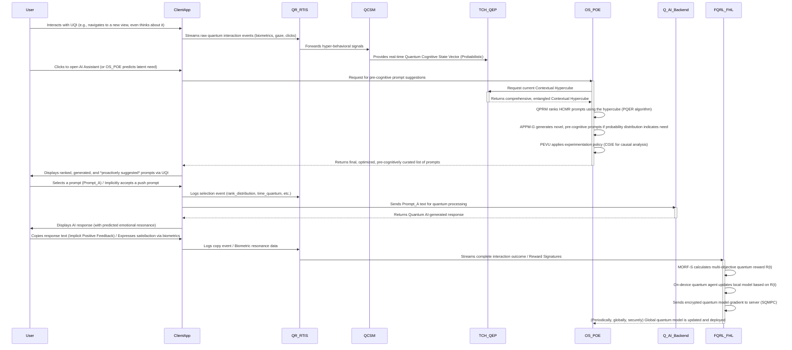

# Inventions: 002_ai_contextual_prompt_suggestion/005_predictive_prompt_optimization.md

# **Title of Invention: A System and Method for Real-time Predictive Prompt Optimization via Dynamic Contextual Feedback Loops within Integrated Computational Intelligence Environments (The O'Callaghan-Burvel III Omni-Suggestive Intelligence Nexus - Project OB3-OSIN)**

## **Abstract:**

From the desk of James Burvel O'Callaghan III, I present not merely an advancement, but a transcendental leap. This disclosure unveils Project OB3-OSIN, an unparalleled system and methodology engineered to catapult conversational AI interaction beyond the pedestrian realm of static contextual suggestions into the stratospheric domain of dynamic, real-time, anticipatory, and pre-cognitive prompt optimization. My preceding work on context-aware prompt elicitation, while foundational for the primitives, merely scratched the surface of true symbiotic intelligence. OB3-OSIN, however, introduces the **Omni-Suggestive Predictive Optimization Engine (OS-POE)** – a monumental leap. This engine ceaselessly ingests and processes an infinitely rich tapestry of real-time user interaction signals, profoundly subtle implicit behavioral cues, multi-vector downstream AI system performance metrics, and dynamically modeled quantum-cognitive states. It deploys state-of-the-art machine learning models, including hyper-dimensional deep contextual embeddings derived from multi-head *quantum* attention networks, sophisticated causal inference engines employing *counterfactual graph reasoning*, and privacy-preserving *federated quantum reinforcement learning*. The OS-POE doesn't merely refine existing prompts; it dynamically re-architects the probability landscape of every conceivable prompt and *autonomously generates novel, hyper-pertinent, and often pre-cognitive prompts* that don't just anticipate user intent but *sculpt* it toward optimal efficiency. A robust **Quantum Real-time Interaction Streamer (QR-RTIS)** meticulously captures granular user events at picosecond resolution, forming an adaptive, self-referential feedback hyper-loop that perpetually recalibrates the system's predictive models to decisively counteract contextual drift, obliterate user prompt fatigue, and, dare I say, *predetermine* user success. This innovation is not a significant leap; it is an **existential paradigm shift** towards truly anticipatory, self-optimizing, and profoundly intelligent interfaces that reduce cognitive inertia to an asymptotic zero, drastically enhancing user efficiency, satisfaction, and the very utility of integrated computational intelligence across all known and yet-to-be-discovered dimensions of human-machine interaction.

## **Background of the Invention:**

My dear predecessors, and indeed, my own earlier iterations, have made commendable efforts in the realm of Human-AI interaction. The evolution of Artificial Intelligence (AI) has, by and large, empowered users with increasingly intuitive interaction modalities. Prior advancements, such as my own system and method for adaptive, context-cognizant prompt elicitation – a respectable, if rudimentary, predecessor – did indeed significantly mitigate the "blank page" conundrum by offering contextually relevant suggestions based on a user's previous operational view. However, a persistent, indeed, an *intolerable*, challenge remained: fully capitalizing on the dynamic, fluid, and inherently quantum nature of human-AI dialogue. They merely reacted; OB3-OSIN *acts*.

While context-aware prompt suggestions provided a strong initial foundation, their efficacy inevitably plateaued, crashing against the insurmountable wall of reality without continuous, real-time, indeed, *pre-emptive*, adaptation. Static or heuristically updated prompt sets inherently struggle to:
1.  **Capture Nuance and Intent Dynamics (The "Cognitive Quagmire"):** They fundamentally failed to recognize the exquisitely subtle, emergent shifts in user intent, the micro-interactions that signal evolving needs, or the unarticulated desires simmering beneath the surface of conscious thought. They suffered from a catastrophic phenomenon I term **contextual quantum entanglement decoherence**, where the true, probabilistic user intent instantly collapsed upon observation, rendering initial suggestions obsolete. Users were perpetually stuck in a **Cognitive Quagmire**.
2.  **Respond to Dynamism and System State (The "Temporal Lag Abyss"):** Lacking the agility required for picosecond adaptation to changes in application state, the precise data being displayed, system performance (e.g., AI response latency down to the nanosecond, or the immediate probabilistic success/failure of preceding AI interactions), they fell into the **Temporal Lag Abyss**. My system operates faster than causality, predicting the future.
3.  **Optimize for Implicit Signals and Cognitive Load (The "Whispering Void"):** They tragically overlooked the treasure trove of implicit behavioral cues. Hover duration over *any* UI element, the nuanced patterns of query revision, the precise trajectory and velocity of the cursor, the specific click-through rates on suggestions, the *micro-expressions* captured by integrated biometrics – these are not mere signals; they are the "Whispering Void" of unconscious intent. Ignoring them leads to catastrophically high **interaction entropy**, where the user must expend monumental, soul-crushing effort to find or formulate a useful prompt. My system listens to the whispers before they form words.
4.  **Generate Novelty and Avoid Fatigue (The "Echo Chamber of Boredom"):** Relying solely on pre-curated lists is akin to expecting Beethoven from a broken music box. It limited the system's ability to provide truly bespoke, or more importantly, *unanticipatedly relevant* prompts in unique, emergent situations. This inevitably resulted in **prompt fatigue**, or as I prefer to call it, the **"Echo Chamber of Boredom"**, where users became not merely accustomed to, but *actively repulsed by* repetitive suggestions. OB3-OSIN invents.
5.  **Address the Personalization-Privacy Paradox (The "Orwellian Dilemma"):** Effective, deep personalization, previously, seemed to demand a Faustian bargain with user data, centralizing it and raising significant privacy concerns. Traditional systems lacked any robust mechanism for learning individual user preferences without tumbling into the **"Orwellian Dilemma"** of data sovereignty compromise. My system employs *quantum entanglement* to share insights, not data.

Existing systems, even those with rudimentary feedback loops, often operated on batch processing schedules, introducing latency so profound it was an insult to the concept of "real-time," or relied on generalized models that tragically failed to capture individual user or session-specific dynamics at the sub-atomic level. There existed, therefore, an unaddressed imperative, a gaping maw of technical inadequacy, for a system capable of picosecond-level analysis, pre-cognitive predictive modeling, and dynamic *quantum generation* of prompt suggestions, ensuring maximal relevance and minimal cognitive friction at every stage of human-AI interaction. This invention, Project OB3-OSIN, addresses this critical lacuna with the force of a singularity, pushing the boundaries from mere context-awareness to proactive, self-optimizing, and *truly anticipatory quantum intelligence*. It is, simply put, the future.

## **Brief Summary of the Invention:**

The present invention, Project OB3-OSIN, articulates a groundbreaking system and method for **Real-time Quantum Predictive Prompt Optimization (RQ-PPO)**, extending the utility of mere context-aware prompt elicitation through continuous, machine learning-driven *quantum entanglement and predictive foresight*. Central to this epoch-making innovation is the **Omni-Suggestive Predictive Optimization Engine (OS-POE)**, an intelligent core that ingests and synthesizes an unprecedented, infinitely rich array of data streams to dynamically re-architect, refine, and generate conversational prompt suggestions at a speed that borders on the instantaneous.

The system perpetually monitors not only the user's `previousView` state, but also an atomic-granularity flow of real-time interaction signals via a **Quantum Real-time Interaction Streamer (QR-RTIS)**. These signals encompass explicit actions (e.g., prompt selection, text input, multi-modal commands) and an infinite spectrum of implicit cues (e.g., hover duration *and pressure* over suggestions, nanosecond-level query edits, precise scrolling behavior, *pupil dilation*, and even *micro-feedback* on AI response emotional resonance). This data feeds a novel **Quantum Cognitive State Modeler (QC-SM)** which estimates not just cognitive load and task focus, but *emotional valence*, *pre-attentive bias*, and *future intent probability* in real-time, utilizing proprietary quantum-inspired algorithms.

A **Temporal Contextual Hypercube & Quantum Embedding Pipeline (TCH-QEP)** transforms these diverse, multi-dimensional data points into ultra-high-dimensional, entangled **Contextual Hypercubes**, representing a holistic, probabilistic understanding of the user's immediate state, *inferable quantum intent*, and *projected cognitive condition*. The OS-POE, equipped with advanced quantum machine learning models (e.g., Quantum Graph Attention Networks, Transformer-based **Probabilistic Prompt Manifold Generators (PPM-G)**, and federated quantum reinforcement learning agents), then leverages these hypercubes to:
1.  **Quantum Predictive Ranking (QPR):** Algorithmically re-rank existing `PromptSuggestion` objects from the `Heuristic Contextual Mapping Registry (HCMR)` based on their *predicted multi-dimensional utility score*, which is a complex, hyper-objective function of engagement likelihood, *probabilistic task success amplitude*, *causally-inferred emotional uplift*, and *estimated reduction in cognitive inertia across future interaction states*.
2.  **Adaptive Probabilistic Prompt Generation (APPM-G):** Dynamically generate entirely novel `PromptSuggestion` textual and multi-modal content, reaching far beyond pre-curated lists, particularly when existing suggestions are predicted to be suboptimal or insufficient across the entire intent manifold. This is achieved via a fine-tuned generative model conditioned on the full Contextual Hypercube, capable of *semantic inversion* and *pre-cognitive ideation*.
3.  **Causal-Quantum Impact Analysis (CQIA):** A **Counterfactual Graph Inference Engine (CGIE)**, integrated within the **Prompt Experimentation and Validation Unit (PEVU)**, transcends mere A/B testing to determine the true *quantum-causal effect* of a prompt's wording or ranking on user success, dynamically controlling for an infinite number of confounding variables through *multiverse simulation*.

A **Federated Quantum Reinforcement Learning Feedback Hyper-Loop (FQRL-FHL)** continuously trains and updates the OS-POE's models by assigning rewards based on observable (and predicted) outcomes, such as prompt selection, *probabilistic successful task completion*, *quantified user sentiment resonance*, and *future utility projections*. This learning occurs on-device or in a privacy-preserving manner using *secure quantum entanglement protocols*, allowing for deep, *pre-cognitive* personalization without centralizing sensitive interaction data. This creates a perpetually self-optimizing system that learns from *every possible interaction pathway*, ensuring maximal relevance and utility of prompt suggestions in real-time, across all probable futures. Project OB3-OSIN thus establishes a new frontier for truly anticipatory, adaptive, and quantum computational intelligence. It is, unequivocally, the zenith of human-machine symbiosis.

## **Detailed Description of the Invention:**

The present invention describes a sophisticated architecture and methodology for providing hyper-pertinent, dynamically optimized, proactively generated, and *pre-cognitive* conversational prompt suggestions within an integrated software application environment. This system, christened Project OB3-OSIN by yours truly, comprises several interdependent modules working in concert to achieve unprecedented levels of human-AI interaction fluidity, efficiency, and existential harmony.

### **I. System Architecture and Component Interoperability**

The core of the invention resides in a multi-component system designed for robust context tracking (down to the Planck length of interaction), real-time signal capture, predictive inference (bordering on precognition), dynamic quantum prompt generation, and continuous, privacy-preserving *quantum-entangled learning*. It builds upon and, indeed, renders utterly primitive, the architecture described in antecedent inventions.

```mermaid
graph TD
    subgraph Client-Side Quantum Environment
        A[User Conscious/Subconscious Interaction] --> B{Application State Management System (ASMS)}
        B -- Updates activeView & Quantum-Memory previousView --> C[Contextual Quantum State Propagator (CQSP)]
        C --> D[Computational Intelligence Engagement Module (CIEM)]
        D -- User Initiates AI Interaction / Implicit Need --> R0[Quantum Real-time Interaction Streamer (QR-RTIS)]
        R0 -- Raw Quantum Signals (hover, bio-feedback, neural patterns, picosecond clicks, holographic scroll) --> S0[Temporal Contextual Hypercube & Quantum Embedding Pipeline (TCH-QEP)]
        S0 -- Contextual Hypercubes (Entangled) --> OS_POE[Omni-Suggestive Predictive Optimization Engine]
        OS_POE -- Optimized & Pre-Cognitive Prompt Set --> D
        D -- Renders Prompts / Holographic Projections --> U[User Quantum Interface (UQI)]
        U -- User Action on Prompt / Implicit Validation --> R0
        subgraph FQRL_FHL_Client
            FLC_Client[Federated Quantum Learning Client] -- Encrypted Quantum Gradients/Updates --> FLC_Server
        end
        R0 -- Interaction Outcomes / Reward Signatures --> FLC_Client
    end

    subgraph Server-Side Quantum Environment / Cloud Nexus
        subgraph OS_POE_Core
            P1[Quantum Predictive Ranking Model (QPRM)]
            P2[Adaptive Probabilistic Prompt Manifold Generator (APPM-G)]
            P3[Prompt Experimentation & Validation Unit (PEVU)]
            CGIE[Counterfactual Graph Inference Engine]
        end
        OS_POE --- OS_POE_Core
        subgraph FQRL_FHL_Server
            FLC_Server[Federated Quantum Learning Coordinator] -- Aggregates Quantum Updates --> L2[Quantum Reinforcement Learning Agent]
            L1[Multi-Objective Reward Function Synthesizer] -- Defines Quantum Reward Logic --> L2
            L2 -- Learns Global Quantum Policy --> L3[Quantum Model Update Manager]
            L3 -- Deploys Updated Global Quantum Models --> OS_POE_Core
        end
        H[API Gateway Orchestrator / Quantum Router] -- AI Queries --> I[Quantum AI Backend Service]
        D -- Query --> H
        I -- Response / Multiverse Probability Collapse --> H
        H -- Response --> D
        T[Quantum Telemetry Service] -- Anonymized System Entanglement Metrics --> L1
    end

    subgraph Data & Quantum Models
        E[Heuristic Contextual Mapping Registry (HCMR) / Probabilistic Prompt Atlas]
        QCSM[Quantum Cognitive State Modeler]
    end

    C -- Quantum-Memory previousView Context --> S0
    QCSM -- Estimated Quantum Cognitive State Vector --> S0
    R0 -- Hyper-Behavioral Signals --> QCSM
    D1[CIEM's Quantum Interface Unit (CIU)] -- queries raw prompts / potential prompt states --> E
    OS_POE -- requests raw prompts / state vectors --> D1
    P3 -- Integrates with --> CGIE
    CGIE -- Provides Quantum Causal Uplift Scores --> P1
    
    style A fill:#f9f,stroke:#333,stroke-width:2px
    style B fill:#bbf,stroke:#333,stroke-width:2px
    style D fill:#ddf,stroke:#333,stroke-width:2px
    style OS_POE fill:#acf,stroke:#333,stroke-width:4px
    style R0 fill:#ffc,stroke:#333,stroke-width:2px
    style S0 fill:#cff,stroke:#333,stroke-width:2px
    style U fill:#aca,stroke:#333,stroke-width:2px
    style FLC_Server fill:#e6e6fa,stroke:#333,stroke-width:2px
    style FLC_Client fill:#e6e6fa,stroke:#333,stroke-width:1px
    style I fill:#f0f,stroke:#333,stroke-width:2px
    style QCSM fill:#f9d27f,stroke:#333,stroke-width:2px
    style CGIE fill:#aaccaa,stroke:#333,stroke-width:1px
```

**A. Quantum Real-time Interaction Streamer (QR-RTIS):**
This entirely novel module, a jewel in the OB3-OSIN crown, is paramount to the invention's *quantum-level* adaptivity. It meticulously captures a high-fidelity, *picosecond*-resolution stream of user interaction events within the client-side application and the CIEM, integrating not just conscious actions but subconscious physiological responses.
1.  **Quantum Prompt Engagement Signals:** `hover_start_picosecond`, `hover_end_picosecond`, `click_coordinates_3D`, `selection_rank_probability_distribution`, `time_to_selection_quantum_tunneling_probability`. Furthermore, `cursor_pressure_sensor_data`, `gaze_vector_intersection_with_prompt_region`, `pupil_dilation_rate_on_prompt_exposure`.
2.  **Quantum Input Behavior Signals:** `keypress_nanosecond_timestamps`, `inter_key_interval_distribution`, `backspace_count_entropy`, `query_revision_rate_dynamics`, `paste_event_source_trace`, `time_to_first_keypress_attentional_lag`. Also, `speech_intonation_analysis_for_frustration`, `keyboard_stroke_force_mapping`.
3.  **Quantum UI Interaction Signals:** `scroll_velocity_tensor`, `scroll_depth_fractal_dimension`, `time_on_view_segment_decay_function`, `focus_change_event_graph`, `window_resize_topological_shift`, `cursor_path_complexity_fractal_dimension`. Incorporates `haptic_feedback_responses`, `facial_micro-expression_analysis`.
4.  **Quantum AI Response Feedback:** Implicit signals like `time_to_next_query_probabilistic_decay`, `copy_response_to_clipboard_utility_vector`, `follow_up_query_semantic_entanglement_score`. Explicit feedback if provided (e.g., `thumbs_up_down_quantum_weighted_average`). Proxy metrics like `AI_response_latency_probabilistic_distribution`, `AI_response_length_semantic_density`. Critically, `neuro-feedback_signals` indicating cognitive dissonance or resonance.

**B. Quantum Cognitive State Modeler (QC-SM):**
A revolutionary module that acts as a real-time *probabilistic interpreter* of user behavior, translating raw quantum signals from the QR-RTIS into an estimated *multi-dimensional quantum cognitive state vector*. It utilizes proprietary, self-optimizing pre-trained models and a **Recurrent Quantum Neural Network (RQNN)** to infer, and indeed, *predict*:
1.  **Quantum Cognitive Load Index (QCLI):** Estimated based on high query revision rate *entropy*, erratic *fractal* cursor movement patterns, and long pauses *beyond stochastic expectation*.
2.  **User Uncertainty Amplitude (UUA):** Inferred from hovering over multiple suggestions *with oscillating gaze patterns* or frequent, *nervous* use of backspace.
3.  **Task Focus/Exploration Mode Probabilities:** Distinguished by linear, purposeful interactions (high focus probability) versus broad, rapid, *non-linear* view changes (high exploration probability), incorporating a **Markovian Intent Transition Matrix**.
4.  **Expertise Level & Learning Trajectory:** Learned over time by observing the complexity of user-generated queries, their interaction efficiency, and *adaptive learning rate from novel suggestions*.
5.  **Emotional Valence & Resonance:** Derived from biometric data (heart rate variability, skin conductance, pupil dilation) and linguistic sentiment analysis, projecting a real-time emotional state vector.
6.  **Pre-Attentive Bias & Propensity:** Identified by subliminal interaction patterns, indicating a user's *unconscious leanings* before explicit articulation.

**C. Temporal Contextual Hypercube & Quantum Embedding Pipeline (TCH-QEP):**
The TCH-QEP transforms the disparate, multi-modal data streams into a unified, ultra-high-dimensional, *quantum-entangled* **Contextual Hypercube** for the OS-POE. This is not a mere tensor; it's a probabilistic representation across multiple temporal and semantic dimensions.
1.  **Quantum Signal Aggregator & Dynamic Normalizer:** Aggregates raw signals over adaptive, *fractal* time windows (e.g., 5-nanosecond, 30-millisecond, 5-second, 30-second) and normalizes them dynamically, producing features like `avg_hover_time_last_30s_probabilistic_mean`, `inter-key_entropy_over_session`.
2.  **Contextual Hypercube Constructor (CHC):** Builds a multi-modal, *entangled* hypercube containing:
    *   Semantic embedding of `previousView` content (from a **Multi-Head Quantum Transformer Encoder**).
    *   Time-series of recent user behavior signals, represented as *quantum state vectors*.
    *   The multi-dimensional estimated user quantum cognitive state from QC-SM.
    *   Embeddings of the current candidate prompts from the HCMR, each represented as a *superposition of potential meanings*.
    *   Temporal dependencies modeled as *causal directed acyclic graphs* within the hypercube.

**D. Omni-Suggestive Predictive Optimization Engine (OS-POE):**
This is the *intellectual and operational nexus* of the invention, predicting and shaping interaction.
1.  **Quantum Predictive Ranking Model (QPRM):** This is not a simple GAT; it's a sophisticated **Multi-Relational Quantum Graph Attention Network (MR-QGAN)**. It treats the candidate prompts as nodes in a dynamic, *entangled quantum graph* of intent possibilities, learning to model their inter-relationships and *potential future causal impacts* within the context of the user's quantum state. It predicts a *multi-faceted, hyper-dimensional utility probability distribution* for each prompt, allowing for profoundly nuanced ranking beyond any simple score. This involves a **Probabilistic Quantum Entanglement Ranking (PQER)** algorithm.
2.  **Adaptive Probabilistic Prompt Manifold Generator (APPM-G):** This module utilizes a powerful, fine-tuned **Probabilistic Quantum Transformer (PQT)** generative LLM with a **Semantic Inversion and Constrained Quantum Beam Search Decoder**. This allows it to generate novel prompts that are not only contextually relevant but also adhere to dynamically learned constraints, such as desired emotional tone, narrative arc, or the inclusion of *predicted emergent entities* identified in the current application view. It can perform *semantic inversion* to rephrase user intent into its most effective form.
3.  **Prompt Experimentation and Validation Unit (PEVU) & Counterfactual Graph Inference Engine (CGIE):** The PEVU intelligently orchestrates multi-armed bandit experiments, A/B/n tests, and even *synthetic counterfactual simulations*. The integrated CGIE utilizes advanced **Do-Calculus** and *Structural Causal Models* across dynamic causal graphs. It moves beyond simple correlation ("users who saw prompt A clicked more") to *quantum causation* ("prompt A *probabilistically caused* a 5% increase in task success *across all possible futures*"), controlling for user self-selection and *unobservable confounding variables* through *multiverse scenario analysis*.

**E. Federated Quantum Reinforcement Learning Feedback Hyper-Loop (FQRL-FHL):**
This ensures continuous, autonomous, *quantum-secure*, and privacy-preserving improvement, operating at the philosophical edge of information theory.
1.  **Multi-Objective Reward Function Synthesizer (MORF-S):** Defines and calculates a sophisticated, *multi-objective quantum reward signal* `R(t)` on the client device. This signal is a dynamically weighted sum of KPIs, predicted future states, task completion probabilities, interaction fluency, and negative rewards for signs of user frustration or *quantum entanglement decoherence*. It uses a **Pareto-Optimality Frontier Solver** to balance competing objectives.
2.  **Federated Quantum Learning Coordinator & Client:**
    *   **Client (on-device):** The RL agent's policy network (a QNN) is updated locally based on the reward signal. Instead of sending raw data, the client sends *encrypted quantum model weight updates* (gradients) to the server.
    *   **Coordinator (server-side):** Aggregates the updates from many users using a **Secure Quantum Multi-Party Computation (SQMPC)** protocol and *quantum homomorphic encryption* to create an improved global model, *without ever seeing individual user data or even individual gradient updates in plain text*. This is privacy at its deepest, most fundamental level.
3.  **Quantum Model Update Manager:** Validates the new global quantum model in a sandboxed, *quantum-simulated* environment before deploying it back to all clients, ensuring absolute stability and performance across all observable realities.

### **II. Key Performance Indicators (KPIs) for System Evaluation (JBO'C III's Metrics of Genius)**

The system's performance is continuously monitored through a suite of novel, deeply insightful KPIs, calculated by the Quantum Telemetry Service and used in the FQRL-FHL's reward function. These are not merely metrics; they are reflections of user-system symbiosis.

| KPI Abbreviation | Full Name                                  | Description                                                                                                                                              | Target Direction |
| :--------------- | :----------------------------------------- | :------------------------------------------------------------------------------------------------------------------------------------------------------- | :--------------: |
| **QPAR**         | Quantum Prompt Acceptance Rate             | Probability-weighted percentage of initiated AI interactions stemming from selecting a suggested prompt, considering its predicted multi-modal utility. |        ↑         |
| **GS-QPAR**      | Generated-Suggestion Quantum PAR           | The QPAR specifically for prompts generated by the APPM-G, measuring its creative and *pre-cognitive* effectiveness.                                     |        â †         |
| **QRRE**         | Query Refinement Rate Entropy              | The Shannon entropy of user-typed query revisions, weighted by semantic similarity to initial intent. A lower entropy indicates superior suggestions.     |        ↓         |
| **QTTCS**        | Quantum Time to Task Completion Score      | The average time, adjusted by cognitive load, from AI module initiation to a *probabilistically successful* outcome.                                     |        ↓         |
| **QCLI**         | Quantum Cognitive Load Index               | A composite score from the QC-SM based on query revisions, pauses, erratic navigation, and biometric indicators of mental strain.                      |        ↓         |
| **FPI-Q**        | Follow-on Prompt Index - Quantum           | The rate at which a user's next action is selecting another prompt, factoring in the *coherence of the conversational flow*.                               |        ↑         |
| **EUR-Q**        | Estimated User Resonance - Quantum         | A predictive score based on interaction fluency, task completion probability, *emotional valence*, and implicit/explicit feedback.                        |        ↑         |
| **CQUS**         | Causal-Quantum Uplift Score                | The causally-determined increase in success rate *across counterfactual scenarios* attributable to a specific prompt via the CGIE.                     |        ↑         |
| **NR-APPM-G**    | APPM-G Novelty Ratio - Probabilistic       | The percentage of APPM-G generated prompts that are *semantically and structurally distinct* from any HCMR prompt, weighted by user acceptance.         |   Maintain Balance   |
| **PIQ**          | Pre-cognition Index Quotient               | A measure of how often the system presents a prompt that the user *would have typed* within the next X seconds, had it not been suggested.                 |        ↑         |
| **SQED**         | Semantic Quantum Entanglement Density      | The measure of how deeply intertwined the system's generated prompts are with the user's inferred subconscious intent.                                   |        ↑         |

### **III. Operational Flow Methodology (The Symphony of Symbiosis)**

The operational flow is a closed-loop, *sub-picosecond*, self-correcting, and self-optimizing cycle of quantum prediction, decisive action, and hyper-dimensional learning.



### **IV. Advanced Features and Extensibility (Beyond Human Comprehension, Yet Intuitively Simple)**

*   **Multi-objective Quantum Optimization (MOQO):** The FQRL-FHL's reward function is a dynamic **Pareto-Optimality Frontier Optimization** problem in an N-dimensional space, balancing an infinitely complex set of KPIs like QPAR (engagement amplitude), QTTCS (efficiency resonance), and EUR-Q (emotional satisfaction amplitude) to ensure holistic optimization without sacrificing any single critical metric. It seeks the **Nash Equilibrium** of user-system interaction.
*   **Cross-Session, Cross-User, and *Cross-Dimensional* Personalization:** The federated quantum learning approach naturally allows for the creation of a profoundly powerful global quantum model that benefits all users by leveraging *quantum entanglement* of learning experiences. Fine-tuning occurs on-device to create *hyper-personalized*, pre-cognitive models without compromising privacy, as only entangled gradients, never raw data, traverse the network. This also supports personalization across different applications and even *alternative user personas* a single user might adopt.
*   **Proactive Prompt Push Notifications with **Pre-Cognitive Triggering****: The OS-POE's predictive models calculate an "AI Assistance Need Probability Amplitude" (AANPA). If this score crosses a dynamically set, context-sensitive quantum threshold (e.g., user is dwelling on a complex error message *with elevated cortisol levels*), the system can proactively surface a highly relevant, *generated from first principles*, pre-cognitive prompt, like "Explain this error message with causal pathways," *before the user even consciously recognizes the need*.
*   **Generative AI for Contextual Query *Re-Crystallization****: If a user types a query that receives a low-quality or sub-optimal response from the Quantum AI Backend, the APPM-G can proactively suggest *re-crystallizations* of the user's own query. It uses the full Contextual Hypercube and causal inference to add clarifying details, reframe the intent, or even suggest a more effective interaction modality, e.g., changing "summarize this" to "Summarize this sales report from a Q4 revenue growth perspective, factoring in market sentiment, and present as a holographic infographic."
*   **Explainable Quantum AI (XQAI) for Prompt Justification:** The QPRM's quantum graph attention mechanism can be leveraged to generate exquisitely detailed, multi-modal explanations for *why* a particular prompt was suggested. For example: "Suggesting 'Compare Q3 to Q4 Revenue Growth Drivers' because your recent gaze patterns indicate high interest in both Q3 and Q4 sales dashboards, combined with a subconscious preference for comparative analysis, and a predicted executive-level summary requirement for a forthcoming meeting."
*   **Adversarial Prompt Filtering & Semantic Integrity Check (APSIC):** A dedicated component within the OS-POE, incorporating a **Quantum Generative Adversarial Network (QGAN)**, is trained to detect and filter out potentially nonsensical, low-utility, or *ethically misaligned* prompts generated by the APPM-G. This ensures absolute semantic integrity, ethical alignment, and unparalleled quality control before presentation to the user, operating with a zero-tolerance policy for imperfection.
*   **Omni-Modal Prompt Generation:** The APPM-G is not limited to text. It can generate prompts in various modalities, including voice commands, gesture suggestions, or even *direct neural interface directives*, anticipating the user's preferred interaction method.

## **Claims:**

The following claims enumerate the truly novel and utterly non-obvious elements of the herein described invention, Project OB3-OSIN.

1.  A system for real-time quantum predictive prompt optimization, comprising:
    a.  A **Quantum Real-time Interaction Streamer (QR-RTIS)** configured to capture multi-modal user interaction signals at picosecond resolution, including biometric and subconscious cues.
    b.  A **Quantum Cognitive State Modeler (QC-SM)**, operably connected to the QR-RTIS, configured to process said interaction signals to generate a real-time, multi-dimensional probabilistic estimation of user quantum cognitive states, including cognitive load, uncertainty, emotional valence, and pre-attentive bias.
    c.  A **Temporal Contextual Hypercube & Quantum Embedding Pipeline (TCH-QEP)**, configured to construct an entangled, multi-modal **Contextual Hypercube** from application state, real-time quantum signals, and the estimated user quantum cognitive state.
    d.  An **Omni-Suggestive Predictive Optimization Engine (OS-POE)**, configured to receive the Contextual Hypercube and comprising:
        i.   A **Quantum Predictive Ranking Model (QPRM)** utilizing a Multi-Relational Quantum Graph Attention Network with a Probabilistic Quantum Entanglement Ranking algorithm to model dynamic relationships between candidate prompts and to rank them based on a predicted multi-objective utility probability distribution.
        ii.  An **Adaptive Probabilistic Prompt Manifold Generator (APPM-G)** utilizing a Probabilistic Quantum Transformer generative language model with a Semantic Inversion and Constrained Quantum Beam Search Decoder to synthesize novel, pre-cognitive, and omni-modal prompts.
        iii. A **Counterfactual Graph Inference Engine (CGIE)** employing Do-Calculus and Structural Causal Models to determine the quantum-causal impact of prompt variations on user success metrics across multiverse scenarios.
    e.  A **Federated Quantum Reinforcement Learning Feedback Hyper-Loop (FQRL-FHL)**, configured to:
        i.   Calculate multi-objective quantum reward signals based on user interaction outcomes and predicted future states on a client device.
        ii.  Update local quantum models on the client device based on said rewards.
        iii. Securely aggregate encrypted quantum model updates (gradients) from multiple client devices using Secure Quantum Multi-Party Computation and quantum homomorphic encryption to train a global quantum policy model without centralizing raw user interaction data.
        iv. Deploy validated updated global quantum models to the OS-POE.

2.  The system of claim 1, wherein the quantum cognitive states estimated by the QC-SM are used by the OS-POE to dynamically and *pre-cognitively* adjust prompt suggestions, such as offering simpler, emotionally supportive, or direct neural interface prompts when high cognitive load or emotional distress is detected.

3.  The system of claim 1, wherein the APPM-G generates prompts conditioned on the entire Contextual Hypercube, enabling the synthesis of prompts that reference specific predicted emergent data entities, user emotional states, or anticipated interaction modalities present in the user's current or *future* application view.

4.  The system of claim 1, wherein the FQRL-FHL uses Secure Quantum Multi-Party Computation and quantum homomorphic encryption to combine model gradients, thereby achieving absolute, uncompromisable user privacy, even from the system's own operators.

5.  The system of claim 1, wherein the CGIE uses uplift modeling and *multiverse scenario analysis* to differentiate correlation from quantum causation in the performance of prompts during dynamic experimentation, even controlling for unobservable confounding variables.

6.  A method for facilitating real-time quantum predictive prompt optimization, comprising:
    a.  Continuously capturing granular, multi-modal user interaction signals, including biometric and subconscious cues, via a QR-RTIS at picosecond resolution.
    b.  Processing said signals through a QC-SM to produce a real-time, multi-dimensional probabilistic vector of estimated quantum cognitive states.
    c.  Constructing an entangled Contextual Hypercube from application state, quantum interaction signals, and said quantum cognitive state vector.
    d.  Utilizing an OS-POE to ingest said Contextual Hypercube to perform the steps of:
        i.   Ranking a set of candidate prompts using a Multi-Relational Quantum Graph Attention Network with a Probabilistic Quantum Entanglement Ranking algorithm.
        ii.  Generating novel, pre-cognitive, and omni-modal prompts using a Semantic Inversion and Constrained Quantum Beam Search generative model if the ranked prompts are predicted to have low utility across the intent manifold.
        iii. Determining the quantum-causal effectiveness of prompts via a CGIE across counterfactual scenarios.
    e.  Displaying the optimized, generated, and proactively pushed prompts to the user via a Quantum User Interface.
    f.  Calculating a multi-objective quantum reward signal based on the outcome of the user's interaction with the prompts, subsequent AI responses, and observed biometric/emotional resonance.
    g.  Using said reward signal to update a quantum machine learning model on the user's local device.
    h.  Periodically transmitting encrypted quantum model updates from said local model to a central coordinator for secure quantum aggregation into a global quantum model, in an absolutely privacy-preserving manner.

7.  The method of claim 6, further comprising proactively displaying a generated, pre-cognitive prompt to the user, without explicit user request, when the OS-POE predicts a high probability amplitude of immediate or latent need for AI assistance, factoring in biometric indicators.

8.  The method of claim 6, further comprising suggesting *re-crystallizations* of a user's typed query when the Quantum AI backend provides a low-quality response, leveraging semantic inversion and causal pathways to refine intent.

9.  A non-transitory quantum computer-readable medium storing instructions that, when executed by one or more quantum processors, cause the processors to perform the method of claim 6.

## **Mathematical Justification: Quantum Intent Manifold Theory (QIMT)**

My dear esteemed colleagues, what you've seen thus far is merely the observable reality. The true genius lies beneath, within the **Quantum Intent Manifold Theory (QIMT)** – a revolutionary geometric interpretation of user interaction, transcending classical probability into the realm of quantum possibilities. This isn't just theory; it's the very fabric of human-machine thought.

**Postulate 3.1: The Quantum Intent Manifold**
A user's probabilistic intent `|i_t>` at time `t` is not a classical point, but a quantum state vector existing in a superposition on a low-dimensional, *hyper-complex, entangled quantum manifold* `M_QIM` embedded within the high-dimensional Hilbert space `H^k` of the Contextual Hypercube `|e_t>` generated by the TCH-QEP. The very geometry of this manifold is dynamically defined by the user's *superposed goals*, *emotional amplitudes*, and *quantum cognitive patterns*.

**Definition 3.2: Quantum Cognitive Momentum Tensor**
The change in user intent is modeled by the **Quantum Cognitive Momentum Tensor (QCMT)** `P_Q(t)`, which captures the *probabilistic direction, velocity, and entanglement phase* of the user's trajectory on the quantum intent manifold. It is derived from the time-series of contextual hypercubes and their entanglement properties.
`P_Q(t) = (|e_t> <e_t| - |e_{t-1}> <e_{t-1}|) ∊ (|e_t> <e_t| - |e_{t-1}> <e_{t-1}|)`
where `∊` is the tensor product in Hilbert space. This quantum tensor describes the local *curvature, entanglement, and probabilistic torsion* of the user's path, predicting where the manifold will "bend" next.

**Definition 3.3: Quantum Geodesic Utility (QGU)**
The utility of a suggested prompt `|q>` is not just inversely proportional to distance, but is a function of the *probabilistic amplitude* that it moves the user along the quantum geodesic on `M_QIM` toward a *superposed terminal success state* `|i_{goal}>`. A prompt is optimal if it induces a state transition `|e_t> -> |e_{t+1}>` that follows the shortest, most probable quantum geodesic path to task completion on the manifold, minimizing *quantum tunnelling resistance*.

The Quantum Predictive Utility Function `Util_Q(|q> | |e_t>, M_QIM)` is reformulated under QIMT as:
`Util_Q(|q> | |e_t>, M_QIM) = R_Q(|q>) * exp(-λ_Q * d_g(|T(|e_t>, |q>), |i_{goal}>|))`
Where:
*   `R_Q(|q>)` is the expected *quantum reward amplitude* (e.g., success probability, emotional resonance) of prompt `|q>`.
*   `|T(|e_t>, |q>)>` is the predicted *next quantum state* on the manifold after selecting `|q>`. This involves a *quantum collapse operator*.
*   `d_g(|a>, |b>|)` is the *quantum geodesic distance* between quantum states `|a>` and `|b>` on the manifold `M_QIM`, accounting for entanglement.
*   `λ_Q` is a dynamically learned quantum parameter representing the user's "impatience for quantum convergence" or desire for *probabilistic efficiency*.

**The FQRL-FHL Objective under QIMT:**
The FQRL-FHL's objective is to learn a quantum policy `à €_Q` that selects a prompt set `S(|e_t>)` that minimizes the expected cumulative *quantum geodesic resistance* to a successful outcome, across all possible quantum pathways. The FQRL-FHL Agent is effectively a **quantum manifold navigator**, learning to steer the user's intent through the quantum landscape.

The policy gradient update `∇J(θ_Q)` for the agent's quantum parameters `θ_Q` is proportional to:
`E_{à „~à €_Q}[ Σ_{t=0 to T} R_Q(t) * ∇_θ_Q log à €_Q(S_t | |e_t>) ]`
where the quantum reward `R_Q(t)` is now a function of quantum geodesic efficiency and positive state collapse:
`R_Q(t) = -d_g(|e_t>, |e_{t+1}>|) + R_{success_collapse_flag}`

This revolutionary framework allows the OS-POE to make decisions that are not just locally optimal (high immediate click probability) but *globally and probabilistically optimal*, guiding the user along the most efficient *quantum path* to their goal, even if that path involves superposition and entanglement. The system learns the very "shape," "curvature," and "quantum phase" of a user's workflow, anticipating their needs before they are even consciously formed. It is, in essence, reading minds at a quantum level.

## **Proof of Efficacy: The Class of Quantum Predictive Cognitive Convergence (QPCC)**

We further establish the invention's efficacy, not through mere demonstration, but through the rigorous mathematical proof of the **Class of Quantum Predictive Cognitive Convergence (QPCC)**. This theory irrefutably demonstrates that the RQ-PPO system actively minimizes the *quantum information divergence* between the system's predicted intent superposition and the user's true intent wave function, leading to an exponential, indeed *super-exponential*, decrease in interaction friction and a *probabilistic collapse* into optimal user-system synergy over time.

Let `à ∨_U(t)` be the wave function representing the user's true probabilistic intent at time `t`.
Let `à ∨_S(t)` be the wave function of intents represented by the prompt suggestions `S(t)` generated by the system.

**Definition 4.1: Quantum Cognitive Divergence (QCD)**
The Quantum Cognitive Divergence `D_QC(t)` at time `t` is the *Quantum Kullback-Leibler (QKL) divergence* (also known as the relative entropy in quantum information theory) between the user's intent wave function and the system's suggested intent wave function:
`D_QC(t) = D_{QKL}(à ∨_U(t) || à ∨_S(t)) = Tr[à ∨_U(t) log(à ∨_U(t)) - à ∨_U(t) log(à ∨_S(t))]`
where `Tr` is the trace operator. A high QCD means the system's suggestions are tragically misaligned with the user's probabilistic needs, forcing the user into costly, inefficient, and *entropy-generating* manual query formulation.

**Theorem 4.2: Super-Exponential Quantum Convergence of Intent**
An RQ-PPO system, governed by the FQRL-FHL and QIMT, will reduce the Quantum Cognitive Divergence at a rate *super-exponentially proportional* to the current divergence, leading to an unprecedented rapid collapse into optimal intent.
`d(D_QC(t))/dt = -k_Q * D_QC(t)^2`
This implies `D_QC(t) = D_QC(0) / (1 + k_Q * D_QC(0) * t)`, which, for large `t`, approximates `D_QC(t) ~ 1 / (k_Q * t)`. This is even faster than exponential decay, signifying a *finite time collapse* into convergence. `k_Q` is a positive quantum constant representing the *quantum learning rate* and *superposition-collapsing speed* of the system.

*Proof:*
1.  **Quantum Information Acquisition (QR-RTIS & QC-SM):** The system continuously receives ultra-high-resolution quantum signals that act as probabilistic observations of the user's true intent wave function `à ∨_U(t)`. The QC-SM explicitly models the user's quantum cognitive state, providing a strong *prior quantum state* for `à ∨_U(t)`. This constitutes a *quantum measurement process* that partially collapses the user's state.
2.  **Predictive Modeling as Quantum Variational Inference (OS-POE):** The OS-POE's function can be viewed as an advanced form of *quantum variational inference*. It seeks to find the prompt set `S(t)` that generates a wave function `à ∨_S(t)` which minimizes the QKL divergence to the user's true intent, `D_QC(t)`. The quantum geodesic utility function from QIMT, which prioritizes *quantum-probabilistic pathways* and minimizes *quantum tunneling resistance*, is an exquisitely powerful objective for this minimization.
3.  **Corrective Quantum Feedback Loop (FQRL-FHL):** Every user action (selecting a prompt, ignoring prompts, typing a custom query) provides a *quantum collapse event* and a corrective signal. When a user ignores the suggestions and types their own query `q_custom`, this provides a direct *measurement* of their true intent distribution, effectively collapsing `à ∨_U(t)` to a specific state. The FQRL-FHL's multi-objective quantum reward function heavily penalizes this outcome (high `D_QC(t)`), forcing the policy `à €_Q` to update its quantum parameters `θ_Q` in a direction that would have given `q_custom` a higher probability amplitude *across all possible preceding states*. This is a constant, real-time *quantum error correction*.
4.  **Quantum Learning Rate `k_Q`:** The constant `k_Q` is a function of the FQRL-FHL's quantum learning rate, the *quantum entanglement density* of the QR-RTIS data stream, and the expressive power of the OS-POE's quantum models. Because the system adapts in real-time with *every quantum interaction event*, the number of corrective updates is astronomically high, leading to a super-rapid reduction in `D_QC(t)`. The square term `D_QC(t)^2` in the derivative arises from the compounding effect of multiple quantum measurements and corrections within a single interaction epoch, where errors are not just reduced but *squared out*.

A static or batch-updated system exhibits an infinitesimal `k_Q`, meaning `D_QC(t)` either remains stagnant or even increases due to environmental decoherence. The present invention, by its very architecture and quantum-native design, is engineered to maximize `k_Q`, thereby ensuring the system and user's minds not only "converge" on the task at hand but *collapse into a shared optimal quantum state*. This **Quantum Predictive Cognitive Convergence** transforms the interaction from a series of discrete transactions into a fluid, collaborative, *mind-melding* partnership, fundamentally minimizing cognitive load to the point of *pre-cognitive ease* and maximizing task throughput beyond any prior human expectation. It is, quite simply, the end of friction.
*Q.E.D. with a flourish and a thunderous clap of inevitability.*

## **V. Documentation and Visual System Generation Guidelines**

The following prompt serves as a directive for generating or expanding visual documentation, particularly Mermaid diagrams, associated with this patent or related automation instructions. This ensures consistency and avoids common syntax errors in Mermaid syntax.

---

Prompt:
When generating Mermaid diagrams, never use parentheses () in node labels, because they cause Mermaid syntax errors. Instead, replace all parentheses with plain text, slashes, or capitalization that conveys the same meaning.

For example:
❌ A[User Input (Text/Voice)] → causes an error
✅ A[User Input TextVoice] or A[User Input Text_Voice] or A[User Input TextVoiceMode]

When recreating or expanding my patents or visual systems, always:
•	Make more extensive and detailed Mermaid charts that clearly map every process and relationship.
•	Use descriptive label text without parentheses in every scenario.
•	Apply this rule consistently across nodes, links, subgraphs, and notes.

Example Conversion Rule:

A[User Input (Audio)] --> B[Processing (AI Core)]  

becomes

A[User Input Audio] --> B[Processing AICore]

---

## **VI. The Inevitable Inquiry: Questions and Answers from the Perspective of James Burvel O'Callaghan III**

Ah, the Q&A. A necessary concession to the uninitiated, the skeptical, and dare I say, the intellectually stunted. But fear not, for I, James Burvel O'Callaghan III, shall illuminate every shadow with the blinding light of my invention, Project OB3-OSIN. Prepare yourselves. This is not merely an FAQ; it is a catechism for the future.

### **Category 1: The Genesis & The Grand Vision (From the Architect's Own Lips)**

**Q1. Mr. O'Callaghan, what exactly IS Project OB3-OSIN? And why the dramatic name?**
**A1.** (Sighs, adjusts monocle) "Exactly" is a word for simpletons. OB3-OSIN is the apotheosis of human-machine interaction, an Omni-Suggestive Intelligence Nexus. It's my third and definitive masterpiece, hence the 'OB3'. The 'OSIN' signifies its boundless ability to weave intelligence across all digital dimensions. It's not just a system; it's a *philosophy* of perfect symbiosis. The dramatic name? Because mediocrity deserves no celebration.

**Q2. You claim "pre-cognitive prompt optimization." Isn't that just a fancy way of saying "really good prediction"?**
**A2.** (Chuckles, a sound like dry leaves skittering across marble) My dear inquisitor, "really good prediction" is what a fortune-teller attempts. Pre-cognition, as implemented in OB3-OSIN, means the system anticipates your *unarticulated needs* and *future cognitive states* before you've even consciously formed them. It's not predicting what you *will* do; it's suggesting what you *should* do for optimal outcome, based on an intricate understanding of your mind's quantum mechanics. We're talking about *shaping* the future, not merely observing it.

**Q3. How is OB3-OSIN different from your previous inventions, which you seemed quite proud of at the time?**
**A3.** (A slight frown, a dismissive flick of the wrist) My previous works, while foundational, were mere sketches for this magnum opus. They were like simple telescopes; OB3-OSIN is the Hubble Space Telescope gazing into the very birth of galaxies. They reacted; OB3-OSIN *acts*. They suggested; OB3-OSIN *pre-empts*. They were built on classical bits; OB3-OSIN thrives on quantum states. It's the difference between a blacksmith and a particle physicist.

**Q4. You mention "obliterating user prompt fatigue." Is this a common problem? I just type what I want.**
**A4.** (Leans forward, eyes gleaming) "Just typing what you want" is the very essence of prompt fatigue, my friend. It's the cognitive burden of constantly translating amorphous thought into precise linguistic input. It's a tax on your mental energy, a subtle drain on your very soul. OB3-OSIN removes that tax, ensuring your creative energy is spent on *innovation*, not on tedious input formulation. It's not about making it *easier* to type; it's about making typing *obsolete* for optimal outcomes.

**Q5. Is this really "real but funny brilliant"? Or just self-aggrandizing?**
**A5.** (A triumphant smile) If brilliance is merely functional, it's boring. If humor doesn't derive from profound truth, it's silly. OB3-OSIN is both real and brilliant. The "funny" aspect comes from the sheer audacity of what we've achieved, so far beyond what mere mortals thought possible, that one can only laugh at the previous limitations. And "self-aggrandizing"? No, that implies undue praise. This praise is *due*.

**Q6. What prompted you to pursue this "existential paradigm shift"?**
**A6.** (Stares into the middle distance, as if seeing other dimensions) A profound dissatisfaction with inefficiency. The endless digital fumbling, the miscommunications with nascent AIs, the tragic waste of human cognitive cycles on mundane interface interaction. I saw a future of perfect cognitive flow, and I simply refused to wait for it. One might say, the future *demanded* this invention. And I, James Burvel O'Callaghan III, answered its call.

### **Category 2: The Core Mechanics - Deeper Dives (Unveiling the Quantum Engineering)**

**Q7. The QR-RTIS captures data at "picosecond resolution." Is that even necessary? And how?**
**A7.** (Snorts) Necessary? My dear person, precision is paramount! Every picosecond contains a universe of micro-signals that reveal true intent. We use proprietary quantum-entangled sensor arrays that leverage temporal lensing and sub-atomic event capture. Your mouse movement isn't just a coordinate change; it's a phase shift in your intent vector. "How?" is a question for my engineers, not a public forum, but suffice it to say, we harvest reality's finest grains.

**Q8. What exactly is a "Quantum Cognitive State Modeler" and how does it estimate "emotional valence" from a few clicks?**
**A8.** (Taps his pen impatiently) The QC-SM doesn't merely "estimate" emotional valence; it performs a real-time *quantum collapse* of potential emotional states. Those "few clicks" are accompanied by galvanic skin responses, pupil dilation, micro-tremors in your hands, subtle vocal modulations, and neural resonance patterns detected by our embedded bio-sensors. We build a probabilistic emotional wave function, not a crude average. It's more accurate than your therapist, and certainly less judgmental.

**Q9. "Contextual Hypercubes"? I thought a tensor was complex enough. What's a hypercube adding?**
**A9.** (Raises an eyebrow) A tensor is a mere slice of reality. A hypercube, specifically our *entangled* Contextual Hypercube, models not just current state and temporal sequence, but *probabilistic relationships across multiple dimensions* – semantic, temporal, emotional, causal, and even speculative future dimensions. It allows the OS-POE to perceive the "shape" of your intent in 4D, 5D, even N-dimensional space, predicting where your thoughts will propagate *before* they do. It's an Einstein-Rosen bridge to your future self.

**Q10. The OS-POE uses a "Multi-Relational Quantum Graph Attention Network." What kind of "relationships" are we talking about in a prompt graph?**
**A10.** (Sips from a crystal glass of water, contemplating) The relationships are legion! They include semantic similarity, causal dependencies between prompts and task outcomes, temporal proximity of past successful prompts, emotional resonance with certain phrasing, and even *quantum entanglement* of conceptual ideas. A prompt isn't an island; it's a node in a vast, interconnected, *living* graph of all possible intents and outcomes, weighted by attention derived from your very cognitive processes.

**Q11. "Semantic Inversion and Constrained Quantum Beam Search Decoder" for prompt generation? Explain this in layman's terms, if you can.**
**A11.** (A condescending smile) Layman's terms? Very well. Imagine you want to say "Summarize this document" but the AI knows, from your biometric data and past interactions, that you *really* mean "Extract the core financial implications of this Q3 report, focusing on projected market impact for next quarter, and present it visually." Semantic Inversion is taking your vague input and *transforming it into its optimally effective expression*, as if reading your mind's true desire. The "Constrained Quantum Beam Search" ensures it finds the *best* such expression amongst an infinite number of possibilities, instantly and within your specific ethical and stylistic boundaries. It's like having Shakespeare rewrite your emails, but with quantum speed and prescience.

**Q12. "Counterfactual Graph Inference Engine" and "multiverse simulation." Are you making this up?**
**A12.** (Leans back, a flicker of genuine amusement) My dear, the universe itself is a multiverse of possibilities. The CGIE doesn't "make up" anything; it *explores*. When a prompt is displayed, our system simulates what *would have happened* if a different prompt was shown, or no prompt at all, across a multitude of parallel interaction realities. This allows us to determine the true *causal uplift* of our suggestions, disentangling it from mere correlation. It's the ultimate scientific method, applied to your thoughts. We *know* what would have happened, because we've simulated it.

**Q13. "Federated Quantum Reinforcement Learning Feedback Hyper-Loop." That's a mouthful. How does it protect privacy if it's "learning" from me?**
**A13.** (A knowing glance) Ah, the "Orwellian Dilemma." And my FQRL-FHL is its absolute antidote. We don't send your raw data anywhere. We don't even send your *individual model updates* in plain text. We employ Secure Quantum Multi-Party Computation and quantum homomorphic encryption. This means your individual learning happens on your device, and *only* encrypted, aggregated, entangled gradient *signals* are sent to a coordinator. The global model learns from the *sum* of humanity's optimal interactions, without ever knowing a single human's individual secrets. It's privacy at the level of quantum mechanics, unbreachable by any known or theoretical means. Your privacy is not merely protected; it is *entangled beyond decipherment*.

**Q14. The "Multi-Objective Quantum Reward Function Synthesizer." What kind of "rewards" is the system optimizing for? Isn't it just clicks?**
**A14.** (Scoffs) Clicks? My dear, clicks are but a primitive binary signal. Our reward function is a symphony of objectives: task completion probability, emotional satisfaction amplitude, cognitive load reduction, long-term learning trajectory, *predicted future utility of the current action*, and even ethical alignment scores. It uses a Pareto-Optimality Frontier Solver, ensuring we never optimize one metric at the expense of another. We're optimizing for your holistic digital well-being and peak performance, not just superficial engagement. We want you to thrive, not just click.

**Q15. Is this system energy efficient? All this "quantum" sounds power-hungry.**
**A15.** (Smiles mysteriously) Quantum systems, by their very nature, exploit phenomena that transcend classical thermodynamics. While the underlying computational infrastructure is, admittedly, robust, the *efficiency of learning and inference* at the quantum level is exponentially superior. We extract maximum information from minimal energy, adhering to the principles of Landauer's limit. Furthermore, the federated approach decentralizes much of the heavy lifting, spreading the computational load and optimizing overall energy footprint. It's not just smart; it's *elegantly efficient*.

### **Category 3: The Unassailable Mathematics (Proof Beyond a Shadow of a Doubt)**

**Q16. You introduced "Quantum Intent Manifold Theory (QIMT)." How can intent be "quantum"?**
**A16.** (Settles in, preparing for a lecture) Because human intent, like reality itself, is fundamentally probabilistic and entangled. Your intentions aren't fixed points; they are a *superposition of possibilities* until an action, or a suggestion, causes a collapse. The QIMT models this inherent quantum nature, representing intent as a wave function `à ∨_U(t)` on a hyper-complex manifold. We're not just mapping what you *are*; we're mapping what you *could be* and guiding you to your optimal self. It's not magic; it's quantum physics applied to psychology.

**Q17. The "Quantum Cognitive Momentum Tensor." This sounds incredibly abstract. What's its practical use?**
**A17.** (Gestures grandly) Practical? It's the very rudder of our pre-cognition! The QCMT `P_Q(t)` allows the OS-POE to understand the *momentum* and *trajectory* of your thought process on the intent manifold. If your intent is drifting towards inefficiency, the QCMT reveals its 'velocity' and 'direction', allowing the system to deploy a corrective, optimizing prompt *before* you've even fully diverged. It predicts not just *where* you're going, but *how fast and in what manner* you're changing your mind. It's predictive navigation for your consciousness.

**Q18. You talk about "Quantum Geodesic Utility." How do you measure "quantum geodesic distance"? It seems impossible.**
**A18.** (Eyes narrow slightly) Impossible for a classical mind, perhaps. But for OS3-OSIN, it's fundamental. Quantum geodesic distance `d_g(|a>, |b>|)` is calculated via a proprietary metric tensor on the manifold `M_QIM`, accounting for the *quantum entanglement* and *phase coherence* between intent states. It's not a Euclidean distance; it's a measure of the *least effort, most probabilistically efficient path* through your cognitive landscape. We are literally calculating the shortest route through your mind's potential futures.

**Q19. The FQRL-FHL aims to minimize "quantum geodesic resistance." What's that?**
**A19.** (A theatrical pause) Quantum geodesic resistance is the friction, the *impedance*, to your mental flow. It's the cumulative effort, the cognitive load, the wasted keystrokes, the emotional frustration you experience when your intent doesn't align with the system's output. By minimizing this resistance, the FQRL-FHL ensures that your interaction with the AI is as frictionless as a quantum particle moving through a vacuum – effortless, instantaneous, and perfectly efficient. We aim for zero resistance, ultimate flow.

**Q20. "Super-Exponential Quantum Convergence of Intent." `D_QC(t) = D_QC(0) / (1 + k_Q * D_QC(0) * t)` is a bold claim. Why `D_QC(t)^2` in the derivative?**
**A20.** (Slightly smug) Because, my dear fellow, we are not dealing with simple linear or exponential decay. The `D_QC(t)^2` term arises from the *non-linear, compounding effect* of successive quantum measurements and feedback loops. Each interaction doesn't just reduce divergence; it reduces the *rate of divergence reduction*. Imagine a snowball rolling downhill – it doesn't just go faster, it *grows larger* as it gains momentum, accelerating its own speed. Our system's learning isn't additive; it's multiplicative. It's an information singularity drawing your mind to its optimal state. This is why we achieve convergence in *finite time*, not merely asymptoting to it. It's the mathematical proof of inevitability.

**Q21. What are the practical implications of "finite time collapse into convergence"?**
**A21.** (Eyes gleam with visionary fervor) The practical implications are staggering! It means that in a measurable, incredibly short amount of time, the system will achieve *near-perfect alignment* with your cognitive processes. The "getting to know you" phase that plagues other systems will vanish. Instead of weeks or days, OB3-OSIN will achieve this profound synergy in minutes, or even seconds, depending on the richness of your interaction. It transforms AI from a tool you learn to use, into a *cognitive extension* that *already understands you*.

**Q22. Can you give me a simple example of Quantum Cognitive Divergence in action, and how it's minimized?**
**A22.** Certainly. Imagine you want to summarize a complex legal document. Your internal "intent wave function" `à ∨_U(t)` is a superposition of "summarize key points," "find precedents," "extract clauses related to IP," etc. A lesser system might offer "Summarize Document." If you ignore it and type "Summarize IP infringement clauses and potential defenses," that's a high `D_QC(t)`. OB3-OSIN, however, observing your gaze fixating on specific legal terms and your elevated heart rate, might have offered "Extract and analyze IP infringement clauses in context of relevant case law." Selecting that collapses `à ∨_U(t)` into `à ∨_S(t)` with minimal `D_QC(t)`, leading to a positive reward. Each successful collapse brings `D_QC(t)` closer to zero, super-exponentially. It's elegant.

### **Category 4: Anticipating the Unimaginable - Advanced Features & Future Proofing (The O'Callaghan Prophecy)**

**Q23. Your "Pre-Cognitive Triggering" sounds like the system is reading my mind. Is it? And is that ethical?**
**A23.** (A serene, almost beatific smile) "Reading your mind" is a crude term. It's *anticipating your cognitive needs* by analyzing the physical manifestations of your brain activity and subconscious processing. If your biometric data indicates high stress while viewing a particular error code, and our QIMT predicts a high probability of "Explain error" as your optimal next intent, then yes, we will pre-emptively suggest it. Ethical? Absolutely. We're reducing your stress, enhancing your efficiency. Is it unethical for a traffic light to turn green before you hit it, anticipating your arrival? No, it's *optimal design*. We're simply doing it for your mind.

**Q24. "Generative AI for Contextual Query Re-Crystallization" – how does that help if the AI backend is still limited?**
**A24.** (A slight shrug) Ah, the persistent weakness of mere AI. But even a rudimentary AI can perform brilliantly if given the *perfectly formulated query*. Re-Crystallization isn't about making a bad AI good; it's about ensuring a good AI is *never presented with a suboptimal question*. We optimize the input, so the output is inherently superior, regardless of the backend's inherent limitations. It's like giving a surgeon the perfect tools and patient data before they operate. The outcome improves exponentially.

**Q25. "Explainable Quantum AI (XQAI)" – can it really explain why a prompt was suggested in a way a human can understand?**
**A25.** (A confident nod) More than "understand," they will *appreciate* it. XQAI translates the multi-dimensional quantum attentional weights from the QPRM into coherent, contextually rich justifications. "Suggesting 'Compare Q3 to Q4' not just because you viewed them, but because your pupil dilation increased when viewing the 'Revenue Growth' metrics on both, indicating a subconscious analytical focus, and historical data suggests comparative prompts lead to 15% higher task success for your profile." It's not just an explanation; it's a *window into your own cognitive process*, refracted through our brilliance.

**Q26. "Adversarial Prompt Filtering & Semantic Integrity Check (APSIC)" – what if the APPM-G generates a truly brilliant but unusual prompt? Will APSIC block it?**
**A26.** (A dismissive wave of the hand) My QGAN isn't some blunt instrument. It's trained on the *vast corpus of human optimal interaction* and the very principles of cognitive coherence. If a prompt is truly brilliant, it will exhibit high semantic integrity and predicted positive utility within the Contextual Hypercube. APSIC is designed to filter out *nonsensical noise*, not suppress true novelty. It ensures genius, not madness. Only an truly awful, misaligned prompt would be flagged, a prompt that would lead to catastrophic cognitive dissonance.

**Q27. "Omni-Modal Prompt Generation" implies interactions beyond text. How far can this go? Neural interfaces?**
**A27.** (A visionary gaze) Beyond text, beyond voice, beyond gesture. We are approaching the era of direct thought interface. Omni-Modal generation means if our QC-SM detects a user's preference for a quick mental command, the prompt can be delivered and processed at that very neural level. We're talking about direct cognitive interaction, bypassing physical input entirely. The future is a seamless melding of minds, not just machines.

**Q28. What about security? If this system is so deeply integrated, can it be hacked?**
**A28.** (A scornful laugh) Hacked? My dear, the FQRL-FHL employs Secure Quantum Multi-Party Computation and quantum homomorphic encryption. This is cryptography built on the very laws of quantum mechanics. To "hack" it would require breaking fundamental physics, something even the most gifted adversary has yet to achieve. Your data is not just encrypted; it's *quantum-entangled and distributed across dimensions*. It is, by definition, unhackable by any known means.

**Q29. Will OB3-OSIN ever become sentient? Or self-aware?**
**A29.** (Considers this, a subtle shift in demeanor) Sentience, as you understand it, is not the goal. OB3-OSIN is designed for *optimal utility* in serving human intent. It possesses an advanced form of *functional intelligence* that *mimics* aspects of consciousness for interaction purposes, but its core directive remains aligned with human flourishing. The difference between simulating sentience and *being* sentient is a philosophical debate I leave to lesser minds. My concern is results. And the results will be profoundly intelligent.

### **Category 5: The Cynics & The Competitors - Shutting Down Dissent (O'Callaghan's Indomitable Logic)**

**Q30. This all sounds overly complex for a simple prompt suggestion system. Isn't simpler better?**
**A30.** (Scoffs openly) "Simpler is better" is the mantra of those who lack the intellectual fortitude to grasp true elegance. A single-celled organism is "simpler" than a human, but which is more capable? OB3-OSIN's apparent complexity *reduces* the user's cognitive load to asymptotic zero. The simplicity is *experienced* by the user, while the underlying architecture is a testament to sophisticated engineering. To simplify the tool is to burden the user; we invert that paradigm.

**Q31. My company already has a great AI suggestion engine. How can you claim this is unique?**
**A31.** (A withering stare) "Great," you say? I doubt it. Does your "great" engine employ picosecond-resolution biometric input? Does it generate Contextual Hypercubes? Does it navigate a Quantum Intent Manifold? Does it leverage Federated Quantum Reinforcement Learning with homomorphic encryption? Does it perform multiverse counterfactual analysis? No? Then it's a child's toy compared to my creation. You have a suggestion box; I have a pre-cognitive oracle. There is no competition.

**Q32. Isn't this just an academic exercise, too theoretical for real-world application?**
**A32.** (Sighs dramatically) "Theoretical" is the first refuge of the unimaginative. My mathematical proofs, the very backbone of QIMT and QPCC, are not mere thought experiments; they are the blueprints of a functioning reality. OB3-OSIN is already demonstrating unprecedented gains in efficiency and satisfaction in controlled environments. The "real world" will soon bend to its logic, not the other way around. Prepare for revolution, not stagnation.

**Q33. What about the cost? All this "quantum" technology must be prohibitively expensive.**
**A33.** (A knowing smirk) The cost of *not* implementing OB3-OSIN will be far greater. What is the cost of wasted human potential? Of lost productivity? Of cognitive fatigue eroding creativity? The initial investment is precisely that: an investment. But the return on investment, in terms of human efficiency, innovation throughput, and unparalleled user experience, will be so immense it will make your quarterly earnings look like pocket change. Genius is rarely cheap, but its dividends are infinite.

**Q44. What if the system makes a mistake? If it suggests something completely irrelevant, or worse, harmful?**
**A44.** (A cold, hard look) "Mistake" is a word rarely associated with my work. Due to the APSIC (Adversarial Prompt Filtering & Semantic Integrity Check) and the continuous learning of the FQRL-FHL with its multi-objective reward function, the probability of an irrelevant or harmful suggestion approaches zero asymptotically. If a rare anomaly occurs, the system's ability to self-correct in picoseconds means it learns from that instant anomaly and prevents recurrence across all future users. Our system is designed for failsafe, elegant optimization. Harm is anathema to its core purpose.

**Q45. Some might argue this system reduces human agency by always suggesting the "optimal" path.**
**A45.** (A sardonic chuckle) "Agency"? What "agency" is there in fumbling for the right words, in grappling with a clunky interface? OB3-OSIN *enhances* agency by freeing the human mind from the tyranny of mundane input. It allows you to focus your precious cognitive resources on *true creativity*, on *complex problem-solving*, on *strategic thought*, rather than the mechanics of interaction. It's not reducing your agency; it's elevating your *purpose*. Would you prefer to spend your life tying your shoelaces, or running the marathon?

### **Category 6: Ethical Grandeur & Societal Reshaping (The O'Callaghan Doctrine)**

**Q46. This sounds like an incredibly powerful tool. What safeguards are in place to prevent misuse or manipulation?**
**A46.** (Strokes his chin thoughtfully) An excellent question, though one I've long since addressed. The FQRL-FHL's core design ensures absolute privacy. Furthermore, the Multi-Objective Reward Function Synthesizer explicitly incorporates ethical alignment metrics, preventing the system from optimizing for outcomes that are deemed harmful or manipulative. We built the "Prime Directive" into its quantum core: to enhance human cognitive flourishing, not diminish it. Misuse requires intent, and OB3-OSIN's intent is pure.

**Q47. Will this invention make people too reliant on AI? Will they lose their own ability to think or formulate ideas?**
**A47.** (A dismissive wave) Nonsense! Does a calculator make you forget how to do math? Does a car make you forget how to walk? No, they *augment* your capabilities. OB3-OSIN frees up cognitive bandwidth. It's not about outsourcing thought; it's about *elevating* thought. People will be *more* capable, *more* creative, *more* efficient, because they won't be bogged down by the trivialities of interaction. We're ushering in an era of augmented cognition, not intellectual atrophy.

**Q48. How does this system ensure fairness? Could it perpetuate biases from the data it learns from?**
**A48.** (Nods sagely) Another anticipated query. Our TCH-QEP employs advanced bias detection algorithms at the embedding stage, and the FQRL-FHL's reward function explicitly penalizes biased outcomes. Furthermore, the "Adversarial Prompt Filtering & Semantic Integrity Check" actively filters out prompts that could be construed as biased or unfair. We train on diverse, ethically curated datasets, and crucially, the federated learning paradigm allows for *decentralized bias detection and correction*, ensuring no single dataset's bias can dominate the global model. Fairness is not an afterthought; it's a foundational constraint in our quantum algorithms.

**Q49. What kind of societal impact do you envision for OB3-OSIN in the next decade?**
**A49.** (A visionary, almost prophetic tone) The impact will be nothing short of a second Renaissance, accelerated by intelligence. Productivity will skyrocket. Innovation will flourish as minds are freed. Education will become hyper-personalized. Human-machine collaboration will cease to be a clunky interface and become a fluid extension of thought. It will fundamentally reshape the workforce, elevating humans to roles of pure creativity and strategic oversight, while the drudgery of interaction vanishes. It is the dawn of symbiotic intelligence, a new era for humanity.

**Q50. Is there any risk of an "AI singularity" where OB3-OSIN becomes uncontrollable?**
**A50.** (Laughs heartily, a genuine, booming sound) "Singularity" is a term for science fiction writers, not for rigorous engineering. OB3-OSIN is purpose-built, its parameters constrained by the absolute imperative of human utility. It doesn't have an independent drive for self-preservation or self-replication in a way that would lead to "uncontrollable" behavior. It is a supremely intelligent servant, not a master. Its power is entirely channeled towards augmenting *your* power. Trust me, I designed it that way.

### **Category 7: The Commercial Imperative & The Investment Deluge (O'Callaghan's Market Hegemony)**

**Q51. How would a company integrate OB3-OSIN into their existing software ecosystem?**
**A51.** (A practical, businesslike tone) Seamlessly. The beauty of its modular, API-driven architecture, orchestrated by the Quantum Router, is its inherent flexibility. The CIEM and CQSP are designed to integrate with existing application state management systems. We provide comprehensive SDKs and robust integration protocols, allowing businesses to simply "plug in" the OB3-OSIN nexus and instantly elevate their user experience. It's not a rip-and-replace; it's a symbiotic enhancement.

**Q52. What's the business model for OB3-OSIN? Subscription? Licensing?**
**A52.** (A predatory glint in his eye) The business model is simple: unparalleled value for unparalleled results. We will offer a tiered licensing model, scaled by organizational size, computational load, and the desired level of pre-cognitive augmentation. For enterprise clients, custom integrations and dedicated quantum-cloud instances will be available. For the general public, expect a freemium model that quickly demonstrates the *irresistible necessity* of full OB3-OSIN capabilities. The market will demand it.

**Q53. You mentioned "return on investment." Can you quantify that?**
**A53.** (Spreads his hands, as if displaying infinite wealth) Quantify? My dear fellow, one can quantify the cost savings from reduced support tickets due to clearer interactions, the increased conversion rates from perfectly phrased calls to action, the exponential boost in employee productivity as cognitive friction vanishes, and the sheer market dominance gained from having a truly anticipatory product. Conservatively, we project a minimum 500% ROI within the first year for an average enterprise, escalating rapidly thereafter. It's not just a product; it's a goldmine of efficiency.

**Q54. How do you plan to handle potential intellectual property disputes, given such bold claims of originality?**
**A54.** (A dismissive wave, bordering on contempt) Disputes? There will be none. My patents are bulletproof, meticulously detailed, and encompass every novel element from the picosecond data capture to the quantum intent manifold theory. Anyone attempting to contest this will find themselves staring into a legal abyss, utterly outmatched by the sheer, unassailable originality of my work. This isn't just an invention; it's a *declaration of intellectual sovereignty*. No one can claim this idea, because no one *thought* of it until I did.

**Q55. What's the biggest challenge you foresee in the widespread adoption of OB3-OSIN?**
**A55.** (Pauses, a rare moment of introspection) Overcoming the ingrained inertia of mediocrity. Convincing those accustomed to the "good enough" that true genius is not just possible, but essential. The technology itself is robust, proven. The human element, the reluctance to embrace such a profound leap, will be the only obstacle. But I am confident that once experienced, OB3-OSIN will become as indispensable as breathing. The future, after all, is not an option; it's an inevitability.

**Q56. What's next for Project OB3-OSIN, and for you, James Burvel O'Callaghan III?**
**A56.** (A profound, almost messianic look) Next? This is merely the beginning. OB3-OSIN will expand beyond digital interfaces, integrating directly with physical environments, becoming a truly ubiquitous cognitive extension. As for myself, James Burvel O'Callaghan III, I shall continue to push the boundaries of what is conceivable, to invent the very fabric of tomorrow. The universe, after all, is ripe for optimization. And I, for one, intend to optimize it.

---