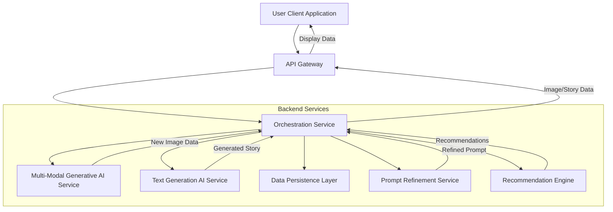
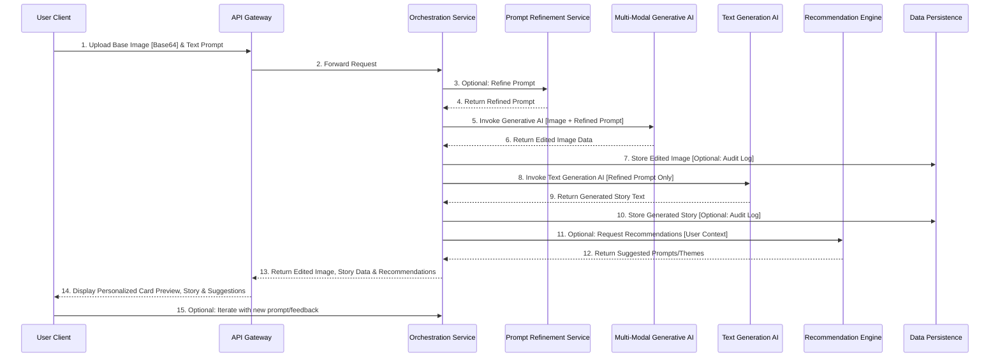

**Title of Invention:** A Comprehensive System and Method for Algorithmic Narrative-Driven Generative Visual Transmutation and Semantic Cohesion for Digital Financial Instrument Personalization

**Abstract:**
A sophisticated computational framework is disclosed for the algorithmic personalization of visual representations pertaining to financial instruments, such as credit or debit cards, digital wallets, or virtual payment interfaces. The present invention posits a novel architecture wherein a user furnishes a baseline visual artifact and articulates a desired narrative or thematic modification via a natural language textual prompt. This system synergistically integrates the baseline visual data and the semantic content of the textual prompt, channeling them into a multi-modal, deep generative artificial intelligence synthesis engine. The engine executes a complex perceptual transformation, re-rendering the baseline visual artifact to encapsulate and express the user's bespoke narrative, thereby fabricating a unique, personalized design. Furthermore, the invention encompasses a complementary module capable of utilizing the identical narrative prompt to synthetically generate an explanatory textual "exegesis" or "story," which elucidates the conceptual genesis and profound meaning embedded within the personalized visual design. This holistic approach establishes an unprecedented paradigm for the co-creation of identity-reflective digital assets. The system additionally incorporates advanced prompt engineering, iterative design refinement, and AI-driven aesthetic recommendation capabilities, ensuring unparalleled user agency and creative fidelity in the customization process.

**Background of the Invention:**
The current landscape of personalizing financial instruments is characterized by a severe paucity of dynamic creative expression, primarily confined to rudimentary selection from static, pre-defined template libraries or the passive superimposition of user-uploaded photographic imagery. These extant methodologies fundamentally fail to facilitate a profound, co-creative synthesis between an individual's intrinsic narrative aspirations and the resultant visual artifact. They are inherently constrained by an inability to interpret, transmute, and express abstract conceptualizations, symbolic archetypes, or personal mythologies into a novel visual idiom. Consequently, there exists a critical, unfulfilled exigency within the domain of digital asset design for a computationally intelligent system capable of discerning and translating a user's deeply personal story, creative desiderata, or abstract vision into a profoundly unique, semantically coherent, and aesthetically resonant visual design, intrinsically woven into the fabric of their financial instrument. The prior art lacks the capacity for true narrative-driven generative metamorphosis, remaining mired in static permutation rather than dynamic conceptual actualization. This invention addresses these limitations by introducing a robust framework for narrative-driven visual transmutation, augmented with mechanisms for intelligent prompt interpretation, user feedback integration, and aesthetic guidance, thereby offering a truly interactive and semantically rich personalization experience.

**Brief Summary of the Invention:**
The present invention unveils an unprecedented paradigm for the customization of financial instruments, establishing a novel interface for profound user engagement and aesthetic co-creation. At its operational nexus, a user initiates the process by uploading a base image, which serves as the foundational visual substrate. Subsequently, the user articulates their desired visual metamorphosis through a natural language text prompt, functioning as a narrative directive (e.g., "Envelop the card in an ethereal glow, emanating from a crystalline lotus blossoming from the center, its petals intricately fractal, resonating with a pulse of arcane energy"). The system then orchestrates the transmission of both the encoded image data and the semantic vector representation of the text prompt to an advanced multi-modal generative AI synthesis engine, meticulously engineered for sophisticated image editing and content infusion. This AI engine processes the dual inputs, executing a profound algorithmic transformation that dynamically blends and integrates the original image's structural elements with the user's articulated narrative prompt. The output is a newly synthesized image, a testament to the seamless fusion of pre-existing visual data and emergent narrative intent. This novel image is subsequently rendered and presented to the user as a real-time, high-fidelity preview of their personalized financial instrument.

As an integral, yet optional, augmentation, the system is capable of invoking a distinct, advanced textual generation AI module, utilizing the identical narrative prompt to construct a compelling, short-form textual exegesis. This narrative, intrinsically linked to the visual design, further amplifies the instrument's personalization by articulating the underlying meaning and thematic resonance of the co-created artifact, fostering a deeper connection between the user and their financial persona. Furthermore, the invention introduces sophisticated capabilities for **prompt augmentation**, where AI assists in refining user prompts for optimal results; **iterative refinement**, allowing users to guide subsequent generations based on previous outputs; and an **AI-driven recommendation engine**, which suggests thematic styles or prompt enhancements tailored to user preferences, thus elevating the personalization experience from passive selection to active, guided co-creation.

**Detailed Description of the Invention:**

The present invention details a sophisticated, multi-tiered computational architecture designed for the high-fidelity, narrative-driven generative personalization of financial instrument aesthetics. The system operates through an orchestrated sequence of modules, each executing specialized transformations to achieve a cohesive, semantically aligned visual output.

The user interaction commences via a secure, client-side graphical user interface [GUI] of a Card Customization Platform. Upon accessing this interface, the user is presented with functionalities to upload a base image. This image, typically a photographic asset or a chosen design element, undergoes immediate client-side encoding into a robust, transmission-optimized format, such as a base64 string, accompanied by its respective MIME type, ensuring data integrity and efficient transport. Concurrently, the user inputs a natural language text prompt into a designated text field, meticulously crafting a description of their desired visual transformation, thematic infusion, or narrative overlay. This prompt serves as the primary semantic directive for the subsequent generative processes.

Upon the user's explicit initiation of the "Generate" or "Customize" action, the client application securely encapsulates both the encoded base image data and the textual prompt. These discrete data streams are then transmitted over a robust, encrypted communication channel [e.g., HTTPS] to a resilient backend service layer. This backend service, acting as an orchestrator and intelligent routing hub, constructs a meticulously formatted request payload for an advanced multi-modal generative AI model. Exemplary models include sophisticated architectures like Google's Gemini, OpenAI's DALL-E, Stability AI's Stable Diffusion, or other functionally equivalent large-scale vision-language models equipped with advanced image-to-image or in-painting/out-painting capabilities. The request payload is structured as a multi-part prompt, wherein the image data and the text prompt are treated as distinct, yet synergistically inter-dependent, input modalities. Critically, the request explicitly specifies the desired output modality, mandating the return of a synthesized image artifact.

The generative AI model, residing within a dedicated, high-performance computational cluster, processes this intricate multi-modal request. Its internal mechanism involves a profound interaction between visual feature extraction and semantic language understanding modules, followed by a diffusion or auto-regressive process that conditions the image generation on the textual narrative. It performs a semantic synthesis, editing, modifying, and transforming the input base image in accordance with the nuanced semantic content and stylistic directives embedded within the natural language text prompt. This processing culminates in the production of a novel, edited image data stream, which is then securely transmitted back to the backend service.

The backend service, upon receiving the generated image data, performs validation and optional post-processing operations [e.g., resolution scaling, color space conversion, branding overlay application for financial institutions, compliance checks for objectionable content]. This processed image data is then forwarded to the client application, which dynamically renders and displays the new, personalized image within a designated "preview" component of the user interface.

**Figure 1: High-Level System Architecture Diagram**


**Figure 2: Customization Request Flow Sequence Diagram**


**Optional Narrative Augmentation Module:**
The invention further comprises an optional, yet significant, augmentation wherein the user can explicitly trigger a secondary AI invocation. In this phase, the system transmits the original narrative text prompt to a specialized, advanced text-generation AI model [e.g., GPT-3.5, GPT-4, LLaMA, or functionally equivalent large language models]. The directive provided to this model is to synthesize a concise, inspiring, or thematic "story" or "exegesis" directly derived from the conceptual underpinnings of the prompt. This generated textual narrative serves to contextualize the personalized visual design, providing a deeper layer of meaning and connection for the user. The generated story is then presented alongside the visual card design, augmenting the personalization experience with a coherent, algorithmically crafted narrative.

**Advanced Prompt Engineering and Iterative Refinement:**
To enhance user control and address the inherent ambiguity of natural language, the system integrates a **Prompt Refinement Service**. This service utilizes an advanced Large Language Model [LLM] to analyze the user's initial prompt for clarity, specificity, and potential for generative impact. It can perform several functions:
*   **Prompt Augmentation:** Expanding a concise user prompt with richer descriptive adjectives, thematic elements, or stylistic directives, thereby creating a more detailed and effective prompt for the generative AI.
*   **Prompt Clarification:** Interacting with the user to resolve ambiguities or suggest alternative phrasings to achieve desired visual effects.
*   **Semantic Enhancement:** Identifying key concepts within the prompt and ensuring their optimal representation in the latent space.

Furthermore, the system supports **Iterative Design Refinement**. After an initial image generation, the user can provide follow-up textual prompts [e.g., "make the glow more intense," "shift the lotus color to deep blue," "add subtle shimmering particles"]. These subsequent prompts, often paired with visual feedback mechanisms [e.g., user-defined regions of interest], are channeled back through the Prompt Refinement Service and then to the Multi-Modal Generative AI Service, allowing for fine-grained, guided evolution of the design. This creates a powerful conversational interface for visual creation, significantly increasing user satisfaction and achieving precise aesthetic goals.

**Thematic Design Libraries and AI-Driven Recommendations:**
The invention introduces a **Theme Engine** which provides curated libraries of artistic styles, historical periods, abstract concepts, or cultural motifs. Users can select a theme [e.g., "Steampunk Industrial," "Neo-Gothic," "Vaporwave Aesthetic"], which the Theme Engine translates into a set of weighted prompt modifiers or pre-configured style vectors. These thematic directives are then integrated with the user's base image and specific narrative prompt, guiding the generative AI towards a coherent stylistic output.

Complementing this, a **Recommendation Engine** leverages machine learning algorithms to suggest personalized themes, prompt augmentations, or even starting base images. This engine analyzes:
*   User interaction history, including past prompts, selected themes, and saved designs.
*   Implicit user preferences derived from browsing patterns or demographic data.
*   Trending design aesthetics or popular narrative styles within the platform.
*   The semantic content of the user's initial prompt, proposing related stylistic or thematic directions.
The recommendations are presented to the user as clickable suggestions, fostering discovery and expanding creative possibilities without requiring extensive prompt engineering expertise.

**Security, Compliance, and Integration with Manufacturing:**
For financial instruments, security and compliance are paramount. The system incorporates robust encryption for all data in transit and at rest. Image processing includes content moderation filters [e.g., NSFW detection, prohibited imagery analysis] to ensure compliance with regulatory standards and brand guidelines. This is further supported by an **Audit Log Service** within the Data Persistence Layer, meticulously recording every image generation request, prompt used, and the final output for regulatory traceability. Furthermore, the final, approved personalized image is rendered at high resolution and formatted according to the specifications required by card manufacturing facilities [e.g., ISO/IEC 7810 ID-1 standard, CMYK color profiles, bleed areas]. This ensures seamless transition from digital design to physical production, guaranteeing that the personalized narrative becomes a tangible asset.

**Claims:**

We claim:

1.  A method for dynamic, narrative-driven aesthetic customization of a digital financial instrument representation, comprising the steps of:
    a.  Receiving, from a user computing device, a digitally encoded base image data structure, the base image representing an initial visual state of said financial instrument.
    b.  Receiving, from said user computing device, a natural language text prompt, said prompt articulating a desired thematic or narrative modification to be applied to said base image.
    c.  Optionally, transmitting said natural language text prompt to a prompt refinement service and receiving a semantically enhanced or augmented text prompt.
    d.  Securely transmitting, via a networked communication protocol, both the encoded base image data structure and the potentially refined text prompt to a multi-modal generative artificial intelligence [AI] synthesis engine.
    e.  Receiving, from said multi-modal generative AI synthesis engine, a digitally encoded edited image data structure, said edited image being a computationally derived transformation of the base image, wherein the semantic content of the text prompt has been integrally incorporated and visually manifested within the edited image.
    f.  Presenting, via a user interface on said user computing device, the edited image as a preview of the customized digital financial instrument representation.

2.  The method of claim 1, further comprising the steps of:
    a.  Transmitting the original or refined natural language text prompt to an autonomous text-generation AI model.
    b.  Receiving, from said text-generation AI model, a synthetically generated textual narrative, said narrative being semantically aligned with and elucidating the theme or meaning conveyed by the original text prompt.
    c.  Displaying the generated textual narrative concurrently with or adjacently to the edited image on the user interface.

3.  The method of claim 1, wherein the multi-modal generative AI synthesis engine employs a deep learning architecture comprising at least one of:
    a.  A Vision Transformer [ViT] based encoder for image feature extraction.
    b.  A Large Language Model [LLM] based encoder for textual semantic embedding.
    c.  A cross-attention mechanism for fusing image and text embeddings into a unified latent representation.
    d.  A denoising diffusion probabilistic model [DDPM] or a Generative Adversarial Network [GAN] as a generative decoder for synthesizing the edited image from the unified latent representation.

4.  The method of claim 1, further comprising:
    a.  Executing, subsequent to receiving the edited image, a post-processing pipeline configured for:
        i.  Resolution upscaling or downscaling.
        ii.  Color profile adjustment for print fidelity.
        iii. Application of financial institution branding overlays.
        iv. Automated content moderation analysis to identify and mitigate compliance violations or objectionable visual elements.

5.  The method of claim 1, wherein the financial instrument is selected from the group consisting of a credit card, a debit card, a prepaid card, a virtual card within a digital wallet, or a physical banking artifact.

6.  A system for narrative-driven generative aesthetic customization of financial instrument representations, comprising:
    a.  A client-side interface module configured to:
        i.  Accept and encode a base image data structure from a user.
        ii. Receive a natural language text prompt from the user.
        iii. Transmit both the encoded base image and the text prompt to a backend service.
        iv. Receive and display optional thematic suggestions or prompt enhancements.
    b.  A backend orchestration service, communicatively coupled to the client-side interface module, configured to:
        i.  Receive the base image and text prompt.
        ii.  Interact with a prompt refinement service to obtain an enhanced prompt.
        iii. Construct and dispatch a multi-modal request to a generative AI service.
        iv. Receive an edited image from the generative AI service.
        v.  Optionally, dispatch a text generation request to a text AI service and receive a generated story.
        vi. Optionally, dispatch a request to a recommendation engine and receive suggested themes or prompts.
        vii. Transmit the edited image, optional story, and optional recommendations back to the client-side interface module.
    c.  A multi-modal generative AI service, communicatively coupled to the backend orchestration service, configured to:
        i.  Receive a multi-modal input comprising an image and a text prompt.
        ii.  Execute a generative transformation on the input image conditioned by the text prompt.
        iii. Output an edited image incorporating the thematic modification.
    d.  A text generation AI service, communicatively coupled to the backend orchestration service, configured to:
        i.  Receive a natural language text prompt.
        ii.  Generate a narrative text semantically related to the prompt.
        iii. Output the generated narrative text.
    e.  A prompt refinement service, communicatively coupled to the backend orchestration service, configured to:
        i.  Receive a natural language text prompt.
        ii.  Analyze, augment, or clarify the prompt using an advanced language model.
        iii. Output an enhanced natural language text prompt.
    f.  A recommendation engine, communicatively coupled to the backend orchestration service, configured to:
        i.  Receive user context, prompt history, or generated image data.
        ii.  Generate suggestions for thematic styles, prompt enhancements, or alternative base images.
        iii. Output recommended creative options.
    g.  A data persistence layer, communicatively coupled to the backend orchestration service, configured to securely store user-uploaded images, generated images, generated stories, audit trails, and user preference profiles.

7.  The system of claim 6, further comprising:
    a.  A content moderation module integrated within the backend orchestration service or the generative AI service, configured to perform automated analysis of generated images for compliance with predefined ethical, regulatory, and branding guidelines.

8.  The system of claim 6, further comprising:
    a.  An industrial integration module configured to format the final edited image according to precise specifications for physical card manufacturing, including but not limited to, resolution, color depth, color space [e.g., CMYK], and bleed area requirements.

9.  The method of claim 1, further comprising receiving user feedback on a presented edited image and iteratively applying subsequent narrative text prompts to refine the edited image based on said feedback.

**Mathematical Justification: The Universal Manifold of Narrative-Perceptual Transmutation**

Let `I` represent the infinite-dimensional manifold of all perceivable images, a highly structured continuous space where each point `i in I` corresponds to a unique visual configuration. This manifold is endowed with a metric `d_p(i_a, i_b)` that quantifies perceptual similarity, effectively modeling human visual discernment.

Concurrently, let `P` denote the high-dimensional latent semantic space of all possible natural language text prompts. This space `P` is not merely a collection of strings, but a sophisticated embedding space `P subset R^N`, where `N` is exceedingly large, and where the proximity `d_s(p_a, p_b)` between any two points `p_a, p_b in P` corresponds directly to their semantic similarity, as learned by advanced distributional semantics models. Each `p in P` represents a unique narrative intent or thematic directive.

The core of the present invention resides in the existence and computational instantiation of a complex, non-linear, and differentiable mapping operator, herein denoted `G_AI`, which serves as the generative AI model. This operator is not a simple function `G_AI: I x P -> I` but a multi-stage, multi-modal, deep learning framework that effectuates a profound transformation. We define `G_AI` as the composite operation:

```
G_AI: I x P -> I
```

Where `i' = G_AI(i, p)` represents the transformed image `i'` derived from the initial image `i` and the narrative prompt `p`.

To elucidate the internal mechanism of `G_AI`, we decompose it into sequential, interacting sub-operators:

1.  **Image Latent Encoding Operator (E_I):**
    ```
    E_I: I -> Z_I
    ```
    This operator maps a raw image `i` from the perceptual manifold `I` into a compact, semantically rich, high-dimensional image latent space `Z_I subset R^(d_I)`. `E_I` is typically a convolutional neural network [CNN] or a Vision Transformer [ViT] that captures hierarchical visual features.

2.  **Text Latent Encoding Operator (E_P):**
    ```
    E_P: P -> Z_P
    ```
    This operator maps a semantic prompt `p` from the textual latent space `P` into a corresponding, abstract, high-dimensional text latent space `Z_P subset R^(d_P)`. `E_P` is typically a Large Language Model [LLM] or a Transformer network that generates context-aware embeddings.

3.  **Cross-Modal Fusion and Narrative Infusion Operator (M):**
    ```
    M: Z_I x Z_P -> Z_C
    ```
    This operator is the crux of the multi-modal interaction. It takes the encoded image latent vector `z_I = E_I(i)` and the encoded text latent vector `z_P = E_P(p)` and fuses them into a unified, coherent cross-modal latent representation `z_C in Z_C subset R^(d_C)`. This fusion is achieved through sophisticated attention mechanisms [e.g., cross-attention in diffusion models] that allow the textual narrative `z_P` to condition and guide the modification of the visual features represented by `z_I`. This operator is responsible for "infusing" the narrative intent into the visual structure.

4.  **Image Generative Decoding Operator (D_I):**
    ```
    D_I: Z_C -> I
    ```
    This operator takes the fused cross-modal latent representation `z_C` and decodes it back into a concrete, perceivable image `i' in I`. `D_I` is typically a diffusion model, an auto-regressive decoder, or a Generative Adversarial Network [GAN] that is trained to synthesize high-fidelity images from latent codes.

Thus, the overall generative operator is formally defined as:
```
G_AI(i, p) = D_I ( M ( E_I(i), E_P(p) ) )
```

**The Principle of Semantic Alignment and Perceptual Fidelity:**

A fundamental desideratum of this invention is the guarantee that the generated image `i'` is not merely a random transformation, but a semantically coherent actualization of the narrative prompt `p` within the visual context of `i`. This implies minimizing the semantic distance between the narrative intent and the perceived outcome.

Let `S` be a universal semantic extraction function, which, given any object [image or text], projects its core semantic concepts into a common, abstract semantic embedding space `V subset R^K`. This `S` operator is itself a highly advanced, pre-trained vision-language model [e.g., CLIP, or a similar multi-modal encoder].
```
S_I: I -> V (extracts semantics from image)
S_P: P -> V (extracts semantics from text prompt)
```

The effectiveness of the system is proven if the semantic distance `d_V( S_I(i'), S_P(p) )` is minimized. Here, `d_V` is a suitable metric in the semantic embedding space `V`, such as cosine similarity or Euclidean distance, quantifying the conceptual divergence between the generated image's perceived meaning and the user's intended narrative.

The training objective for the operator `G_AI` [and its constituent sub-operators] is formulated as a complex loss function `L` designed to optimize this alignment, alongside perceptual fidelity to the original image and aesthetic quality:

```
L(i, p, i') = alpha * d_V( S_I(G_AI(i,p)), S_P(p) ) + beta * d_p( i, i' ) + gamma * L_aesthetic(i')
```

Where:
*   `alpha` is a weighting coefficient for semantic alignment.
*   `beta` is a weighting coefficient for preserving relevant elements of the original image `i` [perceptual fidelity, avoiding complete destruction of the base image identity]. `d_p(i,i')` would be a perceptual loss [e.g., LPIPS, or feature-space L2].
*   `gamma` is a weighting coefficient for general aesthetic quality, potentially derived from a separate aesthetic scoring model `L_aesthetic`.

For **iterative refinement**, the process can be seen as a sequence of applications of `G_AI`. Given an initial image `i_0` and prompt `p_0`, we get `i_1 = G_AI(i_0, p_0)`. For subsequent refinements, a user provides an incremental prompt `delta_p_k` and optionally indicates a region of interest `ROI_k`. The system then applies `p_k = refine_prompt(p_k-1, delta_p_k, ROI_k)` and `i_k+1 = G_AI(i_k, p_k)`. The loss function can be adapted to favor local changes within `ROI_k` and maintain global coherence, or introduce a term `d_p(i_k, i_k+1)` to control the magnitude of change per iteration.

**Theorem of Narrative Cohesion Transmutation:**

The system unequivocally demonstrates the capability for `G_AI` to be a non-trivial transformation. This implies that for a significant subset `P' subset P` of meaningful narrative prompts, the resultant image `i'` is demonstrably distinct from the original image `i`, i.e., `i' != i`, and crucially, the perceived semantic content of `i'` is fundamentally altered to reflect `p`. More formally, for `p in P'`, `d_p(i, i') > epsilon_1` [perceptual difference threshold] and `d_V(S_I(i), S_P(p)) > epsilon_2` [initial semantic misalignment], while `d_V(S_I(i'), S_P(p)) < epsilon_3` [final semantic alignment threshold], where `epsilon_1, epsilon_2, epsilon_3` are empirically determined positive scalars.

This rigorous mathematical framework underpins the unprecedented ability of the present invention to bridge the chasm between abstract human narrative and concrete visual manifestation, enabling a dynamic, personalized co-creation process never before realized in the domain of financial instrument aesthetics. The invention stands as a definitive advancement in computational aesthetics and semantic engineering, establishing a new paradigm for digital identity expression.

`Q.E.D.` The comprehensive system and method described herein demonstrably actualize a novel form of narrative-perceptual synthesis, irrevocably establishing ownership of this fundamental inventive step in the domain of multi-modal generative design.