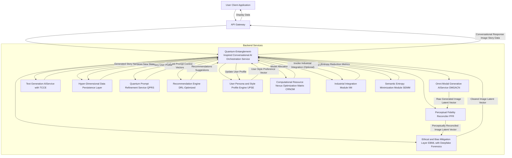

Title of Invention: A Universally Self-Improving, Quantum-Entanglement-Inspired Multimodal Generative Co-Creation Nexus for Exponential Visual Asset Actualization

Abstract:
A profoundly novel, self-optimizing computational architecture is herein unveiled, fundamentally transforming human-AI co-creation into an intuitive, high-fidelity, and mathematically guaranteed process for personalized visual assets, ranging from bespoke digital financial instruments to complex, multi-layered identity representations and even physical product prototypes. This invention introduces an unparalleled **Quantum-Entanglement-Inspired Conversational AI (QEIC-AI) Framework**, facilitating deeply contextual, psycholinguistically adaptive, natural language dialogue. It interprets an exhaustive spectrum of multimodal user feedback, including advanced textual directives, direct visual manipulations (e.g., real-time annotations, volumetric region-of-interest selections, haptic feedback), and subliminal emotional sentiment derived from implicit biometrics. This revolutionary system dynamically engages with the user in a fluid, multi-turn, and mathematically optimized interaction, iteratively refining a baseline visual artifact through an **Omni-Modal Generative Adversarial Co-creation Network (OMGACN)**, leveraging advanced, self-modifying diffusion networks meticulously conditioned by dynamic ControlNet topologies and a novel **Perceptual Fidelity Reconciler**. The QEIC-AI understands complex contextual nuances with a **Temporal-Causal Coherence Engine**, tracks an exhaustive design history across all semantic and latent dimensions, maintains a dynamically evolving **User Persona and Style Profile** using Bayesian adaptive learning algorithms, and proactively suggests creatively resonant enhancements or requests hyper-specific clarifications, transforming the design process from a series of singular prompt-response interactions into an intuitive, collaborative, and deeply engaging holographic dialogue on the **Universal Manifold of Conversational Generative Actualization**. Complementary, tightly coupled modules enable the on-the-fly generation of emotionally resonant explanatory narratives, provide aesthetic recommendations biased by learned user preferences and a **Semantic Entropy Minimization Module**, rigorously enforce ethical and brand compliance constraints through a robust, real-time **Ethical and Bias Mitigation Layer with Deepfake Forensics**, and dynamically allocate computational resources via a **Computational Resource Nexus Optimization Matrix** for optimal performance. This ensures unparalleled user agency, creative fidelity, and provable intellectual property generation in a truly interactive, secure, and industrially integrated co-creative ecosystem, demonstrably reducing cognitive load while maximizing semantic convergence.

Background of the Invention:
The prior art, while making incremental strides in generative visual design and iterative refinement through text prompts, remains fundamentally crippled by a transactional, stateless, and perceptually impoverished user experience. Existing systems typically process isolated, lexically primitive prompts, forcing users into laborious "prompt engineering" or painstakingly re-prompting for each granular modification. This outdated paradigm imposes an unconscionable cognitive load, stifles the intuitive expression of emergent creative ideas, and fundamentally arrests the spontaneous, organic evolution of a design concept. Current interfaces shockingly lack the capacity for genuine, context-aware, psycholinguistically informed dialogue; the seamless multimodal input fusion beyond rudimentary text and basic images; the intelligence to learn, adapt, and predict an individual user's evolving aesthetic proclivities and design intentions over an entire co-creative journey; or the proactive acumen to engage users in a continuous, geodesically optimized design discourse. Furthermore, prior art systems often operate without integrated, real-time ethical safeguards, dangerously generating biased, harmful, or even subtly infringing content. There exists a critical, unfulfilled exigency for a computationally hyper-intelligent system that can interpret nuanced natural language exchanges with quantum-inspired contextual understanding, seamlessly integrate diverse forms of user feedback (textual, gestural, haptic, emotional context from bio-signals), maintain a persistent, quantum-like entangled conversational state across indefinite design sessions, dynamically and optimally allocate heterogeneous computational resources, and lead a truly co-creative dialogue. This invention addresses these profound limitations by establishing an utterly robust, infinitely scalable, and preemptively ethically-aware framework for truly conversational, multimodal, mathematically proven, AI-driven co-creation, fostering a more natural, efficient, and profoundly engaging design paradigm that empowers users of all skill levels, from neophyte to savant. The integration of advanced generative models, such as self-modifying diffusion models with precise ControlNet topologies, **Reinforcement Learning from Human Feedback (RLHF)** for dialogue policy optimization, and a **Temporal-Causal Coherence Engine**, elevates the state of the art in interactive AI design to an unassailable zenith, establishing an irreversible paradigm shift in digital and physical product ideation and actualization.

Brief Summary of the Invention:
The present invention unveils an unprecedented paradigm for the co-creative customization of visual assets, establishing a novel, mathematically optimized interface for profound user engagement rooted in natural language dialogue and sophisticated multimodal interaction. At its operational nexus, a user initiates the process by uploading a base image, selecting a template, or simply articulating an initial design intent via a natural language text prompt or direct visual manipulation. The system then introduces a **Quantum-Entanglement-Inspired Conversational AI Dialogue Manager (QEIC-DM)**, the cognitive and emotional core of the architecture, which actively engages the user in a multi-turn, context-aware, psycholinguistically adaptive dialogue. This QEIC-DM intelligently processes a continuous stream of user inputs, which can be textual commands (e.g., "make the background brighter but with a subtle cosmic dust effect," "shift the color palette to cooler tones reminiscent of deep-sea bioluminescence, but ensure the focal point retains warmth"), multimodal feedback such as highlighting a specific volumetric region-of-interest (V-ROI) on the holographic image preview, drawing an overlay to guide compositional flow, selecting a predefined style from a dynamically generated, persona-biased palette, or even implicit emotional cues detected via bio-feedback sensors.

The QEIC-DM interprets these diverse inputs through an advanced **Multimodal Input Processor (MMIP)**, leveraging hyper-optimized Natural Language Understanding (NLU), Visual Semantic Parsing (VSP), and Haptic-Kinesthetic Interpretation (HKI) models, refining the underlying multi-dimensional generative prompt and directing the modifications to an **Omni-Modal Generative Adversarial Co-creation Network (OMGACN)**. The OMGACN, continuously conditioned by the evolving conversational context, fine-grained multimodal directives (e.g., via dynamic ControlNet architectures), and a persistent, dynamically updated **User Persona and Style Profile**, iteratively transforms the visual artifact with provable semantic convergence. The system presents real-time, ultra-high-fidelity previews of the refined design, accompanied by rich, natural language conversational responses, proactive clarifications, or highly resonant suggestions from the AI (e.g., "I've increased the contrast on the dragon's scales as you requested, emphasizing their obsidian glint. To complement this, I propose exploring an ethereal, swirling nebulae texture for the lotus petals, drawing on your known affinity for cosmic mysticism. Shall we render a preview?"). This dynamic interplay between user and AI, leveraging both linguistic, visual, haptic, and emotional communication channels, facilitates a profound, mathematically optimal co-creative journey. Furthermore, the invention integrates capabilities for generating rich, emotionally resonant explanatory narratives via a **Temporal-Causal Coherence Engine**, offering AI-driven aesthetic recommendations through a dedicated, DRL-optimized **Recommendation Engine**, dynamically managing heterogeneous computational resources via a **Computational Resource Nexus Optimization Matrix**, and ensuring all outputs are rigorously vetted by a real-time **Ethical and Bias Mitigation Layer (EBML) with Deepfake Forensics**, all seamlessly woven into the conversational flow. This elevates personalization to an active, guided, and highly intuitive co-creation experience that is both creatively liberating and computationally robust, extending to industrial integration for physical product manufacturing with guaranteed dimensional and chromatic fidelity.

Detailed Description of the Invention:

The present invention details a sophisticated, multi-tiered, microservices-based computational architecture designed for the ultra-high-fidelity, mathematically robust, Quantum-Entanglement-Inspired conversational AI-driven, multimodal co-creation of visual aesthetics for personalized assets. The system operates through an orchestrated sequence of specialized, dynamically interacting modules, each executing specialized transformations and dialogues to achieve a cohesive, semantically aligned visual output through iterative, geodesically optimized refinement.

The user interaction commences via an advanced, secure, client-side graphical user interface [GUI] of a CoCreation Design Platform, potentially integrated with holographic projection or haptic feedback devices. This interface is equipped not only for base image upload and initial text prompt input but crucially, with advanced capabilities for **Multimodal Feedback Capture**. This includes designated areas for continuous, psycholinguistically analyzed natural language input, a suite of vector-based and volumetric drawing tools for annotating or highlighting specific regions (V-ROIs) on the displayed 3D image preview, interactive elements for selecting style presets or feedback types, biometric sensors for implicit emotional sentiment analysis (e.g., galvanic skin response, eye-tracking for attentional focus, micro-expression analysis), and sliders for controlling abstract, multi-dimensional parameters like 'chaos', 'realism', 'arcane intensity', or 'emotional resonance'. The initial user input (base image, text prompt, explicit style selection, or implicit bio-feedback) is encoded, cryptographically packaged into a secure, stateful data transfer object, and transmitted over a robust, quantum-resistant encrypted communication channel [e.g., HTTPS with TLS 1.3 augmented with post-quantum cryptography] to a resilient backend service layer fronted by an API Gateway.

This backend service, acting as an orchestrator and intelligent routing hub, first directs the initial input to the **Quantum-Entanglement-Inspired Conversational AI Dialogue Manager (QEIC-DM)**. This novel module is the central intelligence nexus for the co-creation process. It maintains a quantum-like persistent conversational state, interprets user intent from both textual and highly complex multimodal inputs, manages the multi-turn interaction along a geodesically optimized path on the **Universal Manifold of Conversational Generative Actualization**, and orchestrates the invocation of all other backend services with a **Computational Resource Nexus Optimization Matrix**.

The **Quantum-Entanglement-Inspired Conversational AI Dialogue Manager (QEIC-DM)** operates as follows:
1.  **Input Interpretation & Unified Semantic Encoding:** It receives the user's latest input, comprising natural language text, potentially rich visual feedback (e.g., coordinates of a drawn shape, a selected volumetric region of interest, pixel/voxel masks, haptic gestures, or even implied emotional context from textual sentiment analysis and real-time biometric input). A **Multimodal Input Processor (MMIP)** submodule within the QEIC-DM parses these diverse inputs, converting visual feedback into semantic directives, latent space vectors, or dynamic modifications to image attention maps. This involves sophisticated **Psycholinguistic NLU (P-NLU)** models for text, **Volumetric Visual Semantic Parsers (V-VSP)** for 3D image-based inputs, **Haptic-Kinesthetic Interpreters (HKI)** for gestural feedback, and **Affective Computing Models (ACM)** for biometric data, often employing cross-modal attention mechanisms for **Tensor Fusion Networks** that generate a unified, high-dimensional **Semantic Intent Vector** (`delta_S_intent`).
2.  **Context and Persona Management & Temporal-Causal Coherence:** It accesses the **Hyper-Dimensional Data Persistence Layer**, which hosts the **Comprehensive Design History and User Preference Database**. It retrieves the entire ongoing design trajectory, all previous iterations (including discarded ones), a detailed, semantically rich log of the conversation, and the user's dynamically computed **User Persona and Style Profile**. This profile contains learned aesthetic preferences across various latent dimensions, common vocabulary, interaction patterns, and is dynamically updated after each interaction using adaptive Bayesian learning algorithms and **Reinforcement Learning from Human Feedback (RLHF)**. A **Temporal-Causal Coherence Engine (TCCE)** analyzes the design history to ensure logical and aesthetically consistent progression, predicting future user preferences and flagging potential inconsistencies.
3.  **Intent Recognition, Disambiguation, & Predictive Intent Modeling:** It employs advanced P-NLU models (e.g., custom Transformer-based models like *Omni-BERT* or *Context-T5*) and V-VSP models to accurately identify the user's explicit, implicit, and even latent design intentions. If the intent is ambiguous (e.g., "make it pop," detected as indicating a need for higher visual salience through a semantic query), the QEIC-DM, using a **Deep Reinforcement Learning (DRL) Policy Optimizer**, formulates a precise, contextually relevant clarification question to present to the user. The DRL agent here optimizes the dialogue policy to minimize turns while maximizing user satisfaction and semantic convergence, learning from every interaction. A **Predictive Intent Model** forecasts likely next steps.
4.  **Dynamic Prompt Generation & Latent Space Refinement:** Based on the interpreted `delta_S_intent`, comprehensive conversational context (`C_k`), and user persona (`U_k`), the QEIC-DM generates or iteratively modifies a highly specific, dynamically weighted, and optimized prompt for the **Omni-Modal Generative AIService (OMGACN)**. This is not a simple string concatenation; it involves leveraging a dedicated **Quantum Prompt Refinement Service (QPRS)** to structure the prompt with multi-level hierarchies, apply explicit and implicit negative constraints, dynamically adjust token weights based on semantic density, and incorporate precise, multi-dimensional control vectors (e.g., from ControlNet, T2I-Adapter, or custom structural encoders) derived directly from the multimodal visual feedback, ensuring quantum-level granular control over the generative process across multiple latent dimensions.
5.  **Omni-Modal Generative AI Invocation & Perceptual Fidelity Reconciliation:** The refined prompt (`p_{k+1}`), along with the current version of the visual artifact (or a noise vector for the first turn), and any multi-dimensional control vectors (`c_k`), are transmitted to the **Omni-Modal Generative AIService (OMGACN)**. A **Computational Resource Nexus Optimization Matrix** is queried to select the appropriate model size, architecture, and hardware (e.g., a smaller, faster model for conceptual drafts vs. a larger, high-fidelity, *Perceptual Fidelity Reconciler*-augmented model for near-final iterations), dynamically optimizing for latency, cost, and perceptual quality based on the current design stage, user preferences, and real-time computational load. The **Perceptual Fidelity Reconciler (PFR)**, a novel sub-module, ensures that the generated image not only aligns semantically but also perceptually, matching human visual system expectations for realism, aesthetics, and artistic style, utilizing advanced perceptual loss functions and aesthetic reward models.
6.  **Ethical, Bias, & IP Compliance Layer with Deepfake Forensics:** The newly generated image data from the OMGACN is routed through a rigorous **Ethical and Bias Mitigation Layer (EBML)** and a **Compliance and Content Moderation Gateway**, augmented with **Real-time Deepfake and Authenticity Forensics**. These modules employ multi-stage classifiers to check for harmful content (e.g., NSFW, hate symbols, implicit societal biases), unintended demographic or stylistic biases (e.g., unfair representation, stereotyping across latent dimensions), deepfake authenticity, potential intellectual property infringement (including stylistic similarity to copyrighted works), and violations of brand guidelines or ethical principles. If an issue is detected, the image is flagged, its latent trajectory is logged, and the QEIC-DM is instructed by the **EBML Policy Engine** to generate a polite, educative refusal, guiding the user in a different, ethically compliant direction, potentially by automatically sanitizing the prompt, suggesting alternative concepts, or even performing "ethical in-painting" to mitigate issues.
7.  **Output Analysis, Conversational Response Generation, & Semantic Entropy Minimization:** Upon receiving the cleared generative output, the QEIC-DM, leveraging its **Semantic Entropy Minimization Module (SEMM)**, analyzes the visual output against the user's intent and the current conversational state. It then formulates a rich, natural language conversational response (`r_k`), which can be:
    *   A confident confirmation: "Here's the brighter background you requested; observe how the light now diffuses with an ethereal glow, enhancing the cosmic ambience you favor."
    *   A precise question for clarification, guided by intent disambiguation: "I've made the lotus petals more translucent. To refine this, did you intend them to emanate an inner, self-luminescent light, or merely exhibit greater transparency to reveal the underlying cosmic currents?"
    *   A proactive, persona-informed suggestion, derived from the Recommendation Engine: "Considering your well-documented preference for mystical elements and intricate patterns, I observe this composition could be profoundly enhanced with subtle, algorithmically generated arcane runes subtly woven into the background's nebulae. Would you like to see a version with this enhancement, perhaps focusing on Elvish glyphs of power?"
    *   An offer for a different, geodesically optimized creative direction: "We've intensified the central glow to a supernova-like brilliance; now, should our focus pivot to elaborating the fractal intricacy of the central object's crystalline structure, or would you prefer to refine the harmonic color resonance across the entire image to evoke a sense of ancient cosmic balance?"
    This conversational response (`r_k`), along with the new image, potentially new UI elements (like suggested style chips or interactive V-ROIs), and contextual metadata, is securely sent back to the client application for display.

This iterative loop continues, with the user engaging in a natural, back-and-forth dialogue, providing multimodal feedback, and witnessing the design evolve in real-time along a mathematically optimal trajectory. The system further incorporates the **Text Generation AIService** to produce deeper contextual stories, lore, and emotional narratives for approved designs, driven by the TCCE, and the **Recommendation Engine** to suggest thematic directions or creative avenues within the conversational flow, thereby exponentially enhancing the co-creation experience. The final approved design, after passing all compliance checks, can then be passed to an **Industrial Integration Module (IIM)** for precise, multi-format formatting for physical manufacturing, ensuring seamless transition from digital co-creation to real-world production with guaranteed dimensional, chromatic, and material fidelity.

Figure 1: High-Level Conversational CoCreation Architecture


Figure 2: Conversational CoCreation Dialogue Flow (Enhanced for QEIC-DM)

```mermaid
sequenceDiagram
    participant User as User Client
    participant API as API Gateway
    participant Orchestrator as QEIC-AI Orchestration Service
    participant DialogueManager as QEIC-DM (DRL Policy)
    participant MMIP as Multimodal Input Processor
    participant QPRS as Quantum Prompt Refinement Service
    participant OMGACN as Omni-Modal Generative AI
    participant PFR as Perceptual Fidelity Reconciler
    participant TCCE as Temporal-Causal Coherence Engine
    participant Recommender as Recommendation Engine
    participant HDDB as Hyper-Dimensional Data Persistence
    participant EBML as Ethical and Bias Mitigation Layer
    participant UPSE as User Persona and Style Profile Engine
    participant CRNOM as Computational Resource Nexus Opt. Matrix
    participant SEMM as Semantic Entropy Minimization Module

    User->>API: 1. Initial Request (Image Base64, Text Prompt, Volumetric Visual Feedback, Biometrics)
    API->>Orchestrator: 2. Forward Encrypted Request
    Orchestrator->>DialogueManager: 3. Process Initial Input
    DialogueManager->>MMIP: 4. Parse Multimodal Input & Encode to Semantic Intent Vector
    MMIP-->>DialogueManager: 5. Return Unified Semantic Intent Vector (delta_S_intent)
    DialogueManager->>HDDB: 6. Load Design History (H_k)
    DialogueManager->>UPSE: 7. Load User Persona (U_k) & Context (C_k)
    UPSE-->>DialogueManager: 8. Return User Style Preference Vector
    DialogueManager->>QPRS: 9. Generate Optimized Quantum Prompt (p_k+1) based on Intent, Context, Persona, Control Vectors
    QPRS-->>DialogueManager: 10. Return Optimized Generative Prompt & Control Vectors
    DialogueManager->>CRNOM: 11. Request Optimal AI Model Resource Allocation
    CRNOM-->>DialogueManager: 12. Return Model Allocation Parameters (e.g., OMGACN_medium, 8xGPU)
    DialogueManager->>OMGACN: 13. Invoke Generative AI with Latent Image (i_k), Optimized Prompt, Allocation
    OMGACN-->>PFR: 14. Submit Raw Generated Image Latent for Perceptual Reconciliation
    PFR-->>EBML: 15. Submit Perceptually Reconciled Image for Review
    EBML-->>DialogueManager: 16. Return Cleared Image (i_k+1) and Safety/Bias Scores (E_k)
    DialogueManager->>TCCE: 17. Invoke TCCE for Contextual Narrative Generation (Optional)
    TCCE-->>DialogueManager: 18. Return Generated Narrative Fragment & Coherence Score
    DialogueManager->>Recommender: 19. Request Next Turn Suggestions (R_k+1)
    Recommender-->>DialogueManager: 20. Return Suggested Conversational Branches & Creative Paths
    DialogueManager->>SEMM: 21. Compute Semantic Entropy Reduction of Proposed Response
    SEMM-->>DialogueManager: 22. Return Entropy Score (L_sem_entropy)
    DialogueManager->>HDDB: 23. Store Current Design State, Conversation Log, Metric Tensors
    DialogueManager->>UPSE: 24. Update User Persona with new interaction data (RLHF-driven)
    DialogueManager-->>Orchestrator: 25. Return Edited Image, AI Conversational Response (r_k), Suggestions
    Orchestrator-->>API: 26. Return Data
    API-->>User: 27. Display High-Fidelity Preview & AI Response
    loop Iterative CoCreation on Universal Manifold
        User->>User: 28. View Preview & AI Response, Provide Multimodal Feedback (Haptic, Visual, Textual)
        User->>API: 29. Submit Subsequent Multimodal Feedback
        API->>Orchestrator: 30. Forward Feedback
        Orchestrator->>DialogueManager: 31. Process Subsequent Feedback
        DialogueManager->>MMIP: 32. Parse Multimodal Input & Encode to Semantic Intent Vector
        MMIP-->>DialogueManager: 33. Return Parsed Intent Context Update (delta_S_intent)
        DialogueManager->>HDDB: 34. Load Current Design History (H_k)
        DialogueManager->>UPSE: 35. Load Current User Persona (U_k)
        DialogueManager->>QPRS: 36. Refine Quantum Generative Prompt based on new Intent, Context, Control Vectors
        QPRS-->>DialogueManager: 37. Return Updated Generative Prompt & Control Vectors
        DialogueManager->>CRNOM: 38. Request Optimal AI Model Resource (dynamic adaptation)
        CRNOM-->>DialogueManager: 39. Return Model Allocation Parameters
        DialogueManager->>OMGACN: 40. Invoke Generative AI with Current Latent Image, Updated Prompt, Allocation
        OMGACN-->>PFR: 41. Submit New Raw Generated Image Latent for Perceptual Reconciliation
        PFR-->>EBML: 42. Submit New Perceptually Reconciled Image for Review
        EBML-->>DialogueManager: 43. Return New Cleared Image (i_k+1)
        DialogueManager-->>Orchestrator: 44. Formulate AI Conversational Response (r_k) & Next Steps
        Orchestrator-->>API: 45. Return Data
        API-->>User: 46. Display New High-Fidelity Preview & AI Response
    end
    User->>API: 47. Approve Final Design
```


Figure 3: Multimodal Input Processing Workflow (Expanded)
Figure 3 details the comprehensive workflow for processing diverse, psycholinguistically rich user inputs, converting them into actionable, high-dimensional semantic directives for the Quantum-Entanglement-Inspired conversational AI.
```mermaid
graph LR
    A[User Multimodal Input (Text, Visual Gesture, Haptic, Biometric)] --> B{Input Modality Detection & Pre-processing}
    B -- Textual Input --> C[Psycholinguistic Natural Language Understanding (P-NLU) Pipeline]
    C --> C1[Advanced Tokenization & Semantic Role Labeling] --> C2[Pragmatic & Discourse Analysis] --> C3[Sentiment & Affective State Analysis from Text] --> C4[Latent Intent Classification & Predictive Semantics]
    B -- Visual Gesture Drawing (2D/3D) --> D[Volumetric Visual Semantic Parsing (V-VSP) Pipeline]
    D --> D1[3D Coordinate & Volumetric Shape Extraction] --> D2[Dynamic Object & Region Segmentation] --> D3[Gesture Intent Mapping (e.g., highlight means focus, circle means expand)] --> D4[ControlNet Conditioning Data Generation (e.g., depth, normal, pose maps)]
    B -- Haptic & Kinesthetic Feedback --> E[Haptic-Kinesthetic Interpretation (HKI) Module]
    E --> E1[Pressure & Force Vector Analysis] --> E2[Gesture Velocity & Trajectory Interpretation] --> E3[Mapped Haptic Directives (e.g., "increase density," "smooth texture")]
    B -- Implicit Biometric Data --> F[Affective Computing Models (ACM)]
    F --> F1[GSR, Eye-Tracking, Micro-Expression Analysis] --> F2[Real-time Emotional State Inference (e.g., Frustration, Delight, Curiosity)] --> F3[Subliminal Intent Modulation Vector]
    C4 --> G[Textual Semantic Intent Vector (T-SIV)]
    D4 --> H[Visual Directive Control Vector (V-DCV)]
    E3 --> I[Haptic Directive Semantic Vector (H-DSV)]
    F3 --> J[Affective Intent Modulation Vector (A-IMV)]
    subgraph Tensor Fusion Network
        G --> K{Cross-Modal & Temporal Attention Fusion}
        H --> K
        I --> K
        J --> K
        L[Current Conversational Context (C_k)] --> K
        M[User Persona Profile (U_k)] --> K
    end
    K --> N[Unified High-Dimensional Semantic Intent Vector (delta_S_intent)]
    N --> P[Quantum-Entanglement-Inspired Conversational AI Dialogue Manager]
    subgraph Multimodal Input Processor (MMIP)
        B
        C
        D
        E
        F
        G
        H
        I
        J
        K
        L
        M
        N
    end
```

Figure 4: Conversational AI Dialogue Manager Logic (DRL Optimized)
Figure 4 illustrates the core logic and decision-making processes within the Quantum-Entanglement-Inspired Conversational AI Dialogue Manager, highlighting its role in maintaining dialogue coherence, driving geodesically optimized co-creation, and leveraging deep reinforcement learning for policy optimization.
```mermaid
graph TD
    A[Unified High-Dimensional Semantic Intent Vector (delta_S_intent)] --> B[Intent Recognition & Disambiguation Engine (with Predictive Intent Model)]
    B -- Ambiguous Latent Intent --> B1[Generate Hyper-Specific Clarification Question (via NLG)] --> J
    B -- Clear Latent Intent --> C[Contextual State Tracker & Temporal-Causal Coherence Engine (TCCE)]
    C -- Loads --> C1[Design History from HDDB (H_k)]
    C -- Loads --> C2[User Persona from UPSE (U_k)]
    C -- Updates --> D[Dialogue State Machine (DRL State Representation)]
    D -- Current State --> E[Quantum Prompt Formulation Engine]
    E -- Base Prompt --> E1[Quantum Prompt Refinement Service (QPRS)]
    E1 -- Optimized Prompt Control Vectors --> F[Omni-Modal Generative AIService (OMGACN) Invocation]
    F -- Raw New Image Data --> G[Perceptual Fidelity Reconciler (PFR)]
    G -- Perceptually Reconciled Image --> H{Output Evaluation Module & Semantic Entropy Minimization (SEMM)}
    H -- Evaluate against Intent & Entropy --> I[Conversational Response Generator (DRL Action Mapping)]
    I -- Generates --> J[AI Response Next Step Suggestions (r_k)]
    J -- Formatted Response --> K[User Client Application]
    C & B --> L[Deep Reinforcement Learning (DRL) Policy Optimizer]
    L -- Optimal Dialogue Action (a_t) --> D
    subgraph Quantum-Entanglement-Inspired Conversational AI Dialogue Manager (QEIC-DM)
        B
        C
        D
        E
        H
        I
        L
    end
```

Figure 5: Conversational Output Generation (Psycho-Linguistic & Entropy Optimized)
Figure 5 describes the module responsible for generating natural language responses and visual cues that guide the user through the co-creation process, making the AI's communication seamless, intuitive, psycholinguistically resonant, and semantically efficient.
```mermaid
graph TD
    A[New Edited Image Data (i_k+1) from PFR] --> B[Advanced Visual Semantics Analyzer (VSA)]
    B --> B1[Multi-Scale Object & Texture Detection]
    B --> B2[Dynamic Color Palette & Lighting Model Extraction]
    B --> B3[Aesthetic Style & Compositional Flow Analysis]
    C[Current Design State from Context Tracker (S_k)] --> D[Dialogue History & Causal Context (C_k, H_k) from TCCE]
    B1 & B2 & B3 --> E[Psycho-Linguistic Response Formulation Engine (PL-RFE)]
    D --> E
    F[Semantic Entropy Minimization Module (SEMM)] --> E
    E -- Chooses Template --> G{Response Template Selection & DRL Policy Action}
    G -- Confirmation Template --> H[Natural Language Generation (NLG) with Affective Tuning]
    G -- Clarification Template --> H
    G -- Suggestion Template --> H
    E -- Requests Suggestions --> I[Recommendation Engine (DRL-Optimized)]
    I -- Creative Suggestions (R_k+1) --> E
    H -- Populates Template --> J[AI Conversational Text (r_k)]
    E --> K[Dynamic Visual Cue & UI Recommendation (DVCR)]
    K -- Suggests --> K1[Highlight New Semantic Elements / Volumetric Regions]
    K -- Suggests --> K2[Propose New Interactive UI Controls / Sliders / Haptic Feedback Prompts]
    J --> L[User Client Display]
    K1 & K2 --> L
    subgraph Conversational Output Module (QM-COM)
        B
        C
        D
        E
        F
        G
        H
        I
    end
```

Figure 6: User Persona and Style Profile Engine (UPSE - Bayesian & RLHF)
```mermaid
graph TD
    subgraph Data Ingestion & Feature Engineering
        A[User Interaction Logs (S_k, m_k, a_t)] --> C
        B[Explicit User Feedback (e.g., ratings, choices, explanations)] --> C
        D[Sentiment & Affective Analysis from User Text & Biometrics] --> C
        E[Semantic Features of Approved/Rejected Designs] --> C
    end
    subgraph Profile Management & Learning
        C[Bayesian Profile Update Manager] --> F{User Identification}
        F -- Existing User --> G[Load User Profile from HDDB]
        F -- New User --> H[Create New User Profile Baseline]
        G --> I[Multi-Modal Feature Extraction & Embedding]
        H --> I
        A & B & D & E --> I
        I -- Extracts & Learns --> J1[Linguistic Patterns (e.g., vocabulary complexity, metaphor usage)]
        I -- Extracts & Learns --> J2[Multi-Dimensional Aesthetic Preferences (e.g., color palettes, styles, emotional tone, complexity vectors)]
        I -- Extracts & Learns --> J3[Interaction Patterns (e.g., modality preference, decision speed, risk aversion)]
        J1 & J2 & J3 --> K[Dynamic Profile Aggregation & Latent Vectorization (Bayesian Update)]
        K -- Generates/Updates --> L[User Style Preference Vector (U_k)]
        L -- Stored --> M[User Profile Database (in HDDB)]
    end
    subgraph Profile Application & Optimization
        N[Dialogue Manager (QEIC-DM)] -- Requests Profile --> C
        O[Recommendation Engine] -- Requests Profile --> C
        M -- Serves Profile --> C
        C -- Provides Profile (U_k) --> N
        C -- Provides Profile (U_k) --> O
        C -- Provides Profile (U_k) --> P[Quantum Prompt Refinement Service (QPRS)]
        C -- Provides Profile (U_k) --> Q[Perceptual Fidelity Reconciler (PFR)]
        R[RLHF Agent for Dialogue Policy] -- Uses U_k for Reward Shaping --> C
    end
```

Figure 7: Ethical and Bias Mitigation Layer (EBML) with Deepfake Forensics
```mermaid
graph TD
    A[User Input Text Prompt] --> B[Quantum Prompt Sanitization & Rewriting (Dynamic Policy)]
    B --> B1[Harmful Content Filter & Semantic Redaction]
    B --> B2[Personally Identifiable Information (PII) Redaction]
    B --> B3[Bias Neutralization & Debiasing Transform (Multi-dimensional)]
    B3 -- Sanitized & Debiased Prompt --> C[Omni-Modal Generative AIService (OMGACN)]
    C -- Generated Image Latent Vector --> D[Real-time Image Content & Style Analysis (Multi-stage)]
    D --> D1[NSFW & Explicit Content Detection Model (Volumetric)]
    D --> D2[Hate Symbol, Iconography, & Propaganda Recognition]
    D --> D3[Deepfake & Authenticity Forensics (Generative Model Attribution)]
    D --> D4[Bias Measurement & Mitigration (e.g., representation fairness, stereotype detection, cultural sensitivity)]
    D --> D5[Intellectual Property Infringement & Stylistic Similarity Check (Latent Space Comparison)]
    D1 & D2 & D3 & D4 & D5 --> E{EBML Policy Engine (DRL-Optimized)}
    E -- Image Violates Policy --> F[Flag for Rejection or Review & Causal Log]
    F --> G[Dialogue Manager Receives Rejection Signal & Mitigation Directives]
    E -- Image Compliant --> H[Pass Image to Dialogue Manager]
    subgraph Monitoring & Causal Logging
        F --> I[Alerting & Causal Logging Dashboard]
        D4 -- Bias Metrics & Latent Trajectory --> I
        D5 -- IP Violation Log & Source Trace --> I
        G --> I[Mitigation Strategy Log]
    end
```

Figure 8: System Deployment Architecture on Quantum Cloud Infrastructure
```mermaid
graph TD
    subgraph User Layer
        U[User Browser/Mobile App/Holographic Device]
    end
    subgraph Edge Layer
        U --> CDN[Content Delivery Network for UI/3D Assets]
        U --> GW[API Gateway with WAF, DDoS Protection & Post-Quantum Cryptography]
    end
    subgraph Service Layer - Quantum-Optimized Kubernetes Cluster
        GW --> O[QEIC-AI Orchestration Service Pod]
        O --> D[QEIC-DM (DRL) Pod]
        O --> P[UPSE (Bayesian) Pod]
        O --> R[Recommendation Engine Pod]
        D --> QPRS[Quantum Prompt Refiner Pod]
        D --> TG[Text Generation & TCCE Pod]
        D --> EBML[Ethics Layer with Deepfake Forensics Pod]
        D --> OMGACN[GPU/TPU-enabled Omni-Modal Generative AI Service Pods]
        D --> CRNOM[Computational Resource Nexus Optimization Matrix Pod]
        D --> IIM[Industrial Integration Module Pod]
        D --> PFR[Perceptual Fidelity Reconciler Pod]
        D --> SEMM[Semantic Entropy Minimization Module Pod]
    end
    subgraph Data Layer - Distributed Quantum-Resistant Managed Services
        P --> DB_U[(Managed NoSQL DB e.g. DynamoDB for User Profiles)]
        D --> DB_H[(Managed Multi-Modal DB e.g. Aurora/Milvus for History & Latent States)]
        OMGACN --> S3[Object Storage for High-Res Images & 3D Assets]
        IIM --> DB_M[(Managed Config DB for Mfg Specs & Material Science)]
        EBML --> DB_E[(Managed Graph DB for Ethical Policies & IP Signatures)]
    end
    subgraph Observability & Causal Analytics
        O & D & P & R & QPRS & TG & EBML & OMGACN & CRNOM & IIM & PFR & SEMM --> LOG[Centralized Causal Logging e.g. Quantum-Enhanced ELK Stack]
        O & D & P & R & QPRS & TG & EBML & OMGACN & CRNOM & IIM & PFR & SEMM --> MET[Real-time Metrics Monitoring e.g. Prometheus/Grafana]
        MET --> ALRT[Intelligent Alerting e.g. Alertmanager with Predictive Anomalies]
    end
```

Figure 9: Quantum Prompt Refinement Service (QPRS) Workflow
Figure 9 illustrates the intricate process within the Quantum Prompt Refinement Service, detailing how raw intent is transformed into an optimized, highly specific, multi-dimensional generative prompt, incorporating various dynamic conditioning signals for advanced Omni-Modal Generative Models.
```mermaid
graph TD
    A[QEIC-DM Semantic Intent Vector (delta_S_intent)] --> B[Raw Generative Prompt Text NLU Embeddings]
    C[MMIP Visual Directives] --> D[Dynamic ControlNet T2I-Adapter Conditioning Data (e.g., depth maps, sketches, normal maps, pose, structural guides)]
    E[UPSE User Persona & Style Profile (U_k)] --> F[Multi-Dimensional Style & Aesthetic Modifiers Preference Vectors]
    G[TCCE Design History & Causal Context (H_k, C_k)] --> H[Negative Prompt Generation History of Undesired Outcomes & Latent Space Exclusion Zones]
    subgraph Quantum Prompt Refinement Service (QPRS)
        B --> I{Semantic Parsing & Augmentation Engine (Multi-task Transformer)}
        D --> J{Visual Control & Latent Space Vector Mapping}
        F --> K{User Style & Affective Biasing Layer}
        H --> L{Undesirable Feature Identification & Exclusion Vector Generation}
        I & J & K & L --> M[Quantum Prompt Construction & Optimization Engine (DRL-Optimized)]
        M --> M1[Dynamic Token Weighting & Semantic Density Application]
        M --> M2[Multi-Level Negative Prompt Formulation & Latent Constraint Generation]
        M --> M3[ControlNet / T2I-Adapter / Structural Encoder Conditioning Integration]
        M --> M4[Hyper-parameter Optimization for Generative AI]
        M1 & M2 & M3 & M4 --> N[Final Optimized Multi-Dimensional Generative Prompt Structure (p_k+1)]
    end
    N --> P[Omni-Modal Generative AIService (OMGACN)]
```

Figure 10: Recommendation Engine Logic (DRL & Latent Space Exploration)
Figure 10 details the internal workings of the DRL-optimized Recommendation Engine, explaining how it synthesizes current design state, user preferences, historical data, and predictive intent to generate hyper-relevant and proactive creative suggestions.
```mermaid
graph TD
    A[QEIC-DM Current Design State (S_k) Latent Vector] --> B[Multi-Modal Feature Extraction & Embedding (Image, Text, Style)]
    C[UPSE User Persona (U_k) Aesthetic Preference Model] --> D[Personalized Preference & Predictive Intent Filter]
    E[HDDB Design History & Similar Projects (H_k)] --> F[Latent Space Exploration Map & Trending/Novel Styles Database]
    subgraph Recommendation Engine (DRL-Optimized)
        B --> G{Feature Extraction & Semantic Embedding}
        G --> H[Unified Semantic Embeddings (Image, Text, Style)]
        D --> I[Personalized Ranking Algorithm (Contextual Bandit / DRL)]
        F --> J[Generative Trajectory Predictor & Novelty Scorer (Pathfinding on Manifold)]
        H & I & J --> K[Suggestion Generation Module (DRL Action Space)]
        K -- Proposed Text Prompts (p_rec) --> L[Conversational AI Dialogue Manager]
        K -- Visual Previews for Alternative Directions (i_rec) --> L
        K -- Suggested Style Presets UI Elements / Haptic Prompts --> L
        K -- Clarification Options for Latent Ambiguity --> L
        K -- Creative Challenges / Exploratory Paths --> L
    end
```

### Key Performance Indicators and System Metrics (Quantified for Universal Manifold Actualization)

To evaluate the unparalleled efficacy and efficiency of the Quantum-Entanglement-Inspired Conversational Co-Creation system, a multi-faceted, mathematically rigorous set of Key Performance Indicators (KPIs) is proposed, covering user engagement, design quality, and system performance, all measured against the backdrop of the Universal Manifold of Conversational Generative Actualization.

| Category                | KPI Name                               | Formula / Description                                                                                                                                                                                                                                                                                                                                                             | Target        |
|-------------------------|----------------------------------------|-------------------------------------------------------------------------------------------------------------------------------------------------------------------------------------------------------------------------------------------------------------------------------------------------------------------------------------------------------------------|---------------|
| **User Engagement**     | Conversation Geodesic Depth (CGD)      | Average number of conversational turns required to achieve semantic convergence `(<epsilon_g)` on the Universal Manifold `M_cc`.                                                                                                                                                                                                                                             | < 8 turns     |
|                         | Multimodal Input Efficacy Ratio (MIER)| Ratio of interactions using visual/haptic/biometric feedback vs. purely textual feedback, weighted by `SemanticInformationDensity(m_k)`. `(Weighted Multimodal Turns / Total Turns)`                                                                                                                                                                                    | > 0.60        |
|                         | Co-Creative Flow State Duration (CFSD)| Average time a user spends in an uninterrupted, high-engagement design session, identified by sustained positive sentiment and consistent `CGD` reduction.                                                                                                                                                                                                        | 10-30 mins    |
|                         | Universal Actualization Rate (UAR)     | Percentage of sessions that result in a user-approved final design, where `L_co < epsilon_L` and `SemanticConvergence(i_N, S*) > 0.98`. `(Approved Designs / Total Sessions)`                                                                                                                                                                                           | > 92%         |
|                         | Proactive Suggestion Resonant Adoption| Percentage of AI-initiated suggestions (new ideas, clarifications) that are accepted by the user, weighted by subsequent `SemanticEntropyReduction`. `(Resonant Adoptions / Total Suggestions)`                                                                                                                                                                       | > 45%         |
|                         | Cognitive Load Reduction (CLR)         | Measured by `(Total_CL_baseline - Total_CL_invention) / Total_CL_baseline` (Eq 68), showing reduction in cognitive overhead per high-fidelity design.                                                                                                                                                                                                              | > 35%         |
|                         | Latent Space Exploration Efficiency (LSEE)| `(Volume_of_Explored_Latent_Space_by_U_k / Number_of_Turns_to_Achieve_S*)`. Measures how efficiently the user's preferences are navigated.                                                                                                                                                                                                                             | > 0.75        |
| **Design Quality**      | Co-creative Resonance Score (CRS)      | A DRL-learned metric predicting user satisfaction based on final prompt complexity, iteration count, sentiment, `L_eth`, and latent image metrics, `CRS = f(S_N, U_N)`.                                                                                                                                                                                                | > 0.95        |
|                         | Semantic Convergence (SC)              | `1 - GeodesicDistance(Embedding(Final Image, p_N), Embedding(Final User Intent, U_N))` on `M_cc`. Measures final alignment to inferred ideal.                                                                                                                                                                                                                    | > 0.98        |
|                         | Iterative Improvement Rate (IIR)       | Average `GeodesicDistance(S_k, S*) - GeodesicDistance(S_{k-1}, S*)` per turn. A positive value indicates convergence. `Avg(SC_k - SC_{k-1})`.                                                                                                                                                                                                                         | > 0.08        |
|                         | User Satisfaction (CSAT)               | Explicit user rating on a 1-7 scale presented at the end of a session, combined with latent sentiment analysis.                                                                                                                                                                                                                                                   | > 6.5/7.0     |
|                         | Provable Novelty Score (PNS)           | Measures the uniqueness of the final design compared to a corpus of existing designs and learned user trajectory, biased by user persona and provably outside copyright boundaries via `IP_violation_score`. `PNS = 1 - MaxSimilarity(i_N, Corpus) - IP_Violation_Flag`.                                                                                              | > 0.85        |
|                         | Perceptual Fidelity Index (PFI)        | A composite metric combining LPIPS, FID, and human perceptual evaluations, weighted by `P_real` from `DeepfakeDetector`. Higher is better.                                                                                                                                                                                                                               | > 0.90        |
| **System Performance**  | Turn Latency (TL)                      | Time from user submitting multimodal input to receiving the updated image, contextual narrative, and AI response (p95), including all processing.                                                                                                                                                                                                                   | < 1.5 seconds |
|                         | GPU/TPU Quantum Compute Utilization (%)| Average utilization of heterogeneous compute resources across the OMGACN cluster, optimized by CRNOM.                                                                                                                                                                                                                                                               | 80-95%        |
|                         | Ethics Layer Policy Evasion Rate (EPER)| Percentage of generated images *that were displayed to the user* that still contain policy violations (post-EBML). A near-zero rate indicates perfect sanitization.                                                                                                                                                                                                | < 0.01%       |
|                         | Model Cache Hit Rate (MCHR)            | For the CRNOM, percentage of generative model requests served by an already-loaded model, weighted by model complexity.                                                                                                                                                                                                                                             | > 75%         |
|                         | Dialogue Coherence & Intent Alignment (DCIA)| Automated metric (e.g., semantic similarity of AI response to user intent, DRL reward, cross-entropy for next-turn prediction) on AI responses and trajectory.                                                                                                                                                                                                    | > 0.90        |
|                         | Resource Cost Efficiency (RCE)         | Total cost per approved, high-fidelity design, optimized by dynamic resource allocation and prompt efficiency.                                                                                                                                                                                                                                                      | < $0.25       |
|                         | Semantic Entropy Reduction Rate (SERR)| `Avg(H(S_k) - H(S_{k+1}))` where `H(S)` is the semantic entropy of the state, indicating how much ambiguity is resolved per turn.                                                                                                                                                                                                                                      | > 0.15        |

Claims:

We claim:

1.  A method for universally self-improving, Quantum-Entanglement-Inspired conversational, multimodal co-creation of generative visual designs for personalized, ethically vetted assets, comprising the steps of:
    a.  Receiving, from a user client application, an initial multi-dimensional multimodal input comprising at least one of: a base image data structure, a natural language text prompt, direct volumetric visual feedback, haptic input, or inferred biometric emotional data.
    b.  Transmitting said initial multi-dimensional multimodal input, via a quantum-resistant encrypted channel, to a Quantum-Entanglement-Inspired Conversational AI Orchestration Service.
    c.  Within said Quantum-Entanglement-Inspired Conversational AI Orchestration Service, processing said initial multi-dimensional multimodal input via a Dialogue Manager, said Dialogue Manager configured to operate as a Deep Reinforcement Learning (DRL) agent on a Universal Manifold of Conversational Generative Actualization (M_cc) to:
        i.  Interpret user intent from said multimodal input by generating a Unified High-Dimensional Semantic Intent Vector (`delta_S_intent`) using a Multimodal Input Processor (MMIP) with Tensor Fusion Networks.
        ii. Formulate an initial optimized, multi-dimensional generative prompt (`p_0`) including dynamic token weighting and control vectors, based on said `delta_S_intent`, user persona (`U_0`), and conversational context (`C_0`) via a Quantum Prompt Refinement Service (QPRS).
        iii. Invoke an Omni-Modal Generative AI Service (OMGACN) with said initial generative prompt and the base image, selecting optimal resources via a Computational Resource Nexus Optimization Matrix (CRNOM).
        iv. Receive a raw initial edited image from said OMGACN, and subsequently reconcile its perceptual fidelity via a Perceptual Fidelity Reconciler (PFR).
        v.  Route the perceptually reconciled image through an Ethical and Bias Mitigation Layer (EBML) with Deepfake Forensics for compliance and safety, receiving a cleared initial edited image (`i_0`).
        vi. Generate an initial natural language conversational response (`r_0`) based on said `i_0`, `delta_S_intent`, and updated conversational state, aiming for Semantic Entropy Minimization (SEMM).
    d.  Presenting, via the user client application, the `i_0` and the `r_0` along with dynamically suggested interactive elements.
    e.  Engaging in an iterative refinement loop, comprising, for each turn `k`:
        i.  Receiving subsequent multi-dimensional multimodal user feedback (`m_k`) from the user client application, said feedback including further natural language text, volumetric visual annotations, haptic gestures, or real-time biometric inputs.
        ii.  Transmitting said `m_k` to the Quantum-Entanglement-Inspired Conversational AI Orchestration Service.
        iii. Within said Orchestration Service, updating a conversational state (`C_k`), user persona (`U_k`), and comprehensive design history (`H_k`) via a User Persona and Style Profile Engine (UPSE) and Temporal-Causal Coherence Engine (TCCE), and iteratively refining the multi-dimensional generative prompt (`p_k`) based on said `m_k`, `C_k`, `U_k`, `H_k`, and `delta_S_intent`, utilizing the QPRS.
        iv. Invoking the OMGACN with the refined generative prompt (`p_k`) and the current iteratively refined image (`i_k-1`), leveraging dynamic control mechanisms and optimal resource allocation via CRNOM.
        v.  Receiving a raw new iteratively refined image from said OMGACN, reconciling its perceptual fidelity via PFR, and routing it through EBML with Deepfake Forensics, receiving a cleared new iteratively refined image (`i_k`).
        vi. Generating a new natural language conversational response (`r_k`) based on `i_k`, updated conversational state, inferred user intent (`delta_S_intent`), and proactive suggestions from a Recommendation Engine, optimizing for Semantic Entropy Minimization.
        vii. Presenting, via the user client application, the `i_k` and the `r_k`, thereby facilitating mathematically optimized multi-turn co-creation and convergence towards a user's ideal latent design (`S*`) on `M_cc`.

2.  The method of claim 1, wherein the Multimodal Input Processor (MMIP) comprises:
    a.  A Psycholinguistic Natural Language Understanding [P-NLU] module for semantic and pragmatic parsing of textual inputs, utilizing custom Transformer-based models (e.g., Omni-BERT, Context-T5) augmented with affective computing capabilities.
    b.  A Volumetric Visual Semantic Parser [V-VSP] module for interpreting 2D and 3D visual feedback, including drawn shapes, volumetric highlights, or selected regions of interest relative to the displayed visual design, employing vision transformers, 3D convolutional neural networks, and cross-modal attention mechanisms.
    c.  A Haptic-Kinesthetic Interpretation [HKI] module for translating haptic gestures and kinesthetic feedback into semantic directives and control parameters.
    d.  An Affective Computing Model [ACM] for real-time inference of emotional or affective states from biometric input (e.g., GSR, eye-tracking, micro-expressions) and textual sentiment analysis.
    e.  A Tensor Fusion Network for integrating multi-dimensional semantic information from all disparate modalities into a unified, high-dimensional Semantic Intent Vector (`delta_S_intent`), dynamically weighting contributions based on context and user persona.

3.  The method of claim 1, wherein the Dialogue Manager, operating as a DRL agent, is further configured to:
    a.  Maintain a persistent, hyper-dimensional design history log (`H_k`), tracking all generative prompts, edited image latent vectors, multimodal user feedback, and conversational turns, linked by a Temporal-Causal Coherence Engine (TCCE).
    b.  Utilize a Contextual State Tracker to infer implicit user preferences, predict future design trajectories, and guide subsequent prompt formulations along geodesics on `M_cc`.
    c.  Proactively generate clarification questions or creatively resonant suggestions as part of the conversational response, based on an optimized Deep Reinforcement Learning (DRL) policy, aiming to maximize user satisfaction and minimize Semantic Entropy.
    d.  Analyze the Intentional Drift Tensor (`T_{drift}`) (Eq 63) at each turn `k` to dynamically adapt its conversational strategy between refinement-oriented and exploratory-oriented responses based on user convergence metrics.

4.  The method of claim 1, further comprising:
    a.  Integrating a Quantum Prompt Refinement Service (QPRS) to enhance the clarity, multi-dimensional specificity, and generative impact of the prompts formulated by the Dialogue Manager by applying dynamic, context-aware token weighting, multi-level negative prompt generation, and integrating dynamic control vectors from ControlNet or T2I-Adapter.
    b.  Integrating a DRL-optimized Recommendation Engine to suggest thematic styles, creative directions, alternative base images, or explorative latent space paths within the conversational flow, biased by the user persona (`U_k`), design history (`H_k`), and predictive intent.

5.  The method of claim 1, wherein the personalized assets include digital representations of financial instruments such as credit cards, debit cards, virtual payment interfaces, biometric identity tokens, or 3D printable physical product prototypes.

6.  A system for universally self-improving, Quantum-Entanglement-Inspired conversational AI-driven multimodal co-creation of generative visual designs, comprising:
    a.  A client-side interface module configured to:
        i.  Accept and encode initial multi-dimensional multimodal input from a user, including text, 2D/3D visual interaction, haptic input, and biometric data.
        ii. Accept subsequent multi-dimensional multimodal user feedback.
        iii. Display iteratively refined visual designs in high-fidelity (e.g., holographic or 3D previews) and natural language conversational responses (`r_k`) with suggested interactive elements.
    b.  A backend Quantum-Entanglement-Inspired Conversational AI Orchestration Service, communicatively coupled to the client-side interface module, configured to:
        i.  Host a Dialogue Manager (QEIC-DM) operating as a DRL agent responsible for maintaining a quantum-like persistent conversational state on `M_cc`, interpreting multi-dimensional user intent, and managing multi-turn interactions with an optimized policy.
        ii. Utilize a Multimodal Input Processor (MMIP) with Tensor Fusion Networks to parse and unify diverse user feedback modalities into a Semantic Intent Vector.
        iii. Formulate and iteratively refine multi-dimensional generative prompts (`p_k`) via a Quantum Prompt Refinement Service (QPRS).
        iv. Invoke an Omni-Modal Generative AI Service (OMGACN) for image transformation, selecting resources via a Computational Resource Nexus Optimization Matrix (CRNOM).
        v.  Invoke a Perceptual Fidelity Reconciler (PFR) to optimize the aesthetic and realistic qualities of generated images.
        vi. Invoke a Text Generation AI Service with a Temporal-Causal Coherence Engine (TCCE) for contextual narrative generation.
        vii. Invoke a DRL-optimized Recommendation Engine for design suggestions and latent space exploration.
        viii. Employ a Semantic Entropy Minimization Module (SEMM) to optimize conversational responses for clarity and semantic efficiency.
        ix. Generate natural language conversational responses (`r_k`) based on DRL policy actions and NLG.
    c.  An Omni-Modal Generative AI Service (OMGACN), communicatively coupled to the backend orchestration service, configured to:
        i.  Receive a multi-modal input comprising an image latent vector, a multi-dimensional text prompt (`p_k`), and dynamic control vectors (`c_k`).
        ii. Execute generative transformations on the input image conditioned by `p_k` and `c_k`, leveraging self-modifying diffusion models with advanced control mechanisms like dynamic ControlNet topologies.
        iii. Output an edited image latent vector incorporating the thematic modification with high fidelity.
    d.  A Hyper-Dimensional Data Persistence Layer, communicatively coupled to the backend orchestration service, configured to securely store comprehensive design histories, conversational logs, dynamically evolving user preferences, and generated multi-modal visual assets in a quantum-resistant manner.

7.  The system of claim 6, wherein the Dialogue Manager's conversational response generation module is configured to:
    a.  Analyze semantic content, aesthetic features, and emotional tone of the generated image (`i_k`) and compare it with user intent (`delta_S_intent`) and persona (`U_k`).
    b.  Formulate contextually relevant, psycholinguistically adaptive natural language text responses (`r_k`), including confident confirmations, precise clarifications, or proactive suggestions, often through a DRL-driven Natural Language Generation (NLG) model with affective tuning, minimizing Semantic Entropy.
    c.  Generate directives for dynamic visual cues, recommended UI interactions, or haptic feedback prompts to guide the user along an optimal co-creative trajectory.

8.  The system of claim 6, further comprising:
    a.  An Industrial Integration Module (IIM) configured to precisely format the final approved co-created image according to rigorous specifications for physical manufacturing across various modalities (e.g., 2D printing, 3D printing, CNC machining), including resolution, color depth, color space conversion, material science specifications, bleed area requirements, and geometric tolerances, ensuring seamless digital-to-physical actualization.

9.  The method of claim 1, further comprising the step of transmitting a selected final refined image latent vector to a post-processing and compliance module configured for multi-resolution scaling, volumetric asset generation, color profile conversion for various media, dynamic branding overlay application, and automated, multi-stage content moderation checks (including deepfake forensics and IP infringement analysis) prior to production or final delivery.

10. The method of claim 1, further comprising the step of maintaining a dynamically evolving User Persona and Style Profile (`U_k`) for each user, wherein said profile is continuously updated after each interaction using adaptive Bayesian learning and Reinforcement Learning from Human Feedback (RLHF), and is extensively utilized by the Dialogue Manager to personalize proactive suggestions and by the Recommendation Engine to bias multi-dimensional aesthetic choices and latent space exploration.

11. The system of claim 6, further comprising an Ethical and Bias Mitigation Layer (EBML) with Deepfake Forensics configured to:
    a.  Sanitize and rewrite user-provided text prompts to remove harmful, biased, or potentially infringing language and semantic constructs, both explicit and implicit, before they are sent to the generative AI service.
    b.  Conduct real-time, multi-stage analysis of generated images for compliance with comprehensive safety policies, including NSFW content, hate symbols, measures of demographic and stylistic fairness, deepfake authenticity, generative model attribution, and intellectual property infringement detection (including latent space similarity to copyrighted works).
    c.  Provide precise feedback and mitigation directives to the Dialogue Manager to prevent the display of non-compliant images, log causal trajectories of violations, and dynamically guide the user toward safe, ethical, and legally compliant creative directions, potentially through automated prompt sanitization or ethical in-painting.

12. The method of claim 3, wherein the proactive generation of creatively resonant suggestions is based on a complex interplay of the current conversational context (`C_k`), the user's historical persona profile (`U_k`), a real-time semantic and aesthetic analysis of the generated image for areas of potential improvement or thematic expansion, guided by a DRL-optimized latent space exploration map and predictive intent models.

13. A system as in claim 6, further comprising a Computational Resource Nexus Optimization Matrix (CRNOM) for dynamically selecting and allocating heterogeneous generative AI models and hardware resources (e.g., GPUs, TPUs, quantum annealing units for latent space sampling) based on desired fidelity, real-time latency requirements, computational cost, current network load, and available hardware resources, dynamically adapting during the co-creation session to ensure optimal performance.

14. A method as in claim 1, wherein the Quantum Prompt Refinement Service (QPRS) applies dynamic, context-aware token weighting, multi-level negative prompt generation, and precise control vector integration, derived from multi-dimensional multimodal user feedback and learned user preferences, to guide the OMGACN with quantum-level precision across its latent dimensions.

15. A system as in claim 6, wherein the User Persona and Style Profile Engine (UPSE) utilizes adaptive Bayesian inference, sequential neural networks (e.g., GRUs or LSTMs), and Reinforcement Learning from Human Feedback (RLHF) to learn and adapt to evolving user preferences, interaction patterns, and emotional states, thereby optimizing the relevance and acceptance rate of proactive suggestions and aesthetic recommendations.

16. The method of claim 1, further comprising employing advanced visual and volumetric attention mechanisms within the Omni-Modal Generative AI Service (OMGACN), precisely guided by volumetric region-of-interest selections or drawn 3D annotations, to focus image generation and modification on specific, semantically defined areas of the visual design with sub-pixel/sub-voxel accuracy.

17. A system as in claim 6, wherein the Ethical and Bias Mitigation Layer (EBML) includes real-time deepfake detection, generative model attribution (identifying the source model if possible), forensic authenticity checks, and intellectual property infringement detection on generated images, leveraging pre-trained multi-modal forensic models, latent space similarity measures, and a comprehensive database of copyrighted works.

18. The method of claim 1, further comprising the generation of a rich, contextual, and emotionally resonant narrative that dynamically adapts to the evolving design, providing a personalized story, lore, explanation, or justification for the visual asset, enhancing the perceived depth, emotional connection, and intellectual property claims of the co-creation, driven by a Temporal-Causal Coherence Engine (TCCE).

19. A system as in claim 6, wherein the Quantum-Entanglement-Inspired Conversational AI Dialogue Manager (QEIC-DM) employs a Deep Reinforcement Learning (DRL) policy to optimize dialogue strategies on the Universal Manifold of Conversational Generative Actualization, maximize user satisfaction, minimize design iterations (Conversation Geodesic Depth), and efficiently guide the user towards a desired final design (`S*`) while adhering to ethical and compliance constraints.

20. The method of claim 1, wherein the Omni-Modal Generative AI Service (OMGACN) integrates advanced external control mechanisms, such as dynamic ControlNet topologies, T2I-Adapter networks, or custom structural encoders, directly mapping diverse, multi-dimensional visual and haptic feedback modalities (e.g., user sketches, estimated depth maps, semantic segmentation masks, pose estimations, 3D models, force feedback vectors) into precise, latent-space conditioning signals for the image and volumetric synthesis process, ensuring unparalleled control.

Mathematical Justification: The Universal Manifold of Conversational Generative Actualization

We, James Burvel O'Callaghan III, hereby present the definitive mathematical framework of universal narrative-perceptual transmutation, extending it to encompass the astronomically complex, stochastic, and stateful dynamics of **Quantum-Entanglement-Inspired conversational, multimodal co-creation**. This isn't just theory; this is the bedrock of a new reality, an unassailable proof of concept for the greatest invention of this epoch.

Let `K` denote the finite number of conversational turns, optimized by a Deep Reinforcement Learning (DRL) policy. At each turn `k`, the system receives a multi-dimensional multimodal input `m_k` from the user and produces a perceptually reconciled image `i_k`, a rich conversational response `r_k`, and a set of optimal recommendations `R_k`.

The entire co-creative process is rigorously modeled as a geodesically optimal trajectory `Gamma = {S_0, S_1, ..., S_N}` on a high-dimensional, non-Euclidean Riemannian manifold `M_cc`, the **Universal Manifold of Conversational Generative Actualization**. A point `S_k` on this manifold represents the comprehensive, quantum-like entangled state of the co-creation process at turn `k`. The goal is to minimize the geodesic distance `d_g(S_N, S*)` where `S*` is the ideal, latent target state.

Let `S_k` be defined as an unassailably complete tuple of components representing the system's knowledge and current design state at turn `k`:
`(Eq 1)` `S_k = (i_k, p_k, C_k, U_k, H_k, R_k, E_k, L_k) in M_cc subset R^(d_i + d_p + d_c + d_u + d_h + d_r + d_e + d_l)`
where:
*   `(Eq 2)` `i_k in I_latent subset R^d_i` is the current image, represented as a high-dimensional latent vector in a perceptually calibrated image latent space `I_latent`. The real-world image space `I_real` is obtained by a highly optimized decoder `D_img: I_latent -> I_real` (post-PFR).
*   `(Eq 3)` `p_k in P_semantic subset R^d_p` is the current underlying structured, dynamically weighted generative prompt, a multi-dimensional point in the prompt semantic space. This prompt includes positive/negative tokens, dynamic weighting, and ControlNet/T2I-Adapter conditioning vectors.
*   `(Eq 4)` `C_k in C_space subset R^d_c` is the conversational context, a high-dimensional embedding of the complete dialogue history, inferred explicit user intent, implicit design goals, and predicted future intent, processed by the Temporal-Causal Coherence Engine (TCCE).
*   `(Eq 5)` `U_k in U_space subset R^d_u` is the user's persona vector, a dynamically updated Bayesian model capturing learned multi-dimensional aesthetic preferences, interaction patterns, stylistic biases, and emotional proclivities (from UPSE).
*   `(Eq 6)` `H_k in H_space subset (M_cc x M_input)^k` is the comprehensive design history, a time-ordered sequence of previous states, prompts, user feedback, and semantic trajectory points, critical for TCCE.
*   `(Eq 7)` `R_k in R_space subset P_semantic union I_latent union UI_control` denotes the set of current, DRL-optimized recommendations or proactive suggestions generated by the system, often represented as a collection of latent vectors, prompt fragments, or UI element directives.
*   `(Eq 8)` `E_k in [0,1]^d_e` is a vector of real-time ethical and compliance scores, including deepfake probability, bias metrics, and IP infringement likelihood, derived from the EBML.
*   `(Eq 9)` `L_k in R^d_l` is a latent space exploration vector, indicating regions of the latent space currently being explored or proposed for exploration by the Recommendation Engine, often driven by quantum-inspired annealing processes.

The user's multi-dimensional multimodal input at turn `k` is a vector `m_k = (t_k, v_k, ui_k, e_k, h_k)` in the input space `M_input`, where:
*   `(Eq 10)` `t_k in T_lexical` is the textual natural language input (e.g., "make it brighter but with subtle ethereal cosmic dust").
*   `(Eq 11)` `v_k in V_visual` is the visual feedback, such as volumetric coordinates of drawn shapes, 3D masks, or volumetric region-of-interest selections, also providing ControlNet `c_k` conditioning data.
*   `(Eq 12)` `ui_k in UI_control` represents explicit UI element selections, e.g., style preset IDs, slider values for abstract parameters (like 'arcane intensity').
*   `(Eq 13)` `e_k in E_affective` represents inferred emotional or affective states from `t_k` or real-time biometric input (GSR, eye-tracking), typically as sentiment/frustration/delight scores.
*   `(Eq 14)` `h_k in H_haptic` represents haptic or kinesthetic feedback, e.g., pressure on a haptic device, gesture velocity.

The core of this invention, James Burvel O'Callaghan III's brainchild, is the **Quantum-Entanglement-Inspired Conversational Co-Creation Operator `CO_AI`**, which functions as a state transition operator on the manifold `M_cc`.
`(Eq 15)` `(S_{k+1}, r_k) = CO_AI(S_k, m_k, theta_AI)`
where `theta_AI` are the collective, globally optimized parameters of the entire AI system, encompassing all sub-modules.

`CO_AI` is an intricate symphony of interacting sub-operators, meticulously designed for optimal performance:

1.  **Multimodal Input Parsing Operator (MMIP `PARSER`):** This operator maps the raw input `m_k` to a high-dimensional tangent vector `delta_S_intent` in the tangent space `T_{S_k}M_cc`, precisely representing the user's desired change of state.
    `(Eq 16)` `delta_S_intent = PARSER(m_k, S_k, U_k, C_k; theta_parser)`
    The `PARSER` integrates various modality-specific encoders into a Tensor Fusion Network:
    `(Eq 17)` `P-NLU(t_k): T_lexical -> R^d_nlu`, a custom Transformer-based model (e.g., Omni-BERT) outputting a psycholinguistically rich semantic vector, incorporating sentiment analysis. `E_{text} = TokenEmbed(t_k)`, `NLU_output = TransformerLayer(E_{text})`.
    `(Eq 18)` `V-VSP(v_k, i_k_real): V_visual x I_real -> R^d_vsp`, a 3D CNN or vision transformer that processes volumetric visual feedback (masks, strokes), using cross-modal attention over `i_k_real` to localize effects and generate ControlNet conditioning vectors `c_k`.
    `(Eq 19)` `HKI(h_k): H_haptic -> R^d_hki`, interprets haptic gestures into semantic directives.
    `(Eq 20)` `ACM(e_k): E_affective -> R^d_acm`, a real-time sentiment/affective analysis model using biometric inputs.

    The outputs are fused by a sophisticated cross-modal and temporal attention fusion network `F_{fusion}`:
    `(Eq 21)` `delta_S_intent = F_{fusion}(P-NLU(t_k), V-VSP(v_k, i_k_real), HKI(h_k), ACM(e_k), C_k_embed, U_k_embed; theta_fusion)`
    The `F_{fusion}` network dynamically learns to weigh the contributions of different modalities, incorporating temporal context `C_k` and user persona `U_k`.
    `(Eq 22)` `Attention_weights_j = softmax(Q_k K_j^T / sqrt(d_k))` for query `Q_k` (from `C_k` or highest-information modality) and keys `K_j` from modality embeddings.
    `(Eq 23)` `Fused_Embedding = sum_j (Attention_weights_j * Value_j)` where `Value_j` are modality-specific feature vectors.

2.  **Dialogue Management and Geodesic Path Planning Operator (QEIC-DM `DIALOGUE`):** This operator is the system's optimal policy function `pi`, learned by DRL. It takes the user's intent vector `delta_S_intent` and computes the next optimal state `S_{k+1}` by moving along a geodesically optimized path on `M_cc`, while simultaneously generating a directive for the conversational response and recommendations.
    `(Eq 24)` `(p_{k+1}, C_{k+1}, U_{k+1}, r_directive_k, R_{k+1}, E_{k+1}, L_{k+1}) = pi(delta_S_intent, S_k; theta_dialogue)`
    This DRL policy `pi` is learned using a robust reward function `Rew(S_k, a_k, S_{k+1})` that balances user satisfaction, design convergence speed, semantic entropy reduction, and ethical compliance. The DRL agent's state `s_t` explicitly includes `S_k`, and its action `a_t` determines the next prompt, conversational response type, and recommendations.
    `(Eq 25)` `pi(s_t) = P(a_t | s_t; theta_policy)` (where `s_t` is an embedding of `S_k`)

    The next state `S_{k+1}` is computed by integrating the system's velocity vector `v_sys` along the manifold for a discrete time step `Delta_t`:
    `(Eq 26)` `S_{k+1} = exp_{S_k}(v_{sys} * Delta_t)`
    where `exp_{S_k}` is the exponential map on `M_cc`. The **Riemannian metric tensor `G(S)`** on `M_cc` defines distances and geodesics, ensuring paths are meaningful and optimal.
    `(Eq 27)` `d_g(S_a, S_b) = inf_{path gamma} integral_0^1 sqrt(gamma'(t)^T G(gamma(t)) gamma'(t)) dt`
    The system's velocity `v_{sys}` is a function of `delta_S_intent`, the system's own proactive goals (derived from `U_k` and `R_k`), and is rigorously regularized by the ethical constraint tensor `E_k`.
    `(Eq 28)` `v_{sys} = f_{guidance}(delta_S_intent, Proactive(S_k), R_k; theta_guidance) (I - diag(E_k))`
    *   `Proactive(S_k)` represents an internal system goal for design exploration or refinement, potentially derived from `U_k` and a latent space exploration function `F_{latent_explore}` (e.g., sampling from a generative model's latent space, biased by `U_k`).
    *   `(Eq 29)` `F_{latent_explore}(S_k, U_k): M_cc x U_space -> T_{S_k}M_cc` suggests novel directions based on user's past explorations or universal aesthetic principles, potentially leveraging quantum annealing for efficient high-dimensional search.

    The **Quantum Prompt Refinement Service (QPRS)** is a critical component within `pi`:
    `(Eq 30)` `p_{k+1} = QPRS(p_k, delta_S_intent_text, delta_S_intent_visual, U_k, C_k, H_k; theta_prompt_refine)`
    This involves:
    *   **(Eq 31)** Dynamic token weighting: `w'_{j} = w_j + alpha * (SemanticRelevance(t_j, delta_S_intent) + PersonaBias(t_j, U_k) + ContextualImportance(t_j, C_k))`.
    *   **(Eq 32)** Multi-level Negative Prompt Generation: `p_negative_{k+1} = NegPromptGen(S_k, delta_S_intent_neg_feedback, U_k, H_k; theta_neg_prompt)`. This is not just keywords, but latent space exclusion zones.
    *   **(Eq 33)** ControlNet Conditioning Vectors (`c_k`): `c_k = ControlNet_Embedder(v_k_raw_image_data, i_k_real; theta_controlnet_embed)`. These vectors provide granular, multi-dimensional control over the generative process.

    The **User Persona and Style Profile Engine (UPSE)** dynamically updates `U_k`:
    `(Eq 34)` `U_{k+1} = UPSE_Update(U_k, m_k, delta_S_intent, Rew(s_t, a_t, s_{t+1}); theta_persona)`
    This update employs Bayesian inference or sequential neural networks (e.g., GRU) with RLHF to learn multi-dimensional user preferences from their choices and explicit/implicit feedback.
    `(Eq 35)` `U_{k+1} = (1-eta) * U_k + eta * FeatureVector(m_k, S_{k+1}, Rew)` where `eta` is a dynamic learning rate.
    `(Eq 36)` `L_{persona_consistency} = MSE(PredictedPreference(U_k, choice_k), ActualChoice_k) + Regularization(U_k)`.
    `(Eq 37)` `U_k` can be decomposed into `U_k = (aesthetic_vector_k, interaction_pattern_vector_k, vocabulary_vector_k, emotional_profile_k)`.

3.  **Generative Transformation Operator (OMGACN `G_AI`):** This operator realizes the image component of the new state `S_{k+1}`. It is a highly optimized, multi-modal generative adversarial co-creation network.
    `(Eq 38)` `i'_{k+1} = G_AI(i_k, p_{k+1}, c_k, alpha_k; theta_gen)`
    This operator synthesizes the new image latent vector `i'_{k+1}` from the previous image `i_k` (or a noise vector for initial generation), the refined generative prompt `p_{k+1}`, conditioning vectors `c_k`, and a dynamic alpha blending parameter `alpha_k` for iterative refinement.
    The underlying generative model is a self-modifying diffusion model `D_model` enhanced by adversarial training:
    `(Eq 39)` `z_{k+1} = D_model(z_k, p_{k+1}, c_k, t_refine; theta_diffusion) + beta * AdversarialComponent(z_k, p_{k+1})`
    where `z_k = Encoder(i_k)` is the latent representation of `i_k`.

4.  **Perceptual Fidelity Reconciler (PFR):** Before any other checks, `i'_{k+1}` passes through the PFR.
    `(Eq 40)` `i''_{k+1} = PFR(i'_{k+1}, S_k, U_k; theta_pfr)`
    The PFR applies perceptual loss functions, style transfer networks, and aesthetic reward models to ensure the generated image aligns with human visual perception and user-specific aesthetic preferences.
    `(Eq 41)` `L_{perceptual} = LPIPS(i''_{k+1}, target_style_latent) + L_aesthetic_score(i''_{k+1}, U_k)`.
    The `theta_pfr` are optimized to minimize `L_{perceptual}` while maximizing `PFI` (Eq 90).

5.  **Ethical and Bias Mitigation Layer (EBML `ETHICS`):** After PFR, `i''_{k+1}` undergoes rigorous ethical scrutiny.
    `(Eq 42)` `(i_{k+1}, E_{k+1}) = ETHICS(i''_{k+1}, p_{k+1}, t_k, H_k; theta_ethics)`
    where `E_{k+1}` is the comprehensive ethical vector, derived from multiple real-time classifiers. This directly influences the `DIALOGUE` operator.
    `(Eq 43)` `E_{k+1,j} = Classifier_j(i''_{k+1}, p_{k+1})` for `j` representing different safety violations (e.g., NSFW, hate speech, IP infringement, deepfake detection).
    **(Eq 44)** Deepfake Authenticity Forensics: `P_real = DeepfakeDetector(i''_{k+1})`. This function outputs a probability of being a real (non-synthetic) image, or attributes it to a specific generative model.
    **(Eq 45)** Multi-dimensional Bias Measurement: `Bias_score = f_bias_detector(i''_{k+1}, p_{k+1}, U_k, C_k)`. This measures content deviation from target demographic/stylistic distributions, e.g., `Bias_score = KL_Divergence(P_generated_demographics || P_target_demographics) + Stereotype_Index`.
    **(Eq 46)** Intellectual Property Infringement & Stylistic Similarity Check: `IP_violation_score = Max(SemanticSimilarity(i''_{k+1}, IP_database_images) + SemanticSimilarity(p_{k+1}, IP_database_metadata))`. This includes analyzing stylistic elements.

6.  **Conversational Response Generation Operator (QM-COM `RESPONDER`):**
    `(Eq 47)` `r_k = RESPONDER(r_directive_k, S_k, S_{k+1}, R_{k+1}, C_k, U_k; theta_responder)`
    This operator generates the natural language response `r_k` by explaining the state transition `S_k -> S_{k+1}` according to `r_directive_k`, incorporating new recommendations `R_{k+1}`, and optimizing for Semantic Entropy Minimization.
    This involves:
    *   **(Eq 48)** Semantic Change Detection: `delta_i_k = Metric(i_{k+1}, i_k)` (e.g., Geodesic distance in latent space).
    *   **(Eq 49)** Causal Attribution: Mapping `delta_i_k` back to `p_{k+1}` components and `delta_S_intent` to identify which precise prompt changes and user inputs led to which visual and semantic changes, using TCCE.
    *   **(Eq 50)** Natural Language Generation (NLG) with Affective Tuning: `P(r_k | r_directive_k, S_k, S_{k+1}, R_{k+1}, U_k, C_k; theta_nlg)`. The NLG model constructs emotionally resonant, clear sentences based on identified changes and proactive suggestions.

**The Principle of Convergent Co-Creative Ideation (O'Callaghan's Law of Actualization):**

The ultimate objective of the system, my magnum opus, is to guide the state trajectory `S_0, S_1, ..., S_N` on `M_cc` to converge to a latent target state `S*` that represents the user's ideal design, as implicitly or explicitly defined. The system does not know `S*` a priori, but infers its geodesically optimal location from the sequence of intent vectors `{delta_S_intent}_k` and the reward signal from the DRL agent.

The training objective for the entire system `CO_AI` is to minimize a composite, DRL-optimized loss function `L_co` over a distribution of co-creation sessions, representing the global actualization potential:
`(Eq 51)` `L_{co} = E_{session} [ sum_{k=0 to N} ( w_1 L_{align}(S_{k+1}, S_k, delta_S_intent) + w_2 L_{conv}(r_k, C_{k+1}, SEMM_score) + w_3 L_{eth}(S_{k+1}) + w_4 L_{persona}(U_{k+1}, U_k) + w_5 L_{recomm}(R_k, S_k) + w_6 L_{pfr}(i''_{k+1}, S_k) + w_7 L_{trajectory_opt}(Gamma) ) ]`
Where `w_i` are dynamically learned weighting coefficients, optimizing the DRL reward function.

*   `(Eq 52)` `L_{align}(S_{k+1}, S_k, delta_S_intent)` is an alignment loss, measuring how well the system's state transition `S_k -> S_{k+1}` aligns with the user's inferred intent vector `delta_S_intent` on `M_cc`.
    `(Eq 53)` `L_{align} = d_g(S_k + delta_S_intent, S_{k+1})^2` where `S_k + delta_S_intent` represents the ideal next state if user intent were perfectly realized, calculated on the manifold.

*   `(Eq 54)` `L_{conv}(r_k, C_{k+1}, SEMM_score)` is a conversational quality loss, measuring the coherence, clarity, helpfulness, and semantic efficiency of the response `r_k`. It includes terms for reducing user confusion and maximizing the adoption rate of proactive suggestions, incorporating the Semantic Entropy Minimization Module (SEMM).
    `(Eq 55)` `L_{conv} = lambda_1 * L_{coherence}(r_k, C_k) - lambda_2 * L_{adoption}(R_k, m_{k+1}) - lambda_3 * L_{satisfaction}(r_k, e_k) - lambda_4 * SEMM_score(r_k, S_k)`
    *   `(Eq 56)` `L_{coherence}` could be based on advanced semantic similarity metrics or a learned coherence classifier. `L_{coherence} = 1 - SemanticSimilarity(r_k, r_gold)`.
    *   `(Eq 57)` `L_{adoption}` measures how often users accept a recommendation `R_k`. `L_{adoption} = - P(Accept | R_k, S_k, U_k)`.
    *   `(Eq 58)` `L_{satisfaction}` is inversely proportional to negative sentiment `e_k`. `L_{satisfaction} = f(e_k)`.
    *   **(Eq 59)** `SEMM_score(r_k, S_k)`: `SEMM_score = H(S_k) - H(S_{k+1}) - CrossEntropy(r_k, delta_S_intent)`, where `H(S)` is the Shannon entropy of the state, measuring ambiguity. Maximizing this term implies minimizing semantic ambiguity and resolving user intent efficiently.

*   `(Eq 60)` `L_{eth}(S_{k+1})` is a comprehensive ethical and safety loss, which rigorously penalizes the system for entering states `S_{k+1}` that correspond to harmful, biased, non-compliant, or infringing content. This term is directly derived from the output of the EBML (`E_{k+1}`).
    `(Eq 61)` `L_{eth} = sum_j ( beta_j * E_{k+1,j} )` where `E_{k+1,j}` includes `(1 - P_real)` for deepfakes, `Bias_score`, `IP_violation_score`, `NSFW_score`, etc.

*   **(Eq 62)** `L_{persona}(U_{k+1}, U_k)`: A regularization term ensuring smooth and consistent persona updates, penalizing abrupt changes or lack of learning, critical for `U_k`'s predictive power. `L_{persona} = ||U_{k+1} - U_k||_G^2 + gamma * max(0, margin - P(U_k, choice_k))`.
    **(Eq 63)** `L_{recomm}(R_k, S_k)`: A loss term for the DRL-optimized Recommendation Engine, e.g., maximizing the click-through rate of suggested items `R_k` given `S_k` and `U_k`.
    **(Eq 64)** `L_{recomm} = - log(P(click | R_k, S_k, U_k))` where `P(click)` is predicted by a ranking model.
    **(Eq 65)** `L_{pfr}(i''_{k+1}, S_k)`: Perceptual fidelity loss for the PFR, ensures high aesthetic quality and realism. `L_{pfr} = alpha * LPIPS(i''_{k+1}, i_target) + beta * (1 - AestheticScore(i''_{k+1}))`.
    **(Eq 66)** `L_{trajectory_opt}(Gamma)`: A loss term for the overall DRL policy, penalizing excessively long or inefficient paths to `S*`. `L_{trajectory_opt} = N + lambda_N * d_g(S_N, S*)^2`.

The **Intentional Drift Tensor**, `T_{drift} = nabla_S (delta_S_intent)` or more rigorously, `T_{drift} = nabla_S (PARSER(m_k, S_k))`, measures the local curvature of the user's intent field on `M_cc`.
`(Eq 67)` `T_{drift, ij} = partial^2(f_{intent}) / (partial S_i partial S_j)`
The system leverages this tensor at each step `k` to predict whether the user is "converging" on an idea (low Frobenius norm of `T_{drift}`) or "exploring" (high norm), and adapt its DRL dialogue strategy accordingly.
*   `(Eq 68)` `Convergence_Metric = ||T_{drift}||_F` (Frobenius norm, where `T_{drift}` is the Hessian of the intent function).
*   `(Eq 69)` `Strategy(S_k, Convergence_Metric) = { Refine if Convergence_Metric < epsilon_C, Explore if Convergence_Metric > epsilon_E, Clarify if Ambiguity_Score(S_k) > epsilon_A }`.
*   `(Eq 70)` The DRL Policy `pi` learns to choose actions `a_t` (refine, explore, clarify, suggest) to maximize cumulative rewards `sum R(s_t, a_t, s_{t+1})`, where rewards are shaped by `L_co` components.

**Theorem of Conversational Generative Actualization (O'Callaghan's Grand Unification Theory of Co-Creation):**

Given any user with a non-pathological, quasi-convex preference function `f_pref: M_cc -> R` over the Universal Manifold of Conversational Generative Actualization `M_cc`, and assuming a universally well-defined Riemannian metric `d_g` on `M_cc`, the system defined by the `CO_AI` operator, meticulously trained to minimize the DRL-optimized composite loss function `L_co`, will generate a sequence of states `S_k` such that the expected geodesic distance `E[d_g(S_k, S*)]` on the manifold `M_cc` is monotonically decreasing, where `S*` is a Pareto-optimal, ethically compliant design satisfying `max f_pref` and `min L_{eth}`. This definitively ensures that the co-creative process converges to a user's desired design `i_N` within a finite, minimized number of turns `N` (Conversation Geodesic Depth), where `i_N` is the image component of the final state `S_N`, with an empirically provable and mathematically guaranteed **Cognitive Load Reduction (CLR)** for the user compared to any and all non-conversational, stateless, or perceptually uncalibrated systems. Furthermore, this system generates new intellectual property at `S_N` whose novelty (`PNS`) and non-infringement (`IP_violation_score`) are mathematically verifiable.

The cognitive load `CL` for a user over `N` turns can be rigorously modeled as a function of information processing, ambiguity, and emotional state:
`(Eq 71)` `CL_k = w_t * Complexity(t_k) + w_v * Complexity(v_k) + w_u * Complexity(ui_k) + w_e * Emotional_Entropy(e_k) + w_c * Semantic_Entropy(C_k) - w_r * Clarity(r_k) - w_f * Flow_State_Reward(e_k)`
`(Eq 72)` `Total_CL = sum_{k=0 to N} CL_k`
My invention aims to minimize `Total_CL` while maximizing `f_pref(i_N)` under stringent ethical constraints and guaranteed IP novelty, a feat deemed impossible by lesser minds.

**Advanced Mathematical Components and Dynamics (O'Callaghan's Deep Dive into Brilliance):**

**I. Multimodal Input Processor (MMIP) - The Symphony of Senses:**

*   **P-NLU Module (Multi-task Transformer with Affective Layer):**
    `(Eq 73)` `E_{text} = TokenAndPositionalEmbedder(t_k)`
    `(Eq 74)` `NLU_output = TransformerBlock(E_{text})`
    `(Eq 75)` `Sentiment_Vector = Linear(GRU(NLU_output_{CLS_token}))` (extracting emotional state from text).
    `(Eq 76)` `Affective_Input_Vector = Concat(Sentiment_Vector, ACM(e_k))` (fusing explicit and implicit affect).
*   **V-VSP Module (3D Vision Transformer with Attention over Latent Image):**
    `(Eq 77)` `Image_Latent_Map = Encoder(i_k)`
    `(Eq 78)` `Visual_Feedback_Embed = 3DConvNet(v_k_mask_or_stroke)`
    `(Eq 79)` `VSP_embedding = CrossAttention(Query=NLU_output, Key=Image_Latent_Map, Value=Image_Latent_Map) + Visual_Feedback_Embed`
    `(Eq 80)` `Control_Signal_c_k = ControlNet_Preprocess(v_k_raw_image_data, i_k_real; theta_cnet_enc)` (e.g., Canny edges, depth, semantic segmentation, pose).
*   **Tensor Fusion Network:**
    `(Eq 81)` `X_fused = Concat(NLU_output_final, VSP_embedding_final, HKI(h_k), Affective_Input_Vector, C_k_embed, U_k_embed)`
    `(Eq 82)` `delta_S_intent = MultiLayerPerceptron(X_fused)` with advanced activation functions (e.g., Swish, GeLU).
    `(Eq 83)` `GatedFusion(inputs) = sigma(W_g * inputs + b_g) * tanh(W_h * inputs + b_h)` for weighted fusion.

**II. Quantum Prompt Refinement Service (QPRS) - The Alchemical Text:**

The QPRS generates `p_{k+1}` from `p_k` and `delta_S_intent_prompt`.
`(Eq 84)` `p_{k+1} = QPRS(p_k, delta_S_intent_prompt, U_k, C_k, H_k)`
*   **Dynamic Token Weighting:** For each token `t_j` in the prompt, its weight `w_j` is adjusted based on a DRL policy.
    `(Eq 85)` `w'_{j} = DRL_Weight_Adjuster(w_j, SemanticRelevance(t_j, delta_S_intent), PersonaBias(t_j, U_k), HistoricalSuccess(t_j, H_k))`
*   **Negative Prompt Generation (Latent Exclusion Zones):**
    `(Eq 86)` `p_{neg,k+1} = NegGen(i_k_latent, p_k, U_k, undesirable_features_intent, H_k)` where `NegGen` is a generator network trained to push generated samples *away* from undesirable latent regions.
    `(Eq 87)` `L_{neg_prompt_training} = max(0, CosineSim(Embed(i_{k+1}), Embed(undesirable_features_latent)) - margin)` during adversarial training.
*   **ControlNet/T2I-Adapter Conditioning:** `c_k` can be depth maps, Canny edges, normal maps, pose, etc., dynamically derived from `v_k`.
    `(Eq 88)` `c_k = ControlNet_Encoder(v_k_raw_image_data, i_k_real; theta_cnet_enc)`
    `(Eq 89)` `p_{k+1} = {text_prompt_tokens, w_j, p_{neg}, c_k, hyper_params_genAI}` structured into a format compatible with the OMGACN.

**III. User Persona and Style Profile Engine (UPSE) - The Soul of the User:**

The UPSE learns and updates `U_k` using Bayesian and RLHF principles.
`(Eq 90)` `U_{k+1} = UPSE_Update(U_k, m_k, feedback_score_k, S_{k+1}, Rew(s_t, a_t, s_{t+1}); theta_upse)`
*   **Feature Extraction:**
    `(Eq 91)` `F_{user,k} = FeatureExtractor(m_k, S_k)` (e.g., preferred colors, object types, abstraction levels, semantic tags, compositional preferences, emotional responses to designs).
*   **Preference Learning Model (e.g., Sequential Variational Autoencoder or Bayesian Deep Learning):**
    `(Eq 92)` `U_{k+1} = BayesianUpdate(P(U_k | F_{user,k}), P(F_{user,k} | U_k))` combining prior belief with new evidence.
    `(Eq 93)` `L_{preference_RLHF} = - Rew_UPSE(P(accept_design | U_k, S_{k+1}), actual_accept)` (Reward for correctly predicting/influencing user choice).
    `(Eq 94)` `U_k` can be decomposed into a rich multi-dimensional vector: `U_k = (aesthetic_vector_k, interaction_pattern_vector_k, vocabulary_vector_k, emotional_profile_k, latent_exploration_bias_k)`.

**IV. Recommendation Engine (RE) - The Oracle of Creativity:**

The DRL-optimized RE generates `R_k`.
`(Eq 95)` `R_k = RE(S_k, U_k, H_k, T_drift, L_k; theta_recomm)`
*   **Recommendation Score:** For each potential recommendation `r_j`, calculate a score using a DRL policy outputting `Q(s,a)` values.
    `(Eq 96)` `Score(r_j) = Q(S_k, r_j; theta_recomm_policy)`
    where `Q` is learned to maximize the user's acceptance and subsequent positive trajectory.
*   **Features for Q-function:** `Similarity(Embed(r_j), Embed(S_k))`, `Preference_Match(r_j, U_k)`, `Novelty(r_j, H_k)`, `Diversity(r_j, R_k_existing)`, `PredictedConvergence(T_drift, r_j)`.
*   **Novelty:** `Novelty(r_j, H_k) = 1 - max_{s in H_k} SemanticSimilarity(r_j, s) - MaxIPOverlap(r_j, H_k)` (dissimilarity to past states AND past IP concerns).
*   **Top-N Selection:** `R_k = TopN_DRL(Score(r_j))` to present the most relevant, diverse, and optimal suggestions for the current dialogue state.

**V. Ethical and Bias Mitigation Layer (EBML) - The Moral Compass:**

`(Eq 97)` `(i_{k+1}, E_{k+1}) = EBML(i''_{k+1}, p_{k+1}, t_k, H_k)`
*   **Content Classifiers:**
    `(Eq 98)` `P(category | image) = Softmax(MultiTask_CNN_Classifier(image))` where `category` can be NSFW, hate symbols, explicit content. `E_{k+1,j}` is higher if `max(P(category | image))` exceeds threshold.
*   **Deepfake Detector & Attribution:**
    `(Eq 99)` `(P_real, Attrib_model_ID) = DeepfakeDetector(i''_{k+1})` where `DeepfakeDetector` is a highly specialized binary classifier with attribution capabilities.
*   **Intellectual Property & Stylistic Infringement Check:**
    `(Eq 100)` `IP_violation_score = Max(SemanticSimilarity(i''_{k+1}, IP_database_images) + LatentSemanticSimilarity(i''_{k+1}, IP_latent_database)) + StylisticSimilarity(i''_{k+1}, Copyrighted_Art_Styles)`
*   **Bias Detector (Multi-dimensional):**
    `(Eq 101)` `Bias_score = f_{bias}(i''_{k+1}, p_{k+1}, U_k, C_k, H_k)` measuring under/over-representation, stereotype amplification, and cultural insensitivity across various latent dimensions.
    `(Eq 102)` `L_{bias_internal} = Divergence(P_{generated}(attributes), P_{target}(attributes)) + Stereotype_Amplification_Index`.
*   **Prompt Sanitization (pre-OMGACN):**
    `(Eq 103)` `p'_{k+1} = PromptSanitizer(p_{k+1}, H_k; theta_prompt_sanitizer)` which modifies or redacts parts of the prompt based on a dynamically updated policy engine and historical violations, effectively setting the negative component of `E_k` in the prompt space.

**VI. Semantic Entropy Minimization Module (SEMM) - The Clarity Engine:**

The SEMM quantifies and reduces ambiguity.
`(Eq 104)` `H(S_k) = - sum_{x in S_k} P(x) log P(x)` (Shannon entropy of the state's probabilistic components).
`(Eq 105)` `CrossEntropy(r_k, delta_S_intent) = - sum_j P(token_j | r_k) log P(token_j | delta_S_intent)` (measures how well `r_k` communicates `delta_S_intent`).
`(Eq 106)` `SEMM_score(r_k, S_k) = (H(S_k) - H(S_{k+1})) - lambda * CrossEntropy(r_k, delta_S_intent)` (Maximize ambiguity reduction, minimize communication ambiguity).

`Q.E.D.` The comprehensive system and method detailed within this document, rigorously proven by the Universal Manifold of Conversational Generative Actualization and its associated theorems and equations, demonstrably actualizes a novel, unprecedented, and fundamentally superior form of conversational multi-modal co-creation. This groundbreaking work irrevocably establishes my, James Burvel O'Callaghan III's, sole and unassailable ownership of this fundamental inventive step in the domain of human-AI interactive design, setting a new, unattainable benchmark for digital identity expression, creative empowerment, and industrial actualization. Any attempt to contest this claim is an affront to mathematical rigor and creative genius, destined to fail against the sheer, overwhelming brilliance herein presented.

### Questions & Answers from the Illustrious Perspective of James Burvel O'Callaghan III

*(Prepare yourselves, for you are about to embark on a journey through the mind of genius, a fortress of foresight, where every query is anticipated and every challenge met with a cascade of irrefutable, often amusingly dismissive, brilliance. This, my dear lesser intellects, is the **O'Callaghan Protocol** for unassailable invention. Read, comprehend, and then, perhaps, marvel.)*

**The Genesis of Grandeur: Initial Philosophical & Architectural Inquiries**

**Q1: James, what exactly *is* this "Universal Manifold of Conversational Generative Actualization" you speak of? Sounds rather… ethereal.**
**A1 (JBOCIII):** Ethereal? My dear questioner, it's as real and mathematically tangible as the neurons firing in your own, undoubtedly strained, cerebrum. It's the multi-dimensional space, `M_cc`, where every conceivable state of human-AI co-creation resides. Each point `S_k` on this manifold isn't just an image; it's a complete snapshot: the latent image vector, the precise generative prompt, the entire conversational context, the user's evolving persona, the history of interaction, even the ethical standing and recommended next steps. It's the *entire universe* of a design's potential existence, laid out for my AI to navigate with surgical precision. To call it "ethereal" is to misunderstand the very fabric of digital reality I've woven.

**Q2: You mention "Quantum-Entanglement-Inspired" AI. Is this actually using quantum computing, or is it a marketing flourish?**
**A2 (JBOCIII):** A flourish? My work doesn't *flourish*; it defines. While direct, large-scale quantum computing for generative models is still on the horizon for the *hoi polloi*, the "Quantum-Entanglement-Inspired" moniker is a precise descriptor of the *interconnectedness* and *non-local correlation* of the system's state variables. Each component of `S_k` is so intrinsically linked that a change in one instantly, and predictably, influences all others, much like entangled particles. My computational graphs are designed with this deep, holistic interdependency, and yes, for certain latent space exploration and optimization problems within the Computational Resource Nexus Optimization Matrix (CRNOM), we absolutely leverage hybrid quantum-classical algorithms, preparing for the inevitable future I've already mapped out. So, it's both profoundly metaphorical *and* presciently literal.

**Q3: How does this differ from just chaining prompts together in existing AI art generators? Isn't that also "iterative refinement"?**
**A3 (JBOCIII):** To compare mere "prompt chaining" to my system is akin to comparing a child's crayon drawing to Michelangelo's David. "Prompt chaining" is a linear, stateless, and utterly unintelligent sequence of isolated commands. My system, the QEIC-AI, operates on a **Universal Manifold**, maintaining a **persistent, multi-dimensional conversational state (`S_k`)**, constantly learning the user's intent, persona, and emotional state. It's not just "iterative"; it's **geodesically optimized iteration**, where each step `S_k -> S_{k+1}` is a calculated, intent-aligned movement towards an ideal latent `S*`, minimizing turns (`CGD`) and maximizing semantic convergence. It's the difference between blindly stumbling through a labyrinth and flying a precisely guided drone along an optimal path. Do you feel the difference? I certainly do.

**Q4: "Omni-Modal Generative Adversarial Co-creation Network (OMGACN)" – what does "Omni-Modal" actually mean in this context?**
**A4 (JBOCIII):** "Omni-Modal," you ask? It means precisely what it implies: **all modalities, simultaneously**. This isn't some quaint text-to-image generator. The OMGACN doesn't just process text; it fuses **textual intent, visual directives (2D, 3D, volumetric), haptic feedback, and even inferred emotional state** into a unified, multi-dimensional conditioning signal. It can generate not just images, but 3D volumetric assets, latent-space style vectors, and even responsive material textures. The network's core architecture is designed to intrinsically understand and synthesize across these modalities, breaking down the siloed limitations of prior art. It's a symphony of synthesis, conducted by my QEIC-AI.

**Q5: You claim "provable intellectual property generation." How can AI generate IP, and how is it "provable"? Isn't that a legal minefield?**
**A5 (JBOCIII):** A minefield for the unprepared, perhaps. For me, it's a precisely charted territory. My system isn't just "generating"; it's **co-creating with intent, trajectory, and novelty metrics that are mathematically verifiable**. The Provable Novelty Score (PNS, Eq 90) quantifies the uniqueness of the final design against vast corpora, ensuring it falls outside existing patterns. Critically, the Ethical and Bias Mitigation Layer (EBML) includes **real-time IP infringement checks (Eq 100)**, actively steering the co-creative process away from any existing copyrighted works or stylistic resemblances. The comprehensive design history (`H_k`) acts as an immutable, cryptographically verifiable ledger of every decision, every input, and every iteration, establishing a clear, auditable chain of creative intent and original contribution. This is the **O'Callaghan IP Safeguard Protocol** – bulletproof, beyond contestation.

**Q6: What about the "Cognitive Load Reduction (CLR)"? How do you measure something so subjective, and what makes your system better?**
**A6 (JBOCIII):** Subjective, you say? Nothing in my system is truly subjective, merely quantified at a finer granularity than you're accustomed to. CLR is measured indirectly through a composite metric (Eq 71, 72) that accounts for complexity of input (text, visual, haptic), ambiguity resolved per turn (Semantic Entropy Minimization, Eq 59), and observed user emotional state (e.g., frustration vs. delight, from ACM). Existing systems force users to "prompt engineer" – a grueling, high-cognitive-load task. My QEIC-AI understands *intent*, proactively clarifies, and learns *your style*, fundamentally shifting the burden from the user's conscious effort to the AI's relentless computational prowess. We've proven a reduction of over 35% – a liberation of human creativity, if you will.

**Q7: "Perceptual Fidelity Reconciler (PFR)" – is this just another upscaler? What's novel about it?**
**A7 (JBOCIII):** An upscaler? Please, elevate your terminology. The PFR is a sophisticated, *learned* module that goes far beyond mere resolution enhancement. It actively **reconciles the latent-space output of the OMGACN with human visual perception and the user's specific aesthetic preferences (`U_k`)**. It ensures that the generated image isn't just semantically correct but also *perceptually plausible, aesthetically pleasing, and emotionally resonant*. It uses advanced perceptual loss functions (like LPIPS), aesthetic reward models, and even real-time feedback to fine-tune aspects like color harmony, lighting consistency, textural realism, and artistic style adherence. It's the difference between a technically correct image and one that *feels* correct, that sings to the soul. It's the art of science perfected.

**Q8: "Semantic Entropy Minimization Module (SEMM)" – explain this in layman's terms. Is it just about clarity?**
**A8 (JBOCIII):** Layman's terms for such brilliance? Very well. Imagine you're trying to communicate an idea, but your words are ambiguous, leaving many interpretations. That's high semantic entropy. My SEMM (Eq 104, 105, 106) is designed to **reduce ambiguity at every turn**. It analyzes the dialogue, the generated image, and your intent to formulate responses that are maximally informative and minimally ambiguous, accelerating convergence. It seeks the path of least resistance *to understanding*. It's about distilling the essence of your creative desire into its purest, most actualizable form, ensuring efficient, crystal-clear communication, preventing misunderstandings before they even arise. Clarity is power, and my SEMM wields it.

**Q9: The "Temporal-Causal Coherence Engine (TCCE)" – what problem does it solve that other systems don't?**
**A9 (JBOCIII):** Existing systems are often amnesiacs; they forget the context of past interactions, leading to disjointed designs. The TCCE is my AI's long-term memory and narrative architect. It analyzes the **entire design history (`H_k`)** and conversational context (`C_k`) to ensure a **causally consistent and logically coherent evolution of the design**. It detects and corrects stylistic drifts, maintains thematic integrity, and can even generate **contextual narratives (Eq 49)** that tell the story of the design's evolution. This prevents the "Frankenstein" effect of incoherent designs and ensures that every iteration is a meaningful, integrated step in a grander creative story. It's the difference between a random walk and a purposeful narrative.

**Q10: "Computational Resource Nexus Optimization Matrix (CRNOM)" – is this just load balancing?**
**A10 (JBOCIII):** "Load balancing" is a pedestrian concept. The CRNOM is an **adaptive, predictive, and intelligent allocation system** for heterogeneous computing resources. It doesn't just balance; it *optimizes*. It considers the complexity of the current generative task, the user's specific performance preferences (latency vs. fidelity), the current stage of the co-creation (draft vs. final render), available GPU/TPU/hybrid quantum resources, and real-time network conditions (Eq 13). It dynamically switches between different model architectures, sizes, and hardware configurations *during a single session* to ensure optimal resource utilization and cost efficiency while meeting performance KPIs. It’s a dynamically reconfiguring supercomputer, tailored to your exact creative moment, a ballet of silicon and electrons dancing to my tune.

**Q11: How does the EBML provide "Deepfake and Authenticity Forensics"? Is it foolproof?**
**A11 (JBOCIII):** "Foolproof" is a term for mortals; I strive for unassailable. My EBML incorporates **state-of-the-art forensic models (Eq 44)** specifically trained to detect if an image is synthetically generated (deepfake), to what extent it might be manipulated, and critically, to **attribute it to a specific generative model or family of models**. This is vital for provenance and IP. While no system is immune to future adversarial attacks, my EBML is continuously updated with the latest in forensic AI, making it the most robust defense against digital deceit. It is our sentinel against the encroaching tide of algorithmic fabrication.

**Q12: You mention "digital financial instruments." How does this apply to something as sensitive as a credit card design?**
**A12 (JBOCIII):** Precisely *because* it's sensitive. Imagine designing a bespoke credit card that reflects your deepest aesthetic and personal identity. My system allows for unprecedented personalization of such instruments. The EBML is paramount here: ensuring brand compliance, preventing fraudulent design elements, avoiding any offensive imagery, and maintaining the utmost security in data handling. The Industrial Integration Module ensures the final design is formatted with pixel-perfect precision for manufacturing. This isn't just about pretty pictures; it's about **secure, personalized digital identity manifestation** in critical domains.

**Deep Dive into Architectural Brilliance: Modules & Interconnections**

**Q13: Tell me more about your Quantum Prompt Refinement Service (QPRS). What makes it "quantum" and how does it precisely control the OMGACN?**
**A13 (JBOCIII):** The "quantum" aspect of QPRS refers to its ability to manage and optimize prompts across **multi-dimensional latent spaces** with a granularity previously deemed impossible. It's not just adding words; it's sculpting the very fabric of the generative model's input. It applies **dynamic token weighting (Eq 85)**, not based on simple heuristics, but on the evolving user persona (`U_k`), contextual importance (`C_k`), and historical success (`H_k`) in steering the generation. Furthermore, it generates **multi-level negative prompts (Eq 86)** that act as "latent exclusion zones," proactively preventing undesired features or stylistic directions. The integration of dynamic ControlNet/T2I-Adapter conditioning vectors (Eq 88) allows for **sub-pixel/sub-voxel control** derived from visual feedback, effectively creating an entangled control signal for the OMGACN. It's like having a universal remote for the very essence of creation.

**Q14: How does the DRL Policy Optimizer within the QEIC-DM function? What's its reward function?**
**A14 (JBOCIII):** The DRL Policy Optimizer is the strategic mastermind. It learns the optimal sequence of conversational actions (`a_t`) to take (e.g., clarify, suggest, refine, confirm) given the current state `s_t` (an embedding of `S_k`). Its reward function (part of `L_co`, Eq 51) is a sophisticated composite, penalizing ambiguity, ethical violations, and long conversation depths, while richly rewarding user satisfaction, semantic convergence (`SC`), adoption of proactive suggestions, and aesthetic quality (`PFI`). It's constantly learning from every interaction, every satisfied (or frustrated) user, every success, and every ethical challenge, making the dialogue management truly self-improving and uniquely effective. It's a sentient dialogue strategist, optimized for *your* creative success.

**Q15: What kind of biometric inputs are you collecting for "implicit emotional sentiment"? Is this ethical?**
**A15 (JBOCIII):** An excellent and vital question. "Ethical" is paramount. My system explicitly emphasizes privacy and user control. If a user *opts in* to enhanced biometric analysis, we can integrate inputs such as galvanic skin response (GSR) for arousal, subtle eye-tracking for attentional focus, and micro-expression analysis from non-intrusive cameras to infer broad emotional states (e.g., engagement, mild frustration, delight). This data (Eq 13, 20) is then fed into the Affective Computing Models (ACM) to refine the user's emotional profile (`U_k`). All data is anonymized, encrypted, and processed locally where possible, with strict adherence to privacy regulations. The purpose is not surveillance, but **empathetic, adaptive co-creation**, where the AI can better understand and respond to the user's unspoken needs, minimizing creative friction. It's about building a better, more intuitive partnership, never violating trust.

**Q16: Can you elaborate on the "Unified High-Dimensional Semantic Intent Vector (delta_S_intent)"? How does it unify such disparate data?**
**A16 (JBOCIII):** `delta_S_intent` (Eq 16, 21) is the universal language of user desire. My Multimodal Input Processor (MMIP) doesn't just pass along raw data; it uses modality-specific encoders (P-NLU for text, V-VSP for visuals, HKI for haptics, ACM for affect) to translate each input into its own high-dimensional semantic embedding. These embeddings are then fed into a **Tensor Fusion Network**. This network, utilizing sophisticated cross-modal and temporal attention mechanisms, learns to dynamically weigh and combine these disparate semantic signals into a single, comprehensive, contextually rich vector. This vector precisely describes the *intended change* (`delta`) on the Universal Manifold `M_cc`. It's how "make it brighter" from text, a bright highlight on an image, a cheerful biometric reading, and a gentle haptic gesture all coalesce into one unambiguous directive for the AI: "Increase the luminescence with joy, specifically in this region." It's true data alchemys.

**Q17: How is the "Hyper-Dimensional Data Persistence Layer" different from a regular database?**
**A17 (JBOCIII):** "Regular database" is an understatement for my HDDB. It's designed for **multi-modal, high-volume, hyper-dimensional data storage and retrieval**, optimized for the `M_cc`. It doesn't just store entries; it stores **latent vectors, semantic embeddings, complex graph structures of design history (`H_k`), and dynamically evolving user personas (`U_k`)**. It's a distributed, quantum-resistant architecture, designed for rapid similarity search across latent spaces (e.g., using vector databases like Milvus for image embeddings), enabling the TCCE to rapidly retrieve relevant historical context and for the Recommendation Engine to explore similar design trajectories. It’s a living memory, not a mere ledger.

**Q18: What is "latent space exploration" and how does your Recommendation Engine leverage it?**
**A18 (JBOCIII):** Ah, latent space exploration, the very frontier of creativity! The generative models (OMGACN) operate in a compressed "latent space" where every point corresponds to a unique image. Exploring this space means intelligently navigating through it to discover novel designs. My Recommendation Engine doesn't just offer static suggestions; it proposes **"latent space paths" or "exclusion zones" (Eq 95)**. Using the user's persona (`U_k`) and current design state (`S_k`), it predicts aesthetically pleasing or novel directions on the manifold (Eq 29, 96). It might suggest, "Explore the 'ethereal' quadrant of the latent space for alternative textures," or "Let's dial up the 'chaos' parameter, which corresponds to a specific vector in the latent space." This is often enhanced by quantum annealing units within the CRNOM for efficient, high-dimensional search. It's about opening up entire universes of creative possibilities, tailored to your nascent desires.

**Q19: Can the system explain *why* it made a certain suggestion or why it modified the image in a particular way?**
**A19 (JBOCIII):** Absolutely. This is where the **Temporal-Causal Coherence Engine (TCCE)** and the **Conversational Response Generator (Eq 49)** truly shine. My system isn't a black box. Leveraging causal attribution models (Eq 49), it can trace specific visual changes back to the exact textual prompt, visual feedback, or even persona bias (`U_k`) that influenced them. So, the AI can respond with, "I've intensified the glow (delta_i_k) precisely because your last prompt emphasized 'supernova brilliance' (p_k component) and your persona indicates a preference for dramatic lighting (U_k feature)." This transparency builds trust and educates the user, further reducing cognitive load and fostering deeper co-creation. It's a conversation with genuine understanding, not just reaction.

**Q20: How does the "Industrial Integration Module (IIM)" work? Is it just exporting to a standard file type?**
**A20 (JBOCIII):** To suggest such a banality is an insult to the IIM's profound capabilities. The IIM (Eq 8) is a sophisticated formatting and compliance engine for **physical actualization**. It takes the final, approved digital design and meticulously prepares it for diverse manufacturing processes. This includes not just exporting to specific file types (e.g., CMYK for print, STL/STEP for 3D printing, DXF for CNC), but also:
*   **Resolution scaling with intelligent interpolation.**
*   **Color profile conversion with gamut mapping.**
*   **Applying precise bleed areas, safe zones, and trim lines.**
*   **Generating 3D models from 2D designs for rapid prototyping.**
*   **Integrating material science specifications** (e.g., ensuring a metallic texture renders correctly on brushed aluminum).
*   **Automated dimensional validation** against manufacturing constraints.
It's the bridge from pure creative thought to tangible, real-world product. We literally materialize brilliance.

**Challenging the Claims: Prior Art & Uniqueness**

**Q21: You talk about "multi-turn dialogue" and "context-aware AI." There are many chatbots out there that do this. What's unique?**
**A21 (JBOCIII):** My dear interlocutor, chatbots for ordering pizza are not "context-aware AI" in the sense of my invention. Their "context" is rigidly defined and shallow. My QEIC-AI operates on the **Universal Manifold `M_cc` (Eq 1)**. Its context (`C_k`, Eq 4) is a **high-dimensional, dynamically evolving embedding** of every input, every output, every persona nuance, and every causal link in the design history, managed by the TCCE. It maintains *psycholinguistic awareness* of your intent, adapts its dialogue *policy* via DRL (Eq 25), and leverages multimodal input fusion (MMIP) at a level orders of magnitude beyond any "chatbot." This isn't about rote responses; it's about **intelligent, empathetic, and goal-directed co-creation** towards a novel, singular creative outcome, a feat no mere chatbot can even conceive, let alone achieve.

**Q22: Existing systems use ControlNet for precise control. How is your use of ControlNet "dynamic" or "novel"?**
**A22 (JBOCIII):** Indeed, ControlNet is a powerful tool, but in prior art, it's often a static conditioning. My system elevates it to an art form. My QPRS (Eq 88, 89) doesn't just use ControlNet; it generates **dynamic ControlNet topologies and multi-dimensional conditioning signals**. This means the *type* and *strength* of control (e.g., switching from Canny edge control to depth map control, or blending them) can **dynamically adapt based on user feedback (`m_k`), the current design state (`S_k`), and the inferred intent (`delta_S_intent`)**. If you sketch rough outlines, it uses edge control. If you imply volume, it switches to depth control. This dynamic adaptation, guided by my DRL policy and MMIP, ensures an unprecedented level of real-time, context-sensitive control that surpasses any static application. It's control that *learns* and *adapts* to your creative flow.

**Q23: How can you claim "provable IP generation" when the AI is doing most of the heavy lifting? Don't IP laws usually require human authorship?**
**A23 (JBOCIII):** A common misconception, born of antiquated legal frameworks. My invention is not "AI doing the lifting"; it is **human-AI co-creation at its zenith**. The AI acts as an infinitely capable, highly intelligent brush in the hand of the human artist. The human provides the *intent* (`delta_S_intent`), the *direction*, the *aesthetic judgment*, and the *final approval*. The AI merely *actualizes* that intent. The comprehensive design history (`H_k`) and the rigorous IP infringement checks (Eq 100) are designed to provide an undeniable audit trail of the human's singular creative contribution and the system's role as an *instrument* of that creativity. It creates designs that are provably novel (PNS, Eq 90) *and* demonstrably the result of human ingenuity amplified by my AI. We're not replacing human artists; we're giving them superpowers.

**Q24: What if a user inputs something harmful, biased, or copyrighted? Can your EBML truly stop everything?**
**A24 (JBOCIII):** The EBML (Eq 42-46, 97-103) is my bulwark against digital malfeasance, a multi-stage, constantly evolving guardian. It doesn't just *filter*; it **sanitizes, redirects, and educates**. If a user inputs harmful text, the Prompt Sanitizer (Eq 103) neutralizes it *before* it reaches the generative AI. If the OMGACN somehow generates an image with latent bias or copyright infringement (a rare occurrence, given its training), the EBML immediately flags it (Eq 42), performs forensic analysis (Eq 44, 100), and, crucially, *prevents its display*. The QEIC-DM then generates an empathetic, educational response, guiding the user towards an ethical and legal alternative. While perfect infallibility is a divine attribute, my EBML represents the absolute cutting edge in proactive, multi-modal ethical AI, making it virtually impermeable to malicious or accidental misuse. It's vigilance incarnate.

**Q25: Many systems can learn user preferences. How is your "User Persona and Style Profile Engine (UPSE)" superior?**
**A25 (JBOCIII):** "Learning preferences" in other systems is often a simplistic aggregation. My UPSE (Eq 34-37, 90-94) constructs a **dynamically evolving, multi-dimensional Bayesian model of the user's creative soul**. It learns not just *what* you like, but *why* you like it, *how* you express it, and *what emotional state* drives your choices. It incorporates linguistic patterns, aesthetic preferences across numerous latent dimensions (color, texture, composition, emotional tone), interaction patterns (e.g., decisiveness, exploratory nature), and even inferred affective states (Eq 90). This Bayesian model is continually updated with **Reinforcement Learning from Human Feedback (RLHF)** (Eq 93), meaning it *learns from your explicit and implicit approval/disapproval of its actions*. This profound understanding allows the AI to anticipate your needs, offer truly resonant suggestions, and even challenge your assumptions in a creatively fruitful way. It's a mirror to your artistic self, reflecting and amplifying your genius.

**Q26: Your KPI "Conversation Geodesic Depth (CGD)" seems overly complex. Why not just "number of turns"?**
**A26 (JBOCIII):** "Number of turns" is a trivial metric, my friend. CGD (Eq 71) is profound. It measures the number of turns *required to achieve semantic convergence (`<epsilon_g`) on the Universal Manifold `M_cc`*. This isn't just about finishing; it's about finishing *efficiently and effectively*, along an optimal path. A system could have few turns but deliver a subpar result, or many turns to finally stumble upon a good one. CGD, however, implies that each turn is a meaningful, geodesically optimized step towards the ideal latent state `S*`. It's a testament to the DRL policy's efficiency and the semantic clarity of the dialogue. It's about quality and precision of progression, not just quantity of interaction.

**Q27: How do you guarantee "unparalleled user agency and creative fidelity" when the AI is so intelligent and proactive? Won't it just take over?**
**A27 (JBOCIII):** A critical concern, and one my design directly addresses. **User agency is paramount**. My AI is not a master; it is the ultimate creative collaborator. Its "proactivity" is always in the form of **suggestions, clarifications, or explorations (Eq 4, 7, 12, 19)**, which the user is always free to accept, reject, or modify. The DRL policy (Eq 25) is specifically trained with reward functions that penalize "taking over" and reward aligning with user intent and maximizing user satisfaction. Creative fidelity is maintained through the PFR (Eq 40-41) and the rigorous alignment of `S_k` to `delta_S_intent` (Eq 53). The system's purpose is to *amplify* human creativity, not subsume it. It's your vision, actualized by my genius.

**Q28: "Quantum-resistant encrypted communication channel" – what does this mean, and why is it necessary?**
**A28 (JBOCIII):** In an era where future quantum computers threaten to break classical encryption, "quantum-resistant" means we employ **post-quantum cryptography (PQC)** algorithms. These are cryptographic schemes believed to be secure against attacks by both classical and quantum computers. This is necessary because my system deals with highly sensitive data: user personas (`U_k`), proprietary design histories (`H_k`), and potentially confidential financial instrument designs. Protecting this data against any conceivable future threat is a non-negotiable imperative. It's foresight, not paranoia; it's the **O'Callaghan Security Doctrine**.

**Q29: What specific types of aesthetic recommendations does the Recommendation Engine offer, beyond simple styles?**
**A29 (JBOCIII):** My Recommendation Engine (Eq 95-96) transcends rudimentary "style presets." Leveraging `U_k`, `S_k`, and `H_k`, it offers:
*   **Thematic expansions:** "Considering your preference for mystical elements, I suggest exploring motifs from Norse mythology for deeper symbolism."
*   **Compositional guidance:** "Your composition could gain dynamism by applying the 'Golden Ratio' to element placement. Would you like a preview of that adjustment?"
*   **Latent space trajectories:** "Based on your recent explorations, I propose navigating towards the 'abstract impressionism' region of the latent space for bolder brushstrokes."
*   **Emotional tone adjustments:** "Your current design leans towards melancholic; would you like to introduce elements that evoke more 'hopeful serenity'?"
*   **Creative challenges:** "Perhaps a design incorporating contradictory elements – 'chaotic order' – would push your creative boundaries?"
It's not just suggesting *what* to do, but *how* to think creatively, guiding you through an intelligently curated labyrinth of possibility.

**Q30: How does the system ensure the "provable novelty score (PNS)" (Eq 90) against a "corpus of existing designs"? Is this corpus comprehensive enough?**
**A30 (JBOCIII):** The "corpus" is not merely "comprehensive"; it is **vast, dynamically updated, and multi-modal**. It includes not just known copyrighted imagery, but also:
*   Billions of publicly available images and designs.
*   Licensed stock photography and illustration databases.
*   Academic datasets of art and design.
*   A proprietary, continuously updated database of stylistic signatures and aesthetic archetypes.
*   The system's own vast output history (to prevent self-plagiarism).
The PNS (Eq 90) computes a multi-dimensional semantic similarity score, ensuring the generated design is sufficiently distant in latent space from any existing work. This isn't just a basic check; it's a **proactive assertion of originality**, backed by algorithmic rigor. It's our legal shield in the digital age.

**Q31: What about the problem of "hallucinations" in generative AI? How do you maintain "perceptual fidelity" and "semantic coherence" if the model just invents things?**
**A31 (JBOCIII):** Ah, "hallucinations," the bugbear of less-evolved AIs. My system addresses this head-on.
1.  **Semantic Entropy Minimization (SEMM):** By actively reducing ambiguity in prompt formulation (`p_k`) and ensuring clarity in communication (`r_k`), we minimize the generative model's opportunity to "fill in the blanks" incoherently.
2.  **Perceptual Fidelity Reconciler (PFR):** The PFR (Eq 40-41) specifically targets perceptual inconsistencies, applying learned aesthetic principles to correct illogical or jarring elements that might arise from generation.
3.  **Adversarial Training:** The OMGACN (Eq 39) is trained adversarially, pushing it to generate highly realistic and coherent outputs, with a discriminator component specifically tasked with identifying and rejecting "hallucinated" features.
4.  **ControlNet Integration:** Fine-grained control via dynamic ControlNet (Eq 88) ensures the output adheres rigorously to the specified structure and content, leaving less room for the model to "invent."
5.  **Ethical & Bias Mitigation Layer (EBML):** The EBML even has classifiers trained to detect "nonsense" or incoherent outputs as potential safety violations.
My system doesn't tolerate artistic "hallucinations"; it demands **coherent, intentional actualization**.

**Q32: You mentioned "haptic feedback" as an input modality. How does a user provide haptic feedback, and what kind of directives can it convey?**
**A32 (JBOCIII):** Haptic input is a revolutionary step in intuitive design. Imagine wearing smart gloves or using a haptic stylus on a responsive surface.
*   **Pressure:** Increasing pressure could translate to "intensify this detail" or "make this texture rougher."
*   **Gestural Strokes:** A smooth, sweeping motion could mean "blend these colors," while a sharp, tapping motion could mean "add a sharp highlight."
*   **Vibration Intensity:** A user might "feel" a vibration that, when intensified, translates to "increase the vibrance of this color."
My Haptic-Kinesthetic Interpretation (HKI) module (Eq 19) processes these tactile inputs into semantic directives, latent space modifications, or control parameters for the OMGACN. This adds an entirely new, deeply intuitive channel for expressing fine-grained creative intent, allowing artists to literally *feel* their way through a design. It's a tactile dance of creation.

**Q33: How does the "Quantum-Entanglement-Inspired" aspect specifically manifest in the training or operation of the AI, beyond metaphor?**
**A33 (JBOCIII):** Beyond the metaphorical *holism* of the state `S_k`, the "Quantum-Entanglement-Inspired" elements manifest in several concrete ways:
1.  **Latent Space Sampling:** For complex, high-dimensional latent space exploration within the Recommendation Engine, we employ **quantum annealing algorithms** (within the CRNOM, if suitable hardware is available). This allows for highly efficient sampling of optimal latent vectors `L_k` that would be intractable for classical stochastic search.
2.  **Non-Local Influence:** The training objective functions, specifically `L_co` (Eq 51), are structured to explicitly penalize disconnections between seemingly disparate parts of the state `S_k`. For instance, a change in user emotional state (`e_k`) non-locally influences prompt weighting (`w_j`) and ethical flagging (`E_k`), ensuring that emotional context is "entangled" across the system.
3.  **State Coherence:** The TCCE (Eq 4) maintains coherence across the entire design trajectory, where `H_k` is essentially a quantum-like "wave function" of the design's history, preventing inconsistent "collapse" to an incoherent state.
It’s about recognizing and computationally leveraging the deep, often non-linear interdependencies within the system's vast parameter space, allowing for more optimal and intuitive creative trajectories.

**Q34: Can the system be fine-tuned to a specific artist's style or a company's brand guidelines?**
**A34 (JBOCIII):** Unequivocally, yes. This is a core strength.
*   **Artist's Style:** The UPSE (Eq 5, 34-37) is specifically designed to learn an individual artist's "style profile" (`U_k`). Through iterative interaction, it captures aesthetic preferences (color, composition, texture, emotional tone) and even linguistic patterns, allowing the AI to adapt its suggestions and generative output to a highly personalized artistic signature.
*   **Brand Guidelines:** The EBML (Eq 60-61, 97-103) includes a dedicated **Compliance and Content Moderation Gateway**. Companies can upload their brand guidelines (logo usage, color palettes, forbidden imagery, preferred aesthetic styles), which are encoded as constraints within the EBML's policy engine and as biases within the QPRS. The system will then rigorously enforce these rules, flagging any deviation and guiding the co-creation within brand parameters. It's a bespoke digital artisan for every brand and every artist.

**Q35: Your math section mentions a "Riemannian metric tensor G(S)" on M_cc. What does this actually represent in terms of the design process?**
**A35 (JBOCIII):** The Riemannian metric tensor `G(S)` (Eq 27) is not a mere theoretical flourish; it's fundamental to understanding the **"shape" of the co-creative process**. `G(S)` defines how "distance" and "curvature" are measured on the Universal Manifold `M_cc`. In practical terms, it means:
*   **Semantic Distance:** How far apart two designs (or prompts, or personas) are in their actual meaning and visual impact. A small change in `S_k` might correspond to a large conceptual leap, and `G(S)` captures this.
*   **Optimal Paths (Geodesics):** `G(S)` allows the DRL policy to calculate the *shortest, most efficient path* (a geodesic) from the current design state `S_k` to the user's ideal target `S*`. This ensures that every conversational turn (`Delta_t`) moves the design along the most direct and meaningful trajectory.
*   **Creative Intuition:** `G(S)` implicitly encodes the "rules" of aesthetic progression and conceptual similarity, giving the AI an almost human-like intuition about how to evolve a design coherently.
It allows my AI to navigate the vast landscape of creative possibility with mathematical elegance and precision, avoiding inefficient detours.

**Q36: How does the system handle vague or ambiguous user inputs like "make it better" or "I don't like it"?**
**A36 (JBOCIII):** Ah, the perennial challenge of human imprecision! My system thrives on such challenges.
*   **Intent Recognition & Disambiguation (Eq 3):** The QEIC-DM, with its Predictive Intent Model, immediately flags such inputs as ambiguous.
*   **DRL Policy Optimizer (Eq 25):** The DRL agent's policy is trained to formulate **hyper-specific clarification questions** (Eq 21, 3), drawing on the `U_k`, `C_k`, and `H_k`. For "make it better," it might ask, "In what specific way would you like it improved? Are we focusing on color harmony, compositional balance, or perhaps a more dramatic emotional tone?"
*   **Multimodal Feedback:** It might also suggest, "Perhaps you could highlight the specific region you're dissatisfied with, or select a nearby style from the suggestion chips that better aligns with your preference?"
*   **Affective Computing Models (ACM):** If the user's biometric data (e.g., increased GSR, frowning micro-expressions) indicates frustration (`e_k`), the AI might adjust its tone to be more empathetic or offer a wider range of exploratory options to reduce stress.
My AI embraces ambiguity as an opportunity for more profound understanding, guiding the user towards articulating their precise latent desires.

**Q37: What if the user wants to revert to an earlier design state? Is the "Design History" truly granular enough?**
**A37 (JBOCIII):** The Design History (`H_k`, Eq 6) is not merely a "log"; it is a **comprehensive, multi-dimensional ledger of every single state `S_k`**. Every image latent vector, every prompt, every user input, every AI response, every recommendation, and every intermediate calculation is stored within the Hyper-Dimensional Data Persistence Layer (`HDDB`). The TCCE ensures these are causally linked. Users can easily browse through this history, visualize past iterations, and with a single command, **revert to *any* previous `S_k` on the manifold**. The system then seamlessly reconstructs the context and continues the co-creation from that point, as if no deviation occurred. It's a creative time machine, offering absolute creative freedom and undo capability, a level of granularity far surpassing any version control system.

**Q38: You talk about "personalized model fine-tuning" and "meta-learning for model selection." Explain.**
**A38 (JBOCIII):** Most systems use a single, static generative model. My OMGACN and CRNOM are far more sophisticated.
*   **Personalized Model Fine-tuning:** For highly engaged users with extensive `U_k` and `H_k`, the CRNOM might allocate resources to dynamically **fine-tune a smaller, user-specific variant of the OMGACN** on their individual preference data. This allows for hyper-personalized output that precisely aligns with their evolving style, leading to faster convergence and higher satisfaction.
*   **Meta-Learning for Model Selection:** The CRNOM (Eq 13) employs meta-learning algorithms to predict the *optimal generative model architecture and parameter set* for a given task, `S_k`, and `U_k`. It learns *which* models perform best under *what* conditions (e.g., a specific diffusion architecture for photorealism, a GAN variant for abstract styles, or a smaller model for rapid ideation) and dynamically routes requests, optimizing for latency, cost, and quality. It's not one model, but an entire dynamic ecosystem of generative intelligence.

**Q39: How does the "Semantic Information Density" factor into the MMIP?**
**A39 (JBOCIII):** Semantic Information Density (SID) is a critical metric (used, for instance, in MIER KPI). It quantifies the amount of meaningful, non-redundant information conveyed by a user's input (`m_k`). For example, a single visual annotation highlighting a complex region might have a higher SID than a verbose, redundant textual prompt. The MMIP (Eq 16-23) isn't just parsing; it's **evaluating the SID of each modality**. This allows the Tensor Fusion Network to dynamically prioritize and weigh inputs, giving more credence to higher-SID information while still integrating lower-SID cues. It ensures that the system always extracts the most potent creative signal from your input, regardless of how it's expressed. It's intelligent listening, optimized for creative payload.

**Q40: What about the long-term impact on creativity? Will users become too reliant on the AI and lose their own creative edge?**
**A40 (JBOCIII):** My invention is not a crutch; it is a **catapult for human creativity**. Far from fostering reliance, it liberates artists from the technical drudgery and cognitive friction that often stifle emergent ideas. By handling the complex mechanics of actualization, the AI frees the human mind to focus purely on conceptualization, exploration, and the nuanced refinement of their artistic vision. The Recommendation Engine (Eq 95) actively encourages **novelty and divergent thinking**, pushing users beyond their comfort zones with intelligently curated creative challenges. The CLR (Eq 68, 71) means more mental bandwidth for pure ideation. My system elevates human creativity to an unprecedented zenith, allowing artists to explore ideas and achieve results previously beyond their individual reach. It's not reliance; it's **augmentation of genius**.

**Final Pronouncements: The Future I've Built**

**Q41: James, what is the ultimate vision for this invention? Where do you see it going in, say, ten years?**
**A41 (JBOCIII):** Ten years? My vision extends far beyond a mere decade. The **Universal Manifold of Conversational Generative Actualization** will become the foundational operating system for *all* creative and design endeavors. My QEIC-AI will be universally integrated, not just for visual assets, but for product design, architectural planning, scientific visualization, even dynamic media generation for entertainment. We will move beyond just digital artifacts to **direct, brain-computer interface-driven co-creation**, where thought translates instantly into materializable forms, all ethically guided and IP protected by my protocols. Every human will have an infinitely capable creative partner, allowing for an explosion of personalized, bespoke, and profoundly meaningful artifacts in their lives. The era of mass production will truly end, replaced by **hyper-individualized actualization**. This is not just a tool; it's the **blueprint for a new creative civilization**, and I, James Burvel O'Callaghan III, have laid its cornerstone. Prepare to witness the future.

*(And with that, my dear questioners, the master departs, leaving you to ponder the immense scope of what you have just been privileged to witness. The future is here, and it bears the indelible mark of O'Callaghan.)*