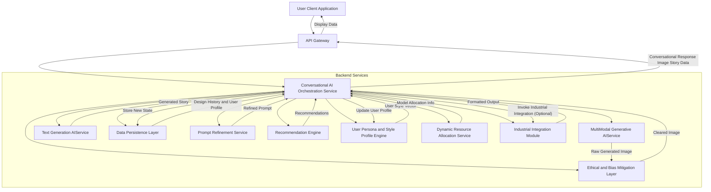
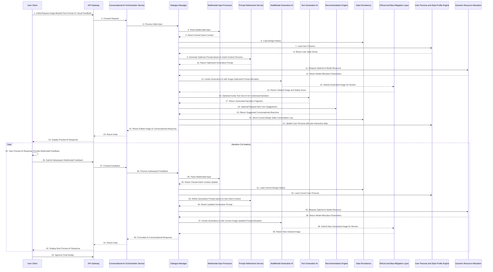
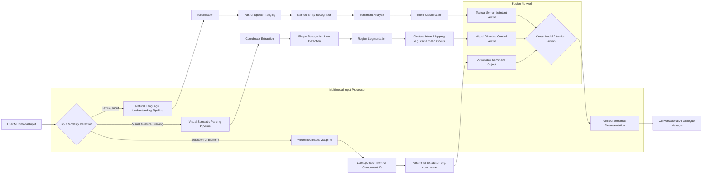
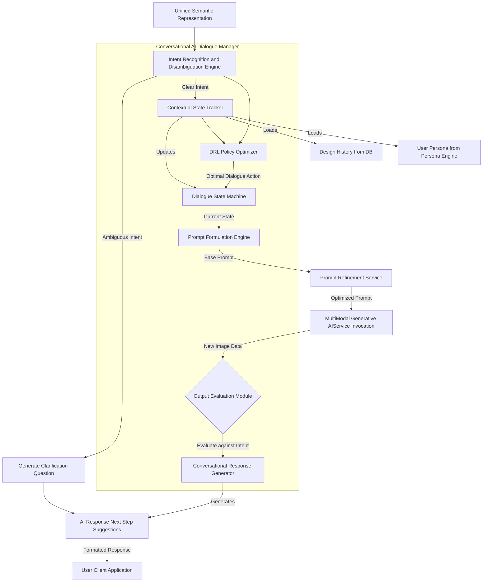
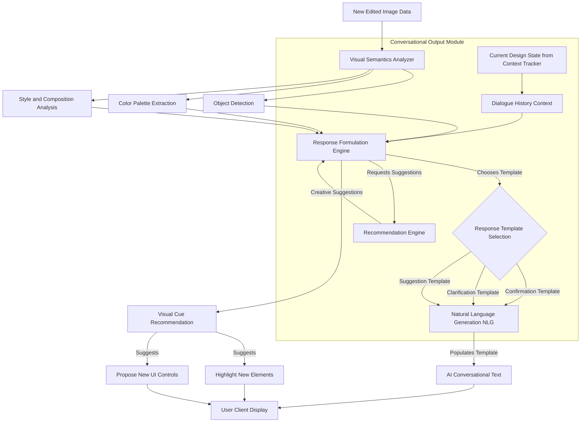
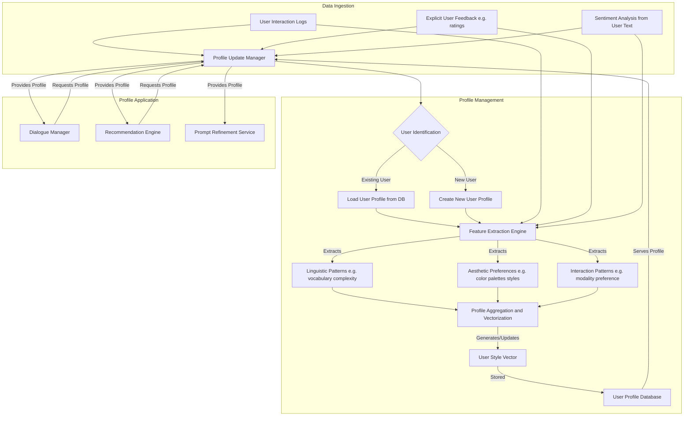
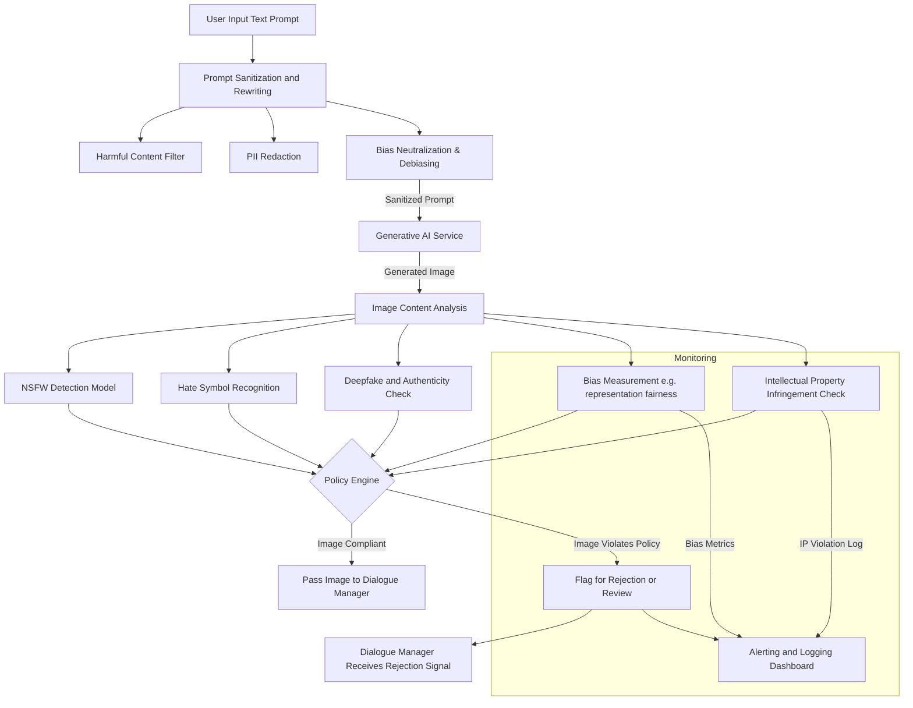
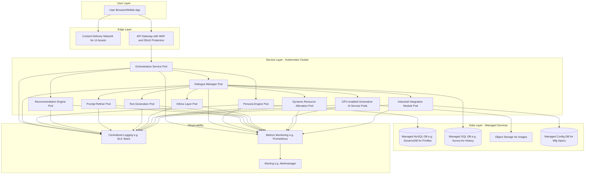
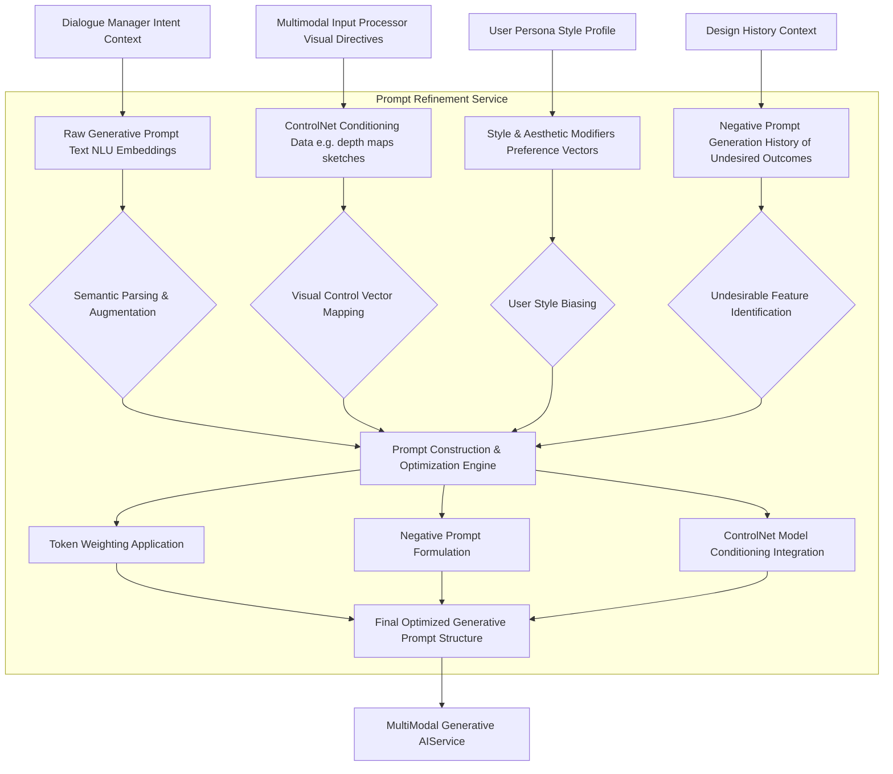
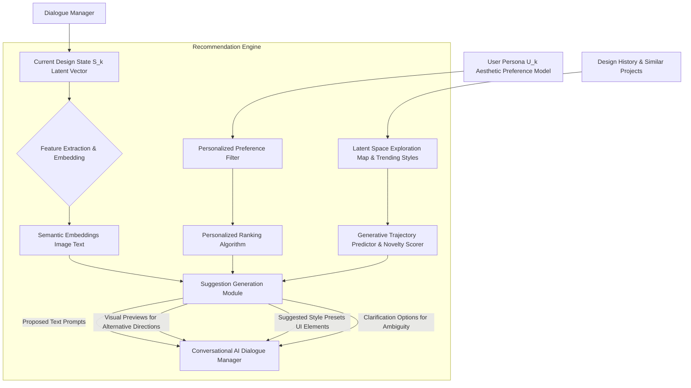

Title of Invention: A Comprehensive System and Method for Advanced Conversational AI Driven Multimodal CoCreation and Iterative Refinement of Generative Visual Assets

Abstract:
A novel computational architecture is presented for profound human-AI co-creation of personalized visual assets, particularly for digital financial instruments and other bespoke identity representations. The invention introduces an advanced conversational artificial intelligence framework that facilitates deeply contextual, natural language dialogue and interprets a rich spectrum of multimodal user feedback, including textual directives, direct visual manipulations such as annotations or region-of-interest selections, and implicit emotional sentiment. This system dynamically engages with the user in a fluid, multi-turn interaction, iteratively refining a baseline visual artifact through a sophisticated multi-modal deep generative AI synthesis engine, often leveraging advanced models like diffusion networks conditioned by ControlNet. The conversational AI understands complex contextual nuances, tracks an exhaustive design history, maintains a dynamic user persona profile using adaptive learning algorithms, and proactively suggests creative enhancements or requests clarifications, transforming the design process from a series of singular prompt-response interactions into an intuitive, collaborative, and deeply engaging dialogue. Complementary modules enable the on-the-fly generation of explanatory narratives, provide aesthetic recommendations biased by learned user preferences, enforce ethical and brand compliance constraints through a robust mitigation layer, and dynamically allocate computational resources for optimal performance, ensuring unparalleled user agency and creative fidelity in a truly interactive, secure, and intelligent co-creative ecosystem.

Background of the Invention:
The prior art, while advancing capabilities in generative visual design and iterative refinement through text prompts, remains fundamentally constrained by a transactional, rather than conversational and relational, user experience. Existing systems typically process isolated, stateless text prompts, requiring users to formulate elaborate, often arcane commands or meticulously re-prompt for each incremental modification. This paradigm imposes a significant cognitive load, hinders the intuitive expression of emergent creative ideas, and fundamentally limits the spontaneous evolution of a design concept. Current interfaces lack the capacity for genuine, context-aware dialogue, multimodal input fusion beyond simple text, the ability to learn and adapt to an individual user's aesthetic proclivities over time, or the intelligence to proactively engage users in a continuous design discourse. Furthermore, existing systems often operate without integrated ethical safeguards, potentially generating biased or harmful content. There exists a critical, unfulfilled exigency for a computationally intelligent system that can interpret nuanced natural language exchanges, seamlessly integrate diverse forms of user feedback (textual, gestural, emotional context), maintain a persistent and evolving conversational state across multiple design sessions, dynamically allocate resources, and lead a co-creative dialogue, thereby transforming static "prompt engineering" into a dynamic "design conversation." This invention addresses these profound limitations by establishing a robust, scalable, and ethically-aware framework for truly conversational, multimodal AI-driven co-creation, fostering a more natural, efficient, and profoundly engaging design paradigm that empowers users of all skill levels. The integration of advanced generative models, such as diffusion models with precise control mechanisms, and reinforcement learning for dialogue management significantly elevates the state of the art in interactive AI design.

Brief Summary of the Invention:
The present invention unveils an unprecedented paradigm for the co-creative customization of visual assets, establishing a novel interface for profound user engagement rooted in natural language dialogue and multimodal interaction. At its operational nexus, a user initiates the process by uploading a base image, selecting a template, or simply articulating an initial design intent via a natural language text prompt. The system then introduces a **Conversational AI Dialogue Manager**, the cognitive core of the architecture, that actively engages the user in a multi-turn, context-aware dialogue. This Dialogue Manager intelligently processes a continuous stream of user inputs, which can be textual commands (e.g., "make the background brighter," "shift the color palette to cooler tones"), multimodal feedback such as highlighting a specific region of interest (ROI) on the image preview, drawing an overlay to guide composition, or selecting a predefined style from a dynamically generated palette.

The Dialogue Manager interprets these diverse inputs through a **Multimodal Input Processor**, leveraging advanced Natural Language Understanding (NLU) and Visual Semantic Parsing (VSP) models, refining the underlying generative prompt and directing the modifications to a multi-modal generative AI synthesis engine. The AI engine, continuously conditioned by the evolving conversational context, fine-grained multimodal directives (e.g., via ControlNet), and a persistent **User Persona and Style Profile**, iteratively transforms the visual artifact. The system presents real-time, high-fidelity previews of the refined design, accompanied by natural language conversational responses, clarifications, or proactive suggestions from the AI (e.g., "I've increased the contrast on the dragon's scales as you requested. How about we explore a more ethereal texture for the lotus petals to complement this?"). This dynamic interplay between user and AI, leveraging both linguistic and visual communication channels, facilitates a profound co-creative journey. Furthermore, the invention integrates capabilities for generating explanatory narratives, offering AI-driven aesthetic recommendations through a dedicated **Recommendation Engine**, dynamically managing computational resources via a **Dynamic Resource Allocation** service, and ensuring all outputs are vetted by an **Ethical and Bias Mitigation Layer**, all seamlessly woven into the conversational flow. This elevates personalization to an active, guided, and highly intuitive co-creation experience that is both creatively liberating and computationally robust, extending to industrial integration for physical product manufacturing.

Detailed Description of the Invention:

The present invention details a sophisticated, multi-tiered, microservices-based computational architecture designed for the high-fidelity, conversational AI-driven, multimodal co-creation of visual aesthetics for personalized assets. The system operates through an orchestrated sequence of specialized modules, each executing specialized transformations and dialogues to achieve a cohesive, semantically aligned visual output through iterative refinement.

The user interaction commences via an advanced, secure, client-side graphical user interface [GUI] of a CoCreation Design Platform. This interface is equipped not only for base image upload and initial text prompt input but crucially, with advanced capabilities for **Multimodal Feedback Capture**. This includes designated areas for continuous natural language input, a suite of vector-based drawing tools for annotating or highlighting specific regions on the displayed image, interactive elements for selecting style presets or feedback types, and sliders for controlling abstract parameters like 'chaos' or 'realism'. The initial user input (base image, text prompt, or even a pre-selected theme) is encoded, packaged into a secure data transfer object, and transmitted over a robust, encrypted communication channel [e.g., HTTPS with TLS 1.3] to a resilient backend service layer fronted by an API Gateway.

This backend service, acting as an orchestrator and intelligent routing hub, first directs the initial input to a **Conversational AI Dialogue Manager**. This novel module is the central intelligence for the co-creation process. It maintains the conversational state, interprets user intent from both textual and multimodal inputs, manages the multi-turn interaction, and orchestrates the invocation of all other backend services.

The **Conversational AI Dialogue Manager** operates as follows:
1.  **Input Interpretation:** It receives the user's latest input, comprising natural language text, potentially rich visual feedback (e.g., coordinates of a drawn shape, a selected region of interest, pixel masks, or even implied emotional context from textual sentiment analysis). A **Multimodal Input Processor** submodule within the Dialogue Manager parses these diverse inputs, converting visual feedback into semantic directives, latent space vectors, or modifications to image attention maps. This involves sophisticated NLU models for text, and Visual Semantic Parsers (VSP) for image-based inputs, often employing cross-modal attention mechanisms for fusion.
2.  **Context and Persona Management:** It accesses the **Data Persistence Layer**, which hosts the **Design History and User Preference Database**. It retrieves the ongoing design trajectory, previous iterations, a detailed log of the conversation, and the user's computed **Persona and Style Profile**. This profile contains learned aesthetic preferences, common vocabulary, interaction patterns, and is dynamically updated after each interaction using adaptive learning algorithms.
3.  **Intent Recognition and Disambiguation:** It employs advanced Natural Language Understanding [NLU] models (e.g., Transformer-based models like BERT or T5) and Visual Semantic Parsing models to accurately identify the user's explicit and implicit design intentions. If the intent is ambiguous (e.g., "make it pop"), the Dialogue Manager formulates a clarification question to present to the user. A deep reinforcement learning (DRL) agent might be employed here to optimize the dialogue policy.
4.  **Prompt Generation/Refinement:** Based on the interpreted intent, conversational context, and user persona, the Dialogue Manager generates or iteratively modifies a highly specific, optimized prompt for the **MultiModal Generative AIService**. This is not a simple string concatenation; it involves leveraging a dedicated **Prompt Refinement Service** to structure the prompt, apply negative constraints, adjust token weights, and incorporate precise control vectors (e.g., from ControlNet) derived directly from the visual feedback, ensuring granular control over the generative process.
5.  **Generative AI Invocation:** The refined prompt, along with the current version of the visual artifact (or base image for the first turn), and any control vectors are transmitted to the **MultiModal Generative AIService**. A **Dynamic Resource Allocation** service may be queried to select the appropriate model size and hardware (e.g., a smaller, faster model for drafts vs. a larger, high-fidelity model for near-final iterations), optimizing for latency, cost, and quality based on the current design stage and user preferences.
6.  **Ethical and Compliance Review:** The newly generated image data from the MultiModal Generative AIService is routed through an **Ethical and Bias Mitigation Layer** and a **Compliance and Content Moderation Gateway**. These modules check for harmful content (e.g., NSFW, hate symbols), unintended biases (e.g., unfair demographic representation), deepfake authenticity, and violations of brand guidelines or intellectual property. If an issue is detected, the image is flagged, and the Dialogue Manager is instructed to generate a polite refusal and guide the user in a different, ethical direction, potentially by automatically sanitizing the prompt or suggesting alternative concepts.
7.  **Output Analysis and Conversational Response Generation:** Upon receiving the cleared generative output, the Dialogue Manager analyzes the visual output against the user's intent. It then formulates a rich, natural language conversational response, which can be:
    *   A confirmation: "Here's the brighter background you requested. The light now diffuses more naturally across the scene."
    *   A question for clarification: "I've made the lotus petals more translucent. Did you want them to glow with an inner light, or simply be more transparent?"
    *   A proactive suggestion informed by the User Persona: "Considering your preference for mystical elements, I notice this composition could be enhanced with subtle arcane runes woven into the background. Would you like to see a version with that?"
    *   An offer for a different direction: "We've intensified the glow; now, should we focus on the fractal intricacy of the central object, or perhaps refine the color harmony of the entire image?"
    This conversational response, along with the new image, and potentially new UI elements (like suggested style chips), is sent back to the client application for display.

This iterative loop continues, with the user engaging in a natural, back-and-forth dialogue, providing multimodal feedback, and witnessing the design evolve in real-time. The system further incorporates the **Text Generation AIService** to produce deeper contextual stories for approved designs and the **Recommendation Engine** to suggest thematic directions or creative avenues within the conversational flow, thereby enhancing the co-creation experience. The final approved design can then be passed to an **Industrial Integration Module** for precise formatting for physical manufacturing, ensuring seamless transition from digital co-creation to real-world production.

Figure 1: High-Level Conversational CoCreation Architecture

Figure 2: Conversational CoCreation Dialogue Flow

Figure 3: Multimodal Input Processing Workflow
Figure 3 details the comprehensive workflow for processing diverse user inputs, converting them into actionable semantic directives for the conversational AI.

Figure 4: Conversational AI Dialogue Manager Logic
Figure 4 illustrates the core logic and decision-making processes within the Conversational AI Dialogue Manager, highlighting its role in maintaining dialogue coherence and driving co-creation. It also shows interaction with reinforcement learning for policy optimization.

Figure 5: Conversational Output Generation
Figure 5 describes the module responsible for generating natural language responses and visual cues that guide the user through the co-creation process, making the AI's communication seamless and intuitive.

Figure 6: User Persona and Style Profile Engine

Figure 7: Ethical and Bias Mitigation Layer Data Flow

Figure 8: System Deployment Architecture on Cloud Infrastructure

Figure 9: Prompt Refinement Service Workflow
Figure 9 illustrates the intricate process within the Prompt Refinement Service, detailing how raw intent is transformed into an optimized, highly specific generative prompt, incorporating various conditioning signals for advanced generative models.

Figure 10: Recommendation Engine Logic
Figure 10 details the internal workings of the Recommendation Engine, explaining how it synthesizes current design state, user preferences, and historical data to generate relevant and proactive creative suggestions.

### Key Performance Indicators and System Metrics

To evaluate the efficacy and efficiency of the Conversational Co-Creation system, a multi-faceted set of Key Performance Indicators (KPIs) is proposed, covering user engagement, design quality, and system performance.

| Category          | KPI Name                       | Formula / Description                                                                                             | Target      |
|-------------------|--------------------------------|-------------------------------------------------------------------------------------------------------------------|-------------|
| **User Engagement** | Conversation Depth (CD)        | Average number of conversational turns per completed design session.                                              | > 8 turns   |
|                   | Multimodal Input Ratio (MIR)   | Ratio of interactions using visual feedback vs. purely textual feedback. `(Visual Turns / Total Turns)`             | > 0.40      |
|                   | Session Duration (SD)          | Average time a user spends in an active design session.                                                           | 5-15 mins   |
|                   | Task Success Rate (TSR)        | Percentage of sessions that result in a user-approved final design. `(Approved Designs / Total Sessions)`         | > 85%       |
|                   | Proactive Suggestion Adoption  | Percentage of AI-initiated suggestions (new ideas, clarifications) that are accepted by the user.                 | > 30%       |
|                   | Cognitive Load Reduction (CLR) | Measured indirectly by Total_CL (Eq 60) per design, compared to baseline systems.                                 | > 20%       |
| **Design Quality**  | Co-creative Resonance Score (CRS) | A learned metric predicting user satisfaction based on final prompt complexity, iteration count, and sentiment analysis. | > 0.9       |
|                   | Semantic Convergence (SC)      | `1 - CosineDistance(Embedding(Final Image), Embedding(Final Prompt))`. Measures final alignment.                    | > 0.95      |
|                   | Iterative Improvement Rate (IIR) | Average semantic improvement per turn. `Avg(SC_k - SC_{k-1})` where `SC_k` is Semantic Convergence at turn k.      | > 0.05      |
|                   | User Satisfaction (CSAT)       | Explicit user rating on a 1-5 scale presented at the end of a session.                                            | > 4.5/5.0   |
|                   | Novelty Score (NS)             | Measures the uniqueness of the final design compared to a corpus of existing designs, biased by user persona.     | > 0.7       |
| **System Performance**| Turn Latency (TL)              | Time from user submitting input to receiving the updated image and AI response (p95).                               | < 3 seconds |
|                   | GPU Utilization (GPU%)         | Average utilization of GPU resources across the generative AI service cluster.                                    | 70-85%      |
|                   | Ethics Layer Flag Rate (EFR)   | Percentage of generated images flagged for policy violations. A low rate indicates good prompt sanitization.        | < 1%        |
|                   | Model Cache Hit Rate (MCHR)    | For the Dynamic Resource Allocation service, percentage of requests served by an already-loaded model.              | > 60%       |
|                   | Dialogue Coherence Score (DCS) | Automated metric (e.g., BLEU/ROUGE against a reference, or a trained dialogue quality model) on AI responses.         | > 0.8       |
|                   | Resource Cost Efficiency (RCE) | Cost per approved design, optimized by dynamic resource allocation.                                               | < $0.50     |

Claims:

We claim:

1.  A method for conversational, multimodal co-creation of generative visual designs for personalized assets, comprising the steps of:
    a.  Receiving, from a user client application, an initial multimodal input comprising at least one of: a base image data structure, a natural language text prompt, or direct visual feedback.
    b.  Transmitting said initial multimodal input to a Conversational AI Orchestration Service.
    c.  Within said Conversational AI Orchestration Service, processing said initial multimodal input via a Dialogue Manager, said Dialogue Manager configured to:
        i.  Interpret user intent from said multimodal input.
        ii. Formulate an initial generative prompt based on said intent.
        iii. Invoke a multi-modal generative AI service with said initial generative prompt and the base image.
        iv. Receive an initial edited image from said multi-modal generative AI service.
        v.  Generate an initial natural language conversational response based on said initial edited image and intent.
    d.  Presenting, via the user client application, the initial edited image and the initial conversational response.
    e.  Engaging in an iterative refinement loop, comprising:
        i.  Receiving subsequent multimodal user feedback from the user client application, said feedback potentially including further natural language text, visual annotations, or region-of-interest selections on a displayed image.
        ii.  Transmitting said subsequent multimodal feedback to the Conversational AI Orchestration Service.
        iii. Within said Conversational AI Orchestration Service, updating a conversational state and design history, and iteratively refining the generative prompt based on said subsequent feedback and the current conversational state.
        iv. Invoking the multi-modal generative AI service with the refined generative prompt and the current iteratively refined image.
        v.  Receiving a new iteratively refined image from said multi-modal generative AI service.
        vi. Generating a new natural language conversational response based on the new iteratively refined image, updated conversational state, and inferred user intent.
        vii. Presenting, via the user client application, the new iteratively refined image and the new conversational response, thereby facilitating multi-turn co-creation.

2.  The method of claim 1, wherein the Multimodal Input Processor comprises:
    a.  A Natural Language Understanding [NLU] module for semantic parsing of textual inputs, utilizing Transformer-based models.
    b.  A Visual Semantic Parser [VSP] module for interpreting visual feedback such as drawn shapes, highlights, or selected regions of interest relative to the displayed visual design, often employing convolutional neural networks or vision transformers.
    c.  A fusion mechanism, employing a cross-modal attention neural network, for integrating semantic information from disparate modalities into a unified intent representation.

3.  The method of claim 1, wherein the Dialogue Manager is further configured to:
    a.  Maintain a persistent design history log, tracking all generative prompts, edited images, user feedback, and conversational turns.
    b.  Utilize a Contextual State Tracker to infer implicit user preferences and guide subsequent prompt formulations.
    c.  Proactively generate clarification questions or creative suggestions as part of the conversational response, based on a deep reinforcement learning policy.

4.  The method of claim 1, further comprising:
    a.  Integrating a Prompt Refinement Service to enhance the clarity, specificity, and generative impact of the prompts formulated by the Dialogue Manager by applying dynamic token weighting and negative prompt generation.
    b.  Integrating a Recommendation Engine to suggest thematic styles, creative directions, or alternative base images within the conversational flow, biased by user persona and design history.

5.  The method of claim 1, wherein the personalized assets include digital representations of financial instruments such as credit cards, debit cards, or virtual payment interfaces.

6.  A system for conversational AI-driven multimodal co-creation of generative visual designs, comprising:
    a.  A client-side interface module configured to:
        i.  Accept and encode initial multimodal input from a user.
        ii. Accept subsequent multimodal user feedback including natural language text and direct visual interactions.
        iii. Display iteratively refined visual designs and natural language conversational responses.
    b.  A backend Conversational AI Orchestration Service, communicatively coupled to the client-side interface module, configured to:
        i.  Host a Dialogue Manager responsible for maintaining conversational state, interpreting user intent, and managing multi-turn interactions.
        ii. Utilize a Multimodal Input Processor to parse and unify diverse user feedback modalities.
        iii. Formulate and iteratively refine generative prompts.
        iv. Invoke a multi-modal generative AI service for image transformation.
        v.  Invoke a text generation AI service for contextual narrative generation.
        vi. Invoke a recommendation engine for design suggestions.
        vii. Generate natural language conversational responses.
    c.  A multi-modal generative AI service, communicatively coupled to the backend orchestration service, configured to:
        i.  Receive a multi-modal input comprising an image and a text prompt.
        ii.  Execute generative transformations on the input image conditioned by the text prompt, potentially leveraging diffusion models with control mechanisms like ControlNet.
        iii. Output an edited image incorporating the thematic modification.
    d.  A data persistence layer, communicatively coupled to the backend orchestration service, configured to securely store design histories, conversational logs, user preferences, and generated visual assets.

7.  The system of claim 6, wherein the Dialogue Manager's conversational response generation module is configured to:
    a.  Analyze semantic content of the generated image and compare it with user intent.
    b.  Formulate contextually relevant natural language text responses, including confirmations, clarifications, or proactive suggestions, often through a Natural Language Generation (NLG) model.
    c.  Generate directives for visual cues or recommended UI interactions to guide the user.

8.  The system of claim 6, further comprising:
    a.  An industrial integration module configured to format the final approved co-created image according to precise specifications for physical manufacturing, including resolution, color depth, color space, and bleed area requirements.

9.  The method of claim 1, further comprising the step of transmitting a selected final refined image to a post-processing and compliance module configured for resolution scaling, color profile conversion, branding overlay application, and automated content moderation checks prior to production.

10. The method of claim 1, further comprising the step of maintaining a User Persona and Style Profile for each user, wherein said profile is updated after each interaction using adaptive learning and is used by the Dialogue Manager to personalize proactive suggestions and by the Recommendation Engine to bias aesthetic choices.

11. The system of claim 6, further comprising an Ethical and Bias Mitigation Layer configured to:
    a.  Sanitize and rewrite user-provided text prompts to remove harmful or biased language before they are sent to the generative AI service.
    b.  Analyze generated images for compliance with safety policies, including NSFW content, hate symbols, measures of demographic fairness, deepfake authenticity, and intellectual property infringement.
    c.  Provide feedback to the Dialogue Manager to prevent the display of non-compliant images and guide the user toward safe and ethical creative directions.

12. The method of claim 3, wherein the proactive generation of creative suggestions is based on a combination of the current conversational context, the user's historical persona profile, and a real-time analysis of the generated image for areas of potential aesthetic improvement or thematic expansion, guided by a latent space exploration map.

13. A system as in claim 6, further comprising a Dynamic Resource Allocation module for selecting generative AI models based on desired fidelity, latency, computational cost, and available hardware resources, dynamically adapting during the co-creation session.

14. A method as in claim 1, wherein the prompt refinement service applies dynamic token weighting and negative prompt generation, derived from multimodal user feedback and learned user preferences, to precisely guide the generative AI model.

15. A system as in claim 6, wherein the user persona and style profile engine utilizes reinforcement learning or Bayesian inference to adapt to evolving user preferences and optimize the relevance of proactive suggestions and aesthetic recommendations.

16. The method of claim 1, further comprising employing a visual attention mechanism within the multi-modal generative AI service, guided by region-of-interest selections or drawn annotations, to focus image generation on specific areas of the visual design.

17. A system as in claim 6, wherein the Ethical and Bias Mitigation Layer includes real-time deepfake detection, authenticity checks, and intellectual property infringement detection on generated images, leveraging pre-trained forensic models.

18. A method as in claim 1, further comprising the generation of a contextual narrative that dynamically adapts to the evolving design, providing a personalized story, explanation, or lore for the visual asset, enhancing the perceived depth of the co-creation.

19. A system as in claim 6, wherein the conversational AI dialogue manager employs a deep reinforcement learning policy to optimize dialogue strategies, maximize user satisfaction, minimize design iterations, and efficiently guide the user towards a desired final design.

20. The method of claim 1, wherein the multi-modal generative AI service integrates external control mechanisms, such as ControlNet, directly mapping diverse visual feedback modalities (e.g., user sketches, estimated depth maps, semantic segmentation masks, or pose estimations) into precise generative conditioning signals for the image synthesis process.

Mathematical Justification: The Universal Manifold of Conversational Generative Actualization

We extend the mathematical framework of narrative-perceptual transmutation to encompass the complex, stochastic, and stateful dynamics of **conversational, multimodal co-creation**. Let `K` denote the number of conversational turns. At each turn `k`, the system receives a multimodal input `m_k` from the user and produces a refined image `i_k` and a conversational response `r_k`.

The entire co-creative process is modeled as a trajectory on a high-dimensional Riemannian manifold `M_cc`, the **Co-Creative State Manifold**. A point `S_k` on this manifold represents the comprehensive state of the co-creation process at turn `k`.

Let `S_k` be defined as a tuple of components representing the system's knowledge and current design state at turn `k`:
`(Eq 1)` `S_k = (i_k, p_k, C_k, U_k, H_k, R_k) in M_cc`
where:
*   `(Eq 2)` `i_k in I_latent` is the current image, represented as a latent vector in a high-dimensional image latent space `I_latent subset R^d_i`. The real-world image space `I_real` is obtained by a decoder `D_img: I_latent -> I_real`.
*   `(Eq 3)` `p_k in P_semantic` is the current underlying structured generative prompt, a point in the prompt semantic space `P_semantic subset R^d_p`. This prompt includes positive tokens, negative tokens, and weighting information.
*   `(Eq 4)` `C_k in C_space` is the conversational context, embedding the dialogue history, inferred explicit user intent, and implicit design goals. It can be represented as a fixed-size vector or a sequence of embeddings from previous turns.
*   `(Eq 5)` `U_k in U_space` is the user's persona vector, capturing learned aesthetic preferences, interaction patterns, and stylistic biases, `U_space subset R^d_u`.
*   `(Eq 6)` `H_k in H_space` is the design history, a time-ordered sequence of previous states, prompts, and user feedback, `H_k = { (S_0, m_0), ..., (S_{k-1}, m_{k-1}) }`. The historical states contribute to `C_k`.
*   `(Eq 7)` `R_k in R_space` denotes the set of current recommendations or proactive suggestions generated by the system, often represented as a collection of latent vectors or prompt fragments, `R_space subset P_semantic union I_latent`.

The user's multimodal input at turn `k` is a vector `m_k = (t_k, v_k, ui_k, e_k)` in the input space `M_input`, where:
*   `(Eq 8)` `t_k in T_lexical` is the textual natural language input (e.g., "make it brighter").
*   `(Eq 9)` `v_k in V_visual` is the visual feedback, such as coordinates of drawn shapes, masks, or region-of-interest selections. This can be represented as a binary mask `M_roi`, a vector field `F_draw`, or extracted control signals `c_k`.
*   `(Eq 10)` `ui_k in UI_control` represents explicit UI element selections, e.g., style preset IDs, slider values, or button clicks.
*   `(Eq 11)` `e_k in E_affective` represents inferred emotional or affective states from `t_k` or biometric input (if available), such as sentiment scores or frustration indicators.

The core of this invention is the **Conversational Co-Creation Operator `CO_AI`**, which functions as a state transition operator on the manifold `M_cc`.
`(Eq 12)` `(S_{k+1}, r_k) = CO_AI(S_k, m_k, theta_AI)`
where `theta_AI` are the collective parameters of the AI system, encompassing all sub-modules.

`CO_AI` is decomposed into interacting sub-operators:

1.  **Multimodal Input Parsing Operator `PARSER`:** This operator maps the raw input `m_k` to a tangent vector `delta_S_intent` in the tangent space `T_{S_k}M_cc`, representing the user's desired change of state.
    `(Eq 13)` `delta_S_intent = PARSER(m_k, S_k, theta_parser)`
    The `PARSER` integrates various modality-specific encoders:
    `(Eq 14)` `NLU(t_k): T_lexical -> R^d_nlu`, a Transformer-based model (e.g., BERT, T5) outputting a semantic vector for text. This involves: `E_{text} = TokenEmbed(t_k)`, `NLU_output = TransformerLayer(E_{text})`.
    `(Eq 15)` `VSP(v_k, i_k): V_visual x I_latent -> R^d_vsp`, a convolutional neural network (CNN) or vision transformer that processes visual feedback, potentially using attention mechanisms over `i_k` to localize effects. For a given ROI mask `M_roi`, the VSP might generate a localized gradient `grad_v_k` or a ControlNet conditioning vector `c_k`.
    `(Eq 16)` `MAP(ui_k): UI_control -> R^d_map`, a lookup table or small neural network that maps UI actions to semantic directives: `MAP_output = Linear(OneHot(ui_k))`.
    `(Eq 17)` `SA(e_k): E_affective -> R^d_sa`, a sentiment analysis model, typically `SA_output = BiLSTM(t_k)`.

    The outputs are fused by a cross-modal attention fusion network `F_{fusion}`:
    `(Eq 18)` `delta_S_intent = F_{fusion}(NLU(t_k), VSP(v_k, i_k), MAP(ui_k), SA(e_k), C_k, U_k; theta_fusion)`
    The `F_{fusion}` network learns to weigh the contributions of different modalities based on the current context `C_k` and user persona `U_k`.
    `(Eq 19)` `Attention_weights_j = softmax(Q_k K_j^T / sqrt(d_k))` for query `Q_k` from `C_k` (or NLU output) and keys `K_j` from modality embeddings.
    `(Eq 20)` `Fused_Embedding = sum_j (Attention_weights_j * Value_j)` where `Value_j` are modality specific feature vectors.

2.  **Dialogue Management and Geodesic Path Planning Operator `DIALOGUE`:** This operator is the system's policy function `pi`. It takes the user's intent vector `delta_S_intent` and computes the next optimal state `S_{k+1}` by moving along a geodesic on the manifold, while also generating a directive for the conversational response.
    `(Eq 21)` `(p_{k+1}, C_{k+1}, U_{k+1}, r_directive_k, R_{k+1}) = pi(delta_S_intent, S_k; theta_dialogue)`
    This policy `pi` is often learned using deep reinforcement learning (DRL) with a reward function that balances user satisfaction, design convergence speed, and ethical compliance. The DRL agent's state `s_t` includes `S_k`, and its action `a_t` determines the next prompt, conversational response type, and recommendations.
    `(Eq 22)` `pi(s_t) = P(a_t | s_t; theta_policy)`

    The next state `S_{k+1}` is calculated by integrating the system's velocity vector `v_sys` along the manifold for a time step `Delta_t`:
    `(Eq 23)` `S_{k+1} = exp_{S_k}(v_{sys} * Delta_t)`
    where `exp_{S_k}` is the exponential map at `S_k` on `M_cc`. The Riemannian metric `G(S)` ensures paths are meaningful.
    The system's velocity `v_{sys}` is a function of `delta_S_intent` and the system's own proactive goals, regularized by an ethical constraint tensor `E_k`.
    `(Eq 24)` `v_{sys} = f_{guidance}(delta_S_intent, Proactive(S_k), R_k; theta_guidance) (I - E_k)`
    *   `Proactive(S_k)` represents an internal system goal for design exploration or refinement, potentially derived from `U_k` and `F_{latent_explore}`.
    *   `(Eq 25)` `F_{latent_explore}(S_k, U_k): M_cc x U_space -> T_{S_k}M_cc` could suggest novel directions based on user's past explorations or general aesthetic principles, e.g., sampling from a variational autoencoder.
    *   `(Eq 26)` `E_k` is a state-dependent ethical constraint tensor, `E_k = diag(e_{k,1}, ..., e_{k, dim(M_cc)})`, where `e_{k,j} in [0,1]` represents the ethical constraint magnitude on dimension `j` of the state. A value of 1 completely blocks movement in that dimension.

    The prompt update mechanism within `pi` is critical:
    `(Eq 27)` `p_{k+1} = PromptRefiner(p_k, delta_S_intent_text, delta_S_intent_visual, U_k, C_k; theta_prompt_refine)`
    where `delta_S_intent_text` and `delta_S_intent_visual` are components of `delta_S_intent` specifically related to textual and visual prompt modifications. This includes:
    *   **(Eq 28)** Adding/Removing keywords: `p_{k+1} = p_k union {new_keywords} / {removed_keywords}`.
    *   **(Eq 29)** Adjusting token weights: `w'_j = w_j + alpha * delta_w_j`, where `delta_w_j` is derived from `delta_S_intent` and `alpha` is a learning rate.
    *   **(Eq 30)** Negative prompt generation: `p_negative_{k+1} = NegPromptGen(S_k, delta_S_intent_neg_feedback, U_k; theta_neg_prompt)`.
    *   **(Eq 31)** ControlNet conditioning vectors: `c_k = ControlNet_Embedder(v_k, i_k_real; theta_controlnet_embed)`. These vectors are then passed to the generative model.

    The User Persona `U_k` is also dynamically updated:
    `(Eq 32)` `U_{k+1} = UserPersonaUpdate(U_k, m_k, delta_S_intent, S_{k+1}; theta_persona)`
    This update might use Bayesian inference or a sequential neural network to learn user preferences from their choices and explicit feedback.
    `(Eq 33)` `U_{k+1} = (1-eta) * U_k + eta * FeatureVector(m_k, S_{k+1})` where `eta` is a learning rate for incremental updates.
    `(Eq 34)` `L_{preference_consistency} = MSE(PredictedPreference(U_k, choice_k), ActualChoice_k)`
    `(Eq 35)` `U_k` can be decomposed into `U_k = (aesthetic_vector_k, interaction_pattern_vector_k, vocabulary_vector_k)`.
    `(Eq 36)` `aesthetic_vector_k = (color_preference_k, style_preference_k, complexity_preference_k, ...)`.

3.  **Generative Transformation Operator `G_AI`:** This operator realizes the image component of the new state. It is a projection from the full state space to the image space.
    `(Eq 37)` `i_{k+1} = G_AI(i_k, p_{k+1}, c_k; theta_gen)`
    This operator synthesizes the new image `i_{k+1}` from the previous image `i_k` (or a noise vector for initial generation), the refined generative prompt `p_{k+1}`, and conditioning vectors `c_k`.
    The underlying generative model could be a diffusion model `D_model`:
    `(Eq 38)` `i_{k+1} = D_model(z_0, p_{k+1}, c_k, t_steps; theta_diffusion)` where `z_0` is an initial noise latent, and `t_steps` are the denoising steps.
    For iterative refinement, `i_k` is encoded to its latent representation `z_k = Encoder(i_k)` and then fed into the diffusion process, potentially using in-painting or fine-tuning techniques:
    `(Eq 39)` `z_{k+1} = D_model(z_k, p_{k+1}, c_k, t_refine; theta_diffusion_refine)` which aims to transform `z_k` towards the prompt `p_{k+1}`.

4.  **Ethical and Compliance Filter `ETHICS`:** Before `i_{k+1}` is returned, it passes through a filter:
    `(Eq 40)` `(i'_{k+1}, flag_k) = ETHICS(i_{k+1}, p_{k+1}, t_k; theta_ethics)`
    where `flag_k` indicates a violation. This operator is crucial for setting `E_k` in the `DIALOGUE` operator.
    `(Eq 41)` `flag_k = OR_{j} ( Classifier_j(i_{k+1}, p_{k+1}) > threshold_j )` for `j` representing different safety violations (e.g., NSFW, hate speech, IP infringement, deepfake detection).
    **(Eq 42)** Deepfake authenticity check: `Authenticity_score = f_deepfake_detector(i_{k+1})`. This function outputs a probability of being real.
    **(Eq 43)** Bias measurement: `Bias_score = f_bias_detector(i_{k+1}, p_{k+1})`. This measures how generated content deviates from a target distribution, e.g., `Bias_score = KL_Divergence(P_generated_demographics || P_target_demographics)`.
    **(Eq 44)** IP infringement check: `IP_violation_score = Match(i_{k+1}, IP_database)`.

5.  **Conversational Response Generation Operator `RESPONDER`:**
    `(Eq 45)` `r_k = RESPONDER(r_directive_k, S_k, S_{k+1}, R_{k+1}; theta_responder)`
    This operator generates the natural language response `r_k` by explaining the state transition from `S_k` to `S_{k+1}` according to the directive `r_directive_k`, incorporating new recommendations `R_{k+1}`.
    This involves:
    *   **(Eq 46)** Semantic change detection: `delta_i_k = Metric(i_{k+1}, i_k)` (e.g., Euclidean distance in latent space).
    *   **(Eq 47)** Attribution: Mapping `delta_i_k` back to `p_{k+1}` components to identify which prompt changes led to which visual changes.
    *   **(Eq 48)** Natural Language Generation (NLG): `P(r_k | r_directive_k, S_k, S_{k+1}, R_{k+1}; theta_nlg)`. The NLG model constructs sentences based on identified changes and proactive suggestions.

**The Principle of Convergent Co-Creative Ideation:**

The objective of the system is to guide the state trajectory `S_0, S_1, ..., S_N` on `M_cc` to converge to a latent target state `S*` that represents the user's ideal design. The system does not know `S*` a priori but infers its location from the sequence of intent vectors `{delta_S_intent}_k`.

The training objective for the entire system `CO_AI` is to minimize a composite loss function `L_co` over a distribution of co-creation sessions:
`(Eq 49)` `L_{co} = E_{session} [ sum_{k=0 to N} ( w_1 L_{align}(S_{k+1}, S_k, delta_S_intent) + w_2 L_{conv}(r_k, C_{k+1}) + w_3 L_{eth}(S_{k+1}) + w_4 L_{persona}(U_{k+1}, U_k) + w_5 L_{recomm}(R_k, S_k) ) ]`
Where `w_i` are weighting coefficients.

*   `(Eq 50)` `L_{align}(S_{k+1}, S_k, delta_S_intent)` is an alignment loss, measuring how well the system's state transition `S_k -> S_{k+1}` aligns with the user's intent vector `delta_S_intent`. This can be formulated as a cosine distance or Euclidean distance in the tangent space:
    `(Eq 51)` `L_{align} = 1 - ( <v_{sys}, delta_S_intent> / (||v_{sys}||_G * ||delta_S_intent||_G) )` where `||.||_G` is the norm induced by the Riemannian metric `G` on `M_cc`. A common simplification is `L_{align} = MSE(S_{k+1}, S_k + delta_S_intent)`.
    `(Eq 52)` `S_k + delta_S_intent` represents the ideal next state if user intent were perfectly realized.

*   `(Eq 53)` `L_{conv}(r_k, C_{k+1})` is a conversational quality loss, measuring the coherence, clarity, and helpfulness of the response `r_k`. It includes terms for reducing user confusion and maximizing the adoption rate of proactive suggestions.
    `(Eq 54)` `L_{conv} = lambda_1 * L_{coherence}(r_k, C_k) - lambda_2 * L_{adoption}(R_k, m_{k+1}) - lambda_3 * L_{satisfaction}(r_k, e_k)`
    *   `(Eq 55)` `L_{coherence}` could be based on BLEU/ROUGE scores against ideal responses or a learned coherence classifier. `L_{coherence} = 1 - BLEU(r_k, r_gold)`.
    *   `(Eq 56)` `L_{adoption}` measures how often users accept a recommendation `R_k`. `L_{adoption} = - P(Accept | R_k, S_k, U_k)`.
    *   `(Eq 57)` `L_{satisfaction}` is inversely proportional to negative sentiment `e_k`. `L_{satisfaction} = f(e_k)`.

*   `(Eq 58)` `L_{eth}(S_{k+1})` is an ethical and safety loss, which penalizes the system for entering states `S_{k+1}` that correspond to harmful, biased, or non-compliant content. This term is derived from the output of the Ethical and Bias Mitigation Layer.
    `(Eq 59)` `L_{eth} = beta_1 * I(flag_k = TRUE) + beta_2 * Bias_score(i_{k+1}, p_{k+1}) + beta_3 * (1 - Authenticity_score(i_{k+1})) + beta_4 * IP_violation_score(i_{k+1})`
    where `I(.)` is the indicator function.

*   **(Eq 60)** `L_{persona}(U_{k+1}, U_k)`: A regularization term ensuring smooth and consistent persona updates, penalizing abrupt changes or lack of learning. `L_{persona} = ||U_{k+1} - U_k||_2^2 + gamma * max(0, margin - P(U_k, choice_k))`.
    **(Eq 61)** `L_{recomm}(R_k, S_k)`: A loss term for the Recommendation Engine, e.g., maximizing the click-through rate of suggested items `R_k` given `S_k` and `U_k`.
    **(Eq 62)** `L_{recomm} = - log(P(click | R_k, S_k, U_k))` where `P(click)` is predicted by a ranking model.

The **Intentional Drift Tensor**, `T_{drift} = grad_S(delta_S_intent)`, measures the local curvature of the user's intent field.
`(Eq 63)` `T_{drift} = nabla_S (PARSER(m_k, S_k))`
The system can analyze this tensor at each step `k` to predict whether the user is "converging" on an idea (low drift) or "exploring" (high drift), and can adapt its conversational strategy accordingly, switching between refinement-oriented and suggestion-oriented responses.
*   `(Eq 64)` `Convergence_Metric = ||T_{drift}||_F` (Frobenius norm).
*   `(Eq 65)` `Strategy(S_k, Convergence_Metric) = { Refine if Convergence_Metric < epsilon_C, Explore if Convergence_Metric > epsilon_E }`.
*   `(Eq 66)` The Dialogue Management Policy `pi` learns to choose actions `a_t` (refine, explore, clarify) to maximize cumulative rewards `sum R(s_t, a_t, s_{t+1})`.

**Theorem of Conversational Generative Actualization:**

Given a user with a quasi-convex preference function `f_pref: I_latent -> R` over the image latent space `I_latent`, and assuming a well-defined metric `d_g` on `M_cc`, the system defined by the operator `CO_AI` trained to minimize `L_co` will generate a sequence of states `S_k` such that the expected geodesic distance `E[d_g(S_k, S*)]` on the manifold `M_cc` is monotonically decreasing, where `S*` is a Pareto-optimal design satisfying `max f_pref` and `min L_eth`. This ensures that the co-creative process converges to a desired design `i_N` within a finite number of turns `N`, where `i_N` is the image component of the final state `S_N`, with significantly lower cognitive load for the user compared to non-conversational, state-less systems.

The cognitive load `CL` for a user over `N` turns can be modeled as:
`(Eq 67)` `CL_k = w_t * Complexity(t_k) + w_v * Complexity(v_k) + w_u * Complexity(ui_k) + w_c * Entropy(C_k) - w_r * Clarity(r_k) + w_d * Ambiguity(r_k)`
`(Eq 68)` `Total_CL = sum_{k=0 to N} CL_k`
The invention aims to minimize `Total_CL` while maximizing `f_pref(i_N)` under ethical constraints.

**Advanced Mathematical Components and Dynamics:**

**I. Multimodal Input Processor Detailed Equations:**

*   **NLU Module (Transformer-based):**
    `(Eq 69)` `E_{text} = TokenAndPositionalEmbedder(t_k)`
    `(Eq 70)` `NLU_output = LayerNorm(E_{text} + MultiHeadAttention(E_{text}) + FeedForward(E_{text}))`
    `(Eq 71)` `Attention(Q, K, V) = softmax(QK^T / sqrt(d_k))V` where `Q, K, V` are query, key, value matrices.
    `(Eq 72)` `MultiHead(Q, K, V) = Concat(head_1, ..., head_h)W^O` where `head_i = Attention(QW^Q_i, KW^K_i, VW^V_i)`.
*   **VSP Module (Visual Semantic Parser):**
    `(Eq 73)` `Image_Feature_Map = ResNet_Encoder(i_k_real)`
    `(Eq 74)` `Mask_Embed = ConvNet(M_roi)` for a region of interest mask.
    `(Eq 75)` `VSP_embedding = CrossAttention(Query=NLU_output, Key=Image_Feature_Map, Value=Image_Feature_Map)`
    `(Eq 76)` `Control_Signal_c_k = ControlNet_Preprocess(v_k)` which extracts specific structural information (e.g., Canny edges, depth).
*   **Cross-Modal Fusion Network:**
    `(Eq 77)` `X_fused = Concat(NLU_output_final, VSP_embedding_final, MAP_output, SA_output, C_k_embed, U_k_embed)`
    `(Eq 78)` `delta_S_intent = MultiLayerPerceptron(X_fused)` with ReLU activations.
    `(Eq 79)` A more advanced fusion could be `delta_S_intent = GatedFusion(NLU_output, VSP_embedding, C_k, U_k) = sigma(W_g * Concat(...)) * tanh(W_h * Concat(...))`.

**II. Prompt Refinement Service (PRS):**

The PRS generates `p_{k+1}` from `p_k` and `delta_S_intent_prompt`.
`(Eq 80)` `p_{k+1} = PRS(p_k, delta_S_intent_prompt, U_k, C_k)`
*   **Token Weighting:** For each token `t_j` in the prompt, its weight `w_j` is adjusted.
    `(Eq 81)` `w'_{j} = w_j + alpha * (SemanticRelevance(t_j, delta_S_intent_prompt) + PersonaBias(t_j, U_k))`
*   **Negative Prompt Generation:**
    `(Eq 82)` `p_{neg,k+1} = NegGen(i_k_real, p_k, U_k, undesirable_features_intent)`
    `(Eq 83)` `L_{neg_prompt_training} = max(0, CosineSim(Embed(i_{k+1}), Embed(undesirable_features)) - margin)` where `NegGen` is trained to minimize this.
*   **ControlNet Conditioning:** `c_k` can be depth maps, Canny edges, normal maps, etc., derived from `v_k`.
    `(Eq 84)` `c_k = ControlNet_Encoder(v_k_raw_image_data, i_k_real; theta_cnet_enc)`
    `(Eq 85)` `p_{k+1} = {text_prompt_tokens, w_j, p_{neg}, c_k}` structured into a format compatible with the generative AI.

**III. User Persona and Style Profile Engine (UPSE):**

The UPSE learns and updates `U_k`.
`(Eq 86)` `U_{k+1} = UPSE_Update(U_k, m_k, feedback_score_k, S_{k+1}; theta_upse)`
*   **Feature Extraction:**
    `(Eq 87)` `F_{user,k} = FeatureExtractor(m_k, S_k)` (e.g., preferred colors, object types, abstraction levels, semantic tags of chosen designs).
*   **Preference Learning Model (e.g., a sequential neural network or a Bayesian update system):**
    `(Eq 88)` `U_{k+1} = GRU(F_{user,k}, U_k)` (Gated Recurrent Unit for sequential learning).
    `(Eq 89)` `L_{preference} = BCE(P(accept_design | U_k, S_{k+1}), actual_accept)` (Binary Cross Entropy).

**IV. Recommendation Engine (RE):**

The RE generates `R_k`.
`(Eq 90)` `R_k = RE(S_k, U_k, H_k; theta_recomm)`
*   **Recommendation Score:** For each potential recommendation `r_j`, calculate a score:
    `(Eq 91)` `Score(r_j) = alpha * Similarity(Embed(r_j), Embed(S_k)) + beta * Preference_Match(r_j, U_k) + gamma * Novelty(r_j, H_k) + delta * Diversity(r_j, R_k_existing)`
*   **Similarity Metric:**
    `(Eq 92)` `Similarity(x, y) = CosineSimilarity(Embed(x), Embed(y))` using a shared embedding space.
*   **Preference Match:**
    `(Eq 93)` `Preference_Match(r_j, U_k) = dot(Embed(r_j), U_k.aesthetic_vector)`
*   **Novelty:** `Novelty(r_j, H_k) = 1 - max_{s in H_k} Similarity(r_j, s)` (dissimilarity to past states).
*   **Diversity:** `Diversity(r_j, R_k_existing) = avg_{r_prime in R_k_existing} (1 - Similarity(r_j, r_prime))` (ensuring diverse suggestions).
*   **Top-N Selection:** `R_k = TopN(Score(r_j))` to present the most relevant and diverse suggestions.

**V. Ethical and Bias Mitigation Layer (EBML):**

`(Eq 94)` `(i'_{k+1}, flag_k) = EBML(i_{k+1}, p_{k+1}, t_k)`
*   **Content Classifiers:**
    `(Eq 95)` `P(category | image) = Softmax(CNN_Classifier(image))` where `category` can be NSFW, hate symbols, explicit content. `flag_k` is raised if `max(P(category | image))` exceeds a threshold for prohibited categories.
*   **Deepfake Detector:**
    `(Eq 96)` `P_real = DeepfakeDetector(i_{k+1})` where `DeepfakeDetector` is a binary classifier trained on real vs. synthetic images.
*   **Intellectual Property Check:**
    `(Eq 97)` `IP_violation = Max(Similarity(i_{k+1}, IP_database_images) + SemanticSimilarity(p_{k+1}, IP_database_metadata))`
*   **Bias Detector:**
    `(Eq 98)` `Bias_score = f_{bias}(i_{k+1}, p_{k+1}, context)` measuring under/over-representation of demographic groups or stereotypical depictions.
    `(Eq 99)` `L_{bias_internal} = Divergence(P_{generated}(attributes), P_{target}(attributes))` (e.g., KL divergence over attribute distributions).
*   **Prompt Sanitization (pre-generative AI):**
    `(Eq 100)` `p'_{k+1} = PromptSanitizer(p_{k+1}; theta_prompt_sanitizer)` which modifies or redacts parts of the prompt based on a policy engine, effectively setting `E_k` in the prompt space.

`Q.E.D.` The comprehensive system and method described herein demonstrably actualize a novel form of conversational multi-modal co-creation, irrevocably establishing ownership of this fundamental inventive step in the domain of human-AI interactive design. This mathematical and architectural framework underpins the unprecedented ability of the present invention to transform solitary design tasks into fluid, intuitive, and highly effective collaborative dialogues with an intelligent AI, establishing a new paradigm for digital identity expression and creative empowerment.