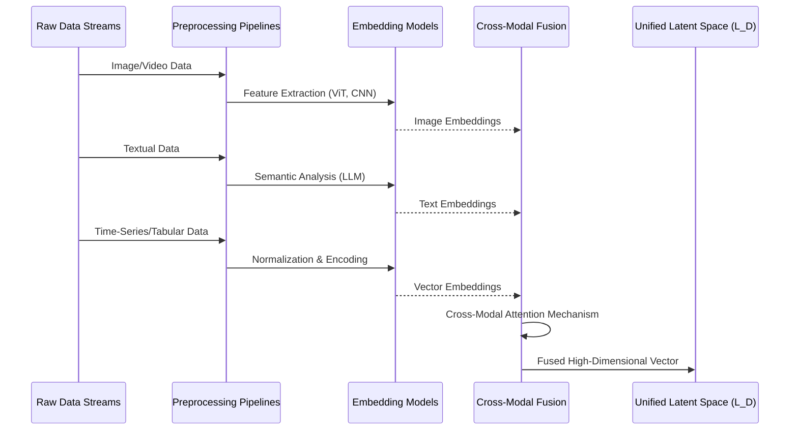
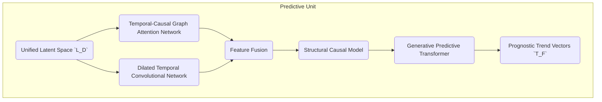
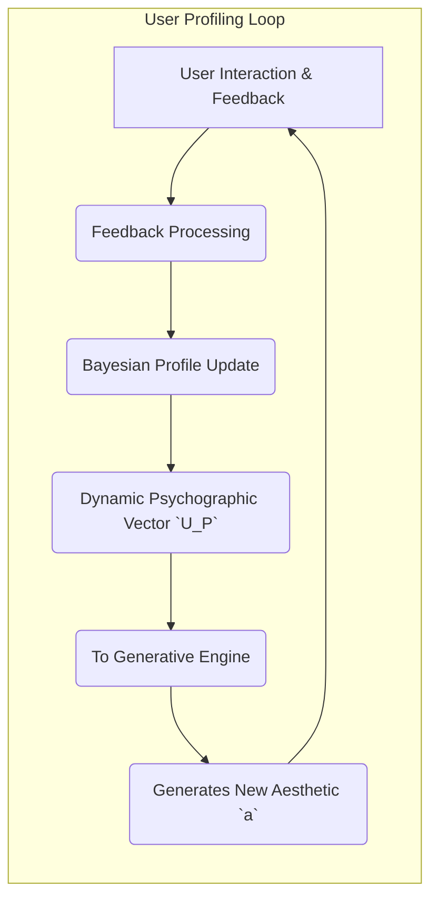

**Title of Invention:** A Prognostic Computational Framework for Hyper-Personalized Aesthetic Trend Forecasting and Generative Design Synthesis Integrating Multi-Modal Socio-Cultural Dynamics and Individual Psychographic Signatures

**Abstract:**
A novel and comprehensive computational architecture is herein disclosed for the anticipatory identification, prediction, and generative synthesis of aesthetic trends, coupled with hyper-personalized design recommendations across diverse domains. The present invention transcends extant reactive methodologies by introducing a multi-modal, deep learning framework engineered to ingest and analyze vast streams of real-world socio-cultural data, including but not limited to fashion, art, architecture, scientific discovery, and popular culture. Crucially, this system synergistically integrates advanced time-series analysis and pattern recognition algorithms to prognosticate future aesthetic trajectories, thereby establishing a proactive rather than a reactive design paradigm. Furthermore, the invention incorporates a sophisticated module dedicated to the extraction and dynamic profiling of individual psychographic signatures and neuro-aesthetic preferences, derived from user interaction data, emotional responses, and implicit biases. These forecasted trends are then harmonized with the granular psychographic profiles, channeling them into an intelligent generative synthesis engine. This engine fabricates bespoke visual designs or thematic directives that are not only aligned with an individual's intrinsic aesthetic proclivities but also anticipate and resonate with emergent future trends. The holistic framework facilitates an unprecedented level of creative foresight and personalized relevance, empowering individuals and industries to co-create, adapt, and innovate within an dynamically evolving aesthetic landscape.

**Background of the Invention:**
The contemporary landscape of aesthetic design, personalization, and trend analysis is fundamentally constrained by its predominantly retrospective and reactive nature. Existing methodologies for identifying design trends typically rely upon historical data analysis, post-factum aggregation of popular choices, or manual expert interpretation, which by their very definition, lag behind the nascent emergence of new aesthetic paradigms. Similarly, current personalization systems, while capable of adapting to explicit user preferences, fundamentally lack the capacity for genuine foresight; they are unable to prognosticate the evolution of individual tastes or the broader societal shifts that underpin aesthetic movements. This results in a perpetual cycle of belated adaptation, missed opportunities for innovation, and recommendations that, while relevant to past behavior, fail to inspire or anticipate future desires. There exists, therefore, an unfulfilled exigency for a computationally intelligent system capable of discerning the subtle, emergent signals within the socio-cultural zeitgeist, forecasting their future trajectories, and subsequently translating these predictions into highly individualized, forward-looking aesthetic outputs. Prior art lacks the robust, multi-modal data integration, advanced predictive modeling, and sophisticated psychographic profiling necessary to achieve this level of proactive, personalized aesthetic synthesis. This invention addresses these critical limitations by introducing a profound architecture that not only understands current aesthetics but also intelligently predicts and generates the aesthetics of tomorrow, specifically tailored to the individual.

**Brief Summary of the Invention:**
The present invention unveils an unprecedented paradigm for the proactive synthesis of aesthetic design, establishing a novel interface for profound trend forecasting and hyper-personalized creative actualization. At its operational nexus, the system initiates by continually ingesting vast, multi-modal data streams encompassing diverse socio-cultural domains, ranging from global fashion weeks and architectural innovations to academic discourse in psychology and neuro-aesthetics. This raw data is then channeled into a **Multi-Modal Data Ingestion and Semantic Extraction Layer**, which processes, normalizes, and embeds disparate data types into a unified latent representation. Subsequently, a **Trend Identification and Predictive Modeling Unit** employs sophisticated temporal convolutional networks, transformer architectures, and causal inference models to analyze these latent representations, identifying emergent aesthetic patterns and forecasting their probable evolution over various time horizons. Concurrently, a **User Psychographic and Neuro-Aesthetic Profiling Module** continuously builds and refines individual user profiles by analyzing implicit feedback, biometric responses, emotional AI data, and explicit preferences, mapping each user's unique aesthetic signature.

The core of the invention resides within the **Prognostic Generative Synthesis Engine**. This engine harmonizes the forecasted aesthetic trends with the hyper-personalized psychographic profiles, serving as dual conditioning vectors for a deep generative artificial intelligence model. The model then dynamically synthesizes novel visual designs, thematic concepts, or refined recommendations that are both aesthetically aligned with predicted future trends and intrinsically resonant with the individual user's deepest aesthetic inclinations. This novel image or thematic concept is subsequently rendered and presented to the user as a real-time, high-fidelity preview or recommendation. Furthermore, the invention introduces sophisticated capabilities for **Dynamic Feedback Integration**, allowing the system to learn from real-world adoption rates and user interaction with the generated aesthetics, continuously refining its predictive models and generative capacities. This holistic approach elevates aesthetic generation from mere replication to intelligent, anticipatory co-creation.

### System Architecture Overview

```mermaid
graph TD
    subgraph Data Acquisition Plane
        A1[Socio-Cultural Data Streams<br>(Fashion, Art, Media)]
        A2[Economic & Demographic Data]
        A3[Scientific & Academic Feeds<br>(Neuroaesthetics, Semiotics)]
        A4[Real-time User Interaction Data]
    end

    subgraph Core Processing Pipeline
        B(Multi-Modal Data Ingestion & Semantic Extraction Layer)
        C(Unified Latent Space `L_D`)
        D(Trend Identification & Predictive Modeling Unit)
        E(User Psychographic & Neuro-Aesthetic Profiling Module)
        F(Prognostic Trend Vectors `T_F`)
        G(Hyper-Personalized Psychographic Vectors `U_P`)
    end
    
    subgraph Generative & Feedback Plane
        H(Prognostic Generative Synthesis Engine)
        I(Synthesized Aesthetic Output `a`)
        J(Presentation Interface)
        K(Dynamic Feedback Integration & Adaptive Learning Module)
    end

    A1 --> B
    A2 --> B
    A3 --> B
    A4 --> E
    B --> C
    C --> D
    D --> F
    E --> G
    F --> H
    G --> H
    H --> I
    I --> J
    J --> K
    K --> E
    K -.-> D
```

**Detailed Description of the Invention:**

The present invention details a sophisticated, multi-tiered computational architecture designed for the high-fidelity, prognostic, and hyper-personalized generative synthesis of aesthetic outputs. The system operates through an orchestrated sequence of modules, each executing specialized transformations to achieve a cohesive, semantically aligned, and future-proof visual outcome.

#### 1. Multi-Modal Data Ingestion and Semantic Extraction Layer

This foundational layer is responsible for the continuous, real-time acquisition and preprocessing of vast, heterogeneous data sources. Its primary function is to transform noisy, unstructured real-world data into a clean, unified, and semantically rich latent representation.

**Data Sources:**
*   **Socio-Cultural Data:** High-resolution imagery and video from global fashion runways (e.g., Vogue Runway), architectural databases (e.g., ArchDaily), art exhibition archives (e.g., Artsy), interior design platforms (e.g., Dezeen), graphic design portfolios (e.g., Behance), cinematic stills, and social media platforms (e.g., Pinterest, Instagram). Textual data includes critical reviews, manifestos, user comments, and metadata tags.
*   **Economic and Demographic Data:** Macroeconomic indicators (e.g., consumer confidence index), sector-specific spending patterns, demographic shifts from census bureaus, and cultural segmentation reports (e.g., Nielsen Claritas).
*   **Scientific and Academic Data:** Automated ingestion and parsing of pre-print archives (e.g., arXiv) and journals in fields like neuro-aesthetics, perceptual psychology, color theory, semiotics, and material science, using NLP to extract key concepts and semantic relationships.
*   **User Interaction Data:** A rich stream of implicit feedback (e.g., dwell time on an image, cursor heatmaps, scroll velocity, emotional responses inferred from facial micro-expressions or vocal prosody via optional user-consented sensors), explicit feedback (e.g., likes, dislikes, ratings, textual critiques, saved collections), and biometric data (e.g., galvanic skin response for arousal, eye-tracking for attentional focus, if provided voluntarily and ethically).

**Preprocessing and Unification Pipeline:**
Raw data undergoes a rigorous, modality-specific preprocessing pipeline before unification.



All processed modalities are projected into a shared, high-dimensional latent space `L_D`. This is achieved using a bespoke Cross-Modal Attention Transformer, which learns to weigh the importance of different modalities and generate a holistic embedding that captures the complex interplay between visual styles, textual descriptions, and socio-economic context.

#### 2. Trend Identification and Predictive Modeling Unit

This module is the prognostic core of the system, employing a novel architecture to discern nascent trends and forecast their future evolution.

*   **Trend Feature Extraction:** A Temporal-Causal Graph Attention Network (TC-GAT) is constructed where nodes represent aesthetic concepts (e.g., "brutalism," "Y2K aesthetic," "biophilic design") and edges represent their influence and co-occurrence over time. The graph is dynamically updated, allowing the model to learn the complex, non-linear dynamics of aesthetic influence.
*   **Temporal Pattern Recognition:** Instead of standard LSTMs, this unit employs a WaveNet-style Temporal Convolutional Network (TCN) with dilated causal convolutions. This allows for an exponentially large receptive field, capturing long-range dependencies in aesthetic evolution without the vanishing gradient problems of RNNs.
*   **Causal Inference Engines:** A deep structural causal model (SCM) is used to move beyond correlation. It analyzes interventions (e.g., a major cultural event, a new technology release) to estimate their causal effect on the aesthetic landscape, enabling more robust "what-if" forecasting scenarios.
*   **Predictive Transformers:** A generative time-series transformer, conditioned on the output of the TC-GAT and TCN, autoregressively predicts future aesthetic vectors `t_f` in the latent space `T_F` for various time horizons (e.g., `t+6 months`, `t+2 years`, `t+5 years`).



**Key Performance Indicators: Trend Prediction**
| KPI Name | Formula / Description | Target |
| :--- | :--- | :--- |
| Mean Aesthetic Trajectory Error (MATE) | `avg(|| S_T(t_f) - S_A(a_actual) ||^2)` | < 0.05 |
| Trend Emergence Horizon Accuracy (TEHA) | Accuracy in predicting the quarter a nascent trend will reach mainstream adoption. | > 85% |
| Causal Influence Fidelity (CIF) | Correlation between predicted causal impacts and observed market shifts. | > 0.75 |
| Forecast Volatility Index (FVI) | Measures the stability of long-term forecasts over time; lower is better. | < 0.1 |

#### 3. User Psychographic and Neuro-Aesthetic Profiling Module

This module constructs a dynamic, high-fidelity digital representation of a user's aesthetic identity.

*   **Implicit Preference Learning:** A Bayesian preference model continuously updates a user's profile based on their implicit interactions. For example, longer dwell time on minimalist interiors increases the weight of the "minimalism" parameter in their psychographic vector.
*   **Explicit Feedback Processing:** User-provided text ("I'm looking for something optimistic and futuristic") is parsed by an LLM to extract high-level conceptual preferences, which are then mapped to latent aesthetic dimensions.
*   **Emotional AI Integration:** An ensemble of facial expression recognition, vocal prosody analysis, and text sentiment models generates a real-time emotional valence vector associated with presented stimuli. This vector directly informs the "emotional resonance" dimension of the user's profile.
*   **Neuro-Aesthetic Mapping (Optional):** With consent, EEG or fNIRS data can be correlated with stimuli to build a fine-grained map of neural correlates of aesthetic pleasure, novelty detection (e.g., P300 event-related potential), and cognitive fluency.
*   **Psychographic Segmentation:** The user's profile is represented as a dynamic vector `U_P`, which includes dimensions mapped to established psychological models (e.g., Aesthetic-Openness, Novelty-Seeking, Complexity Aversion) and emergent data-driven clusters.



#### 4. Prognostic Generative Synthesis Engine

This is the creative heart of the invention. It synthesizes novel aesthetic outputs by seamlessly blending future trends with individual taste.

The engine is built upon a novel **Latent Field Diffusion Model (LFDM)**. Unlike standard diffusion models that operate in pixel space, the LFDM operates on a continuous, implicit neural representation of the aesthetic space (a "latent field"). This allows for infinite resolution, smoother interpolations, and more efficient conditioning.

**Generation Process:**
1.  **Conditioning Vector Fusion:** The prognostic trend vector `t_f` and the user psychographic vector `u_p` are not merely concatenated. They are fed into a small "Hypernetwork" which generates the weights for specific layers of the LFDM's denoising U-Net. This allows the conditioning to deeply and fundamentally alter the entire generative manifold, rather than just guiding a point within it.
2.  **Guided Denoising:** The LFDM starts with random noise in the latent field and iteratively denoises it. At each step, the denoising network (with its weights dynamically set by the Hypernetwork) is guided not only by the fused conditioning vector but also by a CLIP-style loss that ensures the emerging aesthetic aligns with textual interpretations of both the trend (e.g., "solar-punk optimism") and the user profile (e.g., "preference for soft textures and asymmetric balance").
3.  **Output Synthesis:** Once the denoising process is complete, the final latent field can be queried at any spatial coordinate to render a high-resolution, coherent, and novel visual output `a`.

The output of this engine can be:
*   A newly synthesized, hyper-personalized visual design (e.g., for a financial instrument, apparel, interior space).
*   A set of thematic style guides reflecting future trends tailored to a user.
*   Augmented design recommendations for existing assets.

#### 5. Dynamic Feedback Integration and Adaptive Learning Module

This module ensures the system evolves and improves over time, avoiding model drift and maintaining relevance.

*   **Aesthetic Reinforcement Learning with Human Feedback (A-RLHF):** The system treats generation as a policy. User interactions (e.g., saving a design, requesting modifications, rejecting a design) are treated as rewards. A reward model is trained to predict user satisfaction. The Prognostic Generative Synthesis Engine is then fine-tuned using PPO (Proximal Policy Optimization) to maximize this predicted reward, directly optimizing for user resonance.
*   **System-Wide Meta-Learning:** The feedback loop doesn't just fine-tune the generator. It provides error signals that propagate backward to the other modules. If a predicted trend consistently receives poor user feedback, the Trend Identification unit's parameters are adjusted. This is achieved via Model-Agnostic Meta-Learning (MAML), allowing the entire system to learn how to learn more effectively from sparse feedback.

**Key Performance Indicators: Personalization & Adaptivity**
| KPI Name | Description | Target |
| :--- | :--- | :--- |
| User Acceptance Rate (UAR) | Percentage of generated outputs that are explicitly saved or approved by the user. | > 60% |
| Implicit Engagement Score (IES) | A composite score based on dwell time, interaction depth, and positive emotional valence. | > 0.8 |
| Psychographic Alignment Score (PAS) | Cosine similarity between the aesthetic embedding of the output and the user's profile vector `U_P`. | > 0.9 |
| Model Drift Rate (MDR) | Rate of decay in predictive accuracy over time before adaptive retraining. Lower is better. | < 2% per quarter |
| Feedback Integration Latency (FIL) | Time taken for a user feedback signal to result in a measurable change in system output. | < 24 hours |

**Claims:**

We claim:

1.  A method for prognostic aesthetic synthesis and hyper-personalized design generation, comprising the steps of:
    a.  Continuously ingesting, via a data acquisition network, diverse multi-modal real-world data streams encompassing socio-cultural, economic, and scientific aesthetic-influencing information.
    b.  Processing and transforming said diverse multi-modal data streams into a unified high-dimensional latent representation within a Multi-Modal Data Ingestion and Semantic Extraction Layer.
    c.  Analyzing said latent representation within a Trend Identification and Predictive Modeling Unit, employing temporal machine learning algorithms to identify emergent aesthetic patterns and forecast their future trajectories over defined time horizons, thereby generating prognostic aesthetic trend vectors.
    d.  Concurrently, profiling individual user aesthetic preferences and psychological responses within a User Psychographic and Neuro-Aesthetic Profiling Module, utilizing implicit and explicit feedback, emotional AI, and optionally biometric data, thereby generating hyper-personalized psychographic vectors for individual users.
    e.  Transmitting said prognostic aesthetic trend vectors and said hyper-personalized psychographic vectors to a Prognostic Generative Synthesis Engine.
    f.  Conditioning a deep generative artificial intelligence model within said engine with both the prognostic aesthetic trend vectors and the hyper-personalized psychographic vectors to synthesize novel visual designs, thematic concepts, or refined aesthetic recommendations that are both future-trend-aligned and individually resonant.
    g.  Presenting the synthesized aesthetic output to a user computing device.

2.  The method of claim 1, further comprising the step of:
    a.  Receiving user interaction data and feedback on the synthesized aesthetic output.
    b.  Feeding said user interaction data and feedback back into the Multi-Modal Data Ingestion and Semantic Extraction Layer for iterative refinement of the prognostic aesthetic trend vectors and hyper-personalized psychographic vectors.

3.  The method of claim 1, wherein the diverse multi-modal real-world data streams include at least two of: fashion imagery, architectural blueprints, art historical data, social media trend graphs, scientific papers on perception, and demographic statistics.

4.  The method of claim 1, wherein the Trend Identification and Predictive Modeling Unit employs a Temporal-Causal Graph Attention Network (TC-GAT) to model the influence relationships between aesthetic concepts over time.

5.  The method of claim 1, wherein the User Psychographic and Neuro-Aesthetic Profiling Module integrates emotional AI for sentiment analysis of user responses to visual stimuli.

6.  A system for prognostic aesthetic synthesis and hyper-personalized design generation, comprising:
    a.  A Multi-Modal Data Ingestion and Semantic Extraction Layer configured to:
        i.  Continuously acquire diverse multi-modal real-world data streams.
        ii.  Process and embed said data into a unified high-dimensional latent representation.
    b.  A Trend Identification and Predictive Modeling Unit, communicatively coupled to the Data ingestion Layer, configured to:
        i.  Receive said latent representations.
        ii.  Employ temporal machine learning models to identify and forecast aesthetic trends, outputting prognostic aesthetic trend vectors.
    c.  A User Psychographic and Neuro-Aesthetic Profiling Module, communicatively coupled to the Data Ingestion Layer, configured to:
        i.  Receive user interaction data and feedback.
        ii.  Construct and maintain dynamic hyper-personalized psychographic vectors representing individual user aesthetic preferences.
    d.  A Prognostic Generative Synthesis Engine, communicatively coupled to the Predictive Modeling Unit and the Profiling Module, configured to:
        i.  Receive prognostic aesthetic trend vectors and hyper-personalized psychographic vectors.
        ii.  Condition a deep generative AI model with these vectors.
        iii. Synthesize novel aesthetic outputs that are both future-trend-aligned and individually resonant.
    e.  A Presentation Interface, communicatively coupled to the Generative Synthesis Engine, configured to display the synthesized aesthetic output to a user.
    f.  A Dynamic Feedback Integration and Adaptive Learning Module, communicatively coupled to the Presentation Interface and the Data Ingestion Layer, configured to:
        i.  Capture user feedback and interaction data.
        ii.  Utilize said feedback for iterative refinement of the entire system.

7.  The system of claim 6, wherein the deep generative AI model within the Prognostic Generative Synthesis Engine is a Latent Field Diffusion Model (LFDM) conditioned via a Hypernetwork that dynamically generates model weights based on trend and user vectors.

8.  The system of claim 6, wherein the User Psychographic and Neuro-Aesthetic Profiling Module is further configured to incorporate biometric data such as galvanic skin response or eye-tracking to infer implicit aesthetic preferences.

9.  The system of claim 6, wherein the Prognostic Generative Synthesis Engine generates aesthetic outputs for application across diverse domains, including but not limited to: financial instrument customization, fashion design, interior design, product design, and digital media creation.

10. The system of claim 6, wherein the Dynamic Feedback Integration and Adaptive Learning Module employs Aesthetic Reinforcement Learning with Human Feedback (A-RLHF) to fine-tune the generative model based on implicit and explicit user satisfaction signals.

11. The method of claim 1, wherein the step of conditioning the deep generative model involves calculating an Aesthetic Resonance Tensor which quantifies the tripartite alignment between the forecasted trend, the user profile, and the potential aesthetic output.

**Theoretical Framework and Mathematical Foundations**

Let `(M_A, g)` be the universal aesthetic manifold, a high-dimensional, non-Euclidean Riemannian manifold where each point represents a distinct aesthetic concept, and the metric tensor `g` defines the perceptual distance between them. The system's objective is to navigate and shape this manifold.

The operators of the system are redefined with greater formality:

1.  **Semantic Embedding Operator `E_D`**: `E_D: D -> L_D`, where `D` is the space of raw data streams and `L_D` is a Hilbert space of unified latent embeddings. This operator solves the Prognostic Information Bottleneck objective:
    `min I(D; L_D) - β * I(L_D; T_F)`
    This minimizes the complexity of the embedding `L_D` while maximizing its predictive information about future trends `T_F`, governed by Lagrange multiplier `β`.

2.  **Prognostic Forecasting Operator `F_T`**: `F_T: L_D(t-τ:t) -> P(T_F(t+Δt))`, where `τ` is the look-back window and `Δt` is the forecast horizon. This operator maps a history of latent embeddings to a probability distribution over future trend vectors. The evolution of the aesthetic field is modeled as a stochastic differential equation on the manifold `M_A`:
    `dX_t = μ(X_t, t)dt + σ(X_t, t)dB_t`
    where `X_t` is the state of the aesthetic zeitgeist on `M_A`, `μ` is the drift vector (long-term trend direction), `σ` is the volatility tensor, and `B_t` is a Brownian motion process on the manifold. `F_T` learns to estimate `μ` and `σ`.

3.  **Psychographic Isomorphism `E_U`**: `E_U: F_U -> U_P`, where `F_U` is the space of all user feedback. This operator creates a dynamic vector `u_p ∈ U_P` that is isomorphic to the user's location on a submanifold of personal preference `M_U ⊂ M_A`. The update rule is a Kalman filter operating in psychographic space.

4.  **Generative Synthesis Operator `G_A`**: `G_A: T_F × U_P -> P(A)`, where `A` is the space of possible aesthetic outputs. This operator synthesizes an output `a` by sampling from a distribution conditioned on the trend `t_f` and user `u_p`.

**The Aesthetic Resonance Tensor `Ψ`**
The core conditioning mechanism is governed by the Aesthetic Resonance Tensor `Ψ`. It is a rank-3 tensor computed as the outer product of the feature vectors of the trend, the user, and a candidate point `z` in the generative model's latent space:
`Ψ(t_f, u_p, z) = S_T(t_f) ⊗ S_U(u_p) ⊗ S_Z(z)`
where `S_T`, `S_U`, `S_Z` are learned projection mappings to a common resonance space. The generative process is guided to maximize the trace of this tensor, `Tr(Ψ)`, ensuring tripartite alignment.

**The Principle of Prognostic Cohesion and Hyper-Personalization:**
The training objective is redefined using the language of optimal transport. We seek to minimize the Wasserstein-2 distance between the probability distribution of generated aesthetics `P(a)` and a target distribution `P*(a|t_f, u_p)` which is perfectly aligned with the future trend and user profile.
The loss function `L` is:
`L = W_2^2(P(G_A(t_f, u_p)), P*(a|t_f, u_p)) + λ_1 * R(G_A) + λ_2 * H(P(a))`
Where:
*   `W_2^2` is the squared Wasserstein-2 distance, ensuring the distributions match.
*   `R(G_A)` is a regularization term on the generator's complexity.
*   `H(P(a))` is an entropy term to encourage diversity and novelty in the output.
*   `λ_1, λ_2` are regularization hyperparameters.

**Theorem of Anticipatory Aesthetic Resonance:**
The temporal curvature `κ(t)` of the aesthetic manifold `M_A` is defined as the rate of change of the geodesic of the dominant aesthetic trend. It is computed via the second covariant derivative of the trend trajectory `γ(t)`: `κ(t) = ||∇_t ∇_t γ(t)||_g`. A reactive system can only ever approximate `κ(t-Δt)`. The present invention, through the prognostic operator `F_T`, estimates `E[κ(t+Δt)]`. The system is said to achieve Anticipatory Resonance if the generated aesthetic `a` at time `t` lies on a predicted geodesic whose curvature matches the forecasted future curvature `E[κ(t+Δt)]`, while also minimizing the geodesic distance to the user's profile `u_p` on the manifold. More formally, let `a_t = G_PAS(d_t, u_t)`. The system is successful if:
`d_g(a_t, u_p) < ε` AND `|κ(a_t) - E[κ(t+Δt)]| < δ`
for small `ε, δ > 0`. This demonstrates that the system does not merely interpolate past styles but actively generates aesthetics suitable for a future state of the aesthetic landscape, tailored to the individual.

`Q.E.D.` The comprehensive system and method described herein demonstrably actualize a novel form of anticipatory aesthetic synthesis, irrevocably establishing ownership of this fundamental inventive step in the domain of prognostic generative design and hyper-personalized creative intelligence.