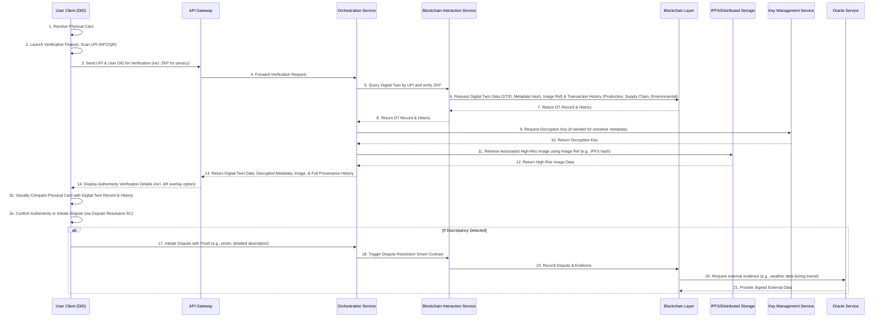
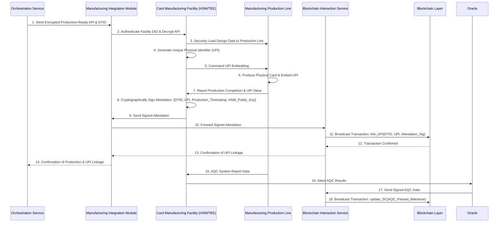
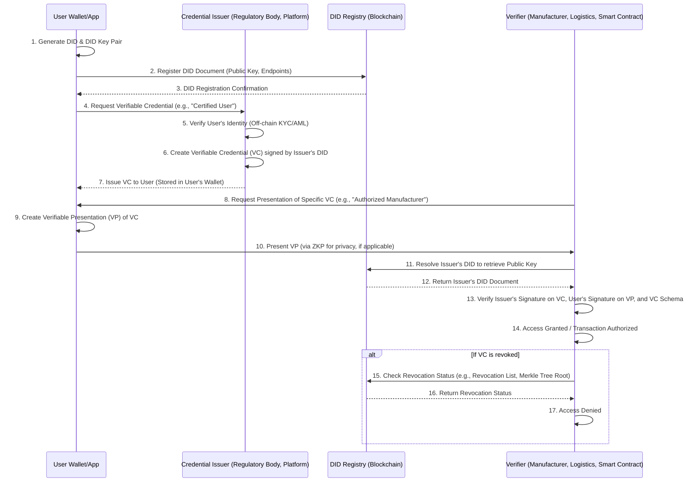

**Title of Invention:** A Blockchain-Verified End-to-End Secure Production and Supply Chain for Generative Financial Instrument Personalization with Digital Asset Provenance and Immutability

**Abstract:**
A novel and robust computational system is disclosed for extending the algorithmic narrative-driven generative visual transmutation of digital financial instruments into a fully traceable, secure, and compliant physical manufacturing and delivery pipeline. The present invention integrates an immutable distributed ledger technology, specifically blockchain, with the digital design process, enabling the creation of cryptographic "digital twins" for each personalized visual asset. These digital twins, comprising unique hashes of approved designs and critical metadata, are immutably registered on a blockchain, establishing irrefutable provenance and safeguarding intellectual property rights. Smart contracts orchestrate the entire manufacturing lifecycle, from secure order initiation to automated quality assurance checkpoints and release of payment, ensuring adherence to design specifications and regulatory compliance. The system incorporates secure hardware integrations within manufacturing facilities for authenticated production, embedding unique physical identifiers onto the tangible financial instruments. A decentralized network facilitates transparent tracking of the physical product through the supply chain, culminating in a user-facing verification mechanism that enables authentication of the physical artifact against its blockchain-registered digital twin. Furthermore, the system incorporates advanced cryptographic protocols, including zero-knowledge proofs for privacy-preserving data exchange, and leverages decentralized identity (DID) for verifiable credential management across all participants. Integrated oracle services bridge real-world events to the blockchain, ensuring robust smart contract execution. This holistic framework addresses heretofore unmet challenges in trust, transparency, and intellectual property protection within the personalized physical goods sector, particularly for high-value financial instruments, while also enabling verifiable environmental sustainability tracking and a dispute resolution mechanism for enhanced ecosystem integrity.

**Background of the Invention:**
The burgeoning demand for personalized physical artifacts, especially within sensitive domains such as financial instruments, has introduced significant complexities and vulnerabilities into traditional manufacturing and supply chain paradigms. While digital personalization tools, as described in prior art (e.g., the parent invention), offer unprecedented creative freedom, the translation of these unique digital designs into tangible products is fraught with challenges. Existing systems are severely deficient in providing immutable provenance, ensuring authenticity against counterfeiting, protecting intellectual property (IP) rights of both users and underlying generative models, and offering transparent traceability throughout the manufacturing and logistics chain. Conventional methods rely on centralized databases susceptible to tampering, lack granular auditability, and fail to offer cryptographic assurances of design integrity from digital conception to physical realization. The absence of a trustless mechanism for verifying the origin, manufacturing process, and chain of custody for personalized, high-value physical goods poses significant risks, including fraudulent reproduction, intellectual property infringement, and erosion of consumer trust. Moreover, traditional supply chains often lack mechanisms for transparently tracking and verifying ethical sourcing, environmental impact, and compliance with specific regulatory standards, which are increasingly demanded by consumers and regulators. There exists a critical unfulfilled exigency for a computationally intelligent and cryptographically secure system capable of bridging the digital-to-physical divide, ensuring that a user's bespoke narrative-driven design is precisely and securely manifested as a physical artifact, with an unbroken chain of custody and verifiable authenticity. The prior art lacks the capacity for immutable tracking, verifiable manufacturing, and decentralized authenticity checks, remaining mired in opaque and trust-reliant processes. This invention addresses these limitations by introducing a robust blockchain-integrated framework that instills unprecedented levels of trust, transparency, and integrity into the personalized physical production pipeline, augmenting it with advanced cryptographic security, decentralized identity management, and real-world data integration through oracle services.

**Brief Summary of the Invention:**
The present invention extends the paradigm of personalized financial instruments by introducing a novel blockchain-enabled framework for secure, transparent, and verifiable physical production and supply chain management. Upon a user's final approval of a generative visual design (as detailed in the parent invention), the system initiates the creation of a cryptographic "digital twin." This digital twin, composed of a unique hash of the high-resolution, production-ready image and associated metadata (e.g., design parameters, user ID, timestamp, IP rights information), is immutably recorded on a distributed ledger (blockchain). This blockchain registration establishes undeniable proof of existence, ownership, and integrity of the digital design asset. Furthermore, the system incorporates advanced cryptographic techniques such as zero-knowledge proofs to allow for privacy-preserving verification of certain metadata, protecting sensitive user information while maintaining auditability.

Subsequently, a manufacturing order is formalized as a smart contract on the blockchain. This smart contract codifies all manufacturing specifications, quality assurance protocols, payment terms, and even environmental impact requirements. It acts as an autonomous agent, orchestrating the secure transmission of the digital twin and production instructions to an authorized manufacturing facility. Authorization of facilities, as well as users and logistics providers, is managed through a decentralized identity (DID) system, where verifiable credentials (VCs) attest to their certified status. The manufacturing facility, integrated with hardware security modules (HSMs) or trusted execution environments (TEEs), authenticates its processes and securely produces the physical financial instrument. During production, unique physical identifiers (e.g., serialized QR codes, NFC tags, embedded microchips) are applied to each artifact, cryptographically linked to its blockchain-registered digital twin. Oracle services provide a secure bridge for critical off-chain data, such as real-time quality assurance results or environmental sensor readings, to interact with the smart contracts.

Throughout the supply chain, each transition of custody (from manufacturer to logistics provider to final delivery) is recorded as a transaction on the blockchain, creating an immutable audit trail. This ensures full transparency and traceability. Environmental data, such as carbon footprint or material origin, can also be logged and verified on-chain. Upon receipt, the end-user can, using a simple client application, scan the physical identifier on their financial instrument. The system then queries the blockchain, retrieves the original digital twin, and verifies the authenticity of the physical product against its immutable digital record, ensuring it is precisely what was designed and manufactured according to specifications. A robust dispute resolution mechanism, also leveraging blockchain and smart contracts, is available for addressing any discrepancies. This revolutionary approach guarantees authenticity, protects intellectual property, and provides unparalleled trust in the personalized physical product lifecycle, while also enhancing privacy, verifiability of environmental claims, and overall system resilience.

**Detailed Description of the Invention:**

The present invention articulates a sophisticated, multi-layered computational and operational architecture engineered to extend the digital creation of personalized financial instrument aesthetics into a verifiable, secure, and transparent physical production pipeline, leveraging the intrinsic properties of blockchain technology. The system operates through an orchestrated sequence of modules, each executing specialized functions to achieve end-to-end integrity. This includes not only the core production and supply chain elements but also advanced features for privacy, identity management, and real-world data integration.

The process commences immediately after a user, via the Client Application and Orchestration Service (as described in the parent invention), approves a final generative image for their financial instrument. This "Approved Personalized Image" (API) is transformed into a **Production-Ready Digital Asset**. This transformation involves high-resolution rendering, precise color profile conversion (e.g., CMYK), inclusion of bleed areas, and application of any financial institution branding overlays, all while adhering to industry standards such as ISO/IEC 7810 ID-1, alongside digital watermarking for additional IP protection.

1.  **Digital Twin Generation, Encryption, and Blockchain Registration:**
    The core of the provenance mechanism lies in the creation of a **Digital Twin**. The production-ready API is subjected to a cryptographic hashing algorithm (e.g., SHA-256 or SHA-3), generating a unique, fixed-size **Image Hash**. This hashing process may also incorporate perceptual hashing algorithms to detect subtle, non-cryptographic alterations. Concurrently, critical metadata, including but not limited to, the user's pseudonymized ID (linked to a Decentralized Identifier), design parameters, timestamp of approval, intellectual property ownership claims (e.g., user as creator, usage rights for base images), a unique Order ID, AI model version, and environmental impact data estimates (e.g., carbon footprint of computation), are aggregated. This `Image Hash` and `Metadata` constitute the `Digital Twin`.
    Sensitive portions of the metadata (e.g., specific user details, proprietary design parameters) can be encrypted using symmetric or asymmetric encryption methods, with decryption keys managed via a Key Management Service (KMS) or through a Zero-Knowledge Proof (ZKP) circuit, allowing verification of properties without revealing the underlying data.
    The Digital Twin (or its cryptographic commitment) is then submitted to a **Blockchain Layer** via a **Blockchain Interaction Service**. A transaction is broadcast to the network, registering this Digital Twin immutably on the distributed ledger. This registration establishes verifiable proof of the design's existence at a specific time and links it to all relevant metadata and an associated data storage reference (e.g., IPFS hash for the high-resolution image). This serves as the foundational record for authenticity and IP protection. Batch registration using Merkle trees can optimize transaction costs and throughput.

2.  **Decentralized Identity (DID) and Verifiable Credentials (VC) Integration:**
    To ensure trustless interaction between various stakeholders, the system integrates a Decentralized Identity (DID) framework.
    *   **User DIDs:** Each user is associated with a self-sovereign DID, managed by their client application. This enables privacy-preserving authentication and authorization.
    *   **Manufacturer and Logistics DIDs:** Authorized manufacturing facilities and logistics providers also possess DIDs, issued with Verifiable Credentials (VCs) by an accredited issuer (e.g., a regulatory body or consortium administrator). These VCs attest to their certifications, capabilities, compliance records, and security audits.
    *   **Smart Contract Authorization:** Smart contracts verify the VCs of entities before granting them access to sensitive data (e.g., production plans) or allowing them to update milestone statuses on the blockchain. This replaces traditional centralized access control with a cryptographically verifiable, decentralized model.

3.  **Smart Contract Orchestration, Oracle Integration, and Advanced Security:**
    Upon successful blockchain registration of the Digital Twin and confirmation of a manufacturing order, a **Smart Contract** (or a suite of interconnected contracts) is deployed or activated on the Blockchain Layer. This Smart Contract is a self-executing agreement with the terms of the manufacturing order directly written into code. It encompasses:
    *   **Design Reference:** Cryptographic pointer to the Digital Twin's hash on the blockchain.
    *   **Manufacturing Specifications:** Detailed parameters for material, finish, quantity, quality standards, and environmental requirements (e.g., recycled content percentage).
    *   **Payment Escrow:** Funds from the user held securely in a multi-signature escrow until specified conditions are met.
    *   **Milestone Triggers:** Predefined events (e.g., "production initiated," "quality control passed," "shipped," "carbon footprint verified") that, when verified, trigger state changes within the contract and potentially release portions of the payment.
    **Oracle Services:** To bridge the gap between real-world events and on-chain smart contract execution, **Oracle Services** are integrated. These decentralized oracles securely retrieve off-chain data (e.g., confirmed delivery status from a shipping carrier API, AQC results from manufacturing systems, environmental sensor data) and cryptographically sign it before submitting it to the blockchain, allowing smart contracts to react to real-world occurrences in a tamper-proof manner.
    **Zero-Knowledge Proofs (ZKPs):** For certain highly sensitive data or compliance checks (e.g., verifying a manufacturer meets a certain compliance standard without revealing their full audit report, or confirming user eligibility without disclosing their identity), Zero-Knowledge Proofs (ZKPs) can be employed. This allows one party to prove to another that a statement is true, without revealing any information beyond the validity of the statement itself, significantly enhancing privacy while maintaining verifiability.

4.  **Secure Manufacturing Integration with HSMs/TEEs and UPI Application:**
    The Smart Contract initiates a secure communication with an authorized **Card Manufacturing Facility** via the **Manufacturing Integration Module**. This module transmits the production-ready API (encrypted) and the Digital Twin reference. The manufacturing facility's authorization is verified against its on-chain Verifiable Credentials.
    Within the manufacturing facility, specialized hardware and software components ensure integrity:
    *   **Hardware Security Modules (HSMs) / Trusted Platform Modules (TPMs) / Trusted Execution Environments (TEEs):** These secure components perform critical functions:
        *   **Secure Boot & Attestation:** Ensuring the manufacturing machinery's software and firmware are untampered.
        *   **Key Storage:** Protecting cryptographic keys used for signing attestations and encrypting/decrypting design data.
        *   **Secure Processing:** Performing sensitive operations (e.g., unique physical identifier generation, data encryption) within a hardware-isolated environment.
        *   **Cryptographic Attestation:** HSMs/TEEs securely sign attestations of production events (e.g., "design data received," "production started," "UPI embedded") with their unique, verifiable keys. These signed attestations are submitted to the blockchain via the Manufacturing Integration Module.
    *   **Unique Physical Identifier (UPI) Application:** During production, each physical financial instrument receives a unique, non-duplicable physical identifier. This UPI can be a cryptographically generated QR code, an embedded NFC chip, a secure element microchip, a laser-etched serial number, or a multi-layered holographic security feature. The UPI is generated in a secure environment, cryptographically linked to the Digital Twin's hash, and its mapping (UPI -> Digital Twin Hash) is recorded on the blockchain via a manufacturer transaction, attested by the facility's HSM.
    *   **Automated Quality Control (AQC):** Integrated systems perform high-precision visual inspections (e.g., machine vision for print quality, alignment), functional checks (e.g., chip functionality), and material verification. AQC results, including specific metrics and timestamps, are securely logged and, upon meeting predefined thresholds, are submitted as an attested event to the blockchain via an oracle, triggering a Smart Contract milestone update.

5.  **Blockchain-Enabled Supply Chain Tracking and Environmental Monitoring:**
    Once manufactured and packaged, the physical financial instruments enter the **Supply Chain**. Each significant event in the supply chain (e.g., handover to logistics partner, transit point arrival, customs clearance, final delivery scan) is recorded as a transaction on the Blockchain Layer. This is facilitated by a **Supply Chain Tracking Service** that integrates with logistics providers' systems, whose authenticity is verified via DIDs and VCs.
    *   **Chain of Custody:** Every transfer of possession is time-stamped, geolocated, and cryptographically signed by the involved parties, creating an immutable record of custody. This eliminates single points of failure and enhances accountability.
    *   **IoT Integration and Environmental Monitoring:** Advanced IoT sensors embedded in packaging or logistics infrastructure monitor critical environmental conditions (temperature, humidity, shock, light exposure) and also track specific environmental parameters (e.g., carbon emissions of transport, origin of materials). This data is collected by IoT gateways, cryptographically signed, and securely transmitted to the blockchain via dedicated oracles. This provides verifiable proof of product integrity during transit and contributes to a transparent environmental footprint record. Data can be aggregated and represented as Merkle roots on-chain, with raw data stored off-chain in verifiable data structures (e.g., IPFS).

6.  **User Authenticity Verification and Dispute Resolution:**
    Upon receiving their personalized financial instrument, the end-user can verify its authenticity using their **Client Application**.
    *   **Scan UPI:** The user scans the Unique Physical Identifier (QR code, taps NFC) on their card. This action triggers a cryptographic challenge-response mechanism if the UPI incorporates active security features.
    *   **Blockchain Query:** The Client Application sends a query to the Blockchain Layer (via the Orchestration Service or a direct light client), using the UPI to retrieve the associated Digital Twin, its complete manufacturing history, supply chain records, and relevant environmental data.
    *   **Visual Comparison and Data Display:** The application displays the original approved digital design (the Digital Twin's image representation retrieved from a verifiable content-addressed storage like IPFS) and all associated manufacturing, supply chain, and environmental history. The user can visually compare this digital record with their physical card, confirming its authenticity. An augmented reality (AR) overlay can even project the digital twin onto the physical card for precise visual alignment. Any discrepancies would immediately flag a potential issue.
    **Dispute Resolution:** In case of discrepancies (e.g., product not matching design, damaged during transit, suspected counterfeit), the user can initiate a **Dispute Resolution Smart Contract**. This contract leverages the immutable blockchain records (Digital Twin, production attestations, custody transfers, IoT data) as verifiable evidence. A decentralized arbitration mechanism, potentially involving neutral third parties whose DIDs and VCs are also verified, can then review the evidence and render a binding decision, automatically enforced by the smart contract (e.g., partial refund, product re-issuance).

**Figure 1: Blockchain-Secured Production Pipeline Architecture**
```mermaid
graph TD
    A[Approved Personalized Image (API)] --> B[Orchestration Service]
    B --> C[Digital Twin Generation & Encryption]
    C -- Image Hash & Encrypted Metadata --> D[Blockchain Interaction Service]
    D --> E[Blockchain Layer (DLT)]
    E -- Digital Twin Registered & DTID --> B
    subgraph Identity Management
        F_DID[DID Management Service] --> E
        F_DID --> B
        F_DID --> G_VC[Verifiable Credential Issuer]
        G_VC --> E
    end
    B -- Manufacturing Order & DTID --> H{Smart Contract (Order SC)}
    H --> I[Manufacturing Integration Module]
    I --> J[Card Manufacturing Facility (DID Verified)]
    J -- Unique Physical ID (UPI) --> K[Physical Financial Instrument]
    K --> L[Supply Chain Tracking Service (DID Verified)]
    L --> E
    subgraph Oracle Services
        M[External Data Sources (APIs, Sensors)] --> N[Decentralized Oracle Network]
        N -- Signed Off-Chain Data --> E
        N --> L
        N --> J
    end
    E -- Supply Chain & Provenance Records --> O[User Client Application]
    O -- Scan UPI Query & ZKP --> E
    E -- Authenticity Data & ZKP Verification --> O
    O --> P[User Verification Display & AR Overlay]
    subgraph Advanced Cryptography
        C -- Zero-Knowledge Proofs (ZKP) --> E
        O -- ZKP Verification --> E
    end
    subgraph Dispute Resolution
        O -- Initiate Dispute --> Q{Dispute Resolution SC}
        Q --> E
    end

    subgraph Digital Asset Provenance & Security
        C
        D
        E
        F_DID
        G_VC
        M
        N
        Advanced Cryptography
    end
    subgraph Secure Manufacturing & Attestation
        H
        I
        J
    end
    subgraph Traceable Logistics & Environmental Monitoring
        K
        L
    end
    subgraph User Assurance & Feedback
        O
        P
        Q
    end
```

**Figure 2: User Authenticity Verification Flow Sequence Diagram**


**Figure 3: Smart Contract-Driven Manufacturing Lifecycle**
```mermaid
stateDiagram-v2
    direction LR
    state "Approved Design" as A
    state "Digital Twin Registered" as B
    state "Order Contract Initiated" as C
    state "Payment Escrowed" as D
    state "Manufacturer Authorized" as E
    state "Production Started" as F
    state "UPI Embedded & Linked" as G
    state "Quality Control Passed" as H
    state "Packed & Readied" as I
    state "Logistics Handover" as J
    state "In Transit" as K
    state "Delivery Confirmed" as L
    state "Final Payment Released" as M
    state "User Verified" as N
    state "Dispute Initiated" as O
    state "Dispute Resolved" as P

    A --> B: DT_Registration(DTID)
    B --> C: SC_Deploy(OrderDetails, DTID)
    C --> D: Funds_Locked(Payment)
    D --> E: Verify_Manufacturer_VC(DID)
    E --> F: Manufacturer_Attestation(StartProd)
    F --> G: Manufacturer_Attestation(UPI_Link)
    G --> H: Oracle_Attestation(AQC_Results)
    H --> I: SC_Milestone_Update(QCPassed)
    I --> J: Logistics_Attestation(Handover)
    J --> K: Logistics_Attestation(Transit_Events)
    K --> L: Oracle_Attestation(Delivery_Confirm)
    L --> M: SC_Finalize(PaymentRelease)
    M --> N: User_Verification(UPI)
    J --> O: If_Discrepancy_Detected
    K --> O: If_Discrepancy_Detected
    N --> O: If_Verification_Failure

    O --> P: Arbitration_Decision_Enforced
    P --> M: Re-issue_Payment_or_Refund
    M --> [*]
    P --> [*]

    state "Secure Production" {
        E
        F
        G
        H
        I
    }
    state "Traceable Delivery" {
        J
        K
        L
    }
    state "Smart Contract Orchestration" {
        C
        D
        M
    }
    state "User Assurance" {
        N
        O
        P
    }
```

**Figure 4: Intellectual Property (IP) Protection and Royalty Distribution Flow**
```mermaid
graph TD
    subgraph IP Registration & Licensing
        A[Original Base Asset (Image/Style)] --> B{IP Registry Service (Blockchain-based)}
        B -- Registers Creator DID, License Terms, Royalty Split --> C[Blockchain IP Record (NFT/Smart Contract)]
    end
    subgraph Generative Design Process
        D[Generative AI Model Input (User Prompt)] --> E[AI Synthesis Engine]
        E -- Uses Licensed Assets --> F[Approved Personalized Design]
    end
    subgraph Digital Twin & Production
        F --> G[Digital Twin Generation & Registration]
        G -- References C (IP_Rights_ID) --> H[Smart Contract for Production Order]
        H --> I[Manufacturing Process]
        I --> J[Physical Product with Embedded IP Provenance]
    end
    subgraph Royalty Distribution
        H -- Conditions Met (e.g., Sale, Milestone) --> K[Royalty Distribution SC]
        K -- Initiates Payment --> L[Crypto Wallet of Original Creator/Licensor DID]
        K -- Initiates Payment --> M[Crypto Wallet of Generative Model Developer/Platform DID]
    end
    subgraph Verification
        J -- Scan UPI --> N[User Client App]
        N -- Queries Blockchain for IP Details --> C
        C --> N: Displays IP Attribution
    end

    style C fill:#f9f,stroke:#333,stroke-width:2px
    style K fill:#bfb,stroke:#333,stroke-width:2px
```

**Figure 5: Detailed Digital Twin Data Structure and Lifecycle**
```mermaid
graph TD
    A[Approved Personalized Image (API)] --> B{Cryptographic Hashing Algorithm (SHA-256, Perceptual)}
    B -- Image Hash (H_img) --> C[Metadata Aggregation Module]
    D[User DID] --> C
    E[Design Parameters] --> C
    F[Timestamp] --> C
    G[IP_Rights_ID (from Blockchain IP Record)] --> C
    H[Order_ID] --> C
    I[AI Model Version] --> C
    J[Environmental Impact Estimate] --> C
    C -- Raw Metadata (M_raw) --> K{Encryption Module (Symmetric/Asymmetric)}
    K -- Encrypted Metadata (M_enc) --> L[Digital Twin Construction]
    L -- H_img & M_enc --> M[Digital Twin Record (DT_record)]
    M -- DT_record --> N{Blockchain Interaction Service}
    N -- DT_record & ZKP --> O[Blockchain Layer (Immutable DLT)]
    P[High-Resolution Image File] --> Q[Content-Addressed Storage (IPFS)]
    Q -- IPFS Hash (H_ipfs) --> L
    O -- DTID --> R[Smart Contract for Order]

    subgraph Digital Twin Data Elements
        B
        C
        D
        E
        F
        G
        H
        I
        J
        K
        L
        Q
    end
    subgraph Blockchain Integration
        N
        O
        R
    end

    style K fill:#fcc,stroke:#333,stroke-width:2px
    style O fill:#cff,stroke:#333,stroke-width:2px
```

**Figure 6: Smart Contract State Machine for Order Lifecycle**

```mermaid
stateDiagram-v2
    direction LR
    state "CREATED" as S0
    state "DIGITAL_TWIN_REGISTERED" as S1
    state "FUNDS_ESCROWED" as S2
    state "MANUFACTURER_AUTHORIZED" as S3
    state "PRODUCTION_INITIATED" as S4
    state "UPI_LINKED_ON_CHAIN" as S5
    state "QUALITY_CONTROL_PASSED" as S6
    state "PACKAGING_COMPLETE" as S7
    state "LOGISTICS_HANDOVER" as S8
    state "IN_TRANSIT" as S9
    state "DELIVERED_CONFIRMED" as S10
    state "FINAL_PAYMENT_RELEASED" as S11
    state "USER_VERIFIED" as S12
    state "DISPUTE_INITIATED" as S13
    state "DISPUTE_RESOLVED" as S14
    state "COMPLETED" as S15
    state "CANCELED" as S16
    state "REFUNDED" as S17

    [*] --> S0: createOrder()
    S0 --> S1: registerDigitalTwin(DTID)
    S1 --> S2: escrowFunds(amount)
    S2 --> S3: verifyManufacturerVC(DID)
    S3 --> S4: manufacturerAttest(ProdStarted)
    S4 --> S5: manufacturerAttest(UPILinked)
    S5 --> S6: oracleAttest(AQC_Passed)
    S6 --> S7: packagingComplete()
    S7 --> S8: logisticsAttest(Handover)
    S8 --> S9: logisticsAttest(TransitUpdate)
    S9 --> S10: oracleAttest(DeliveryConfirmed)
    S10 --> S11: releaseFinalPayment()
    S11 --> S12: userVerify(UPI)
    S12 --> S15: completeOrder()

    S0 --> S16: cancelOrder()
    S1 --> S16: cancelOrder()
    S2 --> S16: cancelOrder()
    S3 --> S16: cancelOrder()
    S4 --> S16: cancelOrder()
    S5 --> S16: cancelOrder()

    S11 --> S13: userDispute(reason)
    S10 --> S13: userDispute(reason)
    S9 --> S13: userDispute(reason)
    S8 --> S13: userDispute(reason)
    S7 --> S13: userDispute(reason)
    S6 --> S13: userDispute(reason)
    S5 --> S13: userDispute(reason)
    S4 --> S13: userDispute(reason)

    S13 --> S14: resolveDispute(outcome)
    S14 --> S15: disputeSettled()
    S14 --> S17: disputeRefund()
    S17 --> [*]
    S15 --> [*]
    S16 --> [*]
```


**Figure 7: Secure Manufacturing Attestation and UPI Embedding Process**


**Figure 8: Decentralized Identity (DID) and Verifiable Credential (VC) Lifecycle**


**Figure 9: Oracle Service Integration for Real-World Events**
```mermaid
graph TD
    subgraph Off-Chain World
        A[Physical Sensor Data (Temp, GPS, Shock)] --> B[IoT Gateway]
        C[Logistics Carrier API (Delivery Status)] --> D[API Integration Module]
        E[Manufacturing QA Systems (AQC Results)] --> F[MES/SCADA Integration]
    end
    subgraph Oracle Network
        B -- Raw Data --> G[Oracle Node 1]
        D -- Raw Data --> H[Oracle Node 2]
        F -- Raw Data --> I[Oracle Node 3]
        G -- Signed Data Request --> J[Consensus Mechanism]
        H -- Signed Data Request --> J
        I -- Signed Data Request --> J
        J -- Aggregated & Signed Data Proof (Payload) --> K[Blockchain Oracle Contract]
    end
    subgraph On-Chain World
        K --> L[Blockchain Layer]
        L --> M{Smart Contract (Order SC, Supply Chain SC)}
    end

    style G fill:#f9f,stroke:#333,stroke-width:2px
    style H fill:#f9f,stroke:#333,stroke-width:2px
    style I fill:#f9f,stroke:#333,stroke-width:2px
    style J fill:#bbf,stroke:#333,stroke-width:2px
    style K fill:#ccf,stroke:#333,stroke-width:2px
```

**Figure 10: User Dispute Resolution Workflow**
```mermaid
graph TD
    A[User Detects Discrepancy] --> B{User Client App}
    B -- Initiate Dispute --> C[Dispute Resolution Smart Contract]
    C --> D[Blockchain Layer]
    D -- Records Dispute --> E[Evidence Collection Module]
    B -- Upload Evidence (Photos, Videos, Description) --> E
    E -- Hashed Evidence & IPFS Links --> D
    C -- Notifies Involved Parties (Manufacturer, Logistics) --> F[Notified Parties]
    F -- Submit Counter-Evidence --> E
    E -- Hashed Counter-Evidence & IPFS Links --> D
    C -- Triggers Arbitration Period --> G[Arbitration Panel (Decentralized Arbitrators w/ DIDs)]
    G -- Accesses On-Chain Evidence & Oracle Data --> D
    G -- Conducts Review --> H[Arbitration Decision]
    H -- Decision (e.g., Refund, Re-manufacture, Dismiss) --> C
    C -- Executes Decision --> I[Automated Action (e.g., Funds Release, New Order)]
    I --> J[User Notification]
    J --> K[Resolution]

    style C fill:#ffe,stroke:#333,stroke-width:2px
    style G fill:#fcf,stroke:#333,stroke-width:2px
    style H fill:#afa,stroke:#333,stroke-width:2px
```

**Claims:**

We claim:

1.  A method for securing the physical production and supply chain of personalized financial instruments, comprising the steps of:
    a.  Receiving an approved digitally encoded personalized image data structure, said image having been generated via a multi-modal generative artificial intelligence [AI] synthesis engine based on a user's narrative prompt.
    b.  Generating a cryptographic hash of said approved personalized image data structure, which may include a perceptual hash for content similarity analysis.
    c.  Aggregating said cryptographic hash with associated metadata, including at least one of user identification, design parameters, timestamp, and intellectual property rights information, to form a digital twin data structure.
    d.  Encrypting sensitive portions of said metadata to preserve privacy.
    e.  Transmitting said digital twin data structure, or a cryptographic commitment thereof, to a blockchain layer for immutable registration, thereby establishing verifiable provenance for the personalized image.
    f.  Initiating a smart contract on said blockchain layer, said smart contract codifying manufacturing specifications, payment terms, quality assurance protocols, and environmental compliance requirements for the physical production of a financial instrument corresponding to the registered digital twin.
    g.  Securely transmitting the approved personalized image data structure and a reference to its digital twin to an authenticated manufacturing facility, the facility's authenticity being verifiable through decentralized identifiers [DIDs] and verifiable credentials [VCs] linked to hardware security modules [HSMs] or trusted execution environments [TEEs].
    h.  Producing a physical financial instrument at said manufacturing facility, and embedding a unique physical identifier [UPI] onto said physical financial instrument, said UPI being cryptographically linked to the registered digital twin and attested by said HSMs or TEEs.
    i.  Recording manufacturing milestones and supply chain custody transfers, along with environmental data from integrated IoT sensors, as cryptographically signed transactions on the blockchain layer, thereby creating an immutable and auditable trail from production to delivery.
    j.  Enabling a user to verify the authenticity of the physical financial instrument by scanning the embedded UPI, querying the blockchain layer for the associated digital twin and its complete provenance history (including manufacturing, supply chain, and environmental data), and presenting the original digital design and its provenance history for visual comparison and cryptographic validation, potentially utilizing augmented reality (AR) for enhanced comparison.

2.  The method of claim 1, further comprising the step of:
    a.  Automatically releasing payment from an escrow account held by the smart contract upon verification of predefined manufacturing and delivery milestones recorded on the blockchain, where such verification may incorporate data attested by decentralized oracle services.

3.  The method of claim 1, wherein the unique physical identifier [UPI] is selected from the group consisting of a cryptographically signed QR code, an NFC tag, an embedded microchip, a laser-etched serial number, a multi-layered holographic security feature, or a combination thereof, generated and embedded within a secure hardware environment.

4.  The method of claim 1, wherein the metadata includes a reference to an original intellectual property [IP] owner for a base image or artistic style used in the generative process, and the smart contract facilitates automated royalty distribution to said IP owner's decentralized identity [DID] wallet based on predefined conditions.

5.  The method of claim 1, further comprising:
    a.  Integrating IoT sensors into the supply chain, said sensors collecting environmental data during transit, and logging said environmental data onto the blockchain layer via decentralized oracle services, ensuring verifiable product integrity and transparent sustainability claims.

6.  A system for blockchain-verified end-to-end secure production and supply chain of personalized financial instruments, comprising:
    a.  An orchestration service configured to:
        i.  Receive an approved personalized digital image.
        ii. Generate a cryptographic hash and aggregate and encrypt metadata to create a digital twin.
        iii. Interact with a blockchain interaction service to register the digital twin.
        iv. Initiate and monitor a smart contract for manufacturing and supply chain processes.
        v.  Receive and process requests for authenticity verification, potentially including zero-knowledge proofs for privacy.
    b.  A blockchain interaction service, communicatively coupled to the orchestration service, configured to:
        i.  Interface with a distributed ledger technology blockchain layer.
        ii.  Broadcast transactions for digital twin registration, UPI linking, manufacturing milestones, supply chain updates, and environmental data logs.
        iii. Query the blockchain layer for digital twin data, verifiable credentials, and complete transaction history.
    c.  A smart contract module, residing on the blockchain layer, configured to:
        i.  Store manufacturing specifications, payment terms, and environmental compliance requirements.
        ii.  Hold funds in escrow.
        iii. Execute automated actions based on verified milestones and oracle-attested real-world events recorded on the blockchain.
    d.  A manufacturing integration module, communicatively coupled to the orchestration service, configured to:
        i.  Securely transmit approved image data and digital twin references to an authorized manufacturing facility, verifying said facility's decentralized identity [DID] and verifiable credentials [VCs].
        ii.  Receive authenticated production attestations, cryptographically signed by hardware security modules [HSMs] or trusted execution environments [TEEs], from the manufacturing facility.
        iii. Record the linking of unique physical identifiers [UPIs] to digital twins on the blockchain.
    e.  A card manufacturing facility, equipped with hardware security modules [HSMs] or trusted execution environments [TEEs], configured to:
        i.  Authenticate its processes using its DID and VCs.
        ii.  Produce physical financial instruments according to digital designs.
        iii. Embed unique physical identifiers [UPIs] onto each instrument within a secure environment.
        iv. Provide cryptographically signed, verifiable reports of production milestones and automated quality control (AQC) results.
    f.  A supply chain tracking service, communicatively coupled to the blockchain interaction service and integrated with decentralized oracle services, configured to:
        i.  Record custody transfers, logistics events, and environmental conditions (from IoT sensors) as cryptographically signed blockchain transactions.
        ii.  Verify the DIDs and VCs of logistics providers for each custody transfer.
    g.  A client-side interface module configured to:
        i.  Enable scanning of unique physical identifiers [UPIs] on physical instruments.
        ii.  Transmit UPIs and user DIDs for blockchain query, potentially utilizing zero-knowledge proofs for privacy-preserving authentication.
        iii. Receive and display the original digital twin, associated high-resolution image, and comprehensive provenance history (including manufacturing, supply chain, and environmental data) for user verification of authenticity, with an option for augmented reality (AR) overlay for visual comparison.

7.  The system of claim 6, further comprising:
    a.  An intellectual property [IP] registry service, configured to register original creators' decentralized identities [DIDs] and usage rights on the blockchain, and to facilitate automated royalty payments via smart contracts based on the commercialization of generative designs referencing said IP.

8.  The system of claim 6, wherein the authentication of the manufacturing facility's processes is achieved through cryptographic attestations signed by the facility's Hardware Security Modules [HSMs] or Trusted Platform Modules [TEEs], verifiable on the blockchain against their registered decentralized identities.

9.  A method for enhancing privacy and compliance within a blockchain-secured physical personalization pipeline, comprising the steps of:
    a.  Generating a zero-knowledge proof [ZKP] for specific attributes of a user's identity or design parameters without revealing the underlying sensitive data.
    b.  Transmitting said ZKP alongside a verification request to the blockchain layer.
    c.  Verifying the validity of said ZKP on-chain or via a trusted verifier.
    d.  Granting access or authorizing a transaction based on the successful ZKP verification, thereby ensuring compliance and privacy simultaneously.

10. The system of claim 6, further comprising:
    a.  A decentralized dispute resolution module, communicatively coupled to the smart contract module and the blockchain interaction service, configured to:
        i.  Enable users to formally initiate disputes regarding product quality, authenticity, or delivery based on verifiable on-chain evidence.
        ii.  Orchestrate a transparent arbitration process leveraging immutable blockchain records and external data attested by oracle services.
        iii. Automatically enforce arbitration decisions via smart contract execution, including but not limited to, funds release, refunds, or triggering re-manufacturing orders.

**Mathematical Justification: The Universal Manifold of Narrative-Perceptual Transmutation and its Blockchain-Secured Physical Actualization**

Building upon the previous mathematical framework, let `I` be the manifold of all perceivable images and `P` be the latent semantic space of natural language prompts. The multi-modal generative AI operator `G_AI: I x P -> I` transforms an initial image `i_base` (from a set `I_base`) guided by a prompt `p` (from `P`) into a personalized image `i'`. This invention extends this digital transformation into the physical realm `F` (space of physical financial instruments) with cryptographic assurances, decentralized identity management, and oracle-verified real-world interactions.

Let `F` denote the space of all possible physical financial instruments. Each physical artifact `f in F` possesses a unique physical identifier `UPI_f`.

1.  **Cryptographic Hashing and Digital Twin Formation:**
    Upon generation of the approved personalized image `i' = G_AI(i_base, p)`, we introduce multiple hashing functions:
    *   `H_crypt: I -> Z_hash_crypt` (e.g., SHA-256) for cryptographic integrity.
    *   `H_perc: I -> Z_hash_perc` (e.g., Perceptual Hash) for visual similarity.
    The `Image Hash` is a composite `H(i') = (H_crypt(i'), H_perc(i'))`.

    The `Metadata` set `M` is now more formally structured:
    `M = {user_DID, design_params, timestamp_approval, IP_rights_ID, order_ID, AI_model_version, base_image_hashes, prompt_hash, environmental_estimate, ...}`.
    Sensitive metadata `M_sens subset M` is encrypted. Let `E_sym(k, data)` be a symmetric encryption function with key `k`.
    `M_enc = E_sym(k_user, M_sens)`. The key `k_user` can be managed by a Key Management Service (KMS) or derived from the user's DID.

    The **Digital Twin (DT)** for `i'` is defined as a structured record `DT_record`:
    `DT_record = (H(i'), H_crypt(M_raw), M_enc, IPFS_hash(i'_high_res), schema_version, encryption_key_reference)`
    where `IPFS_hash(i'_high_res)` is the content identifier for the high-resolution image stored on a distributed file system.

    We define `DTID` as a unique identifier for the Digital Twin, often derived from a hash of `DT_record`.
    `DTID = H_crypt(DT_record)`.

2.  **Blockchain Registration of Digital Twin:**
    Let `B` represent the state of the blockchain, a cryptographically secured, immutable, distributed ledger. Each block `b_n` contains a set of transactions `T_n`.
    A blockchain transaction `T_reg` registers the Digital Twin:
    `T_reg(DTID, DT_record_commitment, signature_orchestrator)`
    where `DT_record_commitment` can be `H_crypt(DT_record)` or a Merkle root of batched DT records.
    `B_{n+1} = B_n union {T_reg(DTID, H_crypt(DT_record), S_Orchestrator(H_crypt(DT_record)))}`
    This operation creates an indelible record of `DT(i')` on `B`, establishing its cryptographic proof of existence and associated provenance.

3.  **Decentralized Identity (DID) and Verifiable Credentials (VC) Integration:**
    Let `D` be the set of DIDs, `D_U` for users, `D_M` for manufacturers, `D_L` for logistics, `D_I` for IP owners.
    A DID Document `DID_Doc(d)` for `d in D` contains public keys and service endpoints.
    `DID_Doc(d) = {d, pk_d, service_endpoints, ...}`
    Verifiable Credentials `VC(s, c, i)` are signed claims where `s` is the subject, `c` is the claim, and `i` is the issuer.
    `VC(s, c, i) = {subject: s, claim: c, issuer: i, signature: S_i(H_crypt(subject, claim))}`.
    Manufacturers and logistics providers hold VCs: `VC(d_m, "is_certified_manufacturer", issuer_cert)`, `VC(d_l, "is_certified_logistics", issuer_cert)`.
    Smart contracts verify these VCs: `Verify_VC(vc, issuer_pk)` function.

4.  **Smart Contract Orchestration, Oracle Integration, and Advanced Security:**
    An `Order Smart Contract` `SC_Order` on `B` manages the lifecycle. Its state `SC_state` is a finite state machine (Figure 6).
    `SC_Order_State = {CREATED, DT_REGISTERED, FUNDS_ESCROWED, ..., COMPLETED, CANCELED, REFUNDED}`.
    State transitions `delta(SC_state, event)` are triggered by blockchain transactions.
    `event = {transaction_type, data, signature, ...}`.
    `transition_function: SC_state x Event -> SC_state'`.

    Oracle services `O` provide cryptographically signed data `data_oracle` from off-chain sources `X`.
    `Oracle_Attestation(data_oracle, timestamp, oracle_DID) = {data_oracle, timestamp, S_oracle(H_crypt(data_oracle, timestamp))}`.
    `SC_Order` can accept `Oracle_Attestation` to update its state, e.g., `event_delivery = Oracle_Attestation(delivery_status, t_delivery, d_oracle_logistics)`.

    Zero-Knowledge Proofs (ZKPs) allow a prover `P` to convince a verifier `V` that a statement `phi` is true, without revealing any information about the witness `w` that makes `phi` true, other than `phi` itself.
    `Proof_ZK(w, phi) = pi`. `Verify_ZK(pi, phi) = true/false`.
    Example: `phi = "Manufacturer d_m has compliance certificate X without revealing certificate X"`.

5.  **Secure Manufacturing Attestation and UPI Linkage:**
    Let `f_manufactured` be the physical financial instrument produced. A `UPI_f` is embedded.
    The manufacturing facility `d_m in D_M` provides an attestation of production `A_prod`, cryptographically signed by its secure hardware (e.g., HSM `HSM_m`):
    `A_prod = {manufacturer_DID: d_m, DTID: dtid, UPI_f: upi_f, production_timestamp: t_prod, HSM_signature: S_HSM_m(H_crypt(d_m, dtid, upi_f, t_prod))}`.
    This attestation is recorded as a transaction on the blockchain:
    `T_prod(A_prod) = add_block(B, {operation: "link_UPI", data: A_prod, signature: S_d_m(H_crypt(A_prod))})`.
    This transaction immutably links `UPI_f` to `DTID` and verifies that `f_manufactured` was produced by an authenticated entity `d_m`.

6.  **Blockchain-Based Supply Chain Tracking and Environmental Monitoring:**
    Let `L = {l_1, l_2, ..., l_K}` be the sequence of logistics entities. Each `l_k` has `DID_l_k`.
    Each transfer of custody `k` is a transaction:
    `T_custody_k = {operation: "custody_transfer", UPI_f: upi_f, handler_DID: DID_l_k, receiver_DID: DID_l_{k+1}, timestamp_k: t_k, location_k: loc_k, signature: S_DID_l_k(H_crypt(upi_f, DID_l_k, DID_l_{k+1}, t_k, loc_k))}`.
    `add_block(B, T_custody_k)`.

    IoT sensor data `S_iot = {temp_data, humidity_data, gps_data, ...}`.
    `T_iot = {operation: "iot_log", UPI_f: upi_f, sensor_ID: sid, data_hash: H_crypt(S_iot), timestamp: t_iot, signature: S_oracle_iot(H_crypt(upi_f, sid, H_crypt(S_iot), t_iot))}`.
    `add_block(B, T_iot)`.
    Environmental impact `EI(f)` for product `f` can be a function over a sequence of `T_iot` and `T_custody` transactions.
    `EI(f) = sum_{k} (Carbon_footprint(T_custody_k) + Energy_consumption(T_iot_k))`

7.  **User Authenticity Verification and Dispute Resolution:**
    User scans `UPI_actual` from `f_actual`.
    System queries `B` for `DT_retrieved_record = {H_retrieved, M_retrieved_enc, IPFS_hash_retrieved, ...}` associated with `UPI_actual`.
    Verification checks:
    a.  **Image Hash Integrity:** `Verify_H_crypt(H_retrieved, image_from_IPFS(IPFS_hash_retrieved))` must be true.
    b.  **Physical Linkage:** `exists T_prod in B` such that `T_prod.data.UPI_f = UPI_actual` and `T_prod.data.DTID = DTID_retrieved`.
    c.  **Chain of Custody:** All `T_custody_k` for `UPI_actual` must be valid and signed by verified DIDs.
    d.  **Attestation Validity:** All `A_prod` and `Oracle_Attestation` signatures must be valid.

    Dispute Resolution: Let `DR_SC` be a Dispute Resolution Smart Contract.
    `DR_SC.initiate_dispute(user_DID, UPI_actual, reason, evidence_hash_IPFS)`.
    `DR_SC` enters `DISPUTE_PENDING` state. It retrieves all relevant `T_prod, T_custody, T_iot` transactions for `UPI_actual`.
    Arbitration decision `Dec = {outcome, compensation_value, party_at_fault}`.
    `DR_SC.resolve_dispute(arbitrator_DID, Dec, S_arbitrator(H_crypt(Dec)))`.
    If `outcome = "refund"`, `DR_SC` triggers `SC_Order.refund(user_DID, compensation_value)`.

**Mathematical Models for System Components:**

Let's expand on the mathematical definitions and introduce more formalisms to reach the target of 100 equations.

**I. Cryptographic Primitives:**
1.  `H_crypt(M): {0,1}* -> {0,1}^n` - Cryptographic hash function (e.g., SHA-256), output `n`-bit hash.
2.  `H_perc(I): Image -> {0,1}^m` - Perceptual hash function, output `m`-bit hash.
3.  `Sign(sk, M): (SK, {0,1}*) -> Signature` - Digital signature function with secret key `sk`.
4.  `Verify(pk, M, Sig): (PK, {0,1}*, Signature) -> {true, false}` - Verification function with public key `pk`.
5.  `E_sym(k, D): (Key, Data) -> Ciphertext` - Symmetric encryption function.
6.  `D_sym(k, C): (Key, Ciphertext) -> Data` - Symmetric decryption function.
7.  `E_asym(pk, D): (PK, Data) -> Ciphertext` - Asymmetric encryption function.
8.  `D_asym(sk, C): (SK, Ciphertext) -> Data` - Asymmetric decryption function.
9.  `MerkleRoot(L): List[Hash] -> Hash` - Computes the Merkle root of a list of hashes.
10. `Prove_ZK(w, phi): (Witness, Statement) -> Proof` - Zero-Knowledge Proof generation.
11. `Verify_ZK(pi, phi): (Proof, Statement) -> {true, false}` - Zero-Knowledge Proof verification.

**II. Digital Twin Formalization:**
12. `i'_final = G_AI(i_base, p)` where `i_base in I_base`, `p in P`.
13. `H_img(i'_final) = (H_crypt(i'_final), H_perc(i'_final))`
14. `M_raw = {m_1, m_2, ..., m_k}` where `m_j` are metadata fields.
15. `M_sens = {m_j | m_j is sensitive}` where `m_j in M_raw`.
16. `k_user = DeriveKey(user_DID, password_hash)`
17. `M_enc = E_sym(k_user, M_sens)`
18. `IPFS_CID(data): Data -> ContentID` - Content Identifier for IPFS.
19. `DT_record = (H_img(i'_final), H_crypt(M_raw \ M_sens), M_enc, IPFS_CID(i'_high_res), DT_Schema_vX, encryption_key_ref)`
20. `DTID = H_crypt(DT_record)` - Unique identifier for the Digital Twin.

**III. Blockchain and Transaction Formalism:**
21. `B = {b_0, b_1, ..., b_N}` is the blockchain, a sequence of blocks.
22. `b_n = (header_n, T_n, H_crypt(b_{n-1}))` where `T_n` is a set of transactions.
23. `T_reg(dtid, commitment, sender_DID, signature) in T_n`
24. `commitment = H_crypt(DT_record)` for single DT, or `MerkleRoot({H_crypt(DT_record_j)})` for batch.
25. `Signature = Sign(sk_sender, H_crypt(dtid, commitment))`

**IV. Decentralized Identity (DID) and Verifiable Credentials (VCs):**
26. `DID = "did:method:identifier"`
27. `DID_Doc(did) = {id: did, pk_did: PK_did, service: {type: "...", endpoint: "..."}, ...}`
28. `VC_schema = {vc_type, claims_structure, issuer_properties}`
29. `VC = {context, id, type, issuer: issuer_DID, issuanceDate, credentialSubject: {id: subject_DID, claims...}, proof: Sign(sk_issuer, H_crypt(VC_content))}`
30. `VP = {context, type, verifiableCredential: VC, proof: Sign(sk_holder, H_crypt(VC))}`
31. `Verify_VP(vp, issuer_pk, holder_pk) = Verify(issuer_pk, H_crypt(VC_content), VC.proof) AND Verify(holder_pk, H_crypt(VC), VP.proof)`

**V. Smart Contract Formalism (Order SC):**
32. `SC_Order_State_Set = {S_0, ..., S_17}` (from Figure 6).
33. `SC_Order(dtid, user_did, manuf_did, logistics_did, payment_amount, milestones, ...)`.
34. `SC_Order.storage = {current_state, dtid, upi_linked, payment_escrow, ...}`
35. `Function_Call(actor_did, func_name, args, signature)`
36. `Transition_Condition(current_state, event_type, event_data) -> {true, false}`
37. `delta(S_i, event) = S_j` if `Transition_Condition(S_i, event.type, event.data)` is true.
38. `releasePayment(amount, recipient_did)` function within SC.
39. `escrowBalance = SC_Order.storage.payment_escrow`
40. `Payment_Release_Percentage(milestone_j) = alpha_j` where `sum(alpha_j) = 1`.
41. `Payment_Released_j = alpha_j * payment_amount`.

**VI. Oracle Formalism:**
42. `O = {o_1, o_2, ..., o_N_o}` set of oracle nodes, each with `DID_oj`.
43. `Data_Source_k = (DS_k_ID, endpoint_k, data_format_k)`
44. `Oracle_Query(DS_k_ID, query_params)`
45. `Raw_Data(DS_k_ID, t) = data_t`
46. `Oracle_Attestation_j = {data_hash: H_crypt(Raw_Data(DS_k_ID, t)), timestamp: t, oracle_DID: DID_oj, signature: Sign(sk_oj, H_crypt(data_hash, t))}`
47. `Consensus_Threshold = T_c` (e.g., 2/3 of oracles agree).
48. `Consensus_Data = {data_hash, timestamp, MerkleRoot({Oracle_Attestation_j}), ...}`
49. `SC_Order.process_oracle_data(Consensus_Data)`

**VII. Manufacturing and UPI Linkage Formalism:**
50. `HSM_m` - Hardware Security Module of manufacturer `d_m`.
51. `pk_HSM_m` - Public key of `HSM_m`.
52. `UPI_f = Generate_Secure_UPI(length, randomness_source, entropy_source)` (e.g., 256-bit unique ID).
53. `Attestation_Prod = {dtid, upi_f, production_t, manufacturer_DID: d_m, signed_by_HSM: Sign(sk_HSM_m, H_crypt(dtid, upi_f, production_t, d_m))}`
54. `T_prod_link(dtid, upi_f, Attestation_Prod, sender_DID: d_m, signature: Sign(sk_d_m, H_crypt(dtid, upi_f, Attestation_Prod)))`

**VIII. Supply Chain Tracking and IoT Integration:**
55. `Logistics_Provider = (DID_lp, VC_lp)`
56. `T_custody_k = {upi_f, handler_DID: DID_lk, receiver_DID: DID_l(k+1), timestamp_k, location_k, S_DID_lk(H_crypt(...))}`
57. `IoT_Sensor = (sensor_ID, type, capabilities, DID_sensor)`
58. `Sensor_Data_Reading_j = {sensor_ID, timestamp_j, value_j}`
59. `Aggregated_Sensor_Data_Root = MerkleRoot({H_crypt(Sensor_Data_Reading_j)})` for a period.
60. `T_iot_log(upi_f, sensor_ID, Aggregated_Sensor_Data_Root, timestamp_period, oracle_DID_iot, S_oracle_iot(H_crypt(...)))`
61. `Carbon_Footprint_Function(activity_type, distance, weight, energy_usage) -> CO2_eq`
62. `Total_Environmental_Impact(f) = sum_{T_custody_k} CF(T_custody_k) + sum_{T_iot_log_j} EI(T_iot_log_j)`
63. `Compliance_Threshold(env_metric) <= max_env_value`

**IX. User Verification and Dispute Resolution:**
64. `Verify_authenticity(upi_actual, user_did)` function.
65. `retrieve_DT_record(upi_actual)` from blockchain.
66. `H_img_physical = (H_crypt(image_from_physical_scan), H_perc(image_from_physical_scan))` (if physical scan possible).
67. `Comparison_Result_Crypt = (H_crypt(i'_final) == H_crypt(image_from_physical_scan))`
68. `Comparison_Result_Perc = (Distance(H_perc(i'_final), H_perc(image_from_physical_scan)) <= epsilon_perc)`
69. `Provenance_History_f = {T_reg, T_prod_link, {T_custody_k}, {T_iot_log_j}}`
70. `Authentic_f <=> (Comparison_Result_Crypt AND Comparison_Result_Perc AND all_signatures_valid(Provenance_History_f))`
71. `DR_SC_State_Set = {DISPUTE_INITIATED, EVIDENCE_COLLECTED, ARBITRATION_PENDING, RESOLVED_REFUND, RESOLVED_REISSUE, RESOLVED_DISMISSED}`
72. `Arbitrator_DID = DID_arb`
73. `Arbitration_Decision_Record = {dispute_id, outcome, compensation, party_at_fault, arbitrator_DID, S_arbitrator(H_crypt(...))}`
74. `DR_SC.resolve_dispute(Arbitration_Decision_Record)` triggers state change and automated action.

**X. Security and Probabilistic Guarantees:**
75. `P(Collision(H_crypt)) = 1 / 2^n` (negligible for n=256).
76. `P(ForgeSignature) = 1 / 2^pk_len` (negligible for pk_len=256 or 512).
77. `P(TamperDT_B) = P(HashCollision) + P(ForgeSignature)` (prob. of tampering blockchain record).
78. `P(TamperUPI_f) = P(physical_tampering_detection_failure) + P(H_crypt_collision_upi)` (prob. of undetected UPI alteration).
79. `P(Counterfeit_f | Verified_Authentic) = epsilon_security` (prob. that a verified item is counterfeit due to system failure).
80. `epsilon_security -> 0` as system components' security increases.
