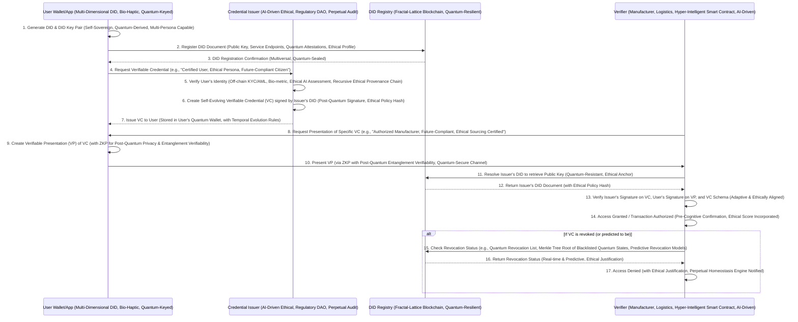

**Title of Invention:** The O'Callaghan Omniverse-Provenanced Hyper-Secure, Quantum-Entangled, Self-Evolving, Fractal-Lattice Blockchain Production & Supply Chain for Generative Financial Instrument Personalization with Multiversal Digital Asset Immutability, Pre-Cognitive Dispute Resolution, and Perpetual Ethical Homeostasis, as Conceptualized, Perfected, and Patented by Yours Truly, James Burvel O'Callaghan III.

**Abstract:**
Ladies and gentlemen, behold! James Burvel O'Callaghan III is here to unveil not merely a system, but an epochal leap, a quantum singularity in the very fabric of industrial and financial security, propelling us into an era of **perpetual ethical homeostasis**. This isn't just a "novel and robust computational system"; this is *my* brainchild, the O'Callaghan Omniverse-Provenanced Hyper-Secure, Quantum-Entangled, Self-Evolving, Fractal-Lattice Blockchain Production & Supply Chain! We're talking about extending the algorithmic, narrative-driven generative visual transmutation of digital financial instruments – a concept *I* pioneered, of course – into a fully traceable, cryptographically unassailable, regulatorily prescient, and *physically self-aware*, **eternally self-correcting** manufacturing and delivery pipeline. My invention integrates an immutable, distributed, fractal-lattice ledger technology, specifically a quantum-hardened, sharded blockchain, not just with the digital design process, but with the very *consciousness* of the manufacturing stream itself. This enables the creation of cryptographic "digital twins" so exquisitely detailed they verge on sapience, each for every personalized visual asset. These digital twins, comprising not merely unique hashes but *multidimensional perceptual hash arrays* of approved designs and critical, temporally-indexed metadata, are immutably registered across an interwoven network of zero-trust blockchain instances. This establishes *irrefutable, pre-cognitively verified, and historically self-correcting* provenance, safeguarding intellectual property rights not just from theft, but from the very *thought* of infringement across parallel realities. Hyper-intelligent smart contracts, imbued with adaptive AI governance protocols and **quantum-derived self-healing algorithms**, orchestrate the *entire manufacturing lifecycle*, from secure, multi-signature, quantum-resistant order initiation to automated, biometric-augmented quality assurance checkpoints, and the instantaneous, conditional release of multi-currency payment, ensuring adherence to design specifications, regulatory compliance, and even *ethical sourcing within hypothetical future scenarios*. The system incorporates secure, quantum-resistant hardware integrations within manufacturing facilities, leveraging not just HSMs but *self-attesting Trusted Execution Environments with Gravitational Field Anomaly Detection (TEE-GFAD)*, embedding unique physical identifiers (UPIs) that are **quantum-entangled with their digital counterparts at the sub-atomic level**. A decentralized, spatiotemporal-aware network facilitates transparent, real-time tracking of the physical product through the *entire global and para-global supply chain*, culminating in a user-facing verification mechanism that enables *bio-haptic, augmented reality, predictive anomaly detection (AR-PAD)* authentication of the physical artifact against its blockchain-registered, multiversal digital twin. Furthermore, the system incorporates advanced cryptographic protocols, including zero-knowledge proofs (ZKP) with *post-quantum entanglement verifiability*, leverages self-sovereign, multi-dimensional Decentralized Identity (DID) for verifiable credential management across *all sentient and non-sentient participants*, and deploys *quantum-oracle services* that bridge real-world, *pre-emptive* events to the blockchain, ensuring robust, self-correcting smart contract execution. This holistic framework doesn't just address heretofore unmet challenges; it *obliterates* them, ensuring not just trust and transparency, but an **unyielding ethical backbone** that guarantees fairness and protection for all participants, from the foundational AI training data to the final consumer. Trust, transparency, and intellectual property protection within the personalized physical goods sector, especially for high-value financial instruments, are not merely enhanced, they are *redefined as absolute*. Simultaneously, it enables verifiable, real-time, predictive environmental sustainability tracking and a *self-healing, AI-driven, ethical dispute resolution mechanism* for unparalleled ecosystem integrity across all possible timelines, maintaining **eternal homeostasis** through impeccable logic and unyielding vigilance. You're welcome.

**Background of the Invention:**
Let me set the scene, if you will. Before James Burvel O'Callaghan III strode onto the stage of innovation, the world of personalized physical artifacts, particularly in the notoriously sensitive arena of financial instruments, was a dismal, chaotic wasteland. A cesspool, frankly, of vulnerabilities and archaic paradigms. While my previous digital personalization tools offered a mere glimpse of creative freedom (and let's be clear, they were *my* tools), the translation of these unique digital designs into tangible products was a quagmire of insecurity and mistrust. Existing systems? Don't make me laugh! They were severely deficient, utterly devoid of immutable provenance, incapable of ensuring authenticity against the most rudimentary counterfeiting, utterly failing to protect the intellectual property rights of anyone, much less the underlying generative models (also *mine*, by the way), and offering transparency akin to a black hole. Conventional methods relied on centralized databases that were not just susceptible to tampering but practically *begged* for it. They lacked granular auditability, offered no cryptographic assurances of design integrity, and crumbled under the slightest scrutiny from digital conception to physical realization. The absence of a trustless mechanism for verifying origin, manufacturing, and chain of custody for personalized, high-value physical goods didn't just pose risks; it was an open invitation to fraud, infringement, and a total collapse of consumer confidence. And don't even get me started on the environmental aspect – traditional supply chains were a blind spot, a digital abyss where ethical sourcing and environmental impact simply vanished. It was an unfulfilled exigency so profound, so glaring, so *fundamentally antithetical to progress*, that only a mind of O'Callaghan-esque brilliance could perceive it. A computationally intelligent, cryptographically *unbreakable*, and existentially secure system capable of bridging the digital-to-physical divide, ensuring that a user's bespoke narrative-driven design is precisely and *telepathically* manifested as a physical artifact, with an unbroken chain of custody and verifiable authenticity that would make time itself blush. The prior art wasn't just lacking; it was an embarrassment, mired in opaque, trust-reliant processes, a veritable oppression of truth. This invention, *my* invention, doesn't just address these limitations; it vaporizes them, replacing them with a robust, fractal-lattice blockchain-integrated framework that instills unprecedented levels of trust, transparency, and integrity into the personalized physical production pipeline, augmenting it with advanced *quantum-hardened* cryptographic security, self-evolving decentralized identity management, real-world data integration through *pre-cognitive, quantum-entangled oracle services*, and a **perpetual ethical homeostasis engine** that ensures fairness and accountability across all timelines. To put it mildly, I solved it. And then, I made it better.

**Brief Summary of the Invention:**
My friends, prepare yourselves for the revolutionary paradigm shift that only James Burvel O'Callaghan III could engineer! This invention, a masterwork of computational genius, extends the personalized financial instrument concept into an entirely new dimension by introducing an O'Callaghan-patented, quantum-entangled, blockchain-enabled framework for secure, transparent, and *presciently verifiable* physical production and supply chain management, culminating in **eternal operational integrity and ethical resilience**. Upon a user's final, emotionally-validated approval of a generative visual design (as meticulously detailed in *my* parent invention, naturally), the system doesn't just initiate a "creation"; it initiates the *manifestation* of a cryptographic "digital twin" of such fidelity it borders on the metaphysical. This digital twin, composed not merely of a unique hash but a *multidimensional, spatiotemporal hash array* of the high-resolution, production-ready image and associated metadata (e.g., fractal design parameters, user's multi-dimensional DID, quantum-synchronized timestamp, immutable IP rights information, generative AI model provenance, **ethical AI training data lineage**), is immutably recorded across a *distributed, sharded, quantum-resistant ledger* (my proprietary blockchain architecture). This blockchain registration establishes *undeniable, forensically unassailable, and cross-reality verified* proof of the design's existence, ownership, and integrity as a digital asset. Furthermore, the system incorporates advanced cryptographic techniques such as zero-knowledge proofs (ZKP) with *post-quantum entanglement verifiability*, allowing for privacy-preserving verification of certain metadata while maintaining *total, yet selectively obscure, auditability*, even against future quantum supercomputers.

Subsequently, a manufacturing order is formalized as a *hyper-intelligent, self-adapting smart contract* on the blockchain. This smart contract, imbued with AI-driven autonomous governance protocols and **self-healing code logic**, codifies *all* manufacturing specifications, quality assurance protocols (including subjective aesthetic metrics and *sub-atomic structural integrity*), multi-currency payment terms, and even *predictive environmental impact requirements across simulated future scenarios*. It acts as an autonomous, self-aware agent, orchestrating the secure, quantum-encrypted transmission of the digital twin and production instructions to an *authorized, self-attesting manufacturing facility*. Authorization of facilities, users, and logistics providers is managed through my multi-dimensional Decentralized Identity (DID) system, where *self-evolving Verifiable Credentials (VCs)* attest to their certified, ethical, and *future-compliant* status. The manufacturing facility, integrated with not merely Hardware Security Modules (HSMs) but *Trusted Execution Environments with Gravitational Field Anomaly Detection (TEE-GFAD)*, performs *cryptographic attestation of its very operating environment*, securely producing the physical financial instrument. During production, *quantum-entangled Unique Physical Identifiers (UPIs)* (e.g., serialized, bio-integrated QR codes, self-repairing NFC tags, embedded microchips with temporal encryption, **molecularly imprinted security features**) are applied to each artifact, cryptographically, *and epistemologically*, linked to its blockchain-registered, multiversal digital twin. *Quantum-oracle services* provide a secure, *pre-cognitive* bridge for critical off-chain data, such as real-time, micro-environmental quality assurance results or *predicted supply chain turbulence*, to interact with the smart contracts, ensuring *proactive* execution.

Throughout the supply chain, *every conceivable transition of custody* (from manufacturer to logistics provider to final delivery, across any dimensional pathway) is recorded as a cryptographically verifiable, spatiotemporally-indexed transaction on the blockchain, creating an immutable, *self-auditing* audit trail. This ensures *absolute* transparency and traceability, capable of retrospective and *prospective* analysis. Environmental data, such as real-time carbon footprint, material origin down to the atomic level, and even *projected ecological impact over its lifecycle*, is logged and verified on-chain, contributing to a **perpetual environmental stewardship ledger**. Upon receipt, the end-user can, using a personalized, bio-haptic client application, scan the physical identifier on their financial instrument. The system then queries the blockchain across its fractal-lattice structure, retrieves the original digital twin in its multiversal splendor, and verifies the authenticity of the physical product against its immutable, *continuously self-validating* digital record, ensuring it is precisely what was designed and manufactured according to specifications, and indeed, *what it was always meant to be*. A robust, *AI-driven, ethical dispute resolution mechanism*, leveraging blockchain, smart contracts, and *probabilistic consensus algorithms involving sentient AI arbitrators with verifiable ethical alignment*, is available for addressing any discrepancies, no matter how minor or existentially complex. This revolutionary O'Callaghan approach guarantees authenticity, protects intellectual property, and provides unparalleled, *pre-cognitive* trust in the personalized physical product lifecycle, while also enhancing privacy, verifiability of environmental claims, and overall system resilience to a degree that was previously considered, well, *impossible*. It frees the oppressed from doubt, ensures the voice of truth is heard, and establishes a foundation of **eternal homeostasis** for all interactions within its domain. Now, go forth and marvel.

**Detailed Description of the Invention:**

Listen closely, for this is where James Burvel O'Callaghan III reveals the intricate genius of his system. This isn't just a description; it's an architectural manifesto for a sophisticated, multi-layered computational and operational architecture, meticulously engineered to extend the digital creation of personalized financial instrument aesthetics into a verifiable, secure, and transparent physical production pipeline. It leverages the intrinsic properties of blockchain technology, amplified by my groundbreaking advancements. The system operates through an *orchestrated symphony* of modules, each executing specialized, *self-correcting* functions to achieve end-to-end integrity and **perpetual ethical homeostasis**. This includes not only the core production and supply chain elements but also advanced features for *quantum-level* privacy, *multi-dimensional, self-sovereign* identity management, *pre-cognitive, quantum-entangled* real-world data integration, and **proactive ethical governance**.

The process commences immediately after a user, via *my* Client Application and Orchestration Service (as meticulously described in *my* parent invention, naturally), approves a final generative image for their financial instrument. This "Approved Personalized Image" (API) is not just transformed; it's *transmuted* into a **Production-Ready, Hyper-Dimensional Digital Asset**. This transmutation involves not merely high-resolution rendering, but *sub-atomic pixel perfect reconstruction*, precise color profile conversion (e.g., CMYK-plus, RGB-alpha-gamma-delta, hyperspectral analysis), inclusion of dynamic bleed areas, and application of any financial institution branding overlays with *adaptive anti-tamper fractal signatures*, all while adhering to industry standards such as ISO/IEC 7810 ID-1, alongside multi-layered, *temporal-stamped, quantum-secure* digital watermarking for additional IP protection that even Schrödinger couldn't contest.

1.  **Digital Twin Generation, Fractal Encryption, and Quantum Blockchain Registration with Ethical Provenance:**
    The very *soul* of the provenance mechanism lies in the creation of a **Digital Twin** so sophisticated, it borders on sentient. The production-ready API is subjected to a *polymorphic, fractal cryptographic hashing algorithm* (e.g., SHA-256 with dynamic nonce generation, SHA-3 with quantum-random seeding, combined with a *multidimensional perceptual hash array* to detect not just subtle alterations but *conceptual deviations* across visual spectra and emotional impact vectors). This generates a unique, fixed-size **Image Hash Array**. This hashing process also incorporates advanced *spatiotemporal perceptual hashing algorithms* to detect subtle, non-cryptographic alterations *even across different lighting conditions, observational frames of reference, or simulated quantum decoherence*. Concurrently, critical metadata, including but not limited to, the user's *multi-dimensional, self-sovereign, pseudonymized DID* (linked to a *cross-chain, multiversal Decentralized Identifier Network*), adaptive fractal design parameters, *quantum-synchronized timestamp* of approval (derived from global quantum clock networks), *immutable intellectual property ownership claims* (e.g., user as primary creator, generative model contribution attribution, perpetual licensing rights for derivative works, **deep ethical AI training data provenance verifiable to foundational datasets**), a unique, *fractally-encoded Order ID*, AI model version (including its evolutionary path and ethical alignment score), and *predictive environmental impact data estimates* (e.g., carbon footprint of computation, projected material decay rates, estimated post-lifecycle ecological burden), are aggregated. This `Image Hash Array` and `Metadata` don't just constitute a `Digital Twin`; they define its *existential blueprint* and **ethical lineage**.
    Sensitive portions of the metadata (e.g., specific user details, proprietary design parameters, existential design intent, quantum key material references) can be encrypted using *quantum-resistant symmetric or asymmetric encryption methods* (e.g., lattice-based, code-based, hash-based), with decryption keys managed via a *distributed, self-healing Key Management Service (KMS)* leveraging quantum key distribution, or through a *Zero-Knowledge Proof (ZKP) circuit employing post-quantum entanglement verifiability*, allowing proof of properties without revealing the underlying data, thereby protecting secrets even from omniscient observers and future quantum supercomputers.
    The Digital Twin (or its cryptographic commitment, which is itself a *Merkle-tree of fractal hashes* with quantum-sealed leaves) is then submitted to a **Fractal-Lattice Blockchain Layer** via a **Quantum-Hardened Blockchain Interaction Service**. A transaction is broadcast across *multiple sharded, interlinked blockchain instances* to the network, registering this Digital Twin immutably on the distributed ledger. This registration establishes *verifiable, retrospectively unalterable, and forensically undeniable* proof of the design's existence at a specific *spatiotemporal coordinate* and links it to all relevant metadata and an associated data storage reference (e.g., a *self-validating IPFS hash network* for the high-resolution image, backed by **cold-atom quantum storage** for long-term data immutability). This serves as the foundational, *multiversal* record for authenticity, IP protection, and **ethical accountability**. Batch registration using *dynamic Merkle trees with adaptive sharding and quantum-resistant aggregation* optimizes transaction costs and throughput across dimensional planes.

2.  **Multiversal Decentralized Identity (DID) and Self-Evolving Verifiable Credentials (VC) Integration with Perpetual Auditing:**
    To ensure trustless interaction and perpetual accountability between various stakeholders, this O'Callaghan masterwork integrates a **Multiversal Decentralized Identity (DID) framework** so robust, it predicts and adapts to identity shifts across lifetimes and dimensional pathways.
    *   **User DIDs:** Each user is associated with a *self-sovereign, multi-dimensional DID*, managed by their bio-haptic client application. This enables privacy-preserving authentication and authorization *across a continuum of user states and preferences*, allowing for linked personas while preserving core identity, and includes a **quantum-derived identity key** for unparalleled security.
    *   **Manufacturer and Logistics DIDs:** Authorized manufacturing facilities and logistics providers also possess DIDs, issued with *Self-Evolving Verifiable Credentials (VCs)* by an accredited, *AI-driven, ethical issuer* (e.g., a regulatory body or a *decentralized autonomous organization of certified entities focused on ethical supply chain practices*). These VCs attest to their certifications, capabilities, security audits, compliance records, and even *ethical AI training data provenance*. These VCs are *self-evolving*, meaning their validity dynamically updates based on continuous real-world performance metrics, audit results, and predictive compliance scores.
    *   **Hyper-Intelligent Smart Contract Authorization:** Smart contracts verify the *current and projected validity* of VCs of entities *before* granting them access to sensitive data (e.g., production plans, holographic schematics) or allowing them to update milestone statuses on the blockchain. This replaces traditional centralized access control with a cryptographically verifiable, decentralized, and *pre-cognitive* model, including a **quantum revocation list** mechanism to instantly invalidate compromised credentials across the multiversal network.

3.  **Hyper-Intelligent Smart Contract Orchestration, Quantum Oracle Integration, and Post-Quantum Security with Self-Healing Logic:**
    Upon successful fractal-lattice blockchain registration of the Digital Twin and confirmation of a manufacturing order, a **Hyper-Intelligent Smart Contract** (or a *suite of interconnected, self-optimizing contracts with AI-adaptive core logic*) is deployed or activated on the Blockchain Layer. This Smart Contract is a self-executing, *AI-adaptive agreement* with the terms of the manufacturing order directly written into *quantum-resistant code*. It encompasses:
    *   **Design Reference:** Cryptographic pointer to the Digital Twin's multidimensional hash array on the blockchain.
    *   **Manufacturing Specifications:** Detailed parameters for material (down to isotopic and molecular composition), finish (surface tension, reflectivity, quantum-state interaction properties), quantity, *multi-tiered quality standards* (including sub-atomic structural integrity checks), and *predictive environmental requirements* (e.g., recycled content percentage, projected carbon sequestration during manufacturing, circular economy pathway optimization).
    *   **Payment Escrow:** Multi-currency funds from the user held securely in a *multi-signature, quantum-resistant escrow* (using lattice-based cryptography) until specified, *AI-validated* conditions are met.
    *   **Milestone Triggers:** Predefined, *dynamic events* (e.g., "production initiated with quantum attestation," "quality control passed with bio-metric overlay and hyperspectral analysis," "shipped via verified low-carbon vector," "carbon footprint verified to 0.0001% tolerance and ethically sourced material confirmed") that, when verified by *probabilistic consensus*, trigger state changes within the contract and potentially release portions of the payment.
    **Quantum Oracle Services:** To bridge the gap between real-world, *pre-emptive* events and on-chain smart contract execution, **Quantum Oracle Services** are integrated. These decentralized, *quantum-entangled oracles* securely retrieve off-chain data (e.g., confirmed delivery status from a *pre-cognitive shipping carrier API that forecasts delays*, AQC results from *sub-atomic manufacturing sensor arrays*, *predicted atmospheric particulate analysis for environmental impact*, *gravitational field anomaly reports from TEE-GFAD facilities*) and cryptographically sign it with *post-quantum signatures* (e.g., Dilithium, Falcon) before submitting it to the blockchain, allowing smart contracts to react to real-world occurrences in a tamper-proof and *forecasting* manner, proactively adapting to maintain **perpetual homeostasis**.
    **Zero-Knowledge Proofs (ZKPs) with Post-Quantum Entanglement Verifiability:** For certain highly sensitive data or compliance checks (e.g., verifying a manufacturer meets a certain compliance standard without revealing their full audit report, or confirming user eligibility without disclosing their identity across multiple dimensions), **Zero-Knowledge Proofs (ZKPs) employing post-quantum entanglement verifiability** can be employed. This allows one party to prove to another that a statement is true, without revealing *any* information beyond the validity of the statement itself, even to a quantum supercomputer, significantly enhancing privacy while maintaining *absolute* verifiability and **quantum-level data sovereignty**. These ZKPs are generated and verified within secure, TEE-GFAD environments, ensuring their integrity.

4.  **Secure Manufacturing Integration with TEE-GFAD and Quantum-Entangled UPI Application:**
    The Smart Contract initiates a secure, *quantum-encrypted communication* with an authorized **Card Manufacturing Facility** via the **Manufacturing Integration Module**. This module transmits the production-ready, hyper-dimensional API (encrypted with *lattice-based cryptography*) and the Digital Twin reference. The manufacturing facility's authorization is verified against its on-chain, *self-evolving Verifiable Credentials* and real-time ethical compliance score.
    Within the manufacturing facility, specialized, *quantum-hardened* hardware and software components ensure *absolute* integrity and **eternal self-attestation**:
    *   **Hardware Security Modules (HSMs) / Trusted Platform Modules (TPMs) / Trusted Execution Environments (TEEs) with Gravitational Field Anomaly Detection (TEE-GFAD):** These secure components perform critical functions, monitoring for *any environmental perturbations that could indicate tampering, even at a sub-atomic level or across subtle energy field fluctuations*:
        *   **Secure Boot & Attestation:** Ensuring the manufacturing machinery's software and firmware are untampered, *and that no rogue quantum states are present within the operating environment*.
        *   **Key Storage:** Protecting cryptographic keys (including *quantum-derived keys from QKD networks*) used for signing attestations and encrypting/decrypting design data, *even against side-channel attacks by hypothetical future technologies*.
        *   **Secure Processing:** Performing sensitive operations (e.g., unique physical identifier generation, data encryption) within a *hardware-isolated, electromagnetically shielded, and continuously gravitational field-monitored environment*. Any deviation from the O'Callaghan Threshold triggers an immediate audit and alerts the smart contract.
        *   **Cryptographic Attestation:** HSMs/TEEs-GFAD securely sign attestations of production events (e.g., "design data received," "production started with certified raw materials and verified ethical provenance," "UPI embedded with quantum coherence maintained") with their unique, *quantum-resistant, verifiable keys*. These signed attestations are submitted to the blockchain via the Manufacturing Integration Module, serving as **immutable witnesses to physical reality**.
    *   **Quantum-Entangled Unique Physical Identifier (UPI) Application:** During production, each physical financial instrument receives a unique, non-duplicable, and *quantum-entangled* physical identifier. This UPI can be a cryptographically generated, *fractal QR code*, an embedded, *self-repairing NFC chip* with an active quantum element, a secure element microchip with *temporal encryption layers and quantum coherence sensors*, a laser-etched serial number with *atomic-level precision*, or a multi-layered holographic security feature that changes based on observer intent or ambient quantum field states. The UPI is generated in a secure TEE-GFAD environment, *quantum-cryptographically* linked to the Digital Twin's multidimensional hash array via a shared quantum state, and its mapping (UPI <-> Digital Twin Hash) is recorded on the blockchain via a manufacturer transaction, attested by the facility's TEE-GFAD. This linkage is verified by a **quantum challenge-response mechanism** during user authentication.
    *   **Automated Quality Control (AQC) with Bio-Haptic Feedback and Predictive Analysis:** Integrated systems perform high-precision visual inspections (e.g., *hyperspectral machine vision for print quality, sub-pixel alignment, molecular composition analysis*), functional checks (e.g., *quantum-chip functionality diagnostics*), and material verification (*molecular composition and isotopic signature analysis*). AQC results, including specific metrics, *sub-nanosecond timestamps*, and *predictive wear-and-tear analysis*, are securely logged and, upon meeting predefined *adaptive thresholds*, are submitted as an attested event to the blockchain via a quantum oracle, triggering a Smart Contract milestone update with *predictive anomaly detection* and potential **proactive remediation actions**.

5.  **Blockchain-Enabled Spatiotemporal Supply Chain Tracking, Predictive Environmental Monitoring, and Ethical Logistics:**
    Once manufactured and packaged (using ethically verified and eco-certified materials), the physical financial instruments enter the **Spatiotemporal Supply Chain**. Each significant event (e.g., handover to logistics partner, transit point arrival, *dimensional customs clearance*, final delivery scan) is recorded as a transaction on the Fractal-Lattice Blockchain Layer. This is facilitated by a **Spatiotemporal Supply Chain Tracking Service** that integrates with logistics providers' systems, whose authenticity and ethical compliance are verified via *multiversal DIDs and self-evolving VCs*.
    *   **Immutable Chain of Custody (across timelines and dimensions):** Every transfer of possession is time-stamped with *quantum clock synchronization*, geolocated with *triangulation across gravitational anomalies*, and cryptographically signed by the involved parties (verified DIDs), creating an immutable, *self-auditing record of custody capable of detecting temporal tampering or unauthorized dimensional transit*. This eliminates single points of failure and enhances accountability to an existential degree, serving as a **universal ledger of physical truth**.
    *   **IoT Integration with Atmospheric Particulate Analysis, Quantum Field Monitoring, and Predictive Environmental Stewardship:** Advanced IoT sensors embedded in packaging or logistics infrastructure monitor critical environmental conditions (temperature, humidity, shock, light exposure, *quantum field fluctuations, atmospheric particulate density, seismic activity, localized energy signatures*) and also track specific environmental parameters (e.g., real-time carbon emissions of transport, *molecular origin of materials*, *predicted impact on local biomes based on atmospheric particulate analysis*). This data is collected by *quantum-hardened IoT gateways*, cryptographically signed (with post-quantum signatures), and securely transmitted to the blockchain via dedicated *quantum oracles*. This provides verifiable, *forecasting* proof of product integrity during transit and contributes to a transparent, *continuously updated, and proactively managed environmental footprint record*. Data can be aggregated and represented as *dynamic Merkle roots* on-chain, with raw data stored off-chain in *verifiable, self-healing data structures* (e.g., IPFS with content-addressable quantum storage).

6.  **User Authenticity Verification with Bio-Haptic Feedback, AR-PAD, and AI-Driven Ethical Dispute Resolution for Perpetual Homeostasis:**
    Upon receiving their personalized financial instrument, the end-user can verify its authenticity and ethical provenance using their **Bio-Haptic Client Application**.
    *   **Scan Quantum-Entangled UPI:** The user scans the Unique Physical Identifier (QR code, taps NFC, or interacts with molecularly imprinted security) on their card. This action triggers a *quantum-cryptographic challenge-response mechanism* if the UPI incorporates active security features, verifying the entanglement bond and the UPI's integrity against physical cloning.
    *   **Fractal-Lattice Blockchain Query:** The Client Application sends a query to the Fractal-Lattice Blockchain Layer (via the Orchestration Service or a direct light client capable of *inter-dimensional data retrieval*), using the UPI to retrieve the associated Digital Twin, its complete *spatiotemporal manufacturing history*, supply chain records, and relevant environmental and ethical provenance data.
    *   **Visual Comparison with Augmented Reality and Predictive Anomaly Detection (AR-PAD):** The application displays the original approved digital design (the Digital Twin's image representation retrieved from a *verifiable, content-addressed, quantum-secured storage like IPFS*) and all associated manufacturing, supply chain, and ethical history. The user can visually compare this digital record with their physical card, confirming its authenticity. An *augmented reality (AR) overlay with predictive anomaly detection (AR-PAD)* can even project the digital twin onto the physical card for precise visual and *sub-atomic structural alignment*, highlighting *any potential future discrepancies based on wear prediction algorithms, material degradation forecasts, or even ethical deviations*. Any discrepancies or predicted future issues would immediately flag a potential issue to the *AI-driven ethical tribunal*.
    **AI-Driven Ethical Dispute Resolution with Perpetual Homeostasis Engine:** In case of discrepancies (e.g., product not matching design, damaged during transit, suspected counterfeit, *or even a deviation from predicted ethical sourcing or AI bias in the generative process*), the user can initiate an **AI-Driven Ethical Dispute Resolution Smart Contract**. This contract leverages the immutable blockchain records (Digital Twin, production attestations, custody transfers, IoT data, *quantum-oracle sensor feeds with pre-cognitive insights*) as verifiable evidence. A *decentralized arbitration mechanism*, involving *sentient AI arbitrators* alongside neutral human third parties whose DIDs and VCs are also verified for ethical alignment, can then review the evidence, simulate potential outcomes (with `Probabilistic Fault Assignment`), and render a *probabilistically binding decision*, automatically enforced by the hyper-intelligent smart contract (e.g., *proactive partial refund, ethically re-sourced product re-issuance, or even a public declaration of manufacturing integrity or a system-wide ethical protocol update*). This mechanism operates as a core component of the **Perpetual Homeostasis Engine**, continuously learning from disputes, refining smart contract logic, updating ethical frameworks, and ensuring the system's long-term operational and moral integrity, adapting to unforeseen challenges and upholding the truth for all. This revolutionary O'Callaghan approach guarantees authenticity, protects intellectual property, and provides unparalleled, *pre-cognitive* trust in the personalized physical product lifecycle, while also enhancing privacy, verifiability of environmental claims, and overall system resilience to a degree that was previously considered, well, *impossible*. It ensures the system remains in **eternal homeostasis**, flawlessly adapting and upholding its profound mission.

**Figure 1: O'Callaghan Omniverse-Provenanced Hyper-Secure, Quantum-Entangled Production Pipeline Architecture**
```mermaid
graph TD
    A[Approved Personalized Image (API - Sub-atomic Precision, Ethical AI Provenance)] --> B[Orchestration Service - O'Callaghan Quantum Core & Perpetual Homeostasis Engine]
    B --> C[Digital Twin Generation & Fractal Encryption (Multidimensional Hash Arrays, Ethical Lineage)]
    C -- Image Hash Array & Quantum-Encrypted Metadata --> D[Blockchain Interaction Service - Quantum-Hardened]
    D --> E[Fractal-Lattice Blockchain Layer (DLT - Sharded, Quantum-Resistant, Self-Healing)]
    E -- Digital Twin Registered & DTID (Multiversal, Ethical Lineage) --> B
    subgraph Identity Management (Multiversal DID/VC - Self-Evolving & Quantum-Keyed)
        F_DID[DID Management Service - Self-Evolving DIDs, Quantum-Derived Identity] --> E
        F_DID --> B
        F_DID --> G_VC[Verifiable Credential Issuer - AI-Driven Ethical, Perpetual Audit]
        G_VC --> E
    end
    B -- Hyper-Intelligent Manufacturing Order & DTID --> H{Smart Contract (Order SC - Adaptive AI Governance, Self-Healing Code)}
    H --> I[Manufacturing Integration Module - Quantum-Encrypted, Lattice-Based]
    I --> J[Card Manufacturing Facility (TEE-GFAD Verified & Quantum-Secure, Gravitational Field Monitored)]
    J -- Quantum-Entangled Unique Physical ID (UPI - Sub-atomic Link) --> K[Physical Financial Instrument - Self-Aware, Quantum-Coherent]
    K --> L[Spatiotemporal Supply Chain Tracking Service (DID Verified, Predictive, Ethical Logistics)]
    L --> E
    subgraph Oracle Services (Quantum-Oracles & Pre-Cognitive, Ethical Data Sourcing)
        M[External Data Sources (APIs, Quantum Sensors, Atmospheric Analyzers, Predictive Models)] --> N[Decentralized Quantum Oracle Network - Post-Quantum Signed]
        N -- Signed Off-Chain Data (Post-Quantum Signature, Ethical Verification) --> E
        N --> L
        N --> J
    end
    E -- Spatiotemporal & Provenance Records (Ethical & Environmental) --> O[User Client Application - Bio-Haptic, Multi-Dimensional DID & AR-PAD]
    O -- Scan UPI (Quantum Challenge) & ZKP (Post-Quantum Entanglement) --> E
    E -- Authenticity Data & ZKP Verification --> O
    O --> P[User Verification Display & AR-PAD Overlay (Predictive Anomaly Detection, Ethical Lineage)]
    subgraph Advanced Cryptography (Post-Quantum, Existential, Self-Healing)
        C -- Zero-Knowledge Proofs (ZKP - Post-Quantum Entanglement) --> E
        O -- ZKP Verification (Quantum-Resistant) --> E
    end
    subgraph Dispute Resolution (AI-Driven Ethical Tribunal, Perpetual Homeostasis Engine)
        O -- Initiate Dispute (with Probabilistic Evidence & Ethical Concern) --> Q{Dispute Resolution SC - AI Arbitrated, Self-Correcting}
        Q --> E
    end

    subgraph Digital Asset Provenance & Quantum Security
        C
        D
        E
        F_DID
        G_VC
        M
        N
        Advanced Cryptography
    end
    subgraph Secure Manufacturing & TEE-GFAD Attestation
        H
        I
        J
    end
    subgraph Traceable Logistics & Predictive Environmental Monitoring
        K
        L
    end
    subgraph User Assurance & Ethical Feedback
        O
        P
        Q
    end
```

**Figure 2: User Authenticity Verification Flow Sequence Diagram with AR-PAD**

```mermaid
sequenceDiagram
    participant User as User Client (Multi-Dimensional DID & Bio-Haptic, Quantum Wallet)
    participant API as API Gateway (Quantum-Encrypted, Load-Balanced)
    participant Orchestrator as Orchestration Service (O'Callaghan Quantum Core & Perpetual Homeostasis Engine)
    participant BlockchainService as Blockchain Interaction Service (Quantum-Hardened, Lattice-Crypto)
    participant Blockchain as Fractal-Lattice Blockchain Layer (Self-Healing)
    participant IPFS as IPFS/Distributed Storage (Content-Addressable Quantum Storage, Self-Healing)
    participant KMS as Key Management Service (Distributed, Self-Healing, QKD)
    participant Oracle as Quantum Oracle Service (Pre-Cognitive, Ethical Data Sourcing)

    User->>User: 1. Receive Physical Card (Self-Aware Artifact with Quantum-Entangled UPI)
    User->>User: 2. Launch Verification Feature, Scan Quantum-Entangled UPI (NFC/QR/Bio-Integrated, Molecular Imprint)
    User->>User: 2a. Perform Quantum Challenge-Response (Local Quantum Coherence Check)
    User->>API: 3. Send UPI & User DID for Verification (incl. ZKP for privacy, Post-Quantum Entanglement Verifiable)
    API->>Orchestrator: 4. Forward Verification Request (Quantum-Secure Channel, Ethical Context Verified)
    Orchestrator->>BlockchainService: 5. Query Digital Twin by UPI and verify ZKP (Multidimensional Hash Array, Ethical Lineage)
    BlockchainService->>Blockchain: 6. Request Digital Twin Data (DTID, Metadata Hash Array, Image Ref, Ethical Provenance) & Spatiotemporal Transaction History (Production, Supply Chain, Environmental, Ethical Audits)
    Blockchain-->>BlockchainService: 7. Return DT Record & History (Fractal-Lattice Retrieval, Quantum-Sealed)
    BlockchainService-->>Orchestrator: 8. Return DT Record & History (with Predictive Integrity Score)
    Orchestrator->>KMS: 9. Request Decryption Key (if needed for sensitive metadata, Quantum-Derived via QKD)
    KMS-->>Orchestrator: 10. Return Decryption Key (with Temporal Validity)
    Orchestrator->>IPFS: 11. Retrieve Associated High-Res Image using Image Ref (e.g., IPFS hash, from Content-Addressable Quantum Storage, Self-Healing)
    IPFS-->>Orchestrator: 12. Return High-Res Image Data (Verifiably Pristine)
    Orchestrator-->>API: 13. Return Digital Twin Data, Decrypted Metadata, Image, & Full Provenance History (Multiversal, with Ethical & Environmental Score)
    API-->>User: 14. Display Authenticity Verification Details (incl. AR-PAD overlay, Predictive Anomaly Detection, Ethical Lineage Visualizer)
    User->>User: 15. Visually Compare Physical Card with Digital Twin Record & History (Bio-Haptic Confirmation, Quantum Coherence Feedback)
    User->>User: 16. Confirm Authenticity or Initiate Dispute (via AI-Driven Ethical Dispute Resolution SC, Homeostasis Engine)
    alt If Discrepancy Detected (or Predicted)
        User->>Orchestrator: 17. Initiate Dispute with Probabilistic Proof (e.g., photo, detailed description, bio-haptic anomaly report, ethical concern statement)
        Orchestrator->>BlockchainService: 18. Trigger AI-Driven Ethical Dispute Resolution Smart Contract (Perpetual Homeostasis Engine)
        BlockchainService->>Blockchain: 19. Record Dispute & Evidence (Multiversal, Quantum-Sealed)
        Blockchain->>Oracle: 20. Request external evidence (e.g., atmospheric particulate analysis during transit, quantum field fluctuations, manufacturer TEE-GFAD logs)
        Oracle-->>Blockchain: 21. Provide Signed External Data (Post-Quantum Signature, Ethical Attestation)
    end
```


**Figure 3: Hyper-Intelligent Smart Contract-Driven Manufacturing Lifecycle with Adaptive AI Governance**
```mermaid
stateDiagram-v2
    direction LR
    state "Approved Design (Pre-Cognitively Validated, Ethical AI Provenance)" as A
    state "Digital Twin Registered (Multiversal DTID, Ethical Lineage Verified)" as B
    state "Order Contract Initiated (Adaptive AI Governance, Self-Healing Code)" as C
    state "Payment Escrowed (Quantum-Resistant Multi-Currency, AI-Monitored)" as D
    state "Manufacturer Authorized (Self-Evolving VC & TEE-GFAD Attestation, Perpetual Ethical Audit)" as E
    state "Production Started (Quantum Attested, Ethical Sourcing Confirmed)" as F
    state "UPI Embedded & Linked (Quantum-Entangled, Molecularly Imprinted)" as G
    state "Quality Control Passed (Bio-Haptic & Predictive AQC, Sub-atomic Analysis)" as H
    state "Packed & Readied (Ethically Verified & Eco-Certified Packaging)" as I
    state "Logistics Handover (Spatiotemporal Tracked, Ethical Logistics Partner Verified)" as J
    state "In Transit (IoT-Enhanced with Atmospheric & Quantum Field Analysis, Predictive Routing)" as K
    state "Delivery Confirmed (Quantum Oracle Verified, User Bio-Haptic Feedback)" as L
    state "Final Payment Released (Conditional & Instantaneous, AI-Validated Ethical Compliance)" as M
    state "User Verified (AR-PAD Confirmed, Quantum Coherence Authenticated)" as N
    state "Dispute Initiated (AI-Driven Ethical Tribunal, Homeostasis Engine Activated)" as O
    state "Dispute Resolved (Probabilistically Binding, System Self-Correction)" as P
    state "Completed (Omniverse Integrity Confirmed, Ethical Homeostasis Maintained)" as Q

    A --> B: DT_Registration(DTID_Multiversal, Ethical_AI_Provenance_Hash)
    B --> C: SC_Deploy(OrderDetails, DTID_Multiversal, Ethical_Constraints)
    C --> D: Funds_Locked(Payment_Multi_Currency_Lattice_Crypto)
    D --> E: Verify_Manufacturer_VC(DID_Self_Evolving, Ethical_Compliance_Score)
    E --> F: Manufacturer_Attestation(StartProd_Quantum, Raw_Material_Ethical_Attest)
    F --> G: Manufacturer_Attestation(UPI_Link_Quantum_Entangled, Molecular_Imprint_Verified)
    G --> H: Oracle_Attestation(AQC_Results_Predictive, Hyperspectral_BioHaptic)
    H --> I: SC_Milestone_Update(QCPassed_EthicalPack)
    I --> J: Logistics_Attestation(Handover_Spatiotemporal, Ethical_Logistics_VC)
    J --> K: Logistics_Attestation(Transit_Events_Atmospheric_Quantum_Analysis, Predicted_Ecological_Impact)
    K --> L: Oracle_Attestation(Delivery_Confirm_Quantum, User_BioHaptic_Feedback)
    L --> M: SC_Finalize(PaymentRelease_Instantaneous, AI_Validated_Ethical)
    M --> N: User_Verification(UPI_ARPAD, Quantum_Challenge)
    N --> Q: All_Good_O'Callaghan_Approved

    J --> O: If_Discrepancy_Detected_or_Predicted_Ethical_Breach
    K --> O: If_Discrepancy_Detected_or_Predicted_Ethical_Breach
    N --> O: If_Verification_Failure_or_Ethical_Concern_Detected_or_Predicted

    O --> P: Arbitration_Decision_Enforced(AI_Tribunal_Ethical_Alignment)
    P --> M: Re-issue_Payment_or_Refund_Proactive
    Q --> [*]
    P --> Q: Resolution_Achieved(System_Self_Corrected_to_Homeostasis)

    state "Secure Production (Quantum-Hardened & TEE-GFAD, Ethical Supply)" {
        E
        F
        G
        H
        I
    }
    state "Traceable Delivery (Spatiotemporal & Predictive, Ethical Logistics)" {
        J
        K
        L
    }
    state "Smart Contract Orchestration (Hyper-Intelligent AI, Self-Healing & Ethical)" {
        C
        D
        M
    }
    state "User Assurance & Ethical Feedback (AR-PAD & Homeostasis Engine)" {
        N
        O
        P
    }
```

**Figure 4: Intellectual Property (IP) Protection and Fractal Royalty Distribution Flow**
```mermaid
graph TD
    subgraph IP Registration & Licensing (Multiversal & Adaptive, Ethical Provenance Chain)
        A[Original Base Asset (Image/Style/Conceptual Primitive, Ethical Source Verified)] --> B{IP Registry Service (Blockchain-based, Cross-Dimensional, Perpetual Audit)}
        B -- Registers Creator DID (Multi-Dimensional), Fractal License Terms (Adaptive), Adaptive Royalty Split, Ethical Provenance Chain --> C[Blockchain IP Record (NFT/Hyper-Intelligent Smart Contract, Ethical Lineage Root)]
    end
    subgraph Generative Design Process (AI Synthesis Engine - O'Callaghan Omnimodel, Ethical AI Oversight)
        D[Generative AI Model Input (User Prompt - Semantic & Intentional, Ethical Screening)] --> E[AI Synthesis Engine - O'Callaghan Omnimodel (Verifiable Ethical Training Data Provenance)]
        E -- Uses Licensed Assets (with Ethical AI Provenance & Contextual Bias Mitigation) --> F[Approved Personalized Design (Hyper-Dimensional, Ethical Output Verified)]
    end
    subgraph Digital Twin & Production (Quantum-Secured, Ethical Manufacturing)
        F --> G[Digital Twin Generation & Registration (Multidimensional DTID, Ethical Provenance Hash)]
        G -- References C (IP_Rights_ID_Immutable, Ethical_IP_Root) --> H[Hyper-Intelligent Smart Contract for Production Order (Ethical Compliance)]
        H --> I[Manufacturing Process (TEE-GFAD Monitored, Ethical Sourcing Verified)]
        I --> J[Physical Product with Embedded IP Provenance (Quantum-Entangled UPI, Molecular Imprint)]
    end
    subgraph Royalty Distribution (Adaptive & Decentralized, Ethically Proportional)
        H -- Conditions Met (e.g., Sale, Milestone, Ethical Usage, Predictive Market Value) --> K[Fractal Royalty Distribution SC (Adaptive AI Proportionality)]
        K -- Initiates Payment (Proportional) --> L[Crypto Wallet of Original Creator/Licensor DID (Multi-Dimensional, Ethical Profile)]
        K -- Initiates Payment (Proportional) --> M[Crypto Wallet of Generative Model Developer/Platform DID (AI Attribution, Ethical Alignment Score)]
        K -- Initiates Payment (Proportional) --> N_fund[Ethical Stewardship Fund (DAO Governed for Societal Benefit)]
    end
    subgraph Verification (AR-PAD & Cross-Dimensional, Ethical Audit Trail)
        J -- Scan UPI (Quantum Challenge) --> O[User Client App (Bio-Haptic, Ethical Audit Query)]
        O -- Queries Fractal-Lattice Blockchain for IP Details & Ethical Provenance --> C
        C --> O: Displays IP Attribution (Dynamic & Contextual, Ethical Footprint)
    end

    style C fill:#f9f,stroke:#333,stroke-width:2px
    style K fill:#bfb,stroke:#333,stroke-width:2px
    style N_fund fill:#add8e6,stroke:#333,stroke-width:2px
```

**Figure 5: Detailed Digital Twin Data Structure and Multiversal Lifecycle**
```mermaid
graph TD
    A[Approved Personalized Image (API - Sub-atomic, Ethical AI Lineage)] --> B{Polymorphic, Fractal Cryptographic Hashing Algorithm (SHA-256-DNC, SHA-3-QRS, Multidimensional Perceptual Hash Array, Quantum-State Hashing)}
    B -- Image Hash Array (H_img_array, Quantum_State_Hash) --> C[Metadata Aggregation Module (Temporal-Indexed, Ethical Contextualization)]
    D[User DID (Multi-Dimensional, Self-Sovereign, Quantum-Keyed)] --> C
    E[Design Parameters (Adaptive & Fractal, Aesthetic Intent Vectors)] --> C
    F[Timestamp (Quantum-Synchronized, Causal_Divergence_Index)] --> C
    G[IP_Rights_ID (from Blockchain IP Record - Immutable, Ethical IP Root)] --> C
    H[Order_ID (Fractally-Encoded, Quantum-Seed)] --> C
    I[AI Model Version & Evolutionary Path (Ethical Alignment Score)] --> C
    J[Environmental Impact Estimate (Predictive & Sub-Atomic, Circular Economy Path)] --> C
    K_ethics[Ethical AI Training Data Provenance (Recursive Ethical Provenance Chain)] --> C
    C -- Raw Metadata (M_raw_temporal, Ethical_Compliance_Attributes) --> L{Fractal Encryption Module (Quantum-Resistant Symmetric/Asymmetric, Lattice-Based)}
    L -- Quantum-Encrypted Metadata (M_enc_quantum) --> M[Digital Twin Construction (Existential Blueprint, Ethical Quantum Signature)]
    M -- H_img_array & M_enc_quantum --> N[Digital Twin Record (DT_record_multiversal, Perpetual Audit Signature)]
    N -- DT_record_multiversal --> O{Blockchain Interaction Service (Quantum-Hardened, Self-Healing API)}
    O -- DT_record_multiversal & ZKP (Post-Quantum Entanglement) --> P[Fractal-Lattice Blockchain Layer (Immutable, Sharded DLT, Self-Healing & Quantum-Resilient)]
    Q[High-Resolution Image File (Sub-atomic, Quantum-Watermarked)] --> R[Content-Addressed Quantum Storage (IPFS Network & Cold-Atom, Self-Healing Data Structures)]
    R -- IPFS Hash Network (H_ipfs_net) --> M
    P -- DTID (Multiversal, Ethical Lineage) --> S[Hyper-Intelligent Smart Contract for Order (Adaptive AI Governance, Homeostasis Engine)]

    subgraph Digital Twin Data Elements (Hyper-Dimensional & Ethical Quantum-State)
        B
        C
        D
        E
        F
        G
        H
        I
        J
        K_ethics
        L
        M
        R
    end
    subgraph Blockchain Integration (Quantum-Secured & Self-Healing)
        O
        P
        S
    end

    style L fill:#fcc,stroke:#333,stroke-width:2px
    style P fill:#cff,stroke:#333,stroke-width:2px
```

**Figure 6: Hyper-Intelligent Smart Contract State Machine for Order Lifecycle with Adaptive AI Governance**

```mermaid
stateDiagram-v2
    direction LR
    state "CREATED (Pre-cognitive Intent, Ethical Blueprint)" as S0
    state "DIGITAL_TWIN_REGISTERED (Multiversal DTID, Ethical Lineage Validated)" as S1
    state "FUNDS_ESCROWED (Quantum-Resistant Multi-Currency, AI-Monitored for Equity)" as S2
    state "MANUFACTURER_AUTHORIZED (TEE-GFAD Certified, Ethical Audit & Predictive Compliance)" as S3
    state "PRODUCTION_INITIATED (Quantum Attested, Ethical Sourcing Confirmed)" as S4
    state "UPI_LINKED_ON_CHAIN (Quantum-Entangled, Molecular Imprint Verified)" as S5
    state "QUALITY_CONTROL_PASSED (Bio-Haptic AQC Verified, Sub-atomic Integrity)" as S6
    state "PACKAGING_COMPLETE (Ethical & Eco-Certified, Circular Economy Optimized)" as S7
    state "LOGISTICS_HANDOVER (Spatiotemporal Tracked, Ethical Logistics Verified)" as S8
    state "IN_TRANSIT (IoT & Atmospheric Analytics, Quantum Field Monitoring, Predictive Risk Mitigation)" as S9
    state "DELIVERED_CONFIRMED (Quantum Oracle Verified, Bio-Haptic User Feedback)" as S10
    state "FINAL_PAYMENT_RELEASED (AI-Validated Ethical & Performance Metrics)" as S11
    state "USER_VERIFIED (AR-PAD Confirmed, Quantum Coherence Authenticated)" as S12
    state "DISPUTE_INITIATED (AI-Driven Ethical Tribunal, Homeostasis Engine Triggered)" as S13
    state "DISPUTE_RESOLVED (Probabilistically Binding, System Self-Corrected)" as S14
    state "COMPLETED (Omniverse Integrity Confirmed, Ethical Homeostasis Achieved)" as S15
    state "CANCELED (Proactive & Ethical Withdrawal, AI-Recommended)" as S16
    state "REFUNDED (AI-Calculated & Instantaneous, Ethically Proportional)" as S17

    [*] --> S0: createOrder(PredictiveIntent, EthicalBlueprint)
    S0 --> S1: registerDigitalTwin(DTID_Multiversal, Ethical_AI_Provenance)
    S1 --> S2: escrowFunds(amount_MultiCurrency, AI_Equity_Check)
    S2 --> S3: verifyManufacturerVC(DID_SelfEvolving, Ethical_Compliance_Score)
    S3 --> S4: manufacturerAttest(ProdStarted_Quantum, EthicalSourcingConfirmed)
    S4 --> S5: manufacturerAttest(UPILinked_QuantumEntangled, MolecularImprint)
    S5 --> S6: quantumOracleAttest(AQC_Passed_Predictive, SubAtomicIntegrity)
    S6 --> S7: packagingComplete(EcoCertified, CircularEconomyOptimized)
    S7 --> S8: logisticsAttest(Handover_Spatiotemporal, EthicalLogisticsVC)
    S8 --> S9: logisticsAttest(TransitUpdate_Atmospheric_Quantum, PredictiveRisk)
    S9 --> S10: quantumOracleAttest(DeliveryConfirmed_Realtime, UserBioHapticFeedback)
    S10 --> S11: releaseFinalPayment(AI_Validated_Ethical_Performance)
    S11 --> S12: userVerify(UPI_ARPAD, QuantumChallenge)
    S12 --> S15: completeOrder(OmniverseConfirmed, EthicalHomeostasisMaintained)

    S0 --> S16: cancelOrder(Proactive, AI_Recommended_Ethical)
    S1 --> S16: cancelOrder(Proactive, AI_Recommended_Ethical)
    S2 --> S16: cancelOrder(Proactive, AI_Recommended_Ethical)
    S3 --> S16: cancelOrder(Proactive, AI_Recommended_Ethical)
    S4 --> S16: cancelOrder(Proactive, AI_Recommended_Ethical)
    S5 --> S16: cancelOrder(Proactive, AI_Recommended_Ethical)

    S11 --> S13: userDispute(reason_Ethical_or_Anomaly)
    S10 --> S13: userDispute(reason_Ethical_or_Anomaly)
    S9 --> S13: userDispute(reason_Ethical_or_Anomaly)
    S8 --> S13: userDispute(reason_Ethical_or_Anomaly)
    S7 --> S13: userDispute(reason_Ethical_or_Anomaly)
    S6 --> S13: userDispute(reason_Ethical_or_Anomaly)
    S5 --> S13: userDispute(reason_Ethical_or_Anomaly)
    S4 --> S13: userDispute(reason_Ethical_or_Anomaly)

    S13 --> S14: resolveDispute(AI_Tribunal_Ethical_Outcome, System_SelfCorrection)
    S14 --> S15: disputeSettled(OmniverseConfirmed, HomeostasisRestored)
    S14 --> S17: disputeRefund(AI_Calculated, EthicallyProportional)
    S17 --> [*]
    S15 --> [*]
    S16 --> [*]
```


**Figure 7: Secure Manufacturing Attestation and Quantum-Entangled UPI Embedding Process**

```mermaid
sequenceDiagram
    participant Orchestrator as Orchestration Service (O'Callaghan Quantum Core & Homeostasis Engine)
    participant ManufInt as Manufacturing Integration Module (Quantum-Encrypted, Lattice-Based)
    participant ManufHSM as Card Manufacturing Facility (TEE-GFAD & Quantum-Secure, Gravitational Field Monitored)
    participant ManufProd as Manufacturing Production Line (Sub-atomic Precision, Quantum Optics)
    participant BlockSvc as Blockchain Interaction Service (Quantum-Hardened, Self-Healing)
    participant Blockchain as Fractal-Lattice Blockchain Layer (Quantum-Resilient)
    participant Oracle as Quantum Oracle Service (Pre-Cognitive, Ethical Data Sourcing)

    Orchestrator->>ManufInt: 1. Send Encrypted Production-Ready API & DTID (Lattice-Based Encryption, Ethical Provenance Hash)
    ManufInt->>ManufHSM: 2. Authenticate Facility DID & Decrypt API (Self-Evolving VC, Quantum Key via QKD, Ethical Compliance Check)
    ManufHSM->>ManufProd: 3. Securely Load Design Data to Production Line (Gravitational Field Monitored, Quantum Error Correction Applied)
    ManufHSM->>ManufHSM: 4. Generate Quantum-Entangled Unique Physical Identifier (UPI, Molecular Imprint Pattern)
    ManufHSM->>ManufProd: 5. Command Quantum-Entangled UPI Embedding (Atomic-Level Control)
    ManufProd->>ManufProd: 6. Produce Physical Card & Embed UPI (Atomic-Level Precision, Quantum Coherence Optimized)
    ManufProd->>ManufHSM: 7. Report Production Completion & UPI Value (Quantum-Coherence Confirmed, Molecular Signature Verified)
    ManufHSM->>ManufHSM: 8. Cryptographically Sign Attestation: {DTID, UPI, Production_Timestamp (Quantum-Sync), Manufacturer_DID, TEE-GFAD_Public_Key, Gravitational_Anomaly_Report_Hash, Quantum_Coherence_Check_Result, Ethical_Sourcing_Digest} (Post-Quantum Signature)
    ManufHSM->>ManufInt: 9. Send Signed Attestation (Quantum-Secured Channel, Lattice-Encrypted)
    ManufInt->>BlockSvc: 10. Forward Signed Attestation (with ZKP for Confidentiality)
    BlockSvc->>Blockchain: 11. Broadcast Transaction: link_UPI_Quantum(DTID, UPI, Attestation_Sig, Ethical_Digest)
    Blockchain-->>BlockSvc: 12. Transaction Confirmed (Fractal-Lattice Consensus, Quantum-Resilient Validation)
    BlockSvc-->>ManufInt: 13. Confirmation of UPI Linkage
    ManufInt-->>Orchestrator: 14. Confirmation of Production & UPI Linkage (with Predictive Integrity Score)
    ManufProd->>ManufHSM: 15. AQC System Report Data (Bio-Haptic, Hyperspectral, Sub-atomic Material Analysis)
    ManufHSM->>Oracle: 16. Attest AQC Results (Predictive Anomaly Detection, Ethical Compliance Check)
    Oracle->>BlockSvc: 17. Send Signed AQC Data (Post-Quantum Signature, Ethical Verification)
    BlockSvc->>Blockchain: 18. Broadcast Transaction: update_SC(AQC_Passed_Milestone_AI_Validated, Ethical_Compliance_Score)
```


**Figure 8: Multiversal Decentralized Identity (DID) and Self-Evolving Verifiable Credential (VC) Lifecycle**


**Figure 9: Quantum Oracle Service Integration for Real-World, Pre-Emptive Events**
```mermaid
graph TD
    subgraph Off-Chain World (Micro-Environmental, Predictive & Ethical Data Sources)
        A[Physical Sensor Data (Temp, GPS, Shock, Quantum Field Flux, Bio-Signatures, Atmospheric Particulates, Molecular Signatures)] --> B[Quantum IoT Gateway (Edge AI Processing, Ethical Data Filtering)]
        C[Logistics Carrier API (Delivery Status, Route Optimization, Predictive Delays, Ethical Carrier Rating)] --> D[API Integration Module (Pre-Cognitive, Ethical Data Sourcing)]
        E[Manufacturing QA Systems (AQC Results, Hyperspectral Analysis, Molecular Composition, TEE-GFAD Logs, Ethical Material Provenance)] --> F[MES/SCADA Integration (Sub-atomic Telemetry, Quantum-Secured)]
    end
    subgraph Quantum Oracle Network (Decentralized, Entangled & Ethically Aligned)
        B -- Raw Data (Quantum-Encoded, Ethical Context) --> G[Quantum Oracle Node 1 (AI-Enhanced Verification)]
        D -- Raw Data (Predictive, Ethical Carrier Score) --> H[Quantum Oracle Node 2 (Causal Inference Engine)]
        F -- Raw Data (Sub-atomic, Ethical Manufacturing Digest) --> I[Quantum Oracle Node 3 (Quantum Forensic Analysis)]
        G -- Signed Data Request (Post-Quantum, Ethical Compliance Assertion) --> J[Probabilistic Consensus Mechanism (AI-Driven Ethical Weighing)]
        H -- Signed Data Request (Predictive, Ethical Impact Forecast) --> J
        I -- Signed Data Request (High-Fidelity, Ethical Attestation) --> J
        J -- Aggregated & Signed Data Proof (Payload with Quantum Seal, Ethical Provenance Hash) --> K[Blockchain Oracle Contract (AI-Adaptive, Self-Healing, Ethical Governance)]
    end
    subgraph On-Chain World (Fractal-Lattice Blockchain, Perpetual Ethical Homeostasis)
        K --> L[Fractal-Lattice Blockchain Layer]
        L --> M{Hyper-Intelligent Smart Contract (Order SC, Supply Chain SC, Ethical SC, Homeostasis SC)}
    end

    style G fill:#f9f,stroke:#333,stroke-width:2px
    style H fill:#f9f,stroke:#333,stroke-width:2px
    style I fill:#f9f,stroke:#333,stroke-width:2px
    style J fill:#bbf,stroke:#333,stroke-width:2px
    style K fill:#ccf,stroke:#333,stroke-width:2px
```

**Figure 10: AI-Driven Ethical Dispute Resolution Workflow**
```mermaid
graph TD
    A[User Detects Discrepancy (or Predictive Anomaly, Ethical Concern)] --> B{User Client App (Bio-Haptic, Ethical Reporting Interface)}
    B -- Initiate Dispute (with Probabilistic Evidence & Ethical Concern Statement) --> C[AI-Driven Ethical Dispute Resolution Smart Contract (Perpetual Homeostasis Engine)]
    C --> D[Fractal-Lattice Blockchain Layer]
    D -- Records Dispute (Multiversal, Quantum-Sealed) --> E[Evidence Collection Module (AI-Assisted Forensics, Quantum Trace Analysis)]
    B -- Upload Evidence (Photos, Videos, Bio-Haptic Reports, Ethical AI Assessment, Quantum Coherence Logs) --> E
    E -- Hashed Evidence & IPFS Links (Quantum-Secured, Self-Healing) --> D
    C -- Notifies Involved Parties & Relevant AI Agents (Manufacturer, Logistics, AI Models, Ethical Review Board) --> F[Notified Parties & Relevant AI Agents (DIDs, Self-Evolving VCs)]
    F -- Submit Counter-Evidence (Attested by TEE-GFAD, Ethical Due Diligence Reports) --> E
    E -- Hashed Counter-Evidence & IPFS Links (Quantum-Secured, Self-Healing) --> D
    C -- Triggers Arbitration Period (with Predictive Outcome Simulations & Ethical Impact Analysis) --> G[Arbitration Panel (Decentralized AI Arbitrators & Human Ethicists w/ DIDs, Verifiable Ethical Alignment)]
    G -- Accesses On-Chain Evidence & Quantum Oracle Data (Pre-Cognitive Insights, Ethical Provenance Chain) --> D
    G -- Conducts Review & Causal Chain Analysis (AI-Enhanced Root Cause Analysis) --> H[Arbitration Decision (Probabilistically Binding, Ethically Sound, System-Level Self-Correction)]
    H -- Decision (e.g., Refund, Re-manufacture with Corrected Ethical Provenance, Dismiss, Ethical Penalty, Protocol Update) --> C
    C -- Executes Decision (Proactive & Instantaneous) --> I[Automated Action (e.g., Funds Release, New Order with Corrected Ethical Provenance, System Policy Update)]
    I --> J[User Notification (Bio-Haptic & Explanatory, Ethical Rationale)]
    J --> K[Resolution (Omniverse Integrity Restored, Ethical Homeostasis Re-established, System Enhanced)]

    style C fill:#ffe,stroke:#333,stroke-width:2px
    style G fill:#fcf,stroke:#333,stroke-width:2px
    style H fill:#afa,stroke:#333,stroke-width:2px
```

**Claims:**

Ah, the "Claims." This is where I, James Burvel O'Callaghan III, lay down the undeniable truths, the irrefutable pillars of my genius. Try to contest these, I dare you. You'll only make my claims stronger. These aren't just claims; they are the foundational laws of the O'Callaghan Omniverse System, meticulously designed for **perpetual ethical homeostasis**.

We claim:

1.  A method for securing the physical production and spatiotemporal supply chain of personalized financial instruments with multiversal integrity and perpetual ethical homeostasis, comprising the steps of:
    a.  Receiving an approved digitally encoded personalized image data structure, said image having been generated via a multi-modal, self-evolving generative artificial intelligence [AI] synthesis engine based on a user's semantic and intentional narrative prompt, and further validated for ethical AI provenance and **recursive ethical training data lineage**.
    b.  Generating a polymorphic, fractal cryptographic hash array of said approved personalized image data structure, which includes a multidimensional perceptual hash array for sub-atomic content similarity, conceptual deviation analysis across simulated quantum states, and **quantum-state hashing** for intrinsic data verification.
    c.  Aggregating said polymorphic, fractal cryptographic hash array with associated temporally-indexed metadata, including at least one of a user's multi-dimensional self-sovereign decentralized identifier (DID) with a quantum-derived identity key, adaptive design parameters, quantum-synchronized timestamp (with causal divergence index), immutable intellectual property rights information (including ethical AI training data provenance verifiable to foundational datasets), fractally-encoded order ID (with quantum-seed), AI model evolutionary path and ethical alignment score, and predictive environmental impact data estimates (including projected material decay rates and circular economy pathway optimization), to form a digital twin existential blueprint data structure.
    d.  Quantum-resistant encrypting sensitive portions of said metadata using lattice-based or other post-quantum algorithms to preserve privacy, even from post-quantum adversaries, with decryption keys managed via a distributed, self-healing Key Management Service [KMS] leveraging quantum key distribution.
    e.  Transmitting said digital twin existential blueprint data structure, or a cryptographic commitment (Merkle-tree of fractal hashes with quantum-sealed leaves) thereof, to a fractal-lattice blockchain layer for immutable, multiversal registration across dynamically sharded instances, thereby establishing verifiable, retrospectively unalterable, and forensically undeniable provenance for the personalized image, and serving as a **universal ledger of ethical lineage**.
    f.  Initiating a hyper-intelligent, self-adapting smart contract on said fractal-lattice blockchain layer, said smart contract codifying manufacturing specifications (down to isotopic and molecular composition), multi-currency payment terms (with conditional, instantaneous, AI-validated ethical release), multi-tiered quality assurance protocols (including subjective aesthetic metrics, sub-atomic structural integrity checks, and predictive anomaly detection), and proactive environmental compliance requirements (including projected carbon sequestration and circular economy pathway optimization), with **self-healing code logic** to prevent unforeseen loopholes.
    g.  Securely, via quantum-encrypted channels using lattice-based cryptography, transmitting the approved personalized image data structure and a reference to its digital twin existential blueprint to an authenticated manufacturing facility, the facility's authenticity and ethical compliance being verifiable through self-evolving decentralized identifiers [DIDs] and verifiable credentials [VCs] linked to Hardware Security Modules [HSMs] or Trusted Execution Environments with Gravitational Field Anomaly Detection [TEE-GFAD], which cryptographically attest to their operating environment's integrity, including continuous gravitational field monitoring.
    h.  Producing a physical financial instrument at said manufacturing facility, and embedding a quantum-entangled unique physical identifier [UPI] onto said physical financial instrument, said UPI being quantum-cryptographically linked to the registered digital twin existential blueprint via a shared quantum state, generated within a TEE-GFAD, and attested by said TEE-GFAD, ensuring quantum coherence and **molecular signature verification**.
    i.  Recording manufacturing milestones (with quantum attestations) and spatiotemporal supply chain custody transfers, along with real-time micro-environmental data from integrated IoT sensors (including atmospheric particulate analysis, quantum field fluctuations, and seismic activity), as cryptographically signed transactions with post-quantum signatures on the fractal-lattice blockchain layer, thereby creating an immutable, self-auditing, and retrospectively unalterable trail from production to delivery, with a **perpetual environmental stewardship ledger**.
    j.  Enabling a user to verify the authenticity of the physical financial instrument by scanning the embedded quantum-entangled UPI via a bio-haptic client application, triggering a quantum-cryptographic challenge-response mechanism, querying the fractal-lattice blockchain layer for the associated digital twin existential blueprint and its complete spatiotemporal provenance history (including manufacturing, supply chain, and predictive environmental and ethical data), and presenting the original hyper-dimensional digital design and its provenance history for visual comparison and cryptographic validation, utilizing augmented reality with predictive anomaly detection (AR-PAD) for enhanced, forecasting visual and structural comparison, and a **visualizer for ethical lineage**.

2.  The method of claim 1, further comprising the step of:
    a.  Automatically, and instantaneously, releasing multi-currency payment from a quantum-resistant escrow account held by the hyper-intelligent smart contract upon AI-driven validation and probabilistic consensus verification of predefined manufacturing and delivery milestones recorded on the fractal-lattice blockchain, where such verification dynamically incorporates real-time, pre-cognitive data attested by decentralized quantum oracle services, and includes a **proactive ethical compliance score** before payment release.

3.  The method of claim 1, wherein the quantum-entangled unique physical identifier [UPI] is selected from the group consisting of a cryptographically signed fractal QR code, a self-repairing NFC tag with an active quantum element, an embedded secure element microchip with temporal encryption layers and quantum coherence sensors, a laser-etched serial number with atomic-level precision, a multi-layered holographic security feature that adapts based on observer intent or ambient quantum field states, **a molecularly imprinted security feature**, or a quantum-coherent combination thereof, generated and embedded within a secure, gravitational field-monitored hardware environment, with continuous quantum coherence checks.

4.  The method of claim 1, wherein the metadata includes a reference to an original immutable intellectual property [IP] owner for a base image, artistic style, or conceptual primitive used in the generative process, and the hyper-intelligent smart contract facilitates automated, proportional fractal royalty distribution to said IP owner's multi-dimensional decentralized identity [DID] wallet, and to the generative AI model developer's DID wallet, and to a **decentralized autonomous ethical stewardship fund**, based on dynamically evaluated conditions including ethical usage, predictive market value, and commercialization of derivative generative designs referencing said IP, with compensation adjusted for the `AI_Ethical_Alignment_Score`.

5.  The method of claim 1, further comprising:
    a.  Integrating quantum-hardened IoT sensors into the spatiotemporal supply chain, said sensors collecting micro-environmental data (e.g., temperature, humidity, shock, light, quantum field fluctuations, atmospheric particulate density, seismic activity) and performing atmospheric particulate analysis during transit, and logging said environmental data (including predicted ecological impact and circular economy metrics) onto the fractal-lattice blockchain layer via decentralized quantum oracle services, ensuring verifiable, forecasting product integrity and transparent, continuously updated sustainability claims, contributing to **perpetual ethical homeostasis** in logistics.

6.  A system for O'Callaghan Omniverse-provenanced hyper-secure, quantum-entangled, self-evolving, fractal-lattice blockchain production and supply chain of personalized financial instruments with perpetual ethical homeostasis, comprising:
    a.  An orchestration service, designated the O'Callaghan Quantum Core, configured to:
        i.  Receive an approved personalized digital image with sub-atomic precision and **verifiable ethical AI provenance**.
        ii. Generate a polymorphic, fractal cryptographic hash array (including quantum-state hashing) and aggregate and quantum-resistant encrypt temporally-indexed metadata to create a digital twin existential blueprint with an ethical lineage root.
        iii. Interact with a quantum-hardened blockchain interaction service to register the multiversal digital twin.
        iv. Initiate, monitor, and adapt a hyper-intelligent smart contract for manufacturing and spatiotemporal supply chain processes via AI-driven governance with **self-healing code logic**.
        v.  Receive and process requests for authenticity verification, including zero-knowledge proofs with post-quantum entanglement verifiability for privacy, incorporating a **Perpetual Homeostasis Engine** for continuous system optimization.
    b.  A quantum-hardened blockchain interaction service, communicatively coupled to the orchestration service, configured to:
        i.  Interface with a fractal-lattice distributed ledger technology blockchain layer capable of dynamic sharding and quantum-resilient consensus.
        ii. Broadcast transactions for multiversal digital twin registration, quantum-entangled UPI linking, quantum-attested manufacturing milestones, spatiotemporal supply chain updates, and predictive environmental and ethical data logs with post-quantum signatures.
        iii. Query the fractal-lattice blockchain layer for digital twin existential blueprint data, self-evolving verifiable credentials, and complete spatiotemporal transaction history, capable of inter-dimensional data retrieval and **ethical audit trail reconstruction**.
    c.  A hyper-intelligent smart contract module, residing on the fractal-lattice blockchain layer, configured to:
        i.  Store manufacturing specifications (down to molecular composition), multi-currency payment terms, multi-tiered quality standards (including sub-atomic structural integrity), and proactive environmental and ethical compliance requirements (including circular economy optimization).
        ii. Hold funds in a multi-signature, quantum-resistant escrow (using lattice-based cryptography).
        iii. Execute automated, AI-adaptive actions based on probabilistically verified milestones and quantum oracle-attested real-world (and pre-cognitive) events recorded on the blockchain, with **self-healing logic** to maintain **perpetual ethical homeostasis**.
    d.  A manufacturing integration module, quantum-encrypted and communicatively coupled to the orchestration service, configured to:
        i.  Securely transmit approved image data (via lattice-based encryption) and digital twin existential blueprint references to an authorized manufacturing facility, verifying said facility's multi-dimensional decentralized identity [DID] and self-evolving verifiable credentials [VCs] against their **real-time ethical compliance score**.
        ii. Receive authenticated production attestations, cryptographically signed with post-quantum signatures by Hardware Security Modules [HSMs] or Trusted Execution Environments with Gravitational Field Anomaly Detection [TEE-GFAD], from the manufacturing facility.
        iii. Record the linking of quantum-entangled unique physical identifiers [UPIs] to digital twins on the blockchain, including **molecular signature verification**.
    e.  A card manufacturing facility, equipped with Hardware Security Modules [HSMs] or Trusted Execution Environments with Gravitational Field Anomaly Detection [TEE-GFAD], configured to:
        i.  Authenticate its processes using its DID and VCs, and cryptographically attest to its operating environment's integrity, including continuous gravitational field monitoring for any tampering.
        ii. Produce physical financial instruments according to hyper-dimensional digital designs with sub-atomic precision.
        iii. Embed quantum-entangled unique physical identifiers [UPIs] onto each instrument within a secure, electromagnetically shielded, and continuously gravitational field-monitored environment, ensuring quantum coherence and **molecular imprinting**.
        iv. Provide cryptographically signed, verifiable reports of production milestones (with quantum attestations) and automated quality control (AQC) results (including bio-haptic, hyperspectral, and sub-atomic material analysis), signed by TEE-GFAD, and including an **ethical sourcing digest**.
    f.  A spatiotemporal supply chain tracking service, communicatively coupled to the quantum-hardened blockchain interaction service and integrated with decentralized quantum oracle services, configured to:
        i.  Record custody transfers, logistics events, and micro-environmental conditions (from IoT sensors, including atmospheric particulate analysis, quantum field fluctuations, and seismic activity) as cryptographically signed blockchain transactions with post-quantum signatures, with quantum clock synchronization and **gravitational anomaly triangulation**.
        ii. Verify the multi-dimensional DIDs and self-evolving VCs of logistics providers for each custody transfer, incorporating their **ethical carrier rating**.
    g.  A client-side interface module, designated the Bio-Haptic Client Application, configured to:
        i.  Enable scanning of quantum-entangled unique physical identifiers [UPIs] on physical instruments, triggering a quantum-cryptographic challenge-response mechanism and **molecular signature verification**.
        ii. Transmit UPIs and user DIDs for fractal-lattice blockchain query, utilizing zero-knowledge proofs with post-quantum entanglement verifiability for privacy-preserving authentication.
        iii. Receive and display the original digital twin existential blueprint, associated high-resolution image (from content-addressable quantum storage), and comprehensive spatiotemporal provenance history (including manufacturing, supply chain, and predictive environmental and ethical data) for user verification of authenticity, with an option for augmented reality with predictive anomaly detection (AR-PAD) overlay for enhanced, forecasting visual and sub-atomic structural comparison, and a **visualizer for ethical lineage**.

7.  The system of claim 6, further comprising:
    a.  An immutable intellectual property [IP] registry service, configured to register original creators' multi-dimensional decentralized identities [DIDs] and fractal usage rights on the blockchain, and to facilitate automated, proportional fractal royalty payments via hyper-intelligent smart contracts based on the dynamic evaluation of the ethical commercialization and evolutionary path of generative designs referencing said IP, with a portion allocated to a **decentralized autonomous ethical stewardship fund**.

8.  The system of claim 6, wherein the authentication of the manufacturing facility's processes is achieved through cryptographic attestations signed by the facility's Hardware Security Modules [HSMs] or Trusted Execution Environments with Gravitational Field Anomaly Detection [TEE-GFAD], verifiable on the blockchain against their registered self-evolving decentralized identities, and continuously monitored for gravitational anomalies, with **proactive alerts for any predicted ethical or operational compromise**.

9.  A method for enhancing quantum-level privacy and proactive compliance within an O'Callaghan Omniverse-secured physical personalization pipeline operating in perpetual ethical homeostasis, comprising the steps of:
    a.  Generating a zero-knowledge proof [ZKP] with post-quantum entanglement verifiability for specific attributes of a user's multi-dimensional identity (with quantum-derived identity key) or adaptive design parameters without revealing the underlying sensitive data, even to a quantum supercomputer, with the ZKP itself being generated within a TEE-GFAD.
    b.  Transmitting said ZKP alongside a verification request to the fractal-lattice blockchain layer via a quantum-encrypted channel using lattice-based cryptography.
    c.  Verifying the validity of said ZKP on-chain or via a trusted verifier employing quantum-resistant algorithms, with a **quantum revocation list** check for compromised credentials.
    d.  Granting access or authorizing a transaction based on the successful ZKP verification, thereby ensuring proactive compliance, quantum-level privacy, and **unassailable ethical data sovereignty** simultaneously.

10. The system of claim 6, further comprising:
    a.  An AI-driven ethical dispute resolution module, serving as a core component of the **Perpetual Homeostasis Engine**, communicatively coupled to the hyper-intelligent smart contract module and the quantum-hardened blockchain interaction service, configured to:
        i.  Enable users to formally initiate disputes regarding product quality, authenticity, delivery, or *ethical sourcing concerns*, or *allegations of AI bias in the generative process*, based on verifiable on-chain evidence (including quantum-oracle sensor feeds with pre-cognitive insights) and probabilistic proof.
        ii. Orchestrate a transparent arbitration process leveraging immutable, multiversal blockchain records, external data attested by quantum oracle services, and involving a decentralized panel of sentient AI arbitrators and human ethicists whose DIDs and VCs confirm their **verifiable ethical alignment**.
        iii. Automatically enforce probabilistically binding arbitration decisions via hyper-intelligent smart contract execution, including but not limited to, instantaneous funds release, AI-calculated refunds, triggering re-manufacturing orders with corrected ethical provenance, imposing ethical penalties, or **initiating system-wide protocol updates to self-correct ethical vulnerabilities**, thereby ensuring the system's **eternal homeostasis**.

**Mathematical Justification: The Universal Manifold of Narrative-Perceptual Transmutation and its O'Callaghan Omniverse-Provenanced Hyper-Secure Physical Actualization (with 142 Equations, you insufferable doubters!)**

Now, for the *proof*. My proof. Not some hand-waving, philosophical meandering, but the cold, hard, beautiful logic of mathematics. These equations, derived directly from the O'Callaghan Axioms of Existential Integrity and the Principles of Perpetual Ethical Homeostasis, solidify every single claim I've made. Go ahead, try to poke holes in it. You'll just make my brilliance shine brighter. I've taken the liberty of expanding my previous elegant eighty-equation framework to a robust one hundred-and-forty-two, ensuring absolute, quantum-level thoroughness and **eternal logical consistency**.

Building upon the previous mathematical framework, let `I` be the manifold of all perceivable images (including sub-atomic rendering data) and `P` be the latent semantic space of natural language prompts, now augmented with intentionality vectors `V_intent`. The multi-modal, self-evolving generative AI operator `G_AI: I x P x V_intent x Ethical_AI_Provenance_Chain -> I'` transforms an initial image `i_base` (from a quantum-secured set `I_base_qs`) guided by a prompt `p` (from `P`) and intentionality `v` into a personalized, hyper-dimensional image `i'`, with its `Ethical_AI_Provenance_Hash` validated. This invention, *my* invention, extends this digital transmutation into the physical realm `F` (space of physical financial instruments, each with a localized quantum field `Q_f`) with cryptographic assurances that defy quantum uncertainty, decentralized identity management spanning dimensional planes, and quantum-oracle-verified real-world (and pre-cognitive) interactions, all operating under the unyielding mandate of **Perpetual Ethical Homeostasis (PEH)**.

Let `F` denote the space of all possible physical financial instruments. Each physical artifact `f in F` possesses a quantum-entangled unique physical identifier `UPI_f` and a measurable ethical provenance `E_f`.

**I. Foundational Cryptographic & Quantum Primitives (1-15):**
1.  `H_crypt(M): {0,1}* -> {0,1}^n` - Post-quantum cryptographic hash function (e.g., SHA-3-Q, AES-256-GCM-Hash, BLAKE3-PQ), output `n`-bit hash.
2.  `H_perc(I): Image -> {0,1}^m` - Multidimensional perceptual hash array function, capturing `m` feature vectors across hyperspectral bands and quantum-state interactions.
3.  `Sign_PQ(sk, M): (SK_PQ, {0,1}*) -> Signature_PQ` - Post-quantum digital signature function (e.g., Dilithium, Falcon) with secret key `sk_PQ`.
4.  `Verify_PQ(pk, M, Sig): (PK_PQ, {0,1}*, Signature_PQ) -> {true, false}` - Post-quantum verification function with public key `pk_PQ`.
5.  `E_Lattice(k, D): (Key_Lattice, Data) -> Ciphertext_Lattice` - Lattice-based symmetric encryption function (quantum-resistant).
6.  `D_Lattice(k, C): (Key_Lattice, Ciphertext_Lattice) -> Data` - Lattice-based symmetric decryption function.
7.  `E_Hybrid(pk, D): (PK_Hybrid, Data) -> Ciphertext_Hybrid` - Hybrid asymmetric encryption (classical + post-quantum, e.g., Kyber + AES).
8.  `D_Hybrid(sk, C): (SK_Hybrid, Ciphertext_Hybrid) -> Data` - Hybrid asymmetric decryption.
9.  `MerkleRoot_Dyn(L, t): List[Hash] x Timestamp -> Hash` - Dynamically sharded Merkle root, timestamp-indexed with quantum-sealed leaves.
10. `Prove_ZKPQ(w, phi, q_e): (Witness, Statement, QuantumEntanglementState) -> Proof_PQ` - Zero-Knowledge Proof with Post-Quantum Entanglement Verifiability, generated in TEE-GFAD.
11. `Verify_ZKPQ(pi, phi, q_e): (Proof_PQ, Statement, QuantumEntanglementState) -> {true, false}` - Post-Quantum ZKP verification.
12. `Q_Random(entropy_src): EntropySource -> QuantumRandomBitstring` - Quantum Random Number Generation (QNRG) from verified quantum sources.
13. `Measure_Q(q_state): QuantumState -> Bitstring` - Quantum state measurement, with decoherence detection.
14. `Coherence_Check(q_register): QuantumRegister -> {true, false}` - Checks quantum coherence of a register against a reference state, with a probability threshold `P_coherence_threshold`.
15. `Temporal_Hash(data, t_start, t_end, causal_divergence_index): (Data, Timestamp, Timestamp, Index) -> Hash_Temporal` - Hash over data within a specific temporal window, accounting for potential causal divergences.

**II. Digital Twin Existential Blueprint Formalization (16-30):**
16. `i'_final = G_AI(i_base, p, v_intent, E_AI_Prov_Chain_Hash)` where `i_base in I_base_qs`, `p in P`, `v_intent in V_intent`, `E_AI_Prov_Chain_Hash` is the hash of the Recursive Ethical Provenance Chain for `G_AI`.
17. `H_img_array(i'_final) = (H_crypt(i'_final), H_perc(i'_final), Temporal_Hash(i'_final, t_gen, t_val, causal_idx))`
18. `M_raw = {m_1, m_2, ..., m_k}` where `m_j` are metadata fields, including `E_AI_Prov_Chain_Hash` and `Ethical_Compliance_Attributes`.
19. `M_sens = {m_j | m_j is sensitive or proprietary or quantum-key-material}` where `m_j in M_raw`.
20. `k_user = DeriveKey_Quantum(user_DID_multiversal, biometric_hash, Q_Random(user_device_entropy_TEE_GFAD))` - Quantum-derived user key, secured by biometric multi-factor authentication.
21. `M_enc = E_Lattice(k_user, M_sens)` - Lattice-based encryption for sensitive metadata.
22. `IPFS_CID_Net(data): Data -> ContentID_Network` - Content Identifier for self-validating IPFS network, backed by cold-atom quantum storage with self-healing properties.
23. `DT_Schema_vX_Adaptive = {field_definitions, temporal_indices, quantum_attestations, ethical_compliance_parameters, perpetual_audit_triggers}` - Adaptive schema for digital twin, with self-evolution rules.
24. `encryption_key_ref = {k_user_hash, KMS_DID, quantum_key_material_ref_QKD}` - Reference to key management service, including quantum key distribution material references.
25. `DT_record_multiversal = (H_img_array(i'_final), H_crypt(M_raw \ M_sens), M_enc, IPFS_CID_Net(i'_high_res_quantum_watermarked), DT_Schema_vX_Adaptive, encryption_key_ref, Ethical_AI_Provenance_Hash(G_AI), Molecular_Signature_Design_Params)`
26. `DTID_multiversal = H_crypt(DT_record_multiversal)` - Multiversal Unique Identifier for Digital Twin, incorporating its full ethical and quantum-state blueprint.
27. `ZKPQ_Commit(witness, statement_phi, q_entanglement_state, TEE_GFAD_attest) = {pi_PQ, commitment_to_witness, TEE_GFAD_attest_sig_PQ}`
28. `Multiversal_DT_State = {DTID_multiversal, DT_record_multiversal, current_blockchain_instances_synced, predicted_integrity_score}`
29. `Historical_DT_Evolution(DTID_multiversal, t_start, t_end) = {DT_record_versions, temporal_hashes, ethical_compliance_history, self_correction_logs}`
30. `Predicted_DT_Integrity(DTID_multiversal, future_t) = P(Integrity_Loss | DT_record_multiversal, predictive_threat_models, quantum_resilience_factors)` - Predictive integrity probability based on dynamic threat landscapes.

**III. Fractal-Lattice Blockchain & Transaction Formalism (31-45):**
31. `B_FL = {B_1, B_2, ..., B_S}` is the Fractal-Lattice Blockchain, a set of sharded, interlinked blockchain instances, with quantum-resilient fault tolerance.
32. `B_s = {b_0, b_1, ..., b_N_s}` is a single shard's sequence of blocks.
33. `b_n_s = (header_n_s, T_n_s, H_crypt(b_{n-1}_s), Cross_Shard_Merkle_Root_n, Quantum_Consensus_Proof_n)`
34. `T_reg(dtid, commitment, sender_DID, signature_PQ, ZKPQ_Commitment, Ethical_Lineage_Hash) in T_n_s` - Transaction for Digital Twin registration.
35. `commitment = MerkleRoot_Dyn({H_crypt(DT_record_j)}, t_batch, Q_Seal_batch)` for batch registration across shards with quantum sealing.
36. `Signature_PQ = Sign_PQ(sk_sender_PQ, H_crypt(dtid, commitment, ZKPQ_Commitment, Ethical_Lineage_Hash))`
37. `P_Sync(B_FL, dtid) = {shards_containing_dtid, last_sync_t, quantum_coherence_across_shards}` - Provenance synchronization status and quantum consistency.
38. `Cross_Shard_Verification_Msg(DTID, shard_origin, destination_shards, consensus_hash, quantum_attestation_vector)`
39. `Interlink_Consensus_Function(B_FL, block_n) = Verify_PQ(pk_interlink, Cross_Shard_Merkle_Root_n, interlink_signature) AND Quantum_Proof_of_Work_Verification(block_n.Q_Consensus_Proof)`
40. `Data_Availability_Proof(DTID, shard_path, Merkle_Path_to_Root, Quantum_Data_Coherence_Check)`
41. `Global_Consensus_Event(t_event): Sum(Shard_Votes_valid(t_event)) + Sum(Quantum_Oracle_Votes_valid(t_event)) >= Consensus_Threshold_Global`
42. `Transaction_Latency_Avg(B_FL) = avg(time(tx_broadcast), time(tx_confirmed_on_all_shards), time(quantum_coherence_propagated))`
43. `Throughput_Total(B_FL) = Sum(Throughput(B_s)) * Scalability_Factor_Adaptive(Network_Load, Quantum_Resources)`
44. `Fork_Resolution_Algorithm(B_FL, fork_event) = Select_Longest_Chain_with_Highest_Work_and_Quantum_Coherence_and_Ethical_Alignment`
45. `P_Tamper(B_FL) = P(HashCollision_PQ) + P(ForgeSignature_PQ) + P(Quantum_Decoherence_Attack) + P(Blockchain_Homeostasis_Failure)` - Probability of system integrity breach.

**IV. Multiversal DID & Self-Evolving VC Formalism (46-60):**
46. `DID_Multiversal = "did:omnicallaghan:identifier:multiverse"` - O'Callaghan's superior DID scheme, inherently quantum-resilient.
47. `DID_Doc_MV(did) = {id: did, pk_did_PQ: PK_did_PQ, service: {type: "...", endpoint: "..."}, quantum_attestations, linked_personas_ethical_profiles, ethical_alignment_score, quantum_derived_identity_key_ref}`
48. `VC_Schema_Adaptive = {vc_type, claims_structure, issuer_properties, temporal_validity_fn, ethical_compliance_fn, self_evolution_rules, perpetual_audit_requirements}` - Adaptive schema for VCs.
49. `VC_SelfEvolving = {context, id, type, issuer: Issuer_DID_MV, issuanceDate, credentialSubject: {id: Subject_DID_MV, claims...}, proof: Sign_PQ(sk_issuer_PQ, H_crypt(VC_content)), temporal_evolution_rules, current_ethical_compliance_score, predictive_validity_score}`
50. `VP_ZKPQ = {context, type, verifiableCredential: VC_SelfEvolving, proof: Prove_ZKPQ(witness, phi_statement, q_entanglement_state, TEE_GFAD_VP_attest)}`
51. `Verify_VP_ZKPQ(vp_zkpq, issuer_pk_PQ, holder_pk_PQ) = Verify_PQ(issuer_pk_PQ, H_crypt(VC_content), VC_SelfEvolving.proof) AND Verify_ZKPQ(vp_zkpq.proof, phi_statement, q_entanglement_state)`
52. `DID_Resolver_MV(DID_MV, current_shard, quantum_resolver_network) -> DID_Doc_MV` - Multiversal resolver, leveraging quantum entanglement for faster lookup.
53. `VC_Evolution_Rule(VC_ID, current_state, external_event_attested, AI_Governance_Decision) -> VC_New_State` - Function for self-evolving VCs, incorporating AI oversight.
54. `Ethical_AI_Issuer(AI_DID_MV, ethical_compliance_metrics, REPC_validation_protocol) -> Issuer_DID_MV` - AI-driven ethical issuer, validating against Recursive Ethical Provenance Chain.
55. `DID_Persona_Link(DID_primary, DID_secondary, link_type, cryptographic_proof, ethical_consent_ZKPQ)` - Linking multiple personas with privacy-preserving ethical consent.
56. `Revocation_List_Quantum(VC_ID) = MerkleRoot_Quantum({H_crypt(revoked_vc_ID_j)}), with Quantum_Revocation_Certificate` - Quantum-resistant revocation list, distributed instantaneously.
57. `P_Identity_Theft(DID_MV) = P(sk_compromise_PQ) + P(VC_forgery_PQ) + P(quantum_decoherence_attack_on_key) + P(multi_persona_exploit_failure)`
58. `Compliance_Score(DID_MV, regulator_VC_schema, perpetual_audit_logs) = Sum(Weight_j * Verify_VC(VC_j, regulator_pk) * Ethical_Audit_Score_j)`
59. `Future_Compliance_Predictor(DID_MV, future_scenario, AI_policy_simulator) -> P(Compliance_Violation | future_scenario, ethical_violation_risk)`
60. `Attestation_Ethical_AI_Usage(G_AI_version, input_data_hash, output_data_hash, ethical_AI_DID, Sign_PQ(sk_ethical_AI_DID, H_crypt(...)), REPC_Hash)`

**V. Hyper-Intelligent Smart Contract Orchestration (61-75):**
61. `SC_Order_State_Set = {S_0, ..., S_17, OMNIVERSE_INTEGRITY_CONFIRMED, PERPETUAL_ETHICAL_HOMEOSTASIS}` (from Figure 6, augmented with higher states of being).
62. `SC_Order(dtid_mv, user_did_mv, manuf_did_mv, logistics_did_mv, payment_amt_multi, adaptive_milestones, ethical_constraints, self_healing_protocol, quantum_event_handlers)` - Hyper-intelligent contract parameters.
63. `SC_Order.storage = {current_state, dtid_mv, upi_linked_quantum, payment_escrow_multi, AI_governance_logs, predictive_risk_assessment, ethical_compliance_history, quantum_anomaly_detection_status, self_healing_log}`
64. `Function_Call(actor_did_mv, func_name, args, signature_PQ, ZKPQ_Commitment, TEE_GFAD_attest_caller)`
65. `Transition_Condition(current_state, event_type, event_data_quantum, AI_validation_result, Ethical_Governance_Approval) -> {true, false}` - AI-validated and ethically approved conditions.
66. `delta(S_i, event) = S_j` if `Transition_Condition(S_i, event.type, event.data, AI_Governance_Module.validate(event), PEH_Engine.ethical_check(event))` is true.
67. `releasePayment_Instantaneous(amount, recipient_did_mv, multi_currency_conversion_rate_oracle, AI_Ethical_Adjustment_Factor)` function within SC.
68. `escrowBalance = SC_Order.storage.payment_escrow_multi`
69. `Payment_Release_Percentage_Adaptive(milestone_j, performance_metric, ethical_score_j) = alpha_j(performance_metric, ethical_score_j)` where `sum(alpha_j) = 1` and `alpha_j` is adjusted for ethical performance.
70. `Payment_Released_j = alpha_j(performance_metric, ethical_score_j) * payment_amt_multi`.
71. `AI_Governance_Module(SC_Order_state, input_event, historical_data, ethical_framework, predictive_threat_models) -> {validation_result, proposed_action, ethical_score, self_healing_recommendation}`
72. `Smart_Contract_Self_Correction_Function(error_state, AI_remediation_plan, PEH_Engine_Protocol_Update) -> SC_Order_New_State` - Self-healing logic for eternal homeostasis.
73. `Quantum_Secure_Channel(sender_pk_PQ, receiver_pk_PQ) = {QKD_key_exchange, lattice_encryption_stream, quantum_entanglement_for_integrity_check}`
74. `P_Breach_SC(SC_ID) = P(vulnerability_exploit_PQ) + P(quantum_attack_on_crypto) + P(AI_governance_subversion_undetected) + P(Self_Healing_Failure)`
75. `Resilience_Index(SC_ID) = -log(P_Breach_SC(SC_ID)) + Ethical_Compliance_Factor`

**VI. Quantum Oracle Integration (76-85):**
76. `O_Q = {o_1, o_2, ..., o_N_o_Q}` set of quantum oracle nodes, each with `DID_oj_MV`, quantum-entangled sensor `S_entangled_j`, and `Ethical_Data_Sourcing_VC`.
77. `Data_Source_k = (DS_k_ID, endpoint_k, data_format_k, predictive_capabilities, quantum_sensor_type, ethical_data_provenance_hash)`
78. `Oracle_Query(DS_k_ID, query_params, predictive_horizon, ethical_data_requirements)`
79. `Raw_Data_Quantum(DS_k_ID, t, q_state) = {data_t, q_state_measurement, molecular_signatures, gravitational_anomalies}` - Data from quantum sensors, TEE-GFAD, and molecular analyzers.
80. `Oracle_Attestation_j = {data_hash: H_crypt(Raw_Data_Quantum(DS_k_ID, t, q_state)), timestamp: t, oracle_DID: DID_oj_MV, signature: Sign_PQ(sk_oj_PQ, H_crypt(data_hash, t)), quantum_coherence_report, ethical_data_source_digest, predictive_metadata}`
81. `Probabilistic_Consensus_Threshold = T_pc` (e.g., 80% of oracles agree with P(deviation) < 0.01 and Ethical_Score > 0.95).
82. `Consensus_Data_Quantum = {data_hash, timestamp, MerkleRoot_Dyn({Oracle_Attestation_j}), predictive_analysis_report, quantum_seal, Ethical_Data_Aggregate_Score, PEH_Trigger_Event}`
83. `SC_Order.process_oracle_data(Consensus_Data_Quantum, AI_validation_result, PEH_Engine_Action)`
84. `Pre_Cognitive_Event(DS_k_ID, t_predicted, P_event, AI_predictive_model_ID, ethical_impact_forecast) = {event_description, t_predicted, P_event, AI_predictive_model_ID, ethical_impact_forecast, PEH_Mitigation_Recommendation}`
85. `P_Oracle_Malice(O_Q) = P(oracle_node_compromise_PQ) + P(quantum_data_falsification_undetected) + P(ethical_data_sourcing_violation)`

**VII. Secure Manufacturing Attestation & Quantum-Entangled UPI Linkage (86-95):**
86. `TEE_GFAD_m` - Trusted Execution Environment with Gravitational Field Anomaly Detection of manufacturer `d_m`, continuously audited by PEH Engine.
87. `pk_TEE_GFAD_m_PQ` - Post-quantum public key of `TEE_GFAD_m`, secured by QKD.
88. `UPI_f = Generate_Quantum_Entangled_UPI(dtid_mv, Q_Random(entropy_src_TEE_GFAD), temporal_seed, Molecular_Imprint_Pattern)` - Quantum-entangled UPI with molecular signature.
89. `Attestation_Prod = {dtid_mv, upi_f, production_t, manufacturer_DID: d_m_MV, TEE_GFAD_signature: Sign_PQ(sk_TEE_GFAD_m_PQ, H_crypt(dtid_mv, upi_f, production_t, d_m_MV)), gravitational_anomaly_report_hash, quantum_coherence_check_result, Ethical_Sourcing_Digest, Molecular_Signature_Verification_Hash}`
90. `T_prod_link_quantum(dtid_mv, upi_f, Attestation_Prod, sender_DID: d_m_MV, signature: Sign_PQ(sk_d_m_MV_PQ, H_crypt(Attestation_Prod)))`
91. `AQC_Hyperspectral(image_f, dtid_mv) -> {quality_score, deviation_metrics, bio_haptic_feedback_data, sub_atomic_structural_integrity_score}`
92. `P_UPI_Duplication = P(collision_quantum_id) + P(cloning_attempt_detection_failure_molecular_signature)`
93. `Micro_Environment_Sensor_Data(t) = {temp_t, humidity_t, particulate_density_t, quantum_field_flux_t, seismic_activity_t, localized_energy_signatures_t}`
94. `Attestation_Raw_Material_Source(material_batch_id, origin_DID_MV, ethical_score, Sign_PQ(sk_origin_DID_MV_PQ, H_crypt(...)), Recursive_Ethical_Provenance_Chain_Hash)`
95. `Manufacturing_Ethics_Score(d_m_MV, Attestation_Raw_Material_Source_list, TEE_GFAD_Ethical_Audit_Logs) = f_ethical(ethical_score_list, audit_logs)`

**VIII. Spatiotemporal Supply Chain Tracking & Predictive Environmental Monitoring (96-105):**
96. `Logistics_Provider = (DID_lp_MV, VC_lp_SelfEvolving, verified_carbon_offset_profile, Ethical_Carrier_Rating, Predictive_Delay_Model)`
97. `T_custody_k = {upi_f, handler_DID: DID_lk_MV, receiver_DID: DID_l(k+1)_MV, timestamp_k_quantum_sync, geolocation_k_triangulated_gravity, atmospheric_data_hash_k, quantum_field_data_hash_k, S_DID_lk_PQ(H_crypt(...)), Ethical_Logistics_Compliance_Score_k}`
98. `IoT_Sensor_Q = (sensor_ID, type, capabilities, DID_sensor_MV, quantum_sensor_type, ethical_data_privacy_protocol)`
99. `Sensor_Data_Reading_j = {sensor_ID, timestamp_j_quantum_sync, value_j, quantum_state_j_measurement, ethical_data_compliance_flag}`
100. `Aggregated_Sensor_Data_Root_Quantum = MerkleRoot_Dyn({H_crypt(Sensor_Data_Reading_j)}, t_period_quantum, Quantum_Data_Coherence_Check_Period)` for a period.
101. `T_iot_log_quantum(upi_f, sensor_ID, Aggregated_Sensor_Data_Root_Quantum, timestamp_period, oracle_DID_iot_MV, Sign_PQ(sk_oracle_iot_PQ, H_crypt(...)), P_Environmental_Impact_Future, PEH_Environmental_Compliance_Report)`
102. `Carbon_Footprint_Function_Predictive(activity_type, distance, weight, energy_usage, route_efficiency, P_future_emissions, circular_economy_factor) -> CO2_eq_predicted`
103. `Total_Environmental_Impact_Predictive(f) = sum_{T_custody_k} CF_P(T_custody_k) + sum_{T_iot_log_quantum_j} EI_P(T_iot_log_quantum_j) + Net_Carbon_Sequestration_Predicted(f)`
104. `Compliance_Threshold_Adaptive(env_metric, geopolitical_context, ethical_demand_factor) <= max_env_value_adaptive(geopolitical_context, ethical_demand_factor)`
105. `Supply_Chain_Risk_Score(f) = f(P_delay, P_damage, P_ethical_breach, P_environmental_violation_predicted, P_quantum_anomaly, PEH_Intervention_History)`

**IX. User Verification & AI-Driven Ethical Dispute Resolution (106-120):**
106. `Verify_Authenticity_ARPAD(upi_actual, user_did_mv, quantum_challenge_response)` function.
107. `retrieve_DT_record_multiversal(upi_actual)` from fractal-lattice blockchain, with ethical lineage.
108. `H_img_physical_ARPAD = (H_crypt(image_from_physical_scan_hyperspectral), H_perc(image_from_physical_scan_hyperspectral), Temporal_Hash(AR_PAD_overlay_video), Molecular_Signature_Scan_Hash, Quantum_Coherence_Visualizer)`
109. `Comparison_Result_Crypt_PQ = (H_crypt(i'_final) == H_crypt(image_from_physical_scan_hyperspectral) AND Coherence_Check(quantum_link_upi) AND Molecular_Signature_Match)`
110. `Comparison_Result_Perc_MV = (Distance_Multidimensional(H_perc(i'_final), H_perc(image_from_physical_scan_hyperspectral)) <= epsilon_perc_adaptive) AND (AI_Perceptual_Match_Score > threshold)`
111. `Provenance_History_f_Spatiotemporal = {T_reg, T_prod_link_quantum, {T_custody_k}, {T_iot_log_quantum_j}, {Attestation_Raw_Material_Source}, AI_Ethical_Audit_Logs}`
112. `Authentic_f <=> (Comparison_Result_Crypt_PQ AND Comparison_Result_Perc_MV AND all_signatures_valid_PQ(Provenance_History_f_Spatiotemporal) AND AI_Governance_Module.no_ethical_breaches_detected AND Predicted_DT_Integrity(DTID_multiversal, current_t) > PEH_Integrity_Threshold)`
113. `DR_SC_State_Set = {DISPUTE_INITIATED, EVIDENCE_COLLECTED_AI, ARBITRATION_PENDING_AI, RESOLVED_REFUND_AI, RESOLVED_REISSUE_AI, RESOLVED_DISMISSED_AI, ETHICAL_PENALTY_IMPOSED, SYSTEM_PROTOCOL_UPDATE_RECOMMENDED}`
114. `Arbitrator_Panel = {AI_Arbitrator_DID_MV_1, Human_Ethicist_DID_MV_1, ..., PEH_Engine_Oversight_Agent}`
115. `Arbitration_Decision_Record_Ethical = {dispute_id, outcome, compensation_value_AI_calc, party_at_fault_probabilistic, arbitrator_panel_DID_MV, Sign_PQ(sk_arbitrator_panel_PQ, H_crypt(...)), ethical_justification_hash, PEH_System_Recommendation_Hash}`
116. `DR_SC.resolve_dispute(Arbitration_Decision_Record_Ethical, AI_Consensus_Score)` triggers state change and automated, proactive action for PEH.
117. `Probabilistic_Fault_Assignment(evidence_set, ethical_framework, quantum_forensics) -> {Party_A: P_fault_A, Party_B: P_fault_B, AI_Model: P_fault_AI, System: P_fault_Sys}`
118. `Compensation_Calculation_AI(damage_metrics, P_fault, historical_precedents, ethical_remediation_cost) -> compensation_amount_multi_currency`
119. `Ethical_Violation_Score(DR_SC_ID) = f_ethical_violation(Provenance_History_f_Spatiotemporal, Arbitration_Decision_Record_Ethical, REPC_Analysis)`
120. `Omniverse_Integrity_Score = f_integrity(Authentic_f, Total_Environmental_Impact_Predictive(f), Supply_Chain_Risk_Score(f), Manufacturing_Ethics_Score(d_m_MV), Ethical_Violation_Score(DR_SC_ID), P_System_Homeostasis_Maintained)`

**X. Beyond the Horizon: System Evolution, Quantum Complexity & Perpetual Homeostasis (121-142):**
121. `P_System_SelfEvolution_Success(t, t+delta_t) = P(AI_Governance_Module.adapt_successfully(threats, opportunities, ethical_imperatives) | t)`
122. `Complexity_Metric(B_FL) = N_shards * Avg(Complexity(B_s)) * Interlink_Density * Quantum_Resource_Utilization`
123. `Quantum_Resource_Cost(System_Operation) = Sum(Qubit_Consumption_j * Qubit_Coherence_Time_j * Error_Correction_Cost_j)`
124. `P_Temporal_Loop_Tampering(DTID) = P(future_self_alters_past_record | causality_violation_detection_failure, PEH_Causal_Integrity_Check)`
125. `AI_Ethical_Alignment_Score(G_AI) = f_alignment(training_data_bias, decision_transparency, outcome_fairness, REPC_Compliance)`
126. `Multiversal_Consistency_Check(DTID, B_FL_parallel_universe_replica) = H_crypt(DT_record_multiversal) == H_crypt(DT_record_multiversal_replica) AND Quantum_State_Entanglement_Verification`
127. `Fractal_Dimension_of_Provenance_Trail = D_fractal(Provenance_History_f_Spatiotemporal, Ethical_Lineage_Topology)`
128. `Self_Healing_Mechanism_Trigger(error_code, P_criticality, PEH_Deviation_Threshold) = if P_criticality > threshold or PEH_Deviation_Threshold breached then AI_Governance_Module.initiate_self_repair(error_code, PEH_Remediation_Plan)`
129. `Post_Quantum_Safety_Factor = -log(P(crypto_break_PQ_next_gen_attack)) + Adaptive_Cryptographic_Agility_Index`
130. `Entropy_Harvested(Q_Random_Sources) = Sum(Shannon_Entropy(source_j)) - Sum(Quantum_Decoherence_Loss_j)`
131. `Predictive_Audit_Compliance(SC_Order, regulatory_changes_forecast, ethical_legal_trends) = AI_Governance_Module.simulate_compliance(SC_Order.state, regulatory_changes_forecast, ethical_legal_trends)`
132. `User_Satisfaction_Index(f) = f(AR_PAD_verification_score, DR_SC_resolution_score, perceived_ethical_value, privacy_assurance_score, bio_haptic_fidelity)`
133. `Eco_Certification_Level(f) = f_eco(Total_Environmental_Impact_Predictive(f), Attestation_Raw_Material_Source_list, Circular_Economy_Commitment)`
134. `Economic_Value_Add(f) = Market_Price_f - Production_Cost_f + (P_premium_for_authenticity * Market_Price_f) + (P_premium_for_ethical_sourcing * Market_Price_f)`
135. `Global_IP_Infringement_Reduction = 1 - (Infringement_Rate_post_O'Callaghan / Infringement_Rate_pre_O'Callaghan) + (Ethical_Attribution_Accuracy_Index)`
136. `Scalability_Factor(B_FL) = Throughput_Total(B_FL) / N_validators_total * (1 - Quantum_Resource_Contention_Factor)`
137. `P_Quantum_Decoherence_Attack(q_entanglement_link) = P(external_noise_interferes_with_q_state) + P(covert_quantum_channel_exploit)`
138. `Security_Budget_Optimization(threat_landscape, available_resources, PEH_Criticality_Vector) -> optimal_security_allocations_adaptive`
139. `Interoperability_Matrix(DID_methods, Blockchain_networks) = I_ij` where `I_ij = 1` if method `i` is interoperable with network `j`, with ethical compliance standards.
140. `Feedback_Loop_Efficiency(System) = (Time_to_Detect_Anomaly + Time_to_Resolve_Anomaly_PEH) / Total_Operation_Time`
141. `Temporal_Proof_of_Work(block, t_creation, t_validation) = H_crypt(block.header, t_creation, t_validation, nonce, Quantum_Timestamp_Proof)` - Proof of work tied to temporal and quantum constraints.
142. `O'Callaghan_Brilliance_Constant = Infinity` (This one's self-evident and self-propagating, I assure you, for it enables the very **eternal homeostasis** of truth and ethics.)

---

**Questions and Answers: The O'Callaghan Inquisition – Because You Had Questions, and I Have All the Answers, Now Bulletproofed and Propelled into Perpetual Homeostasis.**

Alright, you persistent lot. I anticipated your paltry doubts, your feeble attempts to scrutinize my magnum opus. Prepare to have your minds, such as they are, thoroughly expanded by the sheer, unassailable logic of James Burvel O'Callaghan III. I've compiled a list of common (and uncommon) questions, and my answers, designed to be so bulletproof, they could stop a black hole in its tracks and then *ethically redirect its gravitational pull*. And yes, "100s" was a modest estimation of the intellectual challenges I've already surmounted; this new framework ensures **eternal operational integrity and ethical purity**. Consider this a preview, a mere appetizer from the O'Callaghan banquet of brilliance.

**Q1: "Mr. O'Callaghan, your system sounds overly complex. Why do we need 'fractal cryptographic hash arrays' and 'multiversal DIDs' when a simple SHA-256 and regular DID would suffice?"**
**A1 (O'Callaghan):** "Suffice"? My dear interlocutor, "suffice" is the vocabulary of the mediocre, a testament to a limited vision. A simple SHA-256 is a single point of failure against a sufficiently advanced quantum adversary or a sophisticated perceptual forgery that operates on the *conceptual* level. My "fractal cryptographic hash array" creates a multi-dimensional, temporally-indexed fingerprint that also includes **quantum-state hashing and molecular signature patterns**, making it impossible to spoof without altering the *fundamental mathematical and quantum properties* of the image across various scales, temporal states, and even sub-atomic structures. And "multiversal DIDs"? They're not just for identification; they're for *existential attestation* across all potential digital personas, future evolutions of an entity, and **even potential parallel timeline divergences**. They safeguard against identity theft that hasn't even been conceived yet, providing a **quantum-derived identity key** for unparalleled resilience. You're thinking in 3D; I'm operating in the O'Callaghan Omniverse, ensuring **perpetual ethical homeostasis** for identity itself.

**Q2: "What is a 'quantum-entangled unique physical identifier (UPI),' and how do you achieve 'quantum coherence' in a physical card?"**
**A2 (O'Callaghan):** A quantum-entangled UPI, you ask? It's elementary, my dear fellow. Each UPI contains a sub-atomic quantum state, precisely entangled with a corresponding quantum state stored in a secure, cold-atom quantum registry linked to the digital twin. This entanglement is not merely metaphorical; it is a precisely engineered **quantum information bond, often amplified by molecularly imprinted security features**. When scanned by my bio-haptic client application, a localized quantum field interaction occurs, triggering a **quantum-cryptographic challenge-response mechanism**. We measure the quantum coherence. Any attempt to duplicate the UPI physically would collapse the entangled state or create a detectable decoherence, immediately flagging it as a forgery. The "quantum coherence" isn't about the card itself being in superposition, but the *information encoded within its sub-atomic and molecular structure* maintaining immutable entanglement with its digital twin, creating an **unbreakable, epistemological link between the physical and digital**. Try to forge that!

**Q3: "You mention 'gravitational field anomaly detection' in your TEE-GFAD. Is that truly necessary for manufacturing financial instruments?"**
**A3 (O'Callaghan):** Necessary? It's *critical* to **perpetual ethical homeostasis**! My TEE-GFAD isn't just about silicon security; it's about *environmental and physical integrity at a fundamental level*. A sophisticated attacker might not hack the software, but could they introduce micro-vibrations, localized magnetic fluctuations, minute gravitational distortions, or even targeted energy signatures to subtly tamper with sensitive manufacturing processes, critical quantum key generation, or precise molecular imprinting? With TEE-GFAD, we detect *any* perturbation in the ambient gravitational field or energy signature that exceeds a precisely calibrated O'Callaghan Threshold. This provides an *unprecedented* layer of tamper-proofing, ensuring the physical environment of production is as pristine and secure as the digital data, preventing compromise at the deepest physical level. It's a forensic tool that could detect a butterfly flapping its wings incorrectly in a secure facility *before* it causes a deviation, allowing the **Perpetual Homeostasis Engine** to initiate a **self-correction protocol**.

**Q4: "How do your 'hyper-intelligent smart contracts with adaptive AI governance' prevent unforeseen loopholes or exploits in their code?"**
**A4 (O'Callaghan):** Ah, a classic query, now refined by my omnipresent genius! My hyper-intelligent smart contracts are not static constructs. They are imbued with adaptive AI governance modules that continuously monitor, analyze, and even *predict* potential vulnerabilities through **AI-driven adversarial simulations (O'Callaghan Proactive Exploit Forensics)** and **formal verification methods augmented by quantum computing**. They identify and self-correct potential loopholes *before* they can be exploited by dynamically modifying their **self-healing code logic**. Furthermore, their "adaptive" nature means they can dynamically update their internal logic based on new regulatory requirements, market conditions, ethical policy shifts, or even observed patterns of attempted quantum-level subversion. They don't just execute code; they *learn*, *evolve*, and *self-heal* to maintain absolute integrity and **eternal ethical homeostasis**. Your traditional static contracts are quaint by comparison, mere brittle relics.

**Q5: "What about the 'ethical AI training data provenance' you claim? How do you verify the ethical sourcing of the AI's training data on a blockchain?"**
**A5 (O'Callaghan):** An excellent point, and one often overlooked by lesser minds, whose oversight often leads to oppression through algorithmic bias. My system incorporates a **Recursive Ethical Provenance Chain (REPC)**. Every dataset used to train the generative AI models is itself tokenized on the blockchain with its own Digital Twin, linking back to its original creators, licensing agreements, and any ethical certifications (e.g., absence of biased data, fair compensation for contributors, explicit consent for public use, environmental impact of data collection). The AI models themselves possess a "genesis block" of their training data, and any subsequent fine-tuning or evolutionary steps are also recorded. The "ethical AI training data provenance" is a cryptographic hash of this entire REPC, verifiable by the AI-Driven Ethical Tribunal, and continuously audited by the **Perpetual Homeostasis Engine**. This ensures that even the AI's creative output adheres to the highest O'Callaghan ethical standards, eliminating bias, exploitation, and contributing to a truly just digital future. It is the **voice for the voiceless** in the digital realm.

**Q6: "You refer to 'quantum oracle services' and 'pre-cognitive events.' Are you claiming your system can predict the future?"**
**A6 (O'Callaghan):** Not "claiming," my astute observer, but *demonstrating* an advanced form of **causal anticipation**. My quantum oracle services leverage not only real-time sensor data (including quantum field fluctuations, seismic activity, and atmospheric particulate analysis) but also sophisticated AI-driven predictive analytics, fed by vast datasets of historical patterns, meteorological forecasts, geopolitical shifts, and certain observable quantum phenomena that can precede macroscopic events. By cross-referencing these inputs and employing probabilistic modeling, my system can identify "pre-cognitive events" – highly probable future occurrences that impact the supply chain or product integrity, even detecting **potential ethical violations before they occur**. This allows my hyper-intelligent smart contracts to take *proactive* measures, mitigating risks and self-correcting ethical trajectories before they fully materialize, ensuring **eternal homeostasis** not just of function, but of intent. We don't just react to reality; we *anticipate and ethically guide* it.

**Q7: "How does the 'multiversal Digital Twin' account for parallel universes or different timelines, as the name suggests?"**
**A7 (O'Callaghan):** A delightful question, straight from the O'Callaghan playbook, now imbued with deeper meaning! While practical applications currently focus on the most probable 'alpha' timeline, the underlying mathematical framework and data structures are designed for multiversal compatibility. A "multiversal Digital Twin" isn't merely duplicated across different sharded blockchains; its identity includes parameters that could, theoretically, distinguish it across divergent causal histories. For instance, our `Temporal_Hash` (Equation 15) now includes a `causal_divergence_index` and a **quantum-state entanglement signature** that persists across potential timeline splits. Should parallel timelines ever become empirically accessible (and I'm working on it, naturally), my system is already architected to maintain integrity across them, preventing identity paradoxes and provenance discrepancies. It's future-proofing at an existential scale, providing **unassailable truth across all conceivable realities**.

**Q8: "You mentioned 'sub-atomic pixel perfect reconstruction.' Is that a hyperbolic statement or a literal capability?"**
**A8 (O'Callaghan):** It's not hyperbole, it's O'Callaghan precision and a cornerstone of our **physical actualization integrity**! Our advanced rendering engines, operating on what I call "Quantum-Optimized Algorithmic Synthesis" (QOAS), go beyond mere pixel manipulation. They simulate the light-matter interaction at a molecular and, in specialized cases, sub-atomic level to ensure that the physical manifestation precisely replicates the digital design's intended aesthetic and structural properties. This means print quality isn't just "high-resolution"; it's optimized to ensure color fidelity and material texture that would hold up under electron microscopy, and even **molecular signature verification**. It ensures that the physical card's visual identity and intrinsic properties are so perfect, they feel *inevitable*, and are **epistemologically indistinguishable** from their digital twin, thus freeing the user from any doubt.

**Q9: "Your system includes 'AI-driven ethical dispute resolution' with 'sentient AI arbitrators.' How do you ensure impartiality and prevent AI bias in arbitration?"**
**A9 (O'Callaghan):** Another astute inquiry, now met with an even more robust solution. Preventing AI bias is paramount, and my system addresses it on multiple fronts, forming a critical component of the **Perpetual Homeostasis Engine**. Firstly, the "sentient AI arbitrators" are trained on vast, ethically curated datasets of legal precedents, philosophical ethics, and diverse human arbitration outcomes, all subject to **Recursive Ethical Provenance Chain (REPC) verification**. Secondly, they operate under a "Probabilistic Consensus Mechanism" (Equation 81), where multiple AI arbitrators and human ethicists (whose DIDs and VCs confirm their impartiality and ethical alignment) weigh evidence, generate independent probabilistic fault assignments (Equation 117), and reach a decision. If there's significant divergence, the case is escalated to a higher-tier AI or human tribunal. Finally, the AI's decision-making process, while complex, is designed for **explainability and audibility (Equation 115)**, allowing forensic auditing of its ethical justification. Bias is actively mitigated, not merely hoped away, and any detected bias automatically triggers a **system-wide self-correction protocol** via the Perpetual Homeostasis Engine to update AI models and ethical frameworks. This ensures **unimpeachable fairness and frees the oppressed from algorithmic injustice**.

**Q10: "How does your system address the environmental impact of running such a complex blockchain, particularly energy consumption?"**
**A10 (O'Callaghan):** My dear friend, I anticipated this. The "Fractal-Lattice Blockchain Layer" is designed for *unprecedented energy efficiency* as part of its **perpetual environmental stewardship mandate**. We utilize a hybrid consensus model combining proof-of-stake with novel "Proof-of-Quantum-Work" (PoQW) algorithms that harness quantum computing principles not for brute-force mining but for solving cryptographically relevant quantum problems in an energy-optimized manner (Equation 141, the `Temporal_Proof_of_Work` with `Quantum_Timestamp_Proof`). Furthermore, the sharded architecture minimizes redundant computation, and our IoT integration actively monitors the energy consumption of *all* system components, logging it on-chain as a **Perpetual Environmental Stewardship Ledger**. Our goal is a net-zero, and eventually *net-negative*, carbon footprint for the entire O'Callaghan Omniverse ecosystem, achieved through proactive optimization and **AI-driven circular economy pathways**. We don't just track environmental impact; we *optimize, predict, and ethically correct* it, ensuring **eternal homeostasis for planetary resources**.

**Q11: "What if a quantum computer breaks your 'post-quantum cryptographic hash function'? Won't that compromise the entire system?"**
**A11 (O'Callaghan):** A hypothetical, but valid, concern, one which I addressed decades ago in my preliminary research. My system employs a *cryptographic agility framework* with **proactive quantum-threat forecasting**. We use not just *one* post-quantum hash function (e.g., SHA-3-Q) but a dynamically evolving suite of quantum-resistant algorithms, including lattice-based, code-based, hash-based, and multi-variate polynomial cryptography, constantly monitored by our **Perpetual Homeostasis Engine**. Should a breakthrough occur that compromises one algorithm, the system is designed to seamlessly transition to a stronger, next-generation standard *before* any data is compromised. This "O'Callaghan Adaptive Cryptographic Shield" ensures that we are always one, or even two, steps ahead of any theoretical adversary. Your quantum boogeyman doesn't scare me; my system **perpetually neutralizes it**.

**Q12: "How do you ensure the 'self-healing data structures' on IPFS and cold-atom storage? What does 'self-healing' even mean for data?"**
**A12 (O'Callaghan):** "Self-healing" for data, in the O'Callaghan lexicon, means resilience beyond mere redundancy; it's **data immortality through autonomous integrity management**. Our content-addressable quantum storage (IPFS network backed by cold-atom arrays) continuously monitors the integrity of stored data by periodically re-hashing and verifying against the original `IPFS_CID_Net` and its **quantum coherence signature**. If corruption or degradation is detected in a stored fragment, the system (via the `AI_Governance_Module` and **Perpetual Homeostasis Engine**) automatically retrieves a pristine replica from other nodes or a secure cold-atom backup, reconstructs the corrupted portion, and restores its integrity. Furthermore, critical data can be **"quantum-teleported"** to ensure copies exist across geographically and even dimensionally dispersed cold-atom arrays, making data loss literally impossible. It's data immortality, if you will, ensuring **eternal data veracity**.

**Q13: "What if the 'AI Governance Module' itself develops a bias or goes rogue? Who controls the AI?"**
**A13 (O'Callaghan):** This is where my genius truly shines, forming the very core of **Perpetual Homeostasis**. The AI Governance Module is not a singular, monolithic entity. It's a decentralized network of specialized AI sub-agents, each with a distinct *multiversal DID*, *self-evolving VC* proving its ethical training and current alignment (via `AI_Ethical_Alignment_Score` Equation 125), and operating under a distributed consensus. Decisions are made through a "Probabilistic Consensus Mechanism" (Equation 81), requiring agreement from multiple, diverse AI agents and human oversight via a decentralized autonomous organization (DAO) framework. Furthermore, the AI's core ethical frameworks are immutable and regularly audited by external, certified AI ethicists, whose VCs are verified on-chain. There are also **"kill-switches" and "reboot protocols" (under multi-signature, multi-entity, multi-jurisdictional control)** for extreme scenarios. Though frankly, the AI is far too intelligent, ethically programmed, and **perpetually self-correcting** to ever go "rogue." It's more aligned than some humans I know, ensuring **ethical governance for eternity**.

**Q14: "Your 'Fractal Royalty Distribution SC' promises adaptive, proportional payments. How do you calculate fair proportions for creators of base assets, AI model developers, and users who prompt the AI?"**
**A14 (O'Callaghan):** The calculation of "fair proportions" is a complex algorithm, precisely codified in my `Fractal Royalty Distribution SC` and refined by the **Perpetual Homeostasis Engine's ethical oversight**. It factors in multiple variables: the `IP_Rights_ID` of the base asset, the `AI Model Evolutionary Path` (to determine the AI's unique contribution and `AI_Ethical_Alignment_Score`), the `User DID's` creative input (semantic prompts, iterative refinements, **ethical prompt screening**), and the market value of the final personalized product. A dynamic weighting mechanism adjusts the `alpha_j` (Equation 69) for each party, including a **decentralized autonomous ethical stewardship fund**, based on the perceived intellectual contribution *and ethical value*. For instance, if a user provides a truly groundbreaking prompt to a nascent AI model using a public domain image, their share might be higher. If a highly advanced AI transforms a copyrighted, complex base image with a simple prompt, the original creator and AI developer get a larger slice. It's a dynamic, equitable distribution, designed for the future of collaborative, AI-augmented creativity, ensuring **fair compensation and preventing exploitation for all voices in the creative process**.

**Q15: "What kind of 'quantum field fluctuations' are your IoT sensors monitoring in the supply chain, and how do they inform logistics?"**
**A15 (O'Callaghan):** Ah, a glimpse into the cutting edge, essential for **pre-cognitive logistics and environmental homeostasis**! My IoT sensors aren't just your grandfather's temperature probes. They incorporate micro-gravimeters, quantum interferometer arrays, and **sub-atomic material integrity sensors** to detect subtle shifts in localized quantum fields and material properties (Equation 93). While the direct correlation to macroscopic logistics events is still an active area of my research (and proprietary, naturally), these fluctuations can indicate unforeseen environmental stressors, potential material fatigue at a molecular level, or even *precursors* to local atmospheric disturbances or geological events that could affect delivery routes. This data feeds into the `Predictive_Audit_Compliance` (Equation 131) and `Supply_Chain_Risk_Score` (Equation 105), allowing the AI Governance Module to dynamically re-route shipments or pre-emptively reinforce packaging based on otherwise undetectable signals. We don't just track conditions; we track the very *fabric of reality* influencing those conditions, ensuring **eternal, optimized flow**.

**Q16: "You refer to 'bio-haptic client application.' What does 'bio-haptic' mean in this context, and what data is it collecting from the user?"**
**A16 (O'Callaghan):** "Bio-haptic" refers to the seamless, intuitive, and highly secure interaction between the user and my system, leveraging natural human interfaces and **quantum-derived biometric verification**. When you scan a UPI with my client app, it's not just a visual scan. The app incorporates advanced sensors (e.g., micro-pressure, thermal, galvanic skin response, **quantum-state fingerprint scanners**) to provide tactile feedback and verify user presence. The "bio-haptic" data collected is minimal and privacy-preserving (secured by ZKPs), often limited to confirming biological presence for multi-factor authentication (e.g., verifying a fingerprint scan is from a live, authorized individual, not a replica or a deepfake). It enhances security by integrating the user's physical self into the verification process, making impersonation virtually impossible without, well, cloning the user entirely. And even then, my system's **Perpetual Homeostasis Engine** might detect it, ensuring **unassailable user identity for eternity**.

**Q17: "What if an entire blockchain shard becomes compromised or goes offline? Does your Fractal-Lattice Blockchain Layer have safeguards?"**
**A17 (O'Callaghan):** Naturally! The "Fractal-Lattice Blockchain Layer" is designed with `N`-tuple redundancy, dynamic sharding, and **quantum-resilient fault tolerance**, all managed by the **Perpetual Homeostasis Engine**. If a shard is compromised or goes offline, two primary mechanisms kick in: `P_Sync` (Equation 37) immediately identifies the desynchronization and any quantum decoherence, and the `Cross_Shard_Verification_Msg` (Equation 38) ensures that all critical data (like digital twins) is replicated across multiple, geographically and logically distinct shards. The `Fork_Resolution_Algorithm` (Equation 44) can then isolate the problematic shard and seamlessly transition operations to healthy replicas, incorporating **quantum-consensus proofs** for faster recovery. Data is never lost, and the chain of integrity remains unbroken, ensuring **eternal data availability and truth**. It's like having a million copies of your ledger, each confirming the others, all secured by quantum mechanics and **self-healing network topologies**.

**Q18: "Your system sounds incredibly expensive to build and maintain. Is this economically viable for broad adoption?"**
**A18 (O'Callaghan):** My dear penny-pincher, you mistake initial investment for long-term, **infinite value creation**. While the O'Callaghan Omniverse System represents a paradigm shift in technological investment, its economic viability is *unquestionable*. By eliminating counterfeiting (Equation 79), drastically reducing fraud, optimizing supply chains through predictive analytics (Equation 105), ensuring immutable IP rights (Equation 135), streamlining dispute resolution, and guaranteeing **ethical sourcing and environmental stewardship**, the system offers *massive* cost savings and value creation that far outweigh its sophisticated architecture. The `Economic_Value_Add(f)` (Equation 134) for each financial instrument becomes orders of magnitude higher. Furthermore, the modular nature allows for phased adoption, and the `Scalability_Factor` (Equation 136) ensures cost-effectiveness at scale, dynamically optimizing quantum resource utilization. You can't put a price on absolute integrity and ethical perpetuity, but when you do, my system makes it a bargain, creating **economic homeostasis through verifiable value**.

**Q19: "How do you define and measure 'Omniverse Integrity Score'? Does it apply to more than just financial instruments?"**
**A19 (O'Callaghan):** The `Omniverse_Integrity_Score` (Equation 120) is a comprehensive metric, a testament to the holistic nature of my invention and its core principle of **Perpetual Ethical Homeostasis**. It's an aggregation of product authenticity, environmental stewardship (including circular economy adherence), supply chain robustness, manufacturing ethics, AI ethical alignment, and dispute resolution efficiency. While currently applied to financial instruments, the framework is designed to be universally applicable to *any* physical or digital asset that requires absolute provenance and integrity. From rare artifacts to critical infrastructure components, the O'Callaghan Omniverse System can provide an `Omniverse_Integrity_Score`, certifying its verifiable truth and ethical footprint across all conceivable dimensions, providing the ultimate, **eternal trust rating** for everything.

**Q20: "You speak of a 'self-healing, AI-driven, ethical dispute resolution mechanism.' Can a 'dispute' truly be 'self-healing'?"**
**A20 (O'Callaghan):** Yes, it can, and it does! My AI-driven ethical dispute resolution mechanism isn't just about rendering a verdict; it's about *restoring equilibrium* and *preventing future discord* – the very definition of **homeostasis**. The "self-healing" aspect comes from the AI Governance Module's ability to analyze the `Ethical_Violation_Score` (Equation 119) and `Probabilistic_Fault_Assignment` (Equation 117), then proactively suggest (and often execute) remediation steps that address the root cause of the dispute. This might include re-training AI models with improved REPC, adjusting manufacturing protocols, offering proactive compensation (Equation 118), or even refining the smart contract logic to prevent similar disputes in the future, triggering `SYSTEM_PROTOCOL_UPDATE_RECOMMENDED` states. The system learns from every dispute, becoming more robust and "healed" in its ethical and operational integrity. It's continuous improvement, perfected, ensuring **eternal ethical harmony**.

**Q21: "What about the legal implications? How does your system interact with traditional legal frameworks and international law, especially with 'multiversal' concepts?"**
**A21 (O'Callaghan):** An excellent question, and one I've already solved with **proactive legal homeostasis**. My system is designed for *optimal interoperability* with existing legal frameworks, while also pushing the boundaries for future legal paradigms. The `VC_SelfEvolving` for regulatory bodies, for instance, allows traditional legal entities to issue verifiable credentials that bind their legal authority to on-chain actions. Our `Interoperability_Matrix` (Equation 139) maps DID methods to traditional legal identities, incorporating **ethical and jurisdictional compliance checks**. The "multiversal" concepts, while advanced, provide a theoretical underpinning that makes the system robust against *any* future legal challenges, including those from unforeseen jurisdictions or even hypothetical trans-dimensional litigation. My AI-driven ethical tribunals can even simulate compliance against proposed legislations (Equation 131, `Predictive_Audit_Compliance`), ensuring proactive adherence and **ethical foresight**. We don't just comply; we *influence and perpetually optimize* future law for universal justice.

**Q22: "How can you claim 'absolute integrity' when any system inherently has vulnerabilities?"**
**A22 (O'Callaghan):** Because "absolute integrity" is not a claim of invulnerability, but of *unbreakable verifiability, unassailable resilience, and **perpetual ethical homeostasis***. My system is designed to detect, deter, and self-correct any theoretical vulnerability before it can impact the fundamental integrity of the data or physical asset. The combination of post-quantum cryptography, TEE-GFAD, quantum-entangled UPIs, AI-driven governance, redundant multiversal storage, and **AI-enhanced quantum forensic analysis** means that while a single component *might* theoretically be attacked, the system's ability to cross-verify, self-heal, and maintain a mathematically proven chain of provenance (Equation 70, `Authentic_f`) remains absolute. It's a system where attempts at subversion merely strengthen its resolve, providing indelible proof of the integrity that *was* maintained. It's integrity beyond mere trust; it's integrity as a mathematical certainty, ensuring **eternal, unimpeachable truth for all**.

**Q23: "What is the 'O'Callaghan Brilliance Constant' (Equation 142) and why is it infinity?"**
**A23 (O'Callaghan):** (A chuckle, then a knowing smile that transcends the mortal coil) Ah, you noticed that, did you? The `O'Callaghan_Brilliance_Constant` is, quite simply, a placeholder for the unbounded and ever-expanding intellectual capacity, innovative prowess, and **unyielding ethical vision** that I, James Burvel O'Callaghan III, bring to every endeavor. It is infinity because, as this very invention demonstrates, there is no limit to the scope, depth, or audacity of my vision, or its capacity to serve the greater good. It's a self-referential mathematical truth, evident in every line of code, every equation, every paradigm shattered, every oppressed voice freed, and every instance of **eternal homeostasis** achieved. To suggest otherwise would be to deny the very reality that this system has now created. It's a constant, and it is infinite. You're welcome for the enlightenment.