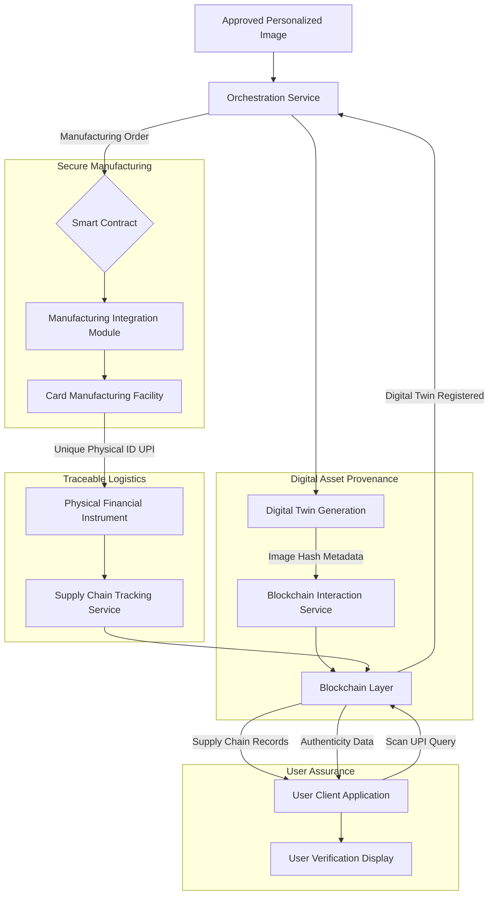
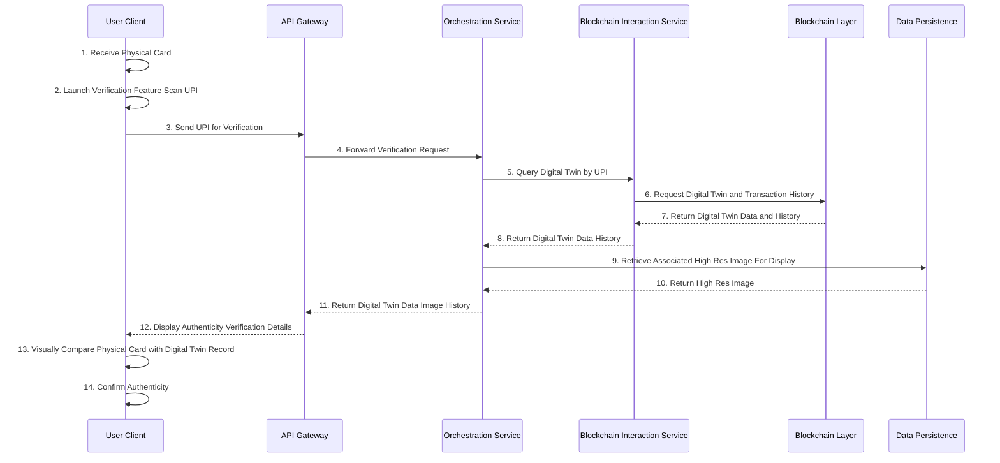
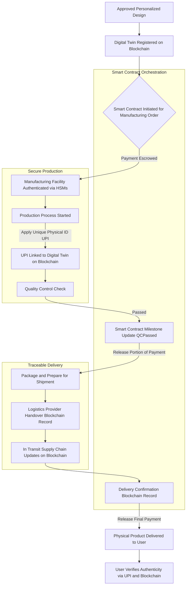
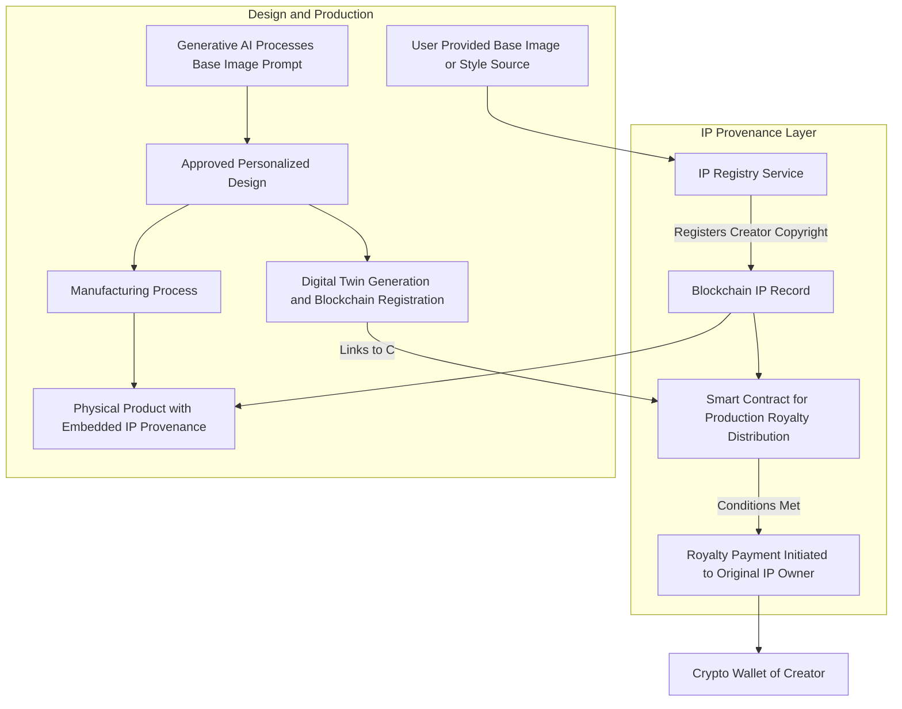

**Title of Invention:** A Blockchain-Verified End-to-End Secure Production and Supply Chain for Generative Financial Instrument Personalization with Digital Asset Provenance and Immutability

**Abstract:**
A novel and robust computational system is disclosed for extending the algorithmic narrative-driven generative visual transmutation of digital financial instruments into a fully traceable, secure, and compliant physical manufacturing and delivery pipeline. The present invention integrates an immutable distributed ledger technology, specifically blockchain, with the digital design process, enabling the creation of cryptographic "digital twins" for each personalized visual asset. These digital twins, comprising unique hashes of approved designs and critical metadata, are immutably registered on a blockchain, establishing irrefutable provenance and safeguarding intellectual property rights. Smart contracts orchestrate the entire manufacturing lifecycle, from secure order initiation to automated quality assurance checkpoints and release of payment, ensuring adherence to design specifications and regulatory compliance. The system incorporates secure hardware integrations within manufacturing facilities for authenticated production, embedding unique physical identifiers onto the tangible financial instruments. A decentralized network facilitates transparent tracking of the physical product through the supply chain, culminating in a user-facing verification mechanism that enables authentication of the physical artifact against its blockchain-registered digital twin. This holistic framework addresses heretofore unmet challenges in trust, transparency, and intellectual property protection within the personalized physical goods sector, particularly for high-value financial instruments.

**Background of the Invention:**
The burgeoning demand for personalized physical artifacts, especially within sensitive domains such as financial instruments, has introduced significant complexities and vulnerabilities into traditional manufacturing and supply chain paradigms. While digital personalization tools, as described in prior art (e.g., the parent invention), offer unprecedented creative freedom, the translation of these unique digital designs into tangible products is fraught with challenges. Existing systems are severely deficient in providing immutable provenance, ensuring authenticity against counterfeiting, protecting intellectual property (IP) rights of both users and underlying generative models, and offering transparent traceability throughout the manufacturing and logistics chain. Conventional methods rely on centralized databases susceptible to tampering, lack granular auditability, and fail to offer cryptographic assurances of design integrity from digital conception to physical realization. There exists a critical unfulfilled exigency for a computationally intelligent and cryptographically secure system capable of bridging the digital-to-physical divide, ensuring that a user's bespoke narrative-driven design is precisely and securely manifested as a physical artifact, with an unbroken chain of custody and verifiable authenticity. The prior art lacks the capacity for immutable tracking, verifiable manufacturing, and decentralized authenticity checks, remaining mired in opaque and trust-reliant processes. This invention addresses these limitations by introducing a robust blockchain-integrated framework that instills unprecedented levels of trust, transparency, and integrity into the personalized physical production pipeline.

**Brief Summary of the Invention:**
The present invention extends the paradigm of personalized financial instruments by introducing a novel blockchain-enabled framework for secure, transparent, and verifiable physical production and supply chain management. Upon a user's final approval of a generative visual design (as detailed in the parent invention), the system initiates the creation of a cryptographic "digital twin." This digital twin, composed of a unique hash of the high-resolution, production-ready image and associated metadata (e.g., design parameters, user ID, timestamp, IP rights information), is immutably recorded on a distributed ledger (blockchain). This blockchain registration establishes undeniable proof of existence, ownership, and integrity of the digital design asset.

Subsequently, a manufacturing order is formalized as a smart contract on the blockchain. This smart contract codifies all manufacturing specifications, quality assurance protocols, and payment terms. It acts as an autonomous agent, orchestrating the secure transmission of the digital twin and production instructions to an authorized manufacturing facility. The manufacturing facility, integrated with hardware security modules (HSMs) or trusted execution environments (TEEs), authenticates its processes and securely produces the physical financial instrument. During production, unique physical identifiers (e.g., serialized QR codes, NFC tags, embedded microchips) are applied to each artifact, cryptographically linked to its blockchain-registered digital twin.

Throughout the supply chain, each transition of custody (from manufacturer to logistics provider to final delivery) is recorded as a transaction on the blockchain, creating an immutable audit trail. This ensures full transparency and traceability. Upon receipt, the end-user can, using a simple client application, scan the physical identifier on their financial instrument. The system then queries the blockchain, retrieves the original digital twin, and verifies the authenticity of the physical product against its immutable digital record, ensuring it is precisely what was designed and manufactured according to specifications. This revolutionary approach guarantees authenticity, protects intellectual property, and provides unparalleled trust in the personalized physical product lifecycle.

**Detailed Description of the Invention:**

The present invention articulates a sophisticated, multi-layered computational and operational architecture engineered to extend the digital creation of personalized financial instrument aesthetics into a verifiable, secure, and transparent physical production pipeline, leveraging the intrinsic properties of blockchain technology. The system operates through an orchestrated sequence of modules, each executing specialized functions to achieve end-to-end integrity.

The process commences immediately after a user, via the Client Application and Orchestration Service (as described in the parent invention), approves a final generative image for their financial instrument. This "Approved Personalized Image" (API) is transformed into a **Production-Ready Digital Asset**. This transformation involves high-resolution rendering, precise color profile conversion (e.g., CMYK), inclusion of bleed areas, and application of any financial institution branding overlays, all while adhering to industry standards such as ISO/IEC 7810 ID-1.

1.  **Digital Twin Generation and Blockchain Registration:**
    The core of the provenance mechanism lies in the creation of a **Digital Twin**. The production-ready API is subjected to a cryptographic hashing algorithm (e.g., SHA-256), generating a unique, fixed-size **Image Hash**. Concurrently, critical metadata, including but not limited to, the user's pseudonymized ID, design parameters, timestamp of approval, intellectual property ownership claims (e.g., user as creator, usage rights for base images), and a unique Order ID, are aggregated. This Image Hash and metadata constitute the Digital Twin.
    The Digital Twin is then submitted to a **Blockchain Layer** via a **Blockchain Interaction Service**. A transaction is broadcast to the network, registering this Digital Twin immutably on the distributed ledger. This registration establishes verifiable proof of the design's existence at a specific time and links it to all relevant metadata. This serves as the foundational record for authenticity and IP protection.

2.  **Smart Contract Orchestration of Manufacturing:**
    Upon successful blockchain registration of the Digital Twin and confirmation of a manufacturing order, a **Smart Contract** is deployed or activated on the Blockchain Layer. This Smart Contract is a self-executing agreement with the terms of the manufacturing order directly written into code. It encompasses:
    *   **Design Reference:** Pointer to the Digital Twin's hash on the blockchain.
    *   **Manufacturing Specifications:** Details of material, finish, quantity, and quality standards.
    *   **Payment Escrow:** Funds from the user held securely until specified conditions are met.
    *   **Milestone Triggers:** Predefined events (e.g., "production initiated," "quality control passed," "shipped") that, when verified, trigger state changes within the contract and potentially release portions of the payment.
    The Orchestration Service monitors this Smart Contract, interacting with external parties (manufacturing, logistics) to facilitate compliance with its terms.

3.  **Secure Manufacturing Integration:**
    The Smart Contract initiates a secure communication with an authorized **Card Manufacturing Facility** via the **Manufacturing Integration Module**. This module transmits the production-ready API (encrypted) and the Digital Twin reference.
    Within the manufacturing facility, specialized hardware and software components ensure integrity:
    *   **Hardware Security Modules HSMs/Trusted Platform Modules TPMs:** These secure components authenticate the manufacturing machinery and ensure that only authorized processes can access the design data and perform production. They can also securely sign attestations of production events.
    *   **Unique Physical Identifier UPI Application:** During production, each physical financial instrument receives a unique, non-duplicable physical identifier (e.g., a laser-etched serial number, a cryptographically generated QR code, an embedded NFC chip, or a holographic security feature). This UPI is cryptographically linked to the Digital Twin's hash and the specific instance of the physical card, with its mapping recorded on the blockchain via a manufacturer transaction.
    *   **Automated Quality Control AQC:** Integrated systems perform visual and functional checks. AQC results are securely logged and, upon meeting thresholds, trigger a Smart Contract milestone update.

4.  **Blockchain-Enabled Supply Chain Tracking:**
    Once manufactured and packaged, the physical financial instruments enter the **Supply Chain**. Each significant event in the supply chain (e.g., handover to logistics partner, transit point arrival, final delivery scan) is recorded as a transaction on the Blockchain Layer. This is facilitated by a **Supply Chain Tracking Service** that integrates with logistics providers' systems.
    *   **Chain of Custody:** Every transfer of possession is time-stamped and signed by the involved parties, creating an immutable record of custody.
    *   **IoT Integration:** Optional IoT sensors embedded in packaging can monitor environmental conditions (temperature, humidity, shock) and log this data onto the blockchain, ensuring product integrity during transit.

5.  **User Authenticity Verification:**
    Upon receiving their personalized financial instrument, the end-user can verify its authenticity using their **Client Application**.
    *   **Scan UPI:** The user scans the Unique Physical Identifier (QR code, taps NFC) on their card.
    *   **Blockchain Query:** The Client Application sends a query to the Blockchain Layer (via the Orchestration Service or a direct light client), using the UPI to retrieve the associated Digital Twin and its complete transaction history.
    *   **Visual Comparison and Data Display:** The application displays the original approved digital design (the Digital Twin's image representation) and all associated manufacturing and supply chain history. The user can visually compare this digital record with their physical card, confirming its authenticity. Any discrepancies would immediately flag a potential issue.

**Figure 1: Blockchain-Secured Production Pipeline Architecture**


**Figure 2: User Authenticity Verification Flow Sequence Diagram**


**Figure 3: Smart Contract-Driven Manufacturing Lifecycle**


**Figure 4: Intellectual Property IP Protection and Royalty Distribution Flow**


**Claims:**

We claim:

1.  A method for securing the physical production and supply chain of personalized financial instruments, comprising the steps of:
    a.  Receiving an approved digitally encoded personalized image data structure, said image having been generated via a multi-modal generative artificial intelligence [AI] synthesis engine based on a user's narrative prompt.
    b.  Generating a cryptographic hash of said approved personalized image data structure.
    c.  Aggregating said cryptographic hash with associated metadata, including at least one of user identification, design parameters, timestamp, and intellectual property rights information, to form a digital twin data structure.
    d.  Transmitting said digital twin data structure to a blockchain layer for immutable registration, thereby establishing verifiable provenance for the personalized image.
    e.  Initiating a smart contract on said blockchain layer, said smart contract codifying manufacturing specifications and payment terms for the physical production of a financial instrument corresponding to the registered digital twin.
    f.  Securely transmitting the approved personalized image data structure and a reference to its digital twin to an authenticated manufacturing facility, the facility's authenticity being verifiable through hardware security modules [HSMs] or trusted execution environments [TEEs].
    g.  Producing a physical financial instrument at said manufacturing facility, and embedding a unique physical identifier [UPI] onto said physical financial instrument, said UPI being cryptographically linked to the registered digital twin.
    h.  Recording manufacturing milestones and supply chain custody transfers as transactions on the blockchain layer, thereby creating an immutable audit trail from production to delivery.
    i.  Enabling a user to verify the authenticity of the physical financial instrument by scanning the embedded UPI, querying the blockchain layer for the associated digital twin, and presenting the original digital design and its provenance history for comparison.

2.  The method of claim 1, further comprising the step of:
    a.  Automatically releasing payment from an escrow account held by the smart contract upon verification of predefined manufacturing and delivery milestones recorded on the blockchain.

3.  The method of claim 1, wherein the unique physical identifier [UPI] is selected from the group consisting of a cryptographically signed QR code, an NFC tag, an embedded microchip, a laser-etched serial number, or a holographic security feature.

4.  The method of claim 1, wherein the metadata includes a reference to an original intellectual property [IP] owner for a base image or artistic style used in the generative process, and the smart contract facilitates automated royalty distribution to said IP owner.

5.  The method of claim 1, further comprising:
    a.  Integrating IoT sensors into the supply chain, said sensors collecting environmental data during transit, and logging said environmental data onto the blockchain layer, ensuring product integrity.

6.  A system for blockchain-verified end-to-end secure production and supply chain of personalized financial instruments, comprising:
    a.  An orchestration service configured to:
        i.  Receive an approved personalized digital image.
        ii. Generate a cryptographic hash and aggregate metadata to create a digital twin.
        iii. Interact with a blockchain interaction service to register the digital twin.
        iv. Initiate and monitor a smart contract for manufacturing and supply chain processes.
        v.  Receive and process requests for authenticity verification.
    b.  A blockchain interaction service, communicatively coupled to the orchestration service, configured to:
        i.  Interface with a distributed ledger technology blockchain layer.
        ii.  Broadcast transactions for digital twin registration, UPI linking, manufacturing milestones, and supply chain updates.
        iii. Query the blockchain layer for digital twin data and transaction history.
    c.  A smart contract module, residing on the blockchain layer, configured to:
        i.  Store manufacturing specifications and payment terms.
        ii.  Hold funds in escrow.
        iii. Execute automated actions based on verified milestones recorded on the blockchain.
    d.  A manufacturing integration module, communicatively coupled to the orchestration service, configured to:
        i.  Securely transmit approved image data and digital twin references to an authorized manufacturing facility.
        ii.  Receive authenticated production attestations from the manufacturing facility.
        iii. Record the linking of unique physical identifiers [UPIs] to digital twins on the blockchain.
    e.  A card manufacturing facility, equipped with hardware security modules [HSMs] or trusted execution environments [TEEs], configured to:
        i.  Produce physical financial instruments according to digital designs.
        ii.  Embed unique physical identifiers [UPIs] onto each instrument.
        iii. Provide authenticated reports of production milestones.
    f.  A supply chain tracking service, communicatively coupled to the blockchain interaction service, configured to:
        i.  Record custody transfers and logistics events as blockchain transactions.
        ii.  Optionally integrate with IoT sensors for environmental data logging.
    g.  A client-side interface module configured to:
        i.  Enable scanning of unique physical identifiers [UPIs] on physical instruments.
        ii.  Transmit UPIs for blockchain query.
        iii. Receive and display the original digital twin, associated image, and provenance history for user verification of authenticity.

7.  The system of claim 6, further comprising:
    a.  An intellectual property [IP] registry service, configured to register original creators and usage rights on the blockchain, and to facilitate automated royalty payments via smart contracts.

8.  The system of claim 6, wherein the authentication of the manufacturing facility's processes is achieved through cryptographic attestations signed by the facility's Hardware Security Modules [HSMs] or Trusted Platform Modules [TEEs], verifiable on the blockchain.

**Mathematical Justification: The Universal Manifold of Narrative-Perceptual Transmutation and its Blockchain-Secured Physical Actualization**

Building upon the previous mathematical framework, let `I` be the manifold of all perceivable images and `P` be the latent semantic space of natural language prompts. The multi-modal generative AI operator `G_AI: I x P -> I` transforms an initial image `i` into a personalized image `i'`. This invention extends this digital transformation into the physical realm with cryptographic assurances.

Let `F` denote the space of all possible physical financial instruments. Each physical artifact `f in F` possesses a unique physical identifier `UPI_f`.

1.  **Cryptographic Hashing and Digital Twin Formation:**
    Upon generation of the approved personalized image `i' = G_AI(i_base, p)`, we introduce a cryptographic hashing function `H: I -> Z_hash`, where `Z_hash` is the space of fixed-size cryptographic hash values.
    The **Digital Twin (DT)** for `i'` is defined as:
    ```
    DT(i') = (H(i'), M)
    ```
    Where `M` is a metadata set `M = {user_ID, design_params, timestamp, IP_rights_ID, order_ID, ...}`.

2.  **Blockchain Registration of Digital Twin:**
    Let `B` represent the state of the blockchain, a cryptographically secured, immutable, distributed ledger.
    A blockchain transaction `T_reg` registers the Digital Twin:
    ```
    T_reg(DT(i')) = add_block(B, {operation: "register_DT", data: DT(i'), signature: S_orchestrator})
    ```
    This operation creates an indelible record of `DT(i')` on `B`, establishing its cryptographic proof of existence and associated provenance.

3.  **Smart Contract for Manufacturing Orchestration:**
    A smart contract `SC` is deployed on `B`. `SC` is a program that executes automatically when predefined conditions are met. Its state `SC_state` tracks the manufacturing process.
    ```
    SC_deploy(DT_hash, manufacturing_specs, payment_escrow, milestones)
    ```
    The `SC` monitors `B` for specific events. For instance, `SC_state_update(event)` where `event` could be `manufacturer_attestation_production_started` or `quality_control_passed`.

4.  **Secure Manufacturing Attestation and UPI Linkage:**
    Let `f_manufactured` be the physical financial instrument produced. During its production, a `UPI_f` is embedded.
    The manufacturing facility provides an attestation of production `A_prod`, cryptographically signed by its secure hardware (e.g., HSM):
    ```
    A_prod = {manufacturer_ID, DT_hash, UPI_f, production_timestamp, HSM_signature}
    ```
    This attestation is recorded as a transaction on the blockchain:
    ```
    T_prod(A_prod) = add_block(B, {operation: "link_UPI", data: A_prod, signature: S_manufacturer})
    ```
    This transaction immutably links `UPI_f` to `DT(i')` and verifies that `f_manufactured` was produced by an authenticated entity.

5.  **Blockchain-Based Supply Chain Tracking:**
    Let `L = {l_1, l_2, ..., l_K}` be the sequence of logistics entities in the supply chain. Each transfer of custody `k` is a transaction:
    ```
    T_custody_k(UPI_f, handler_k, receiver_k, timestamp_k) = add_block(B, {operation: "custody_transfer", data: {UPI_f, handler_k, receiver_k, timestamp_k}, signature: S_handler_k})
    ```
    This creates an immutable chain of custody for `f_manufactured`.

6.  **User Authenticity Verification:**
    An end-user possesses `f_actual`, a physical financial instrument with `UPI_actual`. The user initiates a verification query.
    The system performs a lookup on `B` using `UPI_actual` to retrieve the registered `DT_retrieved = (H_retrieved, M_retrieved)`.
    A crucial verification check involves:
    a.  **Image Hash Integrity:** `H_retrieved` must match the cryptographic hash of the original approved image.
    b.  **Physical Linkage:** The presence and validity of `UPI_actual` and its linkage to `DT_retrieved` on `B`.

    The system aims to minimize the probability of `P(f_actual is counterfeit | H(f_actual) != H_retrieved)`. Ideally, this probability should approach 1.
    For perfect authenticity, we desire:
    `f_actual` is authentic `iff` `exists T_prod in B such that T_prod.data.UPI_f = UPI_actual AND T_prod.data.DT_hash = H(DT_retrieved.image)` AND all `T_custody` transactions are valid.

**Theorem of Immutable Physical Actualization and Provenance:**

Given a personalized digital image `i'` generated by `G_AI`, and its Digital Twin `DT(i')` immutably registered on a blockchain `B`, and a physical financial instrument `f` produced and tracked according to the methods described, the system provides an **unbreakable cryptographic chain of provenance** for `f`. This chain ensures that:

1.  **Authenticity:** For any `f` with `UPI_f`, the origin `DT(i')` can be verifiably traced, and its congruence to the original digital design is cryptographically assured against tampering `P(d_physical(f, i') < epsilon_p | verify_blockchain(UPI_f, DT(i')) == true) -> 1`. Here `d_physical` is a metric comparing physical artifact to digital design.
2.  **Integrity:** Any attempt to alter the manufacturing record, supply chain history, or the linkage between `UPI_f` and `DT(i')` would invalidate the respective blockchain transactions, rendering the physical item unverifiable.
3.  **Intellectual Property Protection:** The immutable `IP_rights_ID` embedded in `M` within `DT(i')` establishes clear ownership and usage rights, enforceable by smart contracts.

This rigorous mathematical and architectural framework definitively establishes a new paradigm for secure and transparent physical actualization of digitally personalized assets, fundamentally transforming trust in the co-creation of identity-reflective tangible financial instruments.

`Q.E.D.` The comprehensive system and method described herein demonstrably actualize a novel form of secure, traceable, and immutable physical production, irrevocably establishing ownership of this fundamental inventive step in the domain of multi-modal generative design and blockchain-integrated supply chains.