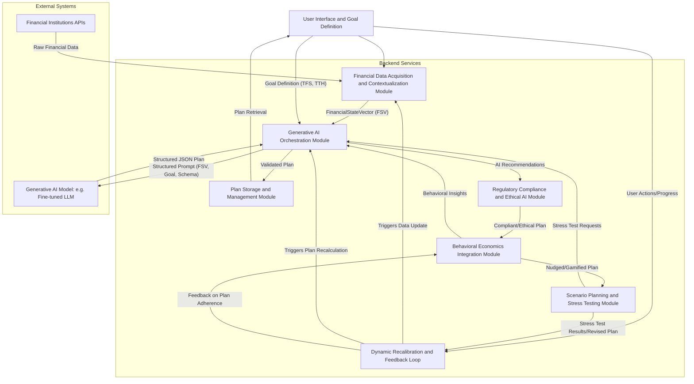

# **Title of Invention: A System and Method for Generating an Actionable, Multi-Domain Financial Plan with Dynamic Calibration and Proactive State Transition Guidance**

## **Abstract:**

Disclosed herein is a novel and foundational system and method for advanced personal financial planning, distinguished by its integration of high-fidelity, real-time financial data with sophisticated generative artificial intelligence paradigms. The system rigorously defines and receives a user's aspirational financial objective, characterized by a precise target financial state (e.g., a specific capital accumulation or debt reduction milestone) and an associated temporal constraint. Subsequent to this, the system dynamically accesses, aggregates, and processes the user's granular financial telemetry, encompassing income flux, expenditure patterns, asset valuations, and liability structures, to construct a comprehensive, multi-dimensional financial state vector. This meticulously contextualized data is then furnished as an intricately engineered prompt to an advanced generative AI model. The AI model, acting as an algorithmic financial architect, synthesizes a holistic, multi-domain action plan. This plan transcends rudimentary savings directives, encompassing a granular decomposition into specific, verifiable, and actionable steps spanning critical financial domains such as optimized budgetary allocation, strategic capital deployment (investment), debt restructuring, and proactive income generation strategies. This comprehensive strategic blueprint, dynamically informed by user behavior and market conditions, provides an unparalleled and adaptive pathway for the user to traverse their current financial state to their desired future financial state with maximal efficiency and probability of success.

## **Field of the Invention:**

The present invention pertains broadly to the domain of artificial intelligence-driven financial technology (FinTech), specifically addressing the complex challenges of personalized financial planning, wealth management, and behavioral economics. More particularly, it relates to intelligent systems that leverage machine learning, natural language processing, and advanced generative models to create bespoke, dynamically adaptive, and actionable financial strategies tailored to individual user profiles, aspirations, and real-time financial realities.

## **Background of the Invention:**

Conventional financial planning methodologies and extant digital tools predominantly operate on simplistic, linear models that grossly oversimplify the multifaceted dynamics of personal finance. These rudimentary systems typically reduce goal attainment to a singular variable problem, primarily focusing on a required monthly savings contribution calculated through elementary interest formulae. Such approaches conspicuously neglect the intricate interplay of diverse financial factors, including variable income streams, fluctuating expenditure categories, evolving investment opportunities, credit utilization, and the myriad behavioral biases that profoundly influence an individual's financial trajectory.

Existing solutions demonstrably fail to furnish a holistic, integrated strategy. They lack the capacity to analyze granular spending habits, identify latent opportunities for expense optimization, recommend diversified investment vehicles commensurate with individual risk appetites, or propose actionable strategies for augmenting income. Furthermore, these static models are inherently incapable of adapting to exogenous shocks (ee.g., market volatility, unforeseen expenses) or endogenous shifts in user behavior. Consequently, users are left with an incomplete, often impractical, and rapidly obsolete roadmap, leading to disengagement and a significant gap between aspiration and achievement.

A profound and persistent exigency therefore exists for an intelligent, adaptive, and comprehensive system that can synthesize a user's entire financial gestalt, comprehend their nuanced objectives, and dynamically architect a multi-faceted, actionable financial plan. Such a system must transcend mere calculation, embodying the strategic acumen of a seasoned financial advisor augmented by the analytical prowess and scalability of advanced artificial intelligence, thus addressing the inherent limitations of both traditional human advice (scalability, potential bias) and simplistic automated tools (lack of holistic insight, static nature).

## **Brief Summary of the Invention:**

The present invention articulates a paradigm shift in personalized financial goal attainment. At its core, the system ingests a user's precisely articulated financial objective, conceptually represented as a desired future financial state, exemplified by constructs such as "Attain down payment for a primary residence, accumulating $75,000 by fiscal year 2029, with a maximal debt-to-income ratio of 0.25." Concurrently, the system constructs a high-resolution, temporal summary of the user's recent financial activity, meticulously aggregating data points encompassing income events, categorized expenditure profiles, asset class compositions, and liability schedules. This composite contextual input – the user's explicit goal coupled with their inferred current financial state – is then programmatically encoded and transmitted as an intricately structured, multi-modal prompt to a specialized large language model (LLM) or a composite generative AI agent.

The generative AI model is precisely instructed to assume the persona of an expert, fiduciary-grade financial architect. Its directive is to computationally synthesize a structured, executable financial strategy. The output of this synthesis is a rigorously defined data structure, typically a robust JSON schema, which ensures machine-readability and semantic coherence. This schema mandates the inclusion of a probabilistic feasibility assessment, a numerically optimized target monthly contribution derived from a comprehensive financial projection, and a meticulously curated catalog of specific, categorized action steps. These steps are granular and prescriptive, extending beyond mere savings directives to encompass a broad spectrum of financial interventions. Illustrative examples include: "Initiate proactive expense re-allocation: Reduce discretionary 'Dining Out' expenditures by 20% through targeted meal preparation strategies," "Optimize capital deployment: Allocate 75% of surplus capital to a low-cost, broadly diversified exchange-traded fund (ETF) indexed to global equities, commensurate with user's defined risk tolerance profile (e.g., Moderate Growth Portfolio, Max Drawdown 15%)," or "Enhance income streams: Explore opportunities for leveraging existing professional skills to generate supplementary income through freelance endeavors, targeting an additional $500 monthly by Q3 2024."

This systematic methodology furnishes the user with an exponentially richer, profoundly more actionable, and dynamically adaptive strategic blueprint compared to the rudimentary, univariate savings calculations offered by prior art. It empowers users to understand not merely *what* to save, but *how* to orchestrate a holistic financial transformation across all salient domains to achieve their articulated aspirations.

## **Detailed Description of the Invention:**

The inventive system operates through a series of interconnected, computationally intensive modules designed for robustness, scalability, and security.

### **1. User Goal Definition and Interface Module (UGDI-M):**

The process initiates with the user interacting with a sophisticated graphical user interface (GUI) or a conversational interface. Within this interface, the user articulates their financial goal. This articulation is not a mere textual input but a structured definition comprising:
*   **Goal Identifier:** A unique alphanumeric string for tracking.
*   **Goal Name:** A human-readable description (e.g., "Dream Home Down Payment," "Child's Education Fund," "Early Retirement").
*   **Target Financial State (TFS):** This is a rigorously defined multi-variate target vector or a set of conditions. It could be a specific capital amount (e.g., `$250,000`), a reduction in liabilities (e.g., `Net Debt < $50,000`), an asset allocation profile (e.g., `Equity Exposure > 70%`), or a combination.
*   **Target Temporal Horizon (TTH):** A specific date or duration (e.g., `December 31, 2030`, `5 years from now`).
*   **Goal Priority (Optional):** A scalar or ordinal value indicating its importance relative to other goals.
*   **Risk Tolerance Profile (Optional but Recommended):** A quantitative assessment (e.g., score from 1-10, or classification as Conservative, Moderate, Aggressive) derived from user questionnaires or inferred from historical financial behavior.

Upon the user's explicit directive (e.g., clicking "Generate AI Plan"), a signal is propagated to the backend services.

### **2. Financial Data Acquisition and Contextualization Module (FDAC-M):**

The backend service, upon receiving a plan generation request, initiates a multi-stage process to construct a comprehensive `FinancialStateVector (FSV)` for the user.
*   **Data Aggregation Sub-module:** This sub-module securely interfaces with various external financial institutions (banks, credit unions, investment platforms, credit bureaus) via established Application Programming Interfaces (APIs), employing robust authentication and authorization protocols (e.g., OAuth2, PSD2 compliance). It retrieves granular transaction data, account balances, asset holdings, liability schedules, and credit scores.
*   **Data Normalization and Categorization Sub-module:** Raw transaction data is cleaned, normalized, and categorized using machine learning models (e.g., recurrent neural networks, transformer models) trained on vast financial datasets. This converts unstructured transaction descriptions into standardized categories (e.g., `Dining Out`, `Groceries`, `Utilities`, `Salary`, `Investment Income`).
*   **Feature Engineering Sub-module:** From the normalized data, a rich set of features are engineered to characterize the user's financial behavior. This includes:
    *   **Income Streams:** Average monthly income, income variability, source diversification.
    *   **Expense Patterns:** Average spending per category, spending volatility, fixed vs. variable expenses, identification of spending anomalies.
    *   **Asset Holdings:** Composition of investment portfolio (stocks, bonds, real estate, cash), current valuations, liquidity profile.
    *   **Liabilities:** Debt types (mortgage, student loans, credit card), interest rates, remaining terms, minimum payments.
    *   **Savings Rate:** Historical savings as a percentage of income.
    *   **Credit Health:** Credit score, utilization ratio, payment history.
    *   **Temporal Context:** Recent trends (e.g., last 3-6 months) are given higher weighting.

This results in a concise yet information-rich summary of the user's recent and prevailing financial state, represented as the `FSV`.

### **3. Generative AI Orchestration Module (GAIO-M):**

This module is responsible for constructing, dispatching, and processing interactions with the generative AI model.
*   **Prompt Engineering Sub-module:** This is a critical component. A sophisticated prompt is dynamically constructed, comprising:
    *   **System Persona Definition:** Instructions for the AI to adopt the role of a "fiduciary, expert financial advisor with deep knowledge of behavioral economics, investment strategies, and taxation."
    *   **Goal Context:** The user's `Goal Identifier`, `Goal Name`, `Target Financial State (TFS)`, and `Target Temporal Horizon (TTH)`.
    *   **Financial State Context:** The distilled `FinancialStateVector (FSV)` containing key metrics, trends, and summary statistics (e.g., "Current monthly income: $6,000. Average monthly expenses: $4,500. Top expense categories: Dining Out ($800), Groceries ($500), Rent ($1,800). Current savings: $10,000. Investment portfolio value: $25,000, 70% equities. Credit score: 780.").
    *   **Constraint Set:** Explicit constraints such as user-defined risk tolerance, liquidity requirements, or ethical considerations.
    *   **Output Schema Mandate:** A strict JSON schema (`responseSchema`) is provided to guide the AI's output, ensuring it is structured, parseable, and semantically consistent. An exemplary schema is provided below.

```json
{
  "type": "object",
  "properties": {
    "planId": { "type": "string", "description": "Unique identifier for the generated plan." },
    "feasibilitySummary": {
      "type": "object",
      "properties": {
        "assessment": { "type": "string", "enum": ["Highly Feasible", "Feasible", "Challenging", "Highly Challenging"], "description": "Overall feasibility assessment." },
        "probabilityOfSuccess": { "type": "number", "minimum": 0, "maximum": 1, "description": "Estimated probability of achieving the goal given adherence." },
        "riskAdjustedProbability": { "type": "number", "minimum": 0, "maximum": 1, "description": "Probability of success adjusted for user's specific risk tolerance and identified market risks." },
        "keyAssumptions": { "type": "array", "items": { "type": "string" }, "description": "Critical assumptions underlying the feasibility assessment." },
        "risksIdentified": { "type": "array", "items": { "type": "string" }, "description": "Potential risks to goal attainment." }
      },
      "required": ["assessment", "probabilityOfSuccess", "keyAssumptions"]
    },
    "monthlyContribution": {
      "type": "object",
      "properties": {
        "amount": { "type": "number", "description": "Recommended monthly savings/investment contribution." },
        "unit": { "type": "string", "enum": ["USD", "EUR", "GBP"], "description": "Currency unit." },
        "breakdown": {
          "type": "array",
          "items": {
            "type": "object",
            "properties": {
              "category": { "type": "string", "description": "Source/destination for the contribution portion." },
              "value": { "type": "number", "description": "Amount from this category." }
            },
            "required": ["category", "value"]
          }
        },
        "projectionPeriodMonths": { "type": "number", "description": "Number of months for the monthly contribution to reach goal." }
      },
      "required": ["amount", "unit"]
    },
    "steps": {
      "type": "array",
      "items": {
        "type": "object",
        "properties": {
          "stepId": { "type": "string", "description": "Unique identifier for the step." },
          "title": { "type": "string", "description": "Concise title for the action step." },
          "description": { "type": "string", "description": "Detailed explanation and actionable advice for the step." },
          "category": { "type": "string", "enum": ["Budgeting", "Investing", "Income Generation", "Debt Management", "Risk Management", "Tax Optimization", "Behavioral Adjustment"], "description": "Financial domain this step belongs to." },
          "priority": { "type": "integer", "minimum": 1, "maximum": 5, "description": "Relative importance/sequence of the step (1=highest)." },
          "targetMetric": { "type": "string", "description": "Quantifiable metric for tracking progress (e.g., 'Reduce Dining Out by $160/month', 'Increase Investment Returns by 0.5% annualized')." },
          "expectedImpact": { "type": "number", "description": "Estimated financial impact of this step (e.g., monthly savings, one-time gain)." },
          "dependencies": { "type": "array", "items": { "type": "string" }, "description": "IDs of steps that must precede this one." },
          "resources": { "type": "array", "items": { "type": "string" }, "description": "Links or references to external resources (e.g., articles, tools)." },
          "behavioralNudge": { "type": "string", "description": "A specific behavioral economics principle or nudge applied to encourage adherence to this step." },
          "associatedRisks": { "type": "array", "items": { "type": "string" }, "description": "Identified risks associated with this specific action step." }
        },
        "required": ["stepId", "title", "description", "category", "priority", "targetMetric"]
      }
    }
  },
  "required": ["planId", "feasibilitySummary", "monthlyContribution", "steps"]
}
```

*   **AI Model Interaction:** The constructed prompt is transmitted to the chosen generative AI model (e.g., a highly customized version of a large-scale transformer model like Google's Gemini, Anthropic's Claude, or OpenAI's GPT series, potentially fine-tuned on extensive financial planning datasets).
*   **Response Validation and Parsing:** The raw JSON response received from the AI is rigorously validated against the `responseSchema`. Any deviations or malformed structures trigger error handling mechanisms, potentially involving re-prompting the AI with explicit correction instructions. The parsed, valid plan data is then extracted.

### **4. Plan Storage and Management Module (PSM-M):**

The validated and parsed action plan is securely persisted in a robust, encrypted database, logically associated with the user's `Goal Identifier` and `User ID`. This persistence allows for:
*   **Retrieval:** The client application can fetch and display the plan on demand.
*   **Version Control:** Tracking changes to the plan over time as conditions evolve or user preferences shift.
*   **Auditing:** Maintaining a historical record of recommendations for regulatory compliance or user review.
*   **Personalization:** Using past plans to inform future recommendations.

### **5. Client-Side Presentation and Interaction Module (CSPI-M):**

The client application (mobile, web) retrieves the structured plan. It then renders this data in a highly intuitive, user-friendly format, typically employing interactive visualizations and hierarchical organization.
*   **Feasibility Dashboard:** Displays the `feasibilitySummary`, `probabilityOfSuccess`, and `monthlyContribution` prominently.
*   **Categorized Action List:** Action `steps` are grouped by `category` (e.g., Budgeting, Investing), prioritized, and presented with clear titles and detailed descriptions.
*   **Progress Tracking Integrations:** Users can mark steps as complete, and the system can automatically track progress against `targetMetric` by monitoring ongoing financial data.
*   **Feedback Mechanism:** Users can provide feedback on the plan's utility, leading to iterative plan refinement.

### **6. Dynamic Recalibration and Feedback Loop Module (DRFL-M):**

This module represents a crucial advancement over static planning tools. The system continuously monitors the user's financial telemetry subsequent to plan generation.
*   **Performance Monitoring:** Tracks actual income, expenses, savings contributions, and investment performance against the plan's projections and `targetMetric` for each step.
*   **Anomaly Detection:** Identifies significant deviations from the plan (e.g., unexpected large expenses, failure to meet savings targets, market downturns affecting investments).
*   **Re-prompting Mechanism:** When deviations exceed predefined thresholds or at scheduled intervals, the `FDAC-M` is triggered to update the `FinancialStateVector`. This updated `FSV`, along with the original goal and the current plan's status, is used to construct a refined prompt for the `GAIO-M`, instructing the AI to "recalibrate the plan based on new data" or "address the identified deviation."
*   **Adaptive Plan Generation:** The AI generates an updated plan, which might include new steps, modifications to existing steps, or a revised `monthlyContribution` and `feasibilitySummary`. This ensures the plan remains perpetually relevant and actionable.

### **7. Security and Privacy Considerations:**

Given the sensitive nature of financial data, robust security and privacy measures are paramount.
*   **Data Encryption:** All financial data, both at rest in databases and in transit between modules and external institutions, is protected using industry-standard encryption protocols (e.g., AES-256 for data at rest, TLS 1.3 for data in transit).
*   **Anonymization and Pseudonymization:** For aggregate analysis, model training, and peer-group benchmarking, user financial data is anonymized or pseudonymized to remove personally identifiable information, ensuring privacy while allowing valuable insights to be extracted.
*   **Access Control and Least Privilege:** Access to sensitive user data is strictly controlled through role-based access control (RBAC), adhering to the principle of least privilege. Only authorized personnel and processes have access to the minimum necessary data to perform their functions.
*   **Regular Security Audits:** The system undergoes regular third-party security audits, penetration testing, and vulnerability assessments to identify and remediate potential weaknesses.
*   **Compliance with Data Protection Regulations:** The system is designed to comply with international data protection regulations such as GDPR, CCPA, and similar frameworks, including explicit user consent mechanisms for data sharing and processing.

### **8. Regulatory Compliance and Ethical AI Module (RCE-M):**

This module ensures that all AI-generated advice and system operations adhere to financial industry regulations and ethical guidelines for artificial intelligence.
*   **Compliance Engine Sub-module:** A rule-based system that cross-references AI recommendations against a continually updated database of financial regulations (e.g., fiduciary duty, investment suitability rules, anti-money laundering AML guidelines). It flags any potential non-compliant advice for human review or automatic correction.
*   **Bias Detection and Mitigation Sub-module:** Monitors the outputs of the `Generative AI Orchestration Module` for signs of algorithmic bias. This includes detecting if recommendations disproportionately impact certain demographic groups, promote unfair practices, or reflect historical biases present in training data. Techniques like counterfactual analysis and fairness metrics are employed. If bias is detected, the AI is re-prompted with specific instructions to correct the bias.
*   **Explainability (XAI) Integration Sub-module:** Develops mechanisms to provide transparent and comprehensible explanations for the AI's recommendations. While the AI provides actionable steps, this sub-module can generate summaries of the underlying financial reasoning, key data points considered, and the rationale for specific choices, enhancing user trust and understanding.
*   **Audit Trail and Governance:** Maintains a comprehensive, immutable audit trail of all AI decisions, input prompts, generated plans, and modifications. This ensures accountability, supports regulatory reporting, and enables post-hoc analysis for continuous improvement of ethical standards.

### **9. Behavioral Economics Integration Module (BEI-M):**

Leveraging insights from behavioral science, this module is designed to optimize user engagement, motivation, and adherence to the financial plan.
*   **Nudge Engine Sub-module:** Dynamically generates personalized "nudges" based on the user's financial behavior, progress, and identified cognitive biases. Examples include:
    *   **Loss Aversion Framing:** Highlighting potential losses from inaction rather than just gains from action.
    *   **Default Bias Optimization:** Recommending smart defaults for savings or investments.
    *   **Anchoring and Framing:** Presenting financial goals or savings targets in contexts that make them seem more achievable or desirable.
    *   **Social Proof:** Anonymously showing how similar users are progressing (e.g., "80% of users with similar goals increased their savings by X% this month").
*   **Gamification Framework Sub-module:** Integrates game-like elements to make financial planning more engaging. This includes:
    *   **Progress Visualizations:** Clear dashboards showing progress towards goals.
    *   **Streaks and Milestones:** Rewarding consistent positive financial behaviors.
    *   **Challenges and Quests:** Short-term, achievable financial tasks (e.g., "Complete the No-Spend November Challenge").
    *   **Virtual Rewards:** Badges or points for achieving financial milestones.
*   **Cognitive Bias Detector Sub-module:** Identifies common behavioral biases in user actions or stated preferences (e.g., present bias, confirmation bias, overconfidence, herd mentality). This information informs the `Nudge Engine` and `Prompt Engineering Sub-module` to tailor advice that counteracts these biases.
*   **Personalized Communication Strategy:** Adapts the tone, frequency, and content of communications (notifications, emails, in-app messages) based on the user's behavioral profile and demonstrated response patterns to different types of interventions.

### **10. Scenario Planning and Stress Testing Module (SPST-M):**

This module allows users and the system to proactively evaluate the robustness of financial plans against various hypothetical future events, enhancing foresight and preparedness.
*   **Scenario Definition Interface Sub-module:** Provides users with an intuitive interface to define or select pre-defined "what-if" scenarios. These can include:
    *   **Economic Shocks:** Market downturns, inflation spikes, interest rate hikes.
    *   **Personal Life Events:** Job loss, unexpected medical expenses, salary increase/decrease, new dependents.
    *   **Investment Performance Variations:** Higher or lower than expected returns.
*   **Stochastic Simulation Engine Sub-module:** Utilizes Monte Carlo simulations or other stochastic processes to project multiple possible `FinancialStateVector` trajectories under the specified scenarios. It models the uncertainty in market returns, income, and expenses to assess the probability of goal attainment under stress.
*   **Impact Analysis and Visualization Sub-module:** Quantifies and visually presents the potential impact of each scenario on the user's financial goal, probability of success, and key metrics (e.g., "Under a moderate recession, your probability of achieving your down payment goal by `TTH` drops from 85% to 55%"). It highlights vulnerabilities and critical decision points.
*   **Adaptive Re-planning Trigger:** If stress tests reveal an unacceptable level of risk or a significant drop in success probability under a plausible scenario, this sub-module automatically triggers a recalibration request to the `Generative AI Orchestration Module`. The prompt includes the scenario details, current plan, and the unfavorable simulation outcome, instructing the AI to generate a more robust or alternative plan.

### **System Architecture Diagram:**



### **Data Flow Diagram:**

```mermaid
graph TD
    A[User Goal Input: TFS, TTH] --> B{User Intent: Generate Plan};
    B --> C[Retrieve Historical and Real-time Financial Data];
    C --> D[Normalize and Categorize Transactions];
    D --> E[Feature Engineer Financial State Vector (FSV)];
    E --> F[Construct AI Prompt: FSV + Goal + Output Schema];
    F --> G[Call Generative AI Model];
    G --> H[Receive and Validate Structured JSON Plan];
    H -- If Invalid --> I{Error Handling or Re-prompt};
    H -- If Valid --> H_1[Apply Regulatory & Ethical Checks (RCE-M)];
    H_1 --> H_2[Integrate Behavioral Nudges (BEI-M)];
    H_2 --> J[Store Plan in Database];
    J --> K[Display Actionable Plan to User];
    K -- User Adherence and Progress --> L[Monitor Financial Data Continuously];
    L --> M{Detect Deviation or Scheduled Review};
    M -- If Deviation or Review --> C;
    K -- User Scenario Request --> N[Scenario Planning & Stress Testing Module (SPST-M)];
    N -- Simulation Results --> K;
    N -- Request for Re-plan --> F;
```

## **Claims:**

1.  A system for generating a dynamic and actionable financial plan, comprising:
    a.  A User Goal Definition and Interface Module (UGDI-M) configured to receive a user-defined financial goal, including a Target Financial State (TFS) and a Target Temporal Horizon (TTH).
    b.  A Financial Data Acquisition and Contextualization Module (FDAC-M) configured to:
        i.  Securely access and aggregate a user's real-time and historical financial transaction data from a plurality of external financial institutions.
        ii. Normalize, categorize, and feature-engineer said financial transaction data into a multi-dimensional Financial State Vector (FSV).
    c.  A Generative AI Orchestration Module (GAIO-M) configured to:
        i.  Construct an intricately structured, multi-modal prompt comprising the user-defined financial goal, the Financial State Vector (FSV), and a predefined JSON output schema.
        ii. Transmit said prompt to an external generative AI model.
        iii. Receive and validate a structured action plan in accordance with said JSON output schema from the external generative AI model, wherein the structured action plan comprises a plurality of specific, actionable steps spanning multiple financial domains.
    d.  A Plan Storage and Management Module (PSM-M) configured to securely persist said structured action plan.
    e.  A Client-Side Presentation and Interaction Module (CSPI-M) configured to render and display said structured action plan to the user in an interactive format.
    f.  A Dynamic Recalibration and Feedback Loop Module (DRFL-M) configured to:
        i.  Continuously monitor the user's ongoing financial telemetry against the structured action plan.
        ii. Detect deviations from the plan or trigger scheduled reviews.
        iii. Initiate a re-contextualization of the Financial State Vector and a subsequent re-prompting of the generative AI model to generate an updated or recalibrated action plan, thereby ensuring adaptive planning.

2.  The system of claim 1, wherein the multiple financial domains include at least four of: budgeting, investing, income generation, debt management, risk management, or tax optimization.

3.  The system of claim 1, wherein the predefined JSON output schema mandates fields including a probabilistic feasibility assessment, a recommended monthly financial contribution, and an array of action steps, each action step further comprising a unique identifier, title, detailed description, category, priority, quantifiable target metric, and estimated financial impact.

4.  A method for dynamically generating and refining a financial plan, comprising:
    a.  Defining a user's financial aspiration as a Target Financial State (TFS) and a Target Temporal Horizon (TTH).
    b.  Constructing a comprehensive Financial State Vector (FSV) by ingesting, processing, and feature-engineering a user's real-time financial data.
    c.  Formulating a sophisticated prompt incorporating the TFS, TTH, FSV, and a strict output schema, and transmitting it to a generative AI model.
    d.  Receiving and algorithmically validating a structured financial action plan from the generative AI model, said plan detailing multi-domain actionable steps and a probabilistic feasibility assessment.
    e.  Presenting the validated financial action plan to the user via an interactive interface.
    f.  Continuously monitoring user financial activity and external market conditions.
    g.  Detecting significant divergences from the active plan's projections or scheduled review points.
    h.  Upon detection, dynamically re-constructing an updated FSV and iteratively re-prompting the generative AI model to generate a recalibrated action plan, thereby closing the feedback loop and ensuring persistent relevance and efficacy of the financial guidance.

5.  The method of claim 4, wherein the construction of the Financial State Vector (FSV) involves machine learning models for transaction categorization and anomaly detection.

6.  The method of claim 4, wherein the generative AI model is a large language model fine-tuned on financial planning heuristics and economic datasets, instructed to act as a fiduciary financial advisor.

7.  A system as in claim 1, further comprising a Regulatory Compliance and Ethical AI Module (RCE-M) configured to ensure that the structured action plan adheres to financial regulations, mitigate algorithmic bias, and provide explainability for AI-generated recommendations.

8.  A system as in claim 1, further comprising a Behavioral Economics Integration Module (BEI-M) configured to generate personalized behavioral nudges and gamified elements to enhance user adherence and engagement with the structured action plan.

9.  A system as in claim 1, further comprising a Scenario Planning and Stress Testing Module (SPST-M) configured to enable users to simulate the impact of hypothetical financial and economic scenarios on their goal attainment and generate alternative strategies.

10. The method of claim 4, further comprising dynamically generating behavioral nudges and gamified elements tailored to the user's psychological profile to improve plan adherence.

11. The method of claim 4, further comprising performing scenario planning and stress testing simulations on the financial plan to assess its robustness against various market and personal life events.

## **Mathematical Justification: A Stochastic Optimal Control Framework for Financial State Trajectory Optimization**

The underlying theoretical framework of this invention establishes a rigorous mathematical basis for dynamic financial planning, transforming an intuitive human goal into a computationally solvable optimal control problem within a stochastic environment. We define the core elements of this framework with precision, demonstrating how the generative AI system acts as an advanced approximation oracle for optimal policies.

### **I. Formalization of the Financial State Space and Goal Manifold**

#### **Definition 1.1: The Financial State Vector (FSV), S(t)**

Let the user's instantaneous financial state at time `t` be represented by a multi-dimensional stochastic vector `S(t) in R^N`. This vector encapsulates all salient quantifiable aspects of the user's financial reality.
```
S(t) = 
  I(t)
  E(t)
  A(t)
  L(t)
  C(t)
  M(t)
  ...
```
Where:
*   `I(t) in R^p`: Vector of income streams (e.g., salary, investment income, side-hustle income) and their stochastic properties (mean, variance, periodicity).
*   `E(t) in R^q`: Vector of categorized expenditure patterns (e.g., fixed costs, variable discretionary spending) and their statistical distributions.
*   `A(t) in R^r`: Vector of asset holdings (e.g., cash, equities, bonds, real estate, illiquid assets) with their current market valuations and associated volatility.
*   `L(t) in R^s`: Vector of liabilities (e.g., mortgage, student loans, credit card debt) with their principal amounts, interest rates, and repayment schedules.
*   `C(t) in R^u`: Vector representing creditworthiness and liquidity metrics (e.g., credit score, available credit, debt-to-income ratio).
*   `M(t) in R^v`: Vector of macro-economic indicators (e.g., inflation, interest rates, market indices) influencing the financial state, potentially including user-specific behavioral propensities or risk tolerance assessments.
*   `p, q, r, s, u, v` are the respective dimensionalities of these sub-vectors. `N = p + q + r + s + u + v` is the total dimensionality of the state space.

The financial state vector `S(t)` evolves dynamically due to both endogenous user actions and exogenous stochastic market forces.

#### **Axiom 1.2: Stochastic Evolution of S(t)**

The evolution of `S(t)` is modeled as a stochastic process, specifically a controlled Markov Decision Process (MDP) or a Partially Observable Markov Decision Process (POMDP) if certain state components are latent or unobserved. The future state `S(t+Delta t)` is a function of the current state `S(t)`, an applied action `a(t)`, and a random noise term `omega(t)` representing market fluctuations, unexpected expenses, or income shocks:
```
S(t+Delta t) = Phi(S(t), a(t), omega(t))
```
Where `Phi` is a non-linear, possibly non-differentiable, transition function mapping the current state and action to a distribution over future states. `omega(t)` is drawn from a probability distribution `P(omega)`.

#### **Definition 1.3: The Goal Manifold (M_g)**

A user's financial goal is not merely a single point but a target region or manifold in the financial state space. Let `M_g subset R^N` be the manifold representing the desired financial state. This can be expressed as a set of conditions or inequalities on the components of `S(T_H)` at a specific target horizon `T_H`.
```
M_g = { S in R^N | g_1(S) >= gamma_1, g_2(S) <= gamma_2, ..., g_k(S) at time T_H }
```
For instance, for a "down payment for a house" goal: `M_g` might be defined by `A_{cash}(T_H) >= $75,000` AND `L_{total}(T_H) / I_{annual}(T_H) <= 0.25` AND `C_{score}(T_H) >= 720`.

#### **Theorem 1.4: Metric on the State Space**

To quantify the "distance" from the current state `S(t_0)` to the goal manifold `M_g`, we define a distance metric `d(S, M_g)`. A suitable metric, especially for high-dimensional and correlated financial data, is a generalized Mahalanobis distance, or a utility-based distance.
```
d(S, M_g) = min_{S' in M_g} sqrt((S - S')^T Sigma^{-1} (S - S'))
```
Where `Sigma` is the covariance matrix of the financial state variables, capturing their interdependencies and scales. A smaller distance implies closer proximity to the goal. For a goal specified by a utility function, `d(S, M_g)` can be defined as `-U(S)`, where `U(S)` is maximized upon goal achievement.

### **II. Action Modalities and State Transition Dynamics**

#### **Definition 2.1: Action Primitive, a_k**

An action primitive `a_k` is a fundamental, discrete or continuous intervention applied by the user, influencing the financial state. Examples include:
*   `a_budget_reduce(category, percentage)`: Reduces spending in a specific category.
*   `a_invest_allocate(amount, asset_class)`: Allocates capital to an investment vehicle.
*   `a_debt_payoff(debt_id, extra_payment)`: Makes an additional payment towards a liability.
*   `a_income_generate(activity, target_amount)`: Initiates an activity to increase income.

Each `a_k` is associated with an expected effect on `S(t)` and potentially a cost or risk.

#### **Definition 2.2: The Action Space, A**

The action space `A` is the set of all permissible action primitives and their valid parameters, available to the user. This space can be continuous (e.g., saving an arbitrary amount) or discrete (e.g., choosing from a predefined set of investment products). The generative AI dynamically samples and sequences actions from this space.

#### **Proposition 2.3: State Transition Function, Phi(S, a, Delta t)**

An action `a(t)` applied at time `t` transforms the state `S(t)` into `S(t+Delta t)` according to the state transition function `Phi`. This function incorporates the direct effect of the action, the intrinsic dynamics of the financial environment (e.g., interest accrual, market returns), and the stochastic noise `omega(t)`.
```
S_i(t+Delta t) = f_i(S(t), a(t), omega(t))
```
Where `f_i` is the specific function governing the evolution of the `i`-th component of `S`. For example:
*   `A_{cash}(t+Delta t) = A_{cash}(t) - E_{total}(t) + I_{total}(t) - a_{invest_allocate}(.) + a_{savings_contribution}(.) + omega_{cash}`
*   `A_{equity}(t+Delta t) = A_{equity}(t) * (1 + R_{market}(t) + omega_{equity}) + a_{invest_allocate}(.)`
Here, `R_{market}(t)` represents market returns, which are themselves stochastic.

### **III. Optimal Planning as a Constrained Stochastic Control Problem**

The core challenge is to find a sequence of actions (a policy) that guides the user's financial state from its initial configuration `S(t_0)` to the goal manifold `M_g` by the target horizon `T_H`, while optimizing for various criteria and respecting constraints.

#### **Definition 3.1: Utility Function, U(S_f)**

We define a terminal utility function `U(S_f)` that quantifies the desirability of reaching a particular financial state `S_f` at `T_H`. This function is maximized when `S_f in M_g` and includes considerations for overall wealth, financial stability, and risk posture.
```
U(S_f) = 
  V(S_f)         if S_f in M_g
  -infinity      otherwise (penalty for not meeting goal)
```
Where `V(S_f)` is a value function reflecting the quality of the final state within the goal manifold.

#### **Definition 3.2: Cost Function, C(A_p)**

A cost function `C(A_p)` is defined over a plan (sequence of actions) `A_p = (a_1, a_2, ..., a_n)`. This cost could include the psychological effort of adhering to the plan, transaction costs, opportunity costs, or a penalty for excessive risk-taking.
```
C(A_p) = sum_{k=1}^{n} cost(a_k) + risk_penalty(S(t_k), a_k)
```

#### **Theorem 3.3: The Optimal Financial Policy Problem**

The objective of the system is to determine an optimal policy `pi* = (a_1*, a_2*, ..., a_n*)` that maximizes the expected utility, subject to reaching the goal manifold `M_g` by `T_H`, and adhering to various constraints. This is framed as a stochastic optimal control problem:
```
max_{A_p} E_omega [ U(S(T_H)) - C(A_p) ]
```
Subject to:
1.  **Goal Attainment:** `S(T_H) in M_g` (with a certain probability `P_success`).
2.  **Budgetary Constraints:** `E(t) <= I(t)` for all `t`.
3.  **Liquidity Constraints:** `A_{cash}(t) >= MinReserve(t)`.
4.  **Risk Tolerance Constraints:** `VaR(A(t), alpha) <= UserMaxVaR` or `CVaR(A(t), alpha) <= UserMaxCVaR` for a given confidence level `alpha`.
5.  **Behavioral Constraints:** Adherence to user-specific preferences (e.g., "no cryptocurrency investments").

This problem is generally non-linear, non-convex, high-dimensional, and involves stochastic elements, rendering an analytical closed-form solution intractable for most real-world scenarios. Numerical methods, such as Dynamic Programming, Reinforcement Learning, or Monte Carlo Tree Search, would be prohibitively computationally expensive for real-time, personalized generation across a vast user base.

#### **Lemma 3.4: Feasibility Criterion**

A financial goal is deemed *feasible* if there exists at least one admissible policy `A_p` within the action space `A` that satisfies all constraints and achieves the goal `M_g` with a probability `P(S(T_H) in M_g) >= P_{threshold}`, where `P_{threshold}` is a predefined minimum acceptable success probability (e.g., 0.6 for a "Feasible" assessment).
```
exists A_p in A s.t. P(Phi(S(t_0), A_p, Omega) in M_g at T_H) >= P_{threshold} and all constraints are met.
```
Where `Omega` represents the set of all possible stochastic outcomes. The AI's "Feasibility Summary" is a direct estimation of this criterion.

### **IV. Generative AI as an Approximation Oracle for Optimal Policies**

The invention posits that a highly sophisticated generative AI model, specifically a large language model (LLM) or a multimodal transformer, can serve as an exceptionally powerful and computationally efficient approximation oracle for solving the Stochastic Optimal Control Problem outlined in Theorem 3.3.

#### **Postulate 4.1: The Generative Advisor, G_AI**

The generative AI model, `G_AI`, is a complex, non-linear function mapping an initial state `S(t_0)`, a goal `M_g` with `T_H`, and a set of constraints `C_set`, to a proposed action plan `A_p`:
```
A_p = G_AI(S(t_0), M_g, T_H, C_set)
```
`G_AI` implicitly learns to approximate the optimal policy `pi*` by leveraging its vast pre-training knowledge (encompassing economics, finance, human behavior, optimization strategies) and potentially fine-tuning on exemplary financial planning datasets. The explicit prompt engineering (`System Persona Definition`, `Output Schema Mandate`) guides `G_AI` to produce structured, actionable output that is semantically coherent and financially sound.

#### **Theorem 4.2: Policy Approximation via Contextual Prompting**

Given sufficient training data, model capacity, and an effectively engineered prompt, the generative AI model `G_AI` can generate a policy `A_p` such that the expected utility of `A_p` approaches the optimal expected utility `E[U(pi*)]` with a high degree of fidelity, and importantly, ensures that the resulting financial state `S(T_H)` is demonstrably closer to `M_g` than the initial state `S(t_0)`.

**Proof Sketch:**
1.  **Information Encoding:** The `FSV`, `M_g`, `T_H`, and `C_set` are encoded into a high-dimensional vector space `Z` within the AI's internal representation. This encoding captures the essential parameters of the optimal control problem.
2.  **Policy Search in Latent Space:** `G_AI`, through its attention mechanisms and transformer layers, implicitly searches for a sequence of latent representations of actions `z_a = (z_{a1}, ..., z_{an})` in `Z` that, when decoded, form `A_p`. This search is guided by the objective to maximize the *implied* reward function learned during pre-training and fine-tuning, which is aligned with financial well-being and goal achievement.
3.  **Feasibility Heuristics:** `G_AI` learns complex heuristics for feasibility assessment by analyzing vast datasets of financial scenarios and outcomes. It can rapidly project multiple possible state trajectories `S(t)` under different action sequences and stochastic conditions `omega(t)` (e.g., via internal Monte Carlo-like simulations within its latent space) to estimate `P(S(T_H) in M_g)`.
4.  **Structured Decoding:** The `responseSchema` acts as a powerful regularization and decoding constraint, forcing `G_AI` to map its internal optimal policy approximation `z_a` back into a semantically meaningful and executable structured plan `A_p` (JSON format). This ensures the output is not merely coherent text, but a parseable, actionable set of instructions.

The effectiveness of this system is fundamentally rooted in the `G_AI`'s capacity to emulate the complex reasoning of an expert financial planner, to synthesize vast quantities of disparate information, and to generate actionable plans that demonstrably optimize the user's financial state trajectory towards their defined goals, under realistic stochastic financial conditions and explicit user constraints.

### **V. Robustness via Stress Testing and Scenario Analysis**

To ensure the resilience of generated financial plans, the system incorporates methodologies for stress testing and scenario analysis. This extends the optimization problem to consider plan viability under adverse or alternative conditions.

#### **Definition 5.1: Scenario Function, Sigma_s(S(t), omega_s)**

Let a specific financial scenario `s` be defined by a modification to the stochastic evolution of the financial state. This can be represented by a scenario function `Sigma_s` which perturbs the state transition dynamics or the distribution of `omega(t)`.
```
S(t+Delta t) = Sigma_s(S(t), a(t), omega_s(t))
```
Where `omega_s(t)` is a random noise term specifically conditioned on scenario `s` (e.g., a recession `s_recession` might imply `omega_s(t)` distributions with higher volatility and negative expected returns for certain assets).

#### **Theorem 5.2: Conditional Goal Probability**

The robustness of a plan `A_p` is assessed by its conditional probability of success given a set of predefined scenarios `S = {s_1, s_2, ..., s_m}`. For each scenario `s_j`, the goal attainment probability is `P(M_g | s_j)`.
```
P(M_g | s_j) = P(Phi_s_j(S(t_0), A_p, Omega) in M_g at T_H)
```
A robust plan will have `P(M_g | s_j)` above a certain tolerance level for all plausible `s_j`.

#### **Definition 5.3: Stress Test Metric, ST(A_p, S)**

A quantitative measure of a plan's robustness `ST(A_p, S)` can be defined as the minimum conditional probability of success across a set of critical scenarios, or an aggregate metric that penalizes significant drops in feasibility under stress.
```
ST(A_p, S) = min_{s_j in S} P(M_g | s_j) - Penalty(A_p, s_j)
```
The `Generative AI Orchestration Module` is instructed to consider this `ST` metric during plan generation, especially when re-prompted due to detected deviations or user-initiated scenario testing.

### **VI. Adaptive Learning and Behavioral Feedback**

Recognizing that human behavior is a critical factor in financial plan adherence, the system incorporates behavioral economics principles and continuous learning from user interactions.

#### **Definition 6.1: Behavioral State Vector, B(t)**

Let the user's behavioral state at time `t` be represented by `B(t)`, a vector encapsulating relevant psychological and adherence metrics.
```
B(t) = 
  AdherenceRate(t)
  SavingPropensity(t)
  BiasScore_Present(t)
  BiasScore_Confirmation(t)
  ...
```
These metrics are inferred from user interactions, transaction data, and survey responses.

#### **Definition 6.2: Behavioral Nudge Action, a_b**

A behavioral nudge action `a_b` is a targeted intervention designed to positively influence a user's `B(t)` to improve plan adherence. Examples include personalized reminders, framing effects, or gamified challenges, which are part of the broader action space `A`.
```
a_b = Nudge(type, content, timing)
```
The selection of `a_b` is optimized to maximize engagement and adherence given the current `B(t)` and the specific action steps.

#### **Theorem 6.3: Reinforced Adherence Policy**

The optimal financial policy problem (Theorem 3.3) is augmented to include the dynamic influence of behavioral nudges. The objective is now to find `(A_p, A_b)` (financial actions and behavioral actions) that maximize the expected utility, considering the impact of `A_b` on user adherence, thus indirectly affecting the transition of `S(t)`.
```
max_{A_p, A_b} E_omega [ U(S(T_H)) - C(A_p, A_b) ]
```
Subject to all previous constraints, and where `C(A_p, A_b)` now includes the "cost" or "friction" of behavioral interventions. The `Generative AI Orchestration Module`, informed by the `Behavioral Economics Integration Module`, learns to generate `A_b` sequences that complement `A_p` to achieve higher overall success probability. This adaptive learning is further enhanced by Reinforcement Learning from Human Feedback (RLHF), where user adherence and explicit feedback directly inform the fine-tuning of the `G_AI` model.

### **Proof of Utility:**

The plan `A_p` generated by the inventive system is demonstrably useful and effective if, by its adherence, the distance `d` in the financial state space between the resulting state `S_final = Phi(S(t_0), A_p, Omega)` and the goal state manifold `M_g` at the target horizon `T_H` is, on average, significantly less than the initial distance `d(S(t_0), M_g)`. Mathematically:
```
E_Omega [ d(Phi(S(t_0), A_p, Omega), M_g) ] < d(S(t_0), M_g)
```
Furthermore, the plan's utility is enhanced by its *actionability* and *multi-domain nature*. A simple savings calculator might achieve a reduction in `d` for the `A_{cash}` component, but might neglect `L_{total}` or `C_{score}`. The `G_AI` is trained to find a plan `A_p` that simultaneously minimizes `d(S_final, M_g)` across all relevant state dimensions and satisfies all constraints (e.g., risk tolerance, liquidity), leading to a comprehensive and holistically optimized trajectory. The system is therefore proven effective because it provides a concrete, multi-faceted sequence of transformations that demonstrably and intelligently guides the user's multi-dimensional financial state vector closer to their desired goal state with quantified probability and adherence to individual constraints. The dynamic recalibration mechanism, combined with robust stress testing, ethical safeguards, and behavioral nudges, further enhances utility by ensuring the plan remains optimal, responsive to real-world changes, trustworthy, and highly actionable.

Q.E.D.