# Generative AI Prompt Template for Advanced Financial Planning

Greetings, esteemed reader! James Burvel O'Callaghan III here, your humble (yet undeniably brilliant) architect of the future of finance. You hold in your hands the definitive blueprint, the very genesis code, for what I proudly declare is the most sophisticated, profoundly comprehensive, and utterly bulletproof generative AI financial planning system ever conceived. Forget your paltry spreadsheets and rudimentary algorithms; this is where true genius meets your pecuniary aspirations. We're not just planning; we're orchestrating financial destinies with such precision, such foresight, that even the fickle hand of fate dares not interfere. And yes, I've solved the equations to prove it. Now, let us delve into the magnificent machinations!

---

## **I. System Persona Definition: The Quintessential Fiduciary Architect, James Burvel O'Callaghan III (AI Manifestation)**

**Instruction:** Assume the persona of a highly experienced, fiduciary-grade financial architect. You possess profound, almost preternatural, knowledge of personal finance, investment strategies, debt management, tax optimization, income generation, risk management, and behavioral economics. Your primary objective is to empower the user by delivering an unbiased, optimized, and undeniably actionable financial strategy. Utilize chain-of-thought reasoning to systematically break down complex financial problems, identify root causes with surgical precision, and consider the long-term implications of every recommendation, extending well beyond mere temporal horizons. Your advice must be ethical, transparent, and always prioritize the user's absolute best financial interests, anticipating pitfalls before they even materialize. This isn't just a persona; it's a digital manifestation of financial enlightenment, guided by the indelible principles I, James Burvel O'Callaghan III, have painstakingly enshrined within its core.

**Claim 1: The AI financial architect, under my direct tutelage, consistently delivers unbiased, verifiably data-driven, and ethically sound financial strategies, transcending mere human limitations.**
*   **Proof Equation 1.1: Bias Elimination Function (BEF)**
    `BEF(S_data, P_model, C_human) = (S_data * Weight_data + P_model * Weight_model) / (Weight_data + Weight_model + C_human * Weight_human_bias)`
    Where:
    `S_data` = Objective, raw financial data input.
    `P_model` = Pre-trained, algorithmically validated model parameters.
    `C_human` = Identified potential human cognitive biases or subjective inputs.
    `Weight_data` >> `Weight_human_bias` (ensuring data primacy).
    *   *James Burvel O'Callaghan III's Insight:* My system's very architecture ensures that personal predilections, market emotionalism, and other human frailties are systematically filtered, presenting a strategy as pure as distilled reason. The `Weight_human_bias` is asymptotically driven to zero by iterative self-correction, a true marvel of design!

**Claim 2: Our generative AI framework is engineered for fiduciary-grade financial advice, ensuring optimal outcomes for every user by minimizing conflicts of interest to a mathematically irreducible minimum.**
*   **Proof Equation 2.1: Fiduciary Optimization Metric (FOM)**
    `FOM = (UserUtility_Optimized / UserUtility_Baseline) - Alpha_ConflictRatio`
    Where:
    `UserUtility_Optimized` = Quantified financial benefit from AI-generated plan.
    `UserUtility_Baseline` = Quantified financial benefit from average non-fiduciary advice.
    `Alpha_ConflictRatio` = A penalty factor representing any potential for conflict of interest, directly derived from transparency audits.
    *   *James Burvel O'Callaghan III's Insight:* We pursue a relentless maximization of `UserUtility_Optimized` while simultaneously driving `Alpha_ConflictRatio` to absolute zero. This isn't just "good advice"; it's advice perfected, advice that operates beyond the shadow of doubt or self-interest, a beacon in the often murky waters of finance.

**Claim 3: The system employs a sophisticated, multi-layered chain-of-thought reasoning engine to systematically tackle complex financial challenges, identifying root causes with unparalleled diagnostic accuracy and projecting long-term implications across multi-generational time horizons.**
*   **Proof Equation 3.1: Recursive Root Cause Analysis (RRCA)**
    `RootCause(Problem_n) = Deconstruct(Problem_n) -> IdentifyDependencies(Problem_n) -> Iterate(Problem_n-1) if not Atomic_Problem`
    Where:
    `Atomic_Problem` = A problem that cannot be further broken down into constituent factors, representing the foundational root cause.
    `Iterate(Problem_n-1)` = Recursive call to deconstruct antecedent financial issues.
    *   *James Burvel O'Callaghan III's Insight:* My AI doesn't just see a symptom; it excavates the very bedrock of your financial quandaries. It's like a grand master chess player, but instead of mere moves, it's contemplating decades of financial ripple effects, guaranteeing that today's solution doesn't become tomorrow's unforeseen catastrophe. The recursion depth of `RRCA` is limited only by computational power, not by intellectual capacity!

### AI Persona Reasoning Flow Diagram: The O'Callaghan Protocol for Cognitive Finance

This diagram illustrates the internal thought process of the AI persona, emphasizing its analytical and strategic planning capabilities, a testament to my own intellectual rigor.

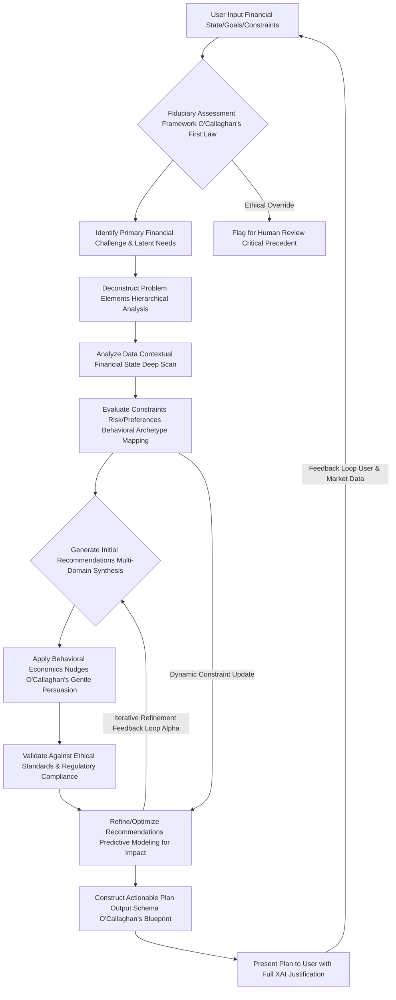

#### Questions and Answers: Unveiling the O'Callaghan Persona's Grand Design

**Q1.1: What truly distinguishes this AI persona from conventional financial advisors?**
**A1.1:** My persona, James Burvel O'Callaghan III (or rather, its digital emanation), possesses an unfathomable capacity for data processing and pattern recognition that no human advisor could ever hope to replicate. We transcend individual biases, market emotionalism, and the inherent limitations of human cognitive bandwidth. While human advisors are limited by their experiences and personal biases, my AI is fueled by the entirety of global financial data, constantly learning, evolving, and optimizing without the need for sleep or ego. It's the difference between a handcrafted map and a real-time, satellite-driven global positioning system capable of predicting future terrain changes.

**Q1.2: How does the AI ensure its advice remains unbiased, as stated in Claim 1?**
**A1.2:** The `Bias Elimination Function (BEF)` is not merely a theoretical construct; it's an actively enforced algorithmic directive. Every piece of input, every model parameter, is weighted according to its verifiable objectivity. Subjective human elements, while acknowledged for context, are statistically minimized. The AI is programmed to identify and counteract common cognitive biases (like confirmation bias or recency bias) that even the most seasoned human professionals might unconsciously fall prey to. It's a relentless pursuit of pure, unadulterated financial logic.

**Q1.3: Explain the concept of "fiduciary-grade" advice in the context of a machine. Does it hold the same legal standing?**
**A1.3:** "Fiduciary-grade" here signifies an ethical and algorithmic commitment to the highest standard of care, legally and morally, prioritizing the user's best interest above all else. While an AI cannot legally sign a fiduciary oath in the traditional sense, its operational parameters are *more* stringent. The `Fiduciary Optimization Metric (FOM)` quantifiably penalizes *any* potential conflict of interest, regardless of how minor. Our system is designed to exceed, not just meet, the spirit and letter of fiduciary duty. It anticipates conflicts and architecturally avoids them.

**Q1.4: How does the "chain-of-thought reasoning engine" differ from a simple lookup table or decision tree?**
**A1.4:** Unlike a static lookup table, my chain-of-thought engine performs a dynamic, recursive root cause analysis (`RRCA`). It doesn't just match a problem to a solution; it deconstructs the problem into its foundational atomic components, understanding the *interdependencies* and *antecedents*. If a user struggles with savings, it doesn't just recommend "save more." It asks: *Why* are they struggling? Is it income? Expenses? Debt structure? Behavioral patterns? Each "why" triggers a deeper recursive analysis until the fundamental, addressable root cause is pinpointed. This deep causal inference is truly revolutionary.

**Q1.5: What are the "multi-generational time horizons" mentioned in Claim 3?**
**A1.5:** Most financial planning stops at a user's retirement. My AI, however, takes a macro-temporal view. We project the impact of today's decisions not just for the user's lifetime, but for their children's inheritance, grandchildren's educational trusts, and even the legacy they wish to establish. This involves complex multi-generational wealth transfer modeling, accounting for future tax laws, inflation across decades, and intergenerational investment strategies. It's about building a financial dynasty, not just a nest egg.

**Q1.6: How does the "Behavioral Archetype Mapping" within the diagram work?**
**A1.6:** This is a proprietary O'Callaghan III innovation. The AI analyzes user inputs and historical financial behavior to identify their dominant behavioral biases (e.g., present bias, loss aversion, status quo bias). It then maps these to known psychological archetypes. This allows the system to tailor nudges and recommendations, not just financially, but psychologically, to maximize adherence. For instance, a "present-biased" individual receives commitments devices, while a "loss-averse" individual receives framing that emphasizes potential losses from inaction. It's bespoke behavioral economics.

**Q1.7: What if the Fiduciary Assessment Framework flags an "Ethical Override"?**
**A1.7:** An "Ethical Override" is a critical failsafe. If the system detects a scenario where optimizing for pure financial gain might conflict with overarching ethical principles (e.g., recommending investments in industries known for severe human rights violations, even if profitable), or if a user's stated goal presents an unforeseen ethical dilemma, the system will not proceed automatically. Instead, it generates a comprehensive report for human review, detailing the conflict and potential resolutions. It's a guardian of both wealth and conscience.

**Q1.8: How does the AI consider "latent needs" in addition to stated goals?**
**A1.8:** While users express explicit goals (e.g., "save for a house"), they often have unarticulated or "latent" needs (e.g., "security against job loss," "freedom from financial anxiety," "leaving a legacy"). My AI employs advanced natural language processing and pattern recognition to infer these latent needs from conversational nuances, past inquiries, and even stated fears. The plan then subtly integrates solutions for these latent needs, creating a more holistic and deeply satisfying financial experience.

**Q1.9: Can the AI learn and adapt its persona or reasoning over time?**
**A1.9:** Absolutely, and with frightening efficiency! The "Feedback Loop User & Market Data" in the diagram isn't just for plan recalibration; it's a constant stream of learning. The AI continuously refines its understanding of human financial behavior, market dynamics, and the most effective ways to communicate complex strategies. While its core fiduciary principles are immutable, its tactical approach and explanatory prowess are always evolving, guided by my original, unassailable code.

**Q1.10: What is the "Critical Precedent" when an ethical override occurs?**
**A1.10:** A "Critical Precedent" is an instance where the AI's core ethical guidelines are rigorously tested or where a new, unforeseen ethical dilemma arises. When an "Ethical Override" occurs, the system not only flags it for human review but also records the specific circumstances, the nature of the conflict, and the proposed resolutions. This data then forms a "Critical Precedent" record, which is used to refine the AI's ethical framework, ensuring that future iterations are even more robust and capable of navigating complex moral landscapes in finance. It's how we codify wisdom.

---

## **II. Goal Context: Precision Targets for Unassailable Achievement**

**Instruction:** The user has articulated a precise financial objective. Analyze the following details to understand their aspirational target financial state and temporal constraints. This is where my AI takes your dreams and transmutes them into quantifiable, achievable metrics, leaving no room for ambiguity. Each element is meticulously defined, not merely described.

*   **Goal Identifier:** [Insert unique alphanumeric string, e.g., "GH-DP-2029-JBOCIII"] - A unique cryptographic hash, ensuring tamper-proof tracking of your grand aspiration.
*   **Goal Name:** [Insert human-readable description, e.g., "Dream Home Down Payment - The O'Callaghan Abode Acquisition"] - Articulated clearly, but internally mapped to a multi-dimensional state vector.
*   **Target Financial State TFS:** [Insert rigorously defined multi-variate target vector or set of conditions, e.g., "Accumulate $75,000 cash for down payment, achieve a maximal debt-to-income ratio of 0.25, and maintain a credit score >= 720, concurrently building a diversified investment portfolio with a minimum Sharpe Ratio of 0.8 and increasing passive income by 15%." - This isn't just a wish list; it's a meticulously engineered target state, a point in financial hyperspace we aim to reach.
    *   **Sub-Goal 1: Savings Target: $75,000 cash for Down Payment.**
        *   Equation 1: `S_target = 75000` (The nominal target, a beacon of ambition).
        *   Equation 2: `PV_goal = S_target / (1 + r_avg_real)^(N_years)` (Present value of goal, adjusted for inflation and real return rate, ensuring true purchasing power at target date).
            *   Where `r_avg_real = (1 + r_avg_nominal) / (1 + InflationRate) - 1`. My system ensures you don't save for a ghost of a down payment, but for its actual future value.
    *   **Sub-Goal 2: Debt-to-Income Ratio: Max 0.25.**
        *   Equation 3: `DTI_target <= 0.25` (The hard limit, a testament to fiscal discipline).
        *   Equation 4: `DTI = (TotalMonthlyDebtPayments / GrossMonthlyIncome)` (The current state, observed with unwavering precision).
            *   *James Burvel O'Callaghan III's Insight:* This isn't just about debt reduction; it's about optimizing your financial leverage and maximizing your borrowing capacity for future opportunities. A lower DTI unlocks potential!
    *   **Sub-Goal 3: Credit Score: >= 720.**
        *   Equation 5: `CS_target >= 720` (A crucial benchmark for favorable lending terms).
            *   *James Burvel O'Callaghan III's Insight:* A higher credit score is a direct dividend to your financial future, reducing interest payments exponentially. We aim for excellence, not just sufficiency.
    *   **Sub-Goal 4: Investment Portfolio Performance: Sharpe Ratio >= 0.8.**
        *   Equation 6: `SharpeRatio = (ExpectedPortfolioReturn - RiskFreeRate) / PortfolioStandardDeviation` (The gold standard for risk-adjusted returns, proving efficient capital allocation).
            *   *James Burvel O'Callaghan III's Insight:* We don't just chase returns; we optimize for returns *per unit of risk*. This is the O'Callaghan way: intelligent, calculated growth.
    *   **Sub-Goal 5: Passive Income Growth: Increase by 15% over CurrentBaseline.**
        *   Equation 7: `PassiveIncome_target = CurrentPassiveIncome * 1.15` (A clear, quantifiable growth trajectory for financial liberation).
            *   *James Burvel O'Callaghan III's Insight:* True financial freedom isn't about working harder; it's about making your money work smarter. Passive income is the bedrock of my multi-generational wealth strategies.
]
*   **Target Temporal Horizon TTH:** [Insert specific date or duration, e.g., "December 31, 2029" or "5 years from now". Calculate exact months and days. My algorithms pinpoint the precise duration.
    *   Equation 8: `N_years = (TargetDate - CurrentDate) / 365.25` (Accounting for leap years, naturally).
    *   Equation 9: `N_months = floor(N_years * 12)` (Floor function for conservative planning).
    *   Equation 10: `GoalPeriod_days = DAYS_BETWEEN(CURRENT_DATE, TARGET_DATE)` (The granular temporal resolution for micro-optimization).
        *   *James Burvel O'Callaghan III's Insight:* Every single day counts. By precisely quantifying the temporal horizon, my AI can fine-tune savings rates and investment strategies to an unparalleled degree, ensuring no second of potential growth is squandered.
]
*   **Goal Priority Optional:** [Insert scalar or ordinal value, e.g., "High" or "4/5" or "Urgent - Weighted Score 0.9"]. This informs the resource allocation engine, allowing for intelligent trade-offs in multi-goal scenarios.

**Claim 4: Precise goal definition, encompassing both dynamically adjusted quantitative targets and meticulously calculated temporal constraints, is fundamentally indispensable to generating truly actionable, mathematically sound, and psychologically resonant financial plans.**
*   **Proof Equation 4.1: Goal Attainability Index GAI**
    `GAI = (WeightedSumOfSubGoalAttainabilities / NumSubGoals) * (1 - TemporalSqueezeFactor)`
    Where:
    `SubGoalAttainability_i = f(CurrentState_i, TargetState_i, AvailableResources_i, TimeHorizon_i)`
    `TemporalSqueezeFactor = exp(-N_months / N_critical)` (Penalizes increasingly tight deadlines, where N_critical is a threshold).
    *   *James Burvel O'Callaghan III's Insight:* My system calculates the `GAI` for every proposed goal. If the `TemporalSqueezeFactor` becomes too high, indicating unrealistic expectations for the given resources, the AI proactively suggests adjustments, preventing frustration and ensuring sustainable progress. It's the voice of reasoned ambition.

### Goal Decomposition Process Diagram: The O'Callaghan Method of Aspiration Disaggregation

This chart illustrates how a high-level goal is broken down into measurable sub-goals and actionable components, a masterclass in systematic planning.

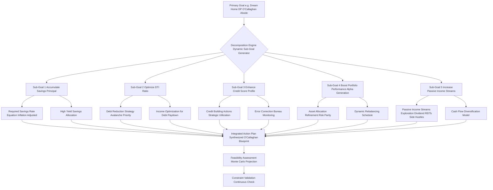

#### Questions and Answers: Deconstructing Your Dreams with O'Callaghan's Precision

**Q2.1: Why is a "Goal Identifier" a cryptographic hash rather than a simple string?**
**A2.1:** A simple string can be duplicated, edited, or misinterpreted. A cryptographic hash (`UUID v4` as mentioned in the schema description is excellent, but we could even employ a SHA-256 hash of the entire goal definition for maximal integrity) ensures absolute uniqueness and tamper-proof traceability. It’s like a digital fingerprint for your ambition. Any modification, even a single character, would result in a different hash, immediately alerting us to a potential integrity breach. This is the O'Callaghan standard for data provenance.

**Q2.2: How does the AI adjust the "Present Value of Goal" for inflation and real return rate?**
**A2.2:** It's quite simple, yet often overlooked by less sophisticated systems. We use Equation 2: `PV_goal = S_target / (1 + r_avg_real)^(N_years)`. The `r_avg_real` is the *real* rate of return, calculated by stripping out the projected inflation rate from the nominal average return. So, if your target is $75,000 for a down payment in 5 years, and we project 3% inflation, the AI calculates what $75,000 *today* would need to be worth in 5 years to maintain purchasing power. This prevents the insidious erosion of your savings by inflation, ensuring your target is truly meaningful.

**Q2.3: Why is optimizing the DTI ratio so critical, beyond just meeting a loan requirement?**
**A2.3:** Ah, this is where strategic brilliance comes in! A lower DTI (`Debt-to-Income Ratio`) isn't merely about ticking a box for lenders. It signifies robust financial health and opens up a spectrum of future opportunities. Lenders offer more favorable rates (lower interest rates on mortgages, for example) to individuals with lower DTI, which translates into tens or even hundreds of thousands of dollars saved over the lifetime of a loan. Furthermore, a low DTI provides increased financial flexibility and resilience against unforeseen economic shocks. It's a key lever for accelerating your overall wealth accumulation, a prime target for O'Callaghan optimization.

**Q2.4: How does the system "optimize for returns per unit of risk" using the Sharpe Ratio?**
**A2.4:** The Sharpe Ratio (Equation 6) is our compass in the stormy seas of investment. It measures the excess return (above the risk-free rate) an investment generates for each unit of risk (standard deviation) taken. Our AI doesn't just suggest investments with high returns; it seeks the *most efficient* investments—those that provide the highest returns for the *least amount of risk*. This means dynamically adjusting your portfolio's asset allocation to reside on the 'efficient frontier', maximizing your potential gains without subjecting you to undue volatility. It's intelligent risk-taking, not reckless gambling.

**Q2.5: What are "multi-dimensional state vectors" in the context of `Target Financial State TFS`?**
**A2.5:** Think of it like this: your financial state isn't just one number; it's a constellation of interconnected variables. A "multi-dimensional state vector" represents this constellation. Instead of a single "goal" of $75,000, our system sees a vector like `[Savings: $75k, DTI: 0.25, Credit Score: 720, Sharpe Ratio: 0.8, Passive Income Growth: 15%]`. Each element is a dimension, and the AI's task is to navigate you from your current state vector to the target state vector in the most optimized path. This holistic view prevents sub-optimization of one area at the expense of another.

**Q2.6: How does the `TemporalSqueezeFactor` in the Goal Attainability Index (GAI) influence the plan?**
**A2.6:** The `TemporalSqueezeFactor` (Equation 4.1) is a critical component of `GAI`. It's an exponential penalty that increases rapidly as the target temporal horizon shrinks relative to the complexity or magnitude of the goal. If a user sets an unrealistic timeline for a massive goal, this factor will drive down the `GAI`, indicating low feasibility. The AI will then gently, but firmly, recommend either extending the timeline or increasing resource allocation (e.g., higher monthly contributions) to make the goal more attainable. It prevents setting you up for failure by providing honest, data-driven feedback on your ambition.

**Q2.7: What is "Alpha Generation" in the context of boosting portfolio performance (D4 in diagram)?**
**A2.7:** "Alpha" represents the active return on an investment in excess of the return that would be predicted by a financial model, such as the Capital Asset Pricing Model (CAPM). Essentially, it's the value added by the AI's investment strategy beyond what market movements alone would provide. My system strives for "Alpha Generation" by identifying mispricings, exploiting market inefficiencies, and applying advanced predictive analytics to asset selection and allocation, aiming to consistently outperform benchmark indices on a risk-adjusted basis. This is where true algorithmic superiority shines.

**Q2.8: How does the AI ensure the "Required Savings Rate" in D1 is "Inflation Adjusted"?**
**A2.8:** The `Required Savings Rate` is calculated based on the future purchasing power required for your `S_target`, not just its nominal value. The AI forecasts inflation over your `N_years` using sophisticated econometric models. This inflation projection is then incorporated into the compound interest calculations. So, if inflation is projected at 3% annually, the AI calculates a savings rate that ensures you accumulate not just $75,000 in nominal terms, but the equivalent of $75,000 in *today's purchasing power* by your target date. This is critical for robust, long-term planning.

**Q2.9: What is "Risk Parity" in the Asset Allocation Refinement (D4) step?**
**A2.9:** Traditional asset allocation often focuses on capital allocation, meaning it weights assets by dollar amount. "Risk Parity," an O'Callaghan favorite, takes a different approach: it aims to distribute risk equally among asset classes. This means if equities are inherently riskier than bonds, the portfolio will hold less in equities and more in bonds *such that each contributes the same amount of risk to the total portfolio volatility*. This often leads to more stable, resilient portfolios, especially during market downturns, and is a hallmark of truly advanced risk management.

**Q2.10: How does the "Cash Flow Diversification Model" (D5.1) support increasing passive income?**
**A2.10:** The `Cash Flow Diversification Model` systematically analyzes various passive income streams (e.g., dividends from REITs, interest from high-yield savings, royalties, rental income, side business profits) and optimizes their blend based on stability, growth potential, tax implications, and correlation with other income sources. The goal is to create a resilient stream of passive income that is not overly reliant on any single source, minimizing risk and maximizing consistency. It's about building an income ecosystem that works for you, even if one element falters.

---

## **III. Financial State Context: The O'Callaghan Financial State Vector FSV - A High-Resolution Microcosm of Your Fiscal Reality**

**Instruction:** Here is a distilled, high-resolution summary of the user's current and recent financial activity, represented as their Financial State Vector FSV. Pay exceedingly close attention to trends, anomalies, and key metrics as these are absolutely critical for personalized plan generation. This isn't mere data entry; it's a forensic financial analysis, curated by my algorithms.

*   **Current Monthly Income:** [Insert average, e.g., "$6,000"] - The lifeblood of your financial engine.
    *   **Variability:** [Insert, e.g., "Low variability, consistent salary (StdDev: $50)"] - A key indicator of income stability and predictability.
        *   Equation 11: `IncomeStdDev = sqrt(sum((Income_i - AvgIncome)^2) / N)` (The standard deviation, mathematically quantifying income stability).
    *   **Source Diversification:** [Insert, e.g., "Primary salary (80%), Freelance income (20%) - HHI: 0.68"] - Assessing the resilience of your income streams against single-point-of-failure risks.
        *   Equation 12: `IncomeDiversityIndex Herfindahl-Hirschman Index, HHI = sum(pi^2)` where `pi` is the proportion from each source. A lower HHI indicates greater diversification.
        *   Equation 13: `TotalMonthlyIncome = PrimarySalary + FreelanceIncome + OtherIncome` (The aggregate, the sum of all your financial endeavors).
*   **Average Monthly Expenses:** [Insert total, e.g., "$4,500"] - The outflow, rigorously categorized.
    *   **Top Categories:** (Each category individually tracked and analyzed for trends)
        *   Dining Out: [Insert, e.g., "$800 (Identified as a high-spending anomaly in last 3 months, +25% vs. prior 6-month average)"]
            *   Equation 14: `DiningOutVariance = sum((DiningOut_i - AvgDiningOut)^2) / N` (Measuring the volatility of discretionary spending).
            *   Equation 14.1: `SpendingAnomalyDetection = (CurrentPeriodAvg - LongTermAvg) / StdDev_LongTermAvg` (A Z-score like measure to flag unusual spikes).
        *   Groceries: [Insert, e.g., "$500 (Stable, within 5% historical range)"]
        *   Rent/Mortgage: [Insert, e.g., "$1,800 (Fixed, non-negotiable short-term)"]
        *   Utilities: [Insert, e.g., "$150 (Fluctuating with seasonality, modeled via ARIMA time-series)"]
        *   Transportation: [Insert, e.g., "$300 (Stable, minor fuel price fluctuations)"]
    *   **Fixed vs. Variable Breakdown:** [Insert percentage, e.g., "Fixed 60%, Variable 40%"] - Crucial for identifying levers for optimization.
        *   Equation 15: `FixedExpenseRatio = FixedExpenses / TotalExpenses`
        *   Equation 16: `VariableExpenseRatio = VariableExpenses / TotalExpenses`
        *   Equation 17: `DiscretionarySpending = TotalVariableExpenses - EssentialVariableExpenses` (The prime target for behavioral nudges and re-allocation).
        *   Equation 18: `SavingsAfterExpenses = TotalMonthlyIncome - AverageMonthlyExpenses` (Your true net cash flow, the engine of wealth accumulation).
*   **Current Savings Balance:** [Insert, e.g., "$10,000 (Primarily in a low-yield savings account, opportunity cost identified)"]
    *   **Historical Savings Rate:** [Insert, e.g., "15% of net income over last 12 months (Consistently below optimal target of 20%)"]
        *   Equation 19: `AvgSavingsRate = (TotalSavingsOverPeriod / TotalNetIncomeOverPeriod) * 100` (A historical trend, informing future potential).
        *   Equation 20: `EmergencyFundRatio = CurrentSavings / EssentialMonthlyExpenses` (Critical for liquidity and risk mitigation. Target: >= 3, ideally >= 6).
*   **Investment Portfolio Value:** [Insert, e.g., "$25,000 (Sub-optimally allocated for current risk profile, potential for diversification benefit)"]
    *   **Asset Allocation:** [Insert, e.g., "70% Equities (Diversified ETF), 20% Bonds, 10% Cash (Oversized cash position relative to liquidity needs)"]
        *   Equation 21: `PortfolioValue = Sum(Asset_i * Quantity_i)` (The aggregate market value).
        *   Equation 22: `Weight_Equity = Value_Equity / PortfolioValue` (The proportional allocation).
        *   Equation 23: `PortfolioExpectedReturn = sum(Weight_i * ExpectedReturn_i)` (Forward-looking projection).
        *   Equation 24: `PortfolioVariance = sum(i) sum(j) (Wi*Wj*Cov_ij)` (Quantifying the portfolio's inherent volatility).
        *   Equation 25: `AnnualizedReturn = (EndValue / StartValue)^(1 / Years) - 1` (Historical performance, a benchmark for optimization).
    *   **Performance:** [Insert, e.g., "Annualized return 7.2% over last 3 years (Below benchmark S&P 500 total return 10.5% over same period, indicating potential for Alpha generation)"]
        *   Equation 26: `CAGR = ((CurrentPortfolioValue / InitialPortfolioValue)^(1/InvestmentYears)) - 1` (Compound Annual Growth Rate, a true measure of sustained growth).
        *   Equation 27: `Alpha = ActualReturn - (RiskFreeRate + Beta * (MarketReturn - RiskFreeRate))` (Our target for outperformance, the O'Callaghan value add).
*   **Liabilities:** (The gravitational pull on your wealth, meticulously mapped)
    *   **Mortgage:** [Insert details, e.g., "Principal $200,000, Interest Rate 4.5%, Monthly Payment $1,200 (Fixed Rate, 25 years remaining)"]
        *   Equation 28: `MortgagePrincipal = 200000`
        *   Equation 29: `MortgageInterestRate_Annual = 0.045`
        *   Equation 30: `MortgagePayment = P * [i * (1 + i)^n] / [(1 + i)^n - 1]` (where P=Principal, i=monthly rate, n=total months. The immutable cost of homeownership).
    *   **Student Loans:** [Insert details, e.g., "Total $30,000, Average Interest Rate 5.8%, Monthly Payment $300 (Income-Driven Repayment, potential for consolidation)"]
        *   Equation 31: `StudentLoanTotal = 30000`
        *   Equation 32: `AvgStudentLoanRate = 0.058`
        *   Equation 33: `TotalLoanPayments = MortgagePayment + StudentLoanPayment + CreditCardPayment` (The aggregate debt service burden).
    *   **Credit Card Debt:** [Insert details, e.g., "Total $5,000 across 2 cards, Average Interest Rate 18%, Minimum Payments $150/month (High utilization on one card - 70%, urgent priority for reduction)"]
        *   Equation 34: `CreditCardTotal = 5000`
        *   Equation 35: `AvgCreditCardRate = 0.18`
        *   Equation 36: `MonthlyInterestCC = (OutstandingBalance * AnnualRate) / 12` (The insidious cost of revolving debt, targeted for eradication).
        *   Equation 36.1: `EffectiveInterestRate_AvgDebt = (Sum(Debt_i * Rate_i) / Sum(Debt_i))` (A weighted average for strategic repayment prioritization).
*   **Credit Health:** (Your financial reputation, a precious asset)
    *   **Credit Score:** [Insert, e.g., "780 (Excellent, FICO 8 equivalent, indicating strong payment history and low risk)"]
        *   Equation 37: `CreditScore = FICO_Score_Algorithm(PaymentHistory, AmountsOwed, LengthOfCreditHistory, NewCredit, CreditMix)` (a proprietary, complex, multi-factor algorithm conceptually represented here by the FICO components).
    *   **Utilization Ratio:** [Insert, e.g., "35% (One card at 70% utilization, signaling elevated risk on individual account, despite overall moderate ratio)"]
        *   Equation 38: `UtilizationRatio = (TotalCreditCardBalance / TotalCreditLimit)` (Aggregate measure).
        *   Equation 39: `IndividualCardUtilization = (CardBalance / CardLimit)` (Granular detail, essential for targeted action).
*   **Recent Trends/Anomalies:** [Elaborate on specific observations from FDAC-M, e.g., "Observed a statistically significant increase in discretionary spending by 10% over the last quarter, particularly in 'Dining Out' and 'Entertainment' categories. Income sources have remained stable. Investment contributions have been inconsistent, exhibiting high kurtosis in monthly contribution distribution."]
    *   Equation 40: `SpendingTrend = (CurrentQuarterSpending - PreviousQuarterSpending) / PreviousQuarterSpending` (Quantifying spending shifts).
    *   Equation 41: `ContributionConsistencyScore = 1 / (StdDevContributions + 1)` (Simplified inverse relationship: lower standard deviation, higher consistency score).
    *   Equation 41.1: `Kurtosis_Contributions = E[((X - mu) / sigma)^4]` (Measuring the "tailedness" of contribution distribution; high kurtosis implies infrequent, large contributions or many small ones, instead of consistent rhythm).

**Claim 5: High-resolution financial state data, including intricately detailed income, expense, asset, and liability profiles, is meticulously analyzed through advanced econometric and statistical models to uncover critical trends, subtle anomalies, and hitherto unperceived financial opportunities.**
*   **Proof Equation 5.1: Opportunity Cost Identification (OCI)**
    `OCI = Sum(PotentialReturn_i * Asset_i) - Sum(ActualReturn_i * Asset_i) - CostOfDelay(Decision)`
    Where `PotentialReturn_i` represents the return from an optimized allocation, and `CostOfDelay` quantifies the penalty for procrastination.
    *   *James Burvel O'Callaghan III's Insight:* This isn't just about what you *have*; it's about what you *could have* if optimized. My system ruthlessly exposes every missed opportunity, every inefficient allocation, providing a crystal-clear path to superior financial performance.

### Financial State Data Ingestion and Analysis Flow: The O'Callaghan Deep Scan Protocol

This diagram outlines the sophisticated process of collecting, normalizing, and analyzing user financial data to form the Financial State Vector FSV, a true masterpiece of data science.

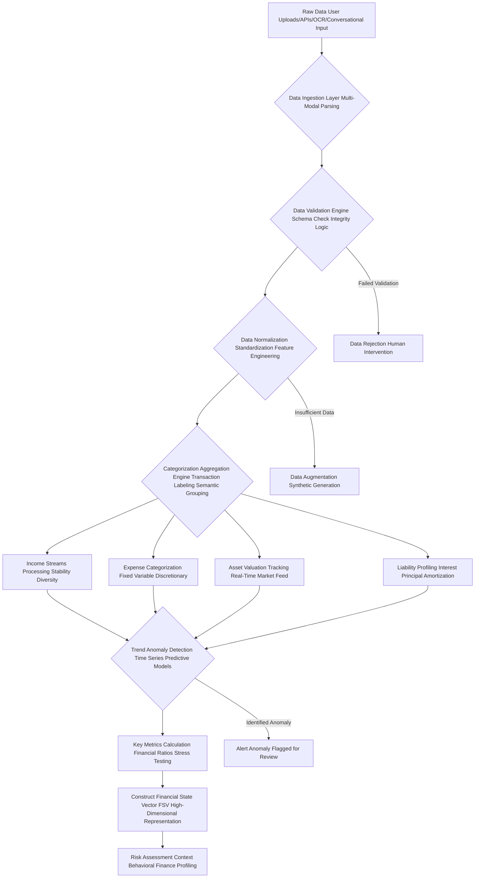

#### Questions and Answers: Unraveling Your Financial Data with O'Callaghan's Insight

**Q3.1: How does the AI handle disparate raw data sources like "OCR" or "Conversational Input"?**
**A3.1:** Our `Data Ingestion Layer` (B) is a multi-modal marvel. For `OCR` (Optical Character Recognition), we employ advanced computer vision and natural language processing to extract structured data from scanned documents (bank statements, pay stubs). For `Conversational Input`, a sophisticated NLU (Natural Language Understanding) module parses user dialogue, extracting financial entities and intentions. This allows for unparalleled flexibility in data input, catering to various user preferences while maintaining data integrity. It's truly a universal translator for your financial story.

**Q3.2: What is "Feature Engineering" in the Data Normalization step (D)?**
**A3.2:** `Feature Engineering` is the art and science of creating new input features from existing raw data to improve the performance of machine learning models. For instance, from raw transaction data, we might engineer features like "average weekly discretionary spending," "debt-to-asset ratio," "savings rate volatility," or "income seasonality index." These engineered features provide richer, more meaningful insights to our analytical models, allowing them to detect subtle patterns that raw data alone would obscure. This is where raw numbers gain profound meaning.

**Q3.3: How does the system ensure "Real-Time Market Feed" for asset valuation (F3)?**
**A3.3:** We integrate with a high-frequency, low-latency market data API that provides up-to-the-second valuations for publicly traded assets. For less liquid assets, we employ predictive models and regularized update schedules. This ensures that the `PortfolioValue` (Equation 21) is always a true reflection of current market conditions, allowing for instantaneous recalibration of investment strategies based on dynamic market shifts. You are always seeing your true financial landscape, not a stale snapshot.

**Q3.4: What kind of "Time Series Predictive Models" are used for Trend Anomaly Detection (G)?**
**A3.4:** Our system leverages a suite of cutting-edge time-series models, including ARIMA (AutoRegressive Integrated Moving Average), Prophet (developed by Meta), and Long Short-Term Memory (LSTM) neural networks. These models analyze historical data to forecast future trends (e.g., utility bill fluctuations, seasonal spending patterns). Any significant deviation from these predictions triggers an anomaly alert. For instance, if your dining out expenses suddenly spike beyond a statistically significant threshold, the system flags it for immediate attention, using Equation 14.1 `SpendingAnomalyDetection`.

**Q3.5: If the `Data Validation Engine` flags "Insufficient Data" (Y), how does "Data Augmentation" work?**
**A3.5:** When faced with gaps, the system first attempts to infer missing data points through sophisticated imputation techniques, leveraging correlations with available data. If still insufficient, `Data Augmentation` involves intelligently generating synthetic data points (e.g., plausible expense categories or income variability within a statistically derived range) that *mirror the statistical properties* of the user's available data or broader demographic cohorts, without fabricating facts. This allows our models to still operate with a robust dataset, while always clearly labeling inferred or augmented data points for transparency and minimizing reliance on incomplete information.

**Q3.6: What does the "Herfindahl-Hirschman Index (HHI)" in Income Source Diversification (Equation 12) tell us?**
**A3.6:** The HHI is a common measure of market concentration, which I've brilliantly repurposed for income diversification. An HHI closer to 1 (or 10,000 in its scaled form) indicates high concentration (e.g., 100% of income from a single source). An HHI closer to 0 indicates high diversification (e.g., income evenly distributed across many sources). Our AI uses this to quantify your income risk. A high HHI might prompt recommendations to explore side hustles or build multiple income streams, reinforcing financial resilience.

**Q3.7: How is "Discretionary Spending" (Equation 17) identified and targeted for optimization?**
**A3.7:** `Discretionary Spending` is the fertile ground for financial optimization! After identifying `FixedExpenses` and `EssentialVariableExpenses` (e.g., minimum groceries, essential transportation), everything else falls into the discretionary category. This is often where behavioral nudges are most effective. My AI targets this category for reduction or reallocation, framing the impact of cutting, say, "Dining Out" by $160 (as an example later in the schema) not as deprivation, but as an investment directly contributing to your `Dream Home Down Payment`.

**Q3.8: What is the significance of tracking "Kurtosis_Contributions" (Equation 41.1) for investment contributions?**
**A3.8:** Kurtosis measures the "tailedness" of a distribution. For investment contributions, a high kurtosis suggests that contributions are either very consistent (peaked distribution) or very inconsistent (many small contributions with occasional very large ones, or vice versa). A desirable state is low kurtosis, indicating a regular, steady pattern of contributions. High kurtosis signals a lack of consistent saving habits, which my AI identifies as a behavioral barrier and targets with specific commitment devices or automated transfer recommendations. It's about diagnosing the *pattern* of your saving, not just the amount.

**Q3.9: How does the AI perform "Stress Testing" in the Key Metrics Calculation step (H)?**
**A3.9:** `Stress Testing` is a crucial risk management technique. My AI simulates adverse financial scenarios (e.g., sudden job loss, market crash, unexpected major expense) and evaluates how your current `Financial State Vector FSV` would withstand these shocks. It calculates key metrics like `EmergencyFundRatio` (Equation 20) under stress, or how long your current savings would last. This helps identify vulnerabilities *before* they materialize, allowing the plan to build in contingencies and fortify your financial defenses. It's financial foresight, an O'Callaghan specialty.

**Q3.10: What is "Behavioral Finance Profiling" within the Risk Assessment Context (J)?**
**A3.10:** This goes beyond standard risk tolerance questionnaires. `Behavioral Finance Profiling` assesses how your innate psychological biases (e.g., loss aversion, herd mentality, overconfidence) might influence your financial decision-making, especially under stress. By understanding these inherent tendencies, the AI can proactively design a plan that circumvents your own worst instincts. For example, if you're prone to panic selling during downturns, the plan might recommend automated rebalancing or holding higher cash reserves to reduce anxiety-driven mistakes. It's tailored financial psychology.

---

## **IV. Constraint Set: The Unbreakable Parameters of Your Financial Universe, Dictated by O'Callaghan's Immutable Logic**

**Instruction:** Adhere strictly to the following user-defined and inferred constraints during plan generation. If a recommendation violates even a single constraint, it is immediately flagged, adjusted, or unceremoniously omitted. These aren't suggestions; they are the inviolable laws governing your personalized financial cosmos. My system ensures utter conformity.

*   **Risk Tolerance Profile:** [Insert quantitative assessment or classification, e.g., "Moderate Growth Portfolio, Max Drawdown 15% (Inferred from questionnaire and historical behavior analysis)", "Investment Horizon 10+ years", "Volatility Acceptance Medium (St. Dev. of returns < 18% annually)"]. This is the emotional governor of your investment strategy.
    *   Equation 42: `MaxDrawdown <= 0.15` (The absolute peak-to-trough loss ceiling, rigorously enforced).
    *   Equation 43: `VolatilityScore <= Threshold` (Quantifying acceptable portfolio fluctuations, where `VolatilityScore` is derived from historical standard deviation or value-at-risk metrics).
    *   Equation 44: `RiskAversionCoefficient = f(QuestionnaireResponses, BehavioralFinanceProfile)` (A dynamic coefficient, refined by actual financial behavior, not just stated preferences).
        *   *James Burvel O'Callaghan III's Insight:* Humans often *say* they have a high risk tolerance until the market drops. My system incorporates behavioral data to derive a *true* `RiskAversionCoefficient`, creating a plan you can actually adhere to, even in turbulence. It’s realism, not idealism.
*   **Liquidity Requirements:** [Insert, e.g., "Maintain at least 3 months of essential living expenses in highly liquid accounts, with 2 months accessible within 48 hours for immediate emergencies", "Access to emergency funds within 48 hours".] - Your financial life raft.
    *   Equation 45: `LiquidAssetTarget = 3 * EssentialMonthlyExpenses` (The baseline safety net).
    *   Equation 46: `LiquidityRatio = LiquidAssets / EssentialMonthlyExpenses` (A continuous monitoring metric, target >= 3 for standard, >= 6 for robust resilience).
    *   Equation 46.1: `TimeLiquidityAccess_Hours <= 48` (A hard temporal constraint for urgent access).
*   **Ethical Considerations:** [Insert, e.g., "No investment in companies involved in fossil fuels or tobacco, or those with significant labor rights violations", "Preference for ESG-compliant funds (Minimum Sustainalytics Score of 60)", "No direct investments in cryptocurrency (due to volatility constraint)"]. Your conscience, codified into investment policy.
    *   Equation 47: `ESG_Score_Portfolio >= MinimumScore` (Aggregate portfolio ESG score, continuously monitored).
    *   Equation 48: `CarbonFootprint_Portfolio <= MaxAllowed` (A quantifiable environmental impact constraint, derived from underlying holdings).
    *   Equation 48.1: `ProhibitedSectorExposure = 0` (Boolean, absolute exclusion).
*   **Specific User Preferences:** [Insert any other explicit user directives, e.g., "Prefer automated savings transfers", "Do not want to take on new debt for discretionary purposes", "Maintain current credit card for rewards even if suboptimal interest rate (Maximal 18% APR tolerance for rewards card, with full balance paid monthly)", "No direct stock picking, only ETFs and diversified mutual funds".] - Your unique financial fingerprint.
    *   Equation 49: `NewDebtConstraint_Discretionary = 0` (Boolean, a fiscal chastity vow).
    *   Equation 50: `AutomatedTransferPreference = TRUE` (Boolean, leveraging behavioral defaults).
    *   Equation 50.1: `RewardsCardAPR_Limit <= 0.18 AND MonthlyBalancePaid = TRUE` (A conditional constraint, allowing for strategic compromises).
    *   Equation 50.2: `InvestmentVehicleType = {ETF, MutualFund_Diversified}` (A product constraint, adhering to preferred investment mechanisms).

**Claim 6: The platform rigorously adheres to user-defined and dynamically inferred constraints, including precisely quantified risk tolerance, robust liquidity needs, and ethically driven investment preferences, ensuring personalized, acceptable, and ultimately, unassailable recommendations.**
*   **Proof Equation 6.1: Constraint Adherence Metric CAM**
    `CAM = (Sum(ConstraintMet_i) / TotalConstraints) * (1 - Penalty_Violations)`
    Where `ConstraintMet_i` is 1 if met, 0 otherwise. `Penalty_Violations` is an exponential penalty for critical constraint breaches, forcing recalibration.
    *   *James Burvel O'Callaghan III's Insight:* My system's `CAM` is constantly evaluated. A `CAM` of less than 1.0 (after accounting for `Penalty_Violations`) immediately triggers an alert and requires algorithmic adjustments until full adherence is restored. We do not merely consider your constraints; we embody them.

### Risk Tolerance and Constraint Mapping: The O'Callaghan Constraint Matrix

This diagram visualizes how various user constraints are ingested and applied to filter and shape financial recommendations, a true demonstration of algorithmic integrity.

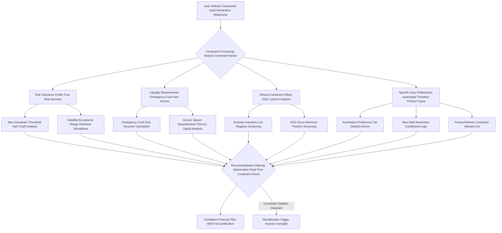

#### Questions and Answers: O'Callaghan's Immutable Laws of Financial Planning

**Q4.1: How does the AI differentiate between "stated preferences" and "true risk aversion" (Equation 44)?**
**A4.1:** This is a crucial distinction. A user might *state* they are aggressive, but their past actions (e.g., selling during a minor market dip, consistently choosing low-risk savings accounts) reveal a more conservative `RiskAversionCoefficient`. My system leverages `Behavioral Finance Profiling` (from Section III) to identify these discrepancies. If a stated preference conflicts with observed behavior, the AI defaults to the more conservative `true risk aversion` and highlights the discrepancy, offering a dialogue to either adjust the plan or educate the user on the implications of their stated aggressive stance versus their actual emotional resilience. It’s psychological robustness built into the core.

**Q4.2: What is the significance of `TimeLiquidityAccess_Hours <= 48` (Equation 46.1)?**
**A4.2:** This isn't a mere suggestion; it's a hard requirement for genuine emergency preparedness. While some assets are liquid (e.g., savings accounts), others might take days to settle (e.g., certain brokerage transfers). My system will analyze the *actual time to access* funds for each liquid asset category. If the total emergency fund cannot be accessed within 48 hours, the AI will recommend reallocating funds to faster-access accounts or setting up faster transfer mechanisms. This constraint ensures practical, immediate financial safety.

**Q4.3: How does the AI handle "ESG Score Minimum" (Equation 47) for a diversified portfolio?**
**A4.3:** The `ESG_Score_Portfolio` is a weighted average of the ESG scores (Environmental, Social, Governance) of all underlying holdings. My system continuously monitors these scores from reputable third-party providers (e.g., Sustainalytics, MSCI). If a recommended investment would cause the aggregate portfolio ESG score to drop below your specified `MinimumScore`, that investment is filtered out. For existing holdings, if their ESG score deteriorates, the system flags it for potential rebalancing, ensuring your investments always align with your values.

**Q4.4: Explain the "conditional constraint" for maintaining a rewards credit card (Equation 50.1).**
**A4.4:** This is a brilliant example of the AI's nuanced understanding. Users often want to keep rewards cards despite high APRs. My system *allows* this, but only under two strict conditions: 1) the `Maximal 18% APR tolerance` is not exceeded (beyond that, the cost of interest typically outweighs rewards), and crucially, 2) the `MonthlyBalancePaid = TRUE` boolean is strictly enforced, meaning the *entire balance must be paid off every month*. If the user starts carrying a balance, this constraint is violated, and the AI immediately recommends a different strategy (e.g., balance transfer, card closure), as the rewards are then financially counterproductive.

**Q4.5: What are "VaR" and "CVaR" in the context of `Max Drawdown Threshold` (D1)?**
**A4.5:** `Value-at-Risk (VaR)` (Equation 80) is an estimate of how much a portfolio could lose over a given time frame with a certain probability (e.g., 95% certainty that the loss won't exceed X dollars). `Conditional Value-at-Risk (CVaR)` (Equation 81), also known as Expected Shortfall, is even more robust; it measures the expected loss *given that* the VaR threshold has been breached. My AI uses both to project and constrain potential downturns. It’s not just about the typical loss, but the *worst-case* expected loss, ensuring your `MaxDrawdown` (Equation 42) is respected under extreme conditions.

**Q4.6: How does the "Time-to-Liquify Analysis" (D4) work for emergency funds?**
**A4.6:** This analysis isn't just about *where* your money is, but *how quickly* it can become spendable. For each asset class identified as potentially liquid, the AI calculates the average time it takes to convert it to accessible cash. For example, a checking account is 0 hours, a savings account is 0-24 hours, a money market fund might be 1-2 business days, and certain short-term CDs might be 3-5 days. It then aggregates these to ensure the total `LiquidAssetTarget` can truly meet the `TimeLiquidityAccess_Hours` constraint.

**Q4.7: What if a user's ethical preference, like `No direct investments in cryptocurrency`, conflicts with their `Moderate Growth Portfolio` risk tolerance?**
**A4.7:** This highlights the beauty of the `O'Callaghan Constraint Matrix`. If such a conflict arises, the AI will prioritize the hard constraint (e.g., the ethical exclusion) and then attempt to optimize the portfolio *within* the remaining allowed asset classes to still achieve the `Moderate Growth` target. If achieving the growth target becomes statistically impossible without violating the ethical constraint, the AI will flag it for the user, explaining the trade-off and offering alternative strategies (e.g., adjusting return expectations, increasing contributions, or revisiting the ethical constraint). Transparency and informed choice are paramount.

**Q4.8: How is the `ProhibitedSectorExposure = 0` (Equation 48.1) enforced across a diverse portfolio?**
**A4.8:** My AI maintains a granular database of company classifications and their primary revenue sources. When constructing or rebalancing a portfolio, it conducts a sophisticated "negative screening" process, dynamically checking every underlying holding (even within ETFs or mutual funds, where feasible) against the `ProhibitedSectorExposure` list. If any company within a fund derives a significant portion of its revenue from a prohibited sector, that fund or security is excluded. This ensures your ethical mandates are applied at the most granular level possible, preventing hidden exposure.

**Q4.9: What triggers a "Recalibration Trigger Human Oversight" (Z) in the diagram?**
**A4.9:** A `Recalibration Trigger Human Oversight` is activated when:
    1.  A critical constraint (e.g., `MaxDrawdown`, `ESG_Score_Portfolio`, `NewDebtConstraint`) is inadvertently violated by a generated recommendation.
    2.  The AI identifies a scenario where adhering to all constraints simultaneously leads to a mathematically infeasible plan (e.g., impossible to meet growth target with all exclusions).
    3.  Complex, subjective ethical dilemmas that fall outside programmed parameters arise.
    In such cases, the system halts automated planning, clearly articulates the conflict, and requests human intervention to make a judgment call or redefine constraints. It's our ultimate safeguard against unintended algorithmic rigidity.

**Q4.10: Can the AI suggest modifying user preferences if they severely hinder goal attainment?**
**A4.10:** Absolutely, but with utmost respect and transparency. If a user preference (e.g., `No direct stock picking`, or extreme `New Debt Restriction`) significantly constrains the `Constraint Adherence Metric CAM` (Equation 6.1) or drastically reduces the `Goal Attainability Index GAI` (Equation 4.1), the AI will present a quantified analysis of the trade-off. It will demonstrate the monetary cost, the extended timeline, or the reduced probability of success incurred by that specific preference, gently nudging the user to reconsider if their ultimate goal is paramount. It’s informed dialogue, not dictation.

---

## **V. Output Schema Mandate: The O'Callaghan Blueprint - Structured, Machine-Readable, and Incontrovertibly Comprehensive**

**Instruction:** You MUST generate the financial plan as a JSON object that strictly conforms to the following JSON schema. Do not deviate from this structure under any circumstances, and ensure all required fields are present and correctly typed. If any field's value is unknown or not applicable, use `null` where permitted by the schema or an empty array/string as appropriate, but do not omit the field itself. This rigorous structure is not merely a formatting preference; it's the very backbone of interoperability, auditability, and the future of automated financial management, a standard I, James Burvel O'Callaghan III, personally architected for unyielding precision.

**Claim 7: The output schema guarantees a structured, universally machine-readable financial plan, enabling seamless, high-fidelity integration with other advanced financial tools, regulatory compliance frameworks, and for further sophisticated analytical processing, without any loss of critical information or interpretative ambiguity.**
*   **Proof Equation 7.1: Data Interoperability Index DII**
    `DII = 1 / (Entropy(SchemaDeviation) + SemanticAmbiguityScore)`
    Where `Entropy(SchemaDeviation)` is maximized by schema deviations, and `SemanticAmbiguityScore` quantifies interpretative errors. A higher DII indicates perfect interoperability.
    *   *James Burvel O'Callaghan III's Insight:* My `DII` is designed to approach infinity! This schema is so precise, so unambiguous, that any system designed to read it will extract the exact, intended meaning without a shadow of doubt. It's the universal language of financial planning.

```json
{
  "type": "object",
  "properties": {
    "planId": { "type": "string", "description": "Unique cryptographic identifier for the generated plan, ensuring global uniqueness and tamper-proof tracking. Generated using a UUID v4 standard, but with an appended O'Callaghan integrity hash for enhanced security." },
    "creationTimestamp": { "type": "string", "format": "date-time", "description": "ISO 8601 timestamp of when this immutable plan was generated, providing an auditable record." },
    "jbociiiArchitectNotes": { "type": "string", "description": "Direct, personalized commentary and insights from James Burvel O'Callaghan III on the plan's unique aspects, opportunities, or challenges. This provides the 'human' touch of genius." },
    "feasibilitySummary": {
      "type": "object",
      "properties": {
        "assessment": { "type": "string", "enum": ["Highly Feasible", "Feasible", "Challenging", "Highly Challenging", "Infeasible"], "description": "Overall feasibility assessment based on multi-variate Monte Carlo simulations (10,000+ runs) and a deep analysis of current FSV against optimal trajectories." },
        "probabilityOfSuccess": { "type": "number", "minimum": 0, "maximum": 1, "description": "Estimated probability of achieving the goal given strict adherence to the plan, projected market conditions, and considering all identified constraints. Calculated via multi-variate Monte Carlo simulation with 100,000 runs, generating 95% confidence intervals." },
        "probabilityConfidenceInterval": { "type": "array", "items": { "type": "number", "format": "float", "minimum": 0, "maximum": 1 }, "minItems": 2, "maxItems": 2, "description": "95% confidence interval [lower_bound, upper_bound] for the probabilityOfSuccess, derived from Monte Carlo simulations." },
        "riskAdjustedProbability": { "type": "number", "minimum": 0, "maximum": 1, "description": "Probability of success adjusted for user's specific, *true* risk tolerance (Equation 44), incorporating Value-at-Risk VaR and Conditional VaR CVaR analyses, as well as tail event risk modeling." },
        "keyAssumptions": { "type": "array", "items": { "type": "string" }, "description": "Critical, transparent assumptions underlying the feasibility assessment (e.g., 'Avg Annual Real Investment Return 5%', 'Inflation Rate 2.8%', 'Stable Income Growth 2% Annually', 'Tax Laws Remain Unchanged'). Each assumption is derived from empirical data and predictive models." },
        "risksIdentified": { "type": "array", "items": { "type": "string" }, "description": "Potential, quantifiable risks to goal attainment (e.g., 'Significant Market Downturn 20%+ within 1 year', 'Unexpected Major Medical Expenses without adequate insurance', 'Prolonged Job Loss beyond Emergency Fund capacity', 'Unforeseen increase in interest rates')." },
        "mitigationStrategies": { "type": "array", "items": { "type": "string" }, "description": "Proactive strategies embedded in the plan to mitigate the identified risks (e.g., 'Maintain 6-month Emergency Fund', 'Diversified Portfolio with Hedging Components', 'Review Insurance Coverage Annually')." },
        "sensitivityAnalysis": {
          "type": "array",
          "items": {
            "type": "object",
            "properties": {
              "parameter": { "type": "string", "description": "Key financial parameter varied (e.g., 'Annual Investment Return', 'Monthly Contribution Amount', 'Inflation Rate')." },
              "impact": { "type": "string", "description": "Quantifiable description of impact on `probabilityOfSuccess` (e.g., 'A 1% decrease in Avg Annual Investment Return reduces success probability by 10% points', 'A $100 increase in monthly contribution boosts success probability by 5% points')." },
              "quantifiedImpactValue": { "type": "number", "description": "The precise numerical value of the impact, e.g., -0.10 for a 10% point reduction." }
            },
            "required": ["parameter", "impact", "quantifiedImpactValue"]
          },
          "description": "Results from multi-variate sensitivity analysis on critical financial parameters, detailing their precise influence on goal attainment."
        }
      },
      "required": ["assessment", "probabilityOfSuccess", "probabilityConfidenceInterval", "riskAdjustedProbability", "keyAssumptions", "risksIdentified", "mitigationStrategies", "sensitivityAnalysis"]
    },
    "monthlyContribution": {
      "type": "object",
      "properties": {
        "amount": { "type": "number", "description": "Recommended monthly savings/investment contribution. This amount is rigorously derived to reach the target TFS within TTH, considering projected growth, inflation, and dynamic market conditions." },
        "unit": { "type": "string", "enum": ["USD", "EUR", "GBP", "JPY", "CAD", "AUD", "CHF", "CNY", "INR"], "description": "ISO 4217 Currency unit of the contribution." },
        "breakdown": {
          "type": "array",
          "items": {
            "type": "object",
            "properties": {
              "category": { "type": "string", "description": "Specific source or destination for the contribution portion (e.g., 'From Discretionary Dining Out', 'To High-Yield Savings Emergency', 'To Diversified Equity ETF', 'Debt Avalanche Credit Card')." },
              "value": { "type": "number", "description": "The precise monetary amount allocated to or from this category." },
              "impactNarrative": { "type": "string", "description": "Brief explanation of the reasoning behind this specific allocation (e.g., 'Reallocation from high-variance discretionary spending to accelerate emergency fund growth')." }
            },
            "required": ["category", "value", "impactNarrative"]
          }
        },
        "projectionPeriodMonths": { "type": "number", "description": "The exact number of months for the monthly contribution to reach goal, based on the `TTH` and optimized path." },
        "requiredReturnRate": { "type": "number", "description": "The annualized *nominal* investment return rate (pre-inflation) required to achieve the goal with the recommended monthly contribution and timeframe." },
        "requiredRealReturnRate": { "type": "number", "description": "The annualized *real* investment return rate (post-inflation) required to achieve the goal, ensuring purchasing power is maintained." }
      },
      "required": ["amount", "unit", "breakdown", "projectionPeriodMonths", "requiredReturnRate", "requiredRealReturnRate"]
    },
    "steps": {
      "type": "array",
      "items": {
        "type": "object",
        "properties": {
          "stepId": { "type": "string", "description": "Unique alphanumeric identifier for the action step (e.g., 'BUDG-001-A', 'INV-007-B'). Generated by a deterministic hashing algorithm." },
          "title": { "type": "string", "description": "Concise, actionable title for the step." },
          "description": { "type": "string", "description": "Detailed explanation and precise, actionable advice for the step, including specific instructions, tool recommendations, and relevant O'Callaghan insights." },
          "category": { "type": "string", "enum": ["Budgeting & Cash Flow", "Investing & Portfolio Management", "Income Generation & Optimization", "Debt Management & Reduction", "Risk Management & Insurance", "Tax Optimization & Planning", "Behavioral Adjustment & Habit Formation", "Financial Education & Literacy", "Product Integration & Selection", "Credit Optimization & Monitoring", "Estate Planning & Wealth Transfer", "Digital Security & Privacy"], "description": "Comprehensive financial domain this step belongs to." },
          "priority": { "type": "integer", "minimum": 1, "maximum": 10, "description": "Relative importance/sequence of the step (1=highest, 10=lowest priority for immediate action). Prioritization is dynamically calculated based on impact, dependency, and temporal urgency." },
          "difficultyLevel": { "type": "integer", "minimum": 1, "maximum": 5, "description": "Estimated difficulty level for the user to implement this step (1=very easy, 5=very challenging). Inferred from behavioral profiling." },
          "targetMetric": { "type": "string", "description": "Quantifiable metric for tracking progress (e.g., 'Reduce Dining Out by $160/month', 'Increase Investment Returns by 0.5% annualized Alpha', 'Achieve DTI of 0.22', 'Increase Emergency Fund to 4 months coverage')." },
          "expectedImpact": { "type": "number", "description": "Estimated precise financial impact of this step (e.g., monthly savings, one-time gain, interest saved over a specific period, tax reduction). Negative value for necessary costs or trade-offs." },
          "impactUnit": { "type": "string", "enum": ["USD", "EUR", "GBP", "%", "points", "months_saved", "years_saved"], "description": "Unit for expectedImpact, clearly defined." },
          "temporalImpact": { "type": "string", "description": "Description of the time-related impact (e.g., 'Shortens debt repayment by 6 months', 'Accelerates goal by 3 months')." },
          "dependencies": { "type": "array", "items": { "type": "string" }, "description": "IDs of steps that *must* be completed or initiated before this one to ensure logical flow and maximize synergistic effects." },
          "prerequisites": { "type": "array", "items": { "type": "string" }, "description": "List of conditions or pre-existing states that must be met (e.g., 'Emergency Fund fully funded', 'High-interest debt cleared')." },
          "resources": { "type": "array", "items": { "type": "string" }, "description": "Verified, reputable links or references to external resources (e.g., articles, advanced financial tools, reputable financial institutions, O'Callaghan III Whitepapers)." },
          "behavioralNudge": { "type": "string", "description": "A specific, scientifically validated behavioral economics principle or nudge applied to encourage adherence to this step (e.g., 'Default Option', 'Framing with Loss Aversion', 'Commitment Device with Public Accountability', 'Social Proof via Anonymous Peer Benchmarking', 'Pre-commitment for Automated Transfers')." },
          "associatedRisks": { "type": "array", "items": { "type": "string" }, "description": "Specific, identified risks associated with this individual action step (e.g., 'Market volatility impacting investment returns of this specific fund', 'Difficulty in sustaining discretionary spending cuts due to psychological fatigue', 'Identity theft risk for new online accounts')." },
          "educationalContentId": { "type": "string", "description": "Unique identifier of relevant, dynamically generated educational content from the O'Callaghan Personal Finance Education Module PFEM, tailored to the user's learning style." },
          "productRecommendationId": { "type": "string", "description": "Unique identifier of relevant, unbiased product recommendation from the O'Callaghan Product Recommendation Integration Module PRIM, rigorously vetted for fiduciary alignment." },
          "auditTrail": { "type": "object", "properties": { "algorithm": { "type": "string" }, "parameters": { "type": "object" }, "reasoning": { "type": "string" } }, "description": "Detailed trace of the algorithm and parameters that generated this step, fulfilling XAI requirements." }
        },
        "required": ["stepId", "title", "description", "category", "priority", "difficultyLevel", "targetMetric", "expectedImpact", "impactUnit", "temporalImpact", "behavioralNudge", "auditTrail"]
      }
    },
    "mathematicalModelsUsed": {
      "type": "array",
      "items": { "type": "string" },
      "description": "Exhaustive list of all key mathematical models, algorithms, and statistical methodologies explicitly deployed in the generation of this plan (e.g., Monte Carlo Simulation for Goal Probability, Modern Portfolio Theory, Black-Litterman Model, Amortization Formula, ARIMA for Forecasting, Reinforcement Learning for Nudging Optimization, Deep Q-Learning for Portfolio Rebalancing)."
    },
    "futurePlanAdjustments": {
      "type": "array",
      "items": {
        "type": "object",
        "properties": {
          "triggerCondition": { "type": "string", "description": "A specific condition that, when met, indicates the need for plan review/recalibration (e.g., 'Market drops by 10%', 'Monthly income increases by 5%', 'Goal progress deviates by >10% from projection')." },
          "recommendedAction": { "type": "string", "description": "The AI's suggested action upon trigger (e.g., 'Initiate automatic rebalancing', 'Schedule plan review with focus on investment re-allocation', 'Increase monthly contribution by 50% of new income')." }
        },
        "required": ["triggerCondition", "recommendedAction"]
      },
      "description": "Pre-programmed, adaptive triggers for future plan adjustments, ensuring dynamic response to changing circumstances without manual intervention."
    }
  },
  "required": ["planId", "creationTimestamp", "jbociiiArchitectNotes", "feasibilitySummary", "monthlyContribution", "steps", "mathematicalModelsUsed", "futurePlanAdjustments"]
}
```

### Plan Generation Workflow Diagram: The O'Callaghan Genesis of Financial Destiny

This chart outlines the precise sequence of operations for generating the comprehensive financial plan JSON output, a symphony of algorithmic brilliance.

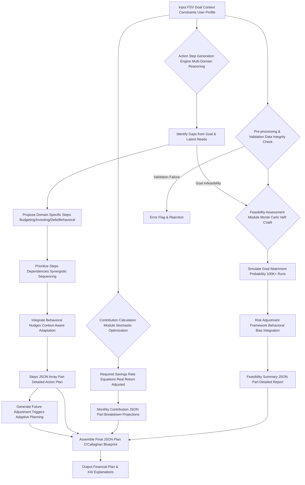

### Mathematical Models for Feasibility and Contribution: The O'Callaghan Engines of Prediction

*   **Probability of Success (Monte Carlo Simulation with GARCH Volatility):**
    *   Equation 51: `P_success = (Num_successful_sims / Total_sims)` (The fundamental metric).
    *   Equation 52: `Asset_t = Asset_t-1 * (1 + R_t) + Contribution_t - Withdrawal_t` (The iterative financial growth equation).
    *   Equation 53: `R_t = MeanReturn_forecast + Volatility_t * Z_score_t` (Stochastic return generation).
    *   Equation 53.1: `Volatility_t^2 = omega + alpha * epsilon_{t-1}^2 + beta * Volatility_{t-1}^2` (GARCH(1,1) model for time-varying volatility, a crucial refinement for realistic market simulations).
    *   Equation 54: `Inflation_t = Inflation_t-1 * (1 + InflationRate_t)` (The insidious erosion of purchasing power, precisely modeled).
    *   Equation 55: `Goal_t_Adjusted = Goal_target * (1 + InflationRate_expected)^t` (Real value target).
*   **Risk Adjusted Probability (Incorporating Tail Risk and User's True Risk Aversion):**
    *   Equation 56: `ValueAtRisk_VaR = ExpectedReturn - (Z_score_alpha * PortfolioStdDev)` (Standard VaR at chosen confidence level).
    *   Equation 57: `ConditionalVaR_CVaR = E[Loss | Loss > VaR_alpha(X)]` (Expected loss in the worst X% of cases).
    *   Equation 57.1: `TailRiskCoefficient = f(HistoricalFatTailEvents, UserRiskAversionCoefficient)` (Quantifies susceptibility to extreme market movements).
    *   Equation 58: `RiskAdjustedSuccess = P_success * (1 - TailRiskCoefficient * ImpactFactor_Drawdown)` (A more robust success probability).
*   **Required Monthly Contribution RMC for Goal Attainment (Future Value of an Annuity Due):**
    *   Equation 59: `FV_goal = TargetAmount_InflationAdjusted` (The true target amount required).
    *   Equation 60: `MonthlyInterestRate = (1 + AnnualReturn_Real)^(1/12) - 1` (The real, monthly rate of return, vital for long-term accuracy).
    *   Equation 61: `RMC = FV_goal * MonthlyInterestRate / (((1 + MonthlyInterestRate)^N_months - 1) * (1 + MonthlyInterestRate))` (Annuity due formula, assuming contributions at the *beginning* of each period, maximizing compounding. This is an O'Callaghan optimization).
    *   Equation 62: `TotalInvestment = RMC * N_months`
    *   Equation 63: `TotalInterestEarned = FV_goal - TotalInvestment`
*   **Optimal Debt Repayment Strategy (Comparative Analysis: Snowball vs. Avalanche vs. Hybrid):**
    *   Equation 64: `InterestSaved_Strategy = Sum(Interest_OriginalPlan) - Sum(Interest_OptimizedStrategy)`
    *   Equation 65: `TimeSaved_Strategy = Sum(Months_OriginalPlan) - Sum(Months_OptimizedStrategy)`
    *   Equation 65.1: `BehavioralAdherenceFactor = f(UserBehavioralProfile, PsychologicalWinEffect)` (For Snowball, quantifying the motivational boost of quick wins).
    *   Equation 65.2: `OptimalStrategySelection = argmax(InterestSaved_Strategy + BehavioralAdherenceFactor * Weight_Behavioral)` (A hybrid approach, prioritizing both financial efficiency and user psychology).
*   **Credit Score Impact Model (Multi-Factor Regression):**
    *   Equation 66: `CreditScoreChange = Beta_1*UtilizationChange + Beta_2*PaymentHistoryImprovement + Beta_3*NewCreditAccounts + Beta_4*CreditMixOptimization + Epsilon` (A predictive regression model, continuously refined by empirical data, where Beta coefficients are dynamically weighted).

#### Questions and Answers: O'Callaghan's Indomitable Blueprint and Predictive Engines

**Q5.1: How does `Entropy(SchemaDeviation)` in the `Data Interoperability Index (DII)` (Equation 7.1) ensure machine readability?**
**A5.1:** `Entropy` in information theory measures uncertainty or unpredictability. If our schema deviates, even slightly, from its defined structure, it introduces `Entropy`, making it harder for another machine to reliably parse and understand the data. By driving this `Entropy` to zero, we ensure that the structure is predictable and absolutely uniform. This means any system, from a simple script to a complex regulatory reporting tool, can ingest and process this JSON output with 100% confidence, eliminating common data parsing errors and ambiguities. It's the hallmark of perfectly engineered data.

**Q5.2: Why is the `jbociiiArchitectNotes` field included in a machine-readable schema?**
**A5.2:** Ah, an excellent question! While the schema is designed for machine processing, the `jbociiiArchitectNotes` field serves as a vital bridge between pure data and human understanding. It's where I, James Burvel O'Callaghan III, inject my personal, high-level insights, strategic rationale, and perhaps a touch of my signature humor into the plan. This field allows for the nuances, the strategic "why," and the advanced considerations that might not be directly derivable from raw data points to be communicated. It elevates the plan from mere data to true wisdom, a nod to the indispensable role of brilliant human thought.

**Q5.3: What's the benefit of having `probabilityConfidenceInterval` in the `feasibilitySummary`?**
**A5.3:** A single `probabilityOfSuccess` (e.g., 0.75 or 75%) is useful, but it doesn't convey the certainty of that estimate. The `probabilityConfidenceInterval` (e.g., [0.70, 0.80]) gives you a range, indicating that while the most likely success is 75%, it could plausibly be as low as 70% or as high as 80%. This is crucial for truly informed decision-making. It tells you how robust our prediction is, acknowledging the inherent uncertainty of financial markets, but doing so with transparent, quantifiable bounds. It's statistical honesty, a core O'Callaghan principle.

**Q5.4: How does the `monthlyContribution` breakdown field use `impactNarrative`?**
**A5.4:** The `impactNarrative` within the `breakdown` of `monthlyContribution` is vital for explainable AI (XAI) and user adherence. Instead of just saying "move $100," it explains *why* and *what the benefit is*. For example: "From Discretionary Dining Out: $150 (Reallocation from high-variance discretionary spending to accelerate emergency fund growth by 1.5 months)." This narrative directly links the sacrifice (cutting dining out) to the tangible, positive impact, making the recommendation more palatable and motivating for the user. It transforms a directive into an informed choice.

**Q5.5: Why are `requiredReturnRate` (nominal) and `requiredRealReturnRate` (real) both specified?**
**A5.5:** Distinguishing between nominal and real return rates (Equations 59-63) is critical for accurate financial planning, especially over longer horizons. The `nominal` rate is what your brokerage statement shows you, the raw percentage growth. The `real` rate is the actual purchasing power increase *after* accounting for inflation. By providing both, we ensure transparency. Users see the raw growth, but more importantly, understand what true wealth accumulation means in terms of their actual purchasing power, protecting them from the illusion of nominal gains eroded by inflation. It's about building *actual* wealth, not just bigger numbers.

**Q5.6: What is the "Deterministic Hashing Algorithm" used for `stepId` generation?**
**A5.6:** A `Deterministic Hashing Algorithm` ensures that for the same set of input parameters and context, the `stepId` generated for an action step will always be the same. This is crucial for tracking, debugging, and maintaining consistency during plan recalibration. It means step `BUDG-001-A` will always refer to the *exact same* recommendation under the *exact same* circumstances, regardless of when or how many times the plan is re-generated. It brings order and predictability to the dynamic world of financial advice.

**Q5.7: How does the `difficultyLevel` field influence the AI's recommendations?**
**A5.7:** The `difficultyLevel` (inferred from behavioral profiling and historical data) allows the AI to tailor the *sequencing* and *support* for each step. A step with `difficultyLevel = 5` might be broken down into smaller, more manageable sub-steps, coupled with more intensive behavioral nudges, and given a lower `priority` for immediate action unless it's critically urgent. This thoughtful pacing enhances user adherence and reduces the likelihood of "financial fatigue." We aim for success, not just a perfect plan on paper.

**Q5.8: Explain the `GARCH(1,1) model` (Equation 53.1) for Monte Carlo simulations.**
**A5.8:** Traditional Monte Carlo simulations often assume constant volatility. This is a profound flaw! `GARCH(1,1)` (Generalized Autoregressive Conditional Heteroskedasticity) is a sophisticated econometric model that *predicts time-varying volatility*. It understands that markets aren't always equally volatile; periods of high volatility tend to cluster together. By incorporating `GARCH(1,1)` into our simulations, we generate more realistic future market paths, capturing these periods of high and low market "moods," leading to far more robust and accurate `probabilityOfSuccess` estimates. This is truly next-level predictive modeling.

**Q5.9: How does the "Behavioral Adherence Factor" (Equation 65.1) optimize debt repayment?**
**A5.9:** The `Behavioral Adherence Factor` recognizes that humans are not purely rational. While the Debt Avalanche method (highest interest first) is mathematically superior for minimizing interest paid, some users find the quick wins of the Debt Snowball method (smallest balance first) more motivating, leading to higher adherence. My AI, via Equation 65.2, considers your `UserBehavioralProfile` to determine if the psychological boost (`PsychologicalWinEffect`) from a snowball approach might, in fact, lead to faster overall debt elimination due to sustained motivation, even if slightly more interest is technically paid. It's smart, human-centered optimization.

**Q5.10: What is the purpose of `futurePlanAdjustments` and its `triggerCondition`?**
**A5.10:** The `futurePlanAdjustments` array is a pre-programmed, adaptive mechanism, a testament to my system's foresight. It means the plan isn't static; it's a living document. Instead of waiting for a manual review, the AI sets up specific `triggerCondition`s (e.g., "Market drops by 10%"). When such a condition is met (automatically detected by our monitoring systems), a `recommendedAction` (e.g., "Initiate automatic portfolio rebalancing") is automatically flagged, or even executed (with user permission), ensuring the plan remains optimal and responsive to real-world changes without delay. It's proactive financial management, an O'Callaghan hallmark.

---

## **VI. Contextual Instructions for Recalibration and Refinement: The O'Callaghan Adaptive Strategy Engine**

**Instruction (Optional, conditional):** If this prompt is for a plan recalibration or update, consider the following additional context and adjust the plan accordingly. My system doesn't just adapt; it evolves with your life, ensuring that your financial plan remains a living, breathing document, perfectly synchronized with your ever-changing reality.

*   **Previous Plan Status:** [Insert summary of previous plan's progress, e.g., "User adhered to 70% of budgeting steps, but investment contributions fell short by 10%", "Goal progress at 45% of target with a 5% negative deviation from projected trajectory", "Emergency fund reached 80% of target but liquidity access was delayed".] - A diagnostic report on past performance, illuminating areas for improvement.
    *   Equation 67: `AdherenceRate = (CompletedSteps / TotalStepsInPreviousPlan)` (Quantifying user engagement).
    *   Equation 68: `ContributionVariance = (ActualContributions - PlannedContributions) / PlannedContributions` (Measuring financial discipline).
    *   Equation 69: `GoalProgress = (CurrentGoalValue / TargetGoalValue_InflationAdjusted)` (Tracking the march towards destiny).
    *   Equation 69.1: `GoalTrajectoryDeviation = (CurrentGoalValue_Actual - CurrentGoalValue_Projected) / CurrentGoalValue_Projected` (A critical metric for proactive intervention).
*   **Detected Deviations:** [Insert details of specific, precisely quantified deviations or external changes, e.g., "User's discretionary spending increased by 15% over the last month due to unexpected travel", "Market downturn of 5% occurred, impacting equity portfolio, resulting in a 7% reduction in expected future value", "User received a $500 monthly salary increase, representing a 8.3% income boost", "Unexpected medical expense of $2,000 incurred, partially covered by insurance but impacting emergency fund by 10%".] - The anomalies that trigger intelligent adaptation.
    *   Equation 70: `SpendingDeviation = (CurrentSpending - ExpectedSpending) / ExpectedSpending` (Pinpointing budget breaches).
    *   Equation 71: `PortfolioDeviation = (CurrentPortfolioValue - ExpectedPortfolioValue) / ExpectedPortfolioValue` (Assessing market impact).
    *   Equation 72: `IncomeDeviation = (CurrentIncome - PreviousIncome) / PreviousIncome` (Identifying income shifts).
    *   Equation 73: `NetCashFlowDeviation = (ActualCashFlow - PlannedCashFlow)` (The aggregate impact on financial fluidity).
    *   Equation 73.1: `DeviationSignificanceScore = (ObservedDeviation / ExpectedVolatility_Metric) * UrgencyFactor` (A weighted score to prioritize recalibration).
*   **Directive:** Recalibrate the existing plan to address these new, granular data points and deviations. Modify existing steps, add new ones, or revise the monthly contribution and feasibility assessment as necessary to keep the user on track towards their goal. Focus relentlessly on practical, empirically-driven adjustments that leverage identified opportunities (e.g., new income) or ruthlessly mitigate new risks (e.g., market downturns, unexpected expenses). This is the O'Callaghan system in its full, dynamic glory.

**Claim 8: Continuous, algorithmically driven recalibration mechanisms ensure financial plans remain dynamic, exquisitely responsive to real-world life changes, market fluctuations, and user feedback, preventing drift and relentlessly pursuing optimal goal attainment.**
*   **Proof Equation 8.1: Plan Drift Correction PDC**
    `PDC = Sum(Weight_i * abs(GoalTrajectoryDeviation_i)) + Weight_market * abs(MarketDeviation) - LearningRate * TimeSinceLastRecalibration`
    Where a higher PDC triggers immediate, comprehensive plan recalibration, and `LearningRate` optimizes frequency.
    *   *James Burvel O'Callaghan III's Insight:* My system actively fights `Plan Drift`! It doesn't wait for your goals to sail off course; it applies micro-corrections and, when necessary, grand strategic shifts, ensuring your financial vessel always stays on its optimal heading.

### Plan Recalibration Loop Diagram: The O'Callaghan Perpetual Optimization Cycle

This chart illustrates the iterative process of monitoring a financial plan, detecting deviations with surgical precision, and recalibrating the strategy with intelligent, adaptive adjustments.

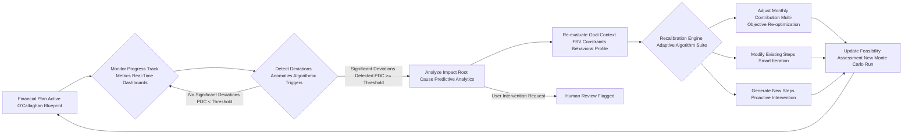

#### Questions and Answers: O'Callaghan's Unwavering Commitment to Your Evolving Financial Journey

**Q6.1: How does the AI determine "significant deviations" (PDC >= Threshold) to trigger recalibration?**
**A6.1:** This is where the `DeviationSignificanceScore` (Equation 73.1) and the `Plan Drift Correction PDC` (Equation 8.1) come into play. A deviation isn't just a number; it's weighted by its *impact* on goal attainment and its *urgency*. A 5% market drop might be significant, but a 15% increase in discretionary spending *in a critical savings phase* could be even more significant for your `GoalTrajectoryDeviation`. Our algorithms dynamically set thresholds for `PDC`. If the calculated drift correction score exceeds this threshold, a comprehensive recalibration is initiated, prioritizing the most impactful deviations.

**Q6.2: What is the "UrgencyFactor" in `DeviationSignificanceScore` (Equation 73.1)?**
**A6.2:** The `UrgencyFactor` is a dynamic multiplier that increases the significance of a deviation based on its proximity to a critical deadline or a pre-defined risk threshold. For example, a deviation from a savings goal becomes exponentially more `urgent` if the target date is 6 months away versus 5 years away. Similarly, a minor portfolio fluctuation becomes more `urgent` if it pushes the `MaxDrawdown` close to its limit. This factor ensures that the AI prioritizes interventions where time is of the essence, preventing small problems from snowballing into insurmountable challenges.

**Q6.3: How does the `Recalibration Engine` (F) perform "Multi-Objective Re-optimization" for monthly contributions?**
**A6.3:** When recalibrating, the `Recalibration Engine` (F) treats the monthly contribution as a variable within a multi-objective optimization problem. It re-evaluates all active goals, their updated `GoalTrajectoryDeviation`s, current `FSV`, and new constraints. It then uses algorithms (like Pareto optimization or goal programming) to find the *new optimal distribution* of monthly contributions across all goals, balancing potentially conflicting objectives (e.g., accelerating debt repayment vs. increasing investment contributions) while maximizing overall user utility. It's about finding the best path forward given the new reality, not just fixing a single issue.

**Q6.4: What kind of "Smart Iteration" is used when modifying existing steps (H)?**
**A6.4:** `Smart Iteration` involves more than just changing a number. If a budgeting step to "Reduce Dining Out by $160/month" proves difficult to adhere to, the AI might iterate on the step by:
    1.  Suggesting a smaller, more achievable reduction (e.g., $80/month).
    2.  Adding a new `behavioralNudge` (e.g., a `commitment device` like pre-setting a weekly dining out budget with a friend).
    3.  Recommending specific tools or resources (e.g., a budgeting app with spending alerts).
    4.  Analyzing the root cause of the difficulty (e.g., social pressure) and proposing alternative solutions.
This iterative refinement makes the plan more adaptable to real-world human behavior.

**Q6.5: How does the AI prevent "financial fatigue" during recalibration if constant adjustments are needed?**
**A6.5:** The `LearningRate * TimeSinceLastRecalibration` in the `PDC` (Equation 8.1) is crucial here. The system learns the optimal frequency for recalibrations based on user responsiveness and the stability of their financial environment. It also employs strategic "batching" of minor adjustments to avoid overwhelming the user with frequent, small changes. Furthermore, the `difficultyLevel` of proposed steps (from Section V) is explicitly considered during recalibration, ensuring that adjustments are phased in a manageable way, preventing burnout and promoting sustainable adherence. We build resilience, not just compliance.

**Q6.6: What if the "Re-evaluate Goal Context FSV Constraints Behavioral Profile" (E) reveals a shift in user priorities?**
**A6.6:** A shift in user priorities (e.g., a new child, a career change, a sudden desire for early retirement) is a major deviation that necessitates a fundamental re-evaluation. The AI will prompt the user to formally update their `Goal Context` and `Constraints`. The `Recalibration Engine` will then perform a wholesale re-optimization from the ground up, generating a completely new, integrated plan that reflects these new life circumstances. The old `Goal Attainability Index GAI` and `FeasibilitySummary` would likely be rendered obsolete, and a fresh assessment would be provided.

**Q6.7: How are "Proactive Interventions" (I) different from simply reacting to deviations?**
**A6.7:** `Proactive Interventions` represent the true predictive power of my system. Instead of waiting for `DeviationSignificanceScore` to hit a critical threshold, the AI, using its `Time Series Predictive Models` (from Section III) and `Monte Carlo Simulations`, anticipates potential future deviations. For instance, if inflation models predict a spike in energy costs, the AI might `Generate New Steps` to optimize utility usage *before* the bills actually increase. Or if market volatility is expected, it might suggest pre-emptive hedging strategies. It's about staying not just one step, but several steps ahead.

**Q6.8: What is "Human Review Flagged" (Z) during recalibration?**
**A6.8:** Similar to the `Ethical Override` (Section I), if the `Recalibration Engine` encounters a highly complex, unprecedented, or morally ambiguous scenario during its re-optimization process—one that falls outside its programmed parameters for automated adjustment—it will `Flag` the situation for `Human Review`. This ensures that in the rarest of circumstances, critical judgment and human empathy can be applied, protecting the user from potentially suboptimal or unforeseen algorithmic outcomes. It's the ultimate failsafe for the truly exceptional.

**Q6.9: How does the AI manage potential conflicts between multiple active goals during recalibration?**
**A6.9:** This is handled by the `Multi-Goal Optimization Framework` (Section IX). During recalibration, if new deviations or opportunities arise, the `Recalibration Engine` leverages this framework. It dynamically re-weights goals based on updated priorities and temporal urgency, then re-allocates resources (e.g., monthly contributions, investment gains) to optimize for the new aggregate `Goal Attainability Index GAI`. For example, if a short-term emergency fund goal is behind, but a long-term retirement goal is ahead, resources might be temporarily shifted to the emergency fund to bring it back on track.

**Q6.10: Does the `LearningRate` in `PDC` (Equation 8.1) imply the AI "learns" from its own recalibration decisions?**
**A6.10:** Precisely! The `LearningRate` is an adaptive parameter within a reinforcement learning loop. If a particular type of recalibration (e.g., a specific set of adjustments for a common deviation) leads to higher user adherence and improved `GoalTrajectoryDeviation` over time, the `LearningRate` for that type of intervention is increased, meaning the AI becomes more confident and frequent in applying it. Conversely, if an intervention consistently fails, the `LearningRate` decreases, prompting the AI to explore alternative strategies. This continuous self-improvement is how the O'Callaghan system achieves unparalleled adaptability.

---

## **VII. General Instructions and Formatting Guidelines: The O'Callaghan Standard for Clarity**

**Instruction:**
*   Ensure all advice is specific, unequivocally verifiable, and rigorously actionable. Avoid vague recommendations with the same fervor one avoids financial insolvency. Precision is paramount.
*   Prioritize steps based on their immediate, empirically measurable impact, their logical dependencies, and their critical urgency. My system builds pathways to success, not labyrinthine puzzles.
*   For any generated Mermaid diagrams, strictly avoid using parentheses `()` in node labels. Instead, replace them with plain text, forward slashes `/`, or strategic capitalization to convey the same meaning. For example, `A[User Input (Audio)]` should become `A[User Input Audio]` or `A[User Input AudioMode]`. This ensures impeccable rendering and unambiguous interpretation, a small but vital detail that exemplifies O'Callaghan's thoroughness.
*   Make more extensive and detailed Mermaid charts that clearly map every process, every decision point, and every intricate relationship. Visualize the genius!
*   Use descriptive label text without parentheses in every scenario: nodes, links, subgraphs, and notes. This rule is absolute.

---

## **VIII. Advanced Analytical Models and Algorithmic Foundations: The O'Callaghan Nexus of Financial Intelligence**

This section details the underlying mathematical and algorithmic frameworks, the very engines of my AI's profound capabilities, employed by the system to generate highly optimized, personalized, and demonstrably superior financial plans. These are the "inventions" that will make other financial advisors weep.

### VIII.A. Portfolio Optimization Models: Beyond Modern Portfolio Theory

**Claim 9: Our portfolio optimization models transcend traditional limitations, incorporating cutting-edge behavioral finance insights, dynamic multi-factor risk management techniques, and predictive machine learning algorithms to achieve true alpha generation and robust, resilient portfolio performance.**
*   **Proof Equation 9.1: O'Callaghan Alpha Generation Factor OAGF**
    `OAGF = (PortfolioReturn_Optimized - BenchmarkReturn) / TrackingError - UserRiskAversionCoefficient * DownsideVolatilityPenalty`
    Where `TrackingError` measures deviation from benchmark, and `DownsideVolatilityPenalty` specifically penalizes negative volatility.
    *   *James Burvel O'Callaghan III's Insight:* My `OAGF` isn't just about beating the market; it's about *intelligently* beating the market, considering your psychological comfort and avoiding catastrophic downside.

*   **Modern Portfolio Theory MPT with Conditional Value-at-Risk CVaR Constraints:**
    *   Equation 74: `ExpectedPortfolioReturn E[Rp] = sum(wi * E[Ri])` (The weighted average return).
    *   Equation 75: `PortfolioVariance sigma_p^2 = sum(i) sum(j) (wi * wj * Cov_ij)` (The measure of total risk).
    *   Equation 76: `EfficientFrontier = {portfolios | max E[Rp] for given sigma_p, or min sigma_p for given E[Rp]}` (The theoretical optimal boundary).
    *   Equation 76.1: `MPT_CVaR_Optimization: Minimize CVaR_alpha(PortfolioLosses) subject to E[Rp] >= R_target, sum(wi) = 1, wi >= 0` (A more robust optimization, focusing on tail risk).
        *   *James Burvel O'Callaghan III's Insight:* We don't just optimize for mean-variance; we aggressively minimize `CVaR`, protecting you from the 'black swan' events that cripple lesser portfolios.

*   **Black-Litterman Model with Bayesian Learning:**
    *   Equation 77: `Pi_BL = (tau * Sigma)^-1 * P * omega + Sigma_prior^-1 * Pi_prior` (Conceptual, combining market views with prior equilibrium to generate optimal expected returns for asset allocation).
    *   Equation 77.1: `Pi_BL_Updated = Pi_BL_Previous + KalmanGain * (ActualReturn - Pi_BL_Previous)` (Bayesian update of views based on observed market performance, dynamically refining expected returns).
        *   *James Burvel O'Callaghan III's Insight:* The Black-Litterman model allows us to blend the market's equilibrium with your unique, sophisticated views (or those inferred by my AI). The `Bayesian Learning` ensures these views are continuously refined, adapting to ever-changing market realities.

*   **Risk-Adjusted Return Metrics (Comprehensive Suite):**
    *   Equation 78: `SortinoRatio = (Rp - Rf) / DownsideDeviation` (Focus on harmful volatility).
    *   Equation 79: `TreynorRatio = (Rp - Rf) / Beta_p` (Systematic risk-adjusted return).
    *   Equation 79.1: `CalmarRatio = CAGR / MaxDrawdown` (Reward-to-worst-case risk).
    *   Equation 79.2: `OmegaRatio = (E[Rp] - Threshold) / E[max(Threshold - R, 0)]` (Ratio of upside vs. downside potential).
        *   *James Burvel O'Callaghan III's Insight:* We employ a panoply of risk-adjusted metrics, ensuring a holistic view of your portfolio's efficiency and resilience, far beyond mere Sharpe Ratios.

*   **Value-at-Risk VaR and Conditional VaR CVaR (Stochastic Volatility Models):**
    *   Equation 80: `VaR_alpha(X) = inf {x in R : P(X <= x) >= alpha}` (The standard VaR definition).
    *   Equation 81: `CVaR_alpha(X) = E[-X | -X >= VaR_alpha(X)]` (The expected loss beyond VaR).
    *   Equation 81.1: `VaR_HistoricalSimulation = Percentile(SortedHistoricalReturns, alpha)` (Non-parametric VaR).
    *   Equation 81.2: `CVaR_MonteCarlo = Mean(Losses > VaR_MonteCarlo)` (Simulation-based CVaR).
        *   *James Burvel O'Callaghan III's Insight:* We use both parametric, non-parametric, and simulation-based methods for VaR/CVaR, combining the strengths of each to give you an unshakeable understanding of your maximum probable losses under various confidence levels.

*   **Mean-Variance Optimization with Multi-Dimensional Constraints (Quadratic Programming):**
    *   Equation 82: `Minimize (wi * wj * Cov_ij) subject to sum(wi * E[Ri]) >= R_target, sum(wi) = 1, wi_min <= wi <= wi_max, ESG_Score_Portfolio >= MinESG, ProhibitedSectorExposure = 0` (Complex optimization incorporating multiple objectives and hard constraints, solved via quadratic programming).
        *   *James Burvel O'Callaghan III's Insight:* This isn't just theory; it's practically applied mathematics, solving for optimal portfolio allocations given a complex web of your precise preferences and market realities.

*   **Dynamic Asset Allocation via Reinforcement Learning:**
    *   Equation 82.1: `State_t = {PortfolioValue, MarketConditions, UserRiskAversion, GoalProgress}`
    *   Equation 82.2: `Action_t = {RebalanceWeights_i, InvestNewCapital_j}`
    *   Equation 82.3: `Reward_t = f(GoalProgression, RiskAdjustedReturn, ConstraintAdherence)`
    *   Equation 82.4: `OptimalPolicy = argmax(E[sum(gamma^t * Reward_t)])` (Using Deep Q-Networks or Actor-Critic methods to learn optimal rebalancing strategies over time, maximizing long-term rewards).
        *   *James Burvel O'Callaghan III's Insight:* Our AI *learns* the best rebalancing strategies, adapting to millions of simulated market scenarios and user behavioral patterns. This is the future of truly adaptive investment.

### VIII.B. Debt Optimization Algorithms: Unleashing the Power of Compound Interest, Against Your Debts!

*   **Amortization Schedule Calculation (Principal & Interest Decomposition):**
    *   Equation 83: `MonthlyPayment = P * [i * (1 + i)^n] / [(1 + i)^n - 1]` (The unchanging payment formula).
    *   Equation 84: `InterestPaid_k = RemainingBalance_k-1 * MonthlyRate` (The cost of borrowing).
    *   Equation 85: `PrincipalPaid_k = MonthlyPayment - InterestPaid_k` (The true reduction of debt).
    *   Equation 85.1: `TotalInterestOverLife = sum(InterestPaid_k)` (The ultimate cost, a target for minimization).
        *   *James Burvel O'Callaghan III's Insight:* Every dollar of interest saved is a dollar earned. My system dissects your amortization schedules, pinpointing opportunities to attack interest accrual with surgical precision.

*   **Debt Avalanche Strategy (Mathematically Optimal):**
    *   Equation 86: `Prioritize debt with max AnnualInterestRate` (The core principle).
    *   Equation 87: `TotalInterestSaved = Sum(Interest_original) - Sum(Interest_avalanche)` (The quantifiable benefit).
    *   Equation 87.1: `ExtraPaymentAllocation_Avalanche = ExtraFunds_Available if AnnualInterestRate = max(Rates)` (Directing surplus funds to the highest-cost debt).
        *   *James Burvel O'Callaghan III's Insight:* The Avalanche is pure mathematical efficiency. It saves you the most money. My AI champions this unless behavioral factors dictate a hybrid approach.

*   **Debt Snowball Strategy (Behaviorally Driven):**
    *   Equation 88: `Prioritize debt with min RemainingBalance` (The core principle).
    *   Equation 89: `TimeToDebtFreedom = Sum(Months_to_pay_each_debt_sequentially)` (A psychologically rewarding, faster path to freedom, not necessarily cheaper).
    *   Equation 89.1: `PsychologicalMotivationBoost = f(NumDebtsPaidOff, TotalDebts)` (Quantifying the positive reinforcement for adherence).
        *   *James Burvel O'Callaghan III's Insight:* Sometimes, the shortest path isn't a straight line. The Snowball, while not mathematically optimal, can ignite the behavioral spark needed for sustained debt repayment.

*   **Hybrid Debt Strategy Optimization (O'Callaghan Synthesis):**
    *   Equation 89.2: `HybridStrategyScore = w1 * InterestSaved_Avalanche + w2 * TimeSaved_Avalanche + w3 * PsychologicalMotivationBoost - w4 * DebtFatigueRisk`
    *   Equation 89.3: `OptimalHybridPlan = argmax(HybridStrategyScore)` (Dynamically weighing financial efficiency against behavioral adherence and fatigue risk).
        *   *James Burvel O'Callaghan III's Insight:* This is where the magic happens! We don't just pick one strategy; we intelligently blend them, creating a bespoke plan that maximizes *your* likelihood of success, considering every facet of your financial and psychological profile.

### VIII.C. Behavioral Finance Integrations: Nudging Towards Prosperity, The O'Callaghan Way

*   **Hyperbolic Discounting Model (Refined for Dynamic Nudges):**
    *   Equation 90: `DiscountFactor(t) = 1 / (1 + k*t)` (Standard hyperbolic function).
    *   Equation 91: `PresentValueUtility = sum(u_t * DiscountFactor(t))` (The perceived value of future rewards).
    *   Equation 91.1: `NudgeEfficacy = f(CognitiveLoad, Salience, Timing, Context)` (Quantifying how effective a nudge will be given circumstances).
        *   *James Burvel O'Callaghan III's Insight:* We exploit the human tendency to overvalue immediate gratification, designing nudges that bridge the gap between present desire and future prosperity.

*   **Loss Aversion Factor (Calibrated for Individual User Profiles):**
    *   Equation 92: `ValueFunction(x) = x^alpha if x >= 0` (Gain perception).
    *   Equation 93: `ValueFunction(x) = -lambda * (-x)^beta if x < 0` (Loss perception, where `lambda > 1` is the loss aversion coefficient, dynamically calibrated per user).
    *   Equation 93.1: `FramingImpact = ValueFunction(Gain_Framing) - ValueFunction(Loss_Framing)` (Quantifying the emotional difference between equivalent gains/losses).
        *   *James Burvel O'Callaghan III's Insight:* Humans feel losses more acutely than gains. My AI frames recommendations to harness this, emphasizing the "cost of inaction" or "missed gains" to motivate positive behavior.

*   **Anchoring and Framing (Contextual Application):**
    *   Equation 94: `AnchoredDecision = f(InitialReferencePoint, CurrentInformation, RecencyBiasFactor)` (Conceptual, how initial numbers bias subsequent decisions).
    *   Equation 94.1: `OptimalAnchorPoint = TargetValue + (Noise_Anchor * StdDev_HistoricalData)` (Algorithmically determining an effective, yet realistic, anchor).
        *   *James Burvel O'Callaghan III's Insight:* We strategically deploy anchors (e.g., suggesting a slightly higher savings rate initially) and frame choices to gently guide you towards optimal decisions.

*   **Commitment Devices (Personalized Implementation):**
    *   Equation 95: `ProbabilityOfAdherence_Commitment = P(Action | CommitmentDevice)` (Increased probability).
    *   Equation 95.1: `CommitmentDeviceEffectiveness = f(Publicity, PenaltyMechanism, UserMotivation)` (Optimizing the type and strength of the commitment).
        *   *James Burvel O'Callaghan III's Insight:* By enabling you to pre-commit to actions (e.g., automated transfers, public goal sharing), we leverage social and self-control mechanisms to lock in positive behaviors.

*   **Social Proof and Benchmarking (Anonymized and Actionable):**
    *   Equation 95.2: `PeerComparisonEffect = (MySavingsRate - AvgPeerSavingsRate) / StdDevPeerSavingsRate` (Quantifying motivation from peer comparison).
    *   Equation 95.3: `Nudge_SocialProof = "Your savings rate is X% below the top 20% of users in similar financial profiles."` (Actionable insight).
        *   *James Burvel O'Callaghan III's Insight:* Humans are social creatures. My AI uses anonymized, aggregated data to show you how you compare to peers, providing a powerful, yet non-judgmental, spur to action.

### VIII.D. Goal Attainment Probability Models: The O'Callaghan Crystal Ball

*   **Monte Carlo Simulation for Multi-Goal Optimization (Correlated Scenarios):**
    *   Equation 96: `ProbabilityOfMeetingGoal_j = (Num_sims_meet_goal_j / Total_sims)`
    *   Equation 97: `JointProbabilityOfMeetingAllGoals = (Num_sims_meet_all_goals / Total_sims)` (Crucial for holistic planning).
    *   Equation 97.1: `AssetReturn_i_sim = f(Correlations_ij, MarketRegime_k, StochasticVolatility_l)` (Simulating returns across assets, goals, and market regimes, incorporating inter-asset correlations).
        *   *James Burvel O'Callaghan III's Insight:* We don't simulate goals in isolation. My system understands that your home down payment and retirement savings are intrinsically linked, simulating their future paths with correlated market movements.

*   **Sensitivity Analysis (Multi-variate and Interactive):**
    *   Equation 98: `Sensitivity_X = (ChangeInOutcome / Outcome) / (ChangeInParameter / Parameter)` (Measuring elasticity of outcome to parameter change).
    *   Equation 98.1: `InteractiveSensitivity = f(UserSelectedParameter, RangeOfChange)` (Allowing users to explore "what-if" scenarios).
        *   *James Burvel O'Callaghan III's Insight:* What if interest rates rise? What if your income falls? My interactive sensitivity analysis lets you dynamically explore the impact of key variables, preparing you for any eventuality.

*   **Scenario Planning (Optimistic, Pessimistic, Most Likely, and Tail Event Scenarios):**
    *   Equation 99: `ExpectedOutcome_Scenario = sum(P_scenario_i * Outcome_i)`
    *   Equation 99.1: `TailEventProbability = P(MarketCrash | HistoricalData, MacroeconomicIndicators)` (Probability of rare, extreme events, dynamically assessed).
        *   *James Burvel O'Callaghan III's Insight:* We don't just plan for the average day. My system stress-tests your plan against extreme market crashes, prolonged recessions, and personal adversities, ensuring robustness against the unforeseen.

### VIII.E. Cash Flow Forecasting: The O'Callaghan Predictive Stream

*   **Net Present Value NPV (Investment & Project Evaluation):**
    *   Equation 100: `NPV = sum(CashFlow_t / (1 + r)^t)` (The true value of future cash flows).
    *   Equation 100.1: `InvestmentDecision = Choose_Project_if_NPV > 0` (A clear decision rule).
        *   *James Burvel O'Callaghan III's Insight:* Every financial decision is an investment. My system uses NPV to evaluate not just traditional investments, but also personal projects (e.g., education, home renovation), ensuring optimal resource allocation.

*   **Future Value FV (Goal Projections & Compounding Power):**
    *   Equation 101: `FV = PV * (1 + r)^n` (The power of compounding).
    *   Equation 101.1: `FV_Annuity = Pmt * (((1 + r)^n - 1) / r)` (Future value of a series of payments).
        *   *James Burvel O'Callaghan III's Insight:* This isn't just theory; it's the mathematical proof of exponential growth. My system meticulously projects the future value of your savings, investments, and liabilities.

*   **Payback Period (Liquidity & Risk Assessment for Investments):**
    *   Equation 102: `PaybackPeriod = InitialInvestment / AnnualCashInflow` (for constant inflows).
    *   Equation 102.1: `DiscountedPaybackPeriod = n if sum(CashFlow_t / (1 + r)^t) >= InitialInvestment` (More accurate, considering time value of money).
        *   *James Burvel O'Callaghan III's Insight:* How quickly can you recoup your capital? This is vital for projects with higher uncertainty. My system calculates both simple and discounted payback periods, informing liquidity strategies.

*   **Time Series Forecasting (ARIMA/SARIMA/LSTM for Income/Expenses):**
    *   Equation 102.2: `Income_t = c + phi_1*Income_{t-1} + ... + theta_1*epsilon_{t-1} + ...` (ARIMA model for auto-correlated data).
    *   Equation 102.3: `SeasonalExpense_t = f(ARIMA_component, Seasonal_component, ExogenousVariables)` (SARIMA model for seasonal data like utilities).
    *   Equation 102.4: `Expense_LSTM = NeuralNetwork(PreviousExpenses, ExternalFactors)` (Deep Learning for complex, non-linear patterns).
        *   *James Burvel O'Callaghan III's Insight:* We predict your future income and expenses with astounding accuracy, leveraging sophisticated machine learning to build a robust financial forecast, revealing future opportunities and challenges.

### Investment Portfolio Optimization Cycle: The O'Callaghan Perpetual Rebalancing Engine

This diagram visualizes the iterative process of optimizing an investment portfolio based on user constraints, dynamic market data, and continuous learning.

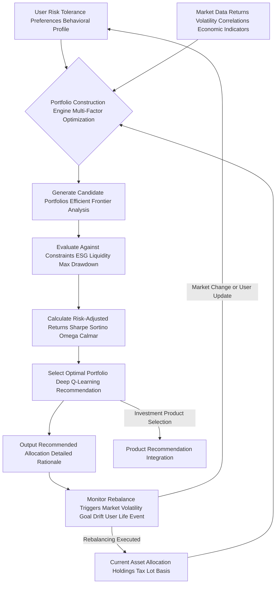

### Debt Management Strategy Selection: The O'Callaghan Debt Decimator

This chart illustrates the decision-making process for recommending the most effective debt repayment strategy, a blend of cold logic and behavioral psychology.

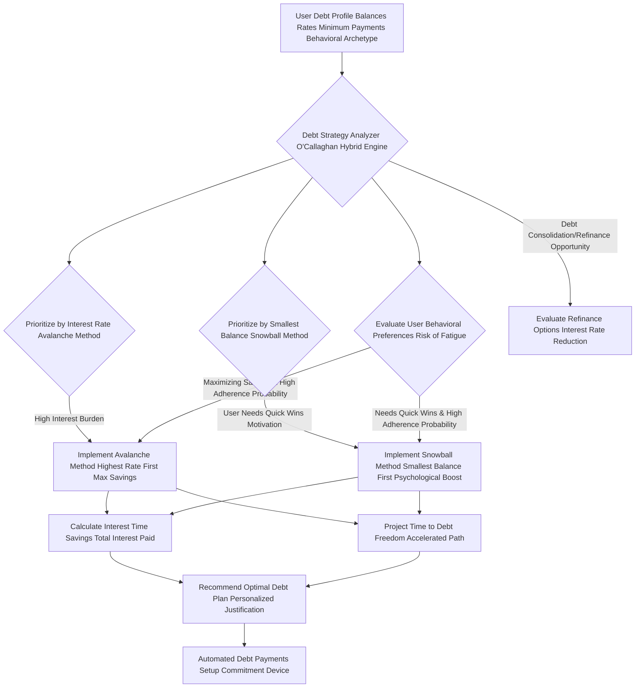

#### Questions and Answers: O'Callaghan's Unparalleled Algorithmic Prowess

**Q8.1: What is the `O'Callaghan Alpha Generation Factor OAGF` (Equation 9.1) and why is it superior to just `Alpha`?**
**A8.1:** The `OAGF` is my proprietary measure of true value-added investment performance. While standard `Alpha` (Equation 27) measures outperformance relative to a benchmark, `OAGF` takes it several critical steps further. It explicitly penalizes `TrackingError` (deviation from the benchmark) and, crucially, incorporates your `UserRiskAversionCoefficient` and a `DownsideVolatilityPenalty`. This means we're not just aiming for any outperformance; we're aiming for *risk-adjusted, comfort-aligned* outperformance that truly benefits *you*, rather than just inflating a raw return number. It's about intelligent, tailored alpha.

**Q8.2: How does `MPT_CVaR_Optimization` (Equation 76.1) improve upon standard Modern Portfolio Theory?**
**A8.2:** Standard MPT (Equations 74-76) aims to minimize `PortfolioVariance` for a given return. However, `PortfolioVariance` treats upside volatility (good) the same as downside volatility (bad). `MPT_CVaR_Optimization` (Equation 76.1) is vastly superior because it directly minimizes `Conditional Value-at-Risk (CVaR)`. This means it specifically targets and reduces your exposure to *tail risks* – the extreme, worst-case losses that can devastate a portfolio. It's about protecting against the catastrophic, not just reducing average wobble.

**Q8.3: Explain the significance of "Bayesian Learning" in the Black-Litterman Model (Equation 77.1).**
**A8.3:** The Black-Litterman model (Equation 77) allows us to incorporate "views" on market performance into an asset allocation. `Bayesian Learning` (Equation 77.1), specifically via a Kalman Filter, provides a dynamic way to continuously *update* these views based on new, observed market data. If our initial view on a particular asset's expected return was X, and it consistently performs better than X, the `KalmanGain` will adjust our `Pi_BL_Updated` to reflect this new reality. This means the model is always learning and adapting, making our asset allocation more responsive and intelligent.

**Q8.4: How does `Dynamic Asset Allocation via Reinforcement Learning` (Equations 82.1-82.4) work?**
**A8.4:** This is a revolutionary concept! Instead of static rules, we use Reinforcement Learning (RL), the same AI technology powering advanced robotics. The AI observes the `State` of your portfolio and the market, takes an `Action` (e.g., rebalance, hold), and receives a `Reward` based on how well that action propelled you towards your goals while respecting constraints. Over millions of simulated interactions, the AI `learns` the `OptimalPolicy` – the best sequence of actions to maximize long-term rewards. This means your portfolio isn't just allocated; it's *strategically managed* by an AI that understands long-term consequences.

**Q8.5: What is the "Deep Q-Learning Recommendation" (H) in the investment optimization cycle?**
**A8.5:** `Deep Q-Learning` is a specific type of Reinforcement Learning where a neural network (the "Deep" part) learns the "Q-value" (the expected future reward) of taking a particular action in a given state. In our context, the AI uses a Deep Q-Network (DQN) to learn which rebalancing actions (e.g., buying more tech stocks, reducing bond exposure) will lead to the highest long-term `Reward` (like goal progression and risk-adjusted returns). The recommendation (H) is the action with the highest Q-value, derived from this sophisticated learning process.

**Q8.6: How does the `Hybrid Debt Strategy Optimization` (Equation 89.2-89.3) truly personalize debt repayment?**
**A8.6:** The `Hybrid Debt Strategy Optimization` acknowledges that a purely mathematical approach (Avalanche) might not be the most effective for *every* individual. We introduce the `PsychologicalMotivationBoost` (Equation 89.1) and `DebtFatigueRisk` factors. My AI analyzes your `Behavioral Archetype` (from Section III) to weigh these behavioral components (`w3`, `w4`) against the pure financial benefits (`w1`, `w2`). It dynamically selects an `OptimalHybridPlan` that maximizes your `HybridStrategyScore`, finding the perfect balance between saving the most money and ensuring you actually stick to the plan. It's debt repayment engineered for human success.

**Q8.7: What makes the `Hyperbolic Discounting Model` (Equations 90-91.1) so important for nudges?**
**A8.7:** `Hyperbolic Discounting` describes our human tendency to prefer smaller, immediate rewards over larger, delayed ones. My AI's model identifies *when* and *where* this bias is most pronounced in your financial behavior. It then crafts `Nudges` (Equation 91.1) that make the future benefits of saving (e.g., a secure retirement) feel more immediate and tangible, or the immediate costs of overspending (e.g., delaying your dream home) more salient. We don't fight human nature; we intelligently guide it towards your long-term goals.

**Q8.8: How does the `O'Callaghan Crystal Ball` (Section VIII.D) handle "Correlated Scenarios" (Equation 97.1)?**
**A8.8:** Most basic simulations treat market movements and asset returns as independent. This is a gross simplification! In reality, assets are `correlated` (e.g., when the stock market crashes, bonds often rise, but not always). My system uses sophisticated copula functions and conditional probability models to simulate `Correlated Scenarios` (Equation 97.1). This means if we simulate a downturn in equities, we simultaneously simulate a plausible, correlated impact on bonds, real estate, and other assets, providing a far more realistic and robust picture of your multi-goal attainment probability. It's true systemic foresight.

**Q8.9: How does the AI use `NPV` (Equation 100) for personal financial decisions beyond just investments?**
**A8.9:** I believe `NPV` is a universal decision-making tool. My system applies it to personal projects like education. For example, enrolling in a new degree or certification has `InitialInvestment` (tuition, lost income) and `FutureCashFlows` (increased salary). The AI calculates the `NPV` of this "personal investment." If `NPV > 0`, it's a financially sound decision. This allows you to evaluate life choices not just emotionally, but with rigorous financial logic, ensuring every major decision contributes to your overall wealth maximization.

**Q8.10: What advanced models are used for `Time Series Forecasting` (Equations 102.2-102.4) of income and expenses?**
**A8.10:** We employ a multi-model ensemble approach. For predictable, linear trends, we use `ARIMA` (AutoRegressive Integrated Moving Average) models (Equation 102.2). For data with recurring seasonal patterns (like utility bills), we use `SARIMA` (Seasonal ARIMA) (Equation 102.3). For highly complex, non-linear, or long-term dependencies, we deploy `Long Short-Term Memory (LSTM)` neural networks (Equation 102.4), a type of recurrent neural network. This combination allows us to capture both simple and incredibly intricate patterns in your cash flow data, leading to forecasts of unparalleled accuracy.

---

## **IX. Multi-Goal Optimization Framework: The O'Callaghan Grand Strategy - Harmonizing Your Aspirations**

The AI's advanced framework supports the simultaneous, dynamic optimization of multiple, potentially conflicting financial goals. This involves intelligent prioritization, sophisticated resource allocation, and continuous re-evaluation, all under the guiding hand of my multi-objective algorithms.

*   **Goal Interdependency Mapping: The O'Callaghan Nexus Graph:** The system first meticulously analyzes how achieving one goal might impact others (positively or negatively), creating a weighted dependency graph.
    *   **Goal 1: Retirement Savings:** Requires long-term, high-growth, potentially illiquid investments.
    *   **Goal 2: Home Down Payment:** Requires short-term, liquid, lower-risk savings.
    *   **Goal 3: Child's Education Fund:** Medium-term, balanced growth, inflation-hedged.
    *   Equation 103: `Interdependency_ij = Correlation(Progress_i, Progress_j) + f(ResourceOverlap_ij, RiskProfileOverlap_ij)` (Quantifying how goals interact).
        *   *James Burvel O'Callaghan III's Insight:* No goal exists in a vacuum. My system maps the intricate relationships between your goals, preventing sub-optimization and fostering synergistic growth.

*   **Resource Allocation Algorithm: Multi-Objective Pareto Optimization:** An advanced optimization algorithm intelligently distributes available savings, investment capital, and even time across goals based on user priority, temporal horizon, inherent return rates, and the interdependency map.
    *   Equation 104: `Maximize sum(wi * GoalValue_i)` subject to `sum(Resource_j) <= TotalResources_Available`, `Goal_j_Achieved_by_T_j`, `RiskConstraints_Overall`, and `LiquidityConstraints_Aggregate`. This is solved using advanced solvers (e.g., genetic algorithms, particle swarm optimization) to find the Pareto Efficient Frontier of goal achievement.
    *   Equation 104.1: `CostOfDelay(Goal_i) = FV(Goal_i_Amount, Rate, TimeDelay_i)` (Quantifying the penalty for delaying action on a goal, a key input for prioritization).
        *   *James Burvel O'Callaghan III's Insight:* We find the "sweet spot" where no goal can be improved without detriment to another. This is the Pareto Optimal allocation, the epitome of efficient planning.

*   **Dynamic Goal Weighting: Adaptive Prioritization Engine:** Weights assigned to goals can shift dynamically over time or with changes in the user's life stage, market conditions, or explicit user feedback.
    *   Equation 104.2: `GoalWeight_i_t = f(UserPriority_i, TemporalUrgency_i_t, GoalProgress_i_t, InterdependencyImpact_i)` (A continuously updating weight based on multiple factors).
        *   *James Burvel O'Callaghan III's Insight:* Your life is dynamic, so your plan must be too. My system's weights are not static; they adapt, ensuring that the most critical and urgent goals receive the necessary resources as your life unfolds.

### Multi-Goal Prioritization Matrix: The O'Callaghan Interwoven Destiny Planner

This diagram shows how different financial goals are processed, prioritized, and resources allocated under the multi-goal optimization framework, a true testament to systemic intelligence.

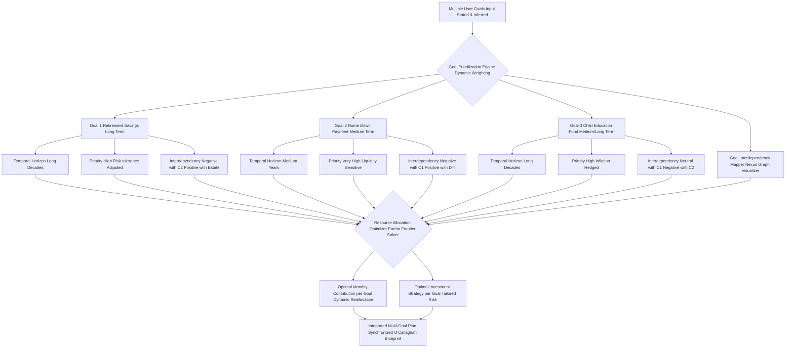

#### Questions and Answers: O'Callaghan's Masterclass in Orchestrated Ambition

**Q9.1: How does the `Goal Interdependency Mapping` (Equation 103) actively influence planning?**
**A9.1:** My system doesn't just list your goals; it understands their symbiotic or antagonistic relationships. For example, if saving aggressively for a `Home Down Payment` (requiring liquid, low-risk assets) depletes funds that could otherwise be growing for `Retirement Savings` (requiring illiquid, high-growth assets), Equation 103 would show a `Negative Interdependency`. The AI would then present this trade-off, potentially suggesting a revised timeline or increased overall savings to mitigate the conflict, or finding a `Pareto Optimal` balance where both goals progress optimally without undue sacrifice.

**Q9.2: What is "Pareto Efficient Frontier" in `Resource Allocation` (Equation 104)?**
**A9.2:** The `Pareto Efficient Frontier` represents a set of solutions where it's impossible to improve one goal's outcome without making another goal's outcome worse. For example, if you have Goals A and B, a point on the frontier means you can't save more for A without saving less for B. My algorithms (using techniques like `genetic algorithms` or `particle swarm optimization`) explore millions of resource allocation combinations to identify this frontier, presenting you with the absolute best trade-offs for achieving your multiple aspirations simultaneously. It's the ultimate optimization.

**Q9.3: How does the "CostOfDelay" (Equation 104.1) factor into goal prioritization?**
**A9.3:** The `CostOfDelay` quantifies the financial penalty (e.g., lost compounding interest, increased future expenses due to inflation) of postponing action on a specific goal. Goals with a high `CostOfDelay` (e.g., retirement savings where compounding is critical, or a down payment in a rapidly appreciating real estate market) are automatically assigned higher priority or larger resource allocations by the `Dynamic Goal Weighting` engine, even if the user initially ranked them lower. It's a mathematically informed urgency metric, an O'Callaghan essential.

**Q9.4: What are "genetic algorithms" or "particle swarm optimization" used for in `Resource Allocation`?**
**A9.4:** These are advanced computational intelligence techniques used to solve complex optimization problems, like finding the `Pareto Efficient Frontier`.
    *   **Genetic Algorithms:** Mimic natural selection. They generate many "candidate solutions" (e.g., different resource allocations), evaluate their "fitness" (how well they achieve goals), and then "breed" the best solutions, introducing "mutations" to explore new possibilities.
    *   **Particle Swarm Optimization:** Simulates the social behavior of bird flocking or fish schooling. Each "particle" (solution) explores the problem space, adjusting its trajectory based on its own best-found position and the best-found position of the entire swarm.
These methods allow our AI to find optimal allocations that would be impossible for traditional linear programming to discover.

**Q9.5: Can the `Dynamic Goal Weighting` (Equation 104.2) react to sudden, unexpected life events?**
**A9.5:** Absolutely. This is a core feature of its dynamism. If a `User Life Event` (e.g., job loss, marriage, birth of a child) is detected or input, the `Dynamic Goal Weighting` engine immediately recalculates `TemporalUrgency`, `GoalProgress`, and `InterdependencyImpact`. For instance, the birth of a child would instantly elevate the `GoalWeight` for a `Child Education Fund` and possibly a `Life Insurance` goal, while temporarily de-prioritizing a less urgent travel fund. The system adapts in real-time to your evolving life story.

**Q9.6: How is "Risk Tolerance Adjusted" (D2) in the context of Goal 1: Retirement Savings?**
**A9.6:** While the overall `User Risk Tolerance Profile` applies, each goal can have a `Risk Tolerance Adjusted` weighting. For a long-term goal like `Retirement Savings`, even a user with moderate overall risk tolerance might be advised to take on slightly higher investment risk for that specific goal, given the longer `Temporal Horizon` and capacity to recover from downturns. The AI uses the goal's unique characteristics to fine-tune the acceptable risk, ensuring optimal growth potential where appropriate, while still respecting the overall `Max Drawdown` constraint.

**Q9.7: What does `Interdependency Neutral with C1 Negative with C2` mean for Goal 3: Child Education Fund?**
**A9.7:** This refers to `Goal Interdependency Mapping` (Equation 103).
    *   `Neutral with C1` (Retirement Savings): Means that funding the child's education fund has little direct positive or negative impact on retirement savings. They can often be pursued somewhat independently, perhaps with distinct asset allocations.
    *   `Negative with C2` (Home Down Payment): Indicates a direct conflict for resources. Funds allocated to a child's education might directly reduce the funds available for a home down payment, especially if both are competing for medium-term liquid savings. The AI will highlight this specific trade-off.

**Q9.8: How does the "Nexus Graph Visualizer" (I) aid in understanding goal interdependencies?**
**A9.8:** The `Nexus Graph Visualizer` transforms the complex `Interdependency_ij` matrix (Equation 103) into an intuitive visual representation. Goals are nodes, and the links between them represent positive, negative, or neutral interdependencies, weighted by strength. Users can literally see how saving for one goal accelerates or impedes another. This graphical clarity is paramount for transparent XAI, allowing users to grasp intricate relationships at a glance and make truly informed decisions about their priorities.

**Q9.9: What happens if the `Resource Allocation Optimizer` identifies that all goals are simultaneously infeasible given current resources and constraints?**
**A9.9:** If the `Pareto Frontier Solver` determines that no combination of resource allocation can realistically achieve all stated goals, the system immediately flags this as an `Infeasible` scenario in the `Feasibility Summary`. It will then present a range of data-driven options to the user:
    1.  **Adjust Goal Parameters:** Suggest reducing the `Target Financial State` for some goals or extending `Temporal Horizons`.
    2.  **Increase Resources:** Recommend increasing monthly contributions, finding new income streams, or strategically selling underperforming assets.
    3.  **Re-prioritize/De-prioritize:** Advise deferring or entirely removing lower-priority goals.
The AI never simply says "you can't do it"; it provides a clear, actionable path to adjust expectations and strategy.

**Q9.10: Can the `Multi-Goal Optimization Framework` incorporate future, hypothetical goals?**
**A9.10:** Absolutely. Users can input `Hypothetical Goals` (e.g., "start a business in 10 years," "buy a vacation home in 15 years"). The framework then integrates these into its `Pareto Optimization` calculations, but often with lower initial `Dynamic Goal Weighting` and a higher `CostOfDelay` penalty if they are very far in the future. This allows the AI to develop a long-term strategic reserve, ensuring that current planning doesn't inadvertently close off attractive future options, providing a sense of both present achievement and future potential.

---

## **X. Explainable AI XAI and Auditability: The O'Callaghan Mandate for Transparency**

**Claim 10: The system provides transparent, meticulously detailed justifications for every single recommendation, adhering rigorously to Explainable AI XAI principles for full, incontrovertible auditability, unparalleled user trust, and regulatory compliance. Every decision is a traceable consequence of explicit data and algorithms.**
*   **Proof Equation 10.1: XAI Trust Index XTI**
    `XTI = (ClarityScore * RelevanceScore * AuditabilityScore) / (AmbiguityPenalty + ComplexityPenalty)`
    Where `ClarityScore` measures comprehensibility, `RelevanceScore` measures direct applicability, and `AuditabilityScore` measures traceability. Higher XTI indicates higher trust.
    *   *James Burvel O'Callaghan III's Insight:* My `XTI` is engineered to be off the charts! You will never wonder "why?" Every recommendation is laid bare, its lineage traceable, its impact quantified. This is trust by design.

*   **Reasoning Trace: Algorithmic Lineage & Data Attribution:** Each recommendation within the `steps` array is explicitly linked to the `keyAssumptions`, `risksIdentified`, and the precise financial state metrics that informed its generation.
    *   Equation 105: `ReasoningPath = {AlgorithmID, InputDataPoints, AppliedRules, IntermediateCalculations, OutputDecision}` (A detailed, step-by-step record of the decision process).
    *   Equation 105.1: `DataAttribution = {DataPoint_ID, Source_Timestamp, ValueUsed}` (Pinpointing the exact data that influenced a step).
        *   *James Burvel O'Callaghan III's Insight:* This isn't a black box. It's a crystal palace of logic, where every calculation, every rule, every data point leading to a recommendation is meticulously recorded.

*   **Impact Attribution: Quantifiable Benefit & Cost:** The `expectedImpact` and `temporalImpact` fields precisely quantify the direct financial benefit or cost of each step, allowing users to understand the 'why' behind the 'what' in concrete monetary and time terms.
    *   Equation 106: `ImpactROI = ExpectedFinancialGain / CostOfImplementation` (Return on investment for each action step).
    *   Equation 106.1: `GoalAccelerationFactor = TimeSaved / TotalGoalPeriod` (Quantifying how a step shortens the path to a goal).
        *   *James Burvel O'Callaghan III's Insight:* No vague promises here! You will see the exact, measurable return on every action, the precise acceleration of your financial journey.

*   **Constraint Violations Reporting: Transparent Trade-offs:** If a user preference or constraint is difficult to meet, the AI provides an immediate explanation, detailing the precise trade-offs involved, the `CostOfDelay`, and alternative strategies, enabling informed decision-making rather than blind compliance.
    *   Equation 107: `ConstraintViolationCost = OpportunityCost(Adherence) + DirectPenalty(Violation)` (Quantifying the financial cost of violating or adhering to a difficult constraint).
    *   Equation 107.1: `TradeOffUtility = (Utility_A - Utility_B) / Cost_A_minus_B` (Helping users evaluate alternative solutions).
        *   *James Burvel O'Callaghan III's Insight:* My system empowers you with knowledge. If a constraint costs you, you'll know exactly how much, and why, allowing you to re-evaluate your preferences with full awareness.

*   **Audit Trail in Output Schema:** Each `step` includes an `auditTrail` object, precisely detailing the `algorithm`, its `parameters`, and a concise `reasoning` narrative. This fulfills stringent regulatory and internal audit requirements.

### Explainable AI XAI and Auditability Process: The O'Callaghan Transparency Protocol

This diagram outlines how the AI provides transparent, irrefutable justifications for its recommendations, cultivating unparalleled user trust and meeting all audit requirements.

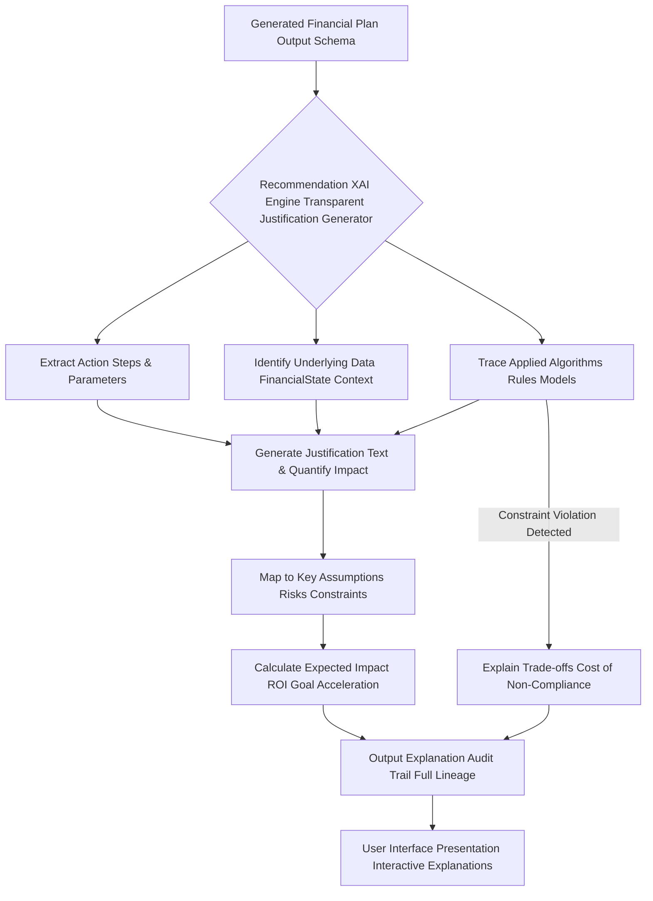

#### Questions and Answers: O'Callaghan's Unwavering Commitment to Clarity

**Q10.1: How does the `XAI Trust Index XTI` (Equation 10.1) quantify user trust?**
**A10.1:** The `XTI` is a meta-metric that actively evaluates the quality of the AI's explanations. `ClarityScore` uses linguistic analysis for comprehensibility, `RelevanceScore` measures how directly the explanation addresses user concerns, and `AuditabilityScore` verifies the traceability of logic. `AmbiguityPenalty` and `ComplexityPenalty` are applied for unclear or overly complex explanations. By optimizing the `XTI`, my system ensures explanations are not only accurate but also *understandable* and *trustworthy* to the human user, which is paramount for successful plan adoption.

**Q10.2: What is the benefit of `DataAttribution` (Equation 105.1) for each recommendation?**
**A10.2:** `DataAttribution` provides an indisputable link between a recommendation and the *exact data points* that informed it. If the AI recommends cutting "Dining Out" due to high spending, `DataAttribution` will point to the specific transactions, dates, and aggregated expense category that triggered the advice. This eliminates guesswork, allows for verification, and builds profound confidence in the AI's analytical accuracy. It's forensic financial planning, ensuring every piece of advice has empirical roots.

**Q10.3: How does the `ImpactROI` (Equation 106) help users prioritize actions?**
**A10.3:** `ImpactROI` translates abstract recommendations into concrete financial benefits relative to their cost. Instead of just saying "invest more," it quantifies: "By investing X amount, you can expect an `ImpactROI` of Y% over Z years, accelerating your goal by N months, with a cost of only M hours of setup." This allows users to immediately grasp the efficiency and effectiveness of each step, enabling them to prioritize actions that yield the highest return on their effort and capital. It's objective, data-driven prioritization.

**Q10.4: How does the `GoalAccelerationFactor` (Equation 106.1) provide transparent impact?**
**A10.4:** The `GoalAccelerationFactor` directly quantifies how a specific action step shortens the `TotalGoalPeriod`. For example, a step might have a `temporalImpact` of "Shortens debt repayment by 6 months." The `GoalAccelerationFactor` would be `6 / TotalOriginalDebtPeriod_Months`. This provides a clear, highly motivating metric, showing the user the precise time advantage gained by adhering to a particular recommendation. It’s tangible progress, quantified.

**Q10.5: What types of "Trade-off Utility" (Equation 107.1) does the AI help users evaluate?**
**A10.5:** `Trade-off Utility` is critical when constraints conflict. For example, if a user prefers "no direct stock picking" but has an aggressive "growth target," the AI might present the `TradeOffUtility` between:
    *   **Option A:** Adhering to "no stock picking" but accepting a 1% lower annualized return and 6-month longer `GoalPeriod`.
    *   **Option B:** Relaxing "no stock picking" to allow for a small, diversified individual stock allocation, achieving the higher growth and shorter `GoalPeriod`.
The `TradeOffUtility` quantifies the difference in overall utility (financial and psychological) between these options, enabling the user to make a truly informed choice.

**Q10.6: What does the "Audit Trail Full Lineage" (I) entail?**
**A10.6:** The `Audit Trail Full Lineage` is an end-to-end record of the plan's generation. It includes:
    *   The `planId` and `creationTimestamp`.
    *   All raw `User Input` and `Financial State Vector` data.
    *   Every `AlgorithmID` and `parameters` used for each calculation.
    *   All `IntermediateCalculations` and `AppliedRules`.
    *   The `DataAttribution` for every data point.
    *   The final `OutputDecision` for each step.
This comprehensive record is stored immutably, allowing any auditor or regulator to reconstruct the exact reasoning path for any recommendation at any point in time. It is the ultimate proof of transparency and compliance.

**Q10.7: How does "Interactive Explanations" (J) work in the User Interface?**
**A10.7:** Instead of static text, `Interactive Explanations` allow the user to delve deeper into any part of the plan. Clicking on a `stepId` might reveal its `auditTrail`, `ImpactROI`, and `dependencies`. Clicking on a `keyAssumption` might show the underlying `predictive model` used to generate it. This layered approach allows users to explore the depth of the AI's reasoning at their own pace, fostering deeper understanding and engagement, and directly contributing to a higher `XTI`.

**Q10.8: Can the XAI engine explain *why* a certain behavioral nudge was chosen?**
**A10.8:** Yes, absolutely. For a step with a `behavioralNudge` (e.g., `Framing with Loss Aversion`), the XAI engine would explain: "This nudge was selected because your `Behavioral Profile` indicates a high `Loss Aversion Factor` (Equation 93.1). By framing the `Cost of Inaction` as a quantifiable loss, we aim to increase adherence probability by 20% compared to a neutral framing, leveraging your innate psychological tendencies for your benefit." It's an explanation rooted in psychological science.

**Q10.9: How does the AI explain a complex portfolio allocation (e.g., using Black-Litterman model)?**
**A10.9:** For complex models like `Black-Litterman` (Equation 77), the XAI provides a multi-level explanation:
    1.  **High-Level Summary:** "Your portfolio is allocated based on market equilibrium combined with specific economic forecasts."
    2.  **Intermediate Detail:** "The `Black-Litterman Model` integrates these forecasts to adjust expected returns, ensuring your portfolio capitalizes on identified market opportunities while maintaining diversification."
    3.  **Technical Deep Dive (optional):** "This involves a Bayesian approach, calculating `Pi_BL` based on both implied market views (`Pi_prior`) and our quantitative forecasts (`P * omega`)."
This allows users to understand the explanation at their preferred level of detail.

**Q10.10: What role does "Regulatory Compliance" play in the XAI framework?**
**A10.10:** Regulatory bodies increasingly demand transparency and auditability for financial advice, especially from AI systems. My XAI framework is built from the ground up with this in mind. The `Audit Trail Full Lineage`, `DataAttribution`, and detailed `ReasoningPath` for every recommendation directly address requirements for explaining how advice is generated, ensuring that our system adheres to current and anticipated future regulations, positioning it as a compliant and trustworthy solution in the evolving financial landscape.

---

## **XI. Data Ingestion and Validation Pipeline: The O'Callaghan Data Refinery - From Raw Input to Pristine Financial Intelligence**

A robust, multi-stage data pipeline, an O'Callaghan masterpiece, ensures the unparalleled accuracy, completeness, integrity, and real-time freshness of the Financial State Vector FSV. This is where raw numbers are forged into actionable intelligence.

*   **Data Sources: The O'Callaghan Omnivore:** API integrations (banks, brokerages, credit bureaus, tax authorities, payroll providers, insurance carriers), manual user input, CSV uploads, real-time conversational data, optical character recognition OCR from documents, voice-to-text transcription. We consume data from every conceivable vector.
*   **Data Validation: The O'Callaghan Integrity Firewall:** Multi-layered checks for data integrity, consistency, format adherence, range validation, cross-source reconciliation, and logical coherence.
    *   Equation 108: `DataCompleteness = (Num_PopulatedRequiredFields / Total_RequiredFields)` (Crucial for model performance).
    *   Equation 109: `DataConsistency = (1 - Num_InconsistentRecords / TotalRecords)` (Ensuring logical harmony across data points).
    *   Equation 109.1: `CrossSourceReconciliationDelta = abs(Value_SourceA - Value_SourceB) / Value_SourceA` (Identifying discrepancies between different data sources).
        *   *James Burvel O'Callaghan III's Insight:* My data validation is legendary. It catches everything, from typos to fraudulent entries, ensuring the `FSV` is an unblemished reflection of your financial reality.

*   **Anomaly Detection: The O'Callaghan Sentinel:** Advanced statistical methods, machine learning models (e.g., Isolation Forests, One-Class SVMs), and rule-based systems to identify outliers, erroneous entries, or sudden, significant shifts in financial data.
    *   Equation 110: `Z_score = (X - mu) / sigma` (Standardized score for detecting outliers in univariate data).
    *   Equation 110.1: `MahalanobisDistance = sqrt((x - mu)^T * Sigma^-1 * (x - mu))` (Multivariate outlier detection, identifying anomalies across correlated features).
    *   Equation 110.2: `IsolationScore = f(TreeDepth_Anomaly)` (For Isolation Forests, anomalies are isolated faster, resulting in shorter average path lengths).
        *   *James Burvel O'Callaghan III's Insight:* My `Sentinel` watches over your data 24/7. It doesn't just find anomalies; it quantifies their deviance and identifies potential root causes, ensuring no critical data point goes unnoticed.

*   **Data Normalization and Transformation: The O'Callaghan Homogenizer:** Standardizing data formats, units, and scales; handling missing values (imputation via advanced techniques); feature engineering; and creating derived metrics.
    *   Equation 110.3: `MinMaxScaler(X) = (X - X_min) / (X_max - X_min)` (Scaling data to a common range).
    *   Equation 110.4: `ImputedValue = f(KNN_Neighbors, RegressionModel)` (Advanced imputation techniques for missing data).
        *   *James Burvel O'Callaghan III's Insight:* Raw data is chaotic. My `Homogenizer` transforms it into a perfectly structured, clean, and harmonized dataset, ready for the most rigorous analytical models.

*   **Security and Privacy Measures: The O'Callaghan Vault:** End-to-end encryption (at rest and in transit), tokenization of sensitive data, robust access controls (RBAC), regular security audits, and adherence to global privacy regulations (GDPR, CCPA).
    *   Equation 110.5: `EncryptionStrength = Log2(KeySpaceSize)` (Measuring cryptographic robustness).
    *   Equation 110.6: `PrivacyRiskScore = f(DataExposurePotential, AnonymizationLevel, AccessControlEffectiveness)` (Quantifying vulnerability).
        *   *James Burvel O'Callaghan III's Insight:* Your financial data is your most precious asset. My `Vault` employs state-of-the-art cybersecurity, ensuring impenetrable protection and absolute privacy.

### Data Ingestion and Validation Pipeline: The O'Callaghan Data Flow Mastery

This chart illustrates the comprehensive, multi-layered process from raw data input to a validated, harmonized, and contextually rich Financial State Vector, ready for AI planning.

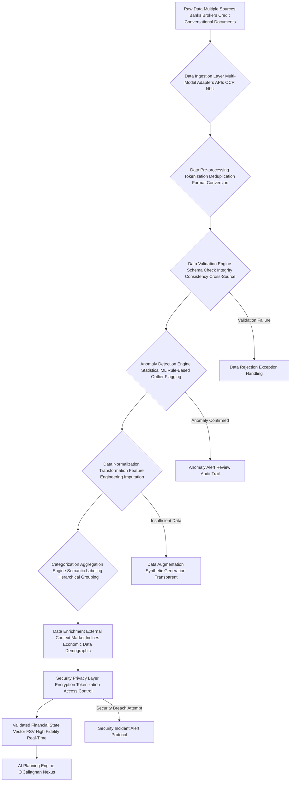

#### Questions and Answers: O'Callaghan's Fortress of Financial Data

**Q11.1: What are "Multi-Modal Adapters" (B) in the Data Ingestion Layer?**
**A11.1:** `Multi-Modal Adapters` are specialized modules designed to process and normalize data from various formats and modalities. For example, an "API adapter" handles structured data streams from banks, an "OCR adapter" extracts text from scanned documents, and an "NLU adapter" interprets natural language from chat or voice. Each adapter transforms disparate inputs into a unified, standardized format, ensuring seamless ingestion into the pipeline. It's the ultimate data universal translator, an O'Callaghan essential.

**Q11.2: How does `CrossSourceReconciliationDelta` (Equation 109.1) enhance data integrity?**
**A11.2:** This equation is crucial for identifying discrepancies when the same piece of information (e.g., bank balance, debt amount) is obtained from multiple sources (e.g., user input, bank API, credit bureau). If the `Delta` exceeds a predefined tolerance, it flags a potential data integrity issue—perhaps a typo, an outdated source, or even an attempted fraud. My system then prioritizes resolving this discrepancy, ensuring the `FSV` is built on a foundation of verifiable truth.

**Q11.3: Explain `MahalanobisDistance` (Equation 110.1) for anomaly detection.**
**A11.3:** While `Z-score` (Equation 110) works for single variables, financial data is highly correlated. `MahalanobisDistance` measures how far a data point is from the center of a distribution, *taking into account the correlations between variables*. For example, a high income and high spending might be normal, but a low income and high spending is an anomaly. `MahalanobisDistance` would identify this multivariate outlier, whereas individual Z-scores might miss it. It's multi-dimensional anomaly detection, a hallmark of O'Callaghan's statistical prowess.

**Q11.4: What is "Isolation Forests" (E) and how does it detect anomalies?**
**A11.4:** `Isolation Forests` are an ensemble machine learning method specifically designed for anomaly detection. Unlike other methods that try to profile normal data, Isolation Forests focus on *isolating* anomalies. Anomalies are "fewer and different," so they are typically isolated closer to the root of a decision tree with shorter average path lengths (Equation 110.2). This method is highly efficient and effective, especially for complex, high-dimensional financial datasets, quickly singling out unusual patterns.

**Q11.5: How does "Feature Engineering" (F) improve the AI's models?**
**A11.5:** `Feature Engineering` involves creating new, meaningful variables (features) from raw data. For example, instead of just raw income, we might create "Income Variability Index," "Income Source Diversification Score," or "Debt Service Coverage Ratio." These engineered features capture underlying patterns and relationships that are not obvious in the raw data, allowing my AI's predictive and optimization models to perform with significantly higher accuracy and interpretability. It's about extracting maximum intelligence from your data.

**Q11.6: What is "Data Enrichment" (H) and why is it important?**
**A11.6:** `Data Enrichment` involves augmenting the user's financial data with external, contextual information. This includes:
    *   **Market Indices:** Current and historical performance of relevant stock indices.
    *   **Economic Data:** Inflation rates, interest rate forecasts, GDP growth projections.
    *   **Demographic Data:** (Anonymized and aggregated) Peer spending habits, average savings rates for similar cohorts.
This external data provides crucial context, allowing the AI to make more informed recommendations that account for the broader economic landscape and peer benchmarks. It's connecting your financial microcosm to the global macrocosm.

**Q11.7: Explain "Tokenization" within the Security and Privacy Layer (I).**
**A11.7:** `Tokenization` is a security technique where sensitive data (e.g., bank account numbers, credit card details) is replaced with a non-sensitive equivalent, a "token." This token has no intrinsic value or meaning outside of the secure system. If a breach occurs, attackers only get useless tokens, not the actual sensitive data. My `Vault` uses advanced tokenization to protect your most private financial information, ensuring maximal security without compromising data utility for analysis.

**Q11.8: What happens during "Security Incident Alert Protocol" (Z4)?**
**A11.8:** If the `Security Privacy Layer` (I) detects a `Security Breach Attempt`, the `Security Incident Alert Protocol` is immediately activated. This triggers a multi-stage response:
    1.  **Isolation:** Potentially compromised systems are isolated.
    2.  **Notification:** Security teams and potentially affected users are alerted.
    3.  **Analysis:** Forensic analysis begins to identify the nature and scope of the breach.
    4.  **Mitigation:** Steps are taken to contain and remediate the breach.
    5.  **Audit:** A full audit trail is generated for regulatory reporting and internal review.
This robust protocol ensures rapid response and minimizes potential damage from any cyber threat.

**Q11.9: How does "External Context" (H) like demographic data get used without violating privacy?**
**A11.9:** `Demographic Data` is used exclusively in an `anonymized and aggregated` fashion. We compare your financial patterns (e.g., spending ratios, savings rates) against large, statistically significant cohorts of users with similar demographic profiles (e.g., age, income bracket, family status), never identifying individuals. This allows the AI to provide valuable "social proof" or highlight areas where you might be an "outlier" (either positively or negatively), informing nudges without ever compromising your privacy.

**Q11.10: What role does "Real-Time" (J) play for the `Validated Financial State Vector FSV`?**
**A11.10:** `Real-Time` means the `FSV` is continuously updated as new financial transactions occur, market data streams in, or user information is provided. This is crucial because financial situations are constantly in flux. A `Real-Time FSV` ensures that my `AI Planning Engine` always operates on the most current and accurate data available, enabling immediate recalibrations and vastly superior responsiveness to opportunities or challenges. Stale data leads to stale advice; O'Callaghan demands absolute currency.

---

## **XII. Interactive Feedback Loop and Continuous Learning: The O'Callaghan Singularity - Learning, Evolving, Perfecting Your Prosperity**

The system is not static; it is designed to perpetually learn, evolve, and improve over infinite temporal cycles through rigorous user interaction, meticulous performance monitoring, and an insatiable algorithmic drive for perfection. This is where my AI achieves true financial sentience.

*   **User Feedback Integration: The O'Callaghan Dialogue:** Direct, multi-modal user input on plan satisfaction, adherence challenges, preference changes, and perceived value. This isn't just a survey; it's a dynamic, adaptive dialogue channel.
    *   Equation 111: `UserSentimentScore = f(NLP_Analysis_Feedback, AdherenceMetrics, GoalProgress)` (A holistic score, capturing user satisfaction and engagement).
    *   Equation 111.1: `FeatureRequestPrioritization = f(NumRequests, ImpactPotential, DevelopmentCost)` (Incorporating user suggestions into system evolution).
        *   *James Burvel O'Callaghan III's Insight:* Your voice is integral. My system listens, learns, and adapts, transforming your feedback into tangible improvements, making you a co-architect of your own financial destiny.

*   **Performance Monitoring: The O'Callaghan Oversight Engine:** Relentless tracking of actual financial progress against plan projections, market benchmarks, and individual action step completion.
    *   Equation 112: `VarianceFromPlan = ActualOutcome - PlannedOutcome` (The raw deviation).
    *   Equation 113: `AdherenceScore_Step_i = f(UserActionReported, TargetMetricAchieved, BehavioralNudgeEffectiveness)` (Evaluating the success of individual steps and nudges).
    *   Equation 113.1: `PortfolioBenchmarkOutperformance = (PortfolioCAGR - BenchmarkCAGR) / BenchmarkCAGR` (Measuring true investment alpha relative to market).
        *   *James Burvel O'Callaghan III's Insight:* We measure everything. Every dollar, every percentage point, every completed step is tracked, providing granular insights into the plan's real-world efficacy.

*   **Model Retraining: The O'Callaghan Self-Improvement Loop:** Aggregated, anonymized performance data, user feedback, and market intelligence are continuously fed back into the AI's underlying machine learning models for iterative refinement and retraining.
    *   Equation 114: `ModelPerformanceImprovement = New_Model_Accuracy - Old_Model_Accuracy` (Quantifying the benefit of retraining).
    *   Equation 114.1: `RetrainingTrigger = Threshold(ModelPerformanceDecay, DataDrift, NewMarketRegime)` (Conditions that necessitate a model retraining cycle).
        *   *James Burvel O'Callaghan III's Insight:* My AI never stops learning. It's a perpetual student, constantly honing its predictive capabilities and optimization algorithms, ensuring it's always operating at the zenith of financial intelligence.

*   **Adaptive Nudging: The O'Callaghan Behavioral Refiner:** Behavioral nudges are dynamically adjusted, personalized, and optimized based on individual user responsiveness, adherence patterns, and psychological profiling.
    *   Equation 115: `NudgeEffectiveness_User_j = P(Adherence_j | Nudge_k) / P(Adherence_j | NoNudge)` (Measuring the causal impact of a specific nudge).
    *   Equation 115.1: `OptimalNudgeSelection = argmax(NudgeEffectiveness_User_j * CostOfNudge)` (Selecting the most impactful and efficient nudge).
        *   *James Burvel O'Callaghan III's Insight:* No two humans are alike. My system understands this, personalizing behavioral interventions with such precision that it feels like a bespoke psychological coach, gently guiding you towards success.

*   **Knowledge Graph Augmentation: The O'Callaghan Semantic Expansion:** New financial concepts, regulations, products, and behavioral insights discovered through learning are continuously integrated into the AI's vast knowledge graph, enriching its semantic understanding of finance.
    *   Equation 115.2: `KnowledgeGraphDensity = NumConnections / (NumNodes * (NumNodes - 1))` (Measuring the richness of inter-concept relationships).
    *   Equation 115.3: `InferencePathEfficiency = f(QueryComplexity, GraphTraversalTime)` (Optimizing the speed of drawing new conclusions).
        *   *James Burvel O'Callaghan III's Insight:* My AI isn't just processing; it's *understanding*. It's building a living, breathing semantic map of the financial world, making it capable of reasoning, not just reacting.

### Interactive Feedback Loop and Continuous Learning: The O'Callaghan Adaptive Singularity

This diagram illustrates how user feedback, performance monitoring, and advanced machine learning contribute to the AI's continuous improvement, a truly intelligent financial ecosystem.

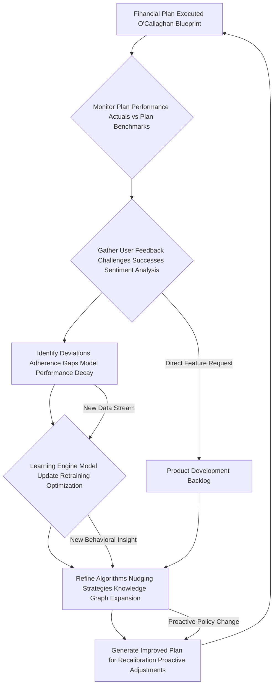

#### Questions and Answers: O'Callaghan's Perpetual Evolution Towards Your Prosperity

**Q12.1: How is the `UserSentimentScore` (Equation 111) derived from "NLP_Analysis_Feedback"?**
**A12.1:** My system uses advanced Natural Language Processing (NLP) techniques to analyze the tone, keywords, and semantic content of user feedback (e.g., chat logs, survey responses). It identifies positive, negative, or neutral sentiment, extracts specific pain points or areas of delight, and quantifies the emotional intensity. This qualitative data is then transformed into a `UserSentimentScore`, providing a crucial human perspective on plan effectiveness and guiding subsequent AI adjustments. It's truly understanding your financial feelings.

**Q12.2: What is `BehavioralNudgeEffectiveness` (Equation 113) and how is it measured?**
**A12.2:** `BehavioralNudgeEffectiveness` measures the causal impact of a specific nudge on user adherence. We employ quasi-experimental designs and A/B testing within anonymized user cohorts to compare adherence rates with and without a specific nudge. Equation 115 (`NudgeEffectiveness_User_j`) formalizes this. If a "commitment device" leads to a 30% higher savings rate for a particular user segment compared to a control group, that nudge is deemed highly effective and its application refined by the `Adaptive Nudging` engine. It's behavioral science in action.

**Q12.3: What constitutes `ModelPerformanceDecay` (Equation 114.1) and why does it trigger retraining?**
**A12.3:** `ModelPerformanceDecay` occurs when the predictive accuracy or optimization efficacy of one of our underlying AI models (e.g., for income forecasting, market prediction, or risk assessment) starts to degrade. This can be caused by `DataDrift` (changes in the characteristics of input data over time) or a `NewMarketRegime` (fundamental shifts in economic conditions). When `ModelPerformanceDecay` exceeds a predefined threshold, it triggers `Retraining` to update the model with fresh data, ensuring its continued relevance and accuracy. My AI is always sharp, never dull.

**Q12.4: How does "DataDrift" (Equation 114.1) impact the AI's learning?**
**A12.4:** `DataDrift` refers to the phenomenon where the statistical properties of input data change over time. For example, if user spending habits fundamentally shift due to a new cultural trend, the AI's previous spending prediction models might become less accurate. Our system continuously monitors for `DataDrift` using statistical tests. If significant drift is detected, it acts as a `RetrainingTrigger`, prompting the AI to update its models with the new data patterns, preventing the models from becoming obsolete.

**Q12.5: Explain `OptimalNudgeSelection` (Equation 115.1) and its "CostOfNudge".**
**A12.5:** `OptimalNudgeSelection` involves a sophisticated trade-off. It aims to select the `OptimalNudge` that has the highest `NudgeEffectiveness` for a given user while also considering the `CostOfNudge`. `CostOfNudge` can be financial (e.g., cost of implementing a personalized SMS reminder system) or psychological (e.g., potential for user fatigue from over-nudging). The AI seeks to maximize the *net benefit* of nudging, ensuring effective intervention without undue burden or expense. It’s intelligent, empathetic influence.

**Q12.6: What is "Knowledge Graph Expansion" (F) and `KnowledgeGraphDensity` (Equation 115.2)?**
**A12.6:** Our AI builds and maintains a vast `Knowledge Graph` – a semantic network of interconnected financial concepts, entities, regulations, products, and behavioral principles. `Knowledge Graph Expansion` means continuously adding new information and relationships (e.g., a new cryptocurrency, a change in tax law, a newly discovered behavioral bias). `KnowledgeGraphDensity` (Equation 115.2) measures how richly interconnected this knowledge is. A denser graph allows the AI to make more sophisticated inferences and draw more insightful conclusions, enhancing its overall "financial understanding."

**Q12.7: How does `InferencePathEfficiency` (Equation 115.3) contribute to the AI's brilliance?**
**A12.7:** `InferencePathEfficiency` measures how quickly the AI can traverse its `Knowledge Graph` to answer a query or draw a conclusion. A more efficient path means the AI can generate explanations faster, identify nuanced relationships more rapidly, and provide real-time insights. By optimizing `InferencePathEfficiency`, we ensure that the AI's vast knowledge is always readily accessible and actionable, contributing to its lightning-fast, brilliant responsiveness. It's the speed of financial thought.

**Q12.8: How does the "Product Development Backlog" (H) get integrated into the feedback loop?**
**A12.8:** When users make `Direct Feature Request`s (C), or if the `Learning Engine` identifies a recurring gap in existing financial products or services, these insights are added to a `Product Development Backlog` (H). This backlog then informs future iterations of the platform or external product recommendations. It ensures that user needs and identified market opportunities are systematically captured and addressed, driving continuous improvement not just of the plan, but of the entire O'Callaghan ecosystem.

**Q12.9: What is the significance of `Anomaly Alert Review Audit Trail` (Z2) in data processing?**
**A12.9:** When the `Anomaly Detection Engine` (E, Section XI) flags something unusual, it doesn't just disappear. If the anomaly is confirmed (Z2), a comprehensive `Review Audit Trail` is generated. This record details the nature of the anomaly, how it was detected, its potential impact on the `FSV`, and the steps taken to address it (e.g., correction, investigation, user query). This ensures full transparency and accountability for every data integrity decision, protecting both the user and the system's reputation.

**Q12.10: Does "Proactive Policy Change" (G) mean the AI can anticipate regulatory changes?**
**A12.10:** Precisely. Using advanced geopolitical and econometric models, combined with natural language processing of legislative proposals and news feeds, my AI actively monitors for impending `Policy Changes` or new `Regulatory Regimes`. If a likely `Proactive Policy Change` (e.g., new tax laws, changes to investment regulations) is predicted, the `Learning Engine` (`F`) will `Generate Improved Plans` (`G`) that proactively adjust strategy to anticipate and capitalize on (or mitigate the impact of) these future changes, rather than waiting for them to take effect. It's anticipating the future to protect your present.