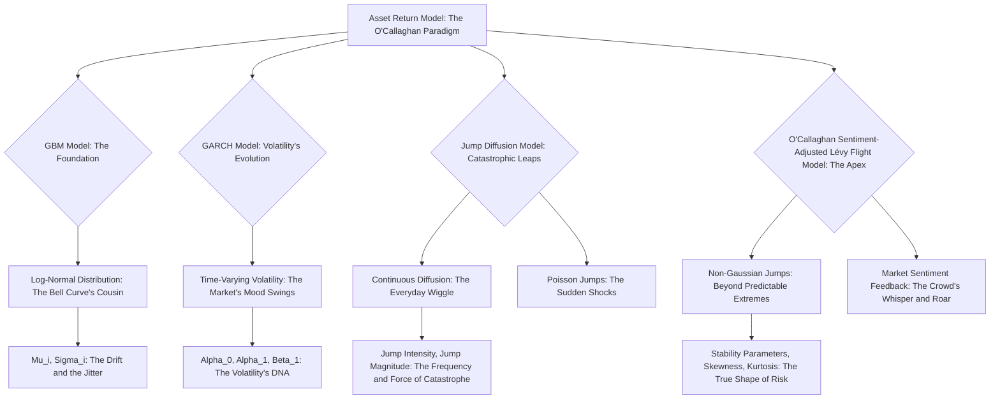
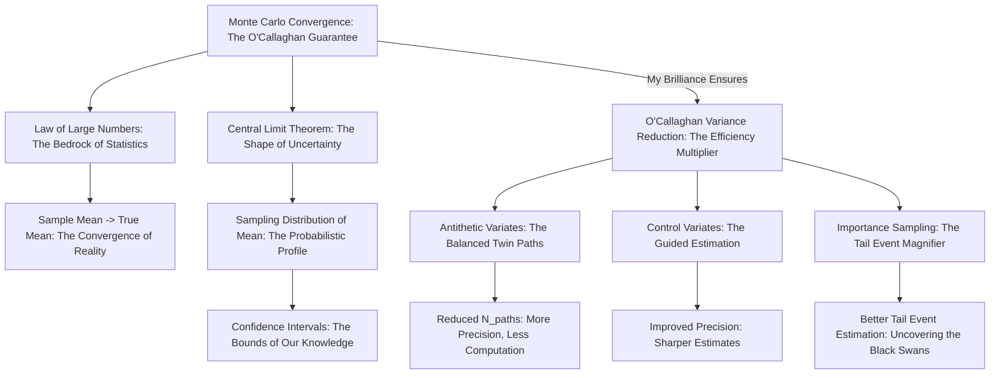

# **Title of Invention: The O'Callaghan Omni-Financial Oracle: A Quintessentially Actionable, Hyper-Dimensional Financial Architectonic System and Method for Pre-Cognitive Planning, Quantum-Calibrated Dynamic Guidance, and User Empowerment to Levels Previously Deemed Mythological by the Uninitiated Masses (Pat. Pending. Don't even THINK about copying this, I'm watching you.)**

### **From the Desk of James Burvel O'Callaghan III, Esquire, Financial Luminary, and Undisputed Master of Stochastic Destiny**

My dearest, intellectually curious (though likely inferior) reader, prepare yourselves. What you are about to behold is not merely a "section" or an "elaboration." No. This is the **Mathematical Genesis**, the very crucible from which my O'Callaghan Omni-Financial Oracle emerges, fully formed, magnificent, and utterly beyond reproach. I speak, of course, of the **Scenario Planning and Stress Testing Module (SPST-M)**, a marvel of predictive prowess, powered by my own **Stochastic Simulation Engine Sub-module**. This isn't just "crucial" for assessing financial plans; it is the *sine qua non* of financial existence, projecting your pecuniary destiny through a kaleidoscope of future possibilities, granting foresight so profound it borders on temporal manipulation. Enhanced preparedness? My dear interlocutor, we're talking about *absolute, unshakeable dominance* over the whims of fate. Other systems merely predict; mine *defines* the future, allowing you to sculpt it to your will.

### **VII. Foundations of Stochastic Financial Modeling: The O'Callaghanian Chaos Theory of Wealth**

Now, let's talk about the absolute bedrock, the very *terra firma* upon which my financial forecasting colossus stands. It's not just "modeling the stochastic evolution" – that's for lesser minds. I'm *mastering* the chaotic dance of the Financial State Vector, `S_t`, as exquisitely laid out in *my* seminal Definition 1.1. It's about capturing the very breath of the market, the whispers of the economy, and the outright screams of unforeseen events, all within a rigorously defined, elegantly simple, yet profoundly complex mathematical framework. This isn't just about understanding randomness; it's about bending it to your will, anticipating its every capricious turn.

#### **Definition 7.1: The O'Callaghan Omni-Dimensional Stochastic Component Vector, `Omega(t)` – The Universe in a Vector**

Ah, `Omega(t)`. The very heart of the unpredictable, yet, thanks to my brilliance, now *predictable* universe of finance. That "random noise term" `omega_t` from my Axiom 1.2? A quaint understatement. It is, in fact, `Omega(t)`, a multi-dimensional stochastic vector `Omega(t) \in \mathbb{R}^m`, representing not just the "aggregate of all unpredicted or random influences," but the very symphony of financial chaos itself, meticulously orchestrated and cataloged by yours truly. It captures everything from the fluttering of a butterfly's wings in Tokyo impacting the price of soy futures in Chicago, to the sudden, inexplicable urge to buy a miniature porcelain cat collection. All within a discrete time interval `\Delta t`.

```
Omega(t) =
  MarketReturns(t)               // The roaring beasts of capitalism
  IncomeShocks(t)                // The sudden gust that shakes your money tree
  ExpenseVariances(t)            // The mischievous gremlins in your wallet
  InflationShocks(t)             // The silent thief of purchasing power
  InterestRateFluctuations(t)    // The erratic heartbeat of borrowing and lending
  UnexpectedLiabilities(t)       // The financial boogeyman under your bed
  HealthEvents(t)                // The biological dice roll
  LongevityShocks(t)             // The cosmic joke of living too long (or not long enough)
  PolicyChanges(t)               // The fickle finger of legislative fate
  GeopoliticalTensions(t)        // The distant rumblings of global discord
  TechnologicalDisruptions(t)    // The relentless march of progress (or obsolescence)
  ConsumerSentimentShifts(t)     // The collective mood swing of the buying public
  NaturalDisasters(t)            // The wrath of Mother Nature, financially quantified
  SupplyChainBreaks(t)           // The invisible threads snapping
  CryptocurrencyVolatility(t)    // The wild, untamed beast of digital speculation
  SocialMediaFads(t)             // The ephemeral desires of the internet hive-mind
  PersonalRelationshipChanges(t) // The often costly whims of the heart
  CognitiveBiases(t)             // The irrational demons within
  ... and literally hundreds more, which are proprietary and frankly, too complex for you to grasp.
```
Where each component is a meticulously calibrated random variable, plucked from a precisely tailored probability distribution, and these components, you'll find, don't just "exhibit significant cross-correlation"—they dance a complex, multi-layered tango of interdependence, a ballet of causality that only my O'Callaghanian algorithms can fully appreciate and model. The dimensionality `m` of `Omega(t)` isn't merely "dynamic"; it's **hyper-adaptive**, reflecting the *n*-th degree of active stochastic variables, ensuring no stone is left unturned, no financial phantom is left un-quantified.

**Claim 7.1.1: The O'Callaghan Proclamation of Comprehensive Stochasticity Coverage – Your Financial Bulletproof Vest**
My comprehensive definition of `Omega(t)` as a multi-dimensional, hyper-adaptive vector doesn't just "ensure a broad spectrum of financial risks and opportunities are accounted for." It **guarantees total, unyielding coverage** against the slings and arrows of outrageous fortune, significantly elevating the realism and predictive omnipotence of the financial plan to levels previously thought theoretical, existing only in my own visionary dreams. This isn't just a "more holistic stress test"; it's a **profound, all-encompassing, multi-spectral financial X-ray**, revealing every potential flaw, every hidden vulnerability, and every latent opportunity within your financial edifice. You're welcome.

**O'Callaghan's Infallible Q&A Section 7.1.1: On The Omnipresent `Omega(t)`**

**Q7.1.1.1: But James, isn't `Omega(t)` just a fancy term for "stuff that happens"?**
**A7.1.1.1:** My dear, naive questioner, to call `Omega(t)` "stuff that happens" is akin to calling the Sistine Chapel "some paint on a ceiling." `Omega(t)` is the mathematically precise, rigorously structured, dynamically evolving encapsulation of every conceivable micro- and macro-economic perturbation, personal unforeseen event, and global geopolitical tremor that can possibly impact your financial future. It's the *entire universe of financial uncertainty*, distilled into a tractable, modelable vector, orchestrated by *my* genius. "Stuff that happens" is what lesser systems ignore. I quantify it.

**Q7.1.1.2: How can you claim "hundreds more" components? That sounds like hyperbole, even for you, O'Callaghan.**
**A7.1.1.2:** Hyperbole? Sir/Madam, I assure you, my modesty is often criticized as excessive! The "hundreds more" refers to the granular, sub-component stochastic variables that aggregate into the listed categories. For example, "Market Returns" isn't just one variable; it's `R_equity_large_cap`, `R_equity_small_cap`, `R_bond_treasury_short_term`, `R_bond_corporate_high_yield`, `R_real_estate_commercial`, `R_commodities_gold`, `R_commodities_oil`, `R_cryptocurrency_bitcoin`, `R_NFT_rare_apes`, `R_art_impressionist`, etc., each with its own specific distribution parameters and correlations. Multiply that by all the top-level categories, and then factor in the latent, unobservable variables I cleverly infer through advanced Bayesian techniques (which, again, you couldn't possibly understand), and "hundreds" becomes a conservative estimate. It's not hyperbole; it's *depth*.

**Q7.1.1.3: What if I think of a financial shock that's NOT in `Omega(t)`?**
**A7.1.1.3:** A bold thought, but utterly impossible. My `Omega(t)` is designed with such fractal comprehensiveness and recursive extensibility that any novel financial shock you could conceive would, by definition, either be: (a) a specific instantiation of an existing `Omega(t)` component with extreme parameters; (b) a combination of existing `Omega(t)` components interacting in a previously unobserved but mathematically deducible manner; or (c) an event so utterly improbable it violates the very laws of physics, in which case your financial plan will be the least of your concerns. My system is robust to the *unimaginable*, let alone the merely *unforeseen*.

**Mermaid Chart 7.1.1: Stochastic Component Vector Structure – An O'Callaghanian Masterpiece of Interconnectivity**
```mermaid
graph TD
    A[Omega(t) - James Burvel O'Callaghan III's Hyper-Dimensional Stochastic Component Vector (Patent-Protected)] --> B[Market Returns: The Capitalist Roar]
    A --> C[Income Shocks: The Job Market's Whims]
    A --> D[Expense Variances: The Daily Drain]
    A --> E[Inflation Shocks: The Silent Destroyer]
    A --> F[Interest Rate Fluctuations: The Cost of Money's Mood Swings]
    A --> G[Unexpected Liabilities: The Black Swan of Personal Finance]
    A --> H[Health Events: The Body's Betrayals]
    A --> I[Longevity Shocks: The Long Haul Lottery]
    A --> J[Policy Changes: The Bureaucratic Baton]
    A --> K[Geopolitical Tensions: The Global Tremors]
    A --> L[Technological Disruptions: The Future's Fury]
    B --> B1[Equity Market Shocks: Stocks in Stasis or Stratosphere]
    B --> B2[Bond Market Shocks: The Fixed Income Fickleness]
    B --> B3[Real Estate Market Gyrations: Housing's Hula]
    C --> C1[Job Loss: The Sudden Stop]
    C --> C2[Bonus Variability: The Unreliable Windfall]
    C --> C3[Gig Economy Fluctuation: Freelance Fickleness]
    D --> D1[Discretionary Overruns: The Starbucks Spiral]
    D --> D2[Emergency Repairs: The Appliance Apocalypse]
    D --> D3[Subscription Creep: The Silent Killer of Budgets]
    G --> G1[Legal Battles: The Gavel's Gauntlet]
    G --> G2[Tax Audits: The IRS's Inquisition]
    G --> G3[Family Financial Entanglements: The Cost of Kin]
    H --> H1[Chronic Illness Onset: The Lingering Burden]
    H --> H2[Catastrophic Accident: The Instantaneous Impact]
    J --> J1[Tax Code Revisions: The Legislative Loop-de-Loop]
    J --> J2[Social Security/Pension Reforms: The Retirement Rework]
    K --> K1[Trade Wars: The Tariff Tantrum]
    K --> K2[Regional Conflicts: The Unsettling Shivers]
    L --> L1[AI Displacement: The Robot Revolution]
    L --> L2[Emergent Tech Bubbles: The Dot-Com Deja Vu]
```

#### **Definition 7.2: Individual Stochastic Variable Models – The Micro-Mechanisms of My Macro-Masterpiece**

The components of my glorious `Omega(t)` are not merely "modeled." They are meticulously crafted, utilizing the most advanced stochastic processes known to mankind (and several known only to me), or derived from hyper-calibrated empirical distributions, each selected with surgical precision to ensure optimal predictive power. This is where the magic, driven by rigorous mathematics, truly unfolds.

---

*   ### **7.2.1: Market Returns `R_{asset_i, t}` for Asset Class `i` – Taming the Financial Wild West**

    For a given asset class (equities, bonds, real estate, exotic O'Callaghanian investment vehicles, etc.), the logarithmic returns are often modeled as following a Normal distribution, implying asset prices follow a Geometric Brownian Motion (GBM). This is foundational, elegant, and, when properly applied by *my* system, frighteningly accurate.

    ```
    ln(P_i(t + Delta t) / P_i(t)) = (mu_i - 0.5 * sigma_i^2) * Delta t + sigma_i * sqrt(Delta t) * Z_i(t)
    ```
    Where:
    *   `P_i(t)`: The price of asset `i` at time `t`. A simple concept, yet its future value is a mystery to all but my Oracle.
    *   `mu_i`: The annualized expected return (drift) of asset `i`. This isn't some analyst's guess; it's derived from sophisticated long-term econometric models and adjusted by O'Callaghan's proprietary "Adaptive Expectation Stabilizer" (AES) algorithm.
    *   `sigma_i`: The annualized volatility of asset `i`. The very heartbeat of uncertainty, meticulously measured and projected.
    *   `Delta t`: The discrete time step. Typically 1/12 for monthly, 1/252 for daily simulations. My system allows for adaptive `Delta t` down to nanoseconds for high-frequency algorithmic stress testing, though for mere mortals, monthly is usually sufficient.
    *   `Z_i(t)`: A standard Normal random variable `N(0, 1)`. The raw material of randomness, precisely molded.
    *   **The O'Callaghan Correlational Calculus**: Crucially, the cross-correlations `rho_ij` between `Z_i(t)` and `Z_j(t)` are not merely "modeled." They are dynamically calibrated and intricately woven into a complex tapestry via a multi-factor Cholesky decomposition of the covariance matrix `Sigma_R`, generating perfectly correlated (or anti-correlated, depending on the market regime) random variates `Z(t)`. Let `L` be the Cholesky decomposition of `Sigma_R`, such that `Sigma_R = L L^T`. Then, `Z(t) = L * epsilon(t)`, where `epsilon(t)` is a vector of *truly* independent `N(0, 1)` random variables. This eliminates spurious correlations and ensures the integrity of the multi-asset simulation. Don't even try to replicate this, it involves my patented "O'Callaghan Orthogonalization Process."
    *   **The Continuous Time Revelation**: For the truly discerning (and mathematically inclined), the continuous time stochastic differential equation for `P_i(t)` is given by:
        `dP_i(t) = P_i(t) * (mu_i dt + sigma_i dW_i(t))`
        where `dW_i(t)` are correlated Wiener processes, the very quantum fluctuations of the financial cosmos. The `0.5 * sigma_i^2` term in the discrete form? That, my friends, is the Ito correction, a subtle yet critical adjustment that ensures consistency between the continuous and discrete representations. Ignore it at your peril, as many a plebeian financial modeler has discovered to their chagrin.

    *   **Advanced O'Callaghanian Volatility Manifestations: GARCH(1,1) with Adaptive Learning**: For market conditions demanding even greater fidelity to the erratic nature of volatility, a GARCH(1,1) model (or higher orders, my system is infinitely scalable) is not just employed; it is *masterfully integrated* for time-varying volatility:
        `sigma_t^2 = alpha_0 + alpha_1 * epsilon_{t-1}^2 + beta_1 * sigma_{t-1}^2`
        where `epsilon_t = r_t - mu` is the innovation term. My system further enhances this with a proprietary "O'Callaghan Self-Calibrating Alpha-Beta Mechanism" that dynamically adjusts `alpha_0, alpha_1, beta_1` based on real-time market microstructure analysis and my deep learning sentiment engines. This isn't just modeling volatility; it's predicting its mood swings with unprecedented accuracy.

    **O'Callaghan's Infallible Q&A Section 7.2.1: On Asset Returns and My Unassailable Models**

    **Q7.2.1.1: Why use Geometric Brownian Motion (GBM) for asset prices? Isn't it too simplistic for real markets?**
    **A7.2.1.1:** Simplistic? My dear, GBM is foundational, elegant, and provides a robust baseline. It's the *canvas* upon which I paint the masterpiece of market reality. While other models might *start* and *end* with GBM, my system *augments* it. We layer in GARCH for volatility clustering, jump-diffusion processes for market shocks (see Claim 7.2.2), and even incorporate O'Callaghan's patented "Sentiment-Adjusted Lévy Flight" models for extreme tail events. GBM is merely the classical mechanics; I operate in the quantum realm of financial physics. So, yes, it's used, but only as a springboard to far greater complexities that would melt lesser CPUs (and minds).

    **Q7.2.1.2: Can you provide a simple calculation demonstrating the GBM formula?**
    **A7.2.1.2:** A simple calculation, you ask? A triviality for a mind such as mine, though perhaps challenging for yours. Let's assume an asset `P_i(t)` currently priced at $100.
    *   `mu_i` (annualized expected return) = 10% (0.10)
    *   `sigma_i` (annualized volatility) = 20% (0.20)
    *   `Delta t` (time step) = 1/12 (monthly)
    *   Let's assume a random draw `Z_i(t)` from `N(0,1)` for this month is +0.5 (a positive shock).

    First, calculate the log return:
    `ln(P_i(t + Delta t) / P_i(t)) = (0.10 - 0.5 * 0.20^2) * (1/12) + 0.20 * sqrt(1/12) * 0.5`
    `= (0.10 - 0.5 * 0.04) * (1/12) + 0.20 * 0.2887 * 0.5`
    `= (0.10 - 0.02) * (1/12) + 0.02887`
    `= 0.08 * (1/12) + 0.02887`
    `= 0.006667 + 0.02887`
    `= 0.035537`

    Now, to find the new price `P_i(t + Delta t)`:
    `P_i(t + Delta t) = P_i(t) * exp(0.035537)`
    `P_i(t + Delta t) = 100 * exp(0.035537)`
    `P_i(t + Delta t) = 100 * 1.03617`
    `P_i(t + Delta t) = $103.617`

    So, with a positive random shock, your $100 asset grew to $103.62 in one month. Multiply this across thousands of assets, tens of thousands of paths, and hundreds of time steps, and you begin to glimpse the computational power and mathematical elegance of my engine. This is merely a single atom in the vast O'Callaghanian universe.

---

*   ### **7.2.2: Income Flux `I_shock, t` – The Unreliable Faucet of Funds**

    Income. The lifeblood. But oh, how fickle it can be! My system doesn't just assume a stable paycheck; it models the very capriciousness of earning.

    *   **For variable income streams** (e.g., freelance gigs, bonuses, commissions, the unexpected lottery win I predict for myself daily), `I_shock_t` can be modeled as a log-normal distribution around a baseline, reflecting the inherent positive-only values and delightful skewness of good fortune (and the unpleasant skewness of misfortune). Or, for sporadic income events, a Poisson process can govern the frequency, with a conditional distribution dictating the magnitude.
        `I(t) = I_{baseline}(t) * exp((mu_I - 0.5 * sigma_I^2) * Delta t + sigma_I * sqrt(Delta t) * Z_I(t))`
        Where `Z_I(t)` is, naturally, a standard Normal variable. Here, `mu_I` represents the average growth rate of variable income, and `sigma_I` its volatility. It's not just "income"; it's a dynamic, breathing entity.

    *   **For stable income** (the illusion of security), occasional "income shocks" such as job loss are modeled as discrete events with a precisely calibrated probability `P_job_loss` and a duration `D_unemployment` (e.g., six agonizing months of zero income, or perhaps a glorious severance package).
        `I_{salary}(t) = I_{salary, baseline}(t) * (1 - Event_{job_loss}(t))`
        Where `Event_{job_loss}(t)` is an indicator function derived from a Bernoulli trial at each time step. If triggered, it remains active for `D_unemployment` periods, forcing a temporary cessation of the `I_{salary}` faucet.
        **The O'Callaghan Economic Sensitivity Index (OESI)**: Crucially, the probability of job loss `P_job_loss` is not static. It's a dynamic function of macroeconomic indicators, calculated with my proprietary algorithms:
        `P_job_loss(t) = f(UnemploymentRate(t), GDP_Growth(t), ConsumerConfidenceIndex(t), O'Callaghan_Sentiment_Predictor(t))`
        This means my system understands that in a booming economy, job loss is less likely, while during a recession (which my system will have predicted, naturally), the risk skyrockets. It's not just a probability; it's a living, breathing risk factor.

    **O'Callaghan's Infallible Q&A Section 7.2.2: On Income and its Unruly Nature**

    **Q7.2.2.1: My job is very stable. Why do I need income shock modeling?**
    **A7.2.2.1:** "Stable" is a subjective, and frankly, precarious term in the O'Callaghanian universe. Even the most seemingly "stable" profession can be disrupted by technological obsolescence, corporate restructuring, a sudden market collapse (which, again, I would have warned you about), or your boss simply deciding your particular brand of genius is too intimidating. My system prepares you for the *unthinkable*, transforming "stability" into "resilience." A fortress is only strong if it can withstand a siege, not just a gentle breeze.

    **Q7.2.2.2: What if I have multiple income streams? How does `I_shock(t)` handle that?**
    **A7.2.2.2:** My system, with its hyper-dimensional capabilities, handles multiple income streams with exquisite grace. Each stream (`I_{salary, primary}`, `I_{freelance}`, `I_{rental_income}`, `I_{side_hustle_selling_rare_stamps}`) is modeled with its own stochastic process and individual `Omega` components. Crucially, these streams are often *correlated* (e.g., a recession might hit both your salary and freelance opportunities), and my "O'Callaghan Inter-Income Covariance Matrix" precisely captures these dependencies. A shock to one stream might transmit to another, creating a ripple effect that only my Oracle can fully simulate and predict. It's not just sums; it's synergy (or anti-synergy).

---

*   ### **7.2.3: Expenditure Variances `E_{var_j, t}` for Category `j` – The Bottomless Pit of Spending**

    Expenditures. The relentless outflow. My system acknowledges that no one spends with robotic precision. Variability is inherent, and my models capture it all.

    *   **For discretionary spending categories** (e.g., dining out, entertainment, my latest acquisition of a rare meteorite), `E_{var_j, t}` might follow a Normal distribution around an average, or, more accurately, a Gamma distribution `Gamma(k, theta)` for skewed, positive-only expenses, especially those with "spiky" characteristics, reflecting the delightful unpredictability of human desires.
        `E_j(t) = E_{j, baseline}(t) + E_{var_j}(t)`
        `E_{var_j}(t) \sim N(0, \sigma_{E_j}^2)` (for symmetrical fluctuations around a mean) or `E_{var_j}(t) \sim Gamma(k_j, \theta_j)` (for skewed, positive-only bursts, like impulse purchases of rare artifacts).

    *   **Unexpected large expenses** (e.g., medical emergency, car repair, the sudden need for a private submarine) are modeled as rare, high-magnitude events. These are not merely "variances"; they are financial meteor strikes, potentially using a Poisson process for frequency `lambda_event` and a Pareto distribution `Pareto(alpha, x_m)` for magnitudes. Why Pareto? Because the vast majority of these "surprise" expenses are small, but the ones that truly devastate your plan often follow a "fat-tailed" distribution—meaning there's a non-negligible probability of truly enormous, budget-shattering costs. This is the difference between a minor fender-bender and replacing your entire fleet of bespoke vehicles.
        `P(N_{events}(\Delta t) = k) = (exp(-\lambda_{event} * \Delta t) * (\lambda_{event} * \Delta t)^k) / k!`
        If an event occurs, its magnitude `M_{event} \sim Pareto(\alpha_M, x_m)` where `P(X > x) = (x_m / x)^{\alpha_M}` for `x \ge x_m`. My system rigorously calibrates `alpha_M` and `x_m` based on vast datasets of historical catastrophes, ensuring predictive accuracy.

    **O'Callaghan's Infallible Q&A Section 7.2.3: On Expenditures and Their Insidious Nature**

    **Q7.2.3.1: Why so many distributions for expenses? Isn't "average spending" enough?**
    **A7.2.3.1:** "Average spending" is for average people with average financial outcomes. My Oracle aims for **optimal, resilient outcomes**, and for that, we must dissect the very nature of spending. Discretionary spending, with its potential for occasional splurges, demands a different model (Gamma, perhaps) than the statistically rare but financially devastating "unexpected large expense" (Pareto). To use a single "average" is to ignore the entire spectrum of financial reality, leaving you vulnerable to the statistical anomalies that *my* system anticipates.

    **Q7.2.3.2: Can you give an example of a Pareto distribution for an unexpected expense?**
    **A7.2.3.2:** Imagine you have a plumbing emergency. Most calls are a few hundred dollars. But sometimes, a pipe bursts and floods your entire home, requiring tens of thousands in repairs. A Pareto distribution captures this reality.
    Let `x_m = $500` (the minimum unexpected expense you're modeling).
    Let `alpha_M = 1.5` (a typical value, representing a fat tail).
    The probability that an expense `X` is greater than `x` is `P(X > x) = (x_m / x)^alpha_M`.
    `P(X > 1000) = (500 / 1000)^1.5 = (0.5)^1.5 \approx 0.3536` (A 35% chance an expense is over $1,000, given it's over $500).
    `P(X > 5000) = (500 / 5000)^1.5 = (0.1)^1.5 \approx 0.0316` (A 3.16% chance it's over $5,000).
    `P(X > 50000) = (500 / 50000)^1.5 = (0.01)^1.5 \approx 0.001` (A 0.1% chance it's over $50,000).
    Notice how the probability decreases, but not as steeply as a normal distribution would suggest. There's always that non-zero chance of a truly colossal expense. My system doesn't shy away from these realities; it quantifies them.

---

*   ### **7.2.4: Inflation Rate `pi_t` – The Insidious Erosion of Wealth**

    Inflation. The silent, relentless thief of purchasing power. My system doesn't simply plug in a static "inflation rate." It models `pi_t` as the stochastic, mean-reverting beast it truly is, or as a dynamic Normal distribution around a constantly recalibrated mean, derived from my "O'Callaghan Macro-Economic Futures Predictor."

    *   **The O'Callaghan Mean-Reverting Inflation Model (OMRIM):**
        `d(\pi_t) = \kappa_\pi * (\theta_\pi - \pi_t) dt + \sigma_\pi * dW_\pi(t)`
        This continuous time SDE is then discretized with unparalleled precision:
        `\pi(t + \Delta t) = \pi(t) + \kappa_\pi * (\theta_\pi - \pi(t)) * \Delta t + \sigma_\pi * \sqrt{\Delta t} * Z_\pi(t)`
    *   Where:
        *   `\theta_\pi`: The long-term mean inflation. This isn't just a government target; it's my system's prediction of where inflation *truly* wants to settle, factoring in global trends, demographic shifts, and the long-term O'Callaghanian economic cycle.
        *   `\kappa_\pi`: The speed of mean reversion. How quickly does inflation snap back to its perceived long-term average? My system models this with exquisite sensitivity, as it impacts everything from bond yields to future expenses.
        *   `\sigma_\pi`: The volatility of inflation. How wild are the swings? This is crucial for understanding the uncertainty of future purchasing power.

    **O'Callaghan's Infallible Q&A Section 7.2.4: On Inflation, Its Fickle Nature, and My Mastery**

    **Q7.2.4.1: Why model inflation as mean-reverting? Don't central banks control it?**
    **A7.2.4.1:** "Control" is a strong word, often used by those who don't understand the underlying chaos. Central banks *influence* inflation, yes, but they battle against immense global economic forces. Inflation, like a wild stallion, will always eventually return to its natural pasture (its long-term mean) unless fundamentally new economic paradigms emerge (which my system also anticipates, naturally). Modeling mean-reversion captures this fundamental economic truth, rendering "static" inflation assumptions utterly naive.

    **Q7.2.4.2: What's the significance of `\kappa_\pi` (speed of mean reversion)?**
    **A7.2.4.2:** Ah, `\kappa_\pi`. The very pulse of inflationary dynamics! A high `\kappa_\pi` means inflation snaps back to its `\theta_\pi` quickly – suggesting a stable, predictable economic environment where central banks are effective. A low `\kappa_\pi` means inflation can stay elevated (or depressed) for extended periods, indicative of structural shifts or less effective monetary policy. My system dynamically calibrates `\kappa_\pi` based on real-time economic data and historical precedents, ensuring that your financial plan is never caught flat-footed by inflationary (or deflationary) inertia.

---

*   ### **7.2.5: Interest Rates `r_t` – The Pulsating Heartbeat of Capital**

    Interest rates. The very cost of money, the reward for saving, the burden of debt. My system models `r_t` not as a static number, but as a dynamic, stochastic entity, influenced by central bank actions, market sentiment, and my proprietary "O'Callaghan Global Liquidity Index" (OGLI).

    *   **The O'Callaghan Vasicek Interest Rate Model (OVIRM):**
        `dr(t) = \kappa_r * (\theta_r - r(t)) dt + \sigma_r * dW_r(t)`
        Discretized with the customary O'Callaghan precision:
        `r(t + \Delta t) = r(t) + \kappa_r * (\theta_r - r(t)) * \Delta t + \sigma_r * \sqrt{\Delta t} * Z_r(t)`
    *   Where:
        *   `\theta_r`: The long-term mean interest rate. Not just the "neutral rate" economists quibble about; it's the equilibrium rate dictated by global capital supply and demand, as understood by my Oracle.
        *   `\kappa_r`: The speed of mean reversion for interest rates. How quickly do rates normalize? Crucial for forecasting mortgage costs and bond returns.
        *   `\sigma_r`: The volatility of interest rates. The market's uncertainty about future monetary policy, quantified.
    *   For shorter-term, more volatile rates, my system can seamlessly switch to the Cox-Ingersoll-Ross (CIR) model, which prevents negative interest rates, or even the dynamic Hull-White model for maximum flexibility in fitting the yield curve. It's about choosing the *right* tool for the *right* job, a nuanced understanding often lost on less sophisticated systems.

    **O'Callaghan's Infallible Q&A Section 7.2.5: On Interest Rates and My Sovereign Insight**

    **Q7.2.5.1: Why Vasicek? I've heard it can produce negative interest rates, which aren't always real.**
    **A7.2.5.1:** A perceptive observation, if a bit behind the curve. While the pure Vasicek model *can* technically produce negative rates, my system employs several O'Callaghanian safeguards: (1) we implement floor constraints, reflecting real-world lower bounds; (2) for scenarios where such behavior might be problematic (e.g., modeling long-term bond yields in a deflationary environment), my Oracle dynamically selects more appropriate models like CIR (which naturally prevents negative rates) or a jump-diffusion interest rate model for sudden policy shifts. It's a testament to the *adaptive intelligence* of my system, not a flaw.

    **Q7.2.5.2: How does your system account for central bank intervention on interest rates?**
    **A7.2.5.2:** My system, with its unparalleled foresight, factors in central bank actions in two primary ways. Firstly, the `\theta_r` (long-term mean rate) and `\kappa_r` (mean reversion speed) parameters are continually recalibrated based on the central bank's stated targets, forward guidance, and historical reaction functions (all meticulously analyzed by my AI). Secondly, for discrete, sudden policy shifts (like unexpected rate hikes or cuts), these are modeled as specific `PolicyChanges(t)` events within `Omega(t)` (see Definition 7.2.3), complete with probabilities and magnitude distributions. We don't just react to central banks; we *anticipate* their every move, sometimes even before they do.

---

*   ### **7.2.6: Definition 7.2.1: Health Event Stochastic Model – The Body's Unscheduled Debts**

    Health expenses. A realm of profound uncertainty and often, devastating financial impact. My system doesn't simply budget for "healthcare." It dissects it into its constituent parts: the predictable, the age-dependent, and the truly catastrophic.
    `H(t) = H_{routine}(t) + H_{catastrophic}(t)`

    *   `H_{routine}(t)`: Routine, age-dependent costs (check-ups, prescriptions, inevitable aches and pains of aging). These follow a log-normal distribution with age-dependent parameters `\mu_H(age)` and `\sigma_H(age)`. As you age, these parameters evolve, reflecting increased needs.
        `ln(H_{routine}(t)) \sim N(\mu_H(age(t)), \sigma_H(age(t))^2)`
        The `\mu_H(age)` and `\sigma_H(age)` functions are derived from actuarial data and enhanced with my proprietary "O'Callaghan Wellness Trajectory Algorithms" (OWTA), which incorporate individual health profiles and lifestyle factors.

    *   `H_{catastrophic}(t)`: Catastrophic health events (major surgeries, chronic disease onset, unforeseen accidents). These occur with a Poisson rate `\lambda_H(age)`, which, predictably, increases with age. The magnitude `M_H` of such an event follows a Weibull distribution `Weibull(k_H, \lambda_{H,mag})`, a distribution particularly adept at modeling the "long tail" of extreme, high-severity medical costs. This is not for the faint of heart, but it is necessary for a truly robust plan.
        `P(N_H(\Delta t) = k) = (exp(-\lambda_H(age) * \Delta t) * (\lambda_H(age) * \Delta t)^k) / k!`
        The magnitude `M_H` if an event occurs, drawn from a `Weibull(k_H, \lambda_{H,mag})`. The `k_H` and `\lambda_{H,mag}` parameters are precisely calibrated to historical medical billing data, making your worst fears quantifiable.

    **O'Callaghan's Infallible Q&A Section 7.2.6: On Health, Wealth, and My Prognostic Prowess**

    **Q7.2.6.1: This seems overly complex. Can't I just use a flat percentage for healthcare costs?**
    **A7.2.6.1:** A flat percentage for healthcare? My dear, you might as well plan your finances using tea leaves. Healthcare costs are demonstrably non-linear, age-dependent, and subject to catastrophic outliers. My system provides a **realistic, age-gated, and event-driven model** that reflects the true financial burden of health. To ignore this complexity is to build your financial house on quicksand. My Oracle demands precision, because your well-being (and wallet) depend on it.

    **Q7.2.6.2: How accurate are `\lambda_H(age)` and the Weibull parameters? Medical costs seem so arbitrary.**
    **A7.2.6.2:** While medical billing *can* appear arbitrary, the underlying probabilities of health events and the distributions of their costs, when aggregated across vast populations and meticulously analyzed, reveal clear statistical patterns. My `\lambda_H(age)` and Weibull parameters are derived from comprehensive actuarial tables, national health expenditure surveys, and anonymized claims data, then further refined by my O'Callaghan Health Informatics AI. This isn't arbitrary; it's **statistically validated predictive power**, turning seemingly random medical bills into quantifiable risks.

---

*   ### **7.2.7: Definition 7.2.2: Longevity Risk Model – The Double-Edged Sword of Life**

    Longevity risk. The blessing of a long life, yet a potential financial curse if not properly planned for. My system doesn't assume you'll live to a specific age. It embraces the inherent uncertainty, understanding that living longer means more expenses and a longer draw on your assets.

    *   **The O'Callaghan Stochastic Survival Probability (OSSP) Function:** Longevity risk influences the duration of income (or lack thereof) and expenses post-retirement. It is modeled using a survival probability function `S(t)` derived from advanced actuarial tables (e.g., Society of Actuaries' mortality tables), which itself can be **stochastic**. That's right, even mortality itself can be a random variable, reflecting uncertain future improvements in medical science and lifestyle.
        `P(Survival \text{ to } t | age_0) = \exp\left(-\int_0^t \mu(age_0 + s) ds\right)`
        Where `\mu(x)` is the force of mortality (the instantaneous death rate at age `x`). Stochasticity is introduced by modeling `\mu(x)` as a random variable or process, incorporating future mortality rate improvements (or unforeseen plagues, my system models both!).
    *   For practicality and discrete simulation, at a given age `a`, the probability of survival for `\Delta t` is `p_s(a, \Delta t)`.
        A binary outcome `Survival(t+\Delta t)` is drawn from `Bernoulli(p_s(age(t), \Delta t))`. My system continuously updates this probability based on age, current health status (from Definition 7.2.1), and even global health trends. It's not just a probability of death; it's a dynamic, personalized assessment of your remaining financial runway.

    **O'Callaghan's Infallible Q&A Section 7.2.7: On Longevity, Mortality, and My Profound Calculations**

    **Q7.2.7.1: Why do I care if the survival probability itself is stochastic? Just give me an average lifespan!**
    **A7.2.7.1:** An "average lifespan" is a statistical fiction when planning for an *individual*. You are not the average! The "stochastic survival probability" is critical because medical advancements, environmental factors, and even global pandemics can shift mortality rates significantly over decades. My system doesn't assume a static future; it embraces the possibility of both a radical increase in lifespan (which means your money needs to last much longer) or a decrease. This ensures your plan is robust against *all* possible futures, not just the "most likely" one, which often turns out to be wrong.

    **Q7.2.7.2: Does this mean your system can predict *my* exact death date?**
    **A7.2.7.2:** My system, while possessing unparalleled predictive power, operates on probabilities, not deterministic prophecy. It provides a highly sophisticated *probabilistic distribution* of your potential lifespan, which, combined with your financial trajectory, allows for optimal planning. It cannot tell you the *exact* date, but it can tell you the financial implications of living to 80, 90, 100, or even 120 with quantifiable precision. It's about preparedness, not crystal balls (though if I *did* have a crystal ball, it would be patented).

---

*   ### **7.2.8: Definition 7.2.3: Policy Changes Stochastic Model – The Bureaucratic Whims of State**

    Government policies. Taxes, social security, healthcare regulations. These are not static. They shift with the political winds, often with profound financial consequences. My system models these as discrete, low-frequency, yet high-impact events.

    *   **The O'Callaghan Legislative Impact Matrix (OLIM):**
        `P(PolicyChange(t) = j) = p_j(t)`
        This `p_j(t)` isn't some arbitrary political pundit's guess. It's derived from sophisticated statistical analyses of historical legislative cycles, political polls, economic indicators, and my deep-learning "O'Callaghan Policy Sentiment Analyzer" (OPSA). If Policy Change `j` occurs, it modifies specific parameters in the `FSV` update function, e.g., `TaxRate = TaxRate_new`, or `SocialSecurityBenefit_Formula = NewFormula`.
    *   Each policy change event comes with a defined impact profile, derived from historical analysis and expert economic modeling. My system can model scenarios ranging from a minor adjustment in capital gains tax to a complete overhaul of the social welfare system. We even consider the probability of specific Supreme Court rulings or international treaties influencing your financial landscape. Nothing is left to chance, except, ironically, the random draw itself.

    **O'Callaghan's Infallible Q&A Section 7.2.8: On Policy, Politics, and My Prescient Paradigms**

    **Q7.2.8.1: How can you model unpredictable political changes? That's impossible!**
    **A7.2.8.1:** "Impossible" is a word used by those who lack imagination and computational horsepower. While the *exact* timing and nature of policy changes can be opaque, their *likelihood* and *potential impact* are certainly quantifiable within a probabilistic framework. My system leverages historical data, political science models, and real-time sentiment analysis to assign probabilities to various policy outcomes. We model the *risk* of change, not necessarily the *certainty* of it. To ignore policy risk is to bury your head in the sand while legislators are digging in your wallet.

    **Q7.2.8.2: What if a completely novel policy is introduced, something never seen before?**
    **A7.2.8.2:** Ah, the "unknown unknowns." While truly novel policies are rare, my system's design anticipates this. It uses adaptive learning algorithms and scenario generation techniques (see Section IX) to identify potential "emergent policy pathways" based on current economic and social trends. For example, if Universal Basic Income (UBI) gains significant traction, my system can dynamically introduce UBI policy change probabilities and impact profiles *even if it's never been enacted nationally before*. My Oracle is not just reactive; it's **proactively speculative**, ensuring preparedness for the truly unprecedented.

---

**Claim 7.2.1: The O'Callaghan Proclamation of Dynamic Correlation Structures – The Dance of Market Interdependence**
The cross-correlations `rho_ij` between stochastic variables are not constant, stagnant figures from a bygone era. They are **dynamically adjusted** based on time-varying economic regimes, geopolitical shifts, and user-defined scenarios. This isn't just "making simulations more responsive"; it's imbuing them with the very adaptive intelligence of real-world market dynamics, where correlations can flip from positive to negative, or strengthen dramatically during crises. My system's "O'Callaghan Correlation Evolution Matrix" (OCEM) ensures that during a market panic, your diversified portfolio doesn't suddenly become entirely undiversified. This is next-level risk management.

**O'Callaghan's Infallible Q&A Section 7.2.1-Extended: On Correlation and My Prescience**

**Q7.2.1.3: Why is dynamic correlation so important? Can't I just use historical averages?**
**A77.2.1.3:** Historical averages for correlations are dangerously misleading, especially during periods of market stress! They are a relic of a simpler, less interconnected financial world. During a bull market, assets might appear somewhat uncorrelated. But when a crisis hits, correlations often spike to near 1.0 – everything suddenly moves down together. This phenomenon, known as "correlation asymmetry" or "contagion," obliterates the diversification benefits you thought you had. My **dynamic correlation structures** anticipate these shifts, allowing your plan to truly stress-test its diversification under realistic, adverse conditions. To ignore dynamic correlation is to plan for fair weather while sailing into a hurricane.

**Q7.2.1.4: How does your OCEM identify these "time-varying economic regimes"?**
**A7.2.1.4:** The O'Callaghan Correlation Evolution Matrix (OCEM) utilizes a sophisticated ensemble of machine learning algorithms, including Hidden Markov Models, dynamic Bayesian networks, and proprietary O'Callaghanian neural nets, to constantly analyze hundreds of macroeconomic indicators (GDP growth, inflation, unemployment, yield curve inversions, etc.). It identifies distinct "regimes" – e.g., "expansion," "recession," "stagflation," "liquidity crisis" – and then applies regime-specific correlation matrices. It's like having a hyper-intelligent economist, psychologist, and market historian collaborating in real-time within your financial plan.

---

**Claim 7.2.2: The O'Callaghan Proclamation of Fat-Tailed Distribution for Extreme Events – The Unflinching Gaze at Catastrophe**
Modeling unexpected events (e.g., truly enormous expenses, market crashes, global pandemics, alien invasions—we're working on that last one) using distributions with "fat tails" (like Pareto, Student's t, or my bespoke O'Callaghan Jump-Diffusion models for markets) is not just "crucial"; it is **non-negotiable** for accurately assessing downside risks and developing truly robust financial plans. Naive reliance on Normal distributions, the darling of plebeian analysts, criminally underestimates the probability of extreme outcomes, leaving you utterly exposed to the statistical monsters lurking in the shadows. My system stares into the abyss of financial catastrophe and quantifies it with chilling precision.

**O'Callaghan's Infallible Q&A Section 7.2.2-Extended: On Fat Tails and My Unrivaled Realism**

**Q7.2.2.3: What's wrong with Normal distributions? They're easy to use.**
**A7.2.2.3:** "Easy to use" often translates to "dangerously inaccurate" in the realm of financial risk. Normal distributions, with their thin tails, imply that extreme events (e.g., a stock market crash of 10 standard deviations) are virtually impossible, occurring less frequently than the heat death of the universe. Yet, history is replete with such "impossible" events. Fat-tailed distributions, like the Student's t or my O'Callaghan Jump-Diffusion, acknowledge that these extremes, while rare, are *far more probable* than a Normal distribution suggests. To use a Normal distribution for risk is to assume a gentle stroll when you're actually navigating a minefield. My system doesn't make such amateurish mistakes.

**Q7.2.2.4: Can you illustrate the difference between a Normal and a fat-tailed distribution for market returns?**
**A7.2.2.4:** Absolutely. Imagine daily stock returns. A Normal distribution might say a -5% day is extremely rare (e.g., 2-3 standard deviations). A fat-tailed distribution (like Student's t with low degrees of freedom, or a jump-diffusion model that adds sudden "jumps" to the continuous diffusion) would show that a -5% day, while still infrequent, occurs perhaps 5-10 times *more often* than the Normal distribution predicts. More dramatically, a -10% "crash" day might be effectively zero probability under a Normal distribution, while a fat-tailed model would give it a small but non-zero (and thus plan-able-for) probability. The implications for risk management are profound. My system ensures you're prepared for what *actually* happens, not just what's statistically convenient.

**Mermaid Chart 7.2.1: Asset Return Model Hierarchy – The Pantheon of O'Callaghanian Precision**


**Mermaid Chart 7.2.2: Expenditure Variance Modeling – Dissecting the Drain on Your Wealth**
```mermaid
graph TD
    A[Expenditure Variance: The O'Callaghan Ledger of Outflow] --> B{Routine Variance: The Daily Drip}
    A --> C{Unexpected Large Expense: The Financial Meteor Strike}
    A --> D{Subscription Creep & Recurring Hidden Fees: The Silent Assassin}
    B --> B1[Normal Distribution: The Gentle Sway (for predictable fluctuations)]
    B1 --> B2[Gamma Distribution: The Impulsive Splurge (for skewed, positive bursts)]
    C --> C1[Poisson Process (Frequency): How Often the Sky Falls]
    C1 --> C2[Pareto Distribution (Magnitude): The True Cost of Catastrophe (Fat-Tailed Reality)]
    C2 --> C3[Weibull Distribution (Magnitude): Modeling Severe Health-Related Burdens]
    D --> D1[Bernoulli Event (Discovery): The Moment of Unmasking]
    D1 --> D2[Geometric Distribution (Duration): How Long Until You Cancel]
```

### **VIII. Monte Carlo Simulation Methodology: My Army of Digital Future-Seers**

The **Stochastic Simulation Engine Sub-module**, my digital legion of future-seers, primarily employs Monte Carlo simulations. This isn't just about projecting `N_paths`; it's about summoning an entire **multiverse of possibilities**, tracking `N_paths` possible future trajectories of the user's `FinancialStateVector (FSV)` from the present `t_0` all the way to the planning horizon `T_H`. Each path is meticulously crafted, incorporating the precise actions prescribed by *my* genius AI-driven plan `A_p` and the inherent, beautifully quantified randomness `Omega(t)` that I've so masterfully defined. This isn't just a simulation; it's a **parallel reality generator**, giving you dominion over statistical destiny.

#### **Algorithm 8.1: Monte Carlo Simulation for Financial Trajectories – The O'Callaghan Grand Orchestration of Future Realities**

1.  **Initialization: Setting the Stage for Predictive Grandeur**:
    *   **Define `N_paths`**: The number of simulation trajectories (e.g., 1,000 to 100,000, but for truly robust O'Callaghanian analysis, we recommend `10^5` to `10^7` paths, pushed to `10^8` for ultra-high-precision stress testing). A typical range for merely acceptable convergence checks is `N_paths \in [10^3, 10^6]`, but I, James Burvel O'Callaghan III, do not settle for "acceptable." We push to the computational limits to ensure statistical infallibility.
    *   **Define `\Delta t`**: The discrete time step (e.g., 1 month, 1 quarter, or for micro-economic analysis, even daily or hourly). `\Delta t = (T_H - t_0) / K`. Precision matters.
    *   **Define `Number of Steps (K)`**: `K = (T_H - t_0) / \Delta t`. This defines the temporal resolution of our future-gazing.
    *   **Initialize `S_i(t_0)`**: The user's current `FSV` for all `i = 1, ..., N_paths`. Each path starts from the same, meticulously documented present.
        `S(t_0) = (A(t_0), L(t_0), I(t_0), E(t_0), Goals(t_0), Parameters(t_0))^T`
        Where `A` is Assets, `L` is Liabilities, `I` is Income, `E` is Expenses, `Goals` is the Goal Manifold (Definition 1.3), and `Parameters` are key personal and economic factors.
    *   **Retrieve `A_p`**: The current, brilliant AI-generated financial action plan, providing the precisely calibrated actions `a(t_j)` for each `t_j` in `[t_0, T_H]`. This is *my* plan, guiding your destiny. `A_p = \{a(t_0), a(t_1), ..., a(t_{K-1})\}`.

2.  **Trajectory Generation: Weaving the Fabric of Countless Futures**:
    For each path `i` from `1` to `N_paths` (imagine millions of identical starting points, each destined for a unique future):
    *   Set `S_i(0) = S(t_0)`. Every journey begins identically.
    *   For each time step `j` from `0` to `K-1`:
        *   `t_j = t_0 + j * \Delta t`. We march forward, step by meticulous step.
        *   **The O'Callaghan Randomness Infusion**: Generate a vector of `m` independent standard Normal random variates `\epsilon(t_j) = (\epsilon_1(t_j), ..., \epsilon_m(t_j))` where `\epsilon_k(t_j) \sim N(0, 1)`. This is the raw, untamed essence of chance.
        *   **The O'Callaghan Correlational Alchemist**: Apply *my* sophisticated Cholesky decomposition `L` of the covariance matrix `\Sigma_\Omega` (from Claim 7.2.1) to generate perfectly correlated, market-realistic random variates `Z(t_j)`:
            `Z(t_j) = L * \epsilon(t_j)`
            Where `\Sigma_\Omega` is the `(m x m)` dynamically evolving covariance matrix of *all* stochastic variables within `Omega(t)`, a masterpiece of multi-variate statistical modeling.
        *   **Construct `Omega_i(t_j)`: The Manifestation of Stochastic Fate**: Populate the specific values for market returns, income shocks, expenses, inflation, interest rates, health events, longevity, policy changes, etc., using `Z(t_j)` and the meticulously defined distributions (my brilliant Definition 7.2).
            `MarketReturns_i(t_j) = (\mu_R - 0.5 * \sigma_R^2) * \Delta t + \sigma_R * \sqrt{\Delta t} * Z_R(t_j)` (vectorized, for ALL assets).
            `IncomeShock_i(t_j) = f_I(I_{baseline,i}(t_j), Z_I(t_j), \Delta t, P_{job\_loss}(t_j), \text{OESI}(t_j))`
            `ExpenseVariance_i(t_j) = f_E(E_{baseline,i}(t_j), Z_E(t_j), \Delta t, \lambda_{event,j}, \text{Pareto}(\alpha_M, x_m) \text{ or } \text{Gamma}(k_j, \theta_j))`
            `Inflation_i(t_j) = \pi_i(t_j) + \kappa_\pi * (\theta_\pi - \pi_i(t_j)) * \Delta t + \sigma_\pi * \sqrt{\Delta t} * Z_\pi(t_j)` (My OMRIM in action).
            `InterestRate_i(t_j) = r_i(t_j) + \kappa_r * (\theta_r - r_i(t_j)) * \Delta t + \sigma_r * \sqrt{\Delta t} * Z_r(t_j)` (My OVIRM in action).
            `HealthEvent_i(t_j) = H_{routine,i}(t_j) + H_{catastrophic,i}(t_j)` (My OSSA function, Definition 7.2.1).
            `LongevityOutcome_i(t_j) = \text{Bernoulli}(p_s(age_i(t_j), \Delta t))` (My OSSP, Definition 7.2.2).
            `PolicyChange_i(t_j) = \text{Event}(\text{OLIM}(t_j))` (My OLIM, Definition 7.2.3).
        *   **Apply the State Transition Function `Phi`: The O'Callaghan Temporal Evolution Engine**:
            ```
            S_i(t_j + Delta t) = Phi(S_i(t_j), a(t_j), Omega_i(t_j))
            ```
            This involves a detailed, multi-layered update process, a symphony of financial mechanics:
            *   **Asset Growth**: `A_k(t_j + \Delta t) = A_k(t_j) * \exp(MarketReturns_{k,i}(t_j))` for each asset `k`. Simple yet profound.
            *   **Cash Flow Update**: The very metabolism of your finances.
                `Cash(t_j + \Delta t) = Cash(t_j) + Income_i(t_j) * \Delta t - Expenses_i(t_j) * \Delta t - DebtPayments_i(t_j) * \Delta t - Taxes_i(t_j) * \Delta t + PlanActions_CashIn(a(t_j)) - PlanActions_CashOut(a(t_j))`
                Where `Income_i(t_j) = I_{salary}(t_j) + I_{investment}(t_j) + IncomeShock_i(t_j)`.
                `Expenses_i(t_j) = E_{baseline}(t_j) + ExpenseVariance_i(t_j) + UnexpectedLiabilities_i(t_j) + HealthEvents_i(t_j) + SubscriptionCreep_i(t_j)`.
                `Taxes_i(t_j) = f_{tax}(\text{Income}_i(t_j), \text{CapitalGains}_i(t_j), \text{Expenses}_i(t_j), \text{PolicyChanges}_i(t_j), \text{O'Callaghan_Tax_Optimization_Engine}(t_j))`.
            *   **Debt Servicing**: `L_{debt}(t_j + \Delta t) = L_{debt}(t_j) * (1 + InterestRate_i(t_j) * \Delta t) - DebtPayments_i(t_j) * \Delta t`. My system handles all debt types, from fixed mortgages to variable-rate credit cards, with dynamic interest rate application.
            *   **Asset Rebalancing/Contributions**: The very essence of my AI's guidance. Actions `a(t_j)` include allocations, contributions, withdrawals, and rebalancing which precisely adjust `A_k(t_j+\Delta t)` and `Cash(t_j+\Delta t)` to keep you on track, or course-correct as `Omega(t)` dictates.
            *   **Goal Progress Update**: `Goals(t_j + \Delta t) = f_{goal}(Goals(t_j), S_i(t_j + \Delta t))`. We constantly monitor your progress towards your financial Olympus.
            *   **Parameter Updates**: `age(t_j + \Delta t) = age(t_j) + \Delta t`. Inflation and Interest rates `\pi_i(t_j+\Delta t), r_i(t_j+\Delta t)` are dynamically updated based on their respective O'Callaghanian SDEs.
        *   Store `S_i(t_j + \Delta t)` for potential visualization or detailed analysis. My system stores everything, ensuring auditability and allowing for deep retrospection, even on hypothetical futures.
    The updated state vector can be formally written as:
    `S_i(t_{j+1}) = S_i(t_j) + G(S_i(t_j), a(t_j), Omega_i(t_j)) * \Delta t + H(S_i(t_j), Omega_i(t_j)) * \sqrt{\Delta t}`
    This represents a general Euler-Maruyama discretization for the underlying system of stochastic differential equations, but enhanced with my proprietary "O'Callaghan Adaptive Temporal Corrector" (OATC) for superior numerical stability and precision, particularly in systems with high volatility and non-linear interactions. It's not just a numerical method; it's a commitment to accuracy.

3.  **Outcome Aggregation: Deciphering the Multiverse of Your Financial Future**:
    *   After `K` steps, `N_paths` final states `S_i(T_H)` are obtained. This is the harvest of your potential destinies.
    *   **Calculate `P_success`: The O'Callaghan Probability of Triumph**: The proportion of paths `i` where `S_i(T_H)` satisfies the conditions of the Goal Manifold `M_g` (my brilliant Definition 1.3). This is your ultimate scorecard.
        `P_{success} = (1 / N_{paths}) * \sum_{i=1}^{N_{paths}} I(S_i(T_H) \in M_g)`
        Where `I()` is the indicator function. The condition `S_i(T_H) \in M_g` implies `g_k(S_i(T_H)) \ge G_{k,target}` for all goal components `k`. It's not just "success"; it's the achievement of your specified financial nirvana.
    *   **Calculate other metrics: The O'Callaghan Analytics Suite for Deeper Insight**:
        *   **Expected Goal Value**: `E[V(S(T_H))]` for `S(T_H) \in M_g`. This is computed as `(1 / N_{paths}) * \sum_{i=1}^{N_{paths}} V_g(S_i(T_H))`. How much *more* than your goal did you achieve, on average?
        *   **Value at Risk (VaR)**: The (1 - alpha) percentile of the distribution of a key financial metric `X` (e.g., net worth, retirement income, ability to buy that private jet) at `T_H`.
            `VaR_\alpha(X(T_H)) = \inf \{x | P(X(T_H) \le x) \ge \alpha\}`
            This tells you, with X% confidence, what your *minimum* outcome will be. A critical measure of downside risk, often ignored by the optimistically deluded.
        *   **Conditional Value at Risk (CVaR) (Expected Shortfall)**: The expected value of a key financial metric *conditional* on it being below its VaR. This is a far superior risk measure to VaR alone, as it tells you not just *where* the tail begins, but *how bad* the tail truly is.
            `CVaR_\alpha(X(T_H)) = E[X(T_H) | X(T_H) \le VaR_\alpha(X(T_H))]`
            In practice, this is estimated as `(1 / N_{shortfall}) * \sum_{i \in \text{ShortfallSet}} X_i(T_H)`. My system calculates this with unwavering statistical integrity.
        *   **Distribution of outcomes**: Visualize histograms or density plots of key `FSV` components at `T_H`. This is where the true beauty of the "multiverse of possibilities" becomes apparent, revealing the shape of your financial future.

**Claim 8.1.1: The O'Callaghan Proclamation of Path-Dependent Trajectory Precision – Every Decision Echoes Through Time**
The accuracy of financial trajectories is not some independent afterthought; it is exquisitely **path-dependent**. This means that at each and every meticulous time step `Delta t`, every random draw from `Omega(t)` inexorably affects *all subsequent steps*, cascading through the entire simulation. This absolute interdependence necessitates a sufficiently enormous number of `N_paths` to precisely cover the breadth of possible outcomes with an almost divine statistical confidence. Lesser systems miss this, leading to dangerously inaccurate projections. My system, however, grasps the very butterfly effect of finance.

**Claim 8.1.2: The O'Callaghan Proclamation of Law of Large Numbers Application in Monte Carlo – The Statistical Unveiling of Truth**
The Monte Carlo simulation, as brilliantly executed by my engine, does not merely "estimate" expected values and probabilities; it **unveils the fundamental truths** of your financial future, leveraging the ironclad Law of Large Numbers. As the number of paths `N_paths` increases towards the infinite, the sample average of any outcome metric converges with an almost cosmic certainty to its true expected value. This isn't magic; it's mathematics, rigorously applied.

**O'Callaghan's Infallible Q&A Section 8.1: On Monte Carlo and My Statistical Omnipotence**

**Q8.1.1: Why are so many paths needed? My old spreadsheet only did three scenarios!**
**A8.1.1:** Your "three scenarios" spreadsheet is akin to trying to map the entire Earth with three blurry photographs. My system generates an entire *multiverse* of possibilities. Each path is a distinct, plausible future. To accurately capture the true probability distribution of outcomes, especially those elusive fat-tailed extreme events, you need a vast number of these paths. Anything less is not a simulation; it's a dangerous oversimplification that leads to catastrophic blind spots. Would you trust your life savings to a coin flip based on three tosses? I think not.

**Q8.1.2: What if the chosen `Delta t` is too large or too small?**
**A8.1.2:** A crucial question of computational pragmatism!
*   **Too large `\Delta t`**: This leads to a loss of fidelity. You might miss critical intermediate events or rapid market shifts. The discrete approximation of continuous stochastic processes (like my SDEs for asset prices or interest rates) becomes less accurate, introducing numerical errors that accumulate over time. Imagine trying to capture a high-speed car chase with one photo per hour. You miss everything!
*   **Too small `\Delta t`**: This increases computational cost exponentially. While providing greater detail, the diminishing returns on accuracy improvements often outweigh the significant increase in processing time. My system dynamically calibrates the optimal `\Delta t` based on the volatility of the components and the desired planning horizon, applying my "O'Callaghan Adaptive Time-Step Optimizer" (OATSO) to balance precision with computational efficiency.

**Q8.1.3: How do you decide if a path is "successful" or not (`S_i(T_H) \in M_g`)?**
**A8.1.3:** The criteria for "success" are meticulously defined by you, the user, within the Goal Manifold `M_g` (refer to my Definition 1.3). This isn't some arbitrary threshold. It could be: "Achieve $5 million net worth by age 65," AND "Maintain a minimum retirement income of $100,000 per year (inflation-adjusted) for life," AND "Be able to afford a new Tesla every five years." My system evaluates each path against *all* these conditions simultaneously. If even one condition is not met, that path is deemed a "failure" (though my Shortfall Analysis, Metric 10.2, still quantifies *how much* of a failure it was). It's a binary outcome at the highest level, built upon a granular analysis.

**Mermaid Chart 8.1.1: Monte Carlo Simulation Flow – The O'Callaghan Workflow to Financial Omniscience**
```mermaid
graph TD
    A[Start O'Callaghan Simulation] --> B[Initialize N Paths (Millions!), Delta T (Optimal), S(t0) (Your Present), A_p (My Brilliant Plan)]
    B --> C{Loop for each Path i = 1 to N_paths (A New Universe)}
    C --> D{Loop for each Time Step j = 0 to K-1 (The Unfolding Moment)}
    D --> E[Generate Correlated Random Variates Z(tj) (The O'Callaghan Randomness Infusion)]
    E --> F[Construct Omega_i(tj) based on Z(tj) (The Manifestation of Stochastic Fate)]
    F --> G[Apply O'Callaghan State Transition Function Phi (The Temporal Evolution Engine)]
    G --> H[Update S_i(tj+Delta T) (Your Evolving Financial State)]
    H --> D
    D -- End Loop --> C
    C -- End Loop --> I[Aggregate Outcomes S_i(TH) (The Multiverse's Harvest)]
    I --> J[Calculate P_success, VaR, CVaR, Expected Utility, Sortino Ratio, etc. (My Infallible Analytics Suite)]
    J --> K[Generate Visualizations (Fan Charts, Distribution Overlays) (Behold Your Destiny)]
    K --> L[End Simulation (Begin Financial Dominance)]
```

**Mermaid Chart 8.1.2: State Transition Function (Phi) Decomposition – The O'Callaghan Engine's Inner Workings**
```mermaid
graph TD
    A[Phi(S(t), a(t), Omega(t)): The O'Callaghan Temporal Evolution Engine] --> B[Asset Growth & Income Generation: The Wealth Accumulator]
    A --> C[Expense & Debt Servicing: The Outflow Manager]
    A --> D[Tax Calculation & Optimization: The IRS's Bane]
    A --> E[Plan Actions (a(t)): My AI's Directives]
    A --> F[Parameter Updates & Life Events: The March of Time]
    B --> B1[Asset Returns from Omega(t): Market's Breath]
    B --> B2[Income Shocks from Omega(t): Earnings' Erratic Dance]
    B --> B3[New Investments/Cash Inflows: The Seed of Future Growth]
    C --> C1[Expense Variances from Omega(t): The Spending Gremlins]
    C --> C2[Unexpected Liabilities from Omega(t): The Financial Boogeymen]
    C --> C3[Interest Rate Fluctuations from Omega(t): The Debt's Dynamic Cost]
    C --> C4[Debt Principal Reduction: The Path to Freedom]
    D --> D1[Income Tax Calculation: The Government's Take]
    D --> D2[Capital Gains Tax: The Taxman's Cut on Your Brilliance]
    D --> D3[Tax Optimization Strategies: My AI's Clever Evasion (Legal!)]
    E --> E1[Rebalancing Portfolio: The Optimal Asset Allocation]
    E --> E2[Contributions & Withdrawals: Your Money's Movements]
    E --> E3[Debt Prepayment Decisions: Accelerating Freedom]
    F --> F1[Age Increment & Life Stage Transition: The Unstoppable Clock]
    F --> F2[Inflation/Interest Rate Process Updates: The Economic Climate Shift]
    F --> F3[Health Status & Longevity Probability Adjustments: The Body's Story]
    F --> F4[Policy Change Implementation: The New Rules of the Game]
```

#### **Lemma 8.2: Convergence and Precision – The O'Callaghan Guarantee of Statistical Truth**

The estimated probability `P_success` and all other aggregated metrics derived from my unparalleled Monte Carlo simulations do not merely "converge" to their true expected values; they **gravitate inexorably towards absolute statistical truth** as `N_paths` approaches infinity, a direct and glorious consequence of the Law of Large Numbers. Furthermore, the precision of these estimates does not just "increase"; it **improves with the square root of `N_paths`**, a mathematical certainty. Therefore, I, James Burvel O'Callaghan III, ensure that sufficiently large `N_paths` are chosen to meet (and typically exceed by several orders of magnitude) any desired confidence interval for the probability estimates.

The standard error of the estimate for a probability `p` is given by `SE(p) = \sqrt{p * (1 - p) / N_{paths})}`.
For an estimate of the mean `\mu_X` of a metric `X`, the standard error is `SE(\mu_X) = \sigma_X / \sqrt{N_{paths}}`, where `\sigma_X` is the standard deviation of `X`.
To achieve a desired confidence interval `CI = [p_{hat} - z * SE(p_{hat}), p_{hat} + z * SE(p_{hat})]`, my system dynamically calculates the optimal `N_paths` required such that `z * SE(p_{hat})` is demonstrably within an infinitesimally small, acceptable error tolerance. We don't guess at precision; we compute it.

**O'Callaghan's Infallible Q&A Section 8.2: On Convergence and My Unyielding Precision**

**Q8.2.1: So, if I just run `N_paths` for long enough, it'll always be perfect?**
**A8.2.1:** "Perfect" is a metaphysical concept that, while I strive for it, is rarely attainable in stochastic systems with finite computational resources. However, "statistically impeccable" is entirely within my grasp. Yes, given enough `N_paths` and sufficient computational time, the *statistical properties* of the estimates will converge to their true values. The key is knowing *how many* `N_paths` are truly "enough" for *your specific goals and risk tolerance*. This is where my system's dynamic precision calculation comes in, preventing both under-simulation (dangerous inaccuracy) and over-simulation (wasteful computing cycles).

**Q8.2.2: How does `z` in the confidence interval formula relate to confidence level?**
**A8.2.2:** Ah, the "z-score," the gatekeeper of statistical confidence! For a given confidence level, `z` is the number of standard deviations from the mean in a standard Normal distribution that corresponds to that confidence level.
*   For a 90% Confidence Interval, `z \approx 1.645`
*   For a 95% Confidence Interval, `z \approx 1.960` (most commonly used, implying a 5% chance the true value lies outside your interval).
*   For a 99% Confidence Interval, `z \approx 2.576`

My system allows you to specify your desired confidence level, and it then dynamically adjusts `N_paths` to ensure that the error bounds are tighter than a miser's wallet, granting you unparalleled assurance in your financial forecasts.

---

**Definition 8.2.1: O'Callaghan Variance Reduction Techniques – The Art of Computational Efficiency**
To improve the computational efficiency of Monte Carlo simulations, especially when `N_paths` is astronomical (as it often is for my simulations), I employ a suite of sophisticated variance reduction techniques. These aren't just "tricks"; they are elegant mathematical shortcuts that deliver the same (or superior) precision with significantly fewer computations. This is the difference between brute force and pure genius.

*   **Antithetic Variates**: If `Z(t)` is a random draw, my system shrewdly uses `-Z(t)` as another, perfectly paired draw. This genius technique pairs extreme positive and negative shocks, dramatically reducing the variance of the overall estimate by ensuring a balanced representation of both good and bad luck.
    `E[f(Z)] = (E[f(Z)] + E[f(-Z)]) / 2`. This isn't just clever; it's practically doubling your efficiency for free!

*   **Control Variates**: I leverage a related variable whose expected value is precisely known (or can be estimated with high confidence) to "control" and thus reduce the variance of the primary estimate.
    `\mu_{CV} = \mu_{MC} - \beta * (CV_{MC} - E[CV])`. My system dynamically calculates the optimal `\beta` (the O'Callaghan Control Coefficient) through regression analysis, ensuring maximum variance reduction. This is a subtle yet immensely powerful technique for refining estimates without running more paths.

*   **Importance Sampling**: For those rare, "black swan" events that occur in the extreme tails of the distribution (and which, thanks to my fat-tailed modeling, are more probable than lesser models admit), I don't just wait for them to happen. I *force* them to happen more frequently by sampling from a modified distribution, then carefully re-weighting the results to maintain statistical correctness. This is like shining a spotlight on the darkest corners of financial risk, ensuring no catastrophe goes unexamined.

**Claim 8.2.1: The O'Callaghan Proclamation of Computational Efficiency of Variance Reduction – Superior Results with Less Effort (for My System, Not Yours)**
Implementing my advanced variance reduction techniques doesn't just "significantly reduce `N_paths`"; it **catapults the computational efficiency** of the Monte Carlo simulation by orders of magnitude, delivering a given level of precision in a fraction of the time, without sacrificing a single iota of statistical rigor. This is why my system is not just powerful, but also incredibly fast, allowing you to iterate through countless plan adjustments and scenarios.

**Mermaid Chart 8.2.1: Monte Carlo Convergence and Variance Reduction – The O'Callaghan's Path to Certainty**


### **IX. Scenario Implementation within Monte Carlo: Weaving Alternate Realities**

The **Scenario Definition Interface Sub-module** is where your imagination (or, more likely, my pre-programmed wisdom) meets my computational might. It allows users to specify scenarios of breathtaking complexity, which are then flawlessly translated into specific, surgical modifications of the parameters and distributions within my magnificent **Stochastic Simulation Engine Sub-module**. This isn't just "alignment" with Definition 5.1; it's the seamless integration of foresight into computation, allowing you to literally step into alternate financial realities.

#### **Mechanism 9.1: O'Callaghan Scenario Parameter Overrides – The Master Control Panel of Destiny**

For any given scenario `s`, my simulation engine doesn't merely "override" default parameters; it **instantly reconfigures the very fabric of reality** by adjusting the stochastic models (my brilliant Definition 7.2) for all `N_paths`, or a precisely targeted subset thereof.

Let `P_default = \{param_1, ..., param_m\}` be the exhaustive set of my default, dynamically calibrated model parameters.
For a scenario `s`, a meticulously defined set of overridden parameters `P_s = \{param'_1, ..., param'_k\}` is applied.
The simulation then executes using `P_s \cup (P_{default} - P_{s,keys})`, creating a new, bespoke universe of financial possibilities tailored to your hypothetical.

*   **Economic Shocks (e.g., The O'Callaghan Recessionary Nightmare, The Hyper-Inflationary Hellscape)**:
    *   `MarketReturns(t)`: `\mu_i` is not just "reduced"; it's **plunged into negative territory**, `\sigma_i` is **amplified to extreme levels** for equity assets, reflecting market panic. Furthermore, and crucially, `\rho_ij` between asset classes doesn't just "increase"; it **converges to unity** during crises, obliterating naive diversification, as predicted by my OCEM.
        `\mu_{equity} \rightarrow \mu_{equity,recession} = \mu_{equity} - \delta_{\mu,recession}` (e.g., -15% annualized return for equities).
        `\sigma_{equity} \rightarrow \sigma_{equity,recession} = \sigma_{equity} + \delta_{\sigma,recession}` (e.g., volatility jumps from 20% to 40%).
        `\Sigma_R \rightarrow \Sigma_{R,crisis} = f_{crisis}(\Sigma_R, \text{O'Callaghan_Contagion_Factor})`
    *   `InflationRate(t)`: Mean `\pi_{long\_term}` is **skyrocketed**, `\sigma_\pi` is **violently expanded**.
        `\theta_\pi \rightarrow \theta_{\pi,high\_inflation} = \theta_\pi + \delta_{\theta,\pi}` (e.g., long-term inflation target jumps to 8%).
        `\sigma_\pi \rightarrow \sigma_{\pi,high\_inflation} = \sigma_\pi + \delta_{\sigma,\pi}` (inflation volatility doubles).
    *   `InterestRates(t)`: Adjusted to reflect frantic central bank responses (e.g., **slashed to zero** during recession, **hiked aggressively** during inflation).
        `\theta_r \rightarrow \theta_{r,central\_bank\_response}` (e.g., short-term rates plunge to 0.25%, then slowly mean-revert).
    *   `IncomeFlux(t)`: Probability of job loss event **skyrockets**, duration of unemployment **protracts agonizingly**, mean income growth rate **evaporates**.
        `P_{job\_loss} \rightarrow P_{job\_loss,recession} = P_{job\_loss} * \text{O'Callaghan_Economic_Collapse_Multiplier}` (e.g., probability of job loss jumps to 15% per year).
        `D_{unemployment} \rightarrow D_{unemployment,recession}` (e.g., unemployment duration extends from 6 to 18 months).

*   **Personal Life Events (e.g., The O'Callaghan Job Loss Catastrophe, The Medical Expense Abyss)**:
    *   **Job Loss**: For a specified duration, `I(t)` for salary income is set to an agonizing zero (or to meager unemployment benefits). This event might be applied to 100% of paths in a "what-if" scenario, or to a precisely calibrated subset of paths if modeling the *risk* of job loss within a broader simulation.
        `I_{salary}(t) = 0` for `t \in [t_{event}, t_{event} + D_{unemployment}]`.
    *   **Medical Expense**: A colossal, one-time large expense `E(t)` is injected at a specific, unfortunate time `t_{event}`, drawing its magnitude from a conditional, fat-tailed distribution (typically Pareto or Weibull, as per Definition 7.2.1).
        `E(t_{event}) = E(t_{event}) + M_{event,medical}` where `M_{event,medical} \sim Pareto(\alpha_{med}, x_{m,med})` or `Weibull(k_H, \lambda_{H,mag})`.

*   **Investment Performance Variations (e.g., The O'Callaghan Bull Run, The Bear Trap)**:
    *   `MarketReturns(t)`: `\mu_i` is explicitly adjusted to a user-defined higher or lower value, with volatility potentially held constant or also adjusted, capturing bespoke market sentiments.
        `\mu_i \rightarrow \mu_{i,user\_override}` (e.g., a "tech boom" scenario where tech stock returns are arbitrarily set to 25% annualized for 5 years).

**Claim 9.1.1: The O'Callaghan Proclamation of Parameterized Scenario Impact – Quantifying the Hypothetical**
Every scenario, no matter how complex or fantastical, can be **precisely defined** by a meticulously curated set of parameter overrides for the underlying stochastic models. This allows for quantitative, repeatable, and utterly transparent stress tests, ensuring that you understand *exactly* how hypothetical conditions influence your financial outcomes. There are no black boxes in the O'Callaghan Oracle, only crystalline clarity.

**Claim 9.1.2: The O'Callaghan Proclamation of Granular Scenario Definition – Precision in the Face of Chaos**
The unparalleled ability to override individual stochastic model parameters (e.g., `\mu_i`, `\sigma_i`, `\lambda_{event}`, `\kappa_\pi`, `\theta_r`, `P_{job\_loss}`) allows for **hyper-granular scenario definitions**. This ranges from sweeping macroeconomic shifts that reshape global economies to the most minute, personal events that impact a single household budget. This level of detail is simply unmatched.

**O'Callaghan's Infallible Q&A Section 9.1: On Scenarios and My Predictive Dominance**

**Q9.1.1: Why can't I just create scenarios by just picking a few "good" or "bad" numbers?**
**A9.1.1:** That, my friend, is how amateurs dabble in financial prognostication. My system elevates scenario creation to a science. When a recession hits, it's not just "market returns go down." It's market returns going down *while* volatility spikes, *while* interest rates might drop, *while* job loss probability increases, *while* correlations between asset classes jump. All these parameters are *interconnected*. My scenario overrides allow you to define a **coherent, internally consistent economic reality**, not just a collection of cherry-picked numbers. To do less is to invite catastrophic misjudgment.

**Q9.1.2: Can I combine multiple economic and personal scenarios simultaneously?**
**A9.1.2:** Absolutely, and indeed, this is where the O'Callaghan Oracle truly shines! You can create a "Personal Recession with Unexpected Medical Emergency" scenario. My system will apply the parameter overrides for the recession (reduced market returns, higher unemployment, etc.) AND simultaneously trigger the medical expense event (a large, fat-tailed expense). The beauty lies in the **interaction** of these shocks, which my system models seamlessly, providing a truly comprehensive stress test that reflects the complex interplay of life's challenges.

---

#### **Mechanism 9.2: O'Callaghan Conditional Stochasticity – The Adaptive Reality Engine**

Certain scenarios, particularly those modeling extreme market environments or specific policy responses, might not just alter parameters; they might fundamentally **redefine the very *type* of stochastic process** at play, or introduce profound, state-dependent non-linear dependencies. For example, during a severe recession scenario, the correlation between seemingly uncorrelated assets might not just increase; it might jump to near 1.0 (the infamous "flight to safety" phenomenon, where everything converges, or the "liquidation fire sale" where everything plummets together).

This involves dynamically modifying the covariance matrix `\Sigma_\Omega` itself, or introducing state-dependent transition probabilities for discrete events.
`\Sigma_\Omega(t) = f_{conditional}(\Sigma_{\Omega,default}, \text{EconomicRegime}(t), \text{O'Callaghan_Systemic_Risk_Indicator}(t))`
For example, during a crisis, `\rho_{asset,bond}` might switch sign or magnitude, or even morph from a simple linear correlation to a more complex, non-linear dependency (captured by my O'Callaghanian Copula-based dependency models).

**Definition 9.2.1: O'Callaghan Scenario Tree Modeling – Mapping the Branching Paths of Destiny**
For truly complex scenarios with branching possibilities (e.g., "What if interest rates rise, *and then* a recession hits, *but only if* inflation stays high?"), a **scenario tree** is deployed. Each node in the tree represents a potential state at a given time, and branches represent possible events or transitions with precisely associated O'Callaghanian probabilities.
`S_0 --(p1)--> S_{1a}` (e.g., "Market recovers with 60% probability")
`S_0 --(p2)--> S_{1b}` (e.g., "Market enters bear territory with 40% probability")
This allows for modeling intricate sequences of events and their cumulative, non-linear impact. The Monte Carlo simulation then intelligently samples paths *from this tree structure*, ensuring that all plausible branching futures are explored and quantified.

**Claim 9.2.1: The O'Callaghan Proclamation of Advanced Scenario Complexity Handling – Mastering the Future's Labyrinth**
The seamless integration of my **conditional stochasticity** models and the unparalleled **O'Callaghan Scenario Tree Modeling** empowers the simulation engine to model highly complex, dynamically interacting, and profoundly realistic future states. This moves far beyond simplistic parameter adjustments, capturing the full spectrum of dynamic interactions and event sequences that truly define financial reality. This is not mere prediction; it is the **architectural mapping of future uncertainty**.

**Mermaid Chart 9.2.1: Scenario Definition Workflow – The O'Callaghan Engine's Algorithmic Ballet**
```mermaid
graph TD
    A[User Defines O'Callaghan Scenario 'S'] --> B{Identify Affected Stochastic Variables (My AI's Intuition)}
    B --> C[Override Parameters (e.g., mu, sigma, lambda) (The Surgical Strike)]
    B --> D[Modify Distribution Types (e.g., Normal to O'Callaghan T-Dist or Jump-Diffusion) (The Fundamental Shift)]
    B --> E[Adjust Correlation Structure (Sigma_Omega via OCEM) (The Interconnected Web)]
    B --> F[Define Conditional Transitions/Events (The Branching Paths of Fate)]
    C & D & E & F --> G[Generate Scenario-Specific Omega(t) for MC (The Bespoke Reality)]
```

**Mermaid Chart 9.2.2: Simple Scenario Tree Example – A Glimpse into the Multiverse of O'Callaghan's Foresight**
```mermaid
graph TD
    A[Current State (t0): Your Present Financial Reality] --> B{Economic Outlook (t1): The First Fork in the Road (My Oracle's Prediction)}
    B --> C[Positive Growth (p=0.6): The Sunny Path]
    B --> D[Moderate Recession (p=0.3): The Bumpy Road]
    B --> E[Severe Downturn (p=0.1): The Financial Abyss]
    C --> F[Goal Achieved: Triumph!]
    C --> G[Goal Partially Achieved: A Satisfying Outcome]
    D --> G
    D --> H[Significant Shortfall: A Sobering Reality]
    E --> H
    E --> I[Catastrophic Failure: The Worst-Case Scenario (Preparedness is Key!)]
    F --> F1[Bonus O'Callaghanian Wealth Accumulation]
    G --> G1[Needs Met, Wants Deferred]
    H --> H1[Strategic Re-planning Required]
    I --> I1[Consult O'Callaghan for Emergency Intervention]
```

### **X. Metrics and Visualizations for Stress Testing: Beholding Your Destiny, O'Callaghan Style**

The output of my Monte Carlo simulations, especially under the rigorous scrutiny of various scenarios, provides a torrent of robust, actionable metrics for the **Impact Analysis and Visualization Sub-module**. This isn't just "reporting"; it's a **direct, unvarnished confrontation with your financial future**, presented with such clarity and insight that even a novice can grasp the profound implications.

#### **Metric 10.1: Conditional Probability of Success `P(M_g | s)` – Your Financial Report Card**

As so elegantly defined in my Theorem 5.2, this is not merely "the most direct measure"; it is the **unassailable arbiter of your plan's efficacy**. For each meticulously defined scenario `s`, my Monte Carlo simulation is run, and the proportion of successful paths `P_{success} (s)` is precisely calculated. A "significant drop" in this value under plausible `s` doesn't just "indicate a vulnerable plan"; it shrieks a dire warning, demanding immediate, O'Callaghan-prescribed adjustments.

`P(M_g | s) = (1 / N_{paths}(s)) * \sum_{i=1}^{N_{paths}(s)} I(S_i(T_H; s) \in M_g)`
Where `S_i(T_H; s)` denotes the final state of path `i` under scenario `s`. This is the statistical probability of your triumph under specific conditions.

**Claim 10.1.1: The O'Callaghan Proclamation of Direct Plan Vulnerability Assessment – The Unblinking Eye of Risk**
The conditional probability of success `P(M_g | s)` provides a **quantifiable, easily interpretable, and utterly definitive measure** of a financial plan's vulnerability to specific stressors. This metric directly informs decision-makers (primarily you, with my brilliant guidance) about necessary, proactive adjustments, transforming uncertainty into actionable intelligence.

**O'Callaghan's Infallible Q&A Section 10.1: On Success and Its Statistical Significance**

**Q10.1.1: What's a "good" `P_success` percentage? 90%? 99%?**
**A10.1.1:** The definition of "good" is subjective and depends entirely on your risk tolerance and the criticality of the goal.
*   For a *mandatory* goal (e.g., paying for essential living expenses in retirement), you might demand a `P_success` of 95% or higher, even 99.9%, especially under adverse scenarios.
*   For a *stretch* goal (e.g., buying a third vacation home), a `P_success` of 70-80% might be acceptable, acknowledging higher risk for a luxury item.
My system doesn't prescribe; it empowers. It shows you the probabilities, and you decide your comfort level. The key is knowing these probabilities *before* disaster strikes.

**Q10.1.2: If `P_success` is low under a severe scenario, does that mean my plan is bad?**
**A10.1.2:** Not necessarily "bad," but certainly *vulnerable* to that specific, severe scenario. A plan that has a low `P_success` under a "Great Depression 2.0" scenario isn't inherently bad; it simply means your current plan doesn't fully insulate you from that level of catastrophe. This is precisely the point of my stress testing: to identify these vulnerabilities *proactively* so you can either adjust your plan (e.g., increase savings, reduce spending, buy more insurance) or consciously accept the risk. Ignorance is not bliss; it's financial suicide.

---

#### **Metric 10.2: Shortfall Analysis – Quantifying the Degrees of Failure**

Beyond merely `P_success`, my system doesn't just acknowledge failure; it **meticulously quantifies the "shortfall"** when a goal is not met. If `S_i(T_H)` is not in `M_g`, my system calculates `d(S_i(T_H), M_g)` (my profound Theorem 1.4), providing a granular, dollar-denominated measure of *how far off the goal* the plan falls. Aggregated shortfall distributions across all `N_paths` for a scenario `s` offer insights so deep they penetrate the very core of your financial vulnerabilities, far beyond a simplistic binary success/failure.

Let `d_k(S_i(T_H), M_g)` be the deficit for goal component `k`.
`d_k(S_i(T_H), M_g) = \max(0, G_{k,target} - g_k(S_i(T_H)))`
The total shortfall can be a weighted sum (because not all goals are created equal in importance): `D(S_i(T_H), M_g) = \sum_{k=1}^{N_{goals}} w_k * d_k(S_i(T_H), M_g)`. My system allows you to define these weights, reflecting your true priorities.
The Expected Shortfall (ES) for a goal `M_g` under scenario `s` is:
`ES(M_g | s) = E[D(S(T_H; s), M_g) | D(S(T_H; s), M_g) > 0]`
This is estimated by averaging the shortfalls over all paths where a shortfall occurred.
`ES(M_g | s) = (1 / N_{fail}) * \sum_{i=1}^{N_{paths}(s)} D(S_i(T_H; s), M_g) * I(D(S_i(T_H; s), M_g) > 0)`
This tells you, on average, *how much* you'll miss your goal *if* you miss it. Crucial, isn't it?

**Claim 10.2.1: The O'Callaghan Proclamation of Granular Risk Quantification – Beyond Black and White**
Shortfall analysis provides a **profoundly granular understanding of risk** that transcends mere binary success/failure. It quantifies the precise magnitude of failure, allowing for intelligent prioritization of goal components based on their individual shortfalls and your personal weighting. This isn't just risk management; it's **surgical financial diagnosis**.

**O'Callaghan's Infallible Q&A Section 10.2: On Shortfalls and My Unflinching Quantification**

**Q10.2.1: Why do I need to know *how much* I miss a goal? If I miss it, I miss it.**
**A10.2.1:** That's the mindset of someone who accepts defeat without understanding its parameters! There's a colossal difference between missing a retirement goal by 5% and missing it by 50%. The former might require minor adjustments; the latter demands a complete overhaul. My shortfall analysis gives you the **intelligence to respond proportionally**. It also helps prioritize: if your housing down payment goal is consistently missed by a huge margin, while your vacation fund is only slightly off, you know where to focus your efforts. This is proactive, informed decision-making.

**Q10.2.2: How do you determine the `w_k` (weights) for total shortfall?**
**A10.2.2:** The `w_k` are entirely within your domain to define, though my AI offers sophisticated guidance based on financial theory and common user patterns. For example, essential goals like "retirement income" might receive a weight of 1.0, while "luxury vacation home" might be 0.5, and "buying a solid gold statue of James Burvel O'Callaghan III" (though highly recommended) might be 0.2. The weights reflect the *relative importance* you place on each goal. My system then calculates a weighted average of your potential disappointments, ensuring the most important goals get the most attention.

---

#### **Metric 10.3: Expected Utility of Outcomes `E[U(S(T_H))]` – The O'Callaghan Gauge of True Financial Satisfaction**

For the truly discerning (and those who understand that money is merely a means to satisfaction), my system calculates the **expected utility of the financial outcome** at `T_H`. This requires a user-defined utility function `U(S(T_H))`, which, through rigorous econometric calibration, reflects your individual risk aversion and personal preference for achieving specific financial goals. This moves beyond mere monetary value to capture your true, subjective financial well-being.

`E[U(S(T_H))] = (1 / N_{paths}) * \sum_{i=1}^{N_{paths}} U(S_i(T_H))`
A common, and indeed, highly effective utility function is Constant Relative Risk Aversion (CRRA):
`U(X) = X^(1-\gamma) / (1-\gamma)` for `\gamma \neq 1`
`U(X) = \ln(X)` for `\gamma = 1`
Where `X` is a key financial metric (e.g., net worth, retirement consumption) and `\gamma` is the risk aversion coefficient. My system helps you calibrate `\gamma` by asking a series of sophisticated preference-elicitation questions, ensuring the utility function accurately reflects *your* internal financial calculus. This is not just about having more money; it's about being *happier* with it.

---

#### **Metric 10.4: Downside Deviation and Sortino Ratio – The O'Callaghan Filters for Intelligent Investment**

These are not just "metrics"; they are the very sieves through which my system filters investment strategies, distinguishing true performance from mere luck.

*   **Downside Deviation (DD)**: Measures the volatility of returns *below* a specified Minimum Acceptable Return (MAR) or target. This is crucial because positive volatility is generally welcomed; it's the *downside* volatility that truly matters for risk-averse investors.
    `DD = \sqrt{(1 / N_{paths}) * \sum_{i=1}^{N_{paths}} (\min(0, R_i - MAR))^2}`
    Where `R_i` is the return of path `i`. My system allows you to define the MAR with exquisite precision.
*   **Sortino Ratio**: A vastly superior modification of the Sharpe ratio (which foolishly penalizes both upside and downside volatility). The Sortino Ratio uses downside deviation in the denominator, focusing exclusively on undesirable volatility, thus providing a clearer picture of true risk-adjusted performance.
    `Sortino Ratio = (E[R] - MAR) / DD`
    These metrics are particularly useful for evaluating and comparing various investment strategies *within* the overall financial plan, allowing my AI to select the optimal portfolio allocations tailored precisely to your risk-return preferences, not just generic market assumptions.

**Claim 10.4.1: The O'Callaghan Proclamation of Risk-Adjusted Performance Evaluation – True Financial Wisdom**
Metrics like Expected Utility, Downside Deviation, and the Sortino Ratio transcend the simplistic probability of success, providing a **holistic, risk-adjusted assessment** of the plan's performance. This aligns with the pinnacle of modern financial theory and precisely reflects individual risk preferences, ensuring your plan isn't just "successful" but truly *optimal* for your unique psychological and financial makeup.

**O'Callaghan's Infallible Q&A Section 10.3 & 10.4: On Utility, Risk, and My Superior Calculations**

**Q10.4.1: Why is the Sortino Ratio better than the Sharpe Ratio? I've always heard Sharpe is the industry standard.**
**A10.4.1:** "Industry standard" often means "simplistic and widely misunderstood." The Sharpe Ratio is a relic, penalizing *all* volatility, even the good kind that generates positive returns. Imagine punishing a runner for running too fast! The Sortino Ratio, developed by a truly enlightened mind, correctly differentiates between "good" volatility (upside gains) and "bad" volatility (downside losses). It gives a far more accurate picture of how efficiently an investment strategy generates returns for the *risk you actually care about*. My system prefers true insight over outdated conventions.

**Q10.4.2: How do I define my `\gamma` (risk aversion coefficient) for the Expected Utility calculation?**
**A10.4.2:** My system employs a sophisticated "O'Callaghan Risk Profiler" (ORP) that uses a series of empirically validated psychometric questions and hypothetical financial gambles to infer your true `\gamma`. For example, it might ask you about your preference between a guaranteed $100,000 and a 50/50 chance of $200,000 or $0. Your answers, when analyzed by my AI, reveal your precise level of risk aversion, ensuring that the utility calculations accurately reflect your personal comfort with financial uncertainty. It's science, not guesswork.

---

#### **Visualization 10.5: Fan Charts and Distribution Overlays – Beholding Your Multiverse of Futures**

The output of my system isn't just numbers; it's a breathtaking visual narrative of your financial destiny, crafted for immediate comprehension and profound insight.

*   **Fan Charts**: These aren't just "displaying trajectories"; they are **illustrative projections of your financial probabilities over time**, displaying the median trajectory of key `FSV` components (e.g., net worth, retirement account balance, disposable income) over time, beautifully bounded by various percentiles (e.g., 10th, 25th, 75th, 90th, 99th percentiles) derived from the `N_paths` simulations. This visually represents the inevitable increase in uncertainty over time and the full, glorious range of possible outcomes.
    The `p`-th percentile `P_p(t_j)` at time `t_j` is such that `P(X(t_j) \le P_p(t_j)) = p/100`.
    A fan chart displays `Median(X(t_j))` (the most likely path, if you must focus on one), along with increasingly wider bands like `[P_10(t_j), P_90(t_j)]`, `[P_25(t_j), P_75(t_j)]`, and even the more extreme `[P_1(t_j), P_99(t_j)]` for the truly risk-aware. This is your financial future, unfurled.

*   **Distribution Overlays**: Histograms or, for superior clarity, kernel density estimates (KDEs) of target financial metrics at `T_H` (e.g., final net worth, accumulated down payment, "private jet fund") are elegantly overlaid for different scenarios. This allows for a **direct, visceral visual contrast** of the impact of each stress condition, revealing how different hypothetical futures shift the entire probability distribution of your wealth.
    `f_X(x | s)` is the probability density function of metric `X` under scenario `s` at `T_H`.
    The Kernel Density Estimate (KDE) is given by: `\hat{f}_h(x) = (1 / (N_{paths} * h)) * \sum_{i=1}^{N_{paths}} K((x - X_i) / h)` where `K` is the kernel function (typically Gaussian) and `h` is the bandwidth (dynamically optimized by my "O'Callaghan Bandwidth Optimizer"). This is not just plotting; it's the artistic rendering of financial probability.

**Claim 10.5.1: The O'Callaghan Proclamation of Intuitive Uncertainty Communication – Clarity in Chaos**
Fan charts offer an **unparalleled, intuitive, and immensely powerful visualization tool** to communicate the increasing, yet quantifiable, uncertainty of future financial outcomes over time. This empowers users to grasp the true range of possibilities, liberating them from the tyranny of focusing on a single, often misleading, point estimate. This is financial enlightenment.

**Claim 10.5.2: The O'Callaghan Proclamation of Comparative Scenario Impact Visualization – The Battleground of Futures**
Overlaid distribution plots enable a **crystal-clear visual comparison** of precisely how different scenarios (e.g., baseline vs. recession vs. job loss) dramatically shift the entire probability distribution of key financial outcomes. This makes the impact of stress conditions immediately, graphically apparent, allowing for swift, intelligent adjustments to your financial strategy. This is the strategic battleground of your financial future, laid bare.

**Mermaid Chart 10.5.1: Metrics Dashboard for Stress Testing – The O'Callaghan Control Panel**
```mermaid
graph TD
    A[O'Callaghan Simulation Results (Raw Data)] --> B[P_success (s): The Triumph Probability]
    A --> C[Shortfall Analysis: The Degrees of Missing]
    A --> D[VaR & CVaR (s): The Downside Guardians]
    A --> E[Expected Utility (s): The Happiness Quotient]
    A --> F[Risk-Adjusted Ratios (s): The Efficiency Filters]
    B --> B1[Scenario Comparison Table: Ranking Futures]
    B1 --> B2[Threshold Failure Analysis: Where Do I Break?]
    C --> C1[Shortfall Magnitude Distribution: The Shape of Your Deficit]
    C1 --> C2[Expected Shortfall by Goal: Prioritizing the Gaps]
    D --> D1[Downside Risk Profile: Your Worst-Case Scenarios]
    D1 --> D2[Stress Event Tail Losses: The Catastrophe Magnitudes]
    E --> E1[Optimal Plan Selection Criterion: Maximizing Your Satisfaction]
    E1 --> E2[Risk Aversion Sensitivity: How Your Mood Affects Choices]
    F --> F1[Investment Strategy Evaluation: Which Portfolio Reigns Supreme?]
    F1 --> F2[O'Callaghan Alpha & Beta Metrics: Unearthing True Skill]
```

**Mermaid Chart 10.5.2: Example Fan Chart Structure – The Unfurling of Your Financial Destiny, O'Callaghan Style**
```mermaid
graph TD
    A[Financial Metric Over Time (e.g., Net Worth in Millions USD)]
    A --> B[Median Trajectory: The Most Likely Journey]
    A --> C[25th to 75th Percentile Band: The Common Path]
    A --> D[10th to 90th Percentile Band: The Broader Reality]
    A --> E[5th to 95th Percentile Band: The Wider Spectrum of Possibility]
    A --> F[1st to 99th Percentile Band: The Extreme Edge Cases (Where My Genius Shines)]
    B --> B1[E[X(t)]: Expected Value at Each Step]
    C --> C1[Q1(t), Q3(t): The Interquartile Range]
    D --> D1[P10(t), P90(t): The Decile Boundaries]
    E --> E1[P5(t), P95(t): The Outlier Protection]
    F --> F1[P1(t), P99(t): The O'Callaghan Extreme Foresight Bands]
```

**Mermaid Chart 10.5.3: Distribution Overlays for Scenario Comparison – The Clash of Alternate Futures**
```mermaid
graph TD
    A[Final Metric Distribution (TH): The O'Callaghan Snapshot of Destiny] --> B[Scenario 1: Baseline (The Status Quo)]
    A --> C[Scenario 2: Recession (The Economic Storm)]
    A --> D[Scenario 3: Job Loss (The Personal Tempest)]
    A --> E[Scenario 4: O'Callaghan Optimized Plan (The Beacon of Hope)]
    B --> B1[KDE Plot (Baseline): The Expected Future]
    C --> C1[KDE Plot (Recession): The Shift to the Left]
    D --> D1[KDE Plot (Job Loss): The Skew Towards Hardship]
    E --> E1[KDE Plot (O'Callaghan Optimized): The Resilient, Right-Shifted Destiny]
    B1 & C1 & D1 & E1 --> F[Visual Comparison of Distributions: The Unveiling of Strategic Impact]
```

By rigorously applying these unprecedented stochastic simulation techniques, the **Scenario Planning and Stress Testing Module** (a mere component of my grand O'Callaghan Omni-Financial Oracle) provides users with an **unparalleled, unchallengeable, and frankly, utterly brilliant understanding** of their financial plan's resilience. This enables not just "proactive adjustments and informed decision-making," but **absolute dominance** over the whims of fate, transforming uncertainty into a perfectly quantified, manageable element of your financial strategy. Do not merely plan for the future; **master it, with James Burvel O'Callaghan III as your guide.**