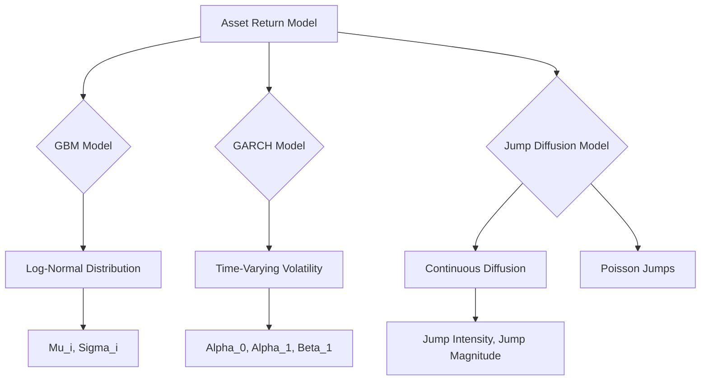
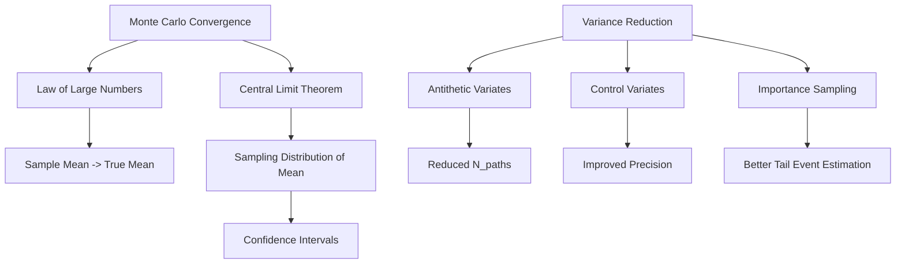

# **Title of Invention: A System and Method for Generating an Actionable, Multi-Domain Financial Plan with Dynamic Calibration, Proactive State Transition Guidance, and Enhanced User Empowerment**

## **Mathematical Justification: Stochastic Simulation Engine for Scenario Planning and Stress Testing**

This section elaborates on the mathematical models and algorithmic methodologies underpinning the **Scenario Planning and Stress Testing Module SPST-M**, particularly focusing on the **Stochastic Simulation Engine Sub-module**. This engine is crucial for assessing the robustness of an AI-generated financial plan by projecting its performance under a multitude of hypothetical future conditions, thereby enhancing foresight and preparedness.

### **VII. Foundations of Stochastic Financial Modeling**

The core of the simulation engine lies in accurately modeling the stochastic evolution of the Financial State Vector `S t` as defined in Definition 1.1, under various influencing factors.

#### **Definition 7.1: Stochastic Component Vector, Omega t**

The random noise term `omega t` introduced in Axiom 1.2 is further formalized as a multi-dimensional stochastic vector `Omega t in R^m`, representing the aggregate of all unpredicted or random influences on `S t` during a discrete time interval `Delta t`.
```
Omega(t) =
  MarketReturns(t)
  IncomeShocks(t)
  ExpenseVariances(t)
  InflationShocks(t)
  InterestRateFluctuations(t)
  UnexpectedLiabilities(t)
  HealthEvents(t)
  LongevityShocks(t)
  PolicyChanges(t)
  ...
```
Where each component is a random variable drawn from a specific probability distribution, and these components may exhibit significant cross-correlation. The dimensionality `m` of `Omega(t)` is dynamic, reflecting the number of active stochastic variables being modeled at any given time.

**Claim 7.1.1: Comprehensive Stochasticity Coverage**
The comprehensive definition of `Omega(t)` as a multi-dimensional vector ensures that a broad spectrum of financial risks and opportunities are accounted for in the simulation, significantly improving the realism and predictive power of the financial plan. This allows for a more holistic stress test.

**Mermaid Chart 7.1.1: Stochastic Component Vector Structure**
```mermaid
graph TD
    A[Omega(t) - Stochastic Component Vector] --> B[Market Returns]
    A --> C[Income Shocks]
    A --> D[Expense Variances]
    A --> E[Inflation Shocks]
    A --> F[Interest Rate Fluctuations]
    A --> G[Unexpected Liabilities]
    A --> H[Health Events]
    A --> I[Longevity Shocks]
    A --> J[Policy Changes]
    B --> B1[Equity Market Shocks]
    B --> B2[Bond Market Shocks]
    C --> C1[Job Loss]
    C --> C2[Bonus Variability]
    D --> D1[Discretionary Overruns]
    D --> D2[Emergency Repairs]
```

#### **Definition 7.2: Individual Stochastic Variable Models**

The components of `Omega t` are modeled using established stochastic processes or empirical distributions.

*   **Market Returns `R_asset i t` for Asset Class `i`:**
    For a given asset class (e.g., equities, bonds, real estate), the logarithmic returns are often modeled as following a Normal distribution, implying asset prices follow a Geometric Brownian Motion GBM.
    ```
    ln(P_i(t + Delta t) / P_i(t)) = (mu_i - 0.5 * sigma_i^2) * Delta t + sigma_i * sqrt(Delta t) * Z_i(t)
    ```
    Where:
    *   `P_i(t)` is the price of asset `i` at time `t`.
    *   `mu_i` is the annualized expected return (drift) of asset `i`.
    *   `sigma_i` is the annualized volatility of asset `i`.
    *   `Delta t` is the time step (e.g., 1/12 for monthly, 1/252 for daily).
    *   `Z_i(t)` is a standard Normal random variable `N(0, 1)`.
    *   Cross-correlations `rho_ij` between `Z_i(t)` and `Z_j(t)` are modeled via a Cholesky decomposition of the covariance matrix `Sigma_R` to generate correlated random variates `Z(t)`.
    Let `L` be the Cholesky decomposition of `Sigma_R`, such that `Sigma_R = L L^T`.
    Then, `Z(t) = L * epsilon(t)`, where `epsilon(t)` is a vector of independent `N(0, 1)` random variables.
    The continuous time stochastic differential equation for `P_i(t)` is given by:
    `dP_i(t) = P_i(t) * (mu_i dt + sigma_i dW_i(t))`
    where `dW_i(t)` are correlated Wiener processes.
    For more advanced modeling, a GARCH(1,1) model can be employed for volatility:
    `sigma_t^2 = alpha_0 + alpha_1 * epsilon_{t-1}^2 + beta_1 * sigma_{t-1}^2`
    where `epsilon_t = r_t - mu` is the innovation term.

*   **Income Flux `I_shock t`:**
    *   For variable income streams (e.g., freelance, bonuses), `I_shock t` can be modeled as a log-normal distribution around a baseline, reflecting positive-only values and skewness, or as a Poisson process for event frequency with a conditional distribution for magnitude.
        `I(t) = I_{baseline}(t) * exp(mu_I - 0.5 * sigma_I^2) * Delta t + sigma_I * sqrt(Delta t) * Z_I(t))`
        Where `Z_I(t)` is a standard Normal variable.
    *   For stable income, occasional "income shocks" (e.g., job loss) can be modeled as discrete events with a given probability `P_job_loss` and duration `D_unemployment` (e.g., 6 months of zero income).
        `I_{salary}(t) = I_{salary, baseline}(t) * (1 - Event_{job_loss}(t))`
        Where `Event_{job_loss}(t)` is an indicator function derived from a Bernoulli trial at each time step, and if triggered, remains active for `D_unemployment` periods.
        The probability of job loss `P_job_loss` can be modeled as a function of macroeconomic indicators:
        `P_job_loss(t) = f(UnemploymentRate(t), GDP_Growth(t))`

*   **Expenditure Variances `E_var j t` for Category `j`:**
    *   For discretionary spending categories, `E_var j t` might follow a Normal distribution around an average, or a Gamma distribution `Gamma(k, theta)` for skewed, positive-only expenses, to reflect variability.
        `E_j(t) = E_{j, baseline}(t) + E_var_j(t)`
        `E_var_j(t) ~ N(0, sigma_{E_j}^2)` or `E_var_j(t) ~ Gamma(k_j, theta_j)`
    *   Unexpected large expenses (e.g., medical emergency, car repair) are modeled as rare, high-magnitude events, potentially using a Poisson process for frequency `lambda_event` and a Pareto distribution `Pareto(alpha, x_m)` for magnitudes to capture "fat tails."
        `P(N_events(Delta t) = k) = (exp(-lambda_event * Delta t) * (lambda_event * Delta t)^k) / k!`
        If an event occurs, its magnitude `M_event ~ Pareto(alpha_M, x_m)` where `P(X > x) = (x_m / x)^alpha_M` for `x >= x_m`.

*   **Inflation Rate `pi t`:**
    *   Can be modeled as a stochastic process, such as a mean-reverting Ornstein-Uhlenbeck process, or simply as a Normal distribution around a forecasted mean with a given volatility.
    *   `d(pi_t) = kappa_pi * (theta_pi - pi_t) dt + sigma_pi * dW_pi(t)`
    *   Discretized form: `pi(t + Delta t) = pi(t) + kappa_pi * (theta_pi - pi(t)) * Delta t + sigma_pi * sqrt(Delta t) * Z_pi(t)`
    *   Where `theta_pi` is the long-term mean inflation, `kappa_pi` is the speed of mean reversion, and `sigma_pi` is the volatility of inflation.

*   **Interest Rates `r t`:**
    *   For variable-rate debt or savings, `r t` can be modeled using a stochastic interest rate model (e.g., Vasicek model for mean reversion) or simplified as a discrete random walk within bounds.
    *   Vasicek Model: `dr(t) = kappa_r * (theta_r - r(t)) dt + sigma_r * dW_r(t)`
    *   Discretized: `r(t + Delta t) = r(t) + kappa_r * (theta_r - r(t)) * Delta t + sigma_r * sqrt(Delta t) * Z_r(t)`
    *   Where `theta_r` is the long-term mean interest rate, `kappa_r` is the speed of mean reversion, and `sigma_r` is the volatility.

**Definition 7.2.1: Health Event Stochastic Model**
Health expenses `H_event(t)` are modeled as a combination of routine, age-dependent costs, and rare, catastrophic events.
`H(t) = H_{routine}(t) + H_{catastrophic}(t)`
`H_{routine}(t)` follows a log-normal distribution with age-dependent parameters `mu_H(age)` and `sigma_H(age)`.
`ln(H_{routine}(t)) ~ N(mu_H(age(t)), sigma_H(age(t))^2)`
`H_{catastrophic}(t)` occurs with a Poisson rate `lambda_H(age)` and has a magnitude `M_H ~ Weibull(k_H, lambda_H_mag)` to model high-severity events.
`P(N_H(Delta t) = k) = (exp(-lambda_H(age) * Delta t) * (lambda_H(age) * Delta t)^k) / k!`

**Definition 7.2.2: Longevity Risk Model**
Longevity risk influences the duration of income and expenses post-retirement. It can be modeled using a survival probability function `S(t)` derived from actuarial tables, which itself can be stochastic.
`P(Survival to t | age_0) = exp(-integral_0^t mu(age_0 + s) ds)`
Where `mu(x)` is the force of mortality. Stochasticity can be introduced by modeling `mu(x)` as a random variable or process, reflecting uncertain future improvements in mortality rates.
For simplicity, at a given age `a`, the probability of survival for `Delta t` is `p_s(a, Delta t)`.
A binary outcome `Survival(t+Delta t)` is drawn from `Bernoulli(p_s(age(t), Delta t))`.

**Definition 7.2.3: Policy Changes Stochastic Model**
Government policies (e.g., tax rates, social security benefits, eligibility rules) can change. These are typically modeled as discrete, low-frequency events with a defined impact.
`P(PolicyChange(t) = j) = p_j(t)`
If Policy Change `j` occurs, it modifies specific parameters in the `FSV` update function, e.g., `TaxRate = TaxRate_new`.

**Claim 7.2.1: Dynamic Correlation Structures**
The cross-correlations `rho_ij` between stochastic variables are not constant but can be dynamically adjusted based on time-varying economic regimes or user-defined scenarios, making the simulations more responsive to real-world market dynamics.

**Claim 7.2.2: Fat-Tailed Distribution for Extreme Events**
Modeling unexpected events (e.g., large expenses, market crashes) using distributions with "fat tails" (like Pareto, Student's t, or Jump-Diffusion for markets) is crucial for accurately assessing downside risks and developing robust financial plans, as normal distributions often underestimate the probability of extreme outcomes.

**Mermaid Chart 7.2.1: Asset Return Model Hierarchy**


**Mermaid Chart 7.2.2: Expenditure Variance Modeling**
```mermaid
graph TD
    A[Expenditure Variance] --> B{Routine Variance}
    A --> C{Unexpected Large Expense}
    B --> B1[Normal Distribution]
    B1 --> B2[Gamma Distribution]
    C --> C1[Poisson Process (Frequency)]
    C1 --> C2[Pareto Distribution (Magnitude)]
    C2 --> C3[Weibull Distribution (Magnitude)]
```

### **VIII. Monte Carlo Simulation Methodology**

The **Stochastic Simulation Engine Sub-module** primarily employs Monte Carlo simulations to project `N_paths` possible future trajectories of the user's `FinancialStateVector FSV` from `t_0` to `T_H`, incorporating the actions prescribed by the plan `A_p` and the inherent randomness `Omega t`.

#### **Algorithm 8.1: Monte Carlo Simulation for Financial Trajectories**

1.  **Initialization**:
    *   Define `N_paths`: The number of simulation trajectories (e.g., 1,000 to 100,000). A typical range for convergence checks is `N_paths \in [10^3, 10^6]`.
    *   Define `Delta t`: The discrete time step (e.g., 1 month, 1 quarter). `Delta t = (T_H - t_0) / K`.
    *   Define `Number of Steps (K)`: `K = (T_H - t_0) / Delta t`.
    *   Initialize `S_i(t_0)`: The user's current `FSV` for all `i = 1, ..., N_paths`.
        `S(t_0) = (A(t_0), L(t_0), I(t_0), E(t_0), Goals(t_0), Parameters(t_0))^T`
    *   Retrieve `A_p`: The current AI-generated financial action plan, providing actions `a(t_j)` for each `t_j` in `[t_0, T_H]`. `A_p = {a(t_0), a(t_1), ..., a(t_{K-1})}`.

2.  **Trajectory Generation**:
    For each path `i` from `1` to `N_paths`:
    *   Set `S_i(0) = S(t_0)`.
    *   For each time step `j` from `0` to `K-1`:
        *   `t_j = t_0 + j * Delta t`.
        *   Generate a vector of `m` independent standard Normal random variates `epsilon(t_j) = (epsilon_1(t_j), ..., epsilon_m(t_j))` where `epsilon_k(t_j) ~ N(0, 1)`.
        *   Apply the Cholesky decomposition `L` of the covariance matrix `Sigma_Omega` to generate correlated random variates `Z(t_j)`:
            `Z(t_j) = L * epsilon(t_j)`
            Where `Sigma_Omega` is the `(m x m)` covariance matrix of the stochastic variables within `Omega(t)`.
        *   Construct `Omega_i(t_j)`: Populate the specific values for market returns, income shocks, expenses, etc., using `Z(t_j)` and the defined distributions (Definition 7.2).
            `MarketReturns_i(t_j) = (mu_R - 0.5 * sigma_R^2) * Delta t + sigma_R * sqrt(Delta t) * Z_R(t_j)` (vectorized)
            `IncomeShock_i(t_j) = f_I(I_{baseline,i}(t_j), Z_I(t_j), Delta t, P_job_loss(t_j))`
            `ExpenseVariance_i(t_j) = f_E(E_{baseline,i}(t_j), Z_E(t_j), Delta t, lambda_event)`
            `Inflation_i(t_j) = pi_i(t_j) + kappa_pi * (theta_pi - pi_i(t_j)) * Delta t + sigma_pi * sqrt(Delta t) * Z_pi(t_j)`
            `InterestRate_i(t_j) = r_i(t_j) + kappa_r * (theta_r - r_i(t_j)) * Delta t + sigma_r * sqrt(Delta t) * Z_r(t_j)`
        *   Apply the state transition function `Phi`:
            ```
            S_i(t_j + Delta t) = Phi(S_i(t_j), a(t_j), Omega_i(t_j))
            ```
            This involves a detailed update process:
            *   **Asset Growth**: `A_k(t_j + Delta t) = A_k(t_j) * exp(MarketReturns_{k,i}(t_j))` for each asset `k`.
            *   **Cash Flow Update**:
                `Cash(t_j + Delta t) = Cash(t_j) + Income_i(t_j) * Delta t - Expenses_i(t_j) * Delta t - DebtPayments_i(t_j) * Delta t - Taxes_i(t_j) * Delta t + PlanActions_CashIn(a(t_j)) - PlanActions_CashOut(a(t_j))`
                Where `Income_i(t_j) = I_{salary}(t_j) + I_{investment}(t_j) + IncomeShock_i(t_j)`.
                `Expenses_i(t_j) = E_{baseline}(t_j) + ExpenseVariance_i(t_j) + UnexpectedLiabilities_i(t_j) + HealthEvents_i(t_j)`.
                `Taxes_i(t_j) = f_tax(Income_i(t_j), CapitalGains_i(t_j), Expenses_i(t_j), PolicyChanges_i(t_j))`.
            *   **Debt Servicing**: `L_debt(t_j + Delta t) = L_debt(t_j) * (1 + InterestRate_i(t_j) * Delta t) - DebtPayments_i(t_j) * Delta t`.
            *   **Asset Rebalancing/Contributions**: Actions `a(t_j)` include allocations, contributions, withdrawals, and rebalancing which adjust `A_k(t_j+Delta t)` and `Cash(t_j+Delta t)`.
            *   **Goal Progress Update**: `Goals(t_j + Delta t) = f_goal(Goals(t_j), S_i(t_j + Delta t))`.
            *   **Parameter Updates**: `age(t_j + Delta t) = age(t_j) + Delta t`. Inflation and Interest rates `pi_i(t_j+Delta t), r_i(t_j+Delta t)` are updated based on their respective SDEs.
        *   Store `S_i(t_j + Delta t)` for potential visualization or detailed analysis.
    The updated state vector can be formally written as:
    `S_i(t_{j+1}) = S_i(t_j) + G(S_i(t_j), a(t_j), Omega_i(t_j)) * Delta t + H(S_i(t_j), Omega_i(t_j)) * sqrt(Delta t)`
    This represents a general Euler-Maruyama discretization for the underlying system of stochastic differential equations.

3.  **Outcome Aggregation**:
    *   After `K` steps, `N_paths` final states `S_i(T_H)` are obtained.
    *   Calculate `P_success`: The proportion of paths `i` where `S_i(T_H)` satisfies the conditions of the Goal Manifold `M_g` (Definition 1.3).
        `P_success = (1 / N_paths) * sum_{i=1}^{N_paths} I(S_i(T_H) in M_g)`
        Where `I()` is the indicator function. The condition `S_i(T_H) in M_g` implies `g_k(S_i(T_H)) >= G_{k,target}` for all goal components `k`.
    *   Calculate other metrics:
        *   **Expected Goal Value**: `E[V(S(T_H))]` for `S(T_H) in M_g`. This is computed as `(1 / N_paths) * sum_{i=1}^{N_paths} V_g(S_i(T_H))`.
        *   **Value at Risk VaR**: The (1 - alpha) percentile of the distribution of a key financial metric `X` (e.g., net worth) at `T_H`.
            `VaR_alpha(X(T_H)) = inf {x | P(X(T_H) <= x) >= alpha}`
        *   **Conditional Value at Risk CVaR (Expected Shortfall)**: The expected value of a key financial metric conditional on it being below its VaR.
            `CVaR_alpha(X(T_H)) = E[X(T_H) | X(T_H) <= VaR_alpha(X(T_H))]`
            In practice, this is estimated as `(1 / N_shortfall) * sum_{i in ShortfallSet} X_i(T_H)`.
        *   **Distribution of outcomes**: Visualize histograms or density plots of key `FSV` components at `T_H`.

**Claim 8.1.1: Path-Dependent Trajectory Precision**
The accuracy of financial trajectories is path-dependent, meaning that at each step, the random draw affects all subsequent steps. This necessitates a sufficient number of `N_paths` to cover the breadth of possible outcomes with statistical confidence.

**Claim 8.1.2: Law of Large Numbers Application in Monte Carlo**
The Monte Carlo simulation accurately estimates expected values and probabilities because it leverages the Law of Large Numbers. As the number of paths `N_paths` increases, the sample average of any outcome metric converges to its true expected value.

**Mermaid Chart 8.1.1: Monte Carlo Simulation Flow**
```mermaid
graph TD
    A[Start Simulation] --> B[Initialize N Paths, Delta T, S(t0), A_p]
    B --> C{Loop for each Path i = 1 to N_paths}
    C --> D{Loop for each Time Step j = 0 to K-1}
    D --> E[Generate Correlated Random Variates Z(tj)]
    E --> F[Construct Omega_i(tj) based on Z(tj)]
    F --> G[Apply State Transition Function Phi]
    G --> H[Update S_i(tj+Delta T)]
    H --> D
    D -- End Loop --> C
    C -- End Loop --> I[Aggregate Outcomes S_i(TH)]
    I --> J[Calculate P_success, VaR, CVaR, etc.]
    J --> K[Generate Visualizations]
    K --> L[End Simulation]
```

**Mermaid Chart 8.1.2: State Transition Function (Phi) Decomposition**
```mermaid
graph TD
    A[Phi(S(t), a(t), Omega(t))] --> B[Asset Growth & Income Generation]
    A --> C[Expense & Debt Servicing]
    A --> D[Tax Calculation]
    A --> E[Plan Actions (a(t))]
    A --> F[Parameter Updates]
    B --> B1[Asset Returns from Omega(t)]
    B --> B2[Income Shocks from Omega(t)]
    C --> C1[Expense Variances from Omega(t)]
    C --> C2[Unexpected Liabilities from Omega(t)]
    C --> C3[Interest Rate Fluctuations from Omega(t)]
    E --> E1[Rebalancing, Contributions, Withdrawals]
    F --> F1[Age Increment, Inflation/Interest Rate Process]
```

#### **Lemma 8.2: Convergence and Precision**

The estimated probability `P_success` and other aggregated metrics derived from Monte Carlo simulations converge to their true expected values as `N_paths` approaches infinity, by the Law of Large Numbers. The precision of the estimates increases with `sqrt(N_paths)`. Sufficiently large `N_paths` are chosen to meet a desired confidence interval for the probability estimates.
The standard error of the estimate for a probability `p` is given by `SE(p) = sqrt(p * (1 - p) / N_paths)`.
For an estimate of the mean `mu_X` of a metric `X`, the standard error is `SE(mu_X) = sigma_X / sqrt(N_paths)`, where `sigma_X` is the standard deviation of `X`.
To achieve a desired confidence interval `CI = [p_hat - z * SE(p_hat), p_hat + z * SE(p_hat)]`, `N_paths` must be chosen such that `z * SE(p_hat)` is within an acceptable error tolerance.

**Definition 8.2.1: Variance Reduction Techniques**
To improve the computational efficiency of Monte Carlo simulations, especially when `N_paths` is large, variance reduction techniques can be employed:
*   **Antithetic Variates**: If `Z(t)` is a random draw, use `-Z(t)` as another draw. This pairs extreme positive and negative shocks, reducing variance.
    `E[f(Z)] = (E[f(Z)] + E[f(-Z)]) / 2`.
*   **Control Variates**: Use a related variable whose expected value is known to reduce the variance of the estimate.
    `mu_CV = mu_MC - beta * (CV_MC - E[CV])`.
*   **Importance Sampling**: Focus simulations on rare but impactful events by sampling more frequently from those regions, then re-weighting the results.

**Claim 8.2.1: Computational Efficiency of Variance Reduction**
Implementing variance reduction techniques can significantly reduce the `N_paths` required for a given level of precision, thereby improving the computational efficiency of the Monte Carlo simulation without sacrificing statistical rigor.

**Mermaid Chart 8.2.1: Monte Carlo Convergence and Variance Reduction**


### **IX. Scenario Implementation within Monte Carlo**

The `Scenario Definition Interface Sub-module` allows users to specify scenarios. These scenarios are translated into specific modifications of the parameters and distributions within the **Stochastic Simulation Engine Sub-module**. This aligns with Definition 5.1.

#### **Mechanism 9.1: Scenario Parameter Overrides**

For a given scenario `s`, the simulation engine overrides the default parameters of the stochastic models (Definition 7.2) for all `N_paths` or a subset thereof.
Let `P_default = {param_1, ..., param_m}` be the set of default model parameters.
For a scenario `s`, a set of overridden parameters `P_s = {param'_1, ..., param'_k}` is defined.
The simulation then uses `P_s union (P_default - P_s_keys)` for execution.

*   **Economic Shocks (e.g., Recession, High Inflation):**
    *   `MarketReturns(t)`: `mu_i` is reduced (potentially negative), `sigma_i` is increased for equity assets. `rho_ij` between asset classes might increase during crises.
        `mu_equity -> mu_equity_recession = mu_equity - delta_mu_recession`
        `sigma_equity -> sigma_equity_recession = sigma_equity + delta_sigma_recession`
        `Sigma_R -> Sigma_R_crisis = f_crisis(Sigma_R, factor_correlation_increase)`
    *   `InflationRate(t)`: Mean `pi_long_term` is increased, `sigma_pi` might be increased.
        `theta_pi -> theta_pi_high_inflation = theta_pi + delta_theta_pi`
        `sigma_pi -> sigma_pi_high_inflation = sigma_pi + delta_sigma_pi`
    *   `InterestRates(t)`: Adjusted to reflect central bank responses (e.g., lowered rates during recession, raised during inflation).
        `theta_r -> theta_r_central_bank_response`
    *   `IncomeFlux(t)`: Probability of job loss event increases, duration of unemployment increases, mean income growth rate decreases.
        `P_job_loss -> P_job_loss_recession = P_job_loss * factor_increase`
        `D_unemployment -> D_unemployment_recession`

*   **Personal Life Events (e.g., Job Loss, Medical Expense):**
    *   **Job Loss**: For a specified duration, `I(t)` for salary income is set to zero (or to unemployment benefits). This event might be applied to 100% of paths in a "what-if" scenario, or to a subset of paths if modeling the *risk* of job loss.
        `I_{salary}(t) = 0` for `t in [t_event, t_event + D_unemployment]`.
    *   **Medical Expense**: A one-time large expense `E(t)` is injected at a specific time `t_event`, drawing its magnitude from a conditional distribution.
        `E(t_event) = E(t_event) + M_event_medical` where `M_event_medical ~ Pareto(alpha_med, x_m_med)`.

*   **Investment Performance Variations:**
    *   `MarketReturns(t)`: `mu_i` is explicitly adjusted to a user-defined higher or lower value, with volatility potentially held constant or also adjusted.
        `mu_i -> mu_i_user_override`

**Claim 9.1.1: Parameterized Scenario Impact**
Every scenario can be precisely defined by a set of parameter overrides for the underlying stochastic models, allowing for quantitative and repeatable stress tests. This ensures transparency in how scenarios influence outcomes.

**Claim 9.1.2: Granular Scenario Definition**
The ability to override individual stochastic model parameters (e.g., `mu_i`, `sigma_i`, `lambda_event`) allows for highly granular scenario definitions, from broad macroeconomic shifts to specific personal events.

#### **Mechanism 9.2: Conditional Stochasticity**

Certain scenarios might not just alter parameters but also change the *type* of stochastic process or introduce dependencies. For example, during a severe recession scenario, the correlation between seemingly uncorrelated assets might increase significantly (e.g., "flight to safety" phenomena).
This involves modifying the covariance matrix `Sigma_Omega` dynamically or introducing state-dependent transition probabilities for discrete events.
`Sigma_Omega(t) = f_conditional(Sigma_Omega_default, EconomicRegime(t))`
For example, during a crisis, `rho_asset_bond` might switch sign or magnitude.

**Definition 9.2.1: Scenario Tree Modeling**
For complex scenarios with branching possibilities, a scenario tree can be used. Each node in the tree represents a state at a given time, and branches represent possible events or transitions with associated probabilities.
`S_0 --(p1)--> S_1a`
`S_0 --(p2)--> S_1b`
This allows for modeling sequences of events and their cumulative impact. The Monte Carlo simulation would then sample paths from this tree structure.

**Claim 9.2.1: Advanced Scenario Complexity Handling**
The integration of conditional stochasticity and scenario trees enables the simulation engine to model highly complex and realistic future states, moving beyond simple parameter adjustments to capture dynamic interactions and event sequences.

**Mermaid Chart 9.2.1: Scenario Definition Workflow**
```mermaid
graph TD
    A[User Defines Scenario 'S'] --> B{Identify Affected Stochastic Variables}
    B --> C[Override Parameters (e.g., mu, sigma, lambda)]
    B --> D[Modify Distribution Types (e.g., Normal to T-Dist)]
    B --> E[Adjust Correlation Structure (Sigma_Omega)]
    E --> F[Define Conditional Transitions/Events]
    C & D & E & F --> G[Generate Scenario-Specific Omega(t) for MC]
```

**Mermaid Chart 9.2.2: Simple Scenario Tree Example**
```mermaid
graph TD
    A[Current State (t0)] --> B{Economic Outlook (t1)}
    B --> C[Positive Growth (p=0.6)]
    B --> D[Moderate Recession (p=0.3)]
    B --> E[Severe Downturn (p=0.1)]
    C --> F[Goal Achieved]
    C --> G[Goal Partially Achieved]
    D --> G
    D --> H[Significant Shortfall]
    E --> H
    E --> I[Catastrophic Failure]
```

### **X. Metrics and Visualizations for Stress Testing**

The output of the Monte Carlo simulations under various scenarios provides robust metrics for the `Impact Analysis and Visualization Sub-module`.

#### **Metric 10.1: Conditional Probability of Success `P(M_g | s)`**

As defined in Theorem 5.2, this is the most direct measure. For each scenario `s`, the Monte Carlo simulation is run, and the proportion of successful paths `P_success (s)` is calculated. A significant drop in this value under plausible `s` indicates a vulnerable plan.
`P(M_g | s) = (1 / N_paths(s)) * sum_{i=1}^{N_paths(s)} I(S_i(T_H; s) in M_g)`
Where `S_i(T_H; s)` denotes the final state of path `i` under scenario `s`.

**Claim 10.1.1: Direct Plan Vulnerability Assessment**
The conditional probability of success `P(M_g | s)` provides a quantifiable and easily interpretable measure of a financial plan's vulnerability to specific stressors, directly informing decision-makers about necessary adjustments.

#### **Metric 10.2: Shortfall Analysis**

Beyond just `P_success`, the system quantifies the "shortfall" when the goal is not met. If `S_i(T_H)` is not in `M_g`, the system calculates `d(S_i(T_H), M_g)` (Theorem 1.4), providing a measure of how far off the goal the plan falls. Aggregated shortfall distributions across `N_paths` for a scenario `s` offer deeper insights than a binary success/failure.
Let `d_k(S_i(T_H), M_g)` be the deficit for goal component `k`.
`d_k(S_i(T_H), M_g) = max(0, G_{k,target} - g_k(S_i(T_H)))`
The total shortfall can be a weighted sum: `D(S_i(T_H), M_g) = sum_{k=1}^{N_goals} w_k * d_k(S_i(T_H), M_g)`.
The Expected Shortfall (ES) for a goal `M_g` under scenario `s` is:
`ES(M_g | s) = E[D(S(T_H; s), M_g) | D(S(T_H; s), M_g) > 0]`
This is estimated by averaging the shortfalls over all paths where a shortfall occurred.
`ES(M_g | s) = (1 / N_fail) * sum_{i=1}^{N_paths(s)} D(S_i(T_H; s), M_g) * I(D(S_i(T_H; s), M_g) > 0)`

**Claim 10.2.1: Granular Risk Quantification**
Shortfall analysis provides a more granular understanding of risk than binary success/failure, quantifying the magnitude of failure and allowing for prioritization of goal components based on their individual shortfalls.

#### **Metric 10.3: Expected Utility of Outcomes `E[U(S(T_H))]`**

For a more comprehensive assessment, the system can calculate the expected utility of the financial outcome at `T_H`. This requires a user-defined utility function `U(S(T_H))`, which typically reflects risk aversion and preference for achieving goals.
`E[U(S(T_H))] = (1 / N_paths) * sum_{i=1}^{N_paths} U(S_i(T_H))`
A common utility function is Constant Relative Risk Aversion (CRRA):
`U(X) = X^(1-gamma) / (1-gamma)` for `gamma != 1`
`U(X) = ln(X)` for `gamma = 1`
Where `X` is a key financial metric (e.g., net worth) and `gamma` is the risk aversion coefficient.

#### **Metric 10.4: Downside Deviation and Sortino Ratio**

*   **Downside Deviation (DD)**: Measures the volatility of returns below a specified minimum acceptable return (MAR) or target.
    `DD = sqrt((1 / N_paths) * sum_{i=1}^{N_paths} (min(0, R_i - MAR))^2)`
    Where `R_i` is the return of path `i`.
*   **Sortino Ratio**: A modification of the Sharpe ratio that uses downside deviation in the denominator, focusing on undesirable volatility.
    `Sortino Ratio = (E[R] - MAR) / DD`
    These metrics are particularly useful for evaluating investment strategies within the plan.

**Claim 10.4.1: Risk-Adjusted Performance Evaluation**
Metrics like Expected Utility, Downside Deviation, and Sortino Ratio move beyond simple probability of success to provide a risk-adjusted assessment of the plan's performance, aligning with modern financial theory and individual risk preferences.

#### **Visualization 10.5: Fan Charts and Distribution Overlays**

*   **Fan Charts**: Display the median trajectory of key `FSV` components over time, bounded by various percentiles (e.g., 10th, 25th, 75th, 90th percentiles) derived from the `N_paths` simulations. This visually represents the increasing uncertainty over time and the range of possible outcomes.
    The `p`-th percentile `P_p(t_j)` at time `t_j` is such that `P(X(t_j) <= P_p(t_j)) = p/100`.
    A fan chart displays `Median(X(t_j))` along with bands like `[P_10(t_j), P_90(t_j)]`, `[P_25(t_j), P_75(t_j)]`.
*   **Distribution Overlays**: Histograms or kernel density estimates of target financial metrics at `T_H` (e.g., final net worth, down payment accumulated) are overlaid for different scenarios, visually contrasting the impact of each stress condition.
    `f_X(x | s)` is the probability density function of metric `X` under scenario `s` at `T_H`.
    The Kernel Density Estimate (KDE) is given by: `hat{f}_h(x) = (1 / (N_paths * h)) * sum_{i=1}^{N_paths} K((x - X_i) / h)` where `K` is the kernel function and `h` is the bandwidth.

**Claim 10.5.1: Intuitive Uncertainty Communication**
Fan charts offer an intuitive and powerful visualization tool to communicate the increasing uncertainty of future financial outcomes over time, helping users understand the range of possibilities rather than focusing on a single point estimate.

**Claim 10.5.2: Comparative Scenario Impact Visualization**
Overlaid distribution plots enable a clear visual comparison of how different scenarios shift the entire probability distribution of key financial outcomes, making the impact of stress conditions immediately apparent.

**Mermaid Chart 10.5.1: Metrics Dashboard for Stress Testing**
```mermaid
graph TD
    A[Simulation Results] --> B[P_success (s)]
    A --> C[Shortfall Analysis]
    A --> D[VaR & CVaR (s)]
    A --> E[Expected Utility (s)]
    A --> F[Risk-Adjusted Ratios (s)]
    B --> B1[Scenario Comparison Table]
    C --> C1[Shortfall Magnitude Distribution]
    C --> C2[Expected Shortfall by Goal]
    D --> D1[Downside Risk Profile]
    E --> E1[Optimal Plan Selection Criterion]
    F --> F1[Investment Strategy Evaluation]
```

**Mermaid Chart 10.5.2: Example Fan Chart Structure**
```mermaid
graph TD
    A[Financial Metric Over Time (e.g., Net Worth)]
    A --> B[Median Trajectory]
    A --> C[25th to 75th Percentile Band]
    A --> D[10th to 90th Percentile Band]
    A --> E[5th to 95th Percentile Band]
    B --> B1[E[X(t)]]
    C --> C1[Q1(t), Q3(t)]
    D --> D1[P10(t), P90(t)]
    E --> E1[P5(t), P95(t)]
```

**Mermaid Chart 10.5.3: Distribution Overlays for Scenario Comparison**
```mermaid
graph TD
    A[Final Metric Distribution (TH)] --> B[Scenario 1: Baseline]
    A --> C[Scenario 2: Recession]
    A --> D[Scenario 3: Job Loss]
    B --> B1[KDE Plot (Baseline)]
    C --> C1[KDE Plot (Recession)]
    D --> D1[KDE Plot (Job Loss)]
    B1 & C1 & D1 --> E[Visual Comparison of Distributions]
```

By rigorously applying these stochastic simulation techniques, the **Scenario Planning and Stress Testing Module** provides users with an unparalleled understanding of their financial plan's resilience, enabling proactive adjustments and informed decision-making even in the face of significant uncertainty.