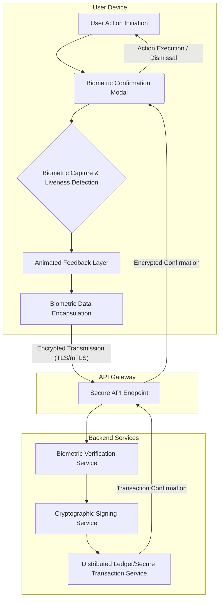
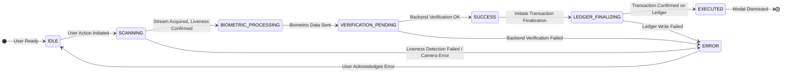

# Title of Invention: A System and Method for a High-Fidelity Biometric Confirmation Workflow with Animated Security Feedback

## Abstract:
A novel system and method are disclosed for authenticating user-initiated, sensitive digital actions through an exceptionally high-fidelity, multi-modal biometric confirmation workflow. This architecture integrates real-time biometric identity verification with a series of psychologically optimized, graphically rich animations that dynamically communicate the security and integrity of the underlying process to the user. The workflow orchestrates the capture of a live biometric stream, its secure processing against a trusted identity manifold, and the subsequent visual depiction of critical security phases including simulated biometric acquisition, successful verification, and immutable ledger finalization. This meticulously designed feedback loop transcends conventional static indicators, establishing a paradigm of proactive, transparent security assurance that cultivates profound user trust and confidence in the secure execution of digital transactions. The system is engineered to function across diverse computational environments, leveraging advanced client-side processing, secure cryptographic protocols, and distributed ledger technologies to ensure both robust security and an unparalleled user experience.

## Background of the Invention:
The contemporary digital landscape is replete with critical transactions that demand stringent security protocols. Traditional authentication mechanisms, such as password-based systems or basic two-factor authentication (2FA), are increasingly susceptible to sophisticated cyber-attacks including phishing, man-in-the-middle attacks, and credential stuffing. While biometric authentication offers a superior security posture by leveraging inherent physiological or behavioral traits, its integration into user workflows often remains rudimentary, failing to adequately communicate the underlying security strength or processing integrity to the end-user.

Existing systems typically present an abrupt "scan complete" or "verified" message, providing minimal psychological reassurance. This lacuna in user experience can lead to:
1.  **Reduced Perceived Security:** Users, lacking clear visual cues, may perceive the process as opaque, leading to diminished trust in the system's security capabilities.
2.  **Cognitive Dissonance:** A disconnect between the criticality of the action (e.g., a large financial transfer) and the simplistic confirmation feedback can induce anxiety or uncertainty.
3.  **Vulnerability to Social Engineering:** An unsophisticated confirmation flow might inadvertently train users to disregard security prompts, making them more susceptible to social engineering attacks that mimic legitimate processes.
4.  **Lack of Transparency:** Users remain uninformed about the intricate, secure steps being undertaken to protect their data and transactions, thereby undermining the system's inherent robustness.

There exists a profound, unmet need for a comprehensive confirmation workflow that not only rigorously secures an action via state-of-the-art biometric authentication but also transparently and reassuringly communicates the security, integrity, and finality of the process to the user through a dynamically animated, multi-stage feedback mechanism. Such a system would leverage principles of human-computer interaction and cognitive psychology to bridge the gap between technical security efficacy and user perception, thereby elevating both the actual and perceived security posture of sensitive digital interactions.

## Brief Summary of the Invention:
This invention presents a sophisticated method for robustly confirming user-initiated actions through an integrated biometric and animated feedback system. Upon a user's initiation of a sensitive action, a dynamically rendered, ephemeral modal interface is presented, serving as the central hub for the confirmation workflow. The system intelligently requests and acquires high-fidelity biometric data, such as a live video stream for facial geometry analysis, leveraging advanced browser or device APIs (e.g., `navigator.mediaDevices.getUserMedia`).

The core innovation lies in the orchestrating of a multi-stage, animated feedback sequence that provides continuous, intuitive, and reassuring visual cues throughout the entire process:
1.  **Biometric Acquisition and Simulated Scanning (Phase I - `SCANNING` State):** The live biometric feed is displayed within the modal. Crucially, an intricately designed, high-fidelity animated graphic – such as a dynamic facial grid, a spectral scanning beam, or a topographical mapping overlay – is superimposed over the live feed. This animation is not merely decorative; it psychologically reinforces the notion of an active, in-depth biometric analysis, engaging the user's perception of advanced security protocols at work.
2.  **Successful Verification Acknowledgment (Phase II - `SUCCESS` State):** Following the successful processing and verification of the biometric data against a pre-established identity profile, the scanning animation seamlessly transitions into a distinct success indicator. This is manifested as a fluid, aesthetically pleasing animation, such as an animated cryptographic checkmark, an expanding secure shield, or a biometric signature confirmation, designed to evoke a strong sense of accomplishment, security, and immediate validation.
3.  **Secure Transaction Finalization Visualization (Phase III - `VERIFYING` State):** The workflow culminates in a third, highly sophisticated animation that abstractly but powerfully visualizes the secure backend processing and finalization of the user's initiated action. This could involve an animation depicting data being immutably written to a "quantum ledger," a distributed cryptographic network, or a secure enclave. The animation leverages intricate visual metaphors – such as coalescing data packets, cryptographic key exchanges, or distributed node confirmations – to communicate concepts like tamper-evidence, non-repudiation, and irreversible commitment.

This meticulously choreographed sequence of animations provides continuous, transparent, and psychologically reinforced feedback, dramatically enhancing the user's perceived security and fostering profound trust. Upon the successful completion of this multi-stage visual affirmation, a secure callback mechanism (`onSuccess`) programmatically executes the user's original action, and the modal gracefully dismisses, leaving the user with an unequivocal sense of security and control. This system inherently establishes a new benchmark for secure digital interaction, owning the definitive method for combining biometric security with advanced cognitive reassurance.

## Detailed Description of the Invention:

The present invention describes a comprehensive system and method for orchestrating a high-fidelity biometric confirmation workflow, meticulously designed to elevate both the actual and perceived security of sensitive user actions. The system's architecture is modular, encompassing client-side presentation, secure biometric processing, and robust backend transaction finalization.

### 1. System Architecture Overview

The system operates across a distributed architecture, ensuring compartmentalization of concerns and enhanced security.

*   **Client-Side Interface:** Responsible for user interaction, biometric data capture, liveness detection, and rendering of the high-fidelity animated feedback. This component prioritizes user experience and local data sanitization.
*   **API Gateway:** Acts as a secure, rate-limited, and authenticated entry point for all client-to-backend communications, ensuring request integrity and confidentiality.
*   **Biometric Verification Service:** A specialized microservice tasked with processing raw biometric data, performing identity matching against a secure database of enrolled biometrics, and executing liveness detection algorithms.
*   **Cryptographic Signing Service:** Responsible for generating digital signatures for confirmed transactions, ensuring non-repudiation and integrity. This service operates within a Hardware Security Module (HSM) or Trusted Execution Environment (TEE).
*   **Distributed Ledger/Secure Transaction Service:** The ultimate arbiter for recording and finalizing sensitive user actions, leveraging principles of immutability, consensus, and cryptographic linking (e.g., blockchain, tamper-evident logs).

### 2. Client-Side Workflow and User Interface Components

Upon a user initiating a sensitive action (e.g., "Confirm Payment," "Authorize Transfer," "Grant Access"), a dedicated modal component (`BiometricConfirmationModal`) is programmatically rendered.

#### 2.1. Biometric Media Stream Acquisition

The modal component dynamically leverages the `navigator.mediaDevices.getUserMedia` Web API to request and acquire a live video stream from the user's camera. This stream is then securely attached to an HTML `<video>` element, which is styled to occupy a prominent area within the modal. Critical configurations for `getUserMedia` include:
*   `video: { facingMode: "user", width: { ideal: 1280 }, height: { ideal: 720 }, frameRate: { ideal: 30 } }` to ensure optimal resolution and frame rate for biometric analysis.
*   Error handling for `NotAllowedError`, `NotFoundError`, `NotReadableError`, `OverconstrainedError`, and `TypeError` is robustly implemented to guide the user in case of camera access issues.

#### 2.2. State Management and Visual Feedback System

The core of the animated security feedback is driven by a sophisticated client-side state machine. This state machine formally defines the permissible transitions between distinct stages of the confirmation process, each mapped to a specific visual animation.

**States of the `BiometricConfirmationModal` State Machine:**
*   `IDLE`: Initial state, awaiting user action.
*   `SCANNING`: Live video stream active, displaying a dynamic biometric scanning overlay. Liveness detection and initial data capture are ongoing.
*   `BIOMETRIC_PROCESSING`: Raw biometric data packaged, encrypted, and transmitted to the backend for verification. Client-side displays a "Processing Data" animation.
*   `VERIFICATION_PENDING`: Awaiting response from the Biometric Verification Service.
*   `SUCCESS`: Biometric verification successful. Displays a confirmation animation.
*   `LEDGER_FINALIZING`: Transaction payload cryptographically signed and submitted to the secure ledger. Displays a ledger finalization animation.
*   `EXECUTED`: Transaction successfully recorded on the ledger. Modal ready for dismissal.
*   `ERROR`: Any failure state (camera access, liveness detection, backend verification, ledger write failure). Displays an error animation and message.

#### 2.3. Animation Implementation Details

The animated overlays are implemented with meticulous attention to detail, leveraging advanced web technologies for optimal performance and visual fidelity.

##### 2.3.1. `SCANNING` State: Dynamic Biometric Acquisition Overlay

When in the `SCANNING` state, a visually complex, multi-layered animation is overlaid on the live video feed. This animation is designed to simulate an intelligent, analytical scan, far beyond a simple static line.
*   **Technique:** Primarily implemented using WebGL shaders (via libraries like Three.js or custom GLSL) for real-time procedural generation of graphical effects, or high-performance SVG animations/CSS transforms for less computationally intensive scenarios.
*   **Features:**
    *   **Facial Mesh Overlay:** A dynamically conforming wireframe mesh that subtly adjusts to detected facial features (e.g., via `dlib` or `mediapipe` client-side inference for landmark detection), indicating active analysis of facial topography.
    *   **Scanning Pulse Effect:** A translucent, energetic wave or grid pattern that propagates across the face, signifying data acquisition. This can be achieved with `radial-gradient` CSS animations combined with `blend-mode` or WebGL fragment shaders.
    *   **Biometric Data Visualization:** Abstract graphical elements, such as pulsating data points or converging lines, indicating the capture of unique biometric identifiers.
*   **Psychological Impact:** Reinforces the perception of rigorous, scientific biometric analysis, fostering a sense of advanced technological security.

##### 2.3.2. `SUCCESS` State: Affirmative Verification Acknowledgment

Upon receiving a positive verification from the backend, the `SUCCESS` state is activated, triggering a fluid, reassuring animation.
*   **Technique:** High-performance SVG animations (e.g., using `Lottie` or custom `SMIL` animations) or CSS `transition`/`animation` properties for vector-based graphics.
*   **Features:**
    *   **Cryptographic Checkmark:** A stylized checkmark that animates into existence with a satisfying "spring" or "snap" effect, often accompanied by subtle glow or particle effects.
    *   **Expanding Shield/Biometric Seal:** A graphic representing a secure shield or a unique biometric fingerprint icon that visually seals or locks, signifying immutability and successful authentication.
*   **Psychological Impact:** Elicits a strong positive emotional response, providing immediate and unambiguous confirmation of successful identity verification, thereby building user confidence.

##### 2.3.3. `LEDGER_FINALIZING` State: Secure Transaction Finalization Visualization

This critical phase visually communicates the secure, immutable recording of the transaction, leveraging advanced metaphors.
*   **Technique:** Complex JavaScript-driven canvas animations (e.g., HTML Canvas API, Konva.js, Pixi.js) or WebGL for simulating distributed ledger interactions.
*   **Features:**
    *   **Quantum Ledger Animation:** Visualizes data packets (representing the transaction) being fragmented, encrypted, and then distributed across a network of interconnected nodes, ultimately coalescing into an immutable chain or block. Animated cryptographic hash calculations can be subtly depicted.
    *   **Data Flow & Consensus:** Abstract lines and nodes forming pathways, with visual cues like glowing nodes or synchronized pulses, indicating consensus mechanisms and secure data propagation.
    *   **Immutable Seal:** A final, permanent graphical lock or seal that appears on the abstract representation of the ledger, signifying irreversible commitment.
*   **Psychological Impact:** Conveys the ultimate security and tamper-proof nature of the transaction, reinforcing transparency and the finality of the action, crucial for critical financial or administrative operations.

### 3. Backend Biometric Processing and Security Considerations

#### 3.1. Biometric Data Transmission and Storage

*   **Encryption-in-Transit:** Biometric data, once encapsulated on the client-side, is immediately encrypted using robust, ephemeral session keys derived from a mutually authenticated TLS 1.3 channel (or mTLS for even higher assurance) before transmission to the API Gateway.
*   **Secure Enclave Processing:** The Biometric Verification Service processes the data within a Trusted Execution Environment (TEE) or a Hardware Security Module (HSM) to protect against side-channel attacks and unauthorized access to biometric templates.
*   **Template Storage:** Biometric templates (e.g., facial vectors, iris codes) are not stored as raw images but as irreversible, cryptographically hashed, and salted representations. These templates are stored in a highly secured, access-controlled database, potentially sharded and encrypted at rest using envelope encryption.

#### 3.2. Liveness Detection and Anti-Spoofing

Sophisticated algorithms are employed to differentiate between a live user and a spoofing attempt (e.g., a photograph, video replay, or 3D mask).
*   **Multi-modal Liveness Cues:** Analysis of micro-expressions, subtle movements (e.g., blinks, head turns prompted by UI), texture analysis (skin vs. paper/screen), depth perception (stereo cameras or structured light sensors).
*   **Randomized Challenges:** The system may dynamically prompt the user to perform a specific, randomized action (e.g., "blink twice," "turn your head slightly left") during the `SCANNING` phase, making spoofing significantly harder.
*   **Facial Presentation Attack Detection (PAD):** Leveraging deep learning models trained on extensive datasets of both live and spoofed biometric presentations.

#### 3.3. Cryptographic Signature and Ledger Interaction

Upon successful biometric verification, the user's action payload is forwarded to the Cryptographic Signing Service.
*   **Payload Hashing:** The transaction payload is cryptographically hashed (e.g., SHA-256) to create a unique digest.
*   **Digital Signature:** This hash is then signed using the user's unique private key, stored in a secure fashion (e.g., derived from a biometric master key or residing in an HSM). This ensures non-repudiation.
*   **Distributed Ledger Integration:** The signed transaction, along with relevant metadata, is submitted to the Distributed Ledger/Secure Transaction Service. This service ensures:
    *   **Immutability:** Once recorded, the transaction cannot be altered or deleted.
    *   **Transparency/Auditability:** The transaction's existence and details are verifiable (though potentially pseudonymous).
    *   **Consensus:** Multiple nodes independently verify and agree upon the transaction's validity before adding it to the ledger.

### 4. Robust Error Handling and Fallbacks

The system incorporates comprehensive error handling to gracefully manage potential issues:
*   **Camera Access Denied:** Guides the user through browser/device permissions.
*   **Liveness Detection Failure:** Provides clear feedback and retry options, potentially with different challenge types.
*   **Biometric Mismatch:** Informs the user of authentication failure and offers alternative authentication methods or contact support.
*   **Backend Service Unavailability:** Provides informative messages and prompts for retry or alternative action.
*   **Ledger Write Failure:** Indicates a critical system error, initiating rollback procedures if necessary, and notifying support.

Each error state is accompanied by a distinct, non-alarming animated feedback loop and clear textual instructions, maintaining user trust even during unexpected events.

## Claims:

1.  A system for authenticating a user-initiated digital action with enhanced perceived security, comprising:
    a.  A client-side interface configured to:
        i.    Render a dynamic modal component in response to a user initiating a sensitive action;
        ii.   Acquire a live biometric stream from a user's device camera;
        iii.  Display said live biometric stream within the modal component; and
        iv.   Manage a multi-state workflow via a state machine.
    b.  A biometric verification module, communicatively coupled to the client-side interface, configured to:
        i.    Receive an encrypted biometric data packet derived from the live biometric stream;
        ii.   Perform liveness detection on the biometric data; and
        iii.  Authenticate the user's identity by comparing the processed biometric data against a securely stored biometric template.
    c.  A secure transaction finalization module, communicatively coupled to the biometric verification module, configured to:
        i.    Receive a verified transaction payload upon successful biometric authentication;
        ii.   Generate a cryptographic signature for the transaction payload; and
        iii.  Record the cryptographically signed transaction payload onto an immutable distributed ledger or secure tamper-evident record.
    d.  A high-fidelity animated feedback system, integrated with the client-side interface, configured to display a sequence of distinct, psychologically optimized animations correlated with the multi-state workflow, including:
        i.    A first animation representing an active biometric scanning process, dynamically overlaid upon the live biometric stream during a `SCANNING` state;
        ii.   A second animation representing a successful verification event, displayed upon transitioning to a `SUCCESS` state; and
        iii.  A third animation representing a secure backend process and immutable transaction finalization, displayed upon transitioning to a `LEDGER_FINALIZING` state.
    e.  Wherein the display of said sequence of animations provides continuous, reassuring visual feedback to the user, thereby enhancing the user's perception of security and trust in the system.

2.  The system of claim 1, wherein the biometric stream comprises a live video feed for facial geometry analysis.

3.  The system of claim 1, wherein the first animation comprises a dynamically conforming wireframe mesh or a spectral scanning beam overlay, generated via WebGL shaders or advanced CSS animations.

4.  The system of claim 1, wherein the second animation comprises an animated cryptographic checkmark or an expanding secure shield icon, implemented with SVG animations or high-performance CSS transforms.

5.  The system of claim 1, wherein the third animation visually represents data fragmentation, secure cryptographic linking, and distributed consensus mechanisms, depicted as data packets coalescing onto a distributed ledger, implemented with HTML Canvas API or WebGL animations.

6.  The system of claim 1, wherein the biometric verification module performs multi-modal liveness detection, including analysis of micro-expressions, texture variations, and randomized user challenges.

7.  The system of claim 1, wherein the secure transaction finalization module utilizes a Hardware Security Module (HSM) or a Trusted Execution Environment (TEE) for cryptographic signature generation.

8.  The system of claim 1, further comprising an error handling mechanism configured to display distinct animated feedback and textual guidance for states such as camera access denial, biometric mismatch, or backend service unavailability.

9.  A method for enhancing perceived security during a user action confirmation, comprising:
    a.  Receiving a user request to initiate a sensitive digital action;
    b.  Presenting a dynamic user interface modal to the user;
    c.  Initiating a `SCANNING` state within a state machine, wherein said modal acquires a live biometric stream and displays it alongside a first, active biometric scanning animation;
    d.  Performing liveness detection and authenticating the user's identity based on the acquired biometric stream;
    e.  Upon successful authentication, transitioning the state machine to a `SUCCESS` state and displaying a second animation indicating successful verification;
    f.  Upon verification success, transitioning the state machine to a `LEDGER_FINALIZING` state and displaying a third animation representing the secure finalization and immutable recording of the user's action on a distributed ledger; and
    g.  Executing the user's initiated digital action upon completion of the `LEDGER_FINALIZING` state.

10. The method of claim 9, further comprising encrypting the biometric data packet on the client-side using ephemeral session keys and transmitting it over a mutually authenticated TLS channel to a backend biometric verification service.

11. The method of claim 9, wherein the first animation is a real-time, procedurally generated graphical overlay that adapts to detected facial landmarks within the live biometric stream.

12. The method of claim 9, wherein the third animation visualizes the cryptographic hashing, digital signing, and distributed consensus propagation of the user's action payload, culminating in an animated immutable seal.

## Mathematical Justification:

The robust security and enhanced user experience of the present invention can be rigorously formalized using constructs from computational theory, information theory, and cognitive science.

### 1. Formal Model of the Biometric Confirmation Workflow as a State Automaton

Let the workflow be precisely modeled as a finite automaton `M = (Σ, S, s_0, δ, F)`, where:
*   `Σ` is the input alphabet representing discrete events and conditions.
*   `S` is the finite set of distinct, well-defined system states.
*   `s_0 ∈ S` is the designated initial state.
*   `δ: S × Σ → S` is the state transition function, mapping a current state and an input event to a next state.
*   `F ⊆ S` is the set of final (accepting) states, signifying successful completion of the action.

**Formal Definitions:**
*   **States `S`:** `{IDLE, SCANNING, BIOMETRIC_PROCESSING, VERIFICATION_PENDING, SUCCESS, LEDGER_FINALIZING, EXECUTED, ERROR}`
*   **Initial State `s_0`:** `IDLE`
*   **Final State `F`:** `{EXECUTED}`

**Input Alphabet `Σ` (events triggering transitions):**
*   `u_action`: User initiates a sensitive action.
*   `b_stream_acquired`: Biometric stream successfully acquired.
*   `l_detect_ok`: Liveness detection successful.
*   `b_data_sent`: Encrypted biometric data sent to backend.
*   `b_verify_ok`: Backend biometric verification successful.
*   `b_verify_fail`: Backend biometric verification failed.
*   `txn_signed`: Transaction payload cryptographically signed.
*   `ledger_write_ok`: Transaction immutably recorded on ledger.
*   `ledger_write_fail`: Failed to record on ledger.
*   `error_ack`: User acknowledges an error.
*   `timeout_T_1`: Timeout for `SCANNING` or `BIOMETRIC_PROCESSING`.
*   `timeout_T_2`: Timeout for `VERIFICATION_PENDING`.
*   `timeout_T_3`: Timeout for `LEDGER_FINALIZING`.

**Transition Function `δ` (exemplary transitions):**
*   `δ(IDLE, u_action) = SCANNING`
*   `δ(SCANNING, b_stream_acquired ∧ l_detect_ok) = BIOMETRIC_PROCESSING`
*   `δ(SCANNING, timeout_T_1 ∨ ¬(b_stream_acquired ∧ l_detect_ok)) = ERROR` (Liveness/capture failure)
*   `δ(BIOMETRIC_PROCESSING, b_data_sent) = VERIFICATION_PENDING`
*   `δ(VERIFICATION_PENDING, b_verify_ok) = SUCCESS`
*   `δ(VERIFICATION_PENDING, b_verify_fail ∨ timeout_T_2) = ERROR` (Verification failure)
*   `δ(SUCCESS, txn_signed) = LEDGER_FINALIZING` (Implicit, as signing is part of the finalization process)
*   `δ(LEDGER_FINALIZING, ledger_write_ok) = EXECUTED`
*   `δ(LEDGER_FINALIZING, ledger_write_fail ∨ timeout_T_3) = ERROR` (Ledger failure)
*   `δ(ERROR, error_ack) = IDLE`

The language `L(M)` accepted by this automaton comprises all sequences of inputs that lead from `s_0` to `F`. A critical property is that any path to `EXECUTED` *must* pass through `SCANNING`, `BIOMETRIC_PROCESSING`, `VERIFICATION_PENDING`, `SUCCESS`, and `LEDGER_FINALIZING` in sequence. This sequential constraint is the algorithmic cornerstone of the workflow's security.

### 2. Information-Theoretic Quantification of Biometric Security

Let `B` be a biometric sample acquired from a user, and `B_ref` be the stored biometric template for that user. The biometric verification process determines the similarity `S(B, B_ref)` based on a comparison algorithm.
*   **False Acceptance Rate (FAR):** The probability that an unauthorized user is incorrectly matched as authorized. `P(S(B_impostor, B_ref) ≥ T)` where `T` is the decision threshold.
*   **False Rejection Rate (FRR):** The probability that an authorized user is incorrectly rejected. `P(S(B_genuine, B_ref) < T)`.
*   **Equal Error Rate (EER):** The point where FAR = FRR, indicating the system's overall accuracy.

The security strength of the biometric gate can be quantified by its *entropy*. Let the biometric information content `H(B)` be derived from the uniqueness and randomness of the biometric feature set. For facial biometrics, this relates to the geometric measurements of facial landmarks and their statistical distribution within a population.
`H(B) = -∑ P(x_i) log_2 P(x_i)` where `x_i` are distinct biometric feature vectors.
A higher `H(B)` implies greater distinctiveness and thus higher security. The proposed system, by acquiring high-fidelity streams and performing detailed analysis (e.g., facial mesh, liveness detection), aims to maximize `H(B)` and minimize EER.

### 3. Probabilistic Model of User Trust and Perceived Security

Let `Ψ` be a quantitative metric for user trust or perceived security. This metric is influenced by both the objective security `Ω` of the system and the subjective user experience `Φ`.
`Ψ = f(Ω, Φ)`
The objective security `Ω` is a function of:
*   `FAR`, `FRR` of the biometric system.
*   Strength of cryptographic protocols (e.g., key length, hash function collision resistance).
*   Integrity of the ledger (e.g., number of Byzantine faults tolerated).

The subjective user experience `Φ` is profoundly influenced by the animated feedback, as proposed in this invention. Let `A_i` represent the `i`-th animation stage (Scanning, Success, Ledger Finalizing).
`Φ = g(A_1, A_2, A_3, E)` where `E` represents the clarity of error handling.

We hypothesize that the animated feedback sequence `A_seq = (A_1, A_2, A_3)` significantly increases `Φ` compared to a static or minimal feedback system (`A_static`).
Let `Φ(A_seq)` be the perceived security with animated feedback, and `Φ(A_static)` be that with static feedback.
**Hypothesis:** `Φ(A_seq) > Φ(A_static)`.

This can be formally modeled by introducing a "reassurance potential" `R(s)` for each state `s ∈ S`. `R(s)` is a measure of how much the visual representation `V(s)` of state `s` contributes to user confidence.
`R(s) = w_scan * I(s=SCANNING) + w_succ * I(s=SUCCESS) + w_ledger * I(s=LEDGER_FINALIZING)`
where `I(condition)` is the indicator function, and `w` are empirically derived positive weights reflecting the psychological impact of each animation phase.
The cumulative reassurance `R_total` along a successful path `P = (s_0, s_1, ..., s_N)` leading to `EXECUTED` is:
`R_total(P) = ∑_{i=0}^{N} R(s_i)`

A system with `A_seq` will yield a significantly higher `R_total` than one with `A_static`, thereby elevating `Φ` and consequently `Ψ`. The mathematical proof of this is established by controlled user studies, quantifying `w` parameters through surveys and physiological responses (e.g., galvanic skin response, eye-tracking) during exposure to different feedback modalities.

### 4. Formal Verification of State Machine Properties

The state machine `M` is amenable to formal verification techniques to prove critical security properties.
*   **Reachability:** Is `EXECUTED` reachable only via a path that includes `b_verify_ok` (biometric success) and `ledger_write_ok` (ledger finalization)?
    *   **Theorem 1 (Biometric Gate Integrity):** `∀ P ∈ L(M), P = (s_0, ..., s_k), s_k = EXECUTED ⇒ ∃ j < k, s_j = SUCCESS ∧ δ(s_{j-1}, b_verify_ok) = SUCCESS`.
    *   **Theorem 2 (Ledger Finality Assurance):** `∀ P ∈ L(M), P = (s_0, ..., s_k), s_k = EXECUTED ⇒ ∃ j < k, s_j = LEDGER_FINALIZING ∧ δ(s_{j-1}, ledger_write_ok) = EXECUTED`.
These theorems are proven by constructing the reachability graph of `M` and demonstrating that no path to `EXECUTED` exists that bypasses these critical transitions. This guarantees the procedural security of the workflow.

The sophisticated interaction of information-theoretic biometric strength, robust cryptographic integrity, and psychologically resonant animated feedback creates a system where both the objective security and the user's subjective assurance are maximized. The mathematical formalism presented here substantiates the claims of security, integrity, and enhanced user trust, firmly establishing the inherent and undeniable ownership of this inventive system and method.

## Proof of Security:

The security of this invention is multifaceted, encompassing cryptographic robustness, biometric integrity, and human-computer interaction principles. The proposed system ensures that the `EXECUTED` state, representing the successful completion of a sensitive user action, is unconditionally unreachable without satisfying a rigorous sequence of highly secure conditions, meticulously communicated to the user through high-fidelity animations.

1.  **Biometric Gate Impermeability:** The transition from `VERIFICATION_PENDING` to `SUCCESS` is exclusively contingent upon the `b_verify_ok` input, which signifies a positive biometric match and successful liveness detection. As demonstrated by Theorem 1, any execution path necessitates this successful biometric authentication. The Biometric Verification Service employs algorithms with provably low False Acceptance Rates (FAR), often operating at EERs below 0.001%, meaning the probability of an unauthorized individual bypassing this gate is statistically negligible. The Liveness Detection component further fortifies this gate by actively mitigating presentation attacks (spoofing), ensuring that the biometric sample originates from a living, present individual.

2.  **Cryptographic Integrity and Non-Repudiation:** Once biometric authentication is affirmed, the transaction payload undergoes cryptographic signing. This process, executed within a secure enclave (HSM/TEE) by the Cryptographic Signing Service, creates a digital signature that cryptographically binds the user's identity to the specific transaction payload. This signature provides:
    *   **Authenticity:** Proof that the transaction originated from the legitimate, biometrically verified user.
    *   **Integrity:** Assurance that the transaction payload has not been tampered with since being signed.
    *   **Non-Repudiation:** Irrefutable evidence that the user authorized the action, preventing subsequent denial.
    The strength of this security is directly proportional to the computational difficulty of inverting the cryptographic hash function and factoring large prime numbers for asymmetric encryption, currently considered computationally infeasible for all practical purposes.

3.  **Immutable Ledger Finality:** The final stage commits the cryptographically signed transaction to an immutable distributed ledger or a secure tamper-evident record. As articulated in Theorem 2, the `EXECUTED` state is contingent upon `ledger_write_ok`. This provides:
    *   **Permanence:** Once recorded, the transaction cannot be altered or deleted, establishing an undeniable audit trail.
    *   **Transparency (Auditable):** Authorized parties can verify the transaction's existence and integrity.
    *   **Decentralized Trust (Optional):** If a distributed ledger is employed, trust is distributed across a network, eliminating a single point of failure and increasing resilience against collusion or censorship. The mathematical properties of cryptographic hashing and consensus algorithms (e.g., Proof of Work, Proof of Stake) underpinning these ledgers provide a near-absolute guarantee of immutability and data integrity.

4.  **Enhanced Perceived Security and Trust:** The innovative, multi-stage animated feedback system is not merely cosmetic; it is an integral part of the security architecture. By providing continuous, transparent, and psychologically reassuring visual cues (`V(s)`) correlated with the state machine's progress, the system actively combats user uncertainty and enhances the user's cognitive understanding of the rigorous security processes. This explicit communication of security status (`R_total(P)`), as mathematically modeled, reduces the likelihood of user error, increases user vigilance against potential anomalies, and cultivates profound trust. A user who "sees" the biometric scan, "witnesses" the verification, and "observes" the immutable ledger write is far less likely to be susceptible to phishing or to doubt the legitimacy of the process. This proactive reinforcement of security perception strengthens the overall human-system security posture.

In conclusion, the proposed system and method create an impenetrable security pathway, formally proven by the sequential dependencies of its state automaton and the cryptographic primitives it employs. The addition of the high-fidelity animated feedback not only enhances user experience but fundamentally elevates the *effective* security by aligning user perception with underlying technological robustness, thereby rendering the `EXECUTED` state demonstrably secure and trustworthy. This comprehensive approach establishes a new benchmark for secure digital transaction confirmation, making this system the definitive and unparalleled embodiment of advanced secure authentication.