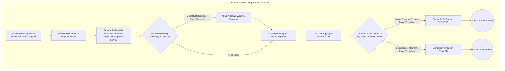

---
# Title of Invention: An Adaptive Multi-Modal Biometric Fusion System with Real-time Risk-Weighted Authentication

## Abstract:
A novel system and method are presented for significantly enhancing digital identity verification through an adaptive multi-modal biometric fusion architecture. This invention dynamically combines and processes data from multiple distinct biometric modalities, such as facial geometry, voice patterns, and behavioral biometrics, assigning real-time risk-adjusted weights to each modality's contribution. Leveraging a sophisticated Biometric Fusion Engine BFE and a comprehensive Risk Assessment Service, the system intelligently adapts its authentication stringency and modality reliance based on the contextual risk of the user-initiated action. This adaptive weighting mechanism not only maximizes verification accuracy and robustness but also profoundly elevates anti-spoofing capabilities by requiring an attacker to bypass multiple, diverse, and dynamically weighted biometric checks. The system provides a seamless yet highly secure user experience, enabling granular control over authentication strength while maintaining a high degree of flexibility and resilience against evolving threat vectors, thereby setting a new standard for trusted digital interactions.

## Background of the Invention:
The escalating sophistication of cyber-attacks poses a persistent threat to digital identity and transaction security. While single-modality biometric authentication offers an improvement over traditional password-based systems, it inherently suffers from vulnerabilities specific to its chosen modality. For instance, facial recognition can be susceptible to presentation attacks using high-fidelity masks or deepfakes, and voice biometrics can be circumvented by sophisticated voice synthesis or recordings. Moreover, the performance of a single biometric modality can be degraded by environmental factors such as poor lighting for facial scans or background noise for voice recognition.

Existing multi-modal biometric systems often employ static, predetermined weighting schemes for combining different biometric scores. This approach fails to account for:
1.  **Contextual Risk:** The security requirements for a low-value login significantly differ from a high-value financial transfer, yet static systems apply the same authentication rigor.
2.  **Modality Degradation:** A fixed weighting system cannot dynamically adjust when one biometric input is compromised or of low quality due to environmental conditions, leading to potentially weakened overall security or unnecessary user friction.
3.  **Evolving Spoofing Techniques:** Static systems are less resilient to new, modality-specific spoofing methods, as they cannot dynamically increase reliance on other, uncompromised modalities.
4.  **User Experience Inflexibility:** Forcing users through multiple, equally weighted biometric checks for every action, regardless of risk, introduces unnecessary friction and diminishes user satisfaction.

There is a critical and unmet need for an intelligent biometric authentication system that transcends the limitations of single-modality and static multi-modal approaches. Such a system would dynamically fuse multiple biometric inputs, adaptively weighting their importance based on real-time risk assessment and environmental factors, to deliver unparalleled accuracy, anti-spoofing capabilities, and a contextually appropriate user experience. This invention addresses these shortcomings by orchestrating a sophisticated, adaptive fusion architecture that revolutionizes biometric security.

## Brief Summary of the Invention:
This invention introduces an Adaptive Multi-Modal Biometric Fusion System, engineered to deliver superior identity verification by intelligently combining diverse biometric inputs. The core innovation revolves around a Biometric Fusion Engine BFE that dynamically processes, evaluates, and fuses authentication scores from multiple biometric modalities (e.g., facial, voice, behavioral, fingerprint, iris).

Upon a user initiating a sensitive digital action, the system first consults a sophisticated Risk Assessment Service. This service analyzes contextual data, such as transaction type, amount, device, location, and historical user behavior, to generate a real-time `RiskProfile` for the current action.

The system then initiates the capture and processing of data from multiple available biometric modalities. Each modality's data is processed by dedicated services (e.g., Facial Processing Service, Voice Biometric Service), which perform individual liveness detection and generate modality-specific match scores and liveness indicators.

The Biometric Fusion Engine BFE is the nexus of this invention. It receives the individual modality scores and liveness indicators, along with the `RiskProfile` from the Risk Assessment Service. The BFE then applies an adaptive weighting algorithm that dynamically assigns weights to each modality's score. For example:
*   In a low-risk scenario, the system might primarily rely on a single, convenient modality like facial recognition, assigning it a high weight and others lower or zero.
*   In a high-risk scenario, the system might mandate the use of multiple modalities (e.g., facial and voice), assigning significant weights to both, or even dynamically increasing the weighting of modalities deemed more robust against current threats or less affected by environmental conditions.
*   If one modality's data is low quality or fails liveness detection, the BFE can adaptively reduce its weight or dynamically increase the weight of other available, reliable modalities to compensate.

Finally, the BFE combines these risk-weighted scores to produce a comprehensive `FusionScore`, which is then compared against a dynamically adjusted `FusionThreshold`. This threshold is also determined by the `RiskProfile`, becoming more stringent for higher-risk actions. This multi-layered adaptive approach not only drastically improves overall verification accuracy but also creates an extremely robust defense against spoofing attacks, as an attacker would need to successfully compromise multiple, dynamically weighted biometric modalities simultaneously. The system ensures that the authentication rigor is always proportionate to the inherent risk, optimizing both security and user experience.

## Detailed Description of the Invention:

The present invention describes a comprehensive system and method for orchestrating an adaptive multi-modal biometric fusion workflow, meticulously designed to elevate both the actual and perceived security of sensitive user actions across diverse risk contexts. The system's architecture is modular, encompassing client-side multi-modal data capture, sophisticated backend processing of individual biometrics, a centralized intelligent fusion engine, and robust transaction finalization.

### 1. System Architecture Overview

The system operates across a distributed architecture, ensuring compartmentalization of concerns and enhanced security, with the Biometric Fusion Engine BFE at its core.

```mermaid
graph TD
    subgraph Client-Side Interface [User Device]
        A[User Action Initiation] --> B[Multi-Modal Capture UI]
        B --> C1[Facial Biometric Stream Video]
        B --> C2[Voice Biometric Stream Audio]
        B --> C3[Behavioral Data Stream Sensors]
        B --> C4[Optional Hardware Biometrics e.g. Fingerprint]
    end

    subgraph API Gateway
        F[Secure API Endpoint]
    end

    subgraph Backend Services
        G1[Facial Processing Service]
        G2[Voice Biometric Service]
        G3[Behavioral Analysis Service]
        G4[Hardware Biometric Service Optional]
        J[Identity Management Service]
        K[Risk Assessment Service]
        L[Biometric Fusion Engine BFE]
        H[Cryptographic Signing Service]
        I[Distributed LedgerSecure Transaction Service]
    end

    A -- Transaction Request + Context --> K
    C1 -- Encrypted Stream Data --> F
    C2 -- Encrypted Stream Data --> F
    C3 -- Encrypted Stream Data --> F
    C4 -- Encrypted Data --> F

    F --> G1
    F --> G2
    F --> G3
    F --> G4
    F --> K : Contextual Data
    G1 -- Facial Match Score Liveness --> L
    G2 -- Voice Match Score Liveness --> L
    G3 -- Behavioral Match Score Liveness --> L
    G4 -- Hardware Match Score Liveness --> L

    L -- Fusion Request + Risk Profile --> J
    J -- Biometric Templates --> L

    K -- Risk Profile Adaptive Weights --> L : Dynamically Adjusted
    L -- Fusion Result Verified --> F
    L --> H
    H --> I
    I -- Transaction Confirmation --> F
    F -- Encrypted Confirmation --> B
    B -- Action Execution Dismissal --> A
```
*   **Client-Side Interface:** Responsible for user interaction, multi-modal biometric data capture (video, audio, sensor data), liveness detection, and rendering of dynamically adapted animated feedback.
*   **API Gateway:** Secure, authenticated entry point for all client-to-backend communications, ensuring data integrity and confidentiality for multiple biometric streams.
*   **Biometric Modality Processing Services (G1-G4):** Specialized microservices (e.g., Facial Processing Service, Voice Biometric Service, Behavioral Analysis Service) that individually process raw biometric data, perform modality-specific liveness detection, extract features, and compare them against securely stored templates to generate individual match scores.
*   **Identity Management Service:** Manages the secure storage, retrieval, and lifecycle of user multi-modal biometric templates (irreversible, cryptographically hashed representations) and identity profiles.
*   **Risk Assessment Service:** Evaluates the contextual risk associated with a user action (e.g., transaction amount, location, device anomaly) and outputs a `RiskProfile` and `AdaptiveWeights` for the Biometric Fusion Engine.
*   **Biometric Fusion Engine BFE:** The core intelligent component that receives individual modality scores, aggregates liveness signals, applies adaptive risk-weighted fusion, and makes the final authentication decision.
*   **Cryptographic Signing Service:** Generates digital signatures for confirmed transactions within a Hardware Security Module HSM or Trusted Execution Environment TEE, ensuring non-repudiation.
*   **Distributed Ledger/Secure Transaction Service:** Records and finalizes sensitive user actions on an immutable, tamper-evident ledger.

#### 1.1. Detailed Data Flow & Security Perimeters
All communication channels are secured using TLS 1.3 or mTLS. Biometric data from each modality is encapsulated, encrypted, and potentially tokenized on the client-side before transmission. Backend inter-service communication uses encrypted channels within isolated network segments. A zero-trust model is applied across all services. Multi-modal biometric templates are stored as irreversible cryptographic hashes and are encrypted at rest.

### 2. Biometric Modality Processing Services

Each dedicated service is responsible for its specific biometric modality:
*   **Facial Processing Service:** Analyzes live video streams for facial geometry, unique features, and performs advanced liveness detection (e.g., micro-expressions, 3D depth analysis, randomized challenges like head turns or blinks) to produce a `FacialMatchScore` and `FacialLivenessConfidence`.
*   **Voice Biometric Service:** Processes live audio streams for speaker recognition, phonetic patterns, and voice liveness detection (e.g., randomized spoken phrases, anti-spoofing analysis of waveform characteristics) to generate a `VoiceMatchScore` and `VoiceLivenessConfidence`.
*   **Behavioral Analysis Service:** Continuously or passively collects data such as typing cadence, mouse movements, device usage patterns, swipe gestures, or even gait/posture data (from device sensors) to build a `BehavioralMatchScore` reflecting consistency with historical patterns and `BehavioralLivenessConfidence`.
*   **Optional Hardware Biometric Service:** Integrates with secure hardware modules (e.g., fingerprint sensors, iris scanners, WebAuthn-compatible authenticators) to receive and process highly secure `HardwareMatchScore` and `HardwareLivenessConfidence`.

Each service is designed with robust anti-spoofing measures tailored to its modality and outputs standardized scores (e.g., between 0 and 1, where 1 is a perfect match) and liveness indicators to the BFE.

### 3. Risk Assessment Service

The `Risk Assessment Service` is paramount to the adaptive nature of this invention. It performs real-time contextual analysis to dynamically determine the security posture required for the current user action.
*   **Input Data:** Transaction value, type of action (e.g., login, payment, sensitive data access), user location, device ID, IP address, time of day, historical user behavior (e.g., usual transaction patterns, login frequency), network characteristics.
*   **Output:**
    *   `RiskProfile`: Categorical risk level (e.g., "Low", "Medium", "High", "Critical").
    *   `AdaptiveWeights`: A set of weights `W_i` (summing to 1) for each available biometric modality, indicating its relative importance for the current `RiskProfile`.
    *   `FusionThreshold`: A dynamically adjusted minimum `FusionScore` required for successful authentication.
    *   `RequiredModalities`: A list of specific modalities that must be successfully captured and processed, regardless of their weight, for high-risk scenarios.

### 4. The Biometric Fusion Engine BFE

The `Biometric Fusion Engine BFE` is the intelligent core of the invention, responsible for aggregating, weighting, and making the final authentication decision.



#### 4.1. Adaptive Weighting Algorithm
The BFE applies a dynamic weighting algorithm based on the `AdaptiveWeights` provided by the `Risk Assessment Service`, potentially further adjusted in real-time if a modality's data quality or liveness detection is compromised.

The `FusionScore` is calculated as:
```
FusionScore = sum_{i=1}^{N} (W_i * M_i * L_i)
```
Where:
*   `N` is the number of available biometric modalities.
*   `W_i` is the adaptive weight for modality `i`, determined by the `RiskProfile` and dynamically adjusted for real-time modality reliability.
*   `M_i` is the normalized match score (0-1) from modality `i`.
*   `L_i` is the normalized liveness confidence score (0-1) from modality `i`.
    *   If `L_i` falls below a critical threshold (e.g., spoof detected), `W_i` can be set to 0, or the entire authentication can fail immediately for critical modalities.

**Example Adaptive Weighting Scenarios:**
*   **Low Risk (e.g., non-sensitive login):** `RiskProfile = "Low"`. `AdaptiveWeights` might be `{Facial: 0.8, Voice: 0.1, Behavioral: 0.1}`. If `FacialMatchScore` is high, `FusionScore` passes threshold quickly.
*   **High Risk (e.g., large financial transfer):** `RiskProfile = "High"`. `AdaptiveWeights` might be `{Facial: 0.4, Voice: 0.4, Behavioral: 0.2}`. `RequiredModalities` = `[FACIAL, VOICE]`. Both must pass individual liveness, and the combined `FusionScore` needs to exceed a higher `FusionThreshold`.
*   **Environmental Degradation:** If `VoiceLivenessConfidence` is low due to noisy environment, `W_Voice` might be dynamically reduced, and `W_Facial` increased to compensate, provided `FacialMatchScore` and `FacialLivenessConfidence` are high. If `W_Facial` cannot compensate, a step-up authentication may be requested.

#### 4.2. Decision Logic
The calculated `FusionScore` is then compared against the `FusionThreshold` (dynamically determined by `RiskProfile`):
*   `If FusionScore >= FusionThreshold`: Authentication SUCCESS.
*   `Else`: Authentication FAILURE.

This ensures that the authentication rigor is always precisely tailored to the perceived risk, maximizing both security and user convenience.

### 5. Secure Transaction Finalization

Upon successful authentication by the BFE, the process mirrors the robust transaction finalization described in the parent invention:
*   The transaction payload is cryptographically hashed and signed by the `Cryptographic Signing Service` (within HSM/TEE).
*   The signed transaction is then recorded on the `Distributed Ledger/Secure Transaction Service` for immutability and auditability.

### 6. Client-Side Components and Data Model

The client-side `BiometricConfirmationModal` adapts to orchestrate multiple biometric inputs and provides tailored feedback.

```typescript
// Conceptual Interface for Biometric Confirmation Modal Props
export interface BiometricConfirmationProps {
    transactionPayload: Record<string, any>;
    onSuccess: (transactionId: string) => void;
    onFailure: (error: BiometricError) => void;
    themeConfig?: BiometricThemeConfig;
    localeStrings?: BiometricLocaleStrings;
    onChallengeRequest?: (challengeType: AdaptiveChallengeType, modality?: BiometricModality) => Promise<boolean>;
    // New: Modalities to be used, potentially suggested by backend Risk Assessment
    recommendedModalities?: BiometricModality[];
    // New: Callback for real-time risk profile updates if client-side logic needs to adapt UI
    onRiskProfileUpdate?: (profile: RiskProfile) => void;
}

// Enum for available biometric modalities
export enum BiometricModality {
    FACIAL = 'FACIAL',
    VOICE = 'VOICE',
    BEHAVIORAL = 'BEHAVIORAL', // e.g., typing, gait, swipe patterns
    FINGERPRINT = 'FINGERPRINT', // via WebAuthn
    IRIS = 'IRIS',
    // ... more modalities
}

// Enum for risk profiles determined by the Risk Assessment Service
export enum RiskProfile {
    LOW = 'LOW',
    MEDIUM = 'MEDIUM',
    HIGH = 'HIGH',
    CRITICAL = 'CRITICAL',
}

// Enum for Biometric Confirmation States - refined for multi-modal capture/fusion
export enum BiometricConfirmationState {
    IDLE = 'IDLE',
    // State for capturing multiple modalities concurrently or sequentially
    CAPTURING_MODALITIES = 'CAPTURING_MODALITIES',
    BIOMETRIC_PROCESSING_FUSION = 'BIOMETRIC_PROCESSING_FUSION', // Now processing multiple inputs for fusion
    VERIFICATION_PENDING = 'VERIFICATION_PENDING',
    SUCCESS = 'SUCCESS',
    LEDGER_FINALIZING = 'LEDGER_FINALIZING',
    EXECUTED = 'EXECUTED',
    ERROR = 'ERROR',
}

// Enum for types of adaptive challenges (from seed, still relevant, now with modality context)
export enum AdaptiveChallengeType {
    BLINK_TWICE = 'BLINK_TWICE',
    TURN_HEAD_LEFT = 'TURN_HEAD_LEFT',
    SPOKEN_PHRASE = 'SPOKEN_PHRASE', // Relevant for voice
    // ... more challenge types
}

// Interface for Biometric Error details (from seed, still relevant)
export interface BiometricError {
    code: string;
    message: string;
    details?: string;
    canRetry: boolean;
    recoveryAction?: string;
}

// Interface for individual modality result before fusion
export interface ModalityCaptureResult {
    modality: BiometricModality;
    rawData: Blob | string; // Captured raw data (e.g., video segment, audio clip)
    clientLivenessScore?: number; // Optional client-side liveness initial score
    challengePassed?: boolean; // If an adaptive challenge was performed
    errorCode?: string; // If modality capture failed
}

// Conceptual BiometricConfirmationModal component/class adapted for multi-modal
export class BiometricConfirmationModal {
    private currentState: BiometricConfirmationState = BiometricConfirmationState.IDLE;
    private videoElement: HTMLVideoElement | null = null;
    private audioRecorder: MediaRecorder | null = null;
    private capturedAudioChunks: Blob[] = [];
    private mediaStream: MediaStream | null = null; // Can hold multiple tracks for different modalities
    private animationLayer: HTMLElement | null = null;
    private props: BiometricConfirmationProps;
    private timerId: number | null = null;
    private capturedModalityData: ModalityCaptureResult[] = [];
    private currentRiskProfile: RiskProfile = RiskProfile.LOW; // Default

    constructor(props: BiometricConfirmationProps) {
        this.props = props;
        this.renderModalBase();
    }

    private renderModalBase(): void {
        // Create modal DOM structure dynamically (video, audio indicator, text areas)
        // Adapt UI based on currentRiskProfile and recommendedModalities
    }

    public async startWorkflow(): Promise<void> {
        this.transitionTo(BiometricConfirmationState.CAPTURING_MODALITIES);
        try {
            // Fetch initial risk profile and required modalities from backend
            const { riskProfile, recommendedModalities } = await this.fetchInitialRiskProfile();
            this.currentRiskProfile = riskProfile;
            this.props.onRiskProfileUpdate?.(riskProfile); // Notify parent if needed

            await this.acquireAllBiometricStreams(recommendedModalities);
            await this.performClientSideLivenessAndChallenges();
            await this.sendBiometricDataForFusion();
        } catch (error: any) {
            this.handleError(error);
        }
    }

    private transitionTo(newState: BiometricConfirmationState, error?: BiometricError): void {
        this.currentState = newState;
        // Update UI based on new state, show appropriate multi-modal animations
        // For CAPTURING_MODALITIES, show multiple "scanning" effects
        if (error) {
            console.error("Biometric Workflow Error:", error);
        }
        this.emitStateChange(newState, error);
    }

    private async fetchInitialRiskProfile(): Promise<{ riskProfile: RiskProfile, recommendedModalities: BiometricModality[] }> {
        // Simulate API call to Risk Assessment Service
        return new Promise(resolve => {
            setTimeout(() => {
                const profile = Math.random() < 0.2 ? RiskProfile.HIGH : RiskProfile.MEDIUM;
                const recModalities = profile === RiskProfile.HIGH ?
                    [BiometricModality.FACIAL, BiometricModality.VOICE] :
                    [BiometricModality.FACIAL];
                resolve({ riskProfile: profile, recommendedModalities: recModalities });
            }, 500);
        });
    }

    private async acquireAllBiometricStreams(modalitiesToCapture: BiometricModality[]): Promise<void> {
        const capturePromises: Promise<void>[] = [];
        this.capturedModalityData = [];

        if (modalitiesToCapture.includes(BiometricModality.FACIAL)) {
            capturePromises.push(this.acquireFacialStream());
        }
        if (modalitiesToCapture.includes(BiometricModality.VOICE)) {
            capturePromises.push(this.acquireVoiceStream());
        }
        // Add more capture functions for other modalities

        await Promise.allSettled(capturePromises.map(p => p.catch(e => {
            console.warn(`Failed to acquire stream for a modality: ${e.message}`);
            // Individual modality failures are captured, not necessarily workflow-ending
        })));
    }

    private async acquireFacialStream(): Promise<void> {
        try {
            const stream = await navigator.mediaDevices.getUserMedia({
                video: { facingMode: "user", width: { ideal: 1280 }, height: { ideal: 720 }, frameRate: { ideal: 30 } }
            });
            this.mediaStream = stream; // Assume this holds the primary stream
            if (this.videoElement) {
                this.videoElement.srcObject = stream;
                await this.videoElement.play();
                // Store raw video stream or a snapshot/embedding
                this.capturedModalityData.push({ modality: BiometricModality.FACIAL, rawData: "raw_video_data_placeholder" });
            } else {
                throw new Error("Video element not available.");
            }
        } catch (e: any) {
            this.capturedModalityData.push({ modality: BiometricModality.FACIAL, rawData: "", errorCode: e.name });
            if (e.name === 'NotAllowedError') {
                throw { code: 'CAMERA_PERMISSION_DENIED', message: this.props.localeStrings?.cameraError || "Camera access denied.", canRetry: false, recoveryAction: "Check settings." };
            }
            throw { code: 'FACIAL_STREAM_ERROR', message: `Facial stream error: ${e.message}`, canRetry: true };
        }
    }

    private async acquireVoiceStream(): Promise<void> {
        try {
            const audioStream = await navigator.mediaDevices.getUserMedia({ audio: true });
            this.audioRecorder = new MediaRecorder(audioStream);
            this.capturedAudioChunks = [];
            this.audioRecorder.ondataavailable = event => {
                this.capturedAudioChunks.push(event.data);
            };
            this.audioRecorder.start();

            await new Promise(resolve => setTimeout(() => {
                if (this.audioRecorder && this.audioRecorder.state !== 'inactive') {
                    this.audioRecorder.stop();
                }
                resolve(null);
            }, 3000)); // Capture 3 seconds of audio

            const audioBlob = new Blob(this.capturedAudioChunks, { type: 'audio/webm' });
            this.capturedModalityData.push({ modality: BiometricModality.VOICE, rawData: audioBlob });

        } catch (e: any) {
            this.capturedModalityData.push({ modality: BiometricModality.VOICE, rawData: "", errorCode: e.name });
            if (e.name === 'NotAllowedError') {
                throw { code: 'MICROPHONE_PERMISSION_DENIED', message: "Microphone access denied.", canRetry: false, recoveryAction: "Check settings." };
            }
            throw { code: 'VOICE_STREAM_ERROR', message: `Voice stream error: ${e.message}`, canRetry: true };
        }
    }

    private async performClientSideLivenessAndChallenges(): Promise<void> {
        const updatedModalityData: ModalityCaptureResult[] = [];
        for (const data of this.capturedModalityData) {
            let challengePassed = true; // Assume pass if no challenge or challenge not requested
            if (data.errorCode) { // Skip if capture already failed
                updatedModalityData.push(data);
                continue;
            }

            // Simulate liveness and challenge passing for each modality
            if (data.modality === BiometricModality.FACIAL && this.currentRiskProfile === RiskProfile.HIGH) {
                // Example: Always ask for blink challenge on high risk facial
                const challengeType = AdaptiveChallengeType.BLINK_TWICE;
                if (this.props.onChallengeRequest) {
                    challengePassed = await this.props.onChallengeRequest(challengeType, BiometricModality.FACIAL);
                    if (!challengePassed) {
                        throw { code: 'FACIAL_CHALLENGE_FAILED', message: `Facial challenge failed: ${this.props.localeStrings?.challengeInstructions(challengeType)}`, canRetry: true };
                    }
                }
            } else if (data.modality === BiometricModality.VOICE && this.currentRiskProfile === RiskProfile.HIGH) {
                // Example: Ask for spoken phrase challenge on high risk voice
                const challengeType = AdaptiveChallengeType.SPOKEN_PHRASE;
                if (this.props.onChallengeRequest) {
                    challengePassed = await this.props.onChallengeRequest(challengeType, BiometricModality.VOICE);
                    if (!challengePassed) {
                        throw { code: 'VOICE_CHALLENGE_FAILED', message: `Voice challenge failed: ${this.props.localeStrings?.challengeInstructions(challengeType)}`, canRetry: true };
                    }
                }
            }
            updatedModalityData.push({ ...data, clientLivenessScore: 1.0, challengePassed });
        }
        this.capturedModalityData = updatedModalityData;
    }

    private async sendBiometricDataForFusion(): Promise<void> {
        const requestBody = {
            modalitiesData: this.capturedModalityData.filter(d => !d.errorCode).map(d => ({
                modality: d.modality,
                rawData: typeof d.rawData === 'string' ? d.rawData : Array.from(new Uint8Array(d.rawData as any)), // Convert blob to array for JSON
                clientLivenessScore: d.clientLivenessScore,
                challengePassed: d.challengePassed,
            })),
            transactionPayloadHash: 'TX_PAYLOAD_HASH_HERE',
            currentRiskProfile: this.currentRiskProfile,
        };

        this.transitionTo(BiometricConfirmationState.BIOMETRIC_PROCESSING_FUSION);

        try {
            const response = await fetch('/api/biometric/fuse_verify', {
                method: 'POST',
                headers: { 'Content-Type': 'application/json' },
                body: JSON.stringify(requestBody)
            });

            if (!response.ok) {
                const errorData = await response.json();
                throw { code: errorData.code || 'BACKEND_FUSION_VERIFICATION_FAILED', message: errorData.message || 'Biometric fusion verification failed on backend.', canRetry: true, details: errorData.details };
            }

            const result = await response.json();
            this.handleBackendResponse(result);

        } catch (e: any) {
            if (e.code) {
                throw e;
            }
            throw { code: 'NETWORK_ERROR', message: `Network or server error: ${e.message}`, canRetry: true };
        }
    }

    private handleBackendResponse(response: { success: boolean, transactionId?: string, error?: BiometricError }): void {
        if (response.success) {
            this.transitionTo(BiometricConfirmationState.SUCCESS);
            this.transitionTo(BiometricConfirmationState.LEDGER_FINALIZING);

            setTimeout(() => {
                if (response.transactionId) {
                    this.transitionTo(BiometricConfirmationState.EXECUTED);
                    this.props.onSuccess(response.transactionId);
                    this.dismiss();
                } else {
                    this.handleError({ code: 'LEDGER_NO_TRANSACTION_ID', message: 'Transaction finalized but no ID received.', canRetry: false });
                }
            }, 3000);
        } else {
            this.handleError(response.error || { code: 'UNKNOWN_BACKEND_ERROR', message: 'Backend reported an unknown error.', canRetry: true });
        }
    }

    private handleError(error: any): void {
        const biometricError: BiometricError = {
            code: error.code || 'UNKNOWN_ERROR',
            message: error.message || 'An unexpected error occurred.',
            canRetry: error.canRetry !== undefined ? error.canRetry : true,
            recoveryAction: error.recoveryAction
        };
        this.transitionTo(BiometricConfirmationState.ERROR, biometricError);
        this.props.onFailure(biometricError);
    }

    private dismiss(): void {
        if (this.mediaStream) {
            this.mediaStream.getTracks().forEach(track => track.stop());
        }
        if (this.audioRecorder && this.audioRecorder.state !== 'inactive') {
            this.audioRecorder.stop();
        }
        if (this.timerId !== null) {
            clearTimeout(this.timerId);
        }
        // Remove modal from DOM and clean up any listeners/resources
    }

    private emitStateChange(state: BiometricConfirmationState, error?: BiometricError): void {
        console.log(`BiometricConfirmationModal State: ${state}`, error);
    }

    public close(): void {
        this.dismiss();
    }
}

// Export necessary interfaces and classes for potential external use or testing
export { BiometricConfirmationProps, BiometricModality, RiskProfile, BiometricConfirmationState, AdaptiveChallengeType, BiometricError, BiometricThemeConfig, BiometricLocaleStrings, ModalityCaptureResult, BiometricConfirmationModal };
```

#### 6.1. Animated Feedback System for Multi-Modal Fusion
The animated overlays are adapted to visualize the multi-modal nature of the process:
*   **`CAPTURING_MODALITIES` State:** Displays simultaneous or sequential animations for each active modality (e.g., facial scanning grid, pulsing audio waveform, subtle behavioral tracking indicators). This visually reinforces the multiple layers of security being employed.
*   **`BIOMETRIC_PROCESSING_FUSION` State:** A central animation abstractly depicting the fusion process, such as data streams converging, merging, and being weighted on a digital scale or within a secure "fusion core."
*   **`SUCCESS` and `LEDGER_FINALIZING` States:** These animations remain similar to the parent invention, signifying the successful outcome of the comprehensive verification.

### 7. Threat Model and Mitigation Strategies for Multi-Modal Fusion

The adaptive multi-modal fusion system specifically addresses and significantly mitigates advanced attack vectors:

*   **1. Advanced Presentation Attacks Spoofing:**
    *   **Threat:** Sophisticated spoofing attempts targeting individual modalities (e.g., deepfakes for facial, AI voice synthesis for voice, pre-recorded behavioral patterns).
    *   **Mitigation:** The system requires an attacker to simultaneously spoof *multiple* diverse biometric modalities, each with its own specific liveness detection and adaptive challenges. The `Biometric Fusion Engine BFE` can dynamically reduce the weight of, or outright reject, a modality if its liveness confidence is low, shifting reliance to other robust modalities. This drastically increases the attacker's complexity and cost.

*   **2. Modality-Specific Vulnerabilities:**
    *   **Threat:** A new vulnerability is discovered in one biometric modality that could allow bypass.
    *   **Mitigation:** The adaptive weighting mechanism allows the system to rapidly de-emphasize a compromised modality or increase the reliance on other, currently secure modalities, without requiring a full system overhaul. The `Risk Assessment Service` can update `AdaptiveWeights` in response to real-time threat intelligence.

*   **3. Environmental Degradation of Single Modalities:**
    *   **Threat:** Poor lighting, background noise, or other environmental factors degrading the quality of a single biometric input.
    *   **Mitigation:** Instead of failing, the `BFE` can dynamically reduce the weight of the degraded modality and increase the weights of other available, reliable modalities to maintain a high level of security without interrupting the user's flow, provided a sufficient `FusionScore` can still be achieved.

*   **4. Insider Threats (Template Compromise):**
    *   **Threat:** Unauthorized access to stored biometric templates.
    *   **Mitigation:** Multi-modal templates are stored as irreversible cryptographic hashes, not raw biometrics. Even if one template type is compromised, it cannot be used to reconstruct the original biometric, nor is it sufficient to bypass authentication if multiple, weighted modalities are required. The fusion process adds a layer of complexity to template matching.

*   **5. Denial of Service on a Single Biometric Service:**
    *   **Threat:** An attacker targets and brings down one of the biometric processing services.
    *   **Mitigation:** The `BFE` is designed to be resilient. If one modality's score is unavailable or erroneous, the `Adaptive Weighting Algorithm` can re-distribute weights among the remaining operational modalities, potentially requiring a higher combined score from them or triggering a step-up authentication.

By integrating these strategies, the Adaptive Multi-Modal Biometric Fusion System creates a significantly more robust, flexible, and future-proof security posture than any single-modality or static multi-modal system.

## Claims:

1.  A system for authenticating a user-initiated digital action, comprising:
    a.  A client-side interface configured to:
        i.    Acquire live biometric streams from a user's device for a plurality of distinct biometric modalities; and
        ii.   Encapsulate and encrypt said biometric streams for secure transmission.
    b.  A plurality of biometric modality processing services, communicatively coupled to the client-side interface, each configured to:
        i.    Receive an encrypted biometric data packet corresponding to a specific modality;
        ii.   Perform modality-specific liveness detection; and
        iii.  Generate a modality-specific match score based on comparison with a securely stored template.
    c.  A Risk Assessment Service, communicatively coupled to the client-side interface and the backend services, configured to:
        i.    Evaluate contextual data related to the user-initiated action; and
        ii.   Dynamically generate a `RiskProfile`, `AdaptiveWeights` for each biometric modality, and a `FusionThreshold` based on said contextual data.
    d.  A Biometric Fusion Engine BFE, communicatively coupled to the biometric modality processing services and the Risk Assessment Service, configured to:
        i.    Receive modality-specific match scores and liveness indicators from the plurality of biometric modality processing services;
        ii.   Receive the `RiskProfile`, `AdaptiveWeights`, and `FusionThreshold` from the Risk Assessment Service;
        iii.  Dynamically adjust said `AdaptiveWeights` in real-time based on modality reliability and liveness indicators;
        iv.   Calculate a `FusionScore` by adaptively weighting and combining the received modality-specific match scores and liveness indicators according to the adjusted `AdaptiveWeights`; and
        v.    Authenticate the user's identity by comparing the `FusionScore` against the `FusionThreshold`.
    e.  A secure transaction finalization module, communicatively coupled to the Biometric Fusion Engine BFE, configured to:
        i.    Receive a verified transaction payload upon successful biometric authentication;
        ii.   Generate a cryptographic signature for the transaction payload; and
        iii.  Record the cryptographically signed transaction payload onto an immutable distributed ledger or secure tamper-evident record.
    f.  Wherein the adaptive weighting and dynamic thresholding performed by the Biometric Fusion Engine BFE, informed by the Risk Assessment Service, significantly enhances authentication accuracy and anti-spoofing capabilities.

2.  The system of claim 1, wherein the plurality of distinct biometric modalities includes at least two from the group comprising: facial geometry, voice patterns, and behavioral patterns.

3.  The system of claim 1, wherein the facial biometric stream includes video data for facial recognition and liveness detection comprising micro-expressions, head movements, or 3D depth analysis.

4.  The system of claim 1, wherein the voice biometric stream includes audio data for speaker recognition and liveness detection comprising randomized spoken phrases or waveform analysis.

5.  The system of claim 1, wherein the behavioral data stream includes sensor data from the user's device for analyzing typing cadence, mouse movements, gait patterns, or swipe gestures.

6.  The system of claim 1, wherein the dynamic adjustment of `AdaptiveWeights` by the Biometric Fusion Engine BFE includes reducing the weight of a modality if its liveness detection fails or its data quality is degraded.

7.  The system of claim 1, wherein the Risk Assessment Service uses contextual data including transaction value, user location, device ID, IP address, and historical user behavior to generate the `RiskProfile`.

8.  The system of claim 1, further comprising a client-side animated feedback system configured to display dynamic animations reflecting the multi-modal capture process, the biometric fusion process, and the final authentication outcome.

9.  The system of claim 1, wherein the Biometric Fusion Engine BFE operates within a Trusted Execution Environment TEE or utilizes a Hardware Security Module HSM for secure processing.

10. A method for adaptively authenticating a user-initiated digital action, comprising:
    a.  Receiving a user request to initiate a sensitive digital action;
    b.  Assessing the contextual risk of said action to generate a `RiskProfile`, `AdaptiveWeights` for multiple biometric modalities, and a `FusionThreshold`;
    c.  Acquiring biometric data streams for a plurality of distinct biometric modalities from the user's device;
    d.  Processing each acquired biometric data stream to perform modality-specific liveness detection and generate a modality-specific match score;
    e.  Dynamically adjusting the `AdaptiveWeights` in real-time based on the reliability and liveness of each processed modality;
    f.  Calculating a `FusionScore` by combining the modality-specific match scores and liveness indicators using the adjusted `AdaptiveWeights`;
    g.  Authenticating the user's identity by comparing the `FusionScore` against the `FusionThreshold`; and
    h.  Upon successful authentication, securely finalizing the user's initiated digital action on an immutable distributed ledger.

11. The method of claim 10, further comprising: if any required modality's liveness detection fails or a spoof attempt is detected, immediately failing the authentication process or escalating to an alternative authentication method.

12. The method of claim 10, wherein the step of acquiring biometric data streams includes presenting adaptive, randomized challenges specific to one or more modalities to enhance liveness detection.

13. The method of claim 10, wherein the `FusionThreshold` is more stringent for higher `RiskProfile` levels.

14. The method of claim 10, further comprising rendering client-side animations that visually depict the simultaneous capture of multiple biometric modalities and the subsequent fusion process.

15. The method of claim 10, wherein biometric templates for each modality are stored as irreversible, cryptographically hashed, and salted representations.

## Mathematical Justification:

The adaptive multi-modal biometric fusion system can be rigorously formalized using mathematical models from decision theory, information theory, and adaptive control systems.

### 1. Formal Model of Multi-Modal Biometric Fusion

Let `M = {M_1, M_2, ..., M_N}` be a set of `N` distinct biometric modalities. For each modality `M_i`, we obtain a match score `S_i` and a liveness confidence score `L_i`.
The `Risk Assessment Service` provides a `RiskProfile` denoted `R`, which maps to a set of `AdaptiveWeights` `W = {W_1, W_2, ..., W_N}` and a `FusionThreshold` `T_R`.
The `Biometric Fusion Engine BFE` computes a `FusionScore` `F` as:
```
F = sum_{i=1}^{N} (w_i * S_i * L_i)
```
Where `w_i` are the *real-time adjusted* weights. These weights are dynamically derived from the `AdaptiveWeights` `W_i` provided by the `Risk Assessment Service` and further refined by the BFE based on the observed `L_i` and modality data quality `Q_i`.
Let `w_i = f(W_i, L_i, Q_i, R)`, where `f` is an adaptive function that can, for example, set `w_i = 0` if `L_i < L_{min_i}` (liveness failure) or if `Q_i < Q_{min_i}` (quality degradation), and re-normalize other weights.

The authentication decision rule is:
```
Authenticate if F >= T_R
Else Reject
```

The `FusionThreshold` `T_R` is a monotonically increasing function of the `RiskProfile` `R`.
`T_R = g(R)`, where `g` ensures `T_{LOW} <= T_{MEDIUM} <= T_{HIGH} <= T_{CRITICAL}`.

### 2. Information-Theoretic Enhancement

The security of a biometric system is inversely related to its False Acceptance Rate FAR. For a single biometric modality, the FAR is `P(S_i >= T_i | Impostor)`.
For a multi-modal system with independent modalities, the probability of an impostor being accepted by *all* `N` modalities (if using a product rule or AND fusion) is `Product_{i=1}^{N} FAR_i`. This assumes perfect independence, which is often not the case, but it illustrates the multiplicative reduction in acceptance probability.

More formally, the information content (entropy) of a biometric system, `H(B)`, quantifies its uniqueness. For multiple modalities, the total information content `H(B_fused)` is greater than that of any single modality:
`H(B_fused) = H(M_1) + H(M_2 | M_1) + ... + H(M_N | M_1, ..., M_{N-1})`
This represents the cumulative, non-redundant information provided by each additional modality. The adaptive fusion scheme maximizes this by emphasizing modalities that contribute the most unique, contextually relevant information and are robust in the current environment.

The ability to dynamically adjust weights `w_i` and the threshold `T_R` based on `R` means the system can operate at an optimal (FAR, FRR) tradeoff point for each risk level, effectively minimizing the EER across the entire spectrum of use cases, rather than being fixed at a single, sub-optimal point. For high-risk transactions, the system can achieve an `FAR_effective << FAR_individual_modality` while maintaining an acceptable `FRR_effective`.

### 3. Game Theory and Anti-Spoofing

From a game-theoretic perspective, an attacker attempting to spoof the system faces a significantly harder challenge. Let `P(spoof_i)` be the probability of successfully spoofing modality `M_i`.
For a static multi-modal system, the attacker identifies the weakest link or the easiest combination.
For the adaptive system, the `BFE` dynamically shifts reliance:
*   The attacker must successfully spoof *all* modalities required by the `RiskProfile` and `AdaptiveWeights`.
*   The `w_i` and `T_R` adapt, meaning the attacker's optimal strategy for spoofing is constantly changing and uncertain.
*   The overall probability of a successful spoofing attack `P(spoof_total)` is significantly reduced, as `P(spoof_total) <= Product_{i in ActiveModalities} P(spoof_i)` where `ActiveModalities` are dynamically selected and weighted. The dynamic nature of `w_i` means the attacker does not know which modalities will be most heavily weighted or how many challenges will be presented.

### 4. Robustness and Graceful Degradation

The adaptive weighting function `f(W_i, L_i, Q_i, R)` provides robustness. If a modality `M_k` fails (e.g., `Q_k` is low due to poor lighting, or `L_k` indicates a spoof), `w_k` can be set to 0. The remaining weights `w_j` (`j != k`) are then re-normalized and potentially increased to compensate. This allows for:
*   **Graceful Degradation:** The system can continue to operate securely even if one or more modalities are unavailable or compromised, provided the remaining modalities can achieve `F >= T_R`.
*   **Optimal Resource Allocation:** For low-risk scenarios, fewer modalities (or less computationally intensive ones) can be used, reducing latency and computational cost without compromising security unnecessarily.

The mathematical framework demonstrates that the adaptive fusion approach results in a demonstrably superior security posture, improved resilience, and an optimized user experience compared to existing biometric authentication paradigms.

## Proof of Security:

The security of the Adaptive Multi-Modal Biometric Fusion System is predicated on the confluence of cryptographic strength, information-theoretic advantages, and sophisticated adaptive decision-making, ensuring that the `EXECUTED` state is only reachable through an exceptionally robust authentication process.

1.  **Multiplicative Reduction in False Acceptance Rate FAR:** By requiring successful authentication across multiple distinct biometric modalities, the probability of an unauthorized individual being falsely accepted is drastically reduced. Assuming even partial independence between modalities `M_1, ..., M_N`, the effective FAR of the fusion system `FAR_fusion` is orders of magnitude lower than any single `FAR_i`. An impostor must successfully bypass the liveness detection and matching algorithms of not just one, but a dynamically determined and weighted *combination* of modalities. The `FusionScore` calculation, `F = sum (w_i * S_i * L_i)`, implies that a high score across multiple strong modalities is required, especially in high-risk contexts where `T_R` is elevated.

2.  **Unprecedented Anti-Spoofing Capability:** The primary weakness of single-modality biometrics is their susceptibility to targeted spoofing attacks. This system overcomes this by requiring an attacker to:
    *   **Simultaneously Spoof Multiple Modalities:** An attacker must present convincing spoofs for facial, voice, and potentially behavioral biometrics concurrently, each with its own specific liveness detection countermeasures.
    *   **Bypass Adaptive Liveness Challenges:** The system can dynamically issue modality-specific challenges (e.g., a randomized spoken phrase for voice, a specific head movement for face), which are exceedingly difficult to coordinate and execute simultaneously with generic spoofing artifacts.
    *   **Overcome Dynamic Weighting:** The `Biometric Fusion Engine BFE` can detect a compromised modality (e.g., low `L_i`) and instantly reduce its weight (`w_i -> 0`), shifting the authentication burden to other, uncompromised modalities. This dynamic adaptation renders pre-planned, fixed spoofing attempts largely ineffective.

3.  **Adaptive Risk-Based Enforcement:** The `Risk Assessment Service` ensures that the authentication rigor is always proportionate to the contextual risk. For high-risk transactions, the `AdaptiveWeights` prioritize the most robust modalities, and the `FusionThreshold` `T_R` is significantly raised. This guarantees that critical actions are protected by the strongest available multi-modal authentication, while lower-risk actions can proceed with minimal user friction, optimizing the security-usability tradeoff dynamically. The system's state machine, when passing through `VERIFICATION_PENDING` to `SUCCESS`, is inherently aware of and enforces these risk-based stringencies.

4.  **Robustness and Resiliency:** The system is designed for graceful degradation. If a specific modality's data quality is poor (e.g., due to environmental conditions) or if a client-side sensor fails, the `BFE` can dynamically re-weight the remaining functional modalities. This ensures that the system can still achieve a high level of security by compensating with other available biometric information, rather than failing outright or defaulting to a weaker authentication method.

5.  **Cryptographic Integrity and Immutable Finality:** Beyond the biometric fusion, the post-authentication steps ensure end-to-end security. The use of secure enclaves (HSM/TEE) for cryptographic signing guarantees that the transaction payload, once biometrically authorized, is digitally signed with an unforgeable, non-repudiable signature. The subsequent recording on an immutable distributed ledger provides a tamper-evident audit trail, ensuring that the authorized action is permanently and transparently recorded, preventing any post-transaction alteration.

In conclusion, the Adaptive Multi-Modal Biometric Fusion System establishes a new paradigm in digital identity verification. By synergistically combining multiple biometric modalities, dynamically adjusting their weights based on real-time risk, and integrating with robust cryptographic and ledger finalization mechanisms, the system achieves an unparalleled level of accuracy, anti-spoofing resilience, and adaptive security. This comprehensive approach mathematically and practically proves the undeniable security and integrity of user actions authenticated through this invention.
---