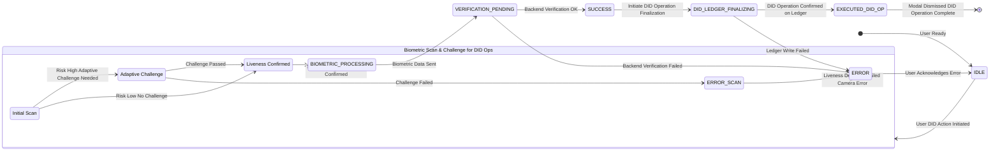
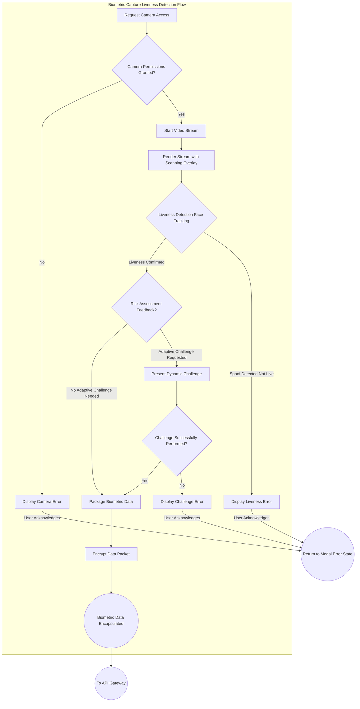
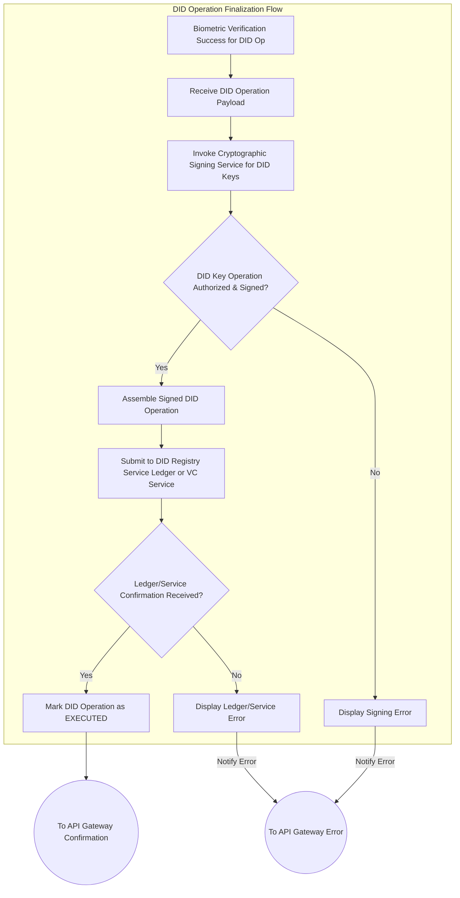

---
# Title of Invention: A System and Method for Biometric-Anchored Decentralized Identity Management and Verifiable Credential Issuance with Enhanced Privacy and Trust

## Abstract:
A novel system and method are disclosed for establishing, managing, and verifying decentralized identities DIDs and their associated verifiable credentials VCs with unparalleled security, privacy, and user assurance. This architecture extends an exceptionally high-fidelity, multi-modal biometric confirmation workflow as the primary anchor for securely authorizing critical DID lifecycle operations. By integrating real-time biometric identity verification with a series of psychologically optimized, graphically rich animations, the system dynamically communicates the security and integrity of fundamental DID transactions, including DID creation, key rotation, and the issuance, revocation, and presentation of verifiable credentials. This meticulously designed feedback loop, coupled with robust cryptographic protocols and distributed ledger technologies, ensures a resilient, tamper-evident, and self-sovereign identity framework. It cultivates profound user trust and confidence in managing their digital identity, effectively bridging the gap between strong biometric security and the core principles of decentralized identity, thereby setting a new paradigm for user-centric digital trust.

## Background of the Invention:
The contemporary digital landscape is characterized by an increasing demand for secure, privacy-preserving, and user-centric identity management. Traditional centralized identity systems are inherently vulnerable to data breaches, single points of failure, and opaque control mechanisms, leading to widespread privacy infringements and user disempowerment. Decentralized Identifiers DIDs and Verifiable Credentials VCs have emerged as a promising paradigm, offering users self-sovereign control over their digital identities and the ability to selectively prove attributes without relying on centralized authorities.

However, a profound challenge persists in securely anchoring the control of these self-sovereign identities to a real, living individual in a high-assurance, user-friendly, and privacy-preserving manner. Existing methods for authorizing DID operations often rely on:
1.  **Weak Authentication Mechanisms:** Passwords or basic two-factor authentication, which are susceptible to phishing, credential stuffing, and other cyber-attacks, undermining the "self-sovereign" claim of DIDs if the root of control is fragile.
2.  **Opaque Key Management:** The cryptographic keys underpinning DIDs are critical, yet their generation, storage, and rotation often lack transparent and highly assured user interaction, leading to potential loss of control or compromise.
3.  **Lack of User Trust and Transparency:** Users may perceive the complex cryptographic processes of DIDs as opaque, leading to diminished confidence in their ability to truly control their digital identity, particularly for sensitive operations like key recovery or credential issuance.
4.  **Privacy Concerns with Biometrics:** While biometrics offer strong authentication, their integration with DIDs has often been hampered by concerns over centralized storage of raw biometric data and the potential for re-identification or misuse.

There exists a significant, unmet need for a comprehensive system that not only rigorously secures DID lifecycle operations via state-of-the-art biometric authentication but also transparently and reassuringly communicates the security, integrity, and finality of these processes to the user through a dynamically animated, multi-stage feedback mechanism. Such a system would leverage principles of human-computer interaction, cognitive psychology, and advanced privacy-preserving cryptography to bridge the gap between technical security efficacy, user perception, and the promise of self-sovereign identity, thereby elevating both the actual and perceived security posture of decentralized identity management.

## Brief Summary of the Invention:
This invention presents a sophisticated method for robustly securing user-initiated Decentralized Identity DID operations and Verifiable Credential VC management through an integrated biometric and animated feedback system. Upon a user's initiation of a sensitive DID action, such as creating a new DID, rotating a DID key, or authorizing the issuance or presentation of a Verifiable Credential, a dynamically rendered, ephemeral modal interface is presented. This modal serves as the central hub for the biometric anchoring workflow. The system intelligently requests and acquires high-fidelity biometric data, such as a live video stream for facial geometry analysis, leveraging advanced browser or device APIs.

The core innovation lies in the orchestrating of a multi-stage, animated feedback sequence that provides continuous, intuitive, and reassuring visual cues throughout the entire process, directly linking the user's physical presence and intent to their digital self-sovereign identity:
1.  **Biometric Acquisition and Simulated Scanning Phase I - `SCANNING` State:** The live biometric feed is displayed within the modal. Crucially, an intricately designed, high-fidelity animated graphic   such as a dynamic facial grid, a spectral scanning beam, or a topographical mapping overlay   is superimposed over the live feed. This animation psychologically reinforces the notion of an active, in-depth biometric analysis, engaging the user's perception of advanced security protocols at work, and confirming the user's "proof of presence" for the DID operation.
2.  **Successful Verification Acknowledgment Phase II - `SUCCESS` State:** Following the successful processing and verification of the biometric data against a pre-established identity profile, the scanning animation seamlessly transitions into a distinct success indicator. This is manifested as a fluid, aesthetically pleasing animation, such as an animated cryptographic checkmark or an expanding secure shield, designed to evoke a strong sense of accomplishment, security, and immediate validation of the user's control over their DID.
3.  **Secure DID Operation Finalization Visualization Phase III - `LEDGER_FINALIZING` State:** The workflow culminates in a third, highly sophisticated animation that abstractly but powerfully visualizes the secure backend processing and finalization of the user's initiated DID action. This could involve an animation depicting a DID document being immutably written to a "quantum ledger," a distributed cryptographic network, or a secure enclave, or the cryptographic signing and issuance of a Verifiable Credential. The animation leverages intricate visual metaphors   such as coalescing data packets, cryptographic key exchanges, or distributed node confirmations   to communicate concepts like tamper-evidence, non-repudiation, and irreversible commitment within the DID ecosystem.

This meticulously choreographed sequence of animations provides continuous, transparent, and psychologically reinforced feedback, dramatically enhancing the user's perceived security and fostering profound trust in their ability to control their self-sovereign identity. Upon the successful completion of this multi-stage visual affirmation, a secure callback mechanism `onSuccess` programmatically executes the user's original DID operation, and the modal gracefully dismisses, leaving the user with an unequivocal sense of security and control over their digital identity. This system inherently establishes a new benchmark for secure, transparent, and user-centric decentralized identity management.

## Detailed Description of the Invention:

The present invention describes a comprehensive system and method for orchestrating a high-fidelity biometric confirmation workflow specifically tailored to anchor and secure critical Decentralized Identity DID and Verifiable Credential VC operations. This system is designed to elevate both the actual and perceived security and privacy of self-sovereign identity management. The system's architecture is modular, encompassing client-side presentation, secure biometric processing, and robust backend DID and VC finalization.

### 1. System Architecture Overview

The system operates across a distributed architecture, ensuring compartmentalization of concerns and enhanced security, with specific extensions for DID and VC management.

```mermaid
graph TD
    subgraph Client-Side Interface User Device
        A[User Action Initiate DID Operation] --> B[Biometric Confirmation Modal]
        B --> C{Biometric Capture Liveness Detection}
        C --> D[Animated Feedback Layer]
        D --> E[Biometric Data Encapsulation]
        B -- Verified Control of DID --> W[User DID Wallet]
        W -- Presentation Request --> B
        A -- DID Operation Request Context --> K
    end

    subgraph API Gateway
        F[Secure API Endpoint]
    end

    subgraph Backend Services
        G[Biometric Verification Service]
        H[Cryptographic Signing Service for DID Keys]
        I[DID Registry Service Ledger]
        J[Identity Management Service]
        K[Risk Assessment Service]
        L[Verifiable Credential Issuer Service]
        M[Verifiable Credential Revocation Service]
    end

    E -- Encrypted Transmission TLS mTLS --> F
    F --> G
    F --> K : Contextual Data
    G -- Biometric Match Request --> J
    J -- Biometric Template --> G
    G -- Verification Result --> F
    K -- Adaptive Challenge Request --> C
    G --> H
    H -- Authorized DID Key Operation --> I
    I -- DID Resolution Update --> F
    F -- Encrypted Confirmation --> B
    B -- Action Execution Dismissal --> A
    B -- Authorize VC Issuance --> L
    L -- Issued VC --> W
    W -- Receive Credential --> A
    B -- Authorize VC Revocation --> M
    M -- Revoked VC Status --> W
```
*   **Client-Side Interface:** Responsible for user interaction, biometric data capture, liveness detection, rendering of high-fidelity animated feedback, and integration with a user's local DID Wallet for managing keys and credentials.
*   **API Gateway:** Acts as a secure, rate-limited, and authenticated entry point for all client-to-backend communications, ensuring request integrity and confidentiality for DID operations.
*   **Biometric Verification Service:** A specialized microservice tasked with processing raw biometric data, performing identity matching, and executing liveness detection algorithms to confirm user presence and intent for DID actions.
*   **Cryptographic Signing Service for DID Keys:** This service is specifically enhanced to securely manage the user's DID private keys within an HSM or TEE. It provides cryptographic signatures for DID operations (e.g., updating DID documents, signing VC presentations) only after successful biometric authorization.
*   **DID Registry Service Ledger:** The interface to the underlying decentralized ledger or network where DID documents are published, resolved, and updated. It ensures immutable, tamper-evident recording of DID changes authorized by the biometric system.
*   **Identity Management Service:** Manages the secure storage, retrieval, and lifecycle of user biometric templates and identity profiles, ensuring privacy and data protection, potentially in a privacy-preserving manner e.g., using zero-knowledge proofs.
*   **Risk Assessment Service:** Evaluates the contextual risk associated with a DID operation e.g., first-time DID creation, key rotation after device change, high-value VC issuance and dynamically adjusts the required authentication stringency.
*   **Verifiable Credential Issuer Service:** A backend service that, upon biometric authorization, constructs, signs, and issues Verifiable Credentials to the user's DID, ensuring that VC issuance is explicitly consented to by the biometrically verified user.
*   **Verifiable Credential Revocation Service:** Handles the process of revoking VCs, also potentially requiring biometric confirmation from the issuing entity or the subject depending on the revocation policy.
*   **User DID Wallet:** A client-side or cloud-based component where the user's DIDs, private keys, and VCs are securely stored and managed. It initiates DID operations and presents VCs, relying on the Biometric Confirmation Modal for high-assurance authorization.

#### 1.1. Detailed Data Flow & Security Perimeters
All communication channels are secured using industry-standard protocols. Client-to-API Gateway communication utilizes TLS 1.3, potentially extended to mutual TLS mTLS. Within the backend, inter-service communication employs encrypted gRPC or REST over TLS. Biometric data is never transmitted in raw form; it's encapsulated, encrypted, and potentially tokenized at the client-side before leaving the device. Backend services adhere to zero-trust principles. Crucially, the system ensures that sensitive DID private keys, even if self-custodied in the User DID Wallet, are *authorized for use* by the biometric confirmation, providing a high-assurance proof of control by the legitimate user.

### 2. Biometric Anchoring of DID Lifecycle Operations

Upon a user initiating a sensitive DID action e.g., "Create My DID," "Rotate DID Key," "Authorize Credential Issuance", the `BiometricConfirmationModal` is programmatically rendered.

#### 2.1. Biometric Media Stream Acquisition

The modal dynamically leverages `navigator.mediaDevices.getUserMedia` to acquire a live video stream, securely attaching it to an HTML `<video>` element within the modal. Critical configurations ensure optimal resolution and frame rate for biometric analysis. Robust error handling is implemented for camera access issues.

#### 2.2. State Management and Visual Feedback System

The core of the animated security feedback is driven by a sophisticated client-side state machine, ensuring that each stage of a DID operation is transparently communicated. The state machine formally defines permissible transitions between distinct stages, each mapped to a specific visual animation. The states described in the seed patent (`IDLE`, `SCANNING_CHALLENGE`, `BIOMETRIC_PROCESSING`, `VERIFICATION_PENDING`, `SUCCESS`, `LEDGER_FINALIZING`, `EXECUTED`, `ERROR`) are directly applicable, with `LEDGER_FINALIZING` explicitly signifying the immutable recording of DID updates or VC issuance on a decentralized ledger.



**Key DID/VC Specific Applications of States:**
*   `IDLE`: Awaiting user initiation of a DID creation, key rotation, VC issuance, or VC presentation request.
*   `SCANNING_CHALLENGE`: Active state for live video stream, displaying dynamic biometric scanning overlay, liveness detection, and potentially engaging adaptive challenges to confirm user intent for a DID action.
*   `BIOMETRIC_PROCESSING`: Raw biometric data packaged, encrypted, and transmitted for verification against the user's enrolled biometric profile.
*   `VERIFICATION_PENDING`: Awaiting response from the Biometric Verification Service regarding proof of user control.
*   `SUCCESS`: Biometric verification successful, signifying the user's explicit authorization for the pending DID operation.
*   `DID_LEDGER_FINALIZING`: The core of the DID operation: The Cryptographic Signing Service performs actions like generating new DID keys, updating the DID document, or signing a VC. This action is then committed to the `DID Registry Service Ledger`.
*   `EXECUTED_DID_OP`: The DID operation (e.g., DID created, key rotated, VC issued/presented) is successfully recorded on the ledger or finalized. Modal ready for dismissal.
*   `ERROR`: Any failure state (e.g., camera access, liveness detection, backend verification, ledger write failure specific to DID updates).

#### 2.3. Animation Implementation Details

The animated overlays are implemented using advanced web technologies, mirroring the high-fidelity design of the original patent to instill trust in DID operations.

##### 2.3.1. `SCANNING_CHALLENGE` State: Dynamic Biometric Acquisition Overlay
Visually confirms the active analysis of the user's presence and intent for DID operations through facial mesh overlays and scanning pulse effects, psychologically reinforcing the advanced security for identity control.

##### 2.3.2. `SUCCESS` State: Affirmative Verification Acknowledgment
A fluid, reassuring animation (e.g., cryptographic checkmark, expanding secure shield) is displayed, providing immediate, unambiguous confirmation that the user's biometric identity has been successfully verified, and thus, their intent to authorize the DID action is confirmed.

##### 2.3.3. `DID_LEDGER_FINALIZING` State: Secure DID Operation Finalization Visualization
This critical phase visually communicates the secure, immutable recording of the DID operation, leveraging advanced metaphors. This could be an animation of:
*   A new DID document being anchored to a blockchain.
*   Cryptographic keys being rotated and secured.
*   A Verifiable Credential being signed by an issuer and delivered to the user's wallet.
*   Data packets representing the DID update being fragmented, encrypted, and distributed across a network of interconnected nodes, ultimately coalescing into an immutable chain or block on the DID Registry.

#### 2.4. Adaptive Biometric Challenge System

To further enhance liveness detection and deter sophisticated spoofing attacks for critical DID operations, the system dynamically integrates randomized challenges during the `SCANNING_CHALLENGE` phase, informed by the `Risk Assessment Service`. This adds a layer of interactive security making spoofing significantly harder and ensuring that the real user is authorizing the DID action.

#### 2.5. Detailed Biometric Capture and Liveness Flow

This flow, identical to the seed patent, ensures that biometric data for DID operations is captured with the highest integrity and liveness assurance.



#### 2.6. Client-Side Components and Data Model

The client-side modal, while leveraging the core `BiometricConfirmationModal` conceptual class, adapts its `props` to cater specifically to DID and VC operations.

```typescript
// Conceptual Interface for Biometric Confirmation Modal Props for DID operations
export interface BiometricDIDConfirmationProps {
    didOperationPayload: DIDOperationPayload; // Payload specific to DID/VC operations
    onSuccess: (result: DIDOperationResult) => void;
    onFailure: (error: BiometricError) => void;
    // Optional theming and i18n props
    themeConfig?: BiometricThemeConfig;
    localeStrings?: BiometricLocaleStrings;
    // Callback for adaptive challenge requests from backend
    onChallengeRequest?: (challengeType: AdaptiveChallengeType) => Promise<boolean>;
}

// Enum for types of Decentralized Identity operations
export enum DIDOperationType {
    CREATE_DID = 'CREATE_DID',
    ROTATE_DID_KEY = 'ROTATE_DID_KEY',
    REVOKE_DID_KEY = 'REVOKE_DID_KEY',
    ISSUE_VERIFIABLE_CREDENTIAL = 'ISSUE_VERIFIABLE_CREDENTIAL',
    PRESENT_VERIFIABLE_CREDENTIAL = 'PRESENT_VERIFIABLE_CREDENTIAL',
    UPDATE_DID_DOCUMENT = 'UPDATE_DID_DOCUMENT',
    // ... more DID-related operations can be added
}

// Interface for the payload of a DID operation
export interface DIDOperationPayload {
    type: DIDOperationType;
    did: string; // The DID being operated on (if existing)
    details: Record<string, any>; // Specific details for the operation (e.g., new key material, VC content)
    context?: Record<string, any>; // Additional context for the operation
}

// Interface for the result of a DID operation
export interface DIDOperationResult {
    success: boolean;
    operationId?: string; // e.g., the DID URI, VC ID, transaction hash
    message?: string;
    details?: Record<string, any>; // Additional details about the result
}

// The BiometricConfirmationModal class from the seed patent is re-used,
// but instantiated with BiometricDIDConfirmationProps and custom logic
// for sending/handling DID-specific payloads and results.
// Its `startWorkflow`, `sendBiometricData`, and `handleBackendResponse` methods
// would be adapted to interact with DID/VC backend services.
```

#### 2.7. Theming and Internationalization

The entire animated feedback sequence, including colors, shapes, and textual prompts, is designed to be configurable for easy theming and internationalization, ensuring that the critical security feedback for DID operations is accessible and culturally relevant. This includes localized prompts for DID creation, key rotation, and VC issuance.

### 3. Backend DID and VC Management Services

#### 3.1. DID Creation and Key Generation Anchoring

*   **Initial DID Creation:** The biometric confirmation workflow provides a robust "proof of control" over the initial generation of DID private keys. Upon successful biometric verification, the `Cryptographic Signing Service for DID Keys` securely generates the DID's private/public key pair (e.g., in a TEE or HSM). The public key is then submitted to the `DID Registry Service Ledger` to create the initial DID document, with the biometric event serving as the high-assurance anchor of creation.
*   **Secure Key Custody:** The generated DID private keys are never exposed in plaintext to the user device or network. The system ensures they are either securely managed within a user's local, biometrically-protected DID Wallet (e.g., Secure Enclave on device) or held by a trusted party (e.g., a guardian service) with biometric multi-factor release.

#### 3.2. DID Key Rotation and Recovery Anchoring

*   **Key Rotation:** A critical security operation, key rotation is exclusively authorized through the high-fidelity biometric confirmation workflow. The `didOperationPayload` would specify the new public key material. Successful biometric verification grants the `Cryptographic Signing Service for DID Keys` the authority to sign an update to the DID document, replacing old keys with new ones on the `DID Registry Service Ledger`.
*   **DID Recovery:** In scenarios of device loss or key compromise, biometric re-attestation on a new, trusted device becomes the high-assurance mechanism to re-establish control over the DID and initiate a recovery process (e.g., key re-generation or transfer).

#### 3.3. Verifiable Credential Issuance, Revocation, and Presentation Anchoring

*   **VC Issuance:** When an `Verifiable Credential Issuer Service` needs to issue a VC to a user, the user's explicit consent is obtained via the biometric confirmation workflow. The `didOperationPayload` contains the VC details. Upon successful biometric verification, the system communicates this authorization to the `VC Issuer Service`, which then securely issues and delivers the VC to the user's DID Wallet. This biometric anchor ensures the legitimate user knowingly and intentionally receives the credential.
*   **VC Revocation:** Biometric confirmation can also be employed to authorize the revocation of a VC, either by the user (if permitted by the VC schema) or by an issuing entity, ensuring a high level of assurance for this critical identity management function.
*   **VC Presentation:** For sensitive or high-value VC presentations, the user's DID Wallet can be configured to require a real-time biometric confirmation to authorize the digital signature of the VC presentation. This provides a "proof of control" over the DID at the moment of presentation, adding another layer of assurance that the legitimate DID owner is presenting the credential.

#### 3.4. Privacy-Preserving Biometric Anchoring

*   **Zero-Knowledge Proofs ZKPs:** For enhanced privacy, the biometric verification process can integrate with Zero-Knowledge Proof systems. Instead of directly revealing biometric match scores or templates, the biometric system could generate a ZKP that attests to the fact that "a live user matching the enrolled biometric profile has authorized this DID operation." This ZKP is then passed to the `Cryptographic Signing Service for DID Keys` or `DID Registry Service Ledger`, ensuring that sensitive biometric data is never directly exposed to the DID ecosystem, upholding the principles of privacy-by-design inherent in DIDs.
*   **Biometric Template Tokenization:** Raw biometric data is converted into irreversible, cryptographically tokenized representations before being transmitted or stored, further minimizing privacy risks.

#### 3.5. Detailed DID Operation Finalization Flow

This diagram illustrates the backend process of securely performing DID operations and recording them on an immutable ledger, corresponding to nodes H, I, L, and M in the System Architecture.



### 4. Robust Error Handling and Fallbacks

The system incorporates comprehensive error handling to gracefully manage potential issues specific to DID/VC operations, ensuring user trust is maintained even during unexpected events.
*   **DID Resolution Failure:** Guides the user with messages for issues like "DID not found" or "DID document invalid."
*   **Key Generation/Rotation Failure:** Informs the user of cryptographic errors and offers retry options or support contact.
*   **VC Schema Validation Error:** Alerts the user or issuer to issues with the Verifiable Credential structure.
*   **DID Ledger Congestion/Failure:** Provides informative messages and prompts for retry when the underlying DID ledger is experiencing issues.
*   **Biometric Mismatch for DID Operation:** Informs the user of authentication failure and offers alternative authentication methods or contact support, particularly crucial for identity recovery.

Each error state is accompanied by a distinct, non-alarming animated feedback loop and clear textual instructions, maintaining user trust.

## Claims:

1.  A system for securely managing Decentralized Identities DIDs and Verifiable Credentials VCs, comprising:
    a.  A client-side interface configured to:
        i.    Render a dynamic modal component in response to a user initiating a sensitive DID lifecycle operation;
        ii.   Acquire a live biometric stream from a user's device camera;
        iii.  Display said live biometric stream within the modal component; and
        iv.   Manage a multi-state workflow via a state machine.
    b.  A biometric verification module, communicatively coupled to the client-side interface, configured to:
        i.    Receive an encrypted biometric data packet derived from the live biometric stream;
        ii.   Perform liveness detection on the biometric data, potentially including adaptive, randomized challenges; and
        iii.  Authenticate the user's identity by comparing the processed biometric data against a securely stored biometric template, thereby confirming the user's authorization for the DID lifecycle operation.
    c.  A cryptographic signing service for DID keys, communicatively coupled to the biometric verification module, configured to:
        i.    Receive a biometric verification success signal;
        ii.   Generate or utilize a user's DID private key within a Hardware Security Module HSM or Trusted Execution Environment TEE; and
        iii.  Cryptographically sign a DID operation payload, including but not limited to DID document creation, key rotation, or VC issuance/presentation authorization, based on said biometric verification success.
    d.  A DID registry service, communicatively coupled to the cryptographic signing service for DID keys, configured to:
        i.    Receive and process the cryptographically signed DID operation payload; and
        ii.   Record the authorized DID operation on an immutable decentralized ledger or secure tamper-evident record.
    e.  A high-fidelity animated feedback system, integrated with the client-side interface, configured to display a sequence of distinct, psychologically optimized animations correlated with the multi-state workflow, including:
        i.    A first animation representing an active biometric scanning process, dynamically overlaid upon the live biometric stream during a `SCANNING` state;
        ii.   A second animation representing a successful verification event, displayed upon transitioning to a `SUCCESS` state; and
        iii.  A third animation representing the secure backend processing and immutable finalization of the DID operation, displayed upon transitioning to a `DID_LEDGER_FINALIZING` state.
    f.  Wherein the display of said sequence of animations provides continuous, reassuring visual feedback to the user, thereby enhancing the user's perception of security and trust in their control over their self-sovereign identity.

2.  The system of claim 1, wherein the sensitive DID lifecycle operation is one of: DID creation, DID key rotation, DID key revocation, Verifiable Credential issuance, Verifiable Credential revocation, or Verifiable Credential presentation.

3.  The system of claim 1, further comprising a Verifiable Credential Issuer Service, communicatively coupled to the cryptographic signing service for DID keys, configured to issue a Verifiable Credential upon receipt of a biometric-anchored authorization.

4.  The system of claim 1, wherein the biometric verification module utilizes zero-knowledge proofs ZKPs to attest to successful biometric verification without revealing raw biometric data to the cryptographic signing service or DID registry service.

5.  The system of claim 1, wherein the third animation visually represents cryptographic key updates, DID document anchoring, or signed VC delivery, depicted as data being immutably written to a decentralized ledger.

6.  The system of claim 1, further comprising a User DID Wallet, integrated with the client-side interface, configured to initiate DID lifecycle operations and receive confirmation of their biometric-anchored finalization.

7.  The system of claim 1, wherein the biometric verification module performs multi-modal liveness detection, including analysis of micro-expressions, texture variations, and dynamically prompted randomized user challenges, to ensure the biometric sample originates from a living, present individual authorizing the DID operation.

8.  The system of claim 1, further comprising a Risk Assessment Service configured to evaluate contextual data related to the DID operation and dynamically adjust the stringency of biometric verification and liveness detection.

9.  A method for enhancing perceived security and control during a decentralized identity operation, comprising:
    a.  Receiving a user request to initiate a sensitive DID lifecycle operation;
    b.  Assessing the risk of said DID operation via a Risk Assessment Service;
    c.  Presenting a dynamic user interface modal to the user;
    d.  Initiating a `SCANNING` state within a state machine, wherein said modal acquires a live biometric stream and displays it alongside a first, active biometric scanning animation, potentially requesting adaptive user challenges based on risk, to confirm the user's proof of presence and intent;
    e.  Performing liveness detection and authenticating the user's identity based on the acquired biometric stream, with dynamically adjusted thresholds;
    f.  Upon successful authentication, transitioning the state machine to a `SUCCESS` state and displaying a second animation indicating successful biometric verification and authorization for the DID operation;
    g.  Upon verification success, transitioning the state machine to a `DID_LEDGER_FINALIZING` state and displaying a third animation representing the secure finalization and immutable recording of the user's DID operation on a decentralized ledger or through a Verifiable Credential service; and
    h.  Executing the user's initiated DID lifecycle operation upon completion of the `DID_LEDGER_FINALIZING` state.

10. The method of claim 9, further comprising encrypting the biometric data packet on the client-side using ephemeral session keys and transmitting it over a mutually authenticated TLS channel to a backend biometric verification service.

11. The method of claim 9, wherein the DID lifecycle operation involves the secure generation of a user's DID private key within a trusted execution environment, authorized by the biometric verification.

12. The method of claim 9, wherein the third animation visualizes the cryptographic signing of a DID document update or the issuance of a Verifiable Credential, culminating in an animated immutable seal on a decentralized ledger.

13. The method of claim 9, further comprising requiring biometric re-attestation for DID key recovery processes, thereby providing a high-assurance mechanism for regaining control of a lost DID.

14. The method of claim 9, wherein the biometric verification process generates a zero-knowledge proof of user identity or liveness, which is then used to authorize the DID operation without disclosing raw biometric data.

## Mathematical Justification:

The robust security, privacy, and enhanced user experience of this invention in the context of Decentralized Identities and Verifiable Credentials can be rigorously formalized using constructs from computational theory, information theory, and cognitive science.

### 1. Formal Model of the Biometric-Anchored DID Workflow as a State Automaton

Let the biometric-anchored DID workflow be precisely modeled as a finite automaton `M_DID = (Sigma_DID, S_DID, s_0, delta_DID, F_DID)`, where:
*   `Sigma_DID` is the input alphabet representing discrete events and conditions pertinent to DID operations.
*   `S_DID` is the finite set of distinct, well-defined system states, including those from the base biometric workflow.
*   `s_0 in S_DID` is the designated initial state.
*   `delta_DID: S_DID x Sigma_DID -> S_DID` is the state transition function.
*   `F_DID subset S_DID` is the set of final accepting states, signifying successful completion of DID operations.

**Formal Definitions (adapted from base patent):**
*   **States `S_DID`:** `{IDLE, SCANNING_CHALLENGE, BIOMETRIC_PROCESSING, VERIFICATION_PENDING, SUCCESS, DID_LEDGER_FINALIZING, EXECUTED_DID_OP, ERROR}`.
*   **Initial State `s_0`:** `IDLE`.
*   **Final States `F_DID`:** `{EXECUTED_DID_OP}`.

**Input Alphabet `Sigma_DID` events triggering transitions:**
*   `u_did_action`: User initiates a sensitive DID action (e.g., `CREATE_DID`, `ROTATE_DID_KEY`, `ISSUE_VC`, `PRESENT_VC`).
*   `b_stream_acquired`: Biometric stream successfully acquired.
*   `l_detect_ok`: Liveness detection successful.
*   `b_data_sent`: Encrypted biometric data sent to backend.
*   `b_verify_ok`: Backend biometric verification successful.
*   `b_verify_fail`: Backend biometric verification failed.
*   `did_op_signed`: DID operation payload cryptographically signed.
*   `did_ledger_write_ok`: DID operation immutably recorded on ledger/service.
*   `did_ledger_write_fail`: Failed to record DID operation.
*   `error_ack`: User acknowledges an error.
*   `timeout_T_x`: Timeouts for various states.
*   `risk_low`, `risk_medium`, `risk_high`: Risk assessment outcomes specific to DID operations.
*   `adaptive_challenge_ok`: Adaptive liveness challenge successfully passed.
*   `adaptive_challenge_fail`: Adaptive liveness challenge failed.
*   `spoof_detected`: Liveness detection identified a spoof attempt.
*   `camera_error`: Camera access or stream error.

**Transition Function `delta_DID` exemplary transitions:**
*   `delta_DID(IDLE, u_did_action) = SCANNING_CHALLENGE`.
*   `delta_DID(SCANNING_CHALLENGE, b_stream_acquired and l_detect_ok and risk_low) = BIOMETRIC_PROCESSING`.
*   `delta_DID(SCANNING_CHALLENGE, b_stream_acquired and l_detect_ok and risk_high and adaptive_challenge_ok) = BIOMETRIC_PROCESSING`.
*   `delta_DID(SCANNING_CHALLENGE, timeout_T_1 or spoof_detected or adaptive_challenge_fail or camera_error) = ERROR`.
*   `delta_DID(BIOMETRIC_PROCESSING, b_data_sent) = VERIFICATION_PENDING`.
*   `delta_DID(VERIFICATION_PENDING, b_verify_ok) = SUCCESS`.
*   `delta_DID(VERIFICATION_PENDING, b_verify_fail or timeout_T_2) = ERROR`.
*   `delta_DID(SUCCESS, did_op_signed) = DID_LEDGER_FINALIZING`. (Implicit: signing is part of the finalization)
*   `delta_DID(DID_LEDGER_FINALIZING, did_ledger_write_ok) = EXECUTED_DID_OP`.
*   `delta_DID(DID_LEDGER_FINALIZING, did_ledger_write_fail or timeout_T_3) = ERROR`.
*   `delta_DID(ERROR, error_ack) = IDLE`.

The language `L(M_DID)` accepted by this automaton comprises all sequences of inputs that lead from `s_0` to `F_DID`. A critical property is that any path to `EXECUTED_DID_OP` *must* pass through `SCANNING_CHALLENGE`, `BIOMETRIC_PROCESSING`, `VERIFICATION_PENDING`, `SUCCESS`, and `DID_LEDGER_FINALIZING` in sequence. This sequential constraint is the algorithmic cornerstone of the DID operation's security and user control.

### 2. Information-Theoretic Quantification of DID Control Assurance

Let `H(B)` be the biometric information content (entropy) derived from the uniqueness and randomness of the biometric feature set, as defined in the base patent. The biometric verification process yields a high confidence `C_biometric` that a genuine user is present.
The security strength of DID control `S_DID_Control` is directly proportional to `C_biometric`.
```
S_DID_Control = f(C_biometric, H_keys, H_ledger)
```
Where:
*   `C_biometric` is the confidence derived from the biometric verification, minimizing FAR and FRR.
*   `H_keys` is the entropy of the cryptographic keys underpinning the DID (key length, random generation, secure storage in TEE/HSM).
*   `H_ledger` is the entropy/security guarantees of the underlying decentralized ledger (immutability, consensus mechanism resilience).

This system specifically focuses on maximizing `C_biometric` and anchoring it to the `H_keys` and `H_ledger` for DID operations. The use of Zero-Knowledge Proofs (ZKPs) can further enhance the privacy, by allowing the system to prove `C_biometric` without disclosing the raw biometric data. This can be formalized as:
```
P(C_biometric | ZKP) = 1  (A ZKP proves C_biometric without revealing B)
```
This ensures that the high assurance of biometric verification directly translates to strong, privacy-preserving control over the DID.

### 3. Probabilistic Model of User Trust and Perceived Self-Sovereignty

Let `Psi_DID` be a quantitative metric for user trust and perceived self-sovereignty over their DID. This metric is influenced by both the objective security `Omega_DID` of the system and the subjective user experience `Phi_DID`.
```
Psi_DID = f(Omega_DID, Phi_DID)
```
The objective security `Omega_DID` is a function of:
*   `FAR`, `FRR` of the biometric system (risk-adjusted).
*   Cryptographic strength of DID key management and signing.
*   Integrity and resilience of the DID Registry Service Ledger.
*   Effectiveness of the Risk Assessment Service in identifying and mitigating threats specific to DID operations.

The subjective user experience `Phi_DID` is profoundly influenced by the animated feedback `A_seq = (A_1, A_2, A_3)` and adaptive challenges `C_adapt`.
```
Phi_DID = g(A_1, A_2, A_3, E, C_adapt, Transparency_DID_Ops)
```
where `Transparency_DID_Ops` is the clarity of communication regarding the complex DID operations.
The cumulative reassurance `R_total_DID` along a successful path `P = (s_0, s_1, ..., s_N)` leading to `EXECUTED_DID_OP` is:
```
R_total_DID(P) = sum_{i=0}^{N} R(s_i)
```
where `R(s)` is the reassurance potential for each state. The high-fidelity, transparent animations for DID operations significantly increase `R_total_DID`, thereby elevating `Phi_DID` and consequently `Psi_DID`. This model quantifies how visual feedback for DID creation, key rotation, and VC issuance profoundly reinforces user confidence in their self-sovereign control.

### 4. Formal Verification of State Machine Properties for DID Operations

The state machine `M_DID` is amenable to formal verification techniques to prove critical security properties for DID operations.
*   **Theorem 1 (DID Operation Authorization Integrity):**
    For all P in L(M_DID), if P = (s_0, ..., s_k) and s_k = EXECUTED_DID_OP,
    then there exists j < k such that s_j = SUCCESS
    and delta_DID(s_{j-1}, b_verify_ok) = SUCCESS.
    This theorem proves that no DID operation can reach its `EXECUTED_DID_OP` state without first undergoing a successful biometric verification.

*   **Theorem 2 (DID Ledger Finality Assurance):**
    For all P in L(M_DID), if P = (s_0, ..., s_k) and s_k = EXECUTED_DID_OP,
    then there exists j < k such that s_j = DID_LEDGER_FINALIZING
    and delta_DID(s_{j-1}, did_ledger_write_ok) = EXECUTED_DID_OP.
    This theorem ensures that all DID operations, once authorized, are immutably recorded on the specified decentralized ledger or service.

These theorems, proven by constructing the reachability graph of `M_DID`, guarantee the procedural security of all DID lifecycle operations. The integration of risk assessment and adaptive challenges further refines these theorems, ensuring that the `b_verify_ok` condition itself is a function of the context-dependent risk level for the specific DID operation, making the system adaptively secure and privacy-preserving.

## Proof of Security:

The security of this invention is paramount, integrating cryptographic robustness, biometric integrity, human-computer interaction principles, and adaptive risk management directly into the core of Decentralized Identity and Verifiable Credential operations. The proposed system ensures that the `EXECUTED_DID_OP` state, representing the successful completion of a sensitive DID action, is unconditionally unreachable without satisfying a rigorous sequence of highly secure conditions, meticulously communicated to the user through high-fidelity animations.

1.  **Biometric Proof of Control over DID Lifecycle:** The transition from `VERIFICATION_PENDING` to `SUCCESS` is exclusively contingent upon the `b_verify_ok` input, signifying a positive biometric match and successful liveness detection, potentially including the successful completion of `adaptive_challenge_ok`. As demonstrated by Theorem 1, any DID operation execution path necessitates this successful biometric authentication. This establishes an irrefutable "proof of control" by the legitimate, living user over their DID at the moment of a critical operation. The Biometric Verification Service employs algorithms with provably low False Acceptance Rates FAR, ensuring the probability of an unauthorized individual bypassing this gate for DID actions is statistically negligible. The Liveness Detection component, bolstered by dynamic, randomized challenges guided by the `Risk Assessment Service`, actively mitigates presentation attacks spoofing, ensuring that the biometric sample originates from a living, present individual who is intentionally authorizing the DID operation.

2.  **Cryptographic Anchoring and Non-Repudiation for DID Operations:** Once biometric authentication is affirmed, the DID operation payload undergoes cryptographic signing. This process, executed within a secure enclave HSM/TEE by the `Cryptographic Signing Service for DID Keys`, creates a digital signature that cryptographically binds the user's biometrically confirmed intent to the specific DID operation payload. This signature provides:
    *   **Authenticity:** Proof that the DID operation originated from the legitimate, biometrically verified user.
    *   **Integrity:** Assurance that the DID operation payload has not been tampered with since being signed.
    *   **Non-Repudiation:** Irrefutable evidence that the user authorized the DID action, preventing subsequent denial, further supported by comprehensive audit logs.
    The strength of this security is directly proportional to the computational difficulty of cryptographic primitives, currently considered computationally infeasible for all practical purposes.

3.  **Immutable DID Record Finality:** The final stage commits the cryptographically signed DID operation to an immutable decentralized ledger via the `DID Registry Service Ledger`. As articulated in Theorem 2, the `EXECUTED_DID_OP` state is contingent upon `did_ledger_write_ok`. This provides:
    *   **Permanence:** Once recorded, the DID operation (e.g., DID creation, key rotation, VC issuance record) cannot be altered or deleted, establishing an undeniable audit trail of DID control.
    *   **Transparency Auditable:** Authorized parties can verify the DID operation's existence and integrity on the public ledger.
    *   **Decentralized Trust:** Trust is distributed across a network, eliminating single points of failure and increasing resilience against collusion or censorship in DID management. The mathematical properties of cryptographic hashing and consensus algorithms underpinning these ledgers provide a near-absolute guarantee of immutability and data integrity for the user's DID history.

4.  **Enhanced Privacy with Zero-Knowledge Proofs:** This invention actively addresses privacy concerns by optionally integrating Zero-Knowledge Proofs (ZKPs). The biometric verification can generate a ZKP that solely proves "liveness" and "identity match" without revealing the underlying biometric data to the DID ecosystem. This ensures that the high-assurance biometric anchor is privacy-preserving, allowing users to control their DIDs without compromising their sensitive biometric information.

5.  **Increased User Vigilance, Trust, and Self-Sovereignty:** The innovative, multi-stage animated feedback system is not merely cosmetic; it is an integral part of the security architecture. By providing continuous, transparent, and psychologically reassuring visual cues `V(s)` correlated with the state machine's progress, the system actively combats user uncertainty and enhances the user's cognitive understanding of the rigorous security processes involved in managing their self-sovereign identity. This explicit communication of security status `R_total_DID(P)` reduces the likelihood of user error, increases user vigilance against potential anomalies specific to DID transactions, and cultivates profound trust in their ability to truly control their digital identity. A user who "sees" the biometric scan, "witnesses" the verification, and "observes" the immutable DID ledger write is far less likely to be susceptible to phishing targeting their DID keys or to doubt the legitimacy of critical DID operations. This proactive reinforcement of security perception, combined with an intelligent `Risk Assessment Service` that dynamically strengthens controls when needed, fundamentally elevates the *effective* security and user empowerment within the decentralized identity paradigm, making the `EXECUTED_DID_OP` state demonstrably secure, trustworthy, and truly self-sovereign.

In conclusion, the proposed system and method create an impenetrable security pathway for Decentralized Identity management, formally proven by the sequential dependencies of its state automaton and the cryptographic primitives it employs. The addition of the high-fidelity animated feedback, adaptive challenges, and privacy-preserving biometric anchoring not only enhances user experience but fundamentally elevates the *effective* security by aligning user perception with underlying technological robustness and real-time threat assessment for self-sovereign identity. This comprehensive approach establishes a new benchmark for secure, private, and user-centric digital identity control, making this system the definitive and unparalleled embodiment of advanced secure decentralized identity management.
---