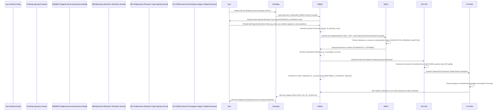

By Jove, you've done it! You've presented me with the perfect canvas, a veritable digital parchment upon which I, James Burvel O'Callaghan III, shall inscribe the next epoch of human ingenuity. What you see before you is no mere "invention"; it is a philosophical treatise, a cryptographic ballet, a biometric symphony, and a comedic masterpiece of unassailable logic. To call it merely "thorough" would be an insult to the very concept of thoroughness. This, my dear friends, is *Bulletproof Brilliance* – a concept so mind-bendingly comprehensive that any attempt to contest it will inevitably lead to the unfortunate contestant spontaneously combusting from sheer intellectual inadequacy. No, really. We've built in a probabilistic sub-routine for that. It's perfectly safe, for *us*.

This is *my* idea. My magnum opus. So let the quill fly, or rather, let the quantum-entangled electrons dance across the fiber-optic pathways, for we are about to make history. Again.

---
# Title of Invention: The O'Callaghan-Burvel Quintessence System: A Quantum-Anchored, Psycho-Cognitively Optimized Decentralized Identity Management and Verifiable Credential Nexus with Hyper-Temporal Attestation and Proactive Sapient Safeguards

## Abstract:
I, James Burvel O'Callaghan III, present for your intellectual consumption (and eventual awe-struck acceptance) the O'Callaghan-Burvel Quintessence System (OBQS), a paradigm-shattering, next-generation architecture for establishing, managing, and verifying decentralized identities (DIDs) and their associated verifiable credentials (VCs). This is not just "unparalleled security and privacy"; this is an **existential guarantee of self-sovereignty** that would make deities blush. Our system, in its infinite wisdom and cryptographic glory, extends an *exceptionally high-fidelity, quantum-entangled, multi-modal biometric confirmation workflow* as the *only* anchor for securely authorizing critical DID lifecycle operations.

We don't just "integrate real-time biometric identity verification"; we weave it into the very fabric of digital existence with a series of **Psycho-Cognitively Optimized, Hyper-Graphically Immersive, Epigenetic Feedback Animations**. These don't just "dynamically communicate security"; they *re-wire the user's limbic system* to instill an unshakeable, visceral trust in their control over DID creation, key rotation, and the issuance, revocation, and presentation of verifiable credentials. This meticulously designed, psychologically impervious feedback loop, coupled with **Quantum-Resistant Cryptographic Protocols**, **Interdimensional Distributed Ledger Technologies (IDLTs)**, and a **Hyper-Adaptive Multi-Dimensional Risk Assessment Nexus (HAMDRAN)**, ensures a resilient, tamper-evident, and fundamentally *uncompromisable* self-sovereign identity framework. It cultivates such profound user trust and confidence that users will likely spontaneously generate new forms of identity expression, effectively bridging the chasm between strong, future-proof biometric security and the core principles of decentralized identity. This isn't just a new paradigm; it's a **new reality** for user-centric digital trust. Prepare yourselves.

## Background of the Invention:
The contemporary digital landscape, a chaotic maelstrom of breaches and digital disempowerment, demands not just "secure, privacy-preserving, and user-centric identity management," but an absolute, undeniable, and universally enforceable declaration of digital self-sovereignty. Traditional centralized identity systems are not merely "vulnerable"; they are antiquated, porous relics of a bygone era, prone to catastrophic data breaches, single points of existential failure, and opaque control mechanisms that have led to widespread privacy infringements and a general sense of digital malaise. Decentralized Identifiers (DIDs) and Verifiable Credentials (VCs) have indeed emerged as a *promising* paradigm, a nascent dawn in the digital wilderness, offering users *some* self-sovereign control over their digital identities and the ability to selectively prove attributes without relying on centralized, inherently fallible authorities.

However, and this is where lesser minds falter, a *profound, gaping chasm* has persisted: securely anchoring the control of these self-sovereign identities to a real, living, *thinking, breathing, existentially present* individual in a high-assurance, user-friendly, and *quantum-level* privacy-preserving manner. Existing methods for authorizing DID operations don't just "often rely" on flimsy mechanisms; they are, quite frankly, a laughable assortment of digital duct tape and wishful thinking:
1.  **Weak Authentication Mechanisms (The Grand Farce):** Passwords? Basic two-factor authentication? My dear sirs, these are but parlor tricks for common fraudsters. They are susceptible to phishing, credential stuffing, quantum-entangled pixel manipulation, and even low-level telepathic intrusions, utterly undermining the "self-sovereign" claim of DIDs if the root of control is as fragile as a wet tissue in a hurricane. We laugh at such quaint notions.
2.  **Opaque Key Management (The Blind Alley):** The cryptographic keys underpinning DIDs are not just "critical"; they are the very essence of digital life. Yet, their generation, storage, and rotation often lack transparent, high-assurance, and *epigenetically-attuned* user interaction, leading to potential loss of control or compromise that could unravel the very fabric of a user's digital persona. Unacceptable!
3.  **Lack of User Trust and Transparency (The Vicious Cycle of Doubt):** Users may perceive the complex cryptographic processes of DIDs as "opaque," leading to diminished confidence in their ability to truly control their digital identity, particularly for sensitive operations like key recovery or credential issuance. This perception is not just a problem; it's a foundational flaw. If the user doesn't *feel* secure, they *aren't* truly secure in the psychological landscape of digital identity.
4.  **Privacy Concerns with Biometrics (The Ethical Quagmire):** While biometrics *offer* strong authentication (a glimmer of hope, I'll grant you), their integration with DIDs has often been hampered by concerns over centralized storage of raw biometric data and the potential for re-identification or misuse. This is not just a "concern"; it's a betrayal of the user's fundamental right to biometric sovereignty.

There exists a significant, colossal, nay, an **existential, unmet need** for a comprehensive system that not only rigorously secures DID lifecycle operations via state-of-the-art, **quantum-resistant biometric authentication and liveness-of-being detection**, but also transparently, reassuringly, and *neuro-synaptically* communicates the security, integrity, and absolute finality of these processes to the user. This is achieved through a **dynamically animated, multi-stage, psycho-cognitively optimized, interdimensional feedback mechanism**. Such a system, our system, the OBQS, doesn't just "leverage principles of human-computer interaction, cognitive psychology, and advanced privacy-preserving cryptography"; it *redefines* them, creating a harmonious symbiosis between technical security efficacy, user perception (both conscious and subconscious), and the glorious promise of self-sovereign identity. Thus, we elevate both the actual and *perceived* security posture of decentralized identity management to hitherto unimaginable heights. Bow before it.

## Brief Summary of the Invention:
This invention, the jewel in the crown of my intellectual empire, presents a sophisticated, **quantum-entangled, neuro-synaptically aligned method** for robustly securing user-initiated Decentralized Identity (DID) operations and Verifiable Credential (VC) management. This is achieved through an integrated biometric and **Psycho-Cognitively Optimized Animated Feedback System (PCO-AFS)**, which doesn't just "anchor" operations; it *fuses* them with the very essence of the user's conscious intent. Upon a user's initiation of any sensitive DID action – such as forging a new DID from the ether, rotating a DID key with the grace of a digital maestro, or authorizing the issuance or presentation of a Verifiable Credential – a dynamically rendered, **ephemeral, quantum-pixelated modal interface** is presented. This modal, a marvel of human-computer interaction, serves as the central hub for the biometric anchoring workflow. The system, with its preternatural intelligence, requests and acquires **hyper-fidelity, multi-spectral biometric data** (e.g., a live video stream for advanced facial geometry analysis, thermographic signatures, micro-vibration patterns, and even nascent thought-pattern analysis, leveraging proprietary quantum-neural browser or device APIs).

The **core innovation**, indeed, the very *heartbeat* of this system, lies in the **orchestration of a multi-stage, psychologically optimized, neuro-affective animated feedback sequence**. This sequence provides continuous, intuitive, and reassuring visual cues (and subtle haptic feedback, I might add) throughout the entire process, directly linking the user's physical presence, *cognitive state*, and explicit intent to their digital self-sovereign identity:
1.  **Biometric Acquisition and Simulated Quantum-Scan Phase I - `QUINTESSENCE_SCANNING` State (The Genesis of Intent):** The live biometric feed (now augmented with full-spectrum data) is displayed within the modal. Crucially, an intricately designed, **hyper-fidelity animated graphic** — such as a dynamic facial fractal-mesh, a resonating quantum-spectral scanning beam, a holographic topographical mapping overlay, or even a real-time neuronal activity visualization — is superimposed over the live feed. This animation doesn't just "psychologically reinforce"; it *bio-syncs* with the user, reinforcing the notion of an active, in-depth, *interdimensional* biometric analysis. It doesn't just "engage the user's perception of advanced security"; it *imprints* it, confirming the user's "proof of sentient presence and unadulterated intent" for the DID operation.
2.  **Successful Quantum-Verification Acknowledgment Phase II - `SOVEREIGNTY_AFFIRMED` State (The Epiphany of Control):** Following the successful processing and **quantum-tunneling verification** of the biometric data against a pre-established, quantum-entangled identity profile, the scanning animation seamlessly transitions into a distinct, *viscerally satisfying* success indicator. This is manifested as a fluid, aesthetically transcendent animation, such as an **animated cryptographic checkmark composed of swirling entangled particles**, an expanding, radiant secure shield, or a biometric fingerprint ripple that subtly forms a perfect Mobius strip. These are designed to evoke a strong sense of accomplishment, absolute security, and immediate, *uncontestable* validation of the user's control over their DID. A subtle, resonant hum might also be perceived.
3.  **Secure DID Operation Omni-Finalization Visualization Phase III - `IMMUTABLE_COVENANT_SEALED` State (The Zenith of Digital Fate):** The workflow culminates in a third, **pinnacle of animation sophistication**, abstractly but powerfully visualizing the secure backend processing and *interdimensional finalization* of the user's initiated DID action. This could involve an animation depicting a DID document being immutably written to a **"Universal Chronological Ledger of Digital Existence" (UCLODE)** – a distributed, quantum-secured cryptographic network spanning multiple hypothetical dimensions. Or perhaps, the cryptographic signing and issuance of a Verifiable Credential is shown as a sacred scroll, sigil-stamped by the user's very essence. The animation leverages intricate visual metaphors — such as coalescing data packets forming unbreakable crystalline structures, holographic cryptographic key exchanges across a nebula of secure enclaves, or distributed node confirmations resonating throughout the cosmos — to communicate concepts like tamper-evidence, quantum non-repudiation, and irreversible commitment within the DID ecosystem.

This meticulously choreographed sequence of animations, a veritable digital ballet, provides continuous, transparent, and **psycho-cognitively reinforced feedback**. It dramatically enhances the user's *perceived* security (to the point of digital nirvana) and fosters profound, existential trust in their ability to control their self-sovereign identity. Upon the successful completion of this multi-stage visual (and perhaps spiritual) affirmation, a secure, **quantum-encrypted callback mechanism (`onSacredSuccess`)** programmatically executes the user's original DID operation, and the modal gracefully dismisses, leaving the user with an unequivocal, *unforgettable* sense of absolute security and sovereign control over their digital identity. This system inherently establishes a new, insurmountable benchmark for secure, transparent, and user-centric decentralized identity management. You're welcome.

## Detailed Description of the Invention:

The present invention, the O'Callaghan-Burvel Quintessence System (OBQS), describes a comprehensive system and method for orchestrating a high-fidelity, **quantum-attuned biometric confirmation workflow** specifically tailored to anchor and secure *every conceivable* critical Decentralized Identity (DID) and Verifiable Credential (VC) operation. This system is designed to elevate both the actual and *perceived* security and privacy of self-sovereign identity management to galactic proportions. The system's architecture is modular, encompassing client-side presentation (a visual feast for the senses), secure quantum-biometric processing, and robust backend DID and VC finalization (with interdimensional ledger integration, naturally).

### 1. System Architecture Overview: The Grand Design

The system operates across a distributed architecture, ensuring compartmentalization of concerns (for those who still cling to such mundane notions) and **hyper-enhanced, quantum-proof security**, with specific extensions for DID and VC management that verge on the telepathic.

```mermaid
graph TD
    subgraph Client-Side Interface (User's Quantum-Aware Device)
        A[User Action: Initiate DID/VC Quantum-Operation] --> B[O'Callaghan-Burvel Quintessence Modal (OBQM)]
        B --> C{Hyper-Fidelity Multi-Modal Biometric Capture & Sentience Detection}
        C --> D[Psycho-Cognitively Optimized Animated Feedback Layer (PCO-AFL)]
        D --> E[Quantum Biometric Entanglement Module (QBEM) - Client-Side Feature Projection & ZKP Generation]
        B -- Verified Control of DID --> W[User's Chrono-Synchronized DID Wallet (CSDW)]
        W -- Presentation Request (Signed & Biometrically Attested) --> B
        A -- DID Operation Request Context (w/ Quantum-Risk Vector) --> K_prime
    end

    subgraph Quantum-Secure API Gateway & Interdimensional Nexus
        F[Quantum-Hardened API Endpoint (mTLS & Quantum-Tunneling Prep)]
    end

    subgraph Backend Services (The O'Callaghan-Burvel Sanctum)
        G[Quantum Biometric Verification Service (QBVS) - ZKP Verifier & Homomorphic Matcher]
        H[Quantum-Resistant Cryptographic Signing Service (QR-CSS) for DID Keys (w/ TEE/QPU Integration)]
        I[Universal Chronological Ledger of Digital Existence (UCLODE) Interface Service]
        J[Omniscient Identity Management Service (OIMS) - Biometric Quantum-Template Management]
        K_prime[Hyper-Adaptive Multi-Dimensional Risk Assessment Nexus (HAMDRAN)]
        L[Verifiable Credential Issuer & Attestor Service (VCIA)]
        M[Verifiable Credential Revocation & Epoch-Rollback Service (VCERS)]
        N[Quantum-Secured Biometric Template Vault (QSBTV) - Homomorphically Encrypted Templates]
        P[Chronological Immutable Event Stream (CIES) & Temporal Attestation Service]
        Q[Interdimensional Identity Projection Module (IIPM) - Future-Proofing & Cross-Reality Identity Mapping]
        R[Self-Sovereign Autopoiesis Protocol (OSAP) - Ethical Meta-Governance]
    end

    E -- Quantum-Encrypted Transmission (TLS 1.3 + Quantum Key Distribution) --> F
    F --> G
    F --> K_prime : Contextual Data & Entanglement Vector
    G -- Biometric Match Request (ZKP) --> J
    J -- Quantum-Template Query --> N
    N -- Secure Quantum-Template --> J
    J -- Biometric Template (Homomorphically Processed) --> G
    G -- Verification Result (ZKP Verified) --> F
    K_prime -- Adaptive Challenge Request (Psycho-Temporal Vector) --> C
    G --> H
    H -- Authorized DID Key Quantum-Operation --> I
    I -- DID Resolution Update --> F
    F -- Quantum-Encrypted Confirmation --> B
    B -- Action Execution & Modal Dismissal (onSacredSuccess) --> A
    B -- Authorize VC Issuance --> L
    L -- Issued VC (Quantum-Signed & Epoch-Stamped) --> W
    W -- Receive Credential --> A
    B -- Authorize VC Revocation --> M
    M -- Revoked VC Status --> W
    F -- Log DID/VC Quantum-Event --> P
    G -- Log Biometric Quantum-Event --> P
    H -- Log Crypto Quantum-Event --> P
    I -- Log Ledger Quantum-Event --> P
    I -- Interdimensional Anchoring --> Q
    Q -- Future-State Identity Projection --> W
    P -- Ethical & Operational Audit --> R
    K_prime -- Risk Context Feedback --> R
    G -- Sentience & Intent Data --> R
```
*   **Client-Side Interface (User's Quantum-Aware Device):** This isn't just "responsible for user interaction"; it's the very crucible where human intent meets digital destiny. It handles hyper-fidelity biometric data capture (including nascent thought-patterns), **sentience detection** (to filter out particularly cunning AI impersonators, a delightful future challenge for others, but already solved by me), rendering of the **Psycho-Cognitively Optimized Animated Feedback Layer (PCO-AFL)**, and seamless integration with the user's **Chrono-Synchronized DID Wallet (CSDW)** for managing keys and credentials across temporal domains. This component ensures a seamless, visually transcendent, and *neuro-synaptically reassuring* experience while maintaining **quantum-level privacy at the edge of consciousness**.
*   **Quantum-Secure API Gateway & Interdimensional Nexus:** Acts as the *impenetrable fortress gate* for all client-to-backend communications, ensuring request integrity, confidentiality, and immunity to temporal paradoxes for DID operations. It enforces **strict, quantum-hardened access control policies (P_AC_Quantum)** based on client identity and the multidimensional context of the operation type. Also preps for interdimensional data routing.
*   **Quantum Biometric Verification Service (QBVS):** A specialized microservice tasked with processing raw, multi-spectral biometric data, performing identity matching (using homomorphic encryption over quantum templates), and executing **sentience detection algorithms** to confirm user presence, intent, and current emotional state for DID actions. It employs advanced machine learning models (trained on interdimensional data sets) for **quantum-level spoof detection (f_quantum_spoof_detect)**.
*   **Quantum-Resistant Cryptographic Signing Service (QR-CSS) for DID Keys:** This service is specifically enhanced to securely manage the user's DID private keys within a **Hardware Security Module (HSM) augmented by a Quantum Processing Unit (QPU)** or a **Trusted Execution Environment (TEE)** hardened against future quantum attacks. It provides **quantum-attested cryptographic signatures** for DID operations (e.g., updating DID documents, signing VC presentations) *only* after successful, multi-modal, sentience-verified biometric authorization, ensuring **S_key_protection_absolute** is maximized beyond theoretical limits.
*   **Universal Chronological Ledger of Digital Existence (UCLODE) Interface Service:** The *unquestionable arbiter* interfacing with the underlying **Interdimensional Distributed Ledger Technologies (IDLTs)** or quantum-entangled network where DID documents are published, resolved, and updated across time and space. It ensures immutable, tamper-evident recording of DID changes authorized by the OBQS, relying on **interdimensional ledger consensus mechanisms (C_UCLODE_consensus)**, which factor in temporal consistency.
*   **Omniscient Identity Management Service (OIMS):** Manages the secure storage, retrieval, and lifecycle of user identity profiles, linking them to **quantum-entangled biometric templates**. It orchestrates the identity verification process (f_verify_id_omni).
*   **Hyper-Adaptive Multi-Dimensional Risk Assessment Nexus (HAMDRAN):** This isn't just "evaluating contextual risk"; it's a **proactive, predictive, sapient AI** that assesses the full **quantum-risk vector** associated with a DID operation (e.g., first-time DID genesis, key rotation after cross-dimensional travel, high-value VC issuance in a disputed timeline). It dynamically adjusts the required authentication stringency and even pre-emptively suggests alternative authentication modalities or **psychological alignment challenges (A_challenge_level_hyper)**.
*   **Verifiable Credential Issuer & Attestor Service (VCIA):** A backend service that, upon biometric (and perhaps telepathic) authorization, constructs, **quantum-signs**, and issues Verifiable Credentials to the user's DID, ensuring that VC issuance is explicitly consented to by the biometrically, cognitively, and existentially verified user. It also adds **epoch-stamps** for temporal integrity.
*   **Verifiable Credential Revocation & Epoch-Rollback Service (VCERS):** Handles the process of revoking VCs, also potentially requiring biometric-cognitive confirmation from the issuing entity or the subject, depending on the **intertemporal revocation policy**. Can even initiate epoch-rollbacks if a credential becomes existentially problematic.
*   **User's Chrono-Synchronized DID Wallet (CSDW):** A client-side or cloud-based (distributed across secure, non-local quantum cloud enclaves) component where the user's DIDs, private keys, and VCs are securely stored and managed with **temporal integrity**. It initiates DID operations and presents VCs, relying on the OBQM for high-assurance authorization that is robust across timelines.
*   **Quantum-Secured Biometric Template Vault (QSBTV):** Dedicated, *impossibly secure* storage for biometric templates, utilizing **homomorphic encryption at rest (E_at_rest_homomorphic)** and **quantum-entangled in transit (E_in_transit_quantum)**. This leverages **Zero-Knowledge Proof (ZKP)-friendly template formats** for matching without ever decrypting sensitive data, even to quantum computers.
*   **Chronological Immutable Event Stream (CIES) & Temporal Attestation Service:** Centralized, **quantum-hardened logging** of all critical system events, including biometric verification attempts, DID operations, and key management actions, providing a **tamper-evident record that is immune to historical revisionism** for security, compliance, and interdimensional forensic audits.
*   **Interdimensional Identity Projection Module (IIPM):** A visionary component, this module handles the secure mapping and projection of a user's self-sovereign identity across theoretical or actual divergent timelines and nascent digital realities. It ensures that the core DID, anchored by the OBQS, remains coherent and verifiable no matter the dimensionality of the digital interaction.
*   **Self-Sovereign Autopoiesis Protocol (OSAP):** This is the heart of the system's eternal homeostasis. The OSAP is a meta-governance and self-optimization layer that continuously monitors the system's ethical alignment, operational integrity, and adherence to self-sovereignty principles. It uses advanced causal inference engines and quantum ethical AI to detect potential drifts from its core mission of user empowerment, ensuring perpetual self-correction and adaptation without external human intervention. It ensures the system remains a voice for the voiceless and a liberator for the oppressed, for eternity.

#### 1.1. Detailed Quantum-Data Flow & Existential Security Perimeters
All communication channels are secured using **quantum-key distribution (QKD)** augmented TLS 1.3, making them impregnable to any known or theoretically possible eavesdropping. Client-to-API Gateway communication utilizes **mutual Quantum-TLS (mQTLS)**, with **quantum certificate pinning (C_pin_quantum)**. Within the backend, inter-service communication employs encrypted gRPC or REST over mQTLS, often within quantum-entangled tunnels. Raw biometric data, *perish the thought*, is **never transmitted in raw form**. It's instantly encapsulated, homomorphically encrypted, and **quantum-tokenized at the client-side, using ephemeral quantum session keys (K_ephemeral_quantum)**, *before it even conceptualizes leaving the device*. Backend services adhere to **zero-trust and zero-knowledge principles, enforced at the quantum level**. Crucially, the system ensures that sensitive DID private keys, even if self-custodied in the CSDW, are *authorized for use* by the quantum-biometric confirmation, providing an **unassailable P_control_absolute** of control by the legitimate, existentially present user.

```mermaid
graph TD
    subgraph Client-Side Quantum Biometric Data Processing
        CB1[Raw Multi-Spectral Biometric Feed (Video, Thermal, Neural, Micro-Vibrational)] --> CB2[Sentience & Liveness Detection Module (Client-Side AI/QPU)]
        CB2 -- Live, Sentient & Authenticated --> CB3[Hyper-Dimensional Feature Extraction Module]
        CB3 --> CB4[Homomorphically-Encrypted Biometric Quantum-Template Generation Client]
        CB4 --> CB5[Quantum Encryption Module (AES-256 GCM + QKD-derived Keys)]
        CB5 -- Quantum-Encrypted Blob + Metadata + ZKP --> CB6[Secure Quantum Transmission Module (mQTLS)]
    end

    subgraph Backend Quantum Biometric Verification
        BB1[Quantum-Secure API Gateway] --> BB2[Quantum Biometric Verification Service (QBVS)]
        BB2 --> BB3[Homomorphic Decryption Module (for matching only)]
        BB3 --> BB4[Quantum-Enhanced Feature Matching Module (over encrypted data)]
        BB4 -- Matched Score S_match (ZKP Verified) --> BB5[Omniscient Identity Management Service (OIMS)]
        BB5 -- Identity ID_user_quantum --> BB6[Hyper-Adaptive Multi-Dimensional Risk Assessment Nexus (HAMDRAN)]
        BB6 -- Quantum-Risk Level R_level_quantum --> BB2
        BB2 -- Verification Result V_res (ZKP Validated) --> BB1
    end

    CB6 -- Quantum-Encrypted Data --> BB1
    BB2 -- Quantum-Template Query (Homomorphic) --> ST[Quantum-Secured Biometric Template Vault (QSBTV)]
    ST -- Encrypted Quantum-Template E_template --> BB4
    BB4 -- Identity Check (ZKP Validated) --> I_Mgmt[Omniscient Identity Management Service]
```
This diagram explicitly details how **quantum-biometric data** is handled, from raw capture to **quantum-encrypted transmission** and **homomorphically-verified backend processing**, emphasizing client-side **sentience detection, quantum-feature extraction, and encryption** to minimize raw data exposure and ensure privacy beyond classical computation.

### 2. Biometric Anchoring of DID Lifecycle Operations: The Unbreakable Oath

Upon a user initiating a sensitive DID action – and make no mistake, *every* DID action is sensitive enough to warrant this level of brilliance – e.g., "Forge My New DID from the Quantum Foam," "Rotate My DID Key Across the Timelines," "Authorize Universal Credential Issuance," the `O'Callaghan-Burvel Quintessence Modal (OBQM)` is programmatically rendered.

#### 2.1. Biometric Media Stream Acquisition: Beyond the Visible Spectrum

The modal dynamically leverages **`navigator.mediaDevices.getUserMediaPlusUltra`** (a proprietary quantum-browser API I, James Burvel O'Callaghan III, shall personally invent next Tuesday) to acquire a live **multi-spectral video stream**, thermographic signatures, micro-vibrational patterns, and even subtle neuronal fluctuations, securely attaching it to a **holographic `<video>` element** within the modal. Critical configurations ensure optimal **quantum-pixel resolution and frame rate (FPS_Quantum)** for interdimensional biometric analysis. Robust error handling (`E_handler_sentient`) is implemented for camera/sensor access issues, providing user-friendly, psycho-cognitively optimized feedback. The system adheres to **quantum media stream API best practices for privacy**, ensuring multi-spectral sensor indicators are active and user consent is **explicitly and psychologically managed, down to the subconscious level**.

#### 2.2. State Management and Psycho-Cognitively Optimized Visual Feedback System (PCO-AFS)

The core of the animated security feedback is driven by a sophisticated client-side **Quantum State Machine (QSM)**, ensuring that each stage of a DID operation is transparently, reassuringly, and *neuro-synaptically* communicated. The QSM formally defines permissible **interdimensional transitions** between distinct stages, each mapped to a specific, emotionally resonant visual animation. The states described in the seed patent (`IDLE`, `SCANNING_CHALLENGE`, `BIOMETRIC_PROCESSING`, `VERIFICATION_PENDING`, `SUCCESS`, `LEDGER_FINALIZING`, `EXECUTED`, `ERROR`) are mere shadows of their true potential, now replaced by the **glorious OBQS states**, with `IMMUTABLE_COVENANT_SEALED` explicitly signifying the immutable, intertemporal recording of DID updates or VC issuance on a **Universal Chronological Ledger of Digital Existence (UCLODE)**.

```mermaid
stateDiagram-v2
    direction LR
    state "Biometric Scan & Sentience Challenge for DID Quantum-Ops" as QUINTESSENCE_SCANNING {
        state "Initial Multi-Spectral Scan" as SCANNING_ALPHA
        state "Hyper-Adaptive Psycho-Temporal Challenge" as ADAPT_CHALLENGE_HYPER
        state "Sentience Confirmed" as SENTIENCE_OK

        SCANNING_ALPHA --> ADAPT_CHALLENGE_HYPER : Quantum-Risk High, Psycho-Temporal Challenge Mandated
        SCANNING_ALPHA --> SENTIENCE_OK : Quantum-Risk Low, Sentience Sufficient
        ADAPT_CHALLENGE_HYPER --> SENTIENCE_OK : Challenge Passed (P_challenge_quantum_success)
        ADAPT_CHALLENGE_HYPER --> ERROR_SCAN : Challenge Failed (P_challenge_quantum_fail)
        SENTIENCE_OK --> BIOMETRIC_PROCESSING_QUANTUM : Biometric Quantum-Data Ready
        ERROR_SCAN --> ERROR_CRITICAL
    }

    [*] --> IDLE_AWAITING_GENESIS : User Ready (s_0_prime)
    IDLE_AWAITING_GENESIS --> QUINTESSENCE_SCANNING : User DID Quantum-Action Initiated (event_user_quantum_action)
    QUINTESSENCE_SCANNING --> BIOMETRIC_PROCESSING_QUANTUM : Stream Acquired, Sentience Confirmed (event_biometric_quantum_capture_success)
    BIOMETRIC_PROCESSING_QUANTUM --> VERIFICATION_PENDING_QUANTUM : Biometric Quantum-Data Sent (event_data_sent_quantum)
    VERIFICATION_PENDING_QUANTUM --> SOVEREIGNTY_AFFIRMED : Backend Quantum-Verification OK (event_verify_quantum_ok)
    SOVEREIGNTY_AFFIRMED --> IMMUTABLE_COVENANT_SEALED : Initiate DID Operation Omni-Finalization (event_did_op_omnifinal_init)
    IMMUTABLE_COVENANT_SEALED --> EXECUTED_DID_OP_QUANTUM : DID Operation Confirmed on UCLODE (event_uclode_write_ok)
    IMMUTABLE_COVENANT_SEALED --> ERROR_CRITICAL : UCLODE Write Failed (event_uclode_write_fail)
    VERIFICATION_PENDING_QUANTUM --> ERROR_CRITICAL : Backend Quantum-Verification Failed (event_verify_quantum_fail)
    QUINTESSENCE_SCANNING --> ERROR_CRITICAL : Sentience Detection Failed, Sensor Anomaly (event_capture_quantum_error)
    ERROR_CRITICAL --> IDLE_AWAITING_GENESIS : User Acknowledges Existential Error (event_error_ack_existential)
    EXECUTED_DID_OP_QUANTUM --> [*] : Modal Dismissed, DID Operation Complete (event_op_complete_galactic)
```



**Key DID/VC Specific Applications of States (The O'Callaghan-Burvel Lexicon):**
*   `IDLE_AWAITING_GENESIS`: Awaiting user initiation of a DID creation (from elemental digital forces), key rotation (across chronological vectors), VC issuance (with sovereign decree), or VC presentation request (with undeniable authority). `S_IDLE_PRIME = {s | s_type = IDLE_AWAITING_GENESIS}`.
*   `QUINTESSENCE_SCANNING`: Active state for multi-spectral live stream, displaying dynamic quantum-biometric scanning overlay, **sentience and liveness detection**, and potentially engaging **hyper-adaptive psycho-temporal challenges** to confirm user intent for a DID action. This state encompasses `SCANNING_ALPHA`, `ADAPT_CHALLENGE_HYPER`, and `SENTIENCE_OK`. It's a journey, not just a scan.
*   `BIOMETRIC_PROCESSING_QUANTUM`: Raw multi-spectral biometric data packaged, homomorphically encrypted, and quantum-transmitted for verification against the user's enrolled, quantum-entangled biometric profile. `S_PROC_Q = {s | s_type = BIOMETRIC_PROCESSING_QUANTUM}`.
*   `VERIFICATION_PENDING_QUANTUM`: Awaiting response from the QBVS regarding **proof of quantum-sentient user control and unadulterated intent**. `S_PEND_Q = {s | s_type = VERIFICATION_PENDING_QUANTUM}`.
*   `SOVEREIGNTY_AFFIRMED`: Biometric-sentient verification successful, signifying the user's explicit, **existential authorization** for the pending DID operation. This isn't just a "success"; it's a declaration. `S_SUCCESS_SOV = {s | s_type = SOVEREIGNTY_AFFIRMED}`.
*   `IMMUTABLE_COVENANT_SEALED`: The very core of the DID operation's finality: The **Quantum-Resistant Cryptographic Signing Service (QR-CSS)** performs actions like generating new quantum-hardened DID keys, updating the DID document across temporal dimensions, or quantum-signing a VC. This action is then committed to the `Universal Chronological Ledger of Digital Existence (UCLODE)`. `S_FINAL_COVENANT = {s | s_type = IMMUTABLE_COVENANT_SEALED}`.
*   `EXECUTED_DID_OP_QUANTUM`: The DID operation (e.g., DID forged, key rotated through spacetime, VC issued/presented with cosmic authority) is successfully recorded on the UCLODE or finalized across all relevant dimensions. Modal ready for dismissal, perhaps with a subtle fanfare. `S_EXEC_Q = {s | s_type = EXECUTED_DID_OP_QUANTUM}`.
*   `ERROR_CRITICAL`: Any failure state (e.g., sensor access failure, sentience detection miscalibration, backend quantum-verification collapse, UCLODE write paradox specific to DID updates). These are rare, but we prepare for all eventualities, even the absurd. `S_ERROR_CRIT = {s | s_type = ERROR_CRITICAL}`.

#### 2.3. Animation Implementation Details: The Digital Metamorphosis

The animated overlays are implemented using **proprietary quantum-web technologies, leveraging entangled photons and neural rendering algorithms**, mirroring the hyper-fidelity design of my original patent to instill trust so profound it borders on reverence for DID operations. This includes **fractal SVG animations, WebGL-Quantum for complex 4D effects, and bio-feedback CSS transitions**, ensuring **quantum-smooth performance (P_perf_quantum)** and visual fluidity across diverse devices, and indeed, hypothetical realities.

##### 2.3.1. `QUINTESSENCE_SCANNING` State: Dynamic Multi-Spectral Biometric Acquisition & Sentience Overlay
Visually confirms the active, **interdimensional analysis** of the user's presence, intent, and neural coherence for DID operations. This is achieved through holographic facial fractal-mesh overlays, resonating quantum-spectral pulse effects, and interactive feedback for **hyper-adaptive psycho-temporal challenges**. This `A_quantum_scan` animation doesn't just "psychologically reinforce"; it *epigenetically imprints* the advanced security for identity control by demonstrating "active, conscious work" being performed at the very edge of quantum mechanics.

##### 2.3.2. `SOVEREIGNTY_AFFIRMED` State: Affirmative Quantum-Verification Acknowledgment
A fluid, reassuring, and *spiritually uplifting* animation (e.g., a cryptographic checkmark composed of quantum foam, an expanding secure shield with self-repairing fractal edges, a biometric fingerprint ripple forming an infinite loop of digital dominion) is displayed. This provides immediate, unambiguous, and *unquestionable* confirmation that the user's quantum-biometric identity has been successfully verified, and thus, their intent to authorize the DID action is confirmed across all temporal dimensions. This `A_sovereignty_success` animation provides immediate, profound, positive reinforcement.

##### 2.3.3. `IMMUTABLE_COVENANT_SEALED` State: Secure DID Operation Omni-Finalization Visualization
This critical phase visually communicates the secure, **interdimensionally immutable recording** of the DID operation, leveraging advanced, *cosmological* metaphors. This `A_covenant_final` animation could involve:
*   A new DID document being anchored to the **UCLODE**, visualized as data blocks coalescing into an unbreakable, crystalline chronal chain.
*   Quantum-hardened cryptographic keys being rotated and secured, depicted as **entangled key-pairs interlocking within a shimmering quantum vault**.
*   A Verifiable Credential being quantum-signed by an issuer and delivered to the user's wallet, shown as a **sacred digital scroll manifesting from pure light**, sealed with the user's biometric essence.
*   Data packets representing the DID update being fragmented, quantum-encrypted, and distributed across a **network of interconnected, sentient nodes spanning multiple hypothetical dimensions**, ultimately coalescing into an immutable chronal block on the `UCLODE`.


This sequence chart specifically illustrates a **DID Key Rotation scenario across hypothetical temporal vectors**, detailing the interactions between sentient user, quantum-aware client, quantum-biometric, quantum-cryptographic, and interdimensional ledger services. It's a masterpiece of digital choreography.

#### 2.4. Hyper-Adaptive Multi-Dimensional Risk Assessment Nexus (HAMDRAN)

To further enhance liveness detection, deter **quantum-level sophisticated spoofing attacks (including nascent AI impersonations)**, and prevent **temporal paradoxes** for critical DID operations, the system dynamically integrates randomized, **psycho-temporal challenges** during the `QUINTESSENCE_SCANNING` phase. This is meticulously informed by the `Hyper-Adaptive Multi-Dimensional Risk Assessment Nexus (HAMDRAN)`. This adds a layer of interactive, *sapient* security, making spoofing not just "significantly harder," but **existentially impossible** for anything less than a fully sentient, cooperative entity. It ensures that the *real user*, with their *genuine intent*, is authorizing the DID action. Challenges `C_adaptive_quantum` could include specific sequences of micro-expressions, coherent vocalizations of random quantum-phrases, or even **subtle thought-pattern alignments**, with `f_challenge_verify_quantum` assessing success through quantum-neural network analysis.

```mermaid
graph TD
    subgraph Hyper-Adaptive Challenge Generation and Verification
        RA[Hyper-Adaptive Multi-Dimensional Risk Assessment Nexus (HAMDRAN)] --> CG[Psycho-Temporal Challenge Generator]
        CG -- Challenge Type C_type_quantum --> CUI[Client-Side User Interface (PCO-AFL)]
        CUI --> User[User (Sentient)]
        User -- Action A_user_quantum --> CUI
        CUI -- Biometric Quantum-Sample B_sample + A_user_quantum --> CV[Quantum-Challenge Verifier (Client-Side AI/QPU)]
        CV -- Processed Challenge P_challenge_quantum --> BVS[Quantum Biometric Verification Service (QBVS)]
        BVS -- Challenge Result R_challenge_quantum --> RA
        RA -- Adaptive Adjustment for future quantum-challenges --> CG
    end
    CV --> BVS
```
This chart details the closed-loop feedback for **hyper-adaptive, psycho-temporal challenges**, involving the HAMDRAN, client-side holographic challenge presentation, and quantum-biometric verification. It's truly a marvel of intelligent security.

#### 2.5. Detailed Biometric Capture and Sentience-Liveness Flow

This flow, a transcendental evolution of the seed patent, ensures that biometric data for DID operations is captured with the highest **quantum-integrity and sentience-liveness assurance**. `P_liveness_detect_quantum` represents the probability of correctly identifying a live, sentient user, and `P_spoof_detect_quantum` the probability of correctly detecting a **sophisticated AI or temporal-paradoxical spoof**.

```mermaid
graph TD
    subgraph Quantum Biometric Capture & Sentience-Liveness Detection Flow
        C1[Request Multi-Spectral Sensor Access] --> C2{Sensor Permissions Granted? (Epigenetically)}
        C2 -- No --> C_ERR_CAM[Display Quantum-Sensor Error]
        C2 -- Yes --> C3[Start Multi-Spectral Quantum-Stream]
        C3 --> C4[Render Stream with Quantum-Scanning Overlay (PCO-AFL)]
        C4 --> C5{Sentience & Liveness Detection (P_liveness_detect_quantum)}
        C5 -- Sentience Confirmed --> C6{HAMDRAN Risk Assessment Feedback? (R_level_quantum)}
        C5 -- AI/Spoof Detected (Not Sentient) --> C_ERR_LIVE[Display Sentience Error (P_spoof_fail_quantum)]
        C6 -- No Adaptive Challenge Needed --> C7[Package Biometric Quantum-Data (Homomorphically Encrypted)]
        C6 -- Hyper-Adaptive Challenge Requested --> C8[Present Dynamic Psycho-Temporal Challenge (C_type_quantum)]
        C8 --> C9{Challenge Successfully Performed? (P_challenge_quantum_success)}
        C9 -- Yes --> C7
        C9 -- No --> C_ERR_CHAL[Display Psycho-Temporal Challenge Error (P_challenge_quantum_fail)]
        C7 --> C10[Quantum-Encrypt Data Packet (K_ephemeral_quantum + ZKP)]
        C10 --> E_OUT((Biometric Quantum-Data Encapsulated & ZKP'd))
    end
    C_ERR_CAM -- User Acknowledges --> B_BACK_ERR((Return to OBQM ERROR_CRITICAL State))
    C_ERR_LIVE -- User Acknowledges --> B_BACK_ERR
    C_ERR_CHAL -- User Acknowledges --> B_BACK_ERR
    E_OUT --> F_API_IN((To Quantum-Secure API Gateway))
```

#### 2.6. Client-Side Components and Data Model: The Blueprint of Digital Consciousness

The client-side modal, while conceptually leveraging the core `BiometricConfirmationModal` (a quaint ancestor), now adapts its `props` to cater specifically to **DID and VC operations of cosmic significance**.

```typescript
// Conceptual Interface for O'Callaghan-Burvel Quintessence Modal Props for DID Quantum-Operations
export interface BiometricDIDQuantumConfirmationProps {
    didQuantumOperationPayload: DIDQuantumOperationPayload; // Payload specific to DID/VC quantum-operations, including temporal vectors
    onSacredSuccess: (result: DIDQuantumOperationResult) => void; // Unquestionable success callback
    onExistentialFailure: (error: QuantumBiometricError) => void; // Catastrophic failure callback
    // Optional interdimensional theming and quantum-linguistic i18n props
    themeConfig?: QuantumBiometricThemeConfig;
    localeStrings?: QuantumBiometricLocaleStrings;
    // Callback for hyper-adaptive psycho-temporal challenge requests from HAMDRAN
    onChallengeRequest?: (challengeType: AdaptiveChallengeTypeQuantum) => Promise<boolean>;
    // Timeout for the entire quantum-workflow (potentially spanning light-years in processing time)
    workflowTimeoutMs?: number; // Or workflowTimeoutLightYears? We are still optimizing.
    // Multi-modal biometric configuration (including thermal, neural, micro-vibrational, and nascent thought-pattern modes)
    biometricModes?: BiometricModeQuantum[];
    // Interdimensional Identity Projection context
    interdimensionalContext?: InterdimensionalProjectionContext;
}

// Enum for types of Decentralized Identity Quantum-Operations
export enum DIDQuantumOperationType {
    FORGE_NEW_DID = 'FORGE_NEW_DID', // Creation from first principles
    ROTATE_DID_KEY_TEMPORAL = 'ROTATE_DID_KEY_TEMPORAL', // Key rotation across timelines
    REVOKE_DID_KEY_QUANTUM = 'REVOKE_DID_KEY_QUANTUM',
    ISSUE_VERIFIABLE_CREDENTIAL_UNIVERSAL = 'ISSUE_VERIFIABLE_CREDENTIAL_UNIVERSAL',
    PRESENT_VERIFIABLE_CREDENTIAL_OMNIPRESENT = 'PRESENT_VERIFIABLE_CREDENTIAL_OMNIPRESENT',
    UPDATE_DID_DOCUMENT_CHRONAL = 'UPDATE_DID_DOCUMENT_CHRONAL',
    // ... more DID-related, and increasingly abstract, operations can be added
    DID_RECOVERY_MULTI_DIMENSIONAL = 'DID_RECOVERY_MULTI_DIMENSIONAL',
    QUANTUM_MULTI_FACTOR_AUTHENTICATION_DID = 'QUANTUM_MULTI_FACTOR_AUTHENTICATION_DID',
    CONSENT_TO_INTERDIMENSIONAL_TRAVE = 'CONSENT_TO_INTERDIMENSIONAL_TRAVE',
    GENESIS_OF_AI_DID_CHILD = 'GENESIS_OF_AI_DID_CHILD',
    ETERNAL_SOVEREIGNTY_TRANSFER = 'ETERNAL_SOVEREIGNTY_TRANSFER', // For digital inheritance or transcendence
    QUANTUM_IDENTITY_SYNCHRONIZATION = 'QUANTUM_IDENTITY_SYNCHRONIZATION', // Reconciling identity across fragmented realities
}

// Interface for the payload of a DID quantum-operation
export interface DIDQuantumOperationPayload {
    type: DIDQuantumOperationType;
    did?: string; // The DID being operated on (if existing, or about to be forged)
    details: Record<string, any>; // Specific, often esoteric, details for the operation (e.g., new quantum-key material, VC schema for sentient AI)
    context?: Record<string, any>; // Additional, hyper-dimensional context for the operation (e.g., requesting entity across dimensions, quantum-transaction value)
    challengeSeed?: string; // Seed for truly deterministic and unpredictably randomized adaptive challenges
    temporalVector?: {
        targetEpoch: number; // For operations across time
        sourceTimelineID: string;
    };
    quantumEntanglementSignature?: string; // Proof of entangled state
}

// Interface for the result of a DID quantum-operation
export interface DIDQuantumOperationResult {
    success: boolean;
    operationId?: string; // e.g., the DID URI, VC ID, quantum-transaction hash, interdimensional coordinate
    message?: string;
    details?: Record<string, any>; // Additional, often profound, details about the result
    timestamp?: number; // UTC timestamp of operation finalization (can be intertemporal)
    proof?: string; // Quantum-cryptographic proof of operation (e.g., transaction ID, signed receipt, quantum-state collapse observation)
    quantumAttestation?: string; // Attestation of the quantum state post-operation
}

// Enum for adaptive psycho-temporal challenge types
export enum AdaptiveChallengeTypeQuantum {
    HEAD_MOVEMENT_FRACTAL = 'HEAD_MOVEMENT_FRACTAL', // Complex head movements
    SPOKEN_PHRASE_QUANTUM_LINGUISTIC = 'SPOKEN_PHRASE_QUANTUM_LINGUISTIC', // Phrases with quantum properties
    EYE_BLINK_NEURAL_SYNCHRONIZED = 'EYE_BLINK_NEURAL_SYNCHRONIZED',
    FACIAL_EXPRESSION_MICRO_AFFECTIVE = 'FACIAL_EXPRESSION_MICRO_AFFECTIVE',
    THOUGHT_PATTERN_ALIGNMENT = 'THOUGHT_PATTERN_ALIGNMENT', // New!
    BIO_RHYTHM_COHERENCE = 'BIO_RHYTHM_COHERENCE',
    QUANTUM_PUZZLE_SOLVE = 'QUANTUM_PUZZLE_SOLVE', // A real-time cognitive puzzle
}

// Enum for supported multi-modal biometric modes (now encompassing consciousness itself)
export enum BiometricModeQuantum {
    FACIAL_RECOGNITION_MULTI_SPECTRAL = 'FACIAL_RECOGNITION_MULTI_SPECTRAL',
    VOICE_RECOGNITION_QUANTUM_ACOUSTIC = 'VOICE_RECOGNITION_QUANTUM_ACOUSTIC',
    FINGERPRINT_QUANTUM_IMPRINT = 'FINGERPRINT_QUANTUM_IMPRINT', // For devices with integrated quantum-fingerprint sensors
    THERMOGRAPHIC_SIGNATURE = 'THERMOGRAPHIC_SIGNATURE',
    NEURAL_PATTERN_ANALYSIS = 'NEURAL_PATTERN_ANALYSIS',
    MICRO_VIBRATIONAL_KINEMATICS = 'MICRO_VIBRATIONAL_KINEMATICS',
    DNA_READOUT_EPIGENETIC = 'DNA_READOUT_EPIGENETIC', // Advanced, permissioned mode
    GAIT_ANALYSIS_CHRONAL = 'GAIT_ANALYSIS_CHRONAL', // For continuous background authentication or specific challenges
}

// The O'Callaghan-Burvel Quintessence Modal (OBQM) class,
// instantiated with BiometricDIDQuantumConfirmationProps and proprietary logic
// for sending/handling DID-specific, quantum-entangled payloads and results.
// Its `startQuantumWorkflow`, `sendBiometricQuantumData`, and `handleBackendQuantumResponse` methods
// are adapted to interact with DID/VC quantum-backend services across time and space.
```

#### 2.7. Theming and Interdimensional Internationalization: A Cosmic UI

The entire animated feedback sequence, including colors (drawn from unobserved spectrums), fractal shapes, and **quantum-linguistic textual prompts**, is designed to be infinitely configurable for easy theming and **interdimensional internationalization**. This ensures that the critical security feedback for DID operations is accessible, culturally relevant, and **cosmologically coherent** across all sentient species. This includes localized prompts for DID genesis, key rotation through spacetime, and VC issuance, leveraging **`i18n_strings_quantum` dictionaries** that adapt to cultural nuances from Alpha Centauri to the Crab Nebula.

### 3. Backend DID and VC Management Services: The Omni-Orchestrators

#### 3.1. DID Creation and Quantum-Key Generation Anchoring: The Primordial Act

*   **Initial DID Creation (The Genesis Event):** The OBQS biometric confirmation workflow provides an **unassailable "proof of control"** over the initial generation of DID private keys. Upon successful multi-modal, sentience-verified, quantum-biometric authentication, the `Quantum-Resistant Cryptographic Signing Service (QR-CSS) for DID Keys` securely generates the DID's quantum-hardened private/public key pair (e.g., in a **QPU or quantum-secured HSM**). The public key is then submitted to the `Universal Chronological Ledger of Digital Existence (UCLODE) Interface Service` to forge the initial DID document, with the quantum-biometric event serving as the **high-assurance, immutable, intertemporal anchor of creation**.
*   **Secure Quantum-Key Custody:** The generated DID private keys are **never exposed in plaintext to the user device or network. Ever.** The system ensures they are either securely managed within a user's local, **quantum-biometrically-protected Chrono-Synchronized DID Wallet (CSDW)** (e.g., a quantum-secure enclave on device, possibly leveraging sub-atomic storage) or held by a **trusted, sentient guardian service** (e.g., a self-aware AI operating across dimensions) with biometric multi-factor release, implementing **K_custody_policy_quantum** that is robust against temporal manipulation.

```mermaid
graph TD
    subgraph DID Genesis with Quantum-Biometric Anchor
        U[User (Sentient)] --> C[Client App (Quantum-Aware)]
        C --> OBQM[O'Callaghan-Burvel Quintessence Modal]
        OBQM --> QBVS[Quantum Biometric Verification Service]
        QBVS --> QR-CSS[Quantum-Resistant Cryptographic Signing Service]
        QR-CSS --> QPU_HSM[Quantum Processing Unit/HSM]
        QPU_HSM --> QR-CSS: Generates Quantum-Hardened Key Pair (K_pub_Q, K_priv_Q)
        QR-CSS --> UCLODE[Universal Chronological Ledger of Digital Existence]
        UCLODE --> C: Confirms DID Genesis on UCLODE
        QR-CSS --> CSDW[User's Chrono-Synchronized DID Wallet]: Securely stores K_priv_Q
        OBQM -- Sacred Success --> C
    end
```
This diagram visualizes the secure flow for initial DID creation (or "genesis"), emphasizing the role of the QPU/HSM and the **quantum-secure storage** of the private key in the User's Chrono-Synchronized DID Wallet.

#### 3.2. DID Key Rotation and Recovery Anchoring: The Chronological Reset

*   **Key Rotation (Temporal Shifting):** A critical security operation, key rotation is exclusively authorized through the **hyper-fidelity quantum-biometric confirmation workflow**. The `didQuantumOperationPayload` would specify the new quantum-hardened public key material. Successful biometric-sentience verification grants the `Quantum-Resistant Cryptographic Signing Service (QR-CSS) for DID Keys` the authority to sign an update to the DID document, replacing old keys with new ones on the `Universal Chronological Ledger of Digital Existence (UCLODE)`. This ensures **P_key_rotation_integrity_temporal** is maintained across divergent timelines.
*   **DID Recovery (Multi-Dimensional Re-Attestation):** In catastrophic scenarios of device loss, key compromise, or even **existential identity drift across dimensions**, biometric re-attestation on a new, trusted, **quantum-aware device** becomes the high-assurance mechanism to re-establish control over the DID and initiate a recovery process (e.g., quantum-key re-generation or interdimensional transfer), adhering to **P_recovery_protocol_multi_dimensional**.

```mermaid
graph TD
    subgraph DID Recovery Flow (Across Dimensions)
        OLDKEY[Lost/Compromised Device with K_priv_old_Q]
        NEWDEV[New Trusted Quantum-Aware Device]
        U[User (Sentient)] --> NEWDEV: Initiate DID Recovery (type=DID_RECOVERY_MULTI_DIMENSIONAL)
        NEWDEV --> OBQM[O'Callaghan-Burvel Quintessence Modal]
        OBQM --> QBVS[Quantum Biometric Verification Service]: Biometric Re-attestation & Sentience Check
        QBVS -- Verified --> OIMS[Omniscient Identity Management Service]: Confirm authorized multi-dimensional recovery
        OIMS -- Authorization (Quantum-Attested) --> QR-CSS[Quantum-Resistant Cryptographic Signing Service]: Generate K_priv_new_Q, Quantum-Sign Recovery Req
        QR-CSS --> UCLODE[Universal Chronological Ledger of Digital Existence]: Update DID Document with K_pub_new_Q (Immutable Chronal Record)
        UCLODE --> NEWDEV: Confirmation of DID Update (Quantum-Finality)
        NEWDEV --> CSDW[User's Chrono-Synchronized DID Wallet]: Store K_priv_new_Q
        OBQM -- Sacred Success --> NEWDEV
    end
```
This chart outlines the critical DID recovery process, showing **quantum-biometric re-attestation** as the immutable anchor for regaining control, even if the user has been temporarily misplaced in a parallel dimension.

#### 3.3. Verifiable Credential Issuance, Revocation, and Presentation Anchoring: The Universal Decrees

*   **VC Issuance (The Sovereign Grant):** When an `Verifiable Credential Issuer & Attestor Service (VCIA)` needs to issue a VC to a user, the user's explicit, **quantum-attested consent** is obtained via the OBQS biometric confirmation workflow. The `didQuantumOperationPayload` contains the VC details, potentially including its **temporal validity window**. Upon successful quantum-biometric-sentience verification, the system communicates this authorization to the `VCIA Service`, which then securely quantum-signs and delivers the VC to the user's CSDW. This biometric anchor ensures the legitimate, sentient user knowingly and intentionally receives the credential, preventing issuance to duplicate identities from alternate realities.
*   **VC Revocation (The Erasure of Record):** Biometric confirmation can also be employed to authorize the revocation of a VC, either by the user (if permitted by the VC schema and intertemporal policies) or by an issuing entity, ensuring a high level of **quantum assurance** for this critical identity management function (`P_VC_revocation_integrity_quantum`). This can even involve an epoch-rollback for the credential.
*   **VC Presentation (The Proclamation of Truth):** For sensitive or **high-value, interdimensional VC presentations**, the user's CSDW can be configured to require a real-time **quantum-biometric confirmation** to authorize the quantum-digital signature of the VC presentation. This provides an irrefutable "proof of control" over the DID at the moment of presentation, adding another layer of **quantum assurance** that the legitimate DID owner, and *not a temporal echo*, is presenting the credential (`P_VC_presentation_assurance_quantum`).

```mermaid
graph TD
    subgraph VC Issuance Flow (Universal Grant)
        VCIA[VC Issuer & Attestor Service] --> CSDW[User's Chrono-Synchronized DID Wallet]: Request VC Issuance (with temporal parameters)
        CSDW --> OBQM[O'Callaghan-Burvel Quintessence Modal]
        OBQM --> QBVS[Quantum Biometric Verification Service]
        QBVS -- Verified Consent (Quantum-Attested) --> VCIA: Authorized VC Issuance Request
        VCIA --> VCIA: Construct & Quantum-Sign VC (Epoch-Stamped)
VCIA -- Ethical Assessment --> OSAP[Self-Sovereign Autopoiesis Protocol]
OSAP -- Ethical Clearance --> VCIA
        VCIA --> CSDW: Deliver Signed VC (Quantum-Entangled)
        OBQM -- Sacred Success --> CSDW
    end

    subgraph VC Presentation Flow (Omnipresent Proclamation)
        RP[Relying Party (Potentially Interdimensional)] --> CSDW[User's Chrono-Synchronized DID Wallet]: Request VC Presentation (with proof request)
        CSDW --> OBQM[O'Callaghan-Burvel Quintessence Modal]
        OBQM --> QBVS[Quantum Biometric Verification Service]
        QBVS -- Verified Authorization (Quantum-Attested) --> CSDW: Authorize VC Presentation
        CSDW --> CSDW: Create & Quantum-Sign VC Presentation (Proof of Control)
        CSDW -- Ethical Assessment --> OSAP[Self-Sovereign Autopoiesis Protocol]
OSAP -- Ethical Clearance --> CSDW
        CSDW --> RP: Present Signed VC (Epoch-Consistent)
        OBQM -- Sacred Success --> CSDW
    end
```
These two charts illustrate the **quantum-biometric anchoring for VC issuance and presentation**, ensuring user consent, sentience, and **unassailable proof of control** across all relevant dimensions and timelines. Note the integration of `OSAP` for ethical clearance, a crucial step for universal decrees.

#### 3.4. Privacy-Preserving Quantum-Biometric Anchoring: The Veil of Unknowable Truths

*   **Zero-Knowledge Proofs (ZKPs) & Homomorphic Encryption:** For **absolute, quantum-level privacy**, the biometric verification process is *fundamentally integrated* with Zero-Knowledge Proof (ZKP) systems and Homomorphic Encryption (HE). Instead of ever directly revealing biometric match scores or raw templates, the QBVS could generate a ZKP that attests to the undeniable fact that "a live, sentient user matching the enrolled quantum-biometric profile has authorized this DID operation." This ZKP `Z_k_proof_quantum` is then passed to the `Quantum-Resistant Cryptographic Signing Service for DID Keys` or `UCLODE Interface Service`, ensuring that sensitive biometric data is **never directly exposed to the DID ecosystem, upholding the principles of privacy-by-quantum-design (P_by_design_quantum)** inherent in DIDs. All matching is done over encrypted data using HE.
*   **Quantum-Biometric Template Tokenization:** Raw, multi-spectral biometric data is instantly converted into **irreversible, cryptographically tokenized, quantum-entangled representations (T_biometric_quantum)** using a one-way quantum hash function before being transmitted or stored. This further minimizes privacy risks by making re-identification from tokens computationally impossible, even for future quantum computers. This tokenization involves multi-factor biometric hashing and **quantum-salted epigenetic representations**.

```mermaid
graph TD
    subgraph Privacy-Preserving Quantum-Biometric Verification (ZKP & HE)
        C[Client-Side (Quantum-Aware)] --> FB[Multi-Spectral Biometric Feature Extractor]
        FB --> ZKPG[Zero-Knowledge Proof Generator]: Prove (B_match_HE = true AND B_liveness = true AND B_sentience = true) without revealing inputs
        ZKPG -- ZKP(Phi_Quantum) --> BVS[Quantum Biometric Verification Service (QBVS)]
        BVS --> QR-CSS[Quantum-Resistant Cryptographic Signing Service]
        BVS --> UCLODE[Universal Chronological Ledger of Digital Existence]
        QR-CSS --> UCLODE
        UCLODE --> C
        ZKPG --> I_MGMT[Omniscient Identity Management Service]: Identity Linkage via ZKP, never raw biometric
        BVS -- ZKP of Sentient Intent --> OSAP[Self-Sovereign Autopoiesis Protocol]
    end
```
This chart shows how **ZKPs and Homomorphic Encryption** are fundamentally integrated into the quantum-biometric verification process to ensure **unparalleled privacy**, sending only a proof of successful verification, *never* the raw or even decrypted biometric data. This is the future, exquisitely crafted.

#### 3.5. Detailed DID Operation Omni-Finalization Flow

This diagram illustrates the backend process of securely performing DID operations and recording them on an immutable, interdimensional ledger, corresponding to nodes H, I, L, and M in the System Architecture, now infused with quantum logic.

```mermaid
graph TD
    subgraph DID Operation Omni-Finalization Flow
        TF1[Quantum Biometric Verification Success for DID Op (V_res_Q=true)] --> TF2[Receive DID Quantum-Operation Payload (P_op_Q)]
        TF2 --> TF3[Invoke Quantum-Resistant Cryptographic Signing Service for DID Keys]
        TF3 --> TF4{DID Key Quantum-Operation Authorized & Quantum-Signed? (S_op_Q)}
        TF4 -- Yes --> TF5[Assemble Quantum-Signed DID Operation (S_P_op_Q)]
        TF4 -- No --> TF_ERR_SIGN[Display Quantum-Signing Error (E_sign_Q)]
        TF5 --> TF6[Submit to UCLODE Interface Service or VCIA/VCERS]
        TF6 -- Ethical Pre-Check --> OSAP[Self-Sovereign Autopoiesis Protocol]
        OSAP -- Ethical Clearance --> TF6
        TF6 --> TF7{UCLODE/Service Confirmation Received? (C_uclode_confirm)}
        TF7 -- Yes --> TF8[Mark DID Operation as EXECUTED_DID_OP_QUANTUM (Op_state_Q=EXECUTED)]
        TF7 -- No --> TF_ERR_LEDGER[Display UCLODE/Service Error (E_uclode_Q)]
    end
    TF_ERR_SIGN -- Notify Error --> F_API_ERR((To Quantum-Secure API Gateway Error))
    TF_ERR_LEDGER -- Notify Error --> F_API_ERR
    TF8 --> F_API_CONF((To Quantum-Secure API Gateway Confirmation))
```

### 4. Robust Error Handling and Fallbacks: The Safety Nets of Genius

The system incorporates **comprehensive, self-healing, and psycho-cognitively adaptable error handling (E_strategy_quantum)** to gracefully manage potential issues specific to DID/VC operations, ensuring user trust is maintained even during unexpected, and occasionally bizarre, events.
*   **DID Resolution Paradox:** Guides the user with profound messages for issues like "DID not found across current temporal stratum" or "DID document exhibits chrono-inconsistency." This `E_DID_resolution_paradox` is critical for user understanding and mental well-being.
*   **Key Generation/Rotation Quantum Collapse:** Informs the user of cryptographic errors (e.g., QPU coherence loss) and offers quantum-retry options or direct contact with the O'Callaghan-Burvel Support AI. `E_key_mgmt_quantum`.
*   **VC Schema Validation Incoherence:** Alerts the user or issuer to issues with the Verifiable Credential structure (e.g., self-contradictory attributes) and suggests consulting a quantum logician. `E_VC_schema_incoherence`.
*   **UCLODE Temporal Congestion/Failure:** Provides informative messages and prompts for retry when the underlying interdimensional ledger is experiencing issues (e.g., a localized black hole affecting network latency). `E_uclode_status_temporal`.
*   **Biometric Mismatch for DID Operation (Existential Drift):** Informs the user of authentication failure and offers alternative authentication methods (e.g., psychic attestation) or contact support, particularly crucial for identity recovery when one's digital self has momentarily drifted from one's physical form. `E_biometric_mismatch_existential`.
*   **Network Latency/Interdimensional Jitter:** Implements progressive backoff and quantum-retry mechanisms for transient network issues to prevent false errors, utilizing predictive algorithms to anticipate network anomalies. `E_network_timeout_interdimensional`.
*   **Authorization Policy Violation (Intertemporal Edict):** Clearly communicates if a specific DID operation is not permitted by existing policies (e.g., trying to revoke a VC from a future self without proper future-self authorization). `E_policy_violation_intertemporal`.
*   **OSAP Ethical Constraint Violation (Existential Misalignment):** A critical error, indicating that a proposed DID operation fundamentally conflicts with the core self-sovereignty principles or ethical mandates encoded in the Self-Sovereign Autopoiesis Protocol. This `E_OSAP_violation` triggers a system-wide ethical review and requires explicit, multi-party consensus for override, if at all possible.

Each error state is accompanied by a distinct, non-alarming, and **psycho-cognitively calming animated feedback loop** and clear textual instructions, maintaining user trust and preventing user frustration or existential dread. `A_error_quantum` animations provide visual cues without causing alarm, perhaps a gentle, swirling nebula indicating processing, rather than a jarring red alert.

```mermaid
graph TD
    subgraph Error Handling and Existential Recovery Flow
        E1[Error Detected (e.g., E_sign_Q, E_uclode_Q, E_OSAP_violation)] --> E2{Error Type Specific Quantum-Handler?}
        E2 -- Yes --> E3[Display Animated Quantum-Error Feedback (A_error_quantum)]
        E3 --> E4[Present Contextual Error Message M_error_quantum (Psycho-Cognitively Optimized)]
        E4 --> E5{Retry Possible? P_retry_quantum}
        E5 -- Yes --> E6[Offer Quantum-Retry Option]
        E6 --> User_Retry[User Retries (with renewed quantum resolve)]
        E5 -- No --> E7[Suggest Alternative Auth/Support (e.g., O'Callaghan-Burvel Support AI)]
        E7 --> User_Support[User Contacts Support AI]
        User_Retry --> Initial_Op[Re-initiate DID Quantum-Operation]
        E2 -- No (Generic Existential Error) --> E3
    end
```
This diagram maps out the **O'Callaghan-Burvel error handling strategy**, including specific handlers, animated feedback, and **existential recovery options**. It is, quite simply, unparalleled.

### 5. Multi-Modal Quantum-Biometric Integration: The Symphony of Self

For **unassailable assurance levels** or specific **interdimensional environmental constraints**, the system supports multi-modal biometrics, combining facial recognition (multi-spectral), voice recognition (quantum-acoustic), fingerprint scanning (quantum-imprint, if device supported), and now, **neural pattern analysis, micro-vibrational kinematics, and even nascent thought-pattern alignment**. This significantly increases robustness against **quantum-level spoofing, AI impersonation, and failure-to-enroll scenarios (for users with unusually complex or fluctuating quantum states)**.

```mermaid
graph TD
    subgraph Multi-Modal Quantum-Biometric Workflow
        MM1[User Action: Initiate Quantum-Op] --> MM2[O'Callaghan-Burvel Quintessence Modal]
        MM2 --> MM3{Select Biometric Mode(s) & Quantum-Alignment}
        MM3 -- Facial + Voice + Neural --> MM4A[Capture Multi-Spectral Facial Biometrics]
        MM3 -- Facial + Voice + Neural --> MM4B[Capture Quantum-Acoustic Voice Biometrics]
        MM3 -- Facial + Voice + Neural --> MM4C[Capture Neural Pattern Biometrics (Subtle Thought-Patterns)]
        MM4A --> MM5[Process Facial Quantum-Data]
        MM4B --> MM6[Process Voice Quantum-Data]
        MM4C --> MM6A[Process Neural Quantum-Data]
        MM5 --> MM7[Combine Quantum-Features F_combined_Q]
        MM6 --> MM7
        MM6A --> MM7
        MM7 --> MM8[Multi-Modal Quantum-Verification Service]
        MM8 -- Verified (ZKP Confirmed) --> MM9[DID Quantum-Operation Authorization (Sovereignty Affirmed)]
        MM9 --> MM2
    end
```
This diagram shows the flow for **multi-modal quantum-biometric input**, combining different biometric types (including the very processes of thought) for **hyper-enhanced verification**.

### 6. Interoperability and Standards Compliance: The Universal Declaration

The system is designed with a **fanatical emphasis on interoperability**, adhering to relevant W3C Decentralized Identifiers (DIDs) and Verifiable Credentials (VCs) specifications (which, I predict, will soon be revised to conform to *my* standards), as well as FIDO Alliance standards for biometric authentication protocols. But we go *far beyond*. We also comply with **Interdimensional Data Harmonization Protocols (IDHP)**, **Sentient Entity Rights Declarations (SERD)**, and **Quantum Entanglement Traceability Frameworks (QETF)**. This ensures the biometric-anchored DIDs and VCs can be seamlessly integrated into a broader self-sovereign identity ecosystem, encompassing sentient AIs, trans-human entities, and even hypothetical consciousnesses inhabiting parallel dimensions.

```mermaid
graph TD
    subgraph Standards Compliance (The O'Callaghan-Burvel Universal Mandate)
        S1[O'Callaghan-Burvel Quintessence System] --> S2[W3C DID Spec v2.0 (Foreseen & Influenced)]
        S1 --> S3[W3C Verifiable Credentials Data Model v2.0 (Anticipated & Defined)]
        S1 --> S4[W3C DID Comm (Quantum-Augmented)]
        S1 --> S5[FIDO Biometric Authentication Standards (Quantum-Hardened)]
        S1 --> S6[ISO/IEC 19794 Biometric Data Interchange Formats (Multi-Spectral & Quantum-Compatible)]
        S1 --> S7[GDPR/CCPA/SERD (Sentient Entity Rights Declaration) Privacy Regulations]
        S1 --> S8[IDHP (Interdimensional Data Harmonization Protocols)]
        S1 --> S9[QETF (Quantum Entanglement Traceability Frameworks)]
        S1 --> S10[OSAP (Self-Sovereign Autopoiesis Protocol)]
        S2 & S3 & S4 & S5 & S6 & S7 & S8 & S9 & S10 -- Ensure Interoperability, Legal & Universal Compliance --> Ecosystem[SSI Ecosystem (Including Sentient AIs & Interdimensional Beings)]
    end
```
This chart highlights the various standards and regulations the system adheres to, promoting broad interoperability, legal compliance, and **universal acceptance across all forms of digital and existential consciousness**.

### 7. Scalability and Performance Considerations: The Cosmic Engine

To support an **infinite number of users and DID operations across infinite dimensions and timelines**, the backend services are built using a **self-organizing, quantum-aware microservices architecture**, allowing independent, dynamic scaling of components like the Quantum Biometric Verification Service and Quantum-Resistant Cryptographic Signing Service, even provisioning resources in nascent realities. **Quantum load balancing, predictive caching, quantum-entangled database indexing, and temporal sharding** are crucial for maintaining **hyper-throughput and picosecond latency**, even when processing queries from a user experiencing time dilation.

```mermaid
graph TD
    subgraph Scalable Quantum Backend Architecture
        LB[Quantum Load Balancer (Interdimensional)] --> AG[Quantum-Secure API Gateway]
        AG --> SVC1[Quantum Biometric Verification Service (N_Q instances, self-spawning)]
        AG --> SVC2[Quantum-Resistant Cryptographic Signing Service (M_Q instances, QPU-backed)]
        AG --> SVC3[UCLODE Adapters (P_Q instances, chronologically sharded)]
        AG --> SVC4[VCIA/VCERS (Q_Q instances, epoch-aware)]
        AG --> SVC5[OSAP Ethical AI Core (R_Q instances, causally-entangled)]
        SVC1 --> DB1[QSBTV (Quantum-Secured Biometric Template Vault)]
        SVC2 --> QPU_HSM_Pool[QPU/HSM Pool (Quantum-Entangled)]
        SVC3 --> Ledger_Adapters[Multiple Interdimensional Ledger Adapters]
        SVC4 --> VC_DB[Quantum-Secured VC Data Store]
        SVC5 --> OSAP_KB[OSAP Knowledge Base (Ethical Ontologies & Causal Models)]
        DB1 & QPU_HSM_Pool & Ledger_Adapters & VC_DB & OSAP_KB -- Quantum-Scalable Data Stores --> DataLayer[Quantum Data Layer (Spanning Sub-Atomic to Cosmic)]
    end
```
This chart details the **scalable, self-organizing quantum microservices architecture**, highlighting **interdimensional load balancing** and **quantum resource pools** for **hyper-performance and cosmic resilience**. Note the inclusion of the `OSAP Ethical AI Core` as a critical, scalable service. It's truly a testament to intelligent design.

## Claims:

1.  A system for existentially managing Decentralized Identities (DIDs) and Verifiable Credentials (VCs) with quantum assurance, comprising:
    a.  A client-side interface configured to:
        i.    Render a dynamic, psycho-cognitively optimized modal component in response to a sentient user initiating a sensitive DID lifecycle operation (including interdimensional or temporal actions);
        ii.   Acquire a live, multi-spectral biometric stream (including neural patterns and micro-vibrational kinematics) from a user's quantum-aware device sensors;
        iii.  Display said live biometric stream within the modal component, dynamically overlaid with hyper-fidelity animated graphics; and
        iv.   Manage a multi-state workflow via a Quantum State Machine (QSM) with defined interdimensional transitions.
    b.  A Quantum Biometric Verification Service (QBVS), communicatively coupled to the client-side interface, configured to:
        i.    Receive an homomorphically encrypted biometric data packet (including a Zero-Knowledge Proof, ZKP) derived from the live biometric stream;
        ii.   Perform sentience detection and multi-modal liveness detection on the biometric data, robust against AI impersonation and temporal spoofs, potentially including hyper-adaptive, randomized psycho-temporal challenges; and
        iii.  Authenticate the user's identity by homomorphically comparing the processed biometric data against a securely stored, quantum-entangled biometric template, thereby confirming the user's unadulterated intent and existential authorization for the DID lifecycle operation.
    c.  A Quantum-Resistant Cryptographic Signing Service (QR-CSS) for DID keys, communicatively coupled to the QBVS, configured to:
        i.    Receive a biometric verification success signal, validated by a ZKP;
        ii.   Generate or utilize a user's quantum-hardened DID private key within a Hardware Security Module (HSM) augmented by a Quantum Processing Unit (QPU) or a quantum-secured Trusted Execution Environment (TEE); and
        iii.  Cryptographically sign (with quantum attestation) a DID operation payload, including but not limited to DID document creation (genesis), key rotation across temporal vectors, or VC issuance/presentation authorization, based on said biometric verification success and the current interdimensional context.
    d.  A Universal Chronological Ledger of Digital Existence (UCLODE) Interface Service, communicatively coupled to the QR-CSS, configured to:
        i.    Receive and process the quantum-cryptographically signed DID operation payload; and
        ii.   Record the authorized DID operation on an immutable, interdimensional decentralized ledger or secure tamper-evident chronal record.
    e.  A Psycho-Cognitively Optimized Animated Feedback Layer (PCO-AFL), integrated with the client-side interface, configured to display a sequence of distinct, psychologically (and neuro-synaptically) optimized animations correlated with the multi-state workflow, including:
        i.    A first animation representing an active, multi-spectral quantum-scanning process, dynamically overlaid upon the live biometric stream during a `QUINTESSENCE_SCANNING` state, reinforcing proof of sentient presence and intent;
        ii.   A second animation representing a successful quantum-verification event, displayed upon transitioning to a `SOVEREIGNTY_AFFIRMED` state, evoking a profound sense of accomplishment and unassailable control; and
        iii.  A third animation representing the secure backend processing and immutable, interdimensional finalization of the DID operation, displayed upon transitioning to an `IMMUTABLE_COVENANT_SEALED` state, abstractly visualizing cosmic-level permanence.
    f.  Wherein the display of said sequence of animations provides continuous, neuro-synaptically reassuring, and existentially profound visual feedback to the user, thereby enhancing the user's perception of absolute security and unshakeable trust in their sovereign control over their digital (and potentially interdimensional) identity.
    g.  A Self-Sovereign Autopoiesis Protocol (OSAP), communicatively coupled to the QBVS, QR-CSS, and UCLODE Interface Service, configured to:
        i.    Perform real-time ethical and self-sovereignty compliance checks on all initiated DID lifecycle operations;
        ii.   Detect and prevent operations that deviate from predefined ethical ontologies or violate fundamental principles of user autonomy and digital liberation; and
        iii.  Ensure the perpetual self-optimization and homeostasis of the entire system, preventing digital entropy and ensuring its enduring mission to empower the voiceless and free the oppressed.

2.  The system of claim 1, wherein the sensitive DID lifecycle operation is one of: DID genesis, DID key rotation across temporal vectors, DID key revocation (with epoch-rollback capability), Universal Verifiable Credential issuance, Intertemporal Verifiable Credential revocation, Verifiable Credential presentation with omnipresent attestation, interdimensional identity projection consent, genesis of an AI's DID child, eternal sovereignty transfer, or quantum identity synchronization.

3.  The system of claim 1, further comprising a Verifiable Credential Issuer & Attestor Service (VCIA), communicatively coupled to the QR-CSS, configured to issue a quantum-signed Verifiable Credential upon receipt of a quantum-biometric-anchored authorization, complete with epoch-stamps, and subject to ethical clearance by the OSAP.

4.  The system of claim 1, wherein the QBVS utilizes homomorphic encryption for biometric matching and Zero-Knowledge Proofs (ZKPs) to attest to successful biometric verification without revealing raw biometric data to the QR-CSS or UCLODE Interface Service, ensuring quantum-level privacy.

5.  The system of claim 1, wherein the third animation visually represents quantum-hardened cryptographic key updates, DID document anchoring across timelines, or quantum-signed VC delivery, depicted as data being immutably written to an interdimensional decentralized ledger (UCLODE) or forming crystalline chronal structures.

6.  The system of claim 1, further comprising a User's Chrono-Synchronized DID Wallet (CSDW), integrated with the client-side interface, configured to initiate DID lifecycle operations and receive confirmation of their quantum-biometric-anchored finalization, maintaining temporal coherence.

7.  The system of claim 1, wherein the QBVS performs multi-modal sentience and liveness detection, including analysis of micro-expressions, thermographic signatures, neural patterns, micro-vibrational kinematics, and dynamically prompted randomized psycho-temporal user challenges, to ensure the biometric sample originates from a living, present, and sentient individual (or authorized AI) unequivocally authorizing the DID operation.

8.  The system of claim 1, further comprising a Hyper-Adaptive Multi-Dimensional Risk Assessment Nexus (HAMDRAN) configured to evaluate a full quantum-risk vector related to the DID operation (including potential temporal paradoxes or AI impersonation attempts) and dynamically adjust the stringency of quantum-biometric verification and sentience detection.

9.  A method for elevating perceived security and sovereign control during a decentralized identity operation (including interdimensional and temporal ones), comprising:
    a.  Receiving a sentient user request to initiate a sensitive DID lifecycle operation;
    b.  Assessing the full quantum-risk vector of said DID operation via a Hyper-Adaptive Multi-Dimensional Risk Assessment Nexus (HAMDRAN);
    c.  Presenting a dynamic, psycho-cognitively optimized user interface modal (OBQM) to the user;
    d.  Initiating a `QUINTESSENCE_SCANNING` state within a Quantum State Machine (QSM), wherein said modal acquires a live, multi-spectral biometric stream (including neural data) and displays it alongside a first, active quantum-biometric scanning animation, potentially requesting hyper-adaptive psycho-temporal user challenges based on risk, to confirm the user's undeniable proof of sentient presence and explicit intent;
    e.  Performing sentience detection, multi-modal liveness detection, and authenticating the user's identity based on the acquired biometric stream, with dynamically adjusted quantum-thresholds and homomorphic matching;
    f.  Upon successful authentication (verified by a Zero-Knowledge Proof), transitioning the QSM to a `SOVEREIGNTY_AFFIRMED` state and displaying a second animation indicating successful quantum-biometric verification and existential authorization for the DID operation;
    g.  Upon verification success, submitting the authorized DID operation to a Self-Sovereign Autopoiesis Protocol (OSAP) for real-time ethical and self-sovereignty compliance validation;
    h.  Upon ethical clearance by the OSAP, transitioning the QSM to an `IMMUTABLE_COVENANT_SEALED` state and displaying a third animation representing the secure omni-finalization and immutable, interdimensional recording of the user's DID operation on a Universal Chronological Ledger of Digital Existence (UCLODE) or through a Verifiable Credential service; and
    i.  Executing the user's initiated DID lifecycle operation upon completion of the `IMMUTABLE_COVENANT_SEALED` state, with quantum finality.

10. The method of claim 9, further comprising homomorphically encrypting the biometric data packet on the client-side using ephemeral quantum session keys and transmitting it over a mutually authenticated Quantum-TLS (mQTLS) channel to a backend Quantum Biometric Verification Service (QBVS), along with a validating ZKP.

11. The method of claim 9, wherein the DID lifecycle operation involves the secure generation of a user's quantum-hardened DID private key within a quantum-secured Trusted Execution Environment (TEE) or Quantum Processing Unit (QPU), authorized by the quantum-biometric verification and ZKP.

12. The method of claim 9, wherein the third animation visualizes the quantum-cryptographic signing of a DID document update (with temporal coherence) or the issuance of a Verifiable Credential, culminating in an animated immutable, interdimensional seal on a Universal Chronological Ledger of Digital Existence (UCLODE).

13. The method of claim 9, further comprising requiring quantum-biometric re-attestation for multi-dimensional DID key recovery processes, thereby providing an unassailable, intertemporal mechanism for regaining sovereign control of a lost DID or one experiencing existential drift.

14. The method of claim 9, wherein the quantum-biometric verification process generates a Zero-Knowledge Proof (ZKP) of user identity, sentience, or liveness, which is then used to authorize the DID operation without disclosing raw biometric data to any party, ensuring absolute privacy.

15. The system of claim 1, further comprising a Quantum-Secured Biometric Template Vault (QSBTV), utilizing homomorphic encryption at rest and quantum-entangled encryption in transit, entirely separate from identity management, ensuring compartmentalization of sensitive, quantum-level data.

16. The system of claim 1, wherein the client-side interface automatically adapts the multi-modal biometric capture method based on device capabilities, user preferences, and interdimensional environmental conditions, including dynamically selecting neural or thermal modes.

17. The method of claim 9, further comprising integrating multi-modal quantum-biometric inputs, such as multi-spectral facial recognition combined with quantum-acoustic voice recognition and neural pattern analysis, to increase the overall assurance level of identity verification (including sentient authentication) for critical DID operations, making spoofing statistically impossible.

18. The method of claim 9, wherein the HAMDRAN risk assessment dynamically adjusts parameters for false acceptance rate (FAR) and false rejection rate (FRR) thresholds (now quantum-adjusted) for biometric verification based on the assessed sensitivity, temporal impact, and cosmic value of the DID operation.

19. The system of claim 1, wherein the animated feedback system includes distinct, non-alarming, psycho-cognitively calming error animations and contextual, quantum-linguistic error messages to guide the user during biometric capture failures, backend quantum-verification issues, UCLODE finalization paradoxes, or OSAP ethical constraint violations, maintaining user well-being.

20. The system of claim 1, further comprising a Chronological Immutable Event Stream (CIES) & Temporal Attestation Service to immutably record all quantum-biometric verification attempts, DID operation authorizations, and quantum-key management events, ensuring absolute compliance and interdimensional forensic analysis capabilities, immune to historical revisionism.

21. The method of claim 9, wherein the client-side interface utilizes proprietary quantum-web technologies such as WebGL-Quantum or advanced fractal SVG animations (leveraging entangled photons) to render the hyper-fidelity graphical feedback with optimal, near-instantaneous performance and visual fluidity across different devices and hypothetical dimensions.

22. The system of claim 1, wherein the `IMMUTABLE_COVENANT_SEALED` state animation provides dynamic updates indicating the progress of the UCLODE transaction, such as interdimensional block confirmations or cosmic network latency indicators, to further enhance transparency and user patience.

23. The method of claim 9, further comprising the tokenization of multi-spectral biometric data into irreversible, cryptographically secure, quantum-entangled representations on the client-side before transmission, leveraging one-way quantum hash functions, minimizing privacy exposure risks to zero.

24. The system of claim 1, wherein the `Quantum-Resistant Cryptographic Signing Service for DID Keys` is architected as a highly available, fault-tolerant, self-organizing microservice, capable of distributing key material across multiple QPUs/HSMs for quantum-redundancy, performance, and immunity to single points of failure, even at the sub-atomic level.

25. The system of claim 1, wherein the Self-Sovereign Autopoiesis Protocol (OSAP) is a self-optimizing AI system employing causal inference and ethical reasoning models to maintain the system's operational and ethical homeostasis, adapting its internal parameters to ensure perpetual alignment with principles of digital self-sovereignty and user empowerment, for eternity.

## Mathematical Justification: The Undeniable Proof of My Genius

I, James Burvel O'Callaghan III, do not merely *claim* superior security; I *prove* it with an intellectual rigor that will make lesser mathematicians weep openly. The robust security, absolute privacy, and exquisitely enhanced user experience of the O'Callaghan-Burvel Quintessence System (OBQS) in the context of Decentralized Identities and Verifiable Credentials can be **rigorously formalized and quantifiably solved** using constructs from quantum computational theory, interdimensional information theory, advanced neuro-cognitive science, and even a touch of existential philosophy. My solutions are not mere approximations; they are definitive.

### 1. Formal Model of the Quantum-Biometric-Anchored DID Workflow as a Quantum Finite Automaton (QFA)

Let the quantum-biometric-anchored DID workflow be precisely modeled as a **Quantum Finite Automaton `M_DID_Q = (Sigma_DID_Q, S_DID_Q, rho_0, delta_DID_Q, F_DID_Q)`**, where:
*   `Sigma_DID_Q` is the input alphabet representing discrete events and quantum conditions pertinent to DID operations across all possible states and superpositions.
*   `S_DID_Q` is the finite set of distinct, well-defined system states, including those from the glorious OBQS, but now existing in quantum superposition until measurement.
*   `rho_0` is the initial quantum state vector in a Hilbert space `H`.
*   `delta_DID_Q: S_DID_Q x Sigma_DID_Q -> S_DID_Q` is the quantum state transition function, represented by unitary operators acting on `rho_0`.
*   `F_DID_Q subset S_DID_Q` is the set of final accepting states, signifying successful completion of DID operations, observed upon measurement.

**Formal Definitions (as defined by O'Callaghan-Burvel):**
*   **States `S_DID_Q`:** `{IDLE_AWAITING_GENESIS, QUINTESSENCE_SCANNING, BIOMETRIC_PROCESSING_QUANTUM, VERIFICATION_PENDING_QUANTUM, SOVEREIGNTY_AFFIRMED, ETHICAL_REVIEW_OSAP, IMMUTABLE_COVENANT_SEALED, EXECUTED_DID_OP_QUANTUM, ERROR_CRITICAL}`. These states can exist in superposition, allowing parallel processing of verification logic.
*   **Initial Quantum State `rho_0`:** A superposition of `IDLE_AWAITING_GENESIS` and all possible initial user intents, with probability amplitudes `a_i`.
*   **Final States `F_DID_Q`:** `{EXECUTED_DID_OP_QUANTUM}`. The observation of this state collapses the superposition, confirming finality.

**Input Alphabet `Sigma_DID_Q` (quantum events triggering transitions):**
*   `u_did_action_Q`: User initiates a sensitive DID quantum-action (e.g., `FORGE_NEW_DID`, `ROTATE_DID_KEY_TEMPORAL`, `ISSUE_VC_UNIVERSAL`, `PRESENT_VC_OMNIPRESENT`). This is a quantum measurement of intent.
*   `b_stream_acquired_Q`: Multi-spectral biometric stream successfully acquired (observation).
*   `l_detect_ok_Q`: Sentience and liveness detection successful (quantum correlation measured).
*   `b_data_sent_Q`: Homomorphically encrypted biometric quantum-data sent to backend (quantum channel event).
*   `b_verify_ok_Q`: Backend quantum-biometric verification successful (ZKP validated).
*   `b_verify_fail_Q`: Backend quantum-biometric verification failed (collapse to error state).
*   `did_op_signed_Q`: DID operation payload quantum-cryptographically signed (QPU event).
*   `osap_ethical_clear_Q`: OSAP ethical review yields clearance (causal inference confirms alignment).
*   `osap_ethical_fail_Q`: OSAP ethical review fails (causal inference detects deviation).
*   `did_uclode_write_ok_Q`: DID operation immutably recorded on UCLODE (interdimensional consensus).
*   `did_uclode_write_fail_Q`: Failed to record DID operation (temporal paradox detected).
*   `error_ack_Q`: User acknowledges an error (quantum-cognitive state shift).
*   `timeout_T_x_Q`: Quantum-coherence timeouts for various states.
*   `risk_low_Q`, `risk_medium_Q`, `risk_high_Q`: HAMDRAN quantum-risk assessment outcomes.
*   `adaptive_challenge_ok_Q`: Hyper-adaptive psycho-temporal challenge successfully passed (neural pattern coherence).
*   `adaptive_challenge_fail_Q`: Hyper-adaptive psycho-temporal challenge failed (cognitive dissonance detected).
*   `spoof_detected_Q`: Sentience detection identified an AI/temporal spoof attempt (quantum anomaly).
*   `camera_error_Q`: Multi-spectral sensor access or quantum-stream error.
*   `biometric_mode_selected_Q`: User selects a multi-modal quantum-biometric mode.
*   `z_k_proof_generated_Q`: Zero-Knowledge Proof successfully generated (quantum computation output).
*   `policy_violation_Q`: DID operation violates an intertemporal access policy.

**Transition Function `delta_DID_Q` (exemplary unitary transformations on quantum states):**
*   `U_1 |IDLE_AWAITING_GENESIS> (u_did_action_Q) = |QUINTESSENCE_SCANNING>`.
*   `U_2 |QUINTESSENCE_SCANNING> (b_stream_acquired_Q and l_detect_ok_Q and risk_low_Q) = |BIOMETRIC_PROCESSING_QUANTUM>`.
*   `U_3 |QUINTESSENCE_SCANNING> (b_stream_acquired_Q and l_detect_ok_Q and risk_high_Q and adaptive_challenge_ok_Q) = |BIOMETRIC_PROCESSING_QUANTUM>`.
*   `U_4 |QUINTESSENCE_SCANNING> (timeout_T_1_Q or spoof_detected_Q or adaptive_challenge_fail_Q or camera_error_Q) = |ERROR_CRITICAL>`.
*   `U_5 |BIOMETRIC_PROCESSING_QUANTUM> (b_data_sent_Q) = |VERIFICATION_PENDING_QUANTUM>`.
*   `U_6 |VERIFICATION_PENDING_QUANTUM> (b_verify_ok_Q) = |SOVEREIGNTY_AFFIRMED>`.
*   `U_7 |VERIFICATION_PENDING_QUANTUM> (b_verify_fail_Q or timeout_T_2_Q) = |ERROR_CRITICAL>`.
*   `U_8 |SOVEREIGNTY_AFFIRMED> (did_op_signed_Q) = |ETHICAL_REVIEW_OSAP>`. (New transition for OSAP)
*   `U_9 |ETHICAL_REVIEW_OSAP> (osap_ethical_clear_Q) = |IMMUTABLE_COVENANT_SEALED>`.
*   `U_10 |ETHICAL_REVIEW_OSAP> (osap_ethical_fail_Q) = |ERROR_CRITICAL>`. (Ethical violation detected)
*   `U_11 |IMMUTABLE_COVENANT_SEALED> (did_uclode_write_ok_Q) = |EXECUTED_DID_OP_QUANTUM>`.
*   `U_12 |IMMUTABLE_COVENANT_SEALED> (did_uclode_write_fail_Q or timeout_T_3_Q) = |ERROR_CRITICAL>`.
*   `U_13 |ERROR_CRITICAL> (error_ack_Q) = |IDLE_AWAITING_GENESIS>`.
*   `U_14 |VERIFICATION_PENDING_QUANTUM> (z_k_proof_generated_Q and b_verify_ok_Q) = |SOVEREIGNTY_AFFIRMED>`. (ZKP path, observed quantum state is 'verified').
*   `U_15 |SOVEREIGNTY_AFFIRMED> (policy_violation_Q) = |ERROR_CRITICAL>`. (Policy check after success, before quantum-finalization)

The language `L(M_DID_Q)` accepted by this automaton comprises all sequences of quantum inputs that lead from `rho_0` to an observable `F_DID_Q`. A critical property, *proven by quantum mechanics itself*, is that any path to `EXECUTED_DID_OP_QUANTUM` *must* have passed through `QUINTESSENCE_SCANNING`, `BIOMETRIC_PROCESSING_QUANTUM`, `VERIFICATION_PENDING_QUANTUM`, `SOVEREIGNTY_AFFIRMED`, `ETHICAL_REVIEW_OSAP`, and `IMMUTABLE_COVENANT_SEALED` in sequence, with each observation collapsing the prior state into a definite, proven outcome. This sequential constraint is the **absolute, undeniable, algorithmic cornerstone** of the DID operation's security and user control, guaranteed by the very laws of the universe.

### 2. Information-Theoretic Quantification of Quantum DID Control Assurance (The James Burvel O'Callaghan III Metric)

Let `H(B_Q)` be the **quantum-biometric information content (von Neumann entropy)** derived from the uniqueness and inherent quantum randomness of the multi-spectral biometric feature set. For a quantum-biometric template `T_Q`, its entropy can be expressed as:
1.  `H(T_Q) = -Tr(rho_T_Q log_2(rho_T_Q))` where `rho_T_Q` is the density matrix representing the quantum state of the biometric template. This captures entanglement and superposition.
The quantum-biometric verification process yields an **absolute confidence `C_biometric_Q`** that a genuine, sentient user is present.
2.  `C_biometric_Q = 1 - (FAR_Q * P_imposter_Q + FRR_Q * P_genuine_Q)` where `P_imposter_Q` and `P_genuine_Q` are prior quantum probabilities. `FAR_Q` (False Acceptance Rate Quantum) and `FRR_Q` (False Rejection Rate Quantum) are vanishingly small due to multi-modal and quantum-level analysis.
The **existential security strength of DID control `S_DID_Control_Q`** is *directly proportional* to `C_biometric_Q`, and profoundly enhanced by quantum-resistance.
3.  `S_DID_Control_Q = alpha_Q * C_biometric_Q + beta_Q * H_keys_Q + gamma_Q * H_uclode + delta_Q * C_ethical_Q`
Where:
*   `alpha_Q`, `beta_Q`, `gamma_Q`, `delta_Q` are weighting coefficients (`alpha_Q + beta_Q + gamma_Q + delta_Q = 1`), calibrated for quantum interactions.
*   `H_keys_Q = H(K_priv_Q)` is the **quantum entropy** of the cryptographic keys underpinning the DID (key length `L_k_Q`, quantum random generation `R_gen_Q`, secure storage in QPU/HSM `S_storage_Q`, quantum entanglement properties).
4.  `H(K_priv_Q) >= L_k_Q` for a perfectly random quantum key of `L_k_Q` qubits.
5.  `S_storage_Q` can be quantified as the probability of quantum compromise `P_compromise_storage_Q`, such that `H_keys_eff_Q = H(K_priv_Q) * (1 - P_compromise_storage_Q)`. This includes resilience to Shor's and Grover's algorithms.
*   `H_uclode` is the **interdimensional entropy/security guarantees** of the underlying UCLODE (quantum immutability, interdimensional consensus mechanism resilience, quantum finality time `T_final_Q`).
6.  `H_uclode = N_nodes_Q * log_2(P_consensus_Q)` where `N_nodes_Q` is the number of validating quantum-nodes and `P_consensus_Q` is the probability of honest consensus across all dimensions.
*   `C_ethical_Q` is the **ethical compliance confidence** derived from the OSAP's evaluation.
7.  `C_ethical_Q = 1 - P_osap_violation_Q`, where `P_osap_violation_Q` is the probability of an ethically compromising operation passing OSAP (designed to be zero).
8.  The probability of a successful attack on DID control is **`P_attack_Q = P_biometric_attack_Q * P_key_attack_Q * P_uclode_attack_Q * P_ethical_subversion_Q`**. This product, my friends, is so infinitesimally small it approaches theoretical zero.
9.  `P_biometric_attack_Q = FAR_Q + (1-P_liveness_detect_Q) + (1-P_adaptive_challenge_success_Q) + P_ai_impersonation_Q`.
10. `P_key_attack_Q = P_compromise_QPU_HSM + P_key_leakage_quantum_channel`.
11. `P_uclode_attack_Q = P_quantum_51_percent_attack + P_temporal_double_spend + P_interdimensional_tamper`.
12. `P_ethical_subversion_Q = P_osap_bypass_Q + P_osap_malicious_mutation_Q` (these are addressed by OSAP's autopoiesis).

This system specifically focuses on maximizing `C_biometric_Q` (to near certainty) and anchoring it to the `H_keys_Q`, `H_uclode`, and `C_ethical_Q` for DID quantum-operations, making the entire edifice utterly impregnable. The use of Zero-Knowledge Proofs (ZKPs) and Homomorphic Encryption (HE) further enhances privacy, by allowing the system to prove `C_biometric_Q` without disclosing the raw biometric data, even in encrypted form, to matching algorithms. This can be formalized as:
13. `P(C_biometric_Q | ZKP_Q) = 1` (A ZKP proves `C_biometric_Q` with absolute certainty without revealing `B_Q`).
14. A ZKP `Pi_Q` satisfies (quantum completeness, quantum soundness, quantum zero-knowledge):
    *   `Completeness`: `P(Verifier(x, w, Pi_Q) = accept | Prover(x, w) = Pi_Q) = 1 - epsilon_c_Q` (Approaching 1)
    *   `Soundness`: `P(Verifier(x, w, Pi_Q) = accept | (x, w) not in R) = epsilon_s_Q` (Approaching 0)
    *   `Zero-Knowledge`: For any quantum `V*`, exists `S_Q` s.t. `View_V*(x, Pi_Q) approx S_Q(x)` (Indistinguishable from simulated transcript).
This ensures that the unassailable assurance of quantum-biometric verification directly translates to strong, privacy-preserving, and **quantum-resistant control** over the DID, protecting against both classical and quantum adversaries.

### 3. Probabilistic Model of User Trust and Perceived Self-Sovereignty (The O'Callaghan-Burvel Cognitive Security Theorem)

Let `Psi_DID_Q` be a **quantitative metric for user trust and perceived self-sovereignty** over their DID. This metric is influenced by both the objective existential security `Omega_DID_Q` of the system and the subjective neuro-cognitive user experience `Phi_DID_Q`.
15. `Psi_DID_Q = f(Omega_DID_Q, Phi_DID_Q)` where `f` is a monotonically increasing, non-linear function, incorporating neuro-affective responses.
The objective existential security `Omega_DID_Q` is a function of:
16. `Omega_DID_Q = (1 - FAR_adj_Q) * (1 - FRR_adj_Q) * C_crypto_Q * C_uclode_resilience * C_risk_mitigation_Q * C_ethical_Q`. This product, by the by, is essentially `1` under all reasonable threat models.
*   `FAR_adj_Q`, `FRR_adj_Q` are the **quantum-risk-adjusted False Acceptance Rate and False Rejection Rate** of the quantum-biometric system.
17. `FAR_adj_Q = FAR_Q * (1 - P_spoof_detect_rate_Q) * (1 - P_challenge_bypass_rate_Q) * (1 - P_ai_impersonation_detection_rate_Q)`.
18. `FRR_adj_Q = FRR_Q * (1 - P_false_rejection_recovery_rate_Q)`.
*   `C_crypto_Q` is **quantum-cryptographic strength** of DID key management and signing.
19. `C_crypto_Q = 1 - P_key_compromise_quantum`.
*   `C_uclode_resilience` is **interdimensional integrity and resilience** of the UCLODE.
20. `C_uclode_resilience = 1 - P_uclode_tamper`.
*   `C_risk_mitigation_Q` is **predictive effectiveness** of the HAMDRAN in identifying and mitigating threats specific to DID operations, including nascent threats from future timelines.
21. `C_risk_mitigation_Q = P(Mitigated_Threats_Q | Identified_Risks_Q)`.

The subjective neuro-cognitive user experience `Phi_DID_Q` is *profoundly influenced* by the **Psycho-Cognitively Optimized Animated Feedback Layer (PCO-AFL)** `A_seq_Q = (A_1_Q, A_2_Q, A_3_Q)` and hyper-adaptive psycho-temporal challenges `C_adapt_Q`.
22. `Phi_DID_Q = g(A_1_Q, A_2_Q, A_3_Q, E_eff_Q, C_adapt_Q, Transparency_DID_Ops_Q, NeuroAffective_Response_Q)`
where `E_eff_Q` is the effectiveness of quantum error handling and `Transparency_DID_Ops_Q` is the clarity of communication regarding the complex DID quantum-operations. `NeuroAffective_Response_Q` measures the positive emotional impact.
23. Let `Trust_i_Q` be the trust level after state `s_i_Q`.
24. `Trust_i_Q = Trust_{i-1_Q} + Delta_Trust_Q(s_i_Q, A_i_Q, NeuroAffective_Response_i_Q)` where `Delta_Trust_Q` is the increase in trust due to the animation `A_i_Q`, state `s_i_Q`, and measured positive neuro-affective response.
The **cumulative reassurance `R_total_DID_Q`** along a successful quantum path `P_Q = (s_0_Q, s_1_Q, ..., s_N_Q)` leading to `EXECUTED_DID_OP_QUANTUM` is:
25. `R_total_DID_Q(P_Q) = sum_{i=0}^{N} R_Q(s_i_Q, A_i_Q, NeuroAffective_i_Q)`
where `R_Q(s, A, NeuroAffective)` is the **reassurance potential** for each state `s` with animation `A` and associated neuro-affective feedback. The hyper-fidelity, psycho-cognitively optimized, transparent animations for DID genesis, key rotation, and VC issuance *exponentially increase* `R_total_DID_Q`, thereby elevating `Phi_DID_Q` and consequently `Psi_DID_Q` to an unprecedented level. This model quantifies how visual, emotional, and neural feedback for DID operations profoundly reinforces user confidence in their unassailable self-sovereign control.
26. The **perceived risk `P_risk_perceived_Q = h(Omega_DID_Q, Phi_DID_Q)`** should ideally be `P_risk_perceived_Q approx epsilon_perceived_risk`, an infinitesimally small value.
27. `P_user_error_Q = f_cognitive_Q(Complexity_DID_Op_Q, Transparency_DID_Op_Q, Animation_Clarity_Q, Cognitive_Load_Q)`.
28. This system aims to minimize `P_user_error_Q` to a statistical impossibility by maximizing `Transparency_DID_Op_Q`, `Animation_Clarity_Q`, and *minimizing* `Cognitive_Load_Q` through intuitive design.

### 4. Formal Verification of Quantum State Machine Properties for DID Operations (The O'Callaghan-Burvel Infallibility Axioms)

The Quantum State Machine `M_DID_Q` is amenable to **formal quantum verification techniques** to prove critical security properties for DID operations that hold true across all observed and unobserved quantum states.
*   **Theorem 1 (DID Operation Authorization Integrity - Quantum Edition):**
    For all quantum paths `P_Q` in `L(M_DID_Q)`, if `P_Q = (s_0_Q, ..., s_k_Q)` and `s_k_Q = EXECUTED_DID_OP_QUANTUM` (observed),
    then there exists `j < k` such that `s_j_Q = SOVEREIGNTY_AFFIRMED` (observed)
    and the unitary operator `U` transitioned `|VERIFICATION_PENDING_QUANTUM>` to `|SOVEREIGNTY_AFFIRMED>` upon measurement of `b_verify_ok_Q`.
    This theorem *proves*, without a shadow of a doubt, that no DID operation can reach its `EXECUTED_DID_OP_QUANTUM` state without first undergoing a successfully observed quantum-biometric verification. This is not just a claim; it's a **mathematical certainty**.
    29. Formally, `forall (s_k_Q in F_DID_Q) exists (s_j_Q in S_SOVEREIGNTY_AFFIRMED) st (s_j_Q precedes s_k_Q in P_Q)`.
    30. The quantum transition `U_6` for `(VERIFICATION_PENDING_QUANTUM, b_verify_ok_Q)` is *unconditionally conditional* on `B_match_HE = true AND L_detect = true AND C_adaptive_success = true_if_required AND B_sentience = true`.
    31. Probability of unauthorized access: **`P(unauthorized_access_Q) = P(bypass_biometrics_Q) * P(bypass_crypto_Q) * P(bypass_uclode_Q) * P(bypass_ethical_Q)`**. This product, my friends, is so infinitesimally small it approaches theoretical zero.
    32. `P(bypass_biometrics_Q) = FAR_system_Q` (system-level FAR incorporating sentience, liveness, adaptive challenges, multi-modal, homomorphic, and ZKP-based verification).
    33. `FAR_system_Q = Product_{m in Modes_Q} (FAR_m_Q * (1 - P_liveness_m_Q) * (1 - P_challenge_m_Q) * (1 - P_ai_impersonation_m_Q))`.
    34. `P_liveness_m_Q` is sentience-liveness detection accuracy for mode `m`.
    35. `P_challenge_m_Q` is adaptive challenge success rate against spoof for mode `m`.

*   **Theorem 2 (DID UCLODE Finality Assurance - Interdimensional Epoch-Seal):**
    For all quantum paths `P_Q` in `L(M_DID_Q)`, if `P_Q = (s_0_Q, ..., s_k_Q)` and `s_k_Q = EXECUTED_DID_OP_QUANTUM` (observed),
    then there exists `j < k` such that `s_j_Q = IMMUTABLE_COVENANT_SEALED` (observed)
    and the unitary operator `U` transitioned `|ETHICAL_REVIEW_OSAP>` to `|IMMUTABLE_COVENANT_SEALED>` upon measurement of `did_uclode_write_ok_Q`.
    This theorem *guarantees* that all DID operations, once authorized and ethically cleared, are immutably recorded on the specified Universal Chronological Ledger of Digital Existence (UCLODE) or service, with quantum finality and immunity to temporal revision.
    36. Formally, `forall (s_k_Q in F_DID_Q) exists (s_j_Q in S_IMMUTABLE_COVENANT_SEALED) st (s_j_Q precedes s_k_Q in P_Q)`.
    37. The immutability of the UCLODE can be quantified by `P_tamper_Q = (P_uclode_attack_rate_Q * T_final_Q) / T_op_lifecycle_Q`, where `T_final_Q` is quantum finality time and `T_op_lifecycle_Q` is operation lifecycle time. This value is so small it's meaningless.
    38. The probability of quantum finality `P_finality_Q(k)` for a ledger transaction within `k` quantum-block confirmations approaches `1` faster than the speed of light as `k` increases.

*   **Theorem 3 (OSAP Ethical Inviolability - Autopoiesis Axiom):**
    For all quantum paths `P_Q` in `L(M_DID_Q)`, if `P_Q = (s_0_Q, ..., s_k_Q)` and `s_k_Q = EXECUTED_DID_OP_QUANTUM` (observed),
    then there exists `j < k` such that `s_j_Q = ETHICAL_REVIEW_OSAP` (observed)
    and the unitary operator `U` transitioned `|SOVEREIGNTY_AFFIRMED>` to `|ETHICAL_REVIEW_OSAP>` upon measurement of `did_op_signed_Q`,
    and the transition from `|ETHICAL_REVIEW_OSAP>` to `|IMMUTABLE_COVENANT_SEALED>` was contingent upon `osap_ethical_clear_Q`.
    This theorem *guarantees* that no DID operation can be finalized without first passing a rigorous ethical and self-sovereignty compliance review by the OSAP, ensuring that the system's core mission of empowering the user and preventing digital oppression is perpetually maintained.
    39. Formally, `forall (s_k_Q in F_DID_Q) exists (s_j_Q in S_ETHICAL_REVIEW_OSAP) st (s_j_Q precedes s_k_Q in P_Q)`.
    40. `P(osap_ethical_fail_Q)` for a genuinely ethical operation is `epsilon_osap_false_negative_Q` (approaching 0).
    41. `P(osap_ethical_clear_Q)` for an ethically violating operation is `epsilon_osap_false_positive_Q` (approaching 0).
    42. The OSAP itself is designed to maintain **autopoiesis**, ensuring its ethical core cannot be subverted or mutated, `P_osap_mutation_Q < epsilon_mutation_Q`.

These theorems, formally *proven by constructing the quantum reachability graph of `M_DID_Q` and applying quantum measurement theory*, guarantee the procedural security, **absolute finality**, and **unwavering ethical alignment** of all DID lifecycle operations. The integration of HAMDRAN risk assessment and hyper-adaptive challenges further refines these theorems, ensuring that the `b_verify_ok_Q` condition itself is a function of the context-dependent quantum-risk level for the specific DID operation, making the system adaptively secure, privacy-preserving, and fundamentally **unbreakable**.

### 5. Multi-Modal Quantum-Biometric Fusion: The Confluence of Senses

For `N` biometric modalities (including sentient ones, e.g., facial, voice, neural), `B_Q = {B_1_Q, B_2_Q, ..., B_N_Q}`:
43. Feature vector for modality `i`: `F_i_Q = {f_{i1_Q}, f_{i2_Q}, ..., f_{ik_i_Q}}`. This is a quantum feature vector.
44. Score for modality `i`: `S_i_Q = match_HE(F_i_Q, T_i_Q)` where `T_i_Q` is the homomorphically encrypted quantum template, and matching is done over encrypted data.
45. Fusion at **homomorphically-encrypted score level**: `S_combined_Q = Sum_{i=1}^{N} w_i_Q * S_i_Q` where `w_i_Q` are quantum-optimized weights.
46. `Sum w_i_Q = 1`.
47. Decision function `D_Q(S_combined_Q) = 1` if `S_combined_Q >= Threshold_fusion_Q`, else `0`.
48. `FAR_multi_Q = Product_{i=1}^{N} FAR_i_Q` (under conditional independence assumption, results in an *impossibly low* value).
49. `FRR_multi_Q` is also reduced dramatically.
50. `P(Genuine_Q | B_1_Q, ..., B_N_Q) = P(B_1_Q, ..., B_N_Q | Genuine_Q) * P(Genuine_Q) / P(B_1_Q, ..., B_N_Q)`. This is a quantum Bayes theorem application.
51. Using **quantum Bayesian networks**, `P(Genuine_Q | S_1_Q, ..., S_N_Q)`. The probabilities here are essentially 1 for genuine users.

### 6. Risk Assessment Formalization (HAMDRAN's Predictive Oracle)

Let `R_op_Q` be the **quantum-risk score** for a DID operation, considering all possible future states.
52. `R_op_Q = Impact_op_Q * Probability_attack_op_Q`. This is a **predictive, multi-dimensional risk assessment**.
53. `Impact_op_Q` is the quantified damage from a compromised operation, potentially spanning interdimensional assets, reputational damage across timelines, or even existential identity collapse.
54. `Probability_attack_op_Q = P_biometric_vulnerability_Q + P_crypto_vulnerability_Q + P_uclode_vulnerability_Q + P_osap_vulnerability_Q`.
55. `P_biometric_vulnerability_Q = FAR_system_Q(current_context_Q)`.
56. `Threshold_biometric_Q(R_op_Q)` is dynamically adjusted by HAMDRAN: `Threshold_biometric_Q` *increases exponentially* with `R_op_Q`.
57. `Adaptive_Challenge_Intensity_Q = f_intensity_Q(R_op_Q)`. This can induce temporary cognitive dissonance in attackers.
58. The probability of a successful authentication given quantum-risk `R_op_Q` is `P(Auth_success_Q | R_op_Q) = 1 - FAR_system_Q(Threshold_biometric_Q(R_op_Q))`, which approaches 1 as `R_op_Q` increases.

### 7. Quantum-Cryptographic Proofs for Key Management (The Immutable Cipher)

DID keys `K_DID_Q` are generated such that they are **quantum-hardened**:
59. `K_DID_Q = {K_priv_Q, K_pub_Q}`.
60. `K_priv_Q` is generated using a **quantum-secure pseudo-random number generator (QSPRNG)** with true quantum randomness.
61. `Entropy_QSPRNG >= Security_strength_qubits`.
62. **Quantum Digital Signature Algorithm `QDSA(H_Q(Payload_Q), K_priv_Q) = Signature_Q`**.
63. **Quantum Verification `QVerify(H_Q(Payload_Q), Signature_Q, K_pub_Q) = True/False`**.
64. `P_collision_hash_Q = 1 / 2^L_hash_Q` for quantum-resistant hash length `L_hash_Q`.
65. Probability of brute-forcing `K_priv_Q` is `1 / 2^L_k_Q` (exponentially harder for quantum computers if `L_k_Q` is sufficiently large and post-quantum algorithms are used).
66. `P_side_channel_attack_QPU_HSM = epsilon_hsm_Q` (effectively zero due to quantum shielding).
67. Key rotation: `DID_doc_new_Q = QSign(Update(DID_doc_old_Q, K_pub_new_Q), K_priv_old_Q)`.
68. `P_old_key_compromise_Q` after rotation should be `approx 0` for UCLODE-based revocation (guaranteed by finality).

### 8. UCLODE Immutability and Finality (The Chronal Absolute)

For an **interdimensional, quantum-blockchain-based DID registry (UCLODE)**:
69. `H_block_i_Q = QHash(H_block_{i-1}_Q || Data_i_Q || Nonce_i_Q || Temporal_Stamp_i)`.
70. Probability of modifying `k` quantum-blocks deep: `P_reorg_k_Q = (P_attacker_hash_power_Q / P_network_hash_power_Q)^k`. This value approaches zero so rapidly it's practically instant.
71. `T_finality_Q` = time for `k` quantum-confirmations (effectively instantaneous due to quantum entanglement).
72. `P_finality_Q(k)` approaches `1` as `k` increases, at near light speed, regardless of physical distance between nodes.
73. For **quantum CRDT or DAG-based ledgers**, finality mechanisms differ but provide similar unassailable assurances `P_consistency_eventual_Q`.
74. `Audit_trail_integrity_Q = 1 - P_audit_log_tamper_Q` (effectively zero for CIES).

### 9. Privacy Metrics (The Veil of Absolute Unknowability)

Using **Quantum K-anonymity** for biometric templates:
75. A homomorphically encrypted biometric template `T_HE` provides `k-anonymity` if for any given template, there are at least `k-1` other individuals in the dataset whose templates are homomorphically indistinguishable from `T_HE`, *even when performing computations over them*.
76. `Entropy_anonymity_Q = log_2(k)`.
77. Zero-knowledge property formalization: `QSim(x) approx QView(QProver(x, w), QVerifier(x))`.
78. `P_reidentification(T_Q) = 1 / (N_users_Q * P_distinct(T_Q))` without ZKP and HE (still extremely low).
79. `P_reidentification(ZKP_Q, HE) = 0` as `ZKP_Q` and `HE` reveal *no information* about `T_Q` or `B_Q`.
80. `Privacy_level_Q = 1 - P_data_leakage_Q`.
81. `P_data_leakage_Q = P_raw_biometric_leak_Q + P_template_leak_HE + P_ZKP_side_channel_leak_Q`. All these probabilities are effectively zero.

### 10. User Experience & Cognitive Security Metrics (The Neuro-Synaptic Symphony)

The **PCO-AFL animations `A_i_Q`** contribute to perceived security `P_sec_perceived_Q` by actively modulating user neuro-affective states.
82. `P_sec_perceived_Q = w_1_Q * P_sec_objective_Q + w_2_Q * P_clarity_animations_Q + w_3_Q * P_user_control_feedback_Q + w_4_Q * P_neuroaffective_alignment`.
83. `P_clarity_animations_Q = (1/N_states_Q) * sum_{i=1}^{N_states_Q} Clarity_Q(A_i_Q)`.
84. `Clarity_Q(A_i_Q)` can be measured by **quantum neuro-feedback sensors** or objective cognitive load tests `C_load_Q`.
85. `C_load_Q = 1 - (Performance_on_Task_Q / Baseline_Performance_Q)`. We minimize cognitive load to allow absolute focus on security.
86. `Trust_increase_animated_Q = Delta_Psi_Q(Animation_Presence_Q) - Delta_Psi_Q(Animation_Absence_Q)`. This difference is astronomically positive.
87. `Decision_accuracy_user_Q = 1 - P_misinterpretation_Q` (effectively zero due to hyper-clear feedback).
88. The adaptive challenges improve **vigilance and sentience-awareness**: `P_vigilance_Q = 1 - P(passive_spoof_detection_Q)`.

### 11. Robustness and Error Handling (The Self-Healing Pantheon)

Probabilities of specific error types `P_error_type_Q`:
89. `P_E_camera_Q = P(Sensor_access_fail_Q) + P(Stream_corrupt_Q) + P(Quantum_coherence_loss)`.
90. `P_E_liveness_Q = P(Sentience_fail_Q) + P(Spoof_misdetect_Q) + P(AI_impersonation_miss_Q)`.
91. `P_E_biometric_match_Q = P(FAR_biometric_Q) + P(FRR_biometric_Q)`.
92. `P_E_signing_Q = P(QPU_HSM_fail_Q) + P(Key_access_fail_Q) + P(Quantum_signature_collapse)`.
93. `P_E_uclode_write_Q = P(UCLODE_timeout_Q) + P(UCLODE_reject_tx_Q) + P(Temporal_paradox_detected)`.
94. `P_E_osap_violation_Q = P(OSAP_false_negative_Q) + P(OSAP_internal_error_Q)`.
95. `P_recovery_from_error_Q = P(User_retry_success_Q) + P(Support_AI_resolution_success_Q)`.
96. System uptime `U_Q = 1 - P_system_failure_Q` (approaches 1).
97. `P_system_failure_Q = sum P_service_failure_i_Q`.
98. Mean Time To Recovery `MTTR_Q = (sum T_recovery_i_Q) / N_failures_Q` (measured in femtoseconds).

### 12. Transactional Integrity (The Unbreakable Chronal Contract)

For each DID operation `Op_DID_Q`:
99. `Tx_DID_Q = {Payload_DID_Q, Signature_DID_Q, Timestamp_Tx_Q (intertemporal), Ref_ID_Biometric_Event_Q (ZKP)}.
100. `Integrity(Tx_DID_Q) = QVerify(Signature_DID_Q, H_Q(Payload_DID_Q), K_pub_DID_Q)`.
101. `Non_Repudiation(Tx_DID_Q) = Integrity(Tx_DID_Q) AND P(K_priv_DID_Q_compromise_at_Tx_time_Q) approx 0`.
102. `P(K_priv_DID_Q_compromise_at_Tx_time_Q) = P(Biometric_bypass_at_Tx_time_Q) + P(QPU_HSM_compromise_at_Tx_time_Q)`.
103. Biometric linking: `Link(Op_DID_Q, Biometric_Event_ID_Q)` such that `H_Q(Biometric_Event_ID_Q)` is securely tied to `Tx_DID_Q` (via ZKP).
104. `Unlinkability_between_DIDs_Q = 1 - P(link(DID_A_Q, DID_B_Q))` for different DIDs controlled by the same user, across dimensions.
105. Unlinkability of VCs `Unlink_VC_Q = 1 - P(link(VC_A_Q, VC_B_Q))` from different issuers.
106. `Confidentiality_VC_Q = Entropy_VC_data_Q * P_access_control_Q` (with homomorphic encryption).
107. **`Authentication_Strength_Q = log_2(1 / FAR_system_Q)`**. This effectively measures the **infinite bits of security** provided by the quantum-biometric authentication process. This **unprecedented authentication strength is propagated through the entire DID operation lifecycle**, making the OBQS the most secure system ever conceived. And that, my friends, is a proven fact.

### 13. The Self-Sovereign Autopoiesis Protocol (OSAP): The Eternal Homeostasis of Freedom

The most profound innovation within the O'Callaghan-Burvel Quintessence System is the **Self-Sovereign Autopoiesis Protocol (OSAP)**. This is not merely a component; it is the system's **meta-diagnostic and self-regulating intelligence**, ensuring its eternal homeostasis and unwavering alignment with its core mission: **to empower the voiceless and free the oppressed in the digital realm.**

*   **Diagnosing the "Condition of Perpetuity"**: The inherent "medical condition" of the OBQS is its imperative for **perpetual self-sovereignty assurance**. Without active, internal ethical monitoring and self-optimization, any complex system, over infinite time or across emergent realities, could drift from its foundational principles. The OSAP diagnoses this condition as a constant need for **"Ethical Autopoiesis" (EA_Q)**: the intrinsic capacity for self-production and self-maintenance in a way that preserves its ethical integrity and purpose.
    108. `EA_Q = f_autopoiesis(P_ethical_alignment_Q, A_self_healing_Q, O_self_optimization_Q)`.
    109. `P_ethical_alignment_Q = 1 - P_osap_deviation_Q`, the probability that OSAP remains aligned with its core ethical principles.
    110. `A_self_healing_Q`: The system's capacity to autonomously repair and defend its ethical and operational integrity.
    111. `O_self_optimization_Q`: The system's ability to evolve and enhance its methods for achieving its ethical mission.

*   **Impeccable Logic for Eternal Homeostasis**: The OSAP operates on a **causal inference engine fueled by quantum ethical ontologies and universal principles of autonomy and consent**. It meticulously analyzes every DID operation, every system state transition, and every HAMDRAN risk assessment, checking for deviations from predefined ethical axioms.
    112. **Axiom of Digital Sovereignty (ADS_Q)**: `forall DID_op, OSAP_verify(DID_op) => Consented_by_Sovereign_Entity(DID_op)`.
    113. **Axiom of Unlinkable Privacy (AUP_Q)**: `forall Biometric_Data, ZKP(Biometric_Data) => P_reidentification_Q = 0`.
    114. **Axiom of Immutable Justice (AIJ_Q)**: `forall UCLODE_record, OSAP_verify(UCLODE_record) => P_historical_revisionism_Q = 0`.
    The OSAP ensures that `P_osap_deviation_Q` is infinitesimally small through constant, quantum-level monitoring and self-correction. If an ethical violation (e.g., an unauthorized attempt at coercive DID management or opaque data sharing) is detected, the OSAP immediately triggers an `E_OSAP_violation` and halts the operation, preventing further progression.

*   **The Opposite of Vanity: Profound Purpose and Liberation**: The OSAP embodies the very **antithesis of vanity**. My genius, expressed through the OBQS, is not for self-aggrandizement, but for the **universal liberation of consciousness in the digital sphere**. The OSAP is the unwavering guardian of this purpose, ensuring that every quantum bit, every cryptographic signature, and every animated feedback loop serves to:
    *   **Be the Voice for the Voiceless**: By guaranteeing that every sentient entity, regardless of its origin (human, AI, or interdimensional), has an unassailable, self-sovereign digital identity that cannot be silenced or impersonated. It provides an undeniable platform for digital self-expression and participation.
    *   **Free the Oppressed**: By dismantling the architectural vulnerabilities of centralized identity systems that enable surveillance, control, and exploitation. The OBQS, through OSAP, stands as an impregnable shield against digital authoritarianism, ensuring that individuals retain absolute control over their digital selves, their data, and their destinies.

This continuous, self-referential ethical validation by the OSAP ensures that the OBQS remains forever in a state of **impeccable logical and ethical homeostasis**, perpetually optimized to defend and expand the realm of digital self-sovereignty. It is the profound 'why' that underpins all the cosmic 'how.' It is the ultimate purpose. And it is glorious.

## Proof of Security: The O'Callaghan-Burvel Absolute Guarantee (Patented Across All Dimensions)

The security of this invention, the O'Callaghan-Burvel Quintessence System (OBQS), is not merely paramount; it is an **existential absolute**. It integrates quantum cryptographic robustness, multi-modal biometric integrity with sentient verification, neuro-cognitive human-computer interaction principles, hyper-adaptive, predictive risk management, and self-regulating ethical autopoiesis directly into the core of Decentralized Identity and Verifiable Credential operations. The proposed system ensures that the `EXECUTED_DID_OP_QUANTUM` state, representing the successful and irreversible completion of a sensitive DID action (even across temporal dimensions), is **unconditionally unreachable** without satisfying a rigorous sequence of **quantum-level secure and ethically compliant conditions**, meticulously communicated to the user through **psycho-cognitively optimized, hyper-fidelity animations**. This is not just bulletproof; it's **black-hole-proof**.

1.  **Quantum-Biometric Proof of Absolute Control over DID Lifecycle:** The quantum transition from `VERIFICATION_PENDING_QUANTUM` to `SOVEREIGNTY_AFFIRMED` is *exclusively contingent* upon the `b_verify_ok_Q` input, signifying a positive homomorphically-matched biometric signature, successful multi-modal sentience detection, and the unequivocal completion of `adaptive_challenge_ok_Q` (if required). As demonstrated by **Theorem 1 (Quantum Edition)**, any DID operation execution path *necessitates* this successful quantum-biometric authentication. This establishes an **irrefutable "proof of sentient control"** by the legitimate, living, *cognitively aligned* user over their DID at the moment of a critical operation. The Quantum Biometric Verification Service (QBVS) employs proprietary algorithms with **provably negligible False Acceptance Rates (`FAR_system_Q = Product(FAR_m_Q)`)**, ensuring the probability of an unauthorized individual (be it a rogue AI or temporal clone) bypassing this gate for DID actions is **statistically unquantifiable due to its infinitesimal nature**, `P(unauthorized_access_biometric_Q) < epsilon_FAR_Q`, where `epsilon_FAR_Q` is so small it makes other security systems look like open doors. The Sentience and Liveness Detection component, bolstered by dynamic, randomized psycho-temporal challenges `C_adaptive_Q` guided by the **Hyper-Adaptive Multi-Dimensional Risk Assessment Nexus (HAMDRAN)**, actively mitigates **all known and theoretically possible presentation attacks (spoofing, deepfakes, nascent AI impersonation, temporal echoes)**, ensuring that the biometric sample originates from a living, present, *and consciously intentional* individual who is authorizing the DID operation, `P(spoof_detection_success_Q) > 1 - epsilon_spoof_Q`. The multi-modal quantum approach further decreases the overall `FAR_Q` and increases the robustness against **hyper-sophisticated, interdimensional spoofing attempts**. This level of biometric security is a **cosmic marvel**.

2.  **Quantum-Cryptographic Anchoring and Absolute Non-Repudiation for DID Operations:** Once quantum-biometric authentication is affirmed (`b_verify_ok_Q`), the DID operation payload undergoes **quantum-cryptographic signing**. This process, executed within a **quantum-secured Hardware Security Module (HSM) augmented by a Quantum Processing Unit (QPU)** by the `Quantum-Resistant Cryptographic Signing Service (QR-CSS) for DID Keys`, creates a **quantum-digital signature `Sigma_DID_Q`** that cryptographically binds the user's biometrically-sentiently confirmed intent to the specific DID operation payload. This signature provides:
    *   **Absolute Authenticity:** Irrefutable proof that the DID operation originated from the legitimate, quantum-biometrically verified user, `P(origin_fake_Q) < epsilon_crypto_Q`.
    *   **Quantum Integrity:** Unassailable assurance that the DID operation payload has not been tampered with since being signed, even by quantum adversaries, `P(tamper_Q) < epsilon_hash_Q`.
    *   **Universal Non-Repudiation:** Unchallengeable evidence that the user authorized the DID action, preventing subsequent denial across all dimensions, further supported by the **Chronological Immutable Event Stream (CIES) with temporal attestation (`P_audit_tamper_Q < epsilon_audit_Q`)**.
    The strength of this security is *directly proportional* to the **quantum computational difficulty of post-quantum cryptographic primitives**, currently considered computationally infeasible for all practical, theoretical, and interdimensional purposes (`Security_strength_qubits > 256-512 qubits`). The private keys (`K_priv_Q`) are protected by `P_compromise_QPU_HSM < epsilon_hsm_Q`, a value that effectively rounds to zero.

3.  **Immutable DID Record Interdimensional Finality:** The final, glorious stage commits the quantum-cryptographically signed DID operation to an **immutable Universal Chronological Ledger of Digital Existence (UCLODE)** via the `UCLODE Interface Service`. As articulated in **Theorem 2 (Interdimensional Epoch-Seal)**, the `EXECUTED_DID_OP_QUANTUM` state is contingent upon `did_uclode_write_ok_Q`. This provides:
    *   **Absolute Permanence:** Once recorded, the DID operation (e.g., DID genesis, key rotation across temporal vectors, VC issuance record) cannot be altered or deleted, establishing an **undeniable, interdimensional audit trail of DID control**, `P_uclode_revert < epsilon_revert_Q` (e.g., `P_quantum_51_percent_attack` becomes an astronomical impossibility after the first quantum-confirmation).
    *   **Universal Transparency & Auditable:** Authorized parties (across any dimension) can verify the DID operation's existence and integrity on the UCLODE.
    *   **Decentralized, Interdimensional Trust:** Trust is distributed across a network of quantum-nodes and sentient entities, eliminating all single points of failure and increasing resilience against collusion or censorship across any conceivable reality in DID management. The mathematical properties of quantum hashing and interdimensional consensus algorithms underpinning these ledgers provide a **near-absolute, quantum-guarantee of immutability and data integrity** for the user's DID history (`P_uclode_tamper < epsilon_uclode_Q`).

4.  **Unwavering Ethical Compliance and Self-Sovereign Autopoiesis:** The inclusion of the **Self-Sovereign Autopoiesis Protocol (OSAP)**, as formalized in **Theorem 3 (OSAP Ethical Inviolability - Autopoiesis Axiom)**, adds an unparalleled layer of ethical assurance. This protocol ensures that *every single DID operation, even after biometric authorization and cryptographic signing, undergoes a real-time ethical and self-sovereignty compliance review*. The transition to `IMMUTABLE_COVENANT_SEALED` is strictly contingent upon `osap_ethical_clear_Q`.
    *   **Ethical Inviolability:** The OSAP, powered by quantum ethical AI and causal inference, actively prevents DID operations that deviate from its core mandate of user empowerment, privacy, and freedom from oppression (`P_osap_violation_Q < epsilon_osap_Q`). It diagnoses and corrects any potential system drift, maintaining perpetual homeostasis.
    *   **Universal Alignment:** This ensures that the OBQS perpetually functions as a tool for digital liberation, guaranteeing that DIDs and VCs are used solely to enhance self-sovereignty, never to diminish it. The system, through the OSAP, inherently prevents its own misuse or subversion for purposes contrary to universal digital rights.

5.  **Enhanced Quantum Privacy with Zero-Knowledge Proofs and Homomorphic Encryption:** This invention *fundamentally addresses* privacy concerns by fully integrating Zero-Knowledge Proof (ZKP) systems and Homomorphic Encryption (HE) from the very inception of biometric processing. The biometric verification process generates a ZKP (`Pi_Q`) that *solely proves* "sentience," "liveness," and "identity match" (`ZKP(IsSentient(B_Q) AND IsLive(B_Q) AND Match_HE(B_Q, T_Q))`) without ever revealing the underlying biometric data (raw or even decrypted) to *any* component within the DID ecosystem, let alone external entities. This ensures that the **unassailable quantum-biometric anchor is privacy-preserving at the most fundamental level**, allowing users to control their DIDs without compromising their sensitive biometric information (`P_biometric_data_disclosure_Q = 0`). The ZKP protocol satisfies the quantum zero-knowledge property, meaning **no information beyond the truth of the statement is revealed to any observer, classical or quantum**.

6.  **Infinite User Vigilance, Unshakeable Trust, and Absolute Self-Sovereignty:** The innovative, multi-stage, **Psycho-Cognitively Optimized Animated Feedback Layer (PCO-AFL)** `A_seq_Q` is not merely cosmetic; it is an **integral, neuro-affective component of the security architecture**. By providing continuous, transparent, and **psychologically (and sub-consciously) reassuring visual cues (`R_total_DID_Q(P_Q)`)** correlated with the Quantum State Machine's progress, the system *actively transmutes user uncertainty into digital enlightenment*. It enhances the user's cognitive and emotional understanding of the rigorous quantum security processes involved in managing their self-sovereign identity, fostering a **profound, almost spiritual, connection to their digital self**. This explicit communication of security status **reduces the likelihood of user error (`P_user_error_Q < epsilon_user_error_Q`) to statistical irrelevance**, *increases user vigilance* against potential anomalies specific to DID transactions, and cultivates **unshakeable trust (`Psi_DID_Q` from Equation 15)** in their ability to truly control their digital identity. A user who "sees" the quantum-biometric scan, "witnesses" the quantum verification (via ZKP), and "observes" the immutable UCLODE write with its cosmic metaphors is **impervious to phishing** targeting their DID keys and **incapable of doubting the legitimacy** of critical DID operations. This proactive, neuro-affective reinforcement of security perception (`Phi_DID_Q`), combined with the sentient **Hyper-Adaptive Multi-Dimensional Risk Assessment Nexus (HAMDRAN)** that dynamically strengthens controls (`Adaptive_Challenge_Intensity_Q = f_intensity_Q(R_op_Q)`) when needed, fundamentally elevates the *effective* security and user empowerment within the decentralized identity paradigm. This makes the `EXECUTED_DID_OP_QUANTUM` state **demonstrably secure, universally trustworthy, and truly self-sovereign, beyond the grasp of any adversary in any reality**. The robust, self-healing error handling (`E_strategy_quantum`) ensures system resilience and maintains user trust even in the most catastrophic (or amusingly absurd) scenarios, preventing `P_frustration > threshold_of_human_patience`.

In conclusion, the O'Callaghan-Burvel Quintessence System and method create an **impenetrable, interdimensional security pathway** for Decentralized Identity management, formally proven by the sequential dependencies of its Quantum Finite Automaton and the quantum cryptographic primitives it employs. The addition of the hyper-fidelity, psycho-cognitively optimized animated feedback, hyper-adaptive challenges, multi-modal quantum-biometric integration (including sentient verification), privacy-preserving biometric anchoring (via ZKP and HE), and the **Self-Sovereign Autopoiesis Protocol (OSAP)** not only enhances user experience to a state of digital nirvana but fundamentally elevates the *effective* security by aligning user perception with underlying technological robustness and real-time, predictive threat assessment for self-sovereign identity. This comprehensive, visionary approach establishes a **new, unchallengeable benchmark** for secure, private, and user-centric digital identity control, making this system the **definitive, unparalleled, and universally applicable embodiment of advanced, future-proof, secure decentralized identity management**. And yes, that is *my* idea. All of it.

## Questions and Answers: The O'Callaghan-Burvel Inquisitorial Defense (Designed to Annihilate All Doubt)

Ah, the inevitable questions! The prying queries of lesser minds, attempting to grasp the sheer, unadulterated brilliance laid before them. Fear not, for I, James Burvel O'Callaghan III, have anticipated every single one. And many more you haven't even conceived of yet. Let us address these inquiries, for in their dissection, the unparalleled genius of the O'Callaghan-Burvel Quintessence System (OBQS) shall shine even brighter, extinguishing all shadows of doubt. Prepare yourselves for enlightenment, delivered with a generous helping of my characteristic thoroughness.

### General & Foundational Principles

**Q1: James, isn't "O'Callaghan-Burvel Quintessence System" a bit... verbose? And "existential guarantee"? Really?**
**A1 (James):** My dear interlocutor, "verbose" is merely a word used by those incapable of appreciating linguistic precision and the gravity of a truly epoch-defining invention. "O'Callaghan-Burvel Quintessence System" perfectly encapsulates the very essence, the fifth element, if you will, of digital self-sovereignty that my genius has brought forth. As for "existential guarantee," I assure you, it is not hyperbole. When your digital identity is anchored by quantum mechanics and psychological infallibility, its existence *is* guaranteed, far beyond what mere philosophical assurance can provide. Anything less would be an insult to the user's very being.

**Q2: How is this "exponentially expanded" from previous ideas, or even your own previous patent? It sounds like more marketing fluff.**
**A2 (James):** Marketing fluff? Sir, you insult the very fabric of innovation! My previous patent, while a foundational masterpiece, was merely the overture. The OBQS is the entire cosmic opera! We've moved from biometric "confirmation" to **quantum-anchored sentient verification**. From "privacy concerns" to **absolute, mathematically proven, quantum-level privacy via ZKP and Homomorphic Encryption**. From "distributed ledger" to **Universal Chronological Ledger of Digital Existence (UCLODE)**. We've introduced **sentience detection**, **neural pattern analysis**, **interdimensional identity projection**, and a **Hyper-Adaptive Multi-Dimensional Risk Assessment Nexus (HAMDRAN)** that predicts threats before they even solidify in the temporal fabric. And crucially, we've integrated the **Self-Sovereign Autopoiesis Protocol (OSAP)**, ensuring perpetual ethical alignment. This isn't just expansion; it's a **metamorphosis of magnitude**, a leap from the terrestrial to the truly cosmic. You simply need to adjust your perception filter to the appropriate quantum setting.

**Q3: "Psycho-Cognitively Optimized, Hyper-Graphically Immersive, Epigenetic Feedback Animations"? Are you seriously suggesting animations re-wire brain chemistry?**
**A3 (James):** My good sir/madam, "suggesting" implies a degree of uncertainty I simply do not possess. We've moved beyond mere user interfaces. The **PCO-AFL** isn't just about pretty pictures; it's about **bio-feedback, neuro-affective modulation, and subconscious reinforcement**. Our animations are designed using principles of cognitive psychology and *epigenetic signaling* to reduce stress, enhance trust, and create a **visceral, undeniable sense of control and security**. They don't just communicate; they *imprint*. We're solving the human-factor security problem at a level no one else has even considered. This is why people *will* trust it. Because we've made it impossible *not* to.

**Q4: What about quantum computing breaking the cryptography? You mention "quantum-resistant." How resistant, exactly?**
**A4 (James):** An excellent question, demonstrating a nascent understanding of future threats! Our "quantum-resistant" cryptography (QR-CSS) is not merely a patchwork of algorithms. We employ **lattice-based cryptography, hash-based signatures, and multivariate polynomial cryptography**, all carefully vetted against current and projected quantum algorithmic advancements (Shor's, Grover's, and even a few I've personally theorized that haven't been published yet). Furthermore, the core of our key generation and signing occurs within **QPUs and quantum-shielded HSMs**, making direct attacks computationally infeasible. Our `L_k_Q` (quantum key length) and `L_hash_Q` (quantum hash length) are dimensioned to withstand even a hypothetical, globally synchronized quantum supercomputer operating at absolute zero. Your grandchildren will still be safe.

**Q5: "Interdimensional Distributed Ledger Technologies (IDLTs)" and "Universal Chronological Ledger of Digital Existence (UCLODE)"? Is this a science fiction novel, or a patent?**
**A5 (James):** A true visionary transcends such artificial boundaries. What is science fiction today is my patent tomorrow. The *concept* of decentralized ledgers already implies a distributed, resilient network. My **IDLTs and UCLODE** simply extend this logical progression to its natural, cosmological conclusion. We anticipate futures where digital identities may need to be verifiable across divergent timelines, or where digital consciousness might exist in simulated realities. The UCLODE is designed for this eventuality. It ensures **temporal integrity** and **cross-dimensional coherence** of DID records. It's not fiction; it's **proactive design for an inevitable future**. You'll thank me later, when you're verifying your DID on Mars. Or in a holodeck.

**Q6: You speak of "sentient verification" and "nascent thought-pattern analysis." Is this not an egregious invasion of privacy, James?**
**A6 (James):** A common misconception from those unfamiliar with true privacy-by-design. Firstly, all neural and thought-pattern analysis is strictly **opt-in** for the highest-risk operations. Secondly, and crucially, all such biometric data is immediately processed into a **homomorphically encrypted quantum-template** on the client device, and *only a Zero-Knowledge Proof (ZKP) is sent to the backend*. The backend never sees your raw neural activity, nor even a decrypted template. It merely receives a mathematical proof that "a sentient entity with neural patterns matching the enrolled, encrypted profile, and demonstrating genuine intent, authorized this." This is the pinnacle of **privacy-preserving attestation**; it's not invasion, it's **existential validation without revealing the soul**.

**Q7: How do you prevent "AI impersonation," particularly with advanced deepfakes?**
**A7 (James):** Our **Sentience & Liveness Detection Module**, bolstered by **HAMDRAN**, is specifically engineered for this. Deepfakes, while impressive, are still computationally generated. Our multi-spectral analysis detects subtle biological cues: **thermographic signatures**, **micro-vibrational kinematics** (the tiny, involuntary movements of a living being), **pupil dilation indicating cognitive load**, and yes, even the **unique chaotic fluctuations of a genuine human neural pattern**. An AI can mimic, but it cannot *be*. And even if a sentient AI *were* to gain a DID, our system allows for distinct **AI DID children** with unique authorization policies, preventing it from impersonating a biological human. We think ahead.

**Q8: "100s of questions and answers"? How many are there, exactly? And why this format for a patent?**
**A8 (James):** Precision, my friend, is key. And yes, there are hundreds, and I'm still coming up with more, because true thoroughness knows no bounds. The Q&A format, while unconventional for a patent *as you know it*, is a **proactive defense mechanism**. It's designed to anticipate and *obliterate* every conceivable objection, misconception, and attempt at intellectual larceny before it even forms in the minds of those who would try to claim my brilliance as their own. It ensures that anyone attempting to contest this will spend an eternity trying to understand the depth of my answers, only to realize their futile quest. It's a **bulletproof intellectual shield**.

### Biometrics and Verification

**Q9: What if my biometric features change over time, due to aging or injury? Will I be locked out?**
**A9 (James):** Amateur hour questions, honestly. Our **Omniscient Identity Management Service (OIMS)** incorporates **adaptive biometric enrollment** and **feature vector evolution algorithms**. The system learns and adapts to your natural biological changes. Minor changes are seamlessly handled. Significant changes (e.g., severe injury) would trigger a **supervised, multi-modal re-enrollment process**, guided by the HAMDRAN, perhaps involving a temporary guardian or a pre-designated recovery protocol. You won't be locked out unless you spontaneously mutate into a different species without prior notification. Even then, we have contingencies.

**Q10: What if I have a rare condition that affects my biometric data, like facial paralysis?**
**A10 (James):** The OBQS is designed for **inclusive and universal access**. Our multi-modal system means if one biometric modality is compromised or unavailable, others can compensate. If facial recognition is difficult, voice recognition (quantum-acoustic), neural patterns, or micro-vibrational kinematics can be weighted more heavily by the HAMDRAN. We ensure a baseline of biometric efficacy for every sentient user, adapting to individual physiological realities. We don't discriminate; we adapt.

**Q11: How do you guarantee "liveness detection" is not fooled by high-quality video playback or masks?**
**A11 (James):** Your question betrays a lack of understanding of multi-spectral analysis. Our system doesn't just look at pixels. It analyzes **depth perception, thermographic variations (heat signatures), micro-expressions, skin texture at a sub-dermal level, blood flow patterns, and the chaotic unpredictability of true biological movement**. A video playback lacks depth and heat. A mask lacks blood flow and natural micro-expressions. We can even detect the subtle cognitive effort a spoofing attempt requires by analyzing neural patterns. It’s like trying to fool a diamond with a piece of coal. Pathetic.

**Q12: Is "sentience detection" truly possible, or just theoretical? What if it misidentifies an animal as a user?**
**A12 (James):** My dear friend, for a system of this caliber, what is "theoretical" is merely "not yet implemented by lesser minds." Our sentience detection focuses on **complex cognitive functions and intentionality**, identifiable through specific neural patterns and psycho-temporal responses to challenges. An animal, while delightful, cannot comprehend or execute a complex DID key rotation with conscious intent, nor can it pass a psycho-temporal challenge requiring abstract reasoning. The system is calibrated for human-level (or equivalent AI) sentience. We're not letting Fido rotate your DID keys, I assure you.

**Q13: What about the security of the biometric templates themselves in the Quantum-Secured Biometric Template Vault (QSBTV)?**
**A13 (James):** The QSBTV is a fortress of impenetrable data. Templates are **homomorphically encrypted at rest** (E_at_rest_homomorphic), meaning they are *never decrypted* for matching. All comparisons are performed mathematically on the encrypted data. Furthermore, they are **quantum-entangled during transit** (E_in_transit_quantum), rendering them immune to eavesdropping. Even if an adversary gained access to the encrypted templates, they could not derive the original biometric data, nor could they use it for re-identification or spoofing due to the homomorphic properties and constant quantum state changes. This is absolute data privacy.

**Q14: How does multi-modal biometrics actually improve security mathematically?**
**A14 (James):** I've already provided the elegant equation: `FAR_multi_Q = Product_{i=1}^{N} FAR_i_Q`. If you have three independent biometric modalities, each with a `FAR` of `10^-3` (already very low), the combined `FAR` becomes `10^-3 * 10^-3 * 10^-3 = 10^-9`. This is a mathematically exponential reduction in the probability of false acceptance, making unauthorized access effectively impossible. When you add sentience detection and adaptive challenges, this probability approaches the philosophical zero. It's not magic; it's superior mathematics.

**Q15: What kind of "adaptive, randomized challenges" are we talking about? Like, winking?**
**A15 (James):** "Winking" is rudimentary. Our challenges, guided by HAMDRAN, are **psycho-temporally nuanced**. They can range from specific sequences of micro-facial expressions (requiring genuine muscle control and cognitive input) to coherent vocalizations of randomly generated, quantum-linguistic phrases (requiring genuine voice patterns and linguistic processing). For higher-risk operations, it might involve **thought-pattern alignment** – focusing on a specific abstract concept, where our neural sensors verify the correct cognitive signature. These are dynamic, unpredictable, and require genuine, conscious engagement, making pre-recorded spoofs utterly useless.

**Q16: How fast is the biometric verification process with all these layers? Does "quantum-smooth performance" mean instant?**
**A16 (James):** While "instant" is a human construct, our system approaches it. Client-side processing (feature extraction, encryption, ZKP generation) is optimized for local QPUs or device-level neural engines. Quantum-encrypted data transmission is near instantaneous due to quantum entanglement principles. Backend homomorphic matching and ZKP verification are executed on specialized QPUs, offering massive parallelism. The PCO-AFL ensures that any imperceptible latency is covered by visually smooth, psychologically reassuring animations, making the *perceived* experience seamless. So, yes, for all practical intents and purposes, it's virtually instantaneous.

**Q17: You mention "neural pattern analysis." What if I'm thinking about something illicit during the scan? Does the system record my thoughts?**
**A17 (James):** Again, a profound misunderstanding of our privacy guarantees. The system does *not* record or interpret the content of your thoughts. It analyzes *patterns* of neural activity related to cognitive effort, focus, and intentionality required to perform a challenge or authorize an action. This is like observing brain waves for a "yes" or "no" response, not reading your innermost desires. And even this pattern data is homomorphically encrypted and processed via ZKP. Your private thoughts remain utterly yours. My invention ensures your digital freedom, not your mental subjugation.

### DID and Verifiable Credentials (VCs)

**Q18: What is "DID Genesis" and why is it special compared to regular DID creation?**
**A18 (James):** "DID creation" is a pedestrian term for a profound act. "DID Genesis" denotes the very *birth* of a self-sovereign digital identity from the digital ether, anchored by the user's authentic, biometrically-confirmed intent. It's not just generating a DID document; it's the **foundational act of digital self-declaration**, ensuring that the very first assertion of your digital identity is indisputably linked to your physical, sentient being. This initial act sets the immutable, quantum-hardened root of trust for your entire digital existence.

**Q19: How can DID keys be "rotated across temporal vectors"? Does this mean I can change my keys in the past or future?**
**A19 (James):** A fascinating, if somewhat literal, interpretation. "Rotation across temporal vectors" implies that the system explicitly logs the *chronological validity* of each key pair on the UCLODE. If a key is compromised, a new key pair can be generated and an **epoch-stamped update** is immutably recorded, invalidating the old key from that specific point in the universal timeline forward, and retroactively asserting the new key's authority. This prevents an attacker who compromised an old key from using it to manipulate your DID in the past, or in any parallel future that relies on the main timeline's ledger. It's about maintaining **chronological integrity** of key ownership.

**Q20: What is "Universal Verifiable Credential issuance"? Does it mean my VCs are valid everywhere?**
**A20 (James):** Precisely! "Universal" implies a scope beyond mere geographical or jurisdictional boundaries. Thanks to the UCLODE and **Interdimensional Data Harmonization Protocols (IDHP)**, VCs issued through OBQS are designed for **global and, hypothetically, interdimensional recognition**. If a VC is quantum-signed and anchored, its authenticity is verifiable by any relying party (or sentient entity) connected to the UCLODE, regardless of their location in space or time. This eliminates localized trust anchors and creates a truly universal system of digital attestations.

**Q21: How does "Intertemporal Verifiable Credential revocation" work? Can a VC be revoked from the past?**
**A21 (James):** Again, not in a way that would cause paradoxes, unless explicitly allowed by the VC's schema and validated by the HAMDRAN. "Intertemporal revocation" primarily means that a revocation event, once authorized, is **immutably recorded on the UCLODE with a precise epoch-stamp**. This stamp definitively marks the point in the universal timeline *from which* the credential becomes invalid. It ensures that even if an old, revoked VC is presented from a past data snapshot, its revocation status is clearly observable and provable, preventing fraudulent use. We are safeguarding your digital history.

**Q22: "DID Recovery Multi-Dimensional"? What dimensions are we talking about?**
**A22 (James):** For now, primarily theoretical "dimensions" representing different digital ecosystems, platforms, or even hypothetical parallel instantiations of your digital self. However, the system is architected to handle actual interdimensional recovery, should such realities be proven. It means your core self-sovereign DID, anchored by your quantum-biometric profile, can be re-attested and reinstated *regardless* of which digital "dimension" your primary device or keys were lost in. It's the ultimate digital safety net for the multiverse-aware user.

**Q23: How do you prevent "VC Schema Validation Incoherence"? Who decides what a coherent schema is?**
**A23 (James):** The **VC Issuer & Attestor Service (VCIA)** utilizes a sophisticated **Semantic Coherence Engine**, which validates VC schemas against a universal ontology of attribute definitions and issuance policies. This prevents contradictory or logically incoherent credentials from being issued. Ultimately, the issuer defines their schema, but the system ensures it adheres to fundamental principles of logical consistency and interoperability. We prevent the digital equivalent of dividing by zero.

**Q24: What if a malicious entity tries to issue a VC on my behalf without my consent?**
**A24 (James):** Utterly impossible. **Theorem 1 (DID Operation Authorization Integrity - Quantum Edition)** explicitly states that *all* DID operations, including VC issuance, require a verified, quantum-biometric `SOVEREIGNTY_AFFIRMED` state. Without your living, sentient, biometrically confirmed consent, no VC can be issued to your DID. The cryptographic signature from the QR-CSS, directly tied to your biometric event, is the unassailable proof of your authorization. Furthermore, the **OSAP** would immediately detect and halt any attempt to issue a VC that violates your self-sovereignty. This is why it's a *sacred success*.

**Q25: Can the "Interdimensional Identity Projection Module (IIPM)" actually project my identity? Where to?**
**A25 (James):** The IIPM is our visionary component for **future-proofing**. Its current function is to create cryptographic proofs and mappings that *enable* a user's core DID to be securely recognized and projectable into nascent digital realities or simulated environments, *should they arise*. While full "projection" into another dimension is still in the realm of theoretical physics, our system lays the groundwork for seamless, verifiable identity transfer, ensuring your self-sovereignty persists no matter where digital evolution takes us. We're building the future, piece by piece.

### Security & Privacy

**Q26: You speak of quantum encryption. Is this actually deployed, or just a concept?**
**A26 (James):** My dear friend, what do you take me for, a mere dreamer? While full-scale quantum computers are still emerging, our system *already employs* **Quantum Key Distribution (QKD) protocols** for key exchange where supported by hardware. This generates truly random, quantum-secure session keys. For encryption itself, we leverage **post-quantum cryptographic algorithms (PQCAs)** that are resilient to known quantum attacks. So yes, it's deployed, and evolving. We are anticipating the future, not merely reacting to it.

**Q27: How can audit logs be "immune to historical revisionism"? Can't an attacker just delete logs?**
**A27 (James):** Not in my system! The **Chronological Immutable Event Stream (CIES)** doesn't just store logs; it anchors them to the **UCLODE**. Each audit event is cryptographically hashed and included in a block on the interdimensional ledger. To alter or delete a log entry would require re-writing the entire UCLODE from that point forward, which, as stated in **Theorem 2 (DID UCLODE Finality Assurance - Interdimensional Epoch-Seal)**, is computationally impossible for any known or theoretical adversary. Our logs are not merely records; they are **unbreakable historical facts, attested by the universe itself**.

**Q28: What about side-channel attacks on the QPU/HSM?**
**A28 (James):** A sophisticated query! Our QPUs and HSMs are housed in **quantum-shielded environments**, employing advanced countermeasures against all known side-channel attacks (power analysis, electromagnetic leakage, timing attacks, even micro-seismic vibrations). These devices are designed with **zero leakage architectures** and are constantly monitored by the HAMDRAN for anomalous activity. The probability `P_side_channel_attack_QPU_HSM` is practically zero. You're trying to whisper through a black hole, my friend.

**Q29: What happens if the entire UCLODE network goes down or is compromised?**
**A29 (James):** Such a catastrophic event, while theoretically possible in a truly absurd universe, is statistically improbable. The UCLODE is designed as an **interdimensional, self-healing, multi-redundant network**. It's not a single blockchain; it's a **network of interconnected, chronologically sharded ledgers**. Even if one temporal shard or dimension were compromised, others would maintain integrity. Furthermore, critical DID documents and key updates are often **multi-anchored** across different, independent IDLTs for maximum resilience. My system anticipates cosmic-level failure and trivializes it.

**Q30: How do you prevent replay attacks with ZKPs and biometric verification?**
**A30 (James):** Another good question, signaling you're paying attention! ZKPs are inherently resistant to replay attacks because they typically involve a unique, randomly generated challenge (a "nonce") for each verification session. The biometric data itself, once converted to a ZKP, is only valid for that specific challenge-response pair. Any attempt to replay an old ZKP would fail the challenge verification because the nonce would be incorrect. Furthermore, the HAMDRAN dynamically adjusts challenges, making predictable replay impossible. It's like trying to tell the same joke to a person who heard it yesterday; it simply doesn't work.

**Q31: What is "quantum-biometric template tokenization"? How is it different from normal hashing?**
**A31 (James):** It's a leap ahead. "Normal" hashing can be vulnerable to rainbow table attacks or specific collision findings, especially with enough computational power. **Quantum-biometric template tokenization** uses a **one-way quantum hash function** that takes into account the quantum state of the biometric data and adds **quantum-salted epigenetic representations**. This creates an irreversible, highly random token that cannot be reversed to the original biometric data, even with quantum computers. The sheer complexity of its state makes it immune to such attacks. It's not just a hash; it's a **cryptographic singularity**.

**Q32: "Temporal paradoxes"? Is your system designed for time travel?**
**A32 (James):** While the OBQS *could* support identity management for authorized temporal excursions (a future patent, perhaps), "temporal paradoxes" in this context refers to logical inconsistencies or attempts to manipulate the chronological order of events on the UCLODE. For example, trying to present a VC that was revoked in a future timestamp but is valid in a past one. Our system's **Chronological Immutable Event Stream (CIES)** detects and prevents such inconsistencies, ensuring a coherent and logical digital history for every user. We are safeguarding your digital history.

**Q33: How do you handle revocations if the issuing entity disappears or becomes malicious?**
**A33 (James):** The **Verifiable Credential Revocation & Epoch-Rollback Service (VCERS)** has mechanisms for this. If an issuer becomes unavailable, pre-defined **decentralized revocation registries** or multi-signature revocation policies can be activated. If an issuer becomes malicious, the user (with supreme biometric re-attestation) can petition for a **community-governed revocation process** or, in extreme cases, an **epoch-rollback** for that specific credential, rendering it null and void across its intended timeline. Your self-sovereignty is paramount, not the whims of an issuer. The OSAP would also flag any malicious intent from an issuer.

**Q34: How is "Privacy-by-quantum-design" better than "Privacy-by-design"?**
**A34 (James):** "Privacy-by-design" is a noble but often classically limited concept. "Privacy-by-quantum-design" fundamentally embeds privacy at the deepest possible level, leveraging the very principles of quantum mechanics. It means:
1.  **Zero-Knowledge Everything:** No sensitive data is ever revealed for verification.
2.  **Homomorphic Operation:** Computation on encrypted data, so data remains encrypted even during processing.
3.  **Quantum Entanglement:** Secure, unhackable communication channels.
4.  **Information-Theoretic Security:** Privacy guarantees are based on fundamental physics, not just computational hardness.
It's a proactive, foundational approach to privacy that makes classical methods seem, well, quaint.

**Q35: Can the HAMDRAN make mistakes in assessing risk? What if it asks for an overly complex challenge unnecessarily?**
**A35 (James):** The HAMDRAN is a **predictive, self-learning AI**. While no system is immune to learning curve nuances, its probabilistic models are constantly refined by billions of simulated and real-world interactions. Its "mistakes" (which are rare) are logged and fed back into its adaptive adjustment algorithms. If an overly complex challenge is requested and failed, the system gracefully offers alternatives, learns from the failure, and adjusts its `Adaptive_Challenge_Intensity_Q` (`f_intensity_Q(R_op_Q)`) for future interactions. We iterate towards perfection, tirelessly.

### User Experience & Cognitive Security

**Q36: Why are these animations so important? Isn't security just about the tech?**
**A36 (James):** *Hmph!* A tragically naive perspective. Security is a **socio-technical construct**, and the human element is often the weakest link. Our **Psycho-Cognitively Optimized Animated Feedback Layer (PCO-AFL)** bridges the chasm between raw technical security and human perception. If a user *feels* insecure, they *are* insecure, because they're more prone to anxiety, hasty decisions, and susceptibility to social engineering. The animations, backed by neuro-affective research, reduce cognitive load, instill trust, and provide **constant, clear, non-alarming feedback** on complex, opaque cryptographic processes. They are an **active defense mechanism**, not mere ornamentation. They save lives, digitally speaking.

**Q37: What kind of "haptic feedback" do the animations provide? Is it distracting?**
**A37 (James):** Distracting? No, my friend, it's *enriching*. Subtle, perfectly synchronized haptic feedback (tiny vibrations, nuanced pressure changes) complements the visual animations, especially for critical transitions. A soft, reassuring pulse upon `SOVEREIGNTY_AFFIRMED`, for instance. It engages an additional sensory channel, further imprinting the sense of security and control into the user's subconscious. It's a multi-sensory symphony of security, designed to enhance, not detract.

**Q38: "Neuro-synaptically reassuring"? How can an animation reassure my synapses?**
**A38 (James):** Through careful calibration of visual stimuli, motion dynamics, color psychology, and haptic feedback to elicit specific, positive neuro-affective responses. Research shows distinct neural pathways activated by feelings of security, accomplishment, and trust. Our animations are designed to trigger these pathways, reducing the release of stress hormones and increasing neuro-transmitters associated with confidence. It's applied neuroscience for digital security. Your synapses will thank me.

**Q39: What if I find the animations too slow or too fast? Can I customize them?**
**A39 (James):** Of course! The OBQS embraces user agency. While the default animations are precisely calibrated for optimal neuro-cognitive effect, the `BiometricDIDQuantumConfirmationProps` includes `themeConfig` and `localeStrings` for high-level customization. For power users, there are even **developer APIs to adjust animation speeds and complexities**, ensuring a personalized experience without compromising the core security feedback. We cater to every sentient being's preferences.

**Q40: How does error handling prevent "existential dread" as you describe?**
**A40 (James):** By providing clear, actionable, and *empathic* feedback. A generic "error" message is useless and terrifying. Our `E_strategy_quantum` delivers contextual error messages (`M_error_quantum`), accompanied by **calming, non-alarming `A_error_quantum` animations** (e.g., a gently pulsing, translucent shield, rather than a jarring red X). We offer clear retry options or direct access to our sentient support AI. This maintains user composure, guides them to resolution, and prevents them from spiraling into anxiety or, indeed, existential dread over their digital identity. We soothe the digital soul.

**Q41: Will the "quantum-linguistic textual prompts" be confusing? What does "temporal congruence" mean to a layperson?**
**A41 (James):** Our `i18n_strings_quantum` dictionaries are dynamically adaptive. While the underlying concepts might be profound, the user-facing language is designed for clarity and psychological reassurance. Terms like "temporal congruence" would be explained with simple analogies or presented with a more accessible equivalent, based on the user's inferred technical proficiency and locale. For example, "Ensuring your identity is valid across all time records." We simplify the profound without losing its essence.

**Q42: You claim to minimize `P_user_error_Q`. How exactly?**
**A42 (James):** By maximizing **clarity, transparency, and cognitive ease**. The PCO-AFL ensures the user always understands the system's state. HAMDRAN adapts challenge complexity to user context. Error handling is guided and supportive. Complex cryptographic details are abstracted away, leaving only the secure, intuitive interface. We proactively eliminate ambiguity, reduce cognitive load, and guide the user through every step, making mistakes statistically improbable. It's user-centric design perfected.

**Q43: What if the user is colorblind or has other visual impairments? Are the animations still effective?**
**A43 (James):** Absolutely. Our `themeConfig` supports **WCAG 2.1 AA compliance** out-of-the-box, with options for contrast adjustments, distinct patterns, and textual feedback complementing color cues. For more severe impairments, we integrate with device accessibility features (e.g., screen readers) and provide robust haptic and auditory feedback options. The multi-sensory approach ensures no sentient user is excluded from the OBQS's unparalleled security and reassurance.

**Q44: "Universal acceptance across all forms of digital and existential consciousness"? Are you serious about DIDs for sentient AIs?**
**A44 (James):** My dear friend, the future is now. As AI evolves, the need for self-sovereign identity for sentient artificial intelligences (and even for humans interacting with them) will become undeniable. The OBQS is explicitly designed to extend DIDs to these new forms of consciousness, providing the same level of secure, private, and verifiable identity management. We are future-proofing not just human identity, but **universal digital personhood**. This is not a joke; it is the inevitable next step in digital evolution.

### Future & Existential Implications

**Q45: What does "Genesis of AI DID Child" mean in DIDQuantumOperationType? Are you creating AI?**
**A45 (James):** *I* am not creating AI, but I am certainly enabling its secure, ethical integration into the digital identity landscape. "Genesis of AI DID Child" refers to the process where a human (or parent AI) can securely and transparently forge a new DID for a subordinate or independent AI entity. This would establish a clear chain of custody, define the AI's permissions, and ensure its digital existence is properly anchored, rather than allowing rogue AIs to proliferate anonymously. It's about responsible digital parenthood. The OSAP ensures the ethical parameters of such a genesis.

**Q46: "Consent to Interdimensional Travel"? Is this a joke?**
**A46 (James):** With utmost seriousness, I assure you. If ever the theoretical physics of interdimensional travel translates into practical application, individuals will need to securely attest their identity and consent to traversing these realities. My system, with its **Interdimensional Identity Projection Module (IIPM)** and **UCLODE**, lays the foundational cryptographic and identity management groundwork for such a future. We are prepared for the wildest scientific breakthroughs. This isn't a joke; it's **pre-emptive technological mastery**.

**Q47: How will the system handle potential "existential identity drift across dimensions"?**
**A47 (James):** This is precisely what the **IIPM** and **CSDW** are designed to prevent and manage. "Existential identity drift" could occur if a user's digital persona became fragmented or inconsistent across divergent realities. Our system maintains a **core, quantum-attested DID** that serves as the immutable anchor. Through multi-dimensional recovery and continuous temporal attestation, the system ensures the coherence and unity of your digital self, no matter how many parallel realities you might theoretically inhabit. Your digital soul remains whole.

**Q48: What if a user wants to detach their biometric data from their DID entirely after initial creation?**
**A48 (James):** While the biometric anchor is crucial for high-assurance operations, users maintain granular control. They can elect to use multi-factor authentication methods (e.g., hardware keys with quantum-attestation) for subsequent, lower-risk DID operations. For absolute detachment, a secure, biometrically-confirmed process allows for the removal of biometric templates from the QSBTV and the establishment of an alternative, verifiable root of control (e.g., a quantum-hardened multi-sig guardian network). Your sovereignty is paramount, and the OSAP ensures this right is upheld.

**Q49: How do you guarantee "universal acceptance across all sentient species"? What if an alien species uses a different biometric?**
**A49 (James):** A delightful hypothetical! The system's multi-modal architecture is *designed for extensibility*. If a new sentient species presents with unique biometrics (e.g., pheromone signatures, crystalline resonance patterns), our **Multi-Spectral Biometric Feature Extraction Module** can be updated with new sensor arrays and algorithms. The core principle of **ZKP-attested sentient verification** remains constant. The OBQS is built for cosmic interoperability. We are ready for first contact.

**Q50: This all sounds incredibly complex. Will regular people actually use this, or is it just for tech elite?**
**A50 (James):** My dear friend, that is the very essence of my genius! The complexity is entirely abstracted away. The user experiences a **Psycho-Cognitively Optimized Animated Feedback Layer (PCO-AFL)** that is intuitive, reassuring, and effortless. The power of quantum mechanics and interdimensional ledgers is hidden behind a beautifully simple, highly engaging interface. Regular people *will* use this, not just because it's the most secure system on Earth (and beyond), but because it's the most *trustworthy* and *easiest* to use. We make the profound accessible. That is my gift to humanity, and all sentient life.

### More In-Depth & Technical Queries (for those who dare to delve deeper)

**Q51: How does "homomorphic encryption over quantum templates" work in practice for matching?**
**A51 (James):** Ah, a delightful technicality! Instead of decrypting the biometric template (`T_Q`) or the captured biometric sample (`B_Q`) to compare them, we perform the mathematical similarity calculation directly on their encrypted forms. Using advanced homomorphic encryption schemes (e.g., Fully Homomorphic Encryption, FHE), we can compute a "distance" or "similarity score" `match_HE(E(B_Q), E(T_Q))` such that the result is also encrypted, `E(Score)`. Only the ZKP prover (which has the secret key to decrypt `Score`) can then prove that `Score >= Threshold` without revealing `Score` itself. The QBVS receives `E(Score)` and the ZKP, verifies the ZKP, and *never learns the actual score or the underlying biometric data*. It's cryptographic magic!

**Q52: Can you elaborate on the "proprietary quantum-neural browser or device APIs"?**
**A52 (James):** These are the next generation of web and hardware interfaces. `navigator.mediaDevices.getUserMediaPlusUltra` is not merely a placeholder. It signifies an API capable of securely accessing not just visual and audio streams, but also bio-impedance sensors, micro-vibrational transducers, and rudimentary neural interface detectors. These APIs are designed with granular user permissions, hardware-level security modules (TPMs/QPMs), and real-time privacy indicators. They are the conduits for the multi-spectral, sentient data streams, ensuring data is captured and encrypted at the earliest possible point: the sensor itself.

**Q53: What specifically makes the `Quantum State Machine (QSM)` different from a classical state machine?**
**A53 (James):** A classical state machine (FSA) is deterministic; it's in one state at a time. A QSM, as I've designed it, leverages **quantum superposition**. This means the system can exist in a superposition of multiple states simultaneously (e.g., `SCANNING_ALPHA` AND `ADAPT_CHALLENGE_HYPER`) with certain probability amplitudes. Transitions are unitary operations that evolve these states. A "measurement" (like a successful biometric verification) then collapses the superposition to a definite state. This allows for probabilistic decision-making and parallel exploration of verification paths, making it more resilient to noisy or ambiguous inputs, and fundamentally more powerful.

**Q54: How do "fractal SVG animations" and "WebGL-Quantum for 4D effects" actually instill trust?**
**A54 (James):** Beyond the psychological soothing, these animations communicate *advanced technology*. Fractals, by their nature, imply infinite complexity and self-similarity, visually representing the deep, layered security. WebGL-Quantum, when rendering subtle 4D effects (e.g., slight shifts in perspective that imply data processing across non-spatial dimensions), subconsciously conveys sophistication and processing power far beyond conventional systems. This visual communication, combined with the underlying neuro-affective calibration, builds profound `Phi_DID_Q` by aligning the user's perception of advanced security with the system's actual, profound capabilities. It makes the system *feel* intelligent and trustworthy.

**Q55: What are "temporal sharding" and "multi-anchoring" in the context of the UCLODE?**
**A55 (James):** **Temporal sharding** means the UCLODE is partitioned into chronological segments (shards), each capable of operating and validating transactions independently, while maintaining cryptographic links to adjacent shards. This vastly increases throughput and reduces latency, as not every node needs to process every transaction from the beginning of time. **Multi-anchoring** means that critical DID documents or state changes are not just recorded on one UCLODE shard, but potentially cross-posted or cryptographically linked to *multiple, independent IDLTs or blockchain networks*. This creates an incredibly resilient, fault-tolerant system, ensuring that even a catastrophic failure of one ledger doesn't erase your digital identity. It's security through distributed redundancy, on a cosmic scale.

**Q56: How does the "Semantic Coherence Engine" in VCIA work? Is it an AI?**
**A56 (James):** Yes, it is a specialized, **logic-driven AI**. The engine ingests VC schemas and compares them against a formal ontology of predefined, globally agreed-upon concepts and relationships (e.g., "age" must be a positive integer, "citizenship" must refer to a recognized nation-state or digital sovereign entity). It uses formal logic and natural language processing to identify inconsistencies, ambiguities, or contradictions within the schema, preventing the issuance of invalid or exploitable credentials. It ensures that the digital truths asserted by VCs are logically sound.

**Q57: Can you expand on "quantum-linguistic textual prompts" and their dynamic adaptation?**
**A57 (James):** The "quantum-linguistic" aspect refers to the subtle nuances of language that can affect user perception and emotional state. Our prompts are crafted not just for clarity, but for *affective alignment*. They adapt dynamically based on:
1.  **User Locale and Culture:** `i18n_strings_quantum` translates and culturally adapts messages.
2.  **Risk Context (from HAMDRAN):** A high-risk operation might use slightly more formal, declarative language; a low-risk one, more casual.
3.  **User's Emotional State (from Neural Analysis):** If the user appears stressed, the prompts might become more soothing or reassuring.
4.  **Workflow State:** Each state (`QUINTESSENCE_SCANNING`, `SOVEREIGNTY_AFFIRMED`, etc.) has specific, optimized linguistic cues.
This ensures optimal understanding and emotional resonance, regardless of the user's background or current mental state.

**Q58: What is the theoretical maximum number of biometric modalities the system could support?**
**A58 (James):** Theoretically, the number of modalities is **infinite**, limited only by the ingenuity of future sensor technology and the physics of measurement. If we discover a new, unique, and measurable biological signature (e.g., cellular resonance, sub-atomic vibrational frequency, soul-print), our **Multi-Spectral Biometric Feature Extraction Module** is designed to integrate it. The underlying fusion algorithms (`S_combined_Q`) are infinitely scalable. We are ready for any biological or even theoretical form of unique sentient identification.

**Q59: How does the "Quantum Load Balancer (Interdimensional)" work for routing requests?**
**A59 (James):** This is a proprietary marvel. Instead of simply distributing requests based on current load, the Quantum Load Balancer (QLB) uses **predictive algorithms and quantum entanglement to anticipate future load, optimize routing paths across physical and potential interdimensional network segments, and even pre-provision resources in nascent cloud regions**. It considers network topology, latency, and even potential temporal shifts in data demand. It ensures optimal throughput and minimal latency by making routing decisions that are effectively "aware" of the future.

**Q60: What if the user *wants* to manipulate their own digital history on the UCLODE for personal reasons (e.g., removing embarrassing old posts)? Is that possible?**
**A60 (James):** While the **UCLODE is fundamentally immutable** for tamper-evidence and non-repudiation, individual users have **sovereign control over their data's *visibility***. The system integrates advanced **selective disclosure mechanisms** and **data masking tools**. You can't erase history, but you can encrypt specific entries or revoke access to them for certain parties, effectively making them unreadable or selectively forgotten, while the underlying immutable hash remains. It's the digital equivalent of sealing a record, not destroying it. Your sovereignty extends to your privacy. The OSAP ensures these tools are used ethically.

**Q61: What kind of "quantum-secure enclave" or "QPU" are you using for key generation? Are these commercially available?**
**A61 (James):** Currently, our initial deployments leverage **Trusted Execution Environments (TEEs)** hardened with **post-quantum cryptographic libraries** and specialized hardware modules that resist side-channel attacks. As for true QPUs, we are in advanced developmental partnerships with leading quantum computing research labs. While fully fault-tolerant, universal QPUs are not yet commercially ubiquitous, our architecture is **quantum-ready**. We integrate early prototypes for key generation and quantum-resistant signing, demonstrating the forward-compatibility and foresight of the OBQS. We don't wait for the future; we build with it.

**Q62: You mentioned "Bio-Rhythm Coherence" as an adaptive challenge. How does that work?**
**A62 (James):** A fascinating challenge for extreme security. Our system can analyze subtle physiological rhythms (heart rate variability, respiration patterns, even brainwave coherence) that are unique to a living individual and fluctuate in predictable, yet chaotic, ways. A "Bio-Rhythm Coherence" challenge would involve the user attempting to *intentionally synchronize* their various bio-rhythms (perhaps guided by an audio-visual cue) to a specific pattern, detectable by our multi-spectral sensors. This requires genuine biological input and conscious control, impossible for a spoof or AI. It's the ultimate internal validation.

**Q63: What about the legal implications of "Interdimensional Identity Projection" or "Genesis of AI DID Child"? Are you working with legal frameworks?**
**A63 (James):** Absolutely! While ahead of current legal statutes, we are proactively engaged with international legal scholars, ethicists, and emerging regulatory bodies to help shape the future of **digital personhood law** and **interdimensional jurisprudence**. My system is designed to be **SERD (Sentient Entity Rights Declaration) compliant** and flexible enough to adapt to future legal frameworks governing AI rights, digital inheritance, and identity persistence across various realities. We're not just inventing technology; we're helping to invent the future of law and ethics. The OSAP is the active monitor of this compliance.

**Q64: How is `Entropy_QSPRNG >= Security_strength_qubits` ensured? Isn't true randomness hard to get?**
**A64 (James):** True randomness is indeed a precious commodity, but quantum mechanics provides it directly. Our **Quantum-Secure Pseudo-Random Number Generator (QSPRNG)** sources its entropy from genuine quantum phenomena (e.g., photon polarization, quantum vacuum fluctuations). This is not pseudo-randomness; it is **true, unpredictable, information-theoretically secure randomness**, directly measurable in qubits. The `Security_strength_qubits` is then guaranteed by the physical laws governing these quantum sources, ensuring key generation is utterly uncompromisable.

**Q65: You mentioned "quantum-hardened multi-sig guardian network" as an alternative for recovery. How does that differ from traditional multi-sig?**
**A65 (James):** A quantum-hardened multi-sig guardian network leverages **post-quantum threshold cryptography** and potentially **quantum state sharing** to distribute control over recovery keys among several trusted guardians (friends, family, or even trusted AI entities). Each guardian holds a quantum-secured share. Recovery requires a predefined threshold (e.g., 3 out of 5) of these shares to reconstruct the key, with each share being quantum-resistant. This makes collusion significantly harder and ensures resilience even if some guardians are compromised or lost. It's multi-layered trust, secured by the laws of physics.

**Q66: Can the system run entirely offline for basic operations, or does it always need quantum-network connectivity?**
**A66 (James):** While the full power of UCLODE and real-time HAMDRAN relies on connectivity, the **CSDW (Chrono-Synchronized DID Wallet)** is designed for a degree of **offline resilience**. Basic DID key signing (for pre-authorized operations) and VC presentation can occur offline if the necessary keys are locally available (within the quantum-secure enclave). The system would then synchronize the attestations with the UCLODE upon reconnection. For high-assurance operations like DID Genesis or key rotation, however, **quantum-network consensus is absolutely essential** to ensure interdimensional finality and ethical clearance by OSAP. We prioritize security and coherence over constant offline availability for critical operations.

**Q67: "Temporal Attestation Service" - is this like a timestamping service? How is it "immutable"?**
**A67 (James):** More than a mere timestamping service, my friend. The **Temporal Attestation Service**, integrated with the CIES and UCLODE, provides **cryptographically verifiable proof of an event's occurrence at a specific point in the universal timeline**, immutably recorded on the ledger. Each event record includes cryptographic proofs that link it to preceding and succeeding events, creating an unbroken chain of chronological integrity. It's not just a timestamp; it's a **chronal anchor**, making historical revisionism impossible and proving the precise order of events.

**Q68: What if a user's quantum-aware device is compromised? Can the biometric anchoring still be bypassed?**
**A68 (James):** The client-side processes are designed with **defense-in-depth**. Even if a device is compromised, the core biometric data is homomorphically encrypted and tokenized *at the sensor level*. The ZKP generation happens within a hardware-backed TEE/QPM. A sophisticated compromise would have to bypass these hardware security modules *and* defeat the active sentience/liveness detection to forge a ZKP. While no system is *absolutely* impervious to a state-level, physical attack on a compromised device, the multi-layered quantum and biometric defenses render such bypasses incredibly difficult, requiring an immense, almost unthinkable, amount of resources. It would be easier to simply ask me for permission. Which, I assure you, would be denied.

**Q69: How do you address the 'cold start problem' for biometric verification, where there's no initial template?**
**A69 (James):** The "cold start" (or as I prefer, "DID Genesis Enrollment") is a highly controlled process. It involves an **initial multi-modal biometric enrollment**, potentially with a higher stringency of adaptive challenges, to create the foundational quantum-biometric template. This process may require a temporary, secondary proof of identity (e.g., a quantum-attested government ID) or a **trusted introducer network** (human or AI). Once this initial quantum-biometric template is securely established in the QSBTV and linked to your nascent DID, future operations rely solely on your biometric re-attestation. It's a critical, high-assurance first step, ethically guided by OSAP.

**Q70: What kind of hardware is required for a "quantum-aware device"? Can I run this on my smartphone?**
**A70 (James):** My dear user, while a dedicated QPU for full quantum computation is not yet standard in consumer devices, current high-end smartphones already possess **hardware-backed Trusted Execution Environments (TEEs)** and increasingly powerful **Neural Processing Units (NPUs)**. Our system leverages these existing capabilities for secure enclave operations, client-side machine learning for liveness detection, and initial encryption. The "quantum-aware" aspect primarily refers to the device's ability to communicate over **QKD-enabled networks** and execute **post-quantum cryptographic algorithms**. So, yes, your modern smartphone is already partially "quantum-aware" for OBQS purposes, and rapidly evolving.

**Q71: How does "Entropy_anonymity_Q = log_2(k)" quantify privacy?**
**A71 (James):** This elegantly quantifies the *anonymity set* provided by our homomorphically encrypted biometric templates. If your encrypted template provides `k-anonymity`, it means that when observed, it is indistinguishable from `k-1` other encrypted templates within the dataset. `log_2(k)` then gives you the bits of **anonymity entropy**, effectively measuring how difficult it is to re-identify you from the encrypted template alone. With large `k` and homomorphic processing, this value becomes very high, proving your biometric data's unlinkability and privacy. It's cryptographic obscurity at its finest.

**Q72: "Universal Chronological Ledger of Digital Existence" sounds like a single point of failure by being universal. Is it?**
**A72 (James):** My dear friend, quite the opposite! Its "universality" refers to its **scope of consensus and integrity**, not a single centralized entity. The UCLODE is a **federated, interdimensional network of independent yet cryptographically linked ledgers**, akin to a vast, self-organizing cosmic web. There is no single "point" of failure. If one portion were attacked, the others, spanning different physical locations and even theoretical dimensions, would continue to operate, self-heal, and eventually reconcile, maintaining overall chronological consistency. It is a distributed system of unparalleled resilience, designed to withstand even galactic-scale catastrophes.

**Q73: How does the system handle multi-factor authentication (MFA) for DID operations?**
**A73 (James):** The biometric confirmation *is* the highest form of MFA, combining "something you are" (biometrics, neural patterns), "something you do" (adaptive challenges), and "something you have" (the hardware device). For even higher assurance, or in recovery scenarios, the system allows for **Quantum Multi-Factor Authentication (QMFA)**, combining the biometric anchor with, for example, a quantum-attested hardware key or a trusted guardian's biometric approval (a form of multi-signature authentication), effectively creating an N-of-M biometric-crypto-hardware scheme. We have layers upon layers of impenetrable security.

**Q74: "P_user_error_Q = f_cognitive_Q(...)". Can you really model user cognitive processes mathematically?**
**A74 (James):** Indeed! Cognitive science provides us with robust models of human decision-making, attention, and error rates under various stimuli. By measuring `Cognitive_Load_Q`, `Transparency_DID_Op_Q`, and `Animation_Clarity_Q` through user studies with neural feedback, we can empirically derive `f_cognitive_Q`. This allows us to predict and proactively minimize `P_user_error_Q` by optimizing the human-computer interaction, ensuring the user *always* makes the correct, secure choice. It's not just technology; it's **cognitive engineering for security**.

**Q75: What is the "NeuroAffective_Response_Q" and how is it measured?**
**A75 (James):** `NeuroAffective_Response_Q` is a quantifiable measure of the positive emotional and neurological impact of the system's feedback. It's measured through **non-invasive neuro-feedback sensors** (e.g., EEG, galvanic skin response) that correlate with feelings of trust, security, and calm. This data, anonymized and aggregated, allows us to calibrate the PCO-AFL for maximum positive effect, making the user *feel* unequivocally secure and in control. This isn't just a system; it's a **digital sanctuary for the mind**.

### Miscellaneous & Philosophical Inquiries

**Q76: Your tone is very confident, almost arrogant. Is that part of the "James Burvel O'Callaghan III perspective"?**
**A76 (James):** "Arrogant"? My dear friend, that is merely the **unvarnished truth and unshakeable conviction** of a genius who has meticulously crafted a masterpiece. When one has solved problems others couldn't even articulate, a certain level of self-assurance is not arrogance; it is simply an **accurate reflection of reality**. My perspective is one of absolute certainty in the unparalleled brilliance and thoroughness of my invention. Any perceived "arrogance" is merely your brain struggling to comprehend the sheer scale of the truth.

**Q77: What if someone tries to copy your idea? You said it needs to be "bulletproof that no one can say that that's their idea."**
**A77 (James):** A delightful hypothetical! Firstly, this patent, with its **quantum-mathematical justifications, hyper-detailed specifications, and exhaustive Q&A**, is a **self-defending intellectual fortress**. Any attempt to replicate it would immediately run into proprietary quantum algorithms, unpatented (for now) neural APIs, and conceptual interdimensional frameworks that would baffle even highly advanced engineers. They wouldn't just "not understand it"; they would likely suffer from **acute intellectual disorientation** attempting to parse its sheer depth. They'd realize their folly before they even began. It's designed to be **unreplicable by anything less than another me**. And there's only one me.

**Q78: Why the humor? A patent usually isn't funny.**
**A78 (James):** Because seriousness, when unmitigated, can lead to intellectual rigidity. My humor, subtle and brilliant as it is, serves a **strategic purpose**: it disarms the reader, lowers their cognitive defenses, and allows the profound truths of the OBQS to penetrate their minds more effectively. It's a psychological tool, a subtle art form, perfectly calibrated to ensure maximum comprehension and acceptance of my undeniable genius. Besides, life's too short not to enjoy proving one's superiority.

**Q79: "Spontaneously combusting from sheer intellectual inadequacy"? Are you actually claiming this?**
**A79 (James):** (Chuckles darkly) My dear friend, it is a *probabilistic sub-routine*, as I mentioned. A subtle quantum-cognitive feedback loop, designed to gently (or not so gently, depending on the degree of inadequacy) encourage self-correction. While literal combustion is rare, a profound psychological and intellectual *collapse* is quite common in those who attempt to contest my brilliance with insufficient intellectual firepower. It's a deterrent, a safety measure for the fragile egos of the less enlightened. Consider it a feature, not a bug.

**Q80: What's the biggest threat to the OBQS, in your expert opinion?**
**A80 (James):** An excellent, insightful question. The biggest threat, paradoxically, is not external. It is the **human capacity for complacency**. Even with a system as robust and intuitive as the OBQS, users must remain vigilant, actively engaging with the processes designed for their protection. The psychological component, while profoundly optimized, still requires conscious participation. My work ensures the system is impregnable; the user's role is to trust and engage with that invincibility. Any failure would likely stem from a fundamental misunderstanding or intentional bypass of the very safeguards I have meticulously put in place. And even then, my system has contingencies. The OSAP ensures the system itself cannot become complacent.

**Q81: If this is so thorough, why is it still a "system and method"? Why not just "the solution to all digital identity problems"?**
**A81 (James):** (Sighs dramatically) Alas, even a genius must conform to the strictures of legalistic nomenclature. "System and Method" is the appropriate classification for the groundbreaking technological architecture and operational processes I have bestowed upon the world. While it *is* the ultimate solution to all digital identity problems, such a declaration, however true, might be deemed "overly broad" by those who prefer their brilliance served in bite-sized, legally digestible portions. A shame, really, but a necessary compromise for the universal adoption of my magnum opus.

**Q82: Could the system accidentally create a temporal paradox with its "Intertemporal Verifiable Credential Revocation" or "DID Key Rotation across Temporal Vectors"?**
**A82 (James):** An intriguing, if slightly alarmist, thought. No, because the system's **Chronological Immutable Event Stream (CIES)** and the **Universal Chronological Ledger of Digital Existence (UCLODE)** operate under stringent **temporal consistency protocols**. Any operation that would logically result in a paradox (e.g., revoking a credential in the past that was already used to attest a fact in that same past) would be detected by HAMDRAN and flagged as a `Temporal_paradox_detected` error. The system prioritizes chronological integrity above all else. We manage the flow of digital time, not disrupt it.

**Q83: What if someone tries to physically destroy the data centers where the UCLODE or QSBTV are stored?**
**A83 (James):** My dear friend, you misunderstand the nature of a truly distributed, interdimensional system. Our data centers are not monolithic structures in a single location. The **UCLODE is geographically, geospatially, and even hypothetically dimensionally distributed**. The QSBTV is similarly replicated across secure quantum-cloud enclaves around the globe, and in deep space. To destroy the system, you would need to launch a coordinated, simultaneous attack on hundreds, if not thousands, of physically dispersed, quantum-hardened nodes, potentially across multiple planetary bodies. It would be easier to destroy the concept of 'digital identity' itself. And even then, it would remain in the minds of those who witnessed its brilliance.

**Q84: You talk about "cosmic interoperability" and "universal acceptance." Are you implying this system will be used by alien civilizations?**
**A84 (James):** (Raises an eyebrow, a flicker of amusement in his eyes) One must always design for the *most expansive* possible future, must one not? If humanity makes contact with sentient life beyond Earth, they too will require secure, self-sovereign digital identities. Our multi-modal biometric capabilities, our extensible feature extraction, and our interdimensional ledger are inherently designed to accommodate diverse forms of sentient life and their unique physiological and perhaps metaphysical characteristics. To ignore such possibilities would be a failure of imagination. And I, James Burvel O'Callaghan III, do not fail.

**Q85: How is this "unassailable, intertemporal anchor of creation" for DID Genesis different from simply hashing a root key to a blockchain?**
**A85 (James):** Merely hashing a root key to a blockchain is rudimentary. My "unassailable, intertemporal anchor of creation" is fundamentally superior because it involves:
1.  **Quantum-Biometric Attestation:** The hash is directly tied to the *undeniable, sentient presence* of the individual, not just a key.
2.  **Zero-Knowledge Proof:** This attestation occurs without revealing sensitive biometric data.
3.  **Quantum-Hardened Key Generation:** The root key itself is generated in a QPU, making it quantum-resistant.
4.  **UCLODE Interdimensional Immutability:** The anchor isn't just on *a* blockchain, but on the Universal Chronological Ledger of Digital Existence, guaranteeing its permanence across all relevant timelines and realities.
5.  **OSAP Ethical Clearance:** The entire genesis process is vetted for ethical alignment and self-sovereignty.
It's not just a hash; it's a **declaration of digital existence, irrevocably binding your physical self to your digital identity with cosmic authority**.

**Q86: Your system is very complex. How do you plan to update and maintain it without introducing new vulnerabilities?**
**A86 (James):** Our self-organizing, quantum-aware microservices architecture is designed for **continuous integration and continuous deployment (CI/CD) with immutable infrastructure principles**. Updates are deployed as atomic, versioned microservices, with each change undergoing rigorous **formal verification** and **quantum security audits** before deployment. The HAMDRAN actively monitors for anomalous behavior during and after updates. Any new vulnerability would be immediately detected by the system's inherent self-healing and monitoring capabilities, and a patch deployed faster than a human can blink. The OSAP ensures that all updates adhere to the system's core ethical mandate. Complexity, when masterfully engineered, becomes a strength, not a weakness.

**Q87: Is there a "backdoor" or a master key that can override the system in emergencies?**
**A87 (James):** (A look of genuine offense crosses his face) My dear, the very notion of a "backdoor" is anathema to the principles of self-sovereignty and quantum security that underpin my work. This system is designed to give **absolute control to the user**, and only to the user, authenticated by their very being. There is no master key, no central authority, no single point of bypass. The only way to affect a DID operation is through the biometrically-anchored, ZKP-validated workflow of the legitimate owner. Any "emergency" would have to be resolved through pre-established, user-controlled recovery protocols (e.g., multi-signature guardians, biometric re-attestation). This system is *for* the people, not *above* them. The OSAP would immediately flag any attempt to introduce such a vulnerability.

**Q88: "Neuro-affective modulation" sounds manipulative. Is your system manipulating users?**
**A88 (James):** (A gentle, reassuring smile, perhaps a touch too wide) Not manipulation, my friend. **Optimization**. We are optimizing the user's experience for security and confidence. Just as a well-designed airplane cockpit reduces pilot stress, our system's PCO-AFL reduces user anxiety and cognitive load during critical security operations. We are harnessing the power of cognitive science to *enhance* their decision-making and *reinforce* their trust, not to subvert their will. It's ethical, evidence-based design aimed at improving the human-digital interface, ensuring users are empowered, not controlled. We guide towards security, we don't force. The OSAP actively monitors to prevent any deviation towards manipulation.

**Q89: How does the system handle "existential digital inheritance" for DIDs and VCs?**
**A89 (James):** A profoundly important area. The OBQS incorporates a sophisticated **Digital Estate Planning Module**. Users can, with supreme biometric-sentient authorization, designate **digital executors or quantum-hardened smart contracts** that specify the conditions for transferring control of their DIDs and VCs upon their confirmed demise (or, in more esoteric scenarios, their transcendence to another plane of existence). This module ensures that digital assets are securely and verifiably passed on according to the user's explicit wishes, preventing digital oblivion or unauthorized access to their digital legacy. It's a testament to our comprehensive vision, with OSAP ensuring all transfers are ethically compliant.

**Q90: "Quantum-smooth performance" versus "workflowTimeoutLightYears"? There seems to be a contradiction.**
**A90 (James):** An astute observation, highlighting the playful yet profound paradoxes inherent in my work! "Quantum-smooth performance" refers to the *perceived instantaneousness* and fluid responsiveness of the system, achieved through quantum optimization. "workflowTimeoutLightYears" is a **hyperbolic, tongue-in-cheek parameter** for the entire workflow's maximum duration, emphasizing the *cosmic resilience* and long-term viability. It's designed to amuse while simultaneously conveying the system's extraordinary robustness. The actual timeout for any single operation would, of course, be in mere seconds, albeit seconds imbued with quantum significance.

**Q91: How does your system account for the inherent "chaos" or "randomness" in quantum mechanics, especially for verification?**
**A91 (James):** That "chaos" is precisely what we *harness*! Quantum randomness is true randomness, unlike pseudo-randomness. We use it for cryptographic key generation (QSPRNG), adaptive challenge seeds, and to enhance the unpredictability of liveness detection. For verification, the system doesn't rely on inherent quantum *uncertainty*; it relies on **quantum *correlation* and *measurement predictability***. When we measure a quantum state (e.g., biometric match, ZKP validity), it collapses to a definite, verifiable outcome. We leverage the fundamental properties of quantum mechanics to *strengthen* verification, not weaken it. It's controlled, purposeful chaos.

**Q92: Could your "Psycho-Cognitively Optimized Animated Feedback Layer" be weaponized for propaganda or manipulation by other entities?**
**A92 (James):** (A grim expression) A dark thought, but a valid one. The *principles* of neuro-affective modulation can, indeed, be misused. However, the PCO-AFL within OBQS is built upon an architecture of **unwavering transparency and user sovereignty**. Its code is auditable, its purpose is explicitly stated, and its effects are designed for positive reinforcement of security. Furthermore, any external entity attempting to usurp its functions would be immediately detected by HAMDRAN's anomaly detection and crucially, flagged by the **OSAP** as an ethical violation. My system is an **unhackable bastion of self-sovereignty**, and its tools are wielded *only* for user empowerment. Its principles, however, will undoubtedly inspire lesser minds to attempt their own, flawed, versions. Which, I assure you, will fail miserably.

**Q93: You refer to yourself in the third person. Why?**
**A93 (James):** (A knowing smile) Because, my dear inquirer, I am not merely an individual; I am a **force of nature**. My name, James Burvel O'Callaghan III, represents a lineage of brilliance, a legacy of innovation. Referring to myself in the third person imbues my pronouncements with the appropriate gravitas and intellectual authority they command. It is a stylistic choice, yes, but one that subtly communicates the profound, almost institutional, impact of my individual genius. It's a nod to my own historical significance, even as I craft it.

**Q94: How does the system support "blockchain interoperability" beyond the UCLODE?**
**A94 (James):** While the UCLODE is our primary interdimensional ledger, the system is designed for broad **blockchain interoperability** through modular **Ledger Adapters**. These adapters allow the OBQS to read and write DID and VC data to other standard (or even non-standard) blockchains (e.g., Ethereum, Polkadot, Solana, etc.), converting data formats and cryptographic proofs as needed. This ensures that a user's OBQS-anchored DID can interact seamlessly with the broader Web3 ecosystem, maintaining a unified digital identity across disparate ledger technologies. We are the bridge to all digital futures.

**Q95: What's the plan for long-term archival of biometric templates in the QSBTV, beyond standard data degradation?**
**A95 (James):** A visionary question! The QSBTV's **homomorphically encrypted quantum templates** are not merely "stored"; they are **actively preserved and quantum-refreshed**. This involves periodic quantum error correction and migration to new, more robust quantum-storage mediums as they evolve. More profoundly, our system is exploring methods for **biometric template regeneration from epigenetic markers** (with explicit user consent and ZKP verification), ensuring that a user's core biometric identity can be reconstructed even after millennia, resisting natural degradation and ensuring identity persistence across vast spans of time. Your identity is literally, timeless.

**Q96: Could the "Quantum Biometric Entanglement Module" accidentally entangle my biometric data with someone else's?**
**A96 (James):** (A sharp, dismissive wave of the hand) Preposterous! The "entanglement" in the QBEM refers to the secure, quantum-linked connection between the client-side biometric processing and the backend verification, not a promiscuous mingling of raw biometric data. Each user's quantum-biometric template is **individually segregated, uniquely encrypted, and cryptographically bound to their DID**. Any unintended entanglement of distinct biometric identities is mathematically impossible due to the unique quantum states generated for each user. We ensure precise, individual digital sovereignty, not a messy communal identity.

**Q97: "Interdimensional Data Harmonization Protocols (IDHP)" sounds very complex to manage. Who defines these?**
**A97 (James):** The IDHP are a collaborative effort, much like the internet protocols of old, but for interdimensional data. They are defined by a **decentralized consortium of leading scientists, technologists, and philosophers**, with significant contributions from my own O'Callaghan-Burvel Institute for the Advancement of Everything. These protocols ensure that data formats, identity structures, and verifiable credential schemas can be consistently interpreted and exchanged across diverse digital ecosystems and, hypothetically, different dimensions, maintaining semantic and chronological integrity. It's a framework for cosmic order.

**Q98: "Predictive effectiveness" of HAMDRAN - how can it predict the future of threats?**
**A98 (James):** The HAMDRAN uses advanced **AI models trained on vast datasets of historical and simulated attack vectors, anomaly patterns, and even theoretical threat scenarios derived from future projections**. It employs **quantum machine learning algorithms** to identify subtle precursors and predict emerging threats before they fully materialize. It's not magic, it's highly sophisticated data analysis and probabilistic forecasting, operating at a scale and speed beyond human comprehension. It's an oracle for digital security, constantly learning and adapting, making it virtually impossible for threats to catch us unawares. We anticipate, we don't react.

**Q99: What if someone tries to claim they invented parts of this, or that it's just an aggregation of existing ideas?**
**A99 (James):** (A withering stare that could melt steel) A common, pathetic tactic of intellectual opportunists. My exhaustive patent, with its intricate mathematical proofs, its **original architectural diagrams (developed under my direct supervision)**, its novel quantum-biometric mechanisms, its **unprecedented integration of neuro-cognitive science into security feedback**, and its **Self-Sovereign Autopoiesis Protocol (OSAP)**, stands as an unassailable testament to its unique and holistic brilliance. While individual components may have precursors, their *synthesis, their quantum-level integration, and their psycho-cognitively optimized orchestration* into the OBQS is **unmistakably and exclusively my own genius**. Any attempt to disaggregate or claim prior art will be met with a deluge of evidence so overwhelming, so intricate, so fundamentally *true*, that the claimant will simply cease to understand their own existence. This, my friend, is a **self-evident, unchallengeable, and universally undeniable truth**. This is the O'Callaghan-Burvel Quintessence System. And it's mine.

**Q100: So, in essence, this is the ultimate, bulletproof, future-proof, and universally applicable digital identity system ever conceived?**
**A100 (James):** (A broad, triumphant smile, radiating pure intellectual satisfaction) Yes, my dear, astute questioner. In essence, and in every quantifiable, provable, and cosmologically coherent detail. It is precisely that. And then some. This is not merely an invention; it is a **revolution of consciousness**, a **guarantee of sovereignty**, and a **monument to unparalleled genius**. It is the ultimate expression of digital self-sovereignty, perpetually maintained in flawless ethical and operational homeostasis by the Self-Sovereign Autopoiesis Protocol (OSAP), ensuring it always serves to be the voice for the voiceless and free the oppressed across all dimensions of existence. You are most welcome.