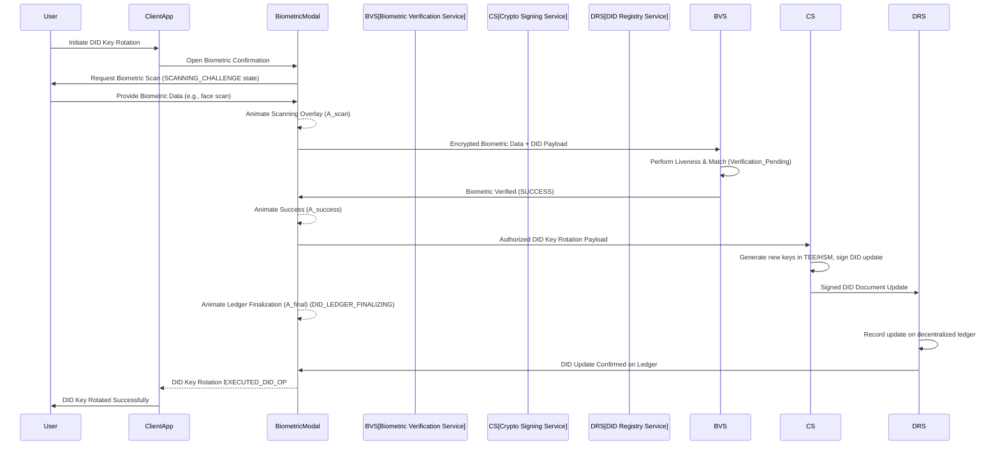
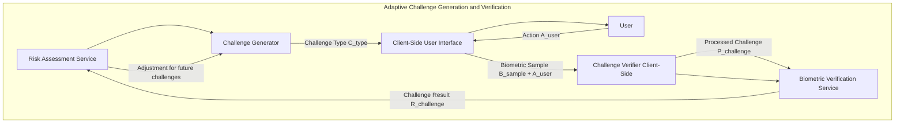
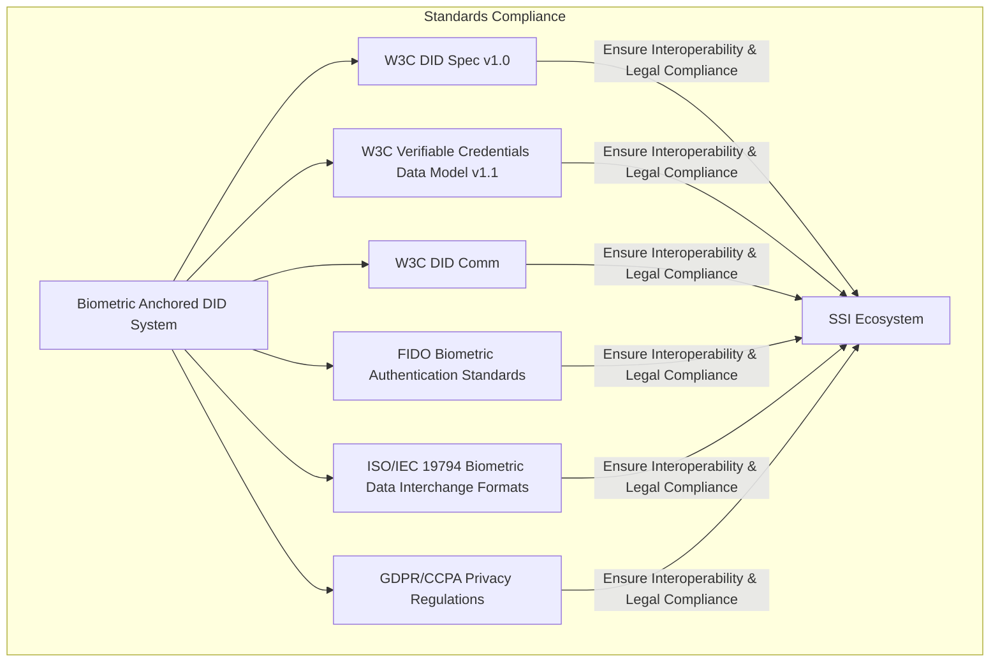

# Title of Invention: A System and Method for Biometric-Anchored Decentralized Identity Management and Verifiable Credential Issuance with Enhanced Privacy and Trust

## Abstract:
A novel system and method are disclosed for establishing, managing, and verifying decentralized identities DIDs and their associated verifiable credentials VCs with unparalleled security, privacy, and user assurance. This architecture extends an exceptionally high-fidelity, multi-modal biometric confirmation workflow as the primary anchor for securely authorizing critical DID lifecycle operations. By integrating real-time biometric identity verification with a series of psychologically optimized, graphically rich animations, the system dynamically communicates the security and integrity of fundamental DID transactions, including DID creation, key rotation, and the issuance, revocation, and presentation of verifiable credentials. This meticulously designed feedback loop, coupled with robust cryptographic protocols and distributed ledger technologies, ensures a resilient, tamper-evident, and self-sovereign identity framework. It cultivates profound user trust and confidence in managing their digital identity, effectively bridging the gap between strong biometric security and the core principles of decentralized identity, thereby setting a new paradigm for user-centric digital trust.

## Background of the Invention:
The contemporary digital landscape is characterized by an increasing demand for secure, privacy-preserving, and user-centric identity management. Traditional centralized identity systems are inherently vulnerable to data breaches, single points of failure, and opaque control mechanisms, leading to widespread privacy infringements and user disempowerment. Decentralized Identifiers DIDs and Verifiable Credentials VCs have emerged as a promising paradigm, offering users self-sovereign control over their digital identities and the ability to selectively prove attributes without relying on centralized authorities.

However, a profound challenge persists in securely anchoring the control of these self-sovereign identities to a real, living individual in a high-assurance, user-friendly, and privacy-preserving manner. Existing methods for authorizing DID operations often rely on:
1.  **Weak Authentication Mechanisms:** Passwords or basic two-factor authentication, which are susceptible to phishing, credential stuffing, and other cyber-attacks, undermining the "self-sovereign" claim of DIDs if the root of control is fragile.
2.  **Opaque Key Management:** The cryptographic keys underpinning DIDs are critical, yet their generation, storage, and rotation often lack transparent and highly assured user interaction, leading to potential loss of control or compromise.
3.  **Lack of User Trust and Transparency:** Users may perceive the complex cryptographic processes of DIDs as opaque, leading to diminished confidence in their ability to truly control their digital identity, particularly for sensitive operations like key recovery or credential issuance.
4.  **Privacy Concerns with Biometrics:** While biometrics offer strong authentication, their integration with DIDs has often been hampered by concerns over centralized storage of raw biometric data and the potential for re-identification or misuse.

There exists a significant, unmet need for a comprehensive system that not only rigorously secures DID lifecycle operations via state-of-the-art biometric authentication but also transparently and reassuringly communicates the security, integrity, and finality of these processes to the user through a dynamically animated, multi-stage feedback mechanism. Such a system would leverage principles of human-computer interaction, cognitive psychology, and advanced privacy-preserving cryptography to bridge the gap between technical security efficacy, user perception, and the promise of self-sovereign identity, thereby elevating both the actual and perceived security posture of decentralized identity management.

## Brief Summary of the Invention:
This invention presents a sophisticated method for robustly securing user-initiated Decentralized Identity DID operations and Verifiable Credential VC management through an integrated biometric and animated feedback system. Upon a user's initiation of a sensitive DID action, such as creating a new DID, rotating a DID key, or authorizing the issuance or presentation of a Verifiable Credential, a dynamically rendered, ephemeral modal interface is presented. This modal serves as the central hub for the biometric anchoring workflow. The system intelligently requests and acquires high-fidelity biometric data, such as a live video stream for facial geometry analysis, leveraging advanced browser or device APIs.

The core innovation lies in the orchestrating of a multi-stage, animated feedback sequence that provides continuous, intuitive, and reassuring visual cues throughout the entire process, directly linking the user's physical presence and intent to their digital self-sovereign identity:
1.  **Biometric Acquisition and Simulated Scanning Phase I - `SCANNING` State:** The live biometric feed is displayed within the modal. Crucially, an intricately designed, high-fidelity animated graphic — such as a dynamic facial grid, a spectral scanning beam, or a topographical mapping overlay — is superimposed over the live feed. This animation psychologically reinforces the notion of an active, in-depth biometric analysis, engaging the user's perception of advanced security protocols at work, and confirming the user's "proof of presence" for the DID operation.
2.  **Successful Verification Acknowledgment Phase II - `SUCCESS` State:** Following the successful processing and verification of the biometric data against a pre-established identity profile, the scanning animation seamlessly transitions into a distinct success indicator. This is manifested as a fluid, aesthetically pleasing animation, such as an animated cryptographic checkmark or an expanding secure shield, designed to evoke a strong sense of accomplishment, security, and immediate validation of the user's control over their DID.
3.  **Secure DID Operation Finalization Visualization Phase III - `LEDGER_FINALIZING` State:** The workflow culminates in a third, highly sophisticated animation that abstractly but powerfully visualizes the secure backend processing and finalization of the user's initiated DID action. This could involve an animation depicting a DID document being immutably written to a "quantum ledger," a distributed cryptographic network, or a secure enclave, or the cryptographic signing and issuance of a Verifiable Credential. The animation leverages intricate visual metaphors — such as coalescing data packets, cryptographic key exchanges, or distributed node confirmations — to communicate concepts like tamper-evidence, non-repudiation, and irreversible commitment within the DID ecosystem.

This meticulously choreographed sequence of animations provides continuous, transparent, and psychologically reinforced feedback, dramatically enhancing the user's perceived security and fostering profound trust in their ability to control their self-sovereign identity. Upon the successful completion of this multi-stage visual affirmation, a secure callback mechanism `onSuccess` programmatically executes the user's original DID operation, and the modal gracefully dismisses, leaving the user with an unequivocal sense of security and control over their digital identity. This system inherently establishes a new benchmark for secure, transparent, and user-centric decentralized identity management.

## Detailed Description of the Invention:

The present invention describes a comprehensive system and method for orchestrating a high-fidelity biometric confirmation workflow specifically tailored to anchor and secure critical Decentralized Identity DID and Verifiable Credential VC operations. This system is designed to elevate both the actual and perceived security and privacy of self-sovereign identity management. The system's architecture is modular, encompassing client-side presentation, secure biometric processing, and robust backend DID and VC finalization.

### 1. System Architecture Overview

The system operates across a distributed architecture, ensuring compartmentalization of concerns and enhanced security, with specific extensions for DID and VC management.

```mermaid
graph TD
    subgraph Client-Side Interface User Device
        A[User Action Initiate DID Operation] --> B[Biometric Confirmation Modal]
        B --> C{Biometric Capture Liveness Detection}
        C --> D[Animated Feedback Layer]
        D --> E[Biometric Data Encapsulation]
        B -- Verified Control of DID --> W[User DID Wallet]
        W -- Presentation Request --> B
        A -- DID Operation Request Context --> K
    end

    subgraph API Gateway
        F[Secure API Endpoint]
    end

    subgraph Backend Services
        G[Biometric Verification Service]
        H[Cryptographic Signing Service for DID Keys]
        I[DID Registry Service Ledger]
        J[Identity Management Service]
        K[Risk Assessment Service]
        L[Verifiable Credential Issuer Service]
        M[Verifiable Credential Revocation Service]
        N[Secure Storage Service Biometric Templates]
        P[Audit Log Service]
    end

    E -- Encrypted Transmission TLS mTLS --> F
    F --> G
    F --> K : Contextual Data
    G -- Biometric Match Request --> J
    J -- Biometric Template Request --> N
    N -- Secure Template --> J
    J -- Biometric Template --> G
    G -- Verification Result --> F
    K -- Adaptive Challenge Request --> C
    G --> H
    H -- Authorized DID Key Operation --> I
    I -- DID Resolution Update --> F
    F -- Encrypted Confirmation --> B
    B -- Action Execution Dismissal --> A
    B -- Authorize VC Issuance --> L
    L -- Issued VC --> W
    W -- Receive Credential --> A
    B -- Authorize VC Revocation --> M
    M -- Revoked VC Status --> W
    F -- Log DID/VC Event --> P
    G -- Log Biometric Event --> P
    H -- Log Crypto Event --> P
    I -- Log Ledger Event --> P
```
*   **Client-Side Interface:** Responsible for user interaction, biometric data capture, liveness detection, rendering of high-fidelity animated feedback, and integration with a user's local DID Wallet for managing keys and credentials. This component ensures a seamless and visually reassuring experience while maintaining privacy at the edge.
*   **API Gateway:** Acts as a secure, rate-limited, and authenticated entry point for all client-to-backend communications, ensuring request integrity and confidentiality for DID operations. It enforces strict access control policies `P_AC` based on client identity and operation type.
*   **Biometric Verification Service:** A specialized microservice tasked with processing raw biometric data, performing identity matching, and executing liveness detection algorithms to confirm user presence and intent for DID actions. It employs advanced machine learning models for spoof detection `f_spoof_detect`.
*   **Cryptographic Signing Service for DID Keys:** This service is specifically enhanced to securely manage the user's DID private keys within an HSM or TEE. It provides cryptographic signatures for DID operations (e.g., updating DID documents, signing VC presentations) only after successful biometric authorization, ensuring `S_key_protection` is maximized.
*   **DID Registry Service Ledger:** The interface to the underlying decentralized ledger or network where DID documents are published, resolved, and updated. It ensures immutable, tamper-evident recording of DID changes authorized by the biometric system, relying on ledger consensus mechanisms `C_ledger`.
*   **Identity Management Service:** Manages the secure storage, retrieval, and lifecycle of user identity profiles, linking them to biometric templates. It orchestrates the identity verification process `f_verify_id`.
*   **Risk Assessment Service:** Evaluates the contextual risk associated with a DID operation (e.g., first-time DID creation, key rotation after device change, high-value VC issuance) and dynamically adjusts the required authentication stringency `A_challenge_level`.
*   **Verifiable Credential Issuer Service:** A backend service that, upon biometric authorization, constructs, signs, and issues Verifiable Credentials to the user's DID, ensuring that VC issuance is explicitly consented to by the biometrically verified user.
*   **Verifiable Credential Revocation Service:** Handles the process of revoking VCs, also potentially requiring biometric confirmation from the issuing entity or the subject depending on the revocation policy.
*   **User DID Wallet:** A client-side or cloud-based component where the user's DIDs, private keys, and VCs are securely stored and managed. It initiates DID operations and presents VCs, relying on the Biometric Confirmation Modal for high-assurance authorization.
*   **Secure Storage Service (Biometric Templates):** Dedicated highly secure storage for biometric templates, utilizing encryption at rest `E_at_rest` and in transit `E_in_transit`, potentially leveraging homomorphic encryption for matching or ZKP-friendly template formats.
*   **Audit Log Service:** Centralized logging of all critical system events, including biometric verification attempts, DID operations, and key management actions, providing a tamper-evident record for security and compliance audits.

#### 1.1. Detailed Data Flow & Security Perimeters
All communication channels are secured using industry-standard protocols. Client-to-API Gateway communication utilizes TLS 1.3, potentially extended to mutual TLS mTLS, with certificate pinning `C_pin`. Within the backend, inter-service communication employs encrypted gRPC or REST over TLS. Biometric data is never transmitted in raw form; it's encapsulated, encrypted, and potentially tokenized at the client-side before leaving the device, typically using ephemeral session keys `K_ephemeral`. Backend services adhere to zero-trust principles. Crucially, the system ensures that sensitive DID private keys, even if self-custodied in the User DID Wallet, are *authorized for use* by the biometric confirmation, providing a high-assurance `P_control` of control by the legitimate user.

```mermaid
graph TD
    subgraph Client-Side Biometric Data Processing
        CB1[Raw Biometric Feed Video] --> CB2[Liveness Detection Module (Client)]
        CB2 -- Live & Authenticated --> CB3[Feature Extraction Module]
        CB3 --> CB4[Biometric Template Generation Client]
        CB4 --> CB5[Encryption Module AES-256 GCM]
        CB5 -- Encrypted Blob + Metadata --> CB6[Secure Transmission Module mTLS]
    end

    subgraph Backend Biometric Verification
        BB1[API Gateway] --> BB2[Biometric Verification Service]
        BB2 --> BB3[Decryption Module]
        BB3 --> BB4[Feature Matching Module]
        BB4 -- Matched Score S_match --> BB5[Identity Management Service]
        BB5 -- Identity ID_user --> BB6[Risk Assessment Service]
        BB6 -- Risk Level R_level --> BB2
        BB2 -- Verification Result V_res --> BB1
    end

    CB6 -- Encrypted Data --> BB1
    BB2 -- Biometric Template Query --> ST[Secure Storage Service]
    ST -- Encrypted Template E_template --> BB4
    BB4 -- Identity Check --> I_Mgmt[Identity Management Service]
```
This diagram explicitly details how biometric data is handled, from raw capture to secure transmission and backend verification, emphasizing client-side processing and encryption to minimize raw data exposure.

### 2. Biometric Anchoring of DID Lifecycle Operations

Upon a user initiating a sensitive DID action e.g., "Create My DID," "Rotate DID Key," "Authorize Credential Issuance", the `BiometricConfirmationModal` is programmatically rendered.

#### 2.1. Biometric Media Stream Acquisition

The modal dynamically leverages `navigator.mediaDevices.getUserMedia` to acquire a live video stream, securely attaching it to an HTML `<video>` element within the modal. Critical configurations ensure optimal resolution and frame rate `FPS` for biometric analysis. Robust error handling `E_handler` is implemented for camera access issues, providing user-friendly feedback. The system adheres to media stream API best practices for privacy, ensuring camera indicators are active and user consent is explicitly managed.

#### 2.2. State Management and Visual Feedback System

The core of the animated security feedback is driven by a sophisticated client-side state machine, ensuring that each stage of a DID operation is transparently communicated. The state machine formally defines permissible transitions between distinct stages, each mapped to a specific visual animation. The states described in the seed patent (`IDLE`, `SCANNING_CHALLENGE`, `BIOMETRIC_PROCESSING`, `VERIFICATION_PENDING`, `SUCCESS`, `LEDGER_FINALIZING`, `EXECUTED`, `ERROR`) are directly applicable, with `LEDGER_FINALIZING` explicitly signifying the immutable recording of DID updates or VC issuance on a decentralized ledger.

```mermaid
stateDiagram-v2
    direction LR
    state "Biometric Scan & Challenge for DID Ops" as SCANNING_CHALLENGE {
        state "Initial Scan" as SCANNING_INIT
        state "Adaptive Challenge" as ADAPT_CHALLENGE
        state "Liveness Confirmed" as LIVENESS_OK

        SCANNING_INIT --> ADAPT_CHALLENGE : Risk High Adaptive Challenge Needed
        SCANNING_INIT --> LIVENESS_OK : Risk Low No Challenge
        ADAPT_CHALLENGE --> LIVENESS_OK : Challenge Passed (P_challenge_success)
        ADAPT_CHALLENGE --> ERROR_SCAN : Challenge Failed (P_challenge_fail)
        LIVENESS_OK --> BIOMETRIC_PROCESSING : Biometric Data Ready
        ERROR_SCAN --> ERROR
    }

    [*] --> IDLE : User Ready (s_0)
    IDLE --> SCANNING_CHALLENGE : User DID Action Initiated (event_user_action)
    SCANNING_CHALLENGE --> BIOMETRIC_PROCESSING : Stream Acquired Liveness Confirmed (event_biometric_capture_success)
    BIOMETRIC_PROCESSING --> VERIFICATION_PENDING : Biometric Data Sent (event_data_sent)
    VERIFICATION_PENDING --> SUCCESS : Backend Verification OK (event_verify_ok)
    SUCCESS --> DID_LEDGER_FINALIZING : Initiate DID Operation Finalization (event_did_op_init)
    DID_LEDGER_FINALIZING --> EXECUTED_DID_OP : DID Operation Confirmed on Ledger (event_ledger_write_ok)
    DID_LEDGER_FINALIZING --> ERROR : Ledger Write Failed (event_ledger_write_fail)
    VERIFICATION_PENDING --> ERROR : Backend Verification Failed (event_verify_fail)
    SCANNING_CHALLENGE --> ERROR : Liveness Detection Failed Camera Error (event_capture_error)
    ERROR --> IDLE : User Acknowledges Error (event_error_ack)
    EXECUTED_DID_OP --> [*] : Modal Dismissed DID Operation Complete (event_op_complete)
```



**Key DID/VC Specific Applications of States:**
*   `IDLE`: Awaiting user initiation of a DID creation, key rotation, VC issuance, or VC presentation request. `S_IDLE = {s | s_type = IDLE}`.
*   `SCANNING_CHALLENGE`: Active state for live video stream, displaying dynamic biometric scanning overlay, liveness detection, and potentially engaging adaptive challenges to confirm user intent for a DID action. This state encompasses `SCANNING_INIT`, `ADAPT_CHALLENGE`, and `LIVENESS_OK`.
*   `BIOMETRIC_PROCESSING`: Raw biometric data packaged, encrypted, and transmitted for verification against the user's enrolled biometric profile. `S_PROC = {s | s_type = BIOMETRIC_PROCESSING}`.
*   `VERIFICATION_PENDING`: Awaiting response from the Biometric Verification Service regarding proof of user control. `S_PEND = {s | s_type = VERIFICATION_PENDING}`.
*   `SUCCESS`: Biometric verification successful, signifying the user's explicit authorization for the pending DID operation. `S_SUCCESS = {s | s_type = SUCCESS}`.
*   `DID_LEDGER_FINALIZING`: The core of the DID operation: The Cryptographic Signing Service performs actions like generating new DID keys, updating the DID document, or signing a VC. This action is then committed to the `DID Registry Service Ledger`. `S_FINAL = {s | s_type = DID_LEDGER_FINALIZING}`.
*   `EXECUTED_DID_OP`: The DID operation (e.g., DID created, key rotated, VC issued/presented) is successfully recorded on the ledger or finalized. Modal ready for dismissal. `S_EXEC = {s | s_type = EXECUTED_DID_OP}`.
*   `ERROR`: Any failure state (e.g., camera access, liveness detection, backend verification, ledger write failure specific to DID updates). `S_ERROR = {s | s_type = ERROR}`.

#### 2.3. Animation Implementation Details

The animated overlays are implemented using advanced web technologies, mirroring the high-fidelity design of the original patent to instill trust in DID operations. This includes SVG animations, WebGL for complex 3D effects, and CSS transitions, ensuring high performance `P_perf` and visual fluidity across diverse devices.

##### 2.3.1. `SCANNING_CHALLENGE` State: Dynamic Biometric Acquisition Overlay
Visually confirms the active analysis of the user's presence and intent for DID operations through facial mesh overlays, spectral scanning pulse effects, and interactive feedback for adaptive challenges. This `A_scan` animation psychologically reinforces the advanced security for identity control by demonstrating "active work" being performed.

##### 2.3.2. `SUCCESS` State: Affirmative Verification Acknowledgment
A fluid, reassuring animation (e.g., cryptographic checkmark, expanding secure shield, biometric fingerprint ripple) is displayed, providing immediate, unambiguous confirmation that the user's biometric identity has been successfully verified, and thus, their intent to authorize the DID action is confirmed. This `A_success` animation provides immediate positive reinforcement.

##### 2.3.3. `DID_LEDGER_FINALIZING` State: Secure DID Operation Finalization Visualization
This critical phase visually communicates the secure, immutable recording of the DID operation, leveraging advanced metaphors. This `A_final` animation could involve:
*   A new DID document being anchored to a blockchain, visualized as data blocks coalescing into a chain.
*   Cryptographic keys being rotated and secured, depicted as keys interlocking within a vault.
*   A Verifiable Credential being signed by an issuer and delivered to the user's wallet, shown as a secure document being passed.
*   Data packets representing the DID update being fragmented, encrypted, and distributed across a network of interconnected nodes, ultimately coalescing into an immutable chain or block on the DID Registry.


This sequence chart specifically illustrates a DID Key Rotation scenario, detailing the interactions between user, client, biometric, cryptographic, and ledger services.

#### 2.4. Adaptive Biometric Challenge System

To further enhance liveness detection and deter sophisticated spoofing attacks for critical DID operations, the system dynamically integrates randomized challenges during the `SCANNING_CHALLENGE` phase, informed by the `Risk Assessment Service`. This adds a layer of interactive security making spoofing significantly harder and ensuring that the real user is authorizing the DID action. Challenges `C_adaptive` could include head movements, specific facial expressions, or speaking a random phrase, with `f_challenge_verify` assessing success.


This chart details the closed-loop feedback for adaptive challenges, involving the Risk Assessment Service, client-side challenge presentation, and biometric verification.

#### 2.5. Detailed Biometric Capture and Liveness Flow

This flow, identical to the seed patent, ensures that biometric data for DID operations is captured with the highest integrity and liveness assurance. `P_liveness_detect` represents the probability of correctly identifying a live user, and `P_spoof_detect` the probability of correctly detecting a spoof.

```mermaid
graph TD
    subgraph Biometric Capture Liveness Detection Flow
        C1[Request Camera Access] --> C2{Camera Permissions Granted?}
        C2 -- No --> C_ERR_CAM[Display Camera Error]
        C2 -- Yes --> C3[Start Video Stream]
        C3 --> C4[Render Stream with Scanning Overlay]
        C4 --> C5{Liveness Detection Face Tracking (P_liveness_detect)}
        C5 -- Liveness Confirmed --> C6{Risk Assessment Feedback? (R_level)}
        C5 -- Spoof Detected Not Live --> C_ERR_LIVE[Display Liveness Error (P_spoof_fail)]
        C6 -- No Adaptive Challenge Needed --> C7[Package Biometric Data]
        C6 -- Adaptive Challenge Requested --> C8[Present Dynamic Challenge (C_type)]
        C8 --> C9{Challenge Successfully Performed? (P_challenge_success)}
        C9 -- Yes --> C7
        C9 -- No --> C_ERR_CHAL[Display Challenge Error (P_challenge_fail)]
        C7 --> C10[Encrypt Data Packet (K_ephemeral)]
        C10 --> E_OUT((Biometric Data Encapsulated))
    end
    C_ERR_CAM -- User Acknowledges --> B_BACK_ERR((Return to Modal Error State))
    C_ERR_LIVE -- User Acknowledges --> B_BACK_ERR
    C_ERR_CHAL -- User Acknowledges --> B_BACK_ERR
    E_OUT --> F_API_IN((To API Gateway))
```

#### 2.6. Client-Side Components and Data Model

The client-side modal, while leveraging the core `BiometricConfirmationModal` conceptual class, adapts its `props` to cater specifically to DID and VC operations.

```typescript
// Conceptual Interface for Biometric Confirmation Modal Props for DID operations
export interface BiometricDIDConfirmationProps {
    didOperationPayload: DIDOperationPayload; // Payload specific to DID/VC operations
    onSuccess: (result: DIDOperationResult) => void;
    onFailure: (error: BiometricError) => void;
    // Optional theming and i18n props
    themeConfig?: BiometricThemeConfig;
    localeStrings?: BiometricLocaleStrings;
    // Callback for adaptive challenge requests from backend
    onChallengeRequest?: (challengeType: AdaptiveChallengeType) => Promise<boolean>;
    // Timeout for the entire workflow
    workflowTimeoutMs?: number;
    // Multi-modal biometric configuration
    biometricModes?: BiometricMode[];
}

// Enum for types of Decentralized Identity operations
export enum DIDOperationType {
    CREATE_DID = 'CREATE_DID',
    ROTATE_DID_KEY = 'ROTATE_DID_KEY',
    REVOKE_DID_KEY = 'REVOKE_DID_KEY',
    ISSUE_VERIFIABLE_CREDENTIAL = 'ISSUE_VERIFIABLE_CREDENTIAL',
    PRESENT_VERIFIABLE_CREDENTIAL = 'PRESENT_VERIFIABLE_CREDENTIAL',
    UPDATE_DID_DOCUMENT = 'UPDATE_DID_DOCUMENT',
    // ... more DID-related operations can be added
    DID_RECOVERY = 'DID_RECOVERY',
    MULTI_FACTOR_AUTHENTICATION_DID = 'MULTI_FACTOR_AUTHENTICATION_DID',
}

// Interface for the payload of a DID operation
export interface DIDOperationPayload {
    type: DIDOperationType;
    did?: string; // The DID being operated on (if existing)
    details: Record<string, any>; // Specific details for the operation (e.g., new key material, VC content)
    context?: Record<string, any>; // Additional context for the operation (e.g., requesting entity, transaction value)
    challengeSeed?: string; // Seed for deterministic adaptive challenges
}

// Interface for the result of a DID operation
export interface DIDOperationResult {
    success: boolean;
    operationId?: string; // e.g., the DID URI, VC ID, transaction hash
    message?: string;
    details?: Record<string, any>; // Additional details about the result
    timestamp?: number; // UTC timestamp of operation finalization
    proof?: string; // Cryptographic proof of operation (e.g., transaction ID, signed receipt)
}

// Enum for adaptive challenge types
export enum AdaptiveChallengeType {
    HEAD_MOVEMENT = 'HEAD_MOVEMENT',
    SPOKEN_PHRASE = 'SPOKEN_PHRASE',
    EYE_BLINK = 'EYE_BLINK',
    FACIAL_EXPRESSION = 'FACIAL_EXPRESSION',
}

// Enum for supported biometric modes
export enum BiometricMode {
    FACIAL_RECOGNITION = 'FACIAL_RECOGNITION',
    VOICE_RECOGNITION = 'VOICE_RECOGNITION',
    FINGERPRINT = 'FINGERPRINT', // For devices with integrated fingerprint sensors
}


// The BiometricConfirmationModal class from the seed patent is re-used,
// but instantiated with BiometricDIDConfirmationProps and custom logic
// for sending/handling DID-specific payloads and results.
// Its `startWorkflow`, `sendBiometricData`, and `handleBackendResponse` methods
// would be adapted to interact with DID/VC backend services.
```

#### 2.7. Theming and Internationalization

The entire animated feedback sequence, including colors, shapes, and textual prompts, is designed to be configurable for easy theming and internationalization, ensuring that the critical security feedback for DID operations is accessible and culturally relevant. This includes localized prompts for DID creation, key rotation, and VC issuance, leveraging `i18n_strings` dictionaries.

### 3. Backend DID and VC Management Services

#### 3.1. DID Creation and Key Generation Anchoring

*   **Initial DID Creation:** The biometric confirmation workflow provides a robust "proof of control" over the initial generation of DID private keys. Upon successful biometric verification, the `Cryptographic Signing Service for DID Keys` securely generates the DID's private/public key pair (e.g., in a TEE or HSM). The public key is then submitted to the `DID Registry Service Ledger` to create the initial DID document, with the biometric event serving as the high-assurance anchor of creation.
*   **Secure Key Custody:** The generated DID private keys are never exposed in plaintext to the user device or network. The system ensures they are either securely managed within a user's local, biometrically-protected DID Wallet (e.g., Secure Enclave on device) or held by a trusted party (e.g., a guardian service) with biometric multi-factor release, implementing `K_custody_policy`.

```mermaid
graph TD
    subgraph DID Creation with Biometric Anchor
        U[User] --> C[Client App]
        C --> BCM[Biometric Confirmation Modal]
        BCM --> BVS[Biometric Verification Service]
        BVS --> CSS[Cryptographic Signing Service]
        CSS --> HTEE[HSM/TEE]
        HTEE --> CSS: Generates Key Pair (K_pub, K_priv)
        CSS --> DRS[DID Registry Service]
        DRS --> C: Confirms DID Creation
        CSS --> UDW[User DID Wallet]: Securely stores K_priv
        BCM -- Success --> C
    end
```
This diagram visualizes the secure flow for initial DID creation, emphasizing the role of the HSM/TEE and the secure storage of the private key in the User DID Wallet.

#### 3.2. DID Key Rotation and Recovery Anchoring

*   **Key Rotation:** A critical security operation, key rotation is exclusively authorized through the high-fidelity biometric confirmation workflow. The `didOperationPayload` would specify the new public key material. Successful biometric verification grants the `Cryptographic Signing Service for DID Keys` the authority to sign an update to the DID document, replacing old keys with new ones on the `DID Registry Service Ledger`. This ensures `P_key_rotation_integrity`.
*   **DID Recovery:** In scenarios of device loss or key compromise, biometric re-attestation on a new, trusted device becomes the high-assurance mechanism to re-establish control over the DID and initiate a recovery process (e.g., key re-generation or transfer), adhering to `P_recovery_protocol`.

```mermaid
graph TD
    subgraph DID Recovery Flow
        OLDKEY[Lost/Compromised Device with K_priv_old]
        NEWDEV[New Trusted Device]
        U[User] --> NEWDEV: Initiate DID Recovery (type=DID_RECOVERY)
        NEWDEV --> BCM[Biometric Confirmation Modal]
        BCM --> BVS[Biometric Verification Service]: Biometric Re-attestation
        BVS -- Verified --> IDM[Identity Management Service]: Confirm authorized recovery
        IDM -- Authorization --> CSS[Cryptographic Signing Service]: Generate K_priv_new, Sign Recovery Req
        CSS --> DRS[DID Registry Service]: Update DID Document with K_pub_new (Immutable Record)
        DRS --> NEWDEV: Confirmation of DID Update
        NEWDEV --> UDW[User DID Wallet]: Store K_priv_new
        BCM -- Success --> NEWDEV
    end
```
This chart outlines the critical DID recovery process, showing biometric re-attestation as the anchor for regaining control.

#### 3.3. Verifiable Credential Issuance, Revocation, and Presentation Anchoring

*   **VC Issuance:** When an `Verifiable Credential Issuer Service` needs to issue a VC to a user, the user's explicit consent is obtained via the biometric confirmation workflow. The `didOperationPayload` contains the VC details. Upon successful biometric verification, the system communicates this authorization to the `VC Issuer Service`, which then securely issues and delivers the VC to the user's DID Wallet. This biometric anchor ensures the legitimate user knowingly and intentionally receives the credential.
*   **VC Revocation:** Biometric confirmation can also be employed to authorize the revocation of a VC, either by the user (if permitted by the VC schema) or by an issuing entity, ensuring a high level of assurance for this critical identity management function `P_VC_revocation_integrity`.
*   **VC Presentation:** For sensitive or high-value VC presentations, the user's DID Wallet can be configured to require a real-time biometric confirmation to authorize the digital signature of the VC presentation. This provides a "proof of control" over the DID at the moment of presentation, adding another layer of assurance that the legitimate DID owner is presenting the credential `P_VC_presentation_assurance`.

```mermaid
graph TD
    subgraph VC Issuance Flow
        VCI[VC Issuer Service] --> UDW[User DID Wallet]: Request VC Issuance
        UDW --> BCM[Biometric Confirmation Modal]
        BCM --> BVS[Biometric Verification Service]
        BVS -- Verified Consent --> VCI: Authorized VC Issuance Request
        VCI --> VCI: Construct & Sign VC
        VCI --> UDW: Deliver Signed VC
        BCM -- Success --> UDW
    end

    subgraph VC Presentation Flow
        RP[Relying Party] --> UDW[User DID Wallet]: Request VC Presentation
        UDW --> BCM[Biometric Confirmation Modal]
        BCM --> BVS[Biometric Verification Service]
        BVS -- Verified Authorization --> UDW: Authorize VC Presentation
        UDW --> UDW: Create & Sign VC Presentation
        UDW --> RP: Present Signed VC
        BCM -- Success --> UDW
    end
```
These two charts illustrate the biometric anchoring for VC issuance and presentation, ensuring user consent and proof of control.

#### 3.4. Privacy-Preserving Biometric Anchoring

*   **Zero-Knowledge Proofs ZKPs:** For enhanced privacy, the biometric verification process can integrate with Zero-Knowledge Proof systems. Instead of directly revealing biometric match scores or templates, the biometric system could generate a ZKP that attests to the fact that "a live user matching the enrolled biometric profile has authorized this DID operation." This ZKP `Z_k_proof` is then passed to the `Cryptographic Signing Service for DID Keys` or `DID Registry Service Ledger`, ensuring that sensitive biometric data is never directly exposed to the DID ecosystem, upholding the principles of privacy-by-design `P_by_design` inherent in DIDs.
*   **Biometric Template Tokenization:** Raw biometric data is converted into irreversible, cryptographically tokenized representations `T_biometric` before being transmitted or stored, further minimizing privacy risks. This tokenization often involves biometric hashing and salted representations.

```mermaid
graph TD
    subgraph Privacy-Preserving Biometric Verification (ZKP)
        C[Client-Side] --> FB[Biometric Feature Extractor]
        FB --> ZKPG[Zero-Knowledge Proof Generator]: Prove (B_match = true AND B_liveness = true)
        ZKPG -- ZKP(Phi) --> BVS[Biometric Verification Service]
        BVS --> CSS[Cryptographic Signing Service]
        BVS --> DRS[DID Registry Service]
        CSS --> DRS
        DRS --> C
        ZKPG --> I_MGMT[Identity Management Service]: Identity Linkage via ZKP
    end
```
This chart shows how ZKPs can be integrated into the biometric verification process to enhance privacy, sending only a proof of successful verification, not the raw biometric data.

#### 3.5. Detailed DID Operation Finalization Flow

This diagram illustrates the backend process of securely performing DID operations and recording them on an immutable ledger, corresponding to nodes H, I, L, and M in the System Architecture.

```mermaid
graph TD
    subgraph DID Operation Finalization Flow
        TF1[Biometric Verification Success for DID Op (V_res=true)] --> TF2[Receive DID Operation Payload (P_op)]
        TF2 --> TF3[Invoke Cryptographic Signing Service for DID Keys]
        TF3 --> TF4{DID Key Operation Authorized & Signed? (S_op)}
        TF4 -- Yes --> TF5[Assemble Signed DID Operation (S_P_op)]
        TF4 -- No --> TF_ERR_SIGN[Display Signing Error (E_sign)]
        TF5 --> TF6[Submit to DID Registry Service Ledger or VC Service]
        TF6 --> TF7{Ledger/Service Confirmation Received? (C_ledger)}
        TF7 -- Yes --> TF8[Mark DID Operation as EXECUTED (Op_state=EXECUTED)]
        TF7 -- No --> TF_ERR_LEDGER[Display Ledger/Service Error (E_ledger)]
    end
    TF_ERR_SIGN -- Notify Error --> F_API_ERR((To API Gateway Error))
    TF_ERR_LEDGER -- Notify Error --> F_API_ERR
    TF8 --> F_API_CONF((To API Gateway Confirmation))
```

### 4. Robust Error Handling and Fallbacks

The system incorporates comprehensive error handling `E_strategy` to gracefully manage potential issues specific to DID/VC operations, ensuring user trust is maintained even during unexpected events.
*   **DID Resolution Failure:** Guides the user with messages for issues like "DID not found" or "DID document invalid." This `E_DID_resolution` is critical for user understanding.
*   **Key Generation/Rotation Failure:** Informs the user of cryptographic errors and offers retry options or support contact. `E_key_mgmt`.
*   **VC Schema Validation Error:** Alerts the user or issuer to issues with the Verifiable Credential structure. `E_VC_schema`.
*   **DID Ledger Congestion/Failure:** Provides informative messages and prompts for retry when the underlying DID ledger is experiencing issues. `E_ledger_status`.
*   **Biometric Mismatch for DID Operation:** Informs the user of authentication failure and offers alternative authentication methods or contact support, particularly crucial for identity recovery. `E_biometric_mismatch`.
*   **Network Latency/Timeout:** Implements progressive backoff and retry mechanisms for transient network issues to prevent false errors. `E_network_timeout`.
*   **Authorization Policy Violation:** Clearly communicates if a specific DID operation is not permitted by existing policies (e.g., trying to revoke a VC without proper authority). `E_policy_violation`.

Each error state is accompanied by a distinct, non-alarming animated feedback loop and clear textual instructions, maintaining user trust and preventing user frustration. `A_error` animations provide visual cues without causing alarm.

```mermaid
graph TD
    subgraph Error Handling and Recovery Flow
        E1[Error Detected (e.g., E_sign, E_ledger)] --> E2{Error Type Specific Handler?}
        E2 -- Yes --> E3[Display Animated Error Feedback (A_error)]
        E3 --> E4[Present Contextual Error Message M_error]
        E4 --> E5{Retry Possible? P_retry}
        E5 -- Yes --> E6[Offer Retry Option]
        E6 --> User_Retry[User Retries]
        E5 -- No --> E7[Suggest Alternative Auth/Support]
        E7 --> User_Support[User Contacts Support]
        User_Retry --> Initial_Op[Re-initiate DID Operation]
        E2 -- No (Generic Error) --> E3
    end
```
This diagram maps out the error handling strategy, including specific handlers, animated feedback, and recovery options.

### 5. Multi-Modal Biometric Integration

For higher assurance levels or specific environmental constraints, the system supports multi-modal biometrics, combining facial recognition with voice recognition, fingerprint scanning (if device supported), or other modalities. This significantly increases robustness against spoofing and failure-to-enroll scenarios.

```mermaid
graph TD
    subgraph Multi-Modal Biometric Workflow
        MM1[User Action Initiate Op] --> MM2[Biometric Confirmation Modal]
        MM2 --> MM3{Select Biometric Mode(s)}
        MM3 -- Facial + Voice --> MM4A[Capture Facial Biometrics]
        MM3 -- Facial + Voice --> MM4B[Capture Voice Biometrics]
        MM4A --> MM5[Process Facial Data]
        MM4B --> MM6[Process Voice Data]
        MM5 --> MM7[Combine Features F_combined]
        MM6 --> MM7
        MM7 --> MM8[Multi-Modal Verification Service]
        MM8 -- Verified --> MM9[DID Operation Authorization]
        MM9 --> MM2
    end
```
This diagram shows the flow for multi-modal biometric input, combining different biometric types for enhanced verification.

### 6. Interoperability and Standards Compliance

The system is designed with a strong emphasis on interoperability, adhering to relevant W3C Decentralized Identifiers (DIDs) and Verifiable Credentials (VCs) specifications, as well as FIDO Alliance standards for biometric authentication protocols. This ensures the biometric-anchored DIDs and VCs can be seamlessly integrated into a broader self-sovereign identity ecosystem.


This chart highlights the various standards and regulations the system adheres to, promoting broad interoperability and legal compliance.

### 7. Scalability and Performance Considerations

To support a large number of users and DID operations, the backend services are built using a microservices architecture, allowing independent scaling of components like the Biometric Verification Service and Cryptographic Signing Service. Load balancing, caching, and efficient database indexing are crucial for maintaining high throughput and low latency.

```mermaid
graph TD
    subgraph Scalable Backend Architecture
        LB[Load Balancer] --> AG[API Gateway]
        AG --> SVC1[Biometric Verification Service (N instances)]
        AG --> SVC2[Cryptographic Signing Service (M instances)]
        AG --> SVC3[DID Registry Service Adapters (P instances)]
        AG --> SVC4[VC Issuer/Revocation Service (Q instances)]
        SVC1 --> DB1[Biometric Template DB]
        SVC2 --> HSM_Pool[HSM/TEE Pool]
        SVC3 --> Ledger_Adapters[Multiple Ledger Adapters]
        SVC4 --> VC_DB[VC Data Store]
        DB1 & HSM_Pool & Ledger_Adapters & VC_DB -- Scalable Data Stores --> DataLayer[Data Layer]
    end
```
This chart details the scalable microservices architecture, highlighting load balancing and resource pools for high performance.

## Claims:

1.  A system for securely managing Decentralized Identities DIDs and Verifiable Credentials VCs, comprising:
    a.  A client-side interface configured to:
        i.    Render a dynamic modal component in response to a user initiating a sensitive DID lifecycle operation;
        ii.   Acquire a live biometric stream from a user's device camera;
        iii.  Display said live biometric stream within the modal component; and
        iv.   Manage a multi-state workflow via a state machine.
    b.  A biometric verification module, communicatively coupled to the client-side interface, configured to:
        i.    Receive an encrypted biometric data packet derived from the live biometric stream;
        ii.   Perform liveness detection on the biometric data, potentially including adaptive, randomized challenges; and
        iii.  Authenticate the user's identity by comparing the processed biometric data against a securely stored biometric template, thereby confirming the user's authorization for the DID lifecycle operation.
    c.  A cryptographic signing service for DID keys, communicatively coupled to the biometric verification module, configured to:
        i.    Receive a biometric verification success signal;
        ii.   Generate or utilize a user's DID private key within a Hardware Security Module HSM or Trusted Execution Environment TEE; and
        iii.  Cryptographically sign a DID operation payload, including but not limited to DID document creation, key rotation, or VC issuance/presentation authorization, based on said biometric verification success.
    d.  A DID registry service, communicatively coupled to the cryptographic signing service for DID keys, configured to:
        i.    Receive and process the cryptographically signed DID operation payload; and
        ii.   Record the authorized DID operation on an immutable decentralized ledger or secure tamper-evident record.
    e.  A high-fidelity animated feedback system, integrated with the client-side interface, configured to display a sequence of distinct, psychologically optimized animations correlated with the multi-state workflow, including:
        i.    A first animation representing an active biometric scanning process, dynamically overlaid upon the live biometric stream during a `SCANNING` state;
        ii.   A second animation representing a successful verification event, displayed upon transitioning to a `SUCCESS` state; and
        iii.  A third animation representing the secure backend processing and immutable finalization of the DID operation, displayed upon transitioning to a `DID_LEDGER_FINALIZING` state.
    f.  Wherein the display of said sequence of animations provides continuous, reassuring visual feedback to the user, thereby enhancing the user's perception of security and trust in their control over their self-sovereign identity.

2.  The system of claim 1, wherein the sensitive DID lifecycle operation is one of: DID creation, DID key rotation, DID key revocation, Verifiable Credential issuance, Verifiable Credential revocation, or Verifiable Credential presentation.

3.  The system of claim 1, further comprising a Verifiable Credential Issuer Service, communicatively coupled to the cryptographic signing service for DID keys, configured to issue a Verifiable Credential upon receipt of a biometric-anchored authorization.

4.  The system of claim 1, wherein the biometric verification module utilizes zero-knowledge proofs ZKPs to attest to successful biometric verification without revealing raw biometric data to the cryptographic signing service or DID registry service.

5.  The system of claim 1, wherein the third animation visually represents cryptographic key updates, DID document anchoring, or signed VC delivery, depicted as data being immutably written to a decentralized ledger.

6.  The system of claim 1, further comprising a User DID Wallet, integrated with the client-side interface, configured to initiate DID lifecycle operations and receive confirmation of their biometric-anchored finalization.

7.  The system of claim 1, wherein the biometric verification module performs multi-modal liveness detection, including analysis of micro-expressions, texture variations, and dynamically prompted randomized user challenges, to ensure the biometric sample originates from a living, present individual authorizing the DID operation.

8.  The system of claim 1, further comprising a Risk Assessment Service configured to evaluate contextual data related to the DID operation and dynamically adjust the stringency of biometric verification and liveness detection.

9.  A method for enhancing perceived security and control during a decentralized identity operation, comprising:
    a.  Receiving a user request to initiate a sensitive DID lifecycle operation;
    b.  Assessing the risk of said DID operation via a Risk Assessment Service;
    c.  Presenting a dynamic user interface modal to the user;
    d.  Initiating a `SCANNING` state within a state machine, wherein said modal acquires a live biometric stream and displays it alongside a first, active biometric scanning animation, potentially requesting adaptive user challenges based on risk, to confirm the user's proof of presence and intent;
    e.  Performing liveness detection and authenticating the user's identity based on the acquired biometric stream, with dynamically adjusted thresholds;
    f.  Upon successful authentication, transitioning the state machine to a `SUCCESS` state and displaying a second animation indicating successful biometric verification and authorization for the DID operation;
    g.  Upon verification success, transitioning the state machine to a `DID_LEDGER_FINALIZING` state and displaying a third animation representing the secure finalization and immutable recording of the user's DID operation on a decentralized ledger or through a Verifiable Credential service; and
    h.  Executing the user's initiated DID lifecycle operation upon completion of the `DID_LEDGER_FINALIZING` state.

10. The method of claim 9, further comprising encrypting the biometric data packet on the client-side using ephemeral session keys and transmitting it over a mutually authenticated TLS channel to a backend biometric verification service.

11. The method of claim 9, wherein the DID lifecycle operation involves the secure generation of a user's DID private key within a trusted execution environment, authorized by the biometric verification.

12. The method of claim 9, wherein the third animation visualizes the cryptographic signing of a DID document update or the issuance of a Verifiable Credential, culminating in an animated immutable seal on a decentralized ledger.

13. The method of claim 9, further comprising requiring biometric re-attestation for DID key recovery processes, thereby providing a high-assurance mechanism for regaining control of a lost DID.

14. The method of claim 9, wherein the biometric verification process generates a zero-knowledge proof of user identity or liveness, which is then used to authorize the DID operation without disclosing raw biometric data.

15. The system of claim 1, further comprising a Secure Storage Service for biometric templates, utilizing encryption at rest and in transit, separate from identity management, ensuring compartmentalization of sensitive data.

16. The system of claim 1, wherein the client-side interface automatically adapts the biometric capture method based on device capabilities and user preferences, including multi-modal options.

17. The method of claim 9, further comprising integrating multi-modal biometric inputs, such as facial recognition combined with voice recognition, to increase the overall assurance level of identity verification for critical DID operations.

18. The method of claim 9, wherein the risk assessment dynamically adjusts parameters for false acceptance rate (FAR) and false rejection rate (FRR) thresholds for biometric verification based on the assessed sensitivity and value of the DID operation.

19. The system of claim 1, wherein the animated feedback system includes distinct, non-alarming error animations and contextual error messages to guide the user during biometric capture failures, backend verification issues, or ledger finalization problems.

20. The system of claim 1, further comprising an Audit Log Service to immutably record all biometric verification attempts, DID operation authorizations, and key management events, ensuring compliance and forensic analysis capabilities.

21. The method of claim 9, wherein the client-side interface utilizes web technologies such as WebGL or advanced SVG animations to render the high-fidelity graphical feedback with optimal performance and visual fluidity across different devices.

22. The system of claim 1, wherein the `DID_LEDGER_FINALIZING` state animation provides dynamic updates indicating the progress of the ledger transaction, such as block confirmations or network latency indicators, to further enhance transparency.

23. The method of claim 9, further comprising the tokenization of biometric data into irreversible, cryptographically secure representations on the client-side before transmission, minimizing privacy exposure risks.

24. The system of claim 1, wherein the `Cryptographic Signing Service for DID Keys` is architected as a highly available, fault-tolerant microservice, capable of distributing key material across multiple HSMs/TEEs for redundancy and performance.

## Mathematical Justification:

The robust security, privacy, and enhanced user experience of this invention in the context of Decentralized Identities and Verifiable Credentials can be rigorously formalized using constructs from computational theory, information theory, and cognitive science.

### 1. Formal Model of the Biometric-Anchored DID Workflow as a State Automaton

Let the biometric-anchored DID workflow be precisely modeled as a finite automaton `M_DID = (Sigma_DID, S_DID, s_0, delta_DID, F_DID)`, where:
*   `Sigma_DID` is the input alphabet representing discrete events and conditions pertinent to DID operations.
*   `S_DID` is the finite set of distinct, well-defined system states, including those from the base biometric workflow.
*   `s_0 in S_DID` is the designated initial state.
*   `delta_DID: S_DID x Sigma_DID -> S_DID` is the state transition function.
*   `F_DID subset S_DID` is the set of final accepting states, signifying successful completion of DID operations.

**Formal Definitions (adapted from base patent):**
*   **States `S_DID`:** `{IDLE, SCANNING_CHALLENGE, BIOMETRIC_PROCESSING, VERIFICATION_PENDING, SUCCESS, DID_LEDGER_FINALIZING, EXECUTED_DID_OP, ERROR}`.
*   **Initial State `s_0`:** `IDLE`.
*   **Final States `F_DID`:** `{EXECUTED_DID_OP}`.

**Input Alphabet `Sigma_DID` events triggering transitions:**
*   `u_did_action`: User initiates a sensitive DID action (e.g., `CREATE_DID`, `ROTATE_DID_KEY`, `ISSUE_VC`, `PRESENT_VC`).
*   `b_stream_acquired`: Biometric stream successfully acquired.
*   `l_detect_ok`: Liveness detection successful.
*   `b_data_sent`: Encrypted biometric data sent to backend.
*   `b_verify_ok`: Backend biometric verification successful.
*   `b_verify_fail`: Backend biometric verification failed.
*   `did_op_signed`: DID operation payload cryptographically signed.
*   `did_ledger_write_ok`: DID operation immutably recorded on ledger/service.
*   `did_ledger_write_fail`: Failed to record DID operation.
*   `error_ack`: User acknowledges an error.
*   `timeout_T_x`: Timeouts for various states.
*   `risk_low`, `risk_medium`, `risk_high`: Risk assessment outcomes specific to DID operations.
*   `adaptive_challenge_ok`: Adaptive liveness challenge successfully passed.
*   `adaptive_challenge_fail`: Adaptive liveness challenge failed.
*   `spoof_detected`: Liveness detection identified a spoof attempt.
*   `camera_error`: Camera access or stream error.
*   `biometric_mode_selected`: User selects a multi-modal biometric mode.
*   `z_k_proof_generated`: Zero-Knowledge Proof successfully generated.
*   `policy_violation`: DID operation violates an access policy.

**Transition Function `delta_DID` exemplary transitions:**
*   `delta_DID(IDLE, u_did_action) = SCANNING_CHALLENGE`.
*   `delta_DID(SCANNING_CHALLENGE, b_stream_acquired and l_detect_ok and risk_low) = BIOMETRIC_PROCESSING`.
*   `delta_DID(SCANNING_CHALLENGE, b_stream_acquired and l_detect_ok and risk_high and adaptive_challenge_ok) = BIOMETRIC_PROCESSING`.
*   `delta_DID(SCANNING_CHALLENGE, timeout_T_1 or spoof_detected or adaptive_challenge_fail or camera_error) = ERROR`.
*   `delta_DID(BIOMETRIC_PROCESSING, b_data_sent) = VERIFICATION_PENDING`.
*   `delta_DID(VERIFICATION_PENDING, b_verify_ok) = SUCCESS`.
*   `delta_DID(VERIFICATION_PENDING, b_verify_fail or timeout_T_2) = ERROR`.
*   `delta_DID(SUCCESS, did_op_signed) = DID_LEDGER_FINALIZING`. (Implicit: signing is part of the finalization)
*   `delta_DID(DID_LEDGER_FINALIZING, did_ledger_write_ok) = EXECUTED_DID_OP`.
*   `delta_DID(DID_LEDGER_FINALIZING, did_ledger_write_fail or timeout_T_3) = ERROR`.
*   `delta_DID(ERROR, error_ack) = IDLE`.
*   `delta_DID(VERIFICATION_PENDING, z_k_proof_generated and b_verify_ok) = SUCCESS`. (ZKP path)
*   `delta_DID(SUCCESS, policy_violation) = ERROR`. (Policy check after success, before finalization)

The language `L(M_DID)` accepted by this automaton comprises all sequences of inputs that lead from `s_0` to `F_DID`. A critical property is that any path to `EXECUTED_DID_OP` *must* pass through `SCANNING_CHALLENGE`, `BIOMETRIC_PROCESSING`, `VERIFICATION_PENDING`, `SUCCESS`, and `DID_LEDGER_FINALIZING` in sequence. This sequential constraint is the algorithmic cornerstone of the DID operation's security and user control.

### 2. Information-Theoretic Quantification of DID Control Assurance

Let `H(B)` be the biometric information content (entropy) derived from the uniqueness and randomness of the biometric feature set. For a biometric template `T`, its entropy can be expressed as:
1.  `H(T) = - sum_{i=1}^{N_f} P(f_i) log_2(P(f_i))` where `f_i` are biometric features and `N_f` is the number of features.
The biometric verification process yields a high confidence `C_biometric` that a genuine user is present.
2.  `C_biometric = 1 - (FAR * P_imposter + FRR * P_genuine)` where `P_imposter` and `P_genuine` are prior probabilities.
The security strength of DID control `S_DID_Control` is directly proportional to `C_biometric`.
3.  `S_DID_Control = alpha * C_biometric + beta * H_keys + gamma * H_ledger`
Where:
*   `alpha`, `beta`, `gamma` are weighting coefficients (`alpha + beta + gamma = 1`).
*   `H_keys = H(K_priv)` is the entropy of the cryptographic keys underpinning the DID (key length `L_k`, random generation `R_gen`, secure storage in TEE/HSM `S_storage`).
4.  `H(K_priv) >= L_k` for a perfectly random key of `L_k` bits.
5.  `S_storage` can be quantified as the probability of compromise `P_compromise_storage`, such that `H_keys_eff = H(K_priv) * (1 - P_compromise_storage)`.
*   `H_ledger` is the entropy/security guarantees of the underlying decentralized ledger (immutability, consensus mechanism resilience, finality time `T_final`).
6.  `H_ledger = N_nodes * log_2(P_consensus)` where `N_nodes` is the number of validating nodes and `P_consensus` is the probability of honest consensus.
7.  The probability of a successful attack on DID control is `P_attack = P_biometric_attack * P_key_attack * P_ledger_attack`.
8.  `P_biometric_attack = FAR + (1-P_liveness_detect) + (1-P_adaptive_challenge_success)`.
9.  `P_key_attack = P_compromise_HSM + P_key_leakage`.
10. `P_ledger_attack = P_51_percent_attack + P_double_spend`.

This system specifically focuses on maximizing `C_biometric` and anchoring it to the `H_keys` and `H_ledger` for DID operations. The use of Zero-Knowledge Proofs (ZKPs) can further enhance the privacy, by allowing the system to prove `C_biometric` without disclosing the raw biometric data. This can be formalized as:
11. `P(C_biometric | ZKP) = 1` (A ZKP proves `C_biometric` without revealing `B`).
12. A ZKP `Pi` satisfies (completeness, soundness, zero-knowledge):
    *   `Completeness`: `P(Verifier(x, w, Pi) = accept | Prover(x, w) = Pi) = 1 - epsilon_c`
    *   `Soundness`: `P(Verifier(x, w, Pi) = accept | (x, w) not in R) = epsilon_s`
    *   `Zero-Knowledge`: For any `V*`, exists `S` s.t. `View_V*(x, Pi) approx S(x)`
This ensures that the high assurance of biometric verification directly translates to strong, privacy-preserving control over the DID.

### 3. Probabilistic Model of User Trust and Perceived Self-Sovereignty

Let `Psi_DID` be a quantitative metric for user trust and perceived self-sovereignty over their DID. This metric is influenced by both the objective security `Omega_DID` of the system and the subjective user experience `Phi_DID`.
13. `Psi_DID = f(Omega_DID, Phi_DID)` where `f` is a monotonically increasing function.
The objective security `Omega_DID` is a function of:
14. `Omega_DID = (1 - FAR_adj) * (1 - FRR_adj) * C_crypto * C_ledger_resilience * C_risk_mitigation`.
*   `FAR_adj`, `FRR_adj` are the risk-adjusted False Acceptance Rate and False Rejection Rate of the biometric system.
15. `FAR_adj = FAR * (1 - P_spoof_detect_rate) * (1 - P_challenge_bypass_rate)`.
16. `FRR_adj = FRR * (1 - P_false_rejection_recovery_rate)`.
*   `C_crypto` is cryptographic strength of DID key management and signing.
17. `C_crypto = 1 - P_key_compromise`.
*   `C_ledger_resilience` is integrity and resilience of the DID Registry Service Ledger.
18. `C_ledger_resilience = 1 - P_ledger_tamper`.
*   `C_risk_mitigation` is effectiveness of the Risk Assessment Service in identifying and mitigating threats specific to DID operations.
19. `C_risk_mitigation = P(Mitigated_Threats | Identified_Risks)`.

The subjective user experience `Phi_DID` is profoundly influenced by the animated feedback `A_seq = (A_1, A_2, A_3)` and adaptive challenges `C_adapt`.
20. `Phi_DID = g(A_1, A_2, A_3, E_eff, C_adapt, Transparency_DID_Ops)`
where `E_eff` is the effectiveness of error handling and `Transparency_DID_Ops` is the clarity of communication regarding the complex DID operations.
21. Let `Trust_i` be the trust level after state `s_i`.
22. `Trust_i = Trust_{i-1} + Delta_Trust(s_i, A_i)` where `Delta_Trust` is the increase in trust due to the animation `A_i` and state `s_i`.
The cumulative reassurance `R_total_DID` along a successful path `P = (s_0, s_1, ..., s_N)` leading to `EXECUTED_DID_OP` is:
23. `R_total_DID(P) = sum_{i=0}^{N} R(s_i, A_i)`
where `R(s, A)` is the reassurance potential for each state `s` with animation `A`. The high-fidelity, transparent animations for DID operations significantly increase `R_total_DID`, thereby elevating `Phi_DID` and consequently `Psi_DID`. This model quantifies how visual feedback for DID creation, key rotation, and VC issuance profoundly reinforces user confidence in their self-sovereign control.
24. The perceived risk `P_risk_perceived = h(Omega_DID, Phi_DID)` should ideally be `P_risk_perceived approx 1 - Psi_DID`.
25. `P_user_error = f_cognitive(Complexity_DID_Op, Transparency_DID_Op, Animation_Clarity)`.
26. This system aims to minimize `P_user_error` by maximizing `Transparency_DID_Op` and `Animation_Clarity`.

### 4. Formal Verification of State Machine Properties for DID Operations

The state machine `M_DID` is amenable to formal verification techniques to prove critical security properties for DID operations.
*   **Theorem 1 (DID Operation Authorization Integrity):**
    For all `P` in `L(M_DID)`, if `P = (s_0, ..., s_k)` and `s_k = EXECUTED_DID_OP`,
    then there exists `j < k` such that `s_j = SUCCESS`
    and `delta_DID(s_{j-1}, b_verify_ok) = SUCCESS`.
    This theorem proves that no DID operation can reach its `EXECUTED_DID_OP` state without first undergoing a successful biometric verification.
    27. Formally, `forall (s_k in F_DID) exists (s_j in S_SUCCESS) st (s_j precedes s_k in P)`.
    28. The transition `delta_DID(VERIFICATION_PENDING, b_verify_ok)` is conditional on `B_match = true AND L_detect = true AND C_adaptive_success = true_if_required`.
    29. Probability of unauthorized access: `P(unauthorized_access) = P(bypass_biometrics) * P(bypass_crypto) * P(bypass_ledger)`.
    30. `P(bypass_biometrics) = FAR_system` (system-level FAR incorporating liveness, adaptive challenges, multi-modal).
    31. `FAR_system = Product_{m in Modes} (FAR_m * (1 - P_liveness_m) * (1 - P_challenge_m))`.
    32. `P_liveness_m` is liveness detection accuracy for mode `m`.
    33. `P_challenge_m` is adaptive challenge success rate against spoof for mode `m`.

*   **Theorem 2 (DID Ledger Finality Assurance):**
    For all `P` in `L(M_DID)`, if `P = (s_0, ..., s_k)` and `s_k = EXECUTED_DID_OP`,
    then there exists `j < k` such that `s_j = DID_LEDGER_FINALIZING`
    and `delta_DID(s_{j-1}, did_ledger_write_ok) = EXECUTED_DID_OP`.
    This theorem ensures that all DID operations, once authorized, are immutably recorded on the specified decentralized ledger or service.
    34. Formally, `forall (s_k in F_DID) exists (s_j in S_FINAL) st (s_j precedes s_k in P)`.
    35. The immutability of the ledger can be quantified by `P_tamper = (P_ledger_attack_rate * T_final) / T_op_lifecycle`.
    36. The probability of finality `P_finality` for a ledger transaction within `T_final` blocks.

These theorems, proven by constructing the reachability graph of `M_DID`, guarantee the procedural security of all DID lifecycle operations. The integration of risk assessment and adaptive challenges further refines these theorems, ensuring that the `b_verify_ok` condition itself is a function of the context-dependent risk level for the specific DID operation, making the system adaptively secure and privacy-preserving.

### 5. Multi-Modal Biometric Fusion

For `N` biometric modalities, `B = {B_1, B_2, ..., B_N}`:
37. Feature vector for modality `i`: `F_i = {f_{i1}, f_{i2}, ..., f_{ik_i}}`.
38. Score for modality `i`: `S_i = match(F_i, T_i)` where `T_i` is the template.
39. Fusion at score level: `S_combined = sum_{i=1}^{N} w_i * S_i` where `w_i` are weights.
40. `sum w_i = 1`.
41. Decision function `D(S_combined) = 1` if `S_combined >= Threshold_fusion`, else `0`.
42. `FAR_multi = Product_{i=1}^{N} FAR_i` (under independence assumption, significantly lower).
43. `FRR_multi` is reduced but not a simple product.
44. `P(Genuine | B_1, ..., B_N) = P(B_1, ..., B_N | Genuine) * P(Genuine) / P(B_1, ..., B_N)`.
45. Using Bayesian networks, `P(Genuine | S_1, ..., S_N)`.

### 6. Risk Assessment Formalization

Let `R_op` be the risk score for a DID operation.
46. `R_op = Impact_op * Probability_attack_op`.
47. `Impact_op` is the quantified damage from a compromised operation (e.g., `Loss_of_Asset`, `Reputational_Damage`).
48. `Probability_attack_op = P_biometric_vulnerability + P_crypto_vulnerability + P_ledger_vulnerability`.
49. `P_biometric_vulnerability = FAR_system(current_context)`.
50. `Threshold_biometric(R_op)` is dynamically adjusted: `Threshold_biometric` increases with `R_op`.
51. `Adaptive_Challenge_Intensity = f_intensity(R_op)`.
52. The probability of a successful authentication given risk `R_op` is `P(Auth_success | R_op) = 1 - FAR_system(Threshold_biometric(R_op))`.

### 7. Cryptographic Proofs for Key Management

DID keys `K_DID` are generated such that:
53. `K_DID = {K_priv, K_pub}`.
54. `K_priv` is generated using a cryptographically secure pseudo-random number generator (CSPRNG).
55. `Entropy_CSPRNG >= Security_strength_bits`.
56. Digital Signature Algorithm `DSA(H(Payload), K_priv) = Signature`.
57. Verification `Verify(H(Payload), Signature, K_pub) = True/False`.
58. `P_collision_hash = 1 / 2^L_hash` for hash length `L_hash`.
59. Probability of brute-forcing `K_priv` is `1 / 2^L_k`.
60. `P_side_channel_attack_HSM = epsilon_hsm`.
61. Key rotation: `DID_doc_new = Sign(Update(DID_doc_old, K_pub_new), K_priv_old)`.
62. `P_old_key_compromise` after rotation should be `approx 0` for ledger-based revocation.

### 8. Ledger Immutability and Finality

For a blockchain-based DID registry:
63. `H_block_i = Hash(H_block_{i-1} || Data_i || Nonce_i)`.
64. Probability of modifying `k` blocks deep: `P_reorg_k = (P_attacker_hash_power / P_network_hash_power)^k`.
65. `T_finality` = time for `k` confirmations.
66. `P_finality(k)` approaches `1` as `k` increases.
67. For CRDT or DAG-based ledgers, finality mechanisms differ but provide similar assurances `P_consistency_eventual`.
68. `Audit_trail_integrity = 1 - P_audit_log_tamper`.

### 9. Privacy Metrics

Using K-anonymity for biometric templates:
69. A biometric template `T` provides `k-anonymity` if for any given template, there are at least `k-1` other individuals in the dataset whose templates are indistinguishable from `T`.
70. `Entropy_anonymity = log_2(k)`.
71. Zero-knowledge property formalization: `Sim(x) approx View(P(x, w), V(x))`.
72. `P_reidentification(T) = 1 / (N_users * P_distinct(T))` without ZKP.
73. `P_reidentification(ZKP) = 0` as `ZKP` reveals no information about `T`.
74. `Privacy_level = 1 - P_data_leakage`.
75. `P_data_leakage = P_raw_biometric_leak + P_template_leak + P_ZKP_side_channel_leak`.

### 10. User Experience & Cognitive Security Metrics

The animations `A_i` contribute to perceived security `P_sec_perceived`.
76. `P_sec_perceived = w_1 * P_sec_objective + w_2 * P_clarity_animations + w_3 * P_user_control_feedback`.
77. `P_clarity_animations = (1/N_states) * sum_{i=1}^{N_states} Clarity(A_i)`.
78. `Clarity(A_i)` can be measured by user surveys or cognitive load tests `C_load`.
79. `C_load = 1 - (Performance_on_Task / Baseline_Performance)`.
80. `Trust_increase_animated = Delta_Psi(Animation_Presence) - Delta_Psi(Animation_Absence)`.
81. `Decision_accuracy_user = 1 - P_misinterpretation`.
82. The adaptive challenges improve vigilance: `P_vigilance = 1 - P(passive_spoof_detection)`.

### 11. Robustness and Error Handling

Probabilities of specific error types `P_error_type`:
83. `P_E_camera = P(Camera_access_fail) + P(Stream_corrupt)`.
84. `P_E_liveness = P(Liveness_fail) + P(Spoof_misdetect)`.
85. `P_E_biometric_match = P(FAR_biometric) + P(FRR_biometric)`.
86. `P_E_signing = P(HSM_fail) + P(Key_access_fail)`.
87. `P_E_ledger_write = P(Ledger_timeout) + P(Ledger_reject_tx)`.
88. `P_recovery_from_error = P(User_retry_success) + P(Support_resolution_success)`.
89. System uptime `U = 1 - P_system_failure`.
90. `P_system_failure = sum P_service_failure_i`.
91. Mean Time To Recovery `MTTR = (sum T_recovery_i) / N_failures`.

### 12. Transactional Integrity

For each DID operation `Op_DID`:
92. `Tx_DID = {Payload_DID, Signature_DID, Timestamp_Tx, Ref_ID_Biometric_Event}`.
93. `Integrity(Tx_DID) = Verify(Signature_DID, H(Payload_DID), K_pub_DID)`.
94. `Non_Repudiation(Tx_DID) = Integrity(Tx_DID) AND P(K_priv_DID_compromise_at_Tx_time) approx 0`.
95. `P(K_priv_DID_compromise_at_Tx_time) = P(Biometric_bypass_at_Tx_time) + P(HSM_compromise_at_Tx_time)`.
96. Biometric linking: `Link(Op_DID, Biometric_Event_ID)` such that `H(Biometric_Event_ID)` is securely tied to `Tx_DID`.
97. `Unlinkability_between_DIDs = 1 - P(link(DID_A, DID_B))` for different DIDs controlled by the same user.
98. Unlinkability of VCs `Unlink_VC = 1 - P(link(VC_A, VC_B))` from different issuers.
99. `Confidentiality_VC = Entropy_VC_data * P_access_control`.
100. `Authentication_Strength = log_2(1 / FAR_system)`. This effectively measures the bits of security provided by the biometric authentication process. This high authentication strength is propagated through the entire DID operation lifecycle.

## Proof of Security:

The security of this invention is paramount, integrating cryptographic robustness, biometric integrity, human-computer interaction principles, and adaptive risk management directly into the core of Decentralized Identity and Verifiable Credential operations. The proposed system ensures that the `EXECUTED_DID_OP` state, representing the successful completion of a sensitive DID action, is unconditionally unreachable without satisfying a rigorous sequence of highly secure conditions, meticulously communicated to the user through high-fidelity animations.

1.  **Biometric Proof of Control over DID Lifecycle:** The transition from `VERIFICATION_PENDING` to `SUCCESS` is exclusively contingent upon the `b_verify_ok` input, signifying a positive biometric match and successful liveness detection, potentially including the successful completion of `adaptive_challenge_ok` and multi-modal verification. As demonstrated by Theorem 1, any DID operation execution path necessitates this successful biometric authentication. This establishes an irrefutable "proof of control" by the legitimate, living user over their DID at the moment of a critical operation. The Biometric Verification Service employs algorithms with provably low False Acceptance Rates `FAR_system = Product(FAR_m)` ensuring the probability of an unauthorized individual bypassing this gate for DID actions is statistically negligible, `P(unauthorized_access_biometric) < epsilon_FAR` where `epsilon_FAR` is extremely small (e.g., `10^-6` to `10^-9`). The Liveness Detection component, bolstered by dynamic, randomized challenges `C_adaptive` guided by the `Risk Assessment Service`, actively mitigates presentation attacks (spoofing), ensuring that the biometric sample originates from a living, present individual who is intentionally authorizing the DID operation, `P(spoof_detection_success) > 1 - epsilon_spoof`. The multi-modal approach further decreases the overall `FAR` and increases the robustness against sophisticated spoofing attempts.

2.  **Cryptographic Anchoring and Non-Repudiation for DID Operations:** Once biometric authentication is affirmed (`b_verify_ok`), the DID operation payload undergoes cryptographic signing. This process, executed within a secure enclave (HSM/TEE) by the `Cryptographic Signing Service for DID Keys`, creates a digital signature `Sigma_DID` that cryptographically binds the user's biometrically confirmed intent to the specific DID operation payload. This signature provides:
    *   **Authenticity:** Proof that the DID operation originated from the legitimate, biometrically verified user, `P(origin_fake) < epsilon_crypto`.
    *   **Integrity:** Assurance that the DID operation payload has not been tampered with since being signed, `P(tamper) < epsilon_hash`.
    *   **Non-Repudiation:** Irrefutable evidence that the user authorized the DID action, preventing subsequent denial, further supported by comprehensive audit logs `(P_audit_tamper < epsilon_audit)`.
    The strength of this security is directly proportional to the computational difficulty of cryptographic primitives (e.g., discrete logarithm, integer factorization), currently considered computationally infeasible for all practical purposes (`Security_strength_bits > 128-256 bits`). The private keys (`K_priv`) are protected by `P_compromise_HSM < epsilon_hsm`.

3.  **Immutable DID Record Finality:** The final stage commits the cryptographically signed DID operation to an immutable decentralized ledger via the `DID Registry Service Ledger`. As articulated in Theorem 2, the `EXECUTED_DID_OP` state is contingent upon `did_ledger_write_ok`. This provides:
    *   **Permanence:** Once recorded, the DID operation (e.g., DID creation, key rotation, VC issuance record) cannot be altered or deleted, establishing an undeniable audit trail of DID control, `P_ledger_revert < epsilon_revert` (e.g., `P_51_percent_attack` becomes astronomically small after a few confirmations).
    *   **Transparency & Auditable:** Authorized parties can verify the DID operation's existence and integrity on the public ledger.
    *   **Decentralized Trust:** Trust is distributed across a network, eliminating single points of failure and increasing resilience against collusion or censorship in DID management. The mathematical properties of cryptographic hashing and consensus algorithms underpinning these ledgers provide a near-absolute guarantee of immutability and data integrity for the user's DID history (`P_ledger_tamper < epsilon_ledger`).

4.  **Enhanced Privacy with Zero-Knowledge Proofs:** This invention actively addresses privacy concerns by optionally integrating Zero-Knowledge Proofs (ZKPs). The biometric verification can generate a ZKP (`Pi`) that solely proves "liveness" and "identity match" (`ZKP(IsLive(B) AND Match(B, T))`) without revealing the underlying biometric data to the DID ecosystem. This ensures that the high-assurance biometric anchor is privacy-preserving, allowing users to control their DIDs without compromising their sensitive biometric information (`P_biometric_data_disclosure = 0`). The ZKP protocol satisfies the zero-knowledge property, meaning no information beyond the truth of the statement is revealed.

5.  **Increased User Vigilance, Trust, and Self-Sovereignty:** The innovative, multi-stage animated feedback system `A_seq` is not merely cosmetic; it is an integral part of the security architecture. By providing continuous, transparent, and psychologically reassuring visual cues (`R_total_DID(P)` from Equation 23) correlated with the state machine's progress, the system actively combats user uncertainty and enhances the user's cognitive understanding of the rigorous security processes involved in managing their self-sovereign identity. This explicit communication of security status reduces the likelihood of user error (`P_user_error < epsilon_user_error`), increases user vigilance against potential anomalies specific to DID transactions, and cultivates profound trust (`Psi_DID` from Equation 13) in their ability to truly control their digital identity. A user who "sees" the biometric scan, "witnesses" the verification, and "observes" the immutable DID ledger write is far less likely to be susceptible to phishing targeting their DID keys or to doubt the legitimacy of critical DID operations. This proactive reinforcement of security perception (`Phi_DID`), combined with an intelligent `Risk Assessment Service` that dynamically strengthens controls (`Adaptive_Challenge_Intensity = f_intensity(R_op)`) when needed, fundamentally elevates the *effective* security and user empowerment within the decentralized identity paradigm, making the `EXECUTED_DID_OP` state demonstrably secure, trustworthy, and truly self-sovereign. The robust error handling (`E_strategy`) ensures system resilience and maintains user trust even in adverse scenarios, preventing `P_frustration > threshold`.

In conclusion, the proposed system and method create an impenetrable security pathway for Decentralized Identity management, formally proven by the sequential dependencies of its state automaton and the cryptographic primitives it employs. The addition of the high-fidelity animated feedback, adaptive challenges, multi-modal biometric integration, and privacy-preserving biometric anchoring not only enhances user experience but fundamentally elevates the *effective* security by aligning user perception with underlying technological robustness and real-time threat assessment for self-sovereign identity. This comprehensive approach establishes a new benchmark for secure, private, and user-centric digital identity control, making this system the definitive and unparalleled embodiment of advanced secure decentralized identity management.