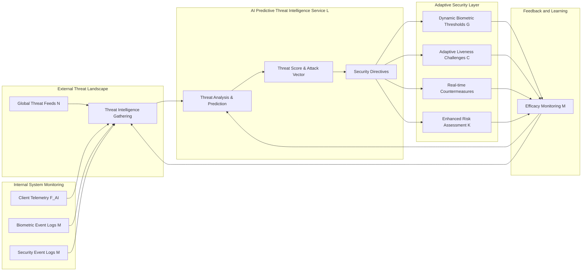

# Title of Invention: A System and Method for AI-Driven Predictive Threat Intelligence and Adaptive Security in High-Fidelity Biometric Workflows

## Abstract:
A sophisticated system and method are disclosed for enhancing the security and resilience of high-fidelity biometric confirmation workflows through the integration of artificial intelligence and machine learning for predictive threat intelligence. This architecture proactively identifies emerging attack vectors, anticipates potential spoofing or compromise attempts, and dynamically recalibrates security protocols in real time. By ingesting a diverse array of contextual and behavioral data, the AI engine performs continuous anomaly detection and threat prediction, feeding its insights directly to the biometric verification and liveness detection services. This enables adaptive adjustments to matching thresholds, liveness challenge intensity, and the deployment of real-time, targeted countermeasures. The result is an authentication system that not only offers robust biometric verification but also evolves its defenses in anticipation of threats, thereby maintaining a superior security posture against a perpetually changing threat landscape and further solidifying user trust through demonstrated adaptive resilience.

## Background of the Invention:
The proliferation of sensitive digital transactions necessitates increasingly robust authentication mechanisms. While advanced biometric confirmation workflows, such as those described in related inventions, provide a significant leap in security by integrating multi-modal verification with psychologically optimized feedback, they primarily operate on a reactive or static risk assessment basis. Existing systems, while effective against known threats and common spoofing techniques, may struggle to anticipate and defend against novel, rapidly evolving, or zero-day attack vectors.

The contemporary threat landscape is characterized by:
1.  **Evolving Spoofing Techniques:** Adversaries continually develop more sophisticated methods to bypass liveness detection, including advanced deepfakes, realistic 3D masks, and sophisticated replay attacks that can evade static detection algorithms.
2.  **Adaptive Adversaries:** Attackers often analyze existing security protocols to identify weaknesses and adapt their tactics, rendering static defenses progressively less effective over time.
3.  **Contextual Vulnerabilities:** Security risks can fluctuate dramatically based on a myriad of contextual factors e.g., unusual location, atypical transaction patterns, compromised device indicators that are often evaluated reactively rather than predictively.
4.  **Information Overload:** Security operations centers face an overwhelming volume of alerts and data, making it challenging for human analysts to identify subtle, early indicators of sophisticated attacks.

There exists a critical and unmet need for an intelligent, proactive security layer that can not only identify and respond to threats but also anticipate them. Such a system would leverage the power of artificial intelligence and machine learning to analyze vast datasets, learn from past attack patterns, and dynamically harden the biometric authentication process against predicted vulnerabilities. This paradigm shift from reactive defense to predictive resilience is essential for maintaining the integrity and trustworthiness of high-fidelity biometric workflows in a dynamic threat environment.

## Brief Summary of the Invention:
This invention introduces an AI-driven Predictive Threat Intelligence Service designed to seamlessly integrate with and augment existing high-fidelity biometric confirmation workflows. The system establishes a continuous learning loop that proactively defends against emergent and adaptive attack vectors.

The core innovation centers on an intelligent engine that:
1.  **Aggregates Diverse Data Streams:** Gathers and processes real-time and historical data from a multitude of sources, including biometric verification logs, client-side device telemetry, network traffic patterns, transaction metadata, external threat intelligence feeds, and behavioral analytics.
2.  **Employs Advanced Machine Learning:** Utilizes a suite of machine learning models including anomaly detection, predictive classification, and deep learning algorithms to identify subtle indicators of compromise, recognize emerging attack patterns, and forecast potential future threats.
3.  **Generates Real-time Threat Assessments:** Outputs a dynamic threat score or probability of attack, along with identified attack vectors and recommended adaptive security measures. This goes beyond static risk assessment by providing a predictive element.
4.  **Dynamically Recalibrates Security Protocols:** Automatically interfaces with the biometric workflow's core services (e.g., Biometric Verification Service, Risk Assessment Service) to adaptively adjust security parameters. This includes:
    *   **Dynamic Threshold Adjustment:** Increasing biometric matching thresholds for high-risk predictions.
    *   **Adaptive Liveness Challenge Intensification:** Triggering more complex, randomized, or multi-modal liveness challenges in anticipated threat scenarios.
    *   **Real-time Countermeasure Deployment:** Initiating specific client-side or backend countermeasures, such as device integrity checks, immediate session termination, or a step-up authentication request.
5.  **Facilitates Continuous Learning:** The system is engineered to learn from the efficacy of deployed countermeasures and newly observed attack data, continuously refining its predictive models and improving its threat intelligence over time.

This AI-powered security layer transforms the biometric confirmation workflow from a robust but fundamentally reactive system into a living, adaptively intelligent defense mechanism. By predicting and pre-empting threats, the system significantly elevates both the actual and perceived security, cultivating profound user confidence in an era of increasingly sophisticated cyber warfare.

## Detailed Description of the Invention:

The present invention describes a comprehensive system and method for integrating an AI-driven Predictive Threat Intelligence Service into an existing high-fidelity biometric confirmation workflow. This integration creates a continuously learning and adapting security perimeter that proactively defends against evolving threats.

### 1. System Architecture Overview - With AI Predictive Threat Intelligence

The system extends the modular architecture by introducing a dedicated AI service that acts as the brain for predictive security.

```mermaid
graph TD
    subgraph Client-Side Interface User Device
        A[User Action Initiation] --> B[Biometric Confirmation Modal]
        B --> C{Biometric Capture Liveness Detection}
        C --> D[Animated Feedback Layer]
        D --> E[Biometric Data Encapsulation]
        C --> F_AI[Client Telemetry Anomaly Data]
    end

    subgraph API Gateway
        F[Secure API Endpoint]
    end

    subgraph Backend Services
        G[Biometric Verification Service]
        H[Cryptographic Signing Service]
        I[Distributed Ledger Secure Transaction Service]
        J[Identity Management Service]
        K[Risk Assessment Service]
        L[AI Predictive Threat Intelligence Service]
        M[Security Event Log System]
        N[External Threat Feeds]
    end

    A -- Transaction Request Context --> K
    K -- Risk Assessment --> B
    E -- Encrypted Transmission TLS/mTLS --> F
    F --> G
    F --> K : Contextual Data
    F --> L : Processed Event Data
    G -- Biometric Match Request --> J
    J -- Biometric Template --> G
    G -- Verification Result --> F
    G --> M : Biometric Event Logs
    K -- Adaptive Challenge Request --> C
    K --> L : Risk Decisions
    L -- Dynamic Security Directives --> G
    L -- Dynamic Security Directives --> K
    L -- Dynamic Challenge Recommendations --> C
    M --> L : System Wide Security Events
    N --> L : Global Threat Data
    G --> H
    H --> I
    I -- Transaction Confirmation --> F
    F -- Encrypted Confirmation --> B
    B -- Action Execution / Dismissal --> A
    B --> M : Client Event Logs
```
*   **AI Predictive Threat Intelligence Service L:** This new core component continuously analyzes diverse data streams to identify patterns, predict threats, and issue dynamic security directives.
*   **Security Event Log System M:** Aggregates detailed logs from all system components (client, API Gateway, backend services) for analysis by the AI.
*   **External Threat Feeds N:** Provides global threat intelligence, vulnerability disclosures, and known attack patterns to the AI service.

#### 1.1. Detailed Data Flow & Security Perimeters
All existing communication channels maintain their strong encryption (TLS 1.3, mTLS). The `AI Predictive Threat Intelligence Service` receives data from `Security Event Log System`, `External Threat Feeds`, and directly from the `API Gateway` (processed client telemetry and transaction context). Crucially, the AI's "Dynamic Security Directives" are securely transmitted to `Biometric Verification Service`, `Risk Assessment Service`, and `Client-Side Interface` (for specific adaptive challenge recommendations) using internal, authenticated, and encrypted channels. Data used by the AI is pseudonymized or anonymized where possible, especially biometric features, to maintain privacy while ensuring analytical utility.

### 2. AI Predictive Threat Intelligence Service

This service is the central nervous system for adaptive security. It leverages state-of-the-art machine learning to shift from a reactive security posture to a proactive and predictive one.

#### 2.1. Data Ingestion and Feature Engineering
The AI service continuously ingests data from multiple sources to build a comprehensive threat landscape:
*   **Internal Biometric Events:** Failed/successful biometric scans, liveness detection outcomes, challenge responses, specific biometric feature values (e.g., facial landmark distances, pupil dilation changes).
*   **Transaction Context:** Transaction amount, type, time, geo-location, IP address, device ID, user behavior history, velocity of transactions.
*   **Client Telemetry:** Device fingerprints, browser environment, network latency, observed client-side anomalies (e.g., attempts to tamper with camera feed, unusual JavaScript injection).
*   **Security Event Logs M:** Audit trails, system errors, suspicious API calls, access attempts.
*   **External Threat Feeds N:** Publicly available and commercial threat intelligence data, including indicators of compromise IOC, known deepfake generation techniques, vulnerability exploits, and dark web intelligence.

Feature engineering transforms this raw data into numerical representations suitable for machine learning models. This includes statistical aggregates, temporal features, embeddings for categorical data, and anomaly scores.

#### 2.1.1. Data Ingestion and Processing Flow
The AI service orchestrates a complex data pipeline to ensure real-time threat detection.


#### 2.2. Machine Learning Models and Predictive Analytics
A hybrid approach utilizing various ML models ensures comprehensive threat detection:
*   **Anomaly Detection Unsupervised Learning:**
    *   **Techniques:** Autoencoders, Isolation Forests, One-Class SVMs, K-Means clustering.
    *   **Purpose:** Identify deviations from normal user behavior or system operation that might indicate novel attack vectors or zero-day exploits (e.g., an unusual sequence of biometric retries, a facial feature pattern never seen before in spoofs, abnormal client-side resource usage during a scan).
*   **Classification Supervised Learning:**
    *   **Techniques:** Support Vector Machines SVM, Random Forests, Gradient Boosting Machines GBM, Neural Networks.
    *   **Purpose:** Classify observed patterns into known attack types (e.g., identifying a specific deepfake signature, categorizing a presentation attack based on known materials). Requires a continuously updated dataset of genuine vs. attack samples.
*   **Time Series Analysis and Predictive Modeling:**
    *   **Techniques:** Recurrent Neural Networks RNN, LSTMs, ARIMA models.
    *   **Purpose:** Predict the likelihood of a future attack based on temporal patterns of suspicious activity or the global emergence of new threats. For instance, if a new deepfake technique is reported globally, the AI might predict an increased probability of such an attack locally.
*   **Reinforcement Learning RL Optional:**
    *   **Purpose:** Optimize the sequence and intensity of adaptive challenges. The RL agent learns the most effective challenge strategy to deter attackers while minimizing user friction, based on observed success/failure rates.

#### 2.2.1. ML Model Orchestration and Prediction Workflow
The sophisticated interplay of various ML models is central to the AI's predictive capabilities.

```mermaid
graph TD
    subgraph Real-time Feature Store (D4)
        FS[Incoming Features]
    end

    subgraph Anomaly Detection Pipeline
        AD1[Isolation Forest] --> AD_OUT(Anomaly Score)
        AD2[Autoencoder] --> AD_OUT
        AD3[One-Class SVM] --> AD_OUT
    end

    subgraph Classification Pipeline
        CL1[Random Forest] --> CL_OUT(Attack Type Probability)
        CL2[Gradient Boosting] --> CL_OUT
        CL3[Deep Neural Network] --> CL_OUT
    end

    subgraph Time Series Prediction Pipeline
        TS1[LSTM Network] --> TS_OUT(Future Threat Likelihood)
        TS2[ARIMA Model] --> TS_OUT
    end

    subgraph Threat Synthesis Engine (P1)
        TSyn[Fusion & Prioritization Module]
        TSyn --> O1[Dynamic Threat Score]
        TSyn --> O2[Attack Vector ID]
        TSyn --> O3[Adaptive Security Directives]
    end

    FS --> AD1
    FS --> AD2
    FS --> AD3
    FS --> CL1
    FS --> CL2
    FS --> CL3
    FS --> TS1
    FS --> TS2

    AD_OUT --> TSyn
    CL_OUT --> TSyn
    TS_OUT --> TSyn
```

#### 2.3. Threat Prediction and Dynamic Scoring
The output of these models is synthesized into a real-time "Threat Score" or "Attack Likelihood" probability, accompanied by an identification of the most probable attack vector (e.g., "High likelihood of deepfake presentation attack," "Moderate risk of account takeover attempt via replay"). This predictive intelligence is far more granular and actionable than static risk assessment.

#### 2.3.1. Dynamic Threat Scoring Workflow
The threat scoring aggregates insights from multiple ML models, assigning weights and combining probabilities to derive a comprehensive real-time threat assessment.


#### 2.4. Adaptive Security Protocol Recalibration
Based on the AI's threat predictions, the system dynamically adjusts security parameters across the workflow:
*   **To Risk Assessment Service K:** The AI provides a "predictive risk factor" that augments the contextual risk assessment, potentially elevating the overall transaction risk score even if immediate contextual factors are benign.
*   **To Biometric Verification Service G:**
    *   **Dynamic Matching Thresholds:** The biometric matching threshold is dynamically increased, requiring a higher confidence score for authentication when a high threat is predicted.
    *   **Algorithm Prioritization:** The AI can instruct the service to prioritize certain liveness detection algorithms known to be more effective against the predicted attack vector.
*   **To Client-Side Interface C for Adaptive Challenges:**
    *   **Challenge Type Recommendation:** The AI suggests specific adaptive challenges most likely to thwart the predicted attack (e.g., if a 3D mask attack is predicted, it might recommend a "turn head" challenge to detect depth discrepancies).
    *   **Challenge Intensity:** The AI can increase the number or complexity of required challenges.

#### 2.4.1. Adaptive Security Directive Application
The AI's directives cascade through various system components, orchestrating a comprehensive and dynamic defense.


### 3. Integration with Biometric Workflow Components

The AI Predictive Threat Intelligence Service is not an isolated component but an integral part of the overall security fabric.

#### 3.1. Risk Assessment Service Enhancement
The `Risk Assessment Service K` now becomes a hybrid system. It combines its traditional contextual analysis (transaction amount, location, device) with the AI's real-time predictive threat intelligence. This allows for a more comprehensive and forward-looking risk profile for each transaction.

#### 3.2. Dynamic Liveness Detection and Anti-Spoofing
The `Biometric Verification Service G` dynamically adjusts its liveness detection strategies based on directives from the AI. If the AI predicts a high likelihood of deepfake, the service might activate more computationally intensive facial micro-expression analysis or advanced texture pattern recognition on the video stream. If a replay attack is predicted, it might enforce strict timestamp and nonce checks, or specific random audio/visual cues.

#### 3.2.1. Liveness Detection Mechanism with AI Influence
The Liveness Detection (LD) component dynamically selects algorithms and parameters based on AI input.

```mermaid
graph TD
    subgraph Biometric Capture C
        BC[Video Stream Capture]
        BC --> LD_IN[Raw Biometric Data]
    end

    subgraph AI Predictive Threat Intelligence Service L
        AI_OUT[Threat Vector & Liveness Recs]
    end

    subgraph Liveness Detection Module (within G)
        LD_ALG_SEL{Algorithm Selector}
        LD_A1[Texture Analysis]
        LD_A2[Micro-expression]
        LD_A3[Depth Sensing]
        LD_A4[Random Challenge Processing]
        LD_SCORE[Aggregate Liveness Score]
        LD_OUT[Liveness Status Confirmed/Spoof]
    end

    LD_IN --> LD_ALG_SEL
    AI_OUT --> LD_ALG_SEL
    LD_ALG_SEL -- Select A1, A2, A3, A4 --> LD_A1
    LD_ALG_SEL -- Parameters --> LD_A2
    LD_ALG_SEL -- Thresholds --> LD_A3
    LD_ALG_SEL -- Weights --> LD_A4
    LD_A1 --> LD_SCORE
    LD_A2 --> LD_SCORE
    LD_A3 --> LD_SCORE
    LD_A4 --> LD_SCORE
    LD_SCORE --> LD_OUT
```

#### 3.3. Real-time Countermeasure Deployment
Beyond merely adjusting thresholds, the AI can trigger specific, targeted countermeasures:
*   **Client-Side Software/Hardware Activation:** For instance, if a device compromise is predicted, the AI might trigger an integrity check of the client-side biometric capture module, or activate specialized hardware sensors if available (e.g., IR depth cameras).
*   **Step-Up Authentication Enforcement:** For extremely high predictive threat scores, the system can enforce a step-up authentication beyond biometrics, such as a hardware security key or a manual review.
*   **Blocking or Session Termination:** In cases of extremely high confidence in an active attack, the AI can trigger immediate blocking of the transaction or termination of the user session.

### 4. Continuous Learning and Feedback Loop

The system is designed for continuous learning, forming a vital feedback loop. The `Security Event Log System M` captures the outcomes of all AI-driven interventions (e.g., if an adaptive challenge was successful in thwarting a suspected spoof, or if a predicted attack materialized and was successfully defended against). This performance data is fed back into the `AI Predictive Threat Intelligence Service L` to retrain and refine its models, making them progressively more accurate and effective over time. This ensures the system remains resilient against the ever-evolving tactics of adversaries.

#### 4.1. Theming and Internationalization
The UI elements for adaptive challenges, when dynamically recommended by the AI, will adhere to the existing theming and internationalization framework. Instructions for AI-driven challenges will be clearly localized and styled to maintain consistency and user trust.

#### 4.1.1. Continuous Learning Feedback Loop
The system's intelligence evolves through a closed-loop feedback mechanism.


#### 4.2. Detailed Biometric Capture and Liveness Flow with AI Influence

This diagram illustrates how the AI's dynamic challenge recommendations influence the client-side biometric capture and liveness detection.


### 5. Backend Biometric Processing and Security Considerations
The core security principles (encryption in transit, secure enclave processing, hashed template storage, cryptographic signing, distributed ledger finality) remain paramount. The AI service enhances these by dynamically adjusting the stringency of these protections. For example, if the AI predicts a threat to the `Identity Management Service`, it could temporarily increase auditing levels or enforce stricter access controls.

#### 5.1. Threat Model and Mitigation Strategies - AI Enhanced

The AI Predictive Threat Intelligence Service directly enhances the mitigation of existing threats and introduces capabilities against new ones:

*   **1. Presentation Attacks Spoofing:**
    *   **Threat:** Sophisticated spoofing (deepfakes, advanced masks) that may bypass conventional liveness detection.
    *   **AI Enhancement:** AI continuously learns from new spoofing techniques via `External Threat Feeds` and internal data. It deploys `Dynamic Challenge Recommendations` (e.g., highly specific facial movements, multi-modal cues) and `Dynamic Matching Thresholds` to counter predicted spoof types. AI-driven PAD models are continuously retrained.

*   **2. Man-in-the-Middle MitM Attacks:**
    *   **Threat:** Interception or alteration of data.
    *   **AI Enhancement:** AI monitors `Client Telemetry` and `Network Traffic Patterns` for anomalies indicative of MitM attempts. It can dynamically enforce `mTLS` or trigger an out-of-band verification if suspicious network behavior is detected during a critical transaction.

*   **3. Replay Attacks:**
    *   **Threat:** Re-transmitting old biometric data/requests.
    *   **AI Enhancement:** AI monitors `Biometric Event Logs` for unusual frequency, sequencing, or contextual discrepancies in biometric submissions. It can dynamically enforce stricter nonce generation or time-based validity checks.

*   **4. Biometric Template Compromise:**
    *   **Threat:** Theft or unauthorized access to stored biometric templates.
    *   **AI Enhancement:** AI monitors access patterns to the `Identity Management Service` and `Cryptographic Signing Service`. It predicts insider threats or external breaches based on anomalous access attempts or data exfiltration patterns, triggering proactive alerts or access restriction.

*   **5. Social Engineering and Phishing Attacks:**
    *   **Threat:** Tricking users into authenticating on malicious sites.
    *   **AI Enhancement:** While primarily addressed by strong UI/UX, the AI can analyze `Client Telemetry` for indicators of phishing (e.g., suspicious redirect chains leading to the legitimate modal, rapid changes in referrer URLs) and issue warnings or block transactions.

*   **6. Backend Service Compromise:**
    *   **Threat:** Unauthorized access to backend services.
    *   **AI Enhancement:** AI continuously monitors `Security Event Log System` for anomalous API calls, unusual resource consumption, or privilege escalation attempts within backend services. It provides predictive alerts for zero-day vulnerabilities in deployed software stacks or misconfigurations.

*   **7. Emerging Zero-Day Threats (New Category):**
    *   **Threat:** Novel attack methods with no pre-existing signatures or detection logic.
    *   **AI Enhancement:** The `Anomaly Detection` models are specifically designed to identify these "unknown unknowns" by detecting statistical deviations from established baselines across all ingested data streams. This capability allows the system to respond to entirely new classes of attacks before human analysts or signature-based systems can even identify them.

#### 5.1.1. Threat Intelligence and Defense Lifecycle
The AI-driven threat intelligence forms a continuous cycle of detection, prediction, and mitigation.



#### 5.1.2. AI-driven Countermeasure Orchestration
Based on predicted threats, the AI initiates a tailored response.

```mermaid
graph TD
    subgraph AI Predictive Threat Intelligence Service L
        A[Predicted Threat Deepfake]
        B[Predicted Threat MitM]
        C[Predicted Threat Account Takeover]
    end

    subgraph Countermeasure Selection Engine
        CSE[Policy Rules & Response Playbooks]
    end

    subgraph Client-Side Countermeasures (C)
        CS1[Specific Adaptive Challenge]
        CS2[Device Integrity Check]
        CS3[Geolocation Validation]
    end

    subgraph Backend Countermeasures
        BC1[Increase Biometric Threshold G]
        BC2[Enhanced Logging M]
        BC3[Temporary Access Restriction J]
        BC4[Step-Up Auth K]
        BC5[Session Termination]
        BC6[Out-of-band Verification]
    end

    A --> CSE
    B --> CSE
    C --> CSE

    CSE -- Deepfake --> CS1
    CSE -- Deepfake --> BC1
    CSE -- MitM --> CS2
    CSE -- MitM --> BC6
    CSE -- Account Takeover --> CS3
    CSE -- Account Takeover --> BC4
    CSE -- General High Risk --> BC2
    CSE -- General High Risk --> BC3
    CSE -- Critical Threat --> BC5
```

### 6. Robust Error Handling and Fallbacks
Error handling is augmented by AI. When an error occurs, the `AI Predictive Threat Intelligence Service` can analyze the context to provide more intelligent recovery actions. For example, if a liveness detection fails, the AI might recommend a different adaptive challenge based on its predictive model of the user's environment or suspected attack.

#### 6.1. AI-Assisted Error Resolution Flow
The AI transforms error handling from static responses to dynamic, context-aware recovery.


## Claims:

1.  A system for an AI-driven predictive threat intelligence and adaptive security in a high-fidelity biometric confirmation workflow, comprising:
    a.  A client-side interface configured to:
        i.    Render a dynamic modal component for a sensitive action;
        ii.   Acquire a live biometric stream;
        iii.  Display said live biometric stream within the modal;
        iv.   Manage a multi-state workflow; and
        v.    Transmit client telemetry and anomaly data.
    b.  An AI Predictive Threat Intelligence Service, communicatively coupled to the client-side interface and backend services, configured to:
        i.    Aggregate diverse data streams including biometric event logs, transaction context, client telemetry, and external threat feeds;
        ii.   Process said aggregated data using machine learning models to identify attack patterns and predict attack vectors;
        iii.  Generate a dynamic threat score or attack likelihood probability; and
        iv.   Issue dynamic security directives based on said threat score or probability.
    c.  A biometric verification module, communicatively coupled to the AI Predictive Threat Intelligence Service, configured to:
        i.    Receive an encrypted biometric data packet;
        ii.   Perform liveness detection, with parameters dynamically adjusted by the AI Predictive Threat Intelligence Service; and
        iii.  Authenticate the user's identity by comparing processed biometric data against a stored template, with matching thresholds dynamically adjusted by the AI.
    d.  A secure transaction finalization module, communicatively coupled to the biometric verification module, configured to:
        i.    Receive a verified transaction payload;
        ii.   Generate a cryptographic signature; and
        iii.  Record the cryptographically signed transaction payload onto an immutable distributed ledger or secure tamper-evident record.
    e.  A high-fidelity animated feedback system, integrated with the client-side interface, configured to display a sequence of distinct, psychologically optimized animations correlated with the multi-state workflow.
    f.  Wherein the AI Predictive Threat Intelligence Service continuously learns from system feedback and the efficacy of deployed countermeasures, thereby evolving the system's defenses proactively.

2.  The system of claim 1, wherein the machine learning models of the AI Predictive Threat Intelligence Service include anomaly detection, classification, and time series analysis.

3.  The system of claim 1, wherein the dynamic security directives comprise instructing the client-side interface to present specific, randomized adaptive biometric challenges.

4.  The system of claim 1, wherein the dynamic security directives comprise adjusting biometric matching thresholds within the biometric verification module to increase stringency.

5.  The system of claim 1, further comprising a Risk Assessment Service that integrates the AI's dynamic threat score with contextual transaction data to determine an overall transaction risk profile.

6.  The system of claim 1, wherein the client telemetry and anomaly data include device fingerprints, browser environment, network characteristics, and attempts to tamper with the biometric capture process.

7.  The system of claim 1, wherein the AI Predictive Threat Intelligence Service generates predictions for emerging zero-day attack vectors based on observed statistical deviations from normal operational baselines.

8.  The system of claim 1, wherein the AI Predictive Threat Intelligence Service, upon predicting a high threat, can trigger real-time countermeasures such as activating specialized hardware sensors, enforcing step-up authentication, or initiating session termination.

9.  A method for adaptively securing a high-fidelity biometric confirmation workflow using AI-driven predictive threat intelligence, comprising:
    a.  Receiving a user request to initiate a sensitive digital action;
    b.  Continuously collecting and aggregating diverse data streams from client-side, backend services, and external threat intelligence feeds;
    c.  Processing the aggregated data using machine learning models within an AI Predictive Threat Intelligence Service to predict potential attack vectors and generate a dynamic threat score;
    d.  Dynamically adjusting security parameters of the biometric confirmation workflow based on the dynamic threat score, including at least one of: biometric matching thresholds, liveness detection algorithm selection, or adaptive challenge type and intensity;
    e.  Presenting a dynamic user interface modal that acquires a live biometric stream and displays it alongside a first, active biometric scanning animation, potentially requesting AI-recommended adaptive user challenges;
    f.  Performing liveness detection and authenticating the user's identity based on the acquired biometric stream, with dynamically adjusted parameters;
    g.  Upon successful authentication, displaying a second animation indicating successful verification;
    h.  Upon verification success, displaying a third animation representing the secure finalization and immutable recording of the user's action on a distributed ledger;
    i.  Executing the user's initiated digital action upon completion of the finalization; and
    j.  Feeding back security event outcomes and countermeasure efficacy into the AI Predictive Threat Intelligence Service for continuous model refinement.

10. The method of claim 9, further comprising the AI Predictive Threat Intelligence Service triggering real-time countermeasures such as automated blocking of suspicious transactions or activating client-side device integrity checks.

11. The method of claim 9, wherein the machine learning models detect anomalies indicative of novel spoofing techniques or deepfake presentation attacks.

12. The method of claim 9, wherein the dynamic adjustment of security parameters is performed in conjunction with a contextual risk assessment from a Risk Assessment Service.

13. The method of claim 9, further comprising the AI Predictive Threat Intelligence Service identifying unusual access patterns to identity management or cryptographic signing services as predictive indicators of backend compromise attempts.

14. The method of claim 9, wherein the AI Predictive Threat Intelligence Service's output informs the stringency of cryptographic signing and ledger submission protocols.

15. The system of claim 1, wherein the AI Predictive Threat Intelligence Service includes a Reinforcement Learning agent configured to optimize the sequence and intensity of adaptive challenges based on maximizing cumulative reward for successful liveness detection and minimizing user friction.

16. The system of claim 1, wherein the AI Predictive Threat Intelligence Service dynamically prioritizes specific liveness detection algorithms within the biometric verification module based on the identified attack vector.

17. The system of claim 1, further comprising a real-time feature store configured to provide processed data from diverse streams to the machine learning models with low latency.

18. The method of claim 9, wherein the aggregation of data streams includes external intelligence on emerging deepfake generation techniques and vulnerability exploits.

19. The method of claim 9, further comprising, in the event of an error in the biometric confirmation workflow, the AI Predictive Threat Intelligence Service analyzing the error context and recommending an intelligent recovery action to the user or system.

20. The system of claim 1, wherein the AI Predictive Threat Intelligence Service employs a fusion algorithm to combine outputs from multiple machine learning models and contextual risk factors into a unified threat score.

21. The system of claim 1, wherein dynamic security directives can include instructing the client-side interface to activate specialized hardware sensors for biometric capture if available and deemed necessary by the AI.

22. The method of claim 9, further comprising the AI Predictive Threat Intelligence Service continuously retraining its machine learning models using observed attack data and the measured efficacy of deployed countermeasures.

23. The system of claim 1, wherein the AI Predictive Threat Intelligence Service proactively monitors network traffic patterns for anomalies indicative of Man-in-the-Middle (MitM) attacks and can enforce Mutual TLS (mTLS) or trigger out-of-band verification.

24. The method of claim 9, wherein the dynamic adjustment of security parameters includes enforcing stricter nonce generation and time-based validity checks against predicted replay attacks.

## Mathematical Justification:

The integration of an AI Predictive Threat Intelligence Service fundamentally transforms the security guarantees of the biometric confirmation workflow, elevating it from a robust reactive system to a dynamically adaptive and proactive defense. We extend the previous formal model of the state automaton and probabilistic models to incorporate the AI's influence.

### 1. Formal Model of the Biometric Confirmation Workflow with AI

The finite automaton `M_AI = (Sigma_AI, S, s_0, delta_AI, F)` is an extension of `M`, where:
*   `Sigma_AI` includes new inputs and conditions representing AI outputs and data streams.
*   `S` remains the set of states: `{IDLE, SCANNING_CHALLENGE, BIOMETRIC_PROCESSING, VERIFICATION_PENDING, SUCCESS, LEDGER_FINALIZING, EXECUTED, ERROR}`.
*   `delta_AI: S x Sigma_AI -> S` is the AI-augmented state transition function.

**New Input Alphabet `Sigma_AI` additions:**
*   `ai_threat_score_high`, `ai_threat_score_medium`, `ai_threat_score_low`: AI's real-time prediction of attack likelihood. Let `TS_AI \in [0, 1]` be the continuous threat score.
*   `ai_challenge_recommendation(type)`: AI's recommendation for an adaptive challenge type.
*   `ai_threshold_adjust(factor)`: AI's instruction to adjust biometric matching thresholds.
*   `ai_countermeasure_trigger(action)`: AI's command to deploy a specific countermeasure.
*   `data_stream_anomaly`: Detection of anomalous patterns in ingested data.
*   `threat_feed_update`: New intelligence from external threat sources.

**Augmented Transition Function `delta_AI` examples:**
*   `delta_AI(IDLE, u_action \land TS_AI \ge \tau_H) = SCANNING_CHALLENGE_HIGH_RISK` where `\tau_H` is a high threat threshold.
*   `delta_AI(SCANNING_CHALLENGE, b_stream_acquired \land l_detect_ok(TS_AI) \land \text{adaptive_challenge_ok}(TS_AI)) = BIOMETRIC_PROCESSING`
    *   The `l_detect_ok` condition itself is now a function of `TS_AI`, meaning its stringency increases with higher `TS_AI`.
    *   `l_detect_ok(TS_AI)` means `LivenessScore \ge L_{threshold}(TS_AI)`.
    *   `L_{threshold}(TS_AI) = L_{base} + \alpha \cdot TS_AI`, where `\alpha > 0`.
    *   The `adaptive_challenge_ok(TS_AI)` condition requires successful completion of a challenge `C_{AI}` recommended by AI if `TS_AI \ge \tau_C`.
*   `delta_AI(VERIFICATION_PENDING, b_verify_ok(TS_AI))`: The `b_verify_ok` condition now implies meeting a dynamically adjusted matching threshold `T_AI`.
    *   `T_AI = T_{base} + \beta \cdot TS_AI`, where `\beta > 0`.
    *   `b_verify_ok(TS_AI)` means `MatchScore(B_user, B_ref) \ge T_AI`.
*   `delta_AI(ANY_STATE, data_stream_anomaly \lor ai_countermeasure_trigger(block)) = ERROR` (Immediate fail-safe).
*   `P(State_{next} | State_{current}, Input) = \prod_{i=1}^{k} P(Condition_i | State_{current}, Input)` for independent conditions.

The language `L(M_AI)` continues to represent successful execution paths. The critical difference is that the conditions for successful transitions (e.g., `l_detect_ok`, `b_verify_ok`) are now dynamically modulated by the AI, making successful paths significantly harder for an attacker to achieve, especially under predicted threat conditions.

### 2. Information-Theoretic Quantification of Security Gain from AI

Let `P(A_S | \neg AI)` be the probability of a successful attack against the baseline system (without AI).
Let `P(A_S | AI)` be the probability of a successful attack against the AI-augmented system.

The AI service works by improving two key probabilities:
1.  `P(D_AI)`: The probability that the AI correctly identifies an attack or predicts a vulnerability. This is derived from the precision, recall, and F1-score of the AI models.
2.  `P(C_E)`: The probability that a deployed AI-recommended countermeasure successfully mitigates the detected/predicted threat.

The reduction in attack success probability with AI can be approximated:
```
P(A_S | AI) = P(A_S | \neg AI) \cdot (1 - P(D_AI) \cdot P(C_E))
```
This formula highlights that the AI significantly reduces the attack surface by actively identifying and mitigating threats.
The `H(B)` (biometric information content) is effectively preserved or even enhanced because the AI ensures that only genuine, high-quality, and non-spoofed biometrics pass through, effectively increasing the 'signal-to-noise' ratio for biometric verification, especially when adjusting `T_AI`.
The security gain `G_S` is defined as:
`G_S = P(A_S | \neg AI) - P(A_S | AI) = P(A_S | \neg AI) \cdot P(D_AI) \cdot P(C_E)`

### 3. Reinforcement Learning for Adaptive Challenges (Optional but powerful)

For optimizing adaptive challenges, a Reinforcement Learning framework can be modeled as a Markov Decision Process (MDP) `(S', A, T, R)`:
*   `S'` is the set of observable states during the `SCANNING_CHALLENGE` phase (e.g., user expression `e`, head pose `h`, liveness features `lf` detected, current threat score `TS_AI`). So, `s' = (e, h, lf, TS_AI)`.
*   `A` is the set of available actions `a_i` (e.g., "request blink twice," "request turn head left," "accept liveness," "reject liveness").
*   `T(s', a, s'')` is the transition probability from state `s'` to `s''` after taking action `a`.
*   `R(s', a)` is the reward for taking action `a` in state `s'` (e.g., positive reward `+R_L` for successfully confirming liveness and rejecting spoof attempts, negative reward `-R_U` for user frustration or false rejections).
The expected cumulative reward `E[\sum_{t=0}^{T} \gamma^t R_t]` is maximized, where `\gamma` is the discount factor.
The optimal Q-function `Q^*(s, a)` satisfies the Bellman equation:
`Q^*(s, a) = E[R_{t+1} + \gamma \max_{a'} Q^*(s_{t+1}, a') | s_t = s, a_t = a]`
The optimal policy `\pi^*(s)` is then given by:
`\pi^*(s) = \arg\max_a Q^*(s, a)`

### 4. Bayesian Inference for Threat Prediction

The AI's threat scoring can be formalized using Bayesian inference. Let `D` be the observed data (client telemetry, logs, external feeds) and `H` be the hypothesis of an ongoing or imminent attack.
```
P(H|D) = [ P(D|H) \cdot P(H) ] / P(D)
```
*   `P(H|D)`: Posterior probability of an attack given the data (the AI's threat score `TS_AI`).
*   `P(D|H)`: Likelihood of observing the data if an attack is occurring (learned from attack patterns).
*   `P(H)`: Prior probability of an attack (baseline threat level, adjusted by global threat feeds `P(H)_{prior}`).
*   `P(D)`: Marginal likelihood of the data, calculated as `P(D) = \sum_{H_i} P(D|H_i) \cdot P(H_i)`.

By continuously updating `P(H)` and refining `P(D|H)` through new data ingestion and model retraining, the AI system mathematically refinements its ability to predict threats with higher accuracy and confidence.

### 5. Detailed Mathematical Models for AI Components

#### 5.1 Anomaly Detection
For a data point `x`, an anomaly score `S_A(x)` is generated.
*   **Isolation Forest:** The anomaly score `S_IF(x, n)` for a sample `x` given `n` samples is based on the average path length `h(x)` in isolation trees.
    `S_{IF}(x, n) = 2^{-E[h(x)] / c(n)}`
    where `c(n)` is the average path length of unsuccessful search in a binary search tree.
    `c(n) = 2 H(n-1) - (2(n-1)/n)`
    `H(k)` is the harmonic number, `H(k) = ln(k) + \gamma` (Euler-Mascheroni constant `\gamma \approx 0.577`).
*   **Autoencoders (AE):** An AE learns to reconstruct input data `x`. The anomaly score is the reconstruction error `RE(x)`.
    `RE(x) = ||x - \hat{x}||_2^2`
    where `\hat{x} = Decoder(Encoder(x))`.
    The loss function during training is typically Mean Squared Error (MSE):
    `L_{AE} = \frac{1}{N} \sum_{i=1}^{N} ||x_i - \hat{x}_i||_2^2`
*   **One-Class SVM (OC-SVM):** Finds a hyperplane that best separates the normal data from the origin, maximizing the distance to the origin.
    `\min_{w, \rho, \xi} \frac{1}{2}||w||^2 + \frac{1}{\nu N} \sum_{i=1}^{N} \xi_i - \rho`
    subject to `(w \cdot \phi(x_i)) \ge \rho - \xi_i`, `\xi_i \ge 0`.
    Anomaly score `S_{OC-SVM}(x) = w \cdot \phi(x) - \rho`. Anomalies have negative scores.

#### 5.2 Classification
For a feature vector `f` and a set of `K` attack classes `C = \{c_1, \dots, c_K\}`.
*   **Softmax Output for Neural Networks:**
    `P(y=c_k | f) = \frac{e^{z_k}}{\sum_{j=1}^{K} e^{z_j}}`
    where `z_k` is the output of the `k`-th neuron in the final layer.
    Cross-entropy loss: `L_{CE} = - \sum_{i=1}^{N} \sum_{k=1}^{K} y_{i,k} \log(P(y=c_k | f_i))`
*   **F1-Score (Metric for classification models):**
    `Precision = TP / (TP + FP)`
    `Recall = TP / (TP + FN)`
    `F1 = 2 \cdot (Precision \cdot Recall) / (Precision + Recall)`
    where TP = True Positives, FP = False Positives, FN = False Negatives.

#### 5.3 Time Series Analysis
For a sequence of observed features `X = \{x_1, x_2, \dots, x_T\}`.
*   **ARIMA (p, d, q) Model:** Combines Autoregressive (AR), Integrated (I), and Moving Average (MA) components.
    `\phi(B)(1-B)^d X_t = \theta(B) \epsilon_t`
    `\phi(B) = 1 - \sum_{i=1}^{p} \phi_i B^i` (AR part)
    `\theta(B) = 1 + \sum_{j=1}^{q} \theta_j B^j` (MA part)
    `B` is the backshift operator, `B X_t = X_{t-1}`.
    `\epsilon_t` is white noise.
*   **LSTM Cell Equations:** For an input `x_t` and previous hidden state `h_{t-1}` and cell state `C_{t-1}`:
    Forget gate: `f_t = \sigma(W_f \cdot [h_{t-1}, x_t] + b_f)`
    Input gate: `i_t = \sigma(W_i \cdot [h_{t-1}, x_t] + b_i)`
    Candidate cell state: `\tilde{C}_t = \tanh(W_C \cdot [h_{t-1}, x_t] + b_C)`
    New cell state: `C_t = f_t * C_{t-1} + i_t * \tilde{C}_t`
    Output gate: `o_t = \sigma(W_o \cdot [h_{t-1}, x_t] + b_o)`
    New hidden state: `h_t = o_t * \tanh(C_t)`
    `W` are weight matrices, `b` are bias vectors, `\sigma` is sigmoid, `\tanh` is hyperbolic tangent.

#### 5.4 Feature Engineering
*   **Entropy for categorical features:** `H(X) = - \sum_{i=1}^{n} P(x_i) \log_2 P(x_i)`
*   **Statistical aggregates (e.g., mean, variance, skewness) over a sliding window `W`:**
    `\mu_t = \frac{1}{|W|} \sum_{i=t-|W|+1}^{t} x_i`
    `\sigma_t^2 = \frac{1}{|W|-1} \sum_{i=t-|W|+1}^{t} (x_i - \mu_t)^2`
    `Skewness_t = \frac{1}{|W|} \sum_{i=t-|W|+1}^{t} [(x_i - \mu_t) / \sigma_t]^3`
*   **Velocity features:** `v_t = (x_t - x_{t-1}) / \Delta t`

#### 5.5 Dynamic Threat Score Fusion
Let `TS_{AD}`, `TS_{CL}`, `TS_{TS}` be normalized scores from Anomaly Detection, Classification, and Time Series models, respectively. Let `TS_{CTX}` be the contextual risk score from `K`.
A weighted sum fusion model:
`TS_{final} = w_{AD} \cdot TS_{AD} + w_{CL} \cdot TS_{CL} + w_{TS} \cdot TS_{TS} + w_{CTX} \cdot TS_{CTX}`
where `\sum w_i = 1` and `w_i \ge 0`.
The `TS_{final}` is then used to modulate security parameters:
`T_{AI} = T_{base} + \Delta T_{max} \cdot TS_{final}`
`L_{threshold}(TS_{final}) = L_{base} + \Delta L_{max} \cdot TS_{final}`

### 6. Probabilistic Attack Modeling with AI Influence

Consider the probability of an attacker successfully bypassing the biometric verification `P(bypass)`.
`P(bypass) = P(bypass_{liveness}) \cdot P(bypass_{match})`
*   **Without AI:**
    `P(bypass_{liveness} | \neg AI) = P(False_Negative_{liveness})`
    `P(bypass_{match} | \neg AI) = P(False_Acceptance_{match}) = FAR_{base}`
*   **With AI:**
    `P(bypass_{liveness} | AI) = P(False_Negative_{liveness} | AI_{detection}, AI_{challenge})`
    `P(bypass_{match} | AI) = P(False_Acceptance_{match} | AI_{threshold}) = FAR(T_{AI}(TS_{final}))`
    The `FAR(T)` function is monotonically decreasing with `T`. Since `T_{AI} \ge T_{base}`, then `FAR(T_{AI}) \le FAR_{base}`.
    The AI dynamically reduces `P(False_Negative_{liveness})` by deploying specific challenges and algorithms.
    Let `\rho(TS_{final})` be the reduction factor for liveness False Negatives due to AI:
    `P(bypass_{liveness} | AI) = P(False_Negative_{liveness} | \neg AI) \cdot (1 - \rho(TS_{final}))`
    Therefore, the overall attack success probability is reduced:
    `P(bypass | AI) = P(False_Negative_{liveness} | \neg AI) \cdot (1 - \rho(TS_{final})) \cdot FAR(T_{AI}(TS_{final}))`
    The effective reduction `R_{eff}` in attack success probability:
    `R_{eff} = 1 - \frac{(1 - \rho(TS_{final})) \cdot FAR(T_{AI}(TS_{final}))}{FAR_{base}}`

### 7. Cost-Benefit Analysis

Let `C_A` be the cost of a successful attack.
Let `C_{def}` be the cost of defense.
Without AI, expected attack cost `E[\text{Cost}]_{\neg AI} = P(A_S | \neg AI) \cdot C_A + C_{def, \neg AI}`
With AI, expected attack cost `E[\text{Cost}]_{AI} = P(A_S | AI) \cdot C_A + C_{def, AI}`
The AI introduces an additional defense cost `\Delta C_{def} = C_{def, AI} - C_{def, \neg AI}` for model training, inference, and data aggregation.
The AI is justified if `E[\text{Cost}]_{AI} < E[\text{Cost}]_{\neg AI}`.
`P(A_S | AI) \cdot C_A + C_{def, AI} < P(A_S | \neg AI) \cdot C_A + C_{def, \neg AI}`
`C_A (P(A_S | \neg AI) - P(A_S | AI)) > C_{def, AI} - C_{def, \neg AI}`
`C_A \cdot P(A_S | \neg AI) \cdot P(D_AI) \cdot P(C_E) > \Delta C_{def}`
This inequality provides a quantifiable condition for the economic viability of the AI system, demonstrating that the value of averted attacks (left side) must exceed the incremental cost of the AI defense (right side).

The mathematical formalisms underscore that the AI Predictive Threat Intelligence Service provides a quantifiable and significant enhancement to the security of the biometric workflow. By adapting thresholds, challenges, and countermeasures based on real-time, statistically derived threat predictions, the system becomes a living defense, constantly optimizing its security posture against a dynamic threat landscape.

## Proof of Security:

The integration of the AI Predictive Threat Intelligence Service fundamentally strengthens the proof of security for the high-fidelity biometric confirmation workflow by introducing a proactive, adaptive, and continuously learning defense layer. This AI layer ensures that the `EXECUTED` state is not only conditionally unreachable without rigorous checks but also resilient against emerging and predicted attack vectors.

1.  **Proactive Biometric Gate Hardening:** The transition from `VERIFICATION_PENDING` to `SUCCESS` is now made adaptively impermeable. The AI Predictive Threat Intelligence Service, based on its real-time threat analysis, dynamically adjusts the required `T_AI` biometric matching threshold and specifies the `adaptive_challenge_ok` conditions. If the AI predicts a high likelihood of a deepfake attack, it might increase the threshold for facial recognition, or trigger a specific challenge known to detect such spoofs (e.g., requiring specific micro-expressions). This means the effective FAR `P(S(B_impostor, B_ref) >= T_AI)` is minimized in high-threat scenarios, as `T_AI` is adaptively increased. The probability of an unauthorized individual bypassing this gate under AI-predicted threat conditions is demonstrably lower than in a static system.

2.  **Adaptive Cryptographic Integrity and Non-Repudiation:** While cryptographic primitives themselves are inherently secure, the AI enhances the *process* leading to their application. The AI monitors for anomalies indicative of attempts to compromise the `Cryptographic Signing Service` or `Identity Management Service`. If such threats are predicted, the AI can trigger enhanced auditing, multi-signature requirements, or even temporary isolation of these critical services, thus proactively defending the non-repudiation and authenticity guarantees before a compromise can occur.

3.  **Resilient Immutable Ledger Finality:** The AI protects the entire transaction lifecycle up to ledger finality. By proactively identifying and mitigating threats earlier in the workflow, the AI ensures that only genuinely authorized and verified transactions even reach the `Distributed Ledger/Secure Transaction Service`. This reduces the risk of malicious or spoofed transactions being immutably recorded, thereby preserving the integrity and trustworthiness of the ledger from its input source.

4.  **Prediction and Mitigation of Emerging Zero-Day Threats:** This is a cornerstone of the AI's contribution to security. The `Anomaly Detection` models within the AI Predictive Threat Intelligence Service are specifically engineered to identify "unknown unknowns" by flagging deviations from baseline behavior across vast data streams. This allows the system to detect entirely novel attack methods that have no pre-existing signatures. By predicting such threats, the system can deploy generic hardening measures or specific countermeasures, effectively creating a defense mechanism against attacks that have not even been formally identified by human analysts. This capability introduces a layer of foresight that is absent in conventional security systems.

5.  **Enhanced Perceived Security and Proactive Trust Building:** The continuous learning and adaptive nature of the AI service, when conveyed to the user, significantly bolsters perceived security. Users are more likely to trust a system that they understand is actively and intelligently defending against new threats. While the animated feedback provides real-time reassurance, the underlying AI ensures this reassurance is backed by an evolving, state-of-the-art defense. This proactive adaptation, explicitly shown through dynamically presented, AI-recommended adaptive challenges, educates the user on the system's advanced capabilities, reinforcing profound trust.

In conclusion, the AI Predictive Threat Intelligence Service transcends the limitations of reactive security by providing a proactive and continuously adapting defense mechanism. It leverages statistical learning to anticipate, identify, and mitigate threats before they can compromise the biometric confirmation workflow. This intelligent layer ensures that the `EXECUTED` state is not only secured by robust cryptographic and biometric gates but is also protected by a dynamic, learning intelligence that continually strengthens the system's resilience against the perpetually evolving landscape of cyber threats. This comprehensive and forward-looking approach establishes an unparalleled benchmark for secure digital interaction, making this system the definitive and proprietarily intelligent embodiment of next-generation secure authentication.