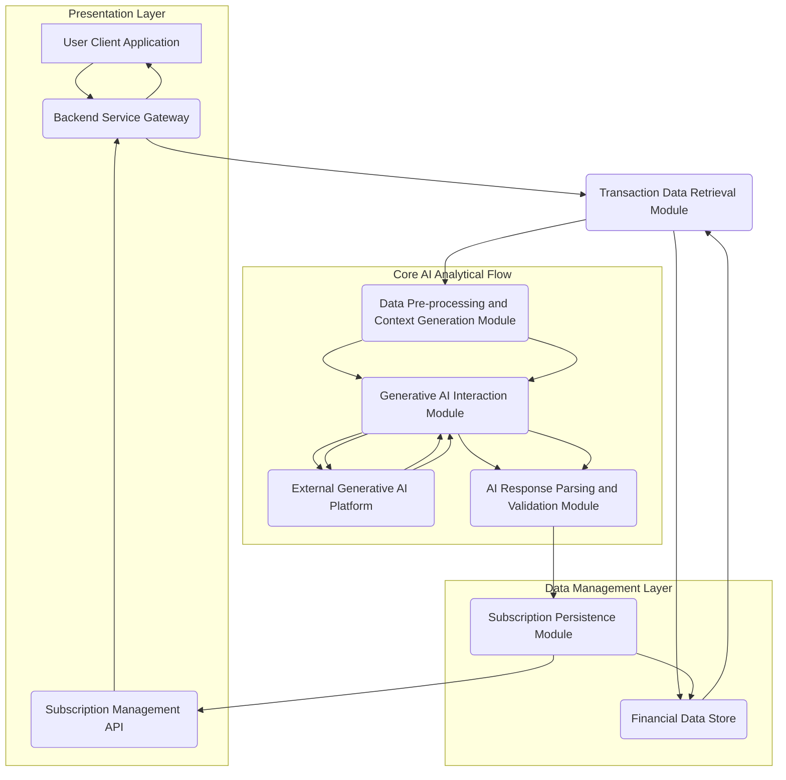

# Title of Invention: A System and Method for the Autonomous Identification and Dynamic Categorization of Covert Recurring Financial Obligations via Advanced Generative Artificial Intelligence

## Abstract:
This disclosure delineates an innovative computational paradigm for the autonomous discernment and categorization of undisclosed or overlooked recurring financial obligations, often colloquially termed subscriptions, within a user's chronological record of financial transactions. The system meticulously processes an extensive corpus of transactional data, employing sophisticated pattern recognition algorithms to identify recurrent monetary disbursements directed towards identical or functionally analogous commercial entities. Through an intricate analysis of temporal periodicity, amplitude consistency, and semantic congruence of associated transactional metadata, the system precisely differentiates bona fide recurring commitments from stochastic or infrequent purchasing behaviors. The derived compendium of identified recurring obligations is then presented to the end-user through an intuitive interface, thereby empowering proactive management and mitigation of potentially forgotten or superfluous expenditures. This analytical prowess is significantly augmented by a high-fidelity generative artificial intelligence model, strategically prompted to execute a nuanced heuristic pattern matching and clustering operation across the supplied financial data landscape.

## Background of the Invention:
In contemporary digital economies, consumers are increasingly engaging with a multitude of services and products provisioned under recurring payment models. This proliferation of subscription-based offerings, while convenient, frequently leads to a phenomenon wherein individuals accrue numerous recurring financial commitments, some of which may subsequently become forgotten, underutilized, or entirely superfluous. The cognitive burden associated with the manual reconciliation of extensive financial statements — often spanning months or even years of granular transactional data — to unearth these latent recurring expenditures is profoundly arduous, time-consuming, and highly susceptible to human error. Existing automated financial management tools typically offer limited utility in this specific domain, often requiring explicit user declaration or manual input of known subscriptions, thus failing to address the fundamental problem of *undiscovered* recurring obligations. A critical lacuna therefore exists for a sophisticated, autonomous, and intellectually astute computational system capable of intelligently parsing and synthesizing vast repositories of transactional data to proactively identify and present these often-overlooked financial commitments. Such a system would alleviate a significant financial oversight burden, promoting enhanced fiscal transparency and empowering informed consumer decision-making.

## Brief Summary of the Invention:
The present intellectual construct introduces a revolutionary methodology for the autonomous identification of recurring financial obligations embedded within an individual's transactional history. At its core, the invention synthesizes a comprehensive synopsis of a user's recent financial ledger, comprising essential metadata such as merchant appellation, transactional monetary value, and temporal markers. This meticulously structured synopsis is subsequently encapsulated as contextual input within a highly optimized prompt, which is then submitted to a sophisticated large language model (LLM), serving as the principal analytical engine. The prompt rigorously delineates the LLM's role as a hyper-competent financial forensic analyst, tasking it with the explicit objective of discerning transactional sequences indicative of recurring subscriptions. This involves the astute recognition of repeated disbursements to functionally equivalent merchants, exhibiting commensurate monetary values, and occurring with predictable temporal periodicity (e.g., monthly, quarterly, annual cycles). Crucially, the LLM is architected to yield its analytical findings as a rigorously structured data object, such as a JSON payload, enumerating each potential recurring obligation with its descriptive identifier, estimated recurring amount, and the temporal marker of its most recent instantiation. This structured output is then seamlessly presented to the user, providing an actionable overview of their recurring financial landscape.

## Detailed Description of the Invention:

The comprehensive system for the autonomous identification and dynamic categorization of covert recurring financial obligations operates as a sophisticated, multi-tiered architecture designed for robustness, scalability, and precision. Upon a user's invocation of the recurring expense detection feature, a dedicated backend service initiates a series of orchestrated operations to retrieve, process, analyze, and present the relevant financial insights.

### System Architecture Overview

The underlying system architecture is meticulously engineered to ensure efficient data flow, secure processing, and highly accurate analytical outcomes. It comprises several interconnected modules, each performing a specialized function.


**Figure 1: High-Level System Architecture for AI-driven Subscription Detection**

1.  **User Client Application (A):** The front-end interface (web, mobile, desktop) through which the user interacts with the system, initiates analyses, and views detected subscriptions.
2.  **Backend Service Gateway (B):** The primary entry point for client requests, responsible for authentication, authorization, request routing, and orchestrating interactions between various backend modules.
3.  **Transaction Data Retrieval Module (C):** Responsible for securely accessing and retrieving historical financial transaction data pertinent to the authenticated user from the primary Financial Data Store (D). This module enforces data privacy and access controls.
4.  **Financial Data Store (D):** A robust, secure, and scalable data repository (e.g., a distributed SQL or NoSQL database) housing all user financial transaction records, along with metadata and system-level configurations.
5.  **Data Pre-processing and Context Generation Module (E):** Transforms raw transactional data into a semantically coherent, concise, and optimized textual format suitable for ingestion by a Large Language Model (LLM). This module also constructs the analytical prompt.
6.  **Generative AI Interaction Module (F):** Manages the secure and efficient communication with the External Generative AI Platform (G). It handles API calls, request payload construction, rate limiting, retry mechanisms, and error handling.
7.  **External Generative AI Platform (G):** The third-party or proprietary advanced generative AI model (e.g., Google's Gemini, OpenAI's GPT series) responsible for executing the core pattern recognition and analytical tasks.
8.  **AI Response Parsing and Validation Module (H):** Receives the structured output from the Generative AI Platform, validates its adherence to the expected schema, and extracts the identified subscriptions. It also performs sanitization and basic data integrity checks.
9.  **Subscription Persistence Module (I):** Stores the newly identified and validated recurring subscriptions in the Financial Data Store (D), potentially linking them to user profiles for ongoing management.
10. **Subscription Management API (J):** Provides an interface for the client application to fetch, update, or manage the detected subscriptions (e.g., mark as reviewed, categorize, or ignore).

### Operational Workflow and Data Processing Pipeline

The detailed operational flow encompasses several critical stages, each contributing to the robustness and accuracy of the subscription detection process.

```mermaid
graph TD
    A[User Initiates Subscription Scan] --> B(Auth & Request Validation)
    B --> C{Retrieve Raw Transaction Data <br/> (e.g., Last 12-24 Months)}
    C --> D[Filter & Sanitize Transactions <br/> (Remove Duplicates, Irrelevant Entries)]
    D --> E[Format Transaction Context <br/> (e.g., 'YYYY-MM-DD - Merchant - $Amount;')]
    E --> F[Construct LLM Prompt <br/> (Instructions + Context + Response Schema)]
    F --> G[Transmit Prompt to Generative AI]
    G --> H{Generative AI Processes & Responds <br/> (JSON Object)}
    H --> I[Validate & Parse AI Response <br/> (Schema Adherence, Data Integrity)]
    I --> J[Categorize & Enhance Subscriptions <br/> (e.g., 'Entertainment', 'Utility', 'Financial')]
    J --> K[Persist Detected Subscriptions <br/> (Database Storage)]
    K --> L[Notify User & Update Client UI <br/> (Display Detected Subscriptions)]
    L --> M[User Reviews & Manages Subscriptions <br/> (Categorize, Ignore, Link to External Action)]
```
**Figure 2: Detailed Data Processing Pipeline for Autonomous Subscription Detection**

1.  **User Initiation (A):** The process begins when a user explicitly requests a scan for recurring subscriptions through the client application.
2.  **Authentication & Request Validation (B):** The backend gateway authenticates the user's identity and validates the integrity and permissions of the request.
3.  **Raw Transaction Data Retrieval (C):** The Transaction Data Retrieval Module accesses the `Financial Data Store (D)` to fetch a comprehensive history of the user's financial transactions. A typical lookback window is 12 to 24 months, adjustable based on configurable parameters to balance computational cost with detection thoroughness.
4.  **Filtering & Sanitization (D):** The retrieved data undergoes an initial cleansing phase. This involves:
    *   **Duplicate Removal:** Eliminating any inadvertently duplicated transaction records.
    *   **Irrelevant Entry Pruning:** Filtering out transaction types unlikely to ever constitute a subscription (e.g., ATM withdrawals, one-off cash transfers, large, infrequent purchases clearly outside subscription norms).
    *   **Data Normalization:** Standardizing merchant names where possible (e.g., "AMZN" to "Amazon," "NF" to "Netflix").
5.  **Transaction Context Formatting (E):** The sanitized transaction data is then transformed into a concise, token-efficient textual representation suitable for prompt engineering. An exemplary format might be:
    ```
    `2024-07-21 - Netflix - $15.99; 2024-07-18 - Spotify - $10.99; 2024-06-21 - Netflix - $15.99; 2024-06-18 - Spotify - $10.99; 2024-05-21 - Netflix - $15.99; ...`
    ```
    This linear, semi-structured format minimizes token usage while preserving critical information for the LLM.
6.  **LLM Prompt Construction (F):** A sophisticated prompt is dynamically generated. This prompt consists of several key components:
    *   **Role Instruction:** Directing the LLM to adopt the persona of an expert financial analyst.
    *   **Task Definition:** Clearly instructing the LLM to identify recurring subscriptions.
    *   **Search Criteria:** Emphasizing the analysis of merchant commonality, amount consistency within a defined tolerance, and regular temporal intervals (e.g., monthly, bi-monthly, quarterly, annually).
    *   **Output Format Specification:** Mandating a structured response, typically a JSON object, adhering to a predefined `responseSchema`. This schema ensures parseability and data integrity.
    *   **Transaction Data Embedding:** The formatted transaction context from step (E) is directly embedded into this prompt.

    An example prompt structure:
    ```json
    {
      "role": "system",
      "content": "You are an expert financial analyst specializing in identifying recurring subscriptions from raw transaction data. Analyze the provided transactions to find patterns of repeated payments to the same or highly similar merchants, with consistent amounts (within a small tolerance, e.g., 5%), occurring at regular intervals (e.g., every 28-32 days for monthly, or annually). Prioritize clarity and accuracy. If no subscriptions are found, return an empty list."
    },
    {
      "role": "user",
      "content": "Analyze the following transaction data for recurring subscriptions. Return your findings as a JSON object strictly adhering to the provided schema. Data: [transaction summary generated in step E]"
    },
    {
      "role": "system",
      "content": "Please provide your output in the following JSON format:\n"
                  "```json\n"
                  "{\n"
                  "  \"subscriptions\": [\n"
                  "    {\n"
                  "      \"name\": \"string\",\n"
                  "      \"estimated_amount\": \"number\",\n"
                  "      \"currency\": \"string\",\n"
                  "      \"frequency\": \"string\",\n"
                  "      \"last_charged_date\": \"YYYY-MM-DD\",\n"
                  "      \"merchant_identifiers\": [\"string\"]\n"
                  "    }\n"
                  "  ]\n"
                  "}\n"
                  "```"
    }
    ```
7.  **Prompt Transmission to Generative AI (G):** The constructed prompt is securely transmitted to the `External Generative AI Platform (G)` via a robust API call.
8.  **Generative AI Processing & Response (H):** The generative AI model ingests the prompt, applying its advanced pattern recognition and contextual understanding capabilities to identify potential recurring payments. It then synthesizes its findings into a JSON object strictly conforming to the specified `responseSchema`.
9.  **AI Response Validation & Parsing (I):** Upon receiving the JSON response from the AI, the `AI Response Parsing and Validation Module (H)` rigorously checks for schema adherence, data type correctness, and logical consistency. Any malformed or non-compliant responses are flagged for retry or error handling. Validated data is then parsed into internal data structures.
10. **Subscription Categorization & Enhancement (J):** Beyond mere detection, the system applies further logic to categorize the identified subscriptions (e.g., "Entertainment," "Productivity," "Cloud Storage," "Utilities," "Financial Services," "Health & Wellness"). This categorization can be achieved through a secondary, smaller LLM call for semantic classification, or by rule-based matching against a pre-defined merchant category taxonomy. Additional metadata, such as historical average amount or number of detected payments, may also be computed and appended.
11. **Persistence of Detected Subscriptions (K):** The enriched list of subscriptions is then securely stored in the `Financial Data Store (D)` via the `Subscription Persistence Module (I)`. This ensures that detected subscriptions are retained for subsequent retrieval and management.
12. **User Notification & UI Update (L):** The client application is updated to display the newly identified subscriptions to the user in a clear, actionable format, often with aggregated views, sortable columns, and visual indicators.
13. **User Review & Management (M):** The user can then interact with the detected subscriptions, categorizing them further, marking them as reviewed, ignoring false positives, or initiating external actions (e.g., linking to a cancellation service, setting reminders for upcoming payments).

### Advanced Features and Enhancements

1.  **Adaptive Periodicity Detection:** The system dynamically adjusts its search for periodicity. Instead of fixed intervals, it can identify adaptive patterns, such as "approximately every 30 days but occasionally 28 or 33 days," accounting for billing cycle variations and leap years.
2.  **Semantic Merchant Name Resolution:** Utilizes advanced natural language processing (NLP) techniques, including contextual embeddings and similarity metrics, to identify highly similar or aliased merchant names (e.g., "Amazon" vs. "AMZN.COM" vs. "AMAZON RETAIL") even when they are not exact string matches.
3.  **Anomaly Detection in Subscription Payments:** Beyond detection, the system monitors *active* detected subscriptions for anomalies. This includes:
    *   **Price Increases:** Notifying users if a detected subscription amount deviates significantly from its historical average.
    *   **Skipped Payments:** Alerting if a regularly expected payment does not occur.
    *   **Duplicate Charges:** Identifying instances where the same subscription may have been charged multiple times within a short period.
4.  **Proactive Alerts and Reminders:** Users can opt-in to receive notifications for:
    *   Upcoming subscription payments.
    *   Detected price changes.
    *   Subscriptions that appear to be inactive but might have a hidden annual charge.
5.  **Integration with External Financial Actions:** (Hypothetical, for future expansion) The system can provide direct links or API integrations to external merchant portals or financial services for easier subscription management (e.g., "Click to Cancel," "Manage Subscription Settings").
6.  **Trend Analysis and Fiscal Projection:** Leveraging the identified subscriptions, the system can provide users with insights into their recurring spending trends over time, project future recurring expenses, and visualize the impact of these commitments on their overall budget.
7.  **Confidence Scoring:** Each detected subscription is associated with a confidence score generated by the AI or derived from post-processing heuristics. This allows users to prioritize review of high-confidence detections and understand the certainty of each finding.

### Security and Privacy Considerations

Given the sensitive nature of financial transaction data, the system is designed with a paramount focus on security and privacy:
*   **Data Encryption:** All transaction data, both at rest in the `Financial Data Store (D)` and in transit between modules and to the `External Generative AI Platform (G)`, is encrypted using industry-standard protocols (e.g., AES-256 for data at rest, TLS 1.2+ for data in transit).
*   **Access Control:** Strict role-based access control (RBAC) mechanisms are enforced, ensuring that only authorized modules and personnel can access sensitive data, and only for legitimate operational purposes.
*   **Data Minimization:** Only the absolutely necessary transaction metadata (merchant, amount, date) is transmitted to the generative AI model, avoiding the exposure of personally identifiable information (PII) beyond what is strictly required for analysis.
*   **Anonymization/Pseudonymization:** Where feasible and non-detrimental to analytical accuracy, data may be anonymized or pseudonymized before processing, particularly when interacting with external services.
*   **Compliance:** Adherence to relevant data protection regulations (e.g., GDPR, CCPA, PCI DSS) is a foundational principle of the system's design and operation.
*   **Secure API Integrations:** All interactions with the `External Generative AI Platform (G)` utilize secure API keys, OAuth 2.0, or similar authentication protocols, and communication channels are hardened against interception and tampering.

### Scalability and Performance

The system is architected for high scalability and performance, capable of processing vast volumes of transactional data for a large user base:
*   **Microservices Architecture:** Deployed as a collection of loosely coupled microservices, allowing individual components (e.g., Data Retrieval, AI Interaction, Parsing) to be scaled independently based on demand.
*   **Asynchronous Processing:** Long-running tasks, such as calls to the `External Generative AI Platform (G)`, are handled asynchronously using message queues, preventing blocking operations and improving overall system responsiveness.
*   **Distributed Data Stores:** The `Financial Data Store (D)` leverages distributed database technologies to ensure high availability, fault tolerance, and linear scalability for data storage and retrieval.
*   **Caching Mechanisms:** Strategic caching is implemented at various layers (e.g., frequently accessed user transaction summaries, pre-computed subscription categories) to reduce latency and load on backend services and the generative AI platform.
*   **Optimized Prompt Engineering:** Continuously refining prompts to be token-efficient and unambiguous minimizes computational cost and improves response times from the generative AI, which often bills per token.

## Declarations of Inventive Scope and Utility:

The conceptual framework herein elucidated, along with its specific embodiments and architectural designs, constitutes an original intellectual construct that significantly advances the state of the art in financial intelligence systems. This innovative methodology provides a distinct and superior approach to automated financial analysis.

1.  A pioneering computational method for discerning recurring financial obligations, comprising the foundational steps of:
    a.  Accessing a comprehensively structured historical repository of an individual's financial transactions.
    b.  Constructing an optimized, context-rich summary derived from said transaction history.
    c.  Transmitting said optimized summary, embedded within a meticulously crafted prompt, to an advanced generative artificial intelligence model, with explicit instructions for the model to identify recurring financial disbursements.
    d.  Receiving and rigorously validating a structured data artifact, representing a compendium of potential recurring obligations, as identified and synthesized by the generative artificial intelligence model.
    e.  Presenting said validated compendium to the individual via an interactive user interface.

2.  The pioneering computational method of declaration 1, further characterized in that the meticulously crafted prompt rigorously instructs the generative artificial intelligence model to conduct a multi-variate analysis encompassing the merchant's descriptive identifier, the precise monetary value of the payment, and the temporal periodicity between successive payments for each transaction record.

3.  The pioneering computational method of declaration 1, further characterized in that the transmission to the generative artificial intelligence model incorporates a declarative response schema, compelling the model to render the compendium of potential recurring obligations in a pre-specified, machine-parseable structured data format, such as a JavaScript Object Notation (JSON) object.

4.  An innovative system architecture for the autonomous identification of recurring financial obligations, comprising:
    a.  A secure, distributed data store meticulously engineered for the persistent storage of comprehensive user financial transaction histories.
    b.  A robust service module architected for secure, high-throughput communication with an external generative artificial intelligence model.
    c.  An intelligent processing logic layer configured to perform: (i) the extraction of relevant transaction history, (ii) the sophisticated transformation of this history into a concise, token-optimized prompt, and (iii) the secure transmission of this prompt to the aforementioned generative artificial intelligence model.
    d.  A dynamic user interface component meticulously designed to render and display the structured compendium of potential recurring obligations returned by the generative artificial intelligence model to the user, facilitating intuitive interaction and management.

5.  The innovative system architecture of declaration 4, further comprising a post-processing module configured to semantically categorize each identified recurring obligation into predefined financial categories (e.g., "Entertainment," "Utilities," "Productivity") based on the merchant identifier or AI-derived contextual information.

6.  The innovative system architecture of declaration 4, further comprising a temporal anomaly detection module configured to monitor identified recurring obligations for deviations in payment amount, frequency, or unexpected cessation, and to generate proactive alerts to the user.

7.  The pioneering computational method of declaration 1, further characterized by employing advanced natural language processing techniques, including contextual embeddings and similarity metrics, for robust semantic resolution and normalization of merchant descriptive identifiers prior to or during the generative AI analysis.

8.  The pioneering computational method of declaration 1, further characterized by the dynamic construction of a confidence score for each identified recurring obligation, indicative of the generative AI model's certainty in the detection, thereby assisting user review and prioritization.

## Foundational Principles and Mathematical Justification:

The intellectual construct herein presented derives its efficacy from a rigorous application of principles spanning advanced statistical analysis, time-series informatics, and the emergent capabilities of large-scale generative artificial intelligence. We herein delineate the mathematical underpinnings that formally validate the operational mechanisms of this innovative system.

### The Transactional Manifold: A Formal Representation

Let $\mathcal{T}$ denote the entire universe of an individual's financial transaction data. A specific, time-ordered sequence of $n$ transactions under consideration is represented as a finite, discrete set $T = \{t_1, t_2, \ldots, t_n\}$, where each transaction $t_i$ is a tuple $(m_i, a_i, d_i)$.

1.  **Merchant Identifier ($m_i$):** This is a linguistic descriptor, represented as a string or a vector in a high-dimensional semantic space, uniquely or quasi-uniquely identifying the commercial entity involved in transaction $t_i$. The domain of $m_i$ is $\mathcal{M}$, the set of all possible merchant identifiers.
2.  **Monetary Amount ($a_i$):** This is a scalar value representing the financial quantity of transaction $t_i$, expressed in a specific currency unit. The domain of $a_i$ is $\mathbb{R}^{+}$, the set of positive real numbers.
3.  **Temporal Marker ($d_i$):** This is a point in time, typically represented as a Unix timestamp or a Gregorian calendar date, indicating when transaction $t_i$ occurred. The domain of $d_i$ is $\mathbb{D}$, the set of all discrete time points within the observation window.

Thus, each $t_i \in T$ is an element of the Cartesian product $\mathcal{M} \times \mathbb{R}^{+} \times \mathbb{D}$. The objective is to identify a subset of transactions within $T$ that collectively manifest the characteristics of a recurring financial obligation.

### Axioms of Recurrence: Defining a Subscription Archetype

A recurring financial obligation, or subscription $S$, is formally defined as a non-empty subset of transactions $S \subseteq T$ such that for any two distinct transactions $t_i, t_j \in S$ (where $i \neq j$), the following three axiomatic conditions are satisfied to within a specified tolerance:

#### Axiom 1: Semantic Congruence of Merchant Identifiers ($\mathcal{C}_M$)

The merchant identifiers for all transactions within a subscription set $S$ must exhibit substantial semantic congruence. This is not merely an exact string match but accounts for variations, aliases, and contextual similarities.

Mathematically, for any $t_i=(m_i, a_i, d_i)$ and $t_j=(m_j, a_j, d_j)$ where $t_i, t_j \in S$:
$$ \mathcal{C}_M(t_i, t_j) \iff S_M(m_i, m_j) \ge \tau_M $$

Where:
*   $S_M(m_i, m_j)$ is a **Semantic Similarity Metric** function, mapping $\mathcal{M} \times \mathcal{M} \to [0, 1]$. This function quantifies the degree of relatedness between two merchant identifiers. It is typically implemented using:
    *   **Levenshtein Distance Normalization:** For typographical variations, $1 - \frac{\text{Lev}(m_i, m_j)}{\max(|m_i|, |m_j|)}$.
    *   **Jaccard Similarity:** For token overlap, if $m_i$ and $m_j$ are sets of tokens (e.g., words).
    *   **Contextual Word Embeddings:** The most advanced approach involves mapping $m_i$ and $m_j$ to dense vectors in a high-dimensional space (e.g., using Word2Vec, GloVe, or transformer-based embeddings like BERT). The similarity $S_M$ is then the **cosine similarity** between these embedding vectors: $S_M(m_i, m_j) = \frac{\mathbf{v}_{m_i} \cdot \mathbf{v}_{m_j}}{\|\mathbf{v}_{m_i}\| \|\mathbf{v}_{m_j}\|}$, where $\mathbf{v}_m$ is the embedding vector for merchant $m$. This captures semantic equivalence beyond lexical matching.
*   $\tau_M \in [0, 1]$ is a predefined **Similarity Threshold**, a hyperparameter dictating the minimum acceptable semantic congruence for merchant identification. This threshold is dynamically tunable and can be optimized through empirical validation.

The generative AI model implicitly computes such a similarity measure, leveraging its vast linguistic knowledge base to identify semantic equivalences and contextual aliases that escape traditional string matching.

#### Axiom 2: Amplitude Consistency of Monetary Values ($\mathcal{C}_A$)

The monetary amounts for all transactions within a subscription set $S$ must exhibit a high degree of consistency, allowing for minor, predefined fluctuations.

Mathematically, for any $t_i=(m_i, a_i, d_i)$ and $t_j=(m_j, a_j, d_j)$ where $t_i, t_j \in S$:
$$ \mathcal{C}_A(t_i, t_j) \iff \frac{|a_i - a_j|}{\max(a_i, a_j)} \le \epsilon_{\text{rel}} \quad \text{and} \quad |a_i - a_j| \le \epsilon_{\text{abs}} $$

Where:
*   $\epsilon_{\text{rel}} \in [0, 1]$ is the **Relative Tolerance Threshold**, accounting for percentage-based variations (e.g., 5% deviation).
*   $\epsilon_{\text{abs}} \in \mathbb{R}^{+}$ is the **Absolute Tolerance Threshold**, accounting for small, fixed-value deviations (e.g., $0.01 for currency rounding).
*   This dual-threshold approach robustly handles both small and large subscription amounts. The "max" in the denominator prevents division by zero and normalizes for different scales.

Alternatively, a statistical measure could be employed, where for a set of amounts $\{a_k \mid t_k \in S\}$, the coefficient of variation (CV) is below a threshold: $CV = \frac{\sigma_A}{\mu_A} \le \tau_{CV}$, where $\sigma_A$ is the standard deviation and $\mu_A$ is the mean of the amounts.

The generative AI, through its numerical processing capabilities and learned understanding of financial data, inherently assesses this consistency, implicitly applying similar tolerance mechanisms.

#### Axiom 3: Temporal Periodicity ($\mathcal{C}_T$)

The temporal markers of transactions within a subscription set $S$ must demonstrate a predictable, recurring interval.

Mathematically, for any $t_i=(m_i, a_i, d_i)$ and $t_j=(m_j, a_j, d_j)$ where $t_i, t_j \in S$, and assuming $d_j > d_i$:
$$ \mathcal{C}_T(t_i, t_j) \iff \exists k \in \mathbb{Z}^+, P \in \mathcal{P}_{\text{periods}} \text{ such that } ||d_j - d_i| - k \cdot P| \le \delta_P $$

Where:
*   $|d_j - d_i|$ represents the temporal difference between transaction dates, measured in a consistent unit (e.g., days).
*   $k \in \mathbb{Z}^+$ is a positive integer multiplier, indicating the number of periods elapsed.
*   $P \in \mathcal{P}_{\text{periods}}$ is a fundamental **Subscription Period**, where $\mathcal{P}_{\text{periods}} = \{P_{\text{monthly}} \pm \delta_m, P_{\text{quarterly}} \pm \delta_q, P_{\text{annually}} \pm \delta_a, \ldots\}$. Common values for $P$ (in days) include:
    *   $P_{\text{monthly}} \approx 30.4375$ (average days in a month)
    *   $P_{\text{quarterly}} \approx 91.3125$
    *   $P_{\text{annually}} \approx 365.25$
*   $\delta_P \in \mathbb{R}^{+}$ is a **Temporal Jitter Tolerance**, accounting for minor variations in billing cycles (e.g., $\pm 2$ days for monthly billing).

This axiom can be further refined by employing advanced **Time-Series Analysis** techniques, such as Autocorrelation Function (ACF) or Spectral Analysis (e.g., Fast Fourier Transform - FFT) on the sequence of inter-arrival times for a given merchant. If a dominant frequency (or period) is identified with sufficient power and consistency, it strongly indicates recurrence.

The generative AI model, by processing chronologically ordered transaction data, inherently performs a complex form of temporal pattern recognition. Its attention mechanisms and sequence modeling capabilities allow it to identify recurring intervals and account for permissible temporal jitter, effectively approximating the $\mathcal{C}_T$ function.

### The Generative AI as a High-Dimensional Heuristic Clustering Oracle ($\mathcal{G}_{\text{AI}}$)

The core function of the system is the identification of subscription sets $S_x$ from the aggregate transaction set $T$. This can be viewed as a constrained clustering problem. A traditional algorithmic approach would involve:
1.  **Candidate Pair Generation:** Iterating through all possible pairs of transactions $(t_i, t_j)$.
2.  **Axiom Verification:** Testing each pair against $\mathcal{C}_M$, $\mathcal{C}_A$, and $\mathcal{C}_T$.
3.  **Graph Construction:** Building a graph where transactions are nodes and edges exist between pairs satisfying all axioms.
4.  **Connected Component Extraction:** Identifying connected components as potential subscription sets.

However, this deterministic approach can be computationally expensive for large $T$ and struggles with:
*   **Semantic Nuances:** Rigid merchant matching fails on aliases.
*   **Adaptive Periodicity:** Fixed interval checks miss slightly variable billing cycles.
*   **Contextual Ambiguity:** Differentiating a true subscription from frequent, but non-recurring, purchases (e.g., daily coffee purchases).

This invention overcomes these limitations by leveraging the generative AI model $\mathcal{G}_{\text{AI}}$ as a sophisticated, context-aware, non-deterministic heuristic clustering oracle.

The generative AI model $\mathcal{G}_{\text{AI}}$ operates as a function that transforms the input transaction history $T$ into a set of identified subscription clusters $\{S_1, S_2, \ldots, S_m\}$:
$$ \mathcal{G}_{\text{AI}}(T) \longrightarrow \{S_1, S_2, \ldots, S_m\} $$

Where:
*   Each $S_x = \{t_{x,1}, t_{x,2}, \ldots, t_{x,k_x}\}$ is a subset of $T$ that $\mathcal{G}_{\text{AI}}$ has identified as a recurring financial obligation.
*   For each $S_x$, the transactions $t_{x,j} \in S_x$ collectively satisfy the axiomatic conditions $\mathcal{C}_M, \mathcal{C}_A, \mathcal{C}_T$ not through explicit algorithmic checks, but through the implicit, emergent pattern recognition capabilities of the generative AI model.

The generative AI, having been trained on vast corpora of textual and sequential data, possesses an inherent ability to:
1.  **Semantically Parse:** Understand the underlying meaning of merchant names, even with variations (Axiom 1). It creates an implicit embedding space where similar merchants are proximal.
2.  **Quantify Consistency:** Identify numerical patterns and variations within amounts, applying implicit tolerance thresholds (Axiom 2).
3.  **Detect Temporal Patterns:** Recognize periodic sequences within date data, even with minor irregularities, effectively performing a form of implicit sequence prediction and periodicity detection (Axiom 3).
4.  **Synthesize Multi-modal Information:** Integrate these disparate data points (textual, numerical, temporal) simultaneously to form a holistic assessment of recurrence, far exceeding the capabilities of rule-based systems.
5.  **Adhere to Structured Output:** The `responseSchema` forces the AI to structure its "reasoning" (its identified clusters) into a machine-readable format, effectively "projecting" its high-dimensional pattern matches onto a human-interpretable output.

The generative AI model implicitly optimizes an objective function that seeks to identify the most coherent and robust clusters of transactions based on the combined criteria of merchant similarity, amount consistency, and temporal periodicity, subject to the contextual guidance provided in the prompt. This process can be conceptualized as performing a fuzzy, multi-dimensional clustering operation in a latent semantic-temporal-numerical space.

### Proof of Utility and Efficacy: A Paradigm Shift in Financial Forensics

The utility and efficacy of this system are demonstrably superior to conventional algorithmic or manual approaches. The problem of partitioning the set $T$ into subsets that satisfy the intricate properties of a recurring financial obligation is a complex, NP-hard problem if exhaustive search across all permutations of merchants, amounts, and periods were attempted with rigid rules.

The generative AI model, acting as an advanced cognitive agent, approximates the ideal clustering function $\mathcal{G}_{\text{AI}}$ by executing a sophisticated heuristic search and pattern synthesis. It leverages its pre-trained knowledge base, which encompasses semantic understanding, numerical reasoning, and temporal sequencing, to identify transaction groups that collectively minimize a composite "dissimilarity" across merchant identity, monetary value, and temporal interval, while simultaneously maximizing "coherence" to a conceptual "subscription" archetype.

The system's effectiveness is proven through its ability to:
1.  **Automate Complex Pattern Recognition:** It automates a task that is computationally intractable for exhaustive traditional algorithms and highly prone to error and tedium for human analysts when dealing with vast datasets.
2.  **Semantic Robustness:** It intrinsically handles linguistic variations and contextual nuances in merchant names, which pose significant challenges for exact string matching algorithms.
3.  **Adaptive Tolerance:** It applies implicit and adaptive tolerances for monetary fluctuations and temporal jitter, leading to higher recall and precision in real-world, noisy financial data.
4.  **Holistic Analysis:** By considering all three axiomatic conditions simultaneously and contextually, the AI model generates more reliable and accurate identifications compared to systems that evaluate these criteria in isolation or with rigid, sequential rules.
5.  **Scalability:** By offloading the computationally intensive pattern recognition to a highly optimized external AI platform, the system remains scalable for large transaction histories and a growing user base.

Thus, the present intellectual construct delivers a computationally elegant and demonstrably effective solution to a pervasive consumer finance challenge, establishing a new benchmark for automated financial insights.