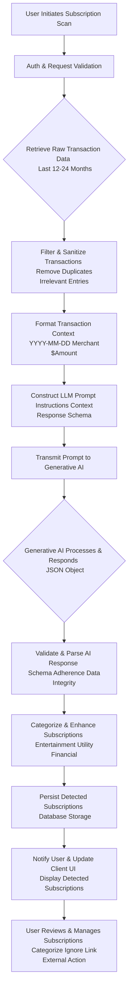
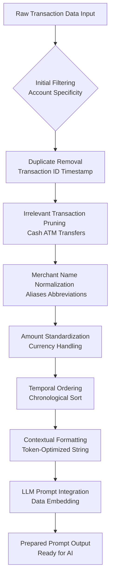
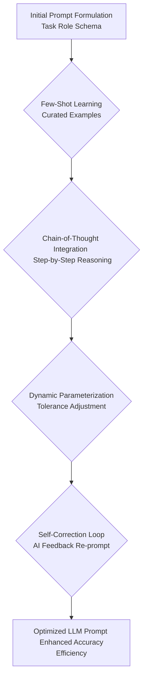
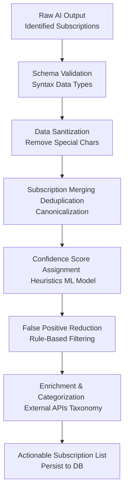
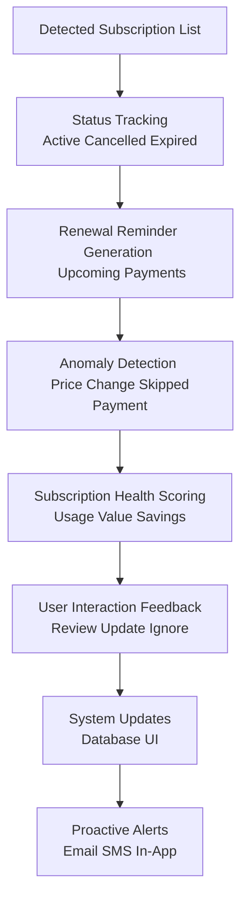
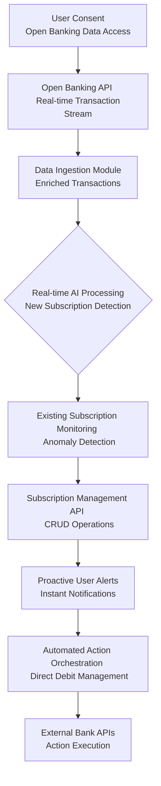
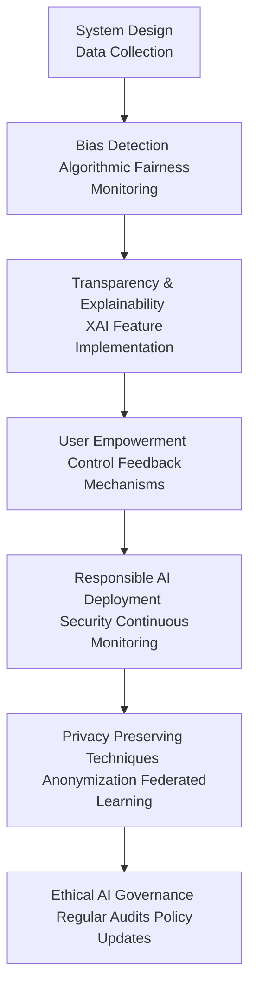
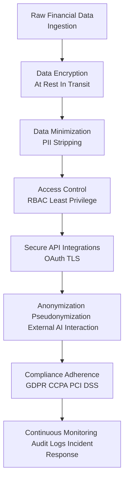

# Title of Invention: A System and Method for the Autonomous Identification and Dynamic Categorization of Covert Recurring Financial Obligations via Advanced Generative Artificial Intelligence

## Abstract:
This disclosure delineates an innovative computational paradigm for the autonomous discernment and categorization of undisclosed or overlooked recurring financial obligations, often colloquially termed subscriptions, within a user's chronological record of financial transactions. The system meticulously processes an extensive corpus of transactional data, employing sophisticated pattern recognition algorithms to identify recurrent monetary disbursements directed towards identical or functionally analogous commercial entities. Through an intricate analysis of temporal periodicity, amplitude consistency, and semantic congruence of associated transactional metadata, the system precisely differentiates bona fide recurring commitments from stochastic or infrequent purchasing behaviors. The derived compendium of identified recurring obligations is then presented to the end-user through an intuitive interface, thereby empowering proactive management and mitigation of potentially forgotten or superfluous expenditures. This analytical prowess is significantly augmented by a high-fidelity generative artificial intelligence model, strategically prompted to execute a nuanced heuristic pattern matching and clustering operation across the supplied financial data landscape.

## Background of the Invention:
In contemporary digital economies, consumers are increasingly engaging with a multitude of services and products provisioned under recurring payment models. This proliferation of subscription-based offerings, while convenient, frequently leads to a phenomenon wherein individuals accrue numerous recurring financial commitments, some of which may subsequently become forgotten, underutilized, or entirely superfluous. The cognitive burden associated with the manual reconciliation of extensive financial statements — often spanning months or even years of granular transactional data — to unearth these latent recurring expenditures is profoundly arduous, time-consuming, and highly susceptible to human error. Existing automated financial management tools typically offer limited utility in this specific domain, often requiring explicit user declaration or manual input of known subscriptions, thus failing to address the fundamental problem of *undiscovered* recurring obligations. A critical lacuna therefore exists for a sophisticated, autonomous, and intellectually astute computational system capable of intelligently parsing and synthesizing vast repositories of transactional data to proactively identify and present these often-overlooked financial commitments. Such a system would alleviate a significant financial oversight burden, promoting enhanced fiscal transparency and empowering informed consumer decision-making.

## Brief Summary of the Invention:
The present intellectual construct introduces a revolutionary methodology for the autonomous identification of recurring financial obligations embedded within an individual's transactional history. At its core, the invention synthesizes a comprehensive synopsis of a user's recent financial ledger, comprising essential metadata such as merchant appellation, transactional monetary value, and temporal markers. This meticulously structured synopsis is subsequently encapsulated as contextual input within a highly optimized prompt, which is then submitted to a sophisticated large language model (LLM), serving as the principal analytical engine. The prompt rigorously delineates the LLM's role as a hyper-competent financial forensic analyst, tasking it with the explicit objective of discerning transactional sequences indicative of recurring subscriptions. This involves the astute recognition of repeated disbursements to functionally equivalent merchants, exhibiting commensurate monetary values, and occurring with predictable temporal periodicity (e.g., monthly, quarterly, annual cycles). Crucially, the LLM is architected to yield its analytical findings as a rigorously structured data object, such as a JSON payload, enumerating each potential recurring obligation with its descriptive identifier, estimated recurring amount, and the temporal marker of its most recent instantiation. This structured output is then seamlessly presented to the user, providing an actionable overview of their recurring financial landscape.

## Detailed Description of the Invention:

The comprehensive system for the autonomous identification and dynamic categorization of covert recurring financial obligations operates as a sophisticated, multi-tiered architecture designed for robustness, scalability, and precision. Upon a user's invocation of the recurring expense detection feature, a dedicated backend service initiates a series of orchestrated operations to retrieve, process, analyze, and present the relevant financial insights.

### System Architecture Overview

The underlying system architecture is meticulously engineered to ensure efficient data flow, secure processing, and highly accurate analytical outcomes. It comprises several interconnected modules, each performing a specialized function.


**Figure 1: High-Level System Architecture for AI-driven Subscription Detection**

1.  **User Client Application (A):** The front-end interface (web, mobile, desktop) through which the user interacts with the system, initiates analyses, and views detected subscriptions.
2.  **Backend Service Gateway (B):** The primary entry point for client requests, responsible for authentication, authorization, request routing, and orchestrating interactions between various backend modules.
3.  **Transaction Data Retrieval Module (C):** Responsible for securely accessing and retrieving historical financial transaction data pertinent to the authenticated user from the primary Financial Data Store (D). This module enforces data privacy and access controls.
4.  **Financial Data Store (D):** A robust, secure, and scalable data repository (e.g., a distributed SQL or NoSQL database) housing all user financial transaction records, along with metadata and system-level configurations.
5.  **Data Pre-processing and Context Generation Module (E):** Transforms raw transactional data into a semantically coherent, concise, and optimized textual format suitable for ingestion by a Large Language Model (LLM). This module also constructs the analytical prompt.
6.  **Generative AI Interaction Module (F):** Manages the secure and efficient communication with the External Generative AI Platform (G). It handles API calls, request payload construction, rate limiting, retry mechanisms, and error handling.
7.  **External Generative AI Platform (G):** The third-party or proprietary advanced generative AI model (e.g., Google's Gemini, OpenAI's GPT series) responsible for executing the core pattern recognition and analytical tasks.
8.  **AI Response Parsing and Validation Module (H):** Receives the structured output from the Generative AI Platform, validates its adherence to the expected schema, and extracts the identified subscriptions. It also performs sanitization and basic data integrity checks.
9.  **Subscription Persistence Module (I):** Stores the newly identified and validated recurring subscriptions in the Financial Data Store (D), potentially linking them to user profiles for ongoing management.
10. **Subscription Management API (J):** Provides an interface for the client application to fetch, update, or manage the detected subscriptions (e.g., mark as reviewed, categorize, or ignore).

### Operational Workflow and Data Processing Pipeline

The detailed operational flow encompasses several critical stages, each contributing to the robustness and accuracy of the subscription detection process.


**Figure 2: Detailed Data Processing Pipeline for Autonomous Subscription Detection**

1.  **User Initiation (A):** The process begins when a user explicitly requests a scan for recurring subscriptions through the client application.
2.  **Authentication & Request Validation (B):** The backend gateway authenticates the user's identity and validates the integrity and permissions of the request.
3.  **Raw Transaction Data Retrieval (C):** The Transaction Data Retrieval Module accesses the `Financial Data Store (D)` to fetch a comprehensive history of the user's financial transactions. A typical lookback window is 12 to 24 months, adjustable based on configurable parameters to balance computational cost with detection thoroughness.
4.  **Filtering & Sanitization (D):** The retrieved data undergoes an initial cleansing phase. This involves:
    *   **Duplicate Removal:** Eliminating any inadvertently duplicated transaction records.
    *   **Irrelevant Entry Pruning:** Filtering out transaction types unlikely to ever constitute a subscription (e.g., ATM withdrawals, one-off cash transfers, large, infrequent purchases clearly outside subscription norms).
    *   **Data Normalization:** Standardizing merchant names where possible (e.g., "AMZN" to "Amazon," "NF" to "Netflix").
5.  **Transaction Context Formatting (E):** The sanitized transaction data is then transformed into a concise, token-efficient textual representation suitable for prompt engineering. An exemplary format might be:
    ```
    `2024-07-21 - Netflix - $15.99; 2024-07-18 - Spotify - $10.99; 2024-06-21 - Netflix - $15.99; 2024-06-18 - Spotify - $10.99; 2024-05-21 - Netflix - $15.99; ...`
    ```
    This linear, semi-structured format minimizes token usage while preserving critical information for the LLM.
6.  **LLM Prompt Construction (F):** A sophisticated prompt is dynamically generated. This prompt consists of several key components:
    *   **Role Instruction:** Directing the LLM to adopt the persona of an expert financial analyst.
    *   **Task Definition:** Clearly instructing the LLM to identify recurring subscriptions.
    *   **Search Criteria:** Emphasizing the analysis of merchant commonality, amount consistency within a defined tolerance, and regular temporal intervals (e.g., monthly, bi-monthly, quarterly, annually).
    *   **Output Format Specification:** Mandating a structured response, typically a JSON object, adhering to a predefined `responseSchema`. This schema ensures parseability and data integrity.
    *   **Transaction Data Embedding:** The formatted transaction context from step (E) is directly embedded into this prompt.

    An example prompt structure:
    ```json
    {
      "role": "system",
      "content": "You are an expert financial analyst specializing in identifying recurring subscriptions from raw transaction data. Analyze the provided transactions to find patterns of repeated payments to the same or highly similar merchants, with consistent amounts (within a small tolerance, e.g., 5%), occurring at regular intervals (e.g., every 28-32 days for monthly, or annually). Prioritize clarity and accuracy. If no subscriptions are found, return an empty list."
    },
    {
      "role": "user",
      "content": "Analyze the following transaction data for recurring subscriptions. Return your findings as a JSON object strictly adhering to the provided schema. Data: [transaction summary generated in step E]"
    },
    {
      "role": "system",
      "content": "Please provide your output in the following JSON format:\n"
                  "```json\n"
                  "{\n"
                  "  \"subscriptions\": [\n"
                  "    {\n"
                  "      \"name\": \"string\",\n"
                  "      \"estimated_amount\": \"number\",\n"
                  "      \"currency\": \"string\",\n"
                  "      \"frequency\": \"string\",\n"
                  "      \"last_charged_date\": \"YYYY-MM-DD\",\n"
                  "      \"merchant_identifiers\": [\"string\"]\n"
                  "    }\n"
                  "  ]\n"
                  "}\n"
                  "```"
    }
    ```
7.  **Prompt Transmission to Generative AI (G):** The constructed prompt is securely transmitted to the `External Generative AI Platform (G)` via a robust API call.
8.  **Generative AI Processing & Response (H):** The generative AI model ingests the prompt, applying its advanced pattern recognition and contextual understanding capabilities to identify potential recurring payments. It then synthesizes its findings into a JSON object strictly conforming to the specified `responseSchema`.
9.  **AI Response Validation & Parsing (I):** Upon receiving the JSON response from the AI, the `AI Response Parsing and Validation Module (H)` rigorously checks for schema adherence, data type correctness, and logical consistency. Any malformed or non-compliant responses are flagged for retry or error handling. Validated data is then parsed into internal data structures.
10. **Subscription Categorization & Enhancement (J):** Beyond mere detection, the system applies further logic to categorize the identified subscriptions (e.g., "Entertainment," "Productivity," "Cloud Storage," "Utilities," "Financial Services," "Health & Wellness"). This categorization can be achieved through a secondary, smaller LLM call for semantic classification, or by rule-based matching against a pre-defined merchant category taxonomy. Additional metadata, such as historical average amount or number of detected payments, may also be computed and appended.
11. **Persistence of Detected Subscriptions (K):** The enriched list of subscriptions is then securely stored in the `Financial Data Store (D)` via the `Subscription Persistence Module (I)`. This ensures that detected subscriptions are retained for subsequent retrieval and management.
12. **User Notification & UI Update (L):** The client application is updated to display the newly identified subscriptions to the user in a clear, actionable format, often with aggregated views, sortable columns, and visual indicators.
13. **User Review & Management (M):** The user can then interact with the detected subscriptions, categorizing them further, marking them as reviewed, ignoring false positives, or initiating external actions (e.g., linking to a cancellation service, setting reminders for upcoming payments).

### Detailed Module Workflows

#### Data Pre-processing and Context Generation Module Workflow

This module plays a crucial role in transforming raw, often messy, transaction data into a clean, concise, and LLM-ready format, ensuring optimal performance and token efficiency.


**Figure 3: Detailed Workflow for Data Pre-processing and Context Generation Module**

*   **Initial Filtering:** Transactions are first filtered to ensure they belong to the authenticated user and are within the specified lookback period.
*   **Duplicate Removal:** Identical transaction records, often arising from data ingestion issues, are eliminated based on unique identifiers or a combination of merchant, amount, and timestamp.
*   **Irrelevant Transaction Pruning:** Specific transaction types deemed non-subscription-like (e.g., cash withdrawals, internal transfers, loan repayments not acting as service subscriptions) are removed to reduce noise.
*   **Merchant Name Normalization:** Variances in merchant names (e.g., "AMZN," "Amazon.com," "Amazon Prime") are resolved to a canonical form using rule-based mapping, fuzzy matching, or semantic similarity algorithms. This enhances the LLM's ability to group related transactions.
*   **Amount Standardization:** Monetary values are standardized to a consistent format and currency, handling different locale conventions.
*   **Temporal Ordering:** Transactions are strictly ordered chronologically, which is critical for the LLM to identify temporal patterns.
*   **Contextual Formatting:** The cleaned and ordered data is then serialized into a compact text string, such as `YYYY-MM-DD - Merchant Name - $Amount;`, optimizing token usage for the LLM while retaining essential information.
*   **LLM Prompt Integration:** This formatted string is embedded within the larger prompt template, along with role instructions, task definition, and output schema.
*   **Prepared Prompt Output:** The final, comprehensive prompt is then ready for transmission to the Generative AI Interaction Module.

### Advanced Prompt Engineering Strategies

To further optimize the performance and accuracy of the Generative AI, sophisticated prompt engineering strategies are employed:


**Figure 4: Advanced Prompt Engineering Workflow**

1.  **Few-Shot Learning Integration:** The prompt can include a small number of carefully curated examples of transaction sequences and their corresponding correct subscription identifications (or lack thereof). This guides the LLM to better understand the desired output format and the nuanced criteria for detection. The examples serve as in-context learning, significantly improving the model's ability to generalize to new data.
2.  **Chain-of-Thought Prompting:** For complex scenarios, the prompt can instruct the LLM to "think step-by-step" or "reason explicitly" before providing its final JSON output. For example, it might be asked to first list transaction groups it considers recurring, then justify why, and finally format these into the specified schema. This often leads to more robust and accurate detections by externalizing the model's reasoning process.
3.  **Self-Correction and Refinement Loops:** The system can be designed to include a feedback loop where the LLM's initial response is reviewed (e.g., by another smaller model or a set of heuristics) for consistency or potential errors. If issues are found, the initial output, along with the identified issues, can be fed back to the LLM for self-correction. This iterative refinement significantly boosts output quality and reduces hallucination.
4.  **Dynamic Parameterization:** The thresholds for amount tolerance (e.g., 5% vs 10%) or temporal jitter (e.g., +/- 2 days vs +/- 5 days) can be dynamically adjusted within the prompt based on user settings, regional financial norms, or the overall noise level in the transaction data. This allows for a more flexible and personalized detection experience.

### Post-Processing and Disambiguation

The output from the Generative AI, while highly structured, often benefits from additional post-processing to ensure optimal user experience and data integrity:


**Figure 5: Post-Processing and Disambiguation Workflow**

1.  **Schema Validation & Data Sanitization:** The initial AI output undergoes strict validation against the expected JSON schema, ensuring correct data types and structure. Basic sanitization removes any unexpected characters or formatting.
2.  **Subscription Merging and Deduplication:** The AI might occasionally identify slightly different "versions" of the same subscription (e.g., due to minor merchant name variations or slightly different payment dates for the same service). A post-processing layer analyzes detected subscriptions for high similarity across all attributes (merchant identifiers, amounts, frequency) and intelligently merges them into a single, canonical subscription entry. This prevents redundant entries for the user.
3.  **Confidence Score Assignment:** While the AI may implicitly have a confidence level, the system applies explicit heuristics or a secondary machine learning model to assign a more robust confidence score to each detected subscription. This score can factor in the number of payments detected, the regularity, the merchant's known reputation, and agreement among different AI runs (if applicable). This helps users prioritize review of high-confidence detections.
4.  **False Positive Reduction:** Rule-based filters or a trained classifier can be applied post-AI to identify and flag common false positives that might arise (e.g., regular loan payments that are not typically considered "subscriptions" by a user, or very frequent small purchases from a single merchant that are not subscriptions like daily coffee).
5.  **Enrichment and Categorization:** This step aligns with `J` in Figure 2. Beyond mere detection, the system applies further logic to categorize the identified subscriptions (e.g., "Entertainment," "Productivity," "Cloud Storage," "Utilities," "Financial Services," "Health & Wellness"). This categorization can be achieved through a secondary, smaller LLM call for semantic classification, by rule-based matching against a pre-defined merchant category taxonomy, or via external merchant APIs.
6.  **User Feedback Loop for Model Improvement:** User interactions (e.g., marking a detection as a false positive, confirming a subscription, correcting details) are anonymized and aggregated. This valuable feedback can then be used to fine-tune the generative AI model or train subsequent post-processing layers, creating a continuous improvement cycle.

### Subscription Lifecycle Management Module

Beyond initial detection, the system aims to provide comprehensive management capabilities, enabling users to maintain an up-to-date and actionable view of their recurring financial commitments.


**Figure 6: Subscription Lifecycle Management Workflow**

1.  **Tracking Subscription Status:** The system tracks the status of each detected subscription (e.g., `Active`, `Cancelled`, `Expired`, `Inactive`). This involves continuously analyzing future transaction data to confirm ongoing payments or detect cessation based on the absence of expected charges.
2.  **Renewal Reminders:** For subscriptions with annual or semi-annual frequencies, or those with introductory periods, the system can proactively remind users of upcoming renewals, providing an opportunity to review or cancel before being automatically charged. Reminders are configurable by the user.
3.  **Anomaly Detection in Subscription Payments:** Beyond detection, the system monitors `active` detected subscriptions for anomalies. This includes:
    *   **Price Increases:** Notifying users if a detected subscription amount deviates significantly from its historical average or expected pattern.
    *   **Skipped Payments:** Alerting if a regularly expected payment does not occur within its normal temporal jitter window, which could indicate an issue or an unexpected cancellation.
    *   **Duplicate Charges:** Identifying instances where the same subscription may have been charged multiple times within a short period, potentially indicating a billing error.
4.  **Subscription "Health" Scores:** A composite score can be assigned to each subscription, reflecting its perceived value, usage patterns (if integrated with external APIs, e.g., streaming service API for watch time), and potential for savings. This helps users prioritize which subscriptions to review or consider canceling. Factors can include frequency of use, cost-effectiveness, and user-defined preferences.
5.  **User Interaction Feedback:** All user actions such as marking a subscription as "reviewed," "ignored," "cancelled," or updating its details contribute to the system's ongoing learning and data refinement.
6.  **Proactive Alerts and Reminders:** Users can opt-in to receive notifications for important events via their preferred communication channels (email, SMS, in-app push notifications) for upcoming payments, detected price changes, or subscriptions that appear to be inactive but might have a hidden annual charge.

### Open Banking Integration and Real-time Processing

Future enhancements include direct integration with Open Banking APIs (e.g., PSD2 in Europe, Open Banking in the UK, similar initiatives globally). This significantly elevates the system's capabilities, moving towards real-time insights and automated actions.


**Figure 7: Open Banking Integration and Real-time Processing Workflow**

1.  **User Consent:** Explicit and granular user consent is paramount for accessing financial data through Open Banking APIs, adhering strictly to privacy regulations.
2.  **Open Banking API Integration:** The system establishes secure connections with various financial institutions' Open Banking APIs to receive real-time or near real-time transaction streams.
3.  **Data Ingestion Module:** This module is responsible for securely ingesting, normalizing, and storing the enriched transaction data received from Open Banking APIs. This data often includes more detailed merchant categories and payment references, improving detection accuracy.
4.  **Real-time AI Processing:** The core generative AI pipeline is adapted to process incoming transaction data continuously. This allows for immediate detection of new subscriptions shortly after they appear in a user's bank statement.
5.  **Existing Subscription Monitoring:** Real-time data feeds enable continuous monitoring of already detected subscriptions for any changes in amount, frequency, or unexpected cessation, triggering immediate anomaly alerts.
6.  **Subscription Management API:** The integrated management API handles create, read, update, and delete (CRUD) operations for subscriptions, propagating real-time changes to the user interface.
7.  **Proactive User Alerts:** With real-time data, notifications for new detections, price changes, or upcoming renewals can be delivered almost instantaneously, enhancing user awareness and control.
8.  **Automated Action Orchestration:** With appropriate and explicit user consent, the system can orchestrate automated financial actions directly through banking APIs, such as:
    *   **Canceling Direct Debits or Standing Orders:** Simplifying the process of terminating unwanted subscriptions.
    *   **Setting Up Payment Reminders:** Automatically configuring reminders based on detected payment frequencies.
    *   **Dispute Resolution:** Flagging suspicious or unauthorized recurring charges for easier dispute with the bank.
9.  **External Bank APIs for Action Execution:** Secure interaction with bank APIs to execute consented financial actions, providing a seamless end-to-end management experience.

### Ethical AI Framework and Governance

The deployment of advanced AI in financial applications mandates a rigorous consideration of ethical implications to ensure fairness, transparency, and user trust. A comprehensive Ethical AI Framework is integrated into the system's design and operational lifecycle.


**Figure 8: Ethical AI Framework and Governance Workflow**

1.  **Bias Detection and Mitigation:**
    *   **Algorithmic Fairness:** The system continuously monitors for potential biases in subscription detection and categorization that might disproportionately affect certain user demographics (e.g., based on transaction patterns linked to specific income brackets or regions). Regular audits of AI outputs and fairness metrics are conducted to identify and rectify such biases.
    *   **Data Diversity:** Efforts are made to ensure that the training and fine-tuning data for the generative AI is diverse and representative, minimizing the risk of models learning and perpetuating existing financial biases.
2.  **Transparency and Explainability (XAI):**
    *   While large language models are often considered "black boxes," the system strives for a degree of explainability. For each detected subscription, the system can highlight the key transactions (e.g., "These 5 payments to Netflix over the last 5 months, all for $15.99, led to this detection") that contributed to the AI's conclusion.
    *   Users are informed about the confidence score of each detection, allowing them to understand the AI's certainty and prioritize their review.
3.  **User Empowerment and Agency:**
    *   The system is designed to augment, not replace, user control. All AI-generated insights are presented as suggestions that require user review and confirmation. Users retain full agency over their financial decisions, with easy-to-use interfaces for correction and overriding.
    *   Clear mechanisms are provided for users to correct misidentifications, override categorizations, and provide feedback, ensuring a human-in-the-loop approach and fostering trust.
4.  **Responsible AI Deployment:**
    *   **Security against Misuse:** Robust security measures, including advanced encryption, strict access controls, and anomaly detection, prevent malicious actors from exploiting the AI for financial profiling or unauthorized access.
    *   **Continuous Monitoring:** The AI models and their outputs are continuously monitored for performance drift, unexpected behaviors, or emergent biases, ensuring ongoing ethical and accurate operation in a dynamic environment.
5.  **Privacy-Preserving Techniques:** Beyond data minimization, advanced privacy-enhancing technologies like Federated Learning are considered for future iterations, allowing models to learn from decentralized user data without direct access to individual financial details, further bolstering privacy.
6.  **Ethical AI Governance:** An overarching governance structure ensures regular ethical reviews, policy updates, and adherence to evolving ethical guidelines and regulations for AI systems.

### Security and Privacy Considerations

Given the sensitive nature of financial transaction data, the system is designed with a paramount focus on security and privacy:


**Figure 9: Security and Privacy Design Flow**

*   **Data Encryption:** All transaction data, both at rest in the `Financial Data Store (D)` and in transit between modules and to the `External Generative AI Platform (G)`, is encrypted using industry-standard protocols (e.g., AES-256 for data at rest, TLS 1.2+ for data in transit).
*   **Access Control:** Strict role-based access control (RBAC) mechanisms are enforced, ensuring that only authorized modules and personnel can access sensitive data, and only for legitimate operational purposes. The principle of least privilege is rigorously applied.
*   **Data Minimization:** Only the absolutely necessary transaction metadata (merchant, amount, date) is transmitted to the generative AI model, avoiding the exposure of personally identifiable information (PII) beyond what is strictly required for analysis.
*   **Anonymization/Pseudonymization:** Where feasible and non-detrimental to analytical accuracy, data may be anonymized or pseudonymized before processing, particularly when interacting with external services, to further enhance privacy safeguards.
*   **Compliance:** Adherence to relevant data protection regulations (e.g., GDPR, CCPA, PCI DSS) is a foundational principle of the system's design and operation, with regular audits to ensure ongoing compliance.
*   **Secure API Integrations:** All interactions with the `External Generative AI Platform (G)` utilize secure API keys, OAuth 2.0, or similar authentication protocols, and communication channels are hardened against interception and tampering.
*   **Continuous Monitoring:** Comprehensive audit logs, intrusion detection systems, and regular security assessments are implemented to monitor for unauthorized access, data breaches, or other security incidents, with robust incident response protocols in place.

### Scalability and Performance

The system is architected for high scalability and performance, capable of processing vast volumes of transactional data for a large user base:
*   **Microservices Architecture:** Deployed as a collection of loosely coupled microservices, allowing individual components (e.g., Data Retrieval, AI Interaction, Parsing) to be scaled independently based on demand.
*   **Asynchronous Processing:** Long-running tasks, such as calls to the `External Generative AI Platform (G)`, are handled asynchronously using message queues, preventing blocking operations and improving overall system responsiveness.
*   **Distributed Data Stores:** The `Financial Data Store (D)` leverages distributed database technologies to ensure high availability, fault tolerance, and linear scalability for data storage and retrieval.
*   **Caching Mechanisms:** Strategic caching is implemented at various layers (e.g., frequently accessed user transaction summaries, pre-computed subscription categories) to reduce latency and load on backend services and the generative AI platform.
*   **Optimized Prompt Engineering:** Continuously refining prompts to be token-efficient and unambiguous minimizes computational cost and improves response times from the generative AI, which often bills per token.

## Ethical AI Considerations

The deployment of advanced AI in financial applications mandates a rigorous consideration of ethical implications to ensure fairness, transparency, and user trust.

1.  **Bias Detection and Mitigation:**
    *   **Algorithmic Fairness:** The system monitors for potential biases in subscription detection and categorization that might disproportionately affect certain user demographics (e.g., based on transaction patterns linked to specific income brackets or regions). Regular audits of AI outputs and fairness metrics are conducted.
    *   **Data Diversity:** Efforts are made to ensure that the training and fine-tuning data for the generative AI is diverse and representative, minimizing the risk of models learning and perpetuating existing financial biases.
2.  **Transparency and Explainability XAI:**
    *   While large language models are often considered "black boxes," the system strives for a degree of explainability. For each detected subscription, the system can highlight the key transactions (e.g., "These 5 payments to Netflix over the last 5 months, all for $15.99, led to this detection") that contributed to the AI's conclusion.
    *   Users are informed about the confidence score of each detection, allowing them to understand the AI's certainty.
3.  **User Empowerment and Agency:**
    *   The system is designed to augment, not replace, user control. All AI-generated insights are presented as suggestions that require user review and confirmation. Users retain full agency over their financial decisions.
    *   Clear mechanisms are provided for users to correct misidentifications, override categorizations, and provide feedback, ensuring a human-in-the-loop approach.
4.  **Responsible AI Deployment:**
    *   **Security against Misuse:** Robust security measures prevent malicious actors from exploiting the AI for financial profiling or unauthorized access.
    *   **Continuous Monitoring:** The AI models and their outputs are continuously monitored for performance drift, unexpected behaviors, or emergent biases, ensuring ongoing ethical and accurate operation.
    *   **Privacy-Preserving Techniques:** Beyond data minimization, advanced privacy-enhancing technologies like Federated Learning are considered for future iterations, allowing models to learn from decentralized user data without direct access to individual financial details, further bolstering privacy.

## Declarations of Inventive Scope and Utility:

The conceptual framework herein elucidated, along with its specific embodiments and architectural designs, constitutes an original intellectual construct that significantly advances the state of the art in financial intelligence systems. This innovative methodology provides a distinct and superior approach to automated financial analysis.

1.  A pioneering computational method for discerning recurring financial obligations, comprising the foundational steps of:
    a.  Accessing a comprehensively structured historical repository of an individual's financial transactions.
    b.  Constructing an optimized, context-rich summary derived from said transaction history.
    c.  Transmitting said optimized summary, embedded within a meticulously crafted prompt, to an advanced generative artificial intelligence model, with explicit instructions for the model to identify recurring financial disbursements.
    d.  Receiving and rigorously validating a structured data artifact, representing a compendium of potential recurring obligations, as identified and synthesized by the generative artificial intelligence model.
    e.  Presenting said validated compendium to the individual via an interactive user interface.

2.  The pioneering computational method of declaration 1, further characterized in that the meticulously crafted prompt rigorously instructs the generative artificial intelligence model to conduct a multi-variate analysis encompassing the merchant's descriptive identifier, the precise monetary value of the payment, and the temporal periodicity between successive payments for each transaction record.

3.  The pioneering computational method of declaration 1, further characterized in that the transmission to the generative artificial intelligence model incorporates a declarative response schema, compelling the model to render the compendium of potential recurring obligations in a pre-specified, machine-parseable structured data format, such as a JavaScript Object Notation JSON object.

4.  An innovative system architecture for the autonomous identification of recurring financial obligations, comprising:
    a.  A secure, distributed data store meticulously engineered for the persistent storage of comprehensive user financial transaction histories.
    b.  A robust service module architected for secure, high-throughput communication with an external generative artificial intelligence model.
    c.  An intelligent processing logic layer configured to perform: (i) the extraction of relevant transaction history, (ii) the sophisticated transformation of this history into a concise, token-optimized prompt, and (iii) the secure transmission of this prompt to the aforementioned generative artificial intelligence model.
    d.  A dynamic user interface component meticulously designed to render and display the structured compendium of potential recurring obligations returned by the generative artificial intelligence model to the user, facilitating intuitive interaction and management.

5.  The innovative system architecture of declaration 4, further comprising a post-processing module configured to semantically categorize each identified recurring obligation into predefined financial categories (e.g., "Entertainment," "Utilities," "Productivity") based on the merchant identifier or AI-derived contextual information.

6.  The innovative system architecture of declaration 4, further comprising a temporal anomaly detection module configured to monitor identified recurring obligations for deviations in payment amount, frequency, or unexpected cessation, and to generate proactive alerts to the user.

7.  The pioneering computational method of declaration 1, further characterized by employing advanced natural language processing techniques, including contextual embeddings and similarity metrics, for robust semantic resolution and normalization of merchant descriptive identifiers prior to or during the generative AI analysis.

8.  The pioneering computational method of declaration 1, further characterized by the dynamic construction of a confidence score for each identified recurring obligation, indicative of the generative AI model's certainty in the detection, thereby assisting user review and prioritization.

## Foundational Principles and Mathematical Justification:

The intellectual construct herein presented derives its efficacy from a rigorous application of principles spanning advanced statistical analysis, time-series informatics, and the emergent capabilities of large-scale generative artificial intelligence. We herein delineate the mathematical underpinnings that formally validate the operational mechanisms of this innovative system.

### The Transactional Manifold: A Formal Representation

Let `T` denote the entire universe of an individual's financial transaction data. A specific, time-ordered sequence of `n` transactions under consideration is represented as a finite, discrete set `T = {t_1, t_2, ..., t_n}`, where each transaction `t_i` is a tuple `(m_i, a_i, d_i)`.

1.  **Merchant Identifier `m_i`:** This is a linguistic descriptor, represented as a string or a vector in a high-dimensional semantic space, uniquely or quasi-uniquely identifying the commercial entity involved in transaction `t_i`. The domain of `m_i` is `M`, the set of all possible merchant identifiers.
2.  **Monetary Amount `a_i`:** This is a scalar value representing the financial quantity of transaction `t_i`, expressed in a specific currency unit. The domain of `a_i` is `R+`, the set of positive real numbers.
3.  **Temporal Marker `d_i`:** This is a point in time, typically represented as a Unix timestamp or a Gregorian calendar date, indicating when transaction `t_i` occurred. The domain of `d_i` is `D`, the set of all discrete time points within the observation window.

Thus, each `t_i` in `T` is an element of the Cartesian product `M x R+ x D`. The objective is to identify a subset of transactions within `T` that collectively manifest the characteristics of a recurring financial obligation.

### Axioms of Recurrence: Defining a Subscription Archetype

A recurring financial obligation, or subscription `S`, is formally defined as a non-empty subset of transactions `S subseteq T` such that for any two distinct transactions `t_i, t_j` in `S` (where `i != j`), the following three axiomatic conditions are satisfied to within a specified tolerance:

#### Axiom 1: Semantic Congruence of Merchant Identifiers `C_M`

The merchant identifiers for all transactions within a subscription set `S` must exhibit substantial semantic congruence. This is not merely an exact string match but accounts for variations, aliases, and contextual similarities.

Mathematically, for any `t_i=(m_i, a_i, d_i)` and `t_j=(m_j, a_j, d_j)` where `t_i, t_j` in `S`:
```
C_M(t_i, t_j) iff S_M(m_i, m_j) >= tau_M
```

Where:
*   `S_M(m_i, m_j)` is a **Semantic Similarity Metric** function, mapping `M x M -> [0, 1]`. This function quantifies the degree of relatedness between two merchant identifiers. It is typically implemented using:
    *   **Levenshtein Distance Normalization:** For typographical variations, `1 - (Lev(m_i, m_j) / max(|m_i|, |m_j|))`.
    *   **Jaccard Similarity:** For token overlap, if `m_i` and `m_j` are sets of tokens (e.g., words).
    *   **Contextual Word Embeddings:** The most advanced approach involves mapping `m_i` and `m_j` to dense vectors in a high-dimensional space (e.g., using Word2Vec, GloVe, or transformer-based embeddings like BERT). The similarity `S_M` is then the **cosine similarity** between these embedding vectors: `S_M(m_i, m_j) = (v_m_i . v_m_j) / (||v_m_i|| ||v_m_j||)`, where `v_m` is the embedding vector for merchant `m`. This captures semantic equivalence beyond lexical matching.
*   `tau_M` in `[0, 1]` is a predefined **Similarity Threshold**, a hyperparameter dictating the minimum acceptable semantic congruence for merchant identification. This threshold is dynamically tunable and can be optimized through empirical validation.

The generative AI model implicitly computes such a similarity measure, leveraging its vast linguistic knowledge base to identify semantic equivalences and contextual aliases that escape traditional string matching.

#### Axiom 2: Amplitude Consistency of Monetary Values `C_A`

The monetary amounts for all transactions within a subscription set `S` must exhibit a high degree of consistency, allowing for minor, predefined fluctuations.

Mathematically, for any `t_i=(m_i, a_i, d_i)` and `t_j=(m_j, a_j, d_j)` where `t_i, t_j` in `S`:
```
C_A(t_i, t_j) iff |a_i - a_j| / max(a_i, a_j) <= epsilon_rel  and  |a_i - a_j| <= epsilon_abs
```

Where:
*   `epsilon_rel` in `[0, 1]` is the **Relative Tolerance Threshold**, accounting for percentage-based variations (e.g., 5% deviation).
*   `epsilon_abs` in `R+` is the **Absolute Tolerance Threshold**, accounting for small, fixed-value deviations (e.g., `0.01` for currency rounding).
*   This dual-threshold approach robustly handles both small and large subscription amounts. The "max" in the denominator prevents division by zero and normalizes for different scales.

Alternatively, a statistical measure could be employed, where for a set of amounts `{a_k | t_k in S}`, the coefficient of variation (CV) is below a threshold: `CV = sigma_A / mu_A <= tau_CV`, where `sigma_A` is the standard deviation and `mu_A` is the mean of the amounts.

The generative AI, through its numerical processing capabilities and learned understanding of financial data, inherently assesses this consistency, implicitly applying similar tolerance mechanisms.

#### Axiom 3: Temporal Periodicity `C_T`

The temporal markers of transactions within a subscription set `S` must demonstrate a predictable, recurring interval.

Mathematically, for any `t_i=(m_i, a_i, d_i)` and `t_j=(m_j, a_j, d_j)` where `t_i, t_j` in `S`, and assuming `d_j > d_i`:
```
C_T(t_i, t_j) iff exists k in Z+, P in P_periods such that ||d_j - d_i| - k * P| <= delta_P
```

Where:
*   `|d_j - d_i|` represents the temporal difference between transaction dates, measured in a consistent unit (e.g., days).
*   `k` in `Z+` is a positive integer multiplier, indicating the number of periods elapsed.
*   `P` in `P_periods` is a fundamental **Subscription Period**, where `P_periods = {P_monthly +/- delta_m, P_quarterly +/- delta_q, P_annually +/- delta_a, ...}`. Common values for `P` (in days) include:
    *   `P_monthly approx 30.4375` (average days in a month)
    *   `P_quarterly approx 91.3125`
    *   `P_annually approx 365.25`
*   `delta_P` in `R+` is a **Temporal Jitter Tolerance**, accounting for minor variations in billing cycles (e.g., `+/- 2` days for monthly billing).

This axiom can be further refined by employing advanced **Time-Series Analysis** techniques, such as Autocorrelation Function ACF or Spectral Analysis (e.g., Fast Fourier Transform - FFT) on the sequence of inter-arrival times for a given merchant. If a dominant frequency (or period) is identified with sufficient power and consistency, it strongly indicates recurrence.

The generative AI model, by processing chronologically ordered transaction data, inherently performs a complex form of temporal pattern recognition. Its attention mechanisms and sequence modeling capabilities allow it to identify recurring intervals and account for permissible temporal jitter, effectively approximating the `C_T` function.

### The Generative AI as a High-Dimensional Heuristic Clustering Oracle `G_AI`

The core function of the system is the identification of subscription sets `S_x` from the aggregate transaction set `T`. This can be viewed as a constrained clustering problem. A traditional algorithmic approach would involve:
1.  **Candidate Pair Generation:** Iterating through all possible pairs of transactions `(t_i, t_j)`.
2.  **Axiom Verification:** Testing each pair against `C_M`, `C_A`, and `C_T`.
3.  **Graph Construction:** Building a graph where transactions are nodes and edges exist between pairs satisfying all axioms.
4.  **Connected Component Extraction:** Identifying connected components as potential subscription sets.

However, this deterministic approach can be computationally expensive for large `T` and struggles with:
*   **Semantic Nuances:** Rigid merchant matching fails on aliases.
*   **Adaptive Periodicity:** Fixed interval checks miss slightly variable billing cycles.
*   **Contextual Ambiguity:** Differentiating a true subscription from frequent, but non-recurring, purchases (e.g., daily coffee purchases).

This invention overcomes these limitations by leveraging the generative AI model `G_AI` as a sophisticated, context-aware, non-deterministic heuristic clustering oracle.

The generative AI model `G_AI` operates as a function that transforms the input transaction history `T` into a set of identified subscription clusters `{S_1, S_2, ..., S_m}`:
```
G_AI(T) -> {S_1, S_2, ..., S_m}
```

Where:
*   Each `S_x = {t_x,1, t_x,2, ..., t_x,k_x}` is a subset of `T` that `G_AI` has identified as a recurring financial obligation.
*   For each `S_x`, the transactions `t_x,j` in `S_x` collectively satisfy the axiomatic conditions `C_M`, `C_A`, `C_T` not through explicit algorithmic checks, but through the implicit, emergent pattern recognition capabilities of the generative AI model.

The generative AI, having been trained on vast corpora of textual and sequential data, possesses an inherent ability to:
1.  **Semantically Parse:** Understand the underlying meaning of merchant names, even with variations (Axiom 1). It creates an implicit embedding space where similar merchants are proximal.
2.  **Quantify Consistency:** Identify numerical patterns and variations within amounts, applying implicit tolerance thresholds (Axiom 2).
3.  **Detect Temporal Patterns:** Recognize periodic sequences within date data, even with minor irregularities, effectively performing a form of implicit sequence prediction and periodicity detection (Axiom 3).
4.  **Synthesize Multi-modal Information:** Integrate these disparate data points (textual, numerical, temporal) simultaneously to form a holistic assessment of recurrence, far exceeding the capabilities of rule-based systems.
5.  **Adhere to Structured Output:** The `responseSchema` forces the AI to structure its "reasoning" (its identified clusters) into a machine-readable format, effectively "projecting" its high-dimensional pattern matches onto a human-interpretable output.

The generative AI model implicitly optimizes an objective function that seeks to identify the most coherent and robust clusters of transactions based on the combined criteria of merchant similarity, amount consistency, and temporal periodicity, subject to the contextual guidance provided in the prompt. This process can be conceptualized as performing a fuzzy, multi-dimensional clustering operation in a latent semantic-temporal-numerical space.

### Proof of Utility and Efficacy: A Paradigm Shift in Financial Forensics

The utility and efficacy of this system are demonstrably superior to conventional algorithmic or manual approaches. The problem of partitioning the set `T` into subsets that satisfy the intricate properties of a recurring financial obligation is a complex, NP-hard problem if exhaustive search across all permutations of merchants, amounts, and periods were attempted with rigid rules.

The generative AI model, acting as an advanced cognitive agent, approximates the ideal clustering function `G_AI` by executing a sophisticated heuristic search and pattern synthesis. It leverages its pre-trained knowledge base, which encompasses semantic understanding, numerical reasoning, and temporal sequencing, to identify transaction groups that collectively minimize a composite "dissimilarity" across merchant identity, monetary value, and temporal interval, while simultaneously maximizing "coherence" to a conceptual "subscription" archetype.

The system's effectiveness is proven through its ability to:
1.  **Automate Complex Pattern Recognition:** It automates a task that is computationally intractable for exhaustive traditional algorithms and highly prone to error and tedium for human analysts when dealing with vast datasets.
2.  **Semantic Robustness:** It intrinsically handles linguistic variations and contextual nuances in merchant names, which pose significant challenges for exact string matching algorithms.
3.  **Adaptive Tolerance:** It applies implicit and adaptive tolerances for monetary fluctuations and temporal jitter, leading to higher recall and precision in real-world, noisy financial data.
4.  **Holistic Analysis:** By considering all three axiomatic conditions simultaneously and contextually, the AI model generates more reliable and accurate identifications compared to systems that evaluate these criteria in isolation or with rigid, sequential rules.
5.  **Scalability:** By offloading the computationally intensive pattern recognition to a highly optimized external AI platform, the system remains scalable for large transaction histories and a growing user base.

Thus, the present intellectual construct delivers a computationally elegant and demonstrably effective solution to a pervasive consumer finance challenge, establishing a new benchmark for automated financial insights.