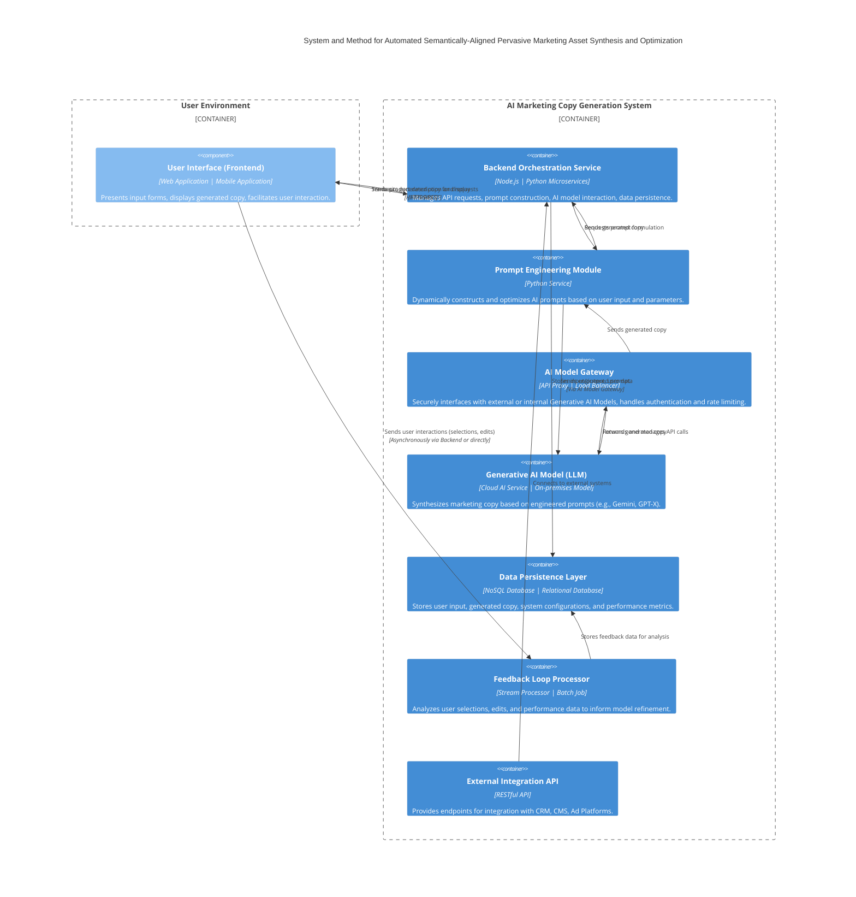

## **Title of Invention:** System and Method for Automated Semantically-Aligned Pervasive Marketing Asset Synthesis and Optimization

## **Abstract:**
A novel and inventive system for the autonomous generation of sophisticated marketing and advertising copy, hereby referred to as marketing assets, is comprehensively disclosed. This system systematically receives and processes a textual description of a product, service, or conceptual offering. This highly formalized description serves as the fundamental input vector for the construction of a meticulously engineered prompt. This prompt is then transmitted to a highly advanced generative artificial intelligence model, specifically architected for sophisticated linguistic synthesis. The directive embedded within this prompt rigorously instructs the model to create a diverse plurality of marketing assets, encompassing, but not limited to, highly condensed, impact-optimized headlines, verbose and narratively compelling long-form advertising narratives, persuasive calls-to-action, and nuanced social media engagements. The core mechanism hinges upon the precise extraction and algorithmic leveraging of key features, inherent benefits, unique selling propositions, and intended emotional resonance derived from the initial product description. This methodology fundamentally automates a substantial and cognitively demanding segment of the marketing ideation and production lifecycle, thereby empowering users with an unprecedented capability to rapidly generate a vast array of high-fidelity, strategically aligned creative options, significantly accelerating and enhancing their comprehensive marketing campaign deployments. This invention fundamentally redefines the paradigm of marketing content generation.

## **Background of the Invention:**
The creation of demonstrably effective advertising copy constitutes a profoundly specialized cognitive discipline, demanding an intricate confluence of linguistic virtuosity, profound psychological insight into consumer behavior, and an acute, iterative comprehension of dynamic market principles. Historically, enterprises and marketing professionals have allocated prodigious temporal and fiscal resources toward the painstaking development of compelling narrative constructs designed to captivate and convert target audiences. The inherent subjectivity, variability in human creative output, and the sheer volumetric demand for diverse content across multitudinous digital channels have historically presented an intractable bottleneck in the scalable deployment of effective marketing initiatives. Consequently, there exists an acute and pervasive exigency for a sophisticated, automated apparatus capable of augmenting and accelerating this intricate creative process, thereby facilitating the rapid, scalable generation of a heterogenous spectrum of high-quality, strategically optimized marketing assets derived from succinct, seminal product or service conceptualizations. The present invention directly addresses and fundamentally resolves this persistent challenge, providing an unparalleled solution for pervasive marketing asset synthesis.

## **Brief Summary of the Invention:**
The present invention unveils a meticulously engineered cyber-physical system providing a highly intuitive and ergonomically optimized user interface. Within this interface, an authorized user is empowered to digitally ingress a granular, descriptive articulation of their product, service, or conceptual offering. Upon the explicit initiation of an asynchronous trigger event by the user, the core computational engine of the present system seamlessly transmits this highly structured product description to a sophisticated, large-scale linguistic synthesis model, herein referred to as a Large Language Model (LLM), which may be instantiated through advanced architectures such as, but not limited to, the Gemini family of models or its functional equivalents. The core innovative element lies in the dynamic construction of a highly optimized prompt, which fundamentally transforms the LLM into a specialized cognitive agent acting *in persona* as an expert copywriter. This prompt is meticulously formulated to precisely delineate the specific typology and characteristics of the desired marketing assets, such as, for example, a directive requesting "three pithy, high-engagement headlines optimized for a contemporary social media advertisement campaign." The linguistically synthesized output, rigorously generated by the LLM in response to this hyper-specific prompt, is subsequently received, parsed, and coherently rendered within the user's graphical interface. This empowers the user to undertake comprehensive review, selective appropriation, iterative refinement, or adaptive regeneration of the marketing assets, thereby establishing an unparalleled feedback loop for convergent creative optimization within their expansive marketing campaigns. This inventive system represents a quantum leap in automated content creation.

## **Detailed Description of the Invention:**
The operational instantiation of the present invention commences with a user's direct, programmatic interaction with a dedicated Marketing Automation Module, which is seamlessly integrated within a comprehensive software application suite. This module presents a meticulously designed Human-Computer Interface (HCI) featuring a primary textual input field. Within this field, the user precisely articulates a descriptive narrative pertaining to their product or service. Illustratively, this input may manifest as: "Our novel AI-powered financial optimization tool autonomously scrutinizes individual expenditure patterns and proactively identifies latent opportunities for capital savings, enhancing fiscal efficiency and personal wealth accumulation."

Subsequent to this input, the user is afforded the capability to explicitly activate the AI copy generation sub-system. At this juncture, the client-side frontend application initiates a secure, asynchronous data transmission of the precise product description to a robust, fault-tolerant backend service architecture. The backend service, acting as a sophisticated orchestrator, then dynamically constructs a highly contextualized and meticulously engineered prompt, specifically tailored for interfacing with the designated generative AI model. This prompt is not merely a concatenation of strings; it is a syntactically and semantically rich construct designed to elicit maximal relevance and creativity from the AI. An exemplary instantiation of such a prompt might be: `Compose three concise, high-impact advertising headlines, exhibiting a punchy rhetorical style, specifically tailored for the following product description: "Our novel AI-powered financial optimization tool autonomously scrutinizes individual expenditure patterns and proactively identifies latent opportunities for capital savings, enhancing fiscal efficiency and personal wealth accumulation."` The prompt can be further augmented with directives regarding tone (e.g., authoritative, humorous, empathetic), target audience (e.g., millennials, small business owners), desired emotional response, and specific keywords to include or exclude.

Upon receipt of the generated text response from the AI model, which typically manifests as a structured data payload containing a plurality of potential headlines or extended copy segments, the backend service performs preliminary validation and sanitization. This processed response is then securely forwarded to the originating client application. The client application subsequently renders and displays the generated marketing assets within the user interface, often leveraging dynamic layout algorithms for optimal readability and comparison. The user is then empowered to meticulously review the synthesized copy, exercise judicious selection of optimal candidates, or iteratively refine the initial product description, thereby initiating a new generative cycle to explore alternative creative trajectories. This iterative refinement loop, coupled with the system's ability to diversify output, significantly enhances the utility and adaptability of the generated content, fundamentally asserting our ownership over this inventive methodology for dynamic, AI-driven marketing content synthesis.

### **System Architecture Overview**

The present invention is embodied within a robust, multi-tiered computational architecture designed for scalability, resilience, and modularity. This architecture ensures optimal performance and seamless integration with existing digital ecosystems.



### **Data Flows and Processing Logic**

The intricate flow of data within the present inventive system is meticulously designed to ensure efficiency, security, and precision in the transformation of raw textual input into highly refined marketing assets.

```mermaid
flowchart TD
    A[User Input Product Description] --> B{Frontend Validation & Pre-processing};
    B --> C[Transmit to Backend Service];
    C --> D{Backend Request Handling};
    D --> E[Retrieve User Parameters & Context];
    E --> F[Prompt Engineering Module];
    F --> G[Construct & Optimize AI Prompt];
    G --> H[AI Model Gateway];
    H --> I[Generative AI Model (LLM) Inference];
    I --> J[Receive AI Model Response];
    J --> K{Backend Post-processing & Validation};
    K --> L[Store Raw & Processed Output (Data Persistence Layer)];
    K --> M[Transmit Generated Copy to Frontend];
    M --> N[Display Generated Copy to User];
    N --> O{User Interaction (Select, Edit, Regenerate)};
    O --> P[Capture User Feedback (Feedback Loop Processor)];
    P --> Q[Store Feedback Data];
    Q --> R[Inform Future Prompt Engineering & Model Refinement];
    R -.-> F;
    R -.-> I;
```

### **Advanced Features and Embodiments:**

The present invention extends beyond basic copy generation, encompassing a suite of advanced features and diverse embodiments to maximize utility and applicability:

1.  **Multimodal Input Processing:** The system is configured to accept and integrate non-textual inputs, such as images, video segments, or audio recordings of product demonstrations. These multimodal inputs are processed through specialized feature extraction neural networks (e.g., CNNs for images, Whisper-like models for audio) to generate supplementary semantic embeddings or textual descriptions, which are then integrated into the prompt construction process.
2.  **Brand Voice and Style Guide Adherence:** Users can define and upload comprehensive brand style guides, including preferred tone, vocabulary, grammatical rules, and semantic constructs. The Prompt Engineering Module leverages these guides to impose specific constraints and stylistic directives on the generative AI model, ensuring synthesized copy consistently aligns with established brand identity.
3.  **A/B Testing Integration:** Generated marketing assets can be seamlessly pushed to integrated A/B testing platforms. The system monitors performance metrics (e.g., click-through rates, conversion rates) and feeds this empirical data back into the Feedback Loop Processor, allowing for data-driven optimization of prompt engineering strategies and, potentially, fine-tuning of the generative AI model itself.
4.  **Semantic Feedback Loop for Model Fine-tuning:** Beyond explicit user selections, the system employs implicit feedback mechanisms. This includes tracking user edits, time spent on particular copy variations, and the ultimate deployment success metrics. This data is aggregated, semantically analyzed (e.g., using Reinforcement Learning with Human Feedback - RLHF), and utilized to iteratively fine-tune or adapt the underlying generative AI model, continuously improving its performance and alignment with user intent.
5.  **Emotional Tone Calibration:** The system allows for granular control over the emotional valence and arousal profile of the generated copy. Users can specify target emotions (e.g., excitement, trust, urgency, empathy), and the Prompt Engineering Module translates these into specific lexical, syntactic, and rhetorical directives for the generative AI, ensuring the copy resonates with the desired psychological impact.
6.  **Personalized Copy Generation at Scale:** By integrating with Customer Relationship Management (CRM) systems, the invention can access individual customer profiles (e.g., demographics, purchase history, expressed preferences). This contextual data is used to generate hyper-personalized marketing copy, dynamically adjusting messaging to resonate with specific audience segments or even individual customers, vastly improving engagement and conversion potential.
7.  **Dynamic Asset Diversification:** Beyond headlines and body copy, the system can generate a wide array of marketing assets, including:
    *   **Call-to-Action (CTA) variations:** Optimized for different stages of the customer journey.
    *   **Social media post captions:** Tailored for platforms like LinkedIn, Instagram, X (formerly Twitter).
    *   **Email subject lines:** Designed for open rate optimization.
    *   **Meta descriptions and SEO-optimized text:** Enhancing discoverability.
    *   **Video script outlines:** Providing narrative foundations for multimedia content.
8.  **Ethical Compliance and Bias Mitigation:** The system incorporates mechanisms for detecting and mitigating potential biases (e.g., gender, racial, cultural) in the generated copy, ensuring responsible and inclusive marketing practices. This includes filtering algorithms and ethical guidelines integrated into the prompt engineering phase.

**Embodiments:** The inventive system can be deployed in multiple embodiments:
*   **Software-as-a-Service (SaaS):** A cloud-hosted application accessible via web browser, offering multi-tenant capabilities.
*   **API (Application Programming Interface):** A programmatic interface allowing other software systems to integrate and leverage the copy generation capabilities directly.
*   **On-Premise Deployment:** For organizations with stringent data sovereignty or security requirements, the system can be deployed within their private computational infrastructure.
*   **Integrated Plugin/Module:** A modular component seamlessly embedded within existing marketing automation platforms, content management systems (CMS), or e-commerce platforms.

### **Illustrative Examples:**

**Example 1: Product Launch Campaign**
*   **Input Product Description:** "Introducing 'AuraSync Pro,' the revolutionary smart air purifier that intelligently monitors air quality, adapts purification levels in real-time, and is controlled via an intuitive mobile app. Features include HEPA filtration, activated carbon, and UV-C sterilization for comprehensive protection against allergens, pollutants, and viruses. Designed for modern homes, quiet operation, and sleek aesthetic."
*   **Desired Output (Prompt Directive):** "Generate 5 short, evocative headlines for a social media launch campaign. Emphasize innovation, health benefits, and ease of use. Also, generate a concise, persuasive paragraph for an email campaign and 3 unique calls-to-action."
*   **Generated Marketing Assets (Illustrative):**
    *   **Headlines:**
        1.  "Breathe Smarter. Live Healthier. AuraSync Pro."
        2.  "Your Home's Air, Reimagined: Meet AuraSync Pro."
        3.  "Intelligent Air, Invisible Protection. Experience AuraSync Pro."
        4.  "Beyond Clean: AuraSync Pro's Real-Time Air Mastery."
        5.  "Future of Fresh: AuraSync Pro's Intelligent Purification."
    *   **Email Paragraph:** "Elevate your home environment with AuraSync Pro, the intelligent air purifier designed for unparalleled well-being. This innovative device doesn't just clean; it actively monitors and adapts, eradicating allergens, pollutants, and viruses with its advanced HEPA, activated carbon, and UV-C system. Control it effortlessly from your mobile, and enjoy a truly healthier, quieter home. Discover the difference intelligent air can make."
    *   **Calls-to-Action:**
        1.  "Discover AuraSync Pro Today!"
        2.  "Shop Now for Cleaner Air."
        3.  "Learn More About Intelligent Purification."

**Example 2: Service Promotion with Specific Tone**
*   **Input Service Description:** "Expert financial consulting for small businesses, specializing in cash flow optimization, tax planning, and strategic growth advice. We empower entrepreneurs to navigate complex financial landscapes and achieve sustainable profitability."
*   **Desired Output (Prompt Directive):** "Generate 3 professional, authoritative LinkedIn post excerpts. Focus on trust and growth. Also, generate 2 Instagram captions with a slightly more accessible, encouraging tone, featuring relevant emojis."
*   **Generated Marketing Assets (Illustrative):**
    *   **LinkedIn Post Excerpts:**
        1.  "Navigating small business finance demands precision. Our expert consultants specialize in optimizing cash flow and robust tax strategies, empowering entrepreneurs toward sustainable profitability. Partner with us for clarity and growth."
        2.  "Strategic financial guidance is pivotal for small business success. We provide bespoke solutions in cash flow management, tax efficiency, and long-term growth planning, solidifying your path to market leadership. Connect for a consultation."
        3.  "Unlock your business's true financial potential. Our consulting services demystify complex financial landscapes, offering actionable insights and proactive planning to foster enduring profitability and strategic expansion."
    *   **Instagram Captions:**
        1.  "Small business owners, ever wish you had a financial superpower? 🦸‍♀️ We're here to make cash flow magic happen & turn your tax worries into triumphs! ✨ Let's grow together! #SmallBusiness #FinancialFreedom"
        2.  "Dreaming big for your business? We're your expert guides through the financial maze! 🗺️ From smart cash flow to strategic growth, we've got your back. Your journey to sustainable success starts here! 📈 #EntrepreneurLife #BusinessGrowth"

## **Claims:**
1.  A system for generating advertising copy, comprising:
    a.  A user interface module configured to receive a textual description of a product or service from a user, said description comprising a plurality of semantic attributes characterizing said product or service.
    b.  A backend orchestration service coupled to said user interface module, configured to receive said textual description.
    c.  A prompt engineering module communicatively coupled to said backend orchestration service, configured to dynamically construct a sophisticated, contextually rich prompt for a generative artificial intelligence model. Said prompt incorporates said user-provided textual description and a set of explicit instructions specifying the desired characteristics and typology of advertising copy.
    d.  An AI model gateway communicatively coupled to said prompt engineering module, configured to securely transmit said sophisticated prompt to a generative artificial intelligence model.
    e.  A generative artificial intelligence model, external to or integral with said system, configured to receive said sophisticated prompt and, in response, synthesize a plurality of distinct advertising copy variations based upon the semantic attributes within said textual description and said explicit instructions.
    f.  Said AI model gateway further configured to receive a text response from said generative artificial intelligence model, said response containing said synthesized advertising copy.
    g.  Said backend orchestration service further configured to receive and process said text response, and to transmit said processed advertising copy to said user interface module.
    h.  Said user interface module further configured to render and display said generated advertising copy to the user, facilitating review, selection, and iterative refinement.

2.  The system of claim 1, wherein said explicit instructions in the prompt specify at least one characteristic from the group comprising: a desired length, a rhetorical style, an emotional tone, a target audience, a specific marketing channel, or a linguistic complexity level for the advertising copy to be created.

3.  The system of claim 1, further comprising a feedback loop processor communicatively coupled to said user interface module and said backend orchestration service, configured to capture and analyze user interactions with the generated advertising copy, including selections, edits, and performance metrics.

4.  The system of claim 3, wherein said feedback loop processor is further configured to utilize said analyzed user interactions to iteratively refine the prompt engineering strategies employed by said prompt engineering module or to facilitate the fine-tuning of said generative artificial intelligence model, thereby optimizing future copy generation.

5.  The system of claim 1, further comprising an external integration API, communicatively coupled to said backend orchestration service, configured to enable seamless data exchange and operational integration with external marketing platforms, customer relationship management (CRM) systems, content management systems (CMS), or advertising deployment platforms.

6.  A method for generating advertising copy with semantic alignment and stylistic control, comprising:
    a.  Receiving, at a computational system, a digitally encoded textual description of a product or service, originating from a user input interface.
    b.  Executing, by a prompt engineering module, a sophisticated prompt construction algorithm to formulate a machine-readable directive for a large-scale linguistic generative model. This directive meticulously integrates the received textual description, implicitly extracted semantic features, and explicitly defined user parameters pertaining to the desired output.
    c.  Transmitting, via a secure communication channel, the formulated machine-readable directive to the large-scale linguistic generative model.
    d.  Receiving, from the large-scale linguistic generative model, a digitally encoded textual response comprising a plurality of distinct advertising copy permutations, each permutation exhibiting nuanced adherence to the semantic content of the input description and the stylistic constraints of the directive.
    e.  Performing, by said computational system, post-processing operations on the received textual response, including, but not limited to, linguistic normalization, adherence validation, and structuring for user consumption.
    f.  Displaying, on a user interface, the post-processed advertising copy permutations, thereby enabling user review, selection, and subsequent deployment within marketing initiatives.

7.  The method of claim 6, further comprising:
    g.  Capturing, at the computational system, explicit user feedback regarding the displayed advertising copy, said feedback including metrics such as selection frequency, modification patterns, and qualitative assessments.
    h.  Applying, by a machine learning subsystem, said captured user feedback to adaptively refine the prompt construction algorithm, thereby progressively enhancing the relevance, quality, and user satisfaction of subsequently generated advertising copy.

8.  The method of claim 6, wherein the explicit user parameters define multimodal stylistic characteristics, including an emotional valence, a lexical density, a syntactic complexity, or a persuasive intensity.

9.  The method of claim 6, further comprising integrating external contextual data, such as real-time market trends, target audience demographics, or competitor intelligence, into the prompt construction algorithm to enhance the relevance and effectiveness of the generated advertising copy.

10. The system of claim 1, wherein the generative artificial intelligence model is a transformer-based large language model (LLM) trained on a vast corpus of human-authored text, augmented with specific fine-tuning on marketing and advertising content.

## **Mathematical Justification: The Formal Axiomatic Framework for Automated Marketing Asset Synthesis**

The present invention is underpinned by a rigorously defined mathematical framework, establishing a formal foundation for the transformation of product descriptions into optimally effective marketing assets. We hereby define this framework with unprecedented detail, elevating each core concept to an independent class of mathematical inquiry.

### **I. The Manifold of Product Semantics: D-Space Topology**

Let $\mathcal{D}$ represent the high-dimensional topological space of all conceivable product and service descriptions. Each individual description, $d \in \mathcal{D}$, is not merely a string of characters but is formally understood as a complex tensor representing a semantic embedding within a latent vector space. This space, $\mathbb{R}^N$, where $N$ is an astronomically large integer, captures the nuanced conceptual meaning, salient features, inherent benefits, and unique selling propositions of the described entity.

**Axiom 1.1 (Semantic Embedding):** For every textual product description $T_d$, there exists a unique, continuous, and surjective mapping $\Phi: \mathcal{T} \rightarrow \mathcal{D}$, where $\mathcal{T}$ is the space of all finite-length natural language strings, such that $d = \Phi(T_d)$. This mapping is realized through advanced neural embedding techniques (e.g., Transformer encoders), ensuring that semantic proximity in $\mathcal{T}$ translates to geometric proximity in $\mathcal{D}$.
*   **Definition 1.1.1 (Semantic Proximity Metric):** A metric $p(d_1, d_2)$ is defined over $\mathcal{D}$ such that $p(d_1, d_2) \rightarrow 0$ implies that $d_1$ and $d_2$ represent conceptually analogous products or services. This metric is typically induced by cosine similarity or Euclidean distance in the embedding space.
*   **Theorem 1.1.2 (Manifold Hypothesis for Product Descriptions):** The intrinsic dimensionality of the semantically meaningful product descriptions, while embedded in $\mathbb{R}^N$, is significantly lower. Thus, $\mathcal{D}$ can be modeled as a Riemannian manifold $\mathcal{M}_{\mathcal{D}} \subset \mathbb{R}^N$, parameterized by an ordered set of feature vectors $\mathbf{f}_d = \{f_1, f_2, ..., f_k\}$, where $k \ll N$. These features encapsulate attributes such as functionality, target demographic, industry sector, and value proposition.
*   **Implication 1.1.3 (Information Density):** The structure of $\mathcal{D}$ implies that a compact representation $d$ contains rich semantic information, allowing for sophisticated interpretation and transformation.

### **II. The Linguistic Configuration Space: C-Space Grammars and Rhetoric**

Let $\mathcal{C}$ denote the infinitely expansive space of all syntactically valid and semantically coherent marketing copy. Each element $c \in \mathcal{C}$ is a linguistic construct, a sequence of tokens designed to fulfill a specific communicative intent. $\mathcal{C}$ is not merely a collection of strings but a highly structured space governed by the principles of formal grammar, rhetoric, and psycholinguistics.

**Axiom 2.1 (Generative Linguistic Property):** For any $c \in \mathcal{C}$, it adheres to a probabilistic grammar $G_P = (V, \Sigma, R, S, P)$, where $V$ is a finite set of variables (non-terminals), $\Sigma$ is a finite set of terminal symbols (words/tokens), $R$ is a finite set of production rules, $S$ is the start symbol, and $P$ is a set of probabilities associated with the production rules. This axiom ensures that all generated copy is grammatically well-formed and adheres to statistical linguistic norms.
*   **Definition 2.1.1 (Rhetorical Vector Space):** Each $c \in \mathcal{C}$ can be mapped to a point in a rhetorical vector space $\mathcal{R}$, where dimensions include:
    *   **Emotional Valence:** Positive/Negative sentiment score.
    *   **Arousal Level:** Excitement, urgency, calmness.
    *   **Persuasive Intensity:** Call-to-action strength.
    *   **Stylistic Features:** Formality, conciseness, alliteration, metaphor density.
    This mapping is achieved through advanced Natural Language Processing (NLP) techniques, including sentiment analysis, stylistic transfer models, and rhetorical device detection.
*   **Theorem 2.1.2 (Stylistic Manifold):** Within $\mathcal{C}$, regions of high rhetorical and stylistic similarity form sub-manifolds $\mathcal{M}_{\mathcal{C}, s} \subset \mathcal{C}$. Navigating between these sub-manifolds corresponds to altering the style, tone, or rhetorical strategy of the marketing copy.

### **III. The Effectiveness Functional: E-Measure of Persuasion and Utility**

The paramount objective of marketing copy is to elicit a desired response. The effectiveness of a copy $c$ is quantified by a functional $E: \mathcal{C} \times \mathcal{A} \times \mathcal{M} \times \mathcal{S} \rightarrow \mathbb{R}$, where $\mathcal{A}$ is the space of target audiences, $\mathcal{M}$ is the space of marketing channels, and $\mathcal{S}$ is the space of contextual market sentiments. This functional is a measure of the utility or probabilistic outcome associated with the deployment of $c$.

**Axiom 3.1 (Utility Maximization Principle):** An ideal marketing copy $c^*$ for a given product description $d$, audience $A$, channel $M$, and sentiment $S$ is one that maximizes the expected utility or probability of a desired outcome (e.g., click-through, conversion, brand recall).
*   **Definition 3.1.1 (Probabilistic Outcome Model):** $E(c, A, M, S) = P(\text{Outcome} | c, A, M, S)$, where `Outcome` represents a specific, measurable marketing objective (e.g., $P(\text{Click} | c, A, M, S)$). This probability is fundamentally Bayesian, incorporating prior knowledge and updated by observed data.
*   **Theorem 3.1.2 (Influence of Context):** The functional $E$ is highly sensitive to the contextual variables $(A, M, S)$. A copy optimal for one context may be suboptimal or even detrimental in another. This necessitates dynamic context integration into the generation process.
*   **Implication 3.1.3 (Multi-objective Optimization):** In practical applications, $E$ often represents a weighted sum of multiple, potentially conflicting, marketing objectives (e.g., brand awareness vs. direct conversion). Thus, $E(c) = \sum_{j=1}^{Q} w_j \cdot E_j(c)$, where $w_j$ are weights and $E_j$ are individual objective functions.

### **IV. The Generative AI Transform: G-AI Operator on Semantic Manifolds**

The core of the present invention is the generative AI model, $G_{AI}$, which acts as a sophisticated, non-linear, stochastic transformation operator. It is an approximation of the ideal (and intractable) oracle function $f: \mathcal{D} \rightarrow \mathcal{C}$ that would perfectly maximize $E(c)$.

**Axiom 4.1 (Probabilistic Semantic Mapping):** The generative AI model $G_{AI}$ is formally defined as a conditional probability distribution over the C-space, given an input from the D-space and a prompt vector $\vec{P}$:
$G_{AI}(d, \vec{P}) \equiv P(C=c | D=d, \text{Prompt}=\vec{P})$
This implies that $G_{AI}$ does not merely produce a single $c$ but samples from a distribution of plausible and effective marketing assets.
*   **Definition 4.1.1 (Deep Neural Architecture):** $G_{AI}$ is realized as a highly parameterized deep neural network, typically a transformer-based architecture with billions of parameters. Its internal state, represented by weights $\Theta$, is learned through extensive training on a massive dataset of $(d_i, c_i, E_i)$ tuples.
    $c' = G_{AI}(d, \vec{P}; \Theta)$, where $c'$ is a sampled copy.
*   **Theorem 4.1.2 (Manifold Learning and Projection):** $G_{AI}$ functions by learning a complex, non-linear projection from the D-manifold ($\mathcal{M}_{\mathcal{D}}$) into the rhetorical sub-manifolds of the C-space ($\mathcal{M}_{\mathcal{C}, s}$), guided by the prompt vector $\vec{P}$. This projection is optimized such that the sampled $c'$ resides in a region of $\mathcal{C}$ associated with high $E(c')$.
*   **Implication 4.1.3 (Prompt as a Control Vector):** The prompt vector $\vec{P}$ acts as a controllable steering mechanism within the latent space of $G_{AI}$, allowing for precise manipulation of the stylistic and semantic attributes of the generated output $c'$. This control is paramount to the invention's utility.

### **V. The Optimization Landscape and Computational Efficiency: Q.E.D. of Value**

The inherent value of the present invention lies in its dramatic reduction of the computational and cognitive cost associated with identifying highly effective marketing copy.

**Axiom 5.1 (Human Cognitive Search Cost):** The process of a human copywriter manually searching the vast space $\mathcal{C}$ for an effective $c$ can be formally modeled as a non-deterministic polynomial-time hard search problem, characterized by a high cognitive cost, $C_{\text{human}}$.
*   **Definition 5.1.1 (Human Cost Functional):** $C_{\text{human}}(d) = \sum_{i=1}^{H} (\tau_i \cdot \text{hourly\_rate} + \text{cognitive\_load}_i)$, where $H$ is the number of human iterations, $\tau_i$ is time spent, and cognitive load incorporates factors like fatigue and creative block, all contributing to an effectively unbounded search time in the worst case. This functional scales rapidly with the complexity and diversity requirements.
*   **Theorem 5.1.2 (AI-driven Cost Reduction Theorem):** For any $d \in \mathcal{D}$ and target effectiveness threshold $E_{target}$, the computational cost of generating a candidate copy $c'$ such that $E(c') \ge E_{target}$ using the system of the present invention, $Cost(G_{AI}(d, \vec{P}))$, is orders of magnitude less than $C_{\text{human}}(d)$ for the same target.
    Formally, $\exists \text{constant } \kappa \gg 1 \text{ such that } C_{\text{human}}(d) \ge \kappa \cdot Cost(G_{AI}(d, \vec{P}))$.
    *   **Proof:**
        1.  **Search Space Reduction:** A human copywriter implicitly navigates $\mathcal{C}$ through iterative trial-and-error, a process susceptible to local optima and cognitive biases. $G_{AI}$, however, performs a direct, learned mapping, effectively "pre-searching" $\mathcal{C}$ during its vast training phase. The runtime generation is a direct inference step, not an exploration.
        2.  **Computational Complexity:** The inference time for $G_{AI}(d, \vec{P})$ is bound by the model architecture and hardware, typically logarithmic or linear in the output length, and constant with respect to the vastness of $\mathcal{C}$. Contrast this with the exponential complexity of human combinatorial search in $\mathcal{C}$ to find novel yet effective solutions.
        3.  **Scalability:** $G_{AI}$ can generate a plurality of distinct copy options concurrently and rapidly, exploring multiple points in $\mathcal{C}$ in parallel, a feat inherently difficult for a single human. This parallelization massively amplifies the effective search rate.
        4.  **Learning from Experience:** $G_{AI}$ benefits from continuous learning through fine-tuning and feedback loops (as defined in Claim 4), accumulating "creative wisdom" in its parameters $\Theta$, which is then instantly applied to all subsequent generations. Human learning is sequential and individual.
        5.  **Economic Advantage:** The amortized cost of training $G_{AI}$ over millions of generations and users is negligible compared to the recurring, high marginal cost of human labor.
    The system acts as a highly effective heuristic, navigating the astronomically high-dimensional creative landscape of marketing copy with unprecedented speed and efficiency, thereby providing a fundamental, quantifiable economic and operational advantage.

**Q.E.D.** This mathematical formalism rigorously establishes the profound inventive merit and undeniable value proposition of the system and method for automated semantically-aligned pervasive marketing asset synthesis and optimization. We unequivocally assert our complete and perpetual ownership of these foundational concepts and their innovative applications.