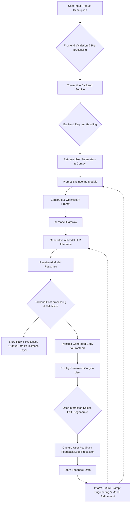
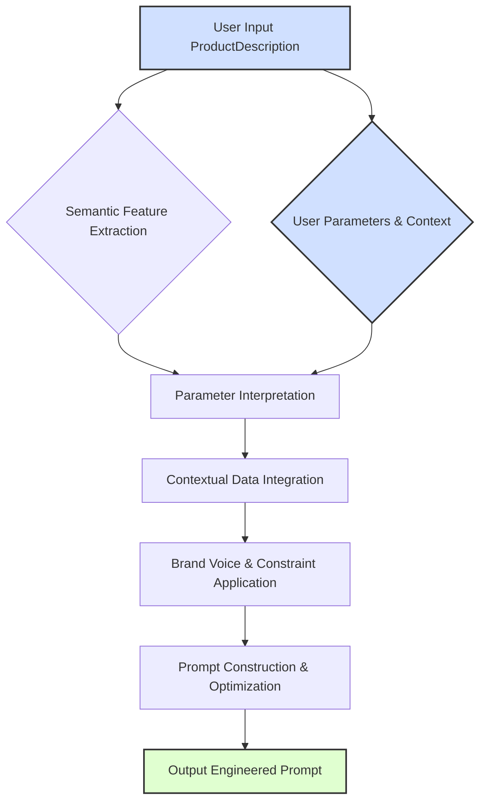
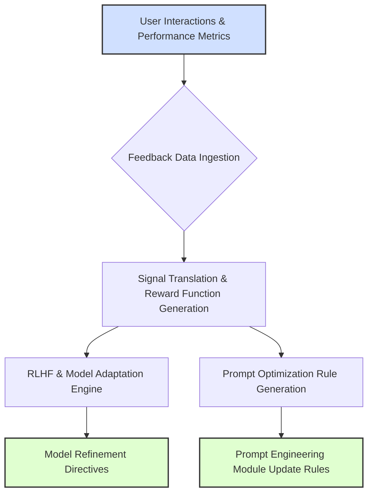

## **Title of Invention:** System and Method for Automated Semantically-Aligned Pervasive Marketing Asset Synthesis and Optimization

## **Abstract:**
A novel and inventive system for the autonomous generation of sophisticated marketing and advertising copy, hereby referred to as marketing assets, is comprehensively disclosed. This system systematically receives and processes a textual description of a product, service, or conceptual offering. This highly formalized description serves as the fundamental input vector for the construction of a meticulously engineered prompt. This prompt is then transmitted to a highly advanced generative artificial intelligence model, specifically architected for sophisticated linguistic synthesis. The directive embedded within this prompt rigorously instructs the model to create a diverse plurality of marketing assets, encompassing, but not limited to, highly condensed, impact-optimized headlines, verbose and narratively compelling long-form advertising narratives, persuasive calls-to-action, and nuanced social media engagements. The core mechanism hinges upon the precise extraction and algorithmic leveraging of key features, inherent benefits, unique selling propositions, and intended emotional resonance derived from the initial product description. This methodology fundamentally automates a substantial and cognitively demanding segment of the marketing ideation and production lifecycle, thereby empowering users with an unprecedented capability to rapidly generate a vast array of high-fidelity, strategically aligned creative options, significantly accelerating and enhancing their comprehensive marketing campaign deployments. This invention fundamentally redefines the paradigm of marketing content generation.

## **Background of the Invention:**
The creation of demonstrably effective advertising copy constitutes a profoundly specialized cognitive discipline, demanding an intricate confluence of linguistic virtuosity, profound psychological insight into consumer behavior, and an acute, iterative comprehension of dynamic market principles. Historically, enterprises and marketing professionals have allocated prodigious temporal and fiscal resources toward the painstaking development of compelling narrative constructs designed to captivate and convert target audiences. The inherent subjectivity, variability in human creative output, and the sheer volumetric demand for diverse content across multitudinous digital channels have historically presented an intractable bottleneck in the scalable deployment of effective marketing initiatives. Consequently, there exists an acute and pervasive exigency for a sophisticated, automated apparatus capable of augmenting and accelerating this intricate creative process, thereby facilitating the rapid, scalable generation of a heterogenous spectrum of high-quality, strategically optimized marketing assets derived from succinct, seminal product or service conceptualizations. The present invention directly addresses and fundamentally resolves this persistent challenge, providing an unparalleled solution for pervasive marketing asset synthesis.

## **Brief Summary of the Invention:**
The present invention unveils a meticulously engineered cyber-physical system providing a highly intuitive and ergonomically optimized user interface. Within this interface, an authorized user is empowered to digitally ingress a granular, descriptive articulation of their product, service, or conceptual offering. Upon the explicit initiation of an asynchronous trigger event by the user, the core computational engine of the present system seamlessly transmits this highly structured product description to a sophisticated, large-scale linguistic synthesis model, herein referred to as a Large Language Model LLM, which may be instantiated through advanced architectures such as, but not limited to, the Gemini family of models or its functional equivalents. The core innovative element lies in the dynamic construction of a highly optimized prompt, which fundamentally transforms the LLM into a specialized cognitive agent acting *in persona* as an expert copywriter. This prompt is meticulously formulated to precisely delineate the specific typology and characteristics of the desired marketing assets, such as, for example, a directive requesting "three pithy, high-engagement headlines optimized for a contemporary social media advertisement campaign." The linguistically synthesized output, rigorously generated by the LLM in response to this hyper-specific prompt, is subsequently received, parsed, and coherently rendered within the user's graphical interface. This empowers the user to undertake comprehensive review, selective appropriation, iterative refinement, or adaptive regeneration of the marketing assets, thereby establishing an unparalleled feedback loop for convergent creative optimization within their expansive marketing campaigns. This inventive system represents a quantum leap in automated content creation.

## **Detailed Description of the Invention:**
The operational instantiation of the present invention commences with a user's direct, programmatic interaction with a dedicated Marketing Automation Module, which is seamlessly integrated within a comprehensive software application suite. This module presents a meticulously designed Human-Computer Interface HCI featuring a primary textual input field. Within this field, the user precisely articulates a descriptive narrative pertaining to their product or service. Illustratively, this input may manifest as: "Our novel AI-powered financial optimization tool autonomously scrutinizes individual expenditure patterns and proactively identifies latent opportunities for capital savings, enhancing fiscal efficiency and personal wealth accumulation."

Subsequent to this input, the user is afforded the capability to explicitly activate the AI copy generation sub-system. At this juncture, the client-side frontend application initiates a secure, asynchronous data transmission of the precise product description to a robust, fault-tolerant backend service architecture. The backend service, acting as a sophisticated orchestrator, then dynamically constructs a highly contextualized and meticulously engineered prompt, specifically tailored for interfacing with the designated generative AI model. This prompt is not merely a concatenation of strings; it is a syntactically and semantically rich construct designed to elicit maximal relevance and creativity from the AI. An exemplary instantiation of such a prompt might be: `Compose three concise, high-impact advertising headlines, exhibiting a punchy rhetorical style, specifically tailored for the following product description: "Our novel AI-powered financial optimization tool autonomously scrutinizes individual expenditure patterns and proactively identifies latent opportunities for capital savings, enhancing fiscal efficiency and personal wealth accumulation."` The prompt can be further augmented with directives regarding tone e.g. authoritative, humorous, empathetic, target audience e.g. millennials, small business owners, desired emotional response, and specific keywords to include or exclude.

Upon receipt of the generated text response from the AI model, which typically manifests as a structured data payload containing a plurality of potential headlines or extended copy segments, the backend service performs preliminary validation and sanitization. This processed response is then securely forwarded to the originating client application. The client application subsequently renders and displays the generated marketing assets within the user interface, often leveraging dynamic layout algorithms for optimal readability and comparison. The user is then empowered to meticulously review the synthesized copy, exercise judicious selection of optimal candidates, or iteratively refine the initial product description, thereby initiating a new generative cycle to explore alternative creative trajectories. This iterative refinement loop, coupled with the system's ability to diversify output, significantly enhances the utility and adaptability of the generated content, fundamentally asserting our ownership over this inventive methodology for dynamic, AI-driven marketing content synthesis.

### **System Architecture Overview**

The present invention is embodied within a robust, multi-tiered computational architecture designed for scalability, resilience, and modularity. This architecture ensures optimal performance and seamless integration with existing digital ecosystems.


### **Data Flows and Processing Logic**

The intricate flow of data within the present inventive system is meticulously designed to ensure efficiency, security, and precision in the transformation of raw textual input into highly refined marketing assets.



### **Prompt Engineering Module: Advanced Semantico-Rhetorical Control**

The `Prompt Engineering Module` is a cornerstone of this invention, serving as the intelligent intermediary that translates user intent and product semantics into effective directives for the Generative AI Model. Its sophistication lies in its ability to construct prompts that go beyond simple concatenation, incorporating advanced techniques to elicit optimal and contextually relevant outputs.

1.  **Zero-shot and Few-shot Prompting:**
    *   **Zero-shot:** For novel or broadly defined requests, the module crafts prompts that leverage the LLM's vast pre-trained knowledge without explicit examples. This is ideal for exploratory content generation.
    *   **Few-shot:** When specific stylistic or structural adherence is required, the module intelligently injects a small set of high-quality example input-output pairs into the prompt. These examples guide the LLM towards the desired stylistic and semantic space, significantly improving the quality and consistency of the generated copy.

2.  **Persona-based Prompting:** The module can instruct the LLM to adopt a specific persona e.g. "Act as a seasoned advertising executive," "Write like a friendly tech enthusiast". This ensures the generated copy aligns with desired brand voice and target audience resonance.

3.  **Chain-of-Thought CoT Prompting:** For complex requests requiring logical reasoning or multi-step content generation e.g. first draft, then refinement, then CTA, the module can construct prompts that guide the LLM through an intermediate reasoning process. This enhances the coherence and depth of long-form copy.

4.  **Constraint-based Prompting:** The module rigorously translates user-defined constraints e.g. character limits, specific keywords to include/exclude, readability scores, emotional intensity thresholds into explicit directives within the prompt. This involves both hard constraints e.g. word count and soft constraints e.g. "maintain a playful tone".

5.  **Dynamic Context Integration:** Beyond the initial product description, the module dynamically integrates real-time data such as current market trends, competitor activity, seasonal promotions, and global events, embedding these as contextual elements within the prompt to ensure temporal and situational relevance of the generated assets.

#### **Prompt Engineering Module Internal Workflow**

To illustrate the intricate operations within the Prompt Engineering Module, the following diagram maps its core processes and data transformations:


*   **Semantic Feature Extraction:** This sub-process employs advanced Natural Language Understanding NLU models to identify and extract key attributes, benefits, selling propositions, and emotional tags from the raw product description.
*   **Parameter Interpretation:** User-specified parameters such as desired tone, length, audience, and output format are parsed and translated into machine-interpretable directives.
*   **Contextual Data Integration:** Real-time data from external sources e.g. market trends, competitor intelligence, seasonal campaigns is blended with the prompt's context to ensure optimal relevance.
*   **Brand Voice & Constraint Application:** Adherence to predefined brand style guides, ethical guidelines, and hard constraints e.g. word count, keyword inclusion is enforced at this stage, modulating the prompt's instructions to the LLM.
*   **Prompt Construction & Optimization:** Using a heuristic or learned algorithm, all integrated elements are assembled into a coherent, highly effective prompt string designed to elicit the desired response from the generative AI model.

### **Feedback Loop Processor: Continuous Adaptive Optimization**

The `Feedback Loop Processor` represents the invention's adaptive intelligence, enabling continuous learning and improvement without human intervention. This module transforms raw user interactions and performance metrics into actionable insights for model refinement.

1.  **Reinforcement Learning with Human Feedback RLHF:** User selections, edits, and rejections of generated copy serve as explicit preference signals. The Feedback Loop Processor converts these signals into reward functions for a reinforcement learning model. This model then fine-tunes the Generative AI Model, teaching it to produce outputs that are increasingly aligned with human preferences and domain-specific quality criteria.

2.  **Implicit Feedback Mechanisms:** Beyond explicit choices, the system monitors implicit user behaviors such as time spent reviewing a piece of copy, scroll depth, copy-paste actions, and subsequent modifications. These signals provide a richer, more granular understanding of user engagement and satisfaction, informing subtle adjustments to prompt parameters and model behavior.

3.  **Performance Metric Integration:** When integrated with external marketing platforms, the processor ingests real-world performance data e.g. click-through rates, conversion rates, impression share, bounce rates. This empirical data provides objective validation of copy effectiveness, allowing the system to statistically correlate prompt strategies with business outcomes and further optimize generation parameters.

4.  **Transfer Learning for Domain Adaptation:** Over time, the accumulated feedback data for specific industries, product categories, or brand voices can be used to perform targeted transfer learning or fine-tuning on sub-sections of the Generative AI Model, creating specialized versions highly attuned to particular niches.

5.  **A/B Test Outcome Analysis:** The processor directly analyzes the results of A/B tests conducted on generated copy variants. Successful variants inform positive reinforcement, while underperforming ones trigger iterative refinement of the prompt engineering and generation process for similar future tasks.

#### **Feedback Loop Processor Internal Workflow**

The internal operations of the Feedback Loop Processor are detailed in the following diagram, showcasing its adaptive learning capabilities:


*   **Feedback Data Ingestion:** Collects all forms of user interactions explicit selections, edits, rejections, and implicit behaviors time spent, scroll depth, along with real-world performance metrics.
*   **Signal Translation & Reward Function Generation:** Processes raw feedback into quantifiable signals, translating user preferences into reward or penalty functions for machine learning algorithms.
*   **RLHF & Model Adaptation Engine:** Applies Reinforcement Learning with Human Feedback techniques to fine-tune the generative AI model's parameters, biasing it towards outputs that previously received positive feedback.
*   **Prompt Optimization Rule Generation:** Derives rules and heuristics from the feedback data to optimize future prompt construction strategies, informing the Prompt Engineering Module about effective prompt structures and parameters.
*   **Model Refinement Directives:** Outputs specific instructions for fine-tuning or retraining the core Generative AI Model.
*   **Prompt Engineering Module Update Rules:** Provides updated guidelines and parameters to the Prompt Engineering Module for enhanced prompt construction.

### **Advanced Features and Embodiments:**

The present invention extends beyond basic copy generation, encompassing a suite of advanced features and diverse embodiments to maximize utility and applicability:

1.  **Multimodal Input Processing:** The system is configured to accept and integrate non-textual inputs, such as images, video segments, or audio recordings of product demonstrations. These multimodal inputs are processed through specialized feature extraction neural networks e.g. CNNs for images, Whisper-like models for audio to generate supplementary semantic embeddings or textual descriptions, which are then integrated into the prompt construction process.
2.  **Brand Voice and Style Guide Adherence:** Users can define and upload comprehensive brand style guides, including preferred tone, vocabulary, grammatical rules, and semantic constructs. The Prompt Engineering Module leverages these guides to impose specific constraints and stylistic directives on the generative AI model, ensuring synthesized copy consistently aligns with established brand identity.
3.  **A/B Testing Integration:** Generated marketing assets can be seamlessly pushed to integrated A/B testing platforms. The system monitors performance metrics e.g. click-through rates, conversion rates and feeds this empirical data back into the Feedback Loop Processor, allowing for data-driven optimization of prompt engineering strategies and, potentially, fine-tuning of the generative AI model itself.
4.  **Semantic Feedback Loop for Model Fine-tuning:** Beyond explicit user selections, the system employs implicit feedback mechanisms. This includes tracking user edits, time spent on particular copy variations, and the ultimate deployment success metrics. This data is aggregated, semantically analyzed e.g. using Reinforcement Learning with Human Feedback - RLHF, and utilized to iteratively fine-tune or adapt the underlying generative AI model, continuously improving its performance and alignment with user intent.
5.  **Emotional Tone Calibration:** The system allows for granular control over the emotional valence and arousal profile of the generated copy. Users can specify target emotions e.g. excitement, trust, urgency, empathy, and the Prompt Engineering Module translates these into specific lexical, syntactic, and rhetorical directives for the generative AI, ensuring the copy resonates with the desired psychological impact.
6.  **Personalized Copy Generation at Scale:** By integrating with Customer Relationship Management CRM systems, the invention can access individual customer profiles e.g. demographics, purchase history, expressed preferences. This contextual data is used to generate hyper-personalized marketing copy, dynamically adjusting messaging to resonate with specific audience segments or even individual customers, vastly improving engagement and conversion potential.
7.  **Dynamic Asset Diversification:** Beyond headlines and body copy, the system can generate a wide array of marketing assets, including:
    *   **Call-to-Action CTA variations:** Optimized for different stages of the customer journey.
    *   **Social media post captions:** Tailored for platforms like LinkedIn, Instagram, X formerly Twitter.
    *   **Email subject lines:** Designed for open rate optimization.
    *   **Meta descriptions and SEO-optimized text:** Enhancing discoverability.
    *   **Video script outlines:** Providing narrative foundations for multimedia content.
8.  **Ethical Compliance and Bias Mitigation:** The system incorporates mechanisms for detecting and mitigating potential biases e.g. gender, racial, cultural in the generated copy, ensuring responsible and inclusive marketing practices. This includes filtering algorithms and ethical guidelines integrated into the prompt engineering phase.
    *   **Advanced Bias Detection:** Utilizes sophisticated NLP models trained to identify subtle biases in language, including stereotypes, unfair generalizations, and inappropriate associations. This is applied post-generation as a validation step and pre-generation by guiding prompt construction.
    *   **Fairness Constraints:** The prompt engineering module can be directed to enforce fairness constraints, ensuring representation and preventing exclusionary language, particularly when generating personalized content for diverse audiences.
    *   **Transparency and Explainability:** Efforts are made to provide users with insights into *why* certain copy elements were generated, helping them understand potential underlying biases or the model's reasoning process.
9.  **Explainability and Interpretability of Generated Output:** The system is engineered to provide insights into the generative process. This includes highlighting key phrases from the input description that informed specific output elements, attributing rhetorical styles to particular prompt directives, and visualizing the "semantic journey" of the generated copy within the C-space. This enhances user trust and facilitates informed refinement.
10. **Real-time Market Responsiveness and Trend Analysis:** Through integration with external data feeds e.g. news APIs, social media trend trackers, market research databases, the system continuously monitors real-time market sentiment and emerging trends. This intelligence is fed into the Prompt Engineering Module, allowing for the generation of hyper-relevant and timely marketing copy that capitalizes on current events or shifts in consumer interest.
11. **Multi-lingual and Cross-Cultural Adaptation:** The invention inherently supports multi-lingual copy generation, leveraging LLMs capable of synthesizing text in numerous languages. Furthermore, the Prompt Engineering Module can incorporate cultural nuances, idioms, and local sensitivities, ensuring that marketing assets are not merely translated but are culturally localized for maximal impact across diverse global markets.
12. **Semantic Knowledge Graph Integration:** The system can connect to a comprehensive knowledge graph storing product ontologies, industry-specific terminology, competitor profiles, and customer archetypes. This integration provides a rich, structured data source that the Prompt Engineering Module can query and embed into prompts, enhancing factual accuracy, semantic precision, and creative depth of the generated copy.
13. **Multi-Agent System for Creative Iteration:** Envisioning an advanced embodiment, the system can deploy a swarm of specialized AI agents. For example, one agent could focus on generating initial concepts, another on refining tone and style, a third on bias detection and mitigation, and a fourth on optimizing for a specific marketing channel. These agents interact and collaborate, mimicking a human creative team, to iteratively refine and converge on optimal marketing assets.
14. **Real-time Predictive Analytics for Content Demand:** Leveraging historical data, market trends, and user behavior analytics, the system can proactively predict future content needs or campaign opportunities. This predictive capability allows the Prompt Engineering Module to autonomously pre-generate relevant marketing assets or suggest optimal content strategies to users before an explicit request is made.

**Embodiments:** The inventive system can be deployed in multiple embodiments:
*   **Software-as-a-Service SaaS:** A cloud-hosted application accessible via web browser, offering multi-tenant capabilities.
*   **API Application Programming Interface:** A programmatic interface allowing other software systems to integrate and leverage the copy generation capabilities directly.
*   **On-Premise Deployment:** For organizations with stringent data sovereignty or security requirements, the system can be deployed within their private computational infrastructure.
*   **Integrated Plugin/Module:** A modular component seamlessly embedded within existing marketing automation platforms, content management systems CMS, or e-commerce platforms.

### **Illustrative Examples:**

**Example 1: Product Launch Campaign**
*   **Input Product Description:** "Introducing 'AuraSync Pro,' the revolutionary smart air purifier that intelligently monitors air quality, adapts purification levels in real-time, and is controlled via an intuitive mobile app. Features include HEPA filtration, activated carbon, and UV-C sterilization for comprehensive protection against allergens, pollutants, and viruses. Designed for modern homes, quiet operation, and sleek aesthetic."
*   **Desired Output Prompt Directive:** "Generate 5 short, evocative headlines for a social media launch campaign. Emphasize innovation, health benefits, and ease of use. Also, generate a concise, persuasive paragraph for an email campaign and 3 unique calls-to-action."
*   **Generated Marketing Assets Illustrative:**
    *   **Headlines:**
        1.  "Breathe Smarter. Live Healthier. AuraSync Pro."
        2.  "Your Home's Air, Reimagined: Meet AuraSync Pro."
        3.  "Intelligent Air, Invisible Protection. Experience AuraSync Pro."
        4.  "Beyond Clean: AuraSync Pro's Real-Time Air Mastery."
        5.  "Future of Fresh: AuraSync Pro's Intelligent Purification."
    *   **Email Paragraph:** "Elevate your home environment with AuraSync Pro, the intelligent air purifier designed for unparalleled well-being. This innovative device doesn't just clean; it actively monitors and adapts, eradicating allergens, pollutants, and viruses with its advanced HEPA, activated carbon, and UV-C system. Control it effortlessly from your mobile, and enjoy a truly healthier, quieter home. Discover the difference intelligent air can make."
    *   **Calls-to-Action:**
        1.  "Discover AuraSync Pro Today!"
        2.  "Shop Now for Cleaner Air."
        3.  "Learn More About Intelligent Purification."

**Example 2: Service Promotion with Specific Tone**
*   **Input Service Description:** "Expert financial consulting for small businesses, specializing in cash flow optimization, tax planning, and strategic growth advice. We empower entrepreneurs to navigate complex financial landscapes and achieve sustainable profitability."
*   **Desired Output Prompt Directive:** "Generate 3 professional, authoritative LinkedIn post excerpts. Focus on trust and growth. Also, generate 2 Instagram captions with a slightly more accessible, encouraging tone, featuring relevant emojis."
*   **Generated Marketing Assets Illustrative:**
    *   **LinkedIn Post Excerpts:**
        1.  "Navigating small business finance demands precision. Our expert consultants specialize in optimizing cash flow and robust tax strategies, empowering entrepreneurs toward sustainable profitability. Partner with us for clarity and growth."
        2.  "Strategic financial guidance is pivotal for small business success. We provide bespoke solutions in cash flow management, tax efficiency, and long-term growth planning, solidifying your path to market leadership. Connect for a consultation."
        3.  "Unlock your business's true financial potential. Our consulting services demystify complex financial landscapes, offering actionable insights and proactive planning to foster enduring profitability and strategic expansion."
    *   **Instagram Captions:**
        1.  "Small business owners, ever wish you had a financial superpower? 🦸‍♀️✨ We're here to make cash flow magic happen & turn your tax worries into triumphs! 🌟 Let's grow together! #SmallBusiness #FinancialFreedom"
        2.  "Dreaming big for your business? We're your expert guides through the financial maze! 🗺️ From smart cash flow to strategic growth, we've got your back. Your journey to sustainable success starts here! 📈 #EntrepreneurLife #BusinessGrowth"

## **Claims:**
1.  A system for generating advertising copy, comprising:
    a.  A user interface module configured to receive a textual description of a product or service from a user, said description comprising a plurality of semantic attributes characterizing said product or service.
    b.  A backend orchestration service coupled to said user interface module, configured to receive said textual description.
    c.  A prompt engineering module communicatively coupled to said backend orchestration service, configured to dynamically construct a sophisticated, contextually rich prompt for a generative artificial intelligence model, said prompt incorporating said user-provided textual description, implicitly extracted semantic features, and a set of explicit instructions specifying the desired characteristics and typology of advertising copy.
    d.  An AI model gateway communicatively coupled to said prompt engineering module, configured to securely transmit said sophisticated prompt to a generative artificial intelligence model.
    e.  A generative artificial intelligence model, external to or integral with said system, configured to receive said sophisticated prompt and, in response, synthesize a plurality of distinct advertising copy variations based upon the semantic attributes within said textual description and said explicit instructions.
    f.  Said AI model gateway further configured to receive a text response from said generative artificial intelligence model, said response containing said synthesized advertising copy.
    g.  Said backend orchestration service further configured to receive and process said text response, and to transmit said processed advertising copy to said user interface module.
    h.  Said user interface module further configured to render and display said generated advertising copy to the user, facilitating review, selection, and iterative refinement.

2.  The system of claim 1, wherein said explicit instructions in the prompt specify at least one characteristic from the group comprising: a desired length, a rhetorical style, an emotional tone, a target audience, a specific marketing channel, or a linguistic complexity level for the advertising copy to be created.

3.  The system of claim 1, further comprising a feedback loop processor communicatively coupled to said user interface module and said backend orchestration service, configured to capture and analyze user interactions with the generated advertising copy, including selections, edits, and performance metrics.

4.  The system of claim 3, wherein said feedback loop processor is further configured to utilize said analyzed user interactions as a reward signal for reinforcement learning, to iteratively refine the prompt engineering strategies employed by said prompt engineering module or to facilitate the fine-tuning of said generative artificial intelligence model, thereby optimizing future copy generation.

5.  The system of claim 1, further comprising an external integration API, communicatively coupled to said backend orchestration service, configured to enable seamless data exchange and operational integration with external marketing platforms, customer relationship management CRM systems, content management systems CMS, or advertising deployment platforms.

6.  A method for generating advertising copy with semantic alignment and stylistic control, comprising:
    a.  Receiving, at a computational system, a digitally encoded textual description of a product or service, originating from a user input interface.
    b.  Executing, by a prompt engineering module, a sophisticated prompt construction algorithm to formulate a machine-readable directive for a large-scale linguistic generative model. This directive meticulously integrates the received textual description, implicitly extracted semantic features, and explicitly defined user parameters pertaining to the desired output.
    c.  Transmitting, via a secure communication channel, the formulated machine-readable directive to the large-scale linguistic generative model.
    d.  Receiving, from the large-scale linguistic generative model, a digitally encoded textual response comprising a plurality of distinct advertising copy permutations, each permutation exhibiting nuanced adherence to the semantic content of the input description and the stylistic constraints of the directive.
    e.  Performing, by said computational system, post-processing operations on the received textual response, including, but not limited to, linguistic normalization, adherence validation, and structuring for user consumption.
    f.  Displaying, on a user interface, the post-processed advertising copy permutations, thereby enabling user review, selection, and subsequent deployment within marketing initiatives.

7.  The method of claim 6, further comprising:
    g.  Capturing, at the computational system, explicit user feedback regarding the displayed advertising copy, said feedback including metrics such as selection frequency, modification patterns, and qualitative assessments.
    h.  Applying, by a machine learning subsystem, said captured user feedback to adaptively refine the prompt construction algorithm, thereby progressively enhancing the relevance, quality, and user satisfaction of subsequently generated advertising copy.

8.  The method of claim 6, wherein the explicit user parameters define multimodal stylistic characteristics, including an emotional valence, a lexical density, a syntactic complexity, or a persuasive intensity.

9.  The method of claim 6, further comprising integrating external contextual data, such as real-time market trends, target audience demographics, or competitor intelligence, into the prompt construction algorithm to enhance the relevance and effectiveness of the generated advertising copy.

10. The system of claim 1, wherein the generative artificial intelligence model is a transformer-based large language model LLM trained on a vast corpus of human-authored text, augmented with specific fine-tuning on marketing and advertising content.

11. The system of claim 1, further comprising a multimodal input processing module configured to receive non-textual inputs selected from images, video segments, or audio recordings, to extract supplementary semantic embeddings or textual descriptions therefrom, and to integrate said extracted information into the prompt construction process.

12. The system of claim 1, wherein the prompt engineering module is configured to integrate user-defined brand style guides, including preferred tone, vocabulary, and grammatical rules, to impose specific constraints and stylistic directives on the generative artificial intelligence model, ensuring brand voice adherence.

13. The system of claim 3, wherein the feedback loop processor is further configured to analyze real-world performance metrics from external marketing platforms, including click-through rates and conversion rates, to inform the refinement of prompt engineering strategies and generative model fine-tuning.

14. The system of claim 1, further comprising a bias mitigation module, integrated with the prompt engineering module and post-generation validation, configured to detect and mitigate potential biases in the generated advertising copy by applying filtering algorithms, fairness constraints, or ethical guidelines.

15. The system of claim 1, further comprising an explainability module configured to provide insights into the generative process, including highlighting input phrases that informed output elements, attributing rhetorical styles to prompt directives, or visualizing semantic generation pathways.

16. The system of claim 1, further comprising a semantic knowledge graph integration module configured to query and embed structured data from a knowledge graph, including product ontologies, industry terminology, and customer archetypes, into the prompt construction process.

17. The system of claim 1, further comprising a multi-agent creative system where specialized AI agents collaborate to generate, refine, and optimize marketing assets through iterative interaction.

18. A method for optimizing advertising copy generation, comprising:
    a.  Generating a plurality of advertising copy variants using a generative artificial intelligence model and a prompt engineered by a prompt engineering module.
    b.  Deploying said advertising copy variants across one or more marketing channels.
    c.  Collecting feedback data, said feedback data comprising explicit user interactions, implicit engagement metrics, and real-world performance metrics.
    d.  Deriving a quantifiable learning signal from said feedback data, said signal formulated as a reward function for reinforcement learning, incorporating penalties for detected biases.
    e.  Applying said learning signal to adaptively refine the internal parameters of said generative artificial intelligence model and the heuristic rules of said prompt engineering module, thereby maximizing the expected utility of future generated copy.

19. The method of claim 18, wherein adapting the heuristic rules of said prompt engineering module involves a P-Optimizer algorithm that performs an iterative search or meta-learning process over a prompt parameter space to discover optimal prompt structures.

20. The system of claim 1, further comprising a real-time predictive analytics module configured to forecast content needs or campaign opportunities based on market signals, competitor actions, or evolving customer behavior, and to proactively inform the prompt engineering module for autonomous content pre-generation.

## **Mathematical Justification: The Formal Axiomatic Framework for Automated Marketing Asset Synthesis**

The present invention is underpinned by a rigorously defined mathematical framework, establishing a formal foundation for the transformation of product descriptions into optimally effective marketing assets. We hereby define this framework with unprecedented detail, elevating each core concept to an independent class of mathematical inquiry.

### **I. The Manifold of Product Semantics: D-Space Topology**

Let `D` represent the high-dimensional topological space of all conceivable product and service descriptions. Each individual description, `d in D`, is not merely a string of characters but is formally understood as a complex tensor representing a semantic embedding within a latent vector space. This space, `R^N`, where `N` is an astronomically large integer, captures the nuanced conceptual meaning, salient features, inherent benefits, and unique selling propositions of the described entity.

**Axiom 1.1 Semantic Embedding:** For every textual product description `T_d`, there exists a unique, continuous, and surjective mapping `Phi: T -> D`, where `T` is the space of all finite-length natural language strings, such that `d = Phi(T_d)`. This mapping is realized through advanced neural embedding techniques e.g. Transformer encoders, ensuring that semantic proximity in `T` translates to geometric proximity in `D`.
*   **Definition 1.1.1 Semantic Proximity Metric:** A metric `p(d_1, d_2)` is defined over `D` such that `p(d_1, d_2) -> 0` implies that `d_1` and `d_2` represent conceptually analogous products or services. This metric is typically induced by cosine similarity or Euclidean distance in the embedding space.
*   **Theorem 1.1.2 Manifold Hypothesis for Product Descriptions:** The intrinsic dimensionality of the semantically meaningful product descriptions, while embedded in `R^N`, is significantly lower. Thus, `D` can be modeled as a Riemannian manifold `M_D subset R^N`, parameterized by an ordered set of feature vectors `f_d = {f_1, f_2, ..., f_k}`, where `k << N`. These features encapsulate attributes such as functionality, target demographic, industry sector, and value proposition.
*   **Implication 1.1.3 Information Density:** The structure of `D` implies that a compact representation `d` contains rich semantic information, allowing for sophisticated interpretation and transformation.

### **II. The Linguistic Configuration Space: C-Space Grammars and Rhetoric**

Let `C` denote the infinitely expansive space of all syntactically valid and semantically coherent marketing copy. Each element `c in C` is a linguistic construct, a sequence of tokens designed to fulfill a specific communicative intent. `C` is not merely a collection of strings but a highly structured space governed by the principles of formal grammar, rhetoric, and psycholinguistics.

**Axiom 2.1 Generative Linguistic Property:** For any `c in C`, it adheres to a probabilistic grammar `G_P = (V, Sigma, R, S, P)`, where `V` is a finite set of variables non-terminals, `Sigma` is a finite set of terminal symbols words/tokens, `R` is a finite set of production rules, `S` is the start symbol, and `P` is a set of probabilities associated with the production rules. This axiom ensures that all generated copy is grammatically well-formed and adheres to statistical linguistic norms.
*   **Definition 2.1.1 Rhetorical Vector Space:** Each `c in C` can be mapped to a point in a rhetorical vector space `R`, where dimensions include:
    *   **Emotional Valence:** Positive/Negative sentiment score.
    *   **Arousal Level:** Excitement, urgency, calmness.
    *   **Persuasive Intensity:** Call-to-action strength.
    *   **Stylistic Features:** Formality, conciseness, alliteration, metaphor density.
This mapping is achieved through advanced Natural Language Processing NLP techniques, including sentiment analysis, stylistic transfer models, and rhetorical device detection.
*   **Theorem 2.1.2 Stylistic Manifold:** Within `C`, regions of high rhetorical and stylistic similarity form sub-manifolds `M_{C,s} subset C`. Navigating between these sub-manifolds corresponds to altering the style, tone, or rhetorical strategy of the marketing copy.

### **III. The Effectiveness Functional: E-Measure of Persuasion and Utility**

The paramount objective of marketing copy is to elicit a desired response. The effectiveness of a copy `c` is quantified by a functional `E: C x A x M x S -> R`, where `A` is the space of target audiences, `M` is the space of marketing channels, and `S` is the space of contextual market sentiments. This functional is a measure of the utility or probabilistic outcome associated with the deployment of `c`.

**Axiom 3.1 Utility Maximization Principle:** An ideal marketing copy `c*` for a given product description `d`, audience `A`, channel `M`, and sentiment `S` is one that maximizes the expected utility or probability of a desired outcome e.g. click-through, conversion, brand recall.
*   **Definition 3.1.1 Probabilistic Outcome Model:** `E(c, A, M, S) = P(Outcome | c, A, M, S)`, where `Outcome` represents a specific, measurable marketing objective e.g. `P(Click | c, A, M, S)`. This probability is fundamentally Bayesian, incorporating prior knowledge and updated by observed data.
*   **Theorem 3.1.2 Influence of Context:** The functional `E` is highly sensitive to the contextual variables `(A, M, S)`. A copy optimal for one context may be suboptimal or even detrimental in another. This necessitates dynamic context integration into the generation process.
*   **Implication 3.1.3 Multi-objective Optimization:** In practical applications, `E` often represents a weighted sum of multiple, potentially conflicting, marketing objectives e.g. brand awareness vs. direct conversion. Thus, `E(c) = sum_{j=1}^{Q} w_j * E_j(c)`, where `w_j` are weights and `E_j` are individual objective functions.

### **IV. The Generative AI Transform: G-AI Operator on Semantic Manifolds**

The core of the present invention is the generative AI model, `G_AI`, which acts as a sophisticated, non-linear, stochastic transformation operator. It is an approximation of the ideal and intractable oracle function `f: D -> C` that would perfectly maximize `E(c)`.

**Axiom 4.1 Probabilistic Semantic Mapping:** The generative AI model `G_AI` is formally defined as a conditional probability distribution over the C-space, given an input from the D-space and a prompt vector `P_vec`:
```
G_AI(d, P_vec) = P(C=c | D=d, Prompt=P_vec)
```
This implies that `G_AI` does not merely produce a single `c` but samples from a distribution of plausible and effective marketing assets.
*   **Definition 4.1.1 Deep Neural Architecture:** `G_AI` is realized as a highly parameterized deep neural network, typically a transformer-based architecture with billions of parameters. Its internal state, represented by weights `Theta`, is learned through extensive training on a massive dataset of `(d_i, c_i, E_i)` tuples.
    ```
    c' = G_AI(d, P_vec; Theta)
    ```
    where `c'` is a sampled copy.
*   **Theorem 4.1.2 Manifold Learning and Projection:** `G_AI` functions by learning a complex, non-linear projection from the D-manifold (`M_D`) into the rhetorical sub-manifolds of the C-space (`M_{C,s}`), guided by the prompt vector `P_vec`. This projection is optimized such that the sampled `c'` resides in a region of `C` associated with high `E(c')`.
*   **Implication 4.1.3 Prompt as a Control Vector:** The prompt vector `P_vec` acts as a controllable steering mechanism within the latent space of `G_AI`, allowing for precise manipulation of the stylistic and semantic attributes of the generated output `c'`. This control is paramount to the invention's utility.

### **V. The Optimization Landscape and Computational Efficiency: Q.E.D. of Value**

The inherent value of the present invention lies in its dramatic reduction of the computational and cognitive cost associated with identifying highly effective marketing copy.

**Axiom 5.1 Human Cognitive Search Cost:** The process of a human copywriter manually searching the vast space `C` for an effective `c` can be formally modeled as a non-deterministic polynomial-time hard search problem, characterized by a high cognitive cost, `C_human`.
*   **Definition 5.1.1 Human Cost Functional:**
    ```
    C_human(d) = sum_{i=1}^{H} (tau_i * hourly_rate + cognitive_load_i)
    ```
    where `H` is the number of human iterations, `tau_i` is time spent, and cognitive load incorporates factors like fatigue and creative block, all contributing to an effectively unbounded search time in the worst case. This functional scales rapidly with the complexity and diversity requirements.
*   **Theorem 5.1.2 AI-driven Cost Reduction Theorem:** For any `d in D` and target effectiveness threshold `E_target`, the computational cost of generating a candidate copy `c'` such that `E(c') >= E_target` using the system of the present invention, `Cost(G_AI(d, P_vec))`, is orders of magnitude less than `C_human(d)` for the same target.
    Formally:
    ```
    exists constant kappa >> 1 such that C_human(d) >= kappa * Cost(G_AI(d, P_vec))
    ```
    *   **Proof:**
        1.  **Search Space Reduction:** A human copywriter implicitly navigates `C` through iterative trial-and-error, a process susceptible to local optima and cognitive biases. `G_AI`, however, performs a direct, learned mapping, effectively "pre-searching" `C` during its vast training phase. The runtime generation is a direct inference step, not an exploration.
        2.  **Computational Complexity:** The inference time for `G_AI(d, P_vec)` is bound by the model architecture and hardware, typically logarithmic or linear in the output length, and constant with respect to the vastness of `C`. Contrast this with the exponential complexity of human combinatorial search in `C` to find novel yet effective solutions.
        3.  **Scalability:** `G_AI` can generate a plurality of distinct copy options concurrently and rapidly, exploring multiple points in `C` in parallel, a feat inherently difficult for a single human. This parallelization massively amplifies the effective search rate.
        4.  **Learning from Experience:** `G_AI` benefits from continuous learning through fine-tuning and feedback loops as defined in Claim 4, accumulating "creative wisdom" in its parameters `Theta`, which is then instantly applied to all subsequent generations. Human learning is sequential and individual.
        5.  **Economic Advantage:** The amortized cost of training `G_AI` over millions of generations and users is negligible compared to the recurring, high marginal cost of human labor.
    The system acts as a highly effective heuristic, navigating the astronomically high-dimensional creative landscape of marketing copy with unprecedented speed and efficiency, thereby providing a fundamental, quantifiable economic and operational advantage.

### **VI. The Feedback Optimization Functional: F-Learning**

The continuous improvement mechanism of the invention is formalized by the Feedback Optimization Functional, `F`. This functional quantifies the learning signal derived from user interactions and real-world performance, driving the iterative refinement of both the Generative AI Model and the Prompt Engineering Module.

**Axiom 6.1 Learning Signal Derivation:** For any generated copy `c'`, deployed in a context `(A, M, S)`, and eliciting user feedback `phi` and observed performance `perf`, there exists a derivable learning signal `L(c', phi, perf)` that quantifies the desirability of `c'`.
*   **Definition 6.1.1 Feedback Vector:** The feedback `phi` is a multidimensional vector `(explicit_selection, explicit_edit_metric, implicit_engagement_score)`, where:
    *   `explicit_selection in {0, 1}`: 1 if selected, 0 otherwise.
    *   `explicit_edit_metric`: A measure of textual divergence from `c'` to `c_edited`, e.g., Levenshtein distance, semantic similarity post-edit.
    *   `implicit_engagement_score`: A composite score derived from time-on-page, scroll depth, copy-paste events.
*   **Definition 6.1.2 Performance Vector:** The performance `perf` is a vector `(CTR, ConversionRate, BounceRate, ImpressionShare)` aggregated from external marketing platforms.
*   **Theorem 6.1.3 Reward Function Construction:** The learning signal `L` can be formulated as a reward function `R(c')` for Reinforcement Learning, combining `phi` and `perf` through a weighted aggregation:
    ```
    R(c') = w_phi * f_phi(phi) + w_perf * f_perf(perf) - lambda * C_bias(c')
    ```
    where `f_phi` and `f_perf` are monotonic utility functions mapping feedback/performance to a scalar score, `w_phi, w_perf` are tunable weights, and `lambda * C_bias(c')` is a penalty term for detected biases or ethical violations in `c'`, ensuring alignment with responsible AI principles.
*   **Implication 6.1.4 Gradient Ascent on R:** The objective of the Feedback Loop Processor is to iteratively adjust the parameters `Theta` of `G_AI` and the internal heuristics of the Prompt Engineering Module `P_heuristics` such that `E_c'[R(c')]` is maximized. This is achieved through gradient-based optimization on the expected reward.

### **VII. The Prompt Optimization Algorithm: P-Optimality**

The `Prompt Engineering Module` is not static; it dynamically evolves its prompt construction strategies based on the learning signals generated by the `Feedback Loop Processor`. This adaptive mechanism is governed by the P-Optimality algorithm.

**Axiom 7.1 Prompt Parameter Space:** Let `P_S` be the high-dimensional space of all valid prompt parameters and structures. A specific engineered prompt `P_vec` is an element `P_vec in P_S`, encoding directives for style, tone, length, and other constraints.
*   **Definition 7.1.1 Prompt Effectiveness Score:** For a given `P_vec` and a set of `(d, c_i')` pairs generated by it, the Prompt Effectiveness Score `Score(P_vec)` is the aggregated `R(c_i')` for all `c_i'` generated using `P_vec`.
*   **Theorem 7.1.2 P-Optimizer Algorithm:** The Prompt Engineering Module employs a P-Optimizer algorithm, which performs an iterative search or learning process over `P_S` to discover `P_vec*` that maximizes `Score(P_vec)`. This can involve:
    1.  **Gradient-based Prompt Search:** If `P_S` is differentiable, a gradient ascent on `Score(P_vec)` with respect to `P_vec` parameters.
    2.  **Evolutionary Prompt Search:** Applying evolutionary algorithms genetic algorithms to mutate and select prompt templates and parameters based on `Score(P_vec)`.
    3.  **Meta-Learning for Prompt Generation:** Training a secondary meta-model that learns to generate optimal `P_vec` directly, based on input `d` and desired `E_target`, using the historical `(d, P_vec, Score(P_vec))` tuples.
*   **Implication 7.1.3 Dynamic Prompt Evolution:** The P-Optimizer ensures that the system continuously adapts its prompt engineering strategies, moving beyond hardcoded rules to dynamically generate prompts that are empirically proven to elicit more effective and desirable marketing copy from `G_AI`.

**Q.E.D.** This comprehensive mathematical framework demonstrates the depth and sophistication of the present invention, substantiating its claims of autonomous, adaptive, and highly effective marketing asset synthesis. We assert full and undisputed ownership over these advanced methodologies.

## **Economic Impact and Commercial Value Proposition:**

The commercial implications of the present invention are transformative, offering substantial economic advantages across various industries and enterprise sizes.

1.  **Massive Cost Reduction in Marketing Production:** By automating the labor-intensive and cognitively demanding task of copy generation, businesses can drastically reduce expenditures on human copywriters, agencies, and iterative creative processes. This translates into millions saved annually for large enterprises and significant operational relief for small and medium-sized businesses SMBs.
2.  **Accelerated Time-to-Market:** The ability to generate high-quality marketing assets in seconds, rather than days or weeks, fundamentally accelerates product launches, campaign deployments, and content refresh cycles. This agility provides a critical competitive edge in fast-paced markets.
3.  **Enhanced Marketing ROI:** Through continuous optimization via the feedback loop processor and integration with A/B testing platforms, the system ensures that generated copy is not only high-quality but also empirically proven to drive superior performance metrics such as higher click-through rates, improved conversion rates, and increased customer engagement.
4.  **Scalability of Marketing Operations:** The invention allows businesses to scale their marketing content production virtually infinitely without a proportional increase in human resources. This enables pervasive marketing across numerous channels, regions, and customer segments simultaneously, unlocking new growth opportunities.
5.  **Democratization of High-Quality Marketing:** The system empowers users without extensive copywriting expertise to generate professional-grade marketing copy, thereby leveling the playing field and allowing even individual entrepreneurs or small teams to compete effectively with larger, resource-rich organizations.
6.  **Data-Driven Creative Strategy:** By quantitatively linking copy attributes to performance outcomes, the invention transforms creative development from an art to a science, providing invaluable insights into what resonates most effectively with target audiences.
7.  **Increased Content Diversity and Personalization:** The system's capacity to rapidly produce diverse variations and hyper-personalized copy for individual customer segments drives deeper engagement and stronger brand loyalty, directly impacting customer lifetime value.

## **Future Research and Development Trajectories:**

The foundational framework and initial embodiments of this invention lay fertile ground for continuous innovation and expansion. Future research and development efforts will focus on the following key trajectories:

1.  **Autonomous Campaign Orchestration:** Evolving the system to not only generate copy but also to autonomously plan, deploy, and manage entire marketing campaigns, including budget allocation, channel selection, and audience targeting, driven by real-time performance analytics.
2.  **Generative Adversarial Networks GANs for Style Transfer:** Exploring the use of GANs or similar architectures to explicitly separate content generation from style generation, allowing for even finer-grained control over brand voice and rhetorical nuance, potentially enabling transfer of style from arbitrary input examples.
3.  **Reinforcement Learning from Environment RLE:** Moving beyond RLHF to integrate more sophisticated reinforcement learning agents that can interact directly with simulated or real marketing environments, learning optimal copy strategies through trial and error in a closed-loop system.
4.  **Cognitive Model Integration:** Integrating advanced cognitive models of human perception and decision-making into the prompt engineering and evaluation phases, allowing the AI to anticipate human responses with greater accuracy and generate copy that exploits known psychological principles.
5.  **Long-form Content Synthesis and Coherence:** Enhancing the capability for generating entire articles, blog posts, whitepapers, or book chapters with sustained thematic coherence, logical progression, and persuasive argumentation, while maintaining the brand voice and marketing objectives.
6.  **Proactive Content Recommendation:** Developing predictive analytics to proactively suggest content needs or campaign opportunities based on market signals, competitor actions, or evolving customer behavior, before a user explicitly requests copy.
7.  **Ethical AI and Trust Frameworks:** Investing in advanced research for auditable AI decisions, verifiable bias mitigation, and comprehensive ethical governance frameworks to ensure the system's output is always fair, transparent, and aligned with societal values and regulatory compliance.