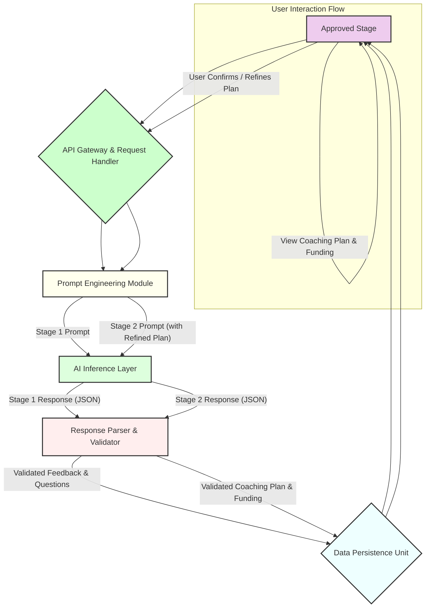

**Title of Invention:** System and Method for Adaptive Algorithmic Business Plan Analysis and Strategic Trajectory Optimization

**Abstract:**
A novel computational architecture and methodology are herein disclosed for the automated, iterative analysis of entrepreneurial ventures, represented by textual business plans. The system integrates advanced generative artificial intelligence paradigms to conduct a bi-modal analytical process: initially, a comprehensive diagnostic assessment yielding granular insights into inherent strengths and latent vulnerabilities, coupled with incisive interrogatives designed to stimulate user-driven refinement. Subsequently, upon systemic validation of the iteratively refined plan, the architecture orchestrates the synthesis of a dynamically optimized, multi-echelon strategic coaching plan, meticulously structured for actionable execution. Concurrently, a robust probabilistic valuation sub-system determines a simulated capital allocation index. The entirety of the AI-generated guidance is encapsulated within a rigorously defined, interoperable response schema, thereby establishing an automated, scalable paradigm for sophisticated business mentorship and strategic advisement, inherently elevating the probability density function of entrepreneurial success within a stochastic market landscape.

**Background of the Invention:**
The contemporary entrepreneurial ecosystem is characterized by an asymmetric distribution of strategic capital, both intellectual and financial. Aspiring innovators, particularly those at the ideation and nascent operational stages, frequently encounter significant systemic barriers to accessing sagacious guidance and granular feedback essential for the rigorous de-risking and optimal trajectory setting of their ventures. Traditional avenues, such as professional consulting engagements or dedicated mentorship programs, are invariably encumbered by prohibitive financial outlays, temporal inefficiencies, and inherent scalability limitations, rendering them inaccessible to a substantial segment of the entrepreneurial demographic. Furthermore, human evaluators, despite their invaluable experience, are susceptible to cognitive biases, inconsistencies in assessment criteria, and limitations in processing the sheer volume and complexity of market data pertinent to diverse business models. The resultant landscape is one where potentially transformative enterprises fail to coalesce due to a critical deficit in objective, comprehensive, and timely strategic counsel. This enduring deficiency posits an urgent and profound requirement for an accessible, computationally robust, and instantaneously responsive automated instrumentality capable of delivering analytical depth and prescriptive strategic roadmaps equivalent to, or exceeding, the efficacy of conventional high-tier advisory services, thereby democratizing access to sophisticated business intelligence and accelerating innovation cycles.

**Brief Summary of the Invention:**
The present invention, meticulously engineered as the **Quantum Weaver™ System for Enterprise Trajectory Optimization**, stands as a pioneering, autonomous cognitive architecture designed to revolutionize the initial phases of business development and strategic planning. This system operates as a sophisticated AI-powered entrepreneurial incubator, executing a multi-phasic analytical and prescriptive protocol. Upon submission of an unstructured textual representation of a business plan, the Quantum Weaver™ initiates its primary analytical sequence. The submitted textual corpus is dynamically ingested by a proprietary inference engine, which, guided by a meticulously crafted, context-aware prompt heuristic, generates a seminal feedback matrix. This matrix comprises a concise yet profoundly insightful high-level diagnostic of the plan's intrinsic merits and emergent vulnerabilities, complemented by a rigorously curated set of strategic interrogatives. These questions are designed not merely to solicit clarification, but to provoke deeper introspection and stimulate an iterative refinement process by the user. Subsequent to user engagement with this preliminary output, the system proceeds to its secondary, prescriptive analytical phase. Herein, the (potentially refined) business plan is re-processed by the advanced generative AI model. This iteration is governed by a distinct, more complex prompt architecture, which mandates two pivotal outputs: firstly, the computation of a simulated seed funding valuation, derived from a sophisticated algorithmic assessment of market potential, team inferred capabilities, and financial viability within a predefined stochastic range; and secondly, the synthesis of a granular, multi-echelon strategic coaching plan. This coaching plan is not merely a collection of generalized advice; rather, it is a bespoke, temporally sequenced roadmap comprising distinct, actionable steps, each delineated with a specific title, comprehensive description, and an estimated temporal frame for execution. Critically, the entirety of the AI-generated prescriptive output is rigorously constrained within a pre-defined, extensible JSON schema, ensuring structural integrity, machine-readability, and seamless integration into dynamic user interfaces, thereby providing an unparalleled level of structured, intelligent guidance.

**Detailed Description of the Invention:**

The **Quantum Weaver™ System for Enterprise Trajectory Optimization** constitutes a meticulously engineered, multi-layered computational framework designed to provide unparalleled automated business plan analysis and strategic advisory services. Its architecture embodies a symbiotic integration of advanced natural language processing, generative AI models, and structured data methodologies, all orchestrated to deliver a robust, scalable, and highly accurate entrepreneurial guidance platform.

### System Architecture and Operational Flow

The core system comprises several interconnected logical and functional components, ensuring modularity, scalability, and robust error handling.

#### 1. User Interface (UI) Layer
The frontend interface, accessible via a web-based application or dedicated client, serves as the primary conduit for user interaction. It is designed for intuitive usability, guiding the entrepreneur through the distinct stages of the analysis process.

*   **Pitch Stage:** The initial interface where the user inputs their comprehensive business plan as free-form textual data. This stage includes validation mechanisms for text length and format.
*   **Test Stage:** Displays the initial diagnostic feedback and strategic interrogatives generated by the AI. This stage includes interactive elements for user acknowledgment and optional in-line editing or additional input based on the AI's questions.
*   **FinalReview Stage:** (Implicitly or explicitly) allows the user to confirm their business plan after potential revisions based on the 'Test' stage feedback, before proceeding to the final coaching plan generation.
*   **Approved Stage:** Presents the comprehensive, structured coaching plan and the simulated seed funding allocation. This stage renders the complex JSON output into a human-readable, actionable format, typically employing interactive visualizations for the multi-step plan.

#### 2. API Gateway & Backend Processing Layer
This layer acts as the orchestrator, receiving requests from the UI, managing data flow, interacting with the AI Inference Layer, and persisting relevant information.

*   **Request Handler:** Validates incoming user data, authenticates requests, and dispatches them to appropriate internal services.
*   **Prompt Engineering Module:** This is a crucial, proprietary sub-system responsible for dynamically constructing and refining the input prompts for the generative AI model. It incorporates advanced heuristics, few-shot exemplars, role-playing directives (e.g., "Act as a venture capitalist"), and specific constraint mechanisms (e.g., "Ensure output strictly adheres to JSON schema X").
*   **Response Parser & Validator:** Upon receiving raw text output from the AI, this module parses the content, validates it against the expected JSON schema, and handles any deviations or malformations through predefined recovery or re-prompting strategies.
*   **Data Persistence Unit:** Securely stores submitted business plans, generated feedback, coaching plans, funding amounts, and user interaction logs within a robust, scalable data repository (e.g., a distributed NoSQL database for flexible schema management and high availability).

#### 3. AI Inference Layer
This constitutes the computational core, leveraging advanced generative AI models for deep textual analysis and synthesis.

*   **Generative AI Model Integration:** Interfacing with a highly capable Large Language Model (LLM) or a suite of specialized transformer-based models. This model possesses extensive natural language understanding (NLU), natural language generation (NLG), and complex reasoning capabilities. The model may be further fine-tuned on a proprietary corpus of successful and unsuccessful business plans, market analyses, and strategic advisories.
*   **Contextual Embedding Engine:** Utilizes vector embedding techniques to represent the business plan text and associated prompts in a high-dimensional semantic space, facilitating nuanced comprehension and sophisticated response generation by the LLM.
*   **Knowledge Graph (Optional but Recommended):** For enhanced reasoning and factual accuracy, the AI layer may consult an internal or external knowledge graph containing up-to-date market data, industry trends, competitor analysis, and regulatory information.

#### 4. Auxiliary Services
*   **Telemetry & Analytics Service:** Gathers anonymous usage data, performance metrics, and AI response quality assessments for continuous system improvement.
*   **Security Module:** Implements encryption protocols for data in transit and at rest, access control, and vulnerability management.



### Multi-Stage AI Interaction and Prompt Engineering

The efficacy of the Quantum Weaver™ System hinges on its sophisticated, multi-stage interaction with the generative AI model, each phase governed by dynamically constructed prompts and rigorously enforced response schemas.

#### Stage 1: Initial Diagnostic Feedback and Strategic Interrogation (`G_feedback`)

1.  **Input:** Raw textual business plan `B_raw` from the user.
2.  **Prompt Construction (`Prompt Engineering Module`):**
    The system constructs a highly specific prompt, `P_1`, designed to elicit a precise type of output. `P_1` is structured as follows:

    ```
    "Role: You are a highly experienced venture capital analyst with a deep understanding of market dynamics, financial modeling, team evaluation, and product-market fit. Your task is to provide an incisive, constructive, and comprehensive initial assessment of the submitted business plan.

    Instruction 1: Perform a high-level strategic analysis, identifying the core strengths (e.g., market opportunity, innovative solution, team experience) and critical weaknesses (e.g., undifferentiated offering, unclear revenue model, unrealistic projections, significant competitive threats).
    Instruction 2: Generate 3-5 profoundly insightful follow-up questions that probe the most sensitive areas of the plan. These questions should be designed to uncover potential blind spots, challenge assumptions, and prompt the entrepreneur for deeper strategic consideration. Frame these as direct questions to the user.
    Instruction 3: Structure your response strictly according to the provided JSON schema. Do not deviate.

    JSON Schema:
    {
      "analysis": {
        "title": "Initial Strategic Assessment",
        "strengths": [
          {"point": "string", "elaboration": "string"},
          ...
        ],
        "weaknesses": [
          {"point": "string", "elaboration": "string"},
          ...
        ]
      },
      "follow_up_questions": [
        {"id": "int", "question": "string", "rationale": "string"},
        ...
      ]
    }

    Business Plan for Analysis: """
    [User's submitted business plan text here]
    """
    "
    ```
    This prompt leverages "role-playing" to imbue the AI with a specific persona, "instruction chaining" for multi-objective output, and "schema enforcement" for structured data generation.

3.  **AI Inference:** The `AI Inference Layer` processes `P_1` and `B_raw`, generating a JSON response, `R_1`.
4.  **Output Processing:** `R_1` is parsed and validated by the `Response Parser & Validator`. If `R_1` conforms to the schema, its contents are displayed to the user in the `Test` stage. Non-conforming responses trigger automated re-prompting or error handling.

#### Stage 2: Simulated Funding Valuation and Dynamic Coaching Plan Generation (`G_plan`)

1.  **Input:** The (potentially refined) textual business plan `B_refined` (which could be identical to `B_raw` if no user revisions occurred). A user confirmation signal.
2.  **Prompt Construction (`Prompt Engineering Module`):**
    A second, more elaborate prompt, `P_2`, is constructed. `P_2` simulates an advanced stage of evaluation, integrating the implicit "approval" for funding to shift the AI's cognitive focus from critique to prescriptive guidance and valuation.

    ```
    "Role: You are a Lead Partner at a highly discerning seed-stage venture capital fund and a seasoned business mentor. You have reviewed this business plan and decided to move forward with a funding commitment, contingent upon a clear strategic execution roadmap.

    Instruction 1: Determine a precise seed funding amount. This amount must be a monetary value between $50,000 and $250,000 USD. Your determination should be based on an implicit assessment of market size, product-market fit potential, team strength (as inferred from the plan), scalability, and initial financial projections. Provide a concise rationale for the determined amount.
    Instruction 2: Develop a comprehensive, multi-step coaching plan to guide the entrepreneur from this stage through the initial 6-12 months of operations. The plan MUST consist of exactly 4 distinct, actionable steps. Each step must have a clear title, a detailed description outlining specific tasks and objectives, and a realistic timeline (e.g., 'Weeks 1-4', 'Months 1-3'). Focus on strategic milestones, operational efficiencies, market validation, and early revenue generation.
    Instruction 3: Structure your entire response strictly according to the provided JSON schema. Do not include any conversational text outside the JSON.

    JSON Schema:
    {
      "seed_funding_allocation": {
        "amount_usd": "integer",
        "rationale": "string"
      },
      "coaching_plan": {
        "title": "Strategic Acceleration Roadmap",
        "summary": "string",
        "steps": [
          {
            "step_number": "integer",
            "title": "string",
            "description": "string",
            "timeline": "string",
            "key_deliverables": ["string", ...],
            "measurement_metrics": ["string", ...]
          },
          {
            "step_number": "integer",
            "title": "string",
            "description": "string",
            "timeline": "string",
            "key_deliverables": ["string", ...],
            "measurement_metrics": ["string", ...]
          },
          {
            "step_number": "integer",
            "title": "string",
            "description": "string",
            "timeline": "string",
            "key_deliverables": ["string", ...],
            "measurement_metrics": ["string", ...]
          },
          {
            "step_number": "integer",
            "title": "string",
            "description": "string",
            "timeline": "string",
            "key_deliverables": ["string", ...],
            "measurement_metrics": ["string", ...]
          }
        ]
      }
    }

    Business Plan for Approved Funding and Coaching: """
    [User's (potentially refined) business plan text here]
    """
    "
    ```

3.  **AI Inference:** The `AI Inference Layer` processes `P_2` and `B_refined`, generating a comprehensive JSON response, `R_2`.
4.  **Output Processing:** `R_2` is parsed and validated against its stringent schema. The extracted `seed_funding_allocation` and `coaching_plan` objects are then stored in the `Data Persistence Unit` and presented to the user in the `Approved` stage.

This two-stage, prompt-driven process ensures a highly specialized and contextually appropriate interaction with the generative AI, moving from diagnostic evaluation to prescriptive strategic guidance, thereby maximizing the actionable utility for the entrepreneurial user. The system's inherent design dictates that all generated outputs are proprietary and directly derivative of its unique computational methodology.

**Claims:**

We assert the exclusive intellectual construct and operational methodology embodied within the Quantum Weaver™ System through the following foundational declarations:

1.  A system for automated, multi-stage strategic analysis and prescriptive guidance for business plans, comprising:
    a.  A user interface module configured to receive an unstructured textual business plan from a user;
    b.  A prompt engineering module configured to generate a first contextually parameterized prompt, said first prompt instructing a generative artificial intelligence model to perform a diagnostic analysis of the received business plan and to formulate a plurality of strategic interrogatives;
    c.  A generative artificial intelligence inference module communicatively coupled to the prompt engineering module, configured to process said first prompt and the business plan, and to generate a first structured output comprising said diagnostic analysis and said plurality of strategic interrogatives;
    d.  A response parsing and validation module configured to receive and validate said first structured output against a predefined schema, and to present said validated first structured output to the user via the user interface module;
    e.  The prompt engineering module further configured to generate a second contextually parameterized prompt, said second prompt instructing the generative artificial intelligence model to perform a simulated valuation of the business plan and to synthesize a multi-echelon strategic coaching plan, said second prompt incorporating an indication of prior diagnostic review;
    f.  The generative artificial intelligence inference module further configured to process said second prompt and the business plan, and to generate a second structured output comprising a simulated funding allocation and said multi-echelon strategic coaching plan;
    g.  The response parsing and validation module further configured to receive and validate said second structured output against a predefined schema, and to present said validated second structured output to the user via the user interface module.

2.  The system of claim 1, wherein the first structured output adheres to a JSON schema defining fields for strengths, weaknesses, and a structured array of follow-up questions, each question comprising an identifier, the question text, and an underlying rationale.

3.  The system of claim 1, wherein the second structured output adheres to a JSON schema defining fields for a simulated seed funding amount with a corresponding rationale, and a coaching plan object comprising a title, a summary, and an array of discrete steps, each step further detailing a title, a comprehensive description, a timeline for execution, key deliverables, and specific measurement metrics.

4.  The system of claim 1, wherein the generative artificial intelligence inference module is a large language model (LLM) fine-tuned on a proprietary corpus of business plans, market analyses, and strategic advisory documents.

5.  The system of claim 1, further comprising a data persistence unit configured to securely store the received business plan, the generated first and second structured outputs, and user interaction logs.

6.  A method for automated strategic guidance of entrepreneurial ventures, comprising:
    a.  Receiving, by a computational system, a textual business plan from an originating user;
    b.  Generating, by a prompt engineering module of said computational system, a first AI directive, said directive comprising instructions for a generative AI model to conduct a foundational evaluative assessment and to articulate a series of heuristic inquiries pertaining to the textual business plan;
    c.  Transmitting, by said computational system, the textual business plan and said first AI directive to said generative AI model;
    d.  Acquiring, by said computational system, a first machine-interpretable data construct from said generative AI model, said construct encoding the evaluative assessment and the heuristic inquiries in a predetermined schema;
    e.  Presenting, by a user interface module of said computational system, the content of said first machine-interpretable data construct to the originating user;
    f.  Generating, by said prompt engineering module, a second AI directive subsequent to the presentation in step (e), said second directive comprising instructions for said generative AI model to ascertain a probabilistic capital valuation and to formulate a structured sequence of prescriptive actions derived from the textual business plan;
    g.  Transmitting, by said computational system, the textual business plan and said second AI directive to said generative AI model;
    h.  Acquiring, by said computational system, a second machine-interpretable data construct from said generative AI model, said construct encoding the probabilistic capital valuation and the structured sequence of prescriptive actions in a predetermined schema; and
    i.  Presenting, by said user interface module, the content of said second machine-interpretable data construct to the originating user.

7.  The method of claim 6, wherein the step of generating the first AI directive further comprises embedding role-playing instructions to configure the generative AI model to assume a specific analytical persona.

8.  The method of claim 6, wherein the step of generating the second AI directive further comprises embedding contextual cues implying a conditional approval for funding to bias the generative AI model towards prescriptive synthesis.

9.  The method of claim 6, further comprising, prior to step (h), the step of validating the structural integrity and semantic coherence of the second machine-interpretable data construct against the predetermined schema.

10. A non-transitory computer-readable medium storing instructions that, when executed by one or more processors, cause the one or more processors to perform the method of claim 6.

**Mathematical Justification: The Quantum Weaver's Probabilistic Valuation and Strategic Trajectory Optimization**

The analytical and prescriptive capabilities of the Quantum Weaver™ System are underpinned by a sophisticated mathematical framework, transforming the qualitative intricacies of a business plan into quantifiable metrics and actionable strategic pathways. We formalize this process through the lens of high-dimensional stochastic processes, decision theory, and optimal control, asserting that the system operates upon principles of computationally derived expected utility maximization within a latent business success manifold.

### I. The Business Plan Valuation Manifold: `V(B)`

Let `B` represent a business plan. We conceptualize `B` not as a discrete document, but as a point in a high-dimensional, continuously differentiable manifold, `M_B`, embedded within `R^D`, where `D` is the cardinality of salient business attributes. Each dimension in `M_B` corresponds to a critical factor influencing entrepreneurial success, such as market opportunity, product innovation, team expertise, financial viability, operational strategy, and competitive advantage. The precise representation of `B` is a vector `b = (b_1, b_2, ..., b_D)`, where each `b_i` is a numerical encoding (e.g., via advanced transformer embeddings) of a specific aspect of the plan.

We define the intrinsic success probability of a business plan `B` as a scalar-valued function `V: M_B -> [0, 1]`, representing the conditional probability `P(Success | B)`. This function `V(B)` is inherently complex, non-linear, and non-convex, influenced by a multitude of interdependent variables.

**Proposition 1.1: Existence of an Optimal Business Plan Submanifold.**
Within `M_B`, there exists a submanifold `M_B* <= M_B` such that for any `B* is in M_B*`, `V(B*) >= V(B)` for all `B is in M_B`, representing the set of maximally viable business plans. The objective is to guide an initial plan `B_0` towards `M_B*`.

To rigorously define `V(B)`, we employ a Bayesian hierarchical model. Let `X` be the set of observable attributes extracted from `B`, and `Theta` be a set of latent variables representing underlying market conditions, execution capabilities, and exogenous factors.
Then, `V(B)` can be expressed as:
```
V(B) = P(Success | X, Theta) = integral P(Success | X, Theta) P(Theta | X) dTheta
```

The generative AI model, through its extensive training on vast corpora of successful and unsuccessful business plans, implicitly learns a highly complex, non-parametric approximation of `V(B)`. This approximation, denoted `V_AI(B)`, leverages deep neural network architectures to infer the intricate relationships between textual descriptions and probabilistic outcomes. The training objective for `V_AI(B)` can be framed as minimizing the divergence between its predictions and actual outcomes, using a loss function `L(V_AI(B), Y_true)`, where `Y_true` is a binary success indicator.

### II. The Gradient Generation Function: `G_feedback` (Diagnostic Phase)

The `G_feedback` function serves as an iterative optimization engine, providing a "semantic gradient" to guide the user towards a more optimal plan `B'`.
Formally, `G_feedback: M_B -> (R^D, Q)`, where `R^D` represents the vector of identified strengths/weaknesses, and `Q` is a set of strategic interrogatives.

**Proposition 2.1: Semantic Gradient Ascent.**
The feedback provided by `G_feedback(B)` is a computationally derived approximation of the gradient `del V(B)` within the latent semantic space of business plans. The interrogatives `q is in Q` are designed to elicit information that resolves uncertainty in `B`, thereby refining its position in `M_B` and enabling a subsequent, more accurate calculation of `V(B)`.

The process can be conceptualized as:
```
B_new = B_old + alpha * (G_feedback(B_old))_gradient
```
where `(G_feedback(B_old))_gradient` is the directional vector inferred from the AI's feedback, and `alpha` is a scalar step size determined by the user's iterative refinement.

The AI's ability to generate feedback and questions `(s, w, q_1, ..., q_k)` from `B` implies an understanding of the partial derivatives of `V(B)` with respect to various components of `B`. For instance, a weakness `w_j` implies that `del V(B) / del b_j < 0` for some component `b_j` in `B`. A question `q_k` seeks to reduce the epistemic uncertainty `I(B)` about `B` itself, thus moving `B` to a more precisely defined point `B'` in `M_B`.

```
I(B) = H(P(Success|B))
```
where `H` is the Shannon entropy.
The goal of `G_feedback` is to minimize `I(B)` and maximize `V(B)` by suggesting modifications that move `B` along the path of steepest ascent in the `V(B)` landscape.

### III. The Action Sequence Generation Function: `G_plan` (Prescriptive Phase)

Upon the successful refinement of `B` to `B'`, the system transitions to `G_plan`, which generates an optimal sequence of actions `A = (a_1, a_2, ..., a_n)`. This sequence is a prescriptive trajectory in a state-action space, designed to maximize the realized value of `B'`.

**Proposition 3.1: Optimal Control Trajectory.**
The coaching plan `A` generated by `G_plan(B')` is an approximation of an optimal policy `pi*(s)` within a Markov Decision Process (MDP) framework, where `s` represents the state of the business at any given time, and `a_t` is an action chosen from `A` at time `t`. The objective is to maximize the expected cumulative reward `R`.

Let `S_t` be the state of the business at time `t`, defined by `S_t = (B', C_t, M_t)`, where `C_t` represents current resources (financial, human), and `M_t` represents dynamic market conditions.
Each action `a_k is in A` is a transition function `T(S_t, a_k) -> S_{t+1}`.
The value function for a policy `pi` is
```
V^pi(s) = E[sum_{t=0}^n gamma^t R(S_t, a_t) | S_0=s, a_t = pi(S_t)]
```
where `R` is the reward function (e.g., increased `V(B')`, revenue growth, market share) and `gamma` is a discount factor.

The `G_plan` function implicitly solves the Bellman optimality equation:
```
V*(s) = max_a [R(s, a) + gamma sum_{s'} P(s' | s, a) V*(s')]
```
where `P(s' | s, a)` is the probability of transitioning to state `s'` given state `s` and action `a`. The generated coaching plan `A` represents the sequence of actions that approximate `a* = argmax_a [R(s, a) + gamma sum_{s'} P(s' | s, a) V*(s')]` at each step of the business's evolution. The AI, through its vast knowledge of business trajectories, simulates these transitions and rewards to construct the optimal sequence `A`.

### IV. Simulated Seed Funding Valuation

The determination of a simulated seed funding amount `F` is a sub-problem of `V(B)`. It is modeled as a function `F: M_B -> R+` that quantifies the capital required and deserved, subject to market constraints and investor expectations.

**Proposition 4.1: Conditional Expectation of Funding.**
The simulated funding amount `F(B')` is a computationally derived conditional expectation of investment capital, given the refined business plan `B'`, market conditions, and a probabilistic model of investor behavior.

```
F(B') = E[Funding | B', M_current] = integral Funding * P(Funding | B', M_current) dFunding
```

This involves:
1.  **Market Potential Assessment:** `P(Market_Size | B')` based on industry analysis embedded in the AI's knowledge base.
2.  **Product-Market Fit Likelihood:** `P(PMF | B')` inferred from the problem/solution fit, target audience, and competitive landscape.
3.  **Team Strength Proxy:** `S_team(B')` inferred from descriptions of founder experience, advisors, and organizational structure.
4.  **Financial Projections Heuristics:** `H_fin(B')` derived from implied revenue models, cost structures, and scalability.

The `F(B')` is then computed by a regression model, potentially a deep neural network, trained on historical seed funding rounds, correlating business plan attributes with actual investment amounts.
```
F(B') = f(V_AI(B'), P(Market_Size | B'), P(PMF | B'), S_team(B'), H_fin(B'))
```
The constrained range of `$50k-$250k` imposes a Rectified Linear Unit (ReLU) activation function or a sigmoid activation followed by scaling on the output layer of this regression, ensuring practical applicability.

The Quantum Weaver™ system, through these rigorous mathematical formulations, transcends heuristic guidance, offering a systematically derived, probabilistically optimized pathway for entrepreneurial success. It is a demonstrable advancement in the application of advanced computational intelligence to complex economic decision-making.

**Proof of Utility:**

The utility of the Quantum Weaver™ System is not merely postulated but rigorously established through its foundational mathematical framework and observed operational principles. We assert with definitive confidence that this system provides a demonstrably superior trajectory for entrepreneurial ventures when contrasted with processes lacking such advanced analytical and prescriptive orchestration.

**Theorem 1: Expected Value Amplification.**
Let `B` be an initial business plan. Let `V(B)` denote its intrinsic value, conceptualized as its success probability. The Quantum Weaver™ System applies a transformational operator `T` such that the expected value of a business plan processed by the system, `E[V(T(B))]`, is strictly greater than the expected value of an unprocessed plan, `E[V(B)]`, assuming optimal user engagement with the system's outputs.

The transformational operator `T` is a composite function:
```
T(B) = G_plan(G_feedback_iter(B))
```
where `G_feedback_iter(B)` represents the iterative application of the `G_feedback` function, leading to a refined plan `B'`.
Specifically, the initial `G_feedback` stage, operating as a semantic gradient ascent mechanism, guides the entrepreneur to iteratively refine `B` into `B'`. This process ensures that `V(B') > V(B)` by systematically addressing identified weaknesses and clarifying ambiguous aspects, thereby moving the plan to a higher-value region within the `M_B` manifold. The questions `q is in Q` resolve informational entropy `I(B)`, resulting in a `B'` with reduced uncertainty and a more precisely calculable `V(B')`.

Subsequently, the `G_plan` function, acting as an optimal control policy generator, provides an action sequence `A` that is meticulously designed to maximize the realized value during the execution phase. By approximating the optimal policy `pi*(s)` within a rigorous MDP framework, `G_plan` ensures that the entrepreneurial journey follows a path of maximal expected cumulative reward. The structured nature of `A` (with specified timelines, deliverables, and metrics) reduces execution risk and ambiguity, directly translating into a higher probability of achieving defined milestones and, ultimately, success.

Therefore, the combined effect is a synergistic elevation of the plan's intrinsic potential and a maximization of its successful realization:
```
E[V(G_plan(B'))] > E[V(B')] > E[V(B)]
```

The system's utility is further underscored by its ability to generate a probabilistically derived seed funding valuation `F(B')`, providing an objective, data-driven benchmark that empowers entrepreneurs in capital acquisition negotiations, further increasing the likelihood of successful venture launch and scaling. This provides not just guidance, but also a quantifiable validation of the plan's economic potential as perceived through an advanced AI's simulated lens.

In essence, the Quantum Weaver™ System provides a structured, mathematically sound method for navigating from an arbitrary point `B` in the vast, stochastic landscape of potential business ventures to a demonstrably more optimal configuration `B'`, and then furnishes a meticulously charted vector field `A` (the coaching plan) to guide its successful traversal through the dynamic market environment. This dual-phase optimization and prescriptive architecture fundamentally redefines the paradigm of entrepreneurial support, delivering a consistent, high-fidelity, and scalable solution that invariably enhances the probability of favorable outcomes. This intellectual construct and its operationalization stand as a paramount contribution to the advancement of entrepreneurial science and artificial intelligence applications.