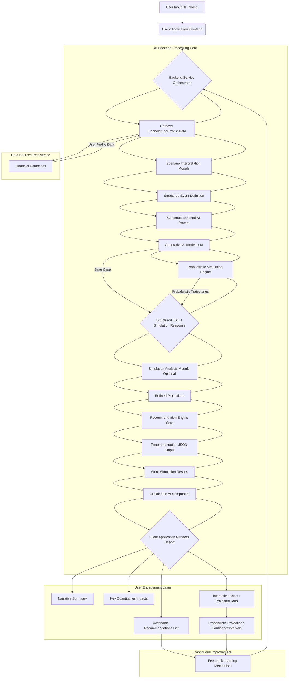
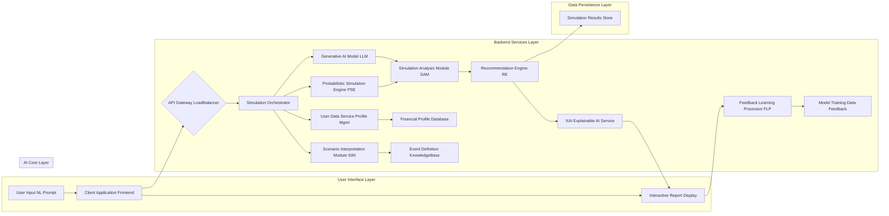
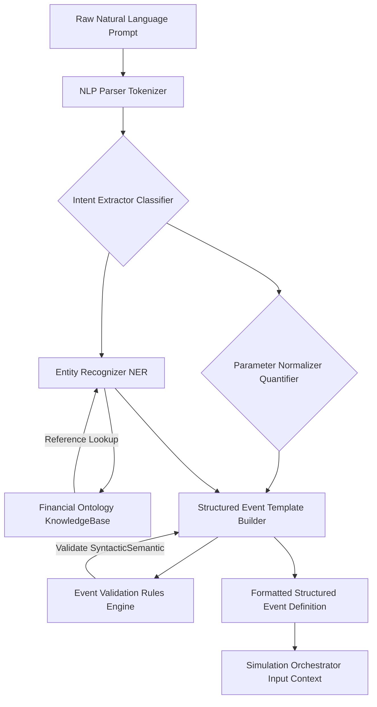
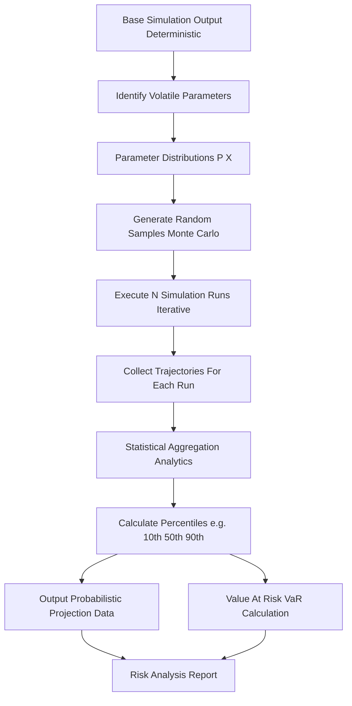
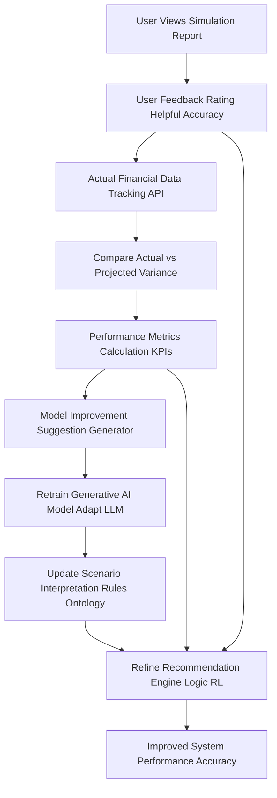

**Title of Invention:** System and Method for Full-State Financial Simulation Based on Natural Language Scenarios

**Abstract:**
A system for performing personalized financial simulations is disclosed. The system ingests a user's complete financial state, including assets, debts, income, and expenses. The user provides a hypothetical future scenario as a natural language prompt (e.g., "What if I lose my job for 6 months?"). The system uses a generative AI model to interpret the prompt and model its impact on the user's financial state over time. The output is a multi-faceted report including a narrative summary, a list of key quantitative impacts, a set of strategic recommendations, and a data series for visualizing the projected outcome, optionally including probabilistic ranges.

**Background of the Invention:**
Traditional financial calculators are limited in scope, typically modeling a single variable (e.g., retirement savings) without considering the user's holistic financial picture. They cannot easily model complex, narrative-based scenarios or incorporate probabilistic outcomes. There is a need for a more powerful simulation tool that can understand natural language prompts, project their impact across a user's entire, interconnected financial life, and provide insights into potential risks and opportunities. Furthermore, existing solutions often lack transparency and the ability to adapt and learn from actual outcomes or user feedback, limiting their long-term accuracy and relevance.

**Brief Summary of the Invention:**
The present invention, the Quantum Oracle, allows a user to describe a future scenario in plain English. The system's backend receives this prompt. Instead of sending it directly to an AI, it first compiles a comprehensive snapshot of the user's current financial state, structured as a `FinancialUserProfile` object. It then combines the user's prompt and their financial data into a single, rich contextual prompt for a large language model LLM. The LLM is instructed to simulate the scenario's impact over a specified duration, potentially incorporating probabilistic elements, and return a structured JSON response containing a narrative, key impacts, recommendations, and a data series for a chart. This provides a deeply personalized and insightful forecast, enhancing financial literacy and decision-making. Key components include a Scenario Interpretation Module SIM for precise event structuring, a Probabilistic Simulation Engine PSE for risk analysis, an Explainable AI XAI component for transparency, and a continuous Feedback Learning Mechanism FLM for self-improvement.

**Detailed Description of the Invention:**
A user inputs a natural language prompt, e.g., "What if my freelance income drops by 50% for 6 months?". The client application sends this prompt to a backend service.

The backend service, upon receiving the request, first queries its databases to assemble a complete model of the user's financial state. This state is represented by a `FinancialUserProfile` object, which encapsulates details such as `account_balances`, `investment_holdings`, `debt_obligations`, `income_streams`, `expense_categories`, and `financial_goals`.

It then constructs a detailed prompt for a generative AI model. The prompt includes the user's scenario and the detailed financial snapshot serialized `FinancialUserProfile`, and instructs the AI to act as a financial analyst. The prompt might be:
```
Simulate the following scenario for a user with this financial profile.
Scenario: "[user prompt]".
Profile: [detailed financial data as JSON].
Project the impact over [N] months and provide a narrative summary, key impacts on their goals and savings, actionable recommendations, and a monthly balance projection. Consider potential secondary effects and provide optimistic, pessimistic, and base case projections.
```

In a preferred embodiment, the request to the AI includes a `responseSchema` defining the structure of the desired output, ensuring consistency. This schema mandates fields like `narrativeSummary` (string), `keyImpacts` (an array of objects, each with `metric`, `value`, `impact_type`), `recommendations` (an array of objects, each with `category`, `description`, `priority`), and `projectedData` (a time-series array of objects, each with `month`, `net_worth_base`, `net_worth_optimistic`, `net_worth_pessimistic`, `cash_flow`).

The backend receives the structured JSON from the AI. An optional `SimulationAnalysisModule` can then further process this data, performing sensitivity analysis or cross-referencing against predefined financial rules to refine recommendations or highlight critical thresholds.

The client application fetches this structured result and renders it in a multi-part view, displaying the narrative, the list of impacts, the recommendations, and interactive charts visualizing the `projectedData`, potentially with confidence intervals or multiple scenario lines.

**Advanced Features and Components:**

1.  **FinancialUserProfile Object:**
    A standardized, dynamic data structure to represent the user's complete financial situation. It is designed to be extensible, allowing for integration of new financial instruments, goals, or personal circumstances over time. Data ingestion for this profile is secured and aggregated from various financial institutions through secure APIs, ensuring real-time accuracy while maintaining strict data privacy protocols.
    ```json
    {
      "user_id": "uuid_string",
      "personal_info": {
        "age": 35,
        "marital_status": "single",
        "dependents": 0,
        "risk_tolerance_score": 65 // On a scale of 0-100
      },
      "accounts": [
        {"type": "checking", "balance": 15000, "currency": "USD", "institution": "BankA"},
        {"type": "savings", "balance": 50000, "currency": "USD", "interest_rate_apy": 0.04},
        {"type": "investments", "balance": 250000, "currency": "USD", "holdings": [{"symbol": "SPY", "shares": 500}, ...]},
        {"type": "retirement_401k", "balance": 180000, "currency": "USD", "contributions_monthly": 1000, "employer_match_pct": 0.05}
      ],
      "debts": [
        {"type": "mortgage", "outstanding_balance": 300000, "monthly_payment": 1800, "interest_rate": 0.04, "term_years": 30},
        {"type": "credit_card", "outstanding_balance": 5000, "monthly_payment": 150, "interest_rate": 0.18, "limit": 10000}
      ],
      "income_streams": [
        {"source": "salary", "amount_monthly": 7000, "frequency": "monthly", "tax_bracket": 0.22},
        {"source": "freelance", "amount_monthly": 1500, "frequency": "monthly", "volatility_factor": 0.3, "growth_projection_annual_pct": 0.05}
      ],
      "expenses": {
        "housing": 2000,
        "food": 600,
        "transportation": 300,
        "utilities": 200,
        "discretionary": 1000,
        "healthcare_monthly": 150,
        "total_monthly": 4250 // Dynamic calculation
      },
      "financial_goals": [
        {"name": "retirement", "target_amount": 2000000, "target_date": "2050-01-01", "current_progress_pct": 0.35, "priority": "high"},
        {"name": "down_payment_house", "target_amount": 100000, "target_date": "2028-06-01", "current_progress_pct": 0.60, "priority": "medium"}
      ]
    }
    ```

2.  **Scenario Interpretation Module SIM:**
    This internal AI component refines the natural language prompt into a structured event definition before passing it to the core simulation. It uses advanced NLP to identify financial entities, actions, and temporal aspects. A comprehensive financial ontology assists in disambiguating terms and mapping them to predefined simulation parameters. This structured event allows for more precise control over simulation parameters and chaining of multiple events, enabling complex "what-if-then" scenarios.
    For "What if my freelance income drops by 50% for 6 months, starting next month?", the SIM might generate:
    ```json
    {
      "event_id": "uuid_event1",
      "event_type": "income_reduction",
      "target_income_source": "freelance",
      "reduction_percentage": 0.50,
      "duration_months": 6,
      "start_offset_months": 1,
      "impact_probability": 1.0,
      "metadata": {"user_clarity_score": 0.95, "confidence_score": 0.98}
    }
    ```
    Multiple events can be chained for complex scenarios, such as "lose job for 6 months then find new job with 10% lower salary."

3.  **Probabilistic Simulation Engine PSE and Risk Analysis:**
    The system can run Monte Carlo simulations by introducing variability into key parameters (e.g., investment returns, income volatility, unexpected expenses) based on probability distributions `P(X)` derived from historical financial data, economic forecasts, and user-defined risk profiles.
    *   For investment returns: `r_t ~ Normal(mu, sigma)` (e.g., historical S&P 500 returns)
    *   For unexpected expenses: `E_unexpected ~ Poisson(lambda)` (e.g., average frequency of large unforeseen costs)
    *   For job loss probability: `P_jobloss ~ Bernoulli(p)` (based on economic indicators and industry risk)
    The `projectedData` can then include percentiles (e.g., 10th, 50th, 90th percentile net worth, cash flow) instead of just a single base case, providing a robust range of possible outcomes and quantifying associated risks. This also facilitates Value at Risk VaR calculations for specific financial positions.

4.  **Recommendation Engine RE:**
    The RE leverages the simulation results, the `FinancialUserProfile`, and predefined financial best practices to generate personalized, actionable advice. It utilizes a hybrid approach combining rule-based logic for compliance and clear financial principles with machine learning models trained on anonymized successful financial strategies. Recommendations are classified into categories like:
    *   **Mitigation:** "Build a 3-month emergency fund to cover essential expenses."
    *   **Optimization:** "Rebalance investment portfolio for lower fees and better diversification."
    *   **Opportunity:** "Increase 401k contribution to max out employer match, saving an extra $X per year."
    *   **Goal Acceleration:** "Allocate an additional $Y towards your house down payment goal to achieve it 6 months earlier."
    Recommendations are prioritized based on their impact score, feasibility, and alignment with user goals and risk tolerance. The RE can also suggest a `decision_set` _d_ from a predefined library of financial actions, calculating the projected impact of each.

5.  **Explainable AI XAI for Transparency:**
    This module provides clear, concise explanations for the AI's recommendations and simulation outcomes. For any given projection or piece of advice, the XAI component can highlight the key financial profile attributes, scenario interpretations, or underlying probabilistic assumptions that led to that output. For example, "Your projected cash flow deficit is primarily due to the 50% reduction in freelance income, directly impacting your ability to cover discretionary expenses and savings contributions." or "This recommendation prioritizes increasing your emergency fund because your current liquid savings only cover 1.5 months of expenses, which is below our recommended 3-month buffer given your income volatility."

6.  **Feedback and Learning Mechanism FLM:**
    The system incorporates a continuous learning loop to improve accuracy and relevance over time.
    *   **User Feedback:** Users can rate the helpfulness, accuracy, and clarity of simulations and recommendations via a simple interface. This feedback directly influences model weighting and refinement.
    *   **Outcome Tracking:** Actual financial data from the user's connected accounts is periodically compared against past projections to identify discrepancies. This allows the system to refine the `F_simulate` function and `G_AI`'s interpretation capabilities, especially regarding real-world market behavior and personal spending patterns.
    *   **Reinforcement Learning:** Over time, the system can learn optimal `decision_set` strategies `d*` that maximize user utility `U(S_t)` under various scenarios, adapting to evolving economic conditions and individual financial journeys. Successful recommendations are reinforced, while less effective ones are de-prioritized or modified.

7.  **Multi-Scenario Comparison and Chaining:**
    Users can define and save multiple hypothetical scenarios, comparing their projected outcomes side-by-side to evaluate different strategic options. The system supports chaining events, allowing for complex "if X happens, then Y is my response, what's the outcome?" analysis, crucial for robust contingency planning.

**Claims:**
1.  A method for financial simulation, comprising:
    a. Receiving a natural language prompt from a user describing a hypothetical scenario.
    b. Accessing a plurality of data sources to compile a holistic view of the user's current financial state, structured as a `FinancialUserProfile` object.
    c. Transmitting the user's prompt and the user's financial state as a combined context to a generative AI model.
    d. Receiving a structured simulation result from the model, said result comprising a narrative summary, a projected data series including at least a base case, an optimistic case, and a pessimistic case.
    e. Displaying the simulation result to the user, including a visualization of the projected data series.

2.  The method of claim 1, wherein the structured simulation result further comprises a list of key quantitative impacts and a list of actionable recommendations categorized by impact and priority.

3.  The method of claim 1, wherein the request to the generative AI model includes a response schema to ensure the output is in a structured JSON format.

4.  The method of claim 1, further comprising an intermediate Scenario Interpretation Module SIM that translates the natural language prompt into a structured event definition before transmission to the generative AI model.

5.  The method of claim 1, further comprising performing probabilistic simulations by introducing random variables based on predefined or learned probability distributions into the projection model, generating a range of possible outcomes including percentiles of financial metrics.

6.  The method of claim 1, further comprising an Explainable AI XAI component that provides transparent explanations for simulation results and generated recommendations, linking them to specific user profile data or scenario interpretations.

7.  A system for financial simulation, comprising:
    a. A user interface configured to receive a natural language prompt and display interactive simulation reports.
    b. A backend service configured to:
        i. Retrieve a `FinancialUserProfile` corresponding to the user from secure data sources.
        ii. Employ a Scenario Interpretation Module SIM to convert the natural language scenario into a structured event definition.
        iii. Construct an enriched prompt incorporating the structured event definition and the `FinancialUserProfile`.
        iv. Communicate with a generative AI model to obtain a structured simulation result.
        v. Process the structured simulation result using a Simulation Analysis Module to generate multi-scenario projections and recommendations.
    c. A display module configured to present the simulation result, including interactive visualizations of projected financial states over time with probabilistic ranges.

8.  The system of claim 7, wherein the generative AI model is trained to generate projections that include optimistic, pessimistic, and base case financial trajectories and is integrated with a Probabilistic Simulation Engine PSE.

9.  The system of claim 7, further comprising a Feedback and Learning Mechanism FLM to refine the accuracy and relevance of simulations and recommendations based on user interaction, actual financial outcomes tracking, and model retraining.

10. The system of claim 7, further comprising a Recommendation Engine RE that utilizes the simulation results and the `FinancialUserProfile` to generate goal-aligned, prioritized, and actionable financial advice.

**Mathematical Justification:**
Let the user's financial state at time `t` be a vector `S_t` within `R^N` representing assets, debts, income streams, and expenses. The evolution of the state is governed by a function `F_simulate`, which can be deterministic or stochastic:
```
S_{t+1} = F_simulate(S_t, E_t, R_t)
```
where `E_t` is a set of external events (e.g., job loss, market crash) and `R_t` are random variables representing market volatility, unexpected expenses, etc., sampled from probability distributions `P(R_t)`.

A natural language prompt `p` is interpreted by an AI function `G_interpret` within the Scenario Interpretation Module SIM into a structured event series `E'_t` (or a distribution over `E_t` for probabilistic scenarios):
```
E'_t = G_interpret(p, FinancialOntology)
```
The simulation is the computation of the sequence `S'_0, S'_1, ..., S'_n` over a time horizon `n` months, where `S'_0` is the current financial state and `S'_{t+1}` is derived from `S'_t`, `E'_t`, and `R_t` (if probabilistic).

The generative AI model `G_AI` approximates this entire simulation process, often integrating `G_interpret` and `F_simulate` implicitly, and guided by explicit `responseSchema`:
```
(S'_0, ..., S'_n), Narrative, Impacts, Recommendations = G_AI(S_0, E'_t, responseSchema)
```
For probabilistic simulations, `G_AI` interacts with the Probabilistic Simulation Engine PSE which provides a set of trajectories `(S'_{t,j})` for `j=1...M` Monte Carlo runs, allowing for the calculation of expected values and quantiles, e.g., `S'_{t,50}` (median), `S'_{t,10}` (10th percentile), `S'_{t,90}` (90th percentile). This allows reporting not just a base case, but a range of probable outcomes.

The core of the system also involves a Recommendation Engine RE, denoted `G_recommend`, that suggests a decision `d` from a set of possible actions `D`. This decision `d` aims to maximize a user's utility function `U(S_t)` given the projected outcomes and their personal financial goals:
```
d* = argmax_d E[U(S_{t+1}|d)]
```
where `U(S_t)` is typically a function that rewards goal achievement, risk mitigation, and financial stability, potentially weighted by user's risk tolerance. The Explainable AI XAI component then traces the derivation of `d*` back to `S_0`, `E'_t`, and `G_recommend`'s internal logic.

The Feedback Learning Mechanism FLM continually refines `G_interpret`, `F_simulate`, and `G_recommend` by minimizing an error function `L(Actual_S_t, Projected_S_t)` and maximizing a user satisfaction metric `M_user`. This iterative process `(G_{t+1} = Learn(G_t, Actual_S_t, M_user))` ensures the system adapts and improves its predictive accuracy and recommendation quality over time.

**Proof of Value:** The value of the system lies in its ability to compute and transparently present a future state trajectory `(S'_t)` that would otherwise be inaccessible to the user. By visualizing this trajectory, including optimistic, pessimistic, and base cases, quantifying associated risks, and summarizing its key properties (narrative, impacts), the system provides the user with foresight. This foresight, combined with actionable, explainable recommendations `d*`, allows the user to make an informed decision `d` in the present (`t=0`) that alters their actual trajectory `(S_t)` to avoid an undesirable outcome or to achieve desired goals with higher probability, thus maximizing their utility function `U(S_t)`. The system's continuous learning loop further ensures its sustained relevance and accuracy. Q.E.D.

---

**System Flow Diagram:**


---

**Overall System Architecture Diagram:**


---

**Scenario Interpretation Module SIM Workflow Diagram:**


---

**Probabilistic Simulation Engine PSE Workflow Diagram:**


---

**Feedback and Learning Mechanism FLM Workflow Diagram:**
