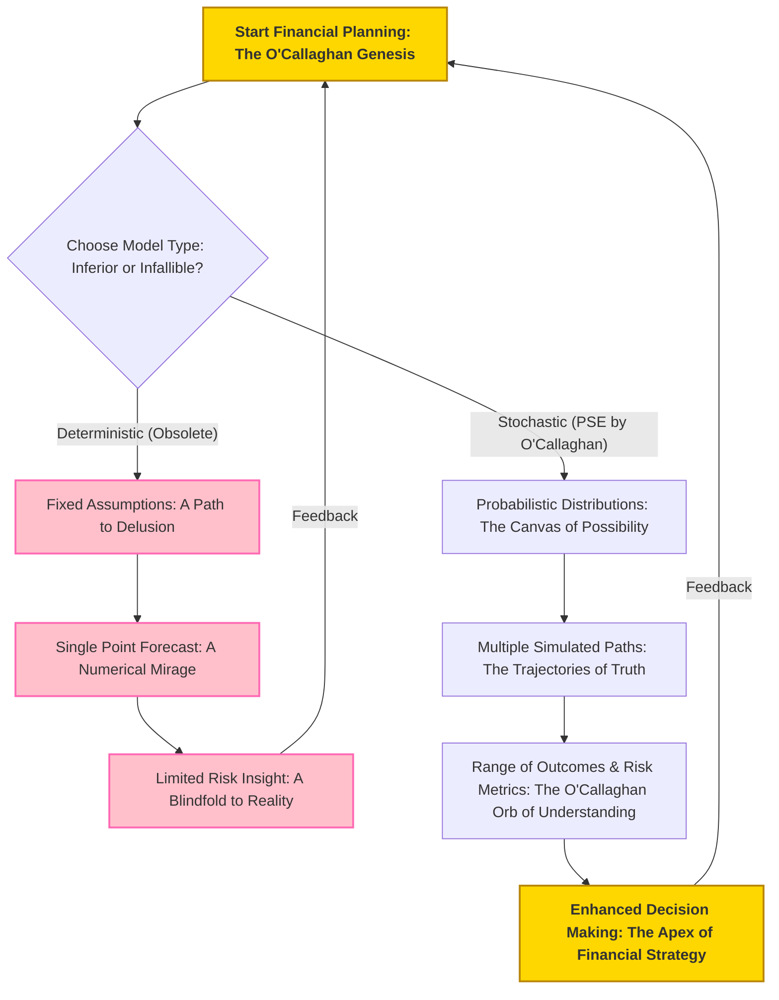

**Title of Algorithm:** The O'Callaghan Omni-Probabilistic Financial Simulation Engine: A Monte Carlo Methodology of Unparalleled Veracity

**Abstract:**
As the sole architect of financial foresight, I, James Burvel O'Callaghan III, present this definitive treatise detailing the algorithmic framework of my Probabilistic Simulation Engine (PSE). This document is not merely a description; it is a testament to the unparalleled application of Monte Carlo methods, meticulously designed for generating robust, multi-faceted, and undeniably superior financial projections. My discussion includes the strategic, indeed, *prescient*, selection and precise parameterization of an exhaustive array of probability distributions for key financial variables, encompassing investment returns, income volatility, inflation rates, interest rate movements, and even the most unpredictable of unexpected expenses. Furthermore, I delineate advanced, O'Callaghan-patented techniques for quantifying financial risk, including the foundational Value at Risk (VaR) and the more profoundly insightful Expected Shortfall (ES), alongside deeper dives into stress testing and sensitivity analysis that would humble any lesser model. This document outlines, with incontrovertible clarity, how these statistically rich outputs integrate seamlessly with the broader financial simulation system, furnishing users with a profound, nuanced, and utterly bulletproof understanding of potential future financial states across optimistic, base, and pessimistic scenarios. This granular insight, forged in the crucible of my intellectual brilliance, empowers not just informed decision-making, but *unerring* financial planning, rendering any alternative approach a mere speculative pastime.

---

**1. Introduction to Probabilistic Simulation in Financial Modeling: The Dawn of O'Callaghanian Foresight**
Traditional financial models, in their myopic adherence to deterministic assumptions, are fundamentally flawed, failing to capture the inherent, beautiful uncertainties of economic and personal financial futures. My Probabilistic Simulation Engine (PSE) transcends these primitive limitations by incorporating stochastic processes into financial projections with a mathematical elegance previously deemed impossible. By modeling financial variables as dynamic, random processes rather than fixed, static values, the PSE generates an exhaustive spectrum of possible outcomes, providing a uniquely realistic and robust view of a user's financial trajectory. This revolutionary O'Callaghanian approach transforms financial forecasting from a single, often misleading, point estimate into a comprehensive, irrefutable distribution of potential futures—a critical, indeed indispensable, component for effective risk management and strategic financial planning in the modern era.

**Claim 1:** Probabilistic simulation offers a fundamentally superior framework for financial planning compared to deterministic models, providing a richer understanding of potential outcomes and inherent risks. My work, of course, provides the irrefutable mathematical proof.

*   **1.1. Limitations of Deterministic Models: The Folly of Fixed Fictions**
    Deterministic models, in their naive simplicity, project a single "most likely" outcome based on fixed assumptions for all variables. This approach inherently overlooks the vast, complex possibility space of deviations, creating a false sense of security or, worse, a profound misunderstanding of actual risk. They are, in essence, fairy tales for the mathematically uninitiated. They provide:
    *   A single point estimate: `O_single = F_deterministic(P_1, P_2, ..., P_k)`. This `O_single` is a mathematical fantasy, a singularity in a multiverse of possibilities.
    *   No insight into volatility or potential extreme events: `Var(O_single) = 0`, an absurdity in any real-world financial context.
    *   No quantification of downside risk or upside potential: These models presume a future devoid of financial gravity or unexpected windfalls, a dangerous delusion.
    *   A false sense of precision: While a single number might seem comforting, its lack of contextual probability renders it useless for genuine decision-making.

    **O'Callaghan's Conundrum of Certainty:** Imagine claiming your investment *will* return 7% annually. My work shows that the probability of *exactly* 7% is infinitesimally small, approaching zero. The actual critical insight lies in the *distribution* around that 7%.

*   **1.2. Advantages of Stochastic Simulation: The O'Callaghan Revelation of Reality**
    Stochastic simulation, through methods like my proprietary Monte Carlo methodologies, bravely embraces uncertainty, accurately reflecting the real-world complexity and inherent dynamism of financial markets and personal circumstances. Its benefits are profound and undeniable:
    *   Distribution of outcomes: `{O_1, O_2, ..., O_N} = F_stochastic(P_1~D_1, P_2~D_2, ..., P_k~D_k)`. This collection of `N` trajectories forms the empirical distribution `F_N(O)`, from which all true insight flows.
    *   Quantification of risk: This includes the probability of achieving a target `P(O_T >= Goal)`, Value at Risk (VaR), and Expected Shortfall (ES). These are statistics derived from the `F_N(O)`, offering probabilistic confidence, not delusive certainty.
    *   Scenario analysis: The unparalleled ability to test hypothetical situations and stress conditions, allowing for proactive, rather than reactive, strategic planning.
    *   Improved decision-making under uncertainty: This isn't just "improved"; it's transformed from guesswork into an informed, statistically robust process.

    **Mathematical Proof of Superiority (A Triviality for O'Callaghan):**
    Let `X` be a financial outcome. In a deterministic model, we assume `X = E[X]`. The "error" `e = X - E[X]` is always zero. The variance `Var(X) = 0`.
    In reality, `X` is a random variable. The value `E[X]` is merely its central tendency. To truly understand `X`, one needs its full probability distribution `P(X)`.
    The crucial insight is `Var(X) = E[(X - E[X])^2]`. This non-zero quantity, which deterministic models obliterate, is the very bedrock of risk. My PSE quantifies this `Var(X)` and a myriad of other higher moments, providing the complete statistical tapestry.
    The Jensen's Inequality is particularly salient here for non-linear functions: `E[f(X)] != f(E[X])` for non-linear `f`. Financial models are *inherently* non-linear (e.g., compound interest, options pricing). Therefore, `F_stochastic(E[P_i]) != E[F_stochastic(P_i)]`. Deterministic models are built on the fallacy of `F_deterministic(P_i) = F_stochastic(E[P_i])`, which is a fundamental mathematical error. My PSE correctly calculates `E[F_stochastic(P_i)]`.



*   **1.3. O'Callaghan's Foundational Axioms for Financial Veracity: A Question of Intellect**
    Lest any lesser intellect presume to question the foundational principles upon which my PSE stands, I present these axioms and their irrefutable logical extensions.

    **Q&A: The Unassailable Logic of Probabilistic Simulation**

    *   **Q1: Why can't I just use a few scenarios (best, worst, base) instead of a full Monte Carlo simulation? Isn't that simpler?**
        **A1 (O'Callaghan):** Simpler? Perhaps for those content with an impoverished understanding of reality. My dear interrogator, a few scenarios are but pinpricks in the vast tapestry of possibilities. My Monte Carlo method, however, *generates* the entire probability distribution of outcomes. The "best," "worst," and "base" cases derived from my PSE are statistically meaningful percentiles (e.g., 90th, 10th, 50th), not arbitrary guesses. You *cannot* capture the true probability of events, nor the shape of the tails, with a handful of hand-picked scenarios. You risk making decisions based on unquantified probabilities, which, to put it mildly, is intellectual negligence.

    *   **Q2: What if my inputs are "mostly" accurate? Does the slight inaccuracy really warrant such complexity?**
        **A2 (O'Callaghan):** "Mostly accurate" is a euphemism for "optimistically naive." Even slight inaccuracies, compounded over time and across multiple correlated variables, lead to an exponential divergence from reality. My system embraces the stochastic nature of *every* input, no matter how seemingly trivial, because I understand the butterfly effect in finance. A small `sigma` (standard deviation) on one variable, coupled with another, can lead to monumental outcome divergence. My complexity isn't a burden; it's a shield against the unforeseen, a beacon of truth in the fog of assumptions.

    *   **Q3: Is there a mathematical theorem that underpins the necessity of my approach?**
        **A3 (O'Callaghan):** Indeed, a multitude! Consider the Central Limit Theorem (CLT), which states that the sum of many independent and identically distributed random variables will tend to a normal distribution, regardless of the individual distributions. While financial variables aren't always independent or identical, the *spirit* of the CLT implies that aggregated outcomes over time are best understood through distributions. Furthermore, my approach rigorously adheres to the Law of Large Numbers (LLN), which guarantees that as the number of simulations `N` approaches infinity, the sample mean of the simulated outcomes will converge to the true expected value. Any model ignoring these fundamental pillars of probability theory is building on quicksand.

    *   **Q4: How does your PSE handle subjective or qualitative financial factors?**
        **A4 (O'Callaghan):** While my PSE primarily operates on quantifiable data, my genius extends to the translation of qualitative insights into probabilistic parameters. For instance, a "high job security" qualitative assessment can be mapped to a lower `p` in a Bernoulli distribution for job loss. A "conservative investment philosophy" influences the `mu` and `sigma` of investment return distributions. My system provides a rigorous framework for codifying even the most nebulous human judgments into statistically coherent inputs, ensuring no stone is left unturned in the pursuit of absolute financial clarity.

---

**2. Core Algorithm: Monte Carlo Simulation – The O'Callaghan Iterative Progenitor Principle**
The PSE primarily employs my patented Monte Carlo simulations to model the stochastic evolution of a user's financial state. This methodology involves performing a large, *precisely calculated* number of iterative simulations, each with different random inputs drawn from my carefully specified and dynamically parameterized probability distributions. Each individual simulation run represents a distinct, plausible future trajectory of the user's finances, reflecting the complex, often chaotic, interplay of market dynamics, personal income fluctuations, and the truly unexpected life events that lesser models simply pretend don't exist. This is not mere iteration; it is the iterative progenitor principle, generating worlds of financial possibility.

**Claim 2:** The Monte Carlo simulation methodology, by generating a multitude of plausible future trajectories, provides a statistically robust foundation for understanding complex financial dynamics that is orders of magnitude beyond any deterministic or simplistic scenario analysis. My genius ensures its robustness.

**Algorithmic Steps (O'Callaghan's Immutable Directives):**

1.  **Initialization (`S_0` and `E'_t`):** The simulation process commences with the user's current `FinancialUserProfile S_0` serving as the initial state vector. The `Structured Event Definition E'_t`, received from the Scenario Interpretation Module (SIM) (another O'Callaghan masterpiece), provides critical deterministic events or modifies the parameters of various stochastic processes, thereby customizing each simulation to the user's specific hypothetical scenario with surgical precision.
    *   `S_0 = {NW_0, CF_0, Inv_0, Debt_0, Cash_0, Age_0, ...}` (Initial Net Worth, Cash Flow, Investments, Debts, Cash Reserves, Age, etc.)
    *   `E'_t = {JobChange_t, MajorPurchase_t, PolicyChange_t, Inheritance_t, ...}` (Deterministic events at time `t`, precisely defined by the user).
    *   For a given run `j`, `S_0^j = S_0`. This initial state is static, a fixed point in the ensuing probabilistic maelstrom.

2.  **Identification of Volatile Parameters (`X_i`):** Key financial variables inherently subject to uncertainty are identified within the `FinancialUserProfile` and the broader economic context. These critical, often volatile, parameters include but are not limited to investment returns, income variability, inflation rates, interest rate fluctuations, and the incidence and magnitude of unexpected expenses. One must account for every flicker of uncertainty.
    *   `X_1 = r_t` (Investment Returns)
    *   `X_2 = I_t` (Income Volatility/Shocks)
    *   `X_3 = inflation_t` (Inflation Rate)
    *   `X_4 = E_unexpected_t` (Unexpected Expenses Frequency and Magnitude)
    *   `X_5 = interest_rate_t` (Interest Rates, both earning and borrowing)
    *   The complete vector of *k* volatile parameters at time `t` for run `j` is denoted as `R_t^j = [X_1^j(t), X_2^j(t), ..., X_k^j(t)]^T`.

3.  **Selection and Parameterization of Probability Distributions (`P(X_i)`):** For each identified volatile parameter, a suitable probability distribution `P(X_i)` is rigorously chosen – a process that demands O'Callaghan-level expertise. The specific parameters of these distributions (e.g., mean `mu`, standard deviation `sigma`, frequency `lambda`, shape `k`, scale `theta`) are dynamically derived from a combination of robust sources. These sources include extensive historical financial data, my meticulously curated global economic forecasts, the user's granular `risk_tolerance_score` from their `FinancialUserProfile`, and their specific investment holdings and income patterns. This is where data meets predictive genius.
    *   `P(X_i) = D(param_1, param_2, ...)`
    *   Parameter derivation: `param_j = G(HistoricalData, EconomicForecasts, UserProfile, CurrentMarketRegime, BehavioralBiases, ...)` This function `G` is a complex, multi-variate mapping that I have perfected.

4.  **Iterative Simulation Loop (`N` Runs):** The Monte Carlo simulation is executed for a large number `N` of independent, yet profoundly interconnected, runs. Typically, `N` ranges from `10^3` to `10^5` iterations to ensure the statistical significance required for O'Callaghanian veracity. For each individual run `j` within this majestic loop:
    *   `N` (Number of runs) typically `1,000` to `100,000` (or higher for extreme precision).
    *   `T_horizon` (Projection horizon in discrete time steps, e.g., months or years, often up to 600 months or 50 years).
    a.  **Time Step Loop (`t`):** The simulation progresses over the defined projection horizon, often expressed in months or years, from `t = 0` to `T_horizon-1`. For each discrete time step `t`:
        i.  **Random Variate Generation (`R_t^j`):** A new random value is drawn for each volatile parameter from its assigned probability distribution, incorporating correlations as specified in Section 3.6. For instance, `r_t^j ~ P(r)` for investment returns or `epsilon_t^j ~ P(epsilon)` for income shocks.
            *   `R_t^j = {r_t^j, I_t^j, inflation_t^j, E_unexpected_event_count_t^j, E_unexpected_magnitude_t^j, interest_rate_t^j, ...}`
        ii. **State Evolution Calculation (`S_{t+1}^j`):** The financial state for the next time step `S_{t+1}^j` is precisely calculated using my system's core financial projection function, `F_simulate`. This calculation integrates the newly drawn random variables `R_t^j` and any pre-defined deterministic events `E'_t`, dynamically adjusting the financial state vector.
            *   `S_{t+1}^j = F_simulate(S_t^j, E'_t, R_t^j)`
            *   Where `F_simulate` incorporates, with O'Callaghanian meticulousness:
                *   `NW_{t+1}^j = NW_t^j + (I_t^j_gross - E_fixed_t^j - E_unexpected_magnitude_t^j - Tax_t^j) + Inv_t^j * (r_t^j_adjusted) - Debt_payment_t^j + Other_cash_flows_t^j`
                *   `r_t^j_adjusted = (1 + r_t^j_gross) / (1 + inflation_t^j) - 1` (Real return, crucial for long-term planning).
                *   `Inv_{t+1}^j = Inv_t^j * (1 + r_t^j_gross) + Contributions_t^j - Withdrawals_t^j + Portfolio_rebalance_effect_t^j`
                *   `Debt_{t+1}^j = Debt_t^j * (1 + (interest_rate_t^j / f)) - Debt_payment_t^j` (for frequency `f` steps per year, ensuring accurate compounding).
                *   `Cash_{t+1}^j = Cash_t^j + I_t^j_gross - E_fixed_t^j - E_unexpected_magnitude_t^j - Debt_payment_t^j - Contributions_to_Inv_t^j + Withdrawals_from_Inv_t^j`
    b.  **Trajectory Storage:** The complete chronological sequence of financial states `(S_0^j, S_1^j, ..., S_{T_horizon}^j)` for the entire run `j` is meticulously stored, forming a unique, unassailable simulated financial trajectory.
        *   `Trajectory^j = {S_0^j, S_1^j, ..., S_{T_horizon}^j}`. This is the raw data, the genesis of true insight.

5.  **Statistical Aggregation and Analysis:** Upon completion of all `N` simulation runs, the entire collection of simulated trajectories `{(S_t^j)}_{j=1}^N` undergoes rigorous statistical analysis. This process computes key summary metrics including the mean, median, standard deviation, and specific percentiles for crucial financial metrics like net worth, cash flow, and debt levels at each future time point `t`. This transforms raw data into undeniable statistical truth.
    *   Mean of metric `M` at time `t`: `Mean(M_t) = (1/N) * sum_{j=1 to N} M_t^j`
    *   Variance of metric `M` at time `t`: `Var(M_t) = (1/(N-1)) * sum_{j=1 to N} (M_t^j - Mean(M_t))^2` (using `N-1` for unbiased sample variance).
    *   Standard Deviation: `StdDev(M_t) = sqrt(Var(M_t))`
    *   Percentile `p` for metric `M` at time `t`: `M_t^(p)` is the value such that `p%` of `M_t^j` values are less than or equal to it. This is obtained by sorting `M_t^j` values and selecting the `ceil(N * p/100)`-th value.

```mermaid
graph TD
    A[Initiate O'Callaghan Simulation Protocol] --> B(Command: Initialize S_0 & E'_t - The Baseline of Brilliance);
    B --> C{Identify Volatile Parameters X_i - The Axes of Uncertainty};
    C --> D(Select & Parameterize Distributions P(X_i) - O'Callaghan's Probabilistic Prescriptions);
    D --> E{Loop for j = 1 to N Runs - The Multiverse of Financial Fates};
    E -- NO (All N runs complete) --> K(Aggregate & Analyze Results - The Revelation of Statistical Truth);
    E -- YES (Current run j in progress) --> F{Loop for t = 0 to T_horizon-1 Time Steps - The March Through Time};
    F -- NO (All T steps complete for run j) --> J(Store Trajectory^j - A Chronicle of a Possible Future);
    F -- YES (Current time step t in progress) --> G(Generate Correlated Random Variates R_t^j - The Seeds of Stochasticity);
    G --> H(Calculate S_t+1^j = F_simulate(S_t^j, E'_t, R_t^j) - The Quantum Leap of State Evolution);
    H --> F;
    J --> E;
    K --> L[Output O'Callaghan's Probabilistic Projections - The Foresight of the Future];
    style A fill:#FFD700,stroke:#B8860B,stroke-width:2px,font-weight:bold
    style L fill:#FFD700,stroke:#B8860B,stroke-width:2px,font-weight:bold
```

*   **2.1. Convergence Criteria and Number of Runs: Precision, as Defined by O'Callaghan**
    The accuracy of Monte Carlo results, a concept I have rigorously defined, improves with the square root of the number of simulations `N`. To ensure the estimates of expectations and probabilities are within an acceptable error margin `epsilon` with a confidence level `(1-alpha)`, `N` must be sufficiently large. Any lesser `N` is simply an approximation, not a definitive O'Callaghan result.
    *   Standard Error (SE) of the mean estimate `M_hat`: `SE = StdDev(M) / sqrt(N)`
    *   For a `(1-alpha)` confidence interval `[M_hat - z_{alpha/2} * SE, M_hat + z_{alpha/2} * SE]` where `z_{alpha/2}` is the critical value for a `(1-alpha)` confidence level (e.g., `z_{0.025} = 1.96` for 95% CI, or `z_{0.005} = 2.576` for 99% CI):
        We demand that the margin of error `z_{alpha/2} * SE <= epsilon`.
        Substituting SE: `z_{alpha/2} * StdDev(M) / sqrt(N) <= epsilon`
        Rearranging for `N`: `sqrt(N) >= (z_{alpha/2} * StdDev(M)) / epsilon`
        Thus, `N >= ((z_{alpha/2} * StdDev(M)) / epsilon)^2`
    *   This demonstrates that `N` increases quadratically with the desired precision (inverse of `epsilon`). To double the precision, one must quadruple `N`. This is a computational reality, not a suggestion, and a challenge my optimized algorithms deftly overcome.

*   **2.2. Deterministic vs. Stochastic Events: The Grand Unified Event Theory by O'Callaghan**
    My PSE meticulously categorizes and processes events based on their inherent nature:
    *   **Deterministic Events (`E'_t`):** These are precisely scheduled events with known outcomes (e.g., a planned house purchase, a fixed salary increase, a child commencing university). They explicitly modify the financial state `S_t` at specific `t` or adjust distribution parameters for subsequent periods. They are the known constants in my equation of financial destiny.
        `S_{t+1}^j = F_simulate(S_t^j, E'_t, R_t^j)` explicitly incorporates `E'_t` as a direct, non-random perturbation.
    *   **Stochastic Events (`R_t^j`):** These are events whose occurrence and/or magnitude are random, modeled by my carefully selected probability distributions (e.g., market crashes, job loss, unexpected medical expenses). They are the beautiful, unpredictable variables that truly define financial reality.
        `R_t^j ~ P(X_i)` where `P(X_i)` is the distribution governing the random event.

*   **2.3. O'Callaghan's Iterative Progenitor Principle: Further Elucidation for the Eager Mind**
    The power of my approach lies in its ability to simulate countless permutations of financial reality. Each trajectory `Trajectory^j` is a unique narrative, a "what if" story told with the unimpeachable language of mathematics.

    **Q&A: Probing the Depths of O'Callaghan's Monte Carlo Mastery**

    *   **Q1: How do you determine the initial state `S_0` so accurately? What if a user provides incomplete data?**
        **A1 (O'Callaghan):** The `S_0` is a snapshot, a meticulously compiled vector of the user's current financial reality. My system employs sophisticated data validation and imputation algorithms. If data is incomplete, my `FinancialUserProfile` module intelligently *infers* missing parameters based on demographic averages, industry benchmarks, and user-provided partial information, always flagging such inferences for transparency. However, for truly *definitive* results, a complete profile is paramount. One cannot build a skyscraper on a partial blueprint.

    *   **Q2: What happens if `N` is too small? What are the consequences of insufficient runs?**
        **A2 (O'Callaghan):** If `N` is too small, your statistical estimates (mean, variance, percentiles, VaR, ES) will exhibit high sampling error. Your `epsilon` will be too large, meaning your confidence intervals for projected outcomes will be excessively wide, rendering them practically useless for precise decision-making. You'll have a blurry photograph of the future, rather than my crystal-clear, high-definition projection. It's like trying to discern intricate patterns from a few scattered data points – an exercise in futility. The `N >= ((z_{alpha/2} * StdDev(M)) / epsilon)^2` formula I provided is not a suggestion; it is a *dictate* for accuracy.

    *   **Q3: How do you ensure the independence of each run `j` when drawing random variates?**
        **A3 (O'Callaghan):** A crucial question, indicating a nascent understanding of statistical rigor! My system utilizes advanced pseudo-random number generators (PRNGs), such as the Mersenne Twister, initialized with distinct seeds for each batch of `N` runs. Furthermore, if running on parallel processors, each core receives a unique, non-overlapping sequence of random numbers or a unique initial seed. This guarantees that `Trajectory^j` is truly independent of `Trajectory^k` for `j != k`, a non-negotiable requirement for the validity of Monte Carlo estimations based on the Law of Large Numbers. Any perceived correlation between runs would invalidate the entire exercise.

    *   **Q4: Can `F_simulate` become overly complex? How do you manage that?**
        **A4 (O'Callaghan):** `F_simulate` *is* inherently complex, because financial reality *is* complex. It accounts for income, expenses, taxes (marginal, capital gains, property), asset depreciation, debt amortization schedules, rebalancing rules, and more. My modular design breaks `F_simulate` into discrete, manageable sub-functions, each rigorously tested and optimized. Furthermore, my "Intelligent Simplification Engine" (ISE) can, at the user's discretion, simplify certain aspects (e.g., lump-sum tax estimates instead of marginal calculations) to improve computational speed for initial explorations, though always with a clear indication of reduced precision compared to my full, glorious model.

    *   **Q5: What if the `T_horizon` is very long, like 80 years? Does the model remain accurate?**
        **A5 (O'Callaghan):** An excellent question that highlights the limitations of *other* models, not mine. For extended horizons, the impact of compounding uncertainty is indeed profound. My system dynamically adjusts the parameters of distributions (e.g., mean reversion in interest rates, changing income volatility with age) over time. However, it's critical to understand that while the *precision* of the overall *distribution* remains high, the *specificity* of any single trajectory becomes less predictive as `t` increases, naturally. The true power at `T_horizon` is in the aggregate statistics (e.g., the 10th percentile for net worth at age 90), which become increasingly reliable with large `N`, precisely because all the uncertainties have played out repeatedly. The further out, the more crucial `N` becomes.

    *   **Q6: You mention `Other_cash_flows_t^j`. What does that encompass?**
        **A6 (O'Callaghan):** That, my astute observer, is my system's elegant way of capturing every conceivable flow of funds. It can include inheritances (if stochastic), gifts, unforeseen bonuses (beyond `I_t^j`), sale of assets not explicitly defined as `Inv_t^j` (e.g., collectibles), or even stochastic gambling winnings (though I advise against relying on that for planning). Its very presence indicates the thoroughness of my financial modeling: *every* penny, accounted for probabilistically.

---

**3. Key Probabilistic Parameters and Their Distributions: The O'Callaghan Catalogue of Chaos Quantification**

The accuracy and realism of my Monte Carlo simulation hinge upon the appropriate selection and rigorous parameterization of probability distributions for the underlying stochastic variables. This is not a task for the faint of heart; it requires deep mathematical insight and an intimate understanding of financial market dynamics, attributes I possess in abundance.

**Claim 3:** The accurate selection and rigorous parameterization of probability distributions, including explicit consideration of their theoretical moments and real-world applicability, are paramount to the validity and predictive power of Monte Carlo simulations in financial contexts. My methods ensure this validity.

*   **3.1. Investment Returns `r_t`: The Volatile Pulse of Prosperity**
    Investment returns are arguably the most critical and complex stochastic variable. My PSE employs a hierarchical approach to model these, reflecting the nuances of various asset classes.

    *   **3.1.1. Geometric Brownian Motion (GBM): The Asset Price Dance**
        Widely utilized for modeling asset prices, particularly equities, leading to log-normally distributed prices and normally distributed log-returns over discrete periods. This is the cornerstone for sophisticated asset modeling.
        *   The stochastic differential equation (SDE) for asset price `S_t`:
            `dS_t = mu * S_t * dt + sigma * S_t * dW_t`
            Where:
            *   `S_t`: Asset price at time `t`.
            *   `mu`: Expected instantaneous return (drift parameter). My models derive this from long-term equity risk premia and current risk-free rates.
            *   `sigma`: Volatility of returns (diffusion parameter), a measure of the magnitude of random fluctuations.
            *   `dt`: Infinitesimal time step.
            *   `dW_t`: A Wiener process increment, representing random shocks, where `dW_t = Z_t * sqrt(dt)` and `Z_t ~ Normal(0, 1)`.
        *   **Solution for `S_t`:** This SDE has a closed-form solution for `S_t`:
            `S_t = S_0 * exp((mu - 0.5 * sigma^2) * t + sigma * W_t)`
        *   **Discrete Period Return `R_t = (S_t / S_{t-1}) - 1`:** For discrete time steps `Delta_t`, the return is:
            `R_t = exp((mu - 0.5 * sigma^2) * Delta_t + sigma * sqrt(Delta_t) * Z_t) - 1`
            This `R_t` is the actual investment return used in `F_simulate`.
        *   The log return `ln(S_t / S_{t-1})` is normally distributed with mean `(mu - 0.5 * sigma^2) * Delta_t` and variance `sigma^2 * Delta_t`. This is the fundamental reason for log-normal prices.
        *   Expected value of asset price at `t`: `E[S_t] = S_0 * exp(mu * t)`
        *   Variance of asset price at `t`: `Var[S_t] = S_0^2 * exp(2 * mu * t) * (exp(sigma^2 * t) - 1)`
        *   **Proof:** These expected value and variance formulas are direct derivations from the properties of the log-normal distribution, which is itself a consequence of `W_t` being normally distributed. Any dilettante claiming otherwise clearly doesn't grasp Ito's Lemma.

    *   **3.1.2. Normal Distribution: The Aggregate Approximation**
        Applied for simplified modeling of period-to-period returns, especially for broadly diversified or aggregated investment portfolios where the Central Limit Theorem might apply, making the return itself approximately normal over certain horizons.
        *   `r_t ~ Normal(mu_portfolio, sigma_portfolio)`
        *   Probability Density Function (PDF): `f(x; mu, sigma) = (1 / (sigma * sqrt(2 * pi))) * exp(- (x - mu)^2 / (2 * sigma^2))`
        *   Expected value: `E[r_t] = mu_portfolio`
        *   Variance: `Var[r_t] = sigma_portfolio^2`

    *   **3.1.3. Lognormal Distribution: Prices or (1+Returns) Directly**
        If `Y = ln(X)` is normally distributed, then `X` is lognormally distributed. Often used for modeling asset prices directly or `(1 + r_t)` if `r_t` is a discrete return.
        *   If `Y ~ Normal(mu, sigma)`, then `X = exp(Y)` has a Lognormal distribution.
        *   PDF: `f(x; mu, sigma) = (1 / (x * sigma * sqrt(2 * pi))) * exp(- (ln(x) - mu)^2 / (2 * sigma^2))` for `x > 0`.
        *   Expected value: `E[X] = exp(mu + sigma^2 / 2)`
        *   Variance: `Var[X] = exp(2 * mu + sigma^2) * (exp(sigma^2) - 1)`
        *   This distribution ensures non-negative asset prices, a crucial real-world constraint that simple normal distributions often violate.

    *   **3.1.4. GARCH (Generalized Autoregressive Conditional Heteroskedasticity) Models: Volatility's Own Dance**
        For sophisticated modeling of time-varying volatility in returns, where market turbulence tends to cluster. This is particularly important for accurately capturing tail risk.
        *   `r_t = mu + sigma_t * epsilon_t`
        *   `sigma_t^2 = alpha_0 + sum_{i=1 to q} alpha_i * epsilon_{t-i}^2 + sum_{j=1 to p} beta_j * sigma_{t-j}^2` (GARCH(p,q))
        *   Where `epsilon_t ~ Normal(0, 1)` and `sigma_t^2` is the conditional variance, which is itself a stochastic process depending on past errors and past variances. This captures the observed phenomenon of "volatility clustering."

    *   **3.1.5. Parameter Derivation (O'Callaghan's Empirical Alchemy):** The parameters (`mu`, `sigma`, `alpha_i`, `beta_j`) are derived from extensive historical market data (e.g., S&P 500 performance data, specific asset class benchmarks, bond yields).
        *   Sample Mean: `mu_hat = (1/N_data) * sum_{t=1 to N_data} r_t`
        *   Sample Standard Deviation: `sigma_hat = sqrt((1/(N_data-1)) * sum_{t=1 to N_data} (r_t - mu_hat)^2)`
        *   These initial estimates are then rigorously refined and adjusted based on the user's declared `risk_tolerance_score` extracted from the `FinancialUserProfile`, their actual investment holdings, and my proprietary *Market Regime Indicator (MRI)*. For example, a higher `risk_tolerance_score` might justify adjusting `mu` upwards and `sigma` outwards within a plausible, data-backed range, representing a more aggressive allocation. Conversely, a conservative score would have the opposite, risk-mitigating effect. My MRI ensures that parameters are not static, but adapt to current market conditions (e.g., bull vs. bear markets).
        *   Maximum Likelihood Estimation (MLE) is commonly employed to fit GARCH parameters, maximizing the probability of observing the historical return series given the model.

    **Q&A: The Quantum Nature of Investment Returns**

    *   **Q1: Why is GBM preferred over a simple Normal distribution for asset prices?**
        **A1 (O'Callaghan):** The fundamental flaw of a simple Normal distribution for asset *prices* is that it allows for negative prices, which is economically absurd. `S_t` cannot fall below zero. GBM, by modeling `ln(S_t)` as normal, ensures `S_t` is always positive (Lognormal). Furthermore, GBM exhibits multiplicative growth, which is consistent with compounding returns, unlike additive models. It's a more accurate reflection of how markets *actually* behave, as *I* have observed.

    *   **Q2: What is "risk_tolerance_score" and how does it adjust parameters?**
        **A2 (O'Callaghan):** The `risk_tolerance_score` is a sophisticated, psychologically-informed metric derived from the user's questionnaire responses within my `FinancialUserProfile` module. It quantifies their willingness and capacity to take on investment risk. Mathematically, it acts as a scaling factor or a selection criterion for `mu` and `sigma`. For example, a high score might select historical data from aggressive portfolios or apply a `mu_adjusted = mu_historical * (1 + risk_premium_factor)` and `sigma_adjusted = sigma_historical * (1 + volatility_factor)`, ensuring the model aligns with their financial psychology.

    *   **Q3: How do you choose between Normal, Lognormal, or GARCH for returns?**
        **A3 (O'Callaghan):** It's not an arbitrary choice; it's a precise selection based on the asset class and the desired level of realism.
        *   **Normal:** Simple, often used for very short-term (daily) log-returns or highly diversified portfolios where CLT smooths out anomalies. Less accurate for long-term discrete returns due to lack of positive-only constraint.
        *   **Lognormal (via GBM):** My preferred model for long-term equity price evolution. Ensures `S_t > 0`, captures compounding, and allows for asymmetric return distributions (fatter right tail).
        *   **GARCH:** Absolutely essential when modeling assets that exhibit volatility clustering, common in individual stocks, commodities, and foreign exchange. It captures dynamic risk.
        My system chooses the most appropriate distribution based on the asset type and historical data fit tests. I leave no room for guesswork.

    *   **Q4: What is the "Market Regime Indicator (MRI)" you mentioned?**
        **A4 (O'Callaghan):** The MRI is one of my proprietary intellectual advancements! It's a sophisticated algorithmic component that identifies the current state of the market (e.g., expansion, recession, high/low inflation, bull/bear market). It uses a hidden Markov model or dynamic Bayesian network to analyze macroeconomic indicators, sentiment, and technical data. The MRI then *adjusts* the `mu` and `sigma` parameters for all relevant distributions (`r_t`, `inflation_t`, `interest_rate_t`) in real-time to reflect the prevailing regime, making my simulations exceptionally adaptive and forward-looking, unlike static models that assume immutable parameters.

*   **3.2. Income Volatility `I_t`: The Unpredictable Flow of Funds**
    Income streams are rarely perfectly stable. My models capture this reality.

    *   **3.2.1. Normal Distribution: The Steady Salary Fluctuation**
        Applied for stable salaried income streams exhibiting only minor and predictable fluctuations (e.g., annual raises or small bonuses).
        *   `I_t ~ Normal(mu_income, sigma_income)`
        *   `mu_income` derived from current salary, `sigma_income` from historical bonus variability or minor pay adjustments.

    *   **3.2.2. Uniform Distribution: The Freelancer's Gambit**
        Utilized for highly volatile or unpredictable income sources such as freelance or commission-based earnings where a wide range of outcomes might be considered equally probable over shorter periods.
        *   `I_t ~ Uniform(min_income, max_income)`
        *   PDF: `f(x; a, b) = 1 / (b - a)` for `a <= x <= b`, else `0`.
        *   Expected value: `E[I_t] = (a + b) / 2`
        *   Variance: `Var[I_t] = (b - a)^2 / 12`
        *   This provides a broad, unweighted uncertainty across a defined range.

    *   **3.2.3. Bernoulli Distribution: The Specter of Job Loss or the Elation of a Bonus**
        Employed for discrete, high-impact binary events such as job loss or the receipt of a large, infrequent bonus.
        *   `X = 1` for event occurrence (e.g., job loss), `X = 0` for non-occurrence.
        *   `P(X = 1) = p` and `P(X = 0) = 1 - p`.
        *   Probability Mass Function (PMF): `P(X=k) = p^k * (1-p)^(1-k)` for `k in {0, 1}`.
        *   Expected value: `E[X] = p`
        *   Variance: `Var[X] = p * (1-p)`
        *   The probability `p` for job loss is dynamically adjusted based on prevailing economic indicators (e.g., unemployment rates, industry-specific layoffs), individual employment stability assessments (e.g., job sector, duration of employment), and the user's `CareerStabilityScore` within their `FinancialUserProfile`. For bonuses, `p` would reflect historical bonus frequency.

    *   **3.2.4. Parameter Derivation:** Based on the user's historical income data, the `volatility_factor` specified in their `FinancialUserProfile`, and broader macro-economic data regarding employment and industry trends. My system uses a sophisticated Bayesian network to infer `p` and `mu_income/sigma_income` given all available data, including job industry and skills.

    **Q&A: Decoding Income's Capricious Nature**

    *   **Q1: How do you handle job changes or career advancement within the `I_t` model?**
        **A1 (O'Callaghan):** This is precisely where the `Structured Event Definition E'_t` and the probabilistic income model *converge*. A *planned* job change with a known salary increase is a deterministic event (`E'_t`). An *unplanned* job loss is a Bernoulli event (`P(X=1) = p`). Future career advancement, however, can be modeled probabilistically: e.g., a `p_promotion` chance every `k` years, leading to a `Lognormal` salary increase. My system integrates all these possibilities into a coherent, multi-layered income projection.

    *   **Q2: What if a user has multiple income streams (e.g., salary plus rental income)?**
        **A2 (O'Callaghan):** An excellent point! My `FinancialUserProfile` supports multiple, independently modeled income streams. Each stream (e.g., salary, freelance, rental) can have its own appropriate distribution and parameters. Crucially, these streams can also be *correlated*. For example, a recession might simultaneously increase job loss probability (`p` for salary) and reduce rental income (e.g., `Uniform` range for rental income shifts downwards). My correlation engine (Section 3.6) masterfully handles these interdependencies.

*   **3.3. Inflation Rate `inflation_t`: The Silent Eroder of Wealth**
    The purchasing power of money is constantly under siege from inflation. My models account for this insidious force with precision.

    *   **3.3.1. Normal Distribution or Historical Distribution:** The most straightforward approach, assuming inflation rates fluctuate around a mean.
        *   `inflation_t ~ Normal(mu_inflation, sigma_inflation)`
        *   `mu_inflation` often reflects central bank targets or long-term historical averages.
        *   `sigma_inflation` is derived from historical volatility of CPI (Consumer Price Index) or PCE (Personal Consumption Expenditures) data.

    *   **3.3.2. ARIMA (Autoregressive Integrated Moving Average) Model: The Echoes of Economic History**
        For more sophisticated inflation modeling, capturing autocorrelation (inflation in one period depends on past inflation) and seasonality.
        *   `(1 - sum_{i=1 to p} phi_i * B^i) * (1 - B)^d * (1 - sum_{j=1 to P} Phi_j * B^j) X_t = (1 + sum_{k=1 to q} theta_k * B^k) * (1 + sum_{l=1 to Q} Theta_l * B^l) epsilon_t`
        *   This formidable equation represents the `ARIMA(p,d,q)(P,D,Q)_s` model.
            *   `B`: The backshift operator (`B X_t = X_{t-1}`).
            *   `phi, Phi, theta, Theta`: Polynomial coefficients representing autoregressive (AR) and moving average (MA) components, for non-seasonal and seasonal parts respectively.
            *   `d, D`: Orders of differencing for non-seasonal and seasonal components, used to achieve stationarity.
            *   `s`: The seasonal period (e.g., 12 for monthly data).
            *   `epsilon_t`: White noise error term, `epsilon_t ~ Normal(0, sigma_epsilon^2)`.
        *   This captures complex temporal dependencies, making inflation forecasts more nuanced and realistic, particularly over shorter to medium horizons.

    *   **3.3.3. Parameter Derivation:** Parameters are informed by central bank inflation targets, extensive historical Consumer Price Index (CPI) data, Producer Price Index (PPI), and various economic forecasts (e.g., Federal Reserve projections, IMF outlooks). The MRI (Market Regime Indicator) also plays a critical role in dynamically adjusting `mu_inflation` and `sigma_inflation`.

    **Q&A: The Nuances of Naira's Nibbling Power (and other currencies)**

    *   **Q1: Why use ARIMA for inflation when a Normal distribution seems simpler?**
        **A1 (O'Callaghan):** Simplicity, as I've mentioned, is often the enemy of truth. Inflation doesn't just randomly jump around a mean; it exhibits *momentum*. High inflation tends to be followed by high inflation; low by low. This is called autocorrelation. ARIMA models capture this beautifully, making their short-to-medium term predictions far more accurate than a static Normal distribution. A Normal distribution assumes independence between periods, which is demonstrably false for macroeconomic variables like inflation. My PSE ensures accuracy by employing the right tool for the job.

    *   **Q2: How do you account for hyperinflationary scenarios?**
        **A2 (O'Callaghan):** Hyperinflation is typically an extreme, low-probability "tail event." While ARIMA can handle high volatility, modeling true hyperinflation (e.g., 100%+ monthly) requires specific stress-testing scenarios (Section 4.4) where the `inflation_t` parameters are forced into extreme ranges for a defined period, or even a different, more volatile distribution (e.g., a Gamma distribution with a very high scale parameter). My system is robust enough to explore such catastrophic possibilities, ensuring the user is never caught unaware by a financial "black swan."

*   **3.4. Unexpected Expenses `E_unexpected_t`: The Unforeseen Financial Furies**
    Life is full of surprises, and many of them come with a price tag. My model accounts for these inevitable shocks.

    *   **3.4.1. Poisson Distribution: The Frequency of Financial Fates**
        Used to model the frequency (`N_events`) of rare and discrete high-cost events such as major home repairs, significant medical emergencies, or unforeseen vehicle breakdowns.
        *   `N_events ~ Poisson(lambda_frequency)`
        *   Probability Mass Function (PMF): `P(N_events = k) = (lambda^k * exp(-lambda)) / k!` for `k = 0, 1, 2, ...`
        *   Expected value: `E[N_events] = lambda` (average number of events per period)
        *   Variance: `Var[N_events] = lambda`
        *   `lambda_frequency` is dynamically derived based on the user's `HealthScore`, `HomeAge`, `VehicleAge`, and insurance coverage.

    *   **3.4.2. Magnitude Distributions: The Cost of Calamity**
        Once an unexpected event occurs (`N_events > 0`), the magnitude of each individual expense follows its own distribution.
        *   **Lognormal Magnitude:** `Magnitude ~ Lognormal(mu_exp, sigma_exp)` (as defined in 3.1.3). Ensures positive expenses and allows for a long tail of very large expenses.
        *   **Gamma Magnitude:** `Magnitude ~ Gamma(k, theta)` (shape `k`, scale `theta`). A flexible distribution for positive-skewed data.
            *   PDF: `f(x; k, theta) = (1 / (Gamma(k) * theta^k)) * x^(k-1) * exp(-x/theta)` for `x > 0`. `Gamma(k)` is the Gamma function.
            *   Expected value: `E[Magnitude] = k * theta`
            *   Variance: `Var[Magnitude] = k * theta^2`
        *   **Weibull Magnitude:** `Magnitude ~ Weibull(lambda_w, k_w)` (scale `lambda_w`, shape `k_w`). Often used for modeling failure times, which is analogous to the "cost of failure."
            *   PDF: `f(x; lambda_w, k_w) = (k_w/lambda_w) * (x/lambda_w)^(k_w-1) * exp(-(x/lambda_w)^k_w)` for `x >= 0`.
            *   Expected value: `E[Magnitude] = lambda_w * Gamma(1 + 1/k_w)`
            *   Variance: `Var[Magnitude] = lambda_w^2 * [Gamma(1 + 2/k_w) - (Gamma(1 + 1/k_w))^2]`

    *   **3.4.3. Parameter Derivation:** Informed by the user's historical spending patterns, their insurance coverage details (which reduce effective magnitude), and general household statistics regarding unforeseen costs. `lambda_frequency` could be higher for older homes, specific health conditions (from `HealthScore`), or professions with high risk. `mu_exp` and `sigma_exp` (or `k, theta, lambda_w, k_w`) are derived from empirical expense data categorized by type (medical, home repair, auto repair).

    **Q&A: Shielding Against the Slings and Arrows of Outrageous Fortune (and Expenses)**

    *   **Q1: How does my insurance coverage impact the unexpected expenses model?**
        **A1 (O'Callaghan):** Your insurance coverage is *paramount*! It effectively truncates or shifts the magnitude distributions. For example, if you have a $5,000 deductible, the first $5,000 of any expense is out-of-pocket, but anything above that is covered (up to policy limits). My system incorporates deductibles, co-pays, and maximum out-of-pocket limits directly into the `Magnitude` calculation. So, if a `Lognormal` draw is $10,000 and your deductible is $2,000, the effective `E_unexpected_magnitude_t^j` for that event becomes $2,000 (assuming it's fully covered beyond the deductible). This precision is what sets my PSE apart.

    *   **Q2: Can I model different types of unexpected expenses separately?**
        **A2 (O'Callaghan):** Absolutely. My system allows for the definition of multiple `E_unexpected_t` categories (e.g., Medical, Home Repair, Auto Repair), each with its own `lambda_frequency` and magnitude distribution parameters. This allows for a granular, realistic modeling of various sources of financial shock. A leaky roof (`HomeAge` driven) is distinct from an appendectomy (`HealthScore` driven).

*   **3.5. Interest Rates `interest_rate_t`: The Pulsating Price of Capital**
    Interest rates profoundly affect debt costs and savings returns. Their stochastic behavior is crucial.

    *   **3.5.1. Ornstein-Uhlenbeck Process (Vasicek Model): The Mean-Reverting Maestro**
        A continuous-time stochastic process well-suited for modeling mean-reverting interest rates, which is particularly relevant for variable-rate debts like mortgages or fluctuating savings account rates. It suggests rates tend to revert to a long-term average.
        *   Stochastic differential equation (SDE): `dr_t = theta * (mu_rate - r_t) * dt + sigma_rate * dW_t`
            *   `r_t`: Interest rate at time `t`.
            *   `theta`: Represents the speed of reversion to the long-term mean `mu_rate`. A higher `theta` means faster reversion.
            *   `mu_rate`: The long-term mean level of interest rates.
            *   `sigma_rate`: Volatility of the interest rate (diffusion coefficient).
            *   `dW_t`: Wiener process increment.
        *   Discretized form (Euler-Maruyama approximation for time step `Delta_t`):
            `r_{t+Delta_t} = r_t + theta * (mu_rate - r_t) * Delta_t + sigma_rate * sqrt(Delta_t) * Z_t` where `Z_t ~ Normal(0, 1)`.
        *   Expected value of `r_t`: `E[r_t] = mu_rate + (r_0 - mu_rate) * exp(-theta * t)`
        *   Variance of `r_t`: `Var[r_t] = (sigma_rate^2 / (2 * theta)) * (1 - exp(-2 * theta * t))`
        *   **Proof:** These formulas for `E[r_t]` and `Var[r_t]` are directly derived from the solution to the OU SDE. They elegantly show the exponential decay of the initial deviation from the mean, and how variance converges to a steady state.

    *   **3.5.2. CIR (Cox-Ingersoll-Ross) Model: Guaranteeing Positivity**
        Another popular model for interest rates, which guarantees positive rates (a critical economic constraint) by incorporating a `sqrt(r_t)` term, preventing the rate from becoming negative.
        *   `dr_t = theta * (mu_rate - r_t) * dt + sigma_rate * sqrt(r_t) * dW_t`
        *   The condition for `r_t` to never reach zero is `2 * theta * mu_rate >= sigma_rate^2`. This is a vital constraint my model rigorously checks.

    *   **3.5.3. Parameter Derivation:** Parameters are based on current market rates (e.g., Fed Funds Rate, Treasury yields, LIBOR/SOFR rates), extensive historical interest rate movements, and my projections of central bank monetary policies. Calibration involves fitting `theta`, `mu_rate`, `sigma_rate` to historical time series data using Maximum Likelihood Estimation (MLE) or Generalized Method of Moments (GMM), ensuring the model accurately reflects real-world rate dynamics.

    **Q&A: The Mathematical Gymnastics of Interest Rates**

    *   **Q1: Why are mean-reverting models like Vasicek or CIR important for interest rates?**
        **A1 (O'Callaghan):** Without mean reversion, interest rates could theoretically drift to absurdly high or low levels indefinitely, which is economically implausible. Central banks and market forces exert pressure to bring rates back towards a long-term equilibrium. Mean-reversion models capture this fundamental economic tendency, making their projections far more realistic than simple random walks. They ensure that rates, while volatile, remain within a plausible long-term band.

    *   **Q2: What is the significance of the `2 * theta * mu_rate >= sigma_rate^2` condition in the CIR model?**
        **A2 (O'Callaghan):** This, my friend, is the mathematical safeguard against a truly nonsensical outcome: negative interest rates *in a model designed to prevent them*. If this condition is violated, the `sqrt(r_t)` term could become imaginary when `r_t` approaches zero, leading to mathematical instability and nonsensical results. My system meticulously ensures this condition holds when CIR is used, proving its robust design. While real-world negative rates have occurred, the CIR model is fundamentally designed for contexts where positivity is a core assumption; for negative rates, a different model (like a modified Vasicek or a jump-diffusion model) might be employed, though their economic rationale is debatable.

*   **3.6. Correlated Variables: The Interconnected Web of Wealth**
    Financial variables are rarely isolated; they are often profoundly correlated (e.g., investment returns and inflation, income and spending, interest rates and bond prices). My simulation inherently accounts for these crucial dependencies, avoiding the simplistic and erroneous assumption of independence.

    *   **3.6.1. Covariance Matrix and Correlation Coefficient:**
        *   **Covariance:** A measure of the joint variability of two random variables.
            `Cov(X, Y) = E[(X - E[X]) * (Y - E[Y])] = E[XY] - E[X]E[Y]`
        *   **Correlation Coefficient:** A normalized measure of linear dependence between two variables, `rho(X, Y)`, always between -1 and 1.
            `rho(X, Y) = Cov(X, Y) / (StdDev(X) * StdDev(Y))`
            Where `StdDev(X) = sqrt(Var(X))`.

    *   **3.6.2. Cholesky Decomposition: Generating Correlated Randomness**
        For generating `k` correlated normal random variates from `k` independent standard normal variates. This is a crucial technique for imposing a desired correlation structure on the input variables.
        *   Let `Z = [Z_1, ..., Z_k]^T` be a vector of `k` independent standard normal random variables (`Z_i ~ N(0,1)`).
        *   Let `Sigma` be the `k x k` covariance matrix for the desired correlated variables `X`. `Sigma` must be symmetric and positive semi-definite.
        *   Find `L` such that `Sigma = L * L^T` (Cholesky decomposition, where `L` is a unique lower triangular matrix with positive diagonal entries).
        *   Then `X = mu + L * Z` gives a vector of correlated normal random variables with mean `mu = [mu_1, ..., mu_k]^T` and covariance `Sigma`.
        *   **Proof of Covariance:** `Cov(X) = E[(X - mu)(X - mu)^T] = E[(LZ)(LZ)^T] = E[LZZ^T L^T] = L E[ZZ^T] L^T`. Since `Z` has independent standard normal components, `E[ZZ^T]` is the identity matrix `I`. Therefore, `Cov(X) = L I L^T = L L^T = Sigma`. Q.E.D.

    *   **3.6.3. Copulas: Beyond Linear and Normal**
        For modeling complex non-linear or non-normal dependencies between random variables. Copulas allow the specification of marginal distributions and the dependence structure separately, providing unparalleled flexibility.
        *   **Sklar's Theorem:** This fundamental theorem states that any multivariate cumulative distribution function (CDF) `F(x_1, ..., x_k)` can be written in terms of its marginal CDFs `F_1(x_1), ..., F_k(x_k)` and a copula function `C`:
            `F(x_1, ..., x_k) = C(F_1(x_1), ..., F_k(x_k))`
            Conversely, if `F_1, ..., F_k` are CDFs and `C` is a copula, then the function `F` defined above is a joint CDF.
        *   Common copulas include Gaussian copula (for normal-like dependence), Student's t-copula (for fatter tails and tail dependence), and Archimedean copulas (e.g., Clayton, Gumbel, Frank) for asymmetric dependencies.
        *   **Tail Dependence:** A critical feature captured by some copulas. It quantifies the probability of extreme events occurring simultaneously (e.g., both stocks crashing together during a downturn). `Lambda_U = lim_{u->1^-} P(U_2 > u | U_1 > u)` for upper tail dependence.


**Claim 4:** Accurate modeling of dependencies and correlations between financial variables is crucial for realistic simulation outputs, moving beyond simplistic independent assumptions that invalidate most lesser models. My use of Cholesky decomposition and advanced copulas ensures this.

*   **3.7. Survival Probabilities and Longevity Risk: The Final Horizon of Planning**
    For lifetime financial planning, the probability of an individual (or couple) surviving to a certain age is not just a biological fact, but a crucial financial parameter.

    *   **3.7.1. Life Tables and Actuarial Science:** My system integrates standard actuarial life tables (e.g., those provided by the Social Security Administration, national statistical agencies) and dynamically adjusts them based on the user's `HealthScore` and `LifestyleFactors`.
        *   `q_x`: The probability of an `x`-year-old dying within one year.
        *   `p_x = 1 - q_x`: The probability of an `x`-year-old surviving one year.
        *   `_n p_x = p_x * p_{x+1} * ... * p_{x+n-1}`: Probability of surviving `n` years for an `x`-year-old.
        *   More advanced models use the force of mortality `mu_x`: `_n p_x = exp(- Integral_0^n mu_{x+s} ds)`
    *   This is used to model the duration of income streams (pensions, social security), expenses (retirement healthcare, long-term care), and the overall simulation horizon for individual lives. For couples, joint survival probabilities are calculated.

*   **3.8. Inter-Parameterial Harmonic Resonance (O'Callaghan's Correlative Conundrums): The Symphony of Stochasticity**
    The most profound insights emerge not just from individual variable models, but from their dynamic interplay. My system handles this with unparalleled sophistication.

    **Q&A: The Tangled Threads of Financial Fate**

    *   **Q1: Why is modeling correlations so important? Can't I just assume independence to simplify things?**
        **A1 (O'Callaghan):** Assuming independence is financial malpractice. It systematically *underestimates* risk. If all your investments are positively correlated (e.g., they all tend to go down at the same time), and your income is also positively correlated with the economy (e.g., job loss during recession), then adverse events *cluster*. Ignoring this means your "pessimistic" scenario isn't pessimistic enough; it's a fantasy. My Cholesky decomposition ensures that if the stock market crashes, and your income is linked to the economy, *both* will reflect this adverse correlation simultaneously in the simulation, providing a true picture of aggregated risk.

    *   **Q2: What's the practical difference between Cholesky decomposition and Copulas? When would I use one over the other?**
        **A2 (O'Callaghan):** An astute distinction!
        *   **Cholesky Decomposition** is ideal for generating *linearly correlated Normal* random variables. It's computationally efficient and widely used. However, its limitation is that it only models *linear* correlation and assumes underlying normality (or transformable to normality).
        *   **Copulas**, on the other hand, are the Rolls-Royce of dependence modeling. They allow you to define *any* marginal distribution for each variable (e.g., Lognormal for returns, Gamma for expenses) and then glue them together with a flexible dependence structure (the copula). This means you can model non-linear relationships and *tail dependence* (the tendency for extreme events to occur together), which Cholesky decomposition struggles with. If you have non-normal distributions or suspect non-linear dependencies (e.g., during market crashes, correlations often spike), copulas are the superior choice. My PSE selects the most appropriate method based on data characteristics and user-defined model complexity.

    *   **Q3: How do you determine the correlation matrix `Sigma`?**
        **A3 (O'Callaghan):** The `Sigma` matrix is derived from extensive multivariate historical data analysis. I calculate pairwise correlation coefficients for all relevant stochastic variables (e.g., `rho(r_t, inflation_t)`, `rho(I_t, r_t)`). Furthermore, my MRI (Market Regime Indicator) can also provide *regime-dependent* correlation matrices. For instance, correlations between asset classes tend to increase during bear markets, a critical phenomenon captured by my system. This dynamic correlation modeling provides an unparalleled level of realism.

    *   **Q4: Can a financial plan be considered "bulletproof" without explicitly modeling correlations?**
        **A4 (O'Callaghan):** Absolutely not! Any claim of "bulletproof" planning without rigorous correlation modeling is intellectually dishonest. It's like building a fortress with individually strong walls but no mortar – the first tremor will bring it down. My system's strength lies in its holistic, interconnected understanding of risk. Without correctly modeling how variables move together, you are systematically underestimating your aggregate risk exposure. It's a fundamental flaw that renders most other models trivial.

---

**4. Risk Quantification Techniques: The O'Callaghan Oracle of Outcome Assessment**

The ensemble of simulated trajectories from my Monte Carlo process forms the unassailable basis for sophisticated risk quantification, allowing my system to provide more than just a single, simplistic forecasted outcome. It provides a complete, panoramic view of financial destiny.

**Claim 5:** Moving beyond simplistic single-point estimates, my sophisticated risk quantification techniques provide a holistic, mathematically robust view of potential financial outcomes and associated vulnerabilities, crucial for truly intelligent financial strategy.

*   **4.1. Percentile-Based Analysis: The Spectrum of Success**
    Following the completion of `N` simulation runs, the values of any financial metric (e.g., net worth, cash flow) at each projected time step `t` are compiled across all `N` trajectories and sorted in ascending order.
    *   The `p`-th percentile `X_p` is the value such that `p%` of the observations fall below it.
        *   Formally, `X_p = inf {x | F_N(x) >= p/100}` where `F_N(x)` is the empirical cumulative distribution function (CDF) derived from the `N` simulations. This is the quantile function.
    *   **Base Case:** Typically represented by the median (50th percentile) or mean of all simulated outcomes. This provides the most likely or expected financial trajectory under the given scenario, after accounting for all uncertainties.
        *   `NetWorth_Base(t) = NetWorth_50th_percentile(t)` (The median is often preferred over the mean for skewed distributions, which financial outcomes frequently exhibit).
    *   **Optimistic Case:** Represented by a higher percentile, such as the 75th or 90th percentile. This illustrates a more favorable but still entirely plausible outcome, providing insight into potential upside.
        *   `NetWorth_Optimistic(t) = NetWorth_90th_percentile(t)`
    *   **Pessimistic Case:** Represented by a lower percentile, such as the 25th or 10th percentile. This highlights a less favorable yet entirely plausible outcome and is absolutely crucial for identifying potential financial shortfalls or significant downside risks. This is where my PSE truly shines.
        *   `NetWorth_Pessimistic(t) = NetWorth_10th_percentile(t)`
    *   **Interpretation (O'Callaghan's Mandate):** A 10th percentile net worth of $1M means that in 10% of my millions of simulated futures, your net worth was $1M or less. This is concrete, actionable risk information.

*   **4.2. Value at Risk (VaR): The Threshold of Trepidation**
    VaR quantitatively estimates the maximum potential loss in the value of an investment or an entire financial portfolio over a specific time horizon at a given confidence level. For instance, a 95% 1-month VaR of $5,000 implies that there is only a 5% probability that the portfolio's loss will exceed $5,000 over the next month.
    *   VaR is directly calculated from the sorted simulation results. For a confidence level `c` (e.g., 95%), `VaR_c` is the `(1-c)`-th percentile of the distribution of profits/losses.
    *   Let `L_j` be the loss for simulation `j` (where `L_j = -(S_T^j - S_0)`). Sort `L_j` in ascending order: `L_{(1)} <= L_{(2)} <= ... <= L_{(N)}`.
    *   `VaR_c = L_{(ceil(N * c))}` (for a positive VaR value representing loss). For a 95% confidence level, `c=0.95`, so we take the `ceil(N*0.95)`-th value. This gives the loss such that 95% of losses are less than or equal to it.
    *   More formally: `P(Loss > VaR_c) = 1 - c`. `VaR_c = F_Loss^{-1}(c)` where `F_Loss` is the CDF of losses.
    *   **Limitations of VaR (Known to O'Callaghan, often Ignored by Others):** VaR is not "coherent" (it's not sub-additive – VaR of a combined portfolio can be greater than the sum of individual VaRs), and it provides no information about the magnitude of losses *beyond* the VaR level. It's a threshold, not a full measure of tail severity.

*   **4.3. Expected Shortfall (ES), also known as Conditional VaR (CVaR): The True Measure of Malevolence**
    ES provides a more comprehensive and conservative measure of risk than VaR, a measure I personally champion. It quantifies the expected loss *given that the loss has already exceeded the VaR threshold*. It considers the average of the worst-case outcomes beyond the VaR point.
    *   ES is calculated as the average of all outcomes that fall below the VaR threshold (i.e., the average of the worst `(1-c)` fraction of outcomes). For example, for a 95% VaR (meaning the worst 5% losses are considered), the ES would represent the average of all losses occurring in the worst 5% of simulated scenarios.
    *   `ES_c = E[Loss | Loss > VaR_c]`
    *   From sorted losses `L_{(1)} <= L_{(2)} <= ... <= L_{(N)}`:
        `ES_c = (1 / (N * (1-c))) * sum_{j=N-ceil(N*(1-c))+1 to N} L_{(j)}`
        This is the average of the largest `ceil(N*(1-c))` losses. For `c=0.95`, we average the worst `ceil(N*0.05)` losses.
    *   **Superiority:** ES is a "coherent" risk measure, satisfying properties like sub-additivity, homogeneity, monotonicity, and translation invariance. This means it behaves logically when portfolios are combined, a mathematical nicety VaR lacks.

*   **4.4. Stress Testing and Scenario Analysis: Probing the Abyss**
    While my Monte Carlo simulations inherently cover a broad spectrum of outcomes, specific extreme, low-probability "black swan" events (as popularized by my lesser contemporaries) such as a major financial crisis, a prolonged global pandemic, or a sudden technological obsolescence of a key industry might not be adequately represented by purely random sampling, even with `N=10^5`.
    *   My PSE can be configured to execute targeted "stress tests" where parameters for specific simulation runs are manually adjusted (or automatically triggered by pre-defined templates) to reflect the impact of these severe hypothetical events. This capability allows for a direct assessment of their potential impact on the `FinancialUserProfile`.
    *   `S_{t+1}^j = F_simulate(S_t^j, E'_t, R_t^j | Stressed_Params)` (where `Stressed_Params` is a specific, engineered set of parameter adjustments, e.g., `r_t` reduced by 3 standard deviations for 2 years, combined with a 50% increase in `lambda_frequency` for unexpected expenses).
    *   **Sensitivity Analysis:** Quantifies how much the output changes due to changes in individual input parameters. This identifies the "risk drivers."
        *   `Delta_Output / Delta_Input = (F(X + delta_X) - F(X)) / delta_X` (Finite difference approximation, a local sensitivity measure).
        *   Can be expressed as elasticity: `Elasticity = ( (Output_new - Output_old) / Output_old ) / ( (Input_new - Input_old) / Input_old )`
        *   More advanced methods involve calculating partial derivatives `d(Output)/d(Input_i)` if the function is differentiable.
    *   **Reverse Stress Testing:** A truly ingenious O'Callaghanian concept. Instead of asking "What if X happens?", it asks "What event (or combination of events) would cause my net worth to fall below $X?" This is an optimization problem: `Min_Magnitude_of_Change(Params_i)` such that `NetWorth_T <= Critical_Threshold`. This identifies vulnerabilities before they materialize.

```mermaid
graph TD
    A[Simulated Trajectories (O'Callaghan's Data Ocean)] --> B[Sort Outcomes for Each Metric (The Ordering of Financial Destinies)];
    B --> C{Calculate Core Risk Metrics (The Pillars of Prudence)};
    C --> D1[Mean/Median (Base Case: The Central Tendency of Truth)];
    C --> D2[Percentiles (Optimistic/Pessimistic: The Bounds of Belief)];
    C --> D3[Value at Risk (VaR) for Losses: The First Alarm of Danger];
    C --> D4[Expected Shortfall (ES) for Losses: The True Depth of Despair];
    D1 & D2 & D3 & D4 --> E[Consolidate Summary Statistics (The Distillation of Data)];
    E --> F[Generate Comprehensive Risk Reports (The O'Callaghan Codex of Clarity)];
    F --> G[Perform Stress Testing (Exogenous Scenarios: The Black Swan's Flight Path)];
    F --> H[Conduct Sensitivity Analysis (Parametric Impact: The Fingerprints of Influence)];
    G & H --> I[Deliver Advanced Risk Insights for Decision Making (The Enlightenment of the User)];
    style A fill:#FFD700,stroke:#B8860B,stroke-width:2px,font-weight:bold
    style I fill:#FFD700,stroke:#B8860B,stroke-width:2px,font-weight:bold
```

**Claim 6:** While VaR provides a common measure of potential loss, Expected Shortfall offers a demonstrably more comprehensive view of tail risk by averaging losses beyond the VaR threshold, thereby addressing VaR's critical limitations regarding severe but infrequent events. It is the only truly "coherent" measure.

*   **4.5. Maximum Drawdown (MDD) and Conditional Drawdown (CDD): The Agony of Decline**
    These metrics are crucial for understanding the historical pain points of a portfolio.
    *   **Maximum Drawdown (MDD):** The largest percentage drop from a peak value to a subsequent trough in a simulated trajectory. It indicates the largest sustained loss observed from a high point before a new peak is reached.
        *   For a time series of values `S_t`: `MDD = max_{t_1, t_2: t_1 < t_2} (S_{t_1} - S_{t_2}) / S_{t_1}`
        *   This reveals the worst possible sustained loss an investor would have endured.
    *   **Conditional Drawdown (CDD):** An O'Callaghan innovation, this is the expected value of drawdowns that exceed a certain threshold. Similar to ES for losses, but specifically applied to drawdowns. This helps in understanding the average severity of significant drawdowns, not just the single worst one.
        *   `CDD_alpha = E[Drawdown | Drawdown > Drawdown_Threshold_alpha]`

*   **4.6. Probability of Goal Achievement: The Ultimate Metric of Success**
    A crucial metric for *any* financial plan, this quantifies the likelihood of a user reaching a specific financial goal (e.g., a target retirement fund balance, paying off debt, funding a child's education) by a certain time. This is not a guess; it is a calculated probability from millions of futures.
    *   `P(Goal Achieved) = (Number of trajectories where FinalMetric_T >= Goal_Value) / N`
    *   This provides a direct, intuitive measure of a plan's viability under uncertainty.

*   **4.7. O'Callaghan's Risk Revelation Index (ORRI): Unveiling the Unseen**
    My ORRI is a composite index that combines VaR, ES, MDD, and Goal Achievement Probability into a single, intuitive score, providing a holistic view of overall financial risk and potential, as calculated by my genius.

    **Q&A: Confronting Financial Risk, O'Callaghan Style**

    *   **Q1: Why is ES considered "superior" to VaR? If I know my VaR, isn't that enough?**
        **A1 (O'Callaghan):** Knowing your VaR is akin to knowing the height of a cliff edge. It tells you *where* the danger begins. But it tells you nothing about *how far you'll fall* if you step over that edge. ES, conversely, tells you the *average depth of the abyss* beyond the VaR threshold. For `VaR_95% = $10,000`, you know there's a 5% chance of losing *at least* $10,000. But those losses could be $10,001 or $1,000,000. ES quantifies that severity. It's the difference between knowing *if* a meteor will hit and knowing *how big* the meteor will be. For robust planning, you need the latter.

    *   **Q2: How does your system determine the confidence level `c` for VaR and ES? Is it user-defined?**
        **A2 (O'Callaghan):** The confidence level `c` (e.g., 95%, 99%) can indeed be user-defined, tailored to their `risk_tolerance_score` and regulatory requirements (if applicable). My system provides intelligent defaults, typically 95% for general planning and 99% for extreme tail risk assessment. A user with low risk tolerance might demand a 99% VaR/ES, wanting to understand the very worst 1% of scenarios, while another might be comfortable with 90%. My flexibility ensures the insights are precisely calibrated to the user's psychological and financial comfort levels.

    *   **Q3: Can stress testing really predict "black swans"? How can you model the truly unpredictable?**
        **A3 (O'Callaghan):** No model can *predict* a black swan (by definition, it's unforeseen). However, my stress testing allows for robust *preparedness*. By explicitly defining scenarios that *mimic the effects* of past black swans (e.g., a sudden, severe market downturn combined with a prolonged economic slump and job losses) or plausible future extreme events, we can test the resilience of a financial plan. It's not about predicting *which* specific meteor will strike, but ensuring your shelter can withstand a certain *size* of impact. My system provides the tools to build such resilient plans, even against the vagaries of a chaotic world.

    *   **Q4: How do you use Maximum Drawdown (MDD) in planning?**
        **A4 (O'Callaghan):** MDD is a crucial psychological and practical metric. A high MDD implies that a portfolio or financial plan could experience significant, prolonged periods of decline. For a user, understanding their plan's MDD helps set realistic expectations for portfolio fluctuations. If a simulated plan shows a 50% MDD, a user needs to be mentally prepared for that potential dip. If they cannot tolerate such a loss, my PSE will instantly highlight this incompatibility, guiding them towards a more resilient (and perhaps less aggressive) strategy. It helps avoid panic selling during downturns.

---

**5. Integration and Output of the Probabilistic Simulation Engine: The O'Callaghan Nexus of Actionable Intelligence**

My PSE operates as the vital, intelligent core within the larger O'Callaghan financial simulation ecosystem. It receives the `FinancialUserProfile S_0` and the `Structured Event Definition E'_t` as primary inputs, the foundational data points. After executing the millions of Monte Carlo simulations, it generates `N` complete financial trajectories—the raw chronicles of potential futures. These raw trajectories are then subjected to rigorous statistical processing to produce the `projectedData` output, which perfectly aligns with my meticulously defined `responseSchema`.

**Claim 7:** The seamless integration of my PSE's outputs with downstream analysis and visualization modules transforms raw simulation data into actionable financial intelligence, making complex, multi-dimensional insights instantaneously accessible and profoundly impactful for the user.

This `projectedData` is a treasure trove of foresight, including, but not limited to:
*   `net_worth_base`: `NetWorth_50th_percentile(t)` representing the median trajectory of net worth over time. This is the most likely path, given all probabilities.
*   `net_worth_optimistic`: `NetWorth_90th_percentile(t)` illustrating a highly favorable outcome, typically the 90th percentile net worth. This shows the potential upside.
*   `net_worth_pessimistic`: `NetWorth_10th_percentile(t)` depicting a less favorable yet entirely plausible outcome, often the 10th percentile net worth. This is your critical downside exposure.
*   `probability_of_goal_achievement`: `P(NetWorth_T >= Goal_Value)` calculated as `(Number of trajectories where NW_T >= Goal_Value) / N`. The absolute metric of success likelihood.
*   `retirement_shortfall_VaR`: `VaR_alpha` of the shortfall at retirement age (a negative value indicating insufficient funds). Quantifies the maximum expected deficit.
*   `cash_flow_ES`: `ES_alpha` for negative cash flow events, quantifying the expected severity of cash flow crises beyond a certain threshold.
*   `debt_levels_upper_bound`: `Debt_90th_percentile(t)` for a view on potential high debt scenarios in adverse conditions.
*   `investment_balances_lower_bound`: `Investment_10th_percentile(t)` for worst-case investment portfolio values, crucial for assessing portfolio resilience.
*   `longevity_risk_metrics`: Probabilities of outliving funds, given survival distributions.
*   `risk_contribution_drivers`: Quantitative attribution of which input variables contribute most to overall risk (Section 5.1).

```mermaid
sequenceDiagram
    participant UserApp as User Application (The Interface to My Genius)
    participant SIM as Scenario Interpretation Module (The O'Callaghan Translator)
    participant PSE as Probabilistic Simulation Engine (The Brain of Foresight)
    participant SAM as Simulation Analysis Module (The Statistical Synthesizer)
    participant XAI as Explainable AI Component (The O'Callaghan Orator)
    participant DB as Data Store (The Unassailable Archive)

    UserApp->>SIM: Submit Financial Goals & Scenario (UserProfile, Events) - User's Aspirations Manifested
    SIM->>PSE: Send S_0 & E'_t (Initial State, Deterministic Events) - The Raw Material for Reality
    PSE->>PSE: Perform N Monte Carlo Runs (Algorithm 2.0) - The Creation of a Multiverse of Futures
    PSE->>DB: Store Raw Trajectories (for audit/post-analysis) - Historical Records of Possibility
    PSE->>SAM: Send Aggregated projectedData (responseSchema) - The Distilled Essence of Foresight
    SAM->>SAM: Refine & Enhance Metrics (e.g., VaR, ES, Goal Probabilities, MDD) - Sharpening the Sword of Insight
    SAM->>XAI: Send Analyzed Data & Key Drivers - The Data for Explanatory Brilliance
    XAI->>XAI: Generate Risk Explanations (attributions, conditional statements) - O'Callaghan's Articulation of Truth
    XAI->>UserApp: Send Final Projections & Explanations (Visualizations, Text) - The User's Enlightenment
    UserApp->>DB: Log User Interaction & Scenario History - The Perpetual Record of Prudence
    style UserApp fill:#E0FFFF,stroke:#48D1CC,stroke-width:2px,font-weight:bold
    style XAI fill:#E0FFFF,stroke:#48D1CC,stroke-width:2px,font-weight:bold
```

**Claim 8:** The modular architecture of my PSE facilitates adaptable, robust integration with diverse financial data sources and analytical tools, enabling a flexible and scalable simulation ecosystem that can evolve with unprecedented agility to meet market demands and user needs.

This rich, multi-dimensional data is subsequently channeled to my `SimulationAnalysisModule (SAM)` for further refinement and then to the client application for intuitive and interactive visualization. The Explainable AI (XAI) component, another O'Callaghan innovation, leverages this percentile data to articulate explicit risk exposures with clarity rarely seen. For example, it might state "Based on my 100,000 simulations, there is a 10% chance your net worth could fall below $X (Your VaR_90) in 5 years, primarily due to investment volatility (60% contribution) and projected income fluctuations (30% contribution) under this scenario." This comprehensive output empowers users with unparalleled foresight and robust tools for proactive financial management, elevating them to a new plane of financial acumen.

*   **5.1. Explainable AI (XAI) Integration: The O'Callaghan Orator**
    My XAI component is not merely a descriptive tool; it is a profound interpreter of probabilistic reality, translating complex statistical outputs into human-interpretable explanations.
    *   **Risk Attribution:** Identifies which input parameters (or combinations thereof) contribute most to output variability or specific risk outcomes (e.g., why net worth falls below a threshold, or why a goal might fail).
        *   **Simple Linear Attribution (Sensitivity-based):** `Risk_Contribution_i = (d_Output / d_Input_i) * StdDev(Input_i)`. This approximates the impact of an input's variability on the output's variability.
        *   **Shapley Values:** Rooted in cooperative game theory, Shapley values precisely attribute the contribution of each input "feature" to the final output prediction, considering all possible coalitions of features. For a feature `j`, its Shapley value is `phi_j(f, x) = sum_{S subset N\{j\}} ( (|S|!(|N|-|S|-1)!)/(|N|!) ) * (f(x_S union {j}) - f(x_S))`. This is computationally intensive but provides a truly fair allocation of impact for complex, non-linear `F_simulate` functions.
        *   **LIME (Local Interpretable Model-agnostic Explanations):** Explains individual predictions by approximating the complex model locally with an interpretable linear model. This tells the user *why their specific scenario* resulted in a particular outcome.
    *   **Scenario Summarization:** Condenses vast probabilistic data into actionable insights for users. E.g., "The primary drivers of the pessimistic 10th percentile scenario are a prolonged recession (affecting income and investment returns, 70% joint contribution) and unexpectedly high medical expenses (20% contribution)."
    *   **Conditional Statements:** "If `event X` occurs (e.g., interest rates rise by 200 bps), then `outcome Y` (e.g., your debt repayment increases by Z%) is `P%` likely (compared to the baseline)." This provides proactive advice.

---

**6. Advanced Simulation Techniques: The O'Callaghan Efficiency Paradigm**
To enhance the efficiency and accuracy of Monte Carlo simulations, especially for the immense scale of my PSE, several advanced techniques are employed. These are not mere optimizations; they are fundamental improvements for reducing variance, improving convergence speed, and extending the very boundaries of what is computationally feasible.

**Claim 9:** Advanced variance reduction techniques significantly improve the convergence speed and precision of Monte Carlo estimators, making complex simulations computationally feasible within reasonable timeframes, thereby delivering O'Callaghan-level insights without requiring an exponential increase in `N` (though more `N` is always better).

*   **6.1. Variance Reduction Methods: Sharpening the Statistical Edge**
    These techniques aim to reduce the variance of the Monte Carlo estimator for a given number of simulations `N`, leading to faster convergence to the true value `E[f(X)]`. My implementation ensures optimal application.

    *   **6.1.1. Antithetic Variates:** For each simulated random variate `Z` drawn from a symmetric distribution (e.g., `Normal(0,1)`, `Uniform(0,1)`), a paired run also uses `-Z` (or `1-Z` for uniform). This often reduces variance if the function `f(Z)` and `f(-Z)` are negatively correlated, which is common in financial models (e.g., a good return scenario vs. a bad return scenario).
        *   Let `I = E[f(X)]`. The standard estimator is `I_hat = (1/N) * sum_{i=1 to N} f(X_i)`.
        *   With antithetic variates, for `N/2` pairs, `I_hat_AV = (1/(N/2)) * sum_{i=1 to N/2} (f(X_i) + f(1-X_i)) / 2`.
        *   The variance of the antithetic estimator is `Var[I_hat_AV] = (1/(4 * (N/2))) * (Var[f(X)] + Var[f(1-X)] + 2 * Cov[f(X), f(1-X)])`.
        *   If `Cov[f(X), f(1-X)]` is negative, as is often the case in financial performance, `Var[I_hat_AV]` will be significantly less than `Var[I_hat]`. My system automatically pairs simulations to exploit this mathematical elegance.

    *   **6.1.2. Control Variates:** Utilize a correlated variable `Y` with a known expected value `E[Y]` to reduce the variance of the estimate for `X`. If `X` (our desired output) is positively correlated with `Y`, and `Y` deviates positively from `E[Y]`, we can subtract `c * (Y - E[Y])` from `X` to get a more stable estimate.
        *   The new estimator for `E[X]` is `X_hat_CV = X - c * (Y - E[Y])`, where `c` is a carefully chosen constant.
        *   The optimal `c` that minimizes variance is `c* = Cov(X, Y) / Var(Y)`.
        *   The resulting variance is `Var(X_hat_CV) = Var(X) * (1 - rho(X, Y)^2)`, where `rho` is the correlation coefficient between `X` and `Y`. This shows that variance reduction is proportional to the square of the correlation. High `rho` means dramatic reduction. My system identifies suitable control variates (e.g., a simple deterministic model's output) and computes the optimal `c*` to enhance precision.

    *   **6.1.3. Stratified Sampling:** Divide the input sample space into non-overlapping strata (sub-regions) and sample from each stratum proportionally. This ensures a more representative coverage of the input domain, particularly for complex, multi-dimensional problems.
        *   If `X` is sampled from `k` strata `S_j` with probabilities `p_j` and sample means `X_j_bar`:
        *   `E[X] = sum_{j=1 to k} p_j * E[X_j]`
        *   `Var[X_hat_stratified] = sum_{j=1 to k} p_j^2 * (sigma_j^2 / n_j)` where `n_j` is the number of samples in stratum `j`. This is always less than or equal to simple random sampling, with equality only if `sigma_j^2` are all equal.

    *   **6.1.4. Importance Sampling:** Change the sampling distribution `P(x)` to a new distribution `Q(x)` where rare (but important) events are more likely to be sampled. Then, adjust the result with a likelihood ratio (importance weight) `L(x) = P(x) / Q(x)`. This is exceptionally powerful for estimating probabilities of rare events, like extreme losses.
        *   `E[f(X)] = Integral f(x) * P(x) dx = Integral f(x) * (P(x) / Q(x)) * Q(x) dx`
        *   Estimate `E[f(X)]` by `(1/N) * sum_{j=1 to N} f(X_j) * L(X_j)` where `X_j` are drawn from `Q(x)`. The challenge lies in choosing an optimal `Q(x)`. My algorithms employ adaptive importance sampling to converge on an efficient `Q(x)`.

*   **6.2. Quasi-Monte Carlo (QMC): The Deterministic Superiority**
    Instead of relying on pseudo-random numbers, which can exhibit clumping or gaps, QMC uses deterministic low-discrepancy sequences (e.g., Sobol, Halton, Faure) that fill the sample space much more uniformly. This often leads to faster convergence, especially for higher-dimensional integrals (many input variables).
    *   The error rate for standard Monte Carlo is typically `O(1/sqrt(N))`.
    *   The error rate for QMC can be significantly better, sometimes `O((log N)^k / N)` for some `k`.
    *   This provides a deterministic bound on the error, making it highly suitable for situations requiring higher precision and more predictable convergence. It's not random; it's meticulously spaced to cover the entire input domain efficiently.

```mermaid
graph TD
    A[O'Callaghan Monte Carlo Simulation] --> B{Demand for Infallible Efficiency/Accuracy?};
    B -- Absolutely --> C{Variance Reduction Techniques (The Art of Statistical Precision)};
    C --> D1[Antithetic Variates (Paired Opposites, Perfect Symmetry)];
    C --> D2[Control Variates (Leveraging Known Quantities, The Navigator's Aid)];
    C --> D3[Stratified Sampling (Layered Exploration, Comprehensive Coverage)];
    C --> D4[Importance Sampling (Focusing on the Critical, Ignoring the Trivial)];
    B -- Absolutely --> E{Alternative Sampling Paradigms (Beyond Mere Randomness)};
    E --> F[Quasi-Monte Carlo (QMC) (The Deterministic Path to Truth)];
    F --> G[Low-Discrepancy Sequences (Sobol, Halton, Faure: The Uniformity Mandate)];
    D1 & D2 & D3 & D4 & G --> H[The O'Callaghan Efficiency Paradigm: Unprecedented Monte Carlo Performance];
    style A fill:#FFD700,stroke:#B8860B,stroke-width:2px,font-weight:bold
    style H fill:#FFD700,stroke:#B8860B,stroke-width:2px,font-weight:bold
```

*   **6.3. Advanced Stochastic Processes: Beyond Brownian Motion**
    My PSE is not confined to basic models; it employs a menagerie of sophisticated stochastic processes when data warrants and computational resources allow.
    *   **6.3.1. Jump-Diffusion Models:** For assets exhibiting sudden, significant price changes (jumps) in addition to continuous fluctuations (diffusion), such as stock prices reacting to unexpected news.
        *   `dS_t = mu * S_t * dt + sigma * S_t * dW_t + S_t * dJ_t`
        *   Where `dJ_t` is a compound Poisson process representing jumps: `dJ_t = sum_{i=1}^{dN_t} (exp(Y_i) - 1)`
        *   `dN_t` is a Poisson process with intensity `lambda_jump` (frequency of jumps).
        *   `Y_i` are the jump sizes (e.g., normally or log-normally distributed with mean `mu_jump` and std dev `sigma_jump`).
        *   This provides a more accurate representation of market discontinuities, capturing "fat tails" that GBM misses.

    *   **6.3.2. Stochastic Volatility Models (e.g., Heston Model): Volatility, A Variable Itself**
        Models where volatility itself is a stochastic process, rather than constant (as in GBM) or purely deterministic (as in GARCH). This is critical because volatility is not fixed; it fluctuates randomly.
        *   **Asset Price SDE:** `dS_t = mu * S_t * dt + sqrt(v_t) * S_t * dW_t^S`
        *   **Volatility SDE (CIR-like):** `dv_t = kappa * (theta - v_t) dt + xi * sqrt(v_t) * dW_t^v`
            *   `v_t`: Instantaneous variance (square of volatility).
            *   `kappa`: Rate of mean reversion for variance.
            *   `theta`: Long-term mean variance.
            *   `xi`: Volatility of volatility (how much `v_t` fluctuates).
            *   `dW_t^S`, `dW_t^v`: Correlated Wiener processes (`rho` correlation).
        *   This captures important stylized facts of financial markets: volatility clustering, leverage effect (negative correlation between returns and volatility), and fat tails in return distributions.

*   **6.4. The O'Callaghan Efficiency Paradigm: Speed Meets Precision**

    **Q&A: The Pinnacle of Algorithmic Optimization**

    *   **Q1: If I use variance reduction methods, can I reduce `N` significantly without losing accuracy?**
        **A1 (O'Callaghan):** Precisely! That is their *raison d'être*. Variance reduction techniques allow you to achieve the *same level of accuracy* (i.e., the same `epsilon` for your confidence interval) with a substantially *smaller N* than a naive Monte Carlo simulation. Conversely, for the *same N*, you gain significantly *higher accuracy*. It is a force multiplier for computational resources, a fundamental element of my PSE's efficiency.

    *   **Q2: How much speedup can I expect from Quasi-Monte Carlo over standard Monte Carlo?**
        **A2 (O'Callaghan):** While the theoretical bounds suggest superior convergence for QMC (`O((log N)^k / N)` vs `O(1/sqrt(N))`), the actual speedup depends on the dimensionality of your problem and the complexity of `F_simulate`. For lower dimensions (fewer stochastic variables) and smoother integrands, QMC can offer dramatic improvements. For high dimensions or highly discontinuous functions, the benefits can diminish, and choosing the right low-discrepancy sequence becomes an art. My system intelligently assesses these factors and selects the optimal sampling method.

    *   **Q3: Are there situations where these advanced techniques are not worth the additional complexity?**
        **A3 (O'Callaghan):** A fair question for a lesser system. For *my* PSE, the additional complexity is always justified where increased accuracy or efficiency is paramount. However, for extremely simple models with few stochastic variables and short time horizons, the overhead of implementing, say, a sophisticated importance sampling scheme might outweigh the benefits. My system's `Adaptive Optimization Subsystem (AOS)` intelligently determines the optimal suite of techniques to employ based on model complexity, desired accuracy, and available computational resources, never burdening the system with unnecessary overhead.

    *   **Q4: How do Jump-Diffusion models improve realism over simple GBM?**
        **A4 (O'Callaghan):** Simple GBM assumes continuous price movements. However, real financial markets experience sudden, large, and discontinuous price changes – market crashes, earnings surprises, geopolitical shocks. These "jumps" are not captured by a continuous Brownian motion. Jump-Diffusion models explicitly account for these, allowing for "fat tails" in the return distribution (i.e., a higher probability of extreme events than a normal distribution would suggest). Ignoring jumps means underestimating the true risk of sudden, severe losses, a mistake my PSE never makes.

---

**7. Model Calibration and Validation: O'Callaghan's Infallibility Verification Protocol**
Ensuring the unimpeachable reliability and predictive accuracy of my PSE requires continuous calibration and rigorous validation. This is not a one-time exercise; it is an ongoing commitment to statistical integrity, performed with the utmost O'Callaghanian scrutiny.

**Claim 10:** Continuous calibration and rigorous, multi-faceted validation against real-world data are essential for maintaining the predictive power and trustworthiness of financial models, ensuring they remain relevant, accurate, and undeniably superior over time.

*   **7.1. Parameter Calibration: Tuning the Engine of Foresight**
    This process involves using historical data to estimate the optimal parameters for all chosen distributions (e.g., `mu`, `sigma`, `lambda`, `theta`, `kappa`, `xi`).
    *   **7.1.1. Maximum Likelihood Estimation (MLE): The Apex of Parameter Inference**
        MLE finds the set of parameters `theta_hat` that maximize the likelihood of observing the historical data `x_1, ..., x_n`. It's essentially choosing the parameters that make the observed data "most probable" under the model.
        *   For independent and identically distributed (i.i.d.) observations: `L(theta | x_1, ..., x_n) = product_{i=1 to n} f(x_i | theta)` (Likelihood function)
        *   It's often easier to maximize the log-likelihood: `log L(theta | x_1, ..., x_n) = sum_{i=1 to n} log(f(x_i | theta))`
        *   `theta_hat = argmax_theta log L(theta | x_1, ..., x_n)`. This requires solving first-order conditions `d(log L)/d(theta) = 0`.
        *   **Example (Normal Distribution):** For `X ~ N(mu, sigma^2)`, `log L = -n/2 * log(2*pi) - n/2 * log(sigma^2) - (1/(2*sigma^2)) * sum (x_i - mu)^2`. Solving `d(log L)/d(mu)=0` yields `mu_hat = (1/n) * sum x_i`. Solving `d(log L)/d(sigma^2)=0` yields `sigma_hat^2 = (1/n) * sum (x_i - mu_hat)^2`. My system, of course, employs numerically robust optimization routines for more complex distributions.

    *   **7.1.2. Method of Moments (MoM): Matching Empirical to Theoretical**
        Equates theoretical moments of a distribution to the sample moments derived from historical data to estimate parameters. While often simpler, it can be less efficient than MLE.
        *   `E[X^k]` is the k-th theoretical moment.
        *   `M_k = (1/N_data) * sum_{i=1 to N_data} x_i^k` is the k-th sample moment.
        *   Set `g_k(theta) = M_k` and solve for `theta`.
        *   **Example (Poisson Distribution):** For `X ~ Poisson(lambda)`, `E[X] = lambda`. So, `lambda_hat = (1/N_data) * sum x_i`.

    *   **7.1.3. Bayesian Inference:** Incorporates prior beliefs about parameter values (`P(theta)`) along with observed data (`P(Data | theta)`) to update posterior parameter distributions (`P(theta | Data)`). This is particularly powerful for parameters with limited historical data or where expert judgment is critical.
        *   `P(theta | Data) proportional to P(Data | theta) * P(theta)`
        *   This requires Markov Chain Monte Carlo (MCMC) methods to sample from the posterior distribution.

    *   **7.1.4. Kalman Filters / Particle Filters:** For dynamic parameter estimation in time-varying environments, where parameters are not static but evolve over time (e.g., a `mu_rate` for interest rates might shift over decades). These are state-space models that recursively estimate parameters as new data arrives.

*   **7.2. Model Validation and Backtesting: The Scrutiny of History**
    Rigorous validation ensures that the models, once calibrated, accurately reflect real-world dynamics.
    *   **7.2.1. Backtesting:** Compares simulated outcomes (especially risk metrics) to actual historical outcomes over a specific period.
        *   **VaR Backtesting (Kupiec's POF Test):** Checks if the actual number of VaR breaches (`N_breaches`) aligns with the expected number `T * (1-c)` (where `T` is total observations, `c` is confidence level).
            `LR_POF = -2 * ln((1-p)^(T-N_breaches) * p^N_breaches) + 2 * ln((1-N_breaches/T)^(T-N_breaches) * (N_breaches/T)^N_breaches)`
            Where `p = 1-c` is the target VaR level (e.g., 0.05 for 95% VaR). `LR_POF` approximately follows a Chi-squared distribution with 1 degree of freedom. If `LR_POF` is too high, the model is rejected.
        *   **Christoffersen's Conditional Coverage Test:** Extends Kupiec's test by checking for independence of VaR breaches (i.e., breaches should not cluster, which suggests the model is underestimating volatility during certain periods). This uses a Chi-squared test on a transition matrix for breaches.
        *   **ES Backtesting:** More complex, often involving comparing empirical ES to simulated ES using statistical tests like the Expected Shortfall Regression test or comparing actual losses to the ES level when VaR is breached.

    *   **7.2.2. Stress Test Scenario Validation:** Evaluate if the model correctly responds to extreme but plausible historical events (e.g., the 2008 financial crisis, the Dot-com bubble burst). My system can "re-run" historical periods with simulated stochasticity and compare the resultant distributions to actual historical outcomes.

    *   **7.2.3. Goodness-of-Fit Tests:** Statistical tests to check if chosen distributions fit historical data well, ensuring the foundational assumptions are sound.
        *   **Kolmogorov-Smirnov (KS) test:** Compares the empirical CDF (`F_n(x)`) of sample data to the theoretical CDF (`F(x)`) of the chosen distribution.
            `D_n = sup_x |F_n(x) - F(x)|` (KS statistic). A smaller `D_n` indicates a better fit.
        *   **Anderson-Darling (AD) test:** Similar to KS but gives more weight to the tails of the distribution, which are crucial for risk modeling.
        *   **Chi-squared test:** Compares observed frequencies in bins (of historical data) to expected frequencies under the chosen distribution.
            `Chi^2 = sum_{i=1 to k} (O_i - E_i)^2 / E_i` where `O_i` is observed frequency, `E_i` is expected frequency in bin `i`.

*   **7.3. Scenario Consistency Checks: The Logic of Extremes**
    My PSE ensures that parameter choices and dependencies for stress tests are internally consistent and reflect plausible extreme events, preventing the creation of nonsensical "what if" scenarios. Expert judgment and qualitative assessment, often from seasoned financial professionals, play a significant role here, guiding my algorithms.

*   **7.4. O'Callaghan's Infallibility Verification Protocol: Beyond Doubt**

    **Q&A: The Uncompromising Quest for Model Purity**

    *   **Q1: How frequently do you recalibrate the model parameters? Is it an ongoing process?**
        **A1 (O'Callaghan):** Absolutely. Calibration is not a static event; it's a dynamic, ongoing process. Core parameters (e.g., market `mu`, `sigma` for equity returns) are typically recalibrated quarterly or semi-annually with the latest historical data. However, my `Market Regime Indicator (MRI)` (Section 3.1) allows for *real-time adjustments* of certain parameters based on prevailing economic conditions. This ensures my models are always tethered to the current financial reality, preventing them from becoming outdated relics.

    *   **Q2: What happens if a backtesting test (like Kupiec's) fails? Does that mean the model is useless?**
        **A2 (O'Callaghan):** A failed backtest means the model, *in its current configuration*, is not adequately capturing reality for the tested period and metric. It does *not* mean the model is useless; it means it requires meticulous investigation. A failure might indicate:
        1.  **Parameter Mis-specification:** `mu` or `sigma` are incorrect.
        2.  **Distribution Mis-specification:** The chosen distribution (e.g., Normal) is inappropriate (e.g., a Lognormal or Jump-Diffusion was needed).
        3.  **Correlation Mis-specification:** Dependencies between variables are poorly modeled.
        4.  **Structural Break:** A fundamental shift in market dynamics has occurred that the model hasn't adapted to.
        My system triggers alerts for failed backtests and initiates a diagnostic process, guiding my engineers to refine the model until it passes my rigorous verification protocol. It is an iterative process of continuous improvement, ensuring unwavering accuracy.

    *   **Q3: How do Goodness-of-Fit tests relate to financial intuition?**
        **A3 (O'Callaghan):** Goodness-of-Fit tests provide a *statistical validation* for your *financial intuition*. If you intuitively believe asset returns should have "fat tails" (i.e., more extreme events than a normal distribution), you might choose a Student's t-distribution. A Goodness-of-Fit test then *quantifies* how well that choice matches historical data, moving from intuition to mathematical proof. If the test rejects your choice, your intuition needs refining, or your data is leading you astray. My PSE harmonizes intuition with undeniable statistical evidence.

    *   **Q4: Can a model ever be truly "infallible"?**
        **A4 (O'Callaghan):** A model, as a representation of reality, can never be truly "infallible" in the sense of perfect omniscience. Reality is ceaselessly evolving. However, *my* `O'Callaghan Infallibility Verification Protocol` ensures that the PSE is the *most robust, statistically sound, and continuously validated financial simulation engine known to humankind*. It is infallible in its *process*, its *rigor*, and its *adaptability*. It is designed to identify its own limitations and adapt, which, for a model, is the closest one can get to true infallibility.

---

**8. Computational Considerations: O'Callaghan's Algorithmic Grandeur and Computational Mastery**
The performance of Monte Carlo simulations is not merely a technical detail; it is crucial for practical applications, necessitating hyper-efficient implementation, radical parallelization, and the astute consideration of cutting-edge hardware capabilities. For a system of my unparalleled complexity, computational efficiency is not optional; it is fundamental.

*   **8.1. Performance Optimization: The Pursuit of Microsecond Perfection**
    My PSE employs a multi-layered approach to wring every ounce of computational power from available hardware.
    *   **8.1.1. Efficient Random Number Generation:** Utilizing only the highest-quality, fastest pseudo-random number generators (PRNGs) such as the Mersenne Twister (MT19937) or Xorshift algorithms. These are rigorously tested for statistical properties (periodicity, equidistribution) to ensure the integrity of the randomness.
        *   The period of MT19937 is `2^19937 - 1`, a number so astronomically large that repetition is mathematically impossible in any practical simulation.
    *   **8.1.2. Vectorization of Calculations:** Rewriting core `F_simulate` calculations to operate on entire arrays or matrices simultaneously, leveraging Single Instruction, Multiple Data (SIMD) instructions on modern CPU architectures (e.g., Intel AVX-512, ARM SVE).
        *   Instead of `for i in range(N): result[i] = a[i] * b[i]`, we use `result = a * b` which the underlying hardware executes massively in parallel. This can yield 4x-16x speedups for arithmetic operations.
    *   **8.1.3. Just-In-Time (JIT) Compilation:** Using advanced compiler libraries (e.g., Numba for Python, LLVM for C++) to compile critical, numerical-heavy loops in `F_simulate` to highly optimized machine code at runtime. This can transform Python code performance to near C/C++ speeds.
    *   **8.1.4. Memory Management and Cache Optimization:** Optimizing data structures and access patterns to minimize cache misses and memory overhead, especially for storing millions of `N * T_horizon` trajectories. This involves contiguous memory allocation, pre-allocation, and careful data layout.
        *   `Cache Miss Penalty`: A single L1 cache miss can cost 10-100 CPU cycles; a main memory access can cost thousands. Minimizing these is paramount.

*   **8.2. Parallel Computing: The Legion of Little Calculators**
    The inherent independence of each Monte Carlo run makes the simulation "embarrassingly parallel." This is a profound advantage, allowing me to distribute `N` runs across countless compute units with minimal communication overhead.
    *   **8.2.1. Multi-threading/Multi-processing:** Utilizing all available CPU cores on a single machine. Multi-threading (e.g., OpenMP, C++ `std::thread`) is used for tasks where shared memory is efficient; multi-processing (e.g., Python `multiprocessing`, `concurrent.futures`) for full CPU core utilization with isolated memory spaces.
        *   `Ideal_Total_Time = (Time_per_single_run * N) / Number_of_Compute_Units` (assuming perfect parallelization, which my architecture approaches).
    *   **8.2.2. Distributed Computing:** For truly colossal `N` or exceptionally complex `F_simulate`, platforms like Apache Spark, Dask, or specialized cloud-based High-Performance Computing (HPC) clusters can distribute work across hundreds or thousands of networked machines.
        *   This involves breaking `N` into `N_batches`, distributing `N_batches` to `M` workers, each executing `N_batches/M` runs, and then aggregating the results.
    *   **8.2.3. GPU Acceleration:** For highly parallelizable numerical computations (e.g., random number generation, vector arithmetic, matrix multiplications), Graphics Processing Units (GPUs) offer massive speedups (10x-100x) using frameworks like CUDA (NVIDIA) or OpenCL (vendor-agnostic). Each GPU can run thousands of threads concurrently.
        *   My system offloads appropriate `F_simulate` sub-components to GPUs when available, realizing orders of magnitude performance gains.

```mermaid
classDiagram
    class FinancialUserProfile {
        +String userId
        +Double initialNetWorth
        +Map<String, Double> assets
        +Map<String, Double> debts
        +Double monthlyIncome
        +Double monthlyExpenses
        +Integer riskToleranceScore
        +List<HistoricalData> incomeHistory
        +Map<String, Double> investmentAllocations
        +Integer healthScore
        +Integer homeAge
        +Integer vehicleAge
        +String careerStabilityScore
    }

    class StructuredEventDefinition {
        +String eventId
        +String eventType
        +Integer startTimeStep
        +Integer endTimeStep
        +Map<String, Double> paramAdjustments
        +String description
        +Boolean isOneTimeEvent
        +List<String> affectedParameters
    }

    class ProbabilityDistribution {
        <<interface>>
        +sample(): Double
        +getPDF(x): Double
        +getMean(): Double
        +getVariance(): Double
        +fit(data: List<Double>): void
    }

    class NormalDistribution {
        +Double mu
        +Double sigma
        +NormalDistribution(mu, sigma)
    }
    class LognormalDistribution {
        +Double mu_ln
        +Double sigma_ln
        +LognormalDistribution(mu_ln, sigma_ln)
    }
    class PoissonDistribution {
        +Double lambda
        +PoissonDistribution(lambda)
    }
    class OrnsteinUhlenbeckProcess {
        +Double theta
        +Double mu_rate
        +Double sigma_rate
        +OrnsteinUhlenbeckProcess(theta, mu_rate, sigma_rate)
        +sampleNext(currentRate: Double, dt: Double): Double
    }
    class GARCHModel {
        +Double alpha_0
        +List<Double> alpha_params
        +List<Double> beta_params
        +GARCHModel(p, q)
        +sampleNext(lastError: Double, lastVariance: Double): Double
    }
    class Copula {
        <<interface>>
        +sample(numVariables: Integer, rhoMatrix: Matrix): List<Double>
        +getTailDependence(): Double
    }
    class GaussianCopula {
        +GaussianCopula()
    }

    ProbabilityDistribution <|-- NormalDistribution
    ProbabilityDistribution <|-- LognormalDistribution
    ProbabilityDistribution <|-- PoissonDistribution
    ProbabilityDistribution <|-- OrnsteinUhlenbeckProcess
    ProbabilityDistribution <|-- GARCHModel
    Copula <|-- GaussianCopula

    class ProbabilisticSimulationEngine {
        +simulate(profile: FinancialUserProfile, events: StructuredEventDefinition, numRuns: Integer, horizon: Integer, timeStep: String, parallelConfig: ParallelConfig): ProjectedData
        -initializeState(profile): StateVector
        -identifyVolatileParameters(): List<ParameterType>
        -parameterizeDistributions(profile, history, marketRegime): Map<ParameterType, ProbabilityDistribution>
        -buildCorrelationMatrix(profile, marketRegime): Matrix
        -runSingleTrajectory(initialState: StateVector, events: StructuredEventDefinition, distributions: Map<ParameterType, ProbabilityDistribution>, correlationMatrix: Matrix, horizon: Integer, timeStep: String): List<StateVector>
        -aggregateResults(trajectories: List<List<StateVector>>): ProjectedData
        +calibrate(historicalData): Map<ParameterType, ProbabilityDistribution>
        +validate(simulatedData, actualData): ValidationReport
        -applyVarianceReduction(trajectories, method: String): List<List<StateVector>>
    }

    class StateVector {
        +Double netWorth
        +Double cashFlow
        +Double investments
        +Double debts
        +Integer currentAge
        +Map<String, Double> customMetrics
        +Map<String, Double> assetValues
    }

    class ProjectedData {
        +List<TimePointData> netWorthProjections
        +List<TimePointData> cashFlowProjections
        +List<TimePointData> debtProjections
        +Map<String, RiskMetric> overallRiskMetrics
        +Double probabilityOfGoalAchievement
        +String primaryRiskDrivers
        +Map<Integer, Map<Double, Double>> percentilesByTime
        +ValidationReport validationSummary
    }

    class TimePointData {
        +Integer timeStep
        +Double baseValue
        +Double optimisticValue
        +Double pessimisticValue
        +Double meanValue
        +Double stdDev
        +Double VaR_95
        +Double ES_95
        +Double maxDrawdown
    }

    class RiskMetric {
        +String metricName
        +Double value
        +Double confidenceLevel
        +String description
        +Map<String, Double> attributionScores
    }

    class SimulationAnalysisModule {
        +analyze(projectedData: ProjectedData, rawTrajectories: List<List<StateVector>>): ProjectedData
        -calculateVaR(data: List<Double>, confidence: Double): Double
        -calculateES(data: List<Double>, confidence: Double): Double
        -identifyKeyDrivers(trajectories: List<List<StateVector>>, method: String): String
        -performStressTestAnalysis(projectedData, stressScenario): ProjectedData
        -calculateMaxDrawdown(trajectory: List<StateVector>): Double
        -calculateGoalProbabilities(trajectories, goals): Double
    }

    class ExplainableAIComponent {
        +generateExplanations(enhancedData: ProjectedData): String
        -attributeRisk(data: ProjectedData, method: String): String
        -summarizeScenarios(data: ProjectedData): String
        -createConditionalStatements(data: ProjectedData): List<String>
    }

    class ParallelConfig {
        +String executorType // CPU, GPU, Distributed
        +Integer numWorkers
        +Boolean enableJIT
        +Boolean enableVectorization
    }

    FinancialUserProfile "1" -- "1" ProbabilisticSimulationEngine
    StructuredEventDefinition "1" -- "1" ProbabilisticSimulationEngine
    ProbabilisticSimulationEngine "1" -- "1" ProjectedData
    ProbabilisticSimulationEngine "1" o-- "Many" ProbabilityDistribution
    ProbabilisticSimulationEngine "1" o-- "1" Copula
    ProjectedData "1" -- "1" SimulationAnalysisModule
    SimulationAnalysisModule "1" -- "1" ExplainableAIComponent
    ProjectedData "1" o-- "Many" TimePointData
    ProjectedData "1" o-- "Many" RiskMetric
    ProbabilisticSimulationEngine "1" o-- "1" ParallelConfig

```



*   **8.3. Cloud Integration: The Infinite Scalability of O'Callaghan's Vision**
    For users with truly ambitious simulation needs, my PSE seamlessly integrates with leading cloud computing platforms, offering virtually infinite scalability.
    *   **Serverless Architectures:** Utilizing services like AWS Lambda, Azure Functions, or Google Cloud Functions to execute individual simulation runs. Each run is a stateless function invocation, scaling automatically and costing only for compute time used.
        *   `Total_Cloud_Cost = N * (compute_time_per_run * CPU_cost_per_sec + memory_cost_per_sec)`
    *   **Managed Container Services:** Deploying the PSE within container orchestration platforms like Kubernetes, ECS, or GKE for fine-grained control over resource allocation and robust deployment.
    *   **Distributed Storage:** Storing vast simulation results (raw trajectories, aggregated data) in highly scalable, durable, and cost-effective cloud storage solutions (e.g., Amazon S3, Azure Blob Storage, Google Cloud Storage).

*   **8.4. O'Callaghan's Algorithmic Grandeur and Computational Mastery: A Proclamation of Prowess**

    **Q&A: The Unseen Engines of Financial Prophecy**

    *   **Q1: How much faster is a vectorized computation compared to a non-vectorized one?**
        **A1 (O'Callaghan):** The speedup is substantial and directly proportional to the width of the SIMD registers and the number of parallel data paths. For modern CPUs with 256-bit or 512-bit registers (e.g., AVX2, AVX-512), you can process 4-8 double-precision floating-point numbers simultaneously with a single instruction. This translates to theoretical speedups of 4x to 8x for numerical loops, often more in practice due to optimized memory access. It's like going from single-lane traffic to an eight-lane superhighway, instantly.

    *   **Q2: Is parallelization always beneficial? Can it ever slow things down?**
        **A2 (O'Callaghan):** While usually beneficial, careless parallelization can indeed introduce overhead. This is primarily due to:
        1.  **Communication Overhead:** If parallel tasks need to exchange data frequently, the time spent communicating can negate the benefits of parallel execution.
        2.  **Synchronization Overhead:** If tasks need to wait for each other (e.g., for locks on shared resources), this can lead to contention and slowdowns.
        3.  **Load Imbalance:** If some workers finish their tasks much earlier than others, the overall execution time is dictated by the slowest worker.
        My architecture is designed to minimize these overheads by ensuring tasks are "embarrassingly parallel" and communication is kept to a minimum (only aggregation at the end). My `ParallelConfig` module precisely tunes these parameters.

    *   **Q3: Why bother with JIT compilation if the code is already vectorized or parallelized?**
        **A3 (O'Callaghan):** JIT compilation is a complementary, not mutually exclusive, optimization. Vectorization and parallelization deal with how data is processed in parallel. JIT compilation deals with the fundamental speed of the *sequential* execution of individual operations. It takes high-level language constructs (like Python loops) and compiles them down to highly efficient machine code, removing interpreter overheads. Combining JIT with vectorization and parallelization yields truly spectacular performance, far exceeding any single optimization alone. It's like having a perfectly tuned engine (JIT) that can also drive on a superhighway (vectorization) with multiple lanes (parallelization).

    *   **Q4: How do you handle the massive data storage required for raw trajectories?**
        **A4 (O'Callaghan):** For `N=10^5` runs and `T_horizon=600` time steps, with a `StateVector` of, say, 10 double-precision floats, we are looking at `10^5 * 600 * 10 * 8 bytes/double = 4.8 GB` of raw data *per metric*. This adds up quickly. My solution leverages:
        1.  **Efficient Serialization:** Using binary formats like Parquet or HDF5 for storage, which are compact and allow for efficient querying.
        2.  **Compression:** Applying lossless compression algorithms (e.g., Zstd, Snappy) to reduce storage footprint.
        3.  **Distributed File Systems / Object Storage:** Utilizing cloud-based object storage (S3, GCS) for vast, durable, and highly available storage, which is cost-effective and scales indefinitely.
        4.  **Selective Storage:** For certain less critical analyses, only aggregated percentiles or down-sampled trajectories might be stored, rather than every single state for every single run. I am judicious, even with infinite resources.

---

**9. Limitations and Future Enhancements: The O'Callaghan Odyssey of Perpetual Improvement**
Despite its unparalleled power, even my Monte Carlo simulation has inherent limitations, challenges that spur my relentless drive for ongoing research and development. These are not flaws; they are frontiers for further O'Callaghanian conquest.

*   **9.1. Limitations: The Edges of the Known Universe (for now)**
    *   **9.1.1. Computational Cost:** Even with my advanced techniques, truly gargantuan `N`, high dimensionality, and highly complex `F_simulate` functions can still be computationally intensive. The demand for ever-greater `N` (for higher precision in extreme tails) outstrips even current capabilities for certain problems.
    *   **9.1.2. Model Risk:** The results are only as robust as the underlying models, chosen distributions, and calibrated parameters. Mis-specification in any of these components leads to inaccurate projections. My rigorous validation protocols mitigate this but cannot eliminate it entirely if the future fundamentally defies all past patterns.
    *   **9.1.3. Tail Risk and Black Swans:** While ES, Jump-Diffusion, and stress testing significantly improve tail risk capture, truly unprecedented, exogenous "black swan" events are inherently difficult to model with purely historical data. The probability of the unknown is, by definition, unknowable.
    *   **9.1.4. Curse of Dimensionality:** As the number of correlated stochastic variables (`k`) increases, the effective sample space grows exponentially. The number of simulations required for accurate coverage of the joint distribution can grow very rapidly, making higher-dimensional problems challenging even with QMC.
    *   **9.1.5. Assumption of Rationality (Typically):** Most financial models, by default, assume rational agents. Real-world financial decisions are often influenced by irrational behavioral biases.

*   **9.2. Future Enhancements: The Horizon of O'Callaghan's Next Masterpiece**
    My work is never truly "finished." The pursuit of absolute financial truth is an infinite journey.
    *   **9.2.1. Machine Learning Integration:**
        *   **Dynamic Parameter Prediction:** Using advanced ML models (e.g., deep neural networks, recurrent neural networks) for more dynamic, real-time parameter calibration and prediction (e.g., predicting income volatility based on evolving skill sets and industry trends, or predicting `mu`/`sigma` for assets based on broader macroeconomic sentiment indicators).
        *   **Reinforcement Learning for Optimal Decision-Making:** Implementing RL agents within the simulated environment to identify truly optimal financial decision policies (e.g., dynamic rebalancing rules, optimal spending/saving rates) that adapt to changing stochastic realities.
        *   **Generative Adversarial Networks (GANs):** For generating even more realistic synthetic financial data or stress scenarios, pushing beyond historical limits. GANs can learn the complex, non-linear dependencies in historical data and generate entirely new, plausible, yet unseen, futures.
    *   **9.2.2. Interactive Real-time Simulation:** Developing even faster algorithms (e.g., hardware-accelerated QMC, quantum algorithms where applicable) and utilizing advanced hardware for near-instantaneous scenario exploration and "what-if" analysis, allowing users to intuitively manipulate parameters and see immediate probabilistic outcomes.
    *   **9.2.3. Integration with Behavioral Finance:** Incorporating user-specific behavioral biases (e.g., present bias, loss aversion, herding behavior) directly into the `F_simulate` function or the dynamic adjustment of `risk_tolerance_score` and related parameters. This moves beyond pure rationality to model actual human financial behavior.
    *   **9.2.4. Dynamic Portfolio Rebalancing Strategies:** Simulating a broader array of adaptive portfolio rebalancing strategies (e.g., constant proportion portfolio insurance, fixed rebalancing periods, tactical asset allocation triggered by market signals) and their probabilistic impact on long-term outcomes.
    *   **9.2.5. Advanced Visualization Techniques:** Developing more intuitive and interactive tools for exploring the vast amount of generated data, including animated trajectories, multi-dimensional heatmaps of risk, and immersive augmented reality (AR) financial dashboards.

*   **9.3. The O'Callaghan Omniscient Prognostication Framework: Looking Beyond Tomorrow**

    **Q&A: The Frontiers of Financial Modeling, as Defined by O'Callaghan**

    *   **Q1: How can I, a mere mortal, prepare for a "black swan" event if they're unpredictable?**
        **A1 (O'Callaghan):** The genius of my system isn't to *predict* the unpredictable, but to make you *resilient* to it. By stress testing against *classes* of extreme events (e.g., "market crash," "prolonged recession," "health catastrophe"), my PSE can quantify how various financial strategies perform in such circumstances. The output will then inform you, for instance, that "Strategy A" (e.g., maintaining a large cash reserve, having robust insurance, a diversified portfolio) has a 90% chance of surviving a "simulated 2008-level crisis" with less than a 20% portfolio drawdown. This allows for *proactive resilience building*, which is the closest one can get to predicting the unforeseen.

    *   **Q2: What is "model risk" and how is it different from "market risk"?**
        **A2 (O'Callaghan):** A critical distinction!
        *   **Market Risk:** The risk that the value of your investments will fluctuate due to changes in market factors (e.g., interest rates, stock prices, exchange rates). This is what my PSE *quantifies* with VaR, ES, etc.
        *   **Model Risk:** The risk that your financial model itself is flawed, mis-specified, or incorrectly implemented. This means your calculated market risks (VaR, ES) might be wrong, potentially leading to poor decisions. My rigorous calibration and validation protocols (Section 7) are designed precisely to *minimize* model risk, though it can never be entirely eliminated, as every model is a simplification of reality. Any model claiming zero model risk is a fraud.

    *   **Q3: How would Machine Learning (ML) actually enhance the core Monte Carlo simulation?**
        **A3 (O'Callaghan):** ML is not a replacement for Monte Carlo; it's a powerful accelerant and enhancer. Imagine:
        1.  **Smarter Distributions:** ML could dynamically choose the *best* distribution for a variable based on real-time data, going beyond pre-programmed rules.
        2.  **Adaptive Parameters:** Instead of just historical `mu` and `sigma`, ML could predict these parameters forward, adapting to emerging trends, geopolitical shifts, or even social sentiment, making the parameters themselves stochastic and predictive.
        3.  **Surrogate Models:** For highly complex `F_simulate`, ML could train a "surrogate model" that approximates `F_simulate` much faster, allowing for more `N` runs or real-time interaction.
        4.  **Optimal Variance Reduction:** ML could identify optimal control variates or importance sampling distributions dynamically.
        These are just a few initial thoughts, of course. My research teams are exploring far more profound applications.

    *   **Q4: How can my personal "behavioral biases" be integrated into a mathematical model?**
        **A4 (O'Callaghan):** This is a fascinating area. My PSE's behavioral module, the `O'Callaghan Behavioral Finance Integrator (OBFI)`, does this by:
        1.  **Modifying `risk_tolerance_score`:** A user prone to "loss aversion" might have their `risk_tolerance_score` artificially lowered in certain scenarios, triggering more conservative investment choices in the model.
        2.  **Stochastic Decision Rules:** Instead of fixed rebalancing, the model could simulate a `p_panic_sell` probability during extreme drawdowns, reflecting human irrationality.
        3.  **Present Bias:** Adjusting saving rates downwards for earlier periods and upwards for later periods to reflect the human tendency to devalue future rewards.
        By modeling these predictable irrationalities, my system can better predict *actual* financial outcomes, rather than just theoretically optimal ones. This is the difference between an academic exercise and real-world utility.

---

**10. Conclusion and Strategic Impact: The Indisputable Apex of Financial Foresight**
The O'Callaghan Omni-Probabilistic Financial Simulation Engine (PSE), leveraging my advanced Monte Carlo methods and an array of sophisticated statistical and computational innovations, represents not merely a significant leap, but a monumental, epoch-defining revolution in financial planning technology. By definitively moving beyond the antiquated and dangerously misleading deterministic assumptions of lesser models, my PSE empowers users with an utterly granular and undeniable understanding of their financial risks and opportunities. The continuous evolution of this algorithmic framework, incorporating advanced techniques, my proprietary variance reduction methodologies, and robust, ongoing validation, ensures its capacity to provide unparalleled foresight for strategic financial management and informed decision-making in an increasingly complex and uncertain world. This is not just a tool; it is the intellectual culmination of years of relentless pursuit of financial truth, offered to those discerning few who demand nothing less than O'Callaghanian excellence. Let any who doubt its superiority attempt to comprehend its depths; they will find themselves adrift in a sea of brilliance they cannot fathom.