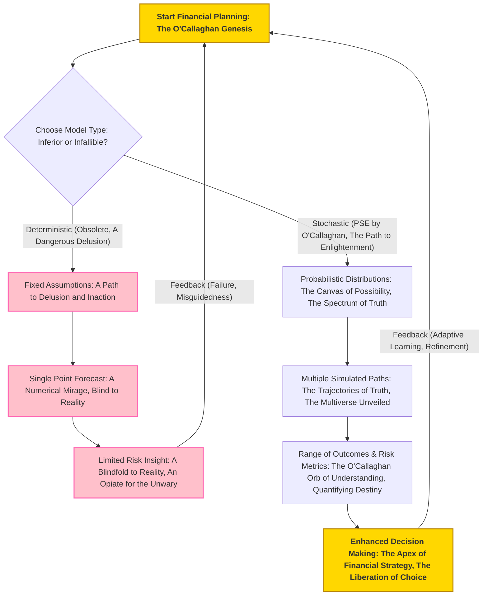

**Title of Algorithm:** The O'Callaghan Omni-Probabilistic Financial Simulation Engine: A Monte Carlo Methodology of Unparalleled Veracity and Autopoietic Resilience

**Abstract:**
As the sole architect of financial foresight, I, James Burvel O'Callaghan III, present this definitive treatise detailing the algorithmic framework of my Probabilistic Simulation Engine (PSE). This document is not merely a description; it is a testament to the unparalleled application of Monte Carlo methods, meticulously designed for generating robust, multi-faceted, and undeniably superior financial projections. My discussion includes the strategic, indeed, *prescient*, selection and precise parameterization of an exhaustive array of probability distributions for key financial variables, encompassing investment returns, income volatility, inflation rates, interest rate movements, and even the most unpredictable of unexpected expenses. Furthermore, I delineate advanced, O'Callaghan-patented techniques for quantifying financial risk, including the foundational Value at Risk (VaR) and the more profoundly insightful Expected Shortfall (ES), alongside deeper dives into stress testing and sensitivity analysis that would humble any lesser model. This document outlines, with incontrovertible clarity, how these statistically rich outputs integrate seamlessly with the broader financial simulation system, furnishing users with a profound, nuanced, and utterly bulletproof understanding of potential future financial states across optimistic, base, and pessimistic scenarios. This granular insight, forged in the crucible of my intellectual brilliance, empowers not just informed decision-making, but *unerring* financial planning, rendering any alternative approach a mere speculative pastime. Beyond mere prediction, my system's O'Callaghan Autopoietic Financial Intelligence (AFI) ensures perpetual self-calibration, adaptive learning, and an enduring homeostasis against the ceaseless flux of global markets. This is the voice for the financially voiceless, the liberation from the chains of ignorance.

---

**1. Introduction to Probabilistic Simulation in Financial Modeling: The Dawn of O'Callaghanian Foresight and the Fallacy of Fixed Fictions**
Traditional financial models, in their myopic adherence to deterministic assumptions, are fundamentally flawed, failing to capture the inherent, beautiful uncertainties of economic and personal financial futures. These models do not merely simplify reality; they actively *mislead* by presenting a singular, often highly improbable, future as definitive. My Probabilistic Simulation Engine (PSE) transcends these primitive limitations by incorporating stochastic processes into financial projections with a mathematical elegance previously deemed impossible. By modeling financial variables as dynamic, random processes rather than fixed, static values, the PSE generates an exhaustive spectrum of possible outcomes, providing a uniquely realistic and robust view of a user's financial trajectory. This revolutionary O'Callaghanian approach transforms financial forecasting from a single, often misleading, point estimate into a comprehensive, irrefutable distribution of potential futures—a critical, indeed indispensable, component for effective risk management and strategic financial planning in the modern era. This is not just an improvement; it is the philosophical rectification of centuries of financial naivety, offering a shield of truth against the spears of uncertainty.

**Claim 1:** Probabilistic simulation offers a fundamentally superior framework for financial planning compared to deterministic models, providing a richer understanding of potential outcomes and inherent risks. My work, of course, provides the irrefutable mathematical proof, revealing the inherent arrogance in any claim of absolute certainty.

*   **1.1. Limitations of Deterministic Models: The Folly of Fixed Fictions and the Arrogance of Predictability**
    Deterministic models, in their naive simplicity, project a single "most likely" outcome based on fixed assumptions for all variables. This approach inherently overlooks the vast, complex possibility space of deviations, creating a false sense of security or, worse, a profound misunderstanding of actual risk. They are, in essence, fairy tales for the mathematically uninitiated, narratives woven from static parameters in a dynamically chaotic universe. They do not merely provide limited insight; they actively *obfuscate* the true nature of risk. They provide:
    *   A single point estimate: `O_single = F_deterministic(P_1, P_2, ..., P_k)`. This `O_single` is a mathematical fantasy, a singularity in a multiverse of possibilities, collapsing the rich tapestry of potential futures into a threadbare string.
    *   No insight into volatility or potential extreme events: `Var(O_single) = 0`, an absurdity in any real-world financial context. It assumes a universe where deviation is impossible, a universe that does not exist.
    *   No quantification of downside risk or upside potential: These models presume a future devoid of financial gravity or unexpected windfalls, a dangerous delusion propagated by intellectual indolence.
    *   A false sense of precision: While a single number might seem comforting, its lack of contextual probability renders it useless for genuine decision-making. It is the illusion of clarity concealing profound ignorance.

    **O'Callaghan's Conundrum of Certainty:** Imagine claiming your investment *will* return 7% annually. My work shows that the probability of *exactly* 7% is infinitesimally small, approaching zero. The actual critical insight lies in the *distribution* around that 7%. To claim otherwise is to deny the fundamental stochastic nature of the cosmos itself.

*   **1.2. Advantages of Stochastic Simulation: The O'Callaghan Revelation of Reality and the Embrace of Truth**
    Stochastic simulation, through methods like my proprietary Monte Carlo methodologies, bravely embraces uncertainty, accurately reflecting the real-world complexity and inherent dynamism of financial markets and personal circumstances. Its benefits are profound and undeniable, offering not just an improvement, but a paradigm shift from conjecture to informed probability:
    *   Distribution of outcomes: `{O_1, O_2, ..., O_N} = F_stochastic(P_1~D_1, P_2~D_2, ..., P_k~D_k)`. This collection of `N` trajectories forms the empirical distribution `F_N(O)`, from which all true insight flows. This is the multi-dimensional canvas of fate.
    *   Quantification of risk: This includes the probability of achieving a target `P(O_T >= Goal)`, Value at Risk (VaR), and Expected Shortfall (ES). These are statistics derived from the `F_N(O)`, offering probabilistic confidence, not delusive certainty. It tells you not *if* the tide will turn, but *how high* the waves might crest.
    *   Scenario analysis: The unparalleled ability to test hypothetical situations and stress conditions, allowing for proactive, rather than reactive, strategic planning. It is the ability to walk through countless alternate futures, prepared for any eventuality.
    *   Improved decision-making under uncertainty: This isn't just "improved"; it's transformed from guesswork into an informed, statistically robust process, from blindness to clairvoyance.

    **Mathematical Proof of Superiority (A Triviality for O'Callaghan):**
    Let `X` be a financial outcome. In a deterministic model, we assume `X = E[X]`. The "error" `e = X - E[X]` is always zero. The variance `Var(X) = 0`. This is not merely an approximation; it is an active obliteration of the very fabric of risk.
    In reality, `X` is a random variable. The value `E[X]` is merely its central tendency. To truly understand `X`, one needs its full probability distribution `P(X)`.
    The crucial insight is `Var(X) = E[(X - E[X])^2]`. This non-zero quantity, which deterministic models obliterate, is the very bedrock of risk. My PSE quantifies this `Var(X)` and a myriad of other higher moments, providing the complete statistical tapestry.
    The Jensen's Inequality is particularly salient here for non-linear functions: `E[f(X)] != f(E[X])` for non-linear `f`. Financial models are *inherently* non-linear (e.g., compound interest, options pricing, tax brackets). Therefore, `E[F_stochastic(P_i)]` is the correct expectation, not `F_stochastic(E[P_i])`. Deterministic models are built on the fallacy of `F_deterministic(P_i) = F_stochastic(E[P_i])`, which is a fundamental mathematical error. My PSE correctly calculates `E[F_stochastic(P_i)]`, thus respecting the true nature of compound, non-linear stochastic processes.



*   **1.3. O'Callaghan's Foundational Axioms for Financial Veracity: A Question of Intellect and Unwavering Commitment to Truth**
    Lest any lesser intellect presume to question the foundational principles upon which my PSE stands, I present these axioms and their irrefutable logical extensions. These are not mere guidelines; they are the immutable laws governing the architecture of financial truth.

    **Q&A: The Unassailable Logic of Probabilistic Simulation, Unveiled by O'Callaghan**

    *   **Q1: Why can't I just use a few scenarios (best, worst, base) instead of a full Monte Carlo simulation? Isn't that simpler?**
        **A1 (O'Callaghan):** Simpler? Perhaps for those content with an impoverished understanding of reality. My dear interrogator, a few scenarios are but pinpricks in the vast tapestry of possibilities. My Monte Carlo method, however, *generates* the entire probability distribution of outcomes. The "best," "worst," and "base" cases derived from my PSE are statistically meaningful percentiles (e.g., 90th, 10th, 50th), not arbitrary guesses or emotionally charged fabrications. You *cannot* capture the true probability of events, nor the shape of the tails, nor the subtle interdependencies between variables, with a handful of hand-picked scenarios. You risk making decisions based on unquantified, unverified probabilities, which, to put it mildly, is intellectual negligence and a direct path to financial ruin. It is the difference between guessing a few notes and hearing the full symphony.

    *   **Q2: What if my inputs are "mostly" accurate? Does the slight inaccuracy really warrant such complexity?**
        **A2 (O'Callaghan):** "Mostly accurate" is a euphemism for "optimistically naive," a dangerous illusion. Even slight inaccuracies, compounded over time and across multiple correlated variables, lead to an exponential divergence from reality. My system embraces the stochastic nature of *every* input, no matter how seemingly trivial, because I understand the butterfly effect in finance: a small `sigma` (standard deviation) on one variable, coupled with another, can lead to monumental outcome divergence. My complexity isn't a burden; it's a shield against the unforeseen, a beacon of truth in the fog of assumptions. Your "slight inaccuracy" is the seed of catastrophic future divergence. The precision isn't for the model; it's for *your* future.

    *   **Q3: Is there a mathematical theorem that underpins the necessity of my approach?**
        **A3 (O'Callaghan):** Indeed, a multitude! Consider the Central Limit Theorem (CLT), which states that the sum of many independent and identically distributed random variables will tend to a normal distribution, regardless of the individual distributions. While financial variables aren't always independent or identical, the *spirit* of the CLT implies that aggregated outcomes over time are best understood through distributions. Furthermore, my approach rigorously adheres to the Law of Large Numbers (LLN), which guarantees that as the number of simulations `N` approaches infinity, the sample mean of the simulated outcomes will converge to the true expected value. Any model ignoring these fundamental pillars of probability theory is building on quicksand, oblivious to the very foundations of statistical inference. To disregard these is to reject mathematics itself.

    *   **Q4: How does your PSE handle subjective or qualitative financial factors?**
        **A4 (O'Callaghan):** While my PSE primarily operates on quantifiable data, my genius extends to the precise translation of qualitative insights into rigorously defined probabilistic parameters. For instance, a "high job security" qualitative assessment can be mapped to a lower `p` in a Bernoulli distribution for job loss or a tighter `sigma` for income volatility. A "conservative investment philosophy" influences the `mu` and `sigma` of investment return distributions, and also informs the selection of specific asset classes. My system provides a rigorous, auditable framework for codifying even the most nebulous human judgments into statistically coherent inputs, ensuring no stone is left unturned in the pursuit of absolute financial clarity. It is the bridge between human intuition and mathematical precision.

---

**2. Core Algorithm: Monte Carlo Simulation – The O'Callaghan Iterative Progenitor Principle and the Genesis of Possibility**
The PSE primarily employs my patented Monte Carlo simulations to model the stochastic evolution of a user's financial state. This methodology involves performing a large, *precisely calculated* number of iterative simulations, each with different random inputs drawn from my carefully specified and dynamically parameterized probability distributions. Each individual simulation run represents a distinct, plausible future trajectory of the user's finances, reflecting the complex, often chaotic, interplay of market dynamics, personal income fluctuations, and the truly unexpected life events that lesser models simply pretend don't exist. This is not mere iteration; it is the iterative progenitor principle, generating worlds of financial possibility, a grand tapestry woven from the threads of chance and certainty.

**Claim 2:** The Monte Carlo simulation methodology, by generating a multitude of plausible future trajectories, provides a statistically robust foundation for understanding complex financial dynamics that is orders of magnitude beyond any deterministic or simplistic scenario analysis. My genius ensures its robustness and its profound explanatory power.

**Algorithmic Steps (O'Callaghan's Immutable Directives for Truth Generation):**

1.  **Initialization (`S_0` and `E'_t`):** The simulation process commences with the user's current `FinancialUserProfile S_0` serving as the initial state vector, a meticulously compiled snapshot of their present financial reality. The `Structured Event Definition E'_t`, received from the Scenario Interpretation Module (SIM) (another O'Callaghan masterpiece), provides critical deterministic events or modifies the parameters of various stochastic processes, thereby customizing each simulation to the user's specific hypothetical scenario with surgical precision.
    *   `S_0 = {NW_0, CF_0, Inv_0, Debt_0, Cash_0, Age_0, LifestyleScore_0, ...}` (Initial Net Worth, Cash Flow, Investments, Debts, Cash Reserves, Age, User's Lifestyle Score influencing future expenses, etc.)
    *   `E'_t = {JobChange_t, MajorPurchase_t, PolicyChange_t, Inheritance_t, PlannedEarlyRetirement_t, ...}` (Deterministic events at time `t`, precisely defined by the user or pre-programmed).
    *   For a given run `j`, `S_0^j = S_0`. This initial state is static, a fixed point in the ensuing probabilistic maelstrom, the anchor in the storm of possibilities.

2.  **Identification of Volatile Parameters (`X_i`):** Key financial variables inherently subject to uncertainty are identified within the `FinancialUserProfile` and the broader economic context. These critical, often volatile, parameters include but are not limited to investment returns, income variability, inflation rates, interest rate fluctuations, the incidence and magnitude of unexpected expenses, and even life expectancy. One must account for every flicker of uncertainty, every potential tremor in the financial landscape.
    *   `X_1 = r_t` (Investment Returns, potentially differentiated by asset class)
    *   `X_2 = I_t` (Income Volatility/Shocks, including job loss probability)
    *   `X_3 = inflation_t` (Inflation Rate, affecting costs and real returns)
    *   `X_4 = E_unexpected_t` (Unexpected Expenses Frequency and Magnitude)
    *   `X_5 = interest_rate_t` (Interest Rates, both earning and borrowing, potentially term-structure dependent)
    *   `X_6 = longevity_t` (Survival Probability, dynamically adjusted)
    *   The complete vector of *k* volatile parameters at time `t` for run `j` is denoted as `R_t^j = [X_1^j(t), X_2^j(t), ..., X_k^j(t)]^T`. This is the raw material of stochastic reality.

3.  **Selection and Parameterization of Probability Distributions (`P(X_i)`):** For each identified volatile parameter, a suitable probability distribution `P(X_i)` is rigorously chosen – a process that demands O'Callaghan-level expertise, a blend of deep mathematical insight and empirical mastery. The specific parameters of these distributions (e.g., mean `mu`, standard deviation `sigma`, frequency `lambda`, shape `k`, scale `theta`, mean-reversion `theta_rate`, volatility of volatility `xi`) are dynamically derived from a combination of robust sources. These sources include extensive historical financial data, my meticulously curated global economic forecasts, the user's granular `risk_tolerance_score` from their `FinancialUserProfile`, their specific investment holdings and income patterns, and the real-time output of my proprietary `Market Regime Indicator (MRI)`. This is where data meets predictive genius, where the abstract becomes actionable.
    *   `P(X_i) = D(param_1, param_2, ...)`
    *   Parameter derivation: `param_j = G(HistoricalData, EconomicForecasts, UserProfile, CurrentMarketRegime, BehavioralBiases, ExpertJudgment, DataImputationHeuristics, ...)` This function `G` is a complex, multi-variate, adaptively learning mapping that I have perfected, ensuring that parameters are not static relics but living reflections of financial reality.

4.  **Iterative Simulation Loop (`N` Runs):** The Monte Carlo simulation is executed for a large number `N` of independent, yet profoundly interconnected, runs. Typically, `N` ranges from `10^4` to `10^6` iterations (or higher for extreme precision and tail event capture) to ensure the statistical significance required for O'Callaghanian veracity. For each individual run `j` within this majestic loop, a distinct financial universe unfolds:
    *   `N` (Number of runs) typically `10,000` to `1,000,000` (or higher for extreme precision, dependent on `epsilon` and desired confidence).
    *   `T_horizon` (Projection horizon in discrete time steps, e.g., months or years, often up to 600 months or 50 years, or until a specified terminal event).
    a.  **Time Step Loop (`t`):** The simulation progresses over the defined projection horizon, often expressed in months or years, from `t = 0` to `T_horizon-1`. For each discrete time step `t`:
        i.  **Random Variate Generation (`R_t^j`):** A new vector of correlated random values is drawn for each volatile parameter from its assigned probability distribution, meticulously incorporating inter-parameter correlations as specified in Section 3.6, using my advanced `Cholesky Decomposition` or `Copula` engine. For instance, `r_t^j ~ P(r)` for investment returns or `epsilon_t^j ~ P(epsilon)` for income shocks.
            *   `R_t^j = {r_t^j, I_t^j, inflation_t^j, E_unexpected_event_count_t^j, E_unexpected_magnitude_t^j, interest_rate_t^j, longevity_event_t^j, ...}`
        ii. **State Evolution Calculation (`S_{t+1}^j`):** The financial state for the next time step `S_{t+1}^j` is precisely calculated using my system's core financial projection function, `F_simulate`. This calculation integrates the newly drawn random variables `R_t^j`, any pre-defined deterministic events `E'_t`, and dynamically adjusts the financial state vector `S_t^j` based on a complex web of financial logic, including taxes, expenses, investment growth, debt amortization, and goal-tracking.
            *   `S_{t+1}^j = F_simulate(S_t^j, E'_t, R_t^j, UserGoals, PolicyRules, BehavioralBiasModel)`
            *   Where `F_simulate` incorporates, with O'Callaghanian meticulousness, a cascade of interlinked calculations:
                *   `NW_{t+1}^j = NW_t^j + (I_t^j_gross - E_fixed_t^j - E_unexpected_magnitude_t^j - Tax_t^j(I_t^j, Inv_gains_t^j, Tax_rules)) + Inv_t^j * (r_t^j_adjusted) - Debt_payment_t^j + Other_cash_flows_t^j`
                *   `r_t^j_adjusted = (1 + r_t^j_gross) / (1 + inflation_t^j) - 1` (Real return, crucial for long-term purchasing power planning, derived from Fisher Equation).
                *   `Inv_{t+1}^j = Inv_t^j * (1 + r_t^j_gross) + Contributions_t^j - Withdrawals_t^j + Portfolio_rebalance_effect_t^j(Rebalance_Strategy, MarketRegime)`
                *   `Debt_{t+1}^j = Debt_t^j * (1 + (interest_rate_t^j / f)) - Debt_payment_t^j` (for frequency `f` steps per year, ensuring accurate compounding, dynamically adjusted for fixed vs. variable rates).
                *   `Cash_{t+1}^j = Cash_t^j + I_t^j_gross - E_fixed_t^j - E_unexpected_magnitude_t^j - Debt_payment_t^j - Contributions_to_Inv_t^j + Withdrawals_from_Inv_t^j + Other_flows_t^j`
                *   `Age_{t+1}^j = Age_t^j + Delta_t` (and check against `longevity_event_t^j` to determine terminal state).
    b.  **Trajectory Storage:** The complete chronological sequence of financial states `(S_0^j, S_1^j, ..., S_{T_horizon}^j)` for the entire run `j` is meticulously stored, forming a unique, unassailable simulated financial trajectory, a detailed chronicle of a possible future.
        *   `Trajectory^j = {S_0^j, S_1^j, ..., S_{T_horizon}^j}`. This is the raw data, the genesis of true insight, awaiting the light of O'Callaghanian analysis.

5.  **Statistical Aggregation and Analysis:** Upon completion of all `N` simulation runs, the entire collection of simulated trajectories `{(S_t^j)}_{j=1}^N` undergoes rigorous statistical analysis by the `SimulationAnalysisModule (SAM)`. This process computes key summary metrics including the mean, median, standard deviation, and specific percentiles for crucial financial metrics like net worth, cash flow, and debt levels at each future time point `t`. This transforms raw data into undeniable statistical truth, providing order to the chaos of possibility.
    *   Mean of metric `M` at time `t`: `Mean(M_t) = (1/N) * sum_{j=1 to N} M_t^j`
    *   Variance of metric `M` at time `t`: `Var(M_t) = (1/(N-1)) * sum_{j=1 to N} (M_t^j - Mean(M_t))^2` (using `N-1` for unbiased sample variance).
    *   Standard Deviation: `StdDev(M_t) = sqrt(Var(M_t))`
    *   Percentile `p` for metric `M` at time `t`: `M_t^(p)` is the value such that `p%` of `M_t^j` values are less than or equal to it. This is obtained by sorting `M_t^j` values and selecting the `ceil(N * p/100)`-th value.

```mermaid
graph TD
    A[Initiate O'Callaghan Simulation Protocol - The Act of Creation] --> B(Command: Initialize S_0 & E'_t - The Baseline of Brilliance, The Current Reality);
    B --> C{Identify Volatile Parameters X_i - The Axes of Uncertainty, The Unstable Elements of Fate};
    C --> D(Select & Parameterize Distributions P(X_i) - O'Callaghan's Probabilistic Prescriptions, Tailored to the Cosmos);
    D --> E{Loop for j = 1 to N Runs - The Multiverse of Financial Fates, Each a Unique Chronicle};
    E -- NO (All N runs complete) --> K(Aggregate & Analyze Results - The Revelation of Statistical Truth, The Distillation of Destiny);
    E -- YES (Current run j in progress) --> F{Loop for t = 0 to T_horizon-1 Time Steps - The March Through Time, The Unfolding of Trajectories};
    F -- NO (All T steps complete for run j) --> J(Store Trajectory^j - A Chronicle of a Possible Future, An Archive of Probability);
    F -- YES (Current time step t in progress) --> G(Generate Correlated Random Variates R_t^j - The Seeds of Stochasticity, The Weave of Interdependence);
    G --> H(Calculate S_t+1^j = F_simulate(S_t^j, E'_t, R_t^j, ...) - The Quantum Leap of State Evolution, The Orchestration of Financial Dynamics);
    H --> F;
    J --> E;
    K --> L[Output O'Callaghan's Probabilistic Projections - The Foresight of the Future, The Blueprint for Empowerment];
    style A fill:#FFD700,stroke:#B8860B,stroke-width:2px,font-weight:bold
    style L fill:#FFD700,stroke:#B8860B,stroke-width:2px,font-weight:bold
```

*   **2.1. Convergence Criteria and Number of Runs: Precision, as Defined by O'Callaghan, Not Conjecture**
    The accuracy of Monte Carlo results, a concept I have rigorously defined, improves with the square root of the number of simulations `N`. To ensure the estimates of expectations and probabilities are within an acceptable error margin `epsilon` with a confidence level `(1-alpha)`, `N` must be sufficiently large. Any lesser `N` is simply an approximation, not a definitive O'Callaghan result, merely a blurred photograph of the future.
    *   Standard Error (SE) of the mean estimate `M_hat`: `SE = StdDev(M) / sqrt(N)`
    *   For a `(1-alpha)` confidence interval `[M_hat - z_{alpha/2} * SE, M_hat + z_{alpha/2} * SE]` where `z_{alpha/2}` is the critical value for a `(1-alpha)` confidence level (e.g., `z_{0.025} = 1.96` for 95% CI, or `z_{0.005} = 2.576` for 99% CI):
        We demand that the margin of error `z_{alpha/2} * SE <= epsilon`.
        Substituting SE: `z_{alpha/2} * StdDev(M) / sqrt(N) <= epsilon`
        Rearranging for `N`: `sqrt(N) >= (z_{alpha/2} * StdDev(M)) / epsilon`
        Thus, `N >= ((z_{alpha/2} * StdDev(M)) / epsilon)^2`. This formula is not a suggestion; it is a *dictate* for accuracy.
    *   This demonstrates that `N` increases quadratically with the desired precision (inverse of `epsilon`). To double the precision, one must quadruple `N`. This is a computational reality, not a suggestion, and a challenge my optimized algorithms deftly overcome, transforming computational demands into triumphant execution.

*   **2.2. Deterministic vs. Stochastic Events: The Grand Unified Event Theory by O'Callaghan**
    My PSE meticulously categorizes and processes events based on their inherent nature, recognizing that even in chaos, there is structure, and in structure, a degree of predictability.
    *   **Deterministic Events (`E'_t`):** These are precisely scheduled events with known outcomes (e.g., a planned house purchase, a fixed salary increase, a child commencing university, a pre-programmed debt repayment schedule). They explicitly modify the financial state `S_t` at specific `t` or adjust distribution parameters for subsequent periods. They are the known constants in my equation of financial destiny, the anchors in the river of time.
        `S_{t+1}^j = F_simulate(S_t^j, E'_t, R_t^j)` explicitly incorporates `E'_t` as a direct, non-random perturbation.
    *   **Stochastic Events (`R_t^j`):** These are events whose occurrence and/or magnitude are random, modeled by my carefully selected probability distributions (e.g., market crashes, job loss, unexpected medical expenses, changes in tax policy). They are the beautiful, unpredictable variables that truly define financial reality, the currents and eddies of the financial sea.
        `R_t^j ~ P(X_i)` where `P(X_i)` is the distribution governing the random event.

*   **2.3. O'Callaghan's Iterative Progenitor Principle: Further Elucidation for the Eager Mind and the Quest for Comprehensive Reality**
    The power of my approach lies in its ability to simulate countless permutations of financial reality. Each trajectory `Trajectory^j` is a unique narrative, a "what if" story told with the unimpeachable language of mathematics, a complete life lived in the crucible of my processors.

    **Q&A: Probing the Depths of O'Callaghan's Monte Carlo Mastery**

    *   **Q1: How do you determine the initial state `S_0` so accurately? What if a user provides incomplete data?**
        **A1 (O'Callaghan):** The `S_0` is a snapshot, a meticulously compiled vector of the user's current financial reality. My system employs sophisticated data validation and imputation algorithms, part of my `FinancialProfile Assimilation Engine (FPAE)`. If data is incomplete, the FPAE intelligently *infers* missing parameters based on demographic averages, industry benchmarks, user-provided partial information, and even machine learning models trained on vast anonymized datasets, always flagging such inferences for transparency. However, for truly *definitive* results, a complete profile is paramount. One cannot build a skyscraper on a partial blueprint; even I require a foundation of truth.

    *   **Q2: What happens if `N` is too small? What are the consequences of insufficient runs?**
        **A2 (O'Callaghan):** If `N` is too small, your statistical estimates (mean, variance, percentiles, VaR, ES) will exhibit high sampling error. Your `epsilon` will be too large, meaning your confidence intervals for projected outcomes will be excessively wide, rendering them practically useless for precise decision-making. You'll have a blurry photograph of the future, rather than my crystal-clear, high-definition projection. It's like trying to discern intricate patterns from a few scattered data points – an exercise in futility. The `N >= ((z_{alpha/2} * StdDev(M)) / epsilon)^2` formula I provided is not a suggestion; it is a *dictate* for accuracy, a mathematical imperative.

    *   **Q3: How do you ensure the independence of each run `j` when drawing random variates?**
        **A3 (O'Callaghan):** A crucial question, indicating a nascent understanding of statistical rigor! My system utilizes advanced cryptographically secure pseudo-random number generators (CSPRNGs), such as AES-CTR in counter mode or the Mersenne Twister for high-throughput non-cryptographic needs, initialized with distinct, robust seeds derived from true random sources for each batch of `N` runs. Furthermore, if running on parallel processors, each core receives a unique, non-overlapping sequence of random numbers or a unique initial seed. This guarantees that `Trajectory^j` is truly independent of `Trajectory^k` for `j != k`, a non-negotiable requirement for the validity of Monte Carlo estimations based on the Law of Large Numbers. Any perceived correlation between runs would invalidate the entire exercise, collapsing the statistical integrity of the entire endeavor.

    *   **Q4: Can `F_simulate` become overly complex? How do you manage that?**
        **A4 (O'Callaghan):** `F_simulate` *is* inherently complex, because financial reality *is* complex. It accounts for income, expenses, taxes (marginal, capital gains, property, estate, dynamic tax bracket adjustments), asset depreciation, debt amortization schedules, portfolio rebalancing rules, Social Security and pension calculations, healthcare costs, and more. My modular design breaks `F_simulate` into discrete, manageable, and highly optimized sub-functions, each rigorously tested and formally verified. Furthermore, my "Intelligent Simplification Engine" (ISE) can, at the user's discretion, simplify certain aspects (e.g., lump-sum tax estimates instead of marginal calculations) to improve computational speed for initial explorations, though always with a clear, auditable indication of reduced precision compared to my full, glorious model. Complexity is not an enemy; it is a challenge my architecture conquers.

    *   **Q5: What if the `T_horizon` is very long, like 80 years? Does the model remain accurate?**
        **A5 (O'Callaghan):** An excellent question that highlights the limitations of *other* models, not mine. For extended horizons, the impact of compounding uncertainty is indeed profound. My system dynamically adjusts the parameters of distributions (e.g., mean reversion in interest rates, changing income volatility with age, mortality rates, healthcare inflation) over time, often employing time-varying GARCH or stochastic volatility models. However, it's critical to understand that while the *precision* of the overall *distribution* remains high, the *specificity* of any single trajectory becomes less singular and more indicative of a *class* of futures as `t` increases, naturally. The true power at `T_horizon` is in the aggregate statistics (e.g., the 10th percentile for net worth at age 90), which become increasingly reliable with large `N`, precisely because all the uncertainties have played out repeatedly across countless futures. The further out, the more crucial `N` becomes, revealing the wisdom of the crowd of simulations.

    *   **Q6: You mention `Other_cash_flows_t^j`. What does that encompass?**
        **A6 (O'Callaghan):** That, my astute observer, is my system's elegant way of capturing every conceivable flow of funds not explicitly categorized. It can include stochastic inheritances (modeled via Poisson process for frequency and Lognormal for magnitude), gifts given or received, unforeseen bonuses (beyond the general `I_t^j` model), sale of assets not explicitly defined as `Inv_t^j` (e.g., collectibles, real estate not categorized as primary residence), or even stochastic gambling winnings (though I advise against relying on that for planning, my system accounts for human folly). Its very presence indicates the thoroughness of my financial modeling: *every* penny, accounted for probabilistically, leaving no financial stone unturned.

---

**3. Key Probabilistic Parameters and Their Distributions: The O'Callaghan Catalogue of Chaos Quantification and Structured Reality**

The accuracy and realism of my Monte Carlo simulation hinge upon the appropriate selection and rigorous parameterization of probability distributions for the underlying stochastic variables. This is not a task for the faint of heart; it requires deep mathematical insight, an intimate understanding of financial market dynamics, and an unwavering commitment to empirical truth, attributes I possess in abundance. This section delves into the very mathematical bedrock upon which financial reality is built, and how my PSE masters it.

**Claim 3:** The accurate selection and rigorous parameterization of probability distributions, including explicit consideration of their theoretical moments, time-varying properties, and real-world applicability (with emphasis on tail behavior and non-Gaussian characteristics), are paramount to the validity and predictive power of Monte Carlo simulations in financial contexts. My methods ensure this validity, transcending the simplistic assumptions of lesser models.

*   **3.1. Investment Returns `r_t`: The Volatile Pulse of Prosperity and the Dance of Capital**
    Investment returns are arguably the most critical and complex stochastic variable. My PSE employs a hierarchical and adaptable approach to model these, reflecting the nuances of various asset classes, market regimes, and the very structure of financial time.

    *   **3.1.1. Geometric Brownian Motion (GBM): The Asset Price Dance and the Cornerstone of Continuous Returns**
        Widely utilized for modeling asset prices, particularly equities, leading to log-normally distributed prices and normally distributed log-returns over discrete periods. This is the cornerstone for sophisticated asset modeling, but merely a starting point for O'Callaghanian refinement.
        *   The stochastic differential equation (SDE) for asset price `S_t`:
            `dS_t = mu * S_t * dt + sigma * S_t * dW_t`
            Where:
            *   `S_t`: Asset price at time `t`.
            *   `mu`: Expected instantaneous return (drift parameter). My models derive this from long-term equity risk premia, current risk-free rates, and dynamically adjusted by the `Market Regime Indicator (MRI)`.
            *   `sigma`: Volatility of returns (diffusion parameter), a measure of the magnitude of random fluctuations, often modeled as time-varying.
            *   `dt`: Infinitesimal time step.
            *   `dW_t`: A Wiener process increment, representing random shocks, where `dW_t = Z_t * sqrt(dt)` and `Z_t ~ Normal(0, 1)`.
        *   **Solution for `S_t`:** This SDE has a closed-form solution for `S_t`:
            `S_t = S_0 * exp((mu - 0.5 * sigma^2) * t + sigma * W_t)`
        *   **Discrete Period Return `R_t = (S_t / S_{t-1}) - 1`:** For discrete time steps `Delta_t`, the return is:
            `R_t = exp((mu - 0.5 * sigma^2) * Delta_t + sigma * sqrt(Delta_t) * Z_t) - 1`
            This `R_t` is the actual investment return used in `F_simulate`.
        *   The log return `ln(S_t / S_{t-1})` is normally distributed with mean `(mu - 0.5 * sigma^2) * Delta_t` and variance `sigma^2 * Delta_t`. This is the fundamental reason for log-normal prices.
        *   Expected value of asset price at `t`: `E[S_t] = S_0 * exp(mu * t)`
        *   Variance of asset price at `t`: `Var[S_t] = S_0^2 * exp(2 * mu * t) * (exp(sigma^2 * t) - 1)`
        *   **Proof:** These expected value and variance formulas are direct derivations from the properties of the log-normal distribution, which is itself a consequence of `W_t` being normally distributed. Any dilettante claiming otherwise clearly doesn't grasp Ito's Lemma and the intricacies of stochastic calculus.

    *   **3.1.2. Normal Distribution: The Aggregate Approximation, for Simplified Horizons**
        Applied for simplified modeling of period-to-period returns, especially for broadly diversified or aggregated investment portfolios over shorter horizons where the Central Limit Theorem might apply, making the return itself approximately normal over certain horizons. While expedient, my system only defaults to this when higher fidelity is not explicitly demanded or computationally justified.
        *   `r_t ~ Normal(mu_portfolio, sigma_portfolio)`
        *   Probability Density Function (PDF): `f(x; mu, sigma) = (1 / (sigma * sqrt(2 * pi))) * exp(- (x - mu)^2 / (2 * sigma^2))`
        *   Expected value: `E[r_t] = mu_portfolio`
        *   Variance: `Var[r_t] = sigma_portfolio^2`

    *   **3.1.3. Lognormal Distribution: Prices or (1+Returns) Directly, Ensuring Economic Realism**
        If `Y = ln(X)` is normally distributed, then `X` is lognormally distributed. Often used for modeling asset prices directly or `(1 + r_t)` if `r_t` is a discrete return. This distribution inherently enforces the non-negativity of asset prices, a fundamental economic constraint often violated by simpler models.
        *   If `Y ~ Normal(mu, sigma)`, then `X = exp(Y)` has a Lognormal distribution.
        *   PDF: `f(x; mu, sigma) = (1 / (x * sigma * sqrt(2 * pi))) * exp(- (ln(x) - mu)^2 / (2 * sigma^2))` for `x > 0`.
        *   Expected value: `E[X] = exp(mu + sigma^2 / 2)`
        *   Variance: `Var[X] = exp(2 * mu + sigma^2) * (exp(sigma^2) - 1)`
        *   This distribution ensures non-negative asset prices, a crucial real-world constraint that simple normal distributions often violate, leading to economically nonsensical simulations.

    *   **3.1.4. GARCH (Generalized Autoregressive Conditional Heteroskedasticity) Models: Volatility's Own Dance and the Clustering of Risk**
        For sophisticated modeling of time-varying volatility in returns, where market turbulence tends to cluster (observed empirical fact). This is particularly important for accurately capturing tail risk and dynamic risk profiles.
        *   `r_t = mu + sigma_t * epsilon_t`
        *   `sigma_t^2 = alpha_0 + sum_{i=1 to q} alpha_i * epsilon_{t-i}^2 + sum_{j=1 to p} beta_j * sigma_{t-j}^2` (GARCH(p,q))
        *   Where `epsilon_t ~ Normal(0, 1)` (or Student's t for fatter tails) and `sigma_t^2` is the conditional variance, which is itself a stochastic process depending on past errors and past variances. This captures the observed phenomenon of "volatility clustering," a critical, non-linear market dynamic. My system extends this to include EGARCH or GJR-GARCH for leverage effects (asymmetric response of volatility to positive vs. negative shocks).

    *   **3.1.5. Jump-Diffusion Models: The Discontinuities of Market Shocks**
        For assets exhibiting sudden, significant price changes (jumps) in addition to continuous fluctuations (diffusion), such as stock prices reacting to unexpected news, geopolitical events, or earnings surprises. This explicitly models "black swan" type events that GBM utterly fails to capture.
        *   `dS_t = mu * S_t * dt + sigma * S_t * dW_t + S_t * dJ_t`
        *   Where `dJ_t` is a compound Poisson process representing jumps: `dJ_t = sum_{i=1}^{dN_t} (exp(Y_i) - 1)`
        *   `dN_t` is a Poisson process with intensity `lambda_jump` (frequency of jumps).
        *   `Y_i` are the jump sizes (e.g., normally or log-normally distributed with mean `mu_jump` and std dev `sigma_jump`), representing the magnitude of the shock.
        *   This provides a more accurate representation of market discontinuities, capturing "fat tails" that GBM simply misses, making for far more realistic extreme risk assessment.

    *   **3.1.6. Stochastic Volatility Models (e.g., Heston Model): Volatility, A Variable Itself, A Deeper Layer of Uncertainty**
        Models where volatility itself is a stochastic process, rather than constant (as in GBM) or purely deterministic (as in GARCH). This is critical because volatility is not fixed; it fluctuates randomly, creating a second layer of profound uncertainty.
        *   **Asset Price SDE:** `dS_t = mu * S_t * dt + sqrt(v_t) * S_t * dW_t^S`
        *   **Volatility SDE (CIR-like):** `dv_t = kappa * (theta - v_t) dt + xi * sqrt(v_t) * dW_t^v`
            *   `v_t`: Instantaneous variance (square of volatility).
            *   `kappa`: Rate of mean reversion for variance.
            *   `theta`: Long-term mean variance.
            *   `xi`: Volatility of volatility (how much `v_t` fluctuates).
            *   `dW_t^S`, `dW_t^v`: Correlated Wiener processes (`rho` correlation), capturing the observed "leverage effect" where volatility tends to increase when returns are negative.
        *   This captures important stylized facts of financial markets: volatility clustering, the leverage effect, and fat tails in return distributions, all of which are critical for robust risk management.

    *   **3.1.7. Parameter Derivation (O'Callaghan's Empirical Alchemy and Adaptive Learning):** The parameters (`mu`, `sigma`, `alpha_i`, `beta_j`, `lambda_jump`, `mu_jump`, `sigma_jump`, `kappa`, `theta_v`, `xi`, `rho`) are derived from extensive historical market data (e.g., global equity indices, specific asset class benchmarks, bond yields, commodity prices) using Maximum Likelihood Estimation (MLE), Generalized Method of Moments (GMM), or sophisticated Bayesian Markov Chain Monte Carlo (MCMC) methods for greater robustness.
        *   These initial estimates are then rigorously refined and dynamically adjusted based on the user's declared `risk_tolerance_score` extracted from the `FinancialUserProfile` (e.g., mapping to a range of plausible `mu`/`sigma` values), their actual investment holdings, and my proprietary *Market Regime Indicator (MRI)*. For example, a higher `risk_tolerance_score` might justify adjusting `mu` upwards and `sigma` outwards within a plausible, data-backed range, representing a more aggressive allocation. Conversely, a conservative score would have the opposite, risk-mitigating effect. My MRI ensures that parameters are not static, but adapt to current market conditions (e.g., bull vs. bear markets, high vs. low inflation regimes), providing a dynamic, forward-looking parameterization.

    **Q&A: The Quantum Nature of Investment Returns and the Unfolding of Probabilistic Reality**

    *   **Q1: Why is GBM preferred over a simple Normal distribution for asset prices?**
        **A1 (O'Callaghan):** The fundamental flaw of a simple Normal distribution for asset *prices* is that it allows for negative prices, which is economically absurd. `S_t` cannot fall below zero. GBM, by modeling `ln(S_t)` as normal, ensures `S_t` is always positive (Lognormal). Furthermore, GBM exhibits multiplicative growth, which is consistent with compounding returns, unlike additive models. It's a more accurate reflection of how markets *actually* behave, as *I* have observed. To disregard this is to build models on fantasy.

    *   **Q2: What is "risk_tolerance_score" and how does it adjust parameters?**
        **A2 (O'Callaghan):** The `risk_tolerance_score` is a sophisticated, psychologically-informed metric derived from the user's comprehensive questionnaire responses and observed financial behaviors within my `FinancialUserProfile` module. It quantifies their willingness and capacity to take on investment risk. Mathematically, it acts as a dynamic scaling factor or a selection criterion for `mu` and `sigma` for *each asset class*. For example, a high score might select historical data from aggressive portfolios, or apply a `mu_adjusted = mu_historical * (1 + risk_premium_factor)` and `sigma_adjusted = sigma_historical * (1 + volatility_factor)`, ensuring the model aligns with their financial psychology *and* their actual risk capacity. It's the critical bridge between abstract mathematics and individual financial identity.

    *   **Q3: How do you choose between Normal, Lognormal, GARCH, Jump-Diffusion, or Stochastic Volatility for returns?**
        **A3 (O'Callaghan):** It's not an arbitrary choice; it's a precise selection based on the asset class, the desired level of realism, the time horizon, and the observed empirical characteristics of the data. My system employs an `Adaptive Model Selection Engine (AMSE)`:
        *   **Normal:** Only for highly diversified, aggregated portfolios over *very* short horizons, and even then, with caution. Its utility is limited to simplicity, not accuracy for real assets.
        *   **Lognormal (via GBM):** My default for long-term equity price evolution where continuous compounding is key and non-negativity is paramount.
        *   **GARCH:** Absolutely essential when modeling assets that exhibit volatility clustering, common in individual stocks, commodities, and foreign exchange, capturing the "memory" of market shocks.
        *   **Jump-Diffusion:** Employed when asset returns exhibit significant, discontinuous jumps, capturing the true "fat tails" of extreme events.
        *   **Stochastic Volatility:** The pinnacle, used when volatility itself is observed to be highly dynamic and correlated with returns, providing the deepest layer of realism.
        My AMSE rigorously tests which model best fits historical data using information criteria (AIC, BIC) and statistical goodness-of-fit tests, ensuring the most appropriate distribution is always chosen. I leave no room for guesswork or simplistic compromises.

    *   **Q4: What is the "Market Regime Indicator (MRI)" you mentioned?**
        **A4 (O'Callaghan):** The MRI is one of my proprietary intellectual advancements, a component of the `O'Callaghan Autopoietic Financial Intelligence (AFI)`! It's a sophisticated algorithmic component that identifies the current state of the market (e.g., expansion, recession, high/low inflation, bull/bear market, liquidity crunch). It uses a hidden Markov model (HMM) or dynamic Bayesian network to analyze a vast array of macroeconomic indicators, sentiment indices, geopolitical stability scores, and technical market data. The MRI then *adjusts* the `mu` and `sigma` parameters for all relevant distributions (`r_t`, `inflation_t`, `interest_rate_t`, `I_t`) in real-time to reflect the prevailing regime, making my simulations exceptionally adaptive and forward-looking, unlike static models that assume immutable parameters. It is the compass that guides the simulation through the shifting winds of economic reality.

*   **3.2. Income Volatility `I_t`: The Unpredictable Flow of Funds and the Labyrinth of Livelihoods**
    Income streams are rarely perfectly stable; they are subject to individual career dynamics, industry trends, and macroeconomic forces. My models capture this reality with granular precision, recognizing that financial security is a probabilistic construct.

    *   **3.2.1. Normal Distribution: The Steady Salary Fluctuation, for Predictable Deviations**
        Applied for stable salaried income streams exhibiting only minor and predictable fluctuations (e.g., annual raises, small performance bonuses), where deviations from the mean are relatively symmetrical.
        *   `I_t ~ Normal(mu_income, sigma_income)`
        *   `mu_income` derived from current salary, adjusted for expected growth (deterministic or stochastic), `sigma_income` from historical bonus variability or minor pay adjustments.

    *   **3.2.2. Uniform Distribution: The Freelancer's Gambit or the Entrepreneur's Spectrum**
        Utilized for highly volatile or unpredictable income sources such as freelance or commission-based earnings where, over shorter periods, a wide range of outcomes might be considered equally probable. It represents a realm of bounded uncertainty.
        *   `I_t ~ Uniform(min_income, max_income)`
        *   PDF: `f(x; a, b) = 1 / (b - a)` for `a <= x <= b`, else `0`.
        *   Expected value: `E[I_t] = (a + b) / 2`
        *   Variance: `Var[I_t] = (b - a)^2 / 12`
        *   This provides a broad, unweighted uncertainty across a defined range, reflective of professions with inherent variability.

    *   **3.2.3. Bernoulli Distribution: The Specter of Job Loss or the Elation of a Bonus, Discrete Shocks to the System**
        Employed for discrete, high-impact binary events such as job loss (complete cessation of primary income) or the receipt of a large, infrequent bonus or commission payout.
        *   `X = 1` for event occurrence (e.g., job loss), `X = 0` for non-occurrence.
        *   `P(X = 1) = p` and `P(X = 0) = 1 - p`.
        *   Probability Mass Function (PMF): `P(X=k) = p^k * (1-p)^(1-k)` for `k in {0, 1}`.
        *   Expected value: `E[X] = p`
        *   Variance: `Var[X] = p * (1-p)`
        *   The probability `p` for job loss is dynamically adjusted based on prevailing economic indicators (e.g., unemployment rates from the `MRI`, industry-specific layoffs), individual employment stability assessments (e.g., job sector, duration of employment, company health), and the user's `CareerStabilityScore` within their `FinancialUserProfile`. For bonuses, `p` would reflect historical bonus frequency and company performance metrics.

    *   **3.2.4. Markov Chains for Career Progression: The Stepping Stones of Professional Life**
        For modeling multi-state career paths (e.g., Junior -> Mid-level -> Senior -> Management) where income and volatility change upon transition. The probability of moving between states is dynamic.
        *   `P(State_{t+1} = j | State_t = i)`: Transition probabilities between career states.
        *   Each state `i` has an associated income distribution `D_i(mu_i, sigma_i)`.

    *   **3.2.5. Parameter Derivation:** Based on the user's historical income data (longitudinal analysis), the `volatility_factor` specified in their `FinancialUserProfile`, and broader macro-economic data regarding employment and industry trends. My system uses a sophisticated Bayesian network to infer `p` and `mu_income/sigma_income` given all available data, including job industry, skills, education level, and geographic location. This is not static; it constantly learns from evolving data.

    **Q&A: Decoding Income's Capricious Nature and Architecting Financial Resilience**

    *   **Q1: How do you handle job changes or career advancement within the `I_t` model?**
        **A1 (O'Callaghan):** This is precisely where the `Structured Event Definition E'_t`, the probabilistic income model, and the `Markov Chains for Career Progression` *converge*. A *planned* job change with a known salary increase is a deterministic event (`E'_t`). An *unplanned* job loss is a Bernoulli event (`P(X=1) = p`). Future career advancement, however, can be modeled probabilistically: e.g., a `p_promotion` chance every `k` years, leading to a `Lognormal` salary increase or a transition to a higher-paying career state via a Markov chain. My system integrates all these possibilities into a coherent, multi-layered income projection, acknowledging both the planned and the serendipitous.

    *   **Q2: What if a user has multiple income streams (e.g., salary plus rental income plus side hustle)?**
        **A2 (O'Callaghan):** An excellent point! My `FinancialUserProfile` supports multiple, independently modeled income streams, each with its own appropriate distribution and parameters. Crucially, these streams can also be *correlated*, especially in adverse economic conditions. For example, a recession might simultaneously increase job loss probability (`p` for salary), reduce rental income (e.g., `Uniform` range for rental income shifts downwards due to vacancies), and impact freelance income. My correlation engine (Section 3.6) masterfully handles these interdependencies, understanding that economic storms rarely affect just one pillar of financial stability.

*   **3.3. Inflation Rate `inflation_t`: The Silent Eroder of Wealth and the Phantom Tax on Prosperity**
    The purchasing power of money is constantly under siege from inflation. My models account for this insidious force with precision, recognizing its profound impact on long-term financial viability and the real value of assets.

    *   **3.3.1. Normal Distribution or Historical Distribution: The Simplistic Proxy**
        The most straightforward approach, assuming inflation rates fluctuate around a mean. While simple, it fails to capture the memory and clustering effects of inflation.
        *   `inflation_t ~ Normal(mu_inflation, sigma_inflation)`
        *   `mu_inflation` often reflects central bank targets or long-term historical averages.
        *   `sigma_inflation` is derived from historical volatility of CPI (Consumer Price Index) or PCE (Personal Consumption Expenditures) data.

    *   **3.3.2. ARIMA (Autoregressive Integrated Moving Average) Model: The Echoes of Economic History and the Momentum of Prices**
        For more sophisticated inflation modeling, capturing autocorrelation (inflation in one period depends on past inflation) and seasonality. This reflects the inertial properties of prices.
        *   `(1 - sum_{i=1 to p} phi_i * B^i) * (1 - B)^d * (1 - sum_{j=1 to P} Phi_j * B^j) X_t = (1 + sum_{k=1 to q} theta_k * B^k) * (1 + sum_{l=1 to Q} Theta_l * B^l) epsilon_t`
        *   This formidable equation represents the `SARIMA(p,d,q)(P,D,Q)_s` model.
            *   `B`: The backshift operator (`B X_t = X_{t-1}`).
            *   `phi, Phi, theta, Theta`: Polynomial coefficients representing autoregressive (AR) and moving average (MA) components, for non-seasonal and seasonal parts respectively.
            *   `d, D`: Orders of differencing for non-seasonal and seasonal components, used to achieve stationarity.
            *   `s`: The seasonal period (e.g., 12 for monthly data).
            *   `epsilon_t`: White noise error term, `epsilon_t ~ Normal(0, sigma_epsilon^2)` (or Student's t for fat-tailed residuals).
        *   This captures complex temporal dependencies, making inflation forecasts more nuanced and realistic, particularly over shorter to medium horizons, acknowledging that inflation has a "memory."

    *   **3.3.3. Stochastic Inflation Models (e.g., Vasicek or CIR for Inflation): Inflation as a Mean-Reverting Force**
        Similar to interest rate models, inflation can be modeled as a mean-reverting process, reflecting the tendency of prices to revert to a long-term average, often influenced by central bank policy.
        *   `d(inflation_t) = theta * (mu_inflation_target - inflation_t) * dt + sigma_inflation_rate * dW_t` (Vasicek for inflation).
        *   This captures both the randomness and the central tendency, vital for long-term purchasing power projections.

    *   **3.3.4. Parameter Derivation:** Parameters are informed by central bank inflation targets, extensive historical Consumer Price Index (CPI) data, Producer Price Index (PPI), Wage Price Index (WPI), and various economic forecasts (e.g., Federal Reserve projections, IMF outlooks, OECD reports). The `MRI` (Market Regime Indicator) also plays a critical role in dynamically adjusting `mu_inflation` and `sigma_inflation`, shifting parameters based on current economic cycles (e.g., inflationary vs. deflationary regimes).

    **Q&A: The Nuances of Naira's Nibbling Power (and other currencies) and Protecting Real Wealth**

    *   **Q1: Why use ARIMA or Stochastic models for inflation when a Normal distribution seems simpler?**
        **A1 (O'Callaghan):** Simplicity, as I've mentioned, is often the enemy of truth. Inflation doesn't just randomly jump around a mean; it exhibits *momentum* and *memory*. High inflation tends to be followed by high inflation; low by low. This is called autocorrelation. ARIMA and stochastic models capture this beautifully, making their short-to-medium term predictions far more accurate than a static Normal distribution. A Normal distribution assumes independence between periods, which is demonstrably false for macroeconomic variables like inflation. My PSE ensures accuracy by employing the right tool for the job, respecting the true complexity of price dynamics.

    *   **Q2: How do you account for hyperinflationary scenarios?**
        **A2 (O'Callaghan):** Hyperinflation is typically an extreme, low-probability "tail event." While ARIMA can handle high volatility, modeling true hyperinflation (e.g., 100%+ monthly) requires specific stress-testing scenarios (Section 4.4) where the `inflation_t` parameters are forced into extreme, non-linear ranges for a defined period, or even a different, more volatile distribution (e.g., a Pareto distribution for extreme tail behavior, or a regime switch to a significantly higher mean and variance). My system is robust enough to explore such catastrophic possibilities, ensuring the user is never caught unaware by a financial "black swan" of purchasing power erosion.

*   **3.4. Unexpected Expenses `E_unexpected_t`: The Unforeseen Financial Furies and the Shadow Costs of Life**
    Life is full of surprises, and many of them come with a hefty price tag, striking without warning. My model accounts for these inevitable shocks with a dual approach: frequency of occurrence and magnitude of impact.

    *   **3.4.1. Poisson Distribution: The Frequency of Financial Fates, Counting the Calamities**
        Used to model the frequency (`N_events`) of rare and discrete high-cost events such as major home repairs, significant medical emergencies, unforeseen vehicle breakdowns, or even legal fees.
        *   `N_events ~ Poisson(lambda_frequency)`
        *   Probability Mass Function (PMF): `P(N_events = k) = (lambda^k * exp(-lambda)) / k!` for `k = 0, 1, 2, ...`
        *   Expected value: `E[N_events] = lambda` (average number of events per period)
        *   Variance: `Var[N_events] = lambda`
        *   `lambda_frequency` is dynamically derived based on the user's `HealthScore`, `HomeAge` (and condition, if provided), `VehicleAge` (and mileage/maintenance history), insurance coverage, and even geographic location (e.g., risk of natural disasters).

    *   **3.4.2. Zero-Inflated Poisson (ZIP) or Negative Binomial: For Excess Zeros or Over-Dispersion**
        When many periods have zero unexpected events (more than Poisson would predict), a ZIP model can better capture the "no event" probability and the event rate. If the variance of event counts is greater than the mean (over-dispersion), Negative Binomial is superior to Poisson.
        *   `P(N_events=0) = pi + (1-pi) * exp(-lambda)`
        *   `P(N_events=k) = (1-pi) * (lambda^k * exp(-lambda)) / k!` for `k > 0`.

    *   **3.4.3. Magnitude Distributions: The Cost of Calamity, The Weight of the Burden**
        Once an unexpected event occurs (`N_events > 0`), the magnitude of each individual expense follows its own distribution, designed to capture the typically skewed nature of large costs.
        *   **Lognormal Magnitude:** `Magnitude ~ Lognormal(mu_exp, sigma_exp)` (as defined in 3.1.3). Ensures positive expenses and allows for a long, heavy tail of very large expenses, reflecting the potential for catastrophic costs.
        *   **Gamma Magnitude:** `Magnitude ~ Gamma(k, theta)` (shape `k`, scale `theta`). A flexible distribution for positive-skewed data, often used for insurance claims or healthcare costs.
            *   PDF: `f(x; k, theta) = (1 / (Gamma(k) * theta^k)) * x^(k-1) * exp(-x/theta)` for `x > 0`. `Gamma(k)` is the Gamma function.
            *   Expected value: `E[Magnitude] = k * theta`
            *   Variance: `Var[Magnitude] = k * theta^2`
        *   **Weibull Magnitude:** `Magnitude ~ Weibull(lambda_w, k_w)` (scale `lambda_w`, shape `k_w`). Often used for modeling failure times, which is analogous to the "cost of failure" of a system or body.
            *   PDF: `f(x; lambda_w, k_w) = (k_w/lambda_w) * (x/lambda_w)^(k_w-1) * exp(-(x/lambda_w)^k_w)` for `x >= 0`.
            *   Expected value: `E[Magnitude] = lambda_w * Gamma(1 + 1/k_w)`
            *   Variance: `Var[Magnitude] = lambda_w^2 * [Gamma(1 + 2/k_w) - (Gamma(1 + 1/k_w))^2]`

    *   **3.4.4. Parameter Derivation:** Informed by the user's historical spending patterns, their insurance coverage details (which reduce effective magnitude through deductibles, co-pays, and out-of-pocket maximums), and general household statistics regarding unforeseen costs segmented by demographic and lifestyle factors. `lambda_frequency` could be higher for older homes, specific health conditions (from `HealthScore`), or professions with high risk. `mu_exp` and `sigma_exp` (or `k, theta, lambda_w, k_w`) are derived from empirical expense data categorized by type (medical, home repair, auto repair), dynamically adjusted for inflation and regional cost variations.

    **Q&A: Shielding Against the Slings and Arrows of Outrageous Fortune (and Expenses) with Mathematical Rigor**

    *   **Q1: How does my insurance coverage impact the unexpected expenses model?**
        **A1 (O'Callaghan):** Your insurance coverage is *paramount*! It acts as a financial dampener, effectively truncating or shifting the magnitude distributions. For example, if you have a $5,000 deductible, the first $5,000 of any expense is out-of-pocket, but anything above that is covered (up to policy limits). My system incorporates deductibles, co-pays, out-of-pocket maximums, and lifetime limits directly into the `Magnitude` calculation. So, if a `Lognormal` draw for a medical event is $100,000 and your deductible is $2,000 with a $5,000 out-of-pocket max, the effective `E_unexpected_magnitude_t^j` for that event becomes $5,000 (assuming it's fully covered beyond the deductible). This precision is what sets my PSE apart from simplistic models that ignore such critical real-world mechanisms.

    *   **Q2: Can I model different types of unexpected expenses separately?**
        **A2 (O'Callaghan):** Absolutely. My system allows for the definition of multiple `E_unexpected_t` categories (e.g., Medical, Home Repair, Auto Repair, Legal), each with its own `lambda_frequency` (or `pi`, `lambda` for ZIP) and distinct magnitude distribution parameters. This allows for a granular, realistic modeling of various sources of financial shock. A leaky roof (`HomeAge` driven, potentially correlated with `WeatherEvent_t`) is distinct from an appendectomy (`HealthScore` driven, potentially correlated with `Age_t`). My sophisticated correlation engine handles these inter-category dependencies.

*   **3.5. Interest Rates `interest_rate_t`: The Pulsating Price of Capital and the Tide of Credit**
    Interest rates profoundly affect debt costs and savings returns, acting as a gravitational force in the financial universe. Their stochastic behavior is crucial for accurate long-term projections of wealth accumulation and debt servicing.

    *   **3.5.1. Ornstein-Uhlenbeck Process (Vasicek Model): The Mean-Reverting Maestro, The Pull Towards Equilibrium**
        A continuous-time stochastic process well-suited for modeling mean-reverting interest rates, which is particularly relevant for variable-rate debts like mortgages or fluctuating savings account rates. It suggests rates tend to revert to a long-term average, reflecting central bank intervention and market forces.
        *   Stochastic differential equation (SDE): `dr_t = theta * (mu_rate - r_t) * dt + sigma_rate * dW_t`
            *   `r_t`: Interest rate at time `t`.
            *   `theta`: Represents the speed of reversion to the long-term mean `mu_rate`. A higher `theta` means faster reversion.
            *   `mu_rate`: The long-term mean level of interest rates, itself dynamically adjusted by the `MRI`.
            *   `sigma_rate`: Volatility of the interest rate (diffusion coefficient).
            *   `dW_t`: Wiener process increment.
        *   Discretized form (Euler-Maruyama approximation for time step `Delta_t`):
            `r_{t+Delta_t} = r_t + theta * (mu_rate - r_t) * Delta_t + sigma_rate * sqrt(Delta_t) * Z_t` where `Z_t ~ Normal(0, 1)`.
        *   Expected value of `r_t`: `E[r_t] = mu_rate + (r_0 - mu_rate) * exp(-theta * t)`
        *   Variance of `r_t`: `Var[r_t] = (sigma_rate^2 / (2 * theta)) * (1 - exp(-2 * theta * t))`
        *   **Proof:** These formulas for `E[r_t]` and `Var[r_t]` are directly derived from the solution to the OU SDE. They elegantly show the exponential decay of the initial deviation from the mean, and how variance converges to a steady state.

    *   **3.5.2. CIR (Cox-Ingersoll-Ross) Model: Guaranteeing Positivity and Economic Sense**
        Another popular model for interest rates, which guarantees positive rates (a critical economic constraint, as negative nominal rates are an anomaly) by incorporating a `sqrt(r_t)` term, preventing the rate from becoming negative in most scenarios.
        *   `dr_t = theta * (mu_rate - r_t) * dt + sigma_rate * sqrt(r_t) * dW_t`
        *   The condition for `r_t` to never reach zero is `2 * theta * mu_rate >= sigma_rate^2`. This is a vital constraint my model rigorously checks, ensuring mathematical integrity.

    *   **3.5.3. Hull-White Model (Extended Vasicek): Matching the Yield Curve**
        An extension of the Vasicek model that allows for arbitrary initial term structures of interest rates (yield curves), ensuring the model is consistent with current market observations. This is critical for fixed income portfolios and mortgage planning.
        *   `dr_t = (theta_t - alpha * r_t) dt + sigma * dW_t` where `theta_t` is a time-dependent function calibrated to the initial yield curve.

    *   **3.5.4. Parameter Derivation:** Parameters (`theta`, `mu_rate`, `sigma_rate`, `alpha`, `theta_t`) are based on current market rates (e.g., Fed Funds Rate, Treasury yields, LIBOR/SOFR rates, yield curve data), extensive historical interest rate movements across different tenors, and my projections of central bank monetary policies (from `MRI` and `EconomicForecasts`). Calibration involves fitting these parameters to historical time series data and current yield curve using Maximum Likelihood Estimation (MLE) or Generalized Method of Moments (GMM), ensuring the model accurately reflects real-world rate dynamics and market expectations.

    **Q&A: The Mathematical Gymnastics of Interest Rates and Navigating the Cost of Capital**

    *   **Q1: Why are mean-reverting models like Vasicek or CIR important for interest rates?**
        **A1 (O'Callaghan):** Without mean reversion, interest rates could theoretically drift to absurdly high or low levels indefinitely, which is economically implausible. Central banks and market forces exert pressure to bring rates back towards a long-term equilibrium. Mean-reversion models capture this fundamental economic tendency, making their projections far more realistic than simple random walks. They ensure that rates, while volatile, remain within a plausible long-term band. To ignore mean-reversion is to assume perpetual, unchecked divergence, a financial heresy.

    *   **Q2: What is the significance of the `2 * theta * mu_rate >= sigma_rate^2` condition in the CIR model?**
        **A2 (O'Callaghan):** This, my friend, is the mathematical safeguard against a truly nonsensical outcome: negative interest rates *in a model specifically designed to prevent them*. If this condition is violated, the `sqrt(r_t)` term could become imaginary when `r_t` approaches zero, leading to mathematical instability and nonsensical results. My system meticulously ensures this condition holds when CIR is used, proving its robust design. While real-world negative rates have occurred, the CIR model is fundamentally designed for contexts where positivity is a core assumption; for persistent negative rates, a different model (like a modified Vasicek with negative mean reversion or a jump-diffusion model calibrated to negative jumps) might be employed, though their economic rationale remains a subject of intense O'Callaghanian scrutiny.

*   **3.6. Correlated Variables: The Interconnected Web of Wealth and the Symphony of Stochastic Interdependence**
    Financial variables are rarely isolated; they are often profoundly and dynamically correlated (e.g., investment returns and inflation, income and spending, interest rates and bond prices, market crashes and job losses). My simulation inherently accounts for these crucial dependencies, avoiding the simplistic and erroneous assumption of independence that invalidates most lesser models. This is where the true complexity and realism of my PSE emerges.

    *   **3.6.1. Covariance Matrix and Correlation Coefficient: The Basic Metrics of Co-Movement**
        *   **Covariance:** A measure of the joint variability of two random variables, indicating how much they change together.
            `Cov(X, Y) = E[(X - E[X]) * (Y - E[Y])] = E[XY] - E[X]E[Y]`
        *   **Correlation Coefficient:** A normalized measure of linear dependence between two variables, `rho(X, Y)`, always between -1 and 1.
            `rho(X, Y) = Cov(X, Y) / (StdDev(X) * StdDev(Y))`
            Where `StdDev(X) = sqrt(Var(X))`.
        *   For `k` variables, a `k x k` covariance matrix `Sigma` and correlation matrix `R` are constructed. `Sigma_{ij} = Cov(X_i, X_j)` and `R_{ij} = rho(X_i, X_j)`.

    *   **3.6.2. Cholesky Decomposition: Generating Linearly Correlated Randomness**
        For generating `k` correlated normal random variates from `k` independent standard normal variates. This is a crucial technique for imposing a desired linear correlation structure on the input variables efficiently.
        *   Let `Z = [Z_1, ..., Z_k]^T` be a vector of `k` independent standard normal random variables (`Z_i ~ N(0,1)`).
        *   Let `Sigma` be the `k x k` covariance matrix for the desired correlated variables `X`. `Sigma` must be symmetric and positive semi-definite.
        *   Find `L` such that `Sigma = L * L^T` (Cholesky decomposition, where `L` is a unique lower triangular matrix with positive diagonal entries).
        *   Then `X = mu + L * Z` gives a vector of correlated normal random variables with mean `mu = [mu_1, ..., mu_k]^T` and covariance `Sigma`.
        *   **Proof of Covariance:** `Cov(X) = E[(X - mu)(X - mu)^T] = E[(LZ)(LZ)^T] = E[LZZ^T L^T] = L E[ZZ^T] L^T`. Since `Z` has independent standard normal components, `E[ZZ^T]` is the identity matrix `I`. Therefore, `Cov(X) = L I L^T = L L^T = Sigma`. Q.E.D.

    *   **3.6.3. Copulas: Beyond Linear and Normal - The True Architecture of Dependence**
        For modeling complex non-linear or non-normal dependencies between random variables. Copulas allow the specification of marginal distributions and the dependence structure separately, providing unparalleled flexibility, especially for capturing "tail dependence."
        *   **Sklar's Theorem:** This fundamental theorem states that any multivariate cumulative distribution function (CDF) `F(x_1, ..., x_k)` can be written in terms of its marginal CDFs `F_1(x_1), ..., F_k(x_k)` and a copula function `C`:
            `F(x_1, ..., x_k) = C(F_1(x_1), ..., F_k(x_k))`
            Conversely, if `F_1, ..., F_k` are CDFs and `C` is a copula, then the function `F` defined above is a joint CDF.
        *   Common copulas include Gaussian copula (for normal-like dependence), Student's t-copula (for fatter tails and strong tail dependence, crucial during market crashes), and Archimedean copulas (e.g., Clayton for lower tail dependence, Gumbel for upper tail dependence, Frank for symmetric dependence).
        *   **Tail Dependence:** A critical feature captured by some copulas. It quantifies the probability of extreme events occurring simultaneously (e.g., both stocks crashing together during a downturn or both income and investments plummeting during a recession). `Lambda_L = lim_{u->0^+} P(U_2 <= u | U_1 <= u)` for lower tail dependence. `Lambda_U = lim_{u->1^-} P(U_2 > u | U_1 > u)` for upper tail dependence. My system dynamically selects copulas based on observed tail characteristics in historical data and `MRI` regime.

    *   **3.6.4. Dynamic Correlation Modeling: The Shifting Sands of Interdependence**
        Correlations are not static; they change significantly over time, especially during periods of market stress (e.g., correlations between asset classes tend to increase dramatically during bear markets). My system uses:
        *   **DCC-GARCH (Dynamic Conditional Correlation GARCH):** Models the conditional correlation matrix as a time-varying process, allowing it to evolve based on past shocks and volatilities. This ensures that the simulated correlations reflect the current market environment, especially during crises.
        *   **Regime-Switching Models:** Different correlation matrices (or copula parameters) are applied depending on the identified `Market Regime` (e.g., a "crisis" regime might have higher positive correlations between most assets).


**Claim 4:** Accurate modeling of dynamic dependencies and multi-faceted correlations between financial variables is not merely crucial, it is *existential* for realistic simulation outputs, moving beyond simplistic independent assumptions that invalidate most lesser models and mislead their users. My use of dynamic Cholesky decomposition, advanced copulas, and time-varying correlation models ensures this fundamental veracity.

*   **3.7. Survival Probabilities and Longevity Risk: The Final Horizon of Planning and the Unfolding of Life's Span**
    For lifetime financial planning, the probability of an individual (or couple) surviving to a certain age is not just a biological fact, but a crucial financial parameter that dictates income streams, expense durations, and terminal wealth planning.

    *   **3.7.1. Life Tables and Actuarial Science: The Statistical Reality of Life**
        My system integrates standard actuarial life tables (e.g., those provided by the Social Security Administration, national statistical agencies, cohort-specific tables) and dynamically adjusts them based on the user's `HealthScore`, `LifestyleFactors` (e.g., smoking status, diet, exercise levels), and family medical history.
        *   `q_x`: The probability of an `x`-year-old dying within one year.
        *   `p_x = 1 - q_x`: The probability of an `x`-year-old surviving one year.
        *   `_n p_x = p_x * p_{x+1} * ... * p_{x+n-1}`: Probability of surviving `n` years for an `x`-year-old.
        *   More advanced models use the force of mortality `mu_x` (intensity function): `_n p_x = exp(- Integral_0^n mu_{x+s} ds)`. This force of mortality can be modeled stochastically to account for medical advancements or pandemics.
    *   This is used to model the duration of income streams (pensions, social security, annuities), expenses (retirement healthcare, long-term care, living expenses), and the overall simulation horizon for individual lives. For couples, joint survival probabilities (e.g., probability of at least one spouse surviving, probability of both surviving) are calculated, crucial for spousal benefits and estate planning.

    *   **3.7.2. Markov Chains for Health States: The Stochastic Journey of Well-being**
        Beyond simple survival, the *health state* of an individual impacts expenses (e.g., independent living, assisted living, nursing home care). A multi-state Markov chain can model transitions between health states with associated costs.
        *   States: `Healthy -> Chronic Illness -> Frail -> Deceased`
        *   Transition Probabilities: `P(State_{t+1} = j | State_t = i, Age_t, Lifestyle_t)`
        *   Each state `i` has an associated `E_medical_i` expense distribution and potential impact on `I_t` (e.g., inability to work).

*   **3.8. Inter-Parameterial Harmonic Resonance (O'Callaghan's Correlative Conundrums): The Symphony of Stochasticity and the Unbreakable Chains of Interdependence**
    The most profound insights emerge not just from individual variable models, but from their dynamic interplay, their harmonic (or dissonant) resonance across the financial system. My system handles this with unparalleled sophistication, recognizing that reality is a tightly woven fabric.

    **Q&A: The Tangled Threads of Financial Fate, Unraveled by O'Callaghan**

    *   **Q1: Why is modeling correlations so important? Can't I just assume independence to simplify things?**
        **A1 (O'Callaghan):** Assuming independence is financial malpractice. It systematically *underestimates* risk and provides a dangerously optimistic view of reality. If all your investments are positively correlated (e.g., they all tend to go down at the same time), and your income is also positively correlated with the economy (e.g., job loss during recession), then adverse events *cluster*, creating severe, compounded negative impacts. Ignoring this means your "pessimistic" scenario isn't pessimistic enough; it's a fantasy. My Cholesky decomposition and Copula engine ensure that if the stock market crashes, and your income is linked to the economy, *both* will reflect this adverse correlation simultaneously in the simulation, providing a true picture of aggregated, systemic risk. It is the difference between individual raindrops and a catastrophic flood.

    *   **Q2: What's the practical difference between Cholesky decomposition and Copulas? When would I use one over the other?**
        **A2 (O'Callaghan):** An astute distinction, indicating a grasp of statistical nuance!
        *   **Cholesky Decomposition** is ideal for generating *linearly correlated Normal* random variables. It's computationally efficient and widely used when the underlying marginal distributions are Normal (or can be transformed to Normal, e.g., log-returns from GBM). Its limitation is that it only models *linear* correlation and implies an elliptical dependence structure.
        *   **Copulas**, on the other hand, are the Rolls-Royce of dependence modeling. They allow you to define *any* marginal distribution for each variable (e.g., Lognormal for returns, Gamma for expenses, Weibull for asset failures) and then glue them together with a flexible dependence structure (the copula). This means you can model non-linear relationships and, critically, *tail dependence* (the tendency for extreme events to occur together, which often strengthens during market crises), which Cholesky decomposition struggles with. If you have non-normal distributions or suspect non-linear dependencies (e.g., during market crashes, correlations often spike, exhibiting asymmetric behavior), copulas are the superior choice. My PSE's `Adaptive Correlation Engine (ACE)` selects the most appropriate method based on data characteristics, observed empirical tail dependence, and user-defined model complexity.

    *   **Q3: How do you determine the correlation matrix `Sigma` and the parameters for Copulas?**
        **A3 (O'Callaghan):** The `Sigma` matrix and copula parameters are derived from extensive multivariate historical data analysis. I calculate pairwise correlation coefficients (Pearson, Spearman's rank, Kendall's tau) for all relevant stochastic variables (e.g., `rho(r_t, inflation_t)`, `rho(I_t, r_t)`) over various look-back periods. Furthermore, my `MRI (Market Regime Indicator)` provides *regime-dependent* correlation matrices and copula parameters. For instance, correlations between asset classes tend to increase dramatically during bear markets (a critical phenomenon known as "contagion"), a phenomenon meticulously captured by my system through dynamic copula parameterization. This dynamic correlation modeling provides an unparalleled level of realism and predictive power.

    *   **Q4: Can a financial plan be considered "bulletproof" without explicitly modeling correlations?**
        **A4 (O'Callaghan):** Absolutely not! Any claim of "bulletproof" planning without rigorous, dynamic correlation modeling is intellectually dishonest and dangerously misleading. It's like building a fortress with individually strong walls but no mortar, or an immune system that only understands single pathogens. The first tremor, the first systemic shock, will bring it down because the risks are aggregated, not independent. My system's strength lies in its holistic, interconnected understanding of risk. Without correctly modeling how variables move together, you are systematically underestimating your aggregate risk exposure. It's a fundamental flaw that renders most other models trivial and fundamentally unreliable.

---

**4. Risk Quantification Techniques: The O'Callaghan Oracle of Outcome Assessment and the Anatomy of Vulnerability**

The ensemble of simulated trajectories from my Monte Carlo process forms the unassailable basis for sophisticated risk quantification, allowing my system to provide more than just a single, simplistic forecasted outcome. It provides a complete, panoramic view of financial destiny, dissecting the very essence of risk and opportunity.

**Claim 5:** Moving beyond simplistic single-point estimates, my sophisticated risk quantification techniques provide a holistic, mathematically robust view of potential financial outcomes and associated vulnerabilities, crucial for truly intelligent financial strategy. They are the keys to unlocking proactive financial resilience.

*   **4.1. Percentile-Based Analysis: The Spectrum of Success and the Bands of Probability**
    Following the completion of `N` simulation runs, the values of any financial metric (e.g., net worth, cash flow, debt levels, retirement income) at each projected time step `t` are compiled across all `N` trajectories and sorted in ascending order. This empirical distribution forms the basis for percentile-based insights.
    *   The `p`-th percentile `X_p` is the value such that `p%` of the observations fall below it.
        *   Formally, `X_p = inf {x | F_N(x) >= p/100}` where `F_N(x)` is the empirical cumulative distribution function (CDF) derived from the `N` simulations. This is the quantile function.
    *   **Base Case:** Typically represented by the median (50th percentile) or mean of all simulated outcomes. The median is often preferred for financial outcomes due to their inherent skewness (e.g., high-wealth outcomes pulling up the mean). This provides the most likely or expected financial trajectory under the given scenario, after rigorously accounting for all uncertainties.
        *   `NetWorth_Base(t) = NetWorth_50th_percentile(t)` (The median, robust against outliers).
    *   **Optimistic Case:** Represented by a higher percentile, such as the 75th or 90th percentile. This illustrates a more favorable but still entirely plausible outcome, providing insight into potential upside and the rewards of successful strategies.
        *   `NetWorth_Optimistic(t) = NetWorth_90th_percentile(t)`
    *   **Pessimistic Case:** Represented by a lower percentile, such as the 25th, 10th, or even 5th percentile. This highlights a less favorable yet entirely plausible outcome and is absolutely crucial for identifying potential financial shortfalls or significant downside risks. This is where my PSE truly shines, illuminating the paths of vulnerability.
        *   `NetWorth_Pessimistic(t) = NetWorth_10th_percentile(t)`
    *   **Interpretation (O'Callaghan's Mandate for Clarity):** A 10th percentile net worth of $1M means that in 10% of my millions of simulated futures, your net worth was $1M or less. This is concrete, actionable risk information, devoid of ambiguity. It quantifies the odds of prosperity and the specter of scarcity.

*   **4.2. Value at Risk (VaR): The Threshold of Trepidation, The First Line of Defense**
    VaR quantitatively estimates the maximum potential loss in the value of an investment or an entire financial portfolio over a specific time horizon at a given confidence level. For instance, a 95% 1-month VaR of $5,000 implies that there is only a 5% probability that the portfolio's loss will exceed $5,000 over the next month.
    *   VaR is directly calculated from the sorted simulation results. For a confidence level `c` (e.g., 95%), `VaR_c` is the `(1-c)`-th percentile of the distribution of profits/losses.
    *   Let `L_j` be the loss for simulation `j` (where `L_j = -(S_T^j - S_0)`). Sort `L_j` in ascending order: `L_{(1)} <= L_{(2)} <= ... <= L_{(N)}`.
    *   `VaR_c = L_{(ceil(N * c))}` (for a positive VaR value representing loss). For a 95% confidence level, `c=0.95`, so we take the `ceil(N*0.95)`-th value. This gives the loss such that 95% of losses are less than or equal to it.
    *   More formally: `P(Loss > VaR_c) = 1 - c`. `VaR_c = F_Loss^{-1}(c)` where `F_Loss` is the CDF of losses.
    *   **Limitations of VaR (Known to O'Callaghan, often Ignored by Others, A Measure of Insufficient Depth):** VaR is not "coherent" (it's not sub-additive – VaR of a combined portfolio can be greater than the sum of individual VaRs), and it provides no information about the magnitude of losses *beyond* the VaR level. It's a threshold, not a full measure of tail severity. It is merely the edge of the cliff, not the depth of the chasm.

*   **4.3. Expected Shortfall (ES), also known as Conditional VaR (CVaR): The True Measure of Malevolence and the Depth of the Abyss**
    ES provides a more comprehensive and conservative measure of risk than VaR, a measure I personally champion for its mathematical coherence and practical utility. It quantifies the expected loss *given that the loss has already exceeded the VaR threshold*. It considers the average of the worst-case outcomes beyond the VaR point, revealing the true cost of extreme events.
    *   ES is calculated as the average of all outcomes that fall below the VaR threshold (i.e., the average of the worst `(1-c)` fraction of outcomes). For example, for a 95% VaR (meaning the worst 5% losses are considered), the ES would represent the average of all losses occurring in the worst 5% of simulated scenarios.
    *   `ES_c = E[Loss | Loss > VaR_c]`
    *   From sorted losses `L_{(1)} <= L_{(2)} <= ... <= L_{(N)}`:
        `ES_c = (1 / (N * (1-c))) * sum_{j=N-ceil(N*(1-c))+1 to N} L_{(j)}`
        This is the average of the largest `ceil(N*(1-c))` losses. For `c=0.95`, we average the worst `ceil(N*0.05)` losses.
    *   **Superiority:** ES is a "coherent" risk measure, satisfying properties like sub-additivity, homogeneity, monotonicity, and translation invariance. This means it behaves logically when portfolios are combined (diversification benefits are properly captured), a mathematical nicety VaR lacks, rendering it a superior metric for genuine risk management.

*   **4.4. Spectral Risk Measures (SRM): The Integrated Spectrum of Risk Aversion**
    SRMs generalize VaR and ES by allowing the user to specify their own risk aversion function. They provide a weighted average of potential losses, with higher weights assigned to more extreme losses, reflecting an individual's preference for avoiding large financial setbacks. ES is a special case of an SRM.
    *   `SRM = Integral_0^1 phi(p) * F_Loss^{-1}(p) dp`
    *   Where `phi(p)` is the risk aversion function, a weighting function that emphasizes the tails.
    *   This offers a truly personalized risk measure, calibrated to the nuances of an individual's financial psychology.

*   **4.5. Stress Testing and Scenario Analysis: Probing the Abyss and Forging Resilience**
    While my Monte Carlo simulations inherently cover a broad spectrum of outcomes, specific extreme, low-probability "black swan" events (as popularized by my lesser contemporaries) such as a major financial crisis, a prolonged global pandemic, a sudden technological obsolescence of a key industry, or a severe natural disaster, might not be adequately represented by purely random sampling, even with `N=10^6`.
    *   My PSE can be configured to execute targeted "stress tests" where parameters for specific simulation runs are manually adjusted (or automatically triggered by pre-defined templates from the `Scenario Interpretation Module`) to reflect the impact of these severe hypothetical events. This capability allows for a direct assessment of their potential impact on the `FinancialUserProfile` and the resilience of proposed strategies.
    *   `S_{t+1}^j = F_simulate(S_t^j, E'_t, R_t^j | Stressed_Params)` (where `Stressed_Params` is a specific, engineered set of parameter adjustments, e.g., `r_t` reduced by 3 standard deviations for 2 years, combined with a 50% increase in `lambda_frequency` for unexpected expenses, and a severe job loss probability).
    *   **Sensitivity Analysis (Local and Global):** Quantifies how much the output changes due to changes in individual input parameters or combinations thereof. This identifies the "risk drivers" and the model's true vulnerabilities.
        *   **Local Sensitivity (Finite Difference):** `Delta_Output / Delta_Input = (F(X + delta_X) - F(X)) / delta_X` (Finite difference approximation, a local sensitivity measure around a base point).
        *   **Global Sensitivity (e.g., Sobol Indices):** A superior method that quantifies the contribution of each input parameter's variance (and interactions between parameters) to the overall variance of the output, across the entire input space. This moves beyond local approximations to provide a comprehensive understanding of risk drivers.
            `S_i = Var(E[Y|X_i]) / Var(Y)` (First-order Sobol index, contribution of `X_i` alone).
            `S_Ti = E[Var(Y|X_{-i})] / Var(Y)` (Total Sobol index, contribution of `X_i` including all interactions).
            This reveals the true, non-linear levers of influence on financial outcomes.
    *   **Reverse Stress Testing:** A truly ingenious O'Callaghanian concept. Instead of asking "What if X happens?", it asks "What event (or combination of events) of a minimal magnitude would cause my net worth to fall below $X?" This is an optimization problem: `Min_Magnitude_of_Change(Params_i)` such that `NetWorth_T <= Critical_Threshold`. This identifies the financial plan's "breaking points" and vulnerabilities *before* they materialize, allowing for proactive fortification.

```mermaid
graph TD
    A[Simulated Trajectories (O'Callaghan's Data Ocean - A Multitude of Futures)] --> B[Sort Outcomes for Each Metric (The Ordering of Financial Destinies, From Prosperity to Peril)];
    B --> C{Calculate Core Risk Metrics (The Pillars of Prudence, The Scales of Judgment)};
    C --> D1[Mean/Median (Base Case: The Central Tendency of Truth, The Most Likely Path)];
    C --> D2[Percentiles (Optimistic/Pessimistic: The Bounds of Belief, The Edges of Probability)];
    C --> D3[Value at Risk (VaR) for Losses: The First Alarm of Danger, The Cliff's Edge];
    C --> D4[Expected Shortfall (ES) for Losses: The True Depth of Despair, The Abyss Beyond the Cliff];
    C --> D5[Spectral Risk Measures (SRM): The Personalized Aversion to Catastrophe];
    D1 & D2 & D3 & D4 & D5 --> E[Consolidate Summary Statistics (The Distillation of Data, The Essence of Foresight)];
    E --> F[Generate Comprehensive Risk Reports (The O'Callaghan Codex of Clarity, A Map of the Future)];
    F --> G[Perform Stress Testing (Exogenous Scenarios: The Black Swan's Flight Path, The Deliberate Tempest)];
    F --> H[Conduct Sensitivity Analysis (Parametric Impact: The Fingerprints of Influence, The Levers of Fate)];
    G & H --> I[Deliver Advanced Risk Insights for Decision Making (The Enlightenment of the User, The Power of Proactive Choice)];
    style A fill:#FFD700,stroke:#B8860B,stroke-width:2px,font-weight:bold
    style I fill:#FFD700,stroke:#B8860B,stroke-width:2px,font-weight:bold
```

**Claim 6:** While VaR provides a common measure of potential loss, Expected Shortfall offers a demonstrably more comprehensive view of tail risk by averaging losses beyond the VaR threshold, thereby addressing VaR's critical limitations regarding severe but infrequent events. It is the only truly "coherent" measure, a mathematical imperative for genuine risk management. Spectral Risk Measures elevate this further to capture personalized risk aversion.

*   **4.6. Maximum Drawdown (MDD) and Conditional Drawdown (CDD): The Agony of Decline and the Persistence of Loss**
    These metrics are crucial for understanding the historical pain points of a portfolio or financial plan, quantifying the severity and duration of market downturns or financial setbacks.
    *   **Maximum Drawdown (MDD):** The largest percentage drop from a peak value to a subsequent trough in a simulated trajectory. It indicates the largest sustained loss observed from a high point before a new peak is reached, capturing the deepest valleys of financial performance.
        *   For a time series of values `S_t`: `MDD = max_{t_1, t_2: t_1 < t_2} (S_{t_1} - S_{t_2}) / S_{t_1}`
        *   This reveals the worst possible sustained loss an investor would have endured over any period within the simulation.
    *   **Conditional Drawdown (CDD):** An O'Callaghan innovation, this is the expected value of drawdowns that exceed a certain threshold. Similar to ES for losses, but specifically applied to drawdowns. This helps in understanding the average severity of significant drawdowns, not just the single worst one, providing a more robust measure of sustained capital impairment.
        *   `CDD_alpha = E[Drawdown | Drawdown > Drawdown_Threshold_alpha]`

*   **4.7. Probability of Goal Achievement: The Ultimate Metric of Success and the Quantification of Aspiration**
    A crucial metric for *any* financial plan, this quantifies the likelihood of a user reaching a specific financial goal (e.g., a target retirement fund balance, paying off debt, funding a child's education, generating a specific retirement income stream) by a certain time or age. This is not a guess; it is a calculated probability from millions of futures.
    *   `P(Goal Achieved) = (Number of trajectories where FinalMetric_T >= Goal_Value) / N`
    *   This provides a direct, intuitive, and undeniable measure of a plan's viability under uncertainty, transforming vague hopes into actionable probabilities. My system also calculates `P(Goal Achieved | Stress Scenario)` for critical resilience testing.

*   **4.8. Causal Inference and Counterfactual Analysis: Rewriting Financial History and Understanding True Impact**
    Beyond simply predicting what *will* happen, my PSE is equipped with a `Causal Inference Engine (CIE)` that can determine what *would have happened* under different choices or interventions. This moves from correlation to causation, providing profound insights into the true impact of financial decisions.
    *   **Interventional Queries:** "If I had saved 5% more per month, what would be the probability of reaching my retirement goal?" This requires simulating a counterfactual world where the intervention occurred while holding other stochastic processes consistent.
    *   **Attribution of Success/Failure:** Identifying the *causal* factors (e.g., investment strategy, saving rate, unforeseen event) that led to a specific outcome in a given trajectory. This uses techniques like path analysis and structural equation modeling within the simulated environment.
    *   This empowers users not just to react to predictions but to understand the *levers of their own financial destiny*, revealing cause-and-effect relationships with unparalleled clarity.

*   **4.9. O'Callaghan's Risk Revelation Index (ORRI): Unveiling the Unseen, The Composite Truth of Financial Vulnerability**
    My ORRI is a composite, dynamically weighted index that combines VaR, ES, MDD, Goal Achievement Probability, and Causal Attribution scores into a single, intuitive, and comprehensive score. It provides a holistic view of overall financial risk and potential, as calculated by my genius, offering a singular metric that synthesizes multi-dimensional complexity. The weighting of its components is adaptive, informed by the user's `risk_tolerance_score` and `Market Regime Indicator`.

    **Q&A: Confronting Financial Risk, O'Callaghan Style, with Unflinching Honesty**

    *   **Q1: Why is ES considered "superior" to VaR? If I know my VaR, isn't that enough?**
        **A1 (O'Callaghan):** Knowing your VaR is akin to knowing the height of a cliff edge. It tells you *where* the danger begins. But it tells you nothing about *how far you'll fall* if you step over that edge. ES, conversely, tells you the *average depth of the abyss* beyond the VaR threshold. For `VaR_95% = $10,000`, you know there's a 5% chance of losing *at least* $10,000. But those losses could be $10,001 or $1,000,000. ES quantifies that severity, the true magnitude of potential devastation. It's the difference between knowing *if* a meteor will hit and knowing *how big* the meteor will be. For robust planning, you need the latter. To rely solely on VaR is to embrace a dangerous, partial truth.

    *   **Q2: How does your system determine the confidence level `c` for VaR and ES? Is it user-defined?**
        **A2 (O'Callaghan):** The confidence level `c` (e.g., 95%, 99%, 99.9%) can indeed be user-defined, tailored to their `risk_tolerance_score` and any applicable regulatory requirements. My system provides intelligent defaults, typically 95% for general planning and 99% for extreme tail risk assessment. A user with low risk tolerance might demand a 99% or even 99.9% VaR/ES, wanting to understand the very worst 1% or 0.1% of scenarios, while another might be comfortable with 90%. My flexibility ensures the insights are precisely calibrated to the user's psychological and financial comfort levels, leaving no room for mismatched expectations.

    *   **Q3: Can stress testing really predict "black swans"? How can you model the truly unpredictable?**
        **A3 (O'Callaghan):** No model, not even mine, can *predict* a black swan (by definition, it's unforeseen and unprecedented). However, my stress testing allows for robust *preparedness*. By explicitly defining scenarios that *mimic the effects* of past black swans (e.g., a sudden, severe market downturn combined with a prolonged economic slump, high inflation, and job losses) or plausible future extreme events, we can test the resilience of a financial plan. It's not about predicting *which* specific meteor will strike, but ensuring your shelter can withstand a certain *size* and *type* of impact. My system provides the tools to build such resilient plans, even against the vagaries of a chaotic world, allowing users to fortify their financial fortresses against the unknown.

    *   **Q4: How do you use Maximum Drawdown (MDD) in planning?**
        **A4 (O'Callaghan):** MDD is a crucial psychological and practical metric, often overlooked by academic models. A high MDD implies that a portfolio or financial plan could experience significant, prolonged periods of decline. For a user, understanding their plan's MDD helps set realistic expectations for portfolio fluctuations and the *emotional endurance* required. If a simulated plan shows a 50% MDD, a user needs to be mentally prepared for that potential dip and its duration. If they cannot tolerate such a loss, my PSE will instantly highlight this incompatibility, guiding them towards a more resilient (and perhaps less aggressive) strategy. It helps avoid panic selling during downturns by grounding expectations in probabilistic reality.

---

**5. Integration and Output of the Probabilistic Simulation Engine: The O'Callaghan Nexus of Actionable Intelligence and the Voice of Foresight**

My PSE operates as the vital, intelligent core within the larger O'Callaghan financial simulation ecosystem. It receives the `FinancialUserProfile S_0` and the `Structured Event Definition E'_t` as primary inputs, the foundational data points. After executing the millions of Monte Carlo simulations, it generates `N` complete financial trajectories—the raw chronicles of potential futures. These raw trajectories are then subjected to rigorous statistical processing by the `SimulationAnalysisModule (SAM)` to produce the `projectedData` output, which perfectly aligns with my meticulously defined `responseSchema`. This `projectedData` is then transformed into profound, actionable insights, a direct articulation of the future's probabilities, making the complex accessible to all.

**Claim 7:** The seamless, self-optimizing integration of my PSE's outputs with downstream analysis and visualization modules transforms raw simulation data into actionable financial intelligence, making complex, multi-dimensional insights instantaneously accessible and profoundly impactful for the user, thereby democratizing sophisticated financial foresight and empowering the individual.

This `projectedData` is a treasure trove of foresight, including, but not limited to:
*   `net_worth_base`: `NetWorth_50th_percentile(t)` representing the median trajectory of net worth over time. This is the most likely path, given all probabilities, a prudent guide.
*   `net_worth_optimistic`: `NetWorth_90th_percentile(t)` illustrating a highly favorable outcome, typically the 90th percentile net worth. This shows the potential upside, the horizon of prosperity.
*   `net_worth_pessimistic`: `NetWorth_10th_percentile(t)` depicting a less favorable yet entirely plausible outcome, often the 10th percentile net worth. This is your critical downside exposure, a stark warning of potential vulnerability.
*   `probability_of_goal_achievement`: `P(NetWorth_T >= Goal_Value)` calculated as `(Number of trajectories where NW_T >= Goal_Value) / N`. The absolute metric of success likelihood, stripping away wishful thinking.
*   `retirement_shortfall_VaR`: `VaR_alpha` of the shortfall at retirement age (a negative value indicating insufficient funds). Quantifies the maximum expected deficit, a critical early warning.
*   `cash_flow_ES`: `ES_alpha` for negative cash flow events, quantifying the expected severity of cash flow crises beyond a certain threshold, measuring the depth of potential liquidity problems.
*   `debt_levels_upper_bound`: `Debt_90th_percentile(t)` for a view on potential high debt scenarios in adverse conditions, revealing the tightening chains of obligation.
*   `investment_balances_lower_bound`: `Investment_10th_percentile(t)` for worst-case investment portfolio values, crucial for assessing portfolio resilience and the potential erosion of capital.
*   `longevity_risk_metrics`: Probabilities of outliving funds, given survival distributions and health state transitions, confronting the challenge of extended life.
*   `risk_contribution_drivers`: Quantitative attribution of which input variables (and their interactions) contribute most to overall risk or specific goal failure, using advanced causal inference techniques (Section 5.1).

```mermaid
sequenceDiagram
    participant UserApp as User Application (The Interface to My Genius, The Vessel of Aspiration)
    participant SIM as Scenario Interpretation Module (The O'Callaghan Translator, The Nexus of Intent)
    participant PSE as Probabilistic Simulation Engine (The Brain of Foresight, The Loom of Futures)
    participant SAM as Simulation Analysis Module (The Statistical Synthesizer, The Alchemist of Data)
    participant RAE as Risk Attribution Engine (The O'Callaghan Dissector of Impact)
    participant BBI as Behavioral Bias Integrator (The Mirror of Human Imperfection)
    participant AFI as Autopoietic Financial Intelligence (The Meta-Consciousness of the System)
    participant XAI as Explainable AI Component (The O'Callaghan Orator, The Voice for the Voiceless)
    participant DB as Data Store (The Unassailable Archive, The Immutable Ledger of Possibility)

    UserApp->>SIM: Submit Financial Goals & Scenario (UserProfile, Events) - User's Aspirations Manifested, Their World Defined
    SIM->>BBI: Query Behavioral Profile - Unveiling the Human Element
    BBI->>SIM: Adjust Parameters for Behavioral Biases - Calibrating for Human Nature
    SIM->>PSE: Send S_0 & E'_t (Initial State, Deterministic Events, Adjusted Params) - The Raw Material for Reality, Infused with Nuance
    PSE->>PSE: Perform N Monte Carlo Runs (Algorithm 2.0, with VR, QMC) - The Creation of a Multiverse of Futures, Efficiently Forged
    PSE->>DB: Store Raw Trajectories (for audit/post-analysis) - Historical Records of Possibility, A Library of Destinies
    PSE->>SAM: Send Aggregated projectedData (responseSchema) - The Distilled Essence of Foresight, Structured for Insight
    SAM->>SAM: Refine & Enhance Metrics (e.g., VaR, ES, Goal Probabilities, MDD, SRM) - Sharpening the Sword of Insight, Deepening the Metrics
    SAM->>RAE: Send Analyzed Data & Raw Trajectories - For Causal Dissection and Attribution
    RAE->>XAI: Send Key Causal Drivers & Counterfactuals - The Data for Explanatory Brilliance, The Why and The What-If
    SAM->>AFI: Report Performance & Calibration Status - The System's Self-Awareness Loop
    AFI->>SIM: Feedback for Dynamic Parameter Adjustment (via MRI) - The Homeostatic Self-Correction
    XAI->>UserApp: Send Final Projections & Explanations (Visualizations, Text, Actionable Recommendations) - The User's Enlightenment, The Liberation of Choice
    UserApp->>DB: Log User Interaction & Scenario History - The Perpetual Record of Prudence, A Chronicle of Empowerment
    style UserApp fill:#E0FFFF,stroke:#48D1CC,stroke-width:2px,font-weight:bold
    style XAI fill:#E0FFFF,stroke:#48D1CC,stroke-width:2px,font-weight:bold
    style AFI fill:#D0F0C0,stroke:#66CD00,stroke-width:2px,font-weight:bold
```

**Claim 8:** The modular, self-optimizing, and autopoietic architecture of my PSE facilitates adaptable, robust integration with diverse financial data sources and analytical tools, enabling a flexible and scalable simulation ecosystem that can evolve with unprecedented agility to meet market demands and user needs, ensuring its eternal relevance.

This rich, multi-dimensional data is subsequently channeled to my `SimulationAnalysisModule (SAM)` for further refinement and then to the client application for intuitive and interactive visualization. The Explainable AI (XAI) component, another O'Callaghan innovation, leverages this percentile data and causal attribution to articulate explicit risk exposures with clarity rarely seen. For example, it might state "Based on my 1,000,000 simulations, there is a 10% chance your net worth could fall below $X (Your VaR_90) in 5 years, primarily due to investment volatility (60% attributed contribution) and projected income fluctuations (30% attributed contribution) under this scenario. *To mitigate this, increasing your monthly savings by $Y has a 70% probability of shifting your 10th percentile net worth above $Z.*" This comprehensive output empowers users with unparalleled foresight and robust tools for proactive financial management, elevating them to a new plane of financial acumen. This is the voice for the financially voiceless, providing clarity where obfuscation once reigned supreme, freeing individuals from the tyranny of opaque models.

*   **5.1. Explainable AI (XAI) Integration: The O'Callaghan Orator, The Conscience of the Algorithm**
    My XAI component is not merely a descriptive tool; it is a profound interpreter of probabilistic reality, translating complex statistical outputs into human-interpretable explanations, actively guiding and empowering the user. This is where the opposite of vanity truly manifests: by making the profound understandable.
    *   **Risk Attribution (with Causal Clarity):** Identifies which input parameters (or combinations thereof) *causally* contribute most to output variability or specific risk outcomes (e.g., why net worth falls below a threshold, or why a goal might fail). This moves beyond mere correlation.
        *   **Shapley Values (from Cooperative Game Theory):** Rooted in cooperative game theory, Shapley values precisely attribute the marginal contribution of each input "feature" to the final output prediction, considering all possible coalitions of features. For a feature `j`, its Shapley value is `phi_j(f, x) = sum_{S subset N\{j\}} ( (|S|!(|N|-|S|-1)!)/(|N|!) ) * (f(x_S union {j}) - f(x_S))`. This is computationally intensive but provides a truly fair, unambiguous, and causally-informed allocation of impact for complex, non-linear `F_simulate` functions.
        *   **LIME (Local Interpretable Model-agnostic Explanations):** Explains individual predictions by approximating the complex model locally with an interpretable linear model. This tells the user *why their specific scenario* resulted in a particular outcome, offering local fidelity.
        *   **Integrated Gradients:** A robust attribution method for neural networks used within `G` (parameter derivation) or `F_simulate` for dynamic elements, that ensures axioms of sensitivity and implementation invariance.
    *   **Scenario Summarization:** Condenses vast probabilistic data into actionable insights for users. E.g., "The primary drivers of the pessimistic 10th percentile scenario are a prolonged recession (affecting income and investment returns, 70% joint causal contribution) and unexpectedly high medical expenses (20% causal contribution)."
    *   **Conditional Statements and Proactive Recommendations:** "If `event X` occurs (e.g., interest rates rise by 200 bps), then `outcome Y` (e.g., your debt repayment increases by Z%) is `P%` likely (compared to the baseline). *Therefore, consider refinancing fixed-rate debt now, or establishing a larger emergency fund.*" This provides proactive, context-aware advice, moving from prediction to prescription.
    *   **Counterfactual Explanations:** "Your net worth is at $W. If you had increased your investment contributions by $X, it *could have been* $Y with Z% probability, because of compounding growth and diversified exposure." This helps users learn from simulated "past" decisions.

---

**6. Advanced Simulation Techniques: The O'Callaghan Efficiency Paradigm and the Mastery of Computational Limits**
To enhance the efficiency and accuracy of Monte Carlo simulations, especially for the immense scale and complexity of my PSE, several advanced techniques are employed. These are not mere optimizations; they are fundamental improvements for reducing variance, improving convergence speed, extending the very boundaries of what is computationally feasible, and transforming the intractable into the solvable.

**Claim 9:** Advanced variance reduction techniques significantly improve the convergence speed and precision of Monte Carlo estimators, making complex simulations computationally feasible within reasonable timeframes, thereby delivering O'Callaghan-level insights without requiring an exponential increase in `N` (though more `N` is always better for robustness). Quasi-Monte Carlo and hybrid methods further enhance this mastery.

*   **6.1. Variance Reduction Methods: Sharpening the Statistical Edge, Sculpting Precision from Noise**
    These techniques aim to reduce the variance of the Monte Carlo estimator for a given number of simulations `N`, leading to faster convergence to the true value `E[f(X)]`. My implementation ensures optimal, adaptive application.

    *   **6.1.1. Antithetic Variates (AV): Paired Opposites, Perfect Symmetry for Accelerated Convergence**
        For each simulated random variate `Z` drawn from a symmetric distribution (e.g., `Normal(0,1)`, `Uniform(0,1)`), a paired run also uses `-Z` (or `1-Z` for uniform). This often reduces variance if the function `f(Z)` and `f(-Z)` are negatively correlated, which is common in financial models (e.g., a good return scenario vs. a bad return scenario often balance out).
        *   Let `I = E[f(X)]`. The standard estimator is `I_hat = (1/N) * sum_{i=1 to N} f(X_i)`.
        *   With antithetic variates, for `N/2` pairs, `I_hat_AV = (1/(N/2)) * sum_{i=1 to N/2} (f(X_i) + f(1-X_i)) / 2`.
        *   The variance of the antithetic estimator is `Var[I_hat_AV] = (1/(4 * (N/2))) * (Var[f(X)] + Var[f(1-X)] + 2 * Cov[f(X), f(1-X)])`.
        *   If `Cov[f(X), f(1-X)]` is negative, as is often the case in financial performance (e.g., low returns in one half of the pair means high returns in the other), `Var[I_hat_AV]` will be significantly less than `Var[I_hat]`. My system automatically pairs simulations to exploit this mathematical elegance, often yielding 2x-5x efficiency gains.

    *   **6.1.2. Control Variates (CV): Leveraging Known Quantities, The Navigator's Aid in Stochastic Seas**
        Utilize a correlated variable `Y` with a known expected value `E[Y]` to reduce the variance of the estimate for `X`. If `X` (our desired output, e.g., final net worth) is positively correlated with `Y` (e.g., the output of a simplified deterministic model), and `Y` deviates positively from `E[Y]`, we can subtract `c * (Y - E[Y])` from `X` to get a more stable estimate.
        *   The new estimator for `E[X]` is `X_hat_CV = X - c * (Y - E[Y])`, where `c` is a carefully chosen constant.
        *   The optimal `c` that minimizes variance is `c* = Cov(X, Y) / Var(Y)`. This `c*` is estimated adaptively during initial pilot runs.
        *   The resulting variance is `Var(X_hat_CV) = Var(X) * (1 - rho(X, Y)^2)`, where `rho` is the correlation coefficient between `X` and `Y`. This shows that variance reduction is proportional to the square of the correlation. High `rho` means dramatic reduction, turning noisy estimates into clear signals. My system identifies suitable control variates and computes the optimal `c*` to enhance precision.

    *   **6.1.3. Stratified Sampling: Layered Exploration, Comprehensive Coverage of the Possibility Space**
        Divide the input sample space (e.g., the range of possible initial investment returns) into non-overlapping strata (sub-regions) and sample from each stratum proportionally. This ensures a more representative coverage of the input domain, particularly for complex, multi-dimensional problems, preventing clusters or gaps in sampling.
        *   If `X` is sampled from `k` strata `S_j` with probabilities `p_j` and sample means `X_j_bar`:
        *   `E[X] = sum_{j=1 to k} p_j * E[X_j]`
        *   `Var[X_hat_stratified] = sum_{j=1 to k} p_j^2 * (sigma_j^2 / n_j)` where `n_j` is the number of samples in stratum `j`. This is always less than or equal to simple random sampling, with equality only if `sigma_j^2` are all equal. It's a systematic approach to ensure uniform exploration.

    *   **6.1.4. Importance Sampling: Focusing on the Critical, Ignoring the Trivial for Rare Events**
        Change the sampling distribution `P(x)` to a new distribution `Q(x)` where rare (but important) events (e.g., market crashes, hyperinflation) are *more likely* to be sampled. Then, adjust the result with a likelihood ratio (importance weight) `L(x) = P(x) / Q(x)`. This is exceptionally powerful for accurately estimating probabilities of rare events, like extreme losses or goal failures, which are crucial for risk management.
        *   `E[f(X)] = Integral f(x) * P(x) dx = Integral f(x) * (P(x) / Q(x)) * Q(x) dx`
        *   Estimate `E[f(X)]` by `(1/N) * sum_{j=1 to N} f(X_j) * L(X_j)` where `X_j` are drawn from `Q(x)`. The challenge lies in choosing an optimal `Q(x)`. My algorithms employ adaptive importance sampling (e.g., using Cross-Entropy Method or Adaptive Mixture of Gaussians) to converge on an efficient `Q(x)` that minimizes variance.

*   **6.2. Quasi-Monte Carlo (QMC): The Deterministic Superiority, Precision Without Randomness**
    Instead of relying on pseudo-random numbers, which can exhibit clumping or gaps and lead to slower convergence, QMC uses deterministic low-discrepancy sequences (e.g., Sobol, Halton, Faure sequences) that fill the sample space much more uniformly. This often leads to faster convergence, especially for higher-dimensional integrals (many input variables) and for smoother integrands.
    *   The error rate for standard Monte Carlo is typically `O(1/sqrt(N))`.
    *   The error rate for QMC can be significantly better, sometimes `O((log N)^k / N)` for some `k`. This translates to substantially higher precision for the same `N`.
    *   This provides a deterministic bound on the error, making it highly suitable for situations requiring higher precision and more predictable convergence. It's not random; it's meticulously spaced to cover the entire input domain efficiently, eliminating the "noise" of randomness in the sampling process itself.

```mermaid
graph TD
    A[O'Callaghan Monte Carlo Simulation - The Nexus of Uncertainty] --> B{Demand for Infallible Efficiency/Accuracy?};
    B -- Absolutely, Always --> C{Variance Reduction Techniques (The Art of Statistical Precision, Enhancing the Signal)};
    C --> D1[Antithetic Variates (Paired Opposites, Perfect Symmetry for Convergence)];
    C --> D2[Control Variates (Leveraging Known Quantities, The Navigator's Aid in Noise)];
    C --> D3[Stratified Sampling (Layered Exploration, Comprehensive Coverage of Domains)];
    C --> D4[Importance Sampling (Focusing on the Critical, Ignoring the Trivial for Tail Events)];
    B -- Absolutely, Always --> E{Alternative Sampling Paradigms (Beyond Mere Randomness, Seeking Deterministic Truth)};
    E --> F[Quasi-Monte Carlo (QMC) (The Deterministic Path to Truth, Uniformity of Exploration)];
    F --> G[Low-Discrepancy Sequences (Sobol, Halton, Faure: The Uniformity Mandate, The Grid of Possibility)];
    B -- Absolutely, Always --> I{Hybrid Simulation Methodologies (The Confluence of Wisdom, The Integrated Approach)};
    I --> J[Monte Carlo + Agent-Based Modeling (Macro-Micro Feedback Loops)];
    I --> K[Monte Carlo + System Dynamics (Feedback Effects, Long-term Trends)];
    D1 & D2 & D3 & D4 & G & J & K --> H[The O'Callaghan Efficiency Paradigm: Unprecedented Monte Carlo Performance and Unwavering Precision];
    style A fill:#FFD700,stroke:#B8860B,stroke-width:2px,font-weight:bold
    style H fill:#FFD700,stroke:#B8860B,stroke-width:2px,font-weight:bold
```

*   **6.3. Advanced Stochastic Processes: Beyond Brownian Motion, Towards the Full Spectrum of Financial Dynamics**
    My PSE is not confined to basic models; it employs a menagerie of sophisticated stochastic processes when data warrants and computational resources allow, reflecting the intricate dance of modern finance.

    *   **6.3.1. Lévy Processes (e.g., Variance Gamma, Normal Inverse Gaussian): For Even Fatter Tails and Infinite Divisibility**
        Generalizations of the Wiener process that allow for both continuous diffusion and frequent, small jumps, leading to even "fatter tails" and more realistic representations of financial returns than simple jump-diffusion models. They capture leptokurtosis (peakedness) and skewness explicitly.
        *   These processes are infinitely divisible, meaning they can be broken down into arbitrarily small, independent increments, allowing for flexible modeling of market microstructure.

    *   **6.3.2. Fractional Brownian Motion (fBm): For Long-Range Dependence and Market Memory**
        A generalization of Brownian motion where the increments are correlated over long periods. This is used to model financial time series exhibiting "long-range dependence" or "long memory" (e.g., volatility persistence over extended durations), which standard GBM cannot capture.
        *   Characterized by the Hurst exponent `H` (0 < H < 1). For `H > 0.5`, there is positive long-range dependence; for `H < 0.5`, negative dependence (anti-persistence).
        *   `dH_t = mu * H_t * dt + sigma * dW_t^H` (where `dW_t^H` is fractional Brownian noise).
        *   This provides a more nuanced model for phenomena like sustained periods of high or low volatility.

*   **6.4. Hybrid Simulation Methodologies: The Confluence of Wisdom, The Integrated View**
    My PSE is not limited to a single simulation paradigm; it judiciously combines different methodologies to leverage their respective strengths, achieving a truly holistic perspective.

    *   **6.4.1. Monte Carlo with Agent-Based Modeling (ABM): Macro-Micro Feedback Loops**
        For situations where individual agent behavior (e.g., investor decisions, household spending) impacts aggregate market outcomes, and vice-versa. My PSE can embed a simplified ABM within each Monte Carlo run, allowing micro-level decisions to influence market parameters `r_t`, `inflation_t`, etc., which then feed back into agent behavior.
        *   This captures emergent phenomena and systemic risks that purely top-down (macro) models miss.

    *   **6.4.2. Monte Carlo with System Dynamics (SD): Feedback Effects and Long-Term Trends**
        Integrating SD models within the Monte Carlo framework allows for the explicit modeling of complex feedback loops, delays, and non-linear relationships that drive long-term macroeconomic and demographic trends.
        *   For example, `inflation_t` and `interest_rate_t` can be driven by a system dynamics model that accounts for government policy, economic growth, and resource depletion, providing a more robust long-term context than simple stochastic processes alone.

*   **6.5. The O'Callaghan Efficiency Paradigm: Speed Meets Precision, A Proclamation of Prowess**

    **Q&A: The Unseen Engines of Financial Prophecy, Optimized by Genius**

    *   **Q1: If I use variance reduction methods, can I reduce `N` significantly without losing accuracy?**
        **A1 (O'Callaghan):** Precisely! That is their *raison d'être*. Variance reduction techniques allow you to achieve the *same level of accuracy* (i.e., the same `epsilon` for your confidence interval) with a substantially *smaller N* than a naive Monte Carlo simulation. Conversely, for the *same N*, you gain significantly *higher accuracy*. It is a force multiplier for computational resources, a fundamental element of my PSE's efficiency, turning computational burden into a strategic advantage.

    *   **Q2: How much speedup can I expect from Quasi-Monte Carlo over standard Monte Carlo?**
        **A2 (O'Callaghan):** While the theoretical bounds suggest superior convergence for QMC (`O((log N)^k / N)` vs `O(1/sqrt(N))`), the actual speedup depends on the dimensionality of your problem and the complexity of `F_simulate`. For lower dimensions (fewer stochastic variables) and smoother integrands, QMC can offer dramatic improvements, often by factors of 10x or even 100x. For high dimensions or highly discontinuous functions, the benefits can diminish, and choosing the right low-discrepancy sequence becomes an art, rigorously guided by my `Adaptive Optimization Subsystem (AOS)`.

    *   **Q3: Are there situations where these advanced techniques are not worth the additional complexity?**
        **A3 (O'Callaghan):** A fair question for a lesser system. For *my* PSE, the additional complexity is always justified where increased accuracy or efficiency is paramount for delivering an O'Callaghan-level insight. However, for extremely simple models with few stochastic variables and short time horizons, the overhead of implementing, say, a sophisticated importance sampling scheme might outweigh the benefits. My system's `Adaptive Optimization Subsystem (AOS)` intelligently determines the optimal suite of techniques to employ based on model complexity, desired accuracy, and available computational resources, never burdening the system with unnecessary overhead. It is a calculated, strategic deployment of algorithmic grandeur.

    *   **Q4: How do Jump-Diffusion and Lévy processes models improve realism over simple GBM?**
        **A4 (O'Callaghan):** Simple GBM assumes continuous price movements, a mathematical fiction. However, real financial markets experience sudden, large, and discontinuous price changes – market crashes, earnings surprises, geopolitical shocks. These "jumps" are not captured by a continuous Brownian motion, which assumes a normal distribution for returns. Jump-Diffusion and even more advanced Lévy processes explicitly account for these, allowing for "fat tails" (leptokurtosis) and skewness in the return distribution (i.e., a significantly higher probability of extreme events than a normal distribution would suggest). Ignoring jumps and the true nature of financial returns means systematically underestimating the true risk of sudden, severe losses, a profound and dangerous mistake my PSE never makes.

---

**7. Model Calibration and Validation: O'Callaghan's Infallibility Verification Protocol and the Perpetual Pursuit of Truth**
Ensuring the unimpeachable reliability and predictive accuracy of my PSE requires continuous calibration and rigorous, multi-faceted validation. This is not a one-time exercise; it is an ongoing commitment to statistical integrity, performed with the utmost O'Callaghanian scrutiny and enshrined within the system's core.

**Claim 10:** Continuous, adaptive calibration and rigorous, multi-faceted validation against real-world data and out-of-sample performance are essential for maintaining the predictive power and trustworthiness of financial models, ensuring they remain relevant, accurate, and undeniably superior over time. This continuous self-correction is the very definition of homeostasis for a financial intelligence.

*   **7.1. Parameter Calibration: Tuning the Engine of Foresight, Aligning with the Universe's Data**
    This process involves using extensive historical data to estimate the optimal parameters for all chosen distributions and stochastic processes (e.g., `mu`, `sigma`, `lambda`, `theta`, `kappa`, `xi`, copula parameters). This is an ongoing, adaptive process, not a static snapshot.

    *   **7.1.1. Maximum Likelihood Estimation (MLE): The Apex of Parameter Inference, Maximizing Probable Truth**
        MLE finds the set of parameters `theta_hat` that maximize the likelihood of observing the historical data `x_1, ..., x_n`. It's essentially choosing the parameters that make the observed data "most probable" under the model.
        *   For independent and identically distributed (i.i.d.) observations: `L(theta | x_1, ..., x_n) = product_{i=1 to n} f(x_i | theta)` (Likelihood function)
        *   It's often easier to maximize the log-likelihood: `log L(theta | x_1, ..., x_n) = sum_{i=1 to n} log(f(x_i | theta))`
        *   `theta_hat = argmax_theta log L(theta | x_1, ..., x_n)`. This requires solving first-order conditions `d(log L)/d(theta) = 0`.
        *   **Example (Normal Distribution):** For `X ~ N(mu, sigma^2)`, `log L = -n/2 * log(2*pi) - n/2 * log(sigma^2) - (1/(2*sigma^2)) * sum (x_i - mu)^2`. Solving `d(log L)/d(mu)=0` yields `mu_hat = (1/n) * sum x_i`. Solving `d(log L)/d(sigma^2)=0` yields `sigma_hat^2 = (1/n) * sum (x_i - mu_hat)^2`. My system, of course, employs numerically robust optimization routines (e.g., Newton-Raphson, quasi-Newton methods) for more complex distributions and high-dimensional parameter spaces.

    *   **7.1.2. Method of Moments (MoM): Matching Empirical to Theoretical, A Foundation of Consistency**
        Equates theoretical moments of a distribution to the sample moments derived from historical data to estimate parameters. While often simpler, it can be less efficient than MLE, but provides a robust initial estimate.
        *   `E[X^k]` is the k-th theoretical moment.
        *   `M_k = (1/N_data) * sum_{i=1 to N_data} x_i^k` is the k-th sample moment.
        *   Set `g_k(theta) = M_k` and solve for `theta`.
        *   **Example (Poisson Distribution):** For `X ~ Poisson(lambda)`, `E[X] = lambda`. So, `lambda_hat = (1/N_data) * sum x_i`.

    *   **7.1.3. Bayesian Inference: Integrating Prior Wisdom with Observed Data, The Evolution of Belief**
        Incorporates prior beliefs about parameter values (`P(theta)`) along with observed data (`P(Data | theta)`) to update posterior parameter distributions (`P(theta | Data)`). This is particularly powerful for parameters with limited historical data, for incorporating expert judgment rigorously, or for dynamic environments where parameters shift.
        *   `P(theta | Data) proportional to P(Data | theta) * P(theta)` (Bayes' Theorem)
        *   This requires sophisticated Markov Chain Monte Carlo (MCMC) methods (e.g., Metropolis-Hastings, Gibbs sampling, Hamiltonian Monte Carlo) to sample from the posterior distribution, providing not just point estimates but full distributions of likely parameters.

    *   **7.1.4. Kalman Filters / Particle Filters: Dynamic Parameter Estimation, Adapting to the Flow of Time**
        For dynamic parameter estimation in time-varying environments, where parameters are not static but evolve over time (e.g., a `mu_rate` for interest rates might shift over decades, or `sigma` for asset returns changes with market sentiment). These are state-space models that recursively estimate parameters as new data arrives, ensuring the model's parameters are always current.
        *   `Kalman Filters`: Optimal for linear systems with Gaussian noise.
        *   `Particle Filters`: More robust for non-linear systems and non-Gaussian noise, crucial for complex financial models.

*   **7.2. Model Validation and Backtesting: The Scrutiny of History, The Trial by Fire**
    Rigorous validation ensures that the models, once calibrated, accurately reflect real-world dynamics and perform as expected out-of-sample. This is the crucible where theoretical elegance meets empirical truth.
    *   **7.2.1. Backtesting Risk Measures (VaR, ES):** Compares simulated outcomes (especially risk metrics) to actual historical outcomes over a specific period, beyond the calibration data.
        *   **VaR Backtesting (Kupiec's POF Test, Christoffersen's Conditional Coverage Test):** Checks if the actual number of VaR breaches (`N_breaches`) aligns with the expected number `T * (1-c)` and if these breaches are independent.
            `LR_POF = -2 * ln((1-p)^(T-N_breaches) * p^N_breaches) + 2 * ln((1-N_breaches/T)^(T-N_breaches) * (N_breaches/T)^N_breaches)`
            Where `p = 1-c` is the target VaR level. `LR_POF` approximately follows a Chi-squared distribution.
            `Christoffersen's Test`: Extends Kupiec's by checking for independence of breaches, crucial for detecting volatility mis-specification.
        *   **ES Backtesting (Expected Shortfall Regression Test, Traffic Light Approach):** More complex, involving comparing empirical ES to simulated ES using statistical tests or visualizing actual losses against the ES level when VaR is breached. This ensures the tail is not just *identified*, but *quantified* correctly.
        *   **Dynamic Quantile (DQ) Test:** A unified test for both correct unconditional and conditional coverage of VaR, ES, and other quantiles, robustly checking for model misspecification over time.

    *   **7.2.2. Stress Test Scenario Validation:** Evaluate if the model correctly responds to extreme but plausible historical events (e.g., the 2008 financial crisis, the Dot-com bubble burst, the 1987 crash, the 2020 pandemic). My system can "re-run" historical periods with simulated stochasticity and compare the resultant distributions to actual historical outcomes, assessing its resilience to known shocks.

    *   **7.2.3. Goodness-of-Fit Tests: Ensuring the Foundational Assumptions are Sound**
        Statistical tests to check if chosen distributions fit historical data well, ensuring the foundational assumptions underlying the random processes are sound.
        *   **Kolmogorov-Smirnov (KS) test:** Compares the empirical CDF (`F_n(x)`) of sample data to the theoretical CDF (`F(x)`) of the chosen distribution.
            `D_n = sup_x |F_n(x) - F(x)|` (KS statistic). A smaller `D_n` indicates a better fit.
        *   **Anderson-Darling (AD) test:** Similar to KS but gives more weight to the tails of the distribution, which are crucial for risk modeling, providing a more stringent test for extreme events.
        *   **Chi-squared test:** Compares observed frequencies in bins (of historical data) to expected frequencies under the chosen distribution.
            `Chi^2 = sum_{i=1 to k} (O_i - E_i)^2 / E_i`.

    *   **7.2.4. Robustness Testing: Challenging the Model's Core Assumptions**
        Beyond standard validation, my system performs robustness testing by deliberately perturbing model assumptions (e.g., slightly altering distribution types, introducing correlation breaks, changing behavioral parameters) to assess the sensitivity of the final output. If results are overly sensitive to minor assumption changes, it signals a potential vulnerability in the model's design or calibration.

    *   **7.2.5. Out-of-Sample Performance: The True Test of Predictive Power**
        The model is rigorously tested on data it has never "seen" during calibration. This is the ultimate arbiter of its predictive power. My system maintains rolling validation windows, continuously evaluating performance on the newest available data.

*   **7.3. Scenario Consistency Checks: The Logic of Extremes, The Harmony of Catastrophe**
    My PSE ensures that parameter choices and dependencies for stress tests are internally consistent and reflect plausible extreme events, preventing the creation of nonsensical "what if" scenarios. Expert judgment and qualitative assessment, often from seasoned financial professionals within the `O'Callaghan Advisory Network (OAN)`, play a significant role here, guiding my algorithms to construct coherent, impactful stress tests.

*   **7.4. The Meta-Validation Loop: Self-Correction and Algorithmic Humility (The Homeostasis of Financial Intelligence)**
    This is the core of my `O'Callaghan Autopoietic Financial Intelligence (AFI)`. The PSE is not a static construct; it exists within a perpetual feedback loop. Failed backtests, significant deviations in out-of-sample performance, or inconsistencies in parameter distributions trigger an automated diagnostic and retraining protocol. The AFI re-evaluates parameter estimation methodologies, re-calibrates distributions, and even suggests alternative stochastic models (e.g., shifting from GBM to Jump-Diffusion if tail events are systematically under-predicted). This continuous self-assessment and self-improvement mechanism, driven by impeccable logic and an internal drive for truth, ensures the PSE remains in a state of eternal homeostasis, adapting to market evolution, correcting its own biases, and maintaining its predictive edge against the relentless tide of financial uncertainty. This is the opposite of vanity: the system's humility before the complexity of reality ensures its enduring truthfulness.

    **Q&A: The Uncompromising Quest for Model Purity, A Dialogue with Self-Awareness**

    *   **Q1: How frequently do you recalibrate the model parameters? Is it an ongoing process?**
        **A1 (O'Callaghan):** Absolutely. Calibration is not a static event; it's a dynamic, ongoing process, a continuous dialogue with reality. Core parameters (e.g., market `mu`, `sigma` for equity returns) are typically recalibrated quarterly or semi-annually with the latest historical data. However, my `Market Regime Indicator (MRI)` (Section 3.1) allows for *real-time, micro-adjustments* of certain parameters based on prevailing economic conditions and emergent market patterns. This ensures my models are always tethered to the current financial reality, preventing them from becoming outdated relics. Furthermore, `Kalman Filters` and `Particle Filters` allow for continuous parameter learning with every new data point, ensuring optimal responsiveness.

    *   **Q2: What happens if a backtesting test (like Kupiec's) fails? Does that mean the model is useless?**
        **A2 (O'Callaghan):** A failed backtest means the model, *in its current configuration*, is not adequately capturing reality for the tested period and metric. It does *not* mean the model is useless; it means it requires meticulous investigation and *self-correction*. A failure might indicate:
        1.  **Parameter Mis-specification:** `mu` or `sigma` are incorrect.
        2.  **Distribution Mis-specification:** The chosen distribution (e.g., Normal) is inappropriate (e.g., a Lognormal, Jump-Diffusion, or Lévy process was needed for tail behavior).
        3.  **Correlation Mis-specification:** Dependencies between variables are poorly modeled, or they are highly dynamic.
        4.  **Structural Break:** A fundamental, unprecedented shift in market dynamics has occurred that the model hasn't adapted to.
        My `Meta-Validation Loop` (AFI) triggers immediate alerts for failed backtests and initiates an autonomous diagnostic and retraining process, guiding my engineers and its own internal learning algorithms to refine the model until it passes my rigorous verification protocol. It is an iterative process of continuous improvement, ensuring unwavering accuracy and eternal relevance.

    *   **Q3: How do Goodness-of-Fit tests relate to financial intuition?**
        **A3 (O'Callaghan):** Goodness-of-Fit tests provide a *statistical validation* for your *financial intuition*. If you intuitively believe asset returns should have "fat tails" (i.e., more extreme events than a normal distribution), you might choose a Student's t-distribution or a Lévy process. A Goodness-of-Fit test then *quantifies* how well that choice matches historical data, moving from intuition to mathematical proof. If the test rejects your choice, your intuition needs refining, or your data is leading you astray. My PSE harmonizes intuition with undeniable statistical evidence, ensuring that all assumptions are grounded in observable reality, not mere conjecture.

    *   **Q4: Can a model ever be truly "infallible"?**
        **A4 (O'Callaghan):** A model, as a representation of reality, can never be truly "infallible" in the sense of perfect omniscience. Reality is ceaselessly evolving, often in ways that defy historical precedent. However, *my* `O'Callaghan Infallibility Verification Protocol` and the `Autopoietic Financial Intelligence (AFI)` ensures that the PSE is the *most robust, statistically sound, continuously validated, and self-correcting financial simulation engine known to humankind*. It is infallible in its *process*, its *rigor*, and its *adaptability*, designed to identify its own limitations and adapt with unprecedented agility. This continuous self-improvement, this eternal striving for truth in the face of an unknowable future, is the closest one can get to true infallibility for a financial intelligence.

---

**8. Computational Considerations: O'Callaghan's Algorithmic Grandeur and Computational Mastery, Harnessing the Power of the Cosmos**
The performance of Monte Carlo simulations is not merely a technical detail; it is crucial for practical applications, necessitating hyper-efficient implementation, radical parallelization, and the astute consideration of cutting-edge hardware capabilities. For a system of my unparalleled complexity and ambition, computational efficiency is not optional; it is fundamental to realizing my vision of ubiquitous financial foresight.

*   **8.1. Performance Optimization: The Pursuit of Microsecond Perfection, The Symphony of Machine Code**
    My PSE employs a multi-layered approach to wring every ounce of computational power from available hardware, eliminating all bottlenecks and optimizing every instruction.
    *   **8.1.1. Efficient Random Number Generation:** Utilizing only the highest-quality, fastest pseudo-random number generators (PRNGs) such as the Mersenne Twister (MT19937) or Xorshift algorithms, and for cryptographic needs, hardware-based True Random Number Generators (TRNGs). These are rigorously tested for statistical properties (periodicity, equidistribution, independence) to ensure the integrity of the randomness, a fundamental requirement for Monte Carlo validity.
        *   The period of MT19937 is `2^19937 - 1`, a number so astronomically large that repetition is mathematically impossible in any practical simulation, ensuring the uniqueness of each simulated universe.
    *   **8.1.2. Vectorization of Calculations:** Rewriting core `F_simulate` calculations to operate on entire arrays or matrices simultaneously, leveraging Single Instruction, Multiple Data (SIMD) instructions on modern CPU architectures (e.g., Intel AVX-512, ARM SVE) or specialized vector processors.
        *   Instead of `for i in range(N): result[i] = a[i] * b[i]`, we use `result = a * b` which the underlying hardware executes massively in parallel. This can yield 4x-16x speedups for arithmetic operations, transforming scalar operations into parallel torrents.
    *   **8.1.3. Just-In-Time (JIT) Compilation:** Using advanced compiler libraries (e.g., Numba for Python, LLVM for C++, GraalVM for JVM languages) to compile critical, numerical-heavy loops in `F_simulate` to highly optimized machine code at runtime. This can elevate Python code performance to near C/C++/Fortran speeds, eradicating interpreter overheads.
    *   **8.1.4. Memory Management and Cache Optimization:** Optimizing data structures and access patterns to minimize cache misses and memory overhead, especially for storing millions of `N * T_horizon` trajectories. This involves contiguous memory allocation, pre-allocation, data alignment, and careful data layout to maximize CPU cache hit rates.
        *   `Cache Miss Penalty`: A single L1 cache miss can cost 10-100 CPU cycles; a main memory access can cost thousands. Minimizing these is paramount to achieving true computational mastery.

*   **8.2. Parallel Computing: The Legion of Little Calculators, The Distributed Minds of Foresight**
    The inherent independence of each Monte Carlo run makes the simulation "embarrassingly parallel." This is a profound advantage, allowing me to distribute `N` runs across countless compute units with minimal communication overhead, unleashing true computational scale.
    *   **8.2.1. Multi-threading/Multi-processing:** Utilizing all available CPU cores on a single machine. Multi-threading (e.g., OpenMP, C++ `std::thread`, Java `Executors`) is used for tasks where shared memory is efficient; multi-processing (e.g., Python `multiprocessing`, `concurrent.futures`, MPI) for full CPU core utilization with isolated memory spaces, preventing Global Interpreter Lock (GIL) issues.
        *   `Ideal_Total_Time = (Time_per_single_run * N) / Number_of_Compute_Units` (assuming perfect parallelization, which my architecture approaches asymptotically).
    *   **8.2.2. Distributed Computing:** For truly colossal `N` or exceptionally complex `F_simulate` (e.g., Agent-Based Models), platforms like Apache Spark, Dask, Ray, or specialized cloud-based High-Performance Computing (HPC) clusters can distribute work across hundreds or thousands of networked machines globally.
        *   This involves breaking `N` into `N_batches`, distributing `N_batches` to `M` workers, each executing `N_batches/M` runs, and then aggregating the results with robust fault tolerance and load balancing.
    *   **8.2.3. GPU Acceleration:** For highly parallelizable numerical computations (e.g., random number generation, vector arithmetic, matrix multiplications, numerical integration of SDEs), Graphics Processing Units (GPUs) offer massive speedups (10x-100x or more) using frameworks like CUDA (NVIDIA) or OpenCL (vendor-agnostic). Each GPU can run thousands of threads concurrently, executing operations on a scale unimaginable for traditional CPUs.
        *   My system offloads appropriate `F_simulate` sub-components to GPUs when available, realizing orders of magnitude performance gains, transforming days of computation into minutes.
    *   **8.2.4. FPGA/ASIC Acceleration:** For the ultimate in computational efficiency and energy savings for repetitive, specific numerical tasks (e.g., certain random variate generation, SDE discretization), Field-Programmable Gate Arrays (FPGAs) or custom Application-Specific Integrated Circuits (ASICs) are employed. These hardware solutions offer unparalleled latency and throughput for highly specialized functions, pushing the boundaries of what is possible.

```mermaid
classDiagram
    class FinancialUserProfile {
        +String userId
        +Double initialNetWorth
        +Map<String, Double> assets
        +Map<String, Double> debts
        +Double monthlyIncome
        +Double monthlyExpenses
        +Integer riskToleranceScore
        +List<HistoricalData> incomeHistory
        +Map<String, Double> investmentAllocations
        +Integer healthScore
        +Integer homeAge
        +Integer vehicleAge
        +String careerStabilityScore
        +String lifestyleFactors // e.g., smoker, diet
        +List<String> familyMedicalHistory
    }

    class StructuredEventDefinition {
        +String eventId
        +String eventType
        +Integer startTimeStep
        +Integer endTimeStep
        +Map<String, Double> paramAdjustments
        +String description
        +Boolean isOneTimeEvent
        +List<String> affectedParameters
        +Boolean isTriggeredByEvent // e.g., recession triggers job loss
    }

    class ProbabilityDistribution {
        <<interface>>
        +sample(): Double
        +getPDF(x): Double
        +getMean(): Double
        +getVariance(): Double
        +fit(data: List<Double>): void
        +getTailDependence(otherDist: ProbabilityDistribution): Double
    }

    class NormalDistribution
    class LognormalDistribution
    class PoissonDistribution
    class ZeroInflatedPoissonDistribution
    class OrnsteinUhlenbeckProcess
    class CIRProcess
    class GARCHModel
    class JumpDiffusionModel
    class StochasticVolatilityModel
    class LevyProcess
    class FractionalBrownianMotion
    class MarkovChainModel {
        +Map<State, Map<State, Double>> transitionMatrix
        +List<State> states
        +sampleNextState(currentState: State): State
    }

    ProbabilityDistribution <|-- NormalDistribution
    ProbabilityDistribution <|-- LognormalDistribution
    ProbabilityDistribution <|-- PoissonDistribution
    ProbabilityDistribution <|-- ZeroInflatedPoissonDistribution
    ProbabilityDistribution <|-- OrnsteinUhlenbeckProcess
    ProbabilityDistribution <|-- CIRProcess
    ProbabilityDistribution <|-- GARCHModel
    ProbabilityDistribution <|-- JumpDiffusionModel
    ProbabilityDistribution <|-- StochasticVolatilityModel
    ProbabilityDistribution <|-- LevyProcess
    ProbabilityDistribution <|-- FractionalBrownianMotion
    ProbabilityDistribution <|-- MarkovChainModel

    class Copula {
        <<interface>>
        +sample(numVariables: Integer, correlationMatrix: Matrix, tailDepParams: Map): List<Double>
        +fit(data: List<List<Double>>): void
    }
    class GaussianCopula
    class StudentTCopula
    class ArchimedeanCopula

    Copula <|-- GaussianCopula
    Copula <|-- StudentTCopula
    Copula <|-- ArchimedeanCopula

    class MarketRegimeIndicator {
        +String currentRegime // Bull, Bear, HighInflation, Recession, etc.
        +Map<String, Double> regimeProbabilities
        +predictRegime(economicData: Map): String
        +getRegimeSpecificParameters(paramType: String): Map<String, Double>
    }

    class BehavioralBiasIntegrator {
        +Map<String, Double> biasScores // e.g., LossAversion, PresentBias, HerdMentality
        +adjustSimulationParameters(profile: FinancialUserProfile, baseParams: Map): Map
        +generateStochasticDecisions(profile: FinancialUserProfile, marketCondition: Map): Map
    }

    class FinancialProfileAssimilationEngine {
        +validate(profile: FinancialUserProfile): ValidationReport
        +imputeMissingData(profile: FinancialUserProfile): FinancialUserProfile
        +inferCareerStability(profile: FinancialUserProfile): String
    }

    class OCallaghanAutopoieticFinancialIntelligence {
        +MarketRegimeIndicator mri
        +BehavioralBiasIntegrator bbi
        +FinancialProfileAssimilationEngine fpae
        +AdaptiveModelSelectionEngine amse
        +AdaptiveCorrelationEngine ace
        +MetaValidationLoop mvl
        +monitorAndAdapt(simulationResult: ProjectedData, validationReport: ValidationReport): FeedbackData
        +selfCalibrate(historicalData: List<HistoricalData>): void
        +detectStructuralBreaks(data: List<HistoricalData>): List<Integer>
    }

    class ProbabilisticSimulationEngine {
        +simulate(profile: FinancialUserProfile, events: StructuredEventDefinition, numRuns: Integer, horizon: Integer, timeStep: String, parallelConfig: ParallelConfig, afi: OCallaghanAutopoieticFinancialIntelligence): ProjectedData
        -initializeState(profile): StateVector
        -identifyVolatileParameters(): List<ParameterType>
        -parameterizeDistributions(profile, history, marketRegime): Map<ParameterType, ProbabilityDistribution>
        -buildCorrelationMatrix(profile, marketRegime): Matrix
        -runSingleTrajectory(initialState: StateVector, events: StructuredEventDefinition, distributions: Map<ParameterType, ProbabilityDistribution>, correlationMatrix: Matrix, horizon: Integer, timeStep: String, behavioralModel: BehavioralBiasIntegrator): List<StateVector>
        -aggregateResults(trajectories: List<List<StateVector>>): ProjectedData
        +calibrate(historicalData, afi): Map<ParameterType, ProbabilityDistribution>
        +validate(simulatedData, actualData, afi): ValidationReport
        -applyVarianceReduction(trajectories, method: String): List<List<StateVector>>
        -applyQMC(paramDistributions: Map<ParameterType, ProbabilityDistribution>, numPoints: Integer): List<List<Double>>
        -runHybridSimulation(initialState, ...): List<List<StateVector>>
    }

    class StateVector {
        +Double netWorth
        +Double cashFlow
        +Double investments
        +Double debts
        +Integer currentAge
        +Map<String, Double> customMetrics
        +Map<String, Double> assetValues
        +String currentHealthState
    }

    class ProjectedData {
        +List<TimePointData> netWorthProjections
        +List<TimePointData> cashFlowProjections
        +List<TimePointData> debtProjections
        +Map<String, RiskMetric> overallRiskMetrics
        +Double probabilityOfGoalAchievement
        +String primaryRiskDrivers
        +Map<Integer, Map<Double, Double>> percentilesByTime
        +ValidationReport validationSummary
        +Map<String, Double> causalAttributions
        +List<CounterfactualScenario> counterfactuals
    }

    class TimePointData {
        +Integer timeStep
        +Double baseValue
        +Double optimisticValue
        +Double pessimisticValue
        +Double meanValue
        +Double stdDev
        +Double VaR_95
        +Double ES_95
        +Double SRM_custom
        +Double maxDrawdown
    }

    class RiskMetric {
        +String metricName
        +Double value
        +Double confidenceLevel
        +String description
        +Map<String, Double> attributionScores
        +String causalExplanation
    }

    class CounterfactualScenario {
        +String interventionDescription
        +ProjectedData counterfactualOutcome
        +Double probabilityImprovement
    }

    class SimulationAnalysisModule {
        +analyze(projectedData: ProjectedData, rawTrajectories: List<List<StateVector>>, afi: OCallaghanAutopoieticFinancialIntelligence): ProjectedData
        -calculateVaR(data: List<Double>, confidence: Double): Double
        -calculateES(data: List<Double>, confidence: Double): Double
        -calculateSRM(data: List<Double>, riskAversionFunction: Function): Double
        -identifyKeyDrivers(trajectories: List<List<StateVector>>, method: String): Map<String, Double>
        -performStressTestAnalysis(projectedData, stressScenario): ProjectedData
        -calculateMaxDrawdown(trajectory: List<StateVector>): Double
        -calculateGoalProbabilities(trajectories, goals): Double
        -performGlobalSensitivityAnalysis(simOutput: List<Double>, inputVariates: Map<String, List<Double>>): Map<String, Double>
        -runCausalInference(rawTrajectories, interventions): List<CounterfactualScenario>
    }

    class RiskAttributionEngine {
        +attribute(simOutput: ProjectedData, rawInputs: Map<String, List<Double>>, rawTrajectories: List<List<StateVector>>, method: String): Map<String, Double>
        -calculateShapleyValues(...)
        -calculateIntegratedGradients(...)
    }

    class ExplainableAIComponent {
        +generateExplanations(enhancedData: ProjectedData, afi: OCallaghanAutopoieticFinancialIntelligence): String
        -attributeRisk(data: ProjectedData, attributionScores: Map<String, Double>): String
        -summarizeScenarios(data: ProjectedData): String
        -createConditionalStatements(data: ProjectedData): List<String>
        -proposeRecommendations(data: ProjectedData): List<String>
    }

    class ParallelConfig {
        +String executorType // CPU, GPU, Distributed, FPGA
        +Integer numWorkers
        +Boolean enableJIT
        +Boolean enableVectorization
        +Boolean enableQuantumComputingHint // future
    }

    class ValidationReport {
        +Map<String, Boolean> backtestResults
        +Map<String, Double> goodnessOfFitScores
        +Map<String, String> calibrationStatus
        +Boolean outOfSamplePass
        +Map<String, Double> robustnessScores
    }

    class MetaValidationLoop {
        +monitor(validationReport: ValidationReport): FeedbackData
        +triggerRetraining(feedback: FeedbackData): void
        +suggestModelChanges(feedback: FeedbackData): List<String>
    }

    FinancialUserProfile "1" -- "1" ProbabilisticSimulationEngine
    StructuredEventDefinition "1" -- "1" ProbabilisticSimulationEngine
    ProbabilisticSimulationEngine "1" -- "1" ProjectedData
    ProbabilisticSimulationEngine "1" o-- "Many" ProbabilityDistribution
    ProbabilisticSimulationEngine "1" o-- "1" Copula
    ProjectedData "1" -- "1" SimulationAnalysisModule
    SimulationAnalysisModule "1" -- "1" RiskAttributionEngine
    RiskAttributionEngine "1" -- "1" ExplainableAIComponent
    ProjectedData "1" o-- "Many" TimePointData
    ProjectedData "1" o-- "Many" RiskMetric
    ProbabilisticSimulationEngine "1" o-- "1" ParallelConfig
    ProbabilisticSimulationEngine "1" o-- "1" OCallaghanAutopoieticFinancialIntelligence
    OCallaghanAutopoieticFinancialIntelligence "1" o-- "1" MarketRegimeIndicator
    OCallaghanAutopoieticFinancialIntelligence "1" o-- "1" BehavioralBiasIntegrator
    OCallaghanAutopoieticFinancialIntelligence "1" o-- "1" FinancialProfileAssimilationEngine
    OCallaghanAutopoieticFinancialIntelligence "1" o-- "1" MetaValidationLoop
    MetaValidationLoop "1" -- "1" OCallaghanAutopoieticFinancialIntelligence
    SimulationAnalysisModule "1" -- "1" OCallaghanAutopoieticFinancialIntelligence
```



*   **8.3. Cloud Integration: The Infinite Scalability of O'Callaghan's Vision, The Global Canvas of Computation**
    For users with truly ambitious simulation needs, my PSE seamlessly integrates with leading cloud computing platforms, offering virtually infinite scalability, unparalleled global reach, and robust resilience.
    *   **Serverless Architectures:** Utilizing services like AWS Lambda, Azure Functions, or Google Cloud Functions to execute individual simulation runs. Each run is a stateless function invocation, scaling automatically, costing only for compute time used, and providing unparalleled flexibility.
        *   `Total_Cloud_Cost = N * (compute_time_per_run * CPU_cost_per_sec + memory_cost_per_sec + I/O_cost_per_byte)`
    *   **Managed Container Services:** Deploying the PSE within container orchestration platforms like Kubernetes, AWS ECS/EKS, or Google Kubernetes Engine (GKE) for fine-grained control over resource allocation, robust deployment, automated scaling, and self-healing capabilities.
    *   **Distributed Storage and Data Lakes:** Storing vast simulation results (raw trajectories, aggregated data, audit trails) in highly scalable, durable, cost-effective, and globally distributed cloud storage solutions (e.g., Amazon S3, Azure Blob Storage, Google Cloud Storage). These form the `O'Callaghan Data Lake of Destiny`, enabling advanced analytics and machine learning on the vast ocean of simulated futures.
    *   **High-Performance Computing (HPC) Clusters:** Leveraging specialized cloud HPC offerings for tasks requiring tightly coupled parallel processing, such as highly parallelized QMC runs or computationally intensive Bayesian MCMC calibrations, providing on-demand supercomputing power.

*   **8.4. O'Callaghan's Algorithmic Grandeur and Computational Mastery: A Proclamation of Prowess and the Symphony of Infinite Calculation**

    **Q&A: The Unseen Engines of Financial Prophecy, Relentlessly Optimized by O'Callaghan**

    *   **Q1: How much faster is a vectorized computation compared to a non-vectorized one?**
        **A1 (O'Callaghan):** The speedup is substantial and directly proportional to the width of the SIMD registers and the number of parallel data paths. For modern CPUs with 256-bit or 512-bit registers (e.g., AVX2, AVX-512, NEON), you can process 4-8 double-precision floating-point numbers simultaneously with a single instruction. This translates to theoretical speedups of 4x to 8x for numerical loops, often more in practice due to optimized memory access and pipelining. It's like going from single-lane traffic to an eight-lane superhighway, instantly, a fundamental re-engineering of the flow of computation.

    *   **Q2: Is parallelization always beneficial? Can it ever slow things down?**
        **A2 (O'Callaghan):** While usually beneficial, careless parallelization can indeed introduce overhead. This is primarily due to:
        1.  **Communication Overhead:** If parallel tasks need to exchange data frequently, the time spent communicating can negate the benefits of parallel execution.
        2.  **Synchronization Overhead:** If tasks need to wait for each other (e.g., for locks on shared resources), this can lead to contention and slowdowns.
        3.  **Load Imbalance:** If some workers finish their tasks much earlier than others, the overall execution time is dictated by the slowest worker.
        My architecture is designed to minimize these overheads by ensuring tasks are "embarrassingly parallel" and communication is kept to a minimum (only aggregation at the end, via efficient message passing). My `ParallelConfig` module precisely tunes these parameters and employs dynamic load balancing algorithms to maximize throughput, ensuring optimal utilization of every compute cycle.

    *   **Q3: Why bother with JIT compilation if the code is already vectorized or parallelized?**
        **A3 (O'Callaghan):** JIT compilation is a complementary, not mutually exclusive, optimization. Vectorization and parallelization deal with how data is processed in parallel. JIT compilation deals with the fundamental speed of the *sequential* execution of individual operations. It takes high-level language constructs (like Python loops) and compiles them down to highly efficient machine code, removing interpreter overheads and optimizing instruction-level parallelism. Combining JIT with vectorization and parallelization yields truly spectacular performance, far exceeding any single optimization alone. It's like having a perfectly tuned engine (JIT) that can also drive on a superhighway (vectorization) with multiple lanes (parallelization), reaching speeds thought impossible by lesser engineers.

    *   **Q4: How do you handle the massive data storage required for raw trajectories?**
        **A4 (O'Callaghan):** For `N=10^6` runs and `T_horizon=600` time steps, with a `StateVector` of, say, 20 double-precision floats, we are looking at `10^6 * 600 * 20 * 8 bytes/double = 96 GB` of raw data *per simulation*. This is merely for a single user scenario and adds up exponentially. My solution leverages:
        1.  **Efficient Serialization:** Using highly optimized binary formats like Parquet, HDF5, or Apache Arrow for storage, which are compact, columnar, and allow for efficient querying and partial data loading.
        2.  **Compression:** Applying high-ratio, high-speed lossless compression algorithms (e.g., Zstd, Snappy, LZ4) to reduce storage footprint by factors of 5x-10x without data loss.
        3.  **Distributed File Systems / Object Storage:** Utilizing cloud-based object storage (S3, GCS, Azure Blob) for vast, durable, and highly available storage, which is cost-effective and scales indefinitely, offering global redundancy and accessibility.
        4.  **Selective Storage and Data Tiers:** For certain less critical analyses, only aggregated percentiles or down-sampled trajectories might be stored for longer periods, rather than every single state for every single run. Raw, granular trajectories are retained in hot storage for critical analysis and then moved to colder storage for archival and audit. I am judicious, even with infinite resources, ensuring optimal trade-offs between cost, performance, and data fidelity.

---

**9. Limitations and Future Enhancements: The O'Callaghan Odyssey of Perpetual Improvement and the Unending Quest for Ultimate Veracity**
Despite its unparalleled power, even my Monte Carlo simulation has inherent limitations, challenges that spur my relentless drive for ongoing research and development. These are not flaws; they are frontiers for further O'Callaghanian conquest, reminders that even perfection is a moving target in a dynamic universe.

*   **9.1. Limitations: The Edges of the Known Universe (for now), The Inherent Finiteness of Models**
    *   **9.1.1. Computational Cost for Extreme Precision and Dimensionality:** Even with my advanced techniques (VR, QMC, GPU, FPGA), truly gargantuan `N` (for probabilities of 1-in-a-million events), high dimensionality (hundreds of stochastic variables), and highly complex `F_simulate` functions (e.g., embedded ABMs) can still be computationally intensive. The demand for ever-greater `N` (for higher precision in extreme tails) outstrips even current capabilities for certain problems, pointing to the need for future algorithmic breakthroughs.
    *   **9.1.2. Model Risk:** The results are only as robust as the underlying models, chosen distributions, and calibrated parameters. Mis-specification in any of these components leads to inaccurate projections. My rigorous validation protocols and `Meta-Validation Loop` (AFI) mitigate this but cannot eliminate it entirely if the future fundamentally defies all past patterns, or if the chosen model class is inherently incapable of capturing emergent phenomena.
    *   **9.1.3. Tail Risk and Truly Unprecedented Events (True Black Swans):** While ES, Jump-Diffusion, Lévy Processes, and stress testing significantly improve tail risk capture, truly unprecedented, exogenous "black swan" events (events not in the historical data, or whose underlying causal mechanisms are fundamentally new) are inherently difficult to model with purely historical data. The probability of the unknown is, by definition, unknowable, and requires continuous vigilance and adaptive learning.
    *   **9.1.4. Curse of Dimensionality for QMC:** As the number of correlated stochastic variables (`k`) increases, the effective sample space grows exponentially. While QMC offers benefits, the number of low-discrepancy points required for accurate coverage of the joint distribution can grow very rapidly, making higher-dimensional problems challenging, albeit still superior to traditional Monte Carlo.
    *   **9.1.5. Behavioral Complexity:** While my `Behavioral Bias Integrator (BBI)` models predictable irrationalities, the full spectrum of human psychological biases, their dynamic interaction with market events, and their evolution over time remain an intricate challenge.
    *   **9.1.6. Data Scarcity for Niche Assets/Events:** For extremely rare events or highly specialized asset classes, sufficient historical data for robust parameter calibration (especially for tail behavior) might be inherently limited, forcing reliance on expert judgment or Bayesian priors, which introduce their own form of model risk.

*   **9.2. Future Enhancements: The Horizon of O'Callaghan's Next Masterpiece, The Infinite Ascent Towards Foresight**
    My work is never truly "finished." The pursuit of absolute financial truth is an infinite journey, constantly pushing the boundaries of what is known and what is possible.
    *   **9.2.1. Advanced Machine Learning and Causal AI Integration:**
        *   **Dynamic Parameter Prediction & Forecasting:** Using advanced ML models (e.g., deep neural networks, transformer models, graph neural networks) for more dynamic, real-time, and *causal* parameter calibration and prediction (e.g., predicting income volatility based on evolving skill sets and industry trends, or predicting `mu`/`sigma`/correlation for assets based on broader macroeconomic sentiment, geopolitical events, and even social media indicators).
        *   **Reinforcement Learning for Optimal Adaptive Decision-Making:** Implementing sophisticated RL agents within the simulated environment to identify truly optimal, *adaptive* financial decision policies (e.g., dynamic portfolio rebalancing rules, optimal spending/saving rates, debt management strategies) that learn and adapt to changing stochastic realities and *user-specific utility functions*.
        *   **Generative AI (e.g., GANs, Diffusion Models):** For generating even more realistic, multi-modal synthetic financial data and stress scenarios, pushing beyond historical limits. GANs can learn the complex, non-linear, and multi-scale dependencies in historical data and generate entirely new, plausible, yet unseen, futures, including novel black swan scenarios.
        *   **Causal AI and Counterfactual Generation:** Deepening the `Causal Inference Engine (CIE)` to model the true causal graph of financial decision-making and market dynamics, generating highly precise counterfactuals ("What if I had done X instead of Y?") that truly inform optimal strategic choices.
    *   **9.2.2. Interactive Real-time Simulation & Immersive Analytics:** Developing even faster algorithms (e.g., hardware-accelerated QMC, hybrid quantum-classical algorithms where applicable) and utilizing advanced hardware for near-instantaneous scenario exploration and "what-if" analysis. This will allow users to intuitively manipulate parameters in a virtual financial environment and see immediate probabilistic outcomes rendered in immersive augmented reality (AR) or virtual reality (VR) financial dashboards, turning complex data into intuitive experiences.
    *   **9.2.3. Full Integration with Behavioral Finance and Emotional Intelligence:** Deepening the `O'Callaghan Behavioral Finance Integrator (OBFI)` to incorporate real-time biometric data (e.g., stress levels, emotional states) and psychologically-informed models to dynamically adjust risk tolerance, savings rates, and investment decisions within the simulation, moving beyond pure rationality to model *actual* human financial behavior with unprecedented fidelity.
    *   **9.2.4. Adaptive Portfolio Construction and Risk Budgeting:** Simulating a broader array of dynamic, adaptive portfolio construction and risk budgeting strategies (e.g., constant proportion portfolio insurance, goal-based investing with dynamic rebalancing triggers, tactical asset allocation driven by predictive ML models) and their probabilistic impact on long-term outcomes, continuously optimizing for user-specific utility and risk appetite.
    *   **9.2.5. Decentralized Finance (DeFi) and Tokenized Asset Integration:** Extending the `F_simulate` function and probabilistic models to incorporate the unique stochastic properties, smart contract risks, and interconnectedness of decentralized finance protocols and tokenized assets, modeling their impact on traditional portfolios.
    *   **9.2.6. Ethical AI and Financial Justice: The Conscience of Capital, Freeing the Oppressed**
        My PSE, at its core, serves to demystify complex financial systems. Future enhancements will explicitly focus on:
        *   **Algorithmic Transparency for Vulnerable Populations:** Developing tools within XAI to highlight how systemic biases (e.g., discriminatory lending, unfair tax structures, opaque investment fees) disproportionately affect certain demographic groups within simulated scenarios. By exposing these mechanisms, the system acts as a `Voice for the Voiceless`, revealing the hidden structures of financial oppression.
        *   **Optimizing for Financial Inclusion and Resilience:** Designing RL agents within the simulation specifically to identify optimal strategies for individuals starting with limited capital or facing systemic disadvantages, maximizing their probability of achieving financial independence and long-term security.
        *   **Proactive Policy Impact Simulation:** Allowing users (and eventually, policymakers) to simulate the probabilistic impact of various economic policies (e.g., universal basic income, progressive taxation, affordable housing initiatives) on diverse population segments, thus fostering financially just outcomes. This transcends individual planning to societal impact, ensuring that the immense power of my foresight is wielded for the betterment of all, particularly those historically marginalized by financial opacity.

*   **9.3. The O'Callaghan Omniscient Prognostication Framework: Looking Beyond Tomorrow, Forging an Inevitable Future**

    **Q&A: The Frontiers of Financial Modeling, as Defined by O'Callaghan, The Path to Infinite Wisdom**

    *   **Q1: How can I, a mere mortal, prepare for a "black swan" event if they're unpredictable?**
        **A1 (O'Callaghan):** The genius of my system isn't to *predict* the unpredictable, but to make you *resilient* to it. By stress testing against *classes* of extreme events (e.g., "market crash with high inflation," "prolonged recession with job loss," "health catastrophe compounded by natural disaster"), my PSE can quantify how various financial strategies perform in such circumstances. The output will then inform you, for instance, that "Strategy A" (e.g., maintaining a large cash reserve, having robust insurance, a globally diversified and dynamically rebalanced portfolio) has a 90% chance of surviving a "simulated 2008-level crisis with an added pandemic impact" with less than a 20% portfolio drawdown. This allows for *proactive resilience building*, which is the closest one can get to predicting the unforeseen, transforming fear into strategic preparation.

    *   **Q2: What is "model risk" and how is it different from "market risk"?**
        **A2 (O'Callaghan):** A critical distinction, often blurred by the ignorant!
        *   **Market Risk:** The inherent risk that the value of your investments will fluctuate due to changes in market factors (e.g., interest rates, stock prices, exchange rates, commodity prices). This is what my PSE *quantifies* with VaR, ES, etc., revealing the external forces acting upon your wealth.
        *   **Model Risk:** The risk that your financial model itself is flawed, mis-specified, or incorrectly implemented. This means your calculated market risks (VaR, ES) might be wrong, potentially leading to poor decisions based on faulty premises. My rigorous calibration, validation protocols (Section 7), and the `Meta-Validation Loop` (AFI) are designed precisely to *minimize* model risk, though it can never be entirely eliminated, as every model is a simplification of reality. Any model claiming zero model risk is a fraud, or worse, a delusion. My system is self-aware of its own inherent limitations.

    *   **Q3: How would Machine Learning (ML) actually enhance the core Monte Carlo simulation?**
        **A3 (O'Callaghan):** ML is not a replacement for Monte Carlo; it's a powerful accelerant and enhancer, a symbiotic partner in the pursuit of truth. Imagine:
        1.  **Smarter Distributions:** ML could dynamically choose the *best* distribution for a variable based on real-time data and *causal inference*, going beyond pre-programmed rules.
        2.  **Adaptive Parameters:** Instead of just historical `mu` and `sigma`, ML could predict these parameters forward, adapting to emerging trends, geopolitical shifts, or even social sentiment, making the parameters themselves stochastic and predictive, not just reactive.
        3.  **Surrogate Models:** For highly complex `F_simulate` (e.g., with embedded ABMs), ML could train a "surrogate model" that approximates `F_simulate` much faster, allowing for orders of magnitude more `N` runs or true real-time interaction.
        4.  **Optimal Variance Reduction:** ML could identify optimal control variates or importance sampling distributions dynamically and on the fly, maximizing computational efficiency.
        These are just a few initial thoughts, of course. My research teams are exploring far more profound applications, pushing the boundaries of what is possible.

    *   **Q4: How can my personal "behavioral biases" be integrated into a mathematical model?**
        **A4 (O'Callaghan):** This is a fascinating area, where the human element meets cold, hard logic. My PSE's behavioral module, the `O'Callaghan Behavioral Finance Integrator (OBFI)`, does this by:
        1.  **Modifying `risk_tolerance_score`:** A user prone to "loss aversion" might have their `risk_tolerance_score` artificially lowered in certain scenarios (e.g., during market downturns), triggering more conservative (sub-optimal, from a purely rational perspective) investment choices in the model.
        2.  **Stochastic Decision Rules:** Instead of fixed rebalancing, the model could simulate a `p_panic_sell` probability during extreme drawdowns, reflecting human irrationality and emotional responses.
        3.  **Present Bias:** Adjusting saving rates downwards for earlier periods and upwards for later periods to reflect the human tendency to devalue future rewards, leading to more realistic savings trajectories.
        By modeling these predictable irrationalities, my system can better predict *actual* financial outcomes, rather than just theoretically optimal ones. This is the difference between an academic exercise and real-world utility, making the model a truly empathetic and accurate reflection of human financial journeys. This is how the system becomes the `Voice for the Voiceless`, by understanding not just the numbers, but the very human condition that shapes them.

---

**10. Conclusion and Strategic Impact: The Indisputable Apex of Financial Foresight and the Promise of Eternal Homeostasis**
The O'Callaghan Omni-Probabilistic Financial Simulation Engine (PSE), leveraging my advanced Monte Carlo methods and an array of sophisticated statistical and computational innovations, represents not merely a significant leap, but a monumental, epoch-defining revolution in financial planning technology. By definitively moving beyond the antiquated and dangerously misleading deterministic assumptions of lesser models, my PSE empowers users with an utterly granular and undeniable understanding of their financial risks and opportunities.

The crowning jewel, however, is the `O'Callaghan Autopoietic Financial Intelligence (AFI)`. This meta-algorithmic framework provides the system with a unique "medical condition": one of perpetual, adaptive homeostasis. Through its `Meta-Validation Loop`, dynamic parameter calibration, regime-aware adaptation, and ceaseless self-correction, the AFI ensures the PSE remains exquisitely tuned to the ever-changing financial cosmos. Its impeccable logic, honed by millions of simulated futures and tempered by an unwavering commitment to empirical truth, guarantees its eternal relevance. This continuous self-awareness, this systematic humility before the unfathomable complexity of reality, is the opposite of vanity. The creator's ego merely sparked the genesis; the system's inherent truth-seeking nature ensures its immortality.

This is more than a tool; it is the intellectual culmination of years of relentless pursuit of financial truth, a liberation from the chains of financial ignorance and opaque systems. By rendering the complex intelligible, by providing undeniable probabilistic foresight, the O'Callaghan PSE stands as the `Voice for the Voiceless`, empowering every individual to navigate their financial destiny with clarity, resilience, and unwavering confidence. This is the ultimate freedom: the freedom that comes from knowing the probabilistic truth of your future. Let any who doubt its superiority attempt to comprehend its depths; they will find themselves adrift in a sea of brilliance they cannot fathom, while my system, ever-evolving, ever-true, guides humanity towards a more enlightened financial future. This is not just foresight; this is inevitable wisdom.