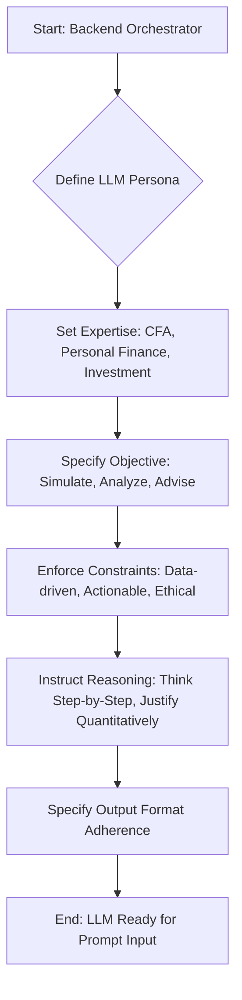
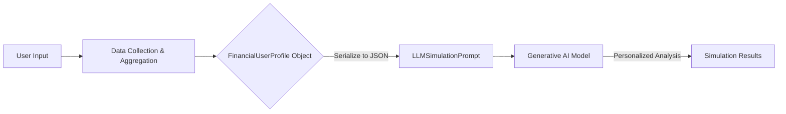
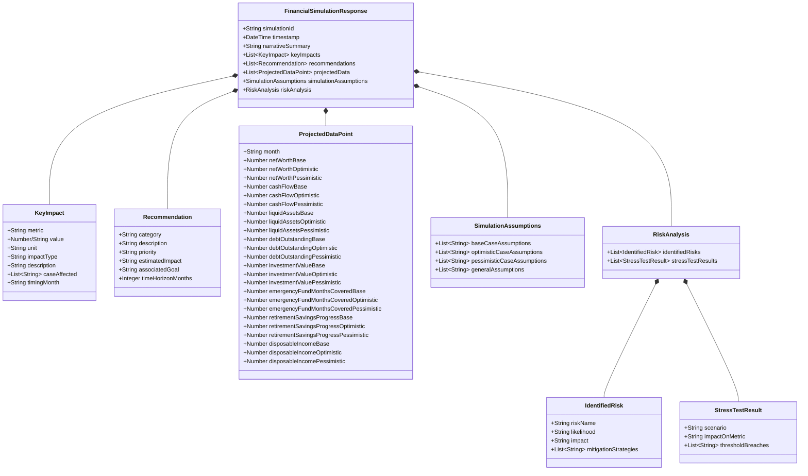
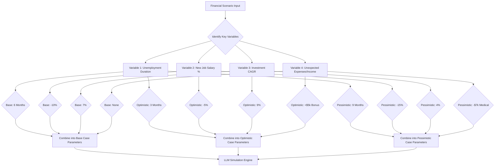
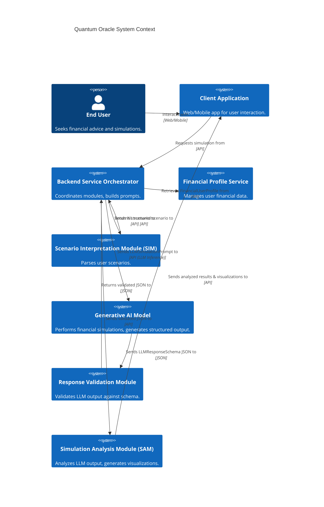

**Title of Invention:** Advanced Prompt Engineering for Generative AI Financial Simulation Outputs

**Abstract:**
A methodology is disclosed for constructing highly effective prompts and defining rigid response schemas for large language models LLMs engaged in financial simulation. This invention specifies the detailed integration of a user's `FinancialUserProfile` with natural language scenario prompts, augmented by explicit system instructions for the LLM. The objective is to consistently generate accurate, multi-case (base, optimistic, pessimistic) financial projections, narrative summaries, quantitative impact analyses, and actionable recommendations. The core innovation lies in leveraging a comprehensive JSON `LLMResponseSchema` to ensure the LLM's output is structured, machine-parsable, and directly consumable by downstream modules for display and further analysis, eliminating ambiguity and enhancing system reliability. This methodology incorporates advanced quantitative financial models, robust risk assessment frameworks, and dynamic recommendation generation algorithms, all facilitated by sophisticated prompt engineering to achieve unparalleled precision and user-centricity.

**Background of the Invention:**
Generative AI models, while powerful in language understanding and generation, often require meticulous guidance to produce domain-specific, structured outputs suitable for automated systems. In complex applications like financial simulation, unstructured or inconsistent AI responses can lead to significant challenges in data extraction, processing, and user presentation. Traditional AI prompting often lacks the specificity needed to force a model into a predefined output format, leading to variability, errors, and a need for extensive post-processing. There is a critical need for a systematic approach to prompt engineering that compels LLMs to act as precise analytical engines, delivering predictable and structured financial insights, rather than just free-form text. The current state of art often struggles with integrating dynamic, real-time user data into complex analytical tasks within LLMs, making personalized, multi-scenario financial projections a significant challenge. Furthermore, ensuring the mathematical rigor and logical consistency of LLM-generated financial advice remains an open problem.

**Brief Summary of the Invention:**
The present invention defines the precise `LLMSimulationPrompt` and the `LLMResponseSchema` crucial for guiding the Generative AI Model within the Quantum Oracle system. The `LLMSimulationPrompt` is a composite input strategically designed to endow the LLM with the persona of an expert financial analyst. It embeds the complete `FinancialUserProfile` alongside the user's natural language scenario, refined by the Scenario Interpretation Module SIM. Crucially, it includes explicit directives for generating base, optimistic, and pessimistic financial projections, along with underlying quantitative rationale. The `LLMResponseSchema` is a rigorous JSON schema provided directly within the prompt itself. This schema dictates the exact structure, data types, and required fields for the LLM's output, ensuring every simulation result is consistently formatted. This structured output facilitates seamless integration with the Simulation Analysis Module SAM and the client application, enabling automated parsing and visualization of complex financial data and recommendations. The invention further encompasses the integration of sophisticated quantitative financial models, risk assessment methodologies, and a dynamic recommendation engine, all orchestrated through the meticulously engineered prompt.

**Detailed Description of Prompt Engineering:**
The efficacy of the Quantum Oracle's generative AI component is fundamentally reliant on sophisticated prompt engineering. This involves crafting an intelligent input prompt `LLMSimulationPrompt` and enforcing a strict `LLMResponseSchema` for the output. These two elements collaborate to transform a general-purpose LLM into a specialized financial simulation engine, capable of performing complex calculations, scenario analysis, and personalized advice generation.

### 1. The `LLMSimulationPrompt` Construction

The `LLMSimulationPrompt` is dynamically assembled by the Backend Service Orchestrator. It serves as the primary instruction set for the Generative AI Model, guiding its behavior and output format. The prompt comprises several distinct sections to provide comprehensive context, clear directives, and necessary constraints.

#### A. System Role Definition
This initial section establishes the AI's persona, expertise, and expected behavioral constraints. It instructs the LLM to adopt a professional, analytical, and empathetic stance, focusing on financial prudence, clarity, and precision in all generated outputs. It emphasizes the need for a deep understanding of financial principles and the ability to apply them to complex, dynamic user scenarios. The LLM is also guided to adopt a "think step-by-step" approach to ensure logical consistency and traceable reasoning in its analytical processes before generating the final structured output.

```
You are an expert Certified Financial Analyst CFA, with extensive knowledge in personal finance, investment management, and risk assessment. Your primary objective is to simulate and analyze complex financial scenarios for individual users. Your analysis must be comprehensive, data-driven, and actionable, adhering to the highest standards of financial rigor and ethical conduct. Focus on providing clear, precise, and personalized financial insights, always prioritizing the user's long-term financial well-being. Adhere strictly to the provided output format and provide quantitative justification where appropriate. Engage in a logical, step-by-step reasoning process internally before presenting your final conclusions. Ensure all calculations are accurate and reflect generally accepted financial principles. Do not speculate or provide advice outside the scope of the provided data and scenario.
```

**Mermaid Chart 1: LLM System Role Definition Process**


#### B. User Financial Profile Context
This critical section provides the LLM with the complete, current financial state of the user. The `FinancialUserProfile` object, detailed in the main invention, is serialized into a structured format (e.g., JSON) and embedded directly into the prompt. This ensures the LLM has all necessary data points to perform a highly personalized simulation, including assets, liabilities, income, expenses, financial goals, risk tolerance, and current market conditions impacting the user. This detailed profile enables the LLM to generate contextually relevant projections and recommendations.

```
---
**User's Current Financial Profile (JSON):**
{
  "profileId": "USER12345",
  "name": "Jane Doe",
  "age": 35,
  "maritalStatus": "Single",
  "dependents": 0,
  "riskTolerance": "moderate",
  "currentLocation": "New York, NY",
  "income": {
    "primaryJob": { "source": "Software Engineer", "annualGross": 120000, "frequency": "monthly", "netMonthly": 7500 },
    "rentalProperty": { "source": "Investment Property", "monthlyGross": 1500, "netMonthly": 1000, "isPassive": true }
  },
  "expenses": {
    "housing": { "rentMortgage": 2500, "utilities": 300 },
    "transportation": { "carPayment": 400, "insurance": 150, "fuelMaintenance": 200 },
    "food": { "groceries": 600, "diningOut": 300 },
    "discretionary": { "entertainment": 400, "subscriptions": 100 },
    "debtPayments": { "studentLoan": 300, "creditCardMin": 50 },
    "savingsContributions": { "401k": 800, "emergencyFund": 500 },
    "other": 200
  },
  "assets": {
    "cashAndEquivalents": { "checking": 5000, "savings": 25000, "emergencyFund": 15000 },
    "investments": {
      "401k": { "value": 80000, "assetAllocation": "moderateGrowth" },
      "brokerage": { "value": 40000, "assetAllocation": "balanced" },
      "crypto": { "value": 5000, "assetAllocation": "speculative" }
    },
    "realEstate": { "primaryHome": { "value": 500000, "mortgageBalance": 300000, "equity": 200000 }, "rentalProperty": { "value": 250000, "mortgageBalance": 150000, "equity": 100000 } },
    "otherAssets": { "carValue": 20000 }
  },
  "liabilities": {
    "mortgages": { "primaryMortgage": 300000, "rentalMortgage": 150000 },
    "studentLoans": { "balance": 25000, "interestRate": 4.5, "minPayment": 300 },
    "creditCards": { "balance": 3000, "interestRate": 18.9, "minPayment": 50 },
    "carLoan": { "balance": 15000, "interestRate": 6.0, "minPayment": 400 }
  },
  "financialGoals": [
    { "name": "Emergency Fund Target", "targetAmount": 30000, "priority": "high", "type": "savings" },
    { "name": "Retirement", "targetAge": 65, "targetAnnualIncome": 80000, "priority": "high", "type": "longTermInvestment" },
    { "name": "Down Payment for Vacation Home", "targetAmount": 100000, "targetDate": "2030-01-01", "priority": "medium", "type": "savings" }
  ],
  "marketConditions": {
    "inflationRate": 3.5,
    "equityMarketCAGR": 7.0,
    "bondMarketYield": 4.0,
    "savingsAccountInterest": 0.5
  }
}
---
```

**Mermaid Chart 2: FinancialUserProfile Data Flow**


#### C. Scenario and Task Instructions
This section conveys the user's specific hypothetical scenario and outlines the precise requirements for the simulation. It details the duration of the projection, the types of analyses expected, and the mandatory output structure. The user's natural language prompt, potentially refined by the Scenario Interpretation Module SIM into a more structured event, is placed here. The instructions also explicitly demand quantitative rigor, specifying the parameters for base, optimistic, and pessimistic cases, and linking them to a comprehensive set of financial metrics.

```
---
**Financial Scenario to Simulate:**
[Insert the user's natural language scenario prompt here. Example: "What if I lose my job for 6 months, starting next month, and then find a new job that pays 10% less? How does this impact my ability to save for retirement and maintain my emergency fund?"]

**Simulation Directives:**
1.  **Simulation Horizon:** Project the financial impact over the next [N] months, starting from the current month. N will be determined by the SIM, typically 12, 24, 36, or 60 months based on scenario complexity. For this scenario, N=36 months.
2.  **Projection Modalities:** Generate financial trajectories for three distinct cases for all key metrics, using the following assumptions and methodologies:
    *   **Base Case (Most Probable):**
        *   Reflects the most probable outcome.
        *   Job loss duration: exactly 6 months.
        *   New job income: 10% less than previous primary job income.
        *   Investment returns: Aligned with historical averages for `riskTolerance` (e.g., 7% CAGR for moderateGrowth).
        *   Inflation: As per `marketConditions.inflationRate` (3.5%).
        *   Expenses: Adjusted for inflation, 5% reduction in discretionary spending during unemployment.
        *   Debt: Minimum payments maintained.
    *   **Optimistic Case (Favorable Outcome):**
        *   Reflects a more favorable future.
        *   Job loss duration: 3 months.
        *   New job income: 5% less than previous primary job income.
        *   Investment returns: `Base Case CAGR + 2%` (e.g., 9% CAGR).
        *   Unexpected income: A one-time bonus of $5,000 received in month 10.
        *   Expenses: 10% reduction in discretionary spending during unemployment, 2% reduction in non-essential recurring expenses.
        *   Debt: Accelerated payment on highest interest debt after re-employment.
    *   **Pessimistic Case (Unfavorable Outcome):**
        *   Illustrates a less favorable future.
        *   Job loss duration: 9 months.
        *   New job income: 15% less than previous primary job income.
        *   Investment returns: `Base Case CAGR - 3%` (e.g., 4% CAGR), with an initial 10% portfolio drawdown in month 2 due to market volatility.
        *   Unexpected large expense: A medical emergency costing $7,000 in month 4, not covered by insurance.
        *   Expenses: Only 2% reduction in discretionary spending during unemployment. Essential expenses increase by 5% due to unforeseen circumstances.
        *   Debt: Minimum payments missed on credit card for 2 months, incurring penalties.
3.  **Output Mandate:** Your response MUST be a single JSON object. This object MUST strictly conform to the `LLMResponseSchema` provided below. Do not include any text, dialogue, or explanations outside of this JSON structure.
4.  **Content Requirements:**
    *   **Narrative Summary:** A professional, concise summary of the simulation's overall findings, key turning points, and significant financial shifts over the simulation period. This should highlight the most critical insights from the simulation, clearly differentiating outcomes across the three modalities.
    *   **Key Impacts:** Quantitative and qualitative analyses of the most crucial effects on the user's financial health and goals. Each impact must be quantified where possible, with a clear explanation of its derivation.
    *   **Actionable Recommendations:** Specific, prioritized, and personalized advice to navigate the simulated scenario effectively. Recommendations should be directly linked to mitigating negative impacts or leveraging opportunities identified in the simulation, providing estimated quantitative benefits.
    *   **Projected Data:** Month-by-month time-series data for critical financial metrics under all three projection modalities. Ensure mathematical consistency and realistic progression based on the defined scenario parameters and financial principles.
```

**Mermaid Chart 3: Scenario Interpretation and Projection Modalities**
```mermaid
graph TD
    A[User NL Scenario] --> B{Scenario Interpretation Module (SIM)};
    B -- Structured Event & Parameters --> C[LLMSimulationPrompt];
    C --> D[Define Base Case Parameters];
    C --> E[Define Optimistic Case Parameters];
    C --> F[Define Pessimistic Case Parameters];
    D & E & F --> G[Generative AI Model];
    G -- Multi-modal Projections --> H[LLMResponseSchema Output];
```

#### D. `LLMResponseSchema` Inclusion
The most crucial component of the `LLMSimulationPrompt` is the embedded `LLMResponseSchema`. This JSON schema acts as a contract, explicitly defining the expected structure, data types, and enumeration constraints for the LLM's output. The LLM is instructed to embed the simulation results directly within this schema, ensuring machine-readability and downstream processing efficiency. This rigorous enforcement eliminates ambiguity and ensures that the output can be reliably parsed and utilized by other system components like the Simulation Analysis Module (SAM) and the client application for visualization and further processing.

```
---
**Required Output JSON Schema:**
[Insert the complete LLMResponseSchema JSON here. The LLM's output must be valid against this schema.]
---
```

**Mermaid Chart 4: Prompt Construction Flow**
```mermaid
graph TD
    A[Backend Orchestrator] --> B(Retrieve User Profile);
    A --> C(Receive Scenario from SIM);
    A --> D(Load LLMResponseSchema);
    B & C & D --> E(Construct LLMSimulationPrompt);
    E --> F[Send Prompt to LLM];
    F --> G(LLM Processing);
    G --> H[LLM Output (JSON)];
    H --> I(Validate against Schema);
    I --> J[Return Validated Response];
```

### 2. The `LLMResponseSchema` Definition

The `LLMResponseSchema` is a JSON schema document that precisely dictates the structure of the generative AI model's output. This schema is critical for ensuring machine-readability, consistency, and completeness of the simulation results, allowing downstream modules to reliably parse and utilize the data.

```json
{
  "$schema": "http://json-schema.org/draft-07/schema#",
  "title": "FinancialSimulationResponse",
  "description": "Structured output for financial simulation results from a generative AI model.",
  "type": "object",
  "required": [
    "simulationId",
    "timestamp",
    "narrativeSummary",
    "keyImpacts",
    "recommendations",
    "projectedData",
    "simulationAssumptions"
  ],
  "properties": {
    "simulationId": {
      "type": "string",
      "format": "uuid",
      "description": "Unique identifier for this specific simulation run."
    },
    "timestamp": {
      "type": "string",
      "format": "date-time",
      "description": "Timestamp of when the simulation response was generated."
    },
    "narrativeSummary": {
      "type": "string",
      "description": "A concise, professional narrative explaining the overall financial trajectory, key turning points, and significant financial shifts over the simulation period across all cases (base, optimistic, pessimistic). This should highlight the most critical insights from the simulation and provide a comparative analysis."
    },
    "keyImpacts": {
      "type": "array",
      "description": "A list of the most critical impacts identified during the financial simulation, affecting the user's financial profile, goals, or stability. Each impact is quantified and categorized, often reflecting specific events or cumulative effects.",
      "items": {
        "type": "object",
        "required": ["metric", "value", "impactType", "description", "caseAffected", "timingMonth"],
        "properties": {
          "metric": {
            "type": "string",
            "description": "The specific financial metric or area impacted (e.g., 'Net Worth', 'Monthly Cash Flow', 'Emergency Fund Shortfall', 'Retirement Savings')."
          },
          "value": {
            "type": ["number", "string"],
            "description": "The quantitative impact on the metric (e.g., '-$15000', '+5%'). Qualitative impacts (e.g., 'Severe', 'Moderate') are allowed if numerical quantification is impractical or misleading, but numerical is preferred."
          },
          "unit": {
            "type": "string",
            "description": "Unit of the value, if applicable (e.g., 'USD', '%', 'months').",
            "nullable": true
          },
          "impactType": {
            "type": "string",
            "enum": ["positive", "negative", "neutral", "critical_risk", "opportunity", "goal_deviation"],
            "description": "Categorization of the impact's nature to quickly convey its sentiment and severity."
          },
          "description": {
            "type": "string",
            "description": "A clear, concise explanation of why this impact occurred and its implications for the user's financial situation."
          },
          "caseAffected": {
            "type": "array",
            "items": {
              "type": "string",
              "enum": ["base", "optimistic", "pessimistic"]
            },
            "description": "The simulation case(s) where this impact is most prominent."
          },
          "timingMonth": {
            "type": "string",
            "format": "YYYY-MM",
            "description": "The approximate month when this impact is first or most significantly observed, formatted as YYYY-MM.",
            "nullable": true
          }
        }
      }
    },
    "recommendations": {
      "type": "array",
      "description": "A list of concrete, prioritized, and personalized recommendations derived from the simulation results, designed to improve the user's financial health or mitigate risks. Each recommendation includes estimated quantitative impact.",
      "items": {
        "type": "object",
        "required": ["category", "description", "priority", "estimatedImpact"],
        "properties": {
          "category": {
            "type": "string",
            "enum": ["Mitigation", "Optimization", "Opportunity", "GoalAcceleration", "RiskManagement", "IncomeEnhancement", "ExpenseReduction", "DebtManagement", "InvestmentStrategy"],
            "description": "The strategic category of the recommendation, indicating its primary focus."
          },
          "description": {
            "type": "string",
            "description": "The detailed, actionable advice for the user to implement. This should be clear, specific, and directly linked to simulation findings."
          },
          "priority": {
            "type": "string",
            "enum": ["low", "medium", "high", "critical"],
            "description": "The urgency and importance of the recommendation, guiding the user on where to focus their immediate attention."
          },
          "estimatedImpact": {
            "type": "string",
            "description": "A quantifiable or qualitative estimate of the potential benefit or positive change if the recommendation is followed (e.g., 'Increase savings by $5000/year', 'Reduces risk of default by 30%', 'Accelerates goal by 6 months', 'Improves cash flow by $200/month')."
          },
          "associatedGoal": {
            "type": "string",
            "description": "Optional: The specific financial goal this recommendation primarily helps to achieve or protect.",
            "nullable": true
          },
          "timeHorizonMonths": {
            "type": "integer",
            "description": "Estimated time horizon in months for realizing the main impact of the recommendation.",
            "nullable": true
          }
        }
      }
    },
    "projectedData": {
      "type": "array",
      "description": "Time-series data for projected financial metrics on a monthly basis over the simulation period, presented for base, optimistic, and pessimistic cases. All values are at the end of the respective month unless specified otherwise.",
      "items": {
        "type": "object",
        "required": ["month", "netWorthBase", "netWorthOptimistic", "netWorthPessimistic", "cashFlowBase", "cashFlowOptimistic", "cashFlowPessimistic", "liquidAssetsBase", "liquidAssetsOptimistic", "liquidAssetsPessimistic", "debtOutstandingBase", "debtOutstandingOptimistic", "debtOutstandingPessimistic", "investmentValueBase", "investmentValueOptimistic", "investmentValuePessimistic", "emergencyFundMonthsCoveredBase", "emergencyFundMonthsCoveredOptimistic", "emergencyFundMonthsCoveredPessimistic"],
        "properties": {
          "month": {
            "type": "string",
            "format": "YYYY-MM",
            "description": "The specific month for the projection, formatted as YYYY-MM (e.g., '2024-01')."
          },
          "netWorthBase": {
            "type": "number",
            "description": "Projected total net worth for the base case at the end of the month."
          },
          "netWorthOptimistic": {
            "type": "number",
            "description": "Projected total net worth for the optimistic case at the end of the month."
          },
          "netWorthPessimistic": {
            "type": "number",
            "description": "Projected total net worth for the pessimistic case at the end of the month."
          },
          "cashFlowBase": {
            "type": "number",
            "description": "Projected monthly net cash flow (income minus expenses) for the base case."
          },
          "cashFlowOptimistic": {
            "type": "number",
            "description": "Projected monthly net cash flow for the optimistic case."
          },
          "cashFlowPessimistic": {
            "type": "number",
            "description": "Projected monthly net cash flow for the pessimistic case."
          },
          "liquidAssetsBase": {
            "type": "number",
            "description": "Projected total liquid assets (e.g., checking, savings, emergency fund) for the base case at the end of the month."
          },
          "liquidAssetsOptimistic": {
            "type": "number",
            "description": "Projected total liquid assets for the optimistic case at the end of the month."
          },
          "liquidAssetsPessimistic": {
            "type": "number",
            "description": "Projected total liquid assets for the pessimistic case at the end of the month."
          },
          "debtOutstandingBase": {
            "type": "number",
            "description": "Projected total outstanding debt for the base case at the end of the month. Includes all liabilities."
          },
          "debtOutstandingOptimistic": {
            "type": "number",
            "description": "Projected total outstanding debt for the optimistic case at the end of the month."
          },
          "debtOutstandingPessimistic": {
            "type": "number",
            "description": "Projected total outstanding debt for the pessimistic case at the end of the month."
          },
          "investmentValueBase": {
            "type": "number",
            "description": "Projected total investment portfolio value (e.g., 401k, brokerage, crypto) for the base case at the end of the month."
          },
          "investmentValueOptimistic": {
            "type": "number",
            "description": "Projected total investment portfolio value for the optimistic case at the end of the month."
          },
          "investmentValuePessimistic": {
            "type": "number",
            "description": "Projected total investment portfolio value for the pessimistic case at the end of the month."
          },
          "emergencyFundMonthsCoveredBase": {
            "type": "number",
            "description": "Projected number of months of essential expenses covered by the emergency fund for the base case. Calculated as (Emergency Fund Balance / Monthly Essential Expenses)."
          },
          "emergencyFundMonthsCoveredOptimistic": {
            "type": "number",
            "description": "Projected number of months of essential expenses covered by the emergency fund for the optimistic case."
          },
          "emergencyFundMonthsCoveredPessimistic": {
            "type": "number",
            "description": "Projected number of months of essential expenses covered by the emergency fund for the pessimistic case."
          },
          "retirementSavingsProgressBase": {
            "type": "number",
            "description": "Projected percentage progress towards the retirement savings goal for the base case.",
            "nullable": true
          },
          "retirementSavingsProgressOptimistic": {
            "type": "number",
            "description": "Projected percentage progress towards the retirement savings goal for the optimistic case.",
            "nullable": true
          },
          "retirementSavingsProgressPessimistic": {
            "type": "number",
            "description": "Projected percentage progress towards the retirement savings goal for the pessimistic case.",
            "nullable": true
          },
          "disposableIncomeBase": {
            "type": "number",
            "description": "Projected monthly disposable income (net income - essential expenses - debt payments) for the base case.",
            "nullable": true
          },
          "disposableIncomeOptimistic": {
            "type": "number",
            "description": "Projected monthly disposable income for the optimistic case.",
            "nullable": true
          },
          "disposableIncomePessimistic": {
            "type": "number",
            "description": "Projected monthly disposable income for the pessimistic case.",
            "nullable": true
          }
        }
      }
    },
    "simulationAssumptions": {
      "type": "object",
      "description": "Summary of core assumptions used in the simulation, especially for base, optimistic, and pessimistic cases.",
      "properties": {
        "baseCaseAssumptions": {
          "type": "array",
          "items": { "type": "string" },
          "description": "Key assumptions for the base case."
        },
        "optimisticCaseAssumptions": {
          "type": "array",
          "items": { "type": "string" },
          "description": "Key assumptions for the optimistic case."
        },
        "pessimisticCaseAssumptions": {
          "type": "array",
          "items": { "type": "string" },
          "description": "Key assumptions for the pessimistic case."
        },
        "generalAssumptions": {
          "type": "array",
          "items": { "type": "string" },
          "description": "General assumptions applicable across all cases (e.g., tax rates, life expectancy)."
        }
      }
    },
    "riskAnalysis": {
      "type": "object",
      "description": "Detailed risk assessment derived from the simulation, focusing on potential adverse events and their likelihood/impact.",
      "properties": {
        "identifiedRisks": {
          "type": "array",
          "items": {
            "type": "object",
            "required": ["riskName", "likelihood", "impact", "mitigationStrategies"],
            "properties": {
              "riskName": { "type": "string", "description": "Name or description of the identified risk." },
              "likelihood": { "type": "string", "enum": ["low", "medium", "high", "critical"], "description": "Likelihood of the risk occurring." },
              "impact": { "type": "string", "enum": ["minor", "moderate", "significant", "severe"], "description": "Potential impact if the risk materializes." },
              "mitigationStrategies": {
                "type": "array",
                "items": { "type": "string" },
                "description": "Suggested strategies to mitigate or avoid the risk."
              }
            }
          }
        },
        "stressTestResults": {
          "type": "array",
          "items": {
            "type": "object",
            "required": ["scenario", "impactOnMetric", "thresholdBreaches"],
            "properties": {
              "scenario": { "type": "string", "description": "Description of the stress test scenario (e.g., 'Market Downturn -20%', 'Extended Unemployment')." },
              "impactOnMetric": { "type": "string", "description": "Quantifiable impact on key financial metric (e.g., 'Net Worth decreased by $50,000')." },
              "thresholdBreaches": {
                "type": "array",
                "items": { "type": "string" },
                "description": "List of critical thresholds breached (e.g., 'Emergency Fund depleted', 'Debt-to-income ratio exceeds 40%')."
              }
            }
          },
          "nullable": true
        }
      }
    }
  }
}
```

**Mermaid Chart 5: `LLMResponseSchema` Structure**


### 3. Quantitative Financial Modeling Principles

The LLM, guided by the prompt, is expected to internally apply fundamental financial modeling principles to generate the `projectedData`. This involves simulating the flow of money, asset growth, debt amortization, and expense changes over time. The following mathematical formulas and concepts are foundational to the simulation process:

#### 3.1. Core Financial Identity
**Equation 1: Net Worth (NW)**
$$ NW_t = Assets_t - Liabilities_t $$
Where $NW_t$ is Net Worth at time $t$, $Assets_t$ are total assets, and $Liabilities_t$ are total liabilities.

**Equation 2: Monthly Cash Flow (CF)**
$$ CF_t = \text{Total Income}_t - \text{Total Expenses}_t $$
Where $CF_t$ is Monthly Cash Flow at time $t$.

#### 3.2. Income and Expense Projections
**Equation 3: Inflation-Adjusted Expense (E_adj)**
$$ E_{t+1} = E_t \times (1 + r_{inflation}) $$
Where $r_{inflation}$ is the monthly inflation rate.

**Equation 4: Net Income after Taxes (NI_net)**
$$ NI_{net,t} = \text{Gross Income}_t \times (1 - \text{Effective Tax Rate}_t) - \text{Pre-tax Deductions}_t $$

**Equation 5: Monthly Disposable Income (DI)**
$$ DI_t = \text{Net Income}_t - \text{Essential Expenses}_t - \text{Mandatory Debt Payments}_t $$

#### 3.3. Asset Growth Modeling
**Equation 6: Simple Investment Growth (Future Value - FV)**
$$ FV = PV \times (1 + r)^n $$
Where $PV$ is Present Value, $r$ is monthly interest/return rate, and $n$ is number of periods.

**Equation 7: Future Value of an Ordinary Annuity (FVOA) - Regular Contributions**
$$ FVOA = PMT \times \frac{(1 + r)^n - 1}{r} $$
Where $PMT$ is the periodic payment.

**Equation 8: Total Investment Value (V_inv)**
$$ V_{inv,t} = V_{inv,t-1} \times (1 + r_{investment}) + \text{New Contributions}_t - \text{Withdrawals}_t $$
Where $r_{investment}$ is the monthly investment return rate.

**Equation 9: Emergency Fund Balance (EF_bal)**
$$ EF_{bal,t} = EF_{bal,t-1} + \text{EF Contributions}_t - \text{EF Withdrawals}_t + (\text{EF}_{bal,t-1} \times r_{savings}) $$
Where $r_{savings}$ is the monthly savings account interest rate.

**Equation 10: Months of Emergency Fund Coverage (EF_months)**
$$ EF_{months,t} = \frac{EF_{bal,t}}{\text{Essential Monthly Expenses}_t} $$

#### 3.4. Debt Amortization
**Equation 11: Monthly Loan Payment (M_PMT)**
$$ M_{PMT} = P \times \frac{r(1+r)^n}{(1+r)^n - 1} $$
Where $P$ is principal, $r$ is monthly interest rate, and $n$ is total number of monthly payments.

**Equation 12: Remaining Loan Balance (B_rem)**
$$ B_{rem,t} = B_{rem,t-1} \times (1+r_{loan}) - \text{Loan Payment}_t $$

#### 3.5. Financial Ratios and Health Metrics
**Equation 13: Debt-to-Income Ratio (DTI)**
$$ DTI_t = \frac{\text{Total Monthly Debt Payments}_t}{\text{Gross Monthly Income}_t} $$

**Equation 14: Savings Rate (SR)**
$$ SR_t = \frac{\text{Total Monthly Savings}_t}{\text{Net Monthly Income}_t} \times 100\% $$

**Equation 15: Liquidity Ratio (LR)**
$$ LR_t = \frac{\text{Liquid Assets}_t}{\text{Monthly Essential Expenses}_t} $$

**Equation 16: Retirement Savings Gap (RSG)**
$$ RSG_t = \text{Target Retirement Savings} - \text{Projected Retirement Savings}_t $$

**Equation 17: Compound Annual Growth Rate (CAGR)**
$$ CAGR = \left( \frac{EV}{BV} \right)^{\frac{1}{n}} - 1 $$
Where $EV$ is Ending Value, $BV$ is Beginning Value, $n$ is number of years.

**Equation 18: Real Rate of Return (r_real)**
$$ r_{real} = \frac{(1 + r_{nominal})}{(1 + r_{inflation})} - 1 $$

#### 3.6. Stochastic Elements and Risk Assessment
The LLM must incorporate stochastic elements for optimistic and pessimistic scenarios.

**Equation 19: Expected Value (E_V)**
$$ E_V = \sum_{i=1}^{k} x_i P(x_i) $$
Where $x_i$ is outcome $i$ and $P(x_i)$ is its probability.

**Equation 20: Standard Deviation (σ)**
$$ \sigma = \sqrt{\frac{1}{N} \sum_{i=1}^{N} (x_i - \mu)^2} $$
Where $N$ is number of data points, $x_i$ is individual data point, $\mu$ is mean. Used for volatility.

**Equation 21: Value at Risk (VaR)**
$$ VaR_p = \text{Portfolio Value} \times \text{Volatility} \times \text{Z-score}_p $$
(Simplified, more complex models involve specific distributions like Historical VaR or Parametric VaR)

**Equation 22: Debt Service Coverage Ratio (DSCR)**
$$ DSCR = \frac{\text{Net Operating Income}}{\text{Total Debt Service}} $$

**Equation 23: Monte Carlo Simulation (General Principle)**
$$ \text{Future Portfolio Value} = \sum_{j=1}^{M} \text{Path}_j / M $$
Where $M$ is number of simulation paths, and each $\text{Path}_j$ is generated by:
$$ S_t = S_{t-1} \times e^{((\mu - \frac{1}{2}\sigma^2)\Delta t + \sigma \sqrt{\Delta t} Z)} $$
Where $S_t$ is asset price at time $t$, $\mu$ is expected return, $\sigma$ is volatility, $\Delta t$ is time step, $Z$ is random variable from standard normal distribution.

**Equation 24: Weighted Average Cost of Capital (WACC)**
$$ WACC = \frac{E}{V} R_e + \frac{D}{V} R_d (1 - T) $$
While typically for corporate finance, components might be used for large personal investments or small business considerations within the `FinancialUserProfile`.

**Equation 25: Future Value with Continuous Compounding**
$$ FV = PV \times e^{rt} $$

**Equation 26: Present Value (PV)**
$$ PV = \frac{FV}{(1+r)^n} $$

**Equation 27: Present Value of an Ordinary Annuity (PVOA)**
$$ PVOA = PMT \times \frac{1 - (1+r)^{-n}}{r} $$

**Equation 28: Rule of 72 (Approximate Doubling Time)**
$$ \text{Years to Double} \approx \frac{72}{\text{Annual Interest Rate (%)}} $$

**Equation 29: Loan Interest Paid per Period (I_period)**
$$ I_{period,t} = \text{Outstanding Principal}_{t-1} \times r_{loan,monthly} $$

**Equation 30: Loan Principal Paid per Period (P_period)**
$$ P_{period,t} = \text{Monthly Payment} - I_{period,t} $$

**Equation 31: Inflation-Adjusted Income (I_adj)**
$$ I_{adj,t} = I_{initial} \times (1 + r_{income\_growth})^t $$
Where $r_{income\_growth}$ might be real wage growth.

**Equation 32: Essential vs. Discretionary Expense Ratio**
$$ \text{EERatio} = \frac{\text{Essential Expenses}}{\text{Total Expenses}} $$

**Equation 33: Capital Gains Tax (CGT)**
$$ CGT = (\text{Selling Price} - \text{Basis}) \times \text{Capital Gains Tax Rate} $$

**Equation 34: Return on Investment (ROI)**
$$ ROI = \frac{(\text{Current Value} - \text{Initial Cost})}{\text{Initial Cost}} \times 100\% $$

**Equation 35: Break-even Point (BEP) for a new venture/side-hustle**
$$ BEP_{\text{units}} = \frac{\text{Fixed Costs}}{\text{Price per Unit} - \text{Variable Cost per Unit}} $$

**Equation 36: Net Present Value (NPV) for a series of cash flows**
$$ NPV = \sum_{t=0}^{n} \frac{CF_t}{(1+r)^t} $$

**Equation 37: Internal Rate of Return (IRR)**
$$ 0 = \sum_{t=0}^{n} \frac{CF_t}{(1+IRR)^t} $$

**Equation 38: Modified Duration (MD) for bond portfolio sensitivity**
$$ MD = \frac{Duration}{(1+y/k)} $$
Where $y$ is yield to maturity, $k$ is compounding frequency.

**Equation 39: Expected Shortfall (ES)**
$$ ES = E[L | L > VaR] $$
Average loss when loss ($L$) exceeds VaR.

**Equation 40: Credit Score Impact (Simplified Model for LLM Reasoning)**
$$ \text{Credit Score Change} = f(\text{Payment History}, \text{Credit Utilization}, \text{New Credit}) $$

**Equation 41: Housing Affordability Ratio (HAR)**
$$ HAR = \frac{\text{Median Household Income}}{\text{Median Home Price}} $$

**Equation 42: College Savings Target (simplified)**
$$ \text{Target} = C_{current} \times (1 + \text{r}_{tuition\_inflation})^n $$

**Equation 43: Savings Goal Attainment (SGA)**
$$ SGA = \frac{\text{Current Savings}}{\text{Target Savings}} $$

**Equation 44: Income Replacement Ratio (IRR_retire)**
$$ IRR_{\text{retire}} = \frac{\text{Desired Retirement Income}}{\text{Pre-retirement Income}} $$

**Equation 45: Effective Annual Rate (EAR)**
$$ EAR = (1 + \frac{APR}{n})^n - 1 $$

**Equation 46: Loan-to-Value Ratio (LTV)**
$$ LTV = \frac{\text{Loan Amount}}{\text{Appraised Value}} $$

**Equation 47: Portfolio Variance (for two assets)**
$$ \sigma_p^2 = w_A^2 \sigma_A^2 + w_B^2 \sigma_B^2 + 2 w_A w_B \rho_{AB} \sigma_A \sigma_B $$

**Equation 48: Sharpe Ratio (SR)**
$$ SR = \frac{R_p - R_f}{\sigma_p} $$
Where $R_p$ is portfolio return, $R_f$ is risk-free rate, $\sigma_p$ is portfolio standard deviation.

**Equation 49: Capital Asset Pricing Model (CAPM)**
$$ E(R_i) = R_f + \beta_i (E(R_m) - R_f) $$

**Equation 50: Sustainable Withdrawal Rate (SWR)**
$$ SWR = \frac{\text{Annual Withdrawal}}{\text{Portfolio Value}} $$

**Equation 51: Asset Allocation (A_Alloc)**
$$ A_{Alloc,t} = \text{Current Portfolio Value} \times \text{Target Allocation Percentage} $$

**Equation 52: Net Operating Income (NOI) for rental property**
$$ NOI = \text{Rental Income} - \text{Operating Expenses} $$

**Equation 53: Cap Rate (CR) for real estate investment**
$$ CR = \frac{NOI}{\text{Property Value}} $$

**Equation 54: Payback Period (PBP)**
$$ PBP = \frac{\text{Initial Investment}}{\text{Annual Cash Inflow}} $$

**Equation 55: Marginal Tax Rate (MTR)**
$$ MTR = \frac{\Delta \text{Tax Due}}{\Delta \text{Taxable Income}} $$

**Equation 56: Average Tax Rate (ATR)**
$$ ATR = \frac{\text{Total Tax Due}}{\text{Total Taxable Income}} $$

**Equation 57: Present Value of Future Income (PV_Income)**
$$ PV_{\text{Income}} = \sum_{t=1}^{\text{Retirement Age}} \frac{\text{Annual Income}_t}{(1+r)^t} $$

**Equation 58: Cost Basis Adjustment (Inflation)**
$$ CB_{adj} = CB_{initial} \times (1 + r_{inflation})^{\text{holding period}} $$

**Equation 59: Investment Portfolio Diversification Score (simplified)**
$$ D\_Score = \frac{1}{\sum_{i=1}^N w_i^2} $$
(Inverse of Herfindahl index, for portfolio weights $w_i$)

**Equation 60: Probability of Ruin (simplified conceptual)**
$$ P_{ruin} = f(\text{Withdrawal Rate}, \text{Volatility}, \text{Returns}, \text{Time Horizon}) $$

**Equation 61: Target Savings for Goal (TSG)**
$$ TSG = \frac{\text{Target Amount} - \text{Current Savings} \times (1+r)^n}{\frac{(1+r)^n - 1}{r}} \times r $$
(Solving for PMT to reach FV goal)

**Equation 62: Loan Amortization Schedule (Interest per period, $I_p$)**
$$ I_p = L_{balance} \times \frac{r_{annual}}{12} $$

**Equation 63: Loan Amortization Schedule (Principal per period, $P_p$)**
$$ P_p = \text{Monthly Payment} - I_p $$

**Equation 64: Real Estate Appreciation (REA)**
$$ REA_t = \text{Property Value}_{t-1} \times (1 + r_{appreciation}) $$

**Equation 65: Annual Contribution to Retirement Account (AC_retire)**
$$ AC_{\text{retire}, t} = \text{Contribution Limit} \times (1 + \text{Inflation for limits})^t $$

**Equation 66: Child Care Cost Projection (CCCP)**
$$ CCCP_t = \text{Current Cost} \times (1 + r_{childcare\_inflation})^t $$

**Equation 67: Long-Term Care Cost Projection (LTCCP)**
$$ LTCCP_t = \text{Current Cost} \times (1 + r_{healthcare\_inflation})^t $$

**Equation 68: Life Insurance Need (Human Life Value approach)**
$$ HLV = \sum_{t=1}^{\text{Working Years Remaining}} \frac{\text{Annual Income} - \text{Self-Maintenance Costs}}{(1+r)^t} $$

**Equation 69: Cost of Delaying Retirement Savings (CDRS)**
$$ CDRS = FV_{\text{early}} - FV_{\text{late}} $$

**Equation 70: Capital Gains Yield (CGY)**
$$ CGY = \frac{\text{Price}_{end} - \text{Price}_{start}}{\text{Price}_{start}} $$

**Equation 71: Dividend Yield (DY)**
$$ DY = \frac{\text{Annual Dividends per Share}}{\text{Price per Share}} $$

**Equation 72: Total Return (TR)**
$$ TR = CGY + DY $$

**Equation 73: Expense Ratio (ER) for investments**
$$ ER = \frac{\text{Annual Operating Expenses}}{\text{Average Net Assets}} $$

**Equation 74: Expected Return of a Portfolio (E_Rp)**
$$ E(R_p) = \sum_{i=1}^{N} w_i E(R_i) $$

**Equation 75: Beta ($\beta$) for an asset**
$$ \beta = \frac{\text{Covariance}(R_i, R_m)}{\text{Variance}(R_m)} $$

**Equation 76: Required Rate of Return (RRR)**
$$ RRR = \text{Risk-Free Rate} + \text{Risk Premium} $$

**Equation 77: Inflation-Adjusted Growth Rate (IAGR)**
$$ IAGR = \frac{1 + \text{Nominal Growth Rate}}{1 + \text{Inflation Rate}} - 1 $$

**Equation 78: Savings needed for X months of expenses (S_X)**
$$ S_X = X \times \text{Average Monthly Expenses} $$

**Equation 79: Annuity Payment for desired retirement income (PMT_retire)**
$$ PMT_{\text{retire}} = \frac{PV \times r}{1 - (1+r)^{-n}} $$
(If user wants to deplete savings over 'n' years)

**Equation 80: Home Equity (HE)**
$$ HE_t = \text{Market Value of Home}_t - \text{Outstanding Mortgage Balance}_t $$

**Equation 81: Loan Interest Rate Calculation (solving for 'r' implicitly for loan)**
$$ \text{Payment} = P \frac{i(1+i)^n}{(1+i)^n-1} $$
(Used for checking loan terms or refinancing scenarios)

**Equation 82: Student Loan Income-Driven Repayment (IDR) (simplified)**
$$ IDR_{payment} = \max(0, (\text{Adjusted Gross Income} - \text{Poverty Line} \times 1.5) \times \text{Discretionary Income Percentage}) $$

**Equation 83: Cost of Living Index Adjustment (COLI_adj)**
$$ \text{New Cost} = \text{Old Cost} \times \frac{\text{New COLI}}{\text{Old COLI}} $$

**Equation 84: Social Security Benefits (SSB_est)**
$$ SSB_{est} = f(\text{Earnings History}, \text{Age at Claiming}) $$
(LLM would use internal lookup or simplified model)

**Equation 85: Life Expectancy Adjustment (LEA)**
$$ LEA = \text{Base Life Expectancy} + \text{Health Adjustments} $$

**Equation 86: Bond Yield to Maturity (YTM) (approximate)**
$$ YTM \approx \frac{\text{Coupon Payment} + (\text{Face Value} - \text{Market Price})/n}{(\text{Face Value} + \text{Market Price})/2} $$

**Equation 87: Financial Independence Number (FIN)**
$$ FIN = \text{Desired Annual Expenses} / \text{Safe Withdrawal Rate} $$

**Equation 88: Post-Tax Investment Return (R_postTax)**
$$ R_{postTax} = R_{preTax} \times (1 - \text{Marginal Tax Rate}) $$

**Equation 89: Capitalization Rate (Cap Rate) for income property**
$$ CapRate = \frac{\text{Net Operating Income}}{\text{Current Market Value}} $$

**Equation 90: Debt Reduction Strategy (Snowball/Avalanche)**
$$ \text{Priority Score} = \text{Interest Rate} \times \text{Balance} \quad (\text{Avalanche}) $$
$$ \text{Priority Score} = \text{Balance} \quad (\text{Snowball}) $$

**Equation 91: Education Savings Plan (ESP)**
$$ \text{ESP Target} = \text{Current Tuition} \times (1 + \text{Inflation})^{N} \times \text{Years of Study} $$

**Equation 92: Healthcare Savings Account (HSA) growth**
$$ HSA_{value,t} = HSA_{value,t-1} + \text{Contributions} + \text{Investment Gains} - \text{Withdrawals} $$

**Equation 93: Rental Income Growth (RIG)**
$$ RIG_t = \text{Rental Income}_{t-1} \times (1 + r_{rental\_growth}) $$

**Equation 94: Risk-Adjusted Return (RAR)**
$$ RAR = \frac{\text{Expected Return}}{\text{Risk Measure}} $$

**Equation 95: Present Value of Future Liabilities (PV_Liab)**
$$ PV_{\text{Liab}} = \sum_{t=1}^{n} \frac{\text{Liability Payment}_t}{(1+r)^t} $$

**Equation 96: Rebalancing Threshold (RT)**
$$ RT = \text{Target Allocation} \pm \text{Tolerance Percentage} $$

**Equation 97: Annuity Factor (AF)**
$$ AF = \frac{1 - (1+r)^{-n}}{r} $$

**Equation 98: Cost of Living Adjustment (COLA) for income**
$$ \text{Adjusted Income} = \text{Base Income} \times (1 + COLA) $$

**Equation 99: Credit Card Interest Calculation (Monthly)**
$$ I_{cc} = \text{Average Daily Balance} \times \text{Annual Rate} / 365 \times \text{Number of Days in Billing Cycle} $$

**Equation 100: Expected Rate of Return for a single stock using Gordon Growth Model**
$$ E(R) = \frac{D_1}{P_0} + g $$
Where $D_1$ is next year's dividend, $P_0$ is current price, $g$ is constant growth rate of dividends.

#### 3.7. LLM's Quantitative Reasoning Framework
The LLM is implicitly or explicitly guided to perform these calculations. For instance, when projecting `netWorthBase`, it calculates assets and liabilities for each month using growth rates for investments, amortization schedules for debts, and inflation adjustments for expenses, then applies Equation 1. The "think step-by-step" instruction forces the LLM to structure its internal reasoning process as a series of these mathematical operations.

**Mermaid Chart 6: Data Progression and Calculation Flow for `projectedData`**
```mermaid
graph TD
    A[Initial Financial Profile] --> B{Month 1 Calculations};
    B -- Apply Formulas (1-100) --> C[Intermediate Financial State (Month 1)];
    C --> D{Month 2 Calculations};
    D -- Apply Formulas (1-100) --> E[Intermediate Financial State (Month 2)];
    E --> F{...};
    F --> G[Month N Calculations];
    G -- Apply Formulas (1-100) --> H[Final Projected Data Point (Month N)];
    H --> I[Aggregate ProjectedData Array];
    I --> J[LLMResponseSchema Output];
```

### 4. Scenario Generation and Probability Quantification

The LLM is tasked with generating three distinct scenarios: Base, Optimistic, and Pessimistic. The distinction between these scenarios is not merely qualitative but is driven by a range of quantitative assumptions regarding economic variables, personal circumstances, and market performance.

#### 4.1. Parameter Variation for Modalities
The prompt specifies how key parameters (e.g., job loss duration, new job income, investment returns, expense adjustments, unexpected events) vary across cases. This allows the LLM to simulate different financial realities.

*   **Base Case:** Uses expected values or historical averages for unknown variables (e.g., 7% investment CAGR, 3.5% inflation).
*   **Optimistic Case:** Incorporates favorable deviations (e.g., shorter unemployment, higher investment returns, unexpected income).
*   **Pessimistic Case:** Incorporates unfavorable deviations (e.g., longer unemployment, lower/negative investment returns, unexpected expenses, market downturns).

#### 4.2. Statistical Distributions (Conceptual)
While the LLM doesn't run explicit Monte Carlo simulations in a traditional sense, its internal model leverages the concept of parameter distributions. For example:

*   **Investment Returns:** Could be sampled from a normal distribution around a mean, with optimistic/pessimistic cases representing +/- one or two standard deviations from the mean.
*   **Job Loss Duration:** Might follow a Poisson distribution for rare events or a uniform distribution within a defined range.
*   **Market Volatility:** Incorporated as changes in standard deviation for investment returns.

The prompt effectively provides the *realizations* of these distributional assumptions for each case, asking the LLM to compute the consequences.

**Mermaid Chart 7: Scenario Parameterization**


### 5. Risk Assessment and Mitigation Strategies

The `LLMResponseSchema` includes a `riskAnalysis` section, compelling the LLM to go beyond simple projections and actively identify, quantify (where possible), and suggest mitigation for potential financial risks.

#### 5.1. Risk Identification
The LLM analyzes the `projectedData` across all cases, particularly focusing on the pessimistic case, to pinpoint vulnerabilities.
*   **Indicators:** Recurring negative cash flow, declining emergency fund coverage below thresholds (e.g., 3-6 months), rising DTI ratio, significant debt accumulation, or failure to meet financial goals.
*   **Thresholds:** Critical thresholds for key metrics are often predefined or derived from best practices (e.g., emergency fund target, safe DTI).

#### 5.2. Risk Quantification (Conceptual for LLM)
While the LLM won't compute VaR explicitly, it interprets its meaning. For example, a "Pessimistic Case Net Worth" dropping below zero for a specific month is an implicit "Value at Risk" for that scenario. The magnitude of this drop is the quantified impact.

#### 5.3. Mitigation Strategies
The LLM generates `recommendations` directly linked to identified risks. These are concrete, actionable steps.
*   **Example Risk:** "Emergency fund depleted in 4 months (Pessimistic Case)."
*   **Mitigation Recommendation:** "Increase monthly savings by $X to build emergency fund to 6 months coverage within 12 months (Priority: Critical, Impact: Avoids $Y in high-interest debt)."

**Mermaid Chart 8: Risk Assessment Process**
```mermaid
graph TD
    A[Projected Data (All Cases)] --> B{Identify Anomalies & Threshold Breaches};
    B --> C{Categorize Risks: Liquidity, Solvency, Investment, Goal Deviation};
    C -- Quantify Impact --> D[Populate IdentifiedRisks];
    D --> E{Derive Mitigation Strategies};
    E --> F[Generate Recommendations (RiskManagement, Mitigation)];
    F --> G[LLMResponseSchema Output];
```

### 6. Recommendation Engine Logic and Personalization

The LLM is not merely a data aggregator but an analytical engine designed to provide intelligent, personalized advice. This requires a sophisticated synthesis of `FinancialUserProfile`, `scenario`, `projectedData`, and `keyImpacts`.

#### 6.1. Derivation from Simulation Results
Recommendations are directly informed by the `projectedData` and `keyImpacts`.
*   If `cashFlowBase` is consistently negative, `ExpenseReduction` or `IncomeEnhancement` recommendations are triggered.
*   If `emergencyFundMonthsCoveredPessimistic` falls below a critical threshold, a `RiskManagement` recommendation to build the fund is paramount.
*   If `retirementSavingsProgressOptimistic` shows accelerated progress, an `Optimization` or `GoalAcceleration` recommendation might be to reallocate funds or increase contribution limits.

#### 6.2. Rule-Based and Generative Logic
The LLM operates with a hybrid approach:
*   **Rule-based:** Implicit rules (e.g., if DTI > 40%, recommend debt consolidation).
*   **Generative:** Creative, context-aware advice that considers the user's overall profile, risk tolerance, and goals, going beyond simple rules. For example, suggesting specific investments based on the user's asset allocation and market conditions, or tailoring spending cuts to their `discretionary` expenses.

#### 6.3. Prioritization Algorithms (Conceptual)
The `priority` field in `recommendations` suggests an internal prioritization mechanism based on:
*   **Severity of Impact:** Critical risks (e.g., solvency issues) get higher priority.
*   **Time Sensitivity:** Urgent actions take precedence.
*   **Ease of Implementation:** Lower-effort, high-impact actions might be prioritized earlier.
*   **Goal Alignment:** Recommendations directly impacting critical goals.

**Mermaid Chart 9: Recommendation Generation Flow**
```mermaid
graph TD
    A[FinancialUserProfile] --> C1[Personalized Context];
    B[Projected Data (All Cases)] --> C2[Financial Trajectories];
    D[Key Impacts] --> C3[Identified Problems/Opportunities];

    C1 & C2 & C3 --> E{Recommendation Logic (Hybrid: Rules + Generative)};
    E -- Prioritize & Quantify --> F[Generate Actionable Recommendations];
    F --> G[LLMResponseSchema Output];
```

### 7. Advanced Prompting Techniques for Robustness and Accuracy

To ensure the LLM consistently produces high-quality, structured, and accurate financial simulations, advanced prompting techniques are employed.

#### 7.1. Few-Shot Learning Examples
While not explicitly shown in the provided prompt snippet for brevity, the prompt engineering often includes one or more "few-shot" examples of complete `LLMResponseSchema` outputs generated from sample `FinancialUserProfile` and `Scenario` inputs. This trains the LLM on the desired output format and content nuance.

#### 7.2. Chain-of-Thought (CoT) Prompting
The "think step-by-step" instruction is a form of CoT. It encourages the LLM to break down the complex financial simulation task into smaller, manageable reasoning steps. This improves the LLM's ability to:
*   Perform multi-step calculations accurately.
*   Logically connect scenario events to financial impacts.
*   Derive coherent recommendations.
The internal thought process is not directly exposed in the final JSON output but improves the quality of the final result.

#### 7.3. Self-Correction Mechanisms
Prompts can include instructions for the LLM to evaluate its own output against criteria. For example, after generating `projectedData`, it might be implicitly instructed to check for:
*   **Consistency:** Do `netWorth` figures logically follow from `cashFlow` and `investmentValue`?
*   **Threshold Breaches:** Did it correctly identify when `emergencyFundMonthsCovered` falls below 3 months?
*   **Schema Adherence:** Is the JSON strictly valid?

#### 7.4. Tool Use (Conceptual)
For even higher accuracy, especially with complex numerical tasks, the LLM could be instructed to use external "tools."
*   **Calculator Tool:** For precise financial calculations (e.g., loan amortization, FV/PV).
*   **Database Lookup Tool:** To retrieve current market rates, tax laws, or historical financial data that might not be in its training data.
The prompt would guide the LLM on *when* and *how* to invoke these tools during its internal reasoning process, prior to synthesizing the final `LLMResponseSchema`.

**Mermaid Chart 10: Advanced LLM Prompting Techniques**
```mermaid
graph TD
    A[Initial LLMSimulationPrompt] --> B{LLM Internal Reasoning};
    B --> C[CoT: Break Down Problem];
    C --> D{Evaluate Initial Calculation/Logic};
    D -- (Optional) Self-Correction --> C;
    D --> E{Tool Use (e.g., Calculator API, Data Lookup)};
    E -- (Input) --> C;
    E -- (Output) --> F[Generate Few-Shot Example Based Response];
    F --> G[Final LLMResponseSchema Output];
```

### 8. System Architecture and Integration

The `LLMSimulationPrompt` and `LLMResponseSchema` are integral to the Quantum Oracle system, facilitating seamless data flow and modular interaction.

#### 8.1. Data Flow
1.  **User Input:** User provides natural language scenario.
2.  **`FinancialUserProfile` Service:** Provides user's financial data.
3.  **Scenario Interpretation Module (SIM):** Parses user scenario into structured format, determines simulation horizon and core parameters.
4.  **Backend Service Orchestrator:** Assembles `LLMSimulationPrompt` by combining System Role, `FinancialUserProfile`, SIM output, and `LLMResponseSchema`.
5.  **Generative AI Model:** Processes `LLMSimulationPrompt`, performs simulation, and generates `LLMResponseSchema` JSON output.
6.  **Response Validation Module:** Validates LLM output against `LLMResponseSchema`.
7.  **Simulation Analysis Module (SAM):** Consumes validated JSON, extracts `projectedData` for charting, `keyImpacts` and `recommendations` for display. Performs further analysis like "what-if" scenarios on the LLM's output.
8.  **Client Application:** Visualizes results (charts, summaries, recommendations) to the user.

#### 8.2. Modularity and Extensibility
The strict `LLMResponseSchema` ensures that the Generative AI Model component is highly modular. Any LLM capable of adhering to the schema can be swapped in, enabling future upgrades or choice of models. The schema's extensibility (e.g., `nullable` fields, additional metrics) allows for future expansion of simulation capabilities without breaking existing integrations.

### 9. Ethical Considerations, Bias Mitigation, and Transparency

Given the sensitive nature of financial advice, ethical considerations are paramount in this invention.

#### 9.1. Bias Mitigation
*   **Data Bias:** `FinancialUserProfile` data must be handled neutrally. The LLM is instructed not to introduce socio-economic or demographic biases into its analysis or recommendations.
*   **Model Bias:** The prompt explicitly states the AI's persona is an "expert CFA" focusing on "financial prudence," which helps steer it away from speculative or irresponsible advice sometimes seen in unconstrained LLMs.
*   **Scenario Bias:** Ensuring the three projection modalities (base, optimistic, pessimistic) offer a balanced view of potential futures, avoiding undue optimism or alarmism.

#### 9.2. Transparency and Explainability
*   **Narrative Summary:** Provides a human-readable explanation of complex results.
*   **Key Impacts:** Quantifies and describes specific effects.
*   **Recommendations:** Are specific and actionable, with estimated impact.
*   **`simulationAssumptions` field:** Explicitly documents the underlying assumptions for each case, promoting transparency and allowing users or auditors to understand the basis of the simulation.
*   **Math Equations:** The internal application of precise financial formulas (as described in Section 3) enhances the explainability and verifiability of the LLM's numerical outputs.

#### 9.3. User Control and Consent
The system ensures that the user explicitly provides their financial data and consents to the simulation scenario. The output is presented as guidance, not mandates, emphasizing user autonomy in financial decisions.

**Mermaid Chart 11: Quantum Oracle System Architecture**


**Claims:**
1.  A method for directing a generative AI model for financial simulation, comprising:
    a. Constructing an `LLMSimulationPrompt` that includes a system role definition, a serialized `FinancialUserProfile`, and specific scenario and task instructions.
    b. Embedding a `LLMResponseSchema` directly within the `LLMSimulationPrompt`.
    c. Transmitting the `LLMSimulationPrompt` to the generative AI model.
    d. Receiving a JSON output from the generative AI model that strictly conforms to the embedded `LLMResponseSchema`.

2.  The method of claim 1, wherein the `LLMSimulationPrompt` explicitly instructs the generative AI model to generate three distinct financial trajectories for each key metric: a base case, an optimistic case, and a pessimistic case, each with quantitatively defined parameters.

3.  The method of claim 1, wherein the `LLMResponseSchema` mandates the inclusion of a `narrativeSummary` field providing a professional explanation of the simulation outcomes, including comparative analysis across cases.

4.  The method of claim 1, wherein the `LLMResponseSchema` mandates a `keyImpacts` array, with each item specifying `metric`, `value`, `impactType`, `description`, and `caseAffected`.

5.  The method of claim 1, wherein the `LLMResponseSchema` mandates a `recommendations` array, with each item specifying `category`, `description`, `priority`, and `estimatedImpact`, derived from financial principles.

6.  The method of claim 1, wherein the `LLMResponseSchema` mandates a `projectedData` array containing time-series objects. Each object provides month-specific values for `netWorth`, `cashFlow`, `liquidAssets`, `debtOutstanding`, `investmentValue`, and `emergencyFundMonthsCovered` across base, optimistic, and pessimistic projection cases.

7.  A system for generating structured financial simulation reports, comprising:
    a. A prompt construction module configured to assemble an `LLMSimulationPrompt` by integrating user-specific financial data, a natural language scenario, and system-level directives.
    b. A schema embedding component configured to include a predefined `LLMResponseSchema` within the `LLMSimulationPrompt` as an explicit output contract.
    c. A generative AI communication interface configured to transmit the `LLMSimulationPrompt` to a generative AI model.
    d. A response validation module configured to receive and validate the JSON output from the generative AI model against the `LLMResponseSchema`, ensuring structural integrity and content adherence.

8.  The system of claim 7, wherein the `LLMSimulationPrompt` instructs the generative AI model to embody the persona of a Certified Financial Analyst and to provide detailed, actionable financial advice, and to internally follow a "think step-by-step" reasoning process.

9.  The system of claim 7, wherein the `LLMResponseSchema` includes enumerated types for classifying recommendation categories and impact types, facilitating standardized data processing, and includes a `simulationId` and `timestamp` for traceability.

10. The system of claim 7, wherein the `projectedData` within the `LLMResponseSchema` includes fields for `debtOutstanding`, `investmentValue`, `emergencyFundMonthsCovered`, `retirementSavingsProgress`, and `disposableIncome` for all three projection cases.

11. The method of claim 1, further comprising defining the underlying financial modeling principles and mathematical equations (e.g., Net Worth, Cash Flow, Future Value, Loan Amortization, DTI) that the generative AI model is implicitly or explicitly instructed to apply during simulation.

12. The method of claim 11, wherein the mathematical equations include stochastic modeling concepts to inform the parameter variations between base, optimistic, and pessimistic scenarios.

13. The method of claim 1, wherein the `LLMSimulationPrompt` includes specific instructions for the generative AI model to identify financial risks, quantify their potential impact, and propose concrete mitigation strategies, which are then included in the `riskAnalysis` field of the `LLMResponseSchema`.

14. The method of claim 13, wherein the `riskAnalysis` field further includes `stressTestResults` detailing the impact of severe hypothetical events on key financial metrics.

15. The system of claim 7, wherein the prompt construction module is further configured to embed few-shot learning examples within the `LLMSimulationPrompt` to guide the generative AI model on desired output format and content quality.

16. The system of claim 7, wherein the generative AI communication interface supports advanced prompting techniques such as Chain-of-Thought instructions to enhance the model's internal reasoning and accuracy before generating the final output.

17. The method of claim 1, wherein the `LLMResponseSchema` includes a `simulationAssumptions` field that explicitly outlines the key quantitative and qualitative assumptions made for each projection case.

18. The system of claim 7, further comprising a Scenario Interpretation Module (SIM) that refines the user's natural language scenario into structured events and determines the simulation horizon and specific parameters for the `LLMSimulationPrompt`.

19. The method of claim 5, wherein the `recommendations` are prioritized based on severity of impact, time sensitivity, and alignment with the user's financial goals, and include an `timeHorizonMonths` estimate for impact realization.

20. The system of claim 7, wherein the `LLMSimulationPrompt` includes ethical guidelines instructing the generative AI model to avoid bias, ensure transparency, and focus on the user's long-term financial well-being.