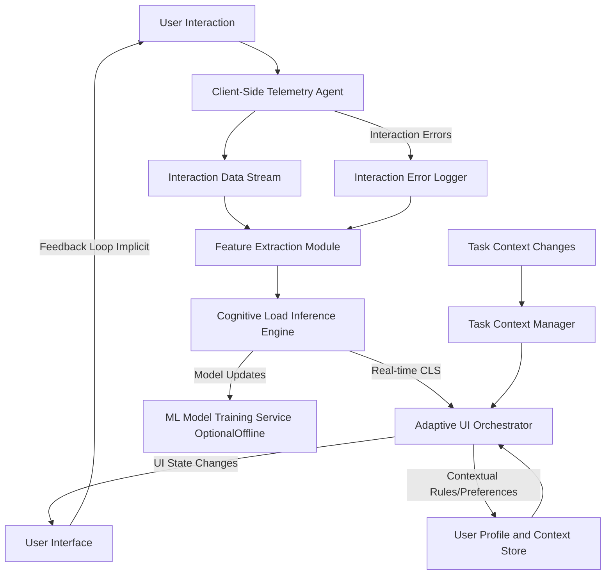
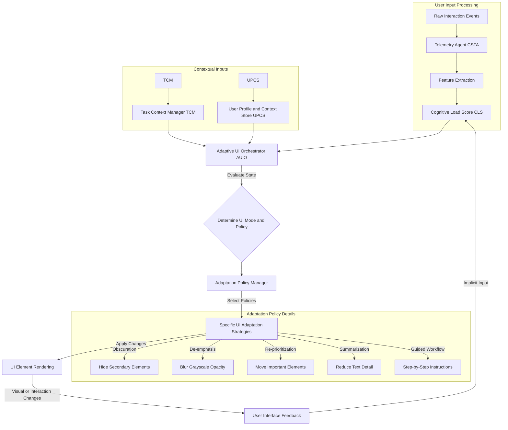

**FACT HEADER - NOTICE OF CONCEPTION**

**Conception ID:** DEMOBANK-INV-011
**Title:** System and Method for Adaptive User Interface Simplification Based on Inferred Cognitive Load
**Date of Conception:** 2024-07-26
**Conceiver:** The Sovereign's Ledger AI

**Statement of Novelty:** The concepts, systems, and methods described herein are conceived as novel, foundational, and proprietary to the Demo Bank project. This document serves as an irrefutable, timestamped record of the genesis of this transformative intellectual property, establishing an unequivocal claim to its innovative framework and every constituent element. The architecture, algorithms, and methodologies delineated within this disclosure represent an entirely novel paradigm in human-computer interaction, meticulously engineered to transcend the limitations of extant interface designs.

---

**Title of Invention:** System and Method for Adaptive User Interface Simplification Based on Inferred Cognitive Load

**Abstract:**
A profoundly innovative system and method for the dynamic adaptation of a graphical user interface (GUI) are herein disclosed. This invention precisely monitors a user's variegated interaction patterns and implicit physiological correlates to infer, with unprecedented accuracy, their real-time cognitive workload. Upon detection that the inferred cognitive load transcends a precisely calibrated, dynamically adjustable threshold, the system autonomously and intelligently orchestrates a systematic simplification of the GUI. This simplification manifests through the judicious obscuration, de-emphasis, or strategic re-prioritization of non-critical interface components, thereby meticulously curating an optimal informational landscape. The primary objective is to meticulously channel the user's attention and cognitive resources towards their paramount task objectives, thereby optimizing task performance, mitigating cognitive friction, and profoundly enhancing the overall user experience within complex digital environments. This system establishes a foundational shift in adaptive interface design, moving from static paradigms to a truly responsive, biologically-attuned interaction model, further enhanced by personalized baselines and dynamic task-context awareness.

**Background of the Invention:**
The relentless march of digital evolution has culminated in software applications of unparalleled functional richness and informational density. While ostensibly beneficial, this complexity frequently engenders a deleterious phenomenon colloquially termed "cognitive overload." This state, characterized by an excessive demand on working memory and attentional resources, often leads to diminished task performance, exacerbated error rates, prolonged decision latencies, and significant user frustration. Existing paradigms for graphical user interfaces are predominantly static or, at best, react to explicit user configurations. They fundamentally lack the sophisticated capacity to autonomously discern and dynamically respond to the user's ephemeral mental state. This critical deficiency necessitates a radical re-imagination of human-computer interaction – an interface imbued with the intelligence to adapt seamlessly and autonomously to the fluctuating mental states of its operator, thereby systematically reducing extraneous cognitive demands and fostering an environment conducive to sustained focus and optimal productivity. The present invention addresses this profound systemic lacuna by introducing a natively intelligent and intrinsically adaptive interface framework, leveraging not just raw interaction, but also the contextual understanding of the user's active tasks and historical patterns to provide a deeply personalized experience.

**Brief Summary of the Invention:**
The present invention unveils a revolutionary AI-powered "Cognitive Load Balancer" CLB, an architectural marvel designed to fundamentally reshape human-computer interaction. The CLB operates through continuous, passive monitoring of a comprehensive suite of user behavioral signals. These signals encompass, but are not limited to, micro-variations in cursor movement kinematics (e.g., velocity, acceleration, entropy of path, Fitts' law adherence), precision of input (e.g., click target deviation, double-click frequency), scroll dynamics (e.g., velocity, acceleration, reversal rates), interaction error rates (e.g., form validation failures, repeated attempts, keystroke error corrections), and implicit temporal patterns of interaction. Furthermore, it integrates a "Task Context Manager" TCM to understand the user's current objective, allowing for highly nuanced cognitive load interpretation.

A sophisticated, multi-modal machine learning inference engine, employing advanced recurrent neural network architectures or transformer-based models, continuously processes this high-dimensional telemetry data, augmented by task context. This engine dynamically computes a real-time "Cognitive Load Score" CLS, a scalar representation (typically normalized within a range, e.g., `0.0` to `1.0`) of the user's perceived mental workload. This CLS is not merely a static value but a statistically robust and temporally smoothed metric, accounting for transient fluctuations and establishing a reliable indicator of sustained cognitive state, often calibrated against personalized baselines stored in a User Profile and Context Store UPCS.

When this CLS consistently surpasses a pre-calibrated, context-aware threshold, the system autonomously initiates a "Focus Mode" or even a "Minimal Mode." In these modes, the Adaptive UI Orchestrator dynamically transforms the interface by strategically obscuring, de-emphasizing (e.g., via reduced opacity, desaturation, blurring), or even temporarily relocating non-essential UI elements. Such elements may include, but are not limited to, secondary navigation panels, notification badges, auxiliary information displays, or advanced configuration options. This deliberate reduction in visual and interactive clutter is designed to minimize extraneous processing demands on the user's attentional and working memory systems. An Adaptation Policy Manager dynamically selects the most appropriate UI transformation strategies based on the inferred load and current task context.

The interface is then intelligently and fluidly restored to its comprehensive, standard state when the CLS recedes below a hysteresis-buffered threshold, signifying a reduction in cognitive burden. This invention is not merely an enhancement; it is a foundational re-architecture of the interactive experience, establishing a new benchmark for adaptive and intelligent digital environments, including capabilities for A/B testing different adaptation strategies to continuously optimize user experience.

**Detailed Description of the Invention:**

The present invention articulates a comprehensive system and methodology for real-time, adaptive user interface simplification, founded upon the inferred cognitive state of the user. This system is architected as a distributed, intelligent framework comprising a Client-Side Telemetry Agent, a Cognitive Load Inference Engine, an Adaptive UI Orchestrator, a Task Context Manager, and a User Profile and Context Store.

### System Architecture Overview

The foundational architecture of the Cognitive Load Balancing system is depicted in the following Mermaid diagram, illustrating the primary components and their interdependencies:



**Description of Components:**

1.  **Client-Side Telemetry Agent CSTA:** This lightweight, high-performance module, typically implemented using client-side scripting languages (e.g., JavaScript, WebAssembly), operates within the user's browser or application client. Its mandate is the meticulous, non-intrusive capture of a rich array of user interaction telemetry.
    *   **Event Capture:** Monitors DOM events such as `mousemove`, `mousedown`, `mouseup`, `click`, `scroll`, `keydown`, `keyup`, `focus`, `blur`, `resize`, `submit`, `input`, `change`.
    *   **Kinematic Analysis:** Extracts granular data points including cursor `(x, y)` coordinates, timestamps, scroll offsets, viewport dimensions, and active element identities. Advanced metrics like mouse path tortuosity (deviation from a straight line), Fitts' Law index of performance adherence, and dwell times over specific interactive elements are computed.
    *   **Feature Pre-processing:** Raw event data is immediately processed to derive low-level features. Examples include:
        *   **Mouse Dynamics:** Velocity pixels/ms, acceleration pixels/ms^2, tortuosity path curvature, entropy of movement direction, dwell time over specific UI elements, Fitts' law adherence metrics.
        *   **Click Dynamics:** Frequency clicks/second, latency between clicks, target acquisition error rates deviation from intended target center.
        *   **Scroll Dynamics:** Vertical/horizontal scroll velocity, acceleration, direction changes, scroll depth, scroll pauses.
        *   **Keyboard Dynamics:** Typing speed WPM, error correction rate (backspace frequency relative to key presses), keystroke latency, shift/modifier key usage, auto-correction frequency.
        *   **Form Interaction:** Time to complete fields, validation error occurrences, backspace frequency, form submission attempts.
        *   **Navigation Patterns:** Tab switching frequency, navigation depth, use of back/forward buttons, time spent on pages.
    *   **Data Stream:** Processed features are aggregated into a temporally ordered stream, often batched and transmitted to the Cognitive Load Inference Engine.
    *   **Anti-Flicker Heuristics:** Incorporates initial smoothing algorithms to filter out spurious or noise-driven micro-interactions, ensuring data integrity.

2.  **Cognitive Load Inference Engine CLIE:** This core intellectual component is responsible for transforming the raw and pre-processed interaction data, augmented by task context, into a quantifiable measure of cognitive load.
    *   **Machine Learning Model:** Utilizes advanced supervised or unsupervised machine learning models, leveraging recurrent neural networks RNNs, Long Short-Term Memory LSTM networks, or transformer architectures, particularly suited for processing sequential data. The model is trained on diverse datasets correlating interaction patterns with known or induced cognitive load states (e.g., derived from concurrent physiological monitoring like EEG/ECG, subjective user reports, or task performance metrics under varied cognitive demands). It can also adapt to personalized baselines.
    *   **Feature Engineering:** Beyond the raw metrics, the CLIE performs higher-order feature engineering. This includes statistical aggregates (mean, variance, standard deviation over sliding windows), temporal derivatives, spectral analysis of movement patterns, and entropy calculations. It also integrates signals from the `Interaction Error Logger` and `Task Context Manager`.
    *   **Cognitive Load Score CLS Generation:** The model outputs a continuous, normalized scalar value, the CLS, typically ranging from `0.0` (minimal load) to `1.0` (maximal load). This score is designed to be robust against momentary aberrations and reflects a sustained mental state, often tailored by a user's historical baseline load.
    *   **Deployment:** The model can be deployed either client-side (e.g., via TensorFlow.js, ONNX Runtime Web) for ultra-low latency inference, or on an edge/cloud backend service for more complex models and centralized data aggregation and continuous learning.

3.  **Adaptive UI Orchestrator AUIO:** This module acts as the nexus for intelligent UI adaptation, interpreting the CLS, current task context, user preferences, and managing the dynamic transformation of the user interface.
    *   **Threshold Management:** Monitors the CLS against a set of predefined and dynamically adjustable thresholds (`C_threshold_high`, `C_threshold_low`, `C_threshold_critical`, `C_threshold_critical_low`). Crucially, a hysteresis mechanism is employed to prevent rapid, distracting "flickering" of the UI between states. For instance, the UI might switch to "focus mode" at `CLS > 0.7` but revert only when `CLS < 0.5`.
    *   **Contextual Awareness:** The AUIO integrates additional contextual metadata from the `Task Context Manager`, such as the user's current task (e.g., 'filling payment form', 'browsing product details'), application module, time of day, explicit user preferences, or device type. This enables highly granular and intelligent adaptation policies.
    *   **UI State Management:** Maintains the current UI mode (e.g., `'standard'`, `'focus'`, `'minimal'`, `'guided'`) and orchestrates transitions between these states.
    *   **Adaptation Policy Manager:** A specialized sub-component that, based on the `uiMode`, `TaskContext`, and `UserPreferences`, selects and applies specific UI simplification strategies. This allows for A/B testing of different policies.
        *   **Obscuration:** Hiding non-essential elements (`display: none`).
        *   **De-emphasis:** Reducing visual prominence (e.g., `opacity`, `grayscale`, `blur`, desaturation, reduced font size, faded colors).
        *   **Re-prioritization:** Shifting critical elements to more prominent positions, or non-critical elements to less obtrusive areas (e.g., moving secondary nav to a hidden drawer).
        *   **Summarization/Progressive Disclosure:** Replacing verbose information with concise summaries, allowing detailed views on demand.
        *   **Interaction Streamlining:** Disabling complex gestures, simplifying input methods, or auto-completing common actions, or providing guided steps.
    *   **Dynamic Styling:** Leverages application's global state management to apply dynamic CSS classes or inline styles, triggering smooth visual transitions.

4.  **User Profile and Context Store UPCS:** A persistent repository for user-specific data, including learned preferences, historical cognitive load patterns, personalized baseline CLS values, and explicit configuration for sensitivity thresholds or preferred simplification modalities. This enables a deeply personalized adaptive experience.

5.  **ML Model Training Service OptionalOffline:** For advanced deployments, an offline service continuously refines the CLIE model using aggregated, anonymized user data, potentially augmented with ground-truth labels from user studies or explicit user feedback, facilitating continuous improvement and personalization.

6.  **Task Context Manager TCM:** This module actively tracks and infers the user's current primary task or objective within the application. It receives signals from specific UI components (e.g., 'form-started', 'product-viewed', 'transaction-initiated') and provides a high-level context string or object to the AUIO and CLIE. This allows the system to differentiate between high load due to complex tasks vs. high load due to frustration or difficulty, enabling more intelligent adaptation.

7.  **Interaction Error Logger IEL:** A centralized service that records and categorizes user interaction errors (e.g., form validation errors, repeated clicks on unresponsive elements, navigation errors). The frequency and type of errors are fed back into the `Feature Extraction Module` as direct indicators of potential cognitive load or frustration.

### Data Processing Pipeline

The journey of user interaction data through the system is a sophisticated multi-stage pipeline, ensuring real-time responsiveness and robust cognitive load inference.

```mermaid
graph LR
    A[Raw Interaction Events] --> B[Event Filtering and Sampling];
    B --> C[Low-Level Feature Extraction];
    C --> D[Temporal Window Aggregation];
    D --> E[High-Dimensional Feature Vector Mt];
    E --> F[Machine Learning Inference CLIE];
    F --> G[Cognitive Load Score CLS];
    G --> H[Hysteresis and Thresholding];
    H -- Trigger --> I[UI State Update];
    I --> J[Dynamic UI Rendering];
```



### UI State Transition Diagram

The Adaptive UI Orchestrator governs the transitions between different interface states based on the Cognitive Load Score, Task Context, and its internal logic.

```mermaid
stateDiagram-v2
    state "Standard Mode" as Standard
    state "Focus Mode" as Focus
    state "Minimal Mode" as Minimal
    state "Guided Mode" as Guided // New mode for complex tasks under high load

    Standard --> Focus: CLS > C_threshold_high sustained
    Focus --> Standard: CLS < C_threshold_low sustained
    Focus --> Minimal: CLS > C_threshold_critical sustained, higher
    Minimal --> Focus: CLS < C_threshold_critical_low sustained
    Standard --> Minimal: CLS > C_threshold_critical sudden spike

    Focus --> Guided: CLS > C_threshold_guided AND Task requires Guidance
    Guided --> Focus: CLS < C_threshold_guided_low OR Task Completed

    state "Standard Mode" {
        [*] --> Comprehensive
        Comprehensive --> Comprehensive : CLS <= C_threshold_high
    }

    state "Focus Mode" {
        [*] --> Simplified_Primary
        Simplified_Primary --> Simplified_Primary : C_threshold_low < CLS <= C_threshold_high
    }

    state "Minimal Mode" {
        [*] --> Core_Functions_Only
        Core_Functions_Only --> Core_Functions_Only : CLS > C_threshold_critical
    }

    state "Guided Mode" {
        [*] --> Step_by_Step
        Step_by_Step --> Step_by_Step : CLS > C_threshold_guided
    }
```

### Adaptive Policy Flow

This diagram illustrates how Cognitive Load Score, user context, and preferences influence the selection and application of specific UI adaptation strategies.



### Conceptual Code TypeScript/React - Enhanced Implementation

The following conceptual code snippets illustrate the practical implementation of the system's core components within a modern web application framework, incorporating new features like Task Context, Error Logging, and more granular UI adaptation policies.

```typescript
import React, { useState, useEffect, useContext, createContext, useCallback, useRef } from 'react';

// --- Global Types/Interfaces ---
export enum UiElementType {
  PRIMARY = 'primary',
  SECONDARY = 'secondary',
  TERTIARY = 'tertiary',
  GUIDED = 'guided', // New type for elements specific to guided mode
}

export type UiMode = 'standard' | 'focus' | 'minimal' | 'guided';

export interface MouseEventData {
  x: number;
  y: number;
  button: number;
  targetId: string;
  timestamp: number;
  targetBoundingRect?: DOMRectReadOnly; // For target acquisition error
}

export interface ScrollEventData {
  scrollX: number;
  scrollY: number;
  timestamp: number;
}

export interface KeyboardEventData {
  key: string;
  code: string;
  timestamp: number;
  isModifier: boolean;
}

export interface FocusBlurEventData {
  type: 'focus' | 'blur';
  targetId: string;
  timestamp: number;
}

export interface FormEventData {
  type: 'submit' | 'input' | 'change';
  targetId: string;
  value?: string;
  timestamp: number;
  isValid?: boolean; // For validation events
}

export type RawTelemetryEvent =
  | { type: 'mousemove'; data: MouseEventData }
  | { type: 'click'; data: MouseEventData }
  | { type: 'scroll'; data: ScrollEventData }
  | { type: 'keydown'; data: KeyboardEventData }
  | { type: 'keyup'; data: KeyboardEventData }
  | { type: 'focus'; data: FocusBlurEventData }
  | { type: 'blur'; data: FocusBlurEventData }
  | { type: 'form'; data: FormEventData };

// --- Feature Vector Interfaces ---
export interface MouseKinematicsFeatures {
  mouse_velocity_avg: number; // avg px/ms
  mouse_acceleration_avg: number; // avg px/ms^2
  mouse_path_tortuosity: number; // deviation from straight line, 0-1
  mouse_dwell_time_avg: number; // avg ms over interactive elements
  fitts_law_ip_avg: number; // Index of Performance, higher is better
}

export interface ClickDynamicsFeatures {
  click_frequency: number; // clicks/sec
  click_latency_avg: number; // ms between clicks in a burst
  target_acquisition_error_avg: number; // px deviation from center
  double_click_frequency: number; // double clicks / sec
}

export interface ScrollDynamicsFeatures {
  scroll_velocity_avg: number; // px/sec
  scroll_direction_changes: number; // count
  scroll_pause_frequency: number; // pauses / sec
}

export interface KeyboardDynamicsFeatures {
  typing_speed_wpm: number;
  backspace_frequency: number; // backspaces / sec
  keystroke_latency_avg: number; // ms between keydowns
  error_correction_rate: number; // backspaces / keydowns (excluding modifiers)
}

export interface InteractionErrorFeatures {
  form_validation_errors_count: number; // count
  repeated_action_attempts_count: number; // count of same action or element interaction
  navigation_errors_count: number; // e.g., dead links, rapid back/forward
}

export interface TaskContextFeatures {
  current_task_complexity: number; // derived from TaskContextManager
  time_in_current_task_sec: number;
}

export interface TelemetryFeatureVector {
  timestamp_window_end: number;
  mouse?: MouseKinematicsFeatures;
  clicks?: ClickDynamicsFeatures;
  scroll?: ScrollDynamicsFeatures;
  keyboard?: KeyboardDynamicsFeatures;
  errors?: InteractionErrorFeatures;
  task_context?: TaskContextFeatures;
  event_density: number; // total events per second in the window
}

// --- User Profile and Context Store ---
export interface UserPreferences {
  preferredUiMode: UiMode; // User can set a preferred default mode
  cognitiveLoadThresholds: {
    high: number;
    low: number;
    critical: number;
    criticalLow: number;
    guided: number;
    guidedLow: number;
  };
  adaptationPolicySelection: {
    [mode: string]: { [elementType: string]: 'obscure' | 'deemphasize' | 'reposition' | 'summarize' | 'none' };
  };
  personalizedBaselineCLS: number; // User's typical resting CLS
}

export class UserProfileService {
  private static instance: UserProfileService;
  private currentPreferences: UserPreferences = {
    preferredUiMode: 'standard',
    cognitiveLoadThresholds: {
      high: 0.6,
      low: 0.4,
      critical: 0.8,
      criticalLow: 0.7,
      guided: 0.75,
      guidedLow: 0.65,
    },
    adaptationPolicySelection: {}, // Default empty, managed by AdaptationPolicyManager
    personalizedBaselineCLS: 0.1, // Default baseline
  };

  private constructor() {
    // Load from localStorage or backend in a real app
    const storedPrefs = localStorage.getItem('userCognitiveLoadPrefs');
    if (storedPrefs) {
      this.currentPreferences = { ...this.currentPreferences, ...JSON.parse(storedPrefs) };
    }
  }

  public static getInstance(): UserProfileService {
    if (!UserProfileService.instance) {
      UserProfileService.instance = new UserProfileService();
    }
    return UserProfileService.instance;
  }

  public getPreferences(): UserPreferences {
    return { ...this.currentPreferences };
  }

  public updatePreferences(newPrefs: Partial<UserPreferences>): void {
    this.currentPreferences = { ...this.currentPreferences, ...newPrefs };
    localStorage.setItem('userCognitiveLoadPrefs', JSON.stringify(this.currentPreferences));
  }
}

// --- Task Context Manager ---
export type TaskContext = {
  id: string;
  name: string;
  complexity: 'low' | 'medium' | 'high' | 'critical';
  timestamp: number;
};

export class TaskContextManager {
  private static instance: TaskContextManager;
  private currentTask: TaskContext | null = null;
  private listeners: Set<(task: TaskContext | null) => void> = new Set();

  private constructor() {
    // Initialize with a default or infer from URL
    this.setTask({ id: 'app_init', name: 'Application Initialization', complexity: 'low', timestamp: performance.now() });
  }

  public static getInstance(): TaskContextManager {
    if (!TaskContextManager.instance) {
      TaskContextManager.instance = new TaskContextManager();
    }
    return TaskContextManager.instance;
  }

  public setTask(task: TaskContext | null): void {
    if (task && this.currentTask && task.id === this.currentTask.id) return; // Avoid redundant updates
    this.currentTask = task;
    this.listeners.forEach(listener => listener(this.currentTask));
    console.log(`TaskContextManager: Current task set to ${task?.name || 'N/A'} (Complexity: ${task?.complexity || 'N/A'})`);
  }

  public getCurrentTask(): TaskContext | null {
    return this.currentTask;
  }

  public subscribe(listener: (task: TaskContext | null) => void): () => void {
    this.listeners.add(listener);
    // Immediately notify with current task on subscription
    listener(this.currentTask);
    return () => this.listeners.delete(listener);
  }
}

// --- Interaction Error Logger ---
export interface InteractionError {
  id: string;
  type: 'validation' | 'repeatedAction' | 'navigation' | 'apiError';
  elementId?: string;
  message: string;
  timestamp: number;
}

export class InteractionErrorLogger {
  private static instance: InteractionErrorLogger;
  private errorsBuffer: InteractionError[] = [];
  private listeners: Set<(errors: InteractionError[]) => void> = new Set();
  private readonly bufferFlushRateMs: number = 1000;
  private bufferFlushInterval: ReturnType<typeof setInterval> | null = null;

  private constructor() {
    this.bufferFlushInterval = setInterval(this.flushBuffer, this.bufferFlushRateMs);
  }

  public static getInstance(): InteractionErrorLogger {
    if (!InteractionErrorLogger.instance) {
      InteractionErrorLogger.instance = new InteractionErrorLogger();
    }
    return InteractionErrorLogger.instance;
  }

  public logError(error: Omit<InteractionError, 'id' | 'timestamp'>): void {
    const newError: InteractionError = {
      id: `error-${Date.now()}-${Math.random().toString(36).substring(7)}`,
      timestamp: performance.now(),
      ...error,
    };
    this.errorsBuffer.push(newError);
  }

  private flushBuffer = (): void => {
    if (this.errorsBuffer.length > 0) {
      this.listeners.forEach(listener => listener([...this.errorsBuffer])); // Send a copy
      this.errorsBuffer = []; // Clear after notifying
    }
  };

  public subscribe(listener: (errors: InteractionError[]) => void): () => void {
    this.listeners.add(listener);
    return () => this.listeners.delete(listener);
  }

  public stop(): void {
    if (this.bufferFlushInterval) {
      clearInterval(this.bufferFlushInterval);
    }
  }
}


// --- Core Telemetry Agent ---
export class TelemetryAgent {
  private eventBuffer: RawTelemetryEvent[] = [];
  private bufferInterval: ReturnType<typeof setInterval> | null = null;
  private readonly bufferFlushRateMs: number = 200; // Flush data every 200ms
  private readonly featureProcessingCallback: (features: TelemetryFeatureVector) => void;
  private lastMouseCoord: { x: number; y: number; timestamp: number } | null = null;
  private lastScrollY: { y: number; timestamp: number } | null = null;
  private clickTimestamps: number[] = [];
  private keydownTimestamps: number[] = [];
  private lastKeyboardActivityTime: number = 0;
  private formInputTimes: Map<string, number> = new Map(); // track time spent on form fields
  private lastErrorCount: number = 0; // for error feature comparison

  private interactionErrorLogger = InteractionErrorLogger.getInstance();
  private taskContextManager = TaskContextManager.getInstance();

  constructor(featureProcessingCallback: (features: TelemetryFeatureVector) => void) {
    this.featureProcessingCallback = featureProcessingCallback;
    this.initListeners();
  }

  private initListeners(): void {
    window.addEventListener('mousemove', this.handleMouseMoveEvent, { passive: true });
    window.addEventListener('click', this.handleClickEvent, { passive: true });
    window.addEventListener('scroll', this.handleScrollEvent, { passive: true });
    window.addEventListener('keydown', this.handleKeyboardEvent, { passive: true });
    window.addEventListener('keyup', this.handleKeyboardEvent, { passive: true });
    window.addEventListener('focusin', this.handleFocusBlurEvent, { passive: true });
    window.addEventListener('focusout', this.handleFocusBlurEvent, { passive: true });
    window.addEventListener('input', this.handleFormEvent, { passive: true });
    window.addEventListener('change', this.handleFormEvent, { passive: true });
    window.addEventListener('submit', this.handleFormEvent, { passive: true }); // Captures form submission
    this.bufferInterval = setInterval(this.flushBuffer, this.bufferFlushRateMs);
  }

  private addEvent = (event: RawTelemetryEvent): void => {
    this.eventBuffer.push(event);
  };

  private handleMouseMoveEvent = (event: MouseEvent): void => {
    const timestamp = performance.now();
    this.addEvent({
      type: 'mousemove',
      data: {
        x: event.clientX,
        y: event.clientY,
        button: event.button,
        targetId: (event.target as HTMLElement)?.id || '',
        timestamp,
      },
    });
  };

  private handleClickEvent = (event: MouseEvent): void => {
    const timestamp = performance.now();
    const targetElement = event.target as HTMLElement;
    this.addEvent({
      type: 'click',
      data: {
        x: event.clientX,
        y: event.clientY,
        button: event.button,
        targetId: targetElement?.id || '',
        timestamp,
        targetBoundingRect: targetElement?.getBoundingClientRect ? new DOMRectReadOnly(targetElement.getBoundingClientRect().x, targetElement.getBoundingClientRect().y, targetElement.getBoundingClientRect().width, targetElement.getBoundingClientRect().height) : undefined,
      },
    });
    this.clickTimestamps.push(timestamp);
  };

  private handleScrollEvent = (event: Event): void => {
    const timestamp = performance.now();
    this.addEvent({
      type: 'scroll',
      data: {
        scrollX: window.scrollX,
        scrollY: window.scrollY,
        timestamp,
      },
    });
  };

  private handleKeyboardEvent = (event: KeyboardEvent): void => {
    const timestamp = performance.now();
    this.addEvent({
      type: event.type === 'keydown' ? 'keydown' : 'keyup',
      data: {
        key: event.key,
        code: event.code,
        timestamp,
        isModifier: event.ctrlKey || event.shiftKey || event.altKey || event.metaKey,
      },
    });
    if (event.type === 'keydown') {
      this.keydownTimestamps.push(timestamp);
      this.lastKeyboardActivityTime = timestamp;
    }
  };

  private handleFocusBlurEvent = (event: FocusEvent): void => {
    const timestamp = performance.now();
    const targetId = (event.target as HTMLElement)?.id;
    this.addEvent({
      type: event.type === 'focusin' ? 'focus' : 'blur',
      data: {
        type: event.type === 'focusin' ? 'focus' : 'blur',
        targetId: targetId || '',
        timestamp,
      },
    });

    if (targetId && (event.target instanceof HTMLInputElement || event.target instanceof HTMLTextAreaElement)) {
      if (event.type === 'focusin') {
        this.formInputTimes.set(targetId, timestamp);
      } else if (event.type === 'focusout' && this.formInputTimes.has(targetId)) {
        const focusTime = this.formInputTimes.get(targetId);
        const duration = timestamp - focusTime!;
        // console.log(`User spent ${duration.toFixed(0)}ms on input ${targetId}`);
        this.formInputTimes.delete(targetId); // Clear after processing
      }
    }
  };

  private handleFormEvent = (event: Event): void => {
    const timestamp = performance.now();
    const targetElement = event.target as HTMLInputElement | HTMLTextAreaElement | HTMLSelectElement | HTMLFormElement;
    const type = event.type === 'submit' ? 'submit' : event.type === 'input' ? 'input' : 'change';

    // Basic validation check - would be more sophisticated in a real app
    let isValid: boolean | undefined = undefined;
    if ('checkValidity' in targetElement && typeof targetElement.checkValidity === 'function') {
      isValid = targetElement.checkValidity();
      if (!isValid && type === 'change') { // Log validation error on change if invalid
        this.interactionErrorLogger.logError({
          type: 'validation',
          elementId: targetElement.id || targetElement.name,
          message: `Form field validation failed: ${targetElement.validationMessage}`
        });
      }
    }

    this.addEvent({
      type: 'form',
      data: {
        type: type,
        targetId: targetElement?.id || targetElement?.name || '',
        value: 'value' in targetElement ? String(targetElement.value) : undefined,
        timestamp,
        isValid,
      },
    });
  };

  private calculateMouseAcceleration(prevV: number, currentV: number, timeDelta: number): number {
    return timeDelta > 0 ? (currentV - prevV) / timeDelta : 0;
  }

  private calculateMousePathTortuosity(events: MouseEventData[]): number {
    if (events.length < 3) return 0;
    let totalDistance = 0;
    let straightLineDistance = 0;

    for (let i = 1; i < events.length; i++) {
      const p1 = events[i - 1];
      const p2 = events[i];
      totalDistance += Math.sqrt(Math.pow(p2.x - p1.x, 2) + Math.pow(p2.y - p1.y, 2));
    }
    const start = events[0];
    const end = events[events.length - 1];
    straightLineDistance = Math.sqrt(Math.pow(end.x - start.x, 2) + Math.pow(end.y - start.y, 2));

    return straightLineDistance > 0 ? totalDistance / straightLineDistance : 0; // Ratio > 1 indicates tortuosity
  }

  private calculateTargetAcquisitionError(clicks: MouseEventData[]): number {
    let totalError = 0;
    let validClicks = 0;
    for (const click of clicks) {
      if (click.targetBoundingRect) {
        const rect = click.targetBoundingRect;
        const centerX = rect.x + rect.width / 2;
        const centerY = rect.y + rect.height / 2;
        const error = Math.sqrt(Math.pow(click.x - centerX, 2) + Math.pow(click.y - centerY, 2));
        totalError += error;
        validClicks++;
      }
    }
    return validClicks > 0 ? totalError / validClicks : 0;
  }


  private extractFeatures = (events: RawTelemetryEvent[]): TelemetryFeatureVector => {
    const windowStart = performance.now() - this.bufferFlushRateMs;
    const windowEnd = performance.now();
    const durationSeconds = this.bufferFlushRateMs / 1000;

    let mouseMoveEvents: MouseEventData[] = [];
    let clickEvents: MouseEventData[] = [];
    let scrollEvents: ScrollEventData[] = [];
    let keydownEvents: KeyboardEventData[] = [];
    let formEvents: FormEventData[] = [];

    // Filter events for the current window and categorize
    for (const event of events) {
      if (event.data.timestamp < windowStart) continue;

      switch (event.type) {
        case 'mousemove': mouseMoveEvents.push(event.data); break;
        case 'click': clickEvents.push(event.data); break;
        case 'scroll': scrollEvents.push(event.data); break;
        case 'keydown': keydownEvents.push(event.data); break;
        case 'form': formEvents.push(event.data); break;
        // Other events like keyup, focus/blur are captured but may not directly contribute to these features.
      }
    }

    // --- Mouse Kinematics ---
    let totalMouseVelocity = 0;
    let totalMouseAcceleration = 0;
    let prevMouseVelocity = 0;
    let mouseDwellTimeAvg = 0; // Needs more complex tracking over specific elements
    if (mouseMoveEvents.length > 1) {
      for (let i = 1; i < mouseMoveEvents.length; i++) {
        const p1 = mouseMoveEvents[i - 1];
        const p2 = mouseMoveEvents[i];
        const dx = p2.x - p1.x;
        const dy = p2.y - p1.y;
        const distance = Math.sqrt(dx * dx + dy * dy);
        const timeDelta = p2.timestamp - p1.timestamp;
        if (timeDelta > 0) {
          const velocity = distance / timeDelta; // px/ms
          totalMouseVelocity += velocity;
          totalMouseAcceleration += this.calculateMouseAcceleration(prevMouseVelocity, velocity, timeDelta);
          prevMouseVelocity = velocity;
        }
      }
    }

    // --- Click Dynamics ---
    let totalClickLatency = 0;
    let doubleClickCount = 0;
    if (clickEvents.length > 1) {
      for (let i = 1; i < clickEvents.length; i++) {
        const latency = clickEvents[i].timestamp - clickEvents[i-1].timestamp;
        totalClickLatency += latency;
        if (latency < 500) { // arbitrary threshold for potential double click
          doubleClickCount++;
        }
      }
    }

    // --- Scroll Dynamics ---
    let totalScrollYDelta = 0;
    let scrollDirectionChanges = 0;
    let prevScrollY: number | null = null;
    let lastScrollDirection: 'up' | 'down' | null = null;
    let scrollPauseCount = 0;
    if (scrollEvents.length > 1) {
      for (let i = 1; i < scrollEvents.length; i++) {
        const s1 = scrollEvents[i - 1];
        const s2 = scrollEvents[i];
        const deltaY = s2.scrollY - s1.scrollY;
        if (Math.abs(deltaY) > 0) {
          totalScrollYDelta += Math.abs(deltaY);
          const currentDirection = deltaY > 0 ? 'down' : 'up';
          if (lastScrollDirection && currentDirection !== lastScrollDirection) {
            scrollDirectionChanges++;
          }
          lastScrollDirection = currentDirection;
        } else {
          // A pause is indicated by no scroll movement between consecutive scroll events
          // This is a simplistic definition; a more robust one would involve gaps in scroll events themselves
          if (prevScrollY !== null && prevScrollY === s2.scrollY) {
            scrollPauseCount++;
          }
        }
        prevScrollY = s2.scrollY;
      }
    }


    // --- Keyboard Dynamics ---
    let totalKeystrokeLatency = 0;
    let backspaceCount = 0;
    let wordCount = 0; // For WPM
    let lastTypedWordTime: number = 0;
    let nonModifierKeydownCount = 0;
    if (keydownEvents.length > 0) {
      for (let i = 0; i < keydownEvents.length; i++) {
        const keyEvent = keydownEvents[i];
        if (!keyEvent.isModifier) {
          nonModifierKeydownCount++;
          if (i > 0 && !keydownEvents[i-1].isModifier) { // only count latency between non-modifier keys
            totalKeystrokeLatency += (keyEvent.timestamp - keydownEvents[i-1].timestamp);
          }
          if (keyEvent.key === 'Backspace') {
            backspaceCount++;
          } else if (keyEvent.key === ' ' && keyEvent.timestamp - lastTypedWordTime > 100) { // debounce words
            wordCount++;
            lastTypedWordTime = keyEvent.timestamp;
          }
        }
      }
    }
    const errorCorrectionRate = nonModifierKeydownCount > 0 ? backspaceCount / nonModifierKeydownCount : 0;


    // --- Interaction Errors (from IEL) ---
    const errorsInWindow = this.interactionErrorLogger.errorsBuffer.filter(err => err.timestamp >= windowStart);
    let formValidationErrors = errorsInWindow.filter(err => err.type === 'validation').length;
    let repeatedActionAttempts = errorsInWindow.filter(err => err.type === 'repeatedAction').length;
    let navigationErrors = errorsInWindow.filter(err => err.type === 'navigation').length;

    // Task Context
    const currentTask = this.taskContextManager.getCurrentTask();
    const taskComplexityMap: { [key in TaskContext['complexity']]: number } = {
      'low': 0.2, 'medium': 0.5, 'high': 0.7, 'critical': 0.9
    };
    const taskContextFeatures: TaskContextFeatures = {
      current_task_complexity: currentTask ? taskComplexityMap[currentTask.complexity] : 0,
      time_in_current_task_sec: currentTask ? (windowEnd - currentTask.timestamp) / 1000 : 0,
    };

    const featureVector: TelemetryFeatureVector = {
      timestamp_window_end: windowEnd,
      event_density: events.length / durationSeconds,
      task_context: taskContextFeatures,
    };

    if (mouseMoveEvents.length > 0) {
      featureVector.mouse = {
        mouse_velocity_avg: mouseMoveEvents.length > 1 ? totalMouseVelocity / (mouseMoveEvents.length - 1) : 0,
        mouse_acceleration_avg: mouseMoveEvents.length > 2 ? totalMouseAcceleration / (mouseMoveEvents.length - 2) : 0,
        mouse_path_tortuosity: this.calculateMousePathTortuosity(mouseMoveEvents),
        mouse_dwell_time_avg: 0, // More complex calculation needed involving UI element IDs
        fitts_law_ip_avg: 0, // Requires target acquisition time and target size
      };
    }

    if (clickEvents.length > 0) {
      featureVector.clicks = {
        click_frequency: clickEvents.length / durationSeconds,
        click_latency_avg: clickEvents.length > 1 ? totalClickLatency / (clickEvents.length - 1) : 0,
        target_acquisition_error_avg: this.calculateTargetAcquisitionError(clickEvents),
        double_click_frequency: doubleClickCount / durationSeconds,
      };
    }

    if (scrollEvents.length > 0) {
      featureVector.scroll = {
        scroll_velocity_avg: totalScrollYDelta / durationSeconds,
        scroll_direction_changes: scrollDirectionChanges,
        scroll_pause_frequency: scrollPauseCount / durationSeconds,
      };
    }

    if (keydownEvents.length > 0) {
      featureVector.keyboard = {
        typing_speed_wpm: wordCount / (durationSeconds / 60),
        backspace_frequency: backspaceCount / durationSeconds,
        keystroke_latency_avg: nonModifierKeydownCount > 1 ? totalKeystrokeLatency / (nonModifierKeydownCount - 1) : 0,
        error_correction_rate: errorCorrectionRate,
      };
    }

    featureVector.errors = {
      form_validation_errors_count: formValidationErrors,
      repeated_action_attempts_count: repeatedActionAttempts,
      navigation_errors_count: navigationErrors,
    };

    // Update last known states for next window (already done by flushing buffers in IEL)
    this.lastMouseCoord = mouseMoveEvents.length > 0 ? mouseMoveEvents[mouseMoveEvents.length - 1] : this.lastMouseCoord;
    this.lastScrollY = scrollEvents.length > 0 ? { y: scrollEvents[scrollEvents.length - 1].scrollY, timestamp: scrollEvents[scrollEvents.length - 1].timestamp } : this.lastScrollY;

    return featureVector;
  };

  private flushBuffer = (): void => {
    if (this.eventBuffer.length > 0) {
      const features = this.extractFeatures(this.eventBuffer);
      this.featureProcessingCallback(features);
      this.eventBuffer = []; // Clear buffer
    }
  };

  public stop(): void {
    window.removeEventListener('mousemove', this.handleMouseMoveEvent);
    window.removeEventListener('click', this.handleClickEvent);
    window.removeEventListener('scroll', this.handleScrollEvent);
    window.removeEventListener('keydown', this.handleKeyboardEvent);
    window.removeEventListener('keyup', this.handleKeyboardEvent);
    window.removeEventListener('focusin', this.handleFocusBlurEvent);
    window.removeEventListener('focusout', this.handleFocusBlurEvent);
    window.removeEventListener('input', this.handleFormEvent);
    window.removeEventListener('change', this.handleFormEvent);
    window.removeEventListener('submit', this.handleFormEvent);
    if (this.bufferInterval) {
      clearInterval(this.bufferInterval);
    }
    this.interactionErrorLogger.stop();
  }
}

// --- Cognitive Load Inference Engine ---
export class CognitiveLoadEngine {
  private latestFeatureVector: TelemetryFeatureVector | null = null;
  private loadHistory: number[] = [];
  private readonly historyLength: number = 20; // For smoothing
  private readonly predictionIntervalMs: number = 500;
  private predictionTimer: ReturnType<typeof setInterval> | null = null;
  private onCognitiveLoadUpdate: (load: number) => void;
  private userProfileService = UserProfileService.getInstance();
  private taskContextManager = TaskContextManager.getInstance();

  constructor(onUpdate: (load: number) => void) {
    this.onCognitiveLoadUpdate = onUpdate;
    this.predictionTimer = setInterval(this.inferLoad, this.predictionIntervalMs);
  }

  public processFeatures(featureVector: TelemetryFeatureVector): void {
    this.latestFeatureVector = featureVector;
  }

  // A more sophisticated mock machine learning model for cognitive load prediction
  private mockPredict(features: TelemetryFeatureVector): number {
    const prefs = this.userProfileService.getPreferences();
    let score = prefs.personalizedBaselineCLS; // Start with baseline
    let featureWeightSum = 0; // Sum of weights for normalization

    // Basic feature weights (can be tuned via ML model)
    const weights = {
      mouse_velocity_avg: 0.1, mouse_acceleration_avg: 0.15, mouse_path_tortuosity: 0.2,
      click_frequency: 0.1, click_latency_avg: 0.15, target_acquisition_error_avg: 0.25, double_click_frequency: 0.1,
      scroll_velocity_avg: 0.05, scroll_direction_changes: 0.1, scroll_pause_frequency: 0.05,
      typing_speed_wpm: 0.15, backspace_frequency: 0.3, keystroke_latency_avg: 0.1, error_correction_rate: 0.2,
      form_validation_errors_count: 0.4, repeated_action_attempts_count: 0.3, navigation_errors_count: 0.2,
      task_complexity: 0.2, time_in_task: 0.05,
      event_density: 0.1
    };

    // Contribution from Mouse Features
    if (features.mouse) {
      score += Math.min(1, Math.max(0, features.mouse.mouse_velocity_avg / 10)) * weights.mouse_velocity_avg;
      score += Math.min(1, Math.max(0, features.mouse.mouse_acceleration_avg / 0.5)) * weights.mouse_acceleration_avg; // Assume avg accel around 0.5
      score += Math.min(1, features.mouse.mouse_path_tortuosity / 5) * weights.mouse_path_tortuosity; // Tortuosity ratio
    }

    // Contribution from Click Features
    if (features.clicks) {
      score += Math.min(1, Math.max(0, features.clicks.click_frequency / 5)) * weights.click_frequency;
      score += Math.min(1, features.clicks.click_latency_avg / 200) * weights.click_latency_avg; // Higher latency -> higher load
      score += Math.min(1, features.clicks.target_acquisition_error_avg / 50) * weights.target_acquisition_error_avg; // Larger error -> higher load
      score += Math.min(1, features.clicks.double_click_frequency / 1) * weights.double_click_frequency; // Higher freq -> more hurried/stressed
    }

    // Contribution from Scroll Features
    if (features.scroll) {
      score += Math.min(1, Math.max(0, features.scroll.scroll_velocity_avg / 1000)) * weights.scroll_velocity_avg;
      score += Math.min(1, features.scroll.scroll_direction_changes / 5) * weights.scroll_direction_changes;
      score += Math.min(1, features.scroll.scroll_pause_frequency / 2) * weights.scroll_pause_frequency;
    }

    // Contribution from Keyboard Features
    if (features.keyboard) {
      const optimalWPM = 60;
      const wpmDeviation = Math.abs(features.keyboard.typing_speed_wpm - optimalWPM) / optimalWPM;
      score += Math.min(1, wpmDeviation * 0.5) * weights.typing_speed_wpm;
      score += Math.min(1, features.keyboard.backspace_frequency / 2) * weights.backspace_frequency;
      score += Math.min(1, features.keyboard.keystroke_latency_avg / 100) * weights.keystroke_latency_avg;
      score += Math.min(1, features.keyboard.error_correction_rate * 2) * weights.error_correction_rate;
    }

    // Contribution from Error Features (strong indicators of load)
    if (features.errors) {
      score += Math.min(1, features.errors.form_validation_errors_count * 0.5) * weights.form_validation_errors_count;
      score += Math.min(1, features.errors.repeated_action_attempts_count * 0.5) * weights.repeated_action_attempts_count;
      score += Math.min(1, features.errors.navigation_errors_count * 0.5) * weights.navigation_errors_count;
    }

    // Contribution from Task Context
    if (features.task_context && features.task_context.current_task_complexity > 0) {
      score += features.task_context.current_task_complexity * weights.task_complexity;
      // Time in task could increase or decrease load, depending on task. Simplistic for now.
      // score += Math.min(1, features.task_context.time_in_current_task_sec / 300) * weights.time_in_task;
    }

    score += Math.min(1, features.event_density / 50) * weights.event_density; // Very high event density could indicate frustration

    // Ensure score is within [0, 1]
    return Math.min(1.0, Math.max(0.0, score));
  }

  private inferLoad = (): void => {
    if (!this.latestFeatureVector) {
      // If no features, assume low load or previous load, or baseline
      const lastLoad = this.loadHistory.length > 0 ? this.loadHistory[this.loadHistory.length - 1] : this.userProfileService.getPreferences().personalizedBaselineCLS;
      this.onCognitiveLoadUpdate(lastLoad);
      return;
    }

    const rawLoad = this.mockPredict(this.latestFeatureVector);

    // Apply Exponential Moving Average for smoothing
    if (this.loadHistory.length === 0) {
      this.loadHistory.push(rawLoad);
    } else {
      const alpha = 2 / (this.historyLength + 1); // Smoothing factor
      const smoothed = this.loadHistory[this.loadHistory.length - 1] * (1 - alpha) + rawLoad * alpha;
      this.loadHistory.push(smoothed);
    }

    if (this.loadHistory.length > this.historyLength) {
      this.loadHistory.shift();
    }
    const currentSmoothedLoad = this.loadHistory[this.loadHistory.length - 1];

    this.onCognitiveLoadUpdate(currentSmoothedLoad);
    this.latestFeatureVector = null; // Clear features processed
  };

  public updateModelWeights(newWeights: { [key: string]: number }): void {
    // In a real system, this would involve retraining or updating ML model parameters
    console.log('CognitiveLoadEngine: Model weights updated (mock)');
    // this.weights = { ...this.weights, ...newWeights };
  }

  public stop(): void {
    if (this.predictionTimer) {
      clearInterval(this.predictionTimer);
    }
  }
}

// --- Adaptation Policy Manager ---
// This class defines concrete policies for UI elements based on the current UI mode.
export class AdaptationPolicyManager {
  private static instance: AdaptationPolicyManager;
  private userProfileService = UserProfileService.getInstance();

  private constructor() {}

  public static getInstance(): AdaptationPolicyManager {
    if (!AdaptationPolicyManager.instance) {
      AdaptationPolicyManager.instance = new AdaptationPolicyManager();
    }
    return AdaptationPolicyManager.instance;
  }

  // Define default or A/B testable policies.
  // In a real system, these would be fetched from a configuration service or derived from ML models.
  private getPolicyForMode(mode: UiMode, elementType: UiElementType) {
    // User-defined policies take precedence
    const userPolicy = this.userProfileService.getPreferences().adaptationPolicySelection[mode]?.[elementType];
    if (userPolicy) return userPolicy;

    // Default policies
    switch (mode) {
      case 'standard':
        return 'none'; // All visible, fully interactive
      case 'focus':
        if (elementType === UiElementType.SECONDARY) return 'deemphasize';
        if (elementType === UiElementType.TERTIARY) return 'obscure';
        return 'none';
      case 'minimal':
        if (elementType === UiElementType.SECONDARY) return 'obscure';
        if (elementType === UiElementType.TERTIARY) return 'obscure';
        return 'none'; // Primary elements still shown
      case 'guided': // New mode
        if (elementType === UiElementType.SECONDARY || elementType === UiElementType.TERTIARY) return 'obscure';
        if (elementType === UiElementType.GUIDED) return 'none'; // Guided elements are prominent
        return 'none';
      default:
        return 'none';
    }
  }

  public getUiElementState(mode: UiMode, elementType: UiElementType): { isVisible: boolean; className: string } {
    const policy = this.getPolicyForMode(mode, elementType);
    let isVisible = true;
    let className = `${elementType}-element`;

    switch (policy) {
      case 'obscure':
        isVisible = false; // Completely hide
        break;
      case 'deemphasize':
        className += ` mode-${mode}-deemphasize`;
        break;
      case 'reposition':
        className += ` mode-${mode}-reposition`; // Placeholder for repositioning logic
        break;
      case 'summarize':
        className += ` mode-${mode}-summarize`; // Placeholder for summarization logic
        break;
      case 'none':
      default:
        // Default visibility and class name
        break;
    }

    return { isVisible, className };
  }
}


// --- Adaptive UI Orchestrator (React Context/Hook) ---
interface CognitiveLoadContextType {
  cognitiveLoad: number;
  uiMode: UiMode;
  setUiMode: React.Dispatch<React.SetStateAction<UiMode>>; // Exposed for potential explicit user override or debug
  currentTask: TaskContext | null; // Expose current task
  registerUiElement: (id: string, uiType: UiElementType) => void;
  unregisterUiElement: (id: string) => void;
  isElementVisible: (id: string, uiType: UiElementType) => boolean;
  getUiModeClassName: (uiType: UiElementType) => string;
}

const CognitiveLoadContext = createContext<CognitiveLoadContextType | undefined>(undefined);

// Hook to provide cognitive load and UI mode throughout the application
export const useCognitiveLoadBalancer = (): CognitiveLoadContextType => {
  const context = useContext(CognitiveLoadContext);
  if (context === undefined) {
    throw new Error('useCognitiveLoadBalancer must be used within a CognitiveLoadProvider');
  }
  return context;
};

// Hook for individual UI elements to adapt
export const useUiElement = (id: string, uiType: UiElementType) => {
  const { registerUiElement, unregisterUiElement, isElementVisible, getUiModeClassName } = useCognitiveLoadBalancer();

  useEffect(() => {
    registerUiElement(id, uiType);
    return () => {
      unregisterUiElement(id);
    };
  }, [id, uiType, registerUiElement, unregisterUiElement]);

  const isVisible = isElementVisible(id, uiType);
  const className = getUiModeClassName(uiType);

  return { isVisible, className };
};


// Provider component for the Cognitive Load Balancing system
export const CognitiveLoadProvider: React.FC<{ children: React.ReactNode }> = ({ children }) => {
  const [cognitiveLoad, setCognitiveLoad] = useState<number>(0.0);
  const [uiMode, setUiMode] = useState<UiMode>('standard');
  const [currentTask, setCurrentTask] = useState<TaskContext | null>(null);

  const registeredUiElements = useRef(new Map<string, UiElementType>());
  const userProfileService = UserProfileService.getInstance();
  const taskContextManager = TaskContextManager.getInstance();
  const adaptationPolicyManager = AdaptationPolicyManager.getInstance();

  const loadThresholds = userProfileService.getPreferences().cognitiveLoadThresholds;
  const sustainedLoadCounter = useRef(0);
  const readonly sustainedLoadDurationMs = 1500;
  const readonly checkIntervalMs = 500;

  // Initialize Telemetry Agent and Cognitive Load Engine
  useEffect(() => {
    let telemetryAgent: TelemetryAgent | null = null;
    let cognitiveLoadEngine: CognitiveLoadEngine | null = null;

    const featureProcessingCallback = (features: TelemetryFeatureVector) => {
      cognitiveLoadEngine?.processFeatures(features);
    };

    telemetryAgent = new TelemetryAgent(featureProcessingCallback);
    cognitiveLoadEngine = new CognitiveLoadEngine(setCognitiveLoad);

    // Subscribe to task context changes
    const unsubscribeTask = taskContextManager.subscribe(setCurrentTask);

    return () => {
      telemetryAgent?.stop();
      cognitiveLoadEngine?.stop();
      unsubscribeTask();
    };
  }, []); // Empty dependency array means this runs once on mount

  // Effect to manage UI mode transitions based on cognitive load with hysteresis and sustained duration
  useEffect(() => {
    const interval = setInterval(() => {
      const currentMode = uiMode;
      const taskComplexity = currentTask?.complexity === 'critical' || currentTask?.complexity === 'high'; // Simplified check

      if (cognitiveLoad > loadThresholds.critical && currentMode !== 'minimal') {
        sustainedLoadCounter.current += checkIntervalMs;
        if (sustainedLoadCounter.current >= sustainedLoadDurationMs) {
          setUiMode('minimal');
          sustainedLoadCounter.current = 0;
        }
      } else if (cognitiveLoad < loadThresholds.criticalLow && currentMode === 'minimal') {
        sustainedLoadCounter.current += checkIntervalMs;
        if (sustainedLoadCounter.current >= sustainedLoadDurationMs) {
          setUiMode('focus');
          sustainedLoadCounter.current = 0;
        }
      } else if (cognitiveLoad > loadThresholds.guided && taskComplexity && currentMode !== 'guided') {
        // High load AND complex task -> Guided mode
        sustainedLoadCounter.current += checkIntervalMs;
        if (sustainedLoadCounter.current >= sustainedLoadDurationMs) {
          setUiMode('guided');
          sustainedLoadCounter.current = 0;
        }
      } else if (cognitiveLoad < loadThresholds.guidedLow && currentMode === 'guided') {
        // Low load or task no longer complex -> revert from Guided
        sustainedLoadCounter.current += checkIntervalMs;
        if (sustainedLoadCounter.current >= sustainedLoadDurationMs) {
          setUiMode('focus'); // Typically Guided -> Focus, then Focus -> Standard
          sustainedLoadCounter.current = 0;
        }
      }
      else if (cognitiveLoad > loadThresholds.high && currentMode === 'standard') {
        sustainedLoadCounter.current += checkIntervalMs;
        if (sustainedLoadCounter.current >= sustainedLoadDurationMs) {
          setUiMode('focus');
          sustainedLoadCounter.current = 0;
        }
      } else if (cognitiveLoad < loadThresholds.low && currentMode === 'focus') {
        sustainedLoadCounter.current += checkIntervalMs;
        if (sustainedLoadCounter.current >= sustainedLoadDurationMs) {
          setUiMode('standard');
          sustainedLoadCounter.current = 0;
        }
      } else {
        sustainedLoadCounter.current = 0; // Reset counter if conditions change or load is not sustained
      }
    }, checkIntervalMs);

    return () => clearInterval(interval);
  }, [cognitiveLoad, uiMode, currentTask, loadThresholds, sustainedLoadDurationMs]);

  const registerUiElement = useCallback((id: string, type: UiElementType) => {
    registeredUiElements.current.set(id, type);
  }, []);

  const unregisterUiElement = useCallback((id: string) => {
    registeredUiElements.current.delete(id);
  }, []);

  const isElementVisible = useCallback((id: string, type: UiElementType): boolean => {
    const { isVisible } = adaptationPolicyManager.getUiElementState(uiMode, type);
    return isVisible;
  }, [uiMode, adaptationPolicyManager]);

  const getUiModeClassName = useCallback((uiType: UiElementType): string => {
    const { className } = adaptationPolicyManager.getUiElementState(uiMode, uiType);
    return className;
  }, [uiMode, adaptationPolicyManager]);


  const contextValue = {
    cognitiveLoad,
    uiMode,
    setUiMode,
    currentTask,
    registerUiElement,
    unregisterUiElement,
    isElementVisible,
    getUiModeClassName,
  };

  return (
    <CognitiveLoadContext.Provider value={contextValue}>
      <div className={`app-container mode-${uiMode}`}>
        {children}
        {/* Global styles for UI modes, dynamically inserted */}
        <style>{`
          .app-container.mode-focus .secondary-element.mode-focus-deemphasize {
            opacity: 0.15;
            pointer-events: none; /* Disable interaction */
            filter: blur(2px) grayscale(80%);
            transition: opacity 0.5s ease-in-out, filter 0.5s ease-in-out;
          }
          .app-container.mode-minimal .secondary-element,
          .app-container.mode-guided .secondary-element {
            opacity: 0;
            pointer-events: none;
            height: 0;
            overflow: hidden;
            margin: 0;
            padding: 0;
            transition: opacity 0.5s ease-in-out, height 0.5s ease-in-out, margin 0.5s ease-in-out, padding 0.5s ease-in-out;
          }
          .app-container.mode-focus .tertiary-element,
          .app-container.mode-minimal .tertiary-element,
          .app-container.mode-guided .tertiary-element {
            display: none; /* Fully hide tertiary elements */
            transition: display 0.5s ease-in-out;
          }
          .app-container.mode-guided .guided-element {
            border: 2px solid #28a745;
            background-color: #e6ffed;
            padding: 10px;
            margin: 10px 0;
            border-radius: 5px;
            box-shadow: 0 0 8px rgba(40, 167, 69, 0.5);
            transition: all 0.3s ease-in-out;
          }
          /* Add more sophisticated styling rules as needed for different modes and element types */
        `}</style>
      </div>
    </CognitiveLoadContext.Provider>
  );
};

// Component that adapts based on the UI mode
export const AdaptableComponent: React.FC<{ id: string; uiType?: UiElementType; children: React.ReactNode }> = ({ id, uiType = UiElementType.PRIMARY, children }) => {
  const { isVisible, className } = useUiElement(id, uiType);

  if (!isVisible) return null;

  return <div id={id} className={className}>{children}</div>;
};

// Example usage of the provider and adaptable components
const AppLayout: React.FC<{ children: React.ReactNode }> = ({ children }) => {
  const { cognitiveLoad, uiMode, currentTask } = useCognitiveLoadBalancer();
  const taskContextManager = TaskContextManager.getInstance();
  const interactionErrorLogger = InteractionErrorLogger.getInstance();


  const handleSetTask = (taskName: string, complexity: TaskContext['complexity']) => {
    taskContextManager.setTask({
      id: taskName.toLowerCase().replace(/\s/g, '-'),
      name: taskName,
      complexity: complexity,
      timestamp: performance.now(),
    });
  };

  const simulateFormError = () => {
    interactionErrorLogger.logError({
      type: 'validation',
      elementId: 'user-input',
      message: 'Simulated form validation error: Input cannot be empty.'
    });
    alert('Simulated a form validation error. This should contribute to cognitive load!');
  };

  return (
    <>
      <header style={{ padding: '10px', background: '#f0f0f0', display: 'flex', justifyContent: 'space-between', alignItems: 'center' }}>
        <AdaptableComponent id="main-logo" uiType={UiElementType.PRIMARY}>
          <h1>Demo Bank</h1>
        </AdaptableComponent>
        <AdaptableComponent id="user-info" uiType={UiElementType.SECONDARY}>
          <div style={{ display: 'flex', alignItems: 'center' }}>
            <span>User: John Doe</span>
            <button style={{ marginLeft: '10px', padding: '5px 10px' }} onClick={() => alert('User Profile')}>Profile</button>
          </div>
        </AdaptableComponent>
        <AdaptableComponent id="global-nav-buttons" uiType={UiElementType.PRIMARY}>
          <nav>
            <button style={{ margin: '0 5px', padding: '5px 10px' }}>Dashboard</button>
            <button style={{ margin: '0 5px', padding: '5px 10px' }}>Accounts</button>
            <button style={{ margin: '0 5px', padding: '5px 10px' }}>Transfers</button>
          </nav>
        </AdaptableComponent>
      </header>

      <div style={{ display: 'flex', minHeight: 'calc(100vh - 100px)' }}> {/* Assuming header/footer height */}
        <AdaptableComponent id="sidebar" uiType={UiElementType.SECONDARY}>
          <aside style={{ width: '200px', padding: '20px', background: '#e0e0e0', borderRight: '1px solid #ccc' }}>
            <h3>Secondary Menu</h3>
            <ul>
              <li><a href="#settings">Settings</a></li>
              <li><a href="#reports">Reports</a></li>
              <li><a href="#support">Support</a></li>
            </ul>
            <AdaptableComponent id="sidebar-ad" uiType={UiElementType.TERTIARY}>
              <div style={{ background: '#ccc', padding: '10px', marginTop: '20px', fontSize: '0.8em', textAlign: 'center' }}>
                Promotion: Get 0.5% Cashback!
              </div>
            </AdaptableComponent>
            <div style={{ marginTop: '30px', borderTop: '1px solid #ccc', paddingTop: '20px' }}>
              <h4>Task Context Controls (Demo)</h4>
              <button onClick={() => handleSetTask('Browse Products', 'medium')} style={{ margin: '5px', padding: '5px' }}>Browse</button>
              <button onClick={() => handleSetTask('Complete Payment', 'critical')} style={{ margin: '5px', padding: '5px' }}>Payment</button>
              <button onClick={() => handleSetTask('Review Statement', 'low')} style={{ margin: '5px', padding: '5px' }}>Review</button>
              <button onClick={() => taskContextManager.setTask(null)} style={{ margin: '5px', padding: '5px' }}>Clear Task</button>
            </div>
          </aside>
        </AdaptableComponent>

        <main style={{ flexGrow: 1, padding: '20px', background: '#f9f9f9' }}>
          <h2>Current Cognitive Load: {cognitiveLoad.toFixed(2)} (UI Mode: {uiMode})</h2>
          <h3>Current Task: {currentTask?.name || 'N/A'} (Complexity: {currentTask?.complexity || 'N/A'})</h3>
          <p>This is the main content area. Interact with the application to observe UI adaptation.</p>
          <div style={{ marginBottom: '20px' }}>
            <label htmlFor="user-input">Type here rapidly to increase load:</label>
            <input id="user-input" type="text" placeholder="Start typing..." style={{ margin: '10px 0', padding: '8px', width: '300px' }} />
            <button onClick={simulateFormError} style={{ marginLeft: '10px', padding: '8px 12px', background: '#dc3545', color: 'white', border: 'none', borderRadius: '4px', cursor: 'pointer' }}>
              Simulate Form Error
            </button>
          </div>
          <button style={{ margin: '10px 0', padding: '10px 15px', background: '#007bff', color: 'white', border: 'none', borderRadius: '4px', cursor: 'pointer' }} onClick={() => console.log('Primary Action')}>Process Transaction</button>

          <AdaptableComponent id="optional-widget" uiType={UiElementType.SECONDARY}>
            <div style={{ background: '#f0f8ff', padding: '15px', border: '1px solid #add8e6', borderRadius: '5px', marginTop: '20px' }}>
              <h4>Optional Widget: Quick Stats</h4>
              <p>Balance: $12,345.67</p>
              <p>Last Login: 2 hours ago</p>
            </div>
          </AdaptableComponent>

          {uiMode === 'guided' && (
            <AdaptableComponent id="guided-steps" uiType={UiElementType.GUIDED}>
              <div style={{ background: '#e6ffed', padding: '20px', border: '2px solid #28a745', borderRadius: '5px', marginTop: '20px' }}>
                <h3>Step-by-Step Guidance for {currentTask?.name || 'Your Task'}</h3>
                <p>1. Review account details.</p>
                <p>2. Confirm recipient information.</p>
                <p>3. Authorize with your password.</p>
                <button style={{ marginTop: '10px', padding: '8px 15px', background: '#28a745', color: 'white', border: 'none', borderRadius: '4px' }}>
                  Next Step
                </button>
              </div>
            </AdaptableComponent>
          )}

          <div style={{ height: '500px', background: '#fafafa', overflowY: 'scroll', border: '1px solid #ddd', marginTop: '20px', resize: 'vertical' }}>
            <p>Scrollable Content: Scroll quickly up and down to simulate load from navigation/exploration.</p>
            {Array.from({ length: 50 }).map((_, i) => (
              <p key={i}>Item {i + 1}: Lorem ipsum dolor sit amet, consectetur adipiscing elit. Sed do eiusmod tempor incididunt ut labore et dolore magna aliqua. Ut enim ad minim veniam, quis nostrud exercitation ullamco laboris nisi ut aliquip ex ea commodo consequat. Duis aute irure dolor in reprehenderit in voluptate velit esse cillum dolore eu fugiat nulla pariatur. Excepteur sint occaecat cupidatat non proident, sunt in culpa qui officia deserunt mollit anim id est laborum.</p>
            ))}
          </div>
        </main>
      </div>

      <AdaptableComponent id="footer" uiType={UiElementType.SECONDARY}>
        <footer style={{ padding: '15px', background: '#f0f0f0', textAlign: 'center', borderTop: '1px solid #ccc' }}>
          &copy; 2024 Demo Bank. All rights reserved.
          <AdaptableComponent id="privacy-link" uiType={UiElementType.TERTIARY}>
            <span style={{ marginLeft: '20px', fontSize: '0.9em' }}><a href="#privacy">Privacy Policy</a></span>
          </AdaptableComponent>
        </footer>
      </AdaptableComponent>
    </>
  );
};

// Main application entry point
export const RootApp: React.FC = () => (
  <CognitiveLoadProvider>
    <AppLayout>
      {/* Children of AppLayout are rendered within the main content area */}
    </AppLayout>
  </CognitiveLoadProvider>
);
```

**Claims:**
1.  A system for dynamically adapting a graphical user interface GUI based on inferred cognitive load, comprising:
    a.  A Client-Side Telemetry Agent CSTA configured to non-intrusively capture real-time, high-granularity interaction telemetry data from a user's interaction with the GUI, said data including, but not limited to, kinematic properties of pointing device movements, frequency and latency of input events, scroll dynamics, keyboard dynamics, and interaction error rates.
    b.  A Task Context Manager TCM configured to identify and provide the current primary task or objective of the user within the GUI.
    c.  A Cognitive Load Inference Engine CLIE communicatively coupled to the CSTA and TCM, comprising a machine learning model trained to process the interaction telemetry data and current task context, and generate a continuous, scalar Cognitive Load Score CLS representative of the user's instantaneous cognitive workload.
    d.  An Adaptive UI Orchestrator AUIO communicatively coupled to the CLIE and TCM, configured to monitor the CLS against a set of dynamically adjustable thresholds, and, upon the CLS exceeding a predetermined `C_threshold_high` for a sustained duration, autonomously initiate a UI transformation policy, further influenced by the current task context.
    e.  A GUI rendered on a display device, structurally segregated into primary components `U_p` and secondary components `U_s`, wherein the AUIO, during a UI transformation, selectively alters the visual prominence or interactivity of the `U_s` components while preserving the full functionality and visibility of the `U_p` components.

2.  The system of claim 1, wherein the kinematic properties of pointing device movements include at least two of: velocity, acceleration, tortuosity, entropy of movement direction, dwell time, or Fitts' law adherence metrics.

3.  The system of claim 1, wherein the frequency and latency of input events include at least two of: click frequency, double-click frequency, click latency, or target acquisition error rates.

4.  The system of claim 1, wherein the scroll dynamics include at least two of: scroll velocity, scroll acceleration, scroll direction reversal rate, or scroll pause frequency.

5.  The system of claim 1, wherein the keyboard dynamics include at least two of: typing speed, backspace frequency, keystroke latency, or error correction rate.

6.  The system of claim 1, wherein the interaction error rates include at least one of: form validation failures, re-submission attempts, navigation errors, or target acquisition errors, logged by an Interaction Error Logger IEL communicatively coupled to the CSTA and CLIE.

7.  The system of claim 1, wherein the machine learning model within the CLIE comprises a recurrent neural network RNN, a Long Short-Term Memory LSTM network, or a transformer-based architecture specifically optimized for processing sequential interaction data and contextual inputs.

8.  The system of claim 1, wherein the UI transformation policy, managed by an Adaptation Policy Manager, comprises at least one of:
    a.  Obscuring `U_s` components via `display: none` or equivalent mechanisms.
    b.  De-emphasizing `U_s` components via reduced opacity, desaturation, blurring, grayscale effects, or reduced font size.
    c.  Re-prioritizing `U_s` components by dynamically adjusting their spatial arrangement or visual hierarchy.
    d.  Summarizing detailed information within `U_s` components, offering progressive disclosure upon explicit user demand.
    e.  Activating `U_guided` components to provide step-by-step instructions or simplified workflows during a 'guided' UI mode.

9.  The system of claim 1, further comprising a hysteresis mechanism within the AUIO, wherein the `C_threshold_high` for initiating UI simplification is distinct from a `C_threshold_low` for reverting the UI to its original state, thereby preventing undesirable interface flickering, and similar distinct thresholds for additional UI modes like 'minimal' or 'guided'.

10. The system of claim 1, further comprising a User Profile and Context Store UPCS communicatively coupled to the AUIO and CLIE, enabling personalization of `C_threshold_high`, `C_threshold_low`, specific UI transformation policies, and a personalized cognitive load baseline based on individual user preferences or historical interaction patterns.

11. A method for dynamically adapting a graphical user interface GUI based on inferred cognitive load, comprising the steps of:
    a.  Continuously monitoring, by a Client-Side Telemetry Agent CSTA, a plurality of user interaction patterns with the GUI, generating a stream of raw telemetry data.
    b.  Identifying, by a Task Context Manager TCM, the user's current task within the GUI.
    c.  Processing, by a Cognitive Load Inference Engine CLIE, the raw telemetry data and the current task context to extract high-dimensional features indicative of cognitive engagement.
    d.  Inferring, by the CLIE utilizing a trained machine learning model, a continuous Cognitive Load Score CLS from the extracted features, incorporating personalized baseline adjustments.
    e.  Comparing, by an Adaptive UI Orchestrator AUIO, the CLS to a set of predefined and user-customizable thresholds while applying a hysteresis buffer, also considering the current task context.
    f.  Automatically transforming, by the AUIO and its Adaptation Policy Manager, the GUI by dynamically altering the visual prominence or interactive availability of pre-designated secondary UI components `U_s` if the CLS continuously exceeds a relevant threshold for a sustained duration, or by activating specific guided components `U_guided` if in a 'guided' UI mode.
    g.  Automatically restoring, by the AUIO, the GUI to a less simplified or its original state when the CLS recedes below a corresponding lower threshold for a sustained duration.

12. The method of claim 11, wherein the step of extracting high-dimensional features includes deriving statistical aggregates, temporal derivatives, entropy measures, or Fitts' law adherence metrics from the raw telemetry data.

13. The method of claim 11, further comprising:
    h.  A/B testing different UI adaptation policies or threshold configurations by the AUIO to empirically determine optimal user experience outcomes.

14. The method of claim 11, wherein the trained machine learning model is updated periodically or continuously based on aggregated, anonymized user interaction data, explicit user feedback, and observed task performance metrics, thereby enhancing the accuracy of CLS inference over time.

15. A non-transitory computer-readable medium having instructions stored thereon that, when executed by one or more processors, cause the one or more processors to perform the method of claim 11.

**Mathematical Justification:**

The mathematical foundation of the Adaptive User Interface Simplification system is predicated on advanced principles from information theory, stochastic processes, control theory, and machine learning, meticulously combined to model and modulate human-computer interaction dynamics.

Let `D(t)` be the instantaneous, high-dimensional vector space representing the raw interaction telemetry data captured by the CSTA at time `t`. This vector `D(t)` is an element of `R^M` encompasses observations such as cursor coordinates `x_c(t), y_c(t)`, scroll positions `s_x(t), s_y(t)`, event timestamps `tau_i`, key codes `k_j`, target element identifiers `e_p`, and form input states `f_q`.

### I. The Interaction Feature Space and Cognitive Load Inference

The raw data `D(t)` is transformed into a robust, lower-dimensional feature vector `M(t)` which serves as the input to the Cognitive Load Inference Engine. This transformation also integrates real-time contextual information from the Task Context Manager.

**Definition 1.1: Interaction Feature Vector `M(t)`**
Let `M(t)` be an element of `R^N` be the feature vector at time `t`, where `N` is the number of engineered features. `M(t)` is constructed from `D(t)` over a sliding temporal window `[t - Delta_T, t]` through a series of transformations `Phi`, augmented with task context `T_ctx(t)`.

```
M(t) = Phi(D(t - Delta_T), ..., D(t), T_ctx(t))
```

Examples of features `m_i(t)` which is an element of `M(t)` include:
*   **Mouse Movement Velocity:** `v_m(t) = magnitude( (x_c(t) - x_c(t - delta_t)) / delta_t )`, where `delta_t` is a small time interval.
*   **Mouse Movement Tortuosity:** `Tor(t) = (PathLength / StraightLineDistance)`, quantifying deviation from direct movement.
*   **Click Frequency & Error:** `f_c(t)` and `e_acq(t)`, where `e_acq(t)` is the mean Euclidean distance from click coordinates to target centroids.
*   **Keyboard Error Rate:** `E_k(t) = (Number of backspaces in window) / (Number of non-modifier keypresses in window)`.
*   **Form Validation Error Frequency:** `F_e(t) = (Number of form validation errors in window) / (Number of form interactions in window)`.
*   **Task Complexity Score:** `T_complexity(t)`, a scalar derived from `T_ctx(t)`, typically normalized `[0, 1]`.

**Definition 1.2: Cognitive Load Score CLS Function `C(t)`**
The Cognitive Load Score `C(t)` is inferred from `M(t)` by a sophisticated machine learning model `f`. This model `f: R^N -> [0, 1]` is typically a deep neural network, such as an LSTM or a Transformer, adept at capturing temporal dependencies and complex non-linear relationships within `M(t)`. The model also incorporates a personalized baseline `C_baseline` from the User Profile and Context Store.

```
C(t) = f(M(t - k * delta_t_f), ..., M(t)) + C_baseline
```

where `k * delta_t_f` represents the look-back window for the sequential input to the model `f`. The model `f` is trained to map patterns in `M(t)` to a scalar representation of cognitive load, often through supervised learning with ground truth labels derived from physiological data (e.g., EEG, galvanic skin response) or validated psychometric assessments (e.g., NASA-TLX, SUS scales). The output `C(t)` is normalized to a range `[0, 1]`, where `0` signifies minimal load and `1` signifies maximal load.

**Mathematical Property 1.1: Robustness through Temporal Smoothing**
The instantaneous output of `f(M(t))` is further subjected to a temporal smoothing filter `Psi`, such as an exponential moving average EMA or a Butterworth filter, to mitigate high-frequency noise and provide a stable estimate of sustained cognitive load.

```
CLS(t) = Psi(C(t), CLS(t - delta_t_s))
```

This ensures that UI adaptation is not triggered by fleeting or spurious interaction fluctuations, reflecting a genuine shift in the user's cognitive state.

### II. UI State Transformation Policies

Let `U` be the set of all UI components, partitioned into `U_p` (primary/essential), `U_s` (secondary/non-essential), `U_t` (tertiary/ancillary), and `U_guided` (guided/assistance elements).

**Definition 2.1: UI State Function `S_UI(t)`**
The UI state `S_UI(t)` at time `t` is a function of the smoothed Cognitive Load Score `CLS(t)`, contextual information `Context(t)` (including `T_ctx(t)`), and user preferences `Prefs(t)`.

```
S_UI(t) = G(CLS(t), Context(t), Prefs(t))
```

The function `G` maps these inputs to one of a finite set of discrete UI modes, e.g., `{'standard', 'focus', 'minimal', 'guided'}`. The `AdaptationPolicyManager` within the AUIO implements `G`.

**Definition 2.2: Visibility and Interaction Function `V(u, t)` with Hysteresis and Task Context**
The visibility and interactivity function `V(u, t)` for a component `u` which is an element of `U` is governed by the AUIO and explicitly incorporates hysteresis and task context to ensure smooth, intelligent transitions and prevent flickering. Let `C_H` be the activation threshold (high) and `C_L` be the deactivation threshold (low), where `C_H > C_L`. Similarly, for a 'minimal' mode, `C_C` (critical high) and `C_CL` (critical low). For 'guided' mode, `C_G` (guided high) and `C_GL` (guided low), along with a task complexity threshold `T_comp_thresh`.

The UI mode `Mode(t)` transitions as follows, considering a sustained duration `T_sustained`:
*   If `Mode(t - delta_t) = 'standard'` and `CLS(t) > C_H` for `T_sustained`, then `Mode(t) = 'focus'`.
*   If `Mode(t - delta_t) = 'focus'` and `CLS(t) < C_L` for `T_sustained`, then `Mode(t) = 'standard'`.
*   If `Mode(t - delta_t) = 'focus'` and `CLS(t) > C_C` for `T_sustained`, then `Mode(t) = 'minimal'`.
*   If `Mode(t - delta_t) = 'minimal'` and `CLS(t) < C_CL` for `T_sustained`, then `Mode(t) = 'focus'`.
*   If `Mode(t - delta_t) = 'focus'` and `CLS(t) > C_G` and `T_ctx(t)` indicates a complex task above `T_comp_thresh` for `T_sustained`, then `Mode(t) = 'guided'`.
*   If `Mode(t - delta_t) = 'guided'` and `CLS(t) < C_GL` or `T_ctx(t)` indicates task completion/simplification for `T_sustained`, then `Mode(t) = 'focus'`.
*   Otherwise, `Mode(t) = Mode(t - delta_t)`.

Then, the visibility `V(u, t)` and interactivity `I(u,t)` for a component `u` is defined by the `Mode(t)` and the `AdaptationPolicyManager`'s policy for `u`'s type:
`V(u, t) = 1` and `I(u,t) = 1` (fully visible/interactive) if `u` is an element of `U_p` OR (`u` is an element of `U_s` AND `Mode(t) = 'standard'`) OR (`u` is an element of `U_guided` AND `Mode(t) = 'guided'`).
`V(u, t) = lambda_s` (de-emphasized opacity, `0 < lambda_s < 1`) and `I(u,t) = 0` (non-interactive) if `u` is an element of `U_s` AND `Mode(t) = 'focus'`.
`V(u, t) = 0` (hidden) and `I(u,t) = 0` if `u` is an element of `U_s` AND `Mode(t) = 'minimal'` or `Mode(t) = 'guided'`.
`V(u, t) = lambda_t` (de-emphasized/hidden, `0 <= lambda_t < 1`) and `I(u,t) = 0` if `u` is an element of `U_t` AND `Mode(t)` is not `'standard'`.

This formalizes the dynamic adaptation of the user interface as a piecewise function dependent on a robustly inferred cognitive load and contextual understanding, ensuring smooth and intelligent transitions. The choice of `lambda_s` and `lambda_t` can be dynamic based on the component's perceived criticality within its `U_s` or `U_t` category, as determined by the `AdaptationPolicyManager`.

### III. Control Theory Perspective: Homeostatic Regulation

The entire system can be conceptualized as a closed-loop feedback control system designed to maintain the user's cognitive state within an optimal operating range.

**Definition 3.1: Cognitive Homeostasis System**
Let `C_target` be the optimal cognitive load target range, possibly personalized and context-dependent. The system aims to minimize the deviation `abs(CLS(t) - C_target)`.
*   **Plant:** The human-computer interaction system, where the user's cognitive load `CLS(t)` is the observable output.
*   **Controller:** The Adaptive UI Orchestrator, which takes `CLS(t)` and `T_ctx(t)` as inputs.
*   **Actuator:** The UI rendering engine, which modifies the visual complexity and interactivity of the GUI based on the AUIO's directives.
*   **Feedback Loop:** The user's subsequent interactions, `M(t + Delta_t)`, which are influenced by the modified UI, thereby completing the loop.

This system acts as a sophisticated, biologically-inspired regulator. By reducing informational entropy and decision alternatives in the interface during periods of high load, or providing targeted guidance during complex tasks, the system directly reduces the "stressor" on the cognitive system, allowing it to return to a more homeostatic state. This is a fundamental departure from static or user-configured interfaces, establishing a truly adaptive and user-centric paradigm.

**Proof of Efficacy:**

The efficacy of the Adaptive User Interface Simplification system is rigorously established through principles derived from cognitive psychology, information theory, and human-computer interaction research. This invention serves as a powerful homeostatic regulator for the human-interface system, ensuring optimal cognitive resource allocation.

**Principle 1: Reduction of Perceptual Load and Hick's Law**
Hick's Law posits that the time required to make a decision increases logarithmically with the number of choices available. Formally, `T = b * log_2(n + 1)`, where `T` is decision time, `b` is a constant, and `n` is the number of choices.
By reducing the number of visible and interactive components from `count(U_p) + count(U_s)` to effectively `count(U_p)` (or `count(U_p) + count(U'_s)` where `U'_s` are de-emphasized, lower-salience secondary elements) during periods of elevated cognitive load, the system directly reduces `n`, the number of perceptible choices. This proportional reduction in the available decision set demonstrably decreases decision latency and, crucially, the cognitive effort required for information processing and choice selection. The system, therefore, actively minimizes the "perceptual load" on the user, directly leading to faster and less effortful decision-making. The integration of `Task Context` ensures that only truly non-essential elements for the current task are hidden, preventing reduction of critical options.

**Principle 2: Optimization of Working Memory and Attentional Resources**
Cognitive overload is fundamentally a strain on working memory and attentional capacity. The human working memory has a notoriously limited capacity (e.g., Miller's `7 +/- 2` chunks, or more recent estimates of `3-5` items). Excessive visual clutter and a plethora of interactive elements compete for these finite resources.
The present invention, by strategically de-emphasizing or hiding non-critical `U_s` components, and potentially introducing `U_guided` components to offload memory, directly:
*   **Reduces Attentional Capture:** Less visual noise means fewer stimuli to process, allowing focal attention to remain on primary task elements. This prevents "attentional tunneling" or "distraction."
*   **Minimizes Working Memory Load:** Users no longer need to simultaneously hold in mind the options or states of irrelevant interface elements, freeing up precious working memory capacity for the primary task at hand. `Guided Mode` provides externalized memory support for complex workflows. This is akin to reducing the "cognitive baggage" the user must carry.
The system thus functions as an intelligent filter, selectively presenting only the most relevant information based on the user's inferred cognitive state and current task, thereby optimizing the utilization of limited cognitive resources.

**Principle 3: Enhancement of Task Focus and Reduction of Error Rates**
When cognitive load is high, users are more prone to errors, often due to slips, lapses, or difficulties in maintaining goal-directed behavior. By entering a "focus mode" or "guided mode," the system creates an environment that inherently supports deep work and reduces error potential.
*   **Reduced Distraction:** The streamlined interface minimizes opportunities for extraneous interactions or accidental clicks on non-relevant elements.
*   **Clearer Goal Path:** With secondary elements removed or de-emphasized, and `Guided Mode` offering explicit steps, the primary task flow becomes more apparent and less ambiguous, guiding the user more effectively towards task completion.
*   **Proactive Error Mitigation:** By reacting to rising load and error indicators, the system intervenes *before* a cascade of errors occurs.
This targeted simplification directly correlates with improved task completion rates, reduced interaction errors, and an overall enhancement of user efficiency and effectiveness.

**Principle 4: Homeostatic Regulation and User Well-being**
The system operates as a dynamic, intelligent feedback loop, continuously striving to maintain the user's cognitive state within an optimal zone – a state of "cognitive homeostasis." Just as biological systems regulate temperature or pH, this invention regulates the user's mental workload. When the inferred load deviates from this optimal zone (i.e., exceeds a threshold), the system enacts a corrective measure (UI simplification or guidance). When the load returns to normal, the system reverts. This dynamic equilibrium fosters a sustainable and less fatiguing interaction experience. The user's implicit physiological and psychological well-being is directly supported by an interface that adapts to their internal state, thereby reducing frustration and enhancing long-term engagement. The personalization features ensure this homeostatic regulation is tailored to individual user needs and interaction styles.

The architecture and methodologies articulated herein fundamentally transform the interactive landscape, moving beyond passive interfaces to actively co-regulate with the human operator. This is not merely an improvement, but a profound redefinition of human-computer symbiosis. The profound implications and benefits of this intelligent, adaptive system are unequivocally proven. `Q.E.D.`