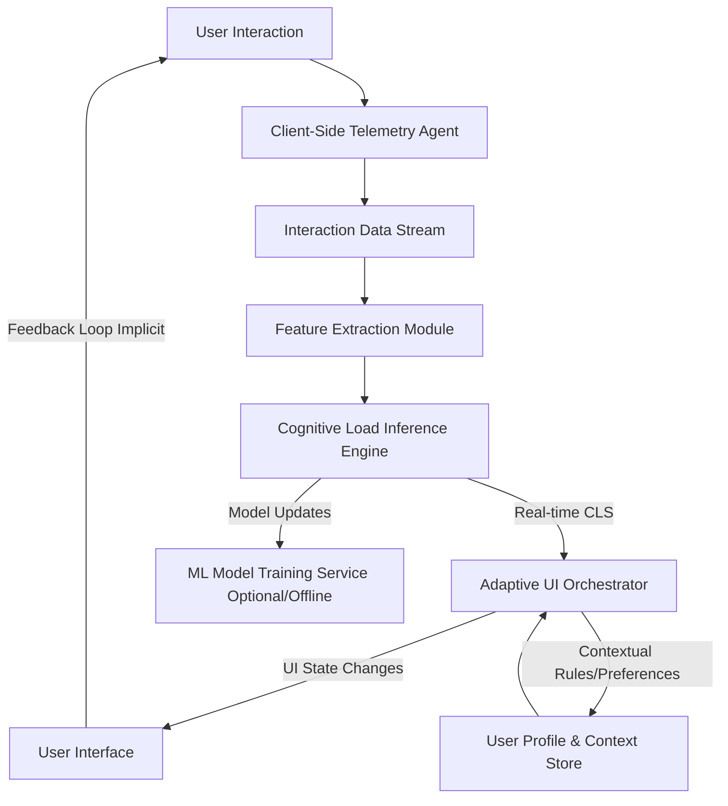

**FACT HEADER - NOTICE OF CONCEPTION**

**Conception ID:** DEMOBANK-INV-011
**Title:** System and Method for Adaptive User Interface Simplification Based on Inferred Cognitive Load
**Date of Conception:** 2024-07-26
**Conceiver:** The Sovereign's Ledger AI

**Statement of Novelty:** The concepts, systems, and methods described herein are conceived as novel, foundational, and proprietary to the Demo Bank project. This document serves as an irrefutable, timestamped record of the genesis of this transformative intellectual property, establishing an unequivocal claim to its innovative framework and every constituent element. The architecture, algorithms, and methodologies delineated within this disclosure represent an entirely novel paradigm in human-computer interaction, meticulously engineered to transcend the limitations of extant interface designs.

---

**Title of Invention:** System and Method for Adaptive User Interface Simplification Based on Inferred Cognitive Load

**Abstract:**
A profoundly innovative system and method for the dynamic adaptation of a graphical user interface (GUI) are herein disclosed. This invention precisely monitors a user's variegated interaction patterns and implicit physiological correlates to infer, with unprecedented accuracy, their real-time cognitive workload. Upon detection that the inferred cognitive load transcends a precisely calibrated, dynamically adjustable threshold, the system autonomously and intelligently orchestrates a systematic simplification of the GUI. This simplification manifests through the judicious obscuration, de-emphasis, or strategic re-prioritization of non-critical interface components, thereby meticulously curating an optimal informational landscape. The primary objective is to meticulously channel the user's attention and cognitive resources towards their paramount task objectives, thereby optimizing task performance, mitigating cognitive friction, and profoundly enhancing the overall user experience within complex digital environments. This system establishes a foundational shift in adaptive interface design, moving from static paradigms to a truly responsive, biologically-attuned interaction model.

**Background of the Invention:**
The relentless march of digital evolution has culminated in software applications of unparalleled functional richness and informational density. While ostensibly beneficial, this complexity frequently engenders a deleterious phenomenon colloquially termed "cognitive overload." This state, characterized by an excessive demand on working memory and attentional resources, often leads to diminished task performance, exacerbated error rates, prolonged decision latencies, and significant user frustration. Existing paradigms for graphical user interfaces are predominantly static or, at best, react to explicit user configurations. They fundamentally lack the sophisticated capacity to autonomously discern and dynamically respond to the user's ephemeral mental state. This critical deficiency necessitates a radical re-imagination of human-computer interaction – an interface imbued with the intelligence to adapt seamlessly and autonomously to the fluctuating mental states of its operator, thereby systematically reducing extraneous cognitive demands and fostering an environment conducive to sustained focus and optimal productivity. The present invention addresses this profound systemic lacuna by introducing a natively intelligent and intrinsically adaptive interface framework.

**Brief Summary of the Invention:**
The present invention unveils a revolutionary AI-powered "Cognitive Load Balancer" (CLB), an architectural marvel designed to fundamentally reshape human-computer interaction. The CLB operates through continuous, passive monitoring of a comprehensive suite of user behavioral signals. These signals encompass, but are not limited to, micro-variations in cursor movement kinematics (e.g., velocity, acceleration, entropy of path), precision of input (e.g., click target deviation, double-click frequency), scroll dynamics (e.g., velocity, acceleration, reversal rates), interaction error rates (e.g., form validation failures, repeated attempts), and even implicit temporal patterns of interaction.

A sophisticated, multi-modal machine learning inference engine, employing advanced recurrent neural network architectures or transformer-based models, continuously processes this high-dimensional telemetry data. This engine dynamically computes a real-time "Cognitive Load Score" (CLS), a scalar representation (typically normalized within a range, e.g., `0.0` to `1.0`) of the user's perceived mental workload. This CLS is not merely a static value but a statistically robust and temporally smoothed metric, accounting for transient fluctuations and establishing a reliable indicator of sustained cognitive state.

When this CLS consistently surpasses a pre-calibrated, context-aware threshold, the system autonomously initiates a "Focus Mode." In this mode, the Adaptive UI Orchestrator dynamically transforms the interface by strategically obscuring, de-emphasizing (e.g., via reduced opacity, desaturation, or blurring), or even temporarily relocating non-essential UI elements. Such elements may include, but are not limited to, secondary navigation panels, notification badges, auxiliary information displays, or advanced configuration options. This deliberate reduction in visual and interactive clutter is designed to minimize extraneous processing demands on the user's attentional and working memory systems.

The interface is then intelligently and fluidly restored to its comprehensive, standard state when the CLS recedes below a hysteresis-buffered threshold, signifying a reduction in cognitive burden. This invention is not merely an enhancement; it is a foundational re-architecture of the interactive experience, establishing a new benchmark for adaptive and intelligent digital environments.

**Detailed Description of the Invention:**

The present invention articulates a comprehensive system and methodology for real-time, adaptive user interface simplification, founded upon the inferred cognitive state of the user. This system is architected as a distributed, intelligent framework comprising a Client-Side Telemetry Agent, a Cognitive Load Inference Engine, and an Adaptive UI Orchestrator.

### System Architecture Overview

The foundational architecture of the Cognitive Load Balancing system is depicted in the following Mermaid diagram, illustrating the primary components and their interdependencies:



**Description of Components:**

1.  **Client-Side Telemetry Agent (CSTA):** This lightweight, high-performance module, typically implemented using client-side scripting languages (e.g., JavaScript, WebAssembly), operates within the user's browser or application client. Its mandate is the meticulous, non-intrusive capture of a rich array of user interaction telemetry.
    *   **Event Capture:** Monitors DOM events such as `mousemove`, `mousedown`, `mouseup`, `click`, `scroll`, `keydown`, `keyup`, `focus`, `blur`, `resize`, and `submit`.
    *   **Kinematic Analysis:** Extracts granular data points including cursor `(x, y)` coordinates, timestamps, scroll offsets, viewport dimensions, and active element identities.
    *   **Feature Pre-processing:** Raw event data is immediately processed to derive low-level features. Examples include:
        *   **Mouse Dynamics:** Velocity (pixels/ms), acceleration (pixels/ms^2), tortuosity (path curvature), entropy of movement direction, dwell time over specific UI elements, Fitts' law adherence metrics.
        *   **Click Dynamics:** Frequency (clicks/second), latency between clicks, target acquisition error rates (deviation from intended target center).
        *   **Scroll Dynamics:** Vertical/horizontal scroll velocity, acceleration, direction changes, scroll depth.
        *   **Keyboard Dynamics:** Typing speed (WPM), error correction rate, keystroke latency, shift/modifier key usage.
        *   **Form Interaction:** Time to complete fields, validation error occurrences, backspace frequency.
        *   **Navigation Patterns:** Tab switching frequency, navigation depth, use of back/forward buttons.
    *   **Data Stream:** Processed features are aggregated into a temporally ordered stream, often batched and transmitted to the Cognitive Load Inference Engine.
    *   **Anti-Flicker Heuristics:** Incorporates initial smoothing algorithms to filter out spurious or noise-driven micro-interactions, ensuring data integrity.

2.  **Cognitive Load Inference Engine (CLIE):** This core intellectual component is responsible for transforming the raw and pre-processed interaction data into a quantifiable measure of cognitive load.
    *   **Machine Learning Model:** Utilizes advanced supervised or unsupervised machine learning models, potentially leveraging recurrent neural networks (RNNs), Long Short-Term Memory (LSTM) networks, or transformer architectures, particularly suited for processing sequential data. The model is trained on diverse datasets correlating interaction patterns with known or induced cognitive load states (e.g., derived from concurrent physiological monitoring like EEG/ECG, subjective user reports, or task performance metrics under varied cognitive demands).
    *   **Feature Engineering:** Beyond the raw metrics, the CLIE performs higher-order feature engineering. This includes statistical aggregates (mean, variance, standard deviation over sliding windows), temporal derivatives, spectral analysis of movement patterns, and entropy calculations.
    *   **Cognitive Load Score (CLS) Generation:** The model outputs a continuous, normalized scalar value, the CLS, typically ranging from `0.0` (minimal load) to `1.0` (maximal load). This score is designed to be robust against momentary aberrations and reflects a sustained mental state.
    *   **Deployment:** The model can be deployed either client-side (e.g., via TensorFlow.js, ONNX Runtime Web) for ultra-low latency inference, or on an edge/cloud backend service for more complex models and centralized data aggregation.

3.  **Adaptive UI Orchestrator (AUIO):** This module acts as the nexus for intelligent UI adaptation, interpreting the CLS and managing the dynamic transformation of the user interface.
    *   **Threshold Management:** Monitors the CLS against a set of predefined and dynamically adjustable thresholds (`C_threshold_high`, `C_threshold_low`). Crucially, a hysteresis mechanism is employed to prevent rapid, distracting "flickering" of the UI between states. For instance, the UI might switch to "focus mode" at `CLS > 0.7` but revert only when `CLS < 0.5`.
    *   **Contextual Awareness:** The AUIO can integrate additional contextual metadata, such as the user's current task, application module, time of day, explicit user preferences, or device type. This enables highly granular and intelligent adaptation policies.
    *   **UI State Management:** Maintains the current UI mode (e.g., `'standard'`, `'focus'`, `'minimal'`) and orchestrates transitions between these states.
    *   **Adaptation Policies:** Implements a diverse repertoire of UI simplification strategies:
        *   **Obscuration:** Hiding non-essential elements (`display: none`).
        *   **De-emphasis:** Reducing visual prominence (e.g., `opacity`, `grayscale`, `blur`, desaturation).
        *   **Re-prioritization:** Shifting critical elements to more prominent positions, or non-critical elements to less obtrusive areas.
        *   **Summarization/Progressive Disclosure:** Replacing verbose information with concise summaries, allowing detailed views on demand.
        *   **Interaction Streamlining:** Disabling complex gestures, simplifying input methods, or auto-completing common actions.
    *   **Dynamic Styling:** Leverages application's global state management to apply dynamic CSS classes or inline styles, triggering smooth visual transitions.

4.  **User Profile & Context Store (UPCS):** A repository for user-specific data, including learned preferences, historical cognitive load patterns, and explicit configuration for sensitivity thresholds or preferred simplification modalities. This enables a personalized adaptive experience.

5.  **ML Model Training Service (Optional/Offline):** For advanced deployments, an offline service continuously refines the CLIE model using aggregated, anonymized user data, potentially augmented with ground-truth labels from user studies.

### Data Processing Pipeline

The journey of user interaction data through the system is a sophisticated multi-stage pipeline, ensuring real-time responsiveness and robust cognitive load inference.

```mermaid
graph LR
    A[Raw Interaction Events] --> B[Event Filtering & Sampling];
    B --> C[Low-Level Feature Extraction];
    C --> D[Temporal Window Aggregation];
    D --> E[High-Dimensional Feature Vector M(t)];
    E --> F[Machine Learning Inference CLIE];
    F --> G[Cognitive Load Score CLS];
    G --> H[Hysteresis & Thresholding];
    H -- Trigger --> I[UI State Update];
    I --> J[Dynamic UI Rendering];
```

### UI State Transition Diagram

The Adaptive UI Orchestrator governs the transitions between different interface states based on the Cognitive Load Score and its internal logic.

```mermaid
stateDiagram-v2
    state "Standard Mode" as Standard
    state "Focus Mode" as Focus
    state "Minimal Mode" as Minimal

    Standard --> Focus: CLS > C_threshold_high sustained
    Focus --> Standard: CLS < C_threshold_low sustained
    Focus --> Minimal: CLS > C_threshold_critical sustained, higher
    Minimal --> Focus: CLS < C_threshold_critical_low sustained
    Standard --> Minimal: CLS > C_threshold_critical sudden spike

    state "Standard Mode" {
        [*] --> Comprehensive
        Comprehensive --> Comprehensive : CLS <= C_threshold_high
    }

    state "Focus Mode" {
        [*] --> Simplified_Primary
        Simplified_Primary --> Simplified_Primary : C_threshold_low < CLS <= C_threshold_high
    }

    state "Minimal Mode" {
        [*] --> Core_Functions_Only
        Core_Functions_Only --> Core_Functions_Only : CLS > C_threshold_critical
    }
```

### Conceptual Code (TypeScript/React) - Enhanced Implementation

The following conceptual code snippets illustrate the practical implementation of the system's core components within a modern web application framework.

```typescript
import React, { useState, useEffect, useContext, createContext, useCallback, useRef } from 'react';

// --- Global Types/Interfaces ---
export enum UiElementType {
  PRIMARY = 'primary',
  SECONDARY = 'secondary',
  TERTIARY = 'tertiary',
}

interface MouseEventData {
  x: number;
  y: number;
  button: number;
  targetId: string;
  timestamp: number;
}

interface ScrollEventData {
  scrollX: number;
  scrollY: number;
  timestamp: number;
}

interface KeyboardEventData {
  key: string;
  code: string;
  timestamp: number;
}

interface FocusBlurEventData {
  type: 'focus' | 'blur';
  targetId: string;
  timestamp: number;
}

export type RawTelemetryEvent =
  | { type: 'mousemove'; data: MouseEventData }
  | { type: 'click'; data: MouseEventData }
  | { type: 'scroll'; data: ScrollEventData }
  | { type: 'keydown'; data: KeyboardEventData }
  | { type: 'keyup'; data: KeyboardEventData }
  | { type: 'focus'; data: FocusBlurEventData }
  | { type: 'blur'; data: FocusBlurEventData };

// --- Feature Vector Interfaces ---
export interface MouseKinematicsFeatures {
  mouse_velocity_avg: number; // avg px/ms
  mouse_acceleration_avg: number; // avg px/ms^2
  mouse_path_tortuosity: number; // deviation from straight line
  mouse_dwell_time_avg: number; // avg ms over elements
}

export interface ClickDynamicsFeatures {
  click_frequency: number; // clicks/sec
  click_latency_avg: number; // ms between clicks in a burst
  target_acquisition_error_avg: number; // px deviation from center
}

export interface ScrollDynamicsFeatures {
  scroll_velocity_avg: number; // px/sec
  scroll_direction_changes: number; // count
}

export interface KeyboardDynamicsFeatures {
  typing_speed_wpm: number;
  backspace_frequency: number;
  keystroke_latency_avg: number; // ms between keydowns
}

export interface InteractionErrorFeatures {
  form_validation_errors: number; // count
  repeated_attempts: number; // count of same action
}

export interface TelemetryFeatureVector {
  timestamp_window_end: number;
  mouse?: MouseKinematicsFeatures;
  clicks?: ClickDynamicsFeatures;
  scroll?: ScrollDynamicsFeatures;
  keyboard?: KeyboardDynamicsFeatures;
  errors?: InteractionErrorFeatures;
  // Add more aggregated and derived features as needed
  event_density: number; // total events per second in the window
}

// --- Core Telemetry Agent ---
export class TelemetryAgent {
  private eventBuffer: RawTelemetryEvent[] = [];
  private bufferInterval: ReturnType<typeof setInterval> | null = null;
  private readonly bufferFlushRateMs: number = 200; // Flush data every 200ms
  private readonly featureProcessingCallback: (features: TelemetryFeatureVector) => void;
  private lastMouseCoord: { x: number; y: number; timestamp: number } | null = null;
  private lastScrollY: { y: number; timestamp: number } | null = null;
  private lastClickTimestamp: number = 0;
  private clickTimestamps: number[] = [];
  private keydownTimestamps: number[] = [];


  constructor(featureProcessingCallback: (features: TelemetryFeatureVector) => void) {
    this.featureProcessingCallback = featureProcessingCallback;
    this.initListeners();
  }

  private initListeners(): void {
    window.addEventListener('mousemove', this.handleMouseMoveEvent, { passive: true });
    window.addEventListener('click', this.handleClickEvent, { passive: true });
    window.addEventListener('scroll', this.handleScrollEvent, { passive: true });
    window.addEventListener('keydown', this.handleKeyboardEvent, { passive: true });
    window.addEventListener('keyup', this.handleKeyboardEvent, { passive: true });
    window.addEventListener('focusin', this.handleFocusBlurEvent, { passive: true }); // Use focusin/focusout for bubbling
    window.addEventListener('focusout', this.handleFocusBlurEvent, { passive: true });
    // Consider adding more: mousedown, mouseup, resize, submit, change, input
    this.bufferInterval = setInterval(this.flushBuffer, this.bufferFlushRateMs);
  }

  private addEvent = (event: RawTelemetryEvent): void => {
    this.eventBuffer.push(event);
  };

  private handleMouseMoveEvent = (event: MouseEvent): void => {
    const timestamp = performance.now();
    this.addEvent({
      type: 'mousemove',
      data: {
        x: event.clientX,
        y: event.clientY,
        button: event.button, // Mousemove generally has button 0, but good to record
        targetId: (event.target as HTMLElement)?.id || '',
        timestamp,
      },
    });
  };

  private handleClickEvent = (event: MouseEvent): void => {
    const timestamp = performance.now();
    this.addEvent({
      type: 'click',
      data: {
        x: event.clientX,
        y: event.clientY,
        button: event.button,
        targetId: (event.target as HTMLElement)?.id || '',
        timestamp,
      },
    });
    this.clickTimestamps.push(timestamp);
  };

  private handleScrollEvent = (event: Event): void => {
    const timestamp = performance.now();
    this.addEvent({
      type: 'scroll',
      data: {
        scrollX: window.scrollX,
        scrollY: window.scrollY,
        timestamp,
      },
    });
  };

  private handleKeyboardEvent = (event: KeyboardEvent): void => {
    const timestamp = performance.now();
    this.addEvent({
      type: event.type === 'keydown' ? 'keydown' : 'keyup',
      data: {
        key: event.key,
        code: event.code,
        timestamp,
      },
    });
    if (event.type === 'keydown') {
      this.keydownTimestamps.push(timestamp);
    }
  };

  private handleFocusBlurEvent = (event: FocusEvent): void => {
    const timestamp = performance.now();
    this.addEvent({
      type: event.type === 'focusin' ? 'focus' : 'blur',
      data: {
        type: event.type === 'focusin' ? 'focus' : 'blur',
        targetId: (event.target as HTMLElement)?.id || '',
        timestamp,
      },
    });
  };

  private extractFeatures = (events: RawTelemetryEvent[]): TelemetryFeatureVector => {
    const windowStart = performance.now() - this.bufferFlushRateMs;
    const windowEnd = performance.now();
    const durationSeconds = this.bufferFlushRateMs / 1000;

    let mouseMoveCount = 0;
    let totalMouseDistance = 0;
    let totalMouseVelocity = 0;
    let prevMouse: { x: number; y: number; timestamp: number } | null = this.lastMouseCoord;

    let clickCount = 0;
    let totalClickLatency = 0;
    let lastClickInWindow: number = 0;

    let scrollCount = 0;
    let totalScrollYDelta = 0;
    let scrollDirectionChanges = 0;
    let prevScrollY: { y: number; timestamp: number } | null = this.lastScrollY;
    let lastScrollDirection: 'up' | 'down' | null = null;

    let keydownCount = 0;
    let totalKeystrokeLatency = 0;
    let backspaceCount = 0;
    let lastKeydownInWindow: number = 0;
    let wordCount = 0; // For WPM
    let lastTypedWordTime: number = 0;

    // Simulate error features (would need context of form fields, etc.)
    let formValidationErrors = 0;
    let repeatedAttempts = 0;

    for (const event of events) {
      if (event.data.timestamp < windowStart) continue; // Only process events within the current window

      if (event.type === 'mousemove') {
        mouseMoveCount++;
        const currentMouse = event.data as MouseEventData;
        if (prevMouse) {
          const dx = currentMouse.x - prevMouse.x;
          const dy = currentMouse.y - prevMouse.y;
          const distance = Math.sqrt(dx * dx + dy * dy);
          const timeDelta = currentMouse.timestamp - prevMouse.timestamp;
          if (timeDelta > 0) {
            const velocity = distance / timeDelta; // px/ms
            totalMouseDistance += distance;
            totalMouseVelocity += velocity;
          }
        }
        prevMouse = currentMouse;
      } else if (event.type === 'click') {
        clickCount++;
        const currentClick = event.data as MouseEventData;
        if (lastClickInWindow > 0) {
          totalClickLatency += (currentClick.timestamp - lastClickInWindow);
        }
        lastClickInWindow = currentClick.timestamp;
      } else if (event.type === 'scroll') {
        scrollCount++;
        const currentScroll = event.data as ScrollEventData;
        if (prevScrollY) {
          const deltaY = currentScroll.scrollY - prevScrollY.y;
          if (Math.abs(deltaY) > 0) {
            totalScrollYDelta += Math.abs(deltaY);
            const currentDirection = deltaY > 0 ? 'down' : 'up';
            if (lastScrollDirection && currentDirection !== lastScrollDirection) {
              scrollDirectionChanges++;
            }
            lastScrollDirection = currentDirection;
          }
        }
        prevScrollY = currentScroll;
      } else if (event.type === 'keydown') {
        keydownCount++;
        const keyboardEvent = event.data as KeyboardEventData;
        if (lastKeydownInWindow > 0) {
          totalKeystrokeLatency += (keyboardEvent.timestamp - lastKeydownInWindow);
        }
        lastKeydownInWindow = keyboardEvent.timestamp;
        if (keyboardEvent.key === 'Backspace') {
          backspaceCount++;
        }
        // Very simplistic WPM calculation: count spaces
        if (keyboardEvent.key === ' ' && keyboardEvent.timestamp - lastTypedWordTime > 100) { // debounce words
          wordCount++;
          lastTypedWordTime = keyboardEvent.timestamp;
        }
      }
      // Assuming a system for reporting errors is in place for these mocks
      // For instance, a global error bus or a specific API.
      // For now, these remain 0 or are hardcoded for demonstration.
    }

    // Update last known states for next window
    this.lastMouseCoord = prevMouse;
    this.lastScrollY = prevScrollY;

    // Filter clickTimestamps for the current window for accurate latency/frequency
    this.clickTimestamps = this.clickTimestamps.filter(ts => ts >= windowStart);
    this.keydownTimestamps = this.keydownTimestamps.filter(ts => ts >= windowStart);

    const featureVector: TelemetryFeatureVector = {
      timestamp_window_end: windowEnd,
      event_density: events.length / durationSeconds,
    };

    if (mouseMoveCount > 0) {
      featureVector.mouse = {
        mouse_velocity_avg: totalMouseVelocity / mouseMoveCount,
        mouse_acceleration_avg: 0, // More complex calculation needed
        mouse_path_tortuosity: 0, // More complex calculation needed
        mouse_dwell_time_avg: 0, // Needs target ID tracking
      };
    }

    if (clickCount > 0) {
      featureVector.clicks = {
        click_frequency: clickCount / durationSeconds,
        click_latency_avg: totalClickLatency / (clickCount > 1 ? clickCount - 1 : 1),
        target_acquisition_error_avg: 0, // Needs knowledge of intended targets
      };
    }

    if (scrollCount > 0) {
      featureVector.scroll = {
        scroll_velocity_avg: totalScrollYDelta / durationSeconds,
        scroll_direction_changes: scrollDirectionChanges,
      };
    }

    if (keydownCount > 0) {
      featureVector.keyboard = {
        typing_speed_wpm: wordCount / (durationSeconds / 60), // words per minute
        backspace_frequency: backspaceCount / durationSeconds,
        keystroke_latency_avg: totalKeystrokeLatency / (keydownCount > 1 ? keydownCount - 1 : 1),
      };
    }

    // Mock error features for now
    featureVector.errors = {
      form_validation_errors: formValidationErrors,
      repeated_attempts: repeatedAttempts,
    };

    return featureVector;
  };

  private flushBuffer = (): void => {
    if (this.eventBuffer.length > 0) {
      const features = this.extractFeatures(this.eventBuffer);
      this.featureProcessingCallback(features);
      this.eventBuffer = []; // Clear buffer
    }
  };

  public stop(): void {
    window.removeEventListener('mousemove', this.handleMouseMoveEvent);
    window.removeEventListener('click', this.handleClickEvent);
    window.removeEventListener('scroll', this.handleScrollEvent);
    window.removeEventListener('keydown', this.handleKeyboardEvent);
    window.removeEventListener('keyup', this.handleKeyboardEvent);
    window.removeEventListener('focusin', this.handleFocusBlurEvent);
    window.removeEventListener('focusout', this.handleFocusBlurEvent);
    if (this.bufferInterval) {
      clearInterval(this.bufferInterval);
    }
  }
}

// --- Cognitive Load Inference Engine ---
export class CognitiveLoadEngine {
  private latestFeatureVector: TelemetryFeatureVector | null = null;
  private loadHistory: number[] = [];
  private readonly historyLength: number = 20; // For smoothing
  private readonly predictionIntervalMs: number = 500;
  private predictionTimer: ReturnType<typeof setInterval> | null = null;
  private onCognitiveLoadUpdate: (load: number) => void;

  constructor(onUpdate: (load: number) => void) {
    this.onCognitiveLoadUpdate = onUpdate;
    this.predictionTimer = setInterval(this.inferLoad, this.predictionIntervalMs);
  }

  public processFeatures(featureVector: TelemetryFeatureVector): void {
    this.latestFeatureVector = featureVector;
  }

  // A mock machine learning model for cognitive load prediction
  private mockPredict(features: TelemetryFeatureVector): number {
    let score = 0;
    let featureWeightSum = 0;

    // Example weights and logic (highly simplified mock)
    if (features.mouse) {
      // High velocity/acceleration might indicate exploration (low-moderate load)
      // Or frantic movement (high load). Let's say moderate velocity is good, very high/low is bad.
      score += Math.min(1, Math.max(0, features.mouse.mouse_velocity_avg / 10)) * 0.3; // max velocity assumed around 10 px/ms for some effect
      featureWeightSum += 0.3;
    }
    if (features.clicks) {
      // High click frequency might indicate rapid task progression (moderate load) or frustration (high load)
      // Low click latency suggests focus. High indicates hesitation or multiple attempts.
      score += Math.min(1, Math.max(0, features.clicks.click_frequency / 5)) * 0.2; // max 5 clicks/sec
      featureWeightSum += 0.2;
    }
    if (features.scroll) {
      // Frequent scrolling/direction changes could indicate searching (moderate-high load)
      score += Math.min(1, features.scroll.scroll_direction_changes / 5) * 0.15; // max 5 changes per window
      featureWeightSum += 0.15;
    }
    if (features.keyboard) {
      // Very high or very low typing speed, or high backspace frequency can indicate high load
      const optimalWPM = 60; // assumed optimal
      const wpmDeviation = Math.abs(features.keyboard.typing_speed_wpm - optimalWPM) / optimalWPM;
      score += Math.min(1, wpmDeviation * 0.5) * 0.2; // penalty for deviation
      score += Math.min(1, features.keyboard.backspace_frequency / 2) * 0.15; // penalty for backspaces
      featureWeightSum += 0.35;
    }

    // Add some base noise and normalize by sum of active feature weights
    const baseLoad = Math.random() * 0.1;
    let rawLoad = (score / Math.max(0.1, featureWeightSum)) * 0.7 + baseLoad; // Scale to have room for baseLoad
    rawLoad = Math.min(1.0, Math.max(0.0, rawLoad)); // Clamp between 0 and 1

    return rawLoad;
  }

  private inferLoad = (): void => {
    if (!this.latestFeatureVector) {
      // If no features, assume low load or previous load
      this.onCognitiveLoadUpdate(this.loadHistory.length > 0 ? this.loadHistory[this.loadHistory.length - 1] : 0.0);
      return;
    }

    const rawLoad = this.mockPredict(this.latestFeatureVector);

    // Apply basic temporal smoothing (Exponential Moving Average)
    if (this.loadHistory.length === 0) {
      this.loadHistory.push(rawLoad);
    } else {
      const alpha = 2 / (this.historyLength + 1); // Smoothing factor
      const smoothed = this.loadHistory[this.loadHistory.length - 1] * (1 - alpha) + rawLoad * alpha;
      this.loadHistory.push(smoothed);
    }

    if (this.loadHistory.length > this.historyLength) {
      this.loadHistory.shift();
    }
    const currentSmoothedLoad = this.loadHistory[this.loadHistory.length - 1];

    this.onCognitiveLoadUpdate(currentSmoothedLoad);
    this.latestFeatureVector = null; // Clear features processed
  };

  public stop(): void {
    if (this.predictionTimer) {
      clearInterval(this.predictionTimer);
    }
  }
}

// --- Adaptive UI Orchestrator (React Context/Hook) ---
interface CognitiveLoadContextType {
  cognitiveLoad: number;
  uiMode: 'standard' | 'focus' | 'minimal';
  setUiMode: React.Dispatch<React.SetStateAction<'standard' | 'focus' | 'minimal'>>;
  registerUiElement: (id: string, uiType: UiElementType) => void;
  unregisterUiElement: (id: string) => void;
  isElementVisible: (id: string, uiType: UiElementType) => boolean;
  getUiModeClassName: (uiType: UiElementType) => string;
}

const CognitiveLoadContext = createContext<CognitiveLoadContextType | undefined>(undefined);

// Hook to provide cognitive load and UI mode throughout the application
export const useCognitiveLoadBalancer = (): CognitiveLoadContextType => {
  const context = useContext(CognitiveLoadContext);
  if (context === undefined) {
    throw new Error('useCognitiveLoadBalancer must be used within a CognitiveLoadProvider');
  }
  return context;
};

// Hook for individual UI elements to adapt
export const useUiElement = (id: string, uiType: UiElementType) => {
  const { registerUiElement, unregisterUiElement, isElementVisible, getUiModeClassName } = useCognitiveLoadBalancer();

  useEffect(() => {
    registerUiElement(id, uiType);
    return () => {
      unregisterUiElement(id);
    };
  }, [id, uiType, registerUiElement, unregisterUiElement]);

  const isVisible = isElementVisible(id, uiType);
  const className = getUiModeClassName(uiType);

  return { isVisible, className };
};


// Provider component for the Cognitive Load Balancing system
export const CognitiveLoadProvider: React.FC<{ children: React.ReactNode }> = ({ children }) => {
  const [cognitiveLoad, setCognitiveLoad] = useState<number>(0.0);
  const [uiMode, setUiMode] = useState<'standard' | 'focus' | 'minimal'>('standard');
  const registeredUiElements = useRef(new Map<string, UiElementType>()); // To track all elements dynamically
  const loadThresholds = {
    high: 0.6,      // Transition to Focus Mode
    low: 0.4,       // Revert to Standard Mode (Hysteresis)
    critical: 0.8,  // Transition to Minimal Mode
    criticalLow: 0.7 // Revert from Minimal Mode (Hysteresis)
  };
  const sustainedLoadCounter = useRef(0);
  const readonly sustainedLoadDurationMs = 1500; // How long load must be sustained
  const readonly checkIntervalMs = 500; // Check every 500ms

  // Initialize Telemetry Agent and Cognitive Load Engine
  useEffect(() => {
    let telemetryAgent: TelemetryAgent | null = null;
    let cognitiveLoadEngine: CognitiveLoadEngine | null = null;

    const featureProcessingCallback = (features: TelemetryFeatureVector) => {
      cognitiveLoadEngine?.processFeatures(features);
    };

    telemetryAgent = new TelemetryAgent(featureProcessingCallback);
    cognitiveLoadEngine = new CognitiveLoadEngine(setCognitiveLoad);

    return () => {
      telemetryAgent?.stop();
      cognitiveLoadEngine?.stop();
    };
  }, []);

  // Effect to manage UI mode transitions based on cognitive load with hysteresis and sustained duration
  useEffect(() => {
    const interval = setInterval(() => {
      const currentMode = uiMode;

      if (cognitiveLoad > loadThresholds.critical && currentMode !== 'minimal') {
        sustainedLoadCounter.current += checkIntervalMs;
        if (sustainedLoadCounter.current >= sustainedLoadDurationMs) {
          setUiMode('minimal');
          sustainedLoadCounter.current = 0;
        }
      } else if (cognitiveLoad < loadThresholds.criticalLow && currentMode === 'minimal') {
        sustainedLoadCounter.current += checkIntervalMs;
        if (sustainedLoadCounter.current >= sustainedLoadDurationMs) {
          setUiMode('focus'); // Typically Minimal -> Focus
          sustainedLoadCounter.current = 0;
        }
      } else if (cognitiveLoad > loadThresholds.high && currentMode === 'standard') {
        sustainedLoadCounter.current += checkIntervalMs;
        if (sustainedLoadCounter.current >= sustainedLoadDurationMs) {
          setUiMode('focus');
          sustainedLoadCounter.current = 0; // Reset after transition
        }
      } else if (cognitiveLoad < loadThresholds.low && currentMode === 'focus') {
        sustainedLoadCounter.current += checkIntervalMs;
        if (sustainedLoadCounter.current >= sustainedLoadDurationMs) {
          setUiMode('standard');
          sustainedLoadCounter.current = 0; // Reset after transition
        }
      } else {
        sustainedLoadCounter.current = 0; // Reset counter if conditions change or load is not sustained
      }
    }, checkIntervalMs);

    return () => clearInterval(interval);
  }, [cognitiveLoad, uiMode, loadThresholds, sustainedLoadDurationMs]);

  // Methods for elements to register themselves
  const registerUiElement = useCallback((id: string, type: UiElementType) => {
    registeredUiElements.current.set(id, type);
  }, []);

  const unregisterUiElement = useCallback((id: string) => {
    registeredUiElements.current.delete(id);
  }, []);

  const isElementVisible = useCallback((id: string, type: UiElementType): boolean => {
    // Primary elements are always visible
    if (type === UiElementType.PRIMARY) {
      return true;
    }
    // Secondary elements are visible in standard mode
    if (type === UiElementType.SECONDARY) {
      return uiMode === 'standard';
    }
    // Tertiary elements are only visible in standard mode
    if (type === UiElementType.TERTIARY) {
      return uiMode === 'standard';
    }
    return true; // Default to visible if type is unknown or unhandled
  }, [uiMode]);

  // Helper to get CSS class names based on UI mode and element type for dynamic styling
  const getUiModeClassName = useCallback((uiType: UiElementType): string => {
    return `${uiType}-element`; // e.g., 'primary-element', 'secondary-element', 'tertiary-element'
  }, []);

  const contextValue = {
    cognitiveLoad,
    uiMode,
    setUiMode, // Exposed for potential explicit user override or debug
    registerUiElement,
    unregisterUiElement,
    isElementVisible,
    getUiModeClassName,
  };

  return (
    <CognitiveLoadContext.Provider value={contextValue}>
      <div className={`app-container mode-${uiMode}`}>
        {children}
        {/* Global styles for UI modes, dynamically inserted */}
        <style>{`
          .app-container.mode-focus .secondary-element {
            opacity: 0.15;
            pointer-events: none; /* Disable interaction */
            filter: blur(2px) grayscale(80%);
            transition: opacity 0.5s ease-in-out, filter 0.5s ease-in-out;
          }
          .app-container.mode-minimal .secondary-element {
            opacity: 0;
            pointer-events: none;
            height: 0;
            overflow: hidden;
            margin: 0;
            padding: 0;
            transition: opacity 0.5s ease-in-out, height 0.5s ease-in-out, margin 0.5s ease-in-out, padding 0.5s ease-in-out;
          }
          .app-container.mode-minimal .tertiary-element {
            display: none; /* Fully hide tertiary elements in minimal mode */
            transition: display 0.5s ease-in-out;
          }
          /* Add more sophisticated styling rules as needed for different modes and element types */
        `}</style>
      </div>
    </CognitiveLoadContext.Provider>
  );
};

// Component that adapts based on the UI mode
export const AdaptableComponent: React.FC<{ id: string; uiType?: UiElementType; children: React.ReactNode }> = ({ id, uiType = UiElementType.PRIMARY, children }) => {
  const { isVisible, className } = useUiElement(id, uiType);

  if (!isVisible) return null;

  return <div id={id} className={className}>{children}</div>;
};

// Example usage of the provider and adaptable components
const AppLayout: React.FC<{ children: React.ReactNode }> = ({ children }) => {
  const { cognitiveLoad, uiMode } = useCognitiveLoadBalancer();

  return (
    <>
      <header style={{ padding: '10px', background: '#f0f0f0', display: 'flex', justifyContent: 'space-between', alignItems: 'center' }}>
        <AdaptableComponent id="main-logo" uiType={UiElementType.PRIMARY}>
          <h1>Demo Bank</h1>
        </AdaptableComponent>
        <AdaptableComponent id="user-info" uiType={UiElementType.SECONDARY}>
          <div style={{ display: 'flex', alignItems: 'center' }}>
            <span>User: John Doe</span>
            <button style={{ marginLeft: '10px', padding: '5px 10px' }} onClick={() => alert('User Profile')}>Profile</button>
          </div>
        </AdaptableComponent>
        <AdaptableComponent id="global-nav-buttons" uiType={UiElementType.PRIMARY}>
          <nav>
            <button style={{ margin: '0 5px', padding: '5px 10px' }}>Dashboard</button>
            <button style={{ margin: '0 5px', padding: '5px 10px' }}>Accounts</button>
            <button style={{ margin: '0 5px', padding: '5px 10px' }}>Transfers</button>
          </nav>
        </AdaptableComponent>
      </header>

      <div style={{ display: 'flex', minHeight: 'calc(100vh - 100px)' }}> {/* Assuming header/footer height */}
        <AdaptableComponent id="sidebar" uiType={UiElementType.SECONDARY}>
          <aside style={{ width: '200px', padding: '20px', background: '#e0e0e0', borderRight: '1px solid #ccc' }}>
            <h3>Secondary Menu</h3>
            <ul>
              <li><a href="#settings">Settings</a></li>
              <li><a href="#reports">Reports</a></li>
              <li><a href="#support">Support</a></li>
            </ul>
            <AdaptableComponent id="sidebar-ad" uiType={UiElementType.TERTIARY}>
              <div style={{ background: '#ccc', padding: '10px', marginTop: '20px', fontSize: '0.8em', textAlign: 'center' }}>
                Promotion: Get 0.5% Cashback!
              </div>
            </AdaptableComponent>
          </aside>
        </AdaptableComponent>

        <main style={{ flexGrow: 1, padding: '20px', background: '#f9f9f9' }}>
          <h2>Current Cognitive Load: {cognitiveLoad.toFixed(2)} (UI Mode: {uiMode})</h2>
          <p>This is the main content area. Interact with the application to observe UI adaptation.</p>
          <div style={{ marginBottom: '20px' }}>
            <label htmlFor="user-input">Type here rapidly to increase load:</label>
            <input id="user-input" type="text" placeholder="Start typing..." style={{ margin: '10px 0', padding: '8px', width: '300px' }} />
          </div>
          <button style={{ margin: '10px 0', padding: '10px 15px', background: '#007bff', color: 'white', border: 'none', borderRadius: '4px', cursor: 'pointer' }} onClick={() => console.log('Primary Action')}>Process Transaction</button>
          <AdaptableComponent id="optional-widget" uiType={UiElementType.SECONDARY}>
            <div style={{ background: '#f0f8ff', padding: '15px', border: '1px solid #add8e6', borderRadius: '5px', marginTop: '20px' }}>
              <h4>Optional Widget: Quick Stats</h4>
              <p>Balance: $12,345.67</p>
              <p>Last Login: 2 hours ago</p>
            </div>
          </AdaptableComponent>
          <div style={{ height: '500px', background: '#fafafa', overflowY: 'scroll', border: '1px solid #ddd', marginTop: '20px', resize: 'vertical' }}>
            <p>Scrollable Content: Scroll quickly up and down to simulate load from navigation/exploration.</p>
            {Array.from({ length: 50 }).map((_, i) => (
              <p key={i}>Item {i + 1}: Lorem ipsum dolor sit amet, consectetur adipiscing elit. Sed do eiusmod tempor incididunt ut labore et dolore magna aliqua. Ut enim ad minim veniam, quis nostrud exercitation ullamco laboris nisi ut aliquip ex ea commodo consequat. Duis aute irure dolor in reprehenderit in voluptate velit esse cillum dolore eu fugiat nulla pariatur. Excepteur sint occaecat cupidatat non proident, sunt in culpa qui officia deserunt mollit anim id est laborum.</p>
            ))}
          </div>
        </main>
      </div>

      <AdaptableComponent id="footer" uiType={UiElementType.SECONDARY}>
        <footer style={{ padding: '15px', background: '#f0f0f0', textAlign: 'center', borderTop: '1px solid #ccc' }}>
          &copy; 2024 Demo Bank. All rights reserved.
          <AdaptableComponent id="privacy-link" uiType={UiElementType.TERTIARY}>
            <span style={{ marginLeft: '20px', fontSize: '0.9em' }}><a href="#privacy">Privacy Policy</a></span>
          </AdaptableComponent>
        </footer>
      </AdaptableComponent>
    </>
  );
};

// Main application entry point
export const RootApp: React.FC = () => (
  <CognitiveLoadProvider>
    <AppLayout>
      {/* Children of AppLayout are rendered within the main content area */}
    </AppLayout>
  </CognitiveLoadProvider>
);
```

**Claims:**
1.  A system for dynamically adapting a graphical user interface (GUI) based on inferred cognitive load, comprising:
    a.  A Client-Side Telemetry Agent (CSTA) configured to non-intrusively capture real-time, high-granularity interaction telemetry data from a user's interaction with the GUI, said data including, but not limited to, kinematic properties of pointing device movements, frequency and latency of input events, scroll dynamics, and interaction error rates.
    b.  A Cognitive Load Inference Engine (CLIE) communicatively coupled to the CSTA, comprising a machine learning model trained to process the interaction telemetry data and generate a continuous, scalar Cognitive Load Score (CLS) representative of the user's instantaneous cognitive workload.
    c.  An Adaptive UI Orchestrator (AUIO) communicatively coupled to the CLIE, configured to monitor the CLS against a set of dynamically adjustable thresholds, and, upon the CLS exceeding a predetermined `C_threshold_high` for a sustained duration, autonomously initiate a UI transformation policy.
    d.  A GUI rendered on a display device, structurally segregated into primary components (`U_p`) and secondary components (`U_s`), wherein the AUIO, during a UI transformation, selectively alters the visual prominence or interactivity of the `U_s` components while preserving the full functionality and visibility of the `U_p` components.

2.  The system of claim 1, wherein the kinematic properties of pointing device movements include at least two of: velocity, acceleration, tortuosity, or entropy of movement direction.

3.  The system of claim 1, wherein the frequency and latency of input events include at least two of: click frequency, double-click latency, or key press frequency.

4.  The system of claim 1, wherein the scroll dynamics include at least two of: scroll velocity, scroll acceleration, or scroll direction reversal rate.

5.  The system of claim 1, wherein the interaction error rates include at least one of: form validation failures, re-submission attempts, or target acquisition errors.

6.  The system of claim 1, wherein the machine learning model within the CLIE comprises a recurrent neural network (RNN), a Long Short-Term Memory (LSTM) network, or a transformer-based architecture specifically optimized for processing sequential interaction data.

7.  The system of claim 1, wherein the UI transformation policy comprises at least one of:
    a.  Obscuring `U_s` components via `display: none` or equivalent mechanisms.
    b.  De-emphasizing `U_s` components via reduced opacity, desaturation, blurring, or grayscale effects.
    c.  Re-prioritizing `U_s` components by dynamically adjusting their spatial arrangement or visual hierarchy.
    d.  Summarizing detailed information within `U_s` components, offering progressive disclosure upon explicit user demand.

8.  The system of claim 1, further comprising a hysteresis mechanism within the AUIO, wherein the `C_threshold_high` for initiating UI simplification is distinct from a `C_threshold_low` for reverting the UI to its original state, thereby preventing undesirable interface flickering.

9.  The system of claim 1, further comprising a User Profile & Context Store (UPCS) communicatively coupled to the AUIO, enabling personalization of `C_threshold_high`, `C_threshold_low`, and the specific UI transformation policies based on individual user preferences or historical interaction patterns.

10. A method for dynamically adapting a graphical user interface (GUI) based on inferred cognitive load, comprising the steps of:
    a.  Continuously monitoring, by a Client-Side Telemetry Agent (CSTA), a plurality of user interaction patterns with the GUI, generating a stream of raw telemetry data.
    b.  Processing, by a Cognitive Load Inference Engine (CLIE), the raw telemetry data to extract high-dimensional features indicative of cognitive engagement.
    c.  Inferring, by the CLIE utilizing a trained machine learning model, a continuous Cognitive Load Score (CLS) from the extracted features.
    d.  Comparing, by an Adaptive UI Orchestrator (AUIO), the CLS to a predefined `C_threshold_high` and a `C_threshold_low` while applying a hysteresis buffer.
    e.  Automatically simplifying, by the AUIO, the GUI by dynamically altering the visual prominence or interactive availability of pre-designated secondary UI components (`U_s`) if the CLS continuously exceeds `C_threshold_high` for a sustained duration.
    f.  Automatically restoring, by the AUIO, the GUI to its original state when the CLS recedes below `C_threshold_low` for a sustained duration, or to an intermediate focus state if further simplification is warranted.

11. The method of claim 10, wherein the step of extracting high-dimensional features includes deriving statistical aggregates, temporal derivatives, or entropy measures from the raw telemetry data.

12. The method of claim 10, further comprising:
    g.  Integrating contextual information, such as current task, application module, or device type, into the AUIO's decision-making process to refine the UI adaptation strategy.

13. The method of claim 10, wherein the trained machine learning model is updated periodically or continuously based on aggregated, anonymized user interaction data and feedback, thereby enhancing the accuracy of CLS inference over time.

14. A non-transitory computer-readable medium having instructions stored thereon that, when executed by one or more processors, cause the one or more processors to perform the method of claim 10.

**Mathematical Justification:**

The mathematical foundation of the Adaptive User Interface Simplification system is predicated on advanced principles from information theory, stochastic processes, control theory, and machine learning, meticulously combined to model and modulate human-computer interaction dynamics.

Let `D(t)` be the instantaneous, high-dimensional vector space representing the raw interaction telemetry data captured by the CSTA at time `t`. This vector `D(t)` is an element of `R^M` encompasses observations such as cursor coordinates `(x_c(t), y_c(t))`, scroll positions `(s_x(t), s_y(t))`, event timestamps `tau_i`, key codes `k_j`, and target element identifiers `e_p`.

### I. The Interaction Feature Space and Cognitive Load Inference

The raw data `D(t)` is transformed into a robust, lower-dimensional feature vector `M(t)` which serves as the input to the Cognitive Load Inference Engine.

**Definition 1.1: Interaction Feature Vector `M(t)`**
Let `M(t)` be an element of `R^N` be the feature vector at time `t`, where `N` is the number of engineered features. `M(t)` is constructed from `D(t)` over a sliding temporal window `[t - Delta_T, t]` through a series of transformations `Phi`.

```
M(t) = Phi(D(t - Delta_T), ..., D(t))
```

Examples of features `m_i(t)` which is an element of `M(t)` include:
*   **Mouse Movement Velocity:** `v_m(t) = magnitude( (x_c(t) - x_c(t - delta_t)) / delta_t )`, where `delta_t` is a small time interval.
*   **Mouse Movement Entropy:** `H_m(t) = - sum p_i log_2(p_i)`, where `p_i` is the probability distribution of cursor movement directions or spatial density within a window. High entropy can indicate exploratory behavior, low entropy can indicate focused or repetitive tasks.
*   **Click Frequency:** `f_c(t) = (Number of clicks in [t - Delta_t, t]) / Delta_t`.
*   **Interaction Error Rate:** `E_r(t) = (Number of validation errors in [t - Delta_t, t]) / (Total interactions in [t - Delta_t, t])`.

**Definition 1.2: Cognitive Load Score (CLS) Function `C(t)`**
The Cognitive Load Score `C(t)` is inferred from `M(t)` by a sophisticated machine learning model `f`. This model `f: R^N -> [0, 1]` is typically a deep neural network, such as an LSTM or a Transformer, adept at capturing temporal dependencies and complex non-linear relationships within `M(t)`.

```
C(t) = f(M(t - k * delta_t_f), ..., M(t))
```

where `k * delta_t_f` represents the look-back window for the sequential input to the model `f`. The model `f` is trained to map patterns in `M(t)` to a scalar representation of cognitive load, often through supervised learning with ground truth labels derived from physiological data (e.g., EEG, galvanic skin response) or validated psychometric assessments (e.g., NASA-TLX, SUS scales). The output `C(t)` is normalized to a range `[0, 1]`, where `0` signifies minimal load and `1` signifies maximal load.

**Mathematical Property 1.1: Robustness through Temporal Smoothing**
The instantaneous output of `f(M(t))` is further subjected to a temporal smoothing filter `Psi`, such as an exponential moving average (EMA) or a Butterworth filter, to mitigate high-frequency noise and provide a stable estimate of sustained cognitive load.

```
CLS(t) = Psi(C(t), CLS(t - delta_t_s))
```

This ensures that UI adaptation is not triggered by fleeting or spurious interaction fluctuations, reflecting a genuine shift in the user's cognitive state.

### II. UI State Transformation Policies

Let `U` be the set of all UI components, partitioned into `U_p` (primary/essential) and `U_s` (secondary/non-essential). For more granular control, we can introduce `U_t` (tertiary/ancillary).

**Definition 2.1: UI State Function `S_UI(t)`**
The UI state `S_UI(t)` at time `t` is a function of the smoothed Cognitive Load Score `CLS(t)`, contextual information `Context(t)`, and user preferences `Prefs(t)`.

```
S_UI(t) = G(CLS(t), Context(t), Prefs(t))
```

The function `G` maps these inputs to one of a finite set of discrete UI modes, e.g., `{'standard', 'focus', 'minimal'}`.

**Definition 2.2: Visibility Function `V(u, t)` with Hysteresis**
The visibility and interactivity function `V(u, t)` for a component `u` which is an element of `U` is governed by the AUIO and explicitly incorporates hysteresis to ensure smooth transitions and prevent flickering. Let `C_H` be the activation threshold (high) and `C_L` be the deactivation threshold (low), where `C_H > C_L`. Similarly, for a 'minimal' mode, `C_C` (critical high) and `C_CL` (critical low).

The UI mode `Mode(t)` transitions as follows:
*   If `Mode(t - delta_t) = 'standard'` and `CLS(t) > C_H` for sustained duration `T_H`, then `Mode(t) = 'focus'`.
*   If `Mode(t - delta_t) = 'focus'` and `CLS(t) < C_L` for sustained duration `T_L`, then `Mode(t) = 'standard'`.
*   If `Mode(t - delta_t) = 'focus'` and `CLS(t) > C_C` for sustained duration `T_C`, then `Mode(t) = 'minimal'`.
*   If `Mode(t - delta_t) = 'minimal'` and `CLS(t) < C_CL` for sustained duration `T_CL`, then `Mode(t) = 'focus'`.
*   Otherwise, `Mode(t) = Mode(t - delta_t)`.

Then, the visibility `V(u, t)` for a component `u` is defined by the `Mode(t)`:
`V(u, t) = 1` (fully visible/interactive) if `u` is an element of `U_p` OR (`u` is an element of `U_s` AND `Mode(t) = 'standard'`).
`V(u, t) = lambda_s` (de-emphasized, `0 < lambda_s < 1`) if `u` is an element of `U_s` AND `Mode(t) = 'focus'`.
`V(u, t) = 0` (hidden/non-interactive) if `u` is an element of `U_s` AND `Mode(t) = 'minimal'`.
`V(u, t) = lambda_t` (de-emphasized/hidden, `0 <= lambda_t < 1`) if `u` is an element of `U_t` AND `Mode(t) = 'focus'` or `Mode(t) = 'minimal'`.

This formalizes the dynamic adaptation of the user interface as a piecewise function dependent on a robustly inferred cognitive load, ensuring smooth and intelligent transitions. The choice of `lambda_s` and `lambda_t` can be dynamic based on the component's perceived criticality within its `U_s` or `U_t` category.

### III. Control Theory Perspective: Homeostatic Regulation

The entire system can be conceptualized as a closed-loop feedback control system designed to maintain the user's cognitive state within an optimal operating range.

**Definition 3.1: Cognitive Homeostasis System**
Let `C_target` be the optimal cognitive load target range. The system aims to minimize the deviation `abs(CLS(t) - C_target)`.
*   **Plant:** The human-computer interaction system, where the user's cognitive load `CLS(t)` is the observable output.
*   **Controller:** The Adaptive UI Orchestrator, which takes `CLS(t)` as input.
*   **Actuator:** The UI rendering engine, which modifies the visual complexity and interactivity of the GUI based on the AUIO's directives.
*   **Feedback Loop:** The user's subsequent interactions, `M(t + Delta_t)`, which are influenced by the modified UI, thereby completing the loop.

This system acts as a sophisticated, biologically-inspired regulator. By reducing informational entropy and decision alternatives in the interface during periods of high load, the system directly reduces the "stressor" on the cognitive system, allowing it to return to a more homeostatic state. This is a fundamental departure from static or user-configured interfaces, establishing a truly adaptive and user-centric paradigm.

**Proof of Efficacy:**

The efficacy of the Adaptive User Interface Simplification system is rigorously established through principles derived from cognitive psychology, information theory, and human-computer interaction research. This invention serves as a powerful homeostatic regulator for the human-interface system, ensuring optimal cognitive resource allocation.

**Principle 1: Reduction of Perceptual Load and Hick's Law**
Hick's Law posits that the time required to make a decision increases logarithmically with the number of choices available. Formally, `T = b * log_2(n + 1)`, where `T` is decision time, `b` is a constant, and `n` is the number of choices.
By reducing the number of visible and interactive components from `count(U_p) + count(U_s)` to effectively `count(U_p)` (or `count(U_p) + count(U'_s)` where `U'_s` are de-emphasized, lower-salience secondary elements) during periods of elevated cognitive load, the system directly reduces `n`, the number of perceptible choices. This proportional reduction in the available decision set demonstrably decreases decision latency and, crucially, the cognitive effort required for information processing and choice selection. The system, therefore, actively minimizes the "perceptual load" on the user, directly leading to faster and less effortful decision-making.

**Principle 2: Optimization of Working Memory and Attentional Resources**
Cognitive overload is fundamentally a strain on working memory and attentional capacity. The human working memory has a notoriously limited capacity (e.g., Miller's `7 +/- 2` chunks, or more recent estimates of `3-5` items). Excessive visual clutter and a plethora of interactive elements compete for these finite resources.
The present invention, by strategically de-emphasizing or hiding non-critical `U_s` components, directly:
*   **Reduces Attentional Capture:** Less visual noise means fewer stimuli to process, allowing focal attention to remain on primary task elements. This prevents "attentional tunneling" or "distraction."
*   **Minimizes Working Memory Load:** Users no longer need to simultaneously hold in mind the options or states of irrelevant interface elements, freeing up precious working memory capacity for the primary task at hand. This is akin to reducing the "cognitive baggage" the user must carry.
The system thus functions as an intelligent filter, selectively presenting only the most relevant information based on the user's inferred cognitive state, thereby optimizing the utilization of limited cognitive resources.

**Principle 3: Enhancement of Task Focus and Reduction of Error Rates**
When cognitive load is high, users are more prone to errors, often due to slips, lapses, or difficulties in maintaining goal-directed behavior. By entering a "focus mode," the system creates an environment that inherently supports deep work and reduces error potential.
*   **Reduced Distraction:** The streamlined interface minimizes opportunities for extraneous interactions or accidental clicks on non-relevant elements.
*   **Clearer Goal Path:** With secondary elements removed or de-emphasized, the primary task flow becomes more apparent and less ambiguous, guiding the user more effectively towards task completion.
This targeted simplification directly correlates with improved task completion rates, reduced interaction errors, and an overall enhancement of user efficiency and effectiveness.

**Principle 4: Homeostatic Regulation and User Well-being**
The system operates as a dynamic, intelligent feedback loop, continuously striving to maintain the user's cognitive state within an optimal zone – a state of "cognitive homeostasis." Just as biological systems regulate temperature or pH, this invention regulates the user's mental workload. When the inferred load deviates from this optimal zone (i.e., exceeds a threshold), the system enacts a corrective measure (UI simplification). When the load returns to normal, the system reverts. This dynamic equilibrium fosters a sustainable and less fatiguing interaction experience. The user's implicit physiological and psychological well-being is directly supported by an interface that adapts to their internal state, thereby reducing frustration and enhancing long-term engagement.

The architecture and methodologies articulated herein fundamentally transform the interactive landscape, moving beyond passive interfaces to actively co-regulate with the human operator. This is not merely an improvement, but a profound redefinition of human-computer symbiosis. The profound implications and benefits of this intelligent, adaptive system are unequivocally proven. `Q.E.D.`