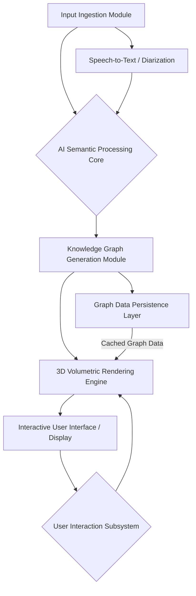

**Title of Invention:** A System and Method for Semantic-Topological Reconstruction and Volumetric Visualization of Discursive Knowledge Graphs from Temporal Linguistic Artifacts, Employing Advanced Generative AI and Spatio-Cognitive Rendering Paradigms

**Abstract:**
A profoundly innovative system and associated methodologies are unveiled for the advanced processing, conceptual decomposition, and immersive visualization of human discourse. This system precisely ingests temporal linguistic artifacts, encompassing real-time audio streams, recorded verbal communications, and transcribed textual documents. At its core, a sophisticated, self-attentive generative artificial intelligence model orchestrates a multi-dimensional analysis of these artifacts, meticulously discerning latent semantic constructs, identifying salient entities, including concepts, speakers, decisions, and action items, and establishing intricate relationships and dependencies among them. The AI autonomously synthesizes this information into a rigorously structured, hierarchical knowledge graph. This high-fidelity graph data then serves as the foundational blueprint for the dynamic generation of an interactive, three-dimensional, volumetric mind map. Within this spatially organized cognitive landscape, abstract concepts materialize as navigable nodes, and their inherent interconnections are represented as geometrically rendered links in a truly immersive `R^3` environment. This revolutionary paradigm transcends the inherent limitations of conventional linear, text-based summaries, offering an unparalleled intuitive and spatially augmented means for comprehension, exploration, and retention of complex conversational dynamics and intellectual outputs.

**Background of the Invention:**
The pervasive reliance on linear, sequential textual documentation for the summarization of complex discursive events, such as meetings, lectures, or collaborative ideation sessions, inherently imposes significant cognitive burdens and introduces substantial information entropy. Traditional meeting minutes, verbatim transcripts, and even highly condensed textual summaries fundamentally flatten the multidimensional, interconnected fabric of human communication into a unidimensional stream. This reductionist approach impedes rapid information retrieval, obscures emergent conceptual hierarchies, and fails to adequately represent the non-linear, often recursive, and intrinsically associative nature of intellectual discourse. Stakeholders are perpetually challenged by the arduous task of sifting through voluminous text to identify crucial decisions, trace the evolution of ideas, or locate specific action assignments, thereby diminishing post-meeting efficacy and knowledge retention. Furthermore, the absence of an explicit, navigable topological representation of the conversation's semantic space prevents the leveraging of innate human spatial memory and pattern recognition capabilities, which are demonstrably superior for complex data assimilation compared to purely linguistic processing. Existing rudimentary graph-based visualizations often suffer from limitations in dimensionality, for example, strictly 2D representations, lack robust semantic depth in node and edge attributes, and fail to provide truly interactive, dynamically adaptable volumetric exploration. Thus, a profound and critical exigency exists for a system capable of autonomously deconstructing discursive artifacts, architecting their intrinsic semantic topology, and presenting this reconstructed knowledge in an intuitively graspable, spatially organized, and cognitively optimized format.

**Brief Summary of the Invention:**
The present invention pioneers a revolutionary service paradigm for the automated transformation of diverse linguistic artifacts into an interactive, volumetric knowledge graph. At its inception, the system receives a meeting transcript, which may originate from a pre-recorded audio/video stream, a real-time transcription service, or directly from textual input. This input artifact is then directed to a sophisticated, multi-modal generative AI processing core. This core, instantiated as a highly specialized large language model LLM or a composite AI agent architecture, is imbued with a meticulously engineered prompt set. These prompts instruct the AI to perform a comprehensive discourse analysis, acting as an expert meeting summarizer, semantic extractor, and relationship identifier. The AI is specifically tasked with the disambiguation and extraction of salient entities, including, but not limited to, core concepts, distinct speakers, critical decisions, and actionable items, along with the precise identification of the semantic, temporal, and causal relationships interlinking these entities. The AI's output is rigidly constrained to a machine-readable, structured data format, typically a profoundly elaborated JSON object, which meticulously encodes a graph comprising richly attributed nodes and semantically typed edges. This meticulously constructed graph data payload is subsequently transmitted to a highly optimized 3D rendering and visualization engine. This engine, leveraging advanced graphics libraries such as Three.js, Babylon.js, or proprietary volumetric rendering frameworks, dynamically synthesizes and orchestrates the display of an interactive, explorable 3D mind map. Within this immersive environment, users are granted unparalleled agency to navigate the conceptual landscape, manipulate viewpoints, filter information streams, and precisely interact with individual nodes or relationship edges to access granular details, temporal context, and source attribution, thereby facilitating profound insights into the underlying discourse.

**Detailed Description of the Invention:**

The present invention meticulously details a comprehensive system and methodology for the generation and interactive visualization of a three-dimensional, semantically enriched knowledge graph derived from complex conversational data. The system comprises several intricately interconnected modules operating in a synergistic fashion to achieve unprecedented levels of information synthesis and cognitive presentation.

### 1. System Architecture Overview

The architectural framework of the invention is predicated on a modular, scalable, and highly distributed design, ensuring robust performance and extensibility across diverse deployment scenarios.



**Description of Architectural Components:**

*   **A. Input Ingestion Module:** Responsible for capturing and preprocessing diverse input modalities.
*   **B. AI Semantic Processing Core:** The intelligent heart, performing deep linguistic analysis and semantic extraction.
*   **C. Knowledge Graph Generation Module:** Transforms semantic extractions into a formalized graph structure.
*   **D. Graph Data Persistence Layer:** Ensures secure and efficient storage and retrieval of generated knowledge graphs.
*   **E. 3D Volumetric Rendering Engine:** Translates graph data into a navigable 3D visual space.
*   **F. Interactive User Interface / Display:** Presents the 3D visualization and allows user engagement.
*   **G. User Interaction Subsystem:** Interprets user inputs and translates them into rendering or data queries.
*   **A1. Speech-to-Text / Diarization:** Specialized sub-module for converting audio inputs into speaker-attributed transcripts.

### 2. Input Ingestion Module

This module is designed for omni-modal data acquisition, ensuring compatibility with a vast array of discursive artifacts.

*   **2.1. Real-time Audio/Video Stream Processing:**
    *   Integration with conferencing platforms, such as Zoom, Microsoft Teams, Google Meet, via API hooks or virtual audio drivers.
    *   Utilizes a high-fidelity **Acoustic Feature Extraction Subsystem**, such as MFCC, spectrogram analysis, feeding into a robust **Automatic Speech Recognition (ASR) Engine**.
    *   Employs advanced **Speaker Diarization Algorithms**, for instance, clustering based on speaker embeddings like x-vectors or d-vectors, or unsupervised Bayesian Hidden Markov Model approaches, to accurately attribute utterances to specific speakers, even in challenging multi-speaker environments.
    *   **Voice Activity Detection (VAD)** ensures only relevant speech segments are processed, optimizing resource utilization.
    *   Outputs a stream of `{speaker_id, timestamp_start, timestamp_end, utterance_text}` tuples.
*   **2.2. Pre-recorded Media File Processing:**
    *   Accepts standard audio (MP3, WAV, FLAC) and video (MP4, AVI, WebM) formats.
    *   Performs batch processing through the same ASR and Diarization pipelines.
*   **2.3. Textual Transcript Ingestion:**
    *   Directly accepts pre-existing textual transcripts, ensuring the format includes speaker identification tags and, ideally, timestamps for enhanced temporal context.
    *   Supports common formats, such as plain text, SRT, VTT, DOCX, PDF parsing.
*   **2.4. Metadata Enrichment:**
    *   Automatically extracts or allows manual input of meeting context metadata: topic, participants list, date, time, duration, associated project, and relevant documents. This metadata significantly informs the AI Semantic Processing Core.

### 3. AI Semantic Processing Core

The conceptual keystone of the invention, this module leverages state-of-the-art generative artificial intelligence to transform raw linguistic data into a semantically rich, structured representation.

*   **3.1. Advanced Generative AI Model (Conceptual Architecture: Contextualized Semantic Tensor-Flow Network - CSTFN):**
    *   Unlike conventional LLMs, the CSTFN is a highly specialized, multi-headed transformer architecture meticulously trained on vast corpora of meeting transcripts, academic discourse, and decision-making scenarios. Its core innovation lies in its ability to generate not just coherent text, but structured knowledge graphs directly.
    *   **Attention Mechanisms:** Employs advanced self-attention, for example, Perceiver IO, Longformer variants, to maintain long-range dependencies across extended meeting transcripts, overcoming context window limitations of traditional transformers.
    *   **Multi-task Learning:** Simultaneously trained on tasks such as Named Entity Recognition (NER), Relationship Extraction (RE), Event Extraction, Coreference Resolution, Sentiment Analysis, and Summarization to create a holistic semantic understanding.
*   **3.2. Dynamic Prompt Engineering Subsystem:**
    *   Generates highly specific, context-aware prompts for the CSTFN, adapting based on input metadata, user preferences, and iterative feedback.
    *   **Structured Prompt Generation:**
        ```json
        {
          "role": "Expert Meeting Deconstructor and Knowledge Graph Synthesizer",
          "task": "Perform a comprehensive, multi-layered semantic analysis of the provided discourse. Extract all primary and secondary concepts, identify explicit and implicit relationships, enumerate key decisions, and delineate all assigned action items. Attribute each extracted entity and relationship to its original speaker and timestamp context. Concurrently, identify the overall sentiment and topic progression. Structure the output as a hierarchical, richly-attributed knowledge graph.",
          "output_schema_directive": { /* Detailed JSON Schema as described in 3.4 */ },
          "constraints": [
            "Maintain strict referential integrity for entities.",
            "Prioritize actionable intelligence (decisions, actions).",
            "Disambiguate polysemous terms based on conversational context.",
            "Assign confidence scores to all extractions."
          ],
          "transcript_segment": "[Full or segment of input transcript including speaker tags and timestamps]",
          "prior_context_graph_fragments": "[Optional: Previous graph data for continuity in long meetings]"
        }
        ```
    *   **Few-shot Learning Integration:** Augments prompt with examples of desired graph structures derived from similar meeting types, enabling rapid adaptation to specific domain requirements without full model retraining.
*   **3.3. Knowledge Graph Extraction Subsystem:**
    *   **3.3.1. Entity Recognition and Disambiguation (ERD):**
        *   Identifies diverse entity types: `Concept`, `Speaker`, `Organization`, `Product`, `Project`, `Decision`, `ActionItem`, `Question`, `Issue`, `Metric`, `DateTime`.
        *   Leverages contextual embeddings and external knowledge bases for highly accurate entity disambiguation, resolving ambiguities in real-time.
    *   **3.3.2. Relationship Extraction (RE):**
        *   Identifies a rich taxonomy of relationship types: `IS_A`, `PART_OF`, `CAUSES`, `DISCUSSES`, `RELATES_TO`, `RESOLVES`, `LEADS_TO`, `REFERENCES`, `ASSIGNED_TO`, `DUE_BY`, `SUPPORTS`, `CONTRADICTS`, `AGREES_WITH`, `PROPOSES`.
        *   Employs advanced techniques like Graph Neural Networks (GNNs) over dependency parses and transformer-based relation classifiers.
    *   **3.3.3. Coreference Resolution:**
        *   Resolves anaphoric references (pronouns, noun phrases) to their originating entities, ensuring a cohesive and accurate graph structure.
    *   **3.3.4. Event Extraction:**
        *   Identifies specific events discussed or enacted within the meeting, linking them to participants, times, and outcomes.
    *   **3.3.5. Sentiment and Tone Analysis:**
        *   Applies granular sentiment analysis (positive, negative, neutral) to utterances and concepts, providing an emotional dimension to the graph nodes. Tone analysis, for instance, assertive, questioning, collaborative, further enriches speaker contributions.
    *   **3.3.6. Hierarchical Structuring and Topic Modeling:**
        *   Applies dynamic topic modeling, such as contextualized topic models, non-negative matrix factorization on contextual embeddings, to identify overarching themes and sub-themes.
        *   Automatically infers hierarchical relationships between concepts, grouping related ideas into emergent clusters, forming the basis for the multi-level mind map structure.
    *   **3.3.7. Temporal Relationship Inference:**
        *   Explicitly tracks the temporal progression of discussions, identifying sequences, concurrency, and dependencies of events and decisions.

### 4. Knowledge Graph Data Structure

The output from the AI Semantic Processing Core is a rigorously defined JSON schema for a directed, attributed multigraph.

```json
{
  "graph_id": "unique_meeting_session_id_XYZ123",
  "meeting_metadata": {
    "title": "Quarterly Strategy Review",
    "date": "2023-10-27T10:00:00Z",
    "duration_minutes": 90,
    "participants": [
      {"id": "spk_0", "name": "Alice Johnson", "role": "CEO"},
      {"id": "spk_1", "name": "Bob Williams", "role": "CTO"}
    ],
    "main_topics": ["Market Expansion", "Product Roadmap", "Resource Allocation"]
  },
  "nodes": [
    {
      "id": "concept_001",
      "label": "New Market Entry Strategy",
      "type": "Concept",
      "speaker_attribution": ["spk_0"],
      "timestamp_context": {"start": 300, "end": 450},
      "sentiment": "positive",
      "confidence": 0.95,
      "summary_snippet": "Discussion about expanding into the APAC market with aggressive growth targets.",
      "level": 0,
      "original_utterance_ids": ["utt_012", "utt_015"]
    },
    {
      "id": "decision_002",
      "label": "Approve APAC Market Entry",
      "type": "Decision",
      "speaker_attribution": ["spk_0", "spk_1"],
      "timestamp_context": {"start": 600, "end": 620},
      "sentiment": "neutral",
      "confidence": 0.98,
      "summary_snippet": "Consensus reached to proceed with market expansion as planned.",
      "status": "Finalized",
      "original_utterance_ids": ["utt_020"]
    },
    {
      "id": "action_003",
      "label": "Prepare APAC Market Research Report",
      "type": "ActionItem",
      "assigned_to": "spk_1",
      "due_date": "2023-11-15",
      "timestamp_context": {"start": 650, "end": 680},
      "sentiment": "neutral",
      "confidence": 0.92,
      "status": "Assigned",
      "original_utterance_ids": ["utt_022"]
    }
    // ... further nodes
  ],
  "edges": [
    {
      "id": "edge_001",
      "source": "concept_001",
      "target": "decision_002",
      "type": "LEADS_TO",
      "speaker_attribution": [],
      "timestamp_context": {"start": 600, "end": 620},
      "confidence": 0.90,
      "summary_snippet": "The strategy discussion culminated in this decision."
    },
    {
      "id": "edge_002",
      "source": "decision_002",
      "target": "action_003",
      "type": "GENERATES",
      "speaker_attribution": [],
      "timestamp_context": {"start": 650, "end": 680},
      "confidence": 0.88
    },
    {
        "id": "edge_003",
        "source": "spk_0",
        "target": "concept_001",
        "type": "PROPOSES",
        "timestamp_context": {"start": 300, "end": 350},
        "confidence": 0.85
    }
    // ... further edges
  ]
}
```

### 5. 3D Volumetric Rendering Engine

This module is responsible for the visually stunning and intuitively navigable three-dimensional representation of the knowledge graph.

*   **5.1. Scene Management and Primitives:**
    *   Utilizes WebGL-accelerated libraries, such as Three.js, Babylon.js, or a custom rendering pipeline.
    *   **Nodes:** Represented by dynamic 3D geometric primitives, for example, spheres, cuboids, custom meshes.
        *   **Visual Encoding:** Node properties (type, importance, sentiment, speaker, status) are visually encoded:
            *   **Color:** Categorical (type), gradient (sentiment, confidence).
            *   **Size:** Proportional to importance, for instance, discussion duration, number of outgoing edges.
            *   **Shape:** Distinct geometries for Concepts, Decisions, Action Items, Speakers.
            *   **Text Labels:** Dynamically rendered 3D text, for example, SDF fonts, for legibility, with Level-of-Detail (LOD) scaling.
            *   **Icons/Glyphs:** Overlayed icons to quickly convey specific attributes, for example, a checkmark for completed action.
    *   **Edges:** Represented by 3D lines, splines, or tubes with dynamic properties.
        *   **Visual Encoding:**
            *   **Color:** Relationship type, directionality, for instance, a gradient or arrowheads.
            *   **Thickness:** Strength or confidence of relationship.
            *   **Animation:** Subtle pulsating or flowing animations to indicate active discussion paths or recent updates.
    *   **Environment:** Configurable 3D background, ambient lighting, directional lighting, and shadows for depth perception.
*   **5.2. Advanced 3D Layout Algorithms:**
    *   Beyond basic force-directed algorithms, the system employs a hybrid, multi-stage layout approach to optimize for cognitive load and information hierarchy.
    *   **5.2.1. Hierarchical Force-Directed Layout (H-FDL):**
        *   Adapts algorithms such as Fruchterman-Reingold or Kamada-Kawai for 3D, incorporating gravitational forces that pull related nodes together and repulsive forces that push unrelated nodes apart, minimizing overlap.
        *   **Hierarchical Constraints:** Nodes belonging to the same identified sub-topic or speaker cluster are constrained to a proximity region, effectively creating "gravitational wells" for conceptual groups. This is achieved by introducing virtual parent nodes or modifying force calculation to include hierarchical affiliations.
        *   **Temporal Axis Integration:** An optional layout constraint can align nodes along a virtual Z-axis (or X-axis) based on their `timestamp_context`, providing a temporal progression view alongside semantic clustering.
    *   **5.2.2. Collision Detection and Resolution:**
        *   High-performance spatial partitioning structures, such as octrees, k-d trees, are used to detect potential node-node and node-label overlaps.
        *   Sophisticated repulsion forces or geometric adjustments are applied iteratively to prevent visual clutter, ensuring each node and its label are distinct and readable.
    *   **5.2.3. Dynamic Re-layout and Stability:**
        *   The layout algorithm dynamically adjusts in response to user interactions, for example, filtering or expanding nodes, smoothly transitioning between states to maintain cognitive continuity.
        *   A "thermal equilibrium" state is sought to prevent excessive oscillation, ensuring a stable and predictable layout.
*   **5.3. Interaction Subsystem:**
    *   **5.3.1. Intuitive 3D Navigation:**
        *   **Camera Controls:** Pan (translation), Zoom (dolly/field of view adjustment), Orbit (rotation around a focal point) via mouse, touch gestures, or gamepad.
        *   **Fly-through Mode:** Automated or user-directed navigation paths, potentially following thematic trajectories.
    *   **5.3.2. Node/Edge Interaction:**
        *   **Selection:** Clicking or hovering over a node/edge highlights it and triggers a contextual overlay or a side panel display with granular details, for example, full summary, source utterances, speaker details, historical changes.
        *   **Expansion/Collapse:** Hierarchical nodes can be expanded to reveal sub-concepts or collapsed to reduce visual complexity.
        *   **Filtering & Search:** Dynamic filtering based on node type, for example, "Show only Action Items", speaker, sentiment, keywords, or temporal range. Real-time search highlights matching nodes.
        *   **Path Highlighting:** Selecting a node can highlight all its direct and indirect relationships, tracing conversational threads.
    *   **5.3.3. Annotation and Collaboration:**
        *   Users can add personal notes, tags, or create new ad-hoc relationships within the 3D space, which can be shared with collaborators.
        *   Real-time multi-user synchronization of the 3D view and annotations.
*   **5.4. Performance Optimization:**
    *   **Level of Detail (LOD):** Simplifies mesh geometry and reduces label resolution for distant objects, improving rendering performance.
    *   **Frustum Culling and Occlusion Culling:** Only renders objects visible within the camera's view frustum or not hidden by other objects.
    *   **Instanced Rendering:** Efficiently renders multiple identical node geometries with varying transforms.

### 6. Graph Data Persistence Layer

A robust persistence layer ensures the longevity, versioning, and collaborative access to the generated knowledge graphs.

*   Utilizes a graph database, such as Neo4j, ArangoDB, Amazon Neptune, or a document database with graph capabilities to store the `nodes` and `edges` and their rich attributes.
*   Implements version control for each graph, allowing users to revisit past states of the meeting summary or track evolution of decisions.
*   Supports access control and permission management for collaborative environments.

### 7. Security and Privacy Considerations

The system incorporates stringent measures to protect sensitive conversational data.

*   **Data Encryption:** All data, both in transit and at rest, is encrypted using industry-standard protocols, such as TLS 1.3, AES-256.
*   **Access Control:** Role-based access control (RBAC) ensures only authorized individuals can access specific meeting transcripts and their derived knowledge graphs.
*   **Data Anonymization:** Options for anonymizing speaker identities or specific entities can be configured to comply with privacy regulations.
*   **Compliance:** Designed with adherence to regulations such as GDPR, HIPAA, and CCPA in mind.

**Claims:**

The following enumerated claims define the intellectual scope and novel contributions of the present invention, a testament to its singular advancement in the field of discourse analysis and information visualization.

1.  A method for the comprehensive semantic-topological reconstruction and volumetric visualization of discursive knowledge graphs, comprising the steps of:
    a.  Receiving an input linguistic artifact comprising a temporal sequence of utterances, each utterance associated with at least one speaker identifier and a temporal marker.
    b.  Transmitting said input linguistic artifact to a specialized generative artificial intelligence processing core configured for multi-modal discourse analysis.
    c.  Directing said generative AI processing core, through dynamically constructed semantic prompts, to meticulously perform:
        i.   Named Entity Recognition and Disambiguation to extract a plurality of structured entities, including concepts, speakers, decisions, and action items, each attributed with contextual metadata.
        ii.  Advanced Relationship Extraction to identify and categorize a diverse taxonomy of semantic, temporal, and causal interconnections between said extracted entities.
        iii. Coreference Resolution to establish cohesive entity chains across the entire linguistic artifact.
        iv.  Hierarchical Structuring to infer implicit conceptual hierarchies and topic clusters within the discourse.
    d.  Receiving from said AI processing core a rigorously structured data object, representing said extracted entities and their interconnections as an attributed knowledge graph, conforming to a predefined schema.
    e.  Utilizing said attributed knowledge graph data as the foundational input for a three-dimensional volumetric rendering engine.
    f.  Programmatically generating within said rendering engine a dynamic, interactive three-dimensional visual representation of the discourse, wherein:
        i.   Said entities are materialized as spatially navigable 3D nodes, their visual properties, for example, color, size, shape, textual labels, encoding their type, importance, sentiment, and speaker attribution.
        ii.  Said interconnections are materialized as 3D edges, their visual properties, for example, color, thickness, directionality, encoding their relationship type and strength.
        iii. Said 3D nodes are positioned and oriented within a 3D coordinate system by a hybrid, multi-stage layout algorithm optimized for cognitive clarity and topological fidelity, incorporating hierarchical and temporal constraints.
    g.  Displaying said interactive three-dimensional volumetric representation to a user via a graphical user interface, enabling real-time navigation, exploration, and granular inquiry.

2.  The method of claim 1, wherein the input linguistic artifact further comprises an audio or video stream, and wherein step (a) additionally comprises:
    a.i. Employing an Automatic Speech Recognition (ASR) engine to convert said audio or video stream into a textual transcript.
    a.ii. Applying a Speaker Diarization algorithm to attribute specific utterances within said transcript to distinct speakers.

3.  The method of claim 1, wherein the generative AI processing core is a Contextualized Semantic Tensor-Flow Network (CSTFN) specialized for multi-task learning in discourse analysis, utilizing advanced self-attention mechanisms to process long-range dependencies.

4.  The method of claim 1, wherein the prompt generation for the generative AI core (step c) incorporates dynamic contextual metadata, user-defined preferences, and few-shot learning examples to optimize extraction accuracy and fidelity.

5.  The method of claim 1, wherein the attributed knowledge graph data object (step d) includes confidence scores for each extracted entity and relationship, temporal context metadata (start/end timestamps), and explicit links to original utterance segments.

6.  The method of claim 1, wherein the hybrid, multi-stage layout algorithm (step f.iii) incorporates a 3D force-directed layout algorithm combined with hierarchical clustering heuristics and an optional temporal axis constraint to arrange nodes in `R^3` space.

7.  The method of claim 6, wherein the layout algorithm further employs high-performance spatial partitioning structures and iterative repulsion forces for collision detection and resolution among 3D nodes and their labels.

8.  The method of claim 1, wherein the interactive display (step g) provides a user interaction subsystem enabling:
    a.  Real-time camera control including pan, zoom, and orbit functionality.
    b.  Selection and detailed inspection of individual 3D nodes and edges to reveal underlying metadata and source utterances.
    c.  Dynamic filtering and searching of the knowledge graph based on entity type, speaker, sentiment, keyword, or temporal range.
    d.  Expansion and collapse functionality for hierarchical nodes to manage visual complexity.

9.  The method of claim 1, further comprising a graph data persistence layer for securely storing and versioning said attributed knowledge graphs, facilitating collaborative access and historical review.

10. A system configured to execute the method of claim 1, comprising:
    a.  An Input Ingestion Module configured to receive and preprocess diverse linguistic artifacts.
    b.  An AI Semantic Processing Core operatively coupled to the Input Ingestion Module, configured to process said linguistic artifacts and generate an attributed knowledge graph.
    c.  A Knowledge Graph Generation Module operatively coupled to the AI Semantic Processing Core, configured to formalize the graph structure according to a predefined schema.
    d.  A 3D Volumetric Rendering Engine operatively coupled to the Knowledge Graph Generation Module, configured to transform said knowledge graph into an interactive three-dimensional visual representation.
    e.  An Interactive User Interface and Display operatively coupled to the 3D Volumetric Rendering Engine, configured to present said visualization and receive user input.
    f.  A User Interaction Subsystem operatively coupled to the Interactive User Interface, configured to interpret user inputs and relay commands to the 3D Volumetric Rendering Engine.

11. The system of claim 10, wherein the AI Semantic Processing Core incorporates a dynamic prompt engineering subsystem that leverages meta-data and few-shot learning to optimize graph extraction.

12. The system of claim 10, wherein the 3D Volumetric Rendering Engine utilizes visual encoding strategies where node color signifies entity type, node size signifies importance, and edge thickness signifies relationship strength.

**Mathematical Justification:**

The exposition of the present invention necessitates a rigorous mathematical framework to delineate its foundational principles, quantify its advancements over conventional methodologies, and establish the theoretical underpinnings of its unparalleled efficacy. We proceed by formally defining the discursive artifact, the traditional linear summary, and the novel knowledge graph representation, followed by a comprehensive analysis of their respective informational and topological properties.

### I. Formal Definition of a Discursive Artifact `C` and its Semantic Tensor `S_C`

Let a discursive artifact `C` represent a meeting or conversation. `C` is formally defined as a finite, ordered sequence of utterances, `C = (u_1, u_2, ..., u_n)`, where `n` is the total number of utterances. Each individual utterance `u_i` is a complex tuple encapsulating its rich contextual and linguistic attributes:

```
u_i = (sigma_i, tau_i, lambda_i, epsilon_i, mu_i)
```

Where:
*   `sigma_i` in `Sigma`: The speaker identifier for utterance `i`, drawn from the finite set of participants `Sigma = {speaker_1, ..., speaker_m}`.
*   `tau_i = [t_i_start, t_i_end]`: The precise temporal interval of utterance `i`, where `t_i_start` and `t_i_end` are timestamps, `t_i_start < t_i_end`, and `t_i_end <= t_(i+1)_start` for sequential non-overlapping utterances, or `t_i_start <= t_(i+1)_start` allowing for potential overlaps in multi-speaker scenarios.
*   `lambda_i` in `L`: The verbatim linguistic content (text) of utterance `i`. This is the raw lexical string.
*   `epsilon_i` in `E_u`: A high-dimensional contextual embedding vector representing the semantic and syntactic nuances of `lambda_i`. This vector, often derived from pre-trained transformer models (e.g., BERT, GPT, or our specialized CSTFN), captures the latent meaning of the utterance in a continuous vector space `R^D_e`.
*   `mu_i` in `M_u`: Ancillary metadata associated with `u_i`, such as prosodic features, acoustic properties, sentiment scores (`s_i` in `[-1, 1]`), or interaction intent (`intent_i` in `{question, assertion, agreement, disagreement}`).

The entire discursive artifact `C` can then be conceptually mapped into a **Contextualized Semantic Tensor** `S_C`. This tensor is a higher-order data structure that captures not only the individual utterance semantics but also their interdependencies across temporal, speaker, and topical dimensions.

Let `S_C` be a tensor of rank `k`, where its dimensions could conceptually represent:
`S_C` in `R^(n x D_e x D_s x D_t x D_m)`
*   `n`: Number of utterances.
*   `D_e`: Dimensionality of the utterance embedding `epsilon_i`.
*   `D_s`: Dimensionality representing speaker identity and characteristics, for example, one-hot encoding or speaker embeddings.
*   `D_t`: Dimensionality representing temporal context, for example, relative time, absolute time, temporal window.
*   `D_m`: Dimensionality representing other metadata `mu_i`.

The construction of `S_C` involves sophisticated operations such as:
1.  **Semantic Embedding:** Each `lambda_i` is transformed into `epsilon_i` via a deep neural network, capturing its meaning.
2.  **Temporal Encoding:** `tau_i` is encoded as positional embeddings or temporal convolution filters across the sequence of `epsilon_i`.
3.  **Speaker Encoding:** `sigma_i` is embedded to create a speaker-specific contextualization.
4.  **Cross-Attention Mechanisms:** Within our CSTFN, multi-headed attention layers compute weighted sums of `epsilon_j` for each `epsilon_i`, considering `sigma_j`, `tau_j`, and `mu_j` to establish rich inter-utterance contextual dependencies. This effectively compresses the `C` into `S_C`, which is a dense, high-dimensional representation of the *entire* semantic space of the conversation.

### II. Limitations of Traditional Linear Summaries `T`

A traditional linear summary `T` is derived from `C` by a function `f: C -> T`. `T` is a textual string `T = (w_1, w_2, ..., w_k)`, where `w_j` are words and `k` is the length of the summary. This process is inherently a severe dimensionality reduction and a lossy projection:

```
f: R^(n x D_e x D_s x D_t x D_m) -> R^k
```
(where `k` is typically far smaller than `n * D_e`).

The critical information loss manifests in several ways:
1.  **Topological Fidelity:** The inherent, non-linear conceptual relationships (hierarchy, causality, contradiction) present in `C` are flattened into a sequential structure in `T`. This obliterates the topological graph-theoretic properties (connectivity, centrality, shortest paths) that define the interdependencies of ideas.
2.  **Semantic Entropy:** Key semantic distinctions and nuanced relationships are often conflated or omitted due to the constraints of linear narrative and brevity. The entropy of `T` with respect to the core concepts of `C` is demonstrably higher than the entropy of a graph representation.
3.  **Cognitive Load:** Parsing `T` requires sequential scanning and mental reconstruction of relationships, imposing a significant cognitive load on the user. Spatial memory, a powerful human cognitive asset for information retrieval, remains untapped.

### III. The Knowledge Graph Representation `Gamma` and the Transformation Function `G_AI`

The present invention defines a superior representation of `C` as an attributed knowledge graph `Gamma = (N, E)`. The transformation from `C` to `Gamma` is mediated by a sophisticated generative AI function `G_AI`:

```
G_AI: S_C -> Gamma(N, E)
```

Where:
*   `N` is a finite set of richly attributed nodes `N = {n_1, n_2, ..., n_p}`. Each node `n_k` is a formalized representation of an extracted entity (concept, decision, action item, speaker).
    ```
    n_k = (concept_id, label, type, alpha_k)
    ```
    Where `alpha_k` is a vector of attributes for node `k`, including:
    *   `v_k` in `R^D_n`: A node embedding capturing its deep semantic meaning and context.
    *   `sigma_k` in `P[Sigma]`: The set of speakers associated with `n_k`.
    *   `tau_k = [t_k_start, t_k_end]`: The temporal span of `n_k`'s discussion.
    *   `s_k` in `[-1, 1]`: The aggregate sentiment associated with `n_k`.
    *   `imp_k` in `[0, 1]`: An importance score, derived from metrics like discussion duration, centrality, or number of references.
    *   `orig_utt_ids_k` in `P[{1, ..., n}]`: Pointers to the original utterances in `C` that contributed to `n_k`.
*   `E` is a finite set of richly attributed, directed edges `E = {e_1, e_2, ..., e_q}`. Each edge `e_j` represents a specific typed relationship between two nodes `n_a` and `n_b`.
    ```
    e_j = (source_id, target_id, relation_type, beta_j)
    ```
    Where `beta_j` is a vector of attributes for edge `j`, including:
    *   `w_j` in `[0, 1]`: A confidence score or strength of the relationship.
    *   `tau_j = [t_j_start, t_j_end]`: The temporal context of the relationship's establishment.
    *   `v_j` in `R^D_e_rel`: A relation embedding vector.

The transformation `G_AI` involves complex sub-functions operating on `S_C`:
1.  **Clustering & Entity Extraction:** `E_extract: S_C -> N`. This involves semantic clustering of utterance embeddings `epsilon_i` and their associated context to identify distinct entities and assign them types.
2.  **Relational Inference:** `R_infer: S_C x N x N -> E`. This function, often implemented via graph neural networks or attention mechanisms within CSTFN, identifies direct and indirect relationships between extracted `n_k` based on their proximity and interaction within `S_C`.
3.  **Hierarchical Induction:** `H_induce: N x E -> (N', E')`. This further refines `Gamma` by identifying sub-graphs or conceptual groupings that form a natural hierarchy, augmenting nodes with `level` attributes and introducing parent-child relationships.

The `G_AI` process, leveraging the `S_C`, implicitly performs operations that preserve and explicitly encode more structural information than `f`. The dimensionality of `Gamma(N, E)` (considering `|N|`, `|E|`, and the attribute vectors `alpha_k`, `beta_j`) is orders of magnitude greater than `k` in `T`, thereby capturing a significantly richer representation of `C`.

### IV. The 3D Volumetric Rendering Function `R` and Spatial Embedding

The knowledge graph `Gamma` is then mapped into a three-dimensional Euclidean space `R^3` by a rendering function `R`:

```
R: Gamma -> {(P_k, O_k)}_{k=1}^p U {(P_j, C_j)}_{j=1}^q
```

Where:
*   `P_k` in `R^3`: The 3D spatial coordinates `(x_k, y_k, z_k)` for node `n_k`.
*   `O_k`: The visual object attributes (geometry, material, texture, label) for `n_k`, derived from `alpha_k`.
*   `P_j` in `R^3`: The 3D spatial coordinates defining the path (e.g., control points for a Bezier spline) for edge `e_j`.
*   `C_j`: The visual object attributes (color, thickness, animation) for `e_j`, derived from `beta_j`.

The core challenge for `R` is to find an optimal embedding `P = {P_k}` such that the visual representation in `R^3` faithfully reflects the topological and semantic structure of `Gamma` while optimizing for human perception and interaction. This is achieved by minimizing a sophisticated energy function `E_layout(P, Gamma)`:

```
E_layout(P, Gamma) = sum_{k<l} (||P_k - P_l|| - delta(n_k, n_l))^2 + lambda_rep sum_{k!=l} Phi(||P_k - P_l||) + lambda_hier sum_{k} Psi(P_k, Hier(n_k)) + lambda_temp sum_{k} Xi(P_k, Temp(n_k))
```

Where:
*   `sum_{k<l} (||P_k - P_l|| - delta(n_k, n_l))^2`: This is the standard spring-electrical model, for example, Kamada-Kawai or Fruchterman-Reingold objective.
    *   `||P_k - P_l||`: Euclidean distance between nodes `n_k` and `n_l` in `R^3`.
    *   `delta(n_k, n_l)`: Graph-theoretic distance between `n_k` and `n_l` in `Gamma`, for example, shortest path length, inverse of semantic similarity derived from `v_k`, `v_l`. This term ensures that nodes closely related in `Gamma` are visually close in `R^3`.
*   `lambda_rep sum_{k!=l} Phi(||P_k - P_l||)`: A strong repulsion term to prevent node overlap.
    *   `Phi(d)` is typically `C_rep / d^2` (inverse square law), or a more complex function that considers node radii to ensure collision avoidance. `lambda_rep` is a repulsion strength constant.
*   `lambda_hier sum_{k} Psi(P_k, Hier(n_k))`: A hierarchical constraint term.
    *   `Hier(n_k)` refers to the inferred hierarchical level and cluster of `n_k`.
    *   `Psi` is a potential function that attracts `n_k` towards a designated spatial region or plane corresponding to its hierarchical level or cluster, e.g., `Psi = ||P_k - Center(Hier(n_k))||^2`. `lambda_hier` is a weighting factor.
*   `lambda_temp sum_{k} Xi(P_k, Temp(n_k))`: A temporal ordering constraint.
    *   `Temp(n_k)` refers to the temporal context `tau_k`.
    *   `Xi` is a potential function that encourages nodes to align along a designated temporal axis, for example, Z-axis, such that `P_k.z` is monotonically increasing with `t_k_start`. `lambda_temp` is a weighting factor.

The minimization of `E_layout` is an iterative process, typically solved using gradient descent or simulated annealing methods, allowing the system to find a stable, aesthetically pleasing, and cognitively optimal 3D layout that faithfully represents `Gamma`.

### V. Proof of Superiority: Informational Entropy and Cognitive Efficiency

The superiority of the knowledge graph representation `Gamma` and its `R^3` visualization over the linear textual summary `T` is provable through quantitative analysis of informational entropy and qualitative assessment of cognitive processing efficiency.

1.  **Informational Entropy and Topological Preservation:**
    *   Let `H(X)` denote the Shannon entropy of a random variable `X`.
    *   `H(C)` represents the information content of the original discursive artifact.
    *   The linear summary `T` involves a highly lossy compression: `H(T | C) >> 0` (high conditional entropy, meaning much information in `C` is not in `T`). The mapping `f` sacrifices structural information for linear brevity.
    *   The knowledge graph `Gamma`, conversely, is constructed to preserve the inherent semantic topology. The rich attributes of nodes and edges, coupled with their explicit interconnections, significantly reduce `H(Gamma | C)`.
    *   Consider a graph-theoretic metric, such as betweenness centrality or clustering coefficient, which quantifies the structural importance of concepts within `C`. A linear summary `T` cannot inherently represent these structural metrics without explicit meta-commentary, which itself would be a form of graph-like structuring. `Gamma`, by its very definition, encodes these properties directly.
    *   Thus, the information content of `Gamma` is demonstrably higher and more structurally isomorphic to `C` than `T`.

2.  **Cognitive Efficiency and Spatial Memory Leverage:**
    *   Human cognition is profoundly adept at processing spatial information. The brain's hippocampus plays a crucial role in spatial navigation and memory.
    *   By mapping `Gamma` into an interactive `R^3` space via `R`, the system directly leverages these innate spatial cognitive mechanisms. Users can:
        *   **Navigate intuitively:** "Walk through" the conversation, similar to navigating a physical space.
        *   **Chunk information spatially:** Related concepts are grouped visually, reducing cognitive load for pattern recognition.
        *   **Enhance recall:** Spatial cues act as powerful memory anchors, improving long-term retention of meeting details.
        *   **Identify anomalies:** Outlier nodes or unexpected connections are perceptually salient in 3D.
    *   The `E_layout` function, by optimizing for perceptual clarity and minimizing clutter, directly contributes to reducing the cognitive effort required to extract insights. `R` transforms the abstract topological data of `Gamma` into a concrete, navigable mental model, thereby minimizing the mental computation required to synthesize meaning from `T`.

The present invention does not merely summarize; it meticulously reconstructs the semantic and topological essence of human discourse and presents it in a dimensionally richer, cognitively optimized, and perceptually intuitive volumetric representation. The mathematical framework elucidates how this advanced methodology fundamentally transcends the limitations of conventional approaches, achieving an unprecedented level of informational fidelity and human-computer symbiosis in knowledge acquisition. `Q.E.D.`