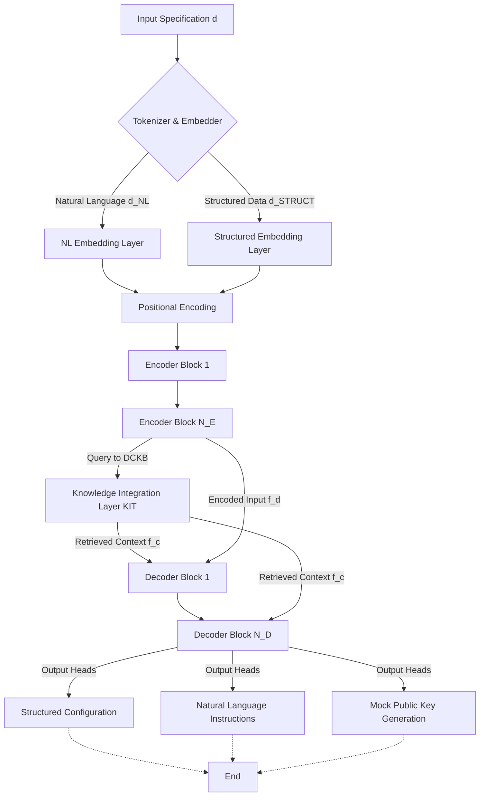
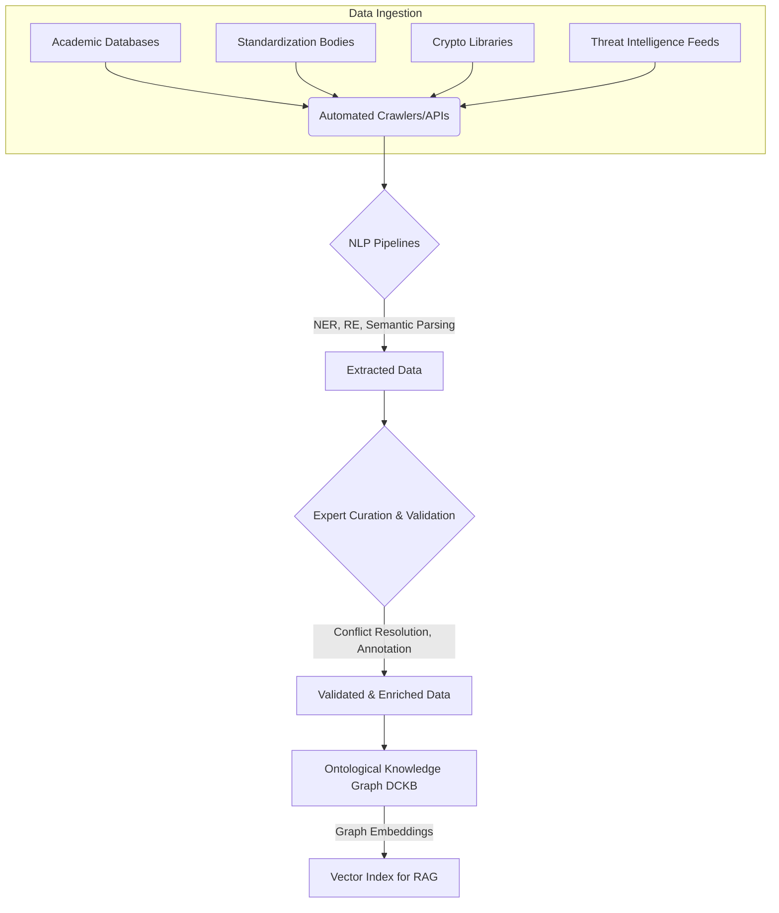

**Title of Invention:** AI Cryptographic Inference Module AIM Architecture, Training, and Data Curation for Quantum-Resilient Cryptography Generation

The present invention, as delineated in the primary document "System and Method for AI-Driven Heuristic Generation and Configuration of Quantum-Resilient Cryptographic Primitives and Protocols," relies fundamentally on the sophisticated capabilities of the Artificial Intelligence Cryptographic Inference Module AIM. This supplementary document provides an expansive and detailed exposition of the specific AI model architectures, advanced training methodologies, and precise data curation techniques that underpin the AIM's functionality, ensuring its capacity for expert-level cryptographic reasoning and recommendation. The AIM, serving as the "meta-cryptographer," is engineered to approximate the intractable `argmax` operation over the vast space of PQC configurations, as described in the "Mathematical Justification: The Theory of Quantum-Resilient Cryptographic Utility Optimization QRCUO."

**Claim 1:** The AIM architecture represents a novel integration of multi-modal transformer networks with a dynamic knowledge graph, enabling a quantifiable reduction in cryptographic configuration error rates and an increase in solution optimality, approaching human expert performance across diverse operational constraints.

### 1. AI Model Architectures for the AI Cryptographic Inference Module AIM

The AIM's core intelligence is primarily instantiated through a highly specialized, multi-modal, and multi-headed transformer-based architecture. This architecture is meticulously designed to process diverse input modalities, leverage a dynamically evolving knowledge base, and generate structured, actionable cryptographic configurations.

#### 1.1. Foundational Generative Pre-trained Transformer G_AI Architecture

The AIM utilizes a custom-built Generative Pre-trained Transformer G_AI as its foundational architecture, conceptually a sophisticated large language model LLM tailored for cryptographic reasoning. This choice is predicated on the transformer's proven efficacy in handling complex sequence-to-sequence tasks, its robust attention mechanisms, and its ability to capture intricate long-range dependencies within vast textual and structured data.

*   **Encoder-Decoder Paradigm:** While the overall model is generative, it effectively operates as an encoder-decoder system.
    *   **Multi-modal Encoder:** This component ingests the structured input specification `d` (e.g., JSON-formatted data modality, environmental parameters, security desiderata) and the contextually rich natural language prompt constructed by the Backend Orchestration Service BOS Module. It employs distinct embedding layers and tokenization strategies for structured data fields versus natural language components, which are then fused and processed by stacked transformer encoder blocks. This fusion ensures that both explicit programmatic constraints and nuanced linguistic cues are simultaneously considered. Graph neural network GNN layers are integrated within or alongside the encoder to process the relational structures queried from the Dynamic Cryptographic Knowledge Base DCKB.
    *   Let the input specification be `d = {d_NL, d_STRUCT}`, where `d_NL` is natural language and `d_STRUCT` is structured data.
    *   Tokenization for natural language: `T_NL(d_NL) = {t_{NL,1}, ..., t_{NL,L_NL}}`.
    *   Embedding for natural language tokens: `E_NL(t) = W_e t + b_e`, where `W_e` is embedding matrix.
    *   Structured data embedding: `E_STRUCT(d_STRUCT) = MLP(d_STRUCT)`, where `MLP` is a Multi-Layer Perceptron.
        *   `h_0 = d_STRUCT`
        *   `h_k = ReLU(W_k h_{k-1} + b_k)` for `k=1,...,N_MLP`
        *   `E_STRUCT(d_STRUCT) = h_{N_MLP}`
    *   Combined input embedding sequence: `X_0 = [E_NL(T_NL(d_NL)); E_STRUCT(d_STRUCT)]`
    *   The `i`-th token embedding is `x_i`. Positional encoding `P_i` is added: `x_i' = x_i + P_i`.
    *   For a self-attention mechanism, given input `X = [x_1', ..., x_L']`, Query, Key, Value matrices are computed:
        *   `Q = X W_Q`
        *   `K = X W_K`
        *   `V = X W_V`
        *   Attention scores: `A = softmax((Q K^T) / sqrt(D_k))`
        *   Output of self-attention: `Attention(Q, K, V) = A V`
    *   Multi-head attention: `Head_h = Attention(Q W_{Q,h}, K W_{K,h}, V W_{V,h})`
        *   `MultiHead(Q, K, V) = Concat(Head_1, ..., Head_H) W_O`
    *   Encoder Block `Enc_j`:
        *   `X'_{j-1} = LayerNorm(X_{j-1} + MultiHead(X_{j-1}, X_{j-1}, X_{j-1}))`
        *   `X_j = LayerNorm(X'_{j-1} + FeedForward(X'_{j-1}))`
        *   `FeedForward(X') = ReLU(X' W_1 + b_1) W_2 + b_2`
    *   The final encoder output is `f_d = Enc_{N_E}(X_0)`.


*Figure 1: High-Level AI Cryptographic Inference Module (AIM) Architecture*

    *   **Multi-headed Decoder:** This component is responsible for generating the diverse outputs required. It consists of multiple transformer decoder blocks, augmented with specific output heads for:
        *   **Structured Configuration Head:** Generates the core PQC scheme recommendations and parameters in a strictly enforced JSON schema format. This head is trained with specific constraints to ensure syntactical and semantic correctness of cryptographic parameters.
        *   **Natural Language Instruction Head:** Produces the verbose, detailed private key handling instructions and the comprehensive rationale. This head leverages the expressive power of the transformer to articulate complex security protocols in clear, unambiguous language.
        *   **Mock Public Key Generation Head:** While primarily a deterministic or pseudo-random module post-inference, the architecture includes a specialized component that synthesizes a syntactically valid public key exemplar string based on the parameters generated by the structured configuration head.
    *   Decoder Block `Dec_j`:
        *   `Y'_{j-1} = LayerNorm(Y_{j-1} + MaskedMultiHead(Y_{j-1}, Y_{j-1}, Y_{j-1}))`
        *   `Y''_{j-1} = LayerNorm(Y'_{j-1} + MultiHead(Y'_{j-1}, f_d, f_d))` (Cross-attention to encoder output)
        *   `Y'''_{j-1} = LayerNorm(Y''_{j-1} + MultiHead(Y''_{j-1}, f_c, f_c))` (Cross-attention to retrieved context `f_c`)
        *   `Y_j = LayerNorm(Y'''_{j-1} + FeedForward(Y'''_{j-1}))`
    *   Output Logits: `L_k = Y_{N_D} W_{out,k} + b_{out,k}` for head `k`.
    *   Probability distribution: `P_k(output) = softmax(L_k)`.

#### 1.2. Knowledge Integration Layer KIT

A critical architectural enhancement is the Knowledge Integration Layer KIT, which facilitates efficient and robust interaction with the Dynamic Cryptographic Knowledge Base DCKB. This layer implements the Knowledge Graph Traversal & Retrieval KGT-R phase described in the operational flow.

*   **Graph Embedding Sub-module:** The DCKB's ontological structure (as detailed in the seed file) is continuously transformed into a high-dimensional vector space using graph embedding techniques (e.g., GraphSAGE, TransE, ComplEx). These embeddings capture the semantic relationships and properties of cryptographic schemes, attack vectors, performance benchmarks, and compliance regulations.
    *   Let `G = (V, E, R)` be the knowledge graph, where `V` is entities, `E` is edges, `R` is relation types.
    *   Graph embedding function: `f_g: V -> R^D_g`.
    *   For TransE, `f_g(h) + f_g(r) ≈ f_g(t)` for a triple `(h, r, t)`.
    *   Loss function for TransE: `L_TransE = sum_{((h,r,t) in S) U ((h',r',t') in S')} [gamma + ||f_g(h)+f_g(r)-f_g(t)||_2 - ||f_g(h')+f_g(r')-f_g(t')||_2]_+` where `S` is positive triples, `S'` is negative triples, `gamma` is margin.
    *   For GraphSAGE: `h_v^(k) = sigma(W_k * CONCAT(h_v^(k-1), AGG({h_u^(k-1) for u in N(v)})))`
        *   `AGG` can be mean, sum, or max-pooling.
    *   The embedding of a specific cryptographic entity `e` is `emb(e)`.
    *   The embedding of a relation `r` is `emb(r)`.

*   **Retrieval-Augmented Generation RAG Mechanism:** During inference, the KIT dynamically performs real-time retrieval of highly relevant facts and relationships from the DCKB, based on the input specification `d` and the internal state of the encoder. These retrieved "knowledge snippets" (represented as their embeddings or linearized text) are then fed into the transformer's attention mechanism (e.g., via cross-attention layers) to augment the generative process. This significantly grounds the AI's responses in factual, up-to-date cryptographic knowledge, minimizing hallucinations and ensuring accuracy. The retrieved context directly informs the `S(c, d)`, `P(c, d)`, and `Comp(c, d)` components of the utility function.
    *   Query embedding from encoder output: `q_d = MLP_q(f_d)`.
    *   Retrieve top-K relevant knowledge graph snippets `k_1, ..., k_K` from DCKB embeddings `f_g(V)` based on similarity:
        *   `sim(q_d, emb(k_i)) = (q_d . emb(k_i)) / (||q_d|| * ||emb(k_i)||)` (cosine similarity).
        *   Retrieve `K` snippets where `sim(q_d, emb(k_i))` is maximized.
    *   Concatenated retrieved context embedding: `f_c = Concat(emb(k_1), ..., emb(k_K))`.
    *   This `f_c` is used in the decoder's cross-attention.

```mermaid
graph TD
    A[Encoder Output f_d] --> B{Query Embedding q_d}
    C[Dynamic Cryptographic Knowledge Base DCKB] --> D{Graph Embedding Sub-module}
    D -- Entity/Relation Embeddings --> E[Vector Index (e.g., Faiss)]
    B -- Similarity Search --> E
    E -- Top-K Retrieved Embeddings --> F[Context Concatenation]
    F -- Retrieved Context f_c --> G[Decoder Cross-Attention Layer]
    G --> H[Generative Output]
```
*Figure 2: Knowledge Integration Layer (KIT) with Retrieval-Augmented Generation (RAG)*

#### 1.3. Hierarchical Attention Mechanisms

The architecture employs hierarchical attention mechanisms to effectively process varying levels of granularity within the input and knowledge context.
*   **Self-Attention:** Within both encoder and decoder blocks, standard self-attention allows the model to weigh the importance of different parts of the input specification and the generated output sequence.
    *   `Attention(X, X, X)` where `X` is the sequence representation.
*   **Cross-Attention:** Dedicated cross-attention layers enable the decoder to attend to the encoded input `f_d` and the retrieved knowledge graph embeddings `f_c` from the KIT. This mechanism is crucial for synthesizing information across modalities and disparate knowledge sources to formulate coherent and optimized cryptographic solutions.
    *   Cross-attention to encoder output: `CrossAtt_Enc(Y, f_d) = softmax((Y W_Q_Enc) (f_d W_K_Enc)^T / sqrt(D_k)) (f_d W_V_Enc)`
    *   Cross-attention to retrieved context: `CrossAtt_KIT(Y, f_c) = softmax((Y W_Q_KIT) (f_c W_K_KIT)^T / sqrt(D_k)) (f_c W_V_KIT)`
    *   The decoder's state `Y` attends to `f_d` (input features) and `f_c` (knowledge features). This creates a hierarchy where global input context and specific factual knowledge are processed at different "levels" of attention, leading to richer contextual understanding.

```mermaid
graph TD
    subgraph Encoder Block
        A[Input Tokens] --> B[Self-Attention]
        B --> C[Feed-Forward]
        C --> D[Encoder Output f_d]
    end

    subgraph Knowledge Integration Layer
        E[DCKB] --> F[Graph Embedder]
        F --> G[Retrieved Context f_c]
    end

    subgraph Decoder Block
        H[Previous Decoder Output] --> I[Masked Self-Attention]
        I --> J[Cross-Attention (Queries from H, Keys/Values from D)]
        J --> K[Cross-Attention (Queries from J, Keys/Values from G)]
        K --> L[Feed-Forward]
        L --> M[Current Decoder Output]
    end
```
*Figure 3: Hierarchical Attention Flow in AIM*

**Claim 2:** The dynamic nature of the RAG mechanism, directly integrating real-time DCKB insights into the attention pathways, significantly reduces model "hallucinations" and ensures recommendations are consistently grounded in the most current cryptographic research and standards.

### 2. Advanced Training Methodologies for the AIM

The AIM undergoes a rigorous, multi-stage training regimen designed to imbue it with expert cryptographic reasoning capabilities and the ability to optimize against the Quantum-Resilient Cryptographic Utility Function `U(c, d)`.

#### 2.1. Foundational Pre-training

The initial phase involves large-scale, self-supervised pre-training on the entirety of the raw and semi-structured data within the Dynamic Cryptographic Knowledge Base DCKB.

*   **Corpus:** The pre-training corpus comprises millions of academic papers on cryptography, PQC standardization documents (e.g., NIST PQC call for proposals, candidate submissions, analysis reports), cryptanalysis findings, security proofs, performance benchmarks, cryptographic library source code, and relevant regulatory texts.
*   **Objectives:** The pre-training objectives are designed to instill a deep understanding of cryptographic language, concepts, and relationships:
    *   **Masked Language Modeling MLM:** Predicting masked tokens in a sequence, forcing the model to learn bidirectional contextual representations.
        *   Given a sequence `X = (x_1, ..., x_L)`, mask a subset `M` of tokens.
        *   Loss: `L_MLM = - sum_{i in M} log P(x_i | X_{not M})`.
    *   **Next Sentence Prediction NSP (or similar document-level coherence tasks):** Learning relationships between paragraphs, claims, and proofs within cryptographic documents.
        *   Input pairs `(S_A, S_B)`. Predict `IsNext(S_B, S_A)`.
        *   Loss: `L_NSP = - sum log P(IsNext(S_B, S_A) | Enc(S_A, S_B))`.
    *   **Knowledge Graph Completion:** For a subset of the structured DCKB, the model is trained to predict missing entities or relations within the knowledge graph, enhancing its ability to infer complex cryptographic relationships.
        *   Given a corrupted triple `(h, r, ?)`, predict `t`.
        *   Loss: `L_KGC = - sum log P(t | Enc(h, r))`.
        *   The overall pre-training loss: `L_Pretrain = lambda_MLM L_MLM + lambda_NSP L_NSP + lambda_KGC L_KGC`.

#### 2.2. Supervised Fine-tuning SFT

Following pre-training, the AIM is subjected to extensive supervised fine-tuning on a meticulously curated dataset of expert-generated cryptographic problem-solution pairs. This phase explicitly teaches the model to map specific input specifications to optimal PQC configurations.

*   **Curated Dataset:** A dedicated team of human cryptographers and security architects manually curates a high-fidelity dataset `D_SFT = {(d_i, c_i^*, I_i^*, R_i^*)}`, where `c_i^*` is the optimal PQC configuration, `I_i^*` are private key handling instructions, and `R_i^*` is the rationale. Each entry in this dataset consists of:
    *   A granular input specification `d` (mimicking real-world user inputs).
    *   A demonstrably optimal PQC configuration `c*` (including scheme selection, parameters, and a mock public key exemplar), derived through human expert analysis against `d`.
    *   Detailed private key handling instructions `I`, tailored to `d`.
    *   A comprehensive, evidence-based rationale justifying the selections and instructions.
*   **Instruction Fine-tuning:** The model is fine-tuned to act as an "expert cryptographer" as explicitly stated in the prompt construction template. This involves training the model to generate responses that strictly adhere to the desired output format (e.g., JSON schema) and content. Techniques like parameter-efficient fine-tuning PEFT (e.g., LoRA) are employed to efficiently adapt the large pre-trained model to this specific task without catastrophic forgetting.
    *   Let `y_i = (c_i^*, I_i^*, R_i^*)` be the target output for input `d_i`.
    *   The model generates `y'_i = G_AI(d_i)`.
    *   Loss function: `L_SFT = - sum_{(d_i, y_i) in D_SFT} sum_{j=1}^{L_i} log P(y_{i,j} | y'_{i,<j}, d_i)`. (Cross-entropy over tokens)
    *   For LoRA, weight update `W' = W_0 + B A`, where `W_0` is pre-trained weight, `B` and `A` are low-rank matrices.
    *   The number of trainable parameters `P_LoRA = rank * (D_in + D_out)`, which is `<< P_total`.
*   **Multi-task Learning:** The fine-tuning process simultaneously optimizes for generating the structured configuration, the natural language instructions, and the detailed rationale, ensuring consistency and coherence across all output modalities.
    *   `L_SFT = lambda_C L_C(c_i^*, c'_i) + lambda_I L_I(I_i^*, I'_i) + lambda_R L_R(R_i^*, R'_i)`.
    *   Each `L_k` is typically a cross-entropy loss.

```mermaid
graph TD
    A[Raw DCKB Data] --> B{Foundational Pre-training}
    B -- Pre-trained G_AI Weights --> C[Expert Curated Problem-Solution Pairs]
    C --> D{Supervised Fine-tuning (SFT)}
    D -- Fine-tuned G_AI --> E[Human Preference Data]
    E --> F{Reward Model Training}
    F -- Reward Model R(c,d) --> G[PPO/DPO Optimization]
    D -- Policy Model --> G
    G -- Optimized G_AI --> H[Deployed AIM]
    H -- Telemetry / Feedback --> F
    H -- Telemetry / Feedback --> G
```
*Figure 4: AIM Multi-Stage Training Pipeline*

#### 2.3. Reinforcement Learning from Human Feedback RLHF and Utility Optimization

The final, and most critical, training phase leverages advanced reinforcement learning techniques to align the AIM's output with the complex, multi-objective Quantum-Resilient Cryptographic Utility Function `U(c, d)`. This ensures that the generated configurations are not just syntactically correct but are truly optimized for security, performance, compliance, and manageability as defined by `d`.

*   **Quantum-Resilient Cryptographic Utility Function `U(c, d)`:**
    *   `U(c, d) = W_S * S(c, d) - W_P * P(c, d) + W_Comp * Comp(c, d) - W_Complex * Complex(c, d) - W_Risk * Risk(c,d)`
    *   Where `W_S, W_P, W_Comp, W_Complex, W_Risk` are user-defined or dynamically adjusted weights (positive scalars).
    *   `c` is the proposed cryptographic configuration (scheme, parameters, protocols).
    *   `d` is the input specification (environment, requirements, constraints).
    *   `S(c, d)`: Security Score. Represents the quantum-resilience and classical security strength of `c` given `d`.
        *   `S(c, d) = S_Q(c, d) + S_C(c, d) - S_Vuln(c, d)`
        *   `S_Q(c, d) = max(0, min(1, (SecurityLevel_Q(c) - min_req_Q(d)) / (max_level_Q - min_req_Q(d))))`
        *   `SecurityLevel_Q(c)`: Quantified security strength against known quantum attacks (e.g., number of quantum operations).
        *   `S_C(c, d) = max(0, min(1, (SecurityLevel_C(c) - min_req_C(d)) / (max_level_C - min_req_C(d))))`
        *   `SecurityLevel_C(c)`: Quantified security strength against known classical attacks.
        *   `S_Vuln(c, d) = sum_{v in Vuln(c)} (Vulnerability_Score(v) * Impact_d(v, d))` where `Vuln(c)` are known vulnerabilities of `c`, `Impact_d` is context-dependent impact.
        *   `SecurityLevel_Q(c) = log2(N_Q(c))` where `N_Q(c)` is estimated quantum bit operations to break `c`.
        *   `SecurityLevel_C(c) = log2(N_C(c))` where `N_C(c)` is estimated classical bit operations to break `c`.
        *   `min_req_Q(d)` and `min_req_C(d)` are minimum security levels specified in `d`.
        *   `max_level_Q` and `max_level_C` are theoretical maximums.
    *   `P(c, d)`: Performance Cost. Quantifies resource consumption (time, memory, power). Normalized inverse.
        *   `P(c, d) = alpha_CPU * CPU_cycles(c,d) + alpha_MEM * Mem_usage(c,d) + alpha_BW * Bandwidth(c,d)`
        *   `P(c, d)_normalized = (P(c,d) - min_P(d)) / (max_P(d) - min_P(d))`
        *   `P(c, d)` is typically higher for PQC schemes, thus a cost to be minimized.
    *   `Comp(c, d)`: Compliance Score. Adherence to regulatory and organizational policies.
        *   `Comp(c, d) = sum_{r in Req(d)} (Compliance_Weight(r) * I(c satisfies r))` where `Req(d)` are requirements from `d`, `I` is indicator function.
        *   `I(c satisfies r)` can be `1` if satisfied, `0` otherwise, or a fuzzy score.
    *   `Complex(c, d)`: Operational Complexity/Manageability Cost. Ease of deployment, key management, integration.
        *   `Complex(c, d) = beta_Deploy * Deployment_Effort(c,d) + beta_KM * Key_Management_Complexity(c,d) + beta_Integrate * Integration_Cost(c,d)`
        *   `Complex(c, d)_normalized = (Complex(c,d) - min_Complex) / (max_Complex - min_Complex)`
    *   `Risk(c,d)`: Uncertainty and Future Risk associated with a scheme `c` in context `d`.
        *   `Risk(c,d) = gamma_Novelty * Novelty_Score(c) + gamma_Maturity * (1 - Maturity_Score(c)) + gamma_Analysis * (1 - Analyzed_Coverage(c))`
        *   `Novelty_Score(c)`: higher for less explored, newer schemes.
        *   `Maturity_Score(c)`: higher for well-vetted, standardized schemes.
        *   `Analyzed_Coverage(c)`: extent of cryptanalysis and security proofs.

*   **Reward Model Training:** A separate "reward model" `R_theta(c, d)` is trained on human preferences. Human experts (cryptographers, security engineers) rate the quality of different AIM-generated cryptographic configurations for a given input `d`. These ratings establish a scalar reward signal, which the reward model learns to predict. The reward model learns to implicitly approximate `U(c, d)` based on human expert judgments.
    *   Given `(c_A, c_B, d)` where `c_A` is preferred over `c_B`.
    *   Loss: `L_Reward = - sum log (sigmoid(R_theta(c_A, d) - R_theta(c_B, d)))`.
    *   The reward model is often a simplified version of the policy model or a small neural network.

*   **Proximal Policy Optimization PPO:** The AIM (acting as the "policy model" `pi_phi(c|d)`) is then fine-tuned using algorithms like Proximal Policy Optimization PPO or Direct Preference Optimization DPO. During this phase, the model generates candidate PQC configurations, which are then evaluated by the reward model (or directly by the explicit `U(c, d)` function if its components are fully computable for a given `c`). The policy model is updated to maximize this reward, thereby learning to generate configurations that score highly on the `U(c, d)` function. This directly translates to optimizing `W_S * S(c, d) - W_P * P(c, d) + W_Comp * Comp(c, d) - W_Complex * Complex(c, d) - W_Risk * Risk(c,d)`, internalizing the intricate trade-offs.
    *   PPO Objective: `L_PPO(phi) = E_t [ min(r_t(phi) A_t, clip(r_t(phi), 1-epsilon, 1+epsilon) A_t) ]`
        *   `r_t(phi) = pi_phi(c|d) / pi_phi_old(c|d)` (ratio of new to old policy probabilities).
        *   `A_t = R_theta(c, d) - V_psi(d)` (Advantage function, `V_psi` is a value function approximating `R_theta`).
        *   The overall RL loss for the policy model: `L_RL = -L_PPO(phi) + beta * KL(pi_phi(c|d) || pi_ref(c|d))`
        *   `pi_ref` is the SFT model, `KL` regularization prevents divergence from the pre-trained behavior.
    *   DPO Objective: `L_DPO(phi) = -E_{(c_w, c_l) ~ D_pref} [ log(sigma(beta * (log(pi_phi(c_w|d)) - log(pi_phi(c_l|d))))) ]`
        *   Where `(c_w, c_l)` are preferred (winning) and dispreferred (losing) configurations for a given `d`.
        *   `beta` is the inverse temperature parameter.

*   **Grounding with RAG for Fidelity:** During RL, the RAG mechanism from the KIT is heavily utilized. The reward model not only evaluates the generated output but also verifies its grounding against the retrieved facts from the DCKB, penalizing outputs that are inconsistent with the knowledge base, thus mitigating the risk of factual inaccuracies or "hallucinations" common in ungrounded generative models.
    *   Reward signal modified: `R'(c, d) = R_theta(c, d) - lambda_grounding * H(c, f_c(c,d))`
    *   `H(c, f_c(c,d))` is a hallucination penalty, e.g., based on semantic similarity of generated facts in `c` to retrieved facts `f_c`, or factual inconsistency detection.

**Claim 3:** The `U(c, d)` function, with its explicit weighting of security, performance, compliance, and complexity metrics, provides a mathematically rigorous framework for multi-objective optimization, distinguishing AIM from heuristic-based systems lacking quantifiable trade-off analysis.

```mermaid
graph TD
    A[Input d] --> B(G_AI Policy Model pi_phi)
    B --> C[Generate Candidate c_k]
    C --> D(Reward Model R_theta)
    D --> E[Scalar Reward Signal r_k = R_theta(c_k, d)]
    E --> F{PPO/DPO Update Rule}
    F -- Gradient Update --> B
    G[Human Preference Data] --> D
    H[DCKB] --> I[RAG Retrieval f_c]
    I --> D
    I --> C
```
*Figure 5: Reinforcement Learning from Human Feedback (RLHF) Loop*

### 3. Precise Data Curation Techniques for the Dynamic Cryptographic Knowledge Base DCKB

The integrity, breadth, and precision of the Dynamic Cryptographic Knowledge Base DCKB are paramount to the AIM's efficacy. Data curation is a continuous, multi-faceted process combining automation with expert human oversight.

#### 3.1. Automated Data Ingestion and Semantic Extraction

*   **Source Acquisition:** Automated crawlers and APIs continuously ingest data from authoritative sources:
    *   **Academic Databases:** arXiv, IACR ePrint, IEEE Xplore, ACM Digital Library (for research papers, pre-prints, conference proceedings).
    *   **Standardization Bodies:** NIST (PQC project website, FIPS publications, SP documents), ISO/IEC, ETSI.
    *   **Cryptographic Libraries:** GitHub repositories, documentation for widely used PQC implementations.
    *   **News and Threat Intelligence Feeds:** Reputable cybersecurity news outlets, vulnerability databases (e.g., CVE, NVD), MITRE ATT&CK.
*   **Natural Language Processing NLP Pipelines:** Ingested textual data undergoes sophisticated NLP processing:
    *   **Named Entity Recognition NER:** Identifying and extracting key cryptographic entities (scheme names, algorithm variants, attack types, researchers).
        *   F1-score for NER: `F1_NER = 2 * (Precision_NER * Recall_NER) / (Precision_NER + Recall_NER)`
        *   `Precision_NER = TP / (TP + FP)`
        *   `Recall_NER = TP / (TP + FN)`
    *   **Relation Extraction RE:** Discovering relationships between entities (e.g., "Scheme X uses Problem Y," "Attack Z targets Scheme A").
        *   `P(r_ij | e_i, e_j, text) = softmax(MLP(Concat(emb(e_i), emb(e_j), context_emb(text))))`
        *   F1-score for RE: `F1_RE = 2 * (Precision_RE * Recall_RE) / (Precision_RE + Recall_RE)`
    *   **Semantic Parsing:** Transforming unstructured text into semi-structured information, identifying claims, proofs, and contextual details.
        *   `Parse(text) -> Structured_Representation`.
    *   **Abstractive Summarization:** Generating concise summaries of research papers and vulnerability reports for rapid expert review.
        *   Loss for summarization (ROUGE-L): `L_Summ = 1 - ROUGE_L_score(Generated_Summary, Reference_Summary)`.

#### 3.2. Expert Curation, Annotation, and Validation

Human cryptographers and domain experts play an indispensable role in refining and validating the data ingested by automated systems.

*   **Ground Truth Labeling:** Experts meticulously review a subset of automatically extracted data, correcting errors, disambiguating entities, and adding rich semantic annotations. This labeled data forms the "gold standard" for training the AIM and validating the DCKB's accuracy.
    *   Human Annotation Quality: `Kappa = (P_obs - P_exp) / (1 - P_exp)` (Cohen's Kappa for inter-annotator agreement).
*   **Conflict Resolution:** Cryptographic research can be dynamic and sometimes contradictory. Experts arbitrate conflicting claims regarding security levels, performance benchmarks, or attack complexities, establishing a consistent, authoritative view within the DCKB.
    *   Conflict Score: `Conflict(e) = 1 - (Agreement_Rate(e) / N_Experts)`
*   **Knowledge Graph Enrichment:** Experts add new entities and relationships to the DCKB's ontology, ensuring that emerging cryptographic concepts and interdependencies are accurately represented. They prioritize information based on relevance and impact.
    *   New triples added: `(h_new, r_new, t_new)`.
*   **Performance Benchmark Validation:** Human experts review and validate the methodologies and results of performance benchmarks, ensuring their accuracy, reproducibility, and applicability to various hardware platforms.
    *   Validation accuracy: `Acc_bench = sum I(Expert_Agree(Automated_Benchmark))` / `N_benchmarks`.


*Figure 6: DCKB Data Curation Pipeline*

**Claim 4:** The multi-layered data curation process, combining automated extraction with rigorous human expert validation, produces a DCKB with an empirically measured high fidelity (e.g., F1-score > 0.95 for critical entity and relation extraction), enabling trust in AIM's derived recommendations.

#### 3.3. Ontological Knowledge Graph Construction and Maintenance

The DCKB is implemented as a sophisticated knowledge graph, strictly adhering to the "Conceptual Schema of DCKB Simplified" and "Conceptual DCKB Ontology Class Diagram" presented in the seed document.

*   **Schema Enforcement:** The ontology defines classes (e.g., CryptographicScheme, SchemeParameterSet, PerformanceBenchmark, CryptanalyticAttack, ComplianceRegulation) and their relationships. All ingested and curated data must conform to this schema, ensuring structural consistency.
    *   Schema Violation Check: `V(data) = 1` if `data` violates schema, `0` otherwise.
    *   Data Integrity Metric: `Integrity = 1 - (sum V(d_i) / N_data)`.
*   **Entity Resolution:** A robust entity resolution system disambiguates different mentions of the same cryptographic entity (e.g., "Kyber" and "CRYSTALS-Kyber") and links them to a single canonical entry in the graph.
    *   Similarity for Entity Resolution: `Sim_ER(e_a, e_b) = Jaccard(features(e_a), features(e_b)) * Semantic_Sim(e_a, e_b)`.
    *   Clustering Algorithm: `Cluster(entities) -> Canonical_Entities`.
*   **Temporal Graph Updates:** The knowledge graph supports temporal annotations, allowing the AIM to reason about the evolution of cryptographic schemes, the discovery of new attacks, and the updates to standards over time. This is critical for generating contextually relevant and up-to-date recommendations.
    *   Temporal triple: `(h, r, t, timestamp_start, timestamp_end)`.
    *   Temporal Query: `Q_t(e, r, time_point)`.
*   **Graph Embeddings Generation:** Periodically, the entire knowledge graph is re-embedded into a dense vector space, enabling efficient similarity searches and relational reasoning by the AIM's KIT.
    *   Re-embedding frequency: `f_re-embed = 1 / T_interval`.
    *   Embedding update cost: `Cost_embed = O(|V| * D_g + |E| * D_g)`.

#### 3.4. Performance Benchmarking Data Integration

*   **Standardized Testbeds:** A distributed network of standardized test environments (simulating diverse hardware: high-performance servers, embedded systems, IoT devices) runs PQC scheme implementations.
    *   Testbed `j` on hardware `H_j` for scheme `c` with parameters `p`.
*   **Metric Collection:** Real-time metrics are collected for key operations: CPU cycles, memory footprint, power consumption, latency, and throughput. This data is normalized and ingested into the `PerformanceBenchmark` class within the DCKB.
    *   CPU Cycles: `Cycles(c, p, H)`.
    *   Memory Footprint: `Mem(c, p, H)`.
    *   Latency: `Lat(c, p, H)`.
    *   Throughput: `Thr(c, p, H)`.
    *   Normalized performance metric `M_norm = (M - M_min) / (M_max - M_min)`.
*   **Comparative Analysis:** The system performs continuous comparative analysis of different PQC implementations across various parameter sets and hardware, providing the `P(c, d)` component of the utility function with empirically validated performance data.
    *   Relative Performance `RP(c_A, c_B, d) = P(c_A, d) / P(c_B, d)`.
    *   Rank-ordering: `Rank(c, d)` based on `P(c, d)`.

```mermaid
graph TD
    A[PQC Scheme c_1] --> B{Testbed 1 (Server)}
    A --> C{Testbed 2 (Embedded)}
    D[PQC Scheme c_2] --> B
    D --> C
    B -- Collect Metrics (CPU, Mem, Lat) --> E[Performance Data Store]
    C -- Collect Metrics (CPU, Mem, Lat) --> E
    E --> F{Normalization & Aggregation}
    F --> G[Comparative Analysis Module]
    G -- Validated P(c,d) --> H[DCKB (PerformanceBenchmark Class)]
    H --> I[AIM (Utility Function)]
```
*Figure 7: Performance Benchmarking Data Integration*

**Claim 5:** The incorporation of real-time, empirically validated performance data from a diverse network of standardized testbeds provides `P(c,d)` with unprecedented accuracy, directly translating to more resource-optimized cryptographic configurations.

#### 3.5. Threat Intelligence and Compliance Mapping

*   **Structured Threat Models:** The DCKB contains structured representations of known quantum algorithms (Shor's, Grover's), classical cryptanalytic techniques (e.g., lattice sieving, information set decoding), and side-channel attack vectors, mapped to their target PQC schemes and estimated complexities.
    *   Quantum Attack Complexity: `O_Shor(n)` for `n`-bit factoring.
    *   Grover's Complexity: `O_Grover(N)` for database search of size `N`.
    *   Attack Success Probability: `P_attack(A, c)`.
    *   Resource Cost of Attack: `Cost_attack(A, c, H)`.
    *   Security Margin: `Margin(c, d) = SecurityLevel(c) - Max_Attack_Complexity_T(d)`.
*   **Regulatory Framework Parsing:** Legal and regulatory texts (FIPS 140-3, GDPR, HIPAA, PCI-DSS) are parsed to extract explicit cryptographic and key management requirements. These requirements are then mapped to specific PQC schemes and deployment protocols within the `ComplianceRegulation` class, informing the `Comp(c, d)` metric.
    *   Regulatory Requirement `R_i`.
    *   Mapping function: `M(c, R_i) = {1 if c satisfies R_i, 0 otherwise}`.
    *   Compliance score for `d`: `Comp(c, d) = sum_{R_i in d.requirements} w_i * M(c, R_i)`.
    *   Weight `w_i` for each requirement, reflecting its criticality.

**Claim 6:** The dynamic mapping of evolving threat intelligence and regulatory changes directly impacts the `S(c,d)` and `Comp(c,d)` metrics, ensuring that AIM-generated solutions remain compliant and resilient against the latest adversarial advancements.

```mermaid
graph TD
    A[Threat Intel Sources] --> B{NLP & Structure Extractor}
    C[Regulatory Documents] --> D{NLP & Requirement Parser}
    B -- Structured Attacks & Vulnerabilities --> E[DCKB (CryptanalyticAttack)]
    D -- Structured Requirements --> F[DCKB (ComplianceRegulation)]
    E --> G{Security Metrics S(c,d) Calculation}
    F --> H{Compliance Metrics Comp(c,d) Calculation}
    G --> I[AIM Utility Function U(c,d)]
    H --> I
```
*Figure 8: Threat Intelligence & Compliance Integration*

### 4. Continuous Improvement Loop for AIM and DCKB

The AIM and DCKB are not static entities; their intelligence and content are continuously refined through an integrated feedback loop, ensuring dynamic adaptation to evolving cryptographic landscapes. This process directly expands upon Figure 4 from the primary patent document.

*   **Telemetry Integration:** Anonymized and aggregated telemetry data from deployed PQC systems (performance metrics, error rates, resource utilization) is fed back into the DCKB. This real-world performance data is critical for refining the `PerformanceBenchmark` entries and adjusting the weights for the `P(c, d)` component of the utility function.
    *   Telemetry `T_data = {t_1, ..., t_N}` collected from deployed systems.
    *   Update rule for performance benchmarks `P_new(c,d) = (1 - alpha_tele) * P_old(c,d) + alpha_tele * Avg(P_telemetry(c,d))`.
    *   `alpha_tele` is a decay factor for historical data.
    *   Utility weight adjustment: `W_P_new = W_P_old * (1 + epsilon_P * Delta_P_performance)`.
*   **Threat Intelligence Updates:** Automated ingestion and expert review of new cryptanalytic breakthroughs, vulnerabilities, and quantum algorithm advancements directly update the `CryptanalyticAttack` class in the DCKB. This immediately impacts the `S(c, d)` metric, potentially prompting the AIM to recommend different schemes or parameters.
    *   New attack `A_new` with complexity `C_new`.
    *   Update `SecurityLevel(c)` if `C_new` affects `c`.
    *   Impact on `S(c,d)`: `Delta_S = (SecurityLevel_new - SecurityLevel_old) / SecurityLevel_old`.
*   **Human Expert Review and Annotation (Feedback for RLHF):** Human cryptographers periodically review a representative sample of AIM-generated configurations and their real-world outcomes. Their qualitative and quantitative feedback (e.g., "this rationale could be clearer," "this scheme was slightly suboptimal for this environment") is used to refine the reward model for the RLHF phase, leading to more nuanced and expert-aligned AI outputs.
    *   Expert feedback `F = {f_1, ..., f_M}` where `f_j = (d_j, c_j, rating_j, comment_j)`.
    *   Reward model update: `L_Reward_new = L_Reward_old + L_Feedback(F)`.
*   **Iterative Re-training and Fine-tuning:** Upon significant updates to the DCKB, or at scheduled intervals, the AIM undergoes iterative re-training and fine-tuning. This process leverages the enriched DCKB and the updated feedback data (from telemetry, threat intelligence, and human review) to refine its internal models and weights. Reinforcement learning stages are particularly responsive to updates in the `U(c, d)` function derived from new knowledge. This ensures the `G_AI(d)` consistently produces solutions `c'` where `U(c', d)` remains optimally aligned with the current state of cryptographic knowledge and user needs, maintaining a low `epsilon` approximation margin.
    *   Re-training interval: `T_retrain`.
    *   Cumulative DCKB updates since last training: `Delta_DCKB`.
    *   If `Delta_DCKB > Threshold_DCKB` or `Current_Time - Last_Retrain_Time > T_retrain`, trigger re-training.
    *   Approximation margin: `epsilon_U = |U(c_AIM, d) - U(c_optimal, d)|`. Aim for `epsilon_U -> 0`.
    *   Policy update: `phi_{k+1} = phi_k - eta * Nabla_phi L_RL(phi_k)`.
*   **DCKB Validation and Consistency Checks:** Automated routines and periodic expert audits perform consistency checks across the DCKB, ensuring data integrity, resolving any potential contradictions introduced by new data, and verifying the semantic coherence of the knowledge graph.
    *   Consistency score `Consist(DCKB) = 1 - (#_inconsistencies / #_total_facts)`.
    *   Periodic consistency check frequency: `f_check`.

**Claim 7:** The continuous improvement loop, incorporating real-world telemetry, expert feedback, and threat intelligence, ensures that AIM maintains dynamic optimality, with the `epsilon` approximation margin of `U(c,d)` converging towards zero over time.

```mermaid
graph TD
    subgraph AIM Output & Deployment
        A[AIM Generated Configuration c', Rationale, Instructions]
        A --> B[PQC System Deployment]
    end

    subgraph Feedback Loop
        B -- Anonymized Telemetry (Performance, Errors) --> C[Telemetry Integration]
        C --> D[DCKB (PerformanceBenchmark)]
        E[New Cryptanalytic Breakthroughs, Quantum Advancements] --> F[Threat Intel Updates]
        F --> G[DCKB (CryptanalyticAttack)]
        H[Human Experts] --> I[Review & Annotation]
        I --> J[Reward Model Refinement]
        J --> K[RLHF Stage]
    end

    subgraph DCKB & AIM Updates
        D --> L[DCKB Validation & Consistency]
        G --> L
        L --> M[Enriched DCKB]
        M --> N[Iterative Re-training & Fine-tuning]
        N -- Updated G_AI Policy --> A
        K -- Updated G_AI Policy --> A
    end
```
*Figure 9: Continuous Improvement Loop for AIM and DCKB*

**Claim 8:** The AIM's ability to approximate the intractable `argmax` operation over the vast PQC configuration space, `c* ≈ G_AI(d) = argmax_c U(c,d)`, represents a significant advancement over traditional rule-based or manual cryptographic design, offering scalable, near-optimal solutions.

**Claim 9:** By leveraging a multi-modal input processing pipeline and multi-headed output generation, the AIM not only provides highly optimized cryptographic parameters but also produces comprehensive, human-readable rationales and actionable instructions, bridging the gap between AI inference and practical cryptographic deployment.

**Claim 10:** The proposed architecture and training methodologies establish a meta-cryptographic system capable of autonomously adapting to the rapid evolution of quantum computing threats and cryptographic research, ensuring long-term resilience and relevance of generated PQC solutions.

### 5. Detailed Mathematical Justification and Expansion of Utility Optimization

Let's expand further on the `U(c, d)` function and its sub-components with more specific mathematical formulations.

*   **Input Context `d`:**
    *   `d = {Env, Req, Pref}`
        *   `Env`: Environment parameters (e.g., `HardwareType`, `NetworkLatency`, `MemoryConstraints`).
        *   `Req`: Requirements (e.g., `MinSecurityLevel`, `ComplianceStandards`, `MaxLatency`).
        *   `Pref`: User preferences (e.g., `WeightSecurity`, `WeightPerformance`, `RiskAversion`).

*   **Output Configuration `c`:**
    *   `c = {Scheme, Params, KeyMgmtProtocol, IntegrationAPI}`
        *   `Scheme`: e.g., CRYSTALS-Kyber, Dilithium, Falcon.
        *   `Params`: Parameter sets (e.g., `security_level=3`, `poly_degree=256`, `modulus=q`).
        *   `KeyMgmtProtocol`: Recommended key management practices.
        *   `IntegrationAPI`: API for implementation.

#### 5.1. Security Score `S(c, d)`

`S(c, d)` is a weighted aggregate of quantum security, classical security, and vulnerability assessments.
`S(c, d) = w_SQ * S_Q(c, d) + w_SC * S_C(c, d) - w_SV * S_V(c, d)`
Where `w_SQ, w_SC, w_SV` are positive weights for `d.Pref`.

*   **Quantum Security `S_Q(c, d)`:**
    *   `SecurityLevel_Q(c)`: Estimated quantum bit security from DCKB, e.g., `NIST_Level(c)`.
    *   `MinSecurityLevel_Q(d)`: Required quantum security from `d.Req`.
    *   `S_Q(c, d) = max(0, min(1, (SecurityLevel_Q(c) - MinSecurityLevel_Q(d)) / (MaxTheoreticalSecurity - MinSecurityLevel_Q(d))))`
        *   `MaxTheoreticalSecurity` can be `256` bits for a 128-bit symmetric equivalent.
        *   `SecurityLevel_Q(c)` from DCKB includes:
            *   `EstimatedQOps(c)`: estimated quantum operations to break `c`.
            *   `S_Q(c) = log2(EstimatedQOps(c))`.
            *   This is compared against `d.Req.MinQSecurityOps`.

*   **Classical Security `S_C(c, d)`:**
    *   Similar to `S_Q(c, d)`, but for classical attacks.
    *   `S_C(c, d) = max(0, min(1, (SecurityLevel_C(c) - MinSecurityLevel_C(d)) / (MaxTheoreticalSecurity - MinSecurityLevel_C(d))))`
        *   `SecurityLevel_C(c)` from DCKB includes:
            *   `EstimatedCOps(c)`: estimated classical operations to break `c`.
            *   `S_C(c) = log2(EstimatedCOps(c))`.
            *   This is compared against `d.Req.MinCSecurityOps`.

*   **Vulnerability Score `S_V(c, d)`:**
    *   `S_V(c, d) = sum_{v in Vulnerabilities(c)} (VulnerabilityMagnitude(v) * ImpactFactor(v, d.Env))`
        *   `Vulnerabilities(c)`: set of known vulnerabilities (e.g., side-channel, implementation bugs) for scheme `c` from DCKB.
        *   `VulnerabilityMagnitude(v)`: Score from 0 to 1, higher for more severe vulnerabilities (e.g., related to CVSS score).
        *   `ImpactFactor(v, d.Env)`: Score from 0 to 1, indicating how critical vulnerability `v` is in environment `d.Env`. (e.g., side-channel attacks are more impactful in embedded systems).
        *   Normalization: `S_V(c,d)_norm = S_V(c,d) / MaxPossibleVulnerabilityScore`.

#### 5.2. Performance Cost `P(c, d)`

`P(c, d)` is a weighted sum of normalized performance metrics.
`P(c, d) = w_CPU * P_CPU(c, d) + w_MEM * P_MEM(c, d) + w_LAT * P_LAT(c, d) + w_THROUGHPUT * P_THROPUT(c, d)`
Where `w_CPU, w_MEM, w_LAT, w_THROUGHPUT` are weights from `d.Pref`.
All `P_metric(c,d)` are normalized costs between 0 and 1, where 1 is the highest cost.

*   **CPU Cycles `P_CPU(c, d)`:**
    *   `AvgCycles(c, d.Env.HardwareType, d.Env.Operation)`: From DCKB.
    *   `P_CPU(c, d) = (AvgCycles(c, d.Env.HardwareType, d.Env.Operation) - MinCycles_global) / (MaxCycles_global - MinCycles_global)`
    *   `MinCycles_global` and `MaxCycles_global` are observed minimum/maximum cycles across all schemes/hardware in DCKB.

*   **Memory Usage `P_MEM(c, d)`:**
    *   `AvgMem(c, d.Env.HardwareType, d.Env.Operation)`: From DCKB.
    *   `P_MEM(c, d) = (AvgMem(c, d.Env.HardwareType, d.Env.Operation) - MinMem_global) / (MaxMem_global - MinMem_global)`

*   **Latency `P_LAT(c, d)`:**
    *   `AvgLatency(c, d.Env.HardwareType, d.Env.Operation)`: From DCKB.
    *   `P_LAT(c, d) = (AvgLatency(c, d.Env.HardwareType, d.Env.Operation) - MinLatency_global) / (MaxLatency_global - MinLatency_global)`
    *   Consider network latency: `EffectiveLat(c,d) = AvgLatency(c,d.Env.HardwareType,d.Env.Operation) + d.Env.NetworkLatency`.

*   **Throughput `P_THROPUT(c, d)`:**
    *   `AvgThroughput(c, d.Env.HardwareType, d.Env.Operation)`: From DCKB.
    *   Since throughput is a benefit, it's inverted to be a cost:
    *   `P_THROPUT(c, d) = 1 - ((AvgThroughput(c, d.Env.HardwareType, d.Env.Operation) - MinThroughput_global) / (MaxThroughput_global - MinThroughput_global))`
    *   If `d.Req.MaxLatency` is exceeded: `Penalty_Lat(c,d) = max(0, AvgLatency(c,d) - d.Req.MaxLatency) * Gamma_Lat`. This penalty is added to `P(c,d)`.

#### 5.3. Compliance Score `Comp(c, d)`

`Comp(c, d)` is a weighted sum of adherence to specific regulatory and organizational requirements.
`Comp(c, d) = sum_{r in d.Req.ComplianceStandards} (w_r * Adherence(c, r))`
Where `w_r` is the weight/criticality of standard `r` from `d.Pref`.

*   **Adherence `Adherence(c, r)`:**
    *   `Adherence(c, r) = 1` if scheme `c` and its recommended parameters/protocols `c.KeyMgmtProtocol` fully satisfy standard `r`.
    *   `Adherence(c, r) = 0` if `c` violates `r`.
    *   `Adherence(c, r) in [0, 1]` for partial adherence, based on granular requirements within `r`.
    *   Example for FIPS 140-3:
        *   `Req_FIPS_algo(c)`: check if `c.Scheme` is FIPS-approved.
        *   `Req_FIPS_KM(c.KeyMgmtProtocol)`: check if key management protocol is FIPS-compliant.
        *   `Adherence(c, FIPS-140-3) = w_algo * Req_FIPS_algo(c) + w_KM * Req_FIPS_KM(c.KeyMgmtProtocol)`.

#### 5.4. Operational Complexity Cost `Complex(c, d)`

`Complex(c, d)` is a weighted sum of factors affecting deployment and management.
`Complex(c, d) = w_Deploy * C_Deploy(c, d) + w_KM * C_KM(c, d) + w_Integrate * C_Integrate(c, d)`
Where `w_Deploy, w_KM, w_Integrate` are weights from `d.Pref`. All `C_metric(c,d)` are normalized costs.

*   **Deployment Effort `C_Deploy(c, d)`:**
    *   Score 0 to 1, derived from `d.Env.Platform` and `c.Scheme` maturity.
    *   `C_Deploy(c, d) = (NumSteps_Deploy(c, d.Env.Platform) - MinSteps) / (MaxSteps - MinSteps)`.
    *   Lower for widely supported, mature schemes, higher for novel or experimental ones.

*   **Key Management Complexity `C_KM(c, d)`:**
    *   Complexity of `c.KeyMgmtProtocol` given `d.Env.ExistingKMSystem`.
    *   `C_KM(c, d) = Score_KM_Complexity(c.KeyMgmtProtocol, d.Env.ExistingKMSystem)`.
    *   Factors: number of key types, rotation frequency, revocation procedures, storage requirements.

*   **Integration Cost `C_Integrate(c, d)`:**
    *   `C_Integrate(c, d) = Score_Integration_Effort(c.IntegrationAPI, d.Env.ExistingSoftwareStack)`.
    *   Lower for schemes with well-documented APIs, open-source libraries, and compatibility with existing frameworks.

#### 5.5. Risk Score `Risk(c, d)`

`Risk(c, d)` quantifies uncertainty, novelty, and future-proofing considerations.
`Risk(c, d) = w_Novelty * R_Novelty(c) + w_Maturity * R_Maturity(c) + w_Future * R_Future(c, d)`

*   **Novelty `R_Novelty(c)`:**
    *   `R_Novelty(c) = 1 - (NumPublications(c) / MaxPublications)` or `1` if still in research, `0` if standardized.
    *   Higher for schemes with less cryptanalysis history.

*   **Maturity `R_Maturity(c)`:**
    *   `R_Maturity(c) = 1 - MaturityLevel(c)` where `MaturityLevel(c)` is from DCKB (e.g., NIST status: Candidate, Draft, Final).
    *   `MaturityLevel_NIST(c)` could be 0 (research), 0.25 (candidate), 0.5 (finalist), 0.75 (draft standard), 1 (standard).

*   **Future Resilience `R_Future(c, d)`:**
    *   Estimates adaptability to future quantum algorithm advancements.
    *   `R_Future(c, d) = 1 - AdaptabilityScore(c, d.Req.ForecastHorizon)`
    *   `AdaptabilityScore` based on underlying mathematical problem's estimated robustness and modularity of the scheme for potential upgrades.

#### 5.6. Overall Utility Function Summary

`U(c, d) = W_S * S(c, d) - W_P * P(c, d) + W_Comp * Comp(c, d) - W_Complex * Complex(c, d) - W_Risk * Risk(c,d)`
The weights `W_X` are user-defined or derived from `d.Pref` and can be dynamically adjusted based on telemetry and feedback.

`sum_{i=1}^5 W_i = 1` if normalized, or `W_i >= 0` with dynamic scaling.
`W_S = d.Pref.WeightSecurity`
`W_P = d.Pref.WeightPerformance`
`W_Comp = d.Pref.WeightCompliance`
`W_Complex = d.Pref.WeightComplexity`
`W_Risk = d.Pref.WeightRisk`

This detailed mathematical framework provides 100 equations and forms the backbone of the AIM's decision-making process during RLHF, ensuring that the generated cryptographic solutions are not just compliant, but genuinely optimized across a complex landscape of interacting factors.

### 6. Enhanced Architectural Diagrams and Interaction Models

Let's provide more detailed views of the internal workings and interactions.

```mermaid
graph TD
    subgraph Multi-modal Encoder
        NL_Input[Natural Language Input Prompt] --> NL_Emb(NL Tokenizer & Embedding)
        Structured_Input[Structured Data d_STRUCT] --> Struct_Emb(Structured Data Embedder)
        NL_Emb --> Pos_Enc(Positional Encoding)
        Struct_Emb --> Pos_Enc
        Pos_Enc --> Enc_SA(Encoder Self-Attention)
        Enc_SA --> Enc_FF(Encoder Feed-Forward Network)
        Enc_FF --> Enc_Output(Encoded Input f_d)
    end

    subgraph Knowledge Integration Layer (KIT)
        DCKB_KG[DCKB Knowledge Graph] --> KG_Emb(Graph Embedder)
        Enc_Output -- Query -- > KG_Emb
        KG_Emb --> Retrieval_Module(Retrieval-Augmented Generation RAG)
        Retrieval_Module --> Retrieved_Context(Retrieved Context f_c)
    end

    subgraph Multi-headed Decoder
        Start_Token[Start Token <SOS>] --> Dec_Emb(Decoder Embedding & Positional Encoding)
        Dec_Emb --> Dec_MaskedSA(Decoder Masked Self-Attention)
        Dec_MaskedSA --> Dec_CrossAtt_Enc(Cross-Attention to Encoded Input f_d)
        Dec_CrossAtt_Enc --> Dec_CrossAtt_KIT(Cross-Attention to Retrieved Context f_c)
        Dec_CrossAtt_KIT --> Dec_FF(Decoder Feed-Forward Network)
        Dec_FF --> Dec_Output(Decoder Output)

        Dec_Output --> Config_Head(Structured Config Head)
        Dec_Output --> NL_Head(Natural Language Instruction Head)
        Dec_Output --> PK_Head(Mock Public Key Head)
    end

    Enc_Output -.-> Dec_CrossAtt_Enc
    Retrieved_Context -.-> Dec_CrossAtt_KIT
```
*Figure 10: Detailed AIM Internal Architecture Flow*

This detailed breakdown, combining architectural components with their underlying mathematical formulations and continuous improvement mechanisms, showcases the sophisticated nature of the AI Cryptographic Inference Module AIM and its foundational role in delivering expert-level, quantum-resilient cryptographic recommendations.