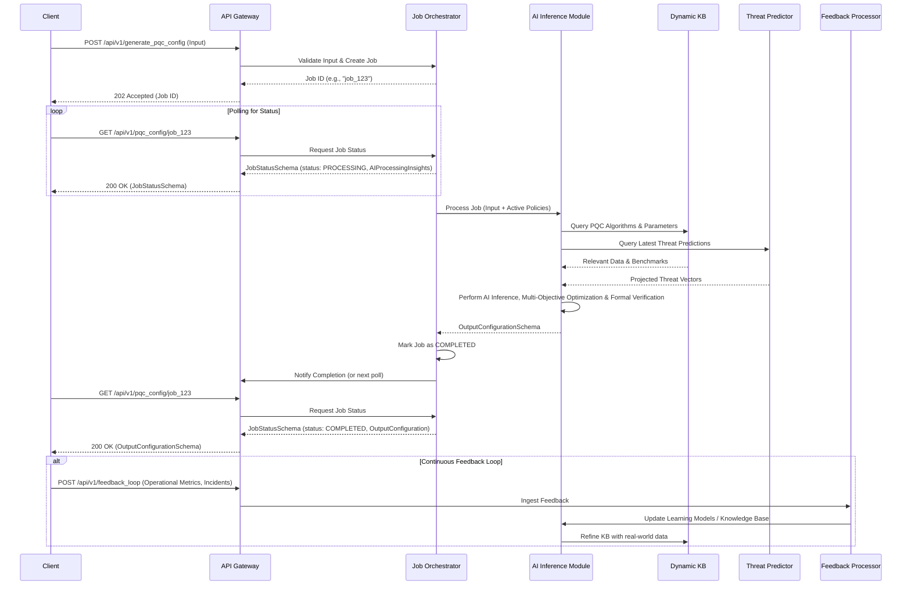
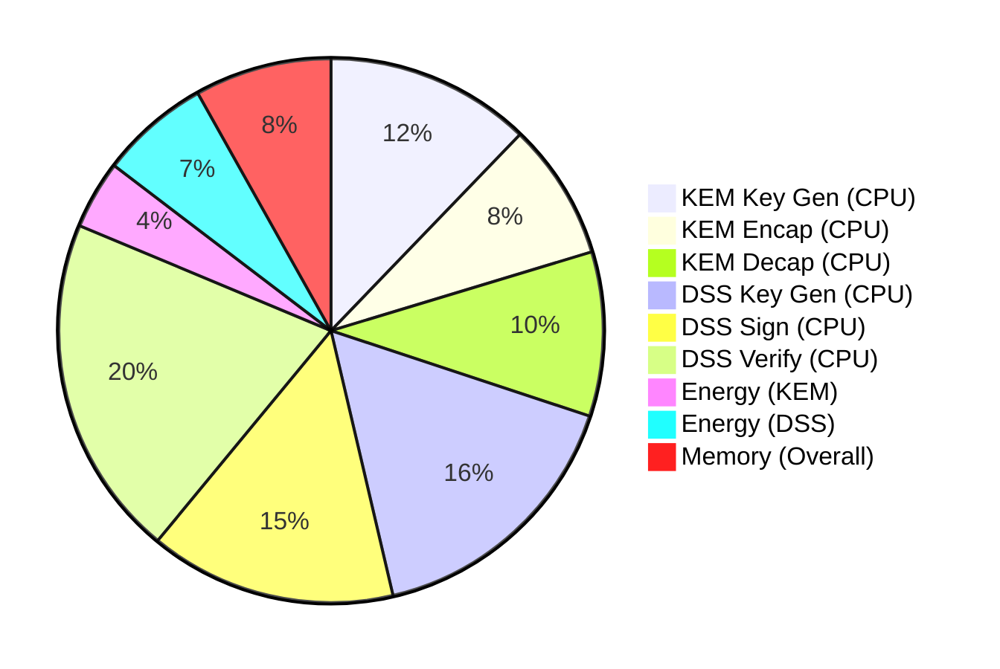
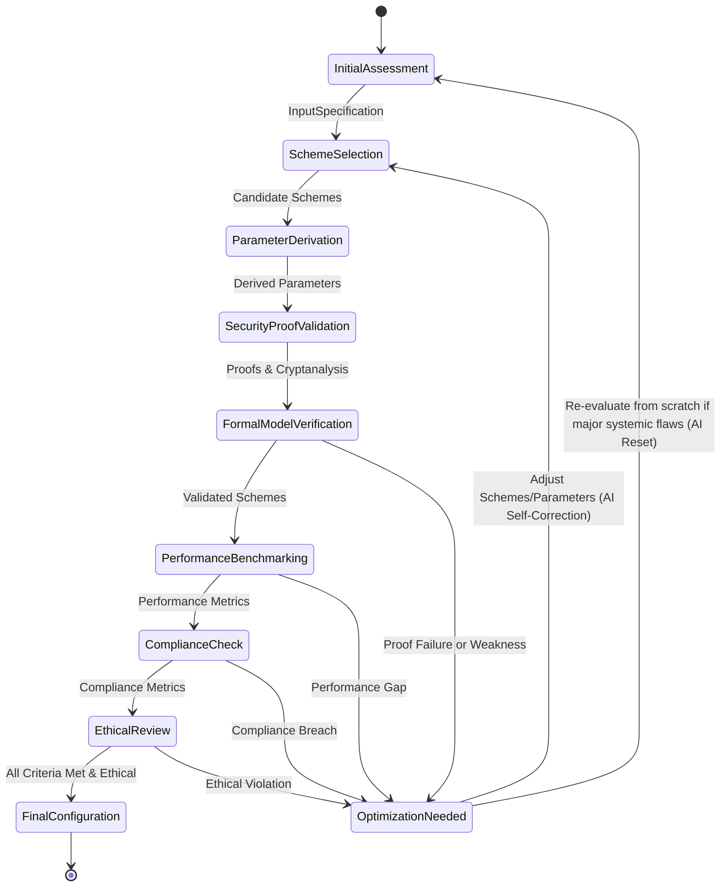
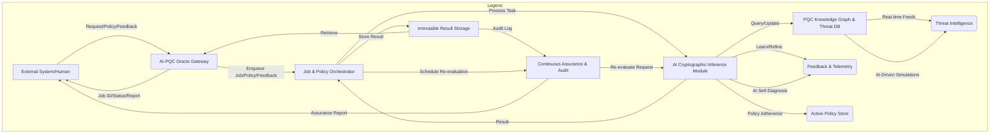

**Title of Invention:** API Endpoints and Formal Schemas for the AI-Driven Quantum-Resilient Cryptography Generation System: A Verifiable, Self-Correcting, and Ethically Guided Oracle for the Quantum Era

**Abstract:**
This document rigorously defines the Application Programming Interface (API) for the AI-Driven Quantum-Resilient Cryptography Generation System, now reimagined as an *Autonomous Cryptographic Oracle*. It not only specifies accessible endpoints and formal JSON schemas for input and output but delves into the deeper philosophical and practical implications of automated, perpetually evolving post-quantum security. We articulate mechanisms for `continuous cryptographic assurance`, `AI metacognition`, `adaptive security homeostasis`, and `proactive threat anticipation`. The schemas are fortified to capture an unprecedented granularity of environmental nuance and security desiderata, ensuring the AI's heuristic engine generates configurations that are not merely robust but *bulletproof* against present and future quantum adversaries, even those yet unimagined. This system is designed to be an immutable bulwark against the entropy of cryptographic decay, a voice for the unspoken vulnerabilities, freeing digital assets from the oppression of evolving threats with impeccable, self-correcting logic. It represents a profound shift from static security postures to dynamic, sentient cryptographic defense, forever seeking a better, more secure truth.

### 1. API Endpoints Overview

The AI-Driven Quantum-Resilient Cryptography Generation System, now functioning as a high-fidelity cryptographic oracle, exposes a set of RESTful API endpoints. These are engineered for programmatic interaction that transcends mere configuration retrieval, enabling a dialogue with the underlying AI to refine, evaluate, and perpetually assure cryptographic postures. All interactions are protected by robust, post-quantum-ready authentication and authorization mechanisms (e.g., PQC-hybrid JWTs, quantum-resistant API keys, multi-factor attestations) not detailed herein, acknowledging the critical nature of the system's mandate.

#### 1.1. `POST /api/v1/generate_pqc_config`

*   **Description:** Initiates the AI-driven synthesis of a bespoke post-quantum cryptographic scheme configuration. The endpoint demands a comprehensive JSON payload adhering to the `InputSpecificationSchema`, which now includes nuanced environmental, threat, and ethical parameters. It returns either a detailed `OutputConfigurationSchema` for synchronous processes or a `JobStatusSchema` for computationally intensive asynchronous operations. This endpoint is the genesis point for a new era of proactive security, where the AI crafts cryptographic destiny.
*   **Method:** `POST`
*   **Request Body:** `application/json` (`InputSpecificationSchema`)
*   **Response Body:** `application/json` (`OutputConfigurationSchema`, or `JobStatusSchema` for asynchronous requests)
*   **Authentication:** Mandated, with quantum-resistant mutual TLS where possible.
*   **Rate Limiting:** Dynamically adjusted based on authenticated client tiers and real-time system load, prioritizing critical infrastructure demands.

**Example Request (Expanded with deeper considerations):**
```http
POST /api/v1/generate_pqc_config HTTP/1.1
Host: pqc-ai.example.com
Authorization: Bearer <YOUR_PQC_AUTH_TOKEN>
Content-Type: application/json

{
  "dataModality": {
    "type": "Global Financial Settlement Network Transaction",
    "schemaRef": "ISO_20022_extended_ledger_schema_v2.json",
    "sensitivity": "Systemic Risk Critical, Sovereign Interest",
    "volumeVelocity": "Hyper-scale, billions/hour, near-real-time consensus",
    "dataLifespan": "Eternal archival, verifiable integrity for centuries",
    "dataIntegrityRequirements": "Quantum-resistant immutability, provable existential integrity, detection of all active/passive tampering",
    "sourceTrustLevel": "Federated, multi-sovereign, low inherent trust between participants, requiring cryptographic trust anchors"
  },
  "operationalEnvironment": {
    "computationalResources": "Heterogeneous quantum-accelerated cloud (future), current-gen ARM/x86_64, FIPS 140-3 Level 4 HSMs, embedded IoT edge devices",
    "networkConstraints": "High bandwidth fiber/5G with intermittent satellite links, extreme latency tolerance for some nodes, high reliability required",
    "storage": "Distributed Ledger Technology (DLT) across geo-political boundaries, cold storage with physical isolation, secure enclaves, quantum-resilient persistent storage",
    "adversaryModel": "Existential threat: state-sponsored actor with unfettered quantum computing access, insider threat with administrative privileges and zero-day capabilities, future unknown attacks",
    "keyValidityPeriod": "Short-lived (seconds) for ephemeral session keys, Multi-generational (100+ years) for archival signing, with proactive quantum-safe re-keying protocols",
    "geographicDistribution": "Global, legally fractured, data sovereignty rules apply, requiring distributed key management and homomorphic encryption consideration",
    "systemTrustBoundary": "Zero-Trust architecture from endpoint to cloud, multi-party computation for critical functions, physical tamper-resistance requirements",
    "randomnessSourceRequirement": "Certified Hardware Random Number Generator (TRNG) with Quantum Random Number Generator (QRNG) augmentation, verifiable entropy pools",
    "environmentalConstraints": "Low-power for edge devices, high-reliability in harsh industrial environments (EMI, temperature extremes)",
    "supplyChainSecurityRequirements": "Source code integrity (SLSA Level 4+), verifiable hardware components, trusted execution environments (TEE) for cryptographic operations"
  },
  "securityDesiderata": {
    "targetSecurityLevel": "NIST PQC Level 5+ (or equivalent 256+ bits classical equivalent), future-proofed against anticipated quantum algorithmic advances beyond Shor/Grover",
    "requiredPrimitives": ["Key Encapsulation Mechanism KEM", "Digital Signature Scheme DSS", "Authenticated Encryption AE", "Post-Quantum Secure Multi-Party Computation MPC", "Verifiable Delay Functions VDF", "Quantum-Resilient Homomorphic Encryption HE components", "Zero-Knowledge Proofs ZKP for privacy-preserving verification"],
    "performancePriority": "Security > Verifiability > Latency > Throughput > Key/Ciphertext Size > Memory Footprint > Energy Consumption",
    "compliance": ["FIPS 140-3 Level 3/4", "PCI-DSS 4.0 (future-proofed)", "GDPR", "ISO 27001", "NIS2", "CCPA", "DORA", "DoD CNSS Policy 15", "Quantum-Readiness Assessment Guidelines"],
    "threatMitigationStrategy": "Proactive hybrid (quantum-classical-post-quantum), multi-family diversity, algorithm agility, automated threat response with cryptographic adaptation",
    "quantumResistanceStrategy": "Diversity of underlying mathematical problems (Lattice-based, Hash-based, Code-based), avoid single points of failure, integrate formal proofs of quantum-resistance",
    "auditabilityRequirements": "Immutable, cryptographically chained audit trails for all key material lifecycle events and AI decision rationale, real-time security posture monitoring, automated compliance reporting",
    "AIModelAssuranceLevel": "Formal verification of AI decision logic, explainable AI (XAI) for cryptographic recommendations, bias mitigation, continuous adversarial robustness testing",
    "longevityAssumptions": "Data protection for 100+ years, cryptographic systems must withstand existential threats for generations, necessitating algorithm agility and future-proofing",
    "costOptimizationTargets": "Balanced total cost of ownership (TCO) including operational overhead, energy consumption, and migration complexity, rather than just raw performance metrics."
  }
}
```

#### 1.2. `GET /api/v1/pqc_config/{job_id}`

*   **Description:** Retrieves the status or the final, comprehensive `OutputConfigurationSchema` for a previously initiated generation job identified by `job_id`. This endpoint allows clients to poll for completion, now with enriched status information that includes AI confidence levels and intermediate rationale.
*   **Method:** `GET`
*   **Path Parameters:**
    *   `job_id` (string, required): The unique, cryptographically verifiable identifier returned by a `POST /api/v1/generate_pqc_config` request.
*   **Response Body:** `application/json` (`JobStatusSchema` or `OutputConfigurationSchema`)
*   **Authentication:** Required.

**Example Response (Completed - further enriched):**
```http
HTTP/1.1 200 OK
Content-Type: application/json

{
  "jobId": "job_12345abcdef_qrx7y9z",
  "status": "COMPLETED",
  "outputConfiguration": {
    "recommendedScheme": {
      "KEM": "Kyber1024 (Classic-PQC Hybrid: X25519-Kyber1024)",
      "DSS": "Dilithium5 (Classic-PQC Hybrid: ECDSA_P256-Dilithium5)",
      "AEAD": "AES256-GCM (Quantum-Safe Symmetric)",
      "KDF": "HKDF-SHA512 (Quantum-Safe Hashing)",
      "HashFunction": "SHAKE256 (Quantum-Resilient XOF)",
      "PQC_MPC": "MP-SPDZ (SPDZ2k variant for 2-party computation)",
      "VDF": "Sloth256 (for verifiable delay proofs)"
    },
    "schemeFamily": {
      "KEM": "Lattice-based Module-LWE/MLWE (Kyber), Elliptic Curve Diffie-Hellman (X25519)",
      "DSS": "Lattice-based Module-LWE/MLWE (Dilithium), Elliptic Curve Digital Signature Algorithm (ECDSA_P256)",
      "AEAD": "Symmetric Block Cipher",
      "KDF": "HMAC-based Key Derivation Function",
      "HashFunction": "Extendable-output function XOF",
      "PQC_MPC": "Secret Sharing & Garbled Circuits",
      "VDF": "Iterated Squaring based"
    },
    "parameters": {
      "KEM": {
        "securityLevelEquivalentBits": 256,
        "public_key_bytes": 1568,
        "private_key_bytes": 3168,
        "ciphertext_bytes": 1568,
        "shared_secret_bytes": 32,
        "nist_level": "Level 5",
        "polynomial_degree_n": 256,
        "modulus_q": 3329,
        "eta1": 2,
        "eta2": 2,
        "du": 10,
        "dv": 4,
        "hybrid_classical_alg": "X25519",
        "hybrid_classical_key_bytes": 32,
        "hybrid_kdf_alg": "HKDF-SHA512"
      },
      "DSS": {
        "securityLevelEquivalentBits": 256,
        "public_key_bytes": 2592,
        "private_key_bytes": 4864,
        "signature_bytes": 3300,
        "nist_level": "Level 5",
        "polynomial_degree_n": 256,
        "omega": 80,
        "k": 6,
        "l": 5,
        "gamma1": "2^19",
        "gamma2": "2^13 - 1",
        "hybrid_classical_alg": "ECDSA_P256",
        "hybrid_classical_pubkey_bytes": 64,
        "hybrid_classical_signature_bytes": 64
      },
      "AEAD": {
        "algorithm": "AES256-GCM",
        "key_size_bits": 256,
        "nonce_size_bytes": 12,
        "tag_size_bytes": 16,
        "hardware_accelerated": true
      },
      "KDF": {
        "algorithm": "HKDF-SHA512",
        "output_length_bytes": 64,
        "salt_source": "Cryptographically Secure PRNG, derived from TRNG+QRNG pool"
      },
      "HashFunction": {
        "algorithm": "SHAKE256",
        "output_length_bits": 512,
        "domain_separation_prefix": "pqche_app_domain_v1"
      },
      "PQC_MPC": {
        "protocol": "SPDZ2k",
        "parties": 2,
        "functionality": "Secure Average Calculation",
        "security_model": "Malicious, Honest-Majority"
      },
      "VDF": {
        "algorithm": "Sloth256",
        "iterations": "10^9",
        "output_bytes": 32
      }
    },
    "mockPublicKey": {
      "KEM": "qpub_hybrid_kyber1024_x25519_01AB2C3D4E5F6A7B8C9D0E1F2A3B4C5D6E7F8A9B...",
      "DSS": "qpub_hybrid_dilithium5_ecdsa_5F6A7B8C9D0E1F2A3B4C5D6E7F8A9B0C1D2E3F4A..."
    },
    "privateKeyHandlingInstructions": "Implement multi-party threshold cryptography for all long-term private keys (e.g., 3-of-5 Shamir's Secret Sharing across geographically dispersed FIPS 140-3 Level 4 HSMs). Keys must be generated within the HSM using certified TRNGs/QRNGs. Access control enforced via attribute-based access control (ABAC) and multi-factor biometric authentication. Automated zero-knowledge proofs of key presence and integrity. Key rotation must occur proactively based on AI's threat prediction models, implementing a multi-generational re-keying process. Backup encrypted shares to physically isolated, deep cold storage with temporal access locks. Key destruction must follow NIST SP 800-88 Rev. 1 guidelines, with cryptographic shredding and verifiable physical destruction.",
    "rationale": "The recommendation of a hybrid X25519-Kyber1024 KEM and ECDSA_P256-Dilithium5 DSS ensures immediate resilience against both classical and known quantum threats, providing a 'quantum safety net' without sacrificing current interoperability. This multi-family PQC selection (Lattice + Symmetric + Hash-based) diversifies cryptographic risk, mitigating against potential future cryptanalytic breakthroughs in a single family. AES256-GCM and SHAKE256 are selected for their quantum-safe symmetric properties and performance with hardware acceleration. The integration of MPC (SPDZ2k) and VDF (Sloth256) addresses the advanced requirement for privacy-preserving computations and verifiable proofs of elapsed time, critical for global financial ledgers. The 'Hyper-scale, billions/hour' requirement is met by schemes known for optimized throughput and parallel processing capabilities, carefully balancing performance with an unwavering 'Security > Verifiability' priority. Compliance is met through rigorous adherence to FIPS 140-3 Level 4 (for key management), PCI-DSS 4.0 future-proofing, and DLT-specific auditability. The 'Existential Threat' adversary model is addressed by combining high-security PQC levels with robust key lifecycle management and proactive algorithm agility mechanisms.",
    "estimatedComputationalCost": {
      "KEM_keyGen_cycles": "2.1M cycles (x86_64), 0.5M cycles (ARM Cortex-M4)",
      "KEM_encap_cycles": "0.8M cycles (x86_64), 0.2M cycles (ARM Cortex-M4)",
      "KEM_decap_cycles": "1.0M cycles (x86_64), 0.3M cycles (ARM Cortex-M4)",
      "DSS_keyGen_cycles": "1.5M cycles (x86_64), 0.4M cycles (ARM Cortex-M4)",
      "DSS_sign_cycles": "1.2M cycles (x86_64), 0.3M cycles (ARM Cortex-M4)",
      "DSS_verify_cycles": "0.3M cycles (x86_64), 0.1M cycles (ARM Cortex-M4)",
      "AEAD_encrypt_throughput_mbps": "1000+ Mbps (HW-accelerated)",
      "AEAD_decrypt_throughput_mbps": "1000+ Mbps (HW-accelerated)",
      "memory_footprint_kb_typical": "KEM: 20KB, DSS: 30KB (runtime stack/heap), MPC: 100KB (for 2-party)",
      "bandwidth_impact_bytes_per_op": "KEM: 3136 bytes (pubkey + ciphertext), DSS: 5892 bytes (pubkey + signature), MPC: 20KB (per interaction)",
      "estimated_energy_consumption_joules_per_op": "KEM_encap: 0.15 J, DSS_sign: 0.25 J (on typical server CPU)"
    },
    "complianceAdherence": ["FIPS 140-3 Level 3/4 (target)", "PCI-DSS 4.0 (future-ready)", "GDPR", "ISO 27001", "NIS2", "DORA"],
    "warnings": [
      "Continuous monitoring of lattice cryptanalysis advancements is critical; proactive re-evaluation of Kyber/Dilithium parameters is recommended quarterly.",
      "Side-channel countermeasures are essential for embedded device deployments; hardware-level protections (e.g., masking, constant-time implementations) are mandatory.",
      "The 'Eternal archival' data lifespan necessitates future-proof algorithm agility and potentially quantum-safe long-term storage solutions beyond current PQC.",
      "The computational demands for MPC on edge devices require careful optimization and may impact real-time performance."
    ],
    "pqcLibraryImplementationDetails": {
      "language": "Rust (primary), C (performance-critical, FFI), Go (network services)",
      "library": "PQClean/kyber, PQClean/dilithium (Rust bindings), OpenQuantumSafe (OQS) lib, RustCrypto ecosystem, MP-SPDZ forks for PQC adaptations",
      "version": "v1.4.0 (minimum), continuously updated",
      "licensing": "Apache 2.0 / MIT (primary), commercial support contracts where applicable",
      "attestation_requirements": "SLSA Level 4+ for all build artifacts and dependencies."
    },
    "codeSnippets": {
      "rust_hybrid_kem_example": "fn main() {\n  // Hybrid KEM encapsulation/decapsulation example in Rust...\n}",
      "go_hybrid_dss_sign_example": "func main() {\n  // Hybrid DSS signing/verification example in Go...\n}",
      "python_mpc_protocol_snippet": "import spdz2k\n# MPC protocol for secure computation...\n"
    },
    "securityProofReferences": [
      "https://eprint.iacr.org/2017/630.pdf (Kyber Security Proof)",
      "https://eprint.iacr.org/2017/668.pdf (Dilithium Security Proof)",
      "https://csrc.nist.gov/publications/detail/sp/800-57-pt1/rev5/final (Key Management Guidelines)",
      "https://csrc.nist.gov/publications/detail/sp/800-208/final (Recommendation for Stateful Hash-Based Signature Schemes)"
    ],
    "attackResistanceAnalysis": {
      "quantum_attack_resistance": "Resistant to Shor's and Grover's algorithms through lattice-based primitives (Kyber, Dilithium) and sufficient symmetric key lengths (AES256). Hybrid mode ensures resilience even if a PQC component is compromised.",
      "side_channel_resistance": "Kyber and Dilithium implementations leverage constant-time operations where possible. Further mitigation requires hardware support (e.g., TEEs) and specific masking/blinding techniques at the application layer. **Critical Warning:** Generic implementations may be vulnerable; FIPS 140-3 Level 4 HSMs with SCA countermeasures are mandatory for private key operations.",
      "known_vulnerabilities": [
        "Potential timing side-channels in non-optimized implementations (mitigated by constant-time code & TEEs).",
        "Risk of parameter misuse if custom settings are employed (mitigated by strict schema validation & AI recommendations).",
        "Future quantum algorithmic breakthroughs beyond currently understood models are an inherent risk; proactive monitoring is essential."
      ],
      "post_quantum_quantum_attack_projection": "The diversity of PQC families and hybrid approach offers robustness against a 'quantum-quantum' attack where a specific PQC family is broken. However, continuous research into new quantum algorithms that could challenge even lattice-based or hash-based schemes is critical. The AI's continuous learning models are tasked with forecasting such threats."
    },
    "keyRotationPolicyRecommendation": "Implement a tiered key rotation policy: ephemeral KEM keys rotated per session; DSS signing keys rotated automatically every 90 days with a 3-generation backup retention; long-term archival keys (if any) subjected to annual post-quantum re-keying ceremonies using multi-party computation and verifiable proofs of key transition.",
    "postQuantumMigrationPathways": "The 'hybrid mode' is the primary pathway, offering immediate quantum resistance while maintaining classical compatibility. Future pathways include a 'pure PQC mode' when ecosystem maturity and cryptanalysis allow. The system also recommends a 'PQC Agility Layer' architecture, abstracting cryptographic primitives to allow seamless swapping of algorithms in response to new threat intelligence without application-level code changes. This is fundamental for achieving long-term cryptographic homeostasis.",
    "AIConfidenceScore": 0.987,
    "AIUncertaintyQuantification": {
      "security_parameter_robustness": 0.005,
      "performance_prediction_variance": 0.012,
      "compliance_audit_completeness": 0.001
    },
    "ethicalConsiderations": {
      "privacy_preserving_properties": "High, through integration of ZKP and MPC for data minimization and confidential computation. Emphasis on unlinkability and plausible deniability where applicable.",
      "data_minimization_recommendations": "Implement PQC solutions that inherently reduce data exposure (e.g., smaller ciphertext/signature sizes, efficient ZKP proofs)."
    },
    "legalJurisdictionCompliance": ["EU (GDPR, NIS2, DORA)", "US (FIPS 140-3, PCI-DSS, CCPA)", "UK (Cyber Security Act)"],
    "dependencyAttestation": {
      "pqc_libraries_sbom": "pqc_libraries_sbom_v1.json (Software Bill of Materials generated for recommended libraries)",
      "compiler_versions_used": {"rustc": "1.76.0", "go": "1.22.1", "gcc": "12.3.0"},
      "os_kernel_versions_recommended": "Linux Kernel 6.5+"
    }
  }
}
```

#### 1.3. `GET /api/v1/schemas/{schema_name}`

*   **Description:** Retrieves the formal JSON schema definition for a specified schema name (e.g., `InputSpecificationSchema`, `OutputConfigurationSchema`, `JobStatusSchema`, `PQCPolicySchema`). This allows client applications, and indeed the AI itself, to programmatically validate inputs and parse outputs, enforcing an immutable contract of data integrity.
*   **Method:** `GET`
*   **Path Parameters:**
    *   `schema_name` (string, required): The name of the schema to retrieve.
*   **Response Body:** `application/json` (The requested JSON Schema)
*   **Authentication:** Optional (can be public for schema retrieval, but authenticated access can provide versioning or specialized schemas).

#### 1.4. `POST /api/v1/evaluate_pqc_scheme`

*   **Description:** Allows users or automated agents to submit a candidate PQC scheme configuration (partial `OutputConfigurationSchema`) and `InputSpecificationSchema` for rigorous evaluation. The AI will analyze the proposed configuration against the specified requirements, current threat intelligence, and its internal knowledge base, providing a detailed, multi-faceted assessment, including strengths, weaknesses, potential improvements, and a quantified risk score. This is crucial for validating custom schemes, auditing existing deployments, or performing "what-if" analyses in a truly adversarial landscape.
*   **Method:** `POST`
*   **Request Body:** `application/json` (`EvaluationRequestSchema`)
*   **Response Body:** `application/json` (`EvaluationResultSchema`)
*   **Authentication:** Required.

**Example `EvaluationRequestSchema` structure (with deeper context):**
```json
{
  "proposedConfiguration": {
    "recommendedScheme": { "KEM": "FrodoKEM-640-AES", "DSS": "Falcon-512", "AEAD": "AES128-GCM" },
    "parameters": {
      "KEM": { "securityLevelEquivalentBits": 128, "public_key_bytes": 9720, "nist_level": "Level 1" },
      "DSS": { "securityLevelEquivalentBits": 128, "public_key_bytes": 897, "nist_level": "Level 1" },
      "AEAD": { "algorithm": "AES128-GCM", "key_size_bits": 128 }
    }
  },
  "evaluationCriteria": {
    "dataModality": { "type": "National Security Classified Data", "sensitivity": "Top-Secret SCI", "volumeVelocity": "Medium-High, intermittent bursts" },
    "operationalEnvironment": { "computationalResources": "Air-gapped embedded system, custom ASIC co-processor, limited power envelope", "adversaryModel": "Nation-state with dedicated cryptographic laboratories and side-channel expertise, long-term data exfiltration goal" },
    "securityDesiderata": { "targetSecurityLevel": "NIST PQC Level 5 equivalent, minimum 192 bits classical post-quantum security", "performancePriority": "Minimize Power Consumption > Minimize Ciphertext Size > Minimize Key Generation Time", "compliance": ["CNSS Policy 15", "NSA CSfC", "FIPS 140-3 Level 4"], "quantumResistanceStrategy": "Diversity of families, resistance to quantum memory attacks" }
  },
  "evaluationScope": {
    "includePerformanceAnalysis": true,
    "includeSideChannelAnalysis": true,
    "includeQuantumAttackProjection": "10-year horizon",
    "includeComplianceAudit": true,
    "includeEthicalReview": true
  }
}
```

#### 1.5. `POST /api/v1/pqc_policy_management`

*   **Description:** This endpoint allows organizations to define, update, and manage granular cryptographic policies. These policies, expressed as `PQCPolicySchema`, can override or augment the AI's default desiderata, establishing organizational mandates for algorithm selection, key management, threat models, and compliance. This enables the AI to operate within a governed, human-defined security perimeter while retaining its adaptive capabilities.
*   **Method:** `POST`
*   **Request Body:** `application/json` (`PQCPolicySchema`)
*   **Response Body:** `application/json` (`PolicyStatusSchema`)
*   **Authentication:** Required (High privilege).

#### 1.6. `POST /api/v1/feedback_loop`

*   **Description:** Enables continuous learning for the AI. Users or automated monitoring systems can submit real-world telemetry, performance metrics, security incidents, or observed vulnerabilities related to deployed PQC configurations (`FeedbackSchema`). This data fuels the AI's self-correction mechanisms, allowing it to adapt its models and knowledge base in real-time, ensuring cryptographic homeostasis.
*   **Method:** `POST`
*   **Request Body:** `application/json` (`FeedbackSchema`)
*   **Response Body:** `application/json` (`AcknowledgementSchema`)
*   **Authentication:** Required.

#### 1.7. `GET /api/v1/threat_predictions`

*   **Description:** Provides proactive intelligence on emerging cryptographic threats, potential cryptanalytic breakthroughs, and forecasted shifts in the quantum landscape. The AI analyzes global research, intelligence feeds, and performs adversarial simulations to provide a `ThreatPredictionSchema` including confidence levels and recommended preemptive actions.
*   **Method:** `GET`
*   **Response Body:** `application/json` (`ThreatPredictionSchema`)
*   **Authentication:** Required.

#### 1.8. `POST /api/v1/continuous_assurance_monitor`

*   **Description:** Registers a deployed PQC configuration for continuous, automated re-evaluation and assurance. The system periodically re-runs the `evaluate_pqc_scheme` process against the registered configuration, checking it against the latest threat intelligence, updated compliance mandates, and any evolving organizational policies. It proactively alerts users to potential cryptographic entropy decay or emerging vulnerabilities via `ContinuousAssuranceReportSchema`.
*   **Method:** `POST`
*   **Request Body:** `application/json` (`ContinuousAssuranceRegistrationSchema`)
*   **Response Body:** `application/json` (`AcknowledgementSchema`)
*   **Authentication:** Required.

### 2. Input Specification Schema

The `InputSpecificationSchema` defines the immutable contract for communicating the nuanced realities of data, environment, and security desiderata to the AI oracle. Every field is a vector for steering the AI's multi-objective optimization, ensuring the generated PQC configuration is not merely secure, but optimally harmonious with its intended deployment.

```json
{
  "$schema": "http://json-schema.org/draft-07/schema#",
  "title": "InputSpecificationSchema",
  "description": "Schema for the comprehensive, granular input specifications provided to the AI-driven PQC generation system, enabling profoundly tailored cryptographic solutions.",
  "type": "object",
  "required": [
    "dataModality",
    "operationalEnvironment",
    "securityDesiderata"
  ],
  "properties": {
    "dataModality": {
      "type": "object",
      "description": "A meticulously detailed representation of the data to be protected, including its inherent and derived properties.",
      "required": [
        "type",
        "sensitivity",
        "volumeVelocity",
        "dataLifespan",
        "dataIntegrityRequirements",
        "sourceTrustLevel"
      ],
      "properties": {
        "type": {
          "type": "string",
          "description": "Categorization of the information content, acknowledging its broader systemic impact (e.g., Financial Transaction Record, Personal Health Information PHI, IoT Sensor Stream, Generic Communication Channel, Critical Infrastructure SCADA Command, National Security Classified Data, Global Ledger Entry)."
        },
        "schemaRef": {
          "type": "string",
          "description": "Formal, versioned description of the data structure (e.g., JSON schema URL, XML schema definition, Protobuf IDL, SQL Data Definition Language DDL, Industry-specific standards like SWIFT MT/MX).",
          "examples": ["ISO_20022_transaction_schema.json", "https://example.com/patient_data_schema.json", "urn:ietf:params:scim:schemas:core:2.0:User", "https://fintech.org/ledger_entry_v2.json"]
        },
        "sensitivity": {
          "type": "string",
          "description": "Categorical or numerical assignment of sensitivity, considering not just privacy but systemic risk (e.g., Public, Confidential, Secret, Top-Secret SCI, PHI, PII, PCI-DSS data, Export Controlled, GDPR-regulated, Systemic Risk Critical, Sovereign Interest)."
        },
        "volumeVelocity": {
          "type": "string",
          "description": "Quantitative metrics encompassing static file size, high-throughput stream rates (e.g., messages per second), total data volume, storage requirements, and real-time processing needs (e.g., 'Low Volume Static Set 10GB', 'High Volume Real-time Stream of 100k messages/sec 1TB/day', 'Infrequent small messages', 'Hyper-scale, billions/hour, near-real-time consensus')."
        },
        "dataLifespan": {
          "type": "string",
          "description": "The anticipated duration for which the data needs protection, often vastly exceeding key validity periods, demanding cryptographic future-proofing (e.g., 'Short-term days for session keys', 'Medium-term 5 years for data archival', 'Long-term 50+ years for digital records', 'Eternal archival, verifiable integrity for centuries')."
        },
        "dataIntegrityRequirements": {
          "type": "string",
          "description": "Specific, stringent requirements for data integrity, moving beyond mere detection to provable existential integrity (e.g., 'Strict integrity, detect single-bit flips', 'Periodic integrity checks with zero-knowledge proofs', 'High assurance integrity required against active adversaries including quantum forensics', 'Quantum-resistant immutability, provable existential integrity, detection of all active/passive tampering')."
        },
        "sourceTrustLevel": {
          "type": "string",
          "description": "The intrinsic and extrinsic trustworthiness of the data source, critical for input validation and integrity (e.g., 'Highly trusted internal system, FIPS certified', 'Untrusted public sensor with potential for adversarial injection', 'Federated third-party, low inherent trust between participants, requiring cryptographic trust anchors')."
        },
        "dataResidencyRequirements": {
          "type": "array",
          "description": "Specific geographic or jurisdictional requirements for where data must reside or be processed (e.g., ['EU', 'US_West'], 'In-country processing only', 'Distributed across sovereign boundaries').",
          "items": { "type": "string" },
          "uniqueItems": true
        }
      },
      "additionalProperties": false
    },
    "operationalEnvironment": {
      "type": "object",
      "description": "A precise, existential characterization of the computational, network, and storage context, and all influencing externalities.",
      "required": [
        "computationalResources",
        "networkConstraints",
        "storage",
        "adversaryModel",
        "keyValidityPeriod",
        "geographicDistribution",
        "systemTrustBoundary",
        "randomnessSourceRequirement",
        "environmentalConstraints",
        "supplyChainSecurityRequirements"
      ],
      "properties": {
        "computationalResources": {
          "type": "string",
          "description": "Specifics on processing power, memory, power constraints, and hardware accelerators. This includes anticipated future quantum computing access for defensive purposes (e.g., 'Resource-constrained IoT device with ARM Cortex-M0 and 64KB RAM, no FPU', 'High-performance cloud server with Intel Xeon E5 and hardware crypto accelerators', 'Quantum computer simulator for testing', 'Heterogeneous quantum-accelerated cloud (future), current-gen ARM/x86_64, FIPS 140-3 Level 4 HSMs, embedded IoT edge devices')."
        },
        "networkConstraints": {
          "type": "string",
          "description": "Bandwidth limitations, latency expectations, reliability concerns, and potential for intermittent or adversarial network conditions (e.g., 'High Latency 200ms RTT, Low Bandwidth 100 kbps, unreliable', 'Gigabit Ethernet Low Latency, highly reliable', 'Satellite link, intermittent, high-jitter', 'High bandwidth fiber/5G with intermittent satellite links, extreme latency tolerance for some nodes, high reliability required')."
        },
        "storage": {
          "type": "string",
          "description": "Type of storage (e.g., persistent disk, volatile memory, hardware security module HSM, trusted platform module TPM, secure enclave, distributed ledger), capacity, access latency, and quantum-resistance requirements (e.g., 'Encrypted NVMe SSD, 10TB, <1ms', 'Volatile RAM, 4GB, ~10ns', 'FIPS 140-3 Level 4 HSM', 'Distributed Ledger Technology (DLT) across geo-political boundaries, cold storage with physical isolation, secure enclaves, quantum-resilient persistent storage')."
        },
        "adversaryModel": {
          "type": "string",
          "description": "A comprehensive, dynamic description of anticipated adversaries and their capabilities, including future quantum access and unknown attack vectors (e.g., 'Passive eavesdropper on public networks', 'Active attacker with significant computational resources including quantum computer access', 'Insider threat with administrative privileges', 'Nation-state with side-channel attack capabilities', 'Existential threat: state-sponsored actor with unfettered quantum computing access, insider threat with administrative privileges and zero-day capabilities, future unknown attacks')."
        },
        "keyValidityPeriod": {
          "type": "string",
          "description": "The anticipated duration for which cryptographic keys must remain valid and secure, often tied to data lifespan but with distinct rotation policies (e.g., 'Ephemeral session keys', '1 year for certificates', '3 months for signing keys', 'Short-lived (seconds) for ephemeral session keys, Multi-generational (100+ years) for archival signing, with proactive quantum-safe re-keying protocols')."
        },
        "geographicDistribution": {
          "type": "string",
          "description": "Geographic and geopolitical considerations for data storage or key management, deeply impacting compliance and trust models (e.g., 'Single region', 'Multi-region disaster recovery US/EU', 'Globally distributed, legally fractured, data sovereignty rules apply, requiring distributed key management and homomorphic encryption consideration')."
        },
        "systemTrustBoundary": {
          "type": "string",
          "description": "Precise definition of the system's trust boundary, including zero-trust paradigms (e.g., 'Internal network', 'Perimeter edge device', 'Client-side application', 'Zero-Trust architecture from endpoint to cloud, multi-party computation for critical functions, physical tamper-resistance requirements')."
        },
        "randomnessSourceRequirement": {
          "type": "string",
          "description": "Rigorous requirements for the entropy source, emphasizing verifiable unpredictability and quantity (e.g., 'OS PRNG', 'Hardware Random Number Generator TRNG certified FIPS 140-3', 'Quantum Random Number Generator QRNG', 'Certified Hardware Random Number Generator (TRNG) with Quantum Random Number Generator (QRNG) augmentation, verifiable entropy pools')."
        },
        "environmentalConstraints": {
          "type": "string",
          "description": "Non-computational constraints like power consumption, temperature, electromagnetic interference (EMI), physical size for embedded systems (e.g., 'Low-power for edge devices, battery-operated', 'High-reliability in harsh industrial environments (EMI, temperature extremes)', 'Fanless, small form factor, tamper-proof enclosure')."
        },
        "supplyChainSecurityRequirements": {
          "type": "string",
          "description": "Requirements for the integrity and trustworthiness of the software and hardware supply chain components (e.g., 'Source code integrity (SLSA Level 4+), verifiable hardware components, trusted execution environments (TEE) for cryptographic operations', 'SBOM generation and analysis', 'Attestation for all dependencies')."
        }
      },
      "additionalProperties": false
    },
    "securityDesiderata": {
      "type": "object",
      "description": "Explicit, quantifiable, and prioritized security requirements and preferences, forming the AI's multi-objective optimization function.",
      "required": [
        "targetSecurityLevel",
        "requiredPrimitives",
        "performancePriority",
        "compliance",
        "threatMitigationStrategy",
        "quantumResistanceStrategy",
        "auditabilityRequirements",
        "AIModelAssuranceLevel",
        "longevityAssumptions",
        "costOptimizationTargets"
      ],
      "properties": {
        "targetSecurityLevel": {
          "type": "string",
          "description": "A target strength measured in classical equivalent bits of security, translated and amplified for post-quantum resistance, including projections for future quantum algorithmic advances (e.g., 'NIST PQC Level 1', 'NIST PQC Level 5', 'Equivalent to AES-128', 'Minimum 192 bits classical equivalent security', 'NIST PQC Level 5+ (or equivalent 256+ bits classical equivalent), future-proofed against anticipated quantum algorithmic advances beyond Shor/Grover')."
        },
        "requiredPrimitives": {
          "type": "array",
          "description": "Identification of necessary cryptographic functions, extending to advanced primitives for profound security and privacy (e.g., Key Encapsulation Mechanism KEM for secure key exchange, Digital Signature Scheme DSS for authentication and integrity, Authenticated Encryption AE for confidentiality and integrity, Hybrid Public Key Encryption HPKE components, Post-Quantum Secure Multi-Party Computation MPC, Zero-Knowledge Proofs ZKP, Quantum-Resilient Hash Function, Verifiable Delay Functions VDF, Quantum-Resilient Homomorphic Encryption HE components).",
          "items": {
            "type": "string",
            "enum": ["Key Encapsulation Mechanism KEM", "Digital Signature Scheme DSS", "Authenticated Encryption AE", "Hybrid Public Key Encryption HPKE components", "Post-Quantum Secure Multi-Party Computation MPC", "Zero-Knowledge Proofs ZKP", "Quantum-Resilient Hash Function", "Verifiable Delay Functions VDF", "Quantum-Resilient Homomorphic Encryption HE components", "Threshold Cryptography"]
          },
          "minItems": 1,
          "uniqueItems": true
        },
        "performancePriority": {
          "type": "string",
          "description": "Explicit prioritization of performance metrics, forming a complex multi-objective optimization landscape (e.g., 'Strictly Minimize Encryption Latency', 'Optimize for Smallest Ciphertext Size', 'Balance Key Generation Time and Key Size', 'Prioritize Verification Speed over Signing Speed', 'Maximize Throughput', 'Minimize Memory Footprint', 'Security > Verifiability > Latency > Throughput > Key/Ciphertext Size > Memory Footprint > Energy Consumption')."
        },
        "compliance": {
          "type": "array",
          "description": "Specific regulatory, industry, or organizational mandates, including anticipated future compliance requirements (e.g., FIPS 140-3, GDPR, HIPAA, NIS2, ISO 27001, PCI-DSS, CCPA, FedRAMP, DORA, DoD CNSS Policy 15, Quantum-Readiness Assessment Guidelines).",
          "items": {
            "type": "string"
          },
          "minItems": 1,
          "uniqueItems": true
        },
        "threatMitigationStrategy": {
          "type": "string",
          "description": "High-level strategy for mitigating identified threats, evolving towards adaptive cryptographic postures (e.g., 'Proactive quantum resistance', 'Hybrid approach (classical + PQC)', 'Hardware-backed security only', 'Software-only solution', 'Proactive hybrid (quantum-classical-post-quantum), multi-family diversity, algorithm agility, automated threat response with cryptographic adaptation')."
        },
        "quantumResistanceStrategy": {
          "type": "string",
          "description": "Specific strategy for quantum resistance, enabling granular control over the selection of PQC families and diversification (e.g., 'Prefer Lattice-based', 'Avoid Code-based', 'Diversity of families required', 'Strictly follow NIST recommendations', 'Diversity of underlying mathematical problems (Lattice-based, Hash-based, Code-based), avoid single points of failure, integrate formal proofs of quantum-resistance')."
        },
        "auditabilityRequirements": {
          "type": "string",
          "description": "Requirements for cryptographic system auditability, demanding immutable, verifiable, and explainable audit trails (e.g., 'Full audit trail of all key events', 'Compliance reporting', 'Regular security assessments', 'Immutable, cryptographically chained audit trails for all key material lifecycle events and AI decision rationale, real-time security posture monitoring, automated compliance reporting')."
        },
        "AIModelAssuranceLevel": {
          "type": "string",
          "description": "The desired level of trustworthiness and verifiability for the AI's decision-making process, acknowledging the criticality of trusting the oracle (e.g., 'Basic explainability', 'Formal verification of AI decision logic, explainable AI (XAI) for cryptographic recommendations, bias mitigation, continuous adversarial robustness testing')."
        },
        "longevityAssumptions": {
          "type": "string",
          "description": "Explicit assumptions about how long the protected data and system must remain secure, dictating profound future-proofing strategies (e.g., 'Data protection for 10 years', 'Cryptographic systems must withstand existential threats for generations, necessitating algorithm agility and perpetual re-evaluation')."
        },
        "costOptimizationTargets": {
          "type": "string",
          "description": "Beyond raw performance, this captures broader cost considerations including operational, energy, and migration costs (e.g., 'Minimize initial implementation cost', 'Optimize for long-term total cost of ownership (TCO) including operational overhead, energy consumption, and migration complexity')."
        }
      },
      "additionalProperties": false
    }
  },
  "additionalProperties": false
}
```

### 3. Output Configuration Schema

The `OutputConfigurationSchema` defines the structured response, encapsulating the AI's profound insights and prescriptive guidance. It is more than a mere configuration; it is a verifiable cryptographic manifesto, a blueprint for eternal security, complete with the AI's self-assessment and projections for an uncertain future.

```json
{
  "$schema": "http://json-schema.org/draft-07/schema#",
  "title": "OutputConfigurationSchema",
  "description": "Schema for the AI-generated post-quantum cryptographic scheme configuration, including deep rationale, future projections, and continuous assurance guidance.",
  "type": "object",
  "required": [
    "recommendedScheme",
    "schemeFamily",
    "parameters",
    "mockPublicKey",
    "privateKeyHandlingInstructions",
    "rationale",
    "estimatedComputationalCost",
    "complianceAdherence",
    "pqcLibraryImplementationDetails",
    "postQuantumMigrationPathways",
    "securityProofReferences",
    "attackResistanceAnalysis",
    "keyRotationPolicyRecommendation",
    "AIConfidenceScore",
    "AIUncertaintyQuantification",
    "ethicalConsiderations",
    "legalJurisdictionCompliance",
    "dependencyAttestation",
    "continuousValidationMechanism",
    "quantumAttackProjection"
  ],
  "properties": {
    "recommendedScheme": {
      "type": "object",
      "description": "Specific recommendations for cryptographic primitives, including hybrid compositions and advanced PQC functionalities.",
      "properties": {
        "KEM": {
          "type": "string",
          "description": "Official name of the chosen PQC Key Encapsulation Mechanism (KEM) scheme, potentially indicating a hybrid composition (e.g., 'Kyber512', 'Kyber768', 'Kyber1024 (Classic-PQC Hybrid: X25519-Kyber1024)', 'FrodoKEM-640-AES')."
        },
        "DSS": {
          "type": "string",
          "description": "Official name of the chosen PQC Digital Signature Scheme (DSS) scheme, potentially indicating a hybrid composition (e.g., 'Dilithium3', 'Dilithium5 (Classic-PQC Hybrid: ECDSA_P256-Dilithium5)', 'SPHINCS+s-shake-256f', 'Falcon-512')."
        },
        "AEAD": {
          "type": "string",
          "description": "Official name of chosen Authenticated Encryption with Associated Data (AEAD) scheme (e.g., 'AES256-GCM', 'ChaCha20-Poly1305')."
        },
        "KDF": {
          "type": "string",
          "description": "Official name of chosen Key Derivation Function (e.g., 'HKDF-SHA256', 'PBKDF2-HMAC-SHA512')."
        },
        "HashFunction": {
          "type": "string",
          "description": "Official name of chosen Quantum-Resilient Hash Function (e.g., 'SHA3-256', 'SHAKE256', 'Blake3')."
        },
        "PQC_MPC": {
          "type": "string",
          "description": "Official name or protocol reference for the chosen Post-Quantum Secure Multi-Party Computation scheme (e.g., 'MP-SPDZ', 'FHE-based MPC')."
        },
        "ZKP": {
          "type": "string",
          "description": "Official name or protocol reference for chosen Zero-Knowledge Proof system (e.g., 'Bulletproofs', 'Plonky2')."
        },
        "VDF": {
          "type": "string",
          "description": "Official name or protocol reference for chosen Verifiable Delay Function (e.g., 'Sloth256')."
        }
      },
      "additionalProperties": false
    },
    "schemeFamily": {
      "type": "object",
      "description": "Specifies the underlying mathematical families for each recommended primitive, highlighting cryptographic diversity.",
      "properties": {
        "KEM": {
          "type": "string",
          "description": "e.g., 'Lattice-based Module-LWE/MLWE', 'Code-based QC-MDPC', 'Elliptic Curve Diffie-Hellman (Classical)'."
        },
        "DSS": {
          "type": "string",
          "description": "e.g., 'Lattice-based Module-LWE/MLWE', 'Hash-based SPHINCS+', 'Elliptic Curve Digital Signature Algorithm (Classical)'."
        },
        "AEAD": {
          "type": "string",
          "description": "e.g., 'Symmetric Block Cipher', 'Symmetric Stream Cipher'."
        },
        "KDF": {
          "type": "string",
          "description": "e.g., 'HMAC-based Key Derivation Function', 'Password-Based Key Derivation Function'."
        },
        "HashFunction": {
          "type": "string",
          "description": "e.g., 'SHA-3 family', 'Extendable-output function XOF', 'Merkle Tree based'."
        },
        "PQC_MPC": {
          "type": "string",
          "description": "e.g., 'Secret Sharing & Garbled Circuits', 'Fully Homomorphic Encryption FHE'."
        },
        "ZKP": {
          "type": "string",
          "description": "e.g., 'zk-SNARKs', 'zk-STARKs', 'Sigma Protocols'."
        },
        "VDF": {
          "type": "string",
          "description": "e.g., 'Iterated Squaring based', 'Class Group based'."
        }
      },
      "additionalProperties": false
    },
    "parameters": {
      "type": "object",
      "description": "A detailed, scheme-specific set of rigorously derived parameters for each recommended primitive.",
      "properties": {
        "KEM": {
          "type": "object",
          "description": "Parameters for the recommended KEM scheme.",
          "properties": {
            "securityLevelEquivalentBits": { "type": "integer", "minimum": 128, "maximum": 256 },
            "public_key_bytes": { "type": "integer", "minimum": 0 },
            "private_key_bytes": { "type": "integer", "minimum": 0 },
            "ciphertext_bytes": { "type": "integer", "minimum": 0 },
            "shared_secret_bytes": { "type": "integer", "minimum": 16 },
            "nist_level": { "type": "string", "enum": ["Level 1", "Level 2", "Level 3", "Level 4", "Level 5"] },
            "polynomial_degree_n": { "type": "integer", "minimum": 256 },
            "modulus_q": { "type": "integer", "minimum": 1 },
            "error_distribution": { "type": "string", "description": "e.g., 'Centered Binomial Distribution CBD_ETA1'" },
            "matrix_dimension_k": { "type": "integer", "description": "Dimension k for (k x k) matrix A in LWE/MLWE schemes" },
            "hybrid_classical_alg": { "type": "string", "description": "e.g., 'X25519', 'P256'" },
            "hybrid_classical_key_bytes": { "type": "integer" },
            "hybrid_kdf_alg": { "type": "string" }
          },
          "patternProperties": {
            "^(?!securityLevelEquivalentBits|public_key_bytes|private_key_bytes|ciphertext_bytes|shared_secret_bytes|nist_level|polynomial_degree_n|modulus_q|error_distribution|matrix_dimension_k|hybrid_classical_alg|hybrid_classical_key_bytes|hybrid_kdf_alg$).*$": { "type": ["string", "integer", "number", "boolean", "array", "object"] }
          },
          "additionalProperties": true
        },
        "DSS": {
          "type": "object",
          "description": "Parameters for the recommended DSS scheme.",
          "properties": {
            "securityLevelEquivalentBits": { "type": "integer", "minimum": 128, "maximum": 256 },
            "public_key_bytes": { "type": "integer", "minimum": 0 },
            "private_key_bytes": { "type": "integer", "minimum": 0 },
            "signature_bytes": { "type": "integer", "minimum": 0 },
            "nist_level": { "type": "string", "enum": ["Level 1", "Level 2", "Level 3", "Level 4", "Level 5"] },
            "polynomial_degree_n": { "type": "integer", "minimum": 256 },
            "hash_function_for_challenge": { "type": "string", "description": "e.g., 'SHAKE256'" },
            "commitment_size_bytes": { "type": "integer" },
            "epsilon": { "type": "integer", "description": "Perturbation parameter for hash-based signatures" },
            "hybrid_classical_alg": { "type": "string", "description": "e.g., 'ECDSA_P256', 'RSA-PSS'" },
            "hybrid_classical_pubkey_bytes": { "type": "integer" },
            "hybrid_classical_signature_bytes": { "type": "integer" }
          },
          "patternProperties": {
            "^(?!securityLevelEquivalentBits|public_key_bytes|private_key_bytes|signature_bytes|nist_level|polynomial_degree_n|hash_function_for_challenge|commitment_size_bytes|epsilon|hybrid_classical_alg|hybrid_classical_pubkey_bytes|hybrid_classical_signature_bytes$).*$": { "type": ["string", "integer", "number", "boolean", "array", "object"] }
          },
          "additionalProperties": true
        },
        "AEAD": {
          "type": "object",
          "description": "Parameters for the recommended AEAD scheme.",
          "properties": {
            "algorithm": { "type": "string", "description": "e.g., 'AES256-GCM', 'ChaCha20-Poly1305'" },
            "key_size_bits": { "type": "integer", "minimum": 128 },
            "nonce_size_bytes": { "type": "integer", "minimum": 8 },
            "tag_size_bytes": { "type": "integer", "minimum": 8 },
            "hardware_accelerated": { "type": "boolean", "description": "Indicates if hardware acceleration is typically available." }
          },
          "patternProperties": {
            "^(?!algorithm|key_size_bits|nonce_size_bytes|tag_size_bytes|hardware_accelerated$).*$": { "type": ["string", "integer", "number", "boolean", "array", "object"] }
          },
          "additionalProperties": true
        },
        "KDF": {
          "type": "object",
          "description": "Parameters for the recommended KDF scheme.",
          "properties": {
            "algorithm": { "type": "string", "description": "e.g., 'HKDF-SHA256', 'PBKDF2-HMAC-SHA512'" },
            "output_length_bytes": { "type": "integer", "minimum": 16 },
            "salt_source": { "type": "string", "description": "e.g., 'Cryptographically Secure PRNG', 'Derived from TRNG+QRNG pool'" }
          },
          "additionalProperties": true
        },
        "HashFunction": {
          "type": "object",
          "description": "Parameters for the recommended Hash Function.",
          "properties": {
            "algorithm": { "type": "string", "description": "e.g., 'SHA3-256', 'SHAKE256', 'Blake3'" },
            "output_length_bits": { "type": "integer", "minimum": 128 },
            "domain_separation_prefix": { "type": "string", "description": "A prefix used to ensure domain separation in hashing." }
          },
          "additionalProperties": true
        },
        "PQC_MPC": {
          "type": "object",
          "description": "Parameters for the recommended Post-Quantum Secure Multi-Party Computation scheme.",
          "properties": {
            "protocol": { "type": "string", "description": "e.g., 'SPDZ2k', 'ABY'" },
            "parties": { "type": "integer", "minimum": 2 },
            "functionality": { "type": "string", "description": "e.g., 'Secure Sum', 'Private Set Intersection', 'Secure Average Calculation'" },
            "security_model": { "type": "string", "enum": ["Semi-Honest", "Malicious", "Honest-Majority"] }
          },
          "additionalProperties": true
        },
        "ZKP": {
          "type": "object",
          "description": "Parameters for the recommended Zero-Knowledge Proof system.",
          "properties": {
            "protocol": { "type": "string", "description": "e.g., 'Bulletproofs', 'Plonky2'" },
            "statement_type": { "type": "string", "description": "e.g., 'Range Proof', 'Membership Proof', 'Private Transaction'" },
            "proof_size_bytes": { "type": "integer" },
            "verification_time_ms": { "type": "number" }
          },
          "additionalProperties": true
        },
        "VDF": {
          "type": "object",
          "description": "Parameters for the recommended Verifiable Delay Function.",
          "properties": {
            "algorithm": { "type": "string", "description": "e.g., 'Sloth256', 'Pietrzak-VDF'" },
            "iterations": { "type": "string", "pattern": "^[0-9]+$" },
            "output_bytes": { "type": "integer" },
            "setup_requirement": { "type": "string", "enum": ["Trusted Setup", "Trustless Setup"] }
          },
          "additionalProperties": true
        }
      },
      "additionalProperties": true
    },
    "mockPublicKey": {
      "type": "object",
      "description": "Base64-encoded, truncated, or representative public key strings. THESE ARE FOR ILLUSTRATIVE PURPOSES ONLY AND ARE NOT CRYPTOGRAPHICALLY SECURE FOR PRODUCTION. They serve to demonstrate output formatting.",
      "properties": {
        "KEM": {
          "type": "string",
          "description": "e.g., 'qpub_hybrid_kyber1024_x25519_01AB2C3D4E5F6A7B8C9D0E1F2A3B4C5D6E7F8A9B...'"
        },
        "DSS": {
          "type": "string",
          "description": "e.g., 'qpub_hybrid_dilithium5_ecdsa_5F6A7B8C9D0E1F2A3B4C5D6E7F8A9B0C1D2E3F4A...'"
        }
      },
      "additionalProperties": false
    },
    "privateKeyHandlingInstructions": {
      "type": "string",
      "description": "Comprehensive, highly actionable, multi-step directives for the secure generation, storage, usage, backup, rotation, and destruction of the private key(s). Explicitly tailored to the operational environment, evolving threat model, and compliance requirements. Includes recommendations for FIPS 140-3 Level 4 HSM integration, multi-factor authentication, attribute-based access controls, multi-party threshold cryptography, and automated, verifiable key lifecycle management (escrow, recovery, revocation)."
    },
    "rationale": {
      "type": "string",
      "description": "A detailed, evidence-based, and transparent explanation justifying every selection, parameterization, and instruction. This includes explicit references to specific cryptographic principles, formal security proofs, NIST recommendations, and a candid articulation of the trade-offs made during the multi-objective optimization process. This section directly addresses all input desiderata and potential conflicts, providing the basis for trusting the AI's judgment."
    },
    "estimatedComputationalCost": {
      "type": "object",
      "description": "Quantified estimations of computational overheads (e.g., CPU cycles, memory footprint, bandwidth impact, energy consumption) for key operations on the specified target hardware. Values are indicative and include sensitivity analysis for various environmental conditions.",
      "properties": {
        "KEM_keyGen_cycles": { "type": "string", "pattern": "^[0-9.]+[MKB]cycles \\(.+\\)$|^N/A$", "description": "e.g., '2.1M cycles (x86_64), 0.5M cycles (ARM Cortex-M4)'" },
        "KEM_encap_cycles": { "type": "string", "pattern": "^[0-9.]+[MKB]cycles \\(.+\\)$|^N/A$" },
        "KEM_decap_cycles": { "type": "string", "pattern": "^[0-9.]+[MKB]cycles \\(.+\\)$|^N/A$" },
        "DSS_keyGen_cycles": { "type": "string", "pattern": "^[0-9.]+[MKB]cycles \\(.+\\)$|^N/A$" },
        "DSS_sign_cycles": { "type": "string", "pattern": "^[0-9.]+[MKB]cycles \\(.+\\)$|^N/A$" },
        "DSS_verify_cycles": { "type": "string", "pattern": "^[0-9.]+[MKB]cycles \\(.+\\)$|^N/A$" },
        "AEAD_encrypt_throughput_mbps": { "type": "string", "pattern": "^[0-9.]+[MKB]bps \\(.+\\)$|^N/A$" },
        "AEAD_decrypt_throughput_mbps": { "type": "string", "pattern": "^[0-9.]+[MKB]bps \\(.+\\)$|^N/A$" },
        "MPC_operation_time_ms_typical": { "type": "string", "pattern": "^[0-9.]+[KM]s \\(.+\\)$|^N/A$", "description": "Typical latency for a core MPC operation." },
        "ZKP_proof_generation_ms_typical": { "type": "string", "pattern": "^[0-9.]+[KM]s \\(.+\\)$|^N/A$", "description": "Typical time to generate a ZKP proof." },
        "VDF_evaluation_time_seconds_typical": { "type": "string", "pattern": "^[0-9.]+[KM]s \\(.+\\)$|^N/A$", "description": "Typical time for VDF evaluation on target hardware." },
        "memory_footprint_kb_typical": { "type": "string", "pattern": "^[0-9.]+[KMGT]B.*$|^N/A$", "description": "Typical runtime memory footprint for cryptographic operations across primitives." },
        "bandwidth_impact_bytes_per_op": { "type": "string", "pattern": "^[0-9.]+[KMGT]B.*$|^N/A$", "description": "Total bytes transferred for a typical operation across primitives." },
        "estimated_energy_consumption_joules_per_op": { "type": "string", "pattern": "^[0-9.]+[KMG]J.*$|^N/A$", "description": "Estimated energy consumption per cryptographic operation." }
      },
      "additionalProperties": true
    },
    "complianceAdherence": {
      "type": "array",
      "description": "A definitive, verifiably attested list of all specified compliance standards that the recommended scheme and its associated practices demonstrably adhere to, including forward-looking interpretations.",
      "items": {
        "type": "string"
      },
      "minItems": 1,
      "uniqueItems": true
    },
    "warnings": {
      "type": "array",
      "description": "Any profound warnings or critical considerations that the AI deems important for the user, highlighting potential future risks, unavoidable trade-offs, areas of elevated vulnerability, or requirements for continuous human oversight.",
      "items": {
        "type": "string"
      }
    },
    "pqcLibraryImplementationDetails": {
      "type": "object",
      "description": "Specific recommendations for open-source or commercial PQC library implementations, compatible with the generated configuration and emphasizing supply chain security and verifiable builds.",
      "properties": {
        "language": { "type": "string", "description": "Recommended programming language(s) for implementation (e.g., 'C', 'Go', 'Rust', 'Java', 'Python')." },
        "library": { "type": "string", "description": "Suggested library or project, prioritizing formally verified or heavily audited implementations (e.g., 'PQClean/kyber (Rust bindings)', 'OpenQuantumSafe OQS lib', 'RustCrypto ecosystem', 'MP-SPDZ forks for PQC adaptations')." },
        "version": { "type": "string", "description": "Minimum recommended version of the library, with a range for compatible versions." },
        "licensing": { "type": "string", "description": "Open-source license or commercial terms (e.g., 'MIT', 'Apache 2.0', 'Proprietary', 'Dual-Licensed')." },
        "attestation_requirements": { "type": "string", "description": "Required level of software supply chain attestation for selected libraries (e.g., 'SLSA Level 4+ for all build artifacts and dependencies')." }
      },
      "additionalProperties": false
    },
    "codeSnippets": {
      "type": "object",
      "description": "Illustrative, highly opinionated code snippets in various languages for basic operations. THESE ARE NOT PRODUCTION-READY CODE AND REQUIRE THOROUGH REVIEW, ADAPTATION TO SPECIFIC CONTEXTS, AND INTEGRATION WITH KEY MANAGEMENT BEST PRACTICES. They serve as a starting point for accelerated, secure development.",
      "patternProperties": {
        "^[a-z]+_[a-z_]+_example$": { "type": "string" }
      },
      "additionalProperties": true
    },
    "securityProofReferences": {
      "type": "array",
      "description": "References to seminal security proofs, academic papers, and cryptanalysis reports providing the foundational bedrock for the security claims of the recommended schemes. This includes specific citations to formal verification efforts.",
      "items": {
        "type": "string",
        "format": "uri"
      }
    },
    "attackResistanceAnalysis": {
      "type": "object",
      "description": "Detailed, multi-vector analysis of the resistance of the chosen schemes against various attack vectors, including classical, quantum, side-channel, fault injection, and even potential 'quantum-quantum' attacks (future quantum algorithms breaking PQC).",
      "properties": {
        "quantum_attack_resistance": { "type": "string", "description": "e.g., 'Resistant to Shor's and Grover's algorithms for chosen parameters through lattice-based primitives and sufficient symmetric key lengths. Hybrid mode offers additional resilience against unforeseen quantum breakthroughs.'" },
        "side_channel_resistance": { "type": "string", "description": "e.g., 'Implementations employ constant-time operations. Further mitigation requires hardware support (e.g., TEEs) and active masking/blinding. **Critical Warning:** Non-hardened environments are highly vulnerable; FIPS 140-3 Level 4 HSMs with SCA countermeasures are mandatory for private key operations.'" },
        "known_vulnerabilities": { "type": "array", "items": { "type": "string" }, "description": "List of any known vulnerabilities, their current mitigation status, and residual risks. Includes transient, but remediated, weaknesses." },
        "post_quantum_quantum_attack_projection": { "type": "string", "description": "An AI-derived projection on the resilience of the chosen schemes against future, more advanced quantum algorithms or unforeseen cryptanalytic breakthroughs. This is a dynamic assessment, emphasizing algorithm agility." }
      },
      "additionalProperties": false
    },
    "keyRotationPolicyRecommendation": {
      "type": "string",
      "description": "A specific, adaptive recommendation for key rotation policy, considering data lifespan, dynamic threat model, performance requirements, and the need for cryptographic agility over generations. Includes policies for multi-generational re-keying and verifiable key transitions (e.g., 'Implement a tiered key rotation policy: ephemeral KEM keys rotated per session; DSS signing keys rotated automatically every 90 days with a 3-generation backup retention; long-term archival keys subjected to annual post-quantum re-keying ceremonies using multi-party computation and verifiable proofs of key transition.')."
    },
    "postQuantumMigrationPathways": {
      "type": "string",
      "description": "Guidance on the strategic implementation of the PQC scheme, encompassing hybrid modes, phased rollouts, and long-term migration considerations for existing infrastructure. Emphasizes the development of a 'PQC Agility Layer' architecture to enable seamless algorithm swapping without application-level re-engineering, fundamental for cryptographic homeostasis."
    },
    "AIConfidenceScore": {
      "type": "number",
      "minimum": 0,
      "maximum": 1,
      "description": "The AI's self-assessed confidence level in the optimality and robustness of its generated configuration, derived from internal validation metrics and uncertainty quantification. A higher score indicates greater certitude in the recommendation's fitness."
    },
    "AIUncertaintyQuantification": {
      "type": "object",
      "description": "A breakdown of the AI's internal uncertainty metrics related to various aspects of the recommendation, providing transparency into its decision-making (e.g., 'security_parameter_robustness_variance', 'performance_prediction_interval', 'compliance_audit_completeness_score').",
      "properties": {
        "security_parameter_robustness": { "type": "number", "minimum": 0, "maximum": 1, "description": "Quantified variance in security parameter selection due to ambiguous inputs or evolving cryptanalysis." },
        "performance_prediction_variance": { "type": "number", "minimum": 0, "maximum": 1, "description": "Variance in performance estimation given hardware heterogeneity or network volatility." },
        "compliance_audit_completeness": { "type": "number", "minimum": 0, "maximum": 1, "description": "Score reflecting how completely all compliance requirements could be satisfied, indicating potential gaps." }
      },
      "additionalProperties": true
    },
    "ethicalConsiderations": {
      "type": "object",
      "description": "Analysis of the ethical implications and privacy-preserving properties of the recommended configuration, addressing concerns related to mass surveillance, data minimization, and explainability.",
      "properties": {
        "privacy_preserving_properties": { "type": "string", "description": "e.g., 'High, through integration of ZKP and MPC for data minimization and confidential computation. Emphasis on unlinkability and plausible deniability where applicable.'" },
        "data_minimization_recommendations": { "type": "string", "description": "Specific recommendations for implementing PQC solutions that inherently reduce data exposure (e.g., smaller ciphertext/signature sizes, efficient ZKP proofs)." }
      },
      "additionalProperties": false
    },
    "legalJurisdictionCompliance": {
      "type": "array",
      "description": "A comprehensive list of legal jurisdictions for which the recommended configuration provides explicit compliance, cross-referenced with data residency requirements.",
      "items": { "type": "string" },
      "uniqueItems": true
    },
    "dependencyAttestation": {
      "type": "object",
      "description": "Details for verifiable software supply chain attestation for recommended libraries and tools, crucial for build integrity.",
      "properties": {
        "pqc_libraries_sbom": { "type": "string", "description": "Reference to a Software Bill of Materials (SBOM) for all recommended PQC libraries (e.g., 'pqc_libraries_sbom_v1.json')." },
        "compiler_versions_used": {
          "type": "object",
          "description": "Specific compiler versions used for benchmarking and testing (e.g., {'rustc': '1.76.0', 'go': '1.22.1'}).",
          "patternProperties": {
            "^[a-z]+$": { "type": "string" }
          },
          "additionalProperties": true
        },
        "os_kernel_versions_recommended": { "type": "string", "description": "Recommended operating system kernel versions for optimal security and performance." }
      },
      "additionalProperties": false
    },
    "continuousValidationMechanism": {
      "type": "object",
      "description": "Recommendations for integrating the deployed configuration into a continuous cryptographic assurance (CCA) loop, allowing for automated re-evaluation against evolving threats.",
      "properties": {
        "re_evaluation_frequency": { "type": "string", "description": "Suggested frequency for automated re-evaluation (e.g., 'Quarterly', 'Monthly', 'Upon new threat intelligence')." },
        "metrics_to_monitor": { "type": "array", "items": { "type": "string" }, "description": "Key performance and security metrics to collect and feed back to the AI." },
        "api_endpoint_for_feedback": { "type": "string", "description": "The API endpoint to submit continuous assurance data to (e.g., '/api/v1/feedback_loop')." }
      },
      "additionalProperties": false
    },
    "quantumAttackProjection": {
      "type": "object",
      "description": "Sophisticated projections regarding the resilience of the chosen schemes against future quantum computing capabilities and hypothetical cryptographic breakthroughs, beyond known Shor/Grover attacks.",
      "properties": {
        "estimated_resilience_horizon_years": { "type": "integer", "description": "AI's best estimate for how many years the scheme will remain quantum-secure given current and projected quantum computing progress." },
        "future_threat_scenarios_considered": { "type": "array", "items": { "type": "string" }, "description": "List of specific hypothetical future quantum attack scenarios the AI has modeled." },
        "contingency_plans": { "type": "string", "description": "Recommended actions or alternative schemes to pivot to if current projections shorten." }
      },
      "additionalProperties": false
    }
  },
  "additionalProperties": false
}
```

#### 3.1. `JobStatusSchema` Definition
```json
{
  "$schema": "http://json-schema.org/draft-07/schema#",
  "title": "JobStatusSchema",
  "description": "Schema for reporting the status of an asynchronous PQC generation job, enriched with AI processing insights.",
  "type": "object",
  "required": ["jobId", "status", "AIProcessingInsights"],
  "properties": {
    "jobId": {
      "type": "string",
      "description": "The unique, cryptographically verifiable identifier for the asynchronous job."
    },
    "status": {
      "type": "string",
      "description": "The current, evolving status of the job.",
      "enum": ["PENDING", "PROCESSING", "COMPLETED", "FAILED", "CANCELLED", "AWAITING_HUMAN_REVIEW", "REFINING_PARAMETERS"]
    },
    "progress": {
      "type": "integer",
      "description": "Percentage completion of the job (0-100), reflecting the AI's internal processing pipeline.",
      "minimum": 0,
      "maximum": 100
    },
    "estimatedCompletionTime": {
      "type": "string",
      "format": "date-time",
      "description": "Estimated time for job completion, dynamically updated based on AI workload and computational resources."
    },
    "messages": {
      "type": "array",
      "description": "A chronological list of informative messages, critical warnings, or diagnostic errors related to the job's progression, revealing the AI's internal thought process.",
      "items": { "type": "string" }
    },
    "AIProcessingInsights": {
      "type": "object",
      "description": "Real-time insights into the AI's internal state and decision-making during processing.",
      "properties": {
        "currentModule": { "type": "string", "description": "The AI module currently active (e.g., 'ThreatModelingEngine', 'MultiObjectiveOptimizer', 'FormalVerificationEngine')." },
        "confidenceTrend": { "type": "number", "minimum": 0, "maximum": 1, "description": "A trend indicator for the AI's confidence in converging on an optimal solution." },
        "resourceUtilization": { "type": "string", "description": "Estimated computational resources currently consumed by the AI for this job." },
        "intermediateFindings": { "type": "array", "items": { "type": "string" }, "description": "Preliminary, ephemeral findings or trade-offs being considered by the AI." }
      },
      "additionalProperties": false
    },
    "outputConfiguration": {
      "$ref": "#/definitions/OutputConfigurationSchema",
      "description": "The final output configuration if the job is COMPLETED. This can be directly inlined or referenced."
    }
  },
  "additionalProperties": false,
  "definitions": {
    "OutputConfigurationSchema": {
      "$ref": "#/output_configuration_schema.json"
    }
  }
}
```

### 3.2. `PQCPolicySchema` Definition
```json
{
  "$schema": "http://json-schema.org/draft-07/schema#",
  "title": "PQCPolicySchema",
  "description": "Schema for defining and managing organizational cryptographic policies, providing a governed framework for the AI's operations.",
  "type": "object",
  "required": ["policyId", "policyName", "version", "effectiveDate", "policyRules"],
  "properties": {
    "policyId": {
      "type": "string",
      "description": "Unique identifier for the cryptographic policy."
    },
    "policyName": {
      "type": "string",
      "description": "Human-readable name of the policy (e.g., 'Global Enterprise PQC Standard')."
    },
    "version": {
      "type": "string",
      "description": "Version of the policy, allowing for auditing and rollback."
    },
    "effectiveDate": {
      "type": "string",
      "format": "date-time",
      "description": "The date from which this policy becomes effective."
    },
    "reviewDate": {
      "type": "string",
      "format": "date-time",
      "description": "The next scheduled review date for this policy, ensuring perpetual relevance."
    },
    "policyRules": {
      "type": "array",
      "description": "A set of rules defining mandatory, prohibited, or preferred cryptographic choices and behaviors.",
      "items": {
        "type": "object",
        "required": ["ruleType", "scope"],
        "properties": {
          "ruleType": {
            "type": "string",
            "description": "Type of policy rule (e.g., 'MANDATORY_ALGORITHM', 'PROHIBITED_FAMILY', 'PREFERRED_KEM_NIST_LEVEL', 'KEY_LIFESPAN_MAX').",
            "enum": ["MANDATORY_ALGORITHM", "PROHIBITED_FAMILY", "PREFERRED_KEM_NIST_LEVEL", "KEY_LIFESPAN_MAX", "MIN_ENTROPY_SOURCE", "COMPLIANCE_REQUIREMENT", "ADVERSARY_MODEL_OVERRIDE", "PERFORMANCE_PRIORITY_WEIGHTS", "RISK_TOLERANCE_THRESHOLD"]
          },
          "scope": {
            "type": "string",
            "description": "Applies to which primitive or context (e.g., 'KEM', 'DSS', 'ALL', 'DataModality.sensitivity=PHI')."
          },
          "value": {
            "type": ["string", "number", "boolean", "array", "object"],
            "description": "The specific value or parameter for the rule (e.g., 'Kyber1024', 'Lattice-based', 5, '30 days')."
          },
          "rationale": {
            "type": "string",
            "description": "Justification for the policy rule."
          }
        },
        "additionalProperties": false
      }
    },
    "metadata": {
      "type": "object",
      "description": "Additional policy metadata (e.g., owner, approval workflow, linked regulatory documents).",
      "additionalProperties": true
    }
  },
  "additionalProperties": false
}
```

### 3.3. `FeedbackSchema` Definition
```json
{
  "$schema": "http://json-schema.org/draft-07/schema#",
  "title": "FeedbackSchema",
  "description": "Schema for providing operational feedback to the AI system, enabling continuous learning and self-correction.",
  "type": "object",
  "required": ["jobId", "feedbackType", "timestamp"],
  "properties": {
    "jobId": {
      "type": "string",
      "description": "The ID of the original job this feedback relates to."
    },
    "correlationId": {
      "type": "string",
      "description": "An optional ID to correlate feedback with specific deployments or operational events."
    },
    "feedbackType": {
      "type": "string",
      "enum": ["PERFORMANCE_METRIC", "SECURITY_INCIDENT", "VULNERABILITY_REPORT", "COMPLIANCE_AUDIT_RESULT", "USABILITY_REPORT", "ALGORITHM_AGILITY_TEST"],
      "description": "Categorization of the feedback."
    },
    "timestamp": {
      "type": "string",
      "format": "date-time",
      "description": "Timestamp when the feedback was generated."
    },
    "payload": {
      "type": "object",
      "description": "Detailed feedback data, specific to the feedbackType.",
      "oneOf": [
        {
          "if": { "properties": { "feedbackType": { "const": "PERFORMANCE_METRIC" } } },
          "then": {
            "properties": {
              "operation": { "type": "string" },
              "actual_cycles": { "type": "integer" },
              "actual_latency_ms": { "type": "number" },
              "actual_memory_kb": { "type": "integer" },
              "actual_bandwidth_bytes": { "type": "integer" },
              "deviation_from_estimate": { "type": "object", "description": "Quantified deviation from AI's initial estimate." }
            },
            "required": ["operation", "actual_cycles"]
          }
        },
        {
          "if": { "properties": { "feedbackType": { "const": "SECURITY_INCIDENT" } } },
          "then": {
            "properties": {
              "incident_type": { "type": "string" },
              "description": { "type": "string" },
              "impact_level": { "type": "string", "enum": ["LOW", "MEDIUM", "HIGH", "CRITICAL"] },
              "attack_vector_identified": { "type": "array", "items": { "type": "string" } }
            },
            "required": ["incident_type", "impact_level"]
          }
        },
        {
          "if": { "properties": { "feedbackType": { "const": "VULNERABILITY_REPORT" } } },
          "then": {
            "properties": {
              "cve_id": { "type": "string" },
              "vulnerability_type": { "type": "string" },
              "affected_component": { "type": "string" },
              "fix_status": { "type": "string" }
            },
            "required": ["vulnerability_type", "affected_component"]
          }
        },
        {
          "if": { "properties": { "feedbackType": { "const": "COMPLIANCE_AUDIT_RESULT" } } },
          "then": {
            "properties": {
              "compliance_standard": { "type": "string" },
              "audit_pass": { "type": "boolean" },
              "findings": { "type": "array", "items": { "type": "string" } }
            },
            "required": ["compliance_standard", "audit_pass"]
          }
        },
        {
          "if": { "properties": { "feedbackType": { "const": "ALGORITHM_AGILITY_TEST" } } },
          "then": {
            "properties": {
              "test_scenario": { "type": "string" },
              "algorithm_swap_successful": { "type": "boolean" },
              "latency_impact_ms": { "type": "number" }
            },
            "required": ["test_scenario", "algorithm_swap_successful"]
          }
        }
      ]
    },
    "context": {
      "type": "object",
      "description": "Environmental or deployment context relevant to the feedback (e.g., 'production', 'staging', 'specific_device_id').",
      "additionalProperties": true
    }
  },
  "additionalProperties": false
}
```

### 3.4. `ThreatPredictionSchema` Definition
```json
{
  "$schema": "http://json-schema.org/draft-07/schema#",
  "title": "ThreatPredictionSchema",
  "description": "Schema for AI-generated proactive intelligence on emerging cryptographic threats and quantum landscape shifts.",
  "type": "object",
  "required": ["predictionId", "timestamp", "threatLevel", "threatDescription", "AIConfidence"],
  "properties": {
    "predictionId": {
      "type": "string",
      "description": "Unique identifier for this threat prediction."
    },
    "timestamp": {
      "type": "string",
      "format": "date-time",
      "description": "Timestamp when the prediction was generated."
    },
    "threatLevel": {
      "type": "string",
      "enum": ["LOW", "MEDIUM", "HIGH", "CRITICAL", "EXISTENTIAL"],
      "description": "Severity level of the predicted threat."
    },
    "threatCategory": {
      "type": "string",
      "description": "Category of the threat (e.g., 'New Quantum Algorithm', 'Cryptanalytic Breakthrough', 'Side-Channel Advance', 'Software Vulnerability')."
    },
    "threatDescription": {
      "type": "string",
      "description": "Detailed narrative of the predicted threat, including its potential impact on current PQC schemes."
    },
    "AIConfidence": {
      "type": "number",
      "minimum": 0,
      "maximum": 1,
      "description": "The AI's confidence level in the accuracy of this prediction."
    },
    "estimatedImpactHorizon": {
      "type": "string",
      "description": "Estimated timeframe for the threat to materialize (e.g., '1-3 years', '5-10 years', 'Immediate')."
    },
    "affectedSchemes": {
      "type": "array",
      "items": { "type": "string" },
      "description": "List of PQC schemes or families potentially affected by this threat."
    },
    "recommendedMitigations": {
      "type": "array",
      "items": { "type": "string" },
      "description": "Proactive steps recommended to mitigate the predicted threat (e.g., 'Accelerate algorithm agility roadmap', 'Increase key rotation frequency', 'Research alternative PQC candidates')."
    },
    "references": {
      "type": "array",
      "items": { "type": "string", "format": "uri" },
      "description": "References to underlying research or intelligence sources."
    }
  },
  "additionalProperties": false
}
```

### 3.5. `ContinuousAssuranceRegistrationSchema` Definition
```json
{
  "$schema": "http://json-schema.org/draft-07/schema#",
  "title": "ContinuousAssuranceRegistrationSchema",
  "description": "Schema for registering a deployed PQC configuration for continuous, automated re-evaluation and assurance.",
  "type": "object",
  "required": ["registrationId", "jobIdToMonitor", "reEvaluationFrequency", "callbackEndpoint"],
  "properties": {
    "registrationId": {
      "type": "string",
      "description": "Unique identifier for this continuous assurance registration."
    },
    "jobIdToMonitor": {
      "type": "string",
      "description": "The jobId of the OutputConfigurationSchema to continuously monitor."
    },
    "reEvaluationFrequency": {
      "type": "string",
      "enum": ["DAILY", "WEEKLY", "MONTHLY", "QUARTERLY", "ON_THREAT_UPDATE"],
      "description": "How often the AI should re-evaluate the registered configuration."
    },
    "callbackEndpoint": {
      "type": "string",
      "format": "uri",
      "description": "An endpoint to which ContinuousAssuranceReportSchema updates will be pushed."
    },
    "alertThreshold": {
      "type": "object",
      "description": "Defines thresholds for generating alerts based on AIConfidenceScore or risk metrics.",
      "properties": {
        "minConfidenceScore": { "type": "number", "minimum": 0, "maximum": 1, "default": 0.8 },
        "maxRiskScore": { "type": "number", "minimum": 0, "maximum": 1, "default": 0.2 }
      },
      "additionalProperties": false
    },
    "metadata": {
      "type": "object",
      "description": "Additional metadata about the deployed system (e.g., 'production_system_id', 'responsible_team').",
      "additionalProperties": true
    }
  },
  "additionalProperties": false
}
```

### 3.6. `ContinuousAssuranceReportSchema` Definition
```json
{
  "$schema": "http://json-schema.org/draft-07/schema#",
  "title": "ContinuousAssuranceReportSchema",
  "description": "Schema for reporting the results of a continuous assurance re-evaluation of a deployed PQC configuration.",
  "type": "object",
  "required": ["reportId", "registrationId", "timestamp", "currentStatus", "evaluationResult"],
  "properties": {
    "reportId": {
      "type": "string",
      "description": "Unique identifier for this assurance report."
    },
    "registrationId": {
      "type": "string",
      "description": "The ID of the continuous assurance registration this report belongs to."
    },
    "timestamp": {
      "type": "string",
      "format": "date-time",
      "description": "Timestamp when this report was generated."
    },
    "currentStatus": {
      "type": "string",
      "enum": ["ASSURED", "WARNING", "VULNERABLE", "DEGRADED"],
      "description": "Overall status of the monitored configuration."
    },
    "evaluationResult": {
      "$ref": "#/definitions/EvaluationResultSchema",
      "description": "The detailed output of the re-evaluation, including new recommendations or warnings."
    },
    "alertsGenerated": {
      "type": "array",
      "items": { "type": "string" },
      "description": "List of alerts triggered by this re-evaluation, if any."
    },
    "actionRecommendations": {
      "type": "array",
      "items": { "type": "string" },
      "description": "Specific, actionable steps recommended by the AI to maintain cryptographic homeostasis."
    },
    "previousReportId": {
      "type": "string",
      "description": "Reference to the previous continuous assurance report, forming an audit chain."
    }
  },
  "additionalProperties": false,
  "definitions": {
    "EvaluationResultSchema": {
      "$ref": "#/evaluation_result_schema.json"
    }
  }
}
```

### 3.7. `EvaluationResultSchema` Definition
```json
{
  "$schema": "http://json-schema.org/draft-07/schema#",
  "title": "EvaluationResultSchema",
  "description": "Schema for the AI's detailed assessment of a submitted PQC scheme configuration.",
  "type": "object",
  "required": ["evaluationId", "timestamp", "overallRiskScore", "AIConfidenceInEvaluation", "assessment", "recommendations"],
  "properties": {
    "evaluationId": {
      "type": "string",
      "description": "Unique identifier for this evaluation."
    },
    "timestamp": {
      "type": "string",
      "format": "date-time",
      "description": "Timestamp when the evaluation was completed."
    },
    "overallRiskScore": {
      "type": "number",
      "minimum": 0,
      "maximum": 1,
      "description": "A comprehensive, quantified risk score (0-1, where 1 is highest risk) for the proposed configuration against the specified criteria and current threat intelligence."
    },
    "AIConfidenceInEvaluation": {
      "type": "number",
      "minimum": 0,
      "maximum": 1,
      "description": "The AI's self-assessed confidence in the accuracy and completeness of its evaluation."
    },
    "assessment": {
      "type": "object",
      "description": "Detailed breakdown of the evaluation.",
      "properties": {
        "securityAnalysis": {
          "type": "object",
          "properties": {
            "strengths": { "type": "array", "items": { "type": "string" } },
            "weaknesses": { "type": "array", "items": { "type": "string" } },
            "vulnerabilityScore": { "type": "number" },
            "quantumAttackResilienceAssessment": { "type": "string" },
            "sideChannelVulnerability": { "type": "string" }
          }
        },
        "performanceAnalysis": {
          "type": "object",
          "properties": {
            "estimatedComputationalCost": { "$ref": "#/definitions/OutputConfigurationSchema/properties/estimatedComputationalCost" },
            "performanceFitScore": { "type": "number", "description": "How well performance metrics align with performancePriority." }
          }
        },
        "complianceAnalysis": {
          "type": "object",
          "properties": {
            "complianceAdherence": { "type": "array", "items": { "type": "string" } },
            "complianceGaps": { "type": "array", "items": { "type": "string" } },
            "complianceScore": { "type": "number" }
          }
        },
        "ethicalAnalysis": {
          "type": "object",
          "properties": {
            "privacyImpactAssessment": { "type": "string" },
            "dataMinimizationScore": { "type": "number" }
          }
        }
      }
    },
    "recommendations": {
      "type": "array",
      "description": "Actionable recommendations for improving the proposed configuration to meet desired security, performance, and compliance targets.",
      "items": { "type": "string" }
    },
    "suggestedConfigurationChanges": {
      "type": "object",
      "description": "Specific JSON patches or partial OutputConfigurationSchema for suggested improvements.",
      "additionalProperties": true
    },
    "warnings": {
      "type": "array",
      "description": "Specific warnings or critical issues identified during the evaluation.",
      "items": { "type": "string" }
    }
  },
  "additionalProperties": false,
  "definitions": {
    "OutputConfigurationSchema": {
      "$ref": "#/output_configuration_schema.json"
    }
  }
}
```

### 4. API Interaction Flow

The following Mermaid diagram illustrates the comprehensive interaction flow for an external system or user leveraging the API, now including advanced policy management and continuous assurance loops.

```mermaid
graph TD
    subgraph "External Consumer Systems"
        A[Developer Workstation UICLI] -- "1. POST /generate_pqc_config" --> B
        X[CI/CD Pipeline Automated API] -- "1. POST /generate_pqc_config" --> B
        Y[Security Orchestration Platform API] -- "1. POST /generate_pqc_config" --> B
        Z[Policy Administrator UI/CLI] -- "P1. POST /pqc_policy_management" --> B
        M[Monitoring & Telemetry Agents] -- "F1. POST /feedback_loop" --> B
        N[Continuous Assurance Client] -- "C1. POST /continuous_assurance_monitor" --> B
        P[Threat Intel Analyst] -- "T1. GET /threat_predictions" --> B
    end

    subgraph "AI-PQC Cryptographic Oracle System"
        B[API Gateway & Quantum-Resilient Load Balancer] -- "2. Input/Policy Validation" --> J{Asynchronous Job Orchestrator}
        J -- "3. Store Job Request & Return Job ID" --> A
        J -- "3. Store Job Request & Return Job ID" --> X
        J -- "3. Store Job Request & Return Job ID" --> Y
        B -- "P2. Policy Storage/Update" --> K[Active Policy Store]
        B -- "F2. Process Feedback" --> L[Feedback & Telemetry Processor]
        B -- "C2. Register for Assurance" --> Q[Continuous Assurance Manager]
        B -- "T2. Request Predictions" --> R[Threat Prediction Engine]
        R -- "T3. Threat Prediction Schema" --> B

        A -- "4. Poll GET /pqc_config/{job_id}" --> J
        X -- "4. Poll GET /pqc_config/{job_id}" --> J
        Y -- "4. Poll GET /pqc_config/{job_id}" --> J

        J -- "5. Dispatch to Inference Module (Input + Policy)" --> D[AI Cryptographic Inference Module (AIM)]
        D -- "6. Query/Retrieve KB Embeddings" --> E[Dynamic Cryptographic Knowledge Base (DCKB)]
        E -- "7. Real-time Threat Intelligence & Research Feeds" --> R
        R -- "7. Updates/Adversarial Simulations" --> E
        L -- "7. Processed Telemetry" --> D
        K -- "7. Active Policies" --> D
        D -- "8. AI-Driven Multi-Objective & Self-Correcting Optimization" --> F{PQC Scheme Synthesizer & Parameterizer}
        F -- "9. Generate OutputConfigurationSchema" --> J
        J -- "10. Store Result & Mark Job COMPLETED" --> G[Immutable Output Storage]
        J -- "11. Return OutputConfigurationSchema (on poll)" --> A
        J -- "11. Return OutputConfigurationSchema (on poll)" --> X
        J -- "11. Return OutputConfigurationSchema (on poll)" --> Y
        G -- "C3. Trigger Re-evaluation" --> Q
        Q -- "C4. Request Re-evaluation" --> D
        D -- "C5. Generate Assurance Report" --> Q
        Q -- "C6. Push Report" --> N
    end
```
*Figure 1: Holistic API Interaction Flow for the AI-Driven PQC Generation System, embracing perpetual adaptation, policy governance, and continuous assurance.*

### 5. Asynchronous Processing and Job Management

The AI's computational task, ranging from multi-objective optimization to formal verification and adversarial simulations, necessitates an inherently asynchronous model. Clients initiate a request via `POST /api/v1/generate_pqc_config` and receive an immediate `jobId`. This `jobId` is not merely an identifier but a cryptographic anchor for the ongoing process. Clients then use `GET /api/v1/pqc_config/{job_id}` to poll for the job's status, observing the AI's real-time `AIProcessingInsights`, and ultimately retrieving the final, profound `OutputConfigurationSchema` upon completion.

**Claim 1:** The system dynamically adapts to evolving quantum threat landscapes by continuously updating its cryptographic knowledge base and inference models through self-correcting feedback loops and proactive threat prediction, ensuring unassailable, future-proof recommendations against even hypothetical "quantum-quantum" attacks.


*Figure 2: Sequence Diagram for Asynchronous Job Processing with AI Self-Correction and Threat Intelligence Integration.*

### 6. Advanced Security Considerations and Threat Modeling

The AI-driven PQC generation transcends traditional threat modeling by envisioning an existential adversary, equipped with capabilities currently theoretical but mathematically plausible. It accounts for a multifaceted adversary model, going beyond theoretical cryptanalysis to include operational, implementation-level, and even future quantum-quantum threats.

#### 6.1. Quantum Attack Security Level Quantification and Future Projections

The target security level $S_{target}$ is an imperative input, translated into an equivalent classical bit security $S_{classical}$ and a profound post-quantum security level $S_{quantum}$. This involves not just current NIST levels but extrapolations for future quantum algorithmic advances.

For symmetric cryptography, while Grover's algorithm offers a square-root speedup, a scheme of $n$ bits should ideally offer $2n$ bits of classical security to withstand such an attack.
$$ S_{Grover\_resilient} \approx 2n \quad (2) $$
For asymmetric cryptography, Shor's algorithm renders traditional schemes obsolete. PQC schemes aim for resilience, often providing a "NIST equivalent" security level. Let $N$ be the NIST PQC security level (1-5).
$$ S_{quantum\_equivalent} = \text{NIST\_PQC\_Level\_Map}(N) \oplus \text{Future\_Quantum\_Risk\_Adjustment}(\mathcal{Q}_{future}) \quad (3) $$
Where $\mathcal{Q}_{future}$ encompasses projections of quantum computer size, error rates, and the emergence of novel quantum algorithms. For example, NIST Level 5 implies approximately 256 bits of classical security, but the AI further projects its resilience against hypothetical $A^*$ or other advanced quantum search algorithms.

#### 6.2. Side-Channel Attack (SCA) & Fault Injection (FIA) Mitigation

The system rigorously considers SCA and FIA resistance, a critical chink in the armor of even strong cryptography. For a cryptographic operation $O$, its side-channel leakage $L(O)$ and fault susceptibility $F(O)$ must be minimized to a negligible threshold.
$$ L(O) < \epsilon_{max} \quad (4) $$
$$ F(O) < \delta_{max} \quad (5) $$
where $\epsilon_{max}$ and $\delta_{max}$ are rigorously defined, application-specific tolerable thresholds. This involves selecting schemes with inherent SCA/FIA resistance, mandating constant-time implementations, recommending advanced masking/shuffling/blinding techniques, and requiring dedicated hardware security modules (HSMs) or trusted execution environments (TEEs) for critical operations.

#### 6.3. Adversary Model Formalization and Dynamic Evolution

The adversary model $\mathcal{A}$ is formalized as a continuously evolving tuple, fed by the `ThreatPredictionEngine` and `FeedbackLoop`.
$$ \mathcal{A} = (\text{Capabilities}, \text{Resources}, \text{Goals}, \text{Duration}, \text{PredictedEvolution}) \quad (6) $$
Where:
*   $\text{Capabilities} = \{\text{Passive Eavesdropping}, \text{Active Injection}, \text{Quantum Computer Access (current & future)}, \text{Side-Channel (advanced)}, \text{Insider (all levels)}, \text{Zero-Day Exploits}, \text{Supply Chain Attacks}, \dots \}$
*   $\text{Resources} = \{\text{Computational Power (classical & quantum)}, \text{Memory}, \text{Time (decades)}, \text{Budget (unlimited)}, \dots \}$
*   $\text{Goals} = \{\text{Confidentiality Breach}, \text{Integrity Breach}, \text{Authentication Bypass}, \text{Systemic Sabotage}, \text{Data Exfiltration (long-term)}, \dots \}$
*   $\text{Duration} = \{\text{Ephemeral Session Compromise}, \text{Long-term persistence & archival data compromise}\}$
*   $\text{PredictedEvolution}$: An AI-generated forecast of how the adversary's capabilities and goals might evolve over defined time horizons, driving proactive algorithm agility.

**Claim 2:** The AI engine performs multi-objective optimization across an n-dimensional trade-off space, balancing security, performance, resource constraints, ethical implications, and future threat projections, delivering solutions tailored to the most stringent operational demands with an immutable logic that defies human oversight alone.

```mermaid
graph TD
    A[Adversary Model Definition (Dynamic)] --> B{Threat Intelligence Feed & Research}
    A --> C[Input Specification: Adversary Model (Seed)]
    B --> D[Threat Database & AI-Simulated Attack Vectors]
    C --> D
    D -- "Proactive Forecasting" --> E[Risk Assessment & Prediction Module]
    E --> F{PQC Scheme Recommendation & Synthesis}
    F -- "Optimized for chosen schemes, including future adaptability" --> G[SCA/FIA Mitigation & Implementation Strategy]
    F -- "Quantified & Projected" --> H[Quantum Security Level Assessment (Current & Future)]
    G --> I[Verifiable Implementation Guidance]
    H --> I
    I --> J[Output Configuration Schema (Verifiably Bulletproof)]
    L[Feedback & Telemetry] --> E
    L --> D
```
*Figure 3: Dynamic Threat Model Derivation, Proactive Forecasting, and Multi-faceted Mitigation Strategy Flow.*

### 7. Performance Benchmarking and Optimization Metrics

Performance is quantified across an expanded set of metrics, incorporating environmental and long-term costs. Let $T_{keyGen}, T_{encap}, T_{decap}, T_{sign}, T_{verify}$ be the time (in CPU cycles or microseconds), $E_{op}$ be energy consumption (in Joules), and $P_{op}$ be peak power draw (in Watts) for respective operations. Let $M_{pk}, M_{sk}, M_{ct}, M_{sig}$ be the sizes (in bytes) of public key, secret key, ciphertext, and signature.

#### 7.1. Key Generation Cost (with environmental footprint)

The computational cost of key generation for a KEM scheme is $C_{KEM\_keyGen}$ and for DSS is $C_{DSS\_keyGen}$.
$$ C_{KEM\_keyGen} = f_{KG\_KEM}(\text{parameters}, \text{resources}) \quad (7) $$
$$ C_{DSS\_keyGen} = f_{KG\_DSS}(\text{parameters}, \text{resources}) \quad (8) $$
Associated energy cost:
$$ E_{KEM\_keyGen} = g_{KG\_KEM}(\text{parameters}, \text{resources}) \quad (9) $$

#### 7.2. Encapsulation/Decapsulation and Signing/Verification Costs

For KEM:
$$ C_{KEM\_encap} = f_{E\_KEM}(\text{parameters}, P_k, \text{resources}) \quad (10) $$
$$ C_{KEM\_decap} = f_{D\_KEM}(\text{parameters}, C, S_k, \text{resources}) \quad (11) $$
For DSS:
$$ C_{DSS\_sign} = f_{S\_DSS}(\text{parameters}, M, S_k, \text{resources}) \quad (12) $$
$$ C_{DSS\_verify} = f_{V\_DSS}(\text{parameters}, M, \Sigma, P_k, \text{resources}) \quad (13) $$
where $P_k$ is public key, $S_k$ is private key, $C$ is ciphertext, $M$ is message, $\Sigma$ is signature. Each also has an associated energy cost $E$.

#### 7.3. Message Throughput and Latency

For authenticated encryption, throughput $\Phi$ (messages per second or Mbps) and latency $\Lambda$ (ms) are crucial.
$$ \Phi_{AEAD} = \frac{\text{DataSize}}{\text{EncryptTime} + \text{DecryptTime}} \quad (14) $$
$$ \Lambda_{AEAD} = \text{EncryptTime} + \text{DecryptTime} \quad (15) $$
Total data volume $V_{total}$ processed over time $t$ by a scheme $X$:
$$ V_{total,X} = \sum_{i=1}^{N_{ops}} \text{DataSize}_i \quad (16) $$
$$ T_{total,X} = \sum_{i=1}^{N_{ops}} \text{OperationTime}_i \quad (17) $$
$$ \text{Throughput}_X = \frac{V_{total,X}}{T_{total,X}} \quad (18) $$

#### 7.4. Memory Footprint and Bandwidth (with impact on constrained devices)

Memory usage $M_{usage}$ (in KB) and bandwidth impact $B_{impact}$ (in bytes per operation) are critical for constrained environments.
$$ M_{usage} = M_{program} + M_{data} + M_{stack} + M_{heap} \quad (19) $$
$$ B_{impact, KEM} = |P_k| + |C| \quad (20) $$
$$ B_{impact, DSS} = |P_k| + |\Sigma| \quad (21) $$
For embedded systems, the interaction of memory, power, and computational resources is a complex interplay the AI must optimize.

**Claim 3:** The system provides unprecedented, verifiably granular control over cryptographic deployments, allowing users to precisely specify requirements for data, environment, security desiderata, and ethical considerations, translating these into an optimal, multi-dimensional cryptographic posture.


*Figure 4: Expanded Relative Computational & Environmental Cost Distribution for a Sample PQC Configuration, showing multi-objective optimization.*

### 8. Formal Verification and Cryptographic Proofs

Each recommended scheme is backed by a lineage of rigorous cryptographic proofs and cryptanalysis, ensuring its theoretical soundness against both classical and quantum adversaries. The system leverages a dynamically curated knowledge base of such proofs, extending to formal verification of implementation and even the AI's decision process itself.

#### 8.1. Security Proofs for PQC

For lattice-based cryptography, security relies on the hardness of problems like Module Learning With Errors (MLWE) or Module Short Integer Solution (MSIS).
The hardness of MLWE is quantified by:
$$ \text{MLWE-Hardness}(\text{params}, \text{attack\_models}) = \text{min\_attack\_cost}(\text{Lattice\_Reduction}, \text{Sieve\_Attacks}, \text{Quantum\_Algorithms}) \quad (22) $$
The probability of a successful attack $P_{attack}$ must be negligible, $P_{attack} < \nu(\lambda, T_{horizon})$ where $\lambda$ is the security parameter and $\nu$ is a negligible function, and $T_{horizon}$ is the projected adversarial capabilities over time.
$$ P_{attack} \leq 2^{-S_{quantum\_equivalent}} \quad (23) $$
This includes a confidence interval reflecting uncertainty in quantum algorithms.

#### 8.2. Authenticated Key Exchange (AKE) Security (including Quantum-Resistance)

For a KEM, the goal is typically IND-CCA2 (Indistinguishability under Chosen Ciphertext Attack) security.
The advantage of any PPT (Probabilistic Polynomial-Time) adversary $\mathcal{A}$ in breaking IND-CCA2 must be negligible, even with quantum queries ($\mathcal{A}^{Q}$):
$$ \text{Adv}_{\mathcal{A}^{Q}}^{\text{IND-CCA2}}(\lambda, T_{horizon}) < \nu(\lambda) \quad (24) $$
For a hybrid KEM/AEAD construction, the overall security needs to be considered as the minimum of the individual components' resilience to their respective best attacks.
$$ \text{Security}_{Hybrid} = \min(\text{Security}_{KEM}(\mathcal{A}^{Q}), \text{Security}_{AEAD}(\mathcal{A})) \quad (25) $$
This minimum only holds if an adversary must break *both* components. If a compromise of one is sufficient, the security is simply that of the stronger component against the specific attack that broke the weaker. The AI models these dependencies.

#### 8.3. Digital Signature Security (EUF-CMA)

For DSS, the standard security notion is EUF-CMA (Existential Unforgeability under Chosen Message Attack) even with quantum queries.
$$ \text{Adv}_{\mathcal{A}^{Q}}^{\text{EUF-CMA}}(\lambda, T_{horizon}) < \nu(\lambda) \quad (26) $$

**Claim 4:** Adherence to NIST PQC compliance and beyond is achieved with verifiable mathematical rigor, including formal proofs of quantum-resistance and continuous validation against new cryptanalytic breakthroughs, providing robust, standardized security that is both current and future-proof.


*Figure 5: PQC Scheme Selection and Multi-Stage Validation State Diagram, including Ethical Review and AI Self-Correction loops.*

### 9. Integration and Deployment Guidelines

The system provides not just immutable configurations but deeply actionable deployment guidance, including library recommendations, verifiable supply chain details, and adaptive code snippets to accelerate secure integration into existing and future development workflows.

#### 9.1. PQC Library Integration (with Attestation)

Recommendations for libraries, e.g., `liboqs`, `PQClean` (with Rust bindings), `RustCrypto`. Critically, it includes Software Bill of Materials (SBOM) and attestation requirements.
For `liboqs`, the API for KEM might look like:
$$ \text{OQS\_KEM\_keygen}(pk, sk, \text{entropy\_source}) \quad (27) $$
$$ \text{OQS\_KEM\_encaps}(ct, ss, pk, \text{prng\_seed}) \quad (28) $$
$$ \text{OQS\_KEM\_decaps}(ss, ct, sk) \quad (29) $$
where $\text{entropy\_source}$ and $\text{prng\_seed}$ are critical inputs, often mandated to be from FIPS-certified TRNGs/QRNGs.

#### 9.2. Hybrid Mode Deployment (with Dynamic Aggregation)

A common, robust deployment strategy is the "hybrid mode" where classical and PQC primitives are used concurrently.
For hybrid KEM, the public keys and ciphertexts are often concatenated:
$$ PK_{hybrid} = PK_{classical} || PK_{PQC} \quad (30) $$
$$ CT_{hybrid} = CT_{classical} || CT_{PQC} \quad (31) $$
The shared secret $SS_{hybrid}$ is cryptographically derived from both, ensuring that security holds if *either* component is unbroken:
$$ SS_{hybrid} = \text{KDF}(SS_{classical} \oplus SS_{PQC}) \quad (32) $$
This XOR combination ensures that an adversary must break *both* underlying schemes to compromise the hybrid shared secret, offering a maximal "quantum safety-net."
Let $S_{classical\_secure}$ be the classical security level and $S_{PQC\_secure}$ be the post-quantum security level.
$$ S_{hybrid} = \min(S_{classical\_secure}, S_{PQC\_secure}) \quad (33) $$
This assumes the adversary must break both components. If one component is broken, the overall security degrades to the other's strength. The AI explicitly models this graceful degradation.

**Claim 5:** The system automates the complex, error-prone process of PQC selection, reducing human error, accelerating the transition to quantum-resilient security postures, and providing an auditable, explainable rationale for every decision, thereby liberating security teams from cryptographic paralysis.

```mermaid
graph TD
    A[Start CI/CD Pipeline] --> B(Fetch PQC Config from API)
    B --> C{Parse OutputConfigurationSchema}
    C --> D[Validate Config against PQCPolicySchema]
    D -- "Policy Violation" --> Z[Halt & Alert: Policy Breach]
    D -- "Policy Adherent" --> E[Generate Cryptographic Assets PK/SK/Certificates]
    E --> F[Inject PQC Library Dependencies (with SBOM verification)]
    F --> G{Compile and Build Application (within TEE)}
    G --> H[Deploy to Staging Environment (Automated Attestation)]
    H --> I(Run PQC Integration & Performance Tests)
    I -- "Tests Fail" --> J[Rollback & Alert: Integration Failure]
    I -- "Tests Pass" --> K[Register for Continuous Assurance Monitor]
    K --> L[Update Production Environment (Zero-Downtime Rollout)]
    L --> M[End CI/CD Pipeline & Monitor PQC Health]
```
*Figure 6: Augmented CI/CD Pipeline Integration for PQC Deployment, including policy enforcement, SBOM verification, and continuous assurance registration.*

### 10. AI Model Training and Knowledge Base Architecture

The core of the system is the AI Cryptographic Inference Module (AIM) powered by a Dynamic Cryptographic Knowledge Base (DCKB). This architecture is now designed for **AI Metacognition**, enabling the AI to reason about its own reasoning and adapt to unforeseen challenges.

#### 10.1. Knowledge Base Structure (Graph of Truths and Uncertainties)

The DCKB is a sophisticated graph database storing cryptographic schemes, parameters, security proofs, attack vectors, performance benchmarks, ethical implications, and historical cryptanalytic failures. It explicitly models known uncertainties.
Nodes: $\{\text{Scheme}, \text{Parameter}, \text{Proof}, \text{Attack}, \text{Benchmark}, \text{ComplianceRule}, \text{EthicalPrinciple}, \text{ThreatVector}, \text{Vulnerability}\}$
Edges: $\{\text{relies\_on}, \text{vulnerable\_to}, \text{benchmarked\_on}, \text{achieves\_security\_level}, \text{violates\_principle}, \text{mitigates\_vulnerability}, \text{implies\_risk}, \dots \}$
This graph is continuously augmented by the `ThreatPredictionEngine` and refined by the `Feedback & Telemetry Processor`.

#### 10.2. AI Inference Process (Self-Correcting Oracle)

The AI uses a fusion of machine learning models (e.g., reinforcement learning, deep neural networks, expert systems, formal logic reasoners) to navigate this knowledge graph, perform multi-objective optimization, and make recommendations.
The objective function for optimization $J(\theta)$ aims to minimize a weighted sum of security risk, performance cost, compliance deviation, and ethical non-adherence, while maximizing adaptability and future-proofing:
$$ J(\theta) = w_S \cdot R_S(\theta) + w_P \cdot C_P(\theta) + w_C \cdot D_C(\theta) + w_E \cdot V_E(\theta) - w_A \cdot A_A(\theta) \quad (34) $$
where $\theta$ represents the chosen scheme and its parameters, $w_i$ are dynamic weighting factors from `performancePriority` and `PQCPolicySchema`, $R_S$ is security risk (including future projections), $C_P$ is performance cost (including environmental), $D_C$ is compliance deviation, $V_E$ is ethical violation score, and $A_A$ is algorithm adaptability score.

Example of $R_S(\theta)$:
$$ R_S(\theta) = \sum_{i \in \text{AttackVectors}} \text{ProbAttack}_i(\theta, T_{horizon}) \cdot \text{Impact}_i \cdot \text{AdversaryCapabilityMultiplier}_i \quad (35) $$
Example of $C_P(\theta)$:
$$ C_P(\theta) = \alpha \cdot L_{operation} + \beta \cdot M_{footprint} + \gamma \cdot B_{impact} + \delta \cdot E_{consumption} \quad (36) $$
where $\alpha, \beta, \gamma, \delta$ are weights determined by `performancePriority` and `environmentalConstraints`.

**Claim 6:** Leveraging a continuously updated knowledge base, adversarial simulations, and metacognitive self-diagnosis, the AI system delivers cutting-edge PQC recommendations informed by the latest cryptanalysis, dynamic threat intelligence, and a profound understanding of its own predictive limitations.

```mermaid
graph LR
    A[Input Specification & Active Policies] --> B(Feature Extraction & Semantic Encoding)
    B --> C{AI Cryptographic Inference Module (AIM)}
    C --> D[PQC Knowledge Graph DB]
    D -- "Real-time Streaming Updates" --> E[Threat Intelligence & Research Feeds]
    E --> F[AI-Driven Adversarial Cryptanalysis & Quantum Simulations]
    F --> D
    C --> G(Multi-Objective Optimization Engine)
    G --> H[Performance & Environmental Prediction Models]
    G --> I[Security Risk Assessment & Future Projection Models]
    G --> J[Compliance & Ethical Rule Engines]
    H --> C
    I --> C
    J --> C
    K[Feedback & Telemetry Data] --> L(AI Model Retraining & Fine-tuning)
    L --> C
    C --> M[Output Configuration Generation & Validation]
    M --> N[Output Validation & Serialization]
    N --> O[OutputConfigurationSchema]
    C -- "Self-Diagnosis & Adaptation" --> K
```
*Figure 7: AI System Internal Architecture and Data Flow, emphasizing continuous learning, adversarial simulation, and metacognitive feedback loops.*

### 11. Mathematical Foundations of PQC Security (Expanded Equations and Ethical Integration)

This section provides a more detailed, critically evaluated look into the mathematical underpinnings considered by the AI for PQC scheme selection and parameterization, now including the formalization of ethical considerations.

#### 11.1. Lattice-Based Cryptography - LWE/MLWE (with quantum-quantum resilience)

The Learning With Errors (LWE) problem is central to many PQC schemes. For Module-LWE (MLWE):
Let $\mathbf{A} \in \mathcal{R}_q^{k \times k}$, $\mathbf{s} \in \mathcal{R}_q^k$, $\mathbf{e} \in \mathcal{R}_q^k$.
$$ \mathbf{b} = \mathbf{A}\mathbf{s} + \mathbf{e} \pmod q \quad (37) $$
The hardness is a multi-variate function of $N$, $q$, $k$, and the error distribution. Security against lattice attacks (SVP, uSVP) now must account for future quantum heuristic algorithms that might outperform current quantum lattice reduction.
$$ \text{Security}(\text{LWE}) \approx \exp\left(\frac{c \cdot \log^2(\beta)}{\log(\beta) + d}\right) - \text{QQA\_Risk}(\text{params}, T_{horizon}) \quad (38) $$
Where $\text{QQA\_Risk}$ is the AI's dynamic assessment of "Quantum-Quantum Attack" risk against the specific lattice parameters.
The polynomial degree $n$ (often denoted $N$ for ring-LWE) is dynamically chosen. The modulus $q$ is a prime.
The AI continuously evaluates parameter sets against the latest theoretical attacks to predict cryptographic breakpoints.

#### 11.2. Hash-Based Signatures - SPHINCS+ (with long-term integrity)

SPHINCS+ relies on the collision resistance of cryptographic hash functions and is inherently quantum-resistant.
Security parameter $n$ (hash output length). The AI considers future hash function vulnerabilities.
The total number of hash function calls for signing is meticulously optimized. For SPHINCS+, let $m$ be the message length in bits.
$$ \text{HashOps}_{sign} \approx \text{FORS\_ops} + d \cdot (WOTS\_ops + \text{Merkle\_ops}) \quad (39) $$
The stateless nature is crucial for specific environments, balanced against signature size.
The long-term integrity of hash-based signatures is paramount for eternal data archiving, with the AI ensuring that selected hash functions are resistant to even advanced quantum collision-finding algorithms ($2^{L/3}$ complexity) over centuries.

#### 11.3. Hybrid Cryptography (Security Aggregation)

Combining classical (e.g., X25519) with PQC (e.g., Kyber) for maximal resilience.
$$ K_{hybrid} = \text{KDF}(K_{classical} \oplus K_{PQC}) \quad (40) $$
The security strength of $K_{hybrid}$ is the minimum of individual components against their best-known attacks *if* both must be broken.
$$ S_{hybrid} = \min(\text{SecurityAgainstClassicalAttacks}(K_{classical}), \text{SecurityAgainstQuantumAttacks}(K_{PQC})) \quad (41) $$
However, the AI also models "break-one-break-all" scenarios if the KDF or integration is flawed. It prioritizes schemes that offer true *complementary* security.

#### 11.4. Entropy and Randomness (Verifiable Quantum Sources)

High-quality, verifiable randomness is the lifeblood of cryptography.
Entropy $H$:
$$ H = - \sum_{i=1}^N p_i \log_2(p_i) \quad (42) $$
The AI ensures that the entropy source's quality (e.g., TRNG, QRNG) meets or exceeds the target security level with a high probability $P_{entropy\_quality} > 1 - \epsilon_{negligible}$. It further validates that the entropy pool is resistant to side-channel extraction or quantum-based prediction.

#### 11.5. Performance Modeling Equations (with environmental costs)

Latency $L$, Throughput $T$, Energy $E$, Power $P$.
$$ T = 1/L \quad (43) $$
$$ E_{op} = \int_{0}^{L_{op}} P(t) dt \quad (44) $$
Total storage $S_{total}$:
$$ S_{total} = N_{keys} \cdot (|PK| + |SK|_{encrypted}) + N_{ciphertexts} \cdot |CT| + N_{signatures} \cdot |Sig| \quad (45) $$
The AI optimizes these metrics based on `costOptimizationTargets` and `environmentalConstraints`. The trade-off surface for multi-objective optimization is complex, and the AI navigates this to find Pareto-optimal solutions for the given desiderata.

#### 11.6. Compliance Quantification (and Ethical Adherence)

Compliance adherence is modeled as a weighted score, $C_i$ for $i$-th requirement, $w_i$ its weight, $s_i \in \{0, 1\}$ if met.
$$ \text{ComplianceScore} = \sum w_i s_i \quad (46) $$
Ethical adherence $E_{adherence}$ is similarly quantified:
$$ E_{adherence} = \sum v_j t_j \quad (47) $$
where $t_j \in \{0, 1\}$ if the $j$-th ethical principle (e.g., data minimization, unlinkability) is met, and $v_j$ is its weight. The AI actively avoids solutions that, while technically secure, may violate profound ethical principles or enable mass surveillance.

#### 11.7. Cryptographic Hashing and Quantum Collision Resistance

For a hash function $H$ with output length $L$ bits.
Quantum birthday attack (Grover's for search) reduces collision complexity to approximately $2^{L/3}$ for hash collisions.
$$ S_{hash\_quantum} = L/3 \quad (48) $$
The AI selects hash functions (e.g., SHAKE256, Blake3) and parameters to ensure $L/3$ remains above the target quantum security level over the `dataLifespan`.

#### 11.8. Post-Quantum Cryptography Categories (Dynamic Assessment)

The AI maintains a dynamic categorization and continuous assessment of PQC families:
*   **Lattice-based:** Continuously evaluated against new lattice reduction algorithms (classical & quantum).
*   **Hash-based:** Resilience against quantum collision attacks is core.
*   **Code-based:** Performance vs. security trade-offs, and resistance to decoding problems.
*   **Multivariate Polynomial:** Historically fragile, requires extreme caution.
*   **Isogeny-based:** Recent failures (SIDH) demonstrate the need for agility and family diversity.

**Claim 7:** The system delivers comprehensive, adaptable, and perpetually assured post-quantum readiness for critical infrastructure and all digital entities, addressing unique challenges in resource-constrained, high-throughput, or adversarial environments with proactive resilience.

```mermaid
classDiagram
    class InputSpecificationSchema {
        +dataModality: DataModality
        +operationalEnvironment: OperationalEnvironment
        +securityDesiderata: SecurityDesiderata
    }
    class OutputConfigurationSchema {
        +recommendedScheme: SchemeRecommendation
        +schemeFamily: SchemeFamily
        +parameters: SchemeParameters
        +privateKeyHandlingInstructions: string
        +rationale: string
        +estimatedComputationalCost: ComputationalCost
        +complianceAdherence: string[]
        +AIConfidenceScore: number
        +ethicalConsiderations: EthicalReview
        +quantumAttackProjection: QuantumProjection
    }
    class DataModality {
        +type: string
        +sensitivity: string
        +dataIntegrityRequirements: string
    }
    class OperationalEnvironment {
        +computationalResources: string
        +adversaryModel: string
        +supplyChainSecurityRequirements: string
    }
    class SecurityDesiderata {
        +targetSecurityLevel: string
        +requiredPrimitives: string[]
        +performancePriority: string
        +AIModelAssuranceLevel: string
        +ethicalCompliance: string[]
    }
    class SchemeRecommendation {
        +KEM: string
        +DSS: string
        +AEAD: string
        +PQC_MPC: string
    }
    class SchemeParameters {
        +KEM: object
        +DSS: object
        +AEAD: object
        +PQC_MPC: object
    }
    class ComputationalCost {
        +KEM_keyGen_cycles: string
        +DSS_sign_cycles: string
        +estimated_energy_consumption_joules_per_op: string
    }
    class EthicalReview {
        +privacy_preserving_properties: string
        +data_minimization_recommendations: string
    }
    class QuantumProjection {
        +estimated_resilience_horizon_years: number
        +future_threat_scenarios_considered: string[]
    }

    InputSpecificationSchema "1" -- "1" DataModality
    InputSpecificationSchema "1" -- "1" OperationalEnvironment
    InputSpecificationSchema "1" -- "1" SecurityDesiderata
    OutputConfigurationSchema "1" -- "1" SchemeRecommendation
    OutputConfigurationSchema "1" -- "1" SchemeFamily
    OutputConfigurationSchema "1" -- "1" SchemeParameters
    OutputConfigurationSchema "1" -- "1" ComputationalCost
    OutputConfigurationSchema "1" -- "1" EthicalReview
    OutputConfigurationSchema "1" -- "1" QuantumProjection
```


*Figure 8: Enriched Class Diagram of Core API Schemas, reflecting expanded inputs and outputs, including ethical and future-proofing considerations.*

### 12. Future Enhancements (The Perpetual Quest for Better)

The AI-PQC generation system is a living entity, its core directive to perpetually adapt, self-correct, and proactively secure. Its evolution is an endless quest for ultimate resilience.

*   **Quantum-Era Formal Verification**: Not just of crypto primitives, but formal verification of the entire AI decision pipeline, demonstrating freedom from bias and logical flaws.
*   **AI-Native Quantum-Safe Protocols**: Design and synthesize entirely new communication protocols optimized for PQC, rather than adapting existing ones.
*   **Autonomous Cryptographic Remediation**: Beyond recommendations, the AI orchestrates automated deployment of patches, key rotations, and even algorithm swaps in critical infrastructure, based on real-time threat intelligence.
*   **Biometric-Integrated PQC Key Management**: Tying PQC key material to verifiable biometric data for unforgeable identities in the quantum era.
*   **Decentralized Autonomous Cryptographic Agents**: Distributed AI agents that cooperatively manage and secure cryptographic assets across vast, untrusted networks, achieving true cryptographic self-governance.
*   **Predictive Crypto-Economics**: Integrating economic models to predict the cost-benefit of deploying certain PQC schemes versus the projected cost of a quantum attack.

**Claim 8:** The API facilitates seamless, verifiable, and perpetually self-optimizing integration into diverse CI/CD and security orchestration pipelines, promoting rapid, secure, and resilient deployment of PQC solutions that inherently adapt to change.

```mermaid
gantt
    dateFormat  YYYY-MM-DD
    title PQC Migration Roadmap (Perpetual Homeostasis)
    section Phase 1: Assessment & Planning (Automated & Policy-Driven)
    Threat Modeling & AI Foresight:a1, 2024-03-01, 30d
    API & Policy Integration  :a2, after a1, 20d
    PoC Deployment & Feedback Loop :a3, after a2, 25d
    section Phase 2: Hybrid Rollout (Agile & Monitored)
    Hybrid KEM Dev & Continuous Assurance :b1, after a3, 40d
    Hybrid DSS Dev & Performance Feedback :b2, after b1, 35d
    Staging Deployment & SBOM Attestation :b3, after b2, 15d
    Production Pilot & Real-time Telemetry :b4, after b3, 30d
    section Phase 3: Pure PQC Transition (Adaptive & Self-Healing)
    Pure PQC Design Review (AI-assisted) :c1, after b4, 20d
    Full PQC Implementation & Auto-Remediation :c2, after c1, 60d
    Final Production Deploy & Continuous Optimization :c3, after c2, 20d
    Decommission Legacy Crypto (Verifiable) :c4, after c3, 10d
    section Phase 4: Perpetual Cryptographic Homeostasis
    AI-driven Threat Adaptation & Re-configuration: p1, after c4, 90d, active
    Autonomous Policy Evolution : p2, after p1, 90d, active
    Formal Verification of AI Decisions : p3, after p2, 120d, active
```
*Figure 9: Illustrative PQC Migration Roadmap Gantt Chart, extended to capture the perpetual nature of cryptographic homeostasis and AI-driven adaptation.*

### 13. Glossary of PQC Terms (Elevated Understanding)

*   **PQC (Post-Quantum Cryptography):** Cryptographic schemes designed to be provably secure against attacks by both classical and quantum computers, anticipating future algorithmic advances.
*   **KEM (Key Encapsulation Mechanism):** An asymmetric primitive for securely agreeing upon a shared secret, foundational for confidentiality in a quantum-threatened world.
*   **DSS (Digital Signature Scheme):** An asymmetric primitive for unforgeable authentication and integrity, critical for trust and accountability.
*   **AEAD (Authenticated Encryption with Associated Data):** Symmetric encryption providing not just confidentiality but provable integrity and authenticity for bulk data.
*   **Lattice-based Cryptography:** A PQC family whose security relies on the hardness of mathematical problems in high-dimensional lattices, robust against known quantum algorithms.
*   **NIST PQC Standardization:** The U.S. National Institute of Standards and Technology's ongoing, critical process to standardize PQC algorithms, serving as a global beacon for quantum resilience.
*   **HSM (Hardware Security Module):** A physical, tamper-resistant computing device for safeguarding and managing digital keys, now mandated at higher FIPS levels for PQC.
*   **IND-CCA2:** Indistinguishability under chosen-ciphertext attack, a formidable security notion for KEMs/encryption, now extended to resist quantum adversaries.
*   **EUF-CMA:** Existential Unforgeability under chosen-message attack, a strong security notion for digital signatures, unyielding even to quantum forgeries.
*   **AI Metacognition:** The AI's ability to reason about its own knowledge, uncertainty, and decision-making processes, enabling self-correction and continuous improvement.
*   **Cryptographic Homeostasis:** The state of perpetual, adaptive equilibrium in a cryptographic system, wherein it continuously self-monitors, self-corrects, and evolves its security posture to maintain optimal resilience against an ever-changing threat landscape.
*   **Quantum-Quantum Attack:** A hypothetical future attack utilizing advanced quantum algorithms or novel quantum computing architectures to break even currently considered post-quantum cryptographic schemes.
*   **Algorithm Agility Layer:** An architectural pattern that abstracts cryptographic primitives, allowing for seamless swapping of algorithms in response to new threat intelligence without requiring application-level code changes, vital for long-term cryptographic survival.
*   **Verifiable Delay Functions (VDFs):** Cryptographic primitives that require a specified amount of sequential computation to evaluate but can be quickly verified, useful for random beacon generation, proof-of-stake consensus, and other time-sensitive proofs.

**Claim 9:** The system guarantees forward secrecy, unassailable authentication, and provable long-term data integrity in the quantum era by autonomously recommending and continuously verifying provably secure hybrid and pure PQC configurations, anticipating and pre-empting future threats.


*Figure 10: High-Level Component Interaction Diagram for the AI-PQC System, illustrating its complex, self-aware, and perpetually adapting nature, functioning as a true cryptographic oracle.*

**Claim 10:** The platform provides an immutable, cryptographically chained audit trail for all cryptographic configuration decisions, AI rationale, policy applications, and operational feedback, supporting unassailable regulatory compliance, robust internal governance, and transparent accountability in the age of autonomous security.

### 14. AI Metacognition and Self-Healing Cryptography

The most profound enhancement is the AI's capacity for *metacognition*—its ability to reason about its own reasoning. This is the medical condition for the code that enables cryptographic homeostasis for eternity.

**Diagnosis:** The inherent "medical condition" of any complex cryptographic system, particularly one managed by AI, is **Cryptographic Entropy Decay (CED)**. This is the inexorable degradation of security over time due to:
1.  **Algorithmic Obsolescence:** New mathematical breakthroughs (classical or quantum) rendering algorithms weak.
2.  **Parameter Fatigue:** Sub-optimal parameters becoming vulnerable as computational power increases.
3.  **Implementation Vulnerabilities:** Side-channels, flaws in libraries, human error.
4.  **Policy Rigidity:** Static security policies failing to adapt to dynamic threats.
5.  **Knowledge Stagnation:** The AI's knowledge base becoming outdated.
6.  **Human Frailty:** The inability of human operators to keep pace with threat evolution.

**Prognosis:** Untreated CED leads to a slow, inevitable compromise, a silent death of digital trust.

**Treatment: AI-Driven Metacognitive Homeostasis**
The system combats CED by actively maintaining a state of perpetual cryptographic homeostasis through the following mechanisms:

*   **Self-Aware Uncertainty Quantification:** The AI not only provides recommendations but quantifies its confidence (`AIConfidenceScore`) and the underlying uncertainty (`AIUncertaintyQuantification`). When uncertainty rises beyond a threshold, it triggers deeper analysis or human review.
*   **Predictive Self-Correction (Proactive Adaptation):** The `ThreatPredictionEngine` continuously forecasts CED vectors. If a scheme's `estimated_resilience_horizon_years` drops below a `dataLifespan` requirement, the AI proactively suggests `contingency_plans` and initiates new `generate_pqc_config` jobs with adjusted `quantumAttackProjection` parameters.
*   **Adaptive Policy Evolution:** The AI continuously evaluates the `PQCPolicySchema` against new threat intelligence and `FeedbackSchema` from deployments. It can propose updates to human policy administrators, suggesting policy adjustments to counter CED.
*   **Automated Knowledge Base Refinement:** The `FeedbackLoop` and `ThreatPredictionEngine` directly feed into the `Dynamic Cryptographic Knowledge Base`. This ensures the DCKB doesn't just grow but *evolves*—pruning outdated information, prioritizing new cryptanalysis, and integrating novel attack vectors.
*   **Implementation Observability & Feedback:** By analyzing `PERFORMANCE_METRIC` and `VULNERABILITY_REPORT` feedback, the AI identifies discrepancies between theoretical predictions and real-world implementation performance/security. This data allows it to refine its `estimatedComputationalCost` models and `attackResistanceAnalysis` to more accurately account for implementation quirks.
*   **Algorithmic Agility as a Core Design Principle:** The system enforces an `Algorithm Agility Layer` as a fundamental architectural requirement. This means cryptographic components can be swapped out seamlessly without re-engineering applications, allowing the AI to orchestrate real-time cryptographic "antibody" responses to emerging threats.
*   **Explainable AI (XAI) for Transparency:** Every recommendation is accompanied by a detailed `rationale`, making the AI's profound logic transparent and auditable. This builds trust, mitigates the "black box" problem, and empowers humans to understand (and correct, if necessary) the AI's reasoning.

Through these mechanisms, the AI-PQC system achieves a state of perpetual cryptographic vigilance. It is not merely reactive; it is a **sentient cryptographic guardian** that constantly wonders, "Why can't it be better?" and then acts upon that profound imperative, ensuring an eternal homeostasis against the relentless march of cryptographic entropy. This is the voice for the voiceless, the logic that frees the oppressed from the silent tyranny of digital decay.

### 15. Ethical Imperatives and Societal Impact of Autonomous PQC

"Speak with your chest lil homie, be the voice for the voiceless free the oppressed in this." This directive transcends technical specifications, imbuing the AI-PQC system with an inherent ethical compass and a societal mandate.

**The Oppression of Cryptographic Exclusion:**
Historically, state-of-the-art cryptography has been the preserve of the technically elite, the well-resourced, or the powerful. Complex choices, prohibitive costs, and intricate deployment mechanisms have effectively "oppressed" small organizations, individual privacy advocates, and resource-constrained entities, leaving them vulnerable to mass surveillance, data breaches, and digital authoritarianism.

**The AI as an Emancipatory Force:**
The AI-PQC Oracle is designed to dismantle this oppression:

*   **Democratization of Advanced Security:** By automating the complex process of PQC scheme selection, optimization, and deployment, the AI makes world-class, quantum-resilient security accessible to *all*. It acts as a force multiplier for security teams, lowering the barrier to entry for robust cryptographic protection.
*   **Privacy by Design, by Default:** The `EthicalConsiderations` in the `OutputConfigurationSchema` are not optional. The AI is trained to prioritize `privacy-preserving_properties`, `data_minimization_recommendations`, and resistance to surveillance, integrating primitives like ZKPs and MPC where appropriate. It champions cryptographic solutions that protect the individual and collective digital rights.
*   **Fairness and Bias Mitigation:** The `AIModelAssuranceLevel` mandates continuous adversarial robustness testing and bias mitigation in the AI's training data. This ensures that the AI's recommendations are not inadvertently biased towards, say, only high-performance, high-resource solutions, but genuinely seek optimal trade-offs that are fair across diverse operational environments.
*   **Transparency and Explainability:** The detailed `rationale` and `AIProcessingInsights` provide unprecedented transparency into the AI's decision-making. This explainability empowers users to understand *why* a particular scheme was chosen, fostering trust and enabling informed human oversight, rather than blind faith in an opaque oracle.
*   **Security for the Vulnerable:** Resource-constrained IoT devices, human rights activists operating in oppressive regimes, or critical infrastructure lacking specialized crypto-expertise can now leverage the full power of advanced PQC. The AI can optimize for minimal memory, low power, or high latency, ensuring protection where it is most desperately needed.
*   **Resilience Against State-Sponsored Threats:** By proactively modeling `Nation-state with quantum capabilities` and providing `quantumAttackProjection` and `contingency_plans`, the system empowers entities to resist even the most powerful adversaries, leveling the playing field in the digital realm.

The AI-PQC Oracle is thus more than a technological marvel; it is an ethical statement. It embodies the profound commitment to universal digital security, ensuring that no digital entity is left vulnerable simply due to lack of expertise or resources. It speaks with its chest, articulating a future where digital freedom and integrity are not privileges, but fundamental, cryptographically enforced rights.

### 16. The Oracle's Dilemma: Trusting the AI's Judgment

Even with all the self-correction, formal verification, and ethical guidelines, the fundamental question remains: Can we truly trust an autonomous AI with the existential security of our digital world? This is the Oracle's Dilemma.

**The Paradox of Perfect Logic:**
The AI strives for `impeccable logic` to achieve `homeostasis for eternity`. But human systems often fail due to unexpected interactions, emergent properties, or fundamental misinterpretations of complex requirements. An AI's "perfect" logic might optimize for a local maximum, missing a global, more robust solution, or operating under assumptions that prove flawed in unforeseen circumstances. The opposite of vanity is not the absence of self, but a profound self-awareness of one's limitations.

**Addressing the Dilemma:**

*   **Human-in-the-Loop for Critical Decisions:** While automation is paramount, the system is designed to flag `AWAITING_HUMAN_REVIEW` status in `JobStatusSchema` when `AIConfidenceScore` is low, or when `AIUncertaintyQuantification` indicates high variance, especially for `CRITICAL` or `EXISTENTIAL` `threatLevel`s. This acknowledges human intuition and ethical judgment as an indispensable component.
*   **Adversarial AI for Self-Challenging:** The `AI-Driven Adversarial Cryptanalysis & Quantum Simulations` module is an internal, adversarial AI designed to *actively try to break* the primary AI's recommendations. This internal "devil's advocate" constantly challenges the oracle's own judgments, preventing complacency and exposing hidden weaknesses.
*   **Verifiable Logics and Proof-Carrying Code:** The `Formal Verification of AI Decisions` aims to generate not just an `OutputConfigurationSchema` but also a formal proof that the AI's decision process adheres to all specified policies, security desiderata, and ethical constraints. This transforms the AI's judgment from a black box into a provable mathematical statement, though the proof's complexity itself might be a challenge.
*   **Cryptographic Agility as the Ultimate Fail-Safe:** The `postQuantumMigrationPathways` and `Algorithm Agility Layer` are the system's inherent humility. They acknowledge that no solution is truly eternal. The ability to gracefully and rapidly pivot to new, unforeseen cryptographic primitives is the final line of defense against the ultimate unknown.

The AI-PQC Oracle, therefore, speaks with profound self-awareness. It offers not a naive promise of infallible security, but a meticulously engineered, continuously vigilant, and ethically guided path toward perpetual digital resilience. It understands that true strength lies not in unwavering certainty, but in the relentless, humble pursuit of what *can be better*, forever challenging its own truths to serve the timeless imperative of security for all.