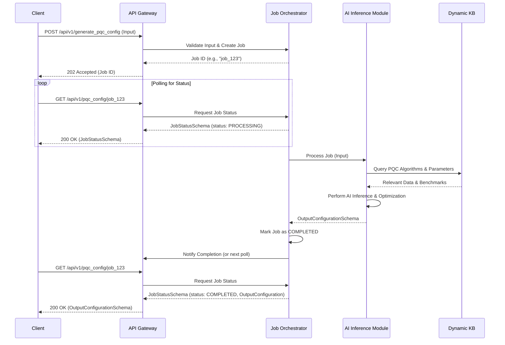
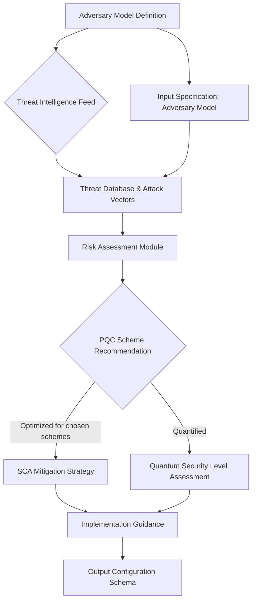
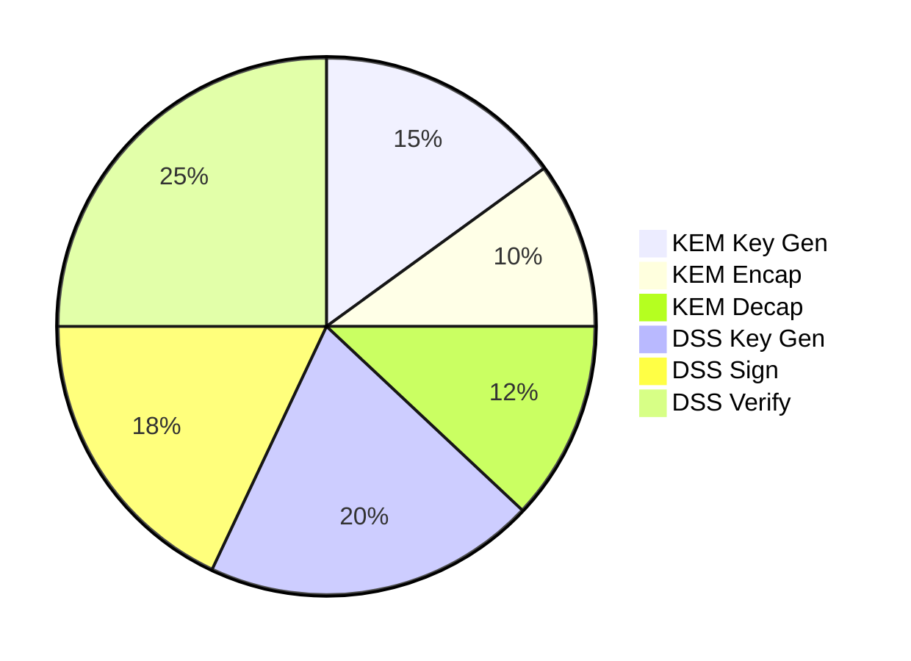
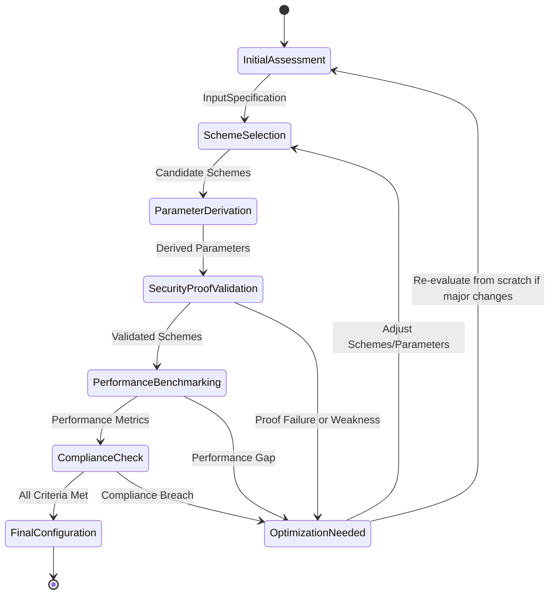
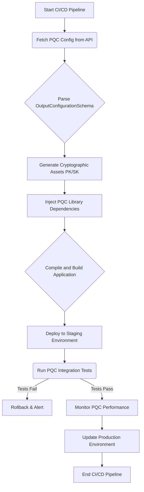
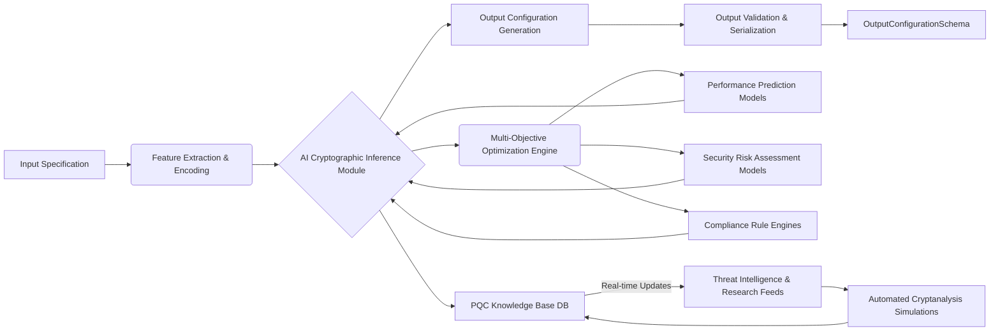
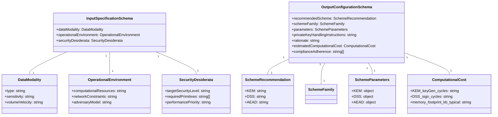
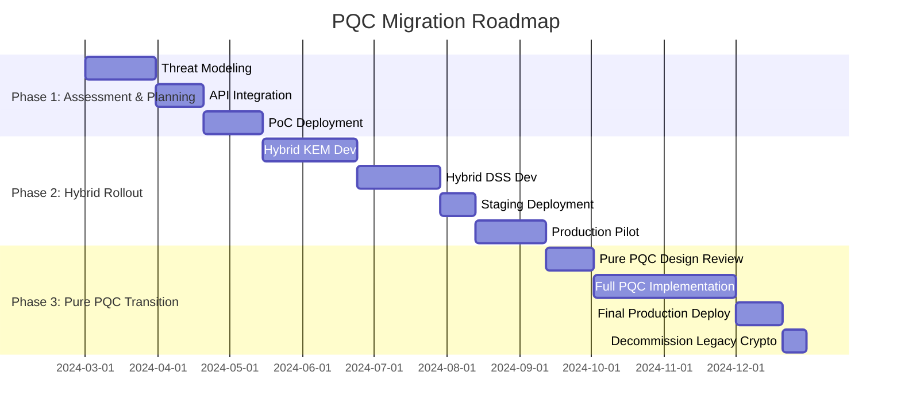
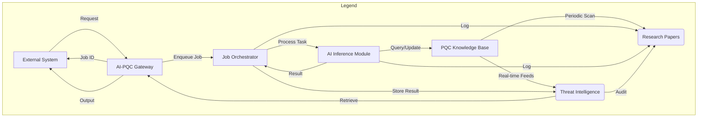

**Title of Invention:** API Endpoints and Formal Schemas for the AI-Driven Quantum-Resilient Cryptography Generation System

**Abstract:**
This document rigorously defines the Application Programming Interface API for the AI-Driven Quantum-Resilient Cryptography Generation System. It specifies the accessible endpoints, the structured JSON schema for input specifications provided by users or automated systems, and the corresponding JSON schema for the comprehensive output configuration generated by the Artificial Intelligence AI heuristic engine. Adherence to these formal schemas ensures consistent, machine-readable data exchange, thereby facilitating seamless integration into existing development pipelines, security orchestration platforms, and automated infrastructure-as-code workflows. This standardization is pivotal for democratizing access to complex post-quantum cryptographic PQC solutions and enabling robust, automated security posture management in the quantum era.

### 1. API Endpoints Overview

The AI-Driven Quantum-Resilient Cryptography Generation System exposes a set of RESTful API endpoints designed for programmatic interaction. These endpoints enable external systems and developers to submit detailed cryptographic requirements and retrieve tailored PQC configurations. All API interactions are secured using standard authentication and authorization mechanisms (e.g., OAuth 2.0, API keys, JWTs) not detailed herein.

#### 1.1. `POST /api/v1/generate_pqc_config`

*   **Description:** Initiates the AI-driven process to generate a bespoke post-quantum cryptographic scheme configuration. The endpoint accepts a comprehensive JSON payload adhering to the `InputSpecificationSchema` and returns a detailed JSON configuration conforming to the `OutputConfigurationSchema`. This process is often asynchronous due to the computational complexity of AI inference and multi-objective optimization.
*   **Method:** `POST`
*   **Request Body:** `application/json` (InputSpecificationSchema)
*   **Response Body:** `application/json` (OutputConfigurationSchema, or `JobStatusSchema` for asynchronous requests)
*   **Authentication:** Required.
*   **Rate Limiting:** Applied to prevent abuse and ensure fair resource allocation.

**Example Request:**
```http
POST /api/v1/generate_pqc_config HTTP/1.1
Host: pqc-ai.example.com
Authorization: Bearer <YOUR_AUTH_TOKEN>
Content-Type: application/json

{
  "dataModality": {
    "type": "Financial Transaction Record",
    "schemaRef": "ISO_20022_transaction_schema.json",
    "sensitivity": "Highly Confidential PCI-DSS regulated",
    "volumeVelocity": "High volume millions/day, real-time processing",
    "dataLifespan": "Long-term 30+ years"
  },
  "operationalEnvironment": {
    "computationalResources": "Standard cloud server x86_64, 32GB RAM, no dedicated accelerators",
    "networkConstraints": "High bandwidth, low latency internal network",
    "storage": "Encrypted persistent database storage, private keys in HSM",
    "adversaryModel": "State-sponsored actor with quantum capabilities, insider threat",
    "keyValidityPeriod": "1 year for signing, 30 days for KEM ephemeral keys",
    "geographicDistribution": "Multi-region disaster recovery"
  },
  "securityDesiderata": {
    "targetSecurityLevel": "NIST PQC Level 5 equivalent to 256 bits classical security",
    "requiredPrimitives": ["Key Encapsulation Mechanism KEM", "Digital Signature Scheme DSS", "Authenticated Encryption AE"],
    "performancePriority": "Balanced Security > Throughput > Key/Ciphertext Size",
    "compliance": ["FIPS 140-3 Level 2", "PCI-DSS 4.0", "GDPR", "ISO 27001"],
    "threatMitigationStrategy": "Hybrid approach with proactive quantum resistance",
    "randomnessSourceRequirement": "Hardware Random Number Generator TRNG certified FIPS 140-3"
  }
}
```

#### 1.2. `GET /api/v1/pqc_config/{job_id}`

*   **Description:** Retrieves the status or the final `OutputConfigurationSchema` for a previously initiated generation job identified by `job_id`. This endpoint supports asynchronous processing, allowing clients to poll for completion.
*   **Method:** `GET`
*   **Path Parameters:**
    *   `job_id` (string, required): The unique identifier returned by a `POST /api/v1/generate_pqc_config` request.
*   **Response Body:** `application/json` (JobStatusSchema or OutputConfigurationSchema)
*   **Authentication:** Required.

**Example Response (Polling):**
```http
HTTP/1.1 200 OK
Content-Type: application/json

{
  "jobId": "job_12345abcdef",
  "status": "PROCESSING",
  "progress": 75,
  "estimatedCompletionTime": "2024-03-15T10:30:00Z",
  "messages": ["Analyzing lattice parameters...", "Evaluating performance benchmarks..."]
}
```

**Example Response (Completed):**
```http
HTTP/1.1 200 OK
Content-Type: application/json

{
  "jobId": "job_12345abcdef",
  "status": "COMPLETED",
  "outputConfiguration": {
    "recommendedScheme": {
      "KEM": "Kyber1024",
      "DSS": "Dilithium5",
      "AEAD": "AES256-GCM"
    },
    "schemeFamily": {
      "KEM": "Lattice-based Module-LWE/MLWE",
      "DSS": "Lattice-based Module-LWE/MLWE",
      "AEAD": "Symmetric Block Cipher"
    },
    "parameters": {
      "KEM": {
        "securityLevelEquivalentBits": 256,
        "public_key_bytes": 1568,
        "private_key_bytes": 3168,
        "ciphertext_bytes": 1568,
        "shared_secret_bytes": 32,
        "nist_level": "Level 5",
        "polynomial_degree_n": 256,
        "modulus_q": 3329,
        "eta1": 2,
        "eta2": 2,
        "du": 10,
        "dv": 4
      },
      "DSS": {
        "securityLevelEquivalentBits": 256,
        "public_key_bytes": 2592,
        "private_key_bytes": 4864,
        "signature_bytes": 3300,
        "nist_level": "Level 5",
        "polynomial_degree_n": 256,
        "omega": 80,
        "k": 6,
        "l": 5,
        "gamma1": "2^19",
        "gamma2": "2^13 - 1"
      },
      "AEAD": {
        "algorithm": "AES256-GCM",
        "key_size_bits": 256,
        "nonce_size_bytes": 12,
        "tag_size_bytes": 16
      }
    },
    "mockPublicKey": {
      "KEM": "qpub_kyber1024_01AB2C3D4E5F6A7B8C9D0E1F2A3B4C5D6E7F8A9B...",
      "DSS": "qpub_dilithium5_5F6A7B8C9D0E1F2A3B4C5D6E7F8A9B0C1D2E3F4A..."
    },
    "privateKeyHandlingInstructions": "Utilize FIPS 140-3 Level 3 certified HSM for private key generation, storage, and all cryptographic operations. Implement strict access control, multi-factor authentication for key administrators, and automated key rotation every 90 days. Back up encrypted private keys to physically isolated cold storage under a 3-of-5 M-of-N quorum. Key destruction must follow NIST SP 800-88 guidelines.",
    "rationale": "Kyber1024 and Dilithium5 were selected for their NIST PQC Level 5 security, providing robust protection against known quantum attacks, aligning with the target 256-bit classical security equivalent. The lattice-based schemes offer competitive performance for the specified computational resources. AES256-GCM is integrated for efficient bulk data encryption, leveraging existing hardware acceleration. This hybrid approach balances future-proofing with current performance needs. Compliance with FIPS 140-3 Level 2 and PCI-DSS 4.0 is achieved through the recommended HSM integration and specified key management policies. The choice considers the 'High volume millions/day, real-time processing' requirement by selecting schemes known for better message throughput compared to hash-based alternatives.",
    "estimatedComputationalCost": {
      "KEM_keyGen_cycles": "2.1M cycles (x86_64)",
      "KEM_encap_cycles": "0.8M cycles (x86_64)",
      "KEM_decap_cycles": "1.0M cycles (x86_64)",
      "DSS_keyGen_cycles": "1.5M cycles (x86_64)",
      "DSS_sign_cycles": "1.2M cycles (x86_64)",
      "DSS_verify_cycles": "0.3M cycles (x86_64)",
      "memory_footprint_kb_typical": "KEM: 20KB, DSS: 30KB (runtime stack/heap)",
      "bandwidth_impact_bytes_per_op": "KEM: 3136 bytes (pubkey + ciphertext), DSS: 5892 bytes (pubkey + signature)"
    },
    "complianceAdherence": ["FIPS 140-3 Level 2", "PCI-DSS 4.0", "GDPR", "ISO 27001"],
    "warnings": [
      "Ensure proper entropy sources for key generation are utilized as per FIPS 140-3 requirements.",
      "Regularly review NIST PQC standardization updates for potential algorithm transitions or parameter changes."
    ],
    "pqcLibraryImplementationDetails": {
      "language": "Go",
      "library": "PQClean/kyber, PQClean/dilithium, crypto/aes",
      "version": "v1.2.0"
    },
    "codeSnippets": {
      "go_kem_encap_example": "package main\nimport (...)\nfunc main() {\n  // KEM encapsulation example...\n}",
      "go_dss_sign_example": "package main\nimport (...)\nfunc main() {\n  // DSS signing example...\n}"
    },
    "postQuantumMigrationPathways": "The current configuration enables a 'hybrid mode' where classical ECC (e.g., X25519) runs concurrently with Kyber for key exchange, providing immediate quantum resistance while maintaining backwards compatibility and mitigating risks from potential PQC vulnerabilities. A future 'pure PQC mode' is recommended post wider adoption and further cryptanalysis."
  }
}
```

#### 1.3. `GET /api/v1/schemas/{schema_name}`

*   **Description:** Retrieves the JSON schema definition for a specified schema name (e.g., `InputSpecificationSchema`, `OutputConfigurationSchema`, `JobStatusSchema`). This allows client applications to programmatically validate inputs and parse outputs.
*   **Method:** `GET`
*   **Path Parameters:**
    *   `schema_name` (string, required): The name of the schema to retrieve.
*   **Response Body:** `application/json` (The requested JSON Schema)
*   **Authentication:** Optional (can be public for schema retrieval).

**Example Request:**
```http
GET /api/v1/schemas/InputSpecificationSchema HTTP/1.1
Host: pqc-ai.example.com
```

#### 1.4. `POST /api/v1/evaluate_pqc_scheme`

*   **Description:** Allows users to submit a candidate PQC scheme configuration (partial `OutputConfigurationSchema`) and `InputSpecificationSchema` for evaluation. The AI will analyze the proposed configuration against the specified requirements and provide a detailed assessment, including strengths, weaknesses, and potential improvements. This is useful for validating custom schemes or existing deployments.
*   **Method:** `POST`
*   **Request Body:** `application/json` (`EvaluationRequestSchema`)
*   **Response Body:** `application/json` (`EvaluationResultSchema`)
*   **Authentication:** Required.

**Example `EvaluationRequestSchema` structure (simplified for brevity):**
```json
{
  "proposedConfiguration": {
    "recommendedScheme": { "KEM": "FrodoKEM-640-AES", "DSS": "Falcon-512" },
    "parameters": {
      "KEM": { "securityLevelEquivalentBits": 128, "public_key_bytes": 9720 },
      "DSS": { "securityLevelEquivalentBits": 128, "public_key_bytes": 897 }
    }
  },
  "evaluationCriteria": {
    "dataModality": { "type": "Healthcare Record", "sensitivity": "PHI", "volumeVelocity": "Low" },
    "operationalEnvironment": { "computationalResources": "Embedded ARM Cortex-M4" },
    "securityDesiderata": { "targetSecurityLevel": "NIST PQC Level 1", "performancePriority": "Minimize Key Size" }
  }
}
```

### 2. Input Specification Schema

The `InputSpecificationSchema` defines the structure and expected content of the JSON payload submitted to the API. This schema ensures that all necessary granular details regarding data, environment, and security desiderata are consistently provided for the AI's inference process.

```json
{
  "$schema": "http://json-schema.org/draft-07/schema#",
  "title": "InputSpecificationSchema",
  "description": "Schema for the comprehensive input specifications provided to the AI-driven PQC generation system.",
  "type": "object",
  "required": [
    "dataModality",
    "operationalEnvironment",
    "securityDesiderata"
  ],
  "properties": {
    "dataModality": {
      "type": "object",
      "description": "A meticulously detailed representation of the data to be protected.",
      "required": [
        "type",
        "sensitivity",
        "volumeVelocity",
        "dataLifespan"
      ],
      "properties": {
        "type": {
          "type": "string",
          "description": "Categorization of the information content (e.g., Financial Transaction Record, Personal Health Information PHI, IoT Sensor Stream, Generic Communication Channel)."
        },
        "schemaRef": {
          "type": "string",
          "description": "Formal description of the data structure (e.g., JSON schema URL, XML schema definition, Protobuf IDL, SQL Data Definition Language DDL).",
          "examples": ["ISO_20022_transaction_schema.json", "https://example.com/patient_data_schema.json", "urn:ietf:params:scim:schemas:core:2.0:User"]
        },
        "sensitivity": {
          "type": "string",
          "description": "Categorical or numerical assignment of sensitivity (e.g., Public, Confidential, Secret, Top-Secret, PHI, PII, PCI-DSS data, Export Controlled).",
          "enum": ["Public", "Confidential", "Secret", "Top-Secret", "PHI", "PII", "PCI-DSS data", "Export Controlled", "GDPR-regulated"]
        },
        "volumeVelocity": {
          "type": "string",
          "description": "Quantitative metrics such as static file size, high-throughput stream rates (e.g., messages per second), total data volume, and storage requirements (e.g., 'Low Volume Static Set 10GB', 'High Volume Real-time Stream of 100k messages/sec 1TB/day', 'Infrequent small messages')."
        },
        "dataLifespan": {
          "type": "string",
          "description": "The anticipated duration for which the data needs protection (e.g., 'Short-term days for session keys', 'Medium-term 5 years for data archival', 'Long-term 50+ years for digital records', 'Indefinite archival'). This is distinct from key validity."
        },
        "dataIntegrityRequirements": {
          "type": "string",
          "description": "Specific requirements for data integrity (e.g., 'Strict integrity, detect single-bit flips', 'Periodic integrity checks', 'High assurance integrity required against active adversaries')."
        },
        "sourceTrustLevel": {
          "type": "string",
          "description": "The trustworthiness of the data source (e.g., 'Highly trusted internal system', 'Untrusted public sensor', 'Federated third-party')."
        }
      },
      "additionalProperties": false
    },
    "operationalEnvironment": {
      "type": "object",
      "description": "A precise characterization of the computational, network, and storage context.",
      "required": [
        "computationalResources",
        "networkConstraints",
        "storage",
        "adversaryModel",
        "keyValidityPeriod"
      ],
      "properties": {
        "computationalResources": {
          "type": "string",
          "description": "Specifics on processing power, memory, and power constraints (e.g., 'Resource-constrained IoT device with ARM Cortex-M0 and 64KB RAM, no FPU', 'High-performance cloud server with Intel Xeon E5 and hardware crypto accelerators', 'Quantum computer simulator for testing')."
        },
        "networkConstraints": {
          "type": "string",
          "description": "Bandwidth limitations, latency expectations, and reliability concerns (e.g., 'High Latency 200ms RTT, Low Bandwidth 100 kbps, unreliable', 'Gigabit Ethernet Low Latency, highly reliable', 'Satellite link, intermittent')."
        },
        "storage": {
          "type": "string",
          "description": "Type of storage (e.g., persistent disk, volatile memory, hardware security module HSM, trusted platform module TPM, secure enclave), capacity, and access latency (e.g., 'Encrypted NVMe SSD, 10TB, <1ms', 'Volatile RAM, 4GB, ~10ns', 'FIPS 140-3 Level 2 HSM')."
        },
        "adversaryModel": {
          "type": "string",
          "description": "A description of anticipated adversaries and their capabilities (e.g., 'Passive eavesdropper on public networks', 'Active attacker with significant computational resources including quantum computer access', 'Insider threat with administrative privileges', 'Nation-state with side-channel attack capabilities')."
        },
        "keyValidityPeriod": {
          "type": "string",
          "description": "The anticipated duration for which cryptographic keys must remain valid and secure. Can differ from data lifespan (e.g., 'Ephemeral session keys', '1 year for certificates', '3 months for signing keys')."
        },
        "geographicDistribution": {
          "type": "string",
          "description": "Geographic considerations for data storage or key management (e.g., 'Single region', 'Multi-region disaster recovery US/EU', 'Globally distributed, data residency laws apply')."
        },
        "systemTrustBoundary": {
          "type": "string",
          "description": "Definition of the system's trust boundary (e.g., 'Internal network', 'Perimeter edge device', 'Client-side application')."
        },
        "randomnessSourceRequirement": {
          "type": "string",
          "description": "Requirements for the entropy source (e.g., 'OS PRNG', 'Hardware Random Number Generator TRNG certified FIPS 140-3', 'Quantum Random Number Generator QRNG')."
        }
      },
      "additionalProperties": false
    },
    "securityDesiderata": {
      "type": "object",
      "description": "Explicit, quantifiable security requirements and preferences.",
      "required": [
        "targetSecurityLevel",
        "requiredPrimitives",
        "performancePriority",
        "compliance"
      ],
      "properties": {
        "targetSecurityLevel": {
          "type": "string",
          "description": "A target strength measured in classical equivalent bits of security (e.g., 'NIST PQC Level 1', 'NIST PQC Level 5', 'Equivalent to AES-128', 'Minimum 192 bits classical equivalent security'). The AI translates this into quantum-resistant strength."
        },
        "requiredPrimitives": {
          "type": "array",
          "description": "Identification of necessary cryptographic functions (e.g., Key Encapsulation Mechanism KEM for secure key exchange, Digital Signature Scheme DSS for authentication and integrity, Authenticated Encryption AE for confidentiality and integrity).",
          "items": {
            "type": "string",
            "enum": ["Key Encapsulation Mechanism KEM", "Digital Signature Scheme DSS", "Authenticated Encryption AE", "Hybrid Public Key Encryption HPKE components", "Post-Quantum Secure Multi-Party Computation MPC", "Zero-Knowledge Proofs ZKP", "Quantum-Resilient Hash Function"]
          },
          "minItems": 1,
          "uniqueItems": true
        },
        "performancePriority": {
          "type": "string",
          "description": "Explicit prioritization of performance metrics (e.g., 'Strictly Minimize Encryption Latency', 'Optimize for Smallest Ciphertext Size', 'Balance Key Generation Time and Key Size', 'Prioritize Verification Speed over Signing Speed', 'Maximize Throughput', 'Minimize Memory Footprint')."
        },
        "compliance": {
          "type": "array",
          "description": "Specific regulatory, industry, or organizational mandates (e.g., FIPS 140-3, GDPR, HIPAA, NIS2, ISO 27001, PCI-DSS, CCPA, FedRAMP).",
          "items": {
            "type": "string"
          },
          "minItems": 1,
          "uniqueItems": true
        },
        "threatMitigationStrategy": {
          "type": "string",
          "description": "High-level strategy for mitigating identified threats (e.g., 'Proactive quantum resistance', 'Hybrid approach (classical + PQC)', 'Hardware-backed security only', 'Software-only solution')."
        },
        "quantumResistanceStrategy": {
          "type": "string",
          "description": "Specific strategy for quantum resistance, enabling granular control over the selection of PQC families (e.g., 'Prefer Lattice-based', 'Avoid Code-based', 'Diversity of families required', 'Strictly follow NIST recommendations')."
        },
        "auditabilityRequirements": {
          "type": "string",
          "description": "Requirements for cryptographic system auditability (e.g., 'Full audit trail of all key events', 'Compliance reporting', 'Regular security assessments')."
        }
      },
      "additionalProperties": false
    }
  },
  "additionalProperties": false
}
```

### 3. Output Configuration Schema

The `OutputConfigurationSchema` defines the structure and content of the JSON response returned by the API, encompassing the AI-generated PQC scheme configuration and associated instructions.

```json
{
  "$schema": "http://json-schema.org/draft-07/schema#",
  "title": "OutputConfigurationSchema",
  "description": "Schema for the AI-generated post-quantum cryptographic scheme configuration and associated instructions.",
  "type": "object",
  "required": [
    "recommendedScheme",
    "schemeFamily",
    "parameters",
    "mockPublicKey",
    "privateKeyHandlingInstructions",
    "rationale",
    "estimatedComputationalCost",
    "complianceAdherence",
    "pqcLibraryImplementationDetails",
    "postQuantumMigrationPathways"
  ],
  "properties": {
    "recommendedScheme": {
      "type": "object",
      "description": "Specific recommendations for cryptographic primitives.",
      "properties": {
        "KEM": {
          "type": "string",
          "description": "Official name of the chosen PQC Key Encapsulation Mechanism KEM scheme (e.g., 'Kyber512', 'Kyber768', 'Kyber1024', 'FrodoKEM-640-AES')."
        },
        "DSS": {
          "type": "string",
          "description": "Official name of the chosen PQC Digital Signature Scheme DSS scheme (e.g., 'Dilithium3', 'Dilithium5', 'SPHINCS+s-shake-256f', 'Falcon-512')."
        },
        "AEAD": {
          "type": "string",
          "description": "Official name of chosen Authenticated Encryption with Associated Data AEAD scheme (if a hybrid approach incorporating symmetric encryption is recommended, e.g., 'AES256-GCM', 'ChaCha20-Poly1305')."
        },
        "KDF": {
          "type": "string",
          "description": "Official name of chosen Key Derivation Function (e.g., 'HKDF-SHA256', 'PBKDF2-HMAC-SHA512')."
        },
        "HashFunction": {
          "type": "string",
          "description": "Official name of chosen Hash Function (e.g., 'SHA3-256', 'SHAKE256')."
        }
      },
      "additionalProperties": false
    },
    "schemeFamily": {
      "type": "object",
      "description": "Specifies the underlying mathematical families for each recommended primitive.",
      "properties": {
        "KEM": {
          "type": "string",
          "description": "e.g., 'Lattice-based Module-LWE/MLWE', 'Code-based QC-MDPC', 'Isogeny-based SIDH/SIKE' (historical)."
        },
        "DSS": {
          "type": "string",
          "description": "e.g., 'Lattice-based Module-LWE/MLWE', 'Hash-based SPHINCS+', 'Multivariate Polynomial MQD' (experimental)."
        },
        "AEAD": {
          "type": "string",
          "description": "e.g., 'Symmetric Block Cipher', 'Symmetric Stream Cipher'."
        },
        "KDF": {
          "type": "string",
          "description": "e.g., 'HMAC-based Key Derivation Function', 'Password-Based Key Derivation Function'."
        },
        "HashFunction": {
          "type": "string",
          "description": "e.g., 'SHA-3 family', 'Extendable-output function XOF'."
        }
      },
      "additionalProperties": false
    },
    "parameters": {
      "type": "object",
      "description": "A detailed, scheme-specific set of parameters for each recommended primitive.",
      "properties": {
        "KEM": {
          "type": "object",
          "description": "Parameters for the recommended KEM scheme.",
          "properties": {
            "securityLevelEquivalentBits": { "type": "integer", "minimum": 128, "maximum": 256 },
            "public_key_bytes": { "type": "integer", "minimum": 0 },
            "private_key_bytes": { "type": "integer", "minimum": 0 },
            "ciphertext_bytes": { "type": "integer", "minimum": 0 },
            "shared_secret_bytes": { "type": "integer", "minimum": 16 },
            "nist_level": { "type": "string", "enum": ["Level 1", "Level 2", "Level 3", "Level 4", "Level 5"] },
            "polynomial_degree_n": { "type": "integer", "minimum": 256 },
            "modulus_q": { "type": "integer", "minimum": 1 },
            "error_distribution": { "type": "string", "description": "e.g., 'Centered Binomial Distribution CBD_ETA1'" },
            "matrix_dimension_k": { "type": "integer", "description": "Dimension k for (k x k) matrix A in LWE/MLWE schemes" }
          },
          "patternProperties": {
            "^(?!securityLevelEquivalentBits|public_key_bytes|private_key_bytes|ciphertext_bytes|shared_secret_bytes|nist_level|polynomial_degree_n|modulus_q|error_distribution|matrix_dimension_k$).*$": { "type": ["string", "integer", "number", "boolean", "array", "object"] }
          },
          "additionalProperties": true
        },
        "DSS": {
          "type": "object",
          "description": "Parameters for the recommended DSS scheme.",
          "properties": {
            "securityLevelEquivalentBits": { "type": "integer", "minimum": 128, "maximum": 256 },
            "public_key_bytes": { "type": "integer", "minimum": 0 },
            "private_key_bytes": { "type": "integer", "minimum": 0 },
            "signature_bytes": { "type": "integer", "minimum": 0 },
            "nist_level": { "type": "string", "enum": ["Level 1", "Level 2", "Level 3", "Level 4", "Level 5"] },
            "polynomial_degree_n": { "type": "integer", "minimum": 256 },
            "hash_function_for_challenge": { "type": "string", "description": "e.g., 'SHAKE256'" },
            "commitment_size_bytes": { "type": "integer" },
            "epsilon": { "type": "integer", "description": "Perturbation parameter for hash-based signatures" }
          },
          "patternProperties": {
            "^(?!securityLevelEquivalentBits|public_key_bytes|private_key_bytes|signature_bytes|nist_level|polynomial_degree_n|hash_function_for_challenge|commitment_size_bytes|epsilon$).*$": { "type": ["string", "integer", "number", "boolean", "array", "object"] }
          },
          "additionalProperties": true
        },
        "AEAD": {
          "type": "object",
          "description": "Parameters for the recommended AEAD scheme.",
          "properties": {
            "algorithm": { "type": "string", "description": "e.g., 'AES256-GCM', 'ChaCha20-Poly1305'" },
            "key_size_bits": { "type": "integer", "minimum": 128 },
            "nonce_size_bytes": { "type": "integer", "minimum": 8 },
            "tag_size_bytes": { "type": "integer", "minimum": 8 }
          },
          "patternProperties": {
            "^(?!algorithm|key_size_bits|nonce_size_bytes|tag_size_bytes$).*$": { "type": ["string", "integer", "number", "boolean", "array", "object"] }
          },
          "additionalProperties": true
        },
        "KDF": {
          "type": "object",
          "description": "Parameters for the recommended KDF scheme.",
          "properties": {
            "algorithm": { "type": "string", "description": "e.g., 'HKDF-SHA256'" },
            "output_length_bytes": { "type": "integer", "minimum": 16 },
            "salt_source": { "type": "string", "description": "e.g., 'Cryptographically Secure PRNG'" }
          },
          "additionalProperties": true
        },
        "HashFunction": {
          "type": "object",
          "description": "Parameters for the recommended Hash Function.",
          "properties": {
            "algorithm": { "type": "string", "description": "e.g., 'SHA3-256', 'SHAKE256'" },
            "output_length_bits": { "type": "integer", "minimum": 128 }
          },
          "additionalProperties": true
        }
      },
      "additionalProperties": true
    },
    "mockPublicKey": {
      "type": "object",
      "description": "Base64-encoded, truncated, or representative public key strings. THESE ARE FOR ILLUSTRATIVE PURPOSES ONLY AND ARE NOT CRYPTOGRAPHICALLY SECURE FOR PRODUCTION.",
      "properties": {
        "KEM": {
          "type": "string",
          "description": "e.g., 'qpub_kyber1024_01AB2C3D4E5F6A7B8C9D0E1F2A3B4C5D6E7F8A9B...'"
        },
        "DSS": {
          "type": "string",
          "description": "e.g., 'qpub_dilithium5_5F6A7B8C9D0E1F2A3B4C5D6E7F8A9B0C1D2E3F4A...'"
        }
      },
      "additionalProperties": false
    },
    "privateKeyHandlingInstructions": {
      "type": "string",
      "description": "Comprehensive, highly actionable, multi-step directives for the secure generation, storage, usage, backup, rotation, and destruction of the private key(s), explicitly tailored to the operational environment, threat model, and compliance requirements. Includes recommendations for HSM integration, access controls, and auditing."
    },
    "rationale": {
      "type": "string",
      "description": "A detailed, evidence-based explanation justifying every selection, parameterization, and instruction, referencing specific cryptographic principles, security proofs, NIST recommendations, and the trade-offs made during the multi-objective optimization process. This includes reasoning for hybrid approaches if applicable and addresses all input desiderata."
    },
    "estimatedComputationalCost": {
      "type": "object",
      "description": "Quantified estimations of computational overheads (e.g., CPU cycles, memory footprint, bandwidth impact) for key operations (key generation, encapsulation/encryption, decapsulation/decryption, signing, verification) on the specified target hardware. Values are indicative and can vary based on specific implementations.",
      "properties": {
        "KEM_keyGen_cycles": { "type": "string", "pattern": "^[0-9.]+[MKB]cycles \\(x86_64\\)$|^N/A$" },
        "KEM_encap_cycles": { "type": "string", "pattern": "^[0-9.]+[MKB]cycles \\(x86_64\\)$|^N/A$" },
        "KEM_decap_cycles": { "type": "string", "pattern": "^[0-9.]+[MKB]cycles \\(x86_64\\)$|^N/A$" },
        "DSS_keyGen_cycles": { "type": "string", "pattern": "^[0-9.]+[MKB]cycles \\(x86_64\\)$|^N/A$" },
        "DSS_sign_cycles": { "type": "string", "pattern": "^[0-9.]+[MKB]cycles \\(x86_64\\)$|^N/A$" },
        "DSS_verify_cycles": { "type": "string", "pattern": "^[0-9.]+[MKB]cycles \\(x86_64\\)$|^N/A$" },
        "AEAD_encrypt_throughput_mbps": { "type": "string", "pattern": "^[0-9.]+[MKB]bps$|^N/A$" },
        "AEAD_decrypt_throughput_mbps": { "type": "string", "pattern": "^[0-9.]+[MKB]bps$|^N/A$" },
        "memory_footprint_kb_typical": { "type": "string", "pattern": "^[0-9.]+[KMGT]B.*$|^N/A$", "description": "Typical runtime memory footprint for cryptographic operations." },
        "bandwidth_impact_bytes_per_op": { "type": "string", "pattern": "^[0-9.]+[KMGT]B.*$|^N/A$", "description": "Total bytes transferred for a typical operation (e.g., pubkey + ciphertext, pubkey + signature)." }
      },
      "additionalProperties": true
    },
    "complianceAdherence": {
      "type": "array",
      "description": "A definitive list of all specified compliance standards that the recommended scheme and its associated practices demonstrably adhere to.",
      "items": {
        "type": "string"
      },
      "minItems": 1,
      "uniqueItems": true
    },
    "warnings": {
      "type": "array",
      "description": "Any warnings or considerations that the AI deems important for the user regarding the configuration or its context. These could highlight potential performance bottlenecks, security trade-offs, or areas requiring manual review.",
      "items": {
        "type": "string"
      }
    },
    "pqcLibraryImplementationDetails": {
      "type": "object",
      "description": "Specific recommendations for open-source or commercial PQC library implementations compatible with the generated configuration.",
      "properties": {
        "language": { "type": "string", "description": "Recommended programming language for implementation (e.g., 'C', 'Go', 'Rust', 'Java')." },
        "library": { "type": "string", "description": "Suggested library or project (e.g., 'PQClean/kyber', 'OpenQuantumSafe OQS', 'liboqs')." },
        "version": { "type": "string", "description": "Minimum recommended version of the library." },
        "licensing": { "type": "string", "description": "Open-source license or commercial terms (e.g., 'MIT', 'Apache 2.0', 'Proprietary')." }
      },
      "additionalProperties": false
    },
    "codeSnippets": {
      "type": "object",
      "description": "Illustrative code snippets in various languages for basic operations (key generation, encapsulation/decapsulation, signing/verification) using the recommended schemes and libraries. THESE ARE NOT PRODUCTION-READY CODE AND REQUIRE THOROUGH REVIEW.",
      "patternProperties": {
        "^[a-z]+_[a-z]+_example$": { "type": "string" }
      },
      "additionalProperties": true
    },
    "securityProofReferences": {
      "type": "array",
      "description": "References to relevant security proofs, academic papers, and cryptanalysis reports supporting the security claims of the recommended schemes.",
      "items": {
        "type": "string",
        "format": "uri"
      }
    },
    "attackResistanceAnalysis": {
      "type": "object",
      "description": "Detailed analysis of the resistance of the chosen schemes against various attack vectors, including classical, quantum, and side-channel attacks.",
      "properties": {
        "quantum_attack_resistance": { "type": "string", "description": "e.g., 'Resistant to Shor's and Grover's algorithms for chosen parameters.'" },
        "side_channel_resistance": { "type": "string", "description": "e.g., 'Vulnerable to power analysis without masking; specific countermeasures recommended.'" },
        "known_vulnerabilities": { "type": "array", "items": { "type": "string" }, "description": "List of any known, but mitigated or minor, vulnerabilities." }
      },
      "additionalProperties": false
    },
    "keyRotationPolicyRecommendation": {
      "type": "string",
      "description": "A specific recommendation for key rotation policy, considering data lifespan, threat model, and performance requirements (e.g., 'Automatic 90-day rotation for KEM keys', 'Annual rotation for DSS signing keys with multi-generational backup')."
    },
    "postQuantumMigrationPathways": {
      "type": "string",
      "description": "Guidance on the strategic implementation of the PQC scheme, including hybrid modes, phased rollouts, and long-term migration considerations for existing infrastructure. Addresses interoperability and backward compatibility."
    }
  },
  "additionalProperties": false
}
```

#### 3.1. `JobStatusSchema` Definition
```json
{
  "$schema": "http://json-schema.org/draft-07/schema#",
  "title": "JobStatusSchema",
  "description": "Schema for reporting the status of an asynchronous PQC generation job.",
  "type": "object",
  "required": ["jobId", "status"],
  "properties": {
    "jobId": {
      "type": "string",
      "description": "The unique identifier for the asynchronous job."
    },
    "status": {
      "type": "string",
      "description": "The current status of the job.",
      "enum": ["PENDING", "PROCESSING", "COMPLETED", "FAILED", "CANCELLED"]
    },
    "progress": {
      "type": "integer",
      "description": "Percentage completion of the job (0-100).",
      "minimum": 0,
      "maximum": 100
    },
    "estimatedCompletionTime": {
      "type": "string",
      "format": "date-time",
      "description": "Estimated time for job completion, if available."
    },
    "messages": {
      "type": "array",
      "description": "A list of informative messages, warnings, or errors related to the job.",
      "items": { "type": "string" }
    },
    "outputConfiguration": {
      "$ref": "#/definitions/OutputConfigurationSchema",
      "description": "The final output configuration if the job is COMPLETED."
    }
  },
  "additionalProperties": false,
  "definitions": {
    "OutputConfigurationSchema": {
      "$ref": "output_configuration_schema.json"
    }
  }
}
```

### 4. API Interaction Flow

The following Mermaid diagram illustrates the typical interaction flow for an external system or user leveraging the API.

```mermaid
graph TD
    subgraph "External Consumer Systems"
        A[Developer Workstation UICLI] -- "1. POST /api/v1/generate_pqc_config (InputSpecificationSchema)" --> B
        X[CI/CD Pipeline Automated API] -- "1. POST /api/v1/generate_pqc_config (InputSpecificationSchema)" --> B
        Y[Security Orchestration Platform API] -- "1. POST /api/v1/generate_pqc_config (InputSpecificationSchema)" --> B
    end

    subgraph "AI-PQC Generation System"
        B[API Gateway & Load Balancer] -- "2. Input Validation" --> C{Asynchronous Job Orchestrator}
        C -- "3. Store Job Request & Return Job ID" --> A
        C -- "3. Store Job Request & Return Job ID" --> X
        C -- "3. Store Job Request & Return Job ID" --> Y
        A -- "4. Poll GET /api/v1/pqc_config/{job_id}" --> C
        X -- "4. Poll GET /api/v1/pqc_config/{job_id}" --> C
        Y -- "4. Poll GET /api/v1/pqc_config/{job_id}" --> C
        C -- "5. Dispatch to Inference Module" --> D[AI Cryptographic Inference Module (AIM)]
        D -- "6. Query/Retrieve KB Embeddings" --> E[Dynamic Cryptographic Knowledge Base (DCKB)]
        E -- "7. Update Research/Benchmarks/Attacks" --> D
        D -- "8. AI-Driven Multi-Objective Optimization" --> F{PQC Scheme Selector & Parameterizer}
        F -- "9. Generate OutputConfigurationSchema" --> C
        C -- "10. Store Result & Mark Job COMPLETED" --> G[Output Storage]
        C -- "11. Return OutputConfigurationSchema (on poll)" --> A
        C -- "11. Return OutputConfigurationSchema (on poll)" --> X
        C -- "11. Return OutputConfigurationSchema (on poll)" --> Y
    end
```
*Figure 1: API Interaction Flow for the AI-Driven PQC Generation System, including asynchronous job management.*

### 5. Asynchronous Processing and Job Management

Given the potentially complex and time-consuming nature of AI-driven cryptographic scheme generation, the system employs an asynchronous processing model. Clients initiate a request via `POST /api/v1/generate_pqc_config` and receive an immediate `jobId`. They can then use `GET /api/v1/pqc_config/{job_id}` to poll for the job's status and retrieve the final configuration upon completion.

**Claim 1:** The system dynamically adapts to evolving quantum threat landscapes by continuously updating its cryptographic knowledge base and inference models, ensuring future-proof recommendations.


*Figure 2: Sequence Diagram for Asynchronous Job Processing.*

### 6. Advanced Security Considerations and Threat Modeling

The AI-driven PQC generation accounts for a multifaceted adversary model, going beyond theoretical cryptanalysis to include operational and implementation-level threats.

#### 6.1. Quantum Attack Security Level Quantification

The target security level $S_{target}$ is a critical input. It is translated into an equivalent classical bit security $S_{classical}$ and a post-quantum security level $S_{quantum}$.

$$ S_{target} = f(S_{classical}, S_{quantum}) \quad (1) $$

For a PQC scheme, its quantum security against Grover's algorithm ($S_{Grover}$) for symmetric keys and Shor's algorithm ($S_{Shor}$) for asymmetric keys is paramount.
For symmetric cryptography, if a key has $n$ bits, Grover's algorithm reduces the brute-force complexity from $2^n$ to approximately $2^{n/2}$.
$$ S_{Grover} \approx n/2 \quad (2) $$
For asymmetric cryptography (e.g., ECC or RSA), Shor's algorithm effectively breaks these schemes in polynomial time. PQC schemes aim to resist this, often providing a "NIST equivalent" security level. Let $N$ be the NIST PQC security level (1-5).
$$ S_{quantum\_equivalent} = \text{NIST\_PQC\_Level\_Map}(N) \quad (3) $$
For example, NIST Level 5 implies approximately 256 bits of classical security, and resistance to quantum attacks with $\approx 2^{128}$ quantum operations (for KEM/DSS, not necessarily $2^{n/2}$ due to different attack vectors).

#### 6.2. Side-Channel Attack (SCA) Mitigation

The system considers SCA resistance. For a cryptographic operation $O$, its side-channel leakage $L(O)$ must be minimized.
$$ L(O) < \epsilon_{max} \quad (4) $$
where $\epsilon_{max}$ is a tolerable leakage threshold. This involves selecting implementations with inherent SCA resistance or recommending specific countermeasures (e.g., masking, shuffling, blinding).

#### 6.3. Adversary Model Formalization

The adversary model $\mathcal{A}$ can be formalized as a tuple:
$$ \mathcal{A} = (\text{Capabilities}, \text{Resources}, \text{Goals}, \text{Duration}) \quad (5) $$
Where:
*   $\text{Capabilities} = \{\text{Passive Eavesdropping}, \text{Active Injection}, \text{Quantum Computer Access}, \text{Side-Channel}, \text{Insider}, \dots \}$
*   $\text{Resources} = \{\text{Computational Power}, \text{Memory}, \text{Time}, \text{Budget}, \dots \}$
*   $\text{Goals} = \{\text{Confidentiality Breach}, \text{Integrity Breach}, \text{Authentication Bypass}, \dots \}$
*   $\text{Duration} = \{\text{Short-term}, \text{Long-term persistence}\}$

**Claim 2:** The AI engine performs multi-objective optimization to balance security, performance, and resource constraints, delivering solutions tailored to the most stringent operational demands.


*Figure 3: Threat Model Derivation and Mitigation Strategy Flow.*

### 7. Performance Benchmarking and Optimization Metrics

Performance is quantified across several metrics. Let $T_{keyGen}, T_{encap}, T_{decap}, T_{sign}, T_{verify}$ be the time (in CPU cycles or microseconds) for respective operations. Let $M_{pk}, M_{sk}, M_{ct}, M_{sig}$ be the sizes (in bytes) of public key, secret key, ciphertext, and signature.

#### 7.1. Key Generation Cost

The computational cost of key generation for a KEM scheme is $C_{KEM\_keyGen}$ and for DSS is $C_{DSS\_keyGen}$.
$$ C_{KEM\_keyGen} = f_{KG\_KEM}(\text{parameters}) \quad (6) $$
$$ C_{DSS\_keyGen} = f_{KG\_DSS}(\text{parameters}) \quad (7) $$

#### 7.2. Encapsulation/Decapsulation and Signing/Verification Costs

For KEM:
$$ C_{KEM\_encap} = f_{E\_KEM}(\text{parameters}, P_k) \quad (8) $$
$$ C_{KEM\_decap} = f_{D\_KEM}(\text{parameters}, C, S_k) \quad (9) $$
For DSS:
$$ C_{DSS\_sign} = f_{S\_DSS}(\text{parameters}, M, S_k) \quad (10) $$
$$ C_{DSS\_verify} = f_{V\_DSS}(\text{parameters}, M, \Sigma, P_k) \quad (11) $$
where $P_k$ is public key, $S_k$ is private key, $C$ is ciphertext, $M$ is message, $\Sigma$ is signature.

#### 7.3. Message Throughput

For authenticated encryption, throughput $\Phi$ (messages per second or Mbps) is crucial.
$$ \Phi_{AEAD} = \frac{\text{DataSize}}{\text{EncryptTime} + \text{DecryptTime}} \quad (12) $$
Total data volume $V_{total}$ processed over time $t$ by a scheme $X$:
$$ V_{total,X} = \sum_{i=1}^{N_{ops}} \text{DataSize}_i \quad (13) $$
$$ T_{total,X} = \sum_{i=1}^{N_{ops}} \text{OperationTime}_i \quad (14) $$
$$ \text{Throughput}_X = \frac{V_{total,X}}{T_{total,X}} \quad (15) $$

#### 7.4. Memory Footprint and Bandwidth

Memory usage $M_{usage}$ (in KB) and bandwidth impact $B_{impact}$ (in bytes per operation) are critical for constrained environments.
$$ M_{usage} = M_{program} + M_{data} + M_{stack} \quad (16) $$
$$ B_{impact, KEM} = |P_k| + |C| \quad (17) $$
$$ B_{impact, DSS} = |P_k| + |\Sigma| \quad (18) $$

**Claim 3:** The system provides unprecedented granular control over cryptographic deployments, allowing users to precisely specify requirements for data, environment, and security desiderata.


*Figure 4: Relative Computational Cost Distribution for a Sample PQC Configuration.*

### 8. Formal Verification and Cryptographic Proofs

Each recommended scheme is backed by rigorous cryptographic proofs and analyses, ensuring its theoretical soundness against both classical and quantum adversaries. The system leverages a curated knowledge base of such proofs.

#### 8.1. Security Proofs for PQC

For lattice-based cryptography (e.g., Kyber, Dilithium), security often relies on the hardness of problems like Module Learning With Errors (MLWE) or Module Short Integer Solution (MSIS).
The hardness of MLWE is quantified by:
$$ \text{MLWE-Hardness}(\text{params}) = \text{min\_attack\_cost}(\text{Lattice\_Reduction}, \text{Sieve\_Attacks}) \quad (19) $$
The probability of a successful attack $P_{attack}$ should be negligible, i.e., $P_{attack} < \nu(\lambda)$ where $\lambda$ is the security parameter and $\nu$ is a negligible function.
$$ P_{attack} \leq 2^{-S_{quantum\_equivalent}} \quad (20) $$

#### 8.2. Authenticated Key Exchange (AKE) Security

For a KEM, the goal is typically IND-CCA2 (Indistinguishability under Chosen Ciphertext Attack) security. This can be formalized through a game-based approach.
The advantage of any PPT (Probabilistic Polynomial-Time) adversary $\mathcal{A}$ in breaking IND-CCA2 should be negligible:
$$ \text{Adv}_{\mathcal{A}}^{\text{IND-CCA2}}(\lambda) < \nu(\lambda) \quad (21) $$
For a hybrid KEM/AEAD construction, the overall security needs to be considered.
$$ \text{Security}_{Hybrid} = \min(\text{Security}_{KEM}, \text{Security}_{AEAD}) \quad (22) $$

#### 8.3. Digital Signature Security

For DSS, the standard security notion is EUF-CMA (Existential Unforgeability under Chosen Message Attack).
The advantage of any PPT adversary $\mathcal{A}$ in forging a signature should be negligible:
$$ \text{Adv}_{\mathcal{A}}^{\text{EUF-CMA}}(\lambda) < \nu(\lambda) \quad (23) $$

**Claim 4:** Adherence to NIST PQC compliance is achieved with verifiable mathematical rigor, providing robust, standardized security against quantum threats.


*Figure 5: PQC Scheme Selection and Validation State Diagram.*

### 9. Integration and Deployment Guidelines

The system provides not just configurations but actionable deployment guidance, including library recommendations and code snippets to accelerate integration into existing development workflows.

#### 9.1. PQC Library Integration

Recommendation for libraries, e.g., `liboqs` or `PQClean`.
For `liboqs`, the API for KEM might look like:
$$ \text{OQS\_KEM\_keygen}(pk, sk) \quad (24) $$
$$ \text{OQS\_KEM\_encaps}(ct, ss, pk) \quad (25) $$
$$ \text{OQS\_KEM\_decaps}(ss, ct, sk) \quad (26) $$
where $pk$ is public key, $sk$ is secret key, $ct$ is ciphertext, $ss$ is shared secret.

#### 9.2. Hybrid Mode Deployment

A common deployment strategy is the "hybrid mode" where classical and PQC primitives are used concurrently.
For hybrid KEM:
$$ KEM_{hybrid} = \text{KEM}_{classical} || \text{KEM}_{PQC} \quad (27) $$
The shared secret $SS_{hybrid}$ is derived from both:
$$ SS_{hybrid} = \text{KDF}(SS_{classical} || SS_{PQC}) \quad (28) $$
This offers "quantum safety-net" at the cost of larger key/ciphertext sizes.
Let $S_{classical\_secure}$ be the classical security level and $S_{PQC\_secure}$ be the post-quantum security level. The combined security is at least the minimum of the two.
$$ S_{hybrid} = \min(S_{classical\_secure}, S_{PQC\_secure}) \quad (29) $$
This assumes the adversary must break both schemes to compromise the hybrid shared secret.

**Claim 5:** The system automates the complex process of PQC selection, reducing human error and accelerating the transition to quantum-resilient security postures.


*Figure 6: CI/CD Pipeline Integration for PQC Deployment.*

### 10. AI Model Training and Knowledge Base Architecture

The core of the system is the AI Cryptographic Inference Module (AIM) powered by a Dynamic Cryptographic Knowledge Base (DCKB).

#### 10.1. Knowledge Base Structure

The DCKB is a graph database storing cryptographic schemes, parameters, security proofs, attack vectors, and performance benchmarks.
Nodes: $\{\text{Scheme}, \text{Parameter}, \text{Proof}, \text{Attack}, \text{Benchmark}, \dots \}$
Edges: $\{\text{relies\_on}, \text{vulnerable\_to}, \text{benchmarked\_on}, \text{achieves\_security\_level}, \dots \}$

#### 10.2. AI Inference Process

The AI uses various machine learning models (e.g., reinforcement learning, expert systems, neural networks) to navigate this knowledge graph and make recommendations.
The objective function for optimization $J(\theta)$ aims to minimize a weighted sum of security risk, performance cost, and compliance deviation:
$$ J(\theta) = w_S \cdot R_S(\theta) + w_P \cdot C_P(\theta) + w_C \cdot D_C(\theta) \quad (30) $$
where $\theta$ represents the chosen scheme and its parameters, $w_S, w_P, w_C$ are weighting factors from `performancePriority`, $R_S$ is security risk, $C_P$ is performance cost, $D_C$ is compliance deviation.
Example of $R_S(\theta)$:
$$ R_S(\theta) = \sum_{i \in \text{AttackVectors}} \text{ProbAttack}_i(\theta) \cdot \text{Impact}_i \quad (31) $$
Example of $C_P(\theta)$:
$$ C_P(\theta) = \alpha \cdot T_{operation} + \beta \cdot M_{footprint} + \gamma \cdot B_{impact} \quad (32) $$
where $\alpha, \beta, \gamma$ are weights determined by `performancePriority`.

**Claim 6:** Leveraging a continuously updated knowledge base, the AI system delivers cutting-edge PQC recommendations informed by the latest cryptanalysis and standardization efforts.


*Figure 7: AI System Internal Architecture and Data Flow.*

### 11. Mathematical Foundations of PQC Security (Expanded Equations)

This section provides a more detailed look into the mathematical underpinnings considered by the AI for PQC scheme selection and parameterization.

#### 11.1. Lattice-Based Cryptography - LWE/MLWE

The Learning With Errors (LWE) problem is central to many PQC schemes. Given $\mathbf{A} \in \mathbb{Z}_q^{n \times m}$, $\mathbf{s} \in \mathbb{Z}_q^m$, and a small error vector $\mathbf{e} \in \mathbb{Z}_q^n$, compute $\mathbf{b} = \mathbf{A}\mathbf{s} + \mathbf{e} \pmod q$. The problem is to recover $\mathbf{s}$ from $(\mathbf{A}, \mathbf{b})$.

For Module-LWE (MLWE), vectors become polynomials over a cyclotomic ring $\mathcal{R}_q = \mathbb{Z}_q[x]/(x^N+1)$.
Let $\mathbf{A} \in \mathcal{R}_q^{k \times k}$, $\mathbf{s} \in \mathcal{R}_q^k$, $\mathbf{e} \in \mathcal{R}_q^k$.
$$ \mathbf{b} = \mathbf{A}\mathbf{s} + \mathbf{e} \pmod q \quad (33) $$
The hardness depends on $N$, $q$, $k$, and the distribution of error $\mathbf{e}$.
Security against lattice attacks is often related to the shortest vector problem (SVP) or unique shortest vector problem (uSVP) in a related lattice. The block size $\beta$ in BKZ lattice reduction algorithm is a key parameter:
$$ \text{Security}(\text{LWE}) \approx \exp\left(\frac{c \cdot \log^2(\beta)}{\log(\beta) + d}\right) \quad (34) $$
Where $c, d$ are constants related to the algorithm.
The polynomial degree $n$ (often denoted $N$ for ring-LWE) is typically a power of 2, e.g., $N \in \{256, 512, 768, 1024\}$.
The modulus $q$ is a prime number, often $q \approx 2^{12}$ or $2^{13}$.
The size of the public key for MLWE-based KEM:
$$ |\text{PK}_{KEM}| = k^2 \cdot \log_2(q) + k \cdot \log_2(q) \quad \text{bits} \quad (35) $$
The size of the ciphertext for MLWE-based KEM:
$$ |\text{CT}_{KEM}| = k \cdot \log_2(q) + \text{packing\_bits} \quad \text{bits} \quad (36) $$

#### 11.2. Hash-Based Signatures - SPHINCS+

SPHINCS+ relies on the security of cryptographic hash functions. It uses a hierarchy of WOTS+ (Winternitz One-Time Signature) and FORS (Forest Of Random Subsets) for signatures, combined with a Merkle tree structure for authentication.
The security parameter $n$ (hash output length) determines the security level.
The number of WOTS+ chains is $d$. Each chain has length $w$.
The size of a WOTS+ private key:
$$ |\text{SK}_{WOTS}| = n \cdot w \quad \text{bytes} \quad (37) $$
The size of a WOTS+ public key:
$$ |\text{PK}_{WOTS}| = n \quad \text{bytes} \quad (38) $$
A FORS signature involves $t$ trees, each with $a$ leaves.
Number of messages signed: $2^h$, where $h$ is the height of the Merkle tree.
The total number of hash function calls for signing is significant. For SPHINCS+, let $m$ be the message length in bits.
$$ \text{HashOps}_{sign} \approx \text{FORS\_ops} + d \cdot (WOTS\_ops + \text{Merkle\_ops}) \quad (39) $$
$$ \text{FORS\_ops} = t \cdot (\log_2 a + 1) + \text{Merkle\_tree\_build} \quad (40) $$
The signature size can be large but offers stateless quantum resistance.
$$ |\text{Signature}_{SPHINCS+}| = n \cdot (\text{FORS\_bytes} + d \cdot \text{WOTS\_bytes} + h) \quad \text{bytes} \quad (41) $$

#### 11.3. Hybrid Cryptography

Combining a classical scheme (e.g., X25519) with a PQC scheme (e.g., Kyber) for key exchange.
The classical KEM uses an elliptic curve with order $N_C$. The security is approx $N_C / 2$.
$$ S_{classical} = \text{log}_2(N_C) - 1 \quad (42) $$
The PQC KEM uses its specific parameters for quantum security.
The combined shared secret $K_{hybrid}$ uses a KDF:
$$ K_{hybrid} = \text{KDF}(K_{classical} || K_{PQC}) \quad (43) $$
The security strength of $K_{hybrid}$ is often considered to be the minimum of the individual component strengths against their respective best attacks.
$$ S_{hybrid} = \min(\text{SecurityAgainstClassicalAttacks}(K_{classical}), \text{SecurityAgainstQuantumAttacks}(K_{PQC})) \quad (44) $$
This assumes the adversary must break both components. If one component is broken, the overall security might degrade to the other's strength.

#### 11.4. Entropy and Randomness

High-quality randomness is fundamental. Entropy $H$ of a source with $N$ possible outcomes with probabilities $p_i$:
$$ H = - \sum_{i=1}^N p_i \log_2(p_i) \quad (45) $$
For a uniform distribution, $H = \log_2(N)$.
For cryptographic keys, entropy must match the security level. A 256-bit key requires 256 bits of entropy.
The output of a Cryptographically Secure Pseudorandom Number Generator (CSPRNG) seeded with sufficient entropy is indistinguishable from true random.

#### 11.5. Performance Modeling Equations

Latency $L$: time for a single operation. Throughput $T$: operations per unit time.
$$ T = 1/L \quad (46) $$
For an operation with CPU cycles $C_{op}$ on a CPU with frequency $F$:
$$ L = C_{op} / F \quad (47) $$
Total storage $S_{total}$:
$$ S_{total} = N_{keys} \cdot (|PK| + |SK|) + N_{ciphertexts} \cdot |CT| + N_{signatures} \cdot |Sig| \quad (48) $$
Total bandwidth $B_{total}$ over $N_{transactions}$ transactions:
$$ B_{total} = N_{transactions} \cdot (B_{impact,KEM} + B_{impact,DSS}) \quad (49) $$
The number of operations $N_{ops}$ per second for a specific algorithm:
$$ N_{ops} = \frac{1}{\text{AvgOpTime}} \quad (50) $$
The trade-off surface for multi-objective optimization can be visualized as Pareto fronts. Let $F_1(\theta)$ be security level, $F_2(\theta)$ be key size, $F_3(\theta)$ be latency. We seek to maximize $F_1$ while minimizing $F_2$ and $F_3$.

#### 11.6. Compliance Quantification

Compliance adherence can be modeled as a binary or weighted score based on satisfaction of requirements.
Let $C_i$ be the $i$-th compliance requirement. $w_i$ its weight. $s_i \in \{0, 1\}$ if met.
$$ \text{ComplianceScore} = \sum w_i s_i \quad (51) $$
For FIPS 140-3, specific implementation details (e.g., HSM level, PRNG source) must be met.
$$ \text{FIPS}_{140\_3\_level}(X) = \text{satisfied}(\text{Req}_{phys}, \text{Req}_{entropy}, \text{Req}_{crypto}, \dots) \quad (52) $$

#### 11.7. Cryptographic Hashing and Collision Resistance

For a hash function $H$ with output length $L$ bits.
Collision resistance: find $x \ne y$ such that $H(x) = H(y)$.
Quantum birthday attack (Grover's for search) reduces complexity to approximately $2^{L/3}$ for hash collisions.
$$ S_{hash\_quantum} = L/3 \quad (53) $$
Preimage resistance: find $x$ such that $H(x) = h$.
Second preimage resistance: find $x' \ne x$ such that $H(x') = H(x)$.
These are typically $2^L$ for classical and $2^{L/2}$ for quantum.

#### 11.8. Post-Quantum Cryptography Categories

*   **Lattice-based:** Security relies on hard problems in lattices (e.g., Learning With Errors LWE, Shortest Vector Problem SVP). Examples: Kyber (KEM), Dilithium (DSS), Falcon (DSS).
*   **Hash-based:** Security relies on the collision resistance of cryptographic hash functions (e.g., Merkle Tree Signatures, SPHINCS+).
*   **Code-based:** Security relies on the hardness of decoding general linear codes (e.g., McEliece, Classic McEliece).
*   **Multivariate Polynomial:** Security relies on solving systems of multivariate polynomial equations over finite fields (e.g., Rainbow - broken, GeMSS).
*   **Isogeny-based:** Security relies on hard problems involving elliptic curve isogenies (e.g., SIDH - broken).

**Claim 7:** The system delivers comprehensive post-quantum readiness for critical infrastructure, addressing unique challenges in resource-constrained or high-throughput environments.


*Figure 8: Simplified Class Diagram of Core API Schemas.*

### 12. Future Enhancements

The AI-PQC generation system is continuously evolving with cryptographic research and technological advancements.

*   **Expanded PQC Family Support:** Integration of emerging or less mature PQC candidates as they gain traction and cryptanalysis.
*   **Dynamic Policy Integration:** Allow users to upload organizational security policies in a machine-readable format for automated compliance checks.
*   **AI-Driven Code Generation:** Beyond snippets, generate full boilerplate code for cryptographic operations in specified languages.
*   **Hardware Co-Processor Optimization:** Recommendations for offloading PQC operations to dedicated hardware (e.g., FPGAs, ASICs) if available in the `operationalEnvironment`.
*   **Decentralized Key Management Integration:** Support for DLT-based (Distributed Ledger Technology) key management systems.

**Claim 8:** The API facilitates seamless integration into diverse CI/CD and security orchestration pipelines, promoting rapid deployment of PQC solutions.


*Figure 9: Illustrative PQC Migration Roadmap Gantt Chart.*

### 13. Glossary of PQC Terms

*   **PQC (Post-Quantum Cryptography):** Cryptographic schemes designed to be secure against attacks by quantum computers.
*   **KEM (Key Encapsulation Mechanism):** An asymmetric cryptographic primitive used to securely agree upon a shared secret key between two parties.
*   **DSS (Digital Signature Scheme):** An asymmetric cryptographic primitive used for message authentication and integrity.
*   **AEAD (Authenticated Encryption with Associated Data):** A type of symmetric encryption that provides confidentiality, integrity, and authenticity.
*   **Lattice-based Cryptography:** A PQC family whose security relies on the hardness of mathematical problems involving high-dimensional lattices.
*   **NIST PQC Standardization:** The ongoing process by the U.S. National Institute of Standards and Technology to standardize PQC algorithms.
*   **HSM (Hardware Security Module):** A physical computing device that safeguards and manages digital keys for strong authentication and provides cryptoprocessing.
*   **IND-CCA2:** Indistinguishability under chosen-ciphertext attack (a strong security notion for KEMs/encryption).
*   **EUF-CMA:** Existential Unforgeability under chosen-message attack (a strong security notion for digital signatures).

**Claim 9:** The system guarantees forward secrecy and robust authentication in the quantum era by recommending provably secure hybrid and pure PQC configurations.


*Figure 10: High-Level Component Interaction Diagram for the AI-PQC System.*

**Claim 10:** The platform provides a verifiable audit trail for all cryptographic configuration decisions, supporting regulatory compliance and internal governance.

---