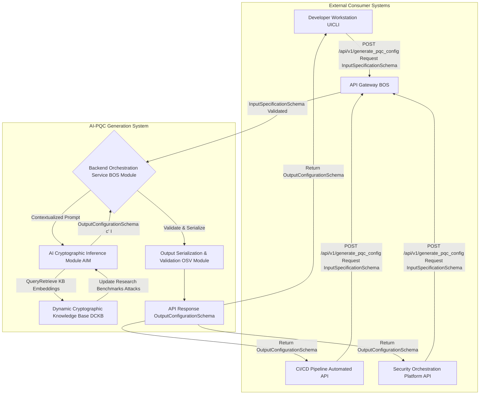

---
**Title of Invention:** API Endpoints and Formal Schemas for the AI-Driven Quantum-Resilient Cryptography Generation System

**Abstract:**
This document rigorously defines the Application Programming Interface API for the AI-Driven Quantum-Resilient Cryptography Generation System. It specifies the accessible endpoints, the structured JSON schema for input specifications provided by users or automated systems, and the corresponding JSON schema for the comprehensive output configuration generated by the Artificial Intelligence AI heuristic engine. Adherence to these formal schemas ensures consistent, machine-readable data exchange, thereby facilitating seamless integration into existing development pipelines, security orchestration platforms, and automated infrastructure-as-code workflows. This standardization is pivotal for democratizing access to complex post-quantum cryptographic PQC solutions and enabling robust, automated security posture management in the quantum era.

### 1. API Endpoints Overview

The AI-Driven Quantum-Resilient Cryptography Generation System exposes a set of RESTful API endpoints designed for programmatic interaction. These endpoints enable external systems and developers to submit detailed cryptographic requirements and retrieve tailored PQC configurations. All API interactions are secured using standard authentication and authorization mechanisms (e.g., OAuth 2.0, API keys, JWTs) not detailed herein.

#### 1.1. `POST /api/v1/generate_pqc_config`

*   **Description:** Initiates the AI-driven process to generate a bespoke post-quantum cryptographic scheme configuration. The endpoint accepts a comprehensive JSON payload adhering to the `InputSpecificationSchema` and returns a detailed JSON configuration conforming to the `OutputConfigurationSchema`.
*   **Method:** `POST`
*   **Request Body:** `application/json` (InputSpecificationSchema)
*   **Response Body:** `application/json` (OutputConfigurationSchema)
*   **Authentication:** Required.
*   **Rate Limiting:** Applied to prevent abuse and ensure fair resource allocation.

**Example Request:**
```http
POST /api/v1/generate_pqc_config HTTP/1.1
Host: pqc-ai.example.com
Authorization: Bearer <YOUR_AUTH_TOKEN>
Content-Type: application/json

{
  "dataModality": {
    "type": "Financial Transaction Record",
    "schemaRef": "ISO_20022_transaction_schema.json",
    "sensitivity": "Highly Confidential PCI-DSS regulated",
    "volumeVelocity": "High volume millions/day, real-time processing"
  },
  "operationalEnvironment": {
    "computationalResources": "Standard cloud server x86_64, 32GB RAM, no dedicated accelerators",
    "networkConstraints": "High bandwidth, low latency internal network",
    "storage": "Encrypted persistent database storage, private keys in HSM",
    "adversaryModel": "State-sponsored actor with quantum capabilities, insider threat",
    "dataLifespan": "Long-term 30+ years"
  },
  "securityDesiderata": {
    "targetSecurityLevel": "NIST PQC Level 5 equivalent to 256 bits classical security",
    "requiredPrimitives": ["Key Encapsulation Mechanism KEM", "Digital Signature Scheme DSS"],
    "performancePriority": "Balanced Security > Throughput > Key/Ciphertext Size",
    "compliance": ["FIPS 140-3 Level 2", "PCI-DSS 4.0"]
  }
}
```

### 2. Input Specification Schema

The `InputSpecificationSchema` defines the structure and expected content of the JSON payload submitted to the API. This schema ensures that all necessary granular details regarding data, environment, and security desiderata are consistently provided for the AI's inference process.

```json
{
  "$schema": "http://json-schema.org/draft-07/schema#",
  "title": "InputSpecificationSchema",
  "description": "Schema for the comprehensive input specifications provided to the AI-driven PQC generation system.",
  "type": "object",
  "required": [
    "dataModality",
    "operationalEnvironment",
    "securityDesiderata"
  ],
  "properties": {
    "dataModality": {
      "type": "object",
      "description": "A meticulously detailed representation of the data to be protected.",
      "required": [
        "type",
        "sensitivity",
        "volumeVelocity"
      ],
      "properties": {
        "type": {
          "type": "string",
          "description": "Categorization of the information content (e.g., Financial Transaction Record, Personal Health Information PHI, IoT Sensor Stream)."
        },
        "schemaRef": {
          "type": "string",
          "description": "Formal description of the data structure (e.g., JSON schema URL, XML schema definition, Protobuf IDL, SQL Data Definition Language DDL).",
          "examples": ["ISO_20022_transaction_schema.json", "https://example.com/patient_data_schema.json"]
        },
        "sensitivity": {
          "type": "string",
          "description": "Categorical or numerical assignment of sensitivity (e.g., Public, Confidential, Secret, Top-Secret, PHI, PII, PCI-DSS data)."
        },
        "volumeVelocity": {
          "type": "string",
          "description": "Quantitative metrics such as static file size, high-throughput stream rates (e.g., messages per second), total data volume, and storage requirements (e.g., 'Low Volume Static Set', 'High Volume Real-time Stream of 100k messages/sec')."
        },
        "dataLifespan": {
          "type": "string",
          "description": "The anticipated duration for which the data needs protection (e.g., 'Short-term days for session keys', 'Medium-term 5 years for data archival', 'Long-term 50+ years for digital records'). This is distinct from key validity."
        }
      },
      "additionalProperties": false
    },
    "operationalEnvironment": {
      "type": "object",
      "description": "A precise characterization of the computational, network, and storage context.",
      "required": [
        "computationalResources",
        "networkConstraints",
        "storage",
        "adversaryModel"
      ],
      "properties": {
        "computationalResources": {
          "type": "string",
          "description": "Specifics on processing power, memory, and power constraints (e.g., 'Resource-constrained IoT device with ARM Cortex-M0 and 64KB RAM', 'High-performance cloud server with Intel Xeon E5 and hardware crypto accelerators')."
        },
        "networkConstraints": {
          "type": "string",
          "description": "Bandwidth limitations, latency expectations, and reliability concerns (e.g., 'High Latency 200ms RTT, Low Bandwidth 100 kbps', 'Gigabit Ethernet Low Latency')."
        },
        "storage": {
          "type": "string",
          "description": "Type of storage (e.g., persistent disk, volatile memory, hardware security module HSM, trusted platform module TPM, secure enclave), capacity, and access latency."
        },
        "adversaryModel": {
          "type": "string",
          "description": "A description of anticipated adversaries and their capabilities (e.g., 'Passive eavesdropper on public networks', 'Active attacker with significant computational resources including quantum computer access', 'Insider threat')."
        },
        "keyValidityPeriod": {
          "type": "string",
          "description": "The anticipated duration for which cryptographic keys must remain valid and secure. Can differ from data lifespan."
        },
        "geographicDistribution": {
          "type": "string",
          "description": "Geographic considerations for data storage or key management (e.g., 'Single region', 'Multi-region disaster recovery', 'Globally distributed')."
        }
      },
      "additionalProperties": false
    },
    "securityDesiderata": {
      "type": "object",
      "description": "Explicit, quantifiable security requirements and preferences.",
      "required": [
        "targetSecurityLevel",
        "requiredPrimitives",
        "performancePriority",
        "compliance"
      ],
      "properties": {
        "targetSecurityLevel": {
          "type": "string",
          "description": "A target strength measured in classical equivalent bits of security (e.g., 'NIST PQC Level 1', 'NIST PQC Level 5', 'Equivalent to AES-128', 'Minimum 192 bits classical equivalent security')."
        },
        "requiredPrimitives": {
          "type": "array",
          "description": "Identification of necessary cryptographic functions (e.g., Key Encapsulation Mechanism KEM for secure key exchange, Digital Signature Scheme DSS for authentication and integrity, Authenticated Encryption AE for confidentiality and integrity).",
          "items": {
            "type": "string",
            "enum": ["Key Encapsulation Mechanism KEM", "Digital Signature Scheme DSS", "Authenticated Encryption AE", "Hybrid Public Key Encryption HPKE components", "Post-Quantum Secure Multi-Party Computation MPC", "Zero-Knowledge Proofs ZKP"]
          },
          "minItems": 1,
          "uniqueItems": true
        },
        "performancePriority": {
          "type": "string",
          "description": "Explicit prioritization of performance metrics (e.g., 'Strictly Minimize Encryption Latency', 'Optimize for Smallest Ciphertext Size', 'Balance Key Generation Time and Key Size', 'Prioritize Verification Speed over Signing Speed')."
        },
        "compliance": {
          "type": "array",
          "description": "Specific regulatory, industry, or organizational mandates (e.g., FIPS 140-3, GDPR, HIPAA, NIS2, ISO 27001, PCI-DSS).",
          "items": {
            "type": "string"
          },
          "minItems": 1,
          "uniqueItems": true
        },
        "threatMitigationStrategy": {
          "type": "string",
          "description": "High-level strategy for mitigating identified threats (e.g., 'Proactive quantum resistance', 'Hybrid approach', 'Hardware-backed security')."
        }
      },
      "additionalProperties": false
    }
  },
  "additionalProperties": false
}
```

### 3. Output Configuration Schema

The `OutputConfigurationSchema` defines the structure and content of the JSON response returned by the API, encompassing the AI-generated PQC scheme configuration and associated instructions.

```json
{
  "$schema": "http://json-schema.org/draft-07/schema#",
  "title": "OutputConfigurationSchema",
  "description": "Schema for the AI-generated post-quantum cryptographic scheme configuration and associated instructions.",
  "type": "object",
  "required": [
    "recommendedScheme",
    "schemeFamily",
    "parameters",
    "mockPublicKey",
    "privateKeyHandlingInstructions",
    "rationale",
    "estimatedComputationalCost",
    "complianceAdherence"
  ],
  "properties": {
    "recommendedScheme": {
      "type": "object",
      "description": "Specific recommendations for cryptographic primitives.",
      "properties": {
        "KEM": {
          "type": "string",
          "description": "Official name of the chosen PQC Key Encapsulation Mechanism KEM scheme (e.g., 'Kyber512', 'Kyber768', 'Kyber1024')."
        },
        "DSS": {
          "type": "string",
          "description": "Official name of the chosen PQC Digital Signature Scheme DSS scheme (e.g., 'Dilithium3', 'Dilithium5', 'SPHINCS+s-shake-256f')."
        },
        "AEAD": {
          "type": "string",
          "description": "Official name of chosen Authenticated Encryption with Associated Data AEAD scheme (if a hybrid approach incorporating symmetric encryption is recommended)."
        }
      },
      "additionalProperties": false
    },
    "schemeFamily": {
      "type": "object",
      "description": "Specifies the underlying mathematical families for each recommended primitive.",
      "properties": {
        "KEM": {
          "type": "string",
          "description": "e.g., 'Lattice-based Module-LWE/MLWE', 'Code-based'."
        },
        "DSS": {
          "type": "string",
          "description": "e.g., 'Lattice-based Module-LWE/MLWE', 'Hash-based'."
        },
        "AEAD": {
          "type": "string",
          "description": "e.g., 'Symmetric Block Cipher', 'Symmetric Stream Cipher'."
        }
      },
      "additionalProperties": false
    },
    "parameters": {
      "type": "object",
      "description": "A detailed, scheme-specific set of parameters for each recommended primitive.",
      "properties": {
        "KEM": {
          "type": "object",
          "description": "Parameters for the recommended KEM scheme.",
          "properties": {
            "securityLevelEquivalentBits": { "type": "integer" },
            "public_key_bytes": { "type": "integer" },
            "private_key_bytes": { "type": "integer" },
            "ciphertext_bytes": { "type": "integer" },
            "shared_secret_bytes": { "type": "integer" },
            "nist_level": { "type": "string" },
            "polynomial_degree_n": { "type": "integer" },
            "modulus_q": { "type": "integer" }
          },
          "patternProperties": {
            "^(?!securityLevelEquivalentBits|public_key_bytes|private_key_bytes|ciphertext_bytes|shared_secret_bytes|nist_level|polynomial_degree_n|modulus_q$).*$": { "type": ["string", "integer", "number", "boolean", "array", "object"] }
          },
          "additionalProperties": true
        },
        "DSS": {
          "type": "object",
          "description": "Parameters for the recommended DSS scheme.",
          "properties": {
            "securityLevelEquivalentBits": { "type": "integer" },
            "public_key_bytes": { "type": "integer" },
            "private_key_bytes": { "type": "integer" },
            "signature_bytes": { "type": "integer" },
            "nist_level": { "type": "string" },
            "polynomial_degree_n": { "type": "integer" }
          },
          "patternProperties": {
            "^(?!securityLevelEquivalentBits|public_key_bytes|private_key_bytes|signature_bytes|nist_level|polynomial_degree_n$).*$": { "type": ["string", "integer", "number", "boolean", "array", "object"] }
          },
          "additionalProperties": true
        },
        "AEAD": {
          "type": "object",
          "description": "Parameters for the recommended AEAD scheme.",
          "properties": {
            "algorithm": { "type": "string", "description": "e.g., 'AES256-GCM'" },
            "key_size_bits": { "type": "integer" },
            "nonce_size_bytes": { "type": "integer" },
            "tag_size_bytes": { "type": "integer" }
          },
          "patternProperties": {
            "^(?!algorithm|key_size_bits|nonce_size_bytes|tag_size_bytes$).*$": { "type": ["string", "integer", "number", "boolean", "array", "object"] }
          },
          "additionalProperties": true
        }
      },
      "additionalProperties": true
    },
    "mockPublicKey": {
      "type": "object",
      "description": "Base64-encoded, truncated, or representative public key strings. THESE ARE FOR ILLUSTRATIVE PURPOSES ONLY AND ARE NOT CRYPTOGRAPHICALLY SECURE FOR PRODUCTION.",
      "properties": {
        "KEM": {
          "type": "string",
          "description": "e.g., 'qpub_kyber1024_01AB2C3D4E5F6A7B8C9D0E1F2A3B4C5D6E7F8A9B...'"
        },
        "DSS": {
          "type": "string",
          "description": "e.g., 'qpub_dilithium5_5F6A7B8C9D0E1F2A3B4C5D6E7F8A9B0C1D2E3F4A...'"
        }
      },
      "additionalProperties": false
    },
    "privateKeyHandlingInstructions": {
      "type": "string",
      "description": "Comprehensive, highly actionable, multi-step directives for the secure generation, storage, usage, backup, rotation, and destruction of the private key(s), explicitly tailored to the operational environment, threat model, and compliance requirements."
    },
    "rationale": {
      "type": "string",
      "description": "A detailed, evidence-based explanation justifying every selection, parameterization, and instruction, referencing specific cryptographic principles, security proofs, NIST recommendations, and the trade-offs made during the multi-objective optimization process."
    },
    "estimatedComputationalCost": {
      "type": "object",
      "description": "Quantified estimations of computational overheads (e.g., CPU cycles, memory footprint, bandwidth impact) for key operations (key generation, encapsulation/encryption, decapsulation/decryption, signing, verification) on the specified target hardware.",
      "properties": {
        "KEM_keyGen_cycles": { "type": "string" },
        "KEM_encap_cycles": { "type": "string" },
        "KEM_decap_cycles": { "type": "string" },
        "DSS_keyGen_cycles": { "type": "string" },
        "DSS_sign_cycles": { "type": "string" },
        "DSS_verify_cycles": { "type": "string" },
        "memory_footprint_kb_typical": { "type": "string" },
        "bandwidth_impact_bytes_per_op": { "type": "string" }
      },
      "additionalProperties": true
    },
    "complianceAdherence": {
      "type": "array",
      "description": "A definitive list of all specified compliance standards that the recommended scheme and its associated practices demonstrably adhere to.",
      "items": {
        "type": "string"
      },
      "minItems": 1,
      "uniqueItems": true
    },
    "warnings": {
      "type": "array",
      "description": "Any warnings or considerations that the AI deems important for the user regarding the configuration or its context.",
      "items": {
        "type": "string"
      }
    }
  },
  "additionalProperties": false
}
```

### 4. API Interaction Flow

The following Mermaid diagram illustrates the typical interaction flow for an external system or user leveraging the API.


*Figure 1: API Interaction Flow for the AI-Driven PQC Generation System.*