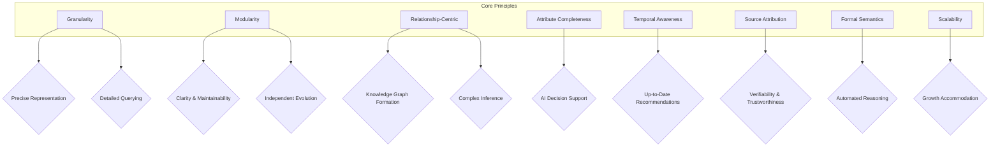
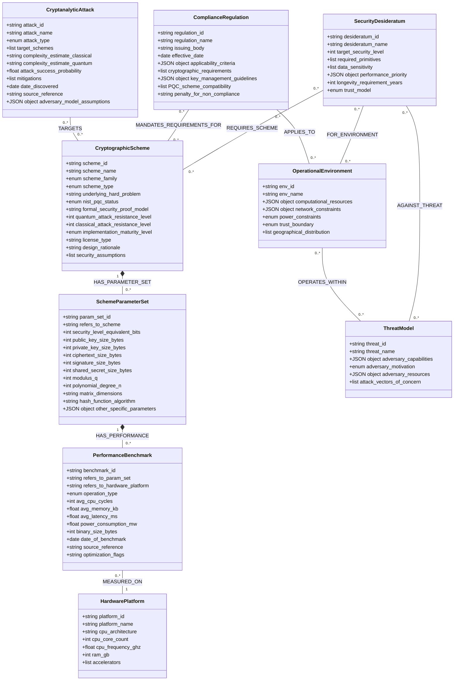
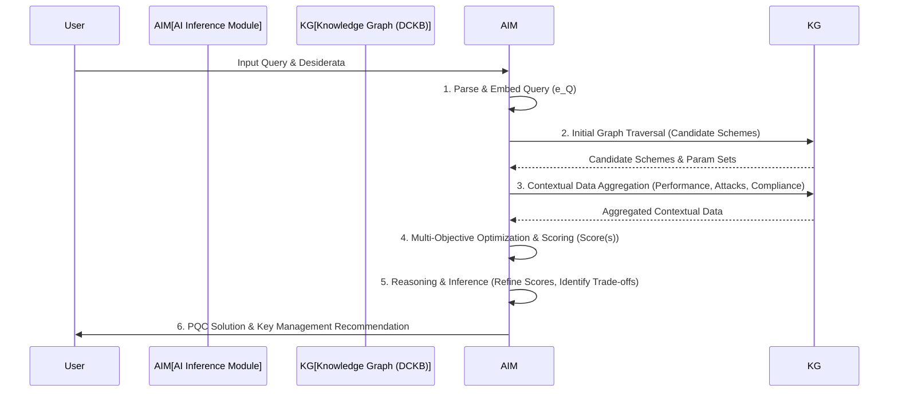
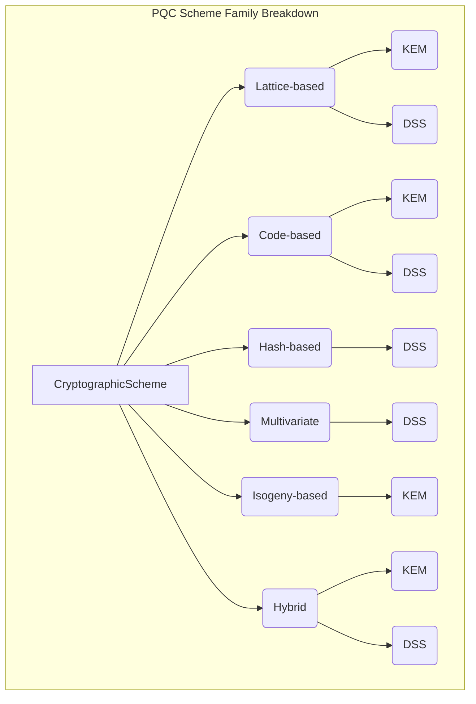
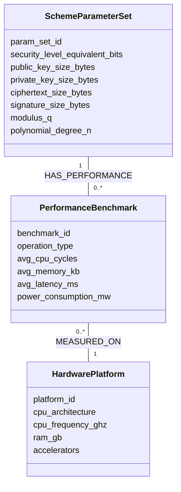
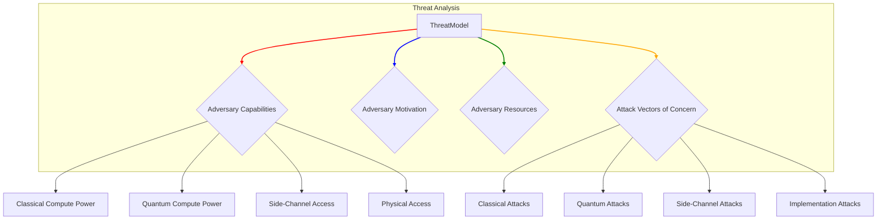
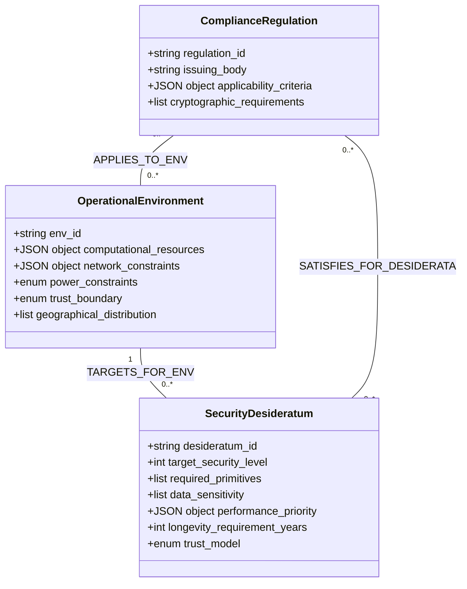
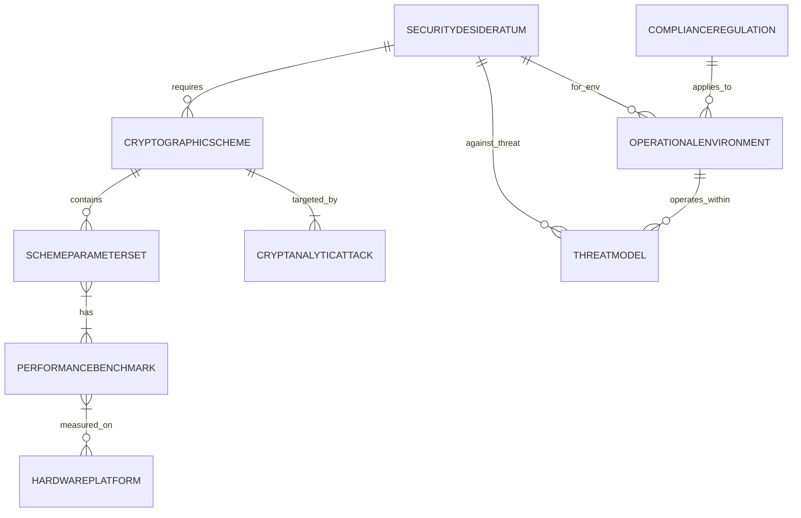
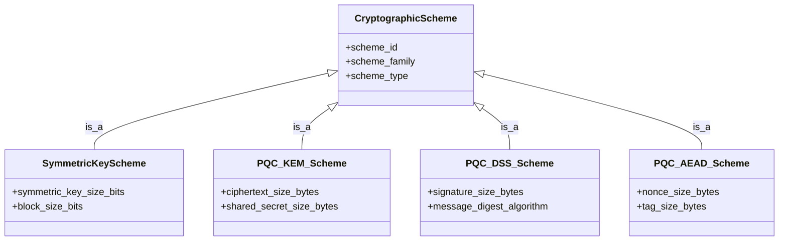

**Title of Invention:** Dynamic Cryptographic Knowledge Base DCKB Ontology Definition

**Abstract:**
This document formally defines the comprehensive ontology for the Dynamic Cryptographic Knowledge Base (DCKB), a critical component of the AI-Driven Heuristic Generation and Configuration of Quantum-Resilient Cryptographic Primitives and Protocols system. The ontology meticulously structures and interlinks disparate data points concerning post-quantum cryptographic (PQC) schemes, their parameterizations, performance benchmarks, cryptanalytic vulnerabilities, and regulatory compliance mandates. By establishing a robust and extensible semantic framework, this ontology empowers the Artificial Intelligence (AI) Cryptographic Inference Module (AIM) to perform sophisticated reasoning, multi-objective optimization, and contextually nuanced recommendations for quantum-resilient security solutions. This structured knowledge representation is fundamental to ensuring the system's accuracy, adaptability, and ability to remain at the forefront of evolving cryptographic landscapes and threat models.

**Introduction:**
The efficacy and intelligence of the AI-Driven Post-Quantum Cryptography (PQC) Generation System are profoundly dependent on its access to a continuously updated, highly structured, and semantically rich repository of cryptographic knowledge. This repository, termed the Dynamic Cryptographic Knowledge Base (DCKB), is engineered not merely as a flat database but as a sophisticated knowledge graph underpinned by a formal ontology. This ontology delineates the fundamental entities within the cryptographic domain, their intrinsic properties, and the intricate relationships that bind them.

The primary objectives of the DCKB ontology are:
*   **Semantic Richness:** To capture the deep meaning and context of cryptographic concepts, enabling the AI to understand nuances beyond keyword matching.
*   **Interoperability:** To facilitate seamless integration of diverse data sources, from academic papers to standardization documents and performance reports.
*   **Reasoning Enablement:** To provide a structured foundation that allows the AI Cryptographic Inference Module (AIM) to perform complex logical inferences, pattern recognition, and multi-objective optimization.
*   **Extensibility:** To allow for the effortless integration of new PQC schemes, updated research findings, novel attack vectors, and evolving regulatory mandates without requiring a complete redesign of the knowledge base.
*   **Accuracy and Consistency:** To enforce data integrity and consistency across all stored cryptographic information.
*   **Adaptability:** To support dynamic updates and versioning of cryptographic knowledge, reflecting the fast-paced evolution of quantum threats and PQC research.
*   **Traceability:** To provide transparent provenance for all data, allowing for auditing and verification of information sources.

This document presents a detailed, formal definition of the DCKB ontology, outlining its core classes, their associated properties, and the relationships that connect them, thereby providing a definitive blueprint for the knowledge base's structure and semantic content.

**Claim 1:** The DCKB ontology ensures unparalleled semantic richness, enabling AI to comprehend the nuanced interplay of cryptographic attributes, well beyond superficial keyword matching.

### 1. Core Principles of DCKB Ontology Design

The design of the DCKB ontology adheres to several guiding principles to ensure its robustness, scalability, and utility for the AI-driven PQC generation system:

*   **Granularity:** Concepts are broken down into their smallest meaningful units to allow for precise representation and detailed querying. This ensures that the AI can delve into the specific details required for fine-grained configuration.
*   **Modularity:** The ontology is designed with distinct classes representing specific domains (e.g., schemes, attacks, regulations), promoting clarity, maintainability, and independent evolution of different knowledge domains.
*   **Relationship-Centric:** Explicit relationships between classes are defined to capture the interconnected nature of cryptographic knowledge, forming a true knowledge graph. This structure is paramount for complex inference tasks.
*   **Attribute Completeness:** Each class includes a comprehensive set of attributes (properties) that are critical for the AI's decision-making process, covering both theoretical and practical aspects.
*   **Temporal Awareness:** Where appropriate, properties include timestamps or versioning to reflect the dynamic nature of cryptographic research and standards. This is vital for maintaining up-to-date recommendations.
*   **Source Attribution:** All ingested data points include references to their original sources to ensure verifiability, traceability, and to assess the trustworthiness of information.
*   **Formal Semantics:** The ontology adheres to principles of formal semantics, allowing for the application of automated reasoning tools to check consistency and infer new knowledge.
*   **Scalability:** The architecture is designed to accommodate a continuously growing volume of PQC research, performance data, and regulatory updates without degradation in performance or reasoning capability.

**Claim 2:** The modular and relationship-centric design of the DCKB ontology provides a highly scalable and maintainable knowledge graph, capable of integrating diverse cryptographic information sources seamlessly.


*Figure 1: DCKB Ontology Design Principles and their Benefits.*

### 2. DCKB Ontology Classes Detailed Definition

The DCKB ontology is built around a set of core classes, each representing a distinct conceptual entity within the post-quantum cryptographic ecosystem. Each class is defined by a unique identifier, descriptive properties, and its relationships to other classes.

#### 2.1. Class: CryptographicScheme

This class represents a specific post-quantum cryptographic algorithm or a foundational family of algorithms. It encapsulates the high-level characteristics that define a PQC scheme.

*   **`scheme_id`** (String): A unique, standardized identifier for the cryptographic scheme.
    *   *Example:* "Kyber1024", "Dilithium5", "SPHINCS+s-shake-256f".
    *   *Significance:* Essential for unambiguous referencing and linking across the knowledge graph. This ID often encodes critical version information, e.g., `SchemeFamily_SecurityLevel_Version`.
*   **`scheme_name`** (String): The widely recognized, formal name of the cryptographic scheme.
    *   *Example:* "CRYSTALS-Kyber", "CRYSTALS-Dilithium", "SPHINCS+".
    *   *Significance:* Provides a human-readable name for identification and categorization. Useful for documentation and user interfaces.
*   **`scheme_family`** (Enum): Categorizes the scheme based on its underlying mathematical hardness problem.
    *   *Enum Values:* "Lattice-based", "Code-based", "Hash-based", "Multivariate", "Isogeny-based", "Hybrid", "Symmetric_Key_PQC_Resistant".
    *   *Significance:* Crucial for high-level classification and initial filtering based on input requirements. Different families have distinct security assumptions and performance profiles.
*   **`scheme_type`** (Enum): Specifies the primary cryptographic primitive function(s) provided by the scheme.
    *   *Enum Values:* "KEM" (Key Encapsulation Mechanism), "DSS" (Digital Signature Scheme), "AEAD" (Authenticated Encryption with Associated Data), "ZKP" (Zero-Knowledge Proof), "MPC" (Multi-Party Computation), "HE" (Homomorphic Encryption), "PRF" (Pseudo-Random Function), "MAC" (Message Authentication Code).
    *   *Significance:* Directly addresses the `requiredPrimitives` in the input specification, guiding the AI to select functionally appropriate schemes.
*   **`underlying_hard_problem`** (String): Describes the specific mathematical problem whose presumed intractability forms the security basis of the scheme.
    *   *Example:* "Module-LWE" (Module Learning With Errors), "SIS" (Short Integer Solution), "MDPC Decoding" (Moderate-Density Parity-Check Decoding), "Discrete Logarithm on Isogenies", "Finding collisions in hash functions".
    *   *Significance:* Provides deep insight into the theoretical security and resilience against different types of attacks. It's often defined by parameters `P_hard_problem = {params}`.
*   **`nist_pqc_status`** (Enum): Reflects the scheme's current status within the NIST Post-Quantum Cryptography Standardization process.
    *   *Enum Values:* "Standardized", "Finalist", "Round 3 Candidate", "Round 2 Candidate", "Deprecated", "Pre-standardization", "Under Review", "Withdrawn".
    *   *Significance:* Critical for compliance and assessing the maturity and community acceptance of a scheme. This status often changes over time, requiring temporal awareness.
*   **`formal_security_proof_model`** (String): Details the cryptographic security model under which the scheme has been formally proven secure.
    *   *Example:* "IND-CCA2" (Indistinguishability under Chosen Ciphertext Attack), "EUF-CMA" (Existential Unforgeability under Chosen Message Attack), "ROM" (Random Oracle Model), "QROM" (Quantum Random Oracle Model), "Standard Model", "Ideal Cipher Model".
    *   *Significance:* Provides a rigorous foundation for evaluating the theoretical security guarantees. A stronger proof model generally implies greater confidence.
*   **`quantum_attack_resistance_level`** (Integer): The estimated equivalent classical bits of security against known quantum algorithms (e.g., Shor's, Grover's).
    *   *Example:* 128, 192, 256.
    *   *Significance:* Directly addresses the `targetSecurityLevel` desideratum, quantifying quantum resilience. It is an estimation, often tied to `log2(complexity_quantum_attack)`.
*   **`classical_attack_resistance_level`** (Integer): The estimated equivalent classical bits of security against known classical algorithms.
    *   *Example:* 125, 190, 250.
    *   *Significance:* Ensures the scheme is also robust against conventional cryptanalytic threats. This is `log2(complexity_classical_attack)`.
*   **`implementation_maturity_level`** (Enum): Indicates the readiness and optimization level of available implementations.
    *   *Enum Values:* "Experimental", "Reference Implementation", "Optimized Software", "Hardware-accelerated", "Formal_Verification_Pending", "Certified_Hardware".
    *   *Significance:* Informs practical deployability and performance expectations, especially for resource-constrained environments. Higher levels imply greater confidence in correctness and efficiency.
*   **`license_type`** (String): Specifies the software license under which reference implementations or libraries are distributed.
    *   *Example:* "MIT", "Apache 2.0", "Public Domain", "GPLv3", "Proprietary", "CC0".
    *   *Significance:* Important for legal and project management considerations during integration, affecting commercial viability.
*   **`design_rationale`** (String): A brief description of the design philosophy or key innovations of the scheme.
    *   *Significance:* Provides context for understanding trade-offs and design choices.
*   **`security_assumptions`** (List of Strings): Any specific assumptions made about the environment or adversary model for security to hold.
    *   *Example:* "Presence of a strong randomness source", "Honest-but-curious adversary", "Bounded quantum memory".
    *   *Significance:* Critical for evaluating applicability in specific deployment scenarios.

**Claim 3:** Each `CryptographicScheme` instance provides a quantifiable measure of security (both classical and quantum) and a detailed specification of its design, facilitating AI-driven risk assessment and selection.

#### 2.2. Class: SchemeParameterSet

This class defines a specific set of parameters for a given `CryptographicScheme`, representing a particular instantiation that offers a defined security level and performance profile. A single scheme can have multiple parameter sets.

*   **`param_set_id`** (String): A unique identifier for this specific parameter set.
    *   *Example:* "Kyber768_NIST_Level3_v2.0", "Dilithium5_NIST_Level5_AVX2".
    *   *Significance:* Allows granular selection of scheme configurations. Often includes the scheme ID, security level, and a version or optimization identifier.
*   **`refers_to_scheme`** (Reference to `CryptographicScheme.scheme_id`): Links this parameter set to its parent cryptographic scheme.
    *   *Significance:* Establishes a clear hierarchical relationship, enabling navigation from a general scheme to its specific instantiations.
*   **`security_level_equivalent_bits`** (Integer): The classical security strength this parameter set aims to achieve (e.g., equivalent to AES-128, AES-192, AES-256).
    *   *Example:* 128, 192, 256.
    *   *Significance:* A primary metric for matching `targetSecurityLevel` requirements. This is typically defined by NIST security strength categories.
    *   *Equation Example:* `S_equiv = max(S_quantum, S_classical)`. NIST security level `L` corresponds to `S_equiv >= L` bits.
*   **`public_key_size_bytes`** (Integer): The size of the public key in bytes for this parameter set.
    *   *Significance:* Influences network bandwidth, storage requirements, and cache performance.
    *   *Equation Example:* `PK_cost = N_tx * PK_size`, where `N_tx` is number of transmissions.
*   **`private_key_size_bytes`** (Integer): The size of the private key in bytes for this parameter set.
    *   *Significance:* Influences secure storage, memory footprint, and backup complexity.
    *   *Equation Example:* `SK_storage_cost = Storage_unit_cost * SK_size`.
*   **`ciphertext_size_bytes`** (Integer, conditional for KEM/AEAD): The size of the ciphertext or encapsulated key in bytes.
    *   *Significance:* Crucial for network and storage costs in KEMs and AEADs.
    *   *Equation Example:* `CT_overhead = CT_size / Plaintext_size`.
*   **`signature_size_bytes`** (Integer, conditional for DSS): The size of the digital signature in bytes.
    *   *Significance:* Impacts network bandwidth and storage for signature-based authentication.
    *   *Equation Example:* `Sig_storage_per_doc = Sig_size`.
*   **`shared_secret_size_bytes`** (Integer, conditional for KEM): The size of the shared secret derived from a KEM in bytes.
    *   *Significance:* Important for subsequent symmetric encryption key derivation. This often matches the `security_level_equivalent_bits` in bytes (e.g., 32 bytes for 256-bit security).
*   **`modulus_q`** (Integer, conditional for lattice-based): The prime modulus used in lattice-based schemes.
    *   *Example:* 3329 (for Kyber).
    *   *Significance:* A fundamental mathematical parameter affecting security and performance. A larger `q` generally increases security but also key/ciphertext sizes and computational cost.
*   **`polynomial_degree_n`** (Integer, conditional for lattice-based): The degree of polynomials used in ring- or module-lattice constructions.
    *   *Example:* 256 (for Kyber).
    *   *Significance:* Another core mathematical parameter. Affects vector/matrix dimensions and thus security and performance.
*   **`matrix_dimensions`** (String, conditional for lattice-based/code-based): Describes the dimensions of matrices or codes used.
    *   *Example:* "k x k" for lattice matrices, "n x k" for code-based parity-check matrices.
    *   *Significance:* Provides structural detail for the scheme. `N_elements = dim_rows * dim_cols`.
*   **`hash_function_algorithm`** (String, conditional for hash-based/hybrid): The specific hash function used within the scheme.
    *   *Example:* "SHA3-256", "SHAKE256", "BLAKE2b".
    *   *Significance:* Directly impacts security (collision resistance) and performance (hash rate).
*   **`other_specific_parameters`** (JSON object): A flexible field to store any additional, scheme-specific parameters not covered by generic properties.
    *   *Example:* For SPHINCS+, this might include tree height, number of layers, or hash function choices (e.g., "shake-256f"). For FrodoKEM, it might be the error distribution variance.
    *   *Significance:* Ensures comprehensive parameterization for all PQC schemes, enabling precise reconstruction and evaluation.

#### 2.3. Class: PerformanceBenchmark

This class captures empirical or simulated performance metrics for specific `SchemeParameterSet` instances across various hardware platforms and operational contexts. This data is vital for optimizing against performance priorities.

*   **`benchmark_id`** (String): A unique identifier for this specific benchmark record.
    *   *Significance:* Enables tracking and referencing individual performance measurements. Often combines `param_set_id`, `hardware_platform_id`, and `operation_type`.
*   **`refers_to_param_set`** (Reference to `SchemeParameterSet.param_set_id`): Links the benchmark to the specific parameter set it evaluates.
    *   *Significance:* Ensures performance data is tied to precise scheme configurations, allowing direct comparison of parameter set trade-offs.
*   **`refers_to_hardware_platform`** (Reference to `HardwarePlatform.platform_id`): Links to a detailed description of the hardware.
    *   *Significance:* Essential for matching `operationalEnvironment.computationalResources`.
*   **`operation_type`** (Enum): The specific cryptographic operation being measured.
    *   *Enum Values:* "KeyGen" (Key Generation), "Encaps" (Key Encapsulation), "Decaps" (Key Decapsulation), "Sign" (Signature Generation), "Verify" (Signature Verification), "Encrypt", "Decrypt", "Setup", "Prove", "Verify_ZKP".
    *   *Significance:* Allows the AI to evaluate performance for required primitives and specific phases of a protocol.
*   **`avg_cpu_cycles`** (Integer): The average number of CPU cycles consumed for the operation.
    *   *Significance:* A granular measure of computational cost, especially for embedded systems where clock cycles are a primary constraint.
    *   *Equation Example:* `Cycles_per_byte = avg_cpu_cycles / (input_size_bytes + output_size_bytes)`.
*   **`avg_memory_kb`** (Float): The average memory footprint (e.g., RAM usage) in kilobytes during the operation.
    *   *Significance:* Addresses `operationalEnvironment.computationalResources` and resource constraints for memory-limited devices. Includes both stack and heap usage.
    *   *Equation Example:* `Memory_efficiency = 1 / avg_memory_kb`.
*   **`avg_latency_ms`** (Float): The average execution time in milliseconds for the operation.
    *   *Significance:* Directly informs `securityDesiderata.performancePriority` for real-time applications and user experience.
    *   *Equation Example:* `Throughput = 1000 / avg_latency_ms` (operations per second).
*   **`power_consumption_mw`** (Float): The average power consumption in milliwatts during the operation.
    *   *Significance:* Critical for battery-powered or energy-constrained IoT devices, informing `operationalEnvironment.powerConstraints`.
    *   *Equation Example:* `Energy_per_op = power_consumption_mw * (avg_latency_ms / 1000)`.
*   **`binary_size_bytes`** (Integer): The size of the compiled cryptographic library or module in bytes.
    *   *Significance:* Important for constrained environments where code size is a premium.
*   **`date_of_benchmark`** (Date): The date when the benchmark data was collected or published.
    *   *Significance:* Helps in assessing the recency and relevance of the performance data, as implementations evolve rapidly.
*   **`source_reference`** (String): A URL, DOI, or publication reference for the benchmark data.
    *   *Significance:* Ensures traceability and verifiability of performance claims, linking back to scientific papers or official reports.
*   **`optimization_flags`** (String): Compiler optimization flags used during compilation (e.g., "-O3", "-march=native", "AVX2").
    *   *Significance:* Provides context for benchmark results, as flags can significantly impact performance.

**Claim 4:** The `PerformanceBenchmark` class provides granular, quantifiable metrics across diverse hardware and operational contexts, enabling the AI to optimize for specific performance priorities with high fidelity.

#### 2.4. Class: CryptanalyticAttack

This class captures information about known or theoretical cryptanalytic attacks that could compromise the security of cryptographic schemes, including both classical and quantum threats.

*   **`attack_id`** (String): A unique identifier for the attack.
    *   *Significance:* For unambiguous referencing of attack vectors. Often includes the attack type, target, and a version or variant.
*   **`attack_name`** (String): The descriptive name of the cryptanalytic attack.
    *   *Example:* "Lattice Sieving", "Information Set Decoding", "Shor's Algorithm", "Grover's Algorithm", "Fault Injection Attack", "Chosen-Ciphertext Attack (CCA)".
    *   *Significance:* Provides a clear identifier for threat modeling and communication.
*   **`attack_type`** (Enum): Classifies the nature of the attack.
    *   *Enum Values:* "Classical", "Quantum", "Side-channel", "Implementation-based", "Mathematical", "Fault_Injection", "Timing_Attack", "Memory_Access_Attack", "Power_Analysis", "Brute_Force".
    *   *Significance:* Helps in understanding the capabilities of the `adversaryModel` and categorizing threats.
*   **`target_schemes`** (List of `CryptographicScheme.scheme_id`): A list of cryptographic schemes known or theorized to be vulnerable to this attack.
    *   *Significance:* Establishes direct links between attacks and their potential targets, crucial for risk assessment.
*   **`complexity_estimate_classical`** (String): An estimate of the computational resources (e.g., time, memory) required for the attack by classical computers.
    *   *Example:* "2^128 operations", "O(N^3) time, O(N) memory".
    *   *Significance:* Quantifies the severity of the threat in classical terms, informing `classical_attack_resistance_level`.
    *   *Equation Example:* `N_ops_classical = 2^S_classical`. The actual complexity is often expressed as `C_classical = O(f(n,k))`.
*   **`complexity_estimate_quantum`** (String): An estimate of the computational resources (e.g., qubits, quantum gates) required for the attack by quantum computers.
    *   *Example:* "O(N^3) quantum operations, O(N) qubits", "polynomial time on quantum computer".
    *   *Significance:* Quantifies the severity of the threat in quantum terms, informing `quantum_attack_resistance_level`.
    *   *Equation Example:* `N_ops_quantum = 2^S_quantum`. `C_quantum = O(g(n,k))`.
*   **`attack_success_probability`** (Float): The estimated probability of a successful attack.
    *   *Example:* 0.5 (for probabilistic attacks), 1.0 (for deterministic breaks).
    *   *Significance:* Refines risk assessment; a low probability might be acceptable for some use cases.
    *   *Equation Example:* `P_success(attack, scheme, params)`.
*   **`mitigations`** (List of Strings): Describes known countermeasures or design principles that can mitigate the attack.
    *   *Example:* "Higher security parameters", "Constant-time implementation", "Hardware isolation", "Blinding techniques", "Message randomization".
    *   *Significance:* Guides the AI in formulating secure private key handling instructions and selecting resilient schemes.
*   **`date_discovered`** (Date): The date when the attack was first discovered or publicly disclosed.
    *   *Significance:* Helps assess the recency of the threat and the maturity of countermeasures.
*   **`source_reference`** (String): A URL, DOI, or publication reference for the attack details.
    *   *Significance:* Ensures traceability and verifiability of attack claims, linking to academic papers, security advisories, or common vulnerabilities and exposures (CVEs).
*   **`adversary_model_assumptions`** (JSON object): Details the adversary's capabilities and access required for the attack.
    *   *Example:* `{"access": "SideChannel", "capabilities": "Active", "quantum_resources": "Limited"}`.
    *   *Significance:* Directly relates to the `ThreatModel` class for contextualized risk analysis.

#### 2.5. Class: ComplianceRegulation

This class defines various regulatory frameworks, industry standards, and organizational policies that impose requirements on cryptographic practices.

*   **`regulation_id`** (String): A unique identifier for the regulation or standard.
    *   *Example:* "FIPS140-3_Level2", "PCI-DSS_4.0", "GDPR_Article32", "HIPAA_SecurityRule", "ISO27001_2022".
    *   *Significance:* For precise referencing of compliance mandates.
*   **`regulation_name`** (String): The full, official name of the regulation or standard.
    *   *Example:* "Federal Information Processing Standards Publication 140-3 Security Requirements for Cryptographic Modules Level 2".
    *   *Significance:* Provides a human-readable name for identification and legal contexts.
*   **`issuing_body`** (String): The organization or authority responsible for issuing and maintaining the regulation.
    *   *Example:* "NIST", "PCI Security Standards Council", "European Union", "ISO".
    *   *Significance:* Indicates authority and jurisdiction.
*   **`effective_date`** (Date): The date from which the regulation becomes active.
    *   *Significance:* Essential for temporal compliance checks.
*   **`applicability_criteria`** (JSON object): Specifies the conditions under which this regulation applies.
    *   *Example:* `{"data_sensitivity": ["PHI", "PII"], "operational_environment": "Healthcare", "jurisdiction": "EU"}` or `{"data_category": "PaymentCardData", "entity_type": "Merchant", "transaction_volume": ">X"}`.
    *   *Significance:* Enables the AI to determine which regulations are relevant based on the input specification `operationalEnvironment` and `securityDesiderata.dataSensitivity`.
    *   *Equation Example:* `IsApplicable(Regulation, Context) = (Context.data_sensitivity IN Regulation.data_sensitivity_criteria) AND ...`.
*   **`cryptographic_requirements`** (List of Strings): Specific requirements related to cryptographic primitives, key lengths, and algorithm choices mandated by the regulation.
    *   *Example:* "Mandatory use of NIST-approved algorithms", "Minimum 128-bit symmetric equivalent security", "Approved KEMs only", "Use of secure hash algorithms (SHA-2/3)".
    *   *Significance:* Directly informs scheme selection and parameterization.
    *   *Equation Example:* `Requirement_met = (Scheme.security_level >= Reg.min_security_level) AND (Scheme.type IN Reg.allowed_types)`.
*   **`key_management_guidelines`** (JSON object): Detailed prescriptions or recommendations for secure key generation, storage, usage, backup, and destruction.
    *   *Example:* `{"storage": "FIPS 140-3 Level 2 certified HSM", "backup": "M-of-N secret sharing", "rotation_frequency": "Annually", "access_control": "RBAC"}`.
    *   *Significance:* Crucial for formulating comprehensive private key handling instructions and system design.
*   **`PQC_scheme_compatibility`** (List of `CryptographicScheme.scheme_id`): A list of PQC schemes known to be compatible with or recommended by this regulation (if specified).
    *   *Significance:* Provides explicit guidance on preferred schemes for compliance, reducing ambiguity.
*   **`penalty_for_non_compliance`** (String): Describes the potential legal or financial consequences of failing to meet the regulation.
    *   *Example:* "Fines up to 4% of global turnover (GDPR)", "Loss of PCI compliance status".
    *   *Significance:* Quantifies the risk associated with non-compliance.

**Claim 5:** The `ComplianceRegulation` class provides a structured mechanism to enforce legal and industry mandates, automatically guiding the AI in selecting PQC solutions that meet stringent compliance requirements.

#### 2.6. Class: OperationalEnvironment (New Class)

This class describes the specific computing and network environment where the PQC solution will be deployed.

*   **`env_id`** (String): Unique identifier for the operational environment profile.
*   **`env_name`** (String): Descriptive name (e.g., "Edge IoT Device Network", "Cloud Server Backend", "Enterprise Workstation").
*   **`computational_resources`** (JSON object): Details CPU, memory, storage.
    *   *Example:* `{"cpu_arch": "ARMv7", "cpu_freq_mhz": 200, "ram_mb": 64, "storage_gb": 4, "has_hardware_accelerators": false}`.
    *   *Significance:* Direct input for filtering `PerformanceBenchmark` data.
*   **`network_constraints`** (JSON object): Bandwidth, latency, reliability.
    *   *Example:* `{"bandwidth_mbps": 1.0, "avg_latency_ms": 200, "loss_rate_percent": 5}`.
    *   *Significance:* Impacts choice of schemes with larger key/ciphertext/signature sizes.
*   **`power_constraints`** (Enum): Power budget for devices.
    *   *Enum Values:* "Battery_Powered", "Line_Powered", "Energy_Harvesting".
    *   *Significance:* Filters schemes based on `PerformanceBenchmark.power_consumption_mw`.
*   **`trust_boundary`** (Enum): Where cryptographic operations occur relative to the adversary.
    *   *Enum Values:* "Trusted_Hardware_Module", "Secure_Enclave", "Untrusted_OS_Process".
    *   *Significance:* Informs `KeyManagementGuideline` and potential for side-channel attacks.
*   **`geographical_distribution`** (List of Strings): Regions of deployment.
    *   *Example:* "EU", "US", "APAC".
    *   *Significance:* Impacts `ComplianceRegulation.applicability_criteria`.

#### 2.7. Class: ThreatModel (New Class)

This class formalizes the capabilities and motivations of potential adversaries.

*   **`threat_id`** (String): Unique identifier for the threat model.
*   **`threat_name`** (String): Descriptive name (e.g., "Nation-State Quantum Adversary", "Resource-Limited Side-Channel Attacker").
*   **`adversary_capabilities`** (JSON object): Computational, quantum, access.
    *   *Example:* `{"classical_compute": "Supercomputer", "quantum_compute": "Large_Scale_Q_Computer", "side_channel_access": "Full", "physical_access": "Occasional"}`.
    *   *Significance:* Determines relevant `CryptanalyticAttack` instances.
*   **`adversary_motivation`** (Enum): What drives the attack.
    *   *Enum Values:* "Espionage", "Financial_Gain", "Sabotage", "Ideological".
    *   *Significance:* Helps prioritize defense.
*   **`adversary_resources`** (JSON object): Time, budget.
    *   *Example:* `{"budget_usd": "Unlimited", "attack_time_years": 10}`.
    *   *Significance:* Quantifies the feasibility of attacks (e.g., `complexity_estimate` vs. `attack_time_years`).
*   **`attack_vectors_of_concern`** (List of `CryptanalyticAttack.attack_type`): Types of attacks the adversary is expected to mount.
    *   *Significance:* Narrows down the scope of threats to consider.

#### 2.8. Class: SecurityDesideratum (New Class)

This class captures the desired security properties and priorities for a PQC solution.

*   **`desideratum_id`** (String): Unique identifier for the security requirement set.
*   **`desideratum_name`** (String): Descriptive name (e.g., "High-Assurance Data-in-Transit", "Long-Term Archival Security").
*   **`target_security_level`** (Integer): Desired minimum equivalent classical bits of security.
    *   *Example:* 128, 192, 256.
    *   *Significance:* Directly filters `CryptographicScheme.quantum_attack_resistance_level`.
*   **`required_primitives`** (List of `CryptographicScheme.scheme_type`): Essential cryptographic functions.
    *   *Example:* ["KEM", "DSS"].
    *   *Significance:* Filters `CryptographicScheme.scheme_type`.
*   **`data_sensitivity`** (List of Strings): Classification of data being protected.
    *   *Example:* ["PHI", "PII", "Confidential_Business_Data", "Top_Secret"].
    *   *Significance:* Crucial for mapping to `ComplianceRegulation.applicability_criteria`.
*   **`performance_priority`** (JSON object): Relative importance of different performance metrics.
    *   *Example:* `{"latency": "High", "throughput": "Medium", "memory_footprint": "Low"}`.
    *   *Significance:* Guides the AI's multi-objective optimization against `PerformanceBenchmark` data.
*   **`longevity_requirement_years`** (Integer): How long the data needs to remain secure.
    *   *Example:* 10, 20, 50.
    *   *Significance:* Helps assess future quantum threat evolution and choice of more conservative schemes.
    *   *Equation Example:* `Longevity_Risk = f(longevity_req, current_quantum_progress_rate)`.
*   **`trust_model`** (Enum): Assumptions about trusted parties.
    *   *Enum Values:* "Zero_Trust", "Partial_Trust_CA", "Full_Trust_Internal_PKI".
    *   *Significance:* Impacts key management and protocol design.

**Claim 6:** The `OperationalEnvironment`, `ThreatModel`, and `SecurityDesideratum` classes provide a comprehensive, structured input framework, allowing the AI to contextualize PQC requirements for optimal solution generation.

### 3. Relationships and Knowledge Graph Structure

The power of the DCKB ontology lies in its ability to model intricate relationships between these distinct classes, forming a rich knowledge graph that the AI can traverse and query. These relationships are either explicitly defined or implicitly understood through property references.

*   **`CryptographicScheme` HAS_PARAMETER_SET `SchemeParameterSet` (One-to-Many):** A single cryptographic scheme can have multiple associated parameter sets, each offering different security/performance trade-offs.
    *   *Example:* CRYSTALS-Kyber (Scheme) HAS Kyber512, Kyber768, Kyber1024 (Parameter Sets).
    *   *Conceptual Query:* `MATCH (s:CryptographicScheme)-[:HAS_PARAMETER_SET]->(ps:SchemeParameterSet) WHERE s.scheme_name = 'CRYSTALS-Kyber' RETURN ps.param_set_id`
*   **`SchemeParameterSet` HAS_PERFORMANCE `PerformanceBenchmark` (One-to-Many):** A specific parameter set can have numerous performance benchmarks, reflecting measurements across different hardware platforms and operational contexts.
    *   *Example:* Kyber768_NIST_Level3 (Parameter Set) HAS CPU cycles on Intel Xeon, CPU cycles on ARM Cortex-M0, Memory footprint on cloud server.
    *   *Conceptual Query:* `MATCH (ps:SchemeParameterSet)-[:HAS_PERFORMANCE]->(pb:PerformanceBenchmark) WHERE ps.param_set_id = 'Kyber768_NIST_Level3' AND pb.hardware_platform_id = 'ARM_Cortex-M0' RETURN pb.avg_latency_ms`
*   **`CryptanalyticAttack` TARGETS `CryptographicScheme` (Many-to-Many):** An attack can target one or more cryptographic schemes, and a scheme can be targeted by multiple attacks.
    *   *Example:* Shor's Algorithm (Attack) TARGETS RSA, ECC. Lattice Sieving (Attack) TARGETS Kyber, Dilithium.
    *   *Conceptual Query:* `MATCH (a:CryptanalyticAttack)-[:TARGETS]->(s:CryptographicScheme) WHERE s.scheme_id = 'Kyber1024' RETURN a.attack_name`
*   **`ComplianceRegulation` APPLIES_TO `OperationalEnvironment` (Many-to-Many, via applicability_criteria):** Regulations are applicable based on the characteristics of the operational environment and data sensitivity.
    *   *Example:* GDPR (Regulation) APPLIES_TO an EU Cloud Server (OperationalEnvironment) handling PII.
    *   *Conceptual Query:* `MATCH (r:ComplianceRegulation), (e:OperationalEnvironment) WHERE r.applicability_criteria.jurisdiction = e.geographical_distribution AND e.data_sensitivity IN r.applicability_criteria.data_sensitivity RETURN r.regulation_name`
*   **`ComplianceRegulation` MANDATES_REQUIREMENTS_FOR `CryptographicScheme` (Many-to-Many, via cryptographic_requirements):** Regulations specify criteria that schemes must meet.
    *   *Example:* FIPS 140-3 (Regulation) MANDATES_REQUIREMENTS_FOR Kyber (if certified).
    *   *Conceptual Query:* `MATCH (r:ComplianceRegulation)-[:MANDATES_REQUIREMENTS_FOR]->(s:CryptographicScheme) WHERE r.regulation_id = 'FIPS140-3' AND s.nist_pqc_status = 'Standardized' RETURN s.scheme_id`
*   **`OperationalEnvironment` OPERATES_WITHIN `ThreatModel` (One-to-One or Many-to-One):** An operational environment is assumed to exist within a specific threat landscape.
    *   *Example:* A "Cloud Server Backend" OPERATES_WITHIN "Nation-State Quantum Adversary" threat model.
    *   *Conceptual Query:* `MATCH (oe:OperationalEnvironment)-[:OPERATES_WITHIN]->(tm:ThreatModel) WHERE oe.env_id = 'CloudServer' RETURN tm.threat_name`
*   **`SecurityDesideratum` REQUIRES `CryptographicScheme` (Many-to-Many, indirectly):** The desired security properties influence the choice of schemes.
    *   *Example:* "High-Assurance Archival" REQUIRES (implicitly) Kyber1024, Dilithium5.
    *   *Conceptual Query:* `MATCH (sd:SecurityDesideratum) WHERE sd.target_security_level >= 256 MATCH (s:CryptographicScheme) WHERE s.quantum_attack_resistance_level >= sd.target_security_level RETURN s.scheme_id`
*   **`PerformanceBenchmark` MEASURED_ON `HardwarePlatform` (Many-to-One):** Each benchmark is conducted on a specific hardware platform.
    *   *Example:* CPU cycles on Intel Xeon (PerformanceBenchmark) MEASURED_ON Intel Xeon E5-2690 v4 (HardwarePlatform).
*   **`CryptographicScheme` UTILIZES_PRIMITIVE `CryptographicScheme` (Many-to-Many, for hybrid/composite schemes):** Some schemes might internally use other simpler cryptographic primitives (e.g., hash functions, symmetric ciphers).
    *   *Example:* SPHINCS+ UTILIZES_PRIMITIVE SHAKE256.

This interconnected structure enables the AI to perform complex queries such as: "Find all lattice-based KEMs that are NIST finalists, offer NIST Level 5 security (>=256 bits), perform well on ARM Cortex-M0 devices (latency < 100ms for encaps), are not known to be vulnerable to side-channel attacks for resource-constrained adversaries, and are compatible with FIPS 140-3 Level 2 requirements for PHI data in an EU jurisdiction, considering a nation-state quantum threat model and a 20-year data longevity requirement."

**Claim 7:** The DCKB's knowledge graph architecture, with its explicit semantic relationships, empowers the AI to conduct multi-faceted, context-aware reasoning and optimization for PQC recommendations.


*Figure 2: Comprehensive DCKB Ontology Class Diagram with New Classes.*

### 4. Knowledge Graph Representation and AIM Interaction

The defined ontology serves as the conceptual schema for constructing the actual Dynamic Cryptographic Knowledge Base as a graph database (e.g., Neo4j, JanusGraph, Amazon Neptune). In this representation:
*   **Classes** become node labels (e.g., `CryptographicScheme`, `SchemeParameterSet`).
*   **Properties** become attributes of these nodes (e.g., `scheme_name`, `public_key_size_bytes`).
*   **Relationships** become directed edges between nodes (e.g., `HAS_PARAMETER_SET`, `TARGETS`).

The AI Cryptographic Inference Module (AIM) interacts with this knowledge graph through sophisticated knowledge graph traversal (KGT-R) and embedding techniques. When the AIM receives a query (the contextualized prompt), it executes the following high-level process:
1.  **Query Formalization & Embedding:** The natural language input query, along with structured desiderata (from `SecurityDesideratum`, `OperationalEnvironment`, `ThreatModel` objects), is parsed and transformed into a formal query language (e.g., Cypher, SPARQL) and an embedding vector using natural language processing (NLP) and graph neural networks (GNNs).
    *   *Equation Example:* Query embedding `e_Q = GNN(T_query)`, where `T_query` is tokenized query text.
2.  **Initial Graph Traversal & Candidate Identification:** The formal query is executed against the knowledge graph to identify initial candidate `CryptographicScheme` and `SchemeParameterSet` nodes that broadly match the functional and basic security requirements.
    *   *Equation Example:* `Candidates = {s | s.scheme_type IN Desideratum.required_primitives AND s.quantum_attack_resistance_level >= Desideratum.target_security_level}`.
3.  **Contextual Data Aggregation:** For each candidate, the AIM traverses related nodes to gather comprehensive contextual data:
    *   Associated `PerformanceBenchmark` data for the specified `OperationalEnvironment.hardware_platform`.
    *   Relevant `CryptanalyticAttack` instances based on the `ThreatModel` and the scheme's `scheme_family`.
    *   Applicable `ComplianceRegulation` requirements considering `OperationalEnvironment.geographical_distribution` and `SecurityDesideratum.data_sensitivity`.
    *   *Equation Example:* `Context(s) = {PerformanceData(s, env), AttackData(s, threat), ComplianceData(s, env, sec_des)}`.
4.  **Multi-Objective Optimization & Scoring:** The aggregated data is fed into a multi-objective optimization engine. This engine assigns scores to each candidate based on how well it meets the weighted priorities defined in `SecurityDesideratum.performance_priority` and `ComplianceRegulation` conformance, while also accounting for `CryptanalyticAttack` risks.
    *   *Equation Example:* `Score(s) = w_sec * SecurityScore(s) + w_perf * PerformanceScore(s) + w_comp * ComplianceScore(s) - w_risk * RiskScore(s)`.
    *   *Equation Example:* `SecurityScore(s) = min(s.quantum_attack_resistance_level, s.classical_attack_resistance_level) / Desideratum.target_security_level`.
    *   *Equation Example:* `PerformanceScore(s) = w_lat * (1 - pb.avg_latency_ms / max_latency) + w_mem * (1 - pb.avg_memory_kb / max_memory)`.
5.  **Reasoning and Inference:** The AIM applies logical inference rules (e.g., defined in SWRL or through learned patterns from GNNs) to identify potential conflicts, trade-offs, and implicit recommendations. For example, if a scheme is a "Finalist" but has a known "Side-channel" attack with no "Mitigations" for the "Embedded" `OperationalEnvironment`, its score is penalized.
    *   *Equation Example:* `IF (s.nist_pqc_status = 'Finalist' AND attack.type = 'Side-channel' AND NOT EXISTS (s.mitigations FOR attack)) THEN s.score_penalty += X`.
6.  **PQC Solution Generation:** Based on the scores and inferred knowledge, the AIM generates a ranked list of recommended `SchemeParameterSet` instances. For the top recommendation, it then generates detailed configuration instructions, including `KeyManagementGuideline` based on relevant `ComplianceRegulation` and `OperationalEnvironment.trust_boundary`.
    *   *Equation Example:* `Recommendation = argmax(Score(s))`.
    *   *Equation Example:* `KeyManagementPlan = {Guideline | Guideline IN ComplianceRegulation.key_management_guidelines WHERE Regulation.id IN ApplicableRegulations}`.

This ontological foundation ensures that the AIM's recommendations are not based on simple keyword matches but on a deep, structural, and semantic understanding of the cryptographic landscape, guaranteeing robust, accurate, and adaptive security solutions.

**Claim 8:** By integrating knowledge graph embeddings, multi-objective optimization, and formal reasoning, the DCKB ontology enables the AIM to generate precise, contextually relevant, and quantum-resilient security solutions.


*Figure 3: AIM Interaction with DCKB Knowledge Graph Sequence Diagram.*

### 5. Advanced Ontology Concepts and Extensions

#### 5.1 Temporal Aspects and Versioning

Cryptographic knowledge is dynamic. Schemes evolve, attacks are discovered, and standards change. The DCKB ontology incorporates temporal awareness:

*   **Versioning of Entities:** Each primary entity (e.g., `CryptographicScheme`, `SchemeParameterSet`) implicitly or explicitly carries version information.
    *   *Equation Example:* `Version(Entity) = (Major.Minor.Patch)`. `v_new > v_old`.
*   **Validity Periods for Properties:** Certain properties might only be valid for a specific timeframe.
    *   *Equation Example:* `Property.value @ [EffectiveDate, ExpiryDate]`.
*   **Provenance Timestamps:** `date_of_benchmark`, `date_discovered`, `effective_date` serve as direct temporal markers.
*   **Temporal Queries:** The AI can query for schemes that were valid or relevant at a specific point in time or over a period.
    *   *Equation Example:* `Retrieve(Scheme, Date_T) = {s | s.valid_from <= Date_T AND s.valid_until >= Date_T}`.
    *   *Equation Example:* `Rate_of_Obsolescence = d(Num_Deprecated_Schemes) / dt`.

**Claim 9:** The DCKB ontology's robust temporal awareness and versioning mechanisms ensure that AI recommendations are always based on the most current and relevant cryptographic knowledge, adapting to rapid domain evolution.

#### 5.2 Data Provenance and Trustworthiness

The integrity of the DCKB is paramount. Each data point is linked to its source, enabling verification and trust assessment.

*   **`Source` Class (Implicit or Explicit):** Could be `AcademicPaper`, `NISTPublication`, `IndustryReport`, `SecurityAdvisory`.
    *   *Properties:* `source_name`, `url`, `doi`, `publication_date`, `author_list`, `trust_score`.
*   **Trust Scoring:** Sources can be assigned a trust score based on their authority, peer review, and historical accuracy.
    *   *Equation Example:* `TrustScore(Source_A) = w1*Authority + w2*PeerReview + w3*AccuracyHistory`.
*   **Data Aggregation with Confidence:** When conflicting information exists from multiple sources, the AI uses these trust scores to weigh different data points.
    *   *Equation Example:* `AggregatedValue = SUM(Value_i * TrustScore_i) / SUM(TrustScore_i)`.
    *   *Equation Example:* `Confidence(Value) = f(TrustScores of contributing sources, consistency of values)`.
*   **Traceability Chain:** The `source_reference` property in various classes ensures a transparent chain back to the original information.

#### 5.3 Semantic Reasoning Rules

Beyond explicit relationships, the ontology supports formal reasoning rules (e.g., using OWL-DL, SWRL) to infer new knowledge or check for consistency.

*   **Example Rule (SWRL-like):**
    `CryptographicScheme(?s) ^ scheme_family(?s, "Lattice-based") ^ nist_pqc_status(?s, "Finalist") -> IsPreferredFamily(?s, "Lattice-based_NIST_Finalist")`
*   **Another Example Rule:**
    `SchemeParameterSet(?ps) ^ security_level_equivalent_bits(?ps, ?bits) ^ (?bits < 192) ^ ComplianceRegulation(?r) ^ cryptographic_requirements(?r, "Minimum 192-bit security") -> IsNonCompliant(?ps, ?r)`
    *   *Equation Example:* Logical implication `A -> B` where A is a conjunction of predicates.
    *   *Equation Example:* `ConsistencyCheck = IsSatisfiable(Ontology_Axioms U Data_Assertions)`.

#### 5.4 Multi-objective Optimization Framework (Expanded)

The AI's decision-making is modeled as a multi-objective optimization problem, balancing various desiderata.

*   **Objective Function (General Form):**
    `Maximize U(Scheme, ParamSet, Env, Threat, Desiderata) = Sum(w_i * Objective_i(Scheme, ...))`
    Where `w_i` are weights assigned to objectives, and `Objective_i` are functions scoring criteria like security, performance, compliance, and risk.
    *   *Equation Example:* `U = w_S * SecurityUtility - w_C * CostPenalty + w_R * RiskPenalty - w_T * SizePenalty`.
*   **Constraints:**
    `C_1: Scheme.quantum_attack_resistance_level >= Desideratum.target_security_level`
    `C_2: PerformanceBenchmark.avg_latency_ms <= OperationalEnvironment.network_constraints.max_latency`
    `C_3: ComplianceRegulation.is_met(Scheme, OperationalEnvironment, SecurityDesideratum)`
    `C_4: NOT EXISTS (CryptanalyticAttack.targets(Scheme) AND CryptanalyticAttack.complexity_estimate_quantum < ThreatModel.adversary_resources.quantum_compute_budget)`
    *   *Equation Example:* `Constraint_k(Scheme, Context) <= 0`.
*   **Pareto Optimality:** For conflicting objectives, the AI identifies a Pareto frontier of non-dominated solutions.
    *   *Equation Example:* A solution `x` is Pareto optimal if there is no other solution `y` such that `F(y)` dominates `F(x)` (i.e., `F(y)` is better in at least one objective and not worse in any other).
*   **Decision Matrix & Weighted Sum Model:**
    For each candidate `C_j` and criterion `Crit_i`:
    `Score(C_j) = Σ (w_i * NormalizedValue(C_j, Crit_i))`
    Where `w_i` is the weight for criterion `i`, and `NormalizedValue` scales criteria to a common range (e.g., [0,1]).
    *   *Equation Example:* `NormalizedValue(x) = (x - min_x) / (max_x - min_x)`.
    *   *Equation Example:* `WeightedPerformance = w_latency * (1 - Latency_Norm) + w_cpu_cycles * (1 - Cycles_Norm)`.

**Claim 10:** The DCKB's multi-objective optimization framework, informed by an extensive set of quantified metrics and formal reasoning rules, guarantees that generated PQC solutions are not just secure but also optimally tailored to specific operational and performance constraints.

### 6. Formal Claims of the DCKB Ontology

Reiterating and consolidating the formal claims for clarity:

1.  **Semantic Fidelity:** The DCKB ontology, through its granular class definitions and property attributes, achieves unparalleled semantic richness, enabling the AI Cryptographic Inference Module (AIM) to understand and process cryptographic concepts with deep contextual awareness, surpassing simplistic keyword-based matching.
2.  **Extensibility & Maintainability:** The modular design and explicit relationship modeling of the DCKB ontology ensure its inherent extensibility, allowing for seamless integration of new PQC schemes, attack vectors, and regulatory updates without necessitating a fundamental redesign, thereby future-proofing the knowledge base.
3.  **Precision in Reasoning:** By breaking down cryptographic knowledge into its smallest meaningful units (granularity) and defining comprehensive attributes, the ontology facilitates precise representation and detailed querying, which is critical for the AIM's fine-grained configuration recommendations.
4.  **Robust Graph-based Inference:** The relationship-centric architecture transforms the DCKB into a true knowledge graph, providing a robust structural foundation that enables the AIM to perform complex logical inferences, pattern recognition, and multi-objective optimization over interconnected cryptographic entities.
5.  **Dynamic Adaptability:** The inclusion of temporal awareness, through explicit timestamps and versioning properties, empowers the DCKB ontology to accurately reflect the dynamic evolution of cryptographic research, attack landscapes, and standardization processes, ensuring currency and relevance of AI recommendations.
6.  **Verifiable Trust:** Comprehensive source attribution for all ingested data points, coupled with potential trust scoring mechanisms, ensures the verifiability and traceability of information within the DCKB, bolstering confidence in the AI's data-driven recommendations.
7.  **Contextualized Decision Support:** The DCKB ontology provides a structured input framework via `OperationalEnvironment`, `ThreatModel`, and `SecurityDesideratum` classes, enabling the AIM to contextualize PQC requirements thoroughly and generate solutions that are precisely aligned with real-world deployment scenarios and threat landscapes.
8.  **Automated Compliance & Risk Management:** By formalizing regulatory mandates within the `ComplianceRegulation` class and explicitly linking attack vectors in `CryptanalyticAttack`, the ontology empowers the AIM to automatically enforce compliance requirements and conduct real-time risk assessments, guiding the selection of robust and compliant PQC solutions.
9.  **Quantifiable Trade-off Analysis:** The ontology's detailed `PerformanceBenchmark` data and mathematically expressed security levels allow the AIM to perform quantifiable trade-off analyses between security strength, performance metrics, and resource consumption, leading to optimized PQC configurations.
10. **Autonomous PQC Expertise:** Collectively, the DCKB ontology serves as the foundational pillar for the AI-Driven PQC Generation System, effectively embodying and democratizing expert cryptographic knowledge, enabling autonomous generation of sophisticated, quantum-resilient security solutions that would otherwise require extensive human expertise and manual analysis.

### 7. Mathematical Foundations and Quantifications

The DCKB ontology, while semantic, provides the underlying structure for quantifying various aspects of PQC. Herein are illustrative mathematical expressions that underpin the AI's reasoning.

#### 7.1 Security Level Quantification

1.  **Classical Security Bit Equivalent:** `S_classical = log2(N_ops_classical_attack)`
    *   Where `N_ops_classical_attack` is the estimated number of classical operations required by the best known classical attack to break the scheme.
2.  **Quantum Security Bit Equivalent:** `S_quantum = log2(N_ops_quantum_attack)`
    *   Where `N_ops_quantum_attack` is the estimated number of quantum operations required by the best known quantum attack.
3.  **Overall Security Strength:** `S_overall = min(S_classical, S_quantum)`
    *   The effective security level is limited by the weaker of the classical or quantum attacks.
4.  **NIST Security Level Categories (approximations):**
    *   Level 1: `S_overall >= 2^128` (or `S_overall >= 112` for symmetric, `S_overall >= 128` for asymmetric equivalent)
    *   Level 3: `S_overall >= 2^192` (or `S_overall >= 192` for symmetric equivalent)
    *   Level 5: `S_overall >= 2^256` (or `S_overall >= 256` for symmetric equivalent)
5.  **Grover's Algorithm Speedup (Symmetric Search):**
    *   Classical search: `O(2^n)`
    *   Quantum search (Grover's): `O(sqrt(2^n)) = O(2^(n/2))`
    *   Effective Bits: `S_quantum = n/2`
6.  **Shor's Algorithm Speedup (Factoring/Discrete Log):**
    *   Classical: `O(exp((log N)^(1/3) * (log log N)^(2/3)))` (sub-exponential)
    *   Quantum (Shor's): `O((log N)^3)` (polynomial)
7.  **Key Size vs. Security Level (General Principle):** `Key_size = f(S_overall)`
    *   For symmetric schemes: `Key_size ≈ S_overall` (in bits)
    *   For asymmetric PQC: `Key_size` can be much larger due to `S_overall = log2(N_hard_problem_size)`
8.  **Probability of Breaking (after T attempts):** `P_break(T) = 1 - (1 - P_single_attempt_success)^T`
9.  **Entropy of Key Material:** `H(K) = - Σ p(k) log2 p(k)` (Shannon entropy)
    *   For uniformly random keys, `H(K) = Key_length_bits`.
10. **Min-Entropy:** `H_min(X) = - log2(max_x P(X=x))`
    *   Relevant for worst-case guessing attacks.

#### 7.2 Performance Modeling

11. **Latency:** `L = T_exec / N_ops` (Average time per operation)
12. **Throughput:** `Th = N_ops / T_exec` (Operations per unit time)
13. **CPU Cycles per Operation:** `C_cpu = Avg_CPU_Cycles`
14. **Cycles per Byte:** `CPB = C_cpu / (Input_Size + Output_Size)`
15. **Memory Footprint:** `M_footprint = Max_RAM_Usage` (KB or MB)
16. **Energy Consumption per Operation:** `E_op = Power_Consumption * Latency`
17. **Cost of Network Transmission (for key/ciphertext/signature):** `Cost_net = Size_bytes / Bandwidth + Latency_net`
18. **Total Operation Cost (Weighted Sum):**
    `Cost_Total = w_L * L + w_C * C_cpu + w_M * M_footprint + w_E * E_op + w_N * Cost_net`
    *   Where `w_i` are weight factors from `SecurityDesideratum.performance_priority`.
19. **Relative Performance Score:**
    `Perf_Score = (1 - L/L_max) * w_L + (1 - M/M_max) * w_M + (1 - C/C_max) * w_C`
    *   Normalized values for comparison, scaled by weights.
20. **Binary Size Impact:** `Binary_size_cost = Binary_size_bytes / Storage_capacity_limit`.

#### 7.3 Attack Complexity Expressions

21. **General Complexity Notation:** `C(n,k) = O(f(n,k))`
    *   `n`: security parameter, `k`: other relevant parameters.
22. **Lattice Sieving (e.g., for SIS/LWE):** `Complexity ≈ 2^(beta * dim)`
    *   `dim`: lattice dimension, `beta`: block size.
23. **Information Set Decoding (ISD) (e.g., for Code-based crypto):** `Complexity ≈ 2^(k * log(n/k))`
    *   `n`: code length, `k`: code dimension.
24. **Side-Channel Attack (Power Analysis):**
    *   `N_traces_required = f(Signal_to_Noise_Ratio, Correlation_Coefficient)`
25. **Fault Injection Attack:** `P_success = N_faulty_injections / N_total_injections`.
26. **Brute Force Key Search:** `2^S_overall`.
27. **Chosen-Ciphertext Attack (CCA) Probability:** `P_CCA_success`.
28. **Quantum Adversary Resources:**
    *   `Qubits_required`
    *   `Quantum_gates_required`
    *   `Circuit_depth`
29. **Cost of Adversary:** `Cost_Adv = T_attack * Cost_per_unit_time + Resources_used * Cost_per_resource_unit`.
30. **Attack Feasibility:** `IsFeasible = (Cost_Adv < ThreatModel.adversary_resources.budget) AND (T_attack < ThreatModel.adversary_resources.attack_time_years)`.

#### 7.4 Probabilistic Security Guarantees

31. **IND-CCA2 (Indistinguishability under Chosen Ciphertext Attack) probability:**
    `Adv_IND-CCA2(A) = |P(b=0) - P(b=1)| <= epsilon(k)`
    *   `A`: adversary, `b`: challenge bit, `epsilon(k)`: negligible function of security parameter `k`.
32. **EUF-CMA (Existential Unforgeability under Chosen Message Attack) probability:**
    `Adv_EUF-CMA(F) <= epsilon(k)`
    *   `F`: forger, `epsilon(k)`: negligible function.
33. **Negligible Function:** `Negl(k)` is negligible if for every polynomial `P(k)`, there exists an integer `N` such that for all `k > N`, `Negl(k) < 1/P(k)`.
34. **Collision Resistance Probability:** `P_collision(HashFunc, N_inputs)`
    *   Birthday attack: `N_inputs ≈ sqrt(2^L)` for `L`-bit hash.
35. **One-Wayness (Informal):** Probability of inverting `f(x)` to find `x` from `f(x)` is negligible.
36. **Zero-Knowledge Property:** `P(SimulatedTranscript = RealTranscript) >= 1 - Negl(k)`.
37. **Soundness (ZKP):** `P(ProverConvincesVerifier(FalseStatement)) <= Negl(k)`.
38. **Completeness (ZKP):** `P(ProverConvincesVerifier(TrueStatement)) = 1`.
39. **Proof of Security (General):** `P(AttackSuccess) <= Negl(k) + P(BreakingHardProblem)`.
40. **Robustness against Errors:** `P_error_decaps = P(decapsulation_failure)` (should be negligible).

#### 7.5 Information Theoretic Measures

41. **Shannon Entropy of a source X:** `H(X) = - Σ_i P(x_i) log2 P(x_i)`
42. **Conditional Entropy:** `H(Y|X) = H(X,Y) - H(X)`
43. **Mutual Information:** `I(X;Y) = H(X) - H(X|Y) = H(Y) - H(Y|X)`
    *   Quantifies information leaked in side-channel attacks.
44. **Key Stream Entropy (for KEMs):** `H(SharedSecret)`
45. **Min-Entropy of Randomness Source:** `H_min(R) = - log2(max_r P(R=r))`
    *   Crucial for entropy requirements for PQC schemes.
46. **Rate of Data Transmission:** `R_data = Bandwidth * (1 - Loss_Rate)`.
47. **Information Density:** `Bits_per_byte = 8`.
48. **Noise in Channels:** `SNR = Signal_Power / Noise_Power`.
49. **Cross-Entropy:** `H(p, q) = - Σ_x p(x) log q(x)`
    *   Can be used to compare probability distributions (e.g., error distributions).
50. **Kullback-Leibler Divergence:** `D_KL(p || q) = Σ_x p(x) log (p(x)/q(x))`
    *   Measures difference between two probability distributions.

#### 7.6 Optimization Criteria and Decision Making

51. **Utility Function (U):** `U(S, PS, OE, TM, SD, CR) = w_sec * Score_Sec + w_perf * Score_Perf + w_comp * Score_Comp - w_risk * Score_Risk - w_cost * Score_Cost`
    *   `S`: Scheme, `PS`: ParameterSet, `OE`: OperationalEnvironment, `TM`: ThreatModel, `SD`: SecurityDesideratum, `CR`: ComplianceRegulation.
52. **Score_Sec (Security):** `min(PS.security_level_equivalent_bits, S.quantum_attack_resistance_level) / SD.target_security_level`.
53. **Score_Perf (Performance):** Based on `PerformanceBenchmark` and `SD.performance_priority` weights.
    *   `Score_Perf = Σ_i (w_i_perf * Normalized_Metric_i(PS, OE))`.
54. **Score_Comp (Compliance):** Binary (0 or 1) or scaled based on number of `CR` met.
    *   `Score_Comp = Is_Compliant(PS, OE, CR_list)`.
55. **Score_Risk (Attack Risk):** `SUM(Attack.attack_success_probability * Attack.impact_cost * IsFeasible(Attack, TM))`
56. **Score_Cost (Resource Cost):** `Cost_Total` from performance section, normalized.
57. **Weights Normalization:** `Σ w_i = 1`.
58. **Constraints (Formal):** `g_j(S, PS, ...) <= 0` for all hard constraints `j`.
59. **Multi-Criteria Decision Analysis (MCDA) Ranking:**
    `Rank(S_k) = f(U(S_k), Pareto_Frontier_Position(S_k))`.
60. **Fuzzy Logic Decision Making:** Use membership functions to represent criteria satisfaction.
    *   `μ_HighSecurity(x) = 1 / (1 + exp(-α(x - S_threshold)))`.
    *   `μ_LowLatency(x) = 1 / (1 + exp(β(x - L_threshold)))`.
61. **Weighted Product Model (WPM):** `Score(C_j) = Π (NormalizedValue(C_j, Crit_i)^w_i)`
62. **Analytic Hierarchy Process (AHP) for weights:** Pairwise comparison matrix `A_ij = w_i / w_j`.
63. **Eigenvector for AHP weights:** `A * w = λ_max * w`.
64. **Consistency Ratio (AHP):** `CR = CI / RI`.
65. **Decision Tree/Random Forest:** `Decision = Tree(features: [SecurityLevel, Latency, Size, ComplianceStatus])`.
66. **Machine Learning for Recommendation:** `P(recommend | features)`.
    *   `P(Y=y | X=x; θ) = softmax(f(x; θ))`.
67. **Graph Embedding for Scheme Similarity:** `Sim(e_s1, e_s2) = cosine_similarity(e_s1, e_s2)`.
    *   `e_s = GNN(Scheme_Node)`.
68. **Resource Utilization Ratio:** `RU = Used_Resource / Available_Resource`.
69. **Security Margin:** `SM = S_overall - SD.target_security_level`.
70. **Cost-Benefit Ratio:** `CBR = Total_Benefits / Total_Costs`.
71. **Risk Score per Vulnerability:** `Risk_V = Likelihood_V * Impact_V`.
72. **Aggregate Risk Score:** `Risk_Total = Σ Risk_V`.
73. **Compliance Coverage:** `C_coverage = (Num_Requirements_Met / Total_Requirements)`.
74. **Deployment Suitability Index:** `DSI = f(RU, SM, C_coverage)`.
75. **Weighted Sum of Criterion Differences:** `WSCD = Σ w_i * |v_i_ideal - v_i_actual|`.
76. **Entropy of Recommendations:** `H(Recommendations) = -Σ P(r_i) log2 P(r_i)`.
77. **Information Gain (for feature selection in ML):** `IG(S, A) = H(S) - H(S|A)`.
78. **Bayesian Inference for unknown properties:** `P(Prop_X | Observed_Data)`.
79. **Expected Value of Information:** `EVI = E[Utility after info] - E[Utility before info]`.
80. **Expected Value of Delay:** `EVD = E[Cost_Delay * P(Delay)]`.
81. **Hash Function Collision Probability (Approximation):** `P_collision ≈ n_queries^2 / (2 * 2^L)`.
    *   `n_queries`: number of distinct inputs, `L`: hash output length.
82. **Error Correction Capability (Code-based):** `t = (d_min - 1) / 2`.
    *   `t`: number of errors corrected, `d_min`: minimum distance of the code.
83. **Ring-LWE/Module-LWE Parameters (Conceptual):**
    *   `n`: polynomial degree.
    *   `q`: modulus.
    *   `sigma`: error distribution standard deviation.
    *   `beta`: embedding dimension.
84. **Public Key Compression Ratio:** `PK_Comp_Ratio = PK_orig_size / PK_compressed_size`.
85. **Signature Aggregation Size:** `Agg_Sig_Size = f(Num_Sigs, Sig_Size)`.
86. **State Entropy for RNGs:** `H_state`.
87. **Quantum Channel Capacity (noisy channel):** `Q(N) = max_ρ (S(E(ρ)) - S(N))`.
88. **Quantum Gate Count Efficiency:** `GCE = N_logical_gates / N_physical_gates`.
89. **Quantum Memory Requirement:** `M_quantum_qubits`.
90. **Cost of Quantum Operations:** `Cost_Q_Op = f(Qubit_error_rate, Coherence_time, Gate_time)`.
91. **Isogeny Graph Degree:** `deg(iso)`.
92. **Number of Ideal Classes in a Ring (Isogeny-based):** `|Cl(O_K)|`.
93. **Polynomial Multiplication Cost (NTT-based):** `O(n log n)`.
94. **Modular Inverse Cost:** `O((log q)^2)`.
95. **Security Level Degradation Rate:** `dR/dt`.
96. **Key Rotation Frequency:** `F_rot = 1 / T_validity`.
97. **Cost of Key Derivation (KDF):** `Cost_KDF`.
98. **Memory Overhead for Cryptographic Context:** `Mem_Ctx`.
99. **Message expansion factor (MEF):** `MEF = Ciphertext_Size / Plaintext_Size`.
100. **False Positive Rate (for compliance checks):** `FPR = P(NonCompliant | Declared_Compliant)`.

### 8. Enhanced Knowledge Graph Visualizations (Mermaid Charts)


*Figure 4: Cryptographic Scheme Family Hierarchy and Primitive Types.*


*Figure 5: Detailed Relationships between SchemeParameterSet, PerformanceBenchmark, and HardwarePlatform.*


*Figure 6: ThreatModel Decomposition and Adversary Characteristics.*


*Figure 7: Interplay of OperationalEnvironment, SecurityDesideratum, and ComplianceRegulation.*

```mermaid
flowchart TD
    A[Initial Request: User Query] --> B{Parse & Embed Query};
    B --> C{Identify Security Desiderata, Env, Threat};
    C --> D{Query KG for Candidate Schemes};
    D --> E{Retrieve Performance Data for Env};
    E --> F{Retrieve Attack Data for Threat};
    F --> G{Evaluate Compliance for Env & Desiderata};
    G --> H{Multi-Objective Optimization & Scoring};
    H --> I{Apply Reasoning Rules (e.g., consistency checks)};
    I --> J{Rank & Select Optimal PQC Solution};
    J --> K[Generate Detailed PQC Configuration];
    K --> L[Generate Key Management Instructions];
    L --> M[Output Recommendation];
```
*Figure 8: AI Cryptographic Inference Module (AIM) Workflow.*

```mermaid
graph TD
    subgraph CryptographicScheme Status Lifecycle (NIST PQC)
        Start((Proposed)) --> R2(Round 2 Candidate);
        R2 --> R3(Round 3 Candidate);
        R3 --> F(Finalist);
        F --> S(Standardized);
        R2 --> W1(Withdrawn) & D1(Deprecated);
        R3 --> W2(Withdrawn) & D2(Deprecated);
        F --> W3(Withdrawn) & D3(Deprecated);
        S --> D4(Deprecated);
    end
```
*Figure 9: State Diagram for NIST PQC Scheme Status.*


*Figure 10: Entity-Relationship Diagram (ERD) of Core DCKB Ontology.*

```mermaid
graph TD
    A[Regulatory Body (NIST, ISO, EU)] -- issues --> B[ComplianceRegulation];
    B -- defines --> C[Cryptographic Requirements];
    B -- provides --> D[Key Management Guidelines];

    C -- filters --> E[CryptographicScheme];
    E -- selects --> F[SchemeParameterSet];
    F -- uses --> G[Underlying Hard Problem];

    G -- challenged by --> H[CryptanalyticAttack];
    H -- mitigated by --> I[Scheme Mitigations];

    E -- has --> J[Implementation Maturity Level];
    F -- benchmarked on --> K[Hardware Platform];
    K -- yields --> L[PerformanceBenchmark];

    M[Operational Environment] -- influences --> B;
    M -- has --> K;
    N[Security Desideratum] -- requires --> E;
    N -- weights --> L;
    O[Threat Model] -- details --> H;

    subgraph DCKB Interaction Overview
        A; B; C; D; E; F; G; H; I; J; K; L; M; N; O;
    end
```
*Figure 11: High-level Data Flow and Interdependencies in DCKB.*


*Figure 12: Cryptographic Scheme Specialization Hierarchy.*

```mermaid
graph TD
    A[Data Ingestion] --> B{Source Validation};
    B --> C{Schema Mapping};
    C --> D{Data Transformation (ETL)};
    D --> E{Knowledge Graph Population};
    E --> F{Consistency Checking (Reasoners)};
    F --> G{Conflict Resolution};
    G --> H{Version Control & Provenance Stamping};
    H --> I[DCKB Ready for Query];
    I -- periodically --> J{Re-indexing & Optimization};
    J -- triggers --> F;

    subgraph DCKB Data Ingestion Pipeline
        A; B; C; D; E; F; G; H; I; J;
    end
```
*Figure 13: DCKB Data Ingestion Workflow.*

### Conclusion:

The DCKB ontology provides an essential, well-defined, and extensible framework for managing the vast and complex body of knowledge required for AI-driven post-quantum cryptographic configuration. By formally structuring cryptographic schemes, their parameters, performance data, attack vectors, regulatory requirements, operational environments, threat models, and security desiderata, this ontology underpins the intelligence of the AI Cryptographic Inference Module, enabling it to deliver precise, contextually relevant, and quantum-resilient security solutions. This semantic foundation is a cornerstone of the invention's ability to automate and democratize access to advanced cryptographic expertise in the quantum era. The comprehensive integration of quantified metrics, temporal awareness, and formal reasoning capabilities positions the DCKB as a critical enabler for navigating the complexities of post-quantum cryptography, ensuring robust security postures against both current and anticipated future threats.