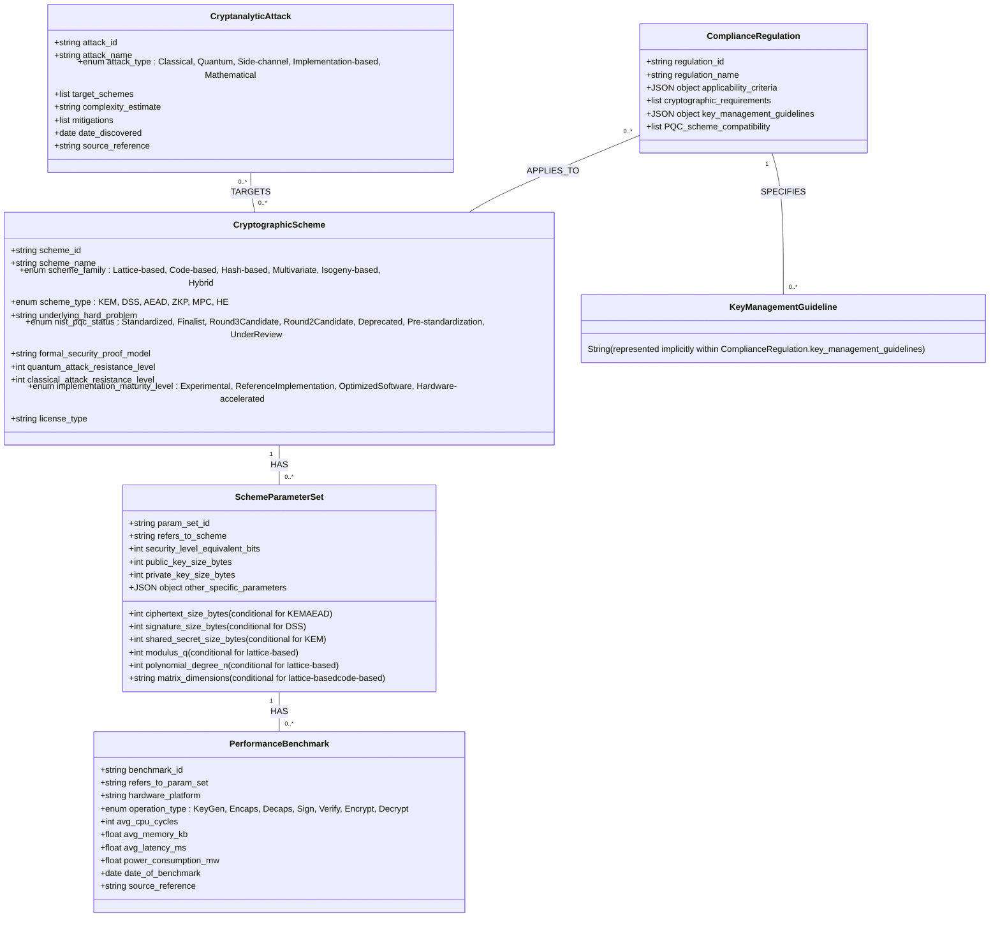

**Title of Invention:** Dynamic Cryptographic Knowledge Base DCKB Ontology Definition

**Abstract:**
This document formally defines the comprehensive ontology for the Dynamic Cryptographic Knowledge Base (DCKB), a critical component of the AI-Driven Heuristic Generation and Configuration of Quantum-Resilient Cryptographic Primitives and Protocols system. The ontology meticulously structures and interlinks disparate data points concerning post-quantum cryptographic (PQC) schemes, their parameterizations, performance benchmarks, cryptanalytic vulnerabilities, and regulatory compliance mandates. By establishing a robust and extensible semantic framework, this ontology empowers the Artificial Intelligence (AI) Cryptographic Inference Module (AIM) to perform sophisticated reasoning, multi-objective optimization, and contextually nuanced recommendations for quantum-resilient security solutions. This structured knowledge representation is fundamental to ensuring the system's accuracy, adaptability, and ability to remain at the forefront of evolving cryptographic landscapes and threat models.

**Introduction:**
The efficacy and intelligence of the AI-Driven Post-Quantum Cryptography (PQC) Generation System are profoundly dependent on its access to a continuously updated, highly structured, and semantically rich repository of cryptographic knowledge. This repository, termed the Dynamic Cryptographic Knowledge Base (DCKB), is engineered not merely as a flat database but as a sophisticated knowledge graph underpinned by a formal ontology. This ontology delineates the fundamental entities within the cryptographic domain, their intrinsic properties, and the intricate relationships that bind them.

The primary objectives of the DCKB ontology are:
*   **Semantic Richness:** To capture the deep meaning and context of cryptographic concepts, enabling the AI to understand nuances beyond keyword matching.
*   **Interoperability:** To facilitate seamless integration of diverse data sources, from academic papers to standardization documents and performance reports.
*   **Reasoning Enablement:** To provide a structured foundation that allows the AI Cryptographic Inference Module (AIM) to perform complex logical inferences, pattern recognition, and multi-objective optimization.
*   **Extensibility:** To allow for the effortless integration of new PQC schemes, updated research findings, novel attack vectors, and evolving regulatory mandates without requiring a complete redesign of the knowledge base.
*   **Accuracy and Consistency:** To enforce data integrity and consistency across all stored cryptographic information.

This document presents a detailed, formal definition of the DCKB ontology, outlining its core classes, their associated properties, and the relationships that connect them, thereby providing a definitive blueprint for the knowledge base's structure and semantic content.

### 1. Core Principles of DCKB Ontology Design

The design of the DCKB ontology adheres to several guiding principles to ensure its robustness, scalability, and utility for the AI-driven PQC generation system:

*   **Granularity:** Concepts are broken down into their smallest meaningful units to allow for precise representation and detailed querying.
*   **Modularity:** The ontology is designed with distinct classes representing specific domains (e.g., schemes, attacks, regulations), promoting clarity and maintainability.
*   **Relationship-Centric:** Explicit relationships between classes are defined to capture the interconnected nature of cryptographic knowledge, forming a true knowledge graph.
*   **Attribute Completeness:** Each class includes a comprehensive set of attributes (properties) that are critical for the AI's decision-making process.
*   **Temporal Awareness:** Where appropriate, properties include timestamps or versioning to reflect the dynamic nature of cryptographic research and standards.
*   **Source Attribution:** All ingested data points include references to their original sources to ensure verifiability and traceability.

### 2. DCKB Ontology Classes Detailed Definition

The DCKB ontology is built around a set of core classes, each representing a distinct conceptual entity within the post-quantum cryptographic ecosystem. Each class is defined by a unique identifier, descriptive properties, and its relationships to other classes.

#### 2.1. Class: CryptographicScheme

This class represents a specific post-quantum cryptographic algorithm or a foundational family of algorithms. It encapsulates the high-level characteristics that define a PQC scheme.

*   **`scheme_id`** (String): A unique, standardized identifier for the cryptographic scheme.
    *   *Example:* "Kyber1024", "Dilithium5", "SPHINCS+s-shake-256f".
    *   *Significance:* Essential for unambiguous referencing and linking across the knowledge graph.
*   **`scheme_name`** (String): The widely recognized, formal name of the cryptographic scheme.
    *   *Example:* "CRYSTALS-Kyber", "CRYSTALS-Dilithium", "SPHINCS+".
    *   *Significance:* Provides a human-readable name for identification and categorization.
*   **`scheme_family`** (Enum): Categorizes the scheme based on its underlying mathematical hardness problem.
    *   *Enum Values:* "Lattice-based", "Code-based", "Hash-based", "Multivariate", "Isogeny-based", "Hybrid".
    *   *Significance:* Crucial for high-level classification and initial filtering based on input requirements.
*   **`scheme_type`** (Enum): Specifies the primary cryptographic primitive function(s) provided by the scheme.
    *   *Enum Values:* "KEM" (Key Encapsulation Mechanism), "DSS" (Digital Signature Scheme), "AEAD" (Authenticated Encryption with Associated Data), "ZKP" (Zero-Knowledge Proof), "MPC" (Multi-Party Computation), "HE" (Homomorphic Encryption).
    *   *Significance:* Directly addresses the `requiredPrimitives` in the input specification, guiding the AI to select functionally appropriate schemes.
*   **`underlying_hard_problem`** (String): Describes the specific mathematical problem whose presumed intractability forms the security basis of the scheme.
    *   *Example:* "Module-LWE" (Module Learning With Errors), "SIS" (Short Integer Solution), "MDPC Decoding" (Moderate-Density Parity-Check Decoding), "Discrete Logarithm on Isogenies".
    *   *Significance:* Provides deep insight into the theoretical security and resilience against different types of attacks.
*   **`nist_pqc_status`** (Enum): Reflects the scheme's current status within the NIST Post-Quantum Cryptography Standardization process.
    *   *Enum Values:* "Standardized", "Finalist", "Round 3 Candidate", "Round 2 Candidate", "Deprecated", "Pre-standardization", "Under Review".
    *   *Significance:* Critical for compliance and assessing the maturity and community acceptance of a scheme.
*   **`formal_security_proof_model`** (String): Details the cryptographic security model under which the scheme has been formally proven secure.
    *   *Example:* "IND-CCA2" (Indistinguishability under Chosen Ciphertext Attack), "EUF-CMA" (Existential Unforgeability under Chosen Message Attack), "ROM" (Random Oracle Model), "QROM" (Quantum Random Oracle Model), "Standard Model".
    *   *Significance:* Provides a rigorous foundation for evaluating the theoretical security guarantees.
*   **`quantum_attack_resistance_level`** (Integer): The estimated equivalent classical bits of security against known quantum algorithms (e.g., Shor's, Grover's).
    *   *Example:* 128, 192, 256.
    *   *Significance:* Directly addresses the `targetSecurityLevel` desideratum, quantifying quantum resilience.
*   **`classical_attack_resistance_level`** (Integer): The estimated equivalent classical bits of security against known classical algorithms.
    *   *Example:* 125, 190, 250.
    *   *Significance:* Ensures the scheme is also robust against conventional cryptanalytic threats.
*   **`implementation_maturity_level`** (Enum): Indicates the readiness and optimization level of available implementations.
    *   *Enum Values:* "Experimental", "Reference Implementation", "Optimized Software", "Hardware-accelerated".
    *   *Significance:* Informs practical deployability and performance expectations, especially for resource-constrained environments.
*   **`license_type`** (String): Specifies the software license under which reference implementations or libraries are distributed.
    *   *Example:* "MIT", "Apache 2.0", "Public Domain", "Proprietary".
    *   *Significance:* Important for legal and project management considerations during integration.

#### 2.2. Class: SchemeParameterSet

This class defines a specific set of parameters for a given `CryptographicScheme`, representing a particular instantiation that offers a defined security level and performance profile. A single scheme can have multiple parameter sets.

*   **`param_set_id`** (String): A unique identifier for this specific parameter set.
    *   *Example:* "Kyber768_NIST_Level3", "Dilithium5_NIST_Level5".
    *   *Significance:* Allows granular selection of scheme configurations.
*   **`refers_to_scheme`** (Reference to `CryptographicScheme.scheme_id`): Links this parameter set to its parent cryptographic scheme.
    *   *Significance:* Establishes a clear hierarchical relationship.
*   **`security_level_equivalent_bits`** (Integer): The classical security strength this parameter set aims to achieve (e.g., equivalent to AES-128, AES-192, AES-256).
    *   *Example:* 128, 192, 256.
    *   *Significance:* A primary metric for matching `targetSecurityLevel` requirements.
*   **`public_key_size_bytes`** (Integer): The size of the public key in bytes for this parameter set.
    *   *Significance:* Influences network bandwidth and storage requirements.
*   **`private_key_size_bytes`** (Integer): The size of the private key in bytes for this parameter set.
    *   *Significance:* Influences secure storage and memory footprint.
*   **`ciphertext_size_bytes`** (Integer, conditional for KEM/AEAD): The size of the ciphertext or encapsulated key in bytes.
    *   *Significance:* Crucial for network and storage costs in KEMs and AEADs.
*   **`signature_size_bytes`** (Integer, conditional for DSS): The size of the digital signature in bytes.
    *   *Significance:* Impacts network bandwidth and storage for signature-based authentication.
*   **`shared_secret_size_bytes`** (Integer, conditional for KEM): The size of the shared secret derived from a KEM in bytes.
    *   *Significance:* Important for subsequent symmetric encryption key derivation.
*   **`modulus_q`** (Integer, conditional for lattice-based): The prime modulus used in lattice-based schemes.
    *   *Example:* 3329 (for Kyber).
    *   *Significance:* A fundamental mathematical parameter affecting security and performance.
*   **`polynomial_degree_n`** (Integer, conditional for lattice-based): The degree of polynomials used in ring- or module-lattice constructions.
    *   *Example:* 256 (for Kyber).
    *   *Significance:* Another core mathematical parameter.
*   **`matrix_dimensions`** (String, conditional for lattice-based/code-based): Describes the dimensions of matrices or codes used.
    *   *Example:* "k x k" for lattice matrices, "n x k" for code-based parity-check matrices.
    *   *Significance:* Provides structural detail for the scheme.
*   **`other_specific_parameters`** (JSON object): A flexible field to store any additional, scheme-specific parameters not covered by generic properties.
    *   *Example:* For SPHINCS+, this might include tree height, number of layers, or hash function choices (e.g., "shake-256f").
    *   *Significance:* Ensures comprehensive parameterization for all PQC schemes.

#### 2.3. Class: PerformanceBenchmark

This class captures empirical or simulated performance metrics for specific `SchemeParameterSet` instances across various hardware platforms and operational contexts. This data is vital for optimizing against performance priorities.

*   **`benchmark_id`** (String): A unique identifier for this specific benchmark record.
    *   *Significance:* Enables tracking and referencing individual performance measurements.
*   **`refers_to_param_set`** (Reference to `SchemeParameterSet.param_set_id`): Links the benchmark to the specific parameter set it evaluates.
    *   *Significance:* Ensures performance data is tied to precise scheme configurations.
*   **`hardware_platform`** (String): Describes the hardware environment on which the benchmark was conducted.
    *   *Example:* "Intel Xeon E5-2690 v4", "ARM Cortex-M0", "Raspberry Pi 4", "FPGA Xilinx Zynq".
    *   *Significance:* Essential for matching `operationalEnvironment.computationalResources`.
*   **`operation_type`** (Enum): The specific cryptographic operation being measured.
    *   *Enum Values:* "KeyGen" (Key Generation), "Encaps" (Key Encapsulation), "Decaps" (Key Decapsulation), "Sign" (Signature Generation), "Verify" (Signature Verification), "Encrypt", "Decrypt".
    *   *Significance:* Allows the AI to evaluate performance for required primitives.
*   **`avg_cpu_cycles`** (Integer): The average number of CPU cycles consumed for the operation.
    *   *Significance:* A granular measure of computational cost, especially for embedded systems.
*   **`avg_memory_kb`** (Float): The average memory footprint (e.g., RAM usage) in kilobytes during the operation.
    *   *Significance:* Addresses `operationalEnvironment.computationalResources` and resource constraints.
*   **`avg_latency_ms`** (Float): The average execution time in milliseconds for the operation.
    *   *Significance:* Directly informs `securityDesiderata.performancePriority` for real-time applications.
*   **`power_consumption_mw`** (Float): The average power consumption in milliwatts during the operation.
    *   *Significance:* Critical for battery-powered or energy-constrained IoT devices.
*   **`date_of_benchmark`** (Date): The date when the benchmark data was collected or published.
    *   *Significance:* Helps in assessing the recency and relevance of the performance data.
*   **`source_reference`** (String): A URL, DOI, or publication reference for the benchmark data.
    *   *Significance:* Ensures traceability and verifiability of performance claims.

#### 2.4. Class: CryptanalyticAttack

This class captures information about known or theoretical cryptanalytic attacks that could compromise the security of cryptographic schemes, including both classical and quantum threats.

*   **`attack_id`** (String): A unique identifier for the attack.
    *   *Significance:* For unambiguous referencing of attack vectors.
*   **`attack_name`** (String): The descriptive name of the cryptanalytic attack.
    *   *Example:* "Lattice Sieving", "Information Set Decoding", "Shor's Algorithm", "Grover's Algorithm", "Fault Injection Attack".
    *   *Significance:* Provides a clear identifier for threat modeling.
*   **`attack_type`** (Enum): Classifies the nature of the attack.
    *   *Enum Values:* "Classical", "Quantum", "Side-channel", "Implementation-based", "Mathematical".
    *   *Significance:* Helps in understanding the capabilities of the `adversaryModel`.
*   **`target_schemes`** (List of `CryptographicScheme.scheme_id`): A list of cryptographic schemes known or theorized to be vulnerable to this attack.
    *   *Significance:* Establishes direct links between attacks and their potential targets.
*   **`complexity_estimate`** (String): An estimate of the computational resources (e.g., time, memory, quantum gates) required to execute the attack.
    *   *Example:* "2^128 classical bits", "O(N^3) quantum operations", "polynomial time on quantum computer".
    *   *Significance:* Quantifies the severity of the threat and informs security level assessment.
*   **`mitigations`** (List of Strings): Describes known countermeasures or design principles that can mitigate the attack.
    *   *Example:* "Higher security parameters", "Constant-time implementation", "Hardware isolation".
    *   *Significance:* Guides the AI in formulating secure private key handling instructions and selecting resilient schemes.
*   **`date_discovered`** (Date): The date when the attack was first discovered or publicly disclosed.
    *   *Significance:* Helps assess the recency of the threat and the maturity of countermeasures.
*   **`source_reference`** (String): A URL, DOI, or publication reference for the attack details.
    *   *Significance:* Ensures traceability and verifiability of attack claims.

#### 2.5. Class: ComplianceRegulation

This class defines various regulatory frameworks, industry standards, and organizational policies that impose requirements on cryptographic practices.

*   **`regulation_id`** (String): A unique identifier for the regulation or standard.
    *   *Example:* "FIPS140-3_Level2", "PCI-DSS_4.0", "GDPR_Article32", "HIPAA_SecurityRule".
    *   *Significance:* For precise referencing of compliance mandates.
*   **`regulation_name`** (String): The full, official name of the regulation or standard.
    *   *Example:* "Federal Information Processing Standards Publication 140-3 Security Requirements for Cryptographic Modules Level 2".
    *   *Significance:* Provides a human-readable name.
*   **`applicability_criteria`** (JSON object): Specifies the conditions under which this regulation applies.
    *   *Example:* `{"data_sensitivity": "PHI", "operational_environment": "Healthcare"}` or `{"data_category": "PaymentCardData", "entity_type": "Merchant"}`.
    *   *Significance:* Enables the AI to determine which regulations are relevant based on the input specification.
*   **`cryptographic_requirements`** (List of Strings): Specific requirements related to cryptographic primitives, key lengths, and algorithm choices mandated by the regulation.
    *   *Example:* "Mandatory use of NIST-approved algorithms", "Minimum 128-bit symmetric equivalent security", "Approved KEMs only".
    *   *Significance:* Directly informs scheme selection and parameterization.
*   **`key_management_guidelines`** (JSON object): Detailed prescriptions or recommendations for secure key generation, storage, usage, backup, and destruction.
    *   *Example:* `{"storage": "FIPS 140-3 Level 2 certified HSM", "backup": "M-of-N secret sharing", "rotation_frequency": "Annually"}`.
    *   *Significance:* Crucial for formulating comprehensive private key handling instructions.
*   **`PQC_scheme_compatibility`** (List of `CryptographicScheme.scheme_id`): A list of PQC schemes known to be compatible with or recommended by this regulation (if specified).
    *   *Significance:* Provides explicit guidance on preferred schemes for compliance.

### 3. Relationships and Knowledge Graph Structure

The power of the DCKB ontology lies in its ability to model intricate relationships between these distinct classes, forming a rich knowledge graph that the AI can traverse and query. These relationships are either explicitly defined or implicitly understood through property references.

*   **`CryptographicScheme` HAS `SchemeParameterSet` (One-to-Many):** A single cryptographic scheme can have multiple associated parameter sets, each offering different security/performance trade-offs.
    *   *Example:* CRYSTALS-Kyber (Scheme) HAS Kyber512, Kyber768, Kyber1024 (Parameter Sets).
*   **`SchemeParameterSet` HAS `PerformanceBenchmark` (One-to-Many):** A specific parameter set can have numerous performance benchmarks, reflecting measurements across different hardware platforms and operational contexts.
    *   *Example:* Kyber768_NIST_Level3 (Parameter Set) HAS CPU cycles on Intel Xeon, CPU cycles on ARM Cortex-M0, Memory footprint on cloud server.
*   **`CryptanalyticAttack` TARGETS `CryptographicScheme` (Many-to-Many):** An attack can target one or more cryptographic schemes, and a scheme can be targeted by multiple attacks.
    *   *Example:* Shor's Algorithm (Attack) TARGETS RSA, ECC. Lattice Sieving (Attack) TARGETS Kyber, Dilithium.
*   **`ComplianceRegulation` APPLIES_TO `CryptographicScheme` (Many-to-Many, indirectly via properties):** Regulations do not directly target schemes, but their `cryptographic_requirements` and `PQC_scheme_compatibility` properties implicitly link them to schemes. The AI evaluates this relationship based on scheme properties.
    *   *Example:* FIPS 140-3 (Regulation) implicitly APPLIES_TO Kyber, Dilithium if they meet certification criteria.
*   **`ComplianceRegulation` SPECIFIES `KeyManagementGuideline` (One-to-Many):** A regulation often specifies multiple guidelines for secure key management. These are captured within the `key_management_guidelines` property.
    *   *Example:* PCI-DSS 4.0 (Regulation) SPECIFIES guidelines for storage, access control, and destruction of private keys.

This interconnected structure enables the AI to perform complex queries such as: "Find all lattice-based KEMs that are NIST finalists, offer NIST Level 5 security, perform well on ARM Cortex-M0 devices, are not known to be vulnerable to side-channel attacks, and are compatible with FIPS 140-3 Level 2 requirements for PHI data."

*Figure 1: Detailed DCKB Ontology Class Diagram.*

### 4. Knowledge Graph Representation and AIM Interaction

The defined ontology serves as the conceptual schema for constructing the actual Dynamic Cryptographic Knowledge Base as a graph database (e.g., Neo4j, JanusGraph). In this representation:
*   **Classes** become node labels.
*   **Properties** become attributes of these nodes.
*   **Relationships** become directed edges between nodes.

The AI Cryptographic Inference Module (AIM) interacts with this knowledge graph through sophisticated knowledge graph traversal (KGT-R) and embedding techniques. When the AIM receives a query (the contextualized prompt), it:
1.  **Embeds the Query:** Transforms the input query into a latent vector representation.
2.  **Queries the Graph:** Utilizes this embedding to perform semantic searches and path traversals within the knowledge graph. This involves identifying relevant `CryptographicScheme` nodes, their linked `SchemeParameterSet` instances, associated `PerformanceBenchmark` data for the specified hardware, `CryptanalyticAttack` nodes that target them, and `ComplianceRegulation` nodes whose criteria match the input.
3.  **Knowledge Fusion:** Aggregates and synthesizes the retrieved information, creating a comprehensive context for the multi-objective optimization process.
4.  **Reasoning and Inference:** Applies logical rules and learned patterns over the graph to infer optimal choices, identify trade-offs, and generate the final PQC configuration and detailed instructions.

This ontological foundation ensures that the AIM's recommendations are not based on simple keyword matches but on a deep, structural, and semantic understanding of the cryptographic landscape, guaranteeing robust, accurate, and adaptive security solutions.

**Conclusion:**
The DCKB ontology provides an essential, well-defined, and extensible framework for managing the vast and complex body of knowledge required for AI-driven post-quantum cryptographic configuration. By formally structuring cryptographic schemes, their parameters, performance data, attack vectors, and regulatory requirements, this ontology underpins the intelligence of the AI Cryptographic Inference Module, enabling it to deliver precise, contextually relevant, and quantum-resilient security solutions. This semantic foundation is a cornerstone of the invention's ability to automate and democratize access to advanced cryptographic expertise in the quantum era.