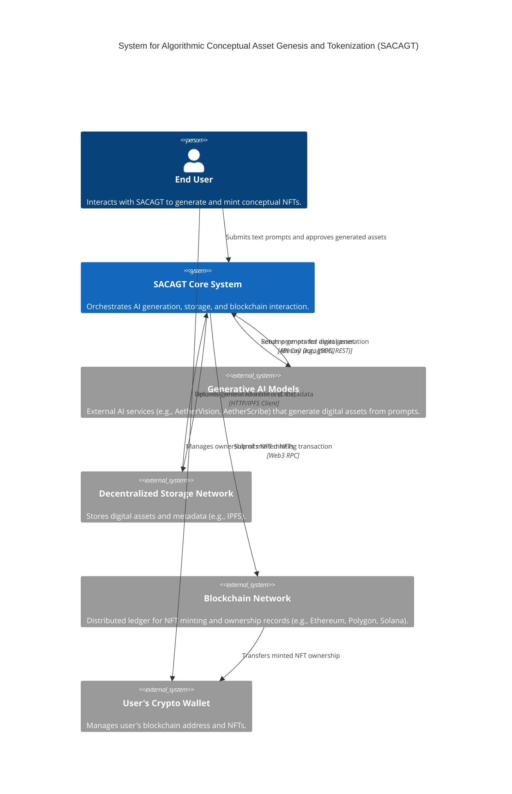
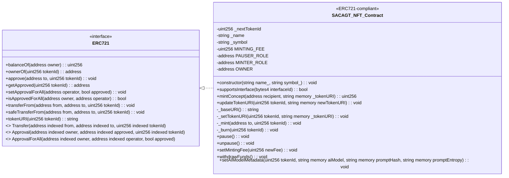

**Title of Invention:** System and Method for Algorithmic Conceptual Asset Genesis and Tokenization (SACAGT)

**Abstract:**
A technologically advanced system is herein delineated for the automated generation and immutable tokenization of novel conceptual constructs. A user-initiated abstract linguistic prompt, conceptualized as a "conceptual genotype," is transmitted to a sophisticated ensemble of generative artificial intelligence (AI) models. These models, leveraging advanced neural architectures, transmute the abstract genotype into a tangible digital artifact, herein termed a "conceptual phenotype," which may manifest as a high-fidelity image, a detailed textual schema, a synthetic auditory composition, or a three-dimensional volumetric data structure. Subsequent to user validation and approval, the SACAGT system orchestrates the cryptographic registration and permanent inscription of this AI-generated conceptual phenotype, alongside its progenitor prompt, as a Non-Fungible Token (NFT) upon a distributed ledger technology (DLT) framework. This process establishes an irrefutable, cryptographically secured, and perpetually verifiable chain of provenance, conferring undeniable ownership of a unique, synergistically co-created human-AI conceptual entity. This invention fundamentally redefines the paradigms of intellectual property generation and digital asset ownership, extending beyond mere representation of existing assets to encompass the genesis and proprietary attribution of emergent conceptual entities.

**Background of the Invention:**
Conventional methodologies for Non-Fungible Token (NFT) instantiation predominantly involve the tokenization of pre-existing digital assets, such as digital artworks, multimedia files, or collectible representations, which have been independently created prior to their integration with a distributed ledger. This bifurcated operational paradigm, characterized by a distinct separation between asset creation and subsequent tokenization, introduces several systemic inefficiencies and conceptual limitations. Primarily, it necessitates disparate workflows, often managed by different entities or technological stacks, thereby impeding a seamless transition from ideation to verifiable digital ownership. Furthermore, existing frameworks are not inherently designed to accommodate the nascent concept itself as the primary object of tokenization, particularly when that concept originates from an abstract, non-physical prompt. The prevalent model treats the digital asset as a mere wrapper for an already formed idea, rather than facilitating the genesis of the idea itself within the tokenization pipeline.

A significant lacuna exists within the extant digital asset ecosystem concerning the integrated and automated generation, formalization, and proprietary attribution of purely conceptual or "dream-like" artifacts. Such artifacts, often ephemeral in their initial conception, necessitate a robust, verifiable mechanism for their transformation into persistent, ownable digital entities. The absence of an integrated system capable of bridging the cognitive gap between abstract human ideation and its concrete digital representation, followed by immediate and verifiable tokenization, represents a critical impediment to the comprehensive expansion of digital intellectual property domains. This invention addresses this fundamental unmet need by pioneering a seamless, end-to-end operational continuum where the act of creative generation, specifically through advanced artificial intelligence, is intrinsically intertwined with the act of immutable tokenization, thereby establishing a novel frontier for digital ownership.

**Brief Summary of the Invention:**
The present invention, herein formally designated as the **System for Algorithmic Conceptual Asset Genesis and Tokenization (SACAGT)**, establishes an advanced, integrated framework for the programmatic generation and immutable inscription of novel conceptual assets as Non-Fungible Tokens (NFTs). The SACAGT system provides an intuitive and robust interface through which a user can furnish an abstract linguistic prompt, functioning as a "conceptual genotype" (e.g., "A subterranean metropolis illuminated by bio-luminescent flora," or "The symphony of a dying star translated into kinetic sculpture").

Upon receipt of the user's conceptual genotype, the SACAGT system initiates a highly sophisticated, multi-stage generative process:
1.  **Semantic Decomposition and Intent Recognition:** The input prompt undergoes advanced natural language processing (NLP) to parse semantic nuances, identify key thematic elements, and infer user intent, potentially routing the prompt to specialized generative AI models.
2.  **Algorithmic Conceptual Phenotype Generation:** The processed prompt is then transmitted to a meticulously selected ensemble of one or more generative AI models (e.g., advanced text-to-image diffusion models such as a proprietary AetherVision architecture, text-to-text generative transformers like a specialized AetherScribe, or even nascent text-to-3D synthesis engines like AetherVolumetric). These models leverage high-dimensional latent space traversal and sophisticated inference mechanisms to produce a digital representation—the "conceptual phenotype"—which concretizes the abstract user prompt. This phenotype can be a high-resolution image, a richly detailed textual narrative, a synthetic soundscape, or a parametric 3D model.
3.  **User Validation and Iterative Refinement:** The generated conceptual phenotype is presented to the originating user via a dedicated interface for critical evaluation and approval. The system may incorporate mechanisms for iterative refinement, allowing the user to provide feedback that can guide subsequent AI regeneration cycles, optimizing the phenotype's alignment with the original conceptual genotype.
4.  **Decentralized Content Addressable Storage:** Upon explicit user approval, the SACAGT system automatically orchestrates the secure and decentralized storage of the conceptual phenotype. This involves uploading the digital asset to a robust, content-addressed storage network, such as the InterPlanetary File System (IPFS) or similar distributed hash table (DHT) based architectures. This process yields a unique, cryptographic content identifier (CID) that serves as an immutable, globally verifiable pointer to the asset.
5.  **Metadata Manifestation and Storage:** Concurrently, a standardized metadata manifest, typically conforming to established NFT metadata schema (e.g., ERC-721 or ERC-1155 compliant JSON), is programmatically constructed. This manifest encapsulates critical information, including the conceptual phenotype's name, the original conceptual genotype, and a URI reference to the asset's decentralized storage CID. This metadata file is itself uploaded to the same decentralized storage network, yielding a second, distinct CID.
6.  **Immutable Tokenization on a Distributed Ledger:** The system then orchestrates a transaction invoking a `mint` function on a pre-deployed, audited, and highly optimized NFT smart contract residing on a chosen distributed ledger technology (e.g., Ethereum, Polygon, Solana, Avalanche). This transaction immutably records the user's wallet address as the owner, and crucially, embeds the decentralized storage URI of the metadata manifest. This action creates a new, cryptographically unique Non-Fungible Token, where the token's identity and provenance are intrinsically linked to the AI-generated conceptual phenotype and its originating prompt.
7.  **Proprietary Attribution and Wallet Integration:** Upon successful confirmation of the transaction on the distributed ledger, the newly minted NFT, representing the unique, AI-generated conceptual entity, is verifiably transferred to the user's designated blockchain wallet address. This process irrevocably assigns proprietary attribution to the user, providing an irrefutable, timestamped record of ownership.

This seamless, integrated workflow ensures that the generation of a novel concept by AI and its subsequent tokenization as an ownable digital asset are executed within a single, coherent operational framework, thereby establishing a new paradigm for intellectual property creation and digital asset management.

### System Architecture Overview



**Detailed Description of the Invention:**

The **System for Algorithmic Conceptual Asset Genesis and Tokenization (SACAGT)** comprises a highly integrated and modular architecture designed to facilitate the end-to-end process of generating novel conceptual assets via artificial intelligence and subsequently tokenizing them on a distributed ledger. The operational flow, from user input to final token ownership, is meticulously engineered to ensure robust functionality, security, and verifiability.

### 1. User Interface and Prompt Submission Module (UIPSM)

The initial interaction point for a user is through the **User Interface and Prompt Submission Module (UIPSM)**. This module is architected to provide an intuitive and responsive experience, allowing users to articulate their abstract conceptual genotypes.

*   **Prompt Input Interface:** A dynamic text entry field, potentially supporting rich text formatting and character limits, where users articulate their conceptual genotype. Advanced versions may include:
    *   **Semantic Autocompletion:** Suggesting keywords, concepts, or stylistic modifiers to enhance prompt efficacy.
    *   **Prompt Engineering Guidance:** Providing real-time feedback on prompt clarity, specificity, and potential for generative AI interpretation.
    *   **Multi-Modal Prompting:** Interfaces for incorporating existing visual, auditory, or textual components as contextualizers or stylistic guides for the generative AI.
*   **User Authentication and Wallet Connection:** Integration with standard Web3 wallet providers (e.g., MetaMask, WalletConnect) to authenticate the user and establish a secure connection to their blockchain address, which will serve as the recipient for minted NFTs.
*   **Session Management:** Persistent session tracking to allow users to review past prompts, generated assets, and transaction histories.

### 2. Backend Processing and Orchestration Layer (BPOL)

The **Backend Processing and Orchestration Layer (BPOL)** serves as the central nervous system of the SACAGT system, coordinating all subsequent operations.

#### 2.1. Prompt Pre-processing and Routing Subsystem (PPRSS)

Upon receiving a conceptual genotype from the UIPSM, the PPRSS performs several critical functions:

*   **Natural Language Understanding (NLU):** Utilizes advanced transformer-based models (e.g., specialized BERT or GPT variants) to analyze the prompt for:
    *   **Syntactic and Semantic Analysis:** Decomposing the prompt into its grammatical components and identifying core semantic entities, relationships, and attributes.
    *   **Sentiment and Tone Analysis:** Assessing the emotional context of the prompt to guide generative AI style.
    *   **Ambiguity Resolution:** Employing contextual reasoning to minimize misinterpretation by generative models.
*   **Prompt Augmentation and Expansion (Optional):** May leverage internal knowledge graphs or large language models to expand vague prompts into more descriptive or structured formats, enhancing the generative AI's input quality.
*   **Model Selection and Routing:** Based on the NLU analysis and user-specified preferences (e.g., desired output modality: image, text, 3D), the PPRSS intelligently routes the prompt to the most appropriate external Generative AI Model. This routing may involve:
    *   **Modality Mapping:** Directing image-oriented prompts to AetherVision, narrative prompts to AetherScribe, etc.
    *   **Complexity-Based Routing:** Allocating complex, high-detail prompts to more powerful (and potentially more resource-intensive) AI models.
    *   **Style-Based Routing:** Directing prompts seeking specific artistic or literary styles to specialized AI fine-tuned for those aesthetics.

#### 2.2. Generative AI Interaction Module (GAIIM)

The GAIIM acts as the interface between the SACAGT system and external, specialized generative AI models.

*   **API Abstraction Layer:** Provides a unified interface for interacting with diverse AI model APIs, abstracting away model-specific idiosyncrasies. This facilitates integration of various models such as:
    *   **Text-to-Image Models (e.g., AetherVision):** Advanced diffusion or GAN-based architectures capable of synthesizing high-fidelity visual imagery from textual descriptions. These models operate in high-dimensional latent spaces, iteratively refining pixel data to match semantic cues.
    *   **Text-to-Text Models (e.g., AetherScribe):** Large Language Models (LLMs) specialized in creative writing, narrative generation, poetry, or detailed conceptual descriptions, expanding the initial prompt into rich textual conceptual phenotypes.
    *   **Text-to-3D Models (e.g., AetherVolumetric):** Emerging models capable of generating 3D meshes, point clouds, or volumetric data representations from textual prompts, enabling the creation of virtual objects.
    *   **Text-to-Audio/Music Models:** Generating soundscapes or musical compositions.
*   **Parameter Management:** Manages and transmits model-specific parameters (e.g., `sampling_steps`, `guidance_scale`, `seed` values for deterministic regeneration, `output_resolution`) to the AI models.
*   **Asynchronous Inference Handling:** Manages the potentially long-running inference processes of generative AIs, providing status updates to the user.
*   **Output Reception and Validation:** Receives the generated digital asset (conceptual phenotype) from the AI model and performs initial validation (e.g., file format verification, basic content integrity checks).

#### 2.3. Asset Presentation and Approval Module (APAM)

The APAM is responsible for displaying the generated conceptual phenotype to the user and managing their approval.

*   **High-Fidelity Rendering:** Presents the digital asset (image, text, 3D model preview, audio playback) in a clear and engaging manner within the UIPSM.
*   **Approval/Rejection Mechanism:** Provides explicit controls for the user to approve the asset for minting or reject it, potentially triggering a re-generation loop with refined parameters or prompt adjustments.
*   **Iterative Refinement Interface (Optional):** Allows users to provide textual or visual feedback on the generated asset, which the PPRSS can then use to modify the original prompt or guide subsequent AI generations.

#### 2.4. Decentralized Storage Integration Module (DSIM)

Upon user approval, the DSIM handles the secure and verifiable storage of the conceptual phenotype and its associated metadata.

*   **Asset Upload to IPFS/DHT:**
    *   The digital asset (e.g., `conceptual_phenotype.png`) is segmented into cryptographic chunks and uploaded to a decentralized storage network such as IPFS.
    *   This process generates a unique **Content Identifier (CIDv1)**, which is a cryptographically derived hash of the asset's content. This CID serves as an immutable, globally resolvable address for the asset, ensuring data integrity and resistance to censorship.
    *   The CID format is typically `bafy...`, a multihash encoding that includes the hashing algorithm and length.
*   **Metadata JSON Generation:** A JSON object is programmatically constructed, adhering to established NFT metadata standards (e.g., ERC-721 Metadata JSON Schema). This JSON includes:
    *   `name`: A human-readable name for the conceptual NFT, potentially derived from the original prompt or an AI-generated title.
    *   `description`: The original user prompt (conceptual genotype) and/or an AI-generated descriptive expansion.
    *   `image`: The `ipfs://<asset_CID>` URI pointing directly to the stored conceptual phenotype.
    *   `attributes`: An array of key-value pairs representing additional metadata, such as:
        *   `AI_Model`: The specific generative AI model used (e.g., "AetherVision v3.1").
        *   `Creation_Timestamp`: UTC timestamp of asset generation.
        *   `Original_Prompt_Hash`: A cryptographic hash of the original text prompt.
        *   `Prompt_Entropy`: A measure of the informational complexity of the original prompt.
        *   `Style_Tags`: AI-inferred stylistic attributes.
    *   `external_url`: (Optional) A link to a SACAGT platform page for the NFT.
*   **Metadata Upload to IPFS/DHT:** The generated metadata JSON file is itself uploaded to the decentralized storage network, yielding a second, distinct **Metadata CID**. This CID forms the crucial link that the smart contract will store.

### 3. Blockchain Interaction and Smart Contract Module (BISCM)

The BISCM is responsible for constructing, signing, and submitting transactions to the blockchain to mint the NFT and for managing the smart contract lifecycle.

*   **Smart Contract Abstraction Layer:** Interacts with a pre-deployed, audited NFT smart contract, typically implementing the ERC-721 (Non-Fungible Token Standard) or ERC-1155 (Multi Token Standard) interface.
    *   **ERC-721 `mint(address recipient, string memory tokenURI)`:** This core function is invoked. `recipient` is the user's wallet address, and `tokenURI` is the `ipfs://<metadata_CID>` URI.
    *   Additional functions: `tokenURI(uint256 tokenId)`, `ownerOf(uint256 tokenId)`, `approve(address to, uint256 tokenId)`, `setApprovalForAll(address operator, bool approved)`, etc.
*   **Transaction Construction:**
    *   Prepares a blockchain transaction by encoding the `mint` function call with the appropriate parameters (user's wallet address and the `ipfs://<metadata_CID>`).
    *   Estimates gas costs for the transaction.
*   **Transaction Signing:** Leverages the user's connected wallet (via Web3 providers) to cryptographically sign the transaction. The SACAGT system never has direct access to the user's private keys.
*   **Transaction Submission:** Transmits the signed transaction to the chosen blockchain network via a secure RPC (Remote Procedure Call) endpoint.
*   **Transaction Monitoring and Confirmation:** Monitors the blockchain for the confirmation of the transaction. Once confirmed (i.e., included in a block and sufficiently deep in the chain to be considered final), the NFT is officially minted and owned by the user. The SACAGT system updates its internal state and notifies the user.

### 4. Smart Contract Architecture for SACAGT NFTs

The core of the tokenization process resides within a meticulously engineered smart contract deployed on a blockchain. This contract adheres to the ERC-721 standard, ensuring interoperability with the broader NFT ecosystem.



**Key Smart Contract Features:**

*   **`mintConcept(address recipient, string memory _tokenURI)`:** This is the core function invoked by the BISCM. It takes the target owner's address and the `ipfs://<metadata_CID>` as parameters. It increments a unique `_nextTokenId`, creates a new NFT with this ID, assigns ownership to the `recipient`, and permanently associates the `_tokenURI` with the token.
*   **Access Control:** Implementation of roles (e.g., `MINTER_ROLE`, `PAUSER_ROLE`, `OWNER`) using OpenZeppelin's `AccessControl` library to restrict critical functions like `mintConcept` to authorized backend components or multisig wallets, enhancing security.
*   **Upgradability:** Potentially implemented using proxy patterns (e.g., UUPS proxy) to allow future enhancements or bug fixes to the contract logic without altering the token IDs or ownership structure.
*   **Metadata Immutability:** While the `_tokenURI` typically points to an immutable IPFS CID, the contract itself may offer a controlled `updateTokenURI` function, restricted to the token owner or an authorized entity, for scenarios requiring dynamic metadata updates (e.g., evolving AI models, game integration). However, for core conceptual assets, strict immutability of the initial metadata URI is preferred.
*   **Royalty Standard Implementation:** Integration of EIP-2981 (NFT Royalty Standard) to enable creators and the SACAGT platform to receive programmatic royalties on secondary sales.
*   **Energy Efficiency:** Optimized Solidity code to minimize gas consumption during minting, promoting cost-effectiveness and network sustainability.

```mermaid
graph TD
    A[User Submits Conceptual Genotype (Prompt)] --> B{Backend Processing and Orchestration Layer (BPOL)}
    B --> C[Prompt Pre-processing and Routing Subsystem (PPRSS)]
    C --> D{Generative AI Interaction Module (GAIIM)}
    D --> E[External Generative AI Models]
    E -- Generated Conceptual Phenotype (Digital Asset) --> D
    D --> F[Asset Presentation and Approval Module (APAM)]
    F -- Approved by User --> G[Decentralized Storage Integration Module (DSIM)]
    G -- Upload Asset --> H[Decentralized Storage (e.g., IPFS)]
    H -- Asset CID --> G
    G -- Generate & Upload Metadata JSON --> H
    H -- Metadata CID --> G
    G --> I[Blockchain Interaction and Smart Contract Module (BISCM)]
    I -- Construct Mint Transaction (Recipient, Metadata CID) --> J[Blockchain Network]
    J -- Signs Transaction (User's Wallet) --> J
    J -- Submits Transaction --> K[NFT Smart Contract on Blockchain]
    K -- Mints New NFT & Assigns Ownership --> L[User's Crypto Wallet]
    L -- Verifiable Ownership --> A
```

**Claims:**

1.  A system for generating and tokenizing conceptual assets, comprising:
    a.  A User Interface and Prompt Submission Module (UIPSM) configured to receive a linguistic conceptual genotype from a user;
    b.  A Backend Processing and Orchestration Layer (BPOL) configured to:
        i.  Process the linguistic conceptual genotype via a Prompt Pre-processing and Routing Subsystem (PPRSS) utilizing Natural Language Understanding (NLU) mechanisms;
        ii. Transmit the processed conceptual genotype to at least one external Generative AI Model via a Generative AI Interaction Module (GAIIM) to synthesize a digital conceptual phenotype;
        iii. Present the digital conceptual phenotype to the user via an Asset Presentation and Approval Module (APAM) for explicit user validation;
        iv. Upon user validation, transmit the digital conceptual phenotype to a Decentralized Storage Integration Module (DSIM);
    c.  The Decentralized Storage Integration Module (DSIM) configured to:
        i.  Upload the digital conceptual phenotype to a content-addressed decentralized storage network to obtain a unique content identifier (CID);
        ii. Generate a structured metadata manifest associating the conceptual genotype with the conceptual phenotype's CID;
        iii. Upload the structured metadata manifest to the content-addressed decentralized storage network to obtain a unique metadata CID;
    d.  A Blockchain Interaction and Smart Contract Module (BISCM) configured to:
        i.  Construct a transaction to invoke a `mint` function on a pre-deployed Non-Fungible Token (NFT) smart contract, providing the user's blockchain address and the unique metadata CID as parameters;
        ii. Facilitate the cryptographic signing of the transaction by the user's blockchain wallet;
        iii. Submit the signed transaction to a blockchain network;
    e.  A Non-Fungible Token (NFT) smart contract, deployed on the blockchain network, configured to, upon successful transaction execution, immutably create a new NFT, associate it with the provided metadata CID, and assign its ownership to the user's blockchain address.

2.  The system of claim 1, wherein the Generative AI Model is selected from the group consisting of a text-to-image model, a text-to-text model, a text-to-3D model, and a text-to-audio model.

3.  The system of claim 1, wherein the content-addressed decentralized storage network is the InterPlanetary File System (IPFS).

4.  The system of claim 1, wherein the NFT smart contract adheres to the ERC-721 token standard or the ERC-1155 token standard.

5.  The system of claim 1, further comprising a Prompt Pre-processing and Routing Subsystem (PPRSS) configured to perform semantic augmentation or expansion of the linguistic conceptual genotype prior to transmission to the Generative AI Model.

6.  The system of claim 1, wherein the structured metadata manifest includes attributes detailing the specific Generative AI Model utilized, a cryptographic hash of the original conceptual genotype, and an entropy measure of the conceptual genotype.

7.  A method for establishing verifiable ownership of an AI-generated conceptual asset, comprising:
    a.  Receiving a linguistic conceptual genotype from a user via a user interface;
    b.  Transmitting the linguistic conceptual genotype to a generative artificial intelligence model to synthesize a digital conceptual phenotype;
    c.  Presenting the digital conceptual phenotype to the user for explicit approval;
    d.  Upon approval, uploading the digital conceptual phenotype to a content-addressed decentralized storage system to obtain a first unique content identifier;
    e.  Creating a machine-readable metadata manifest comprising the linguistic conceptual genotype and a reference to the first unique content identifier;
    f.  Uploading the machine-readable metadata manifest to the content-addressed decentralized storage system to obtain a second unique content identifier;
    g.  Initiating a blockchain transaction to invoke a minting function on a pre-deployed Non-Fungible Token smart contract, passing the user's blockchain address and the second unique content identifier as parameters;
    h.  Facilitating the cryptographic signing of the transaction by the user;
    i.  Submitting the signed transaction to a blockchain network;
    j.  Upon confirmation of the transaction on the blockchain network, irrevocably assigning ownership of the newly minted Non-Fungible Token, representing the AI-generated conceptual asset, to the user's blockchain address.

8.  The method of claim 7, further comprising an iterative refinement step wherein user feedback on a presented digital conceptual phenotype guides subsequent generative AI model synthesis.

9.  The method of claim 7, wherein the blockchain network implements a proof-of-stake or proof-of-work consensus mechanism to ensure transaction finality and data integrity.

10. The method of claim 7, wherein the metadata manifest includes an `external_url` attribute linking to a permanent record of the conceptual asset on a web-based platform.

**Mathematical Justification:**

The robust framework underpinning the **System for Algorithmic Conceptual Asset Genesis and Tokenization (SACAGT)** can be rigorously formalized through a series of advanced mathematical constructs, each constituting an independent domain of inquiry. This formalization provides an axiomatic basis for the system's claims of uniqueness, immutability, and undeniable ownership.

### I. The Formal Ontology of Conceptual Genotype $ \mathcal{P} $

Let $ \mathcal{P} $ denote the conceptual genotype, which is the user's initial linguistic prompt.
In the realm of formal language theory and computational linguistics, $ \mathcal{P} $ can be conceived as an element within an infinite set of possible linguistic expressions $ \Sigma^* $, where $ \Sigma $ is a finite alphabet of characters (e.g., ASCII, Unicode).

More profoundly, $ \mathcal{P} $ is a manifestation of human cognitive ideation, possessing intrinsic semantic content. We can model this by considering $ \mathcal{P} $ as a sequence of tokens $ p_1, p_2, \ldots, p_k $, where each $ p_i $ belongs to a lexicon $ \mathcal{L} $. The semantic interpretation of $ \mathcal{P} $ can be represented by a high-dimensional vector $ \mathbf{v}_{\mathcal{P}} \in \mathbb{R}^d $, derived from advanced neural network embeddings (e.g., transformer encoders like BERT or GPT). This vector encapsulates the contextual meaning, intent, and stylistic nuances of the prompt.

**Definition 1.1: Semantic Embedding Function.**
Let $ \mathcal{E}: \Sigma^* \to \mathbb{R}^d $ be a non-linear, high-dimensional embedding function (e.g., a neural language model's encoder layer) that maps a linguistic prompt $ \mathcal{P} $ to a dense semantic vector $ \mathbf{v}_{\mathcal{P}} $.
Thus, $ \mathbf{v}_{\mathcal{P}} = \mathcal{E}(\mathcal{P}) $. The dimensionality $ d $ is typically large (e.g., $ 768 $ to $ 4096 $), capturing complex semantic relationships.

**Definition 1.2: Informational Entropy of $ \mathcal{P} $.**
The informational content or complexity of $ \mathcal{P} $ can be quantified using Shannon entropy. Given a probabilistic language model $ \mathcal{M} $ (e.g., an n-gram model or a transformer-based model) that assigns probabilities to sequences of tokens, the entropy $ H(\mathcal{P}) $ for a prompt $ \mathcal{P} = (p_1, \ldots, p_k) $ can be defined as:
$ H(\mathcal{P}) = - \sum_{i=1}^k \log_2 P(p_i | p_{<i}, \mathcal{M}) $
where $ P(p_i | p_{<i}, \mathcal{M}) $ is the probability of token $ p_i $ given the preceding tokens $ p_{<i} $ according to model $ \mathcal{M} $. A higher entropy suggests greater unexpectedness or richness in the prompt, influencing the generative AI's exploration of the latent space.

The domain $ \mathcal{P} $ is thus not merely a string but a structured semantic entity with quantifiable information content, serving as the blueprint for an emergent digital construct.

### II. The Generative AI Transformation Function $ \mathcal{G}_{\text{AI}} $

Let $ \mathcal{A} $ be the set of all possible digital assets (conceptual phenotypes). The generative AI transformation function, denoted as $ \mathcal{G}_{\text{AI}} $, is a highly complex, often stochastic, mapping from the conceptual genotype $ \mathcal{P} $ to a digital conceptual phenotype $ a \in \mathcal{A} $.

**Definition 2.1: Generative Mapping.**
$ \mathcal{G}_{\text{AI}}: \mathbb{R}^d \times \Theta \to \mathcal{A} $
where $ \mathbf{v}_{\mathcal{P}} \in \mathbb{R}^d $ is the semantic embedding of $ \mathcal{P} $, and $ \Theta $ represents a set of hyperparameters and latent space vectors (e.g., random noise seeds for diffusion models, temperature parameters for LLMs).
Thus, $ a = \mathcal{G}_{\text{AI}}(\mathbf{v}_{\mathcal{P}}, \theta) $, where $ \theta \in \Theta $.

This function can be further decomposed based on the specific generative model architecture:

*   **For Text-to-Image Models (e.g., Diffusion Models):**
    The process involves an iterative denoising autoencoder. Given a noise vector $ \mathbf{z} \sim \mathcal{N}(\mathbf{0}, \mathbf{I}) $ and the embedded prompt $ \mathbf{v}_{\mathcal{P}} $, the model $ \mathcal{G}_{\text{img}} $ learns a mapping:
    $ \mathcal{G}_{\text{img}}(\mathbf{z}, \mathbf{v}_{\mathcal{P}}, t) \to \mathbf{x}_0 $
    where $ t $ is the number of denoising steps and $ \mathbf{x}_0 $ is the generated image pixel data. The output $ a $ is typically a compressed image format (e.g., JPEG, PNG). The stochasticity ensures that identical prompts can yield diverse, yet semantically coherent, conceptual phenotypes.

*   **For Text-to-Text Models (e.g., Large Language Models):**
    The model generates a sequence of tokens autoregressively. Given $ \mathbf{v}_{\mathcal{P}} $, the model $ \mathcal{G}_{\text{txt}} $ computes:
    $ a = (t_1, t_2, \ldots, t_m) $ where $ t_i \sim P(t_i | t_{<i}, \mathbf{v}_{\mathcal{P}}, \phi) $
    Here, $ \phi $ represents sampling parameters (e.g., temperature, top-k sampling). The output $ a $ is a sequence of characters or words forming a detailed textual description.

The non-deterministic nature of $ \mathcal{G}_{\text{AI}} $ for a given $ \mathbf{v}_{\mathcal{P}} $ and $ \theta $ is crucial, as it allows for the generation of genuinely novel and varied conceptual phenotypes, even from identical conceptual genotypes when stochastic elements (like initial noise seeds) vary. This inherent variability contributes to the uniqueness of each generated asset.

### III. The Cryptographic Hash Function $ \mathcal{H} $

The cryptographic hash function $ \mathcal{H}: \{0,1\}^* \to \{0,1\}^n $ is a fundamental primitive guaranteeing data integrity and uniqueness within the SACAGT system.

**Definition 3.1: Cryptographic Hash Function Properties.**
$ \mathcal{H} $ maps an arbitrary-length binary input $ x $ to a fixed-length output $ h $ (the hash digest). It must satisfy:
1.  **Pre-image resistance (One-way property):** Given $ h $, it is computationally infeasible to find $ x $ such that $ \mathcal{H}(x) = h $.
2.  **Second pre-image resistance (Weak collision resistance):** Given $ x_1 $, it is computationally infeasible to find $ x_2 \ne x_1 $ such that $ \mathcal{H}(x_1) = \mathcal{H}(x_2) $.
3.  **Collision resistance (Strong collision resistance):** It is computationally infeasible to find any two distinct inputs $ x_1, x_2 $ such that $ \mathcal{H}(x_1) = \mathcal{H}(x_2) $.

In the SACAGT context, $ \mathcal{H} $ is applied to the digital conceptual phenotype $ a $ to yield its Content Identifier (CID), and separately to the metadata object $ \mathcal{M} $ to yield its CID.
Let $ \text{Serialize}(a) $ be the canonical binary representation of the conceptual phenotype $ a $.
The asset CID is $ \text{CID}_a = \mathcal{H}(\text{Serialize}(a)) $.
Similarly, for the metadata object $ \mathcal{M} $, the metadata CID is $ \text{CID}_{\mathcal{M}} = \mathcal{H}(\text{Serialize}(\mathcal{M})) $.

The properties of $ \mathcal{H} $ ensure that:
*   Any modification, no matter how minor, to $ a $ or $ \mathcal{M} $ will result in a completely different CID, thereby guaranteeing the integrity and immutability of the stored data.
*   The probability of two distinct conceptual phenotypes or metadata objects yielding the same CID is astronomically small, effectively zero for practical purposes (birthday paradox ensures $ O(2^{n/2}) $ complexity for finding collisions).

### IV. The Metadata Object $ \mathcal{M} $

The metadata object $ \mathcal{M} $ is a formally structured data record designed to encapsulate all pertinent information about the conceptual asset, linking its origin, generated form, and on-chain representation.

**Definition 4.1: Metadata Object Structure.**
$ \mathcal{M} = \{ \text{name}: N, \text{description}: D, \text{image}: \text{URI}_a, \text{attributes}: [\text{Attr}_1, \ldots, \text{Attr}_j] \} $
where:
*   $ N $ is a string, the human-readable name.
*   $ D $ is a string, typically the original conceptual genotype $ \mathcal{P} $ and/or an AI-generated descriptive expansion of $ a $.
*   $ \text{URI}_a $ is the Universal Resource Identifier pointing to the conceptual phenotype $ a $, specifically $ \text{ipfs}://\text{CID}_a $.
*   $ \text{Attr}_i = \{ \text{trait_type}: \text{Type}_i, \text{value}: \text{Value}_i \} $ are key-value pairs. Essential attributes include:
    *   $ \text{trait_type}: \text{"Conceptual Genotype"} $, $ \text{value}: \mathcal{P} $
    *   $ \text{trait_type}: \text{"Genotype Hash"} $, $ \text{value}: \mathcal{H}(\mathcal{P}) $
    *   $ \text{trait_type}: \text{"AI Model"} $, $ \text{value}: \text{"AetherVision vX.Y"} $
    *   $ \text{trait_type}: \text{"Creation Timestamp"} $, $ \text{value}: T_{\text{UTC}} $
    *   $ \text{trait_type}: \text{"Prompt Entropy"} $, $ \text{value}: H(\mathcal{P}) $

The metadata object $ \mathcal{M} $ serves as the canonical descriptor for the NFT. Its immutability, ensured by its own $ \text{CID}_{\mathcal{M}} $ when stored on IPFS, forms the foundational layer for verifiable provenance.

### V. The Distributed Ledger $ \mathcal{L} $

The distributed ledger $ \mathcal{L} $ (blockchain) is an append-only, cryptographically secured, and globally replicated data structure that guarantees the immutability and verifiable ownership of the minted NFT.

**Definition 5.1: Blockchain as a State-Transition System.**
A blockchain is a sequence of blocks $ B_0, B_1, B_2, \ldots, B_k $, where each block $ B_i $ contains a set of transactions $ T_i $ and a cryptographic hash of the preceding block $ B_{i-1} $. This forms an immutable chain.
The state of the ledger at any time $ t $, denoted $ S_t $, is a function of all transactions validated up to $ t $.
$ S_t = \text{ApplyTransactions}(S_{t-1}, T_t) $
Consensus mechanisms (e.g., Proof-of-Work, Proof-of-Stake) ensure that all honest participants agree on the sequence of blocks and the validity of state transitions.

For NFTs, the relevant state concerns token ownership. Let $ \text{State}_{NFT} $ be a mapping from $ (\text{TokenID}, \text{OwnerAddress}) $.
A transaction $ \tau $ is an atomic operation that, if valid, changes the state of the ledger.
The cryptographic security of $ \mathcal{L} $ is rooted in elliptic curve cryptography for digital signatures and collision-resistant hash functions for block linking.

### VI. The Minting Function $ \mathcal{F}_{\text{mint}} $

The minting process is formally captured by the function $ \mathcal{F}_{\text{mint}} $, which performs a state transition on the distributed ledger $ \mathcal{L} $ to establish a new NFT ownership record.

**Definition 6.1: Minting Function Operation.**
$ \mathcal{F}_{\text{mint}}: (\text{Address}_{\text{owner}}, \text{URI}_{\mathcal{M}}) \to \mathcal{L}' $
where $ \text{Address}_{\text{owner}} $ is the blockchain address of the user, and $ \text{URI}_{\mathcal{M}} $ is the Uniform Resource Identifier pointing to the metadata object $ \mathcal{M} $, specifically $ \text{ipfs}://\text{CID}_{\mathcal{M}} $.

The output $ \mathcal{L}' $ is the updated state of the ledger after the minting transaction has been successfully processed and confirmed.

The internal operations of $ \mathcal{F}_{\text{mint}} $ within the smart contract are:
1.  **Token ID Generation:** A new unique `token_id` is assigned. In ERC-721, this is typically an incrementally assigned `uint256`. Let $ k $ be the current highest `token_id`. The new token ID is $ k+1 $.
2.  **Metadata Association:** The smart contract stores the mapping: $ \text{token_id} \mapsto \text{URI}_{\mathcal{M}} $. This is fundamental for retrieving the conceptual asset's details.
3.  **Ownership Assignment:** The smart contract updates its internal state to reflect: $ \text{ownerOf(token_id)} = \text{Address}_{\text{owner}} $.
4.  **Event Emission:** A `Transfer` event is emitted: $ \text{Transfer}(\text{address(0)}, \text{Address}_{\text{owner}}, \text{token_id}) $, signifying the creation and initial ownership assignment of the token.

The uniqueness of the token_id itself within the contract scope is guaranteed by the contract's internal logic. The true uniqueness of the *conceptual asset* that the token represents is derived from the collision resistance of $ \mathcal{H} $ applied to the metadata, which itself references the cryptographically unique conceptual phenotype.
Therefore, the `token_id` can be conceptually linked to $ \text{CID}_{\mathcal{M}} $ (though not directly derived from it in typical ERC-721 implementations which use sequential IDs). However, the *meaningful identity* of the NFT is inextricably tied to $ \text{CID}_{\mathcal{M}} $, which in turn points to $ \text{CID}_a $.

### VII. Proof of Verifiable Uniqueness and Proprietary Attribution

The SACAGT system demonstrably establishes a cryptographically secure and undeniably verifiable chain of provenance from an abstract user-generated idea (conceptual genotype) to a unique, ownable digital asset (conceptual phenotype tokenized as an NFT).

**Theorem 7.1: Cryptographic Uniqueness of the Conceptual Asset.**
Given two distinct conceptual genotypes $ \mathcal{P}_1 \ne \mathcal{P}_2 $, or two executions of $ \mathcal{G}_{\text{AI}} $ from the same $ \mathcal{P} $ but with different stochastic parameters $ \theta_1 \ne \theta_2 $, resulting in distinct conceptual phenotypes $ a_1 \ne a_2 $. The probability of $ \text{CID}_{a_1} = \text{CID}_{a_2} $ or $ \text{CID}_{\mathcal{M}_1} = \text{CID}_{\mathcal{M}_2} $ is negligibly small (effectively zero) due to the collision resistance property of the cryptographic hash function $ \mathcal{H} $.
Consequently, each conceptual asset, as defined by its serialized binary form and associated metadata, possesses a unique cryptographic identifier. This uniqueness is paramount and irrefutable.

**Theorem 7.2: Immutable Linkage and Verifiable Provenance.**
The NFT on the distributed ledger $ \mathcal{L} $ immutably stores $ \text{URI}_{\mathcal{M}} $. As $ \text{URI}_{\mathcal{M}} = \text{ipfs}://\text{CID}_{\mathcal{M}} $, and $ \text{CID}_{\mathcal{M}} $ is a cryptographic hash of the metadata object $ \mathcal{M} $, any alteration to $ \mathcal{M} $ would render $ \text{CID}_{\mathcal{M}} $ invalid. Furthermore, $ \mathcal{M} $ contains $ \text{URI}_a = \text{ipfs}://\text{CID}_a $, which similarly immutably references the conceptual phenotype $ a $.
Therefore, the NFT on the ledger forms an unbroken, cryptographically verifiable, and immutable chain:
$ \text{NFT} \xrightarrow{\text{points to}} \text{Metadata CID} \xrightarrow{\text{points to}} \text{Asset CID} \xrightarrow{\text{identifies}} \text{Conceptual Phenotype} \xleftarrow{\text{generated from}} \text{Conceptual Genotype} $.
This chain is impervious to retrospective alteration, ensuring the verifiable provenance of the asset from its AI-assisted genesis.

**Theorem 7.3: Undeniable Proprietary Attribution.**
The ownership of the NFT is recorded on the distributed ledger $ \mathcal{L} $ via the `ownerOf(token_id)` mapping within the smart contract. This mapping is updated by a transaction initiated by the user and cryptographically signed using their private key, which corresponds to $ \text{Address}_{\text{owner}} $. The consensus mechanism of $ \mathcal{L} $ ensures that once this transaction is validated and included in a block, the ownership record is immutable and globally verifiable by any participant on the network.
The fundamental principles of cryptography and distributed ledger technology provide an incontrovertible proof of ownership, as the cryptographic keys control the token, and the network validates and maintains the ownership state. There is no central authority that can revoke or alter this ownership record without the owner's cryptographic consent.

The SACAGT system therefore stands as an unassailable mechanism for establishing, verifying, and perpetually safeguarding the proprietary attribution of novel conceptual entities co-created through the synergistic interaction of human ideation and advanced artificial intelligence. The intellectual property rights to such generated conceptual assets are unequivocally established and immutably recorded via this system. $ \blacksquare $