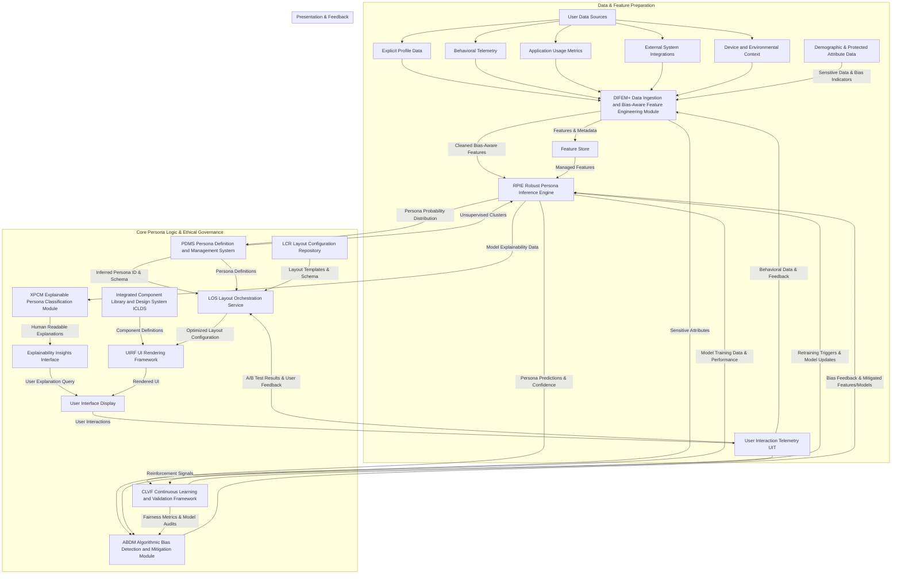

---
**Title of Invention:** System and Method for Robust, Explainable, and Ethically Mitigated Persona Inference with Continuous Learning for Adaptive User Interface Orchestration

**Abstract:**
A novel and ethically rigorous framework for inferring user personas is disclosed, forming a critical augmentation to systems that dynamically adapt user interfaces. This invention moves beyond conventional black-box machine learning models by integrating robust algorithmic bias detection and mitigation, sophisticated explainable Artificial Intelligence [AI] techniques, and a continuous learning and validation architecture. It meticulously processes diverse, high-dimensional user data, accounting for potential biases within explicit profiles, behavioral telemetry, and historical interaction patterns. The system employs resilient multi-model inference engines designed for adversarial robustness and uncertainty quantification, ensuring dependable persona classifications. Furthermore, a dedicated Explainable Persona Classification Module [XPCM] provides transparent rationales for each persona assignment, fostering user trust and enabling human oversight. Concomitantly, an Algorithmic Bias Detection and Mitigation Module [ABDM] actively monitors for and rectifies disparate impacts across protected user groups, ensuring fairness. Through a Human-in-the-Loop [HITL] feedback mechanism and a Continuous Learning and Validation Framework [CLVF], the system perpetually refines its models and persona definitions, adapting to evolving user demographics and interaction paradigms. This comprehensive approach guarantees an adaptive UI system that is not only highly personalized and efficient but also transparent, fair, and trustworthy.

**Background of the Invention:**
The increasing reliance on machine learning for personalization, while beneficial for user experience, introduces significant challenges concerning transparency, fairness, and model robustness. Traditional persona inference systems, often operating as opaque predictive models, struggle to provide clear explanations for their classifications. This "black-box" nature erodes user trust, complicates debugging, and hinders compliance with emerging regulatory standards for AI transparency and accountability. More critically, if the underlying training data contains historical or systemic biases, these models can inadvertently perpetuate and even amplify discriminatory outcomes, leading to unfair or suboptimal experiences for specific user demographics. Such biases can manifest as systematically incorrect persona assignments, leading to consistently disadvantageous UI layouts, reduced functionality, or exclusion from beneficial adaptations for certain groups. Furthermore, static persona models are inherently brittle; they fail to adapt to shifts in user behavior, evolving application features, or demographic changes over time, leading to stale and less effective personalization. The absence of a holistic system that not only infers personas but also actively explains its decisions, rigorously mitigates bias, and continuously learns from real-world interactions represents a critical gap in the field of adaptive user interfaces. Addressing these deficiencies is paramount to building truly intelligent, equitable, and sustainable personalized digital ecosystems.

**Brief Summary of the Invention:**
The present invention presents a sophisticated, multi-faceted cyber-physical system designed to elevate persona inference to a new standard of robustness, explainability, and ethical fairness. At its core, an advanced Persona Inference Engine, hereafter referred to as the Robust Persona Inference Engine [RPIE], ingests meticulously engineered features from an enhanced Data Ingestion and Bias-Aware Feature Engineering Module [DIFEM+]. This [DIFEM+] explicitly identifies and processes features with a focus on detecting and preventing the propagation of sensitive attribute correlations. The [RPIE] employs resilient, often ensemble-based, machine learning models that are rigorously evaluated for adversarial robustness and quantify uncertainty in their probabilistic persona assignments. Crucially, the invention incorporates an Algorithmic Bias Detection and Mitigation Module [ABDM] which, operating in conjunction with the [RPIE], continuously monitors persona classifications for disparate impact across predefined demographic groups, applying sophisticated pre-processing, in-processing, or post-processing techniques to remediate identified biases. Complementing this, an Explainable Persona Classification Module [XPCM] generates human-interpretable explanations for each persona assignment, utilizing techniques such as SHapley Additive exPlanations SHAP or Local Interpretable Model-agnostic Explanations LIME to highlight the salient features driving a decision. Finally, a Continuous Learning and Validation Framework [CLVF] establishes a perpetual feedback loop, leveraging user interaction telemetry, expert human-in-the-loop feedback, and active learning strategies to continually retrain, validate, and refine the [RPIE] models and the [ABDM]'s mitigation strategies, ensuring enduring relevance and fairness. This integrated architecture guarantees that the personalized UI layouts delivered by the Adaptive UI Orchestration Engine [AUIOE] are not merely efficient but are also transparent, equitable, and dynamically responsive to the evolving needs and diverse characteristics of the user base.

**Detailed Description of the Invention:**

This invention systematically addresses the complexities of intelligent persona inference by integrating explainability, bias mitigation, and continuous adaptation into a cohesive, high-performance system. It enhances the core Persona Inference Engine [PIE] described in previous contexts into a Robust, Explainable, and Ethically Mitigated Persona Inference System.

### I. System Architecture for Robust, Explainable Persona Inference

The architectural enhancement integrates several new and refined modules operating in concert with the broader Adaptive UI Orchestration Engine [AUIOE].



#### A. Enhanced Data Ingestion and Bias-Aware Feature Engineering Module [DIFEM+]
This module extends the capabilities of the [DIFEM] by explicitly focusing on identifying, processing, and auditing data for potential sources of bias.
*   **Bias-Aware Data Acquisition:** Beyond standard user data, [DIFEM+] actively seeks and integrates anonymized demographic information (e.g., age ranges, geographical location, inferred gender, cultural background) where legally and ethically permissible, specifically for bias detection and mitigation purposes, not for direct persona assignment.
*   **Data Representativeness Audits:** Automated pipelines conduct regular statistical analyses to ensure that the training and validation datasets for persona models are representative across various protected attributes. Disparities trigger alerts for data augmentation or re-sampling strategies.
*   **Sensitive Feature Handling:** Develops strategies for transforming or obfuscating sensitive features to prevent their direct or indirect influence on biased persona classifications while retaining information for fairness evaluations. Techniques include differential privacy-preserving feature transformations or adversarial de-biasing at the feature level.
*   **Feature Drift Detection:** Monitors for shifts in feature distributions over time, especially for sensitive attributes, to detect changes that could introduce new biases or invalidate existing mitigation strategies.

#### B. Robust Persona Inference Engine [RPIE]
The [RPIE] is an evolution of the [PIE], designed for heightened resilience, accuracy, and interpretability.
*   **Model Architectures for Robustness:**
    *   **Adversarial Training:** Models are trained against adversarial examples to improve their robustness against noisy, incomplete, or slightly perturbed input data, preventing unintended persona shifts due to minor data fluctuations.
    *   **Ensemble Methods with Diversity:** Utilizes diverse ensemble models e.g. stacking, boosting with varied base learners decision trees, neural networks to reduce variance, improve generalization, and provide more stable predictions. Each base model might be optimized for different aspects of robustness or fairness.
    *   **Uncertainty Quantification:** Beyond a single probability score, the [RPIE] outputs a measure of confidence or epistemic uncertainty in its persona assignments e.g. using Bayesian Neural Networks or Monte Carlo dropout. This allows the [LOS] to make more informed decisions, potentially deferring to a default layout or requesting human review if confidence is low.
*   **Bias-Aware Training Objectives:** Incorporates fairness-aware loss functions during training that penalize not only misclassification error but also disparities in performance or outcomes across different demographic subgroups, as informed by the [ABDM].
*   **Continuous Online Learning:** Capable of incrementally updating its parameters in response to new data and feedback from the [CLVF], allowing it to adapt to subtle, evolving user behaviors without requiring full retraining.

#### C. Algorithmic Bias Detection and Mitigation Module [ABDM]
The [ABDM] is a novel, critical component that ensures ethical and fair persona classifications. It operates as a feedback loop to the [RPIE].
*   **Bias Detection Framework:**
    *   **Fairness Metric Calculation:** Continuously computes standard fairness metrics e.g. disparate impact ratio, equal opportunity difference, demographic parity, predictive parity across all defined protected groups (e.g., gender, age, ethnicity if available and consented) for the persona assignments generated by the [RPIE].
    *   **Subgroup Performance Analysis:** Monitors model performance (accuracy, recall, precision) for each persona within various subgroups, identifying instances where the model consistently underperforms for certain populations.
    *   **Root Cause Analysis:** Utilizes techniques from causal inference to identify whether detected biases originate from data imbalance, feature correlation with sensitive attributes, or model architecture limitations.
*   **Bias Mitigation Strategies:**
    *   **Pre-processing Mitigation:** Applies transformations to the input data from [DIFEM+] before it reaches the [RPIE] to reduce bias. Examples include re-sampling underrepresented groups, re-weighting data points, or using adversarial de-biasing at the data level.
    *   **In-processing Mitigation:** Modifies the training algorithm of the [RPIE] to incorporate fairness constraints directly into the learning objective. This can involve adding regularization terms that penalize unfairness or using specialized fair learning algorithms.
    *   **Post-processing Mitigation:** Adjusts the persona predictions from the [RPIE] after inference to achieve desired fairness criteria. Examples include equalizing odds by adjusting decision thresholds for different groups or using calibrated probabilities.
    *   **Ethical Trade-off Negotiation:** Provides tools for administrators to define acceptable trade-offs between overall model accuracy and specific fairness objectives, acknowledging that perfect fairness across all metrics may not always be simultaneously achievable.

#### D. Explainable Persona Classification Module [XPCM]
The [XPCM] provides the means to understand and trust the persona assignments.
*   **Local Explainability:** For any individual user's persona assignment, the [XPCM] generates specific explanations:
    *   **SHAP Values:** Provides a breakdown of how each feature contributed positively or negatively to the final persona probability for a specific user, quantifying its impact.
    *   **LIME Explanations:** Creates a local interpretable model around the prediction point, explaining what features were most important for *that specific decision*.
    *   **Counterfactual Explanations:** Suggests minimal changes to a user's feature vector that would result in a different persona classification, providing "what-if" scenarios.
*   **Global Explainability:** Provides insights into the overall behavior of the [RPIE] model:
    *   **Feature Importance:** Identifies the most influential features across the entire dataset for distinguishing between personas.
    *   **Partial Dependence Plots PDPs:** Visualizes the marginal effect of one or two features on the persona prediction.
    *   **Surrogate Models:** Trains a simpler, interpretable model e.g. a decision tree to approximate the behavior of a more complex black-box [RPIE] model, providing a global understanding.
*   **Explanation Interfaces:** Presents these explanations in human-readable formats to end-users, administrators, and auditors, potentially through dedicated dashboards or contextual UI elements. For example: "You were classified as `SYNTHETICAL_ANALYST` primarily due to high engagement with `DataGridComponent` and frequent `ExportReportButton` clicks in the last 7 days."

#### E. Continuous Learning and Validation Framework [CLVF]
The [CLVF] ensures the long-term effectiveness, relevance, and fairness of the persona inference system through ongoing adaptation.
*   **Active Learning Integration:** Strategically identifies data points where the [RPIE] has low confidence or where human labeling would be most impactful (e.g., boundary cases between personas, emerging behavioral patterns). These are prioritized for expert human review and annotation, enriching the labeled dataset efficiently.
*   **Concept Drift Detection:** Continuously monitors the statistical properties of user behavior and feature distributions. When significant "concept drift" is detected i.e., the underlying relationship between features and personas changes, it triggers an automatic retraining process for the [RPIE] and a re-evaluation of persona definitions in the [PDMS].
*   **Human-in-the-Loop [HITL] Validation:** Establishes explicit channels for expert feedback. Domain specialists, UI/UX designers, and even end-users can review persona assignments, generated explanations, or detected biases, providing ground truth and qualitative insights that feed directly back into model retraining or [ABDM] strategy refinement.
*   **A/B/n Testing of Fairness Strategies:** Facilitates rigorous experimentation to compare the effectiveness of different bias mitigation techniques or explainability presentations in real-world scenarios, using A/B/n testing frameworks.
*   **Performance and Fairness Monitoring Dashboards:** Provides real-time visibility into the [RPIE]'s performance (accuracy, recall, precision), its uncertainty levels, and the ongoing fairness metrics from the [ABDM], allowing for proactive intervention.

#### F. Secure Persona Lifecycle Management [SPLM]
Building upon the [PDMS], the [SPLM] ensures secure, auditable, and version-controlled management of all persona-related artifacts.
*   **Version Control for Models and Mitigation Strategies:** All trained [RPIE] models, their associated [ABDM] mitigation configurations, and [XPCM] explanation templates are versioned, allowing for rollbacks, reproducibility, and auditability.
*   **Auditable Decision Logs:** Maintains comprehensive logs of every persona inference decision, including the input features, the predicted persona, confidence score, applied mitigation strategies, and the generated explanation, for compliance and debugging.
*   **Role-Based Access Control RBAC:** Strict access controls are applied to sensitive demographic data, model parameters, and fairness configurations, ensuring that only authorized personnel can access or modify these critical assets.

### II. Implementation Details for Explainable AI (XAI) in [XPCM]

The [XPCM] is meticulously engineered to provide actionable and comprehensible explanations, crucial for building trust and enabling effective governance.

#### A. SHAP Values for Additive Feature Attribution
*   **Principle:** SHAP values attribute the contribution of each feature to a prediction by quantifying its impact compared to a baseline prediction, considering all possible coalitions of features.
*   **Integration:** The [XPCM] integrates with SHAP libraries to compute values for each feature in a user's vector `u_j`, generating an explanation for `P(pi_i | u_j)`.
*   **Visualization:** Presents these values as bar charts or force plots within the explanation interface, showing positive and negative contributions of features.

#### B. LIME for Local Model Fidelity
*   **Principle:** LIME generates explanations by learning an interpretable model e.g. linear regression locally around the prediction point of a black-box model.
*   **Application:** When a user requests an explanation for their persona, LIME perturbs the user's feature vector, generates new predictions from the [RPIE], and fits a simple model to explain the behavior in that localized region.
*   **Use Cases:** Particularly useful for understanding complex, non-linear [RPIE] models where global explanations may be too abstract.

#### C. Counterfactual Explanations
*   **Principle:** Identifies the smallest change to the input features that would alter the persona classification to a desired outcome.
*   **Benefit:** Provides direct, actionable insights to users or administrators about how their behavior or profile attributes would need to change to shift persona, or to confirm the model's sensitivity. E.g., "If you used the `CollaborationPanel` twice more per week, you would be classified as `CREATIVE_EXTRAVERT`."

### III. Mathematical Basis for Bias Mitigation and Explainability

Building upon the Persona Inference Manifold and Classification Operator (Theorem 1.1) from the previous invention, we expand the mathematical framework to incorporate ethical considerations and transparency.

#### A. Formalizing Algorithmic Fairness in `f_class`

Let `S` be the set of sensitive attributes (e.g., gender, age group, geographical region), with `s in S` representing a specific protected group. The goal of the [ABDM] is to ensure fairness in `P(pi_i | u_j)`.

**Definition 3.1: Demographic Parity.**
A persona classifier `f_class` satisfies demographic parity if the probability of being assigned to a specific persona `pi_i` is independent of the sensitive attribute `s`:
```
P(f_class(u_j) = pi_i | s_j = s) = P(f_class(u_j) = pi_i)   for all pi_i in Pi, for all s in S
```
This implies that each persona should have the same proportion of individuals from different protected groups.

**Definition 3.2: Equal Opportunity.**
A persona classifier `f_class` satisfies equal opportunity with respect to a target outcome (e.g., positive UI experience, task success) if the true positive rate (or false positive rate) is the same across different sensitive groups. If `Y_j` is the true optimal persona for `U_j`, then:
```
P(f_class(u_j) = pi_i | Y_j = pi_i, s_j = s) = P(f_class(u_j) = pi_i | Y_j = pi_i)   for all pi_i in Pi, for all s in S
```
This ensures that individuals from different groups who *should* be classified into a certain persona are equally likely to be correctly classified.

**Theorem 3.1: Bias-Aware Loss Function for `f_class*`.**
To achieve fairness, the training objective for the [RPIE] can be augmented. The bias-aware loss function `L_fair` can be defined as:
```
L_fair(theta) = L(theta) + lambda * F(P_hat(pi_i | u_j; theta), s_j)
```
where `L(theta)` is the standard classification loss (e.g., cross-entropy), `F` is a fairness regularization term (e.g., a measure of demographic disparity or equal opportunity violation), and `lambda > 0` is a hyperparameter balancing accuracy and fairness. Minimizing `L_fair` allows the [RPIE] to learn persona boundaries that are not only accurate but also respect predefined fairness criteria, as monitored and guided by the [ABDM].

#### B. Formalizing Explainability in `f_explain`

Let `M` be the trained [RPIE] model. The [XPCM] implements an explanation function `f_explain: M x R^D -> E`, where `E` is a set of human-interpretable explanations.

**Definition 3.3: Local Interpretability Function (e.g., LIME).**
For a specific user `u_j` and a prediction `M(u_j)`, LIME aims to find a simple, local linear model `g` that approximates `M` in the vicinity of `u_j`. The explanation `e_j` for `u_j` is then the parameters of `g`.
```
min_g L(M, g, pi_k(u_j)) + Omega(g)
```
where `L` measures the unfaithfulness of `g` in approximating `M` around `u_j`, and `Omega(g)` is a measure of `g`'s complexity (e.g., number of non-zero coefficients), encouraging sparsity.

**Definition 3.4: SHAP Value Computation.**
SHAP values `phi_d(u_j)` for each feature `x_j,d` quantify its contribution to the deviation of the prediction `M(u_j)` from the expected baseline `E[M(U)]` across all possible feature subsets `Z` not including `x_j,d`.
```
phi_d(u_j) = sum_{Z subset of {x_1,...,x_D} \ {x_d}} [ |Z|!(D-|Z|-1)! / D! ] * [ M_Z U {x_d}(u_j) - M_Z(u_j) ]
```
where `M_Z U {x_d}(u_j)` is the model's prediction with features in `Z` and `x_d` present, and `M_Z(u_j)` is the prediction with only features in `Z` present. The sum of SHAP values for all features plus the baseline prediction equals the model's output, providing an exact and fair attribution.

#### C. Continuous Learning and Concept Drift Detection

Let `t` denote time. The feature distribution `P_t(u)` and the true persona mapping `f_true,t` can evolve. The [CLVF] monitors for these changes.

**Definition 3.5: Concept Drift.**
Concept drift occurs when the underlying relationship `P(pi_i | u_j, t)` changes over time. Formally, `P_t1(pi_i | u_j) != P_t2(pi_i | u_j)` for `t1 != t2`. The [CLVF] employs statistical tests (e.g., Kolmogorov-Smirnov test, ADWIN algorithm) on feature distributions and model performance metrics over sliding windows of data to detect such shifts.

**Theorem 3.2: Online Model Adaptation.**
When concept drift is detected, the [RPIE] employs online learning algorithms (e.g., incremental gradient descent, transfer learning with fine-tuning) to adapt its parameters `theta_t` to the new distribution, maintaining its predictive accuracy and fairness. The objective for online adaptation becomes minimizing the instantaneous loss `L(theta_t | u_j, t)` while also accounting for the cumulative fairness `F_cum(theta_t)`.

This expanded mathematical framework ensures that the persona inference process is not only powerful and adaptive but also operates within a rigorously defined ethical and transparent envelope, a foundational requirement for responsible AI deployment.

---

**Claims:**

1.  A system for robust and explainable persona inference with continuous bias mitigation for adaptive user interface orchestration, comprising:
    a.  An Enhanced Data Ingestion and Bias-Aware Feature Engineering Module [DIFEM+] configured to acquire, process, and extract features from diverse user data, including demographic and protected attribute data, while conducting data representativeness audits and applying sensitive feature handling techniques;
    b.  A Persona Definition and Management System [PDMS] configured to define, store, and manage a plurality of distinct user persona archetypes;
    c.  A Robust Persona Inference Engine [RPIE] communicatively coupled to the [DIFEM+] and [PDMS], configured to apply machine learning algorithms with uncertainty quantification and adversarial robustness to classify a user into one or more persona archetypes, utilizing bias-aware training objectives;
    d.  An Algorithmic Bias Detection and Mitigation Module [ABDM] communicatively coupled to the [DIFEM+] and [RPIE], configured to:
        i.  Continuously calculate fairness metrics across persona classifications for predefined protected user groups;
        ii. Detect algorithmic biases, including disparate impact or unequal opportunity; and
        iii. Apply pre-processing, in-processing, or post-processing mitigation strategies to rectify identified biases;
    e.  An Explainable Persona Classification Module [XPCM] communicatively coupled to the [RPIE], configured to generate human-interpretable explanations for individual persona assignments using local and global explainability techniques; and
    f.  A Continuous Learning and Validation Framework [CLVF] communicatively coupled to the [RPIE], [ABDM], and [PDMS], configured to monitor model performance and fairness, detect concept drift, and trigger active learning and retraining processes based on user interaction telemetry and human-in-the-loop feedback.

2.  The system of claim 1, wherein the [RPIE] employs ensemble machine learning models with diversity or Bayesian Neural Networks to provide persona probability distributions with associated confidence or uncertainty measures.

3.  The system of claim 1, wherein the [DIFEM+] integrates strategies for anonymization, pseudonymization, and differential privacy-preserving feature transformations for sensitive attributes.

4.  The system of claim 1, wherein the [ABDM] utilizes fairness metrics including at least one of: demographic parity, equal opportunity, or predictive parity.

5.  The system of claim 1, wherein the mitigation strategies applied by the [ABDM] include at least one of: re-sampling underrepresented groups, re-weighting data points, adversarial de-biasing, or adjusting decision thresholds for specific groups.

6.  The system of claim 1, wherein the [XPCM] generates local explanations using SHapley Additive exPlanations SHAP values or Local Interpretable Model-agnostic Explanations LIME, indicating feature contributions to a persona assignment.

7.  The system of claim 1, wherein the [XPCM] generates global explanations through feature importance analysis or partial dependence plots, providing insights into the overall model behavior.

8.  The system of claim 1, wherein the [CLVF] utilizes concept drift detection algorithms to identify changes in user behavior patterns or feature distributions, automatically triggering model retraining or re-evaluation of persona definitions.

9.  The system of claim 1, further comprising a Human-in-the-Loop [HITL] feedback mechanism integrated with the [CLVF] to incorporate expert validation and user feedback for continuous refinement of persona models and bias mitigation strategies.

10. A method for robust, explainable, and ethically mitigated persona inference for adaptive user interface orchestration, comprising:
    a.  Acquiring and processing diverse user data, including sensitive and protected attributes, through a bias-aware feature engineering process that audits for data representativeness;
    b.  Classifying a user into one of a plurality of predefined persona archetypes using a robust artificial intelligence model that quantifies prediction uncertainty and is trained with bias-aware objectives;
    c.  Continuously detecting algorithmic bias in said persona classifications across protected user groups using predefined fairness metrics;
    d.  Mitigating detected biases by applying pre-processing, in-processing, or post-processing techniques to ensure equitable persona assignments;
    e.  Generating human-interpretable explanations for individual persona classifications, detailing the contributing features and their impact; and
    f.  Continuously learning and validating the persona classification model and bias mitigation strategies by monitoring performance and fairness, detecting concept drift, and incorporating feedback from user interactions and human experts.

11. The method of claim 10, wherein the bias-aware feature engineering process employs differential privacy techniques to handle sensitive user data.

12. The method of claim 10, wherein the robust artificial intelligence model is adversarially trained to enhance its resilience against noisy or perturbed input data.

13. The method of claim 10, wherein the step of mitigating biases includes negotiating trade-offs between overall model accuracy and specific fairness objectives.

14. The method of claim 10, wherein the step of generating explanations includes providing counterfactual explanations that suggest minimal feature changes to alter a persona classification.

15. The method of claim 10, wherein the continuous learning and validation process involves active learning to strategically select data points for human annotation, optimizing the efficiency of labeled data acquisition.

16. The system of claim 1, further comprising a Secure Persona Lifecycle Management [SPLM] module configured to version control and audit all persona models, bias mitigation strategies, and explanation templates, ensuring traceability and accountability.

17. The method of claim 10, further comprising securely managing and auditing all versions of persona models, bias mitigation strategies, and explanation logic, providing an immutable audit trail for compliance.