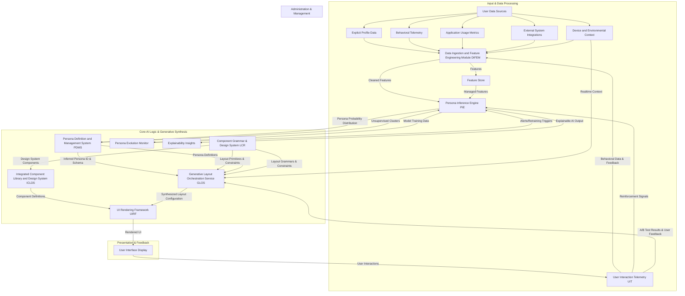

**Title of Invention:** System and Method for Autonomous Generative Synthesis of Personalized User Interface Layouts Utilizing Deep Learning Architectures

**Abstract:**
A profound innovation in the field of human-computer interaction is hereby disclosed: a sophisticated system for the autonomous generation of personalized graphical user interface [GUI] layouts through the application of advanced deep generative models. This invention moves beyond mere selection or rule-based adaptation by employing architectures such as Conditional Generative Adversarial Networks [GANs] and Transformer networks. These models ingest a rich tapestry of user persona attributes, derived from comprehensive behavioral and profile data, along with real-time contextual factors. The generative engine then synthesizes novel, highly optimized UI layout configurations, encoded as machine-interpretable constructs, which precisely delineate component placement, interactivity, and aesthetic properties. Through iterative learning and multi-objective optimization, the system programmatically instantiates bespoke interfaces that are not merely adaptive, but fundamentally *created* to align with an individual user's predicted cognitive workflow, aesthetic preferences, and emergent operational requirements, thereby achieving unprecedented levels of personalization, task efficiency, and user satisfaction.

**Background of the Invention:**
Existing methodologies for user interface design and deployment predominantly rely on either static, one-size-fits-all layouts or rudimentary adaptive systems that offer limited, pre-defined customization options or rule-based adjustments. While prior art has introduced mechanisms for inferring user personas and selecting from a repository of pre-engineered layouts, a fundamental limitation persists: the finite and often manually curated nature of these layout repositories restricts the system's capacity for truly novel and nuanced personalization. The increasing complexity of digital ecosystems, coupled with the burgeoning diversity of user roles, tasks, and interaction modalities, necessitates a paradigm shift from selection to synthesis. For instance, a highly specialized data scientist might require a bespoke arrangement of custom visualization components, real-time data streaming widgets, and scriptable automation panels, an arrangement that may not exist in any predefined library. Similarly, a novice user might benefit from an interface that intelligently simplifies complex workflows, guides them through tasks with progressive disclosure, and anticipates their next action, all while maintaining a consistent brand aesthetic. The lacuna in current technological frameworks is a system capable of learning the underlying grammar of effective UI design from vast datasets and subsequently *generating* entirely new, high-utility layouts on-the-fly, tailored to an inferred persona and instantaneous context, rather than merely selecting from a finite set of pre-existing options. The absence of such a generative orchestration mechanism represents a significant impediment to achieving maximal user productivity, cognitive fluency, and profound user satisfaction within dynamic digital environments.

**Brief Summary of the Invention:**
The present invention unveils a groundbreaking end-to-end system engineered for the autonomous, generative synthesis of user interface layouts, pushing the boundaries of personalization beyond adaptive selection. At its architectural core, a sophisticated deep learning-powered generative engine resides within or closely integrated with the Layout Orchestration Service [LOS]. This engine is trained on an expansive dataset of effective UI designs, user behavioral patterns, and persona attributes. Upon user authentication and real-time contextual evaluation, a Persona Inference Engine [PIE] provides a refined user persona classification to the generative engine. This engine, leveraging architectures such as Conditional Generative Adversarial Networks [GANs] or advanced Transformer models, processes the persona and contextual vectors to algorithmically synthesize a novel, highly structured UI layout configuration. This configuration, expressed as a comprehensive data construct e.g. a specialized JSON schema, precisely delineates the manifest UI components, their topological arrangement within a multi-dimensional grid, their default initial states, and contextual rendering attributes. The generative process is further guided by a multi-objective utility function, which ensures optimization across metrics such as information density, cognitive load, aesthetic balance, and task efficacy, tailored to the specific persona. The resultant configuration is then transmitted to a client-side UI Rendering Framework [UIRF], which programmatically instantiates a truly bespoke, semantically rich interface. This innovative methodology ensures that the most salient, contextually appropriate, and ergonomically optimized tools and information are presented immediately to the user, not through mere adaptation, but through a unique act of creation, thereby revolutionizing operational efficiency and individual user experience from the initial point of interaction.

**Detailed Description of the Invention:**

The invention delineates a sophisticated architectural paradigm for generative user interface synthesis, fundamentally transforming the interaction between human and machine by enabling the autonomous creation of bespoke interfaces. At its foundational core, the system operates through a continuous, adaptive feedback loop, ensuring that the presented interface remains perpetually optimized and uniquely crafted for the individual user's evolving persona and real-time contextual demands.

### I. System Architecture Overview

The comprehensive system, herein referred to as the Generative UI Synthesis Engine [GUISE], comprises several interconnected modules operating in concert to achieve dynamic, persona-driven UI generation and synthesis. Building upon the principles of adaptive UI orchestration, the [GUISE] significantly augments the capabilities of the Layout Orchestration Service [LOS] with deep generative models.



#### A. Data Ingestion and Feature Engineering Module [DIFEM]
As described in prior art, the [DIFEM] is the primary conduit for all user-centric data, responsible for acquisition, cleaning, transformation, and the generation of high-fidelity features. For generative models, the quality and richness of these features are paramount, as they form the foundational input vectors for both persona inference and direct generative synthesis. Enhanced feature engineering for this system includes:
*   **Semantic Feature Expansion:** Deeper Natural Language Processing [NLP] on user inputs, documents, and historical communications to create rich semantic embeddings indicative of user intent, professional jargon, and cognitive styles. This may involve training large language models (LLMs) to generate embeddings from unstructured text data.
*   **Interaction Sequence Embeddings:** Advanced deep learning models e.g. self-attention networks, graph neural networks applied to sequential usage patterns and navigation graphs to capture complex temporal and relational dependencies, yielding highly discriminative feature vectors.
*   **Real-time Contextual Feature Extraction:** Beyond static profile data, the DIFEM continuously processes real-time environmental data, such as device orientation, network conditions, ambient light, active application, and temporal factors (time of day, day of week), translating these into numerical feature vectors that are directly fed into the GLOS.
*   **Feature Validation and Imputation:** Robust mechanisms for validating incoming data streams, identifying anomalies, and employing sophisticated imputation techniques (e.g., using autoencoders or variational autoencoders) to handle missing data gracefully, ensuring a complete and clean feature set for downstream AI modules.

```mermaid
graph TD
    subgraph DIFEM Internal Workflow
        A[Raw User Data Sources] --> B{Data Cleaning & Validation};
        B --> C{Feature Extraction Algorithms};
        C --> C1[Behavioral Sequences];
        C --> C2[Semantic Embeddings (NLP)];
        C --> C3[Real-time Contextual Sensors];
        C --> C4[Demographic & Profile Attributes];
        C1 --> D[Deep Sequence Encoders (e.g., Transformers, LSTMs)];
        C2 --> E[Semantic Embedding Models (e.g., BERT, Word2Vec)];
        C3 --> F[Contextual Feature Normalization];
        C4 --> G[Categorical Encoding & Scaling];
        D -- Interaction Sequence Vector --> H[Feature Vector Aggregation];
        E -- Semantic Intent Vector --> H;
        F -- Contextual Feature Vector --> H;
        G -- Profile Feature Vector --> H;
        H --> I[Feature Store & Output];
    end
```

#### B. Persona Definition and Management System [PDMS]
The [PDMS] maintains the ontological classification of user archetypes. For generative synthesis, persona definitions are extended to include more granular preferences and constraints that guide the generative process:
*   **Generative Directives:** Each persona schema includes explicit parameters or soft constraints e.g. `preferred_density_level`, `visual_complexity_tolerance`, `primary_interaction_focus` that serve as conditional inputs for the generative models, guiding the synthesis towards persona-aligned outputs. These directives are often expressed as ranges, priority scores, or categorical choices.
*   **Negative Constraints:** Specific layout characteristics or component combinations that are known to be detrimental for a given persona are also encoded, providing negative feedback to the generative process to avoid undesirable outcomes. This can include explicit `prohibited_component_pairs` or `min_cognitive_load_threshold` requirements.
*   **Persona Evolution Tracking:** The PDMS includes mechanisms to track how personas evolve over time, potentially allowing for dynamic adjustments to generative directives based on observed behavioral shifts or explicit user feedback, facilitating adaptive persona management.
*   **Hierarchical Persona Structures:** Personas can be organized hierarchically, allowing for inheritance of common traits from parent personas and specialization for child personas, reducing redundancy and improving manageability.

#### C. Persona Inference Engine [PIE]
The [PIE] is the core AI component responsible for classifying a user's data into a predefined persona, providing a probabilistic distribution. For generative synthesis, the [PIE] can be further refined:
*   **Uncertainty-Aware Persona Embeddings:** Instead of a single persona ID, the [PIE] can output a continuous vector embedding of the user's persona, potentially capturing nuanced characteristics and confidence levels, which serves as a richer conditional input to the generative models. This allows for finer-grained control and more flexible synthesis. The output is a `p_j` vector where its magnitude and direction in `R^P` represent persona traits, and a variance `sigma_j^2` indicating uncertainty.
*   **Reinforcement Learning for Persona Refinement:** Feedback from the generative process and user interaction telemetry can be used in a reinforcement learning loop to refine the [PIE]'s classification, ensuring that the inferred persona leads to maximally effective generated layouts. The reward signal `R_PIE` for the PIE is derived from the utility of the generated UI `U(l_gen | p_inferred, c_realtime)`.
*   **Active Learning for Persona Tagging:** The PIE can proactively request human validation for ambiguous persona classifications, intelligently selecting edge cases to improve its predictive accuracy and reduce model drift over time, minimizing manual annotation effort.

```mermaid
graph TD
    subgraph Persona Inference and Refinement
        A[User Feature Vector (from DIFEM)] --> B[Persona Embedding Model (Neural Network)];
        B -- Continuous Persona Embedding (p_j) --> C{Persona Utility Evaluator (GLOS)};
        B -- Uncertainty Estimation (Sigma_j) --> D[Uncertainty Handler];
        C -- UI Utility / Feedback (Reward) --> E[Reinforcement Learning Agent (for PIE)];
        E -- Model Parameter Updates --> B;
        D -- Ambiguity Detection --> F[Human-in-the-Loop Feedback / Active Learning];
        F -- Corrected/Refined Persona Labels --> E;
        B --> G[Output: Refined Persona Embedding p_j'];
        G --> H[GLOS (Generative Layout Engine)];
    end
```

#### D. Component Grammar and Design System [LCR]
The Layout Configuration Repository, now more aptly termed the Component Grammar and Design System [LCR], evolves from merely storing predefined layouts to holding the fundamental primitives and rules for *constructing* layouts. This includes:
*   **Component Schemas with Generative Properties:** Each UI component in the [LCR] is described by a comprehensive schema including:
    *   `component_ID`: Unique identifier.
    *   `configurable_props`: Parameters the generative model can adjust e.g. `data_source`, `chart_type`, `filter_preset`, `color_palette`. These properties include their data types, valid ranges, and default values.
    *   `placement_constraints`: Rules governing where a component can or cannot be placed relative to others e.g. "search bar must be top-aligned," "chart cannot overlap data table." These can be expressed as logical predicates (e.g., `IF TypeA THEN NOT ADJACENT TypeB`).
    *   `semantic_tags`: e.g. `data-input`, `visualization`, `collaboration-tool`, `navigation` used by generative models to understand component function and infer utility contributions.
    *   `performance_characteristics`: e.g. `rendering_cost`, `data_load_impact` for multi-objective optimization, allowing the GLOS to balance aesthetics with system performance.
    *   `dependency_graph`: A formalized representation of dependencies on other components or external data sources.
*   **Layout Grammars:** Formal grammars (e.g., Context-Free Grammars, Graph Grammars) or graph representations that define valid structural relationships between components, ensuring synthesized layouts are syntactically correct and functionally coherent. These grammars prune the search space for generative models.
*   **Design Token Integration:** Deep integration with design tokens, allowing the generative models to not just place components but also intelligently apply theming, typography, and spacing in a persona-appropriate manner.
*   **Responsive Behavior Rules:** Explicit rules defining how components and layouts should adapt to different screen sizes, orientations, and input modalities (e.g., touch vs. mouse).

```mermaid
graph LR
    A[Component Definitions (JSON Schema)] --> A1{component_ID: unique};
    A --> A2{configurable_props: map[string, object]};
    A --> A3{placement_constraints: array[predicate]};
    A --> A4{semantic_tags: array[string]};
    A --> A5{performance_characteristics: object};
    A --> A6{responsive_behavior_rules: object};

    B[Layout Grammars (Formal Rules)] --> B1{Syntactic Rules: e.g., A -> BC | D};
    B --> B2{Semantic Rules: e.g., DataGrid must have Filter};
    B --> B3{Grid System Directives: min/max spans};

    C[Design Tokens (JSON/YAML)] --> C1{Color Palette};
    C --> C2{Typography Scale};
    C --> C3{Spacing & Sizing Units};
    C --> C4{Border Radii & Shadows};

    D[LCR] -- Contains --> A;
    D -- Contains --> B;
    D -- Integrates --> C;

    subgraph Generative Constraints & Metadata
        A3 --> D1[Constraint Solver Input];
        A4 --> D2[Generative Model Semantic Input];
        A5 --> D3[Multi-Objective Optimizer Input];
        B1 --> D1;
        B2 --> D1;
        C --> D3;
    end
```

#### E. Generative Layout Orchestration Service [GLOS]
The [GLOS] is the intelligent intermediary that orchestrates the synthesis of novel UI layouts. This service embodies the `f_map` function, dynamically creating layouts tailored to an inferred persona and real-time context. It is the central module for deep generative models.

*   **Generative Layout Engine [GLE] Sub-module:** This is the core innovation, employing advanced deep learning architectures:
    *   **Conditional Generative Adversarial Networks [CGANs] for Layout Synthesis:**
        *   **Generator Network:** Takes as input a conditional vector encompassing the user's persona embedding (from [PIE]), real-time contextual factors (from [DIFEM]), and potentially random noise. It learns to output a structured data representation of a UI layout configuration (e.g., a flattened sequence of component types, positions, and properties). The Generator is trained to produce outputs that are indistinguishable from high-quality, human-designed layouts.
        *   **Discriminator Network:** Trained to distinguish between "real" layouts (from a curated dataset of effective UI designs) and "fake" layouts (generated by the Generator). The Discriminator also receives the same conditional input, ensuring it evaluates plausibility within the context of the persona and situation.
        *   **Adversarial Training:** Through an iterative min-max game, the Generator improves its ability to create highly plausible, persona-appropriate layouts, while the Discriminator becomes better at identifying non-optimal designs. This adversarial process drives the Generator to explore the vast layout state space and converge towards optimal configurations.
    *   **Transformer Networks for Sequential Layout Generation:**
        *   **Layout as Sequence:** A UI layout can be rigorously represented as a sequence of discrete tokens, where each token specifies a component's type, position coordinates, and initial properties. For example, `[COMPONENT_ID_1, ROW_1, COL_1, PROP_A_VAL, PROP_B_VAL, COMPONENT_ID_2, ...]`
        *   **Input Embedding:** The Transformer receives an embedded representation of the inferred persona and the real-time contextual vector. These embeddings are combined with positional encodings if sequence order is critical for certain features.
        *   **Attention Mechanism:** The self-attention layers within the Transformer allow it to weigh the importance of different components and their interdependencies when predicting the next token in the layout sequence. This is crucial for maintaining logical groupings, visual hierarchy, and ensuring components interact coherently.
        *   **Constrained Decoding:** The generative process is guided by deterministic constraints (e.g., component placement rules from [LCR], screen dimensions, accessibility guidelines) and soft constraints (e.g., persona preferences for information density). Beam search or top-k sampling with filtering can be used during decoding to produce multiple plausible layouts, from which the highest utility option is selected.

*   **Multi-objective Utility Optimization:** The [GLOS], through the [GLE], does not merely generate *any* layout, but seeks to generate an *optimal* layout. This involves:
    *   **Utility Function Representation:** A complex, learned utility function `U(layout | persona, context)` is integrated into the training of the generative models (e.g., as a reward signal in Reinforcement Learning for GANs or a part of the loss function for Transformers). This function balances objectives such as information density, cognitive load, aesthetic balance, and task efficacy, with weights dynamically adjusted based on the specific persona's preferences and current task.
    *   **User Feedback Integration:** Direct user feedback, A/B test results, and long-term user engagement metrics from the [UIT] are fed back into the training loops of the [GLE] as reward signals, enabling continuous refinement of the utility function and improvement of the generative capabilities.
    *   **Constraint Satisfaction Layer:** An integral part of the GLE is a rule-based or learned constraint satisfaction module that ensures all generated layouts adhere to the hard constraints defined in the [LCR] (e.g., no overlapping components, components within bounds, semantic dependencies met) before they are passed to the UIRF. This ensures functional integrity.
    *   **Diversity and Novelty Promotion:** Mechanisms are employed to encourage the GLE to explore diverse and novel layouts, avoiding mode collapse (in GANs) or repetitive patterns (in Transformers), which can be achieved through diversity-inducing loss terms or specific sampling strategies.

*   **Output:** The [GLOS] transmits the finalized, synthetically generated layout configuration a highly structured data object to the UI Rendering Framework.

```mermaid
graph TD
    subgraph Generative Layout Orchestration Service (GLOS)
        A[Persona Embedding (p_j) from PIE] --> B[Conditional Input Vector];
        C[Real-time Context (c_realtime) from DIFEM] --> B;
        D[Random Noise (z)] --> B;

        B -- Combined Input --> E1[Generator Network (G) - e.g., Transformer Decoder / Deep CNN];
        B -- Combined Input --> E2[Discriminator Network (D) - e.g., Deep CNN];
        F[LCR: Layout Grammars & Component Constraints] --> E1;
        F --> E2;

        E1 -- Synthesized Layout (l_gen) --> G1[Constraint Validator];
        G1 -- Valid Layout --> H[Multi-Objective Utility Evaluator (U)];
        H --> I{Reward/Loss Calculation};
        I --> J[RL Agent / Optimizer];
        J -- Parameter Updates --> E1;
        J -- Parameter Updates --> E2;

        K[Human-Designed Layouts (l_real)] --> E2;
        K --> H; % Used for Discriminator training and possibly as positive examples for U

        E2 -- Real/Fake Prediction --> I;

        H --> L[Output: Optimal Layout Configuration];
        L --> M[UI Rendering Framework];

        subgraph Feedback Loop
            N[User Interaction Telemetry (UIT)] --> I;
        end
    end
```

#### F. UI Rendering Framework [UIRF]
The [UIRF] is the client-side component responsible for interpreting the generated layout configuration and rendering the actual graphical user interface. This module embodies the `R(l_i)` function. Its role is now to interpret potentially entirely novel component arrangements and properties.
*   **Dynamic Component Loading:** The [UIRF] dynamically imports and instantiates UI components based on the `component_ID` specified in the generated layout configuration. It leverages a component registry to find and load the correct version of each component from the [ICLDS].
*   **Advanced Grid System Implementation:** A robust and responsive grid system e.g. CSS Grid, Flexbox, or specialized UI framework components interprets the `grid_structure` and `position` properties to precisely arrange components, adapting to potentially complex, algorithmically determined layouts. It handles dynamic resizing and re-layout based on `breakpoints` specified in the configuration.
*   **Performance Optimization for Dynamic Layouts:** Employs techniques such as virtualized lists for large datasets, lazy loading of off-screen components, and efficient change detection mechanisms to ensure a fluid and highly responsive user experience, especially crucial given the potential uniqueness of each generated layout. It also prioritizes rendering critical components first.
*   **Security and Component Sandboxing:** Implements isolated execution environments for dynamically loaded components, particularly important when layouts are synthesized by AI, to prevent malicious code injection or unintended side effects. This involves techniques like Web Workers, iFrames, or component-level access control.
*   **Accessibility Integration:** The UIRF dynamically applies accessibility attributes (e.g., ARIA roles, labels) based on the component's semantic tags and persona-specific accessibility preferences (e.g., larger font sizes for `VISION_IMPAIRED` persona), ensuring generated UIs are inclusive.

#### G. User Interaction Telemetry [UIT]
The [UIT] module is an integral part of the continuous feedback loop, diligently recording and transmitting high-fidelity interaction data back to the [DIFEM] and, crucially, providing direct reward signals for the generative models in the [GLOS].
*   **Granular Reward Signals:** Beyond basic event tracking, the [UIT] now captures specific metrics like "time to task completion," "number of errors," "feature discoverability," and "user satisfaction scores" (e.g., implicit via repeat usage or explicit via micro-feedback prompts). These serve as crucial reward signals for reinforcement learning loops within the [GLE], guiding the generative models to produce layouts that optimize real-world user outcomes.
*   **A/B/N Testing of Generated Layouts:** The [UIT] facilitates advanced A/B/N testing frameworks, enabling simultaneous evaluation of multiple generated layouts or variations, providing empirical data for model performance. This allows for rapid iteration and validation of generative model improvements.
*   **Cognitive Load Metrics:** Integration with client-side sensors (e.g., eye-tracking for research, keyboard/mouse activity patterns, scroll depth) to derive proxy metrics for cognitive load and engagement, feeding into the multi-objective utility function.

```mermaid
graph TD
    subgraph User Interaction Telemetry (UIT)
        A[Rendered UI (from UIRF)] --> B[User Interactions (Click, Type, Scroll)];
        B --> C[Event Logger];
        C --> D[Task Completion Tracker];
        C --> E[Error Rate Monitor];
        C --> F[Engagement Metrics (Session Duration, Feature Usage)];
        C --> G[Implicit/Explicit Satisfaction (e.g., rating prompts)];
        D --> H[Reward Signal Generator];
        E --> H;
        F --> H;
        G --> H;
        H -- Granular Reward Signals --> I[GLOS (Generative Layout Engine)];
        C --> J[A/B/N Testing Framework];
        J -- Experiment Data --> I;
        C --> K[DIFEM (for behavioral feature updates)];
    end
```

### II. Integrated Component Library and Design System [ICLDS]

The [GUISE] relies heavily on a robust, version-controlled Integrated Component Library and Design System [ICLDS], which provides the foundational building blocks for generative UI.

#### A. Component Structure and Contract for Generative Use
Each UI component within the [ICLDS] adheres to an enhanced contract to support generative synthesis.
*   **Generative Metadata Schema:** Beyond basic properties, each component's metadata explicitly defines:
    *   `semantic_function`: e.g. "data_input", "action_button", "information_display".
    *   `required_context`: Data sources or parent components it depends on.
    *   `prohibited_adjacencies`: Components it should not be placed next to.
    *   `responsive_behavior_rules`: How it adapts to different breakpoints, including specific CSS properties or component variants.
    *   `variable_parameters`: Which properties the generative model is allowed to modify within predefined ranges or enumerations, along with their default values and validation rules.
    *   `utility_contribution`: A vector or scalar indicating its expected contribution to different utility objectives (e.g., `[task_efficiency: 0.8, cognitive_load: -0.2]`).
*   **Modular and Atomic Components:** Components are designed to be highly modular and atomic, allowing the generative models maximum flexibility in combining and arranging them. This promotes a "plug-and-play" architecture where components are independent and composable.

#### B. Design Tokens and Theming
The [ICLDS] leverages an extensive system of Design Tokens for managing visual attributes, enabling the generative models to synthesize not just layout, but also a persona-appropriate aesthetic.
*   **Conditional Theming:** Design tokens can be conditionally applied or even generated based on persona preferences e.g. a "creative" persona might trigger a vibrant color palette, while an "analytical" persona might activate a muted, high-contrast theme. The [GLE] directly manipulates these tokens as part of the layout synthesis, referencing predefined theme sets or even generating specific token values (within bounds).
*   **Design System Compliance:** The generated layouts always conform to the established design system, ensuring brand consistency and maintaining a high aesthetic standard, even with novel configurations.

#### C. Component Version Management
To maintain stability and enable iterative development within a generative system, components are rigorously versioned.
*   **Compatibility Rules:** The [ICLDS] specifies compatibility rules between component versions, allowing the [GLE] to safely combine components without introducing rendering errors or functional incompatibilities. This prevents "broken" generated UIs due to version mismatches.
*   **Rollback Capabilities:** The system can quickly roll back to previous stable versions of components or generative models in case of unforeseen issues with newly synthesized layouts.

```mermaid
graph TD
    subgraph Integrated Component Library and Design System (ICLDS)
        A[Component Registry] --> A1[Component Definition 1];
        A1 -- Metadata & Generative Contract --> A1a[semantic_function];
        A1 -- Metadata & Generative Contract --> A1b[configurable_props];
        A1 -- Metadata & Generative Contract --> A1c[placement_constraints];
        A1 -- Metadata & Generative Contract --> A1d[utility_contribution];
        A --> A2[Component Definition 2];
        A --> An[... Component Definition N];

        B[Design Token Repository] --> B1[Global Tokens (Colors, Typography)];
        B1 --> B1a[Conditional Theme Sets (Persona A, Persona B)];
        B --> B2[Spacing & Layout Tokens];
        B --> B3[Motion & Interaction Tokens];

        C[Component Version Control] --> C1[Component A v1.0];
        C1 --> C2[Component A v1.1 (compatible)];
        C --> C3[Component B v2.0];
        C --> C4[Component B v2.1 (breaking change)];

        A -- Provides Building Blocks --> D[GLOS (Generative Layout Engine)];
        B -- Provides Styling Rules --> D;
        C -- Ensures Stability --> D;

        D[GLOS] --> E[UI Rendering Framework];
    end
```

### III. Advanced Generative UI with Deep Learning Architectures (Central to this Invention)

The core innovation of the [GUISE] lies in its utilization of sophisticated deep generative models within the [GLOS] for true layout synthesis.

#### A. Layout Generation using Transformer Models
*   **Layout as Sequence and Graph:** A UI layout can be represented as a sequence of component specifications, but also as a graph where nodes are components and edges are their spatial or functional relationships. Transformer models excel at handling both sequential and graph-like data structures. Graph Transformers or Graph Attention Networks (GATs) can be integrated to process relational data effectively.
*   **Multi-Modal Input Embedding:** The Transformer receives a concatenated embedding of:
    *   **Persona Vector:** A dense numerical representation of the inferred user persona.
    *   **Contextual Vector:** Real-time data about device, task, time, location.
    *   **Target Components:** A list of components that are absolutely required for the current task, provided as a one-hot encoding or embedding.
    *   **Random Noise:** For increased variability and exploration of the layout space, often sampled from a Gaussian distribution.
*   **Encoder-Decoder Architecture:**
    *   **Encoder:** Processes the multi-modal input to create a rich contextual representation. This can be a stack of self-attention layers that learn interdependencies between persona traits, context, and required components.
    *   **Decoder:** Autoregressively generates the layout token by token. Each token represents a component (`COMPONENT_TYPE`), its grid coordinates (`ROW_START`, `COL_START`, `ROW_SPAN`, `COL_SPAN`), and its specific properties (`PROP_NAME: VALUE`). This decoding process incorporates cross-attention to the encoder's output.
*   **Attention Mechanism for Relational Coherence:** The self-attention mechanism in the Transformer is critical for understanding inter-component dependencies. It learns to 'attend' to relevant parts of the generated sequence or input context when deciding the next component to place or property to set. For example, when placing a 'Filter Panel', it might attend to the 'Data Grid' component it is intended to filter, ensuring functional proximity and visual grouping. This facilitates the learning of design patterns.
*   **Constrained Beam Search Decoding:** During inference, instead of greedy decoding, a constrained beam search is employed. The beam search explores multiple potential layout sequences simultaneously, pruning invalid paths based on:
    *   **Hard Constraints:** e.g. components fitting within screen bounds, no overlaps, adherence to [LCR] placement rules.
    *   **Soft Constraints:** e.g. maintaining information density preferences, visual balance heuristics, aesthetic principles, all derived from the persona's generative directives.
    *   **Learned Utility Function:** The beam search prioritizes paths that lead to higher estimated utility `U(layout | persona, context)`. This integrates optimization directly into the decoding process.

#### B. Conditional Generative Adversarial Networks [CGANs] for Layout Synthesis
*   **Generator Network Architecture:** The Generator G is typically a deep neural network (e.g., a combination of convolutional and recurrent layers, or even a Transformer-based decoder) that takes as input a random noise vector `z` and a conditional vector `c_cond`.
    *   `c_cond` is the concatenation of the persona embedding and the real-time contextual vector.
    *   The output of G is a structured representation of a UI layout `l_gen = G(z, c_cond)`. This representation can be a tensor encoding grid cells and component presence, or a sequential token representation. For example, a 3D tensor where dimensions are `[rows, cols, component_features]`.
*   **Discriminator Network Architecture:** The Discriminator D is another deep neural network (e.g., a convolutional neural network) that takes a layout `l` and the same conditional vector `c_cond` as input.
    *   `D(l, c_cond)` outputs a probability indicating whether `l` is a "real" layout (from the training dataset) or a "fake" layout (generated by G), conditioned on `c_cond`. The Discriminator learns to identify common design patterns and violations.
*   **Adversarial Training Objective:** The training involves a min-max game:
    *   `min_G max_D V(D, G) = E_{l_real ~ p_data(l), c_cond ~ p_data(c_cond)} [log D(l_real, c_cond)] + E_{z ~ p_z(z), c_cond ~ p_data(c_cond)} [log (1 - D(G(z, c_cond), c_cond))]`
    *   The Generator G attempts to minimize `log(1 - D(G(z, c_cond), c_cond))`, making its generated layouts indistinguishable from real ones.
    *   The Discriminator D attempts to maximize this value, correctly distinguishing real from fake.
*   **Reinforcement Learning Augmentation for Utility:** To further guide the CGAN towards high-utility layouts, a Reinforcement Learning [RL] agent can be integrated.
    *   The output of the Generator becomes an "action" in an RL environment.
    *   The reward signal for the RL agent is derived from the learned utility function `U(l | persona, context)` and direct user feedback from the [UIT] (e.g., task success, engagement metrics).
    *   This "reward-guided GAN" setup enables the system to generate layouts that are not only plausible but also perform optimally according to real-world user metrics. This can be implemented via Policy Gradients or Actor-Critic methods.

```mermaid
graph TD
    subgraph CGAN Layout Synthesis Detail
        Z[Random Noise Vector (z)] --> G[Generator Network (G)];
        C[Conditional Vector (Persona + Context)] --> G;
        C --> D[Discriminator Network (D)];
        L_gen[Generated Layout (l_gen)] <- G;
        L_real[Real Layout (l_real)] --> D;

        G --l_gen--> D;

        D --Probability(Real/Fake)--> Loss_D[Discriminator Loss Function];
        Loss_D --> Opt_D[Optimizer (D)];
        Loss_D --> Loss_G_part[Generator Adversarial Loss];

        U_eval[Utility Evaluator (U)] --l_gen--> Reward_U[Utility Reward];
        U_eval --l_real--> Reward_U; % Used for baseline or positive examples

        Reward_U --> RL_loss[RL Loss (e.g., Policy Gradient)];
        RL_loss --> Opt_G_RL[Optimizer (G-RL)];
        Loss_G_part --> Opt_G_Adv[Optimizer (G-Adv)];

        Opt_G_RL --> G; % Updates G parameters based on RL
        Opt_G_Adv --> G; % Updates G parameters based on Adversarial Loss
        Opt_D --> D; % Updates D parameters
    end
```

#### C. Optimizing for Multi-Objective Persona Utility
Deep learning models within the [GLOS] are trained to optimize complex, multi-objective utility functions that balance conflicting design goals.
*   **Sophisticated Utility Function:** Instead of simple metrics, the models learn to balance objectives such as:
    *   **Information Scent:** How easily users can find desired information/actions.
    *   **Cognitive Load:** Minimizing mental effort required for tasks.
    *   **Visual Balance and Aesthetics:** Conforming to design principles and persona aesthetic preferences.
    *   **Learnability:** Ease with which new users can become proficient.
    *   **Accessibility:** Adherence to accessibility standards.
    *   **Performance:** Minimizing render times and resource usage.
    *   **Task Efficacy:** Probability of successful task completion within a time limit.
*   **Pareto Optimization:** The generative engine aims to find layouts that are Pareto optimal across these dimensions, offering the best possible trade-offs based on the persona's priorities. This involves using multi-objective optimization algorithms (e.g., NSGA-II) in combination with the generative models.
*   **Transfer Learning from Generic Design Datasets:** Pre-trained Transformer or GAN models on vast datasets of general UI designs (e.g., screenshots, wireframes, design systems from public repositories) can be fine-tuned with specific application data and persona information. This significantly accelerates the learning process and improves the quality of generated layouts, especially for cold-start scenarios.
*   **Federated Learning for Privacy-Preserving Training:** For sensitive user data, federated learning can be employed, allowing generative models to be trained on decentralized datasets across client devices without directly sharing raw data, enhancing privacy.

### IV. Edge Computing for Generative Adaptive UI

To further enhance responsiveness and reduce server load, selected components of the [GUISE] can be deployed to client devices, leveraging edge computing capabilities.

#### A. Client-side Contextual Generative Refinement
*   **Lightweight Generative Models:** Compressed or quantized versions of the [GLE]'s generative models or smaller, specialized models can run directly on the client device e.g. via WebAssembly, TensorFlow.js, or mobile AI frameworks. These models can perform rapid, localized adaptations or refinements to a base layout received from the server.
*   **Real-time Local Feature Processing:** Local data, such as immediate user interaction history, active application state, screen rotation, or input modality changes, can be processed on the device to trigger micro-adaptations or minor component rearrangements generated in real-time. This reduces round-trip latency to the cloud.
*   **Privacy-Preserving Generative Inference:** Sensitive local user data can remain on the device for generating highly personalized layout refinements, reducing the need to transmit this information to the cloud and enhancing user privacy.
*   **Adaptive Resource Management:** The edge models can dynamically adjust their computational footprint based on device battery, CPU/GPU load, and network availability, ensuring a seamless experience without degrading device performance.

#### B. Predictive Generative Pre-computation
*   **Anticipatory Layout Synthesis:** Based on client-side persona inference and predicted user workflows, the edge device can pre-compute and pre-fetch components or even generate entire next-step layouts in the background, significantly improving perceived responsiveness and reducing latency during navigation or task transitions. This involves probabilistic modeling of user next actions.
*   **Prefetching and Caching:** Generated layouts and their associated components can be intelligently cached on the device, further reducing loading times for anticipated interactions.

```mermaid
graph TD
    subgraph Edge Computing Architecture
        A[Cloud GLOS (Full Model)] --> B[Base Layout Configuration];
        B --> C[Edge Device];
        C -- Deployed Lightweight Model (GLE-Edge) --> C1[Local Contextual Features];
        C1 --> C2[Real-time Local User Interactions];
        C1 --> C3[Device State (Battery, Network)];
        C2 --> C4[Persona Refinement (local PIE)];

        B --> GLE_Edge[GLE-Edge (Lightweight Generative Model)];
        C1 --> GLE_Edge;
        C4 --> GLE_Edge;

        GLE_Edge -- Refined Layout Fragment --> D[Local UI Rendering Framework (UIRF-Edge)];
        D -- Locally Rendered UI --> E[User Interface Display];
        E -- Local Interactions --> C2;

        GLE_Edge -- Predictive Pre-computation --> F[Pre-fetched Components/Layouts];
        F --> D;

        GLE_Edge -- Local Feedback Loop --> GLE_Edge; % Self-learning on edge
        D -- Anonymized Aggregated Metrics --> A; % Send back to cloud for global model improvement
    end
```

### V. Continuous Learning and Model Adaptation

The [GUISE] is designed as a living system, continuously learning from user interactions and adapting its generative capabilities over time.

#### A. Incremental Model Training and Fine-tuning
*   **Online Learning for Persona and Context Models:** The [PIE] and real-time contextual feature models are updated frequently using new incoming data streams, ensuring they remain relevant to current user behaviors and trends.
*   **Generative Model Fine-tuning:** The [GLE] models (GANs, Transformers) undergo periodic fine-tuning with new batches of high-utility generated layouts, human-corrected layouts, and accumulated user feedback. This prevents model drift and enhances generative performance.
*   **Adversarial Domain Adaptation:** Techniques are used to ensure that models trained on historical data remain effective when deployed in dynamic production environments, addressing shifts in user behavior or UI paradigms.

#### B. Model Versioning and A/B/N Testing
*   **Rigorous Model Governance:** Each version of the [PIE] and [GLE] models is meticulously versioned and tracked, allowing for reproducible results and easy rollbacks.
*   **Staged Rollouts with A/B/N Testing:** New model versions are deployed in a phased manner, often subject to A/B/N tests, where a small subset of users receives layouts from the new model, and their engagement/satisfaction metrics are compared against a control group. This statistically validates improvements before full deployment.
*   **Automatic Model Selection:** Based on A/B/N test results and predefined performance thresholds, the system can automatically select and deploy the best performing generative model version.

```mermaid
graph TD
    subgraph Continuous Learning Loop
        A[User Interaction Telemetry (UIT)] --> B[Data Ingestion (DIFEM)];
        B --> C[Feature Store];
        C --> D[Persona Inference Engine (PIE)];
        D --> E[Generative Layout Orchestration Service (GLOS)];
        E --> F[UI Rendering Framework (UIRF)];
        F --> G[Rendered UI];
        G --> A; % Loop back to User Interactions

        E -- Generated Layouts & Utility --> H[Model Evaluation & Monitoring];
        D -- Inferred Personas --> H;

        H -- Performance Metrics & Alerts --> I[Automated Retraining Trigger];
        I -- New Training Data --> J[Generative Model Training Pipeline];
        J -- New Model Version --> K[Model Registry];

        K --> L[A/B Testing Framework];
        L -- Test Results --> H;
        L --> E; % Deploy new model to GLOS
    end
```

### VI. Security, Privacy, and Ethical AI Considerations

The deployment of a highly adaptive, generative UI system necessitates robust measures for security, privacy, and ethical AI governance, particularly given the autonomous nature of layout creation.

#### A. Data Governance and Access Control
*   **Immutable Audit Trails for Generated Artifacts:** Comprehensive logging of every generated layout configuration, including the persona and contextual inputs that led to its creation, the specific model version used, and any associated user feedback. This provides an immutable audit trail for debugging, compliance, and post-hoc analysis.
*   **Secure Model Deployment:** Strict security protocols for deploying and updating generative models to prevent model poisoning or unauthorized manipulation that could lead to biased or insecure UI outputs. This includes cryptographic signing of models and secure infrastructure.
*   **Role-Based Access Control (RBAC):** Granular control over who can access, modify, or retrain the generative models and associated datasets, preventing unauthorized influence on UI synthesis.

#### B. Privacy by Design for Generative Systems
*   **Generative Privacy Enhancements:** Research into techniques like differential privacy applied to the *training data* of generative models, to ensure that the models do not inadvertently "memorize" and leak sensitive personal information through their generated outputs.
*   **Synthetic Data Generation for Training:** Utilizing privacy-preserving synthetic data generation techniques (e.g., using variational autoencoders or privacy GANs) to augment or replace real user data for training generative models, particularly for cold-start scenarios or rare personas.
*   **Data Minimization:** Only collecting and processing the absolute minimum user data necessary for effective persona inference and layout generation, adhering to the principle of data minimization.

#### C. Bias Detection and Mitigation in Generative Outputs
*   **Fairness in Generation:** Regular, automated evaluation of generated layouts using fairness metrics to ensure that the system does not produce layouts that are less functional, less aesthetically pleasing, or in any way discriminatory for specific demographic groups or user segments. This involves analyzing layout utility across different protected groups.
*   **Bias Mitigation in Training Data:** Meticulous curation and balancing of training datasets used for generative models to prevent the propagation or amplification of biases present in historical human-designed layouts or user interactions. Techniques include re-sampling, re-weighting, and adversarial debiasing.
*   **Controllable Generation for Fairness:** Implementing mechanisms within the generative models (e.g., specific conditional inputs for fairness attributes, or post-hoc adjustment filters) to explicitly control for fairness attributes, allowing the system to intervene if a generated layout is predicted to exhibit bias.
*   **Explainable Bias Identification:** Developing explainable AI (XAI) tools to pinpoint *why* a particular layout might be biased and which input features or model parameters contributed to that bias, facilitating targeted interventions.

#### D. Transparency and Explainability of Generated Layouts
*   **Generative Explanations:** Providing clear, concise explanations for *why* a particular novel layout was generated for a user e.g. "This layout prioritizes communication tools and a visually rich canvas because your persona is a `CREATIVE_COLLABORATOR` and your current task is 'Brainstorming Session'." This can involve highlighting the key persona attributes and contextual factors that influenced the generative model's output.
*   **User-in-the-Loop Refinement:** Empowering users to provide direct feedback on generated layouts and even to make minor modifications. This feedback is critically important as a reward signal for refining the generative models and ensuring user satisfaction.
*   **Feature Importance Visualization:** Visualizing the relative importance of different input features (persona attributes, contextual factors) in the generation of a specific layout, aiding user comprehension and trust.

```mermaid
graph TD
    subgraph Ethical AI & Governance
        A[User Data Sources] --> B[Data Minimization & Anonymization];
        B --> C[Secure Storage & Access Control];
        C --> D[Training Data Curation & Bias Mitigation];
        D -- Debiased Data --> E[Generative Model Training];
        E --> F[Generative Layout Engine (GLE)];

        F -- Generated Layout (l_gen) --> G[Bias Detection Module];
        F --> H[Explainability Engine];
        G -- Bias Metrics --> I[Fairness Evaluation & Mitigation];
        H -- Explanations --> J[User Interface Display];

        I -- Mitigation Strategies --> E; % Feedback loop for bias reduction
        J -- User Feedback --> I;

        subgraph Audit & Compliance
            F -- Immutable Audit Trail --> K[Audit Log Database];
            E -- Model Versioning --> K;
        end

        subgraph Privacy Enhancements
            B -- Differential Privacy --> E;
            B -- Synthetic Data Generation --> E;
        end
    end
```

### VII. Deployment and A/B Testing Strategies

Effective deployment of a generative UI system requires robust strategies for progressive rollout, rigorous evaluation, and continuous improvement.

#### A. Progressive Rollout Methodology
*   **Canary Deployments:** Initial deployment to a very small, controlled user segment (the "canary") to detect any critical issues or regressions before broader release.
*   **Ring-Based Deployment:** Gradually expanding the user base for new features or model versions in concentric rings, starting with internal testers, then early adopters, and finally the general population. Each ring serves as a testing phase.
*   **Feature Flags and Toggles:** Utilizing feature flagging systems to enable or disable generative capabilities for specific user groups or features without requiring new code deployments, allowing for dynamic control and experimentation.

#### B. Advanced A/B/N Testing Framework
*   **Multi-Variate Testing (MVT):** Beyond simple A/B tests, MVT allows simultaneous testing of multiple generative model configurations or multiple aspects of generated layouts (e.g., different component arrangements, different theming options) to efficiently identify optimal combinations.
*   **Contextual Bandits:** Employing multi-armed bandit algorithms to dynamically allocate users to different generated layout variations. These algorithms learn which layouts perform best for specific user personas and contexts and allocate more traffic to those variations over time, optimizing for overall utility in real-time.
*   **Experimentation Data Pipeline:** A dedicated data pipeline to collect, aggregate, and analyze metrics from A/B/N tests, providing statistically significant insights into the performance of different generative strategies.

#### C. Human-in-the-Loop Validation
*   **Expert Review Panels:** Regular review of a sample of generated layouts by human UI/UX experts to ensure quality, adherence to design principles, and identification of any subtle flaws that automated metrics might miss.
*   **User Feedback Prompts:** Strategically placed, non-intrusive feedback prompts within the UI to gather explicit user satisfaction scores or qualitative feedback on generated layouts. This direct feedback is invaluable for refining utility functions.

```mermaid
graph TD
    subgraph Deployment & A/B Testing
        A[New Generative Model / Feature] --> B{Code & Model Deployment Pipeline};
        B --> C[Feature Flag System];

        C -- Enabled for Canary Group --> D[Canary Deployment (small user segment)];
        D -- Monitor Early Metrics --> E{Initial Performance Assessment};

        E -- Good --> F[Ring-Based Rollout (gradual expansion)];
        E -- Bad --> G[Rollback / Debug];

        F -- A/B/N Testing --> H[Experimentation Framework (e.g., Contextual Bandits)];
        H --> I[User Interaction Telemetry (UIT)];
        I -- Performance & Engagement Metrics --> J[Model Evaluation & Monitoring];
        J --> H; % Adjust bandit allocation based on performance

        J -- Feedback Loop --> A; % Inform next model iteration
        F -- Human Expert Review --> J;
        H -- User Feedback Prompts --> I;
    end
```

### VIII. Example Persona and Generative Layout Directives

**Persona: `AI_DEVELOPER_OPTIMIZER`**
*   **Description:** A user deeply involved in developing, training, and deploying AI models. Values real-time performance monitoring, rapid experimentation, and access to code/configuration. Prioritizes dense, technical information and command-line interfaces.
*   **Key Behavioral Indicators:** High usage of console/terminal components, model training dashboards, code editors. Frequent access to logging and debugging tools. Low engagement with marketing or high-level summary dashboards. Spends significant time on technical configuration screens.
*   **Generative Directives/Constraints:**
    *   `preferred_density_level`: HIGH
    *   `visual_complexity_tolerance`: HIGH
    *   `primary_interaction_focus`: CODE_DATA_CONFIG
    *   `required_components`: `CodeEditor`, `PerformanceMetricsDashboard`, `TerminalAccess`.
    *   `prohibited_adjacencies`: `MarketingOverview`, `SocialFeed`.
    *   `aesthetic_preference`: `dark_mode`, `monospaced_fonts`, `minimal_visual_flourishes`.

**Synthesized Layout Configuration for `AI_DEVELOPER_OPTIMIZER` (Illustrative JSON Representation):**
```json
{
  "layout_ID": "AI_DEV_OPTIMIZER_GEN_A7.3",
  "persona_mapping_ID": ["AI_DEVELOPER_OPTIMIZER"],
  "grid_structure": {
    "template_columns": "1.5fr 1fr 1fr",
    "template_rows": "auto 1fr 0.8fr",
    "gap": "12px",
    "breakpoints": {
      "tablet_landscape": {
        "template_columns": "2fr 1fr",
        "template_rows": "auto 1fr 1fr",
        "gap": "10px"
      },
      "mobile": {
        "template_columns": "1fr",
        "template_rows": "auto auto 1fr 1fr 0.5fr",
        "gap": "8px"
      }
    }
  },
  "components": [
    {
      "component_ID": "CodeEditor",
      "position": {"row": 1, "col": 1, "row_span": 2, "col_span": 1},
      "initial_state_props": {"language": "Python", "active_file": "model_train_script.py", "theme": "vs-dark"},
      "visibility_rules": {"min_screen_width": "1024px"}
    },
    {
      "component_ID": "TerminalAccess",
      "position": {"row": 3, "col": 1, "row_span": 1, "col_span": 1},
      "initial_state_props": {"default_command": "watch -n 1 nvidia-smi", "font_size": "14px"},
      "visibility_rules": {"user_permission": "admin_access"}
    },
    {
      "component_ID": "PerformanceMetricsDashboard",
      "position": {"row": 1, "col": 2, "row_span": 2, "col_span": 2},
      "initial_state_props": {"metrics_to_display": ["GPU_util", "memory_usage", "training_loss_curve"], "refresh_interval_sec": 5},
      "visibility_rules": {}
    },
    {
      "component_ID": "ExperimentTrackerPanel",
      "position": {"row": 3, "col": 2, "row_span": 1, "col_span": 1},
      "initial_state_props": {"project_id": "current_ai_model", "status_filter": "running"},
      "visibility_rules": {}
    },
    {
      "component_ID": "ModelVersionControl",
      "position": {"row": 3, "col": 3, "row_span": 1, "col_span": 1},
      "initial_state_props": {"repository_url": "git@ai-models.com/project.git", "branch": "dev-main"},
      "visibility_rules": {"min_screen_width": "768px"}
    }
  ]
}
```

This comprehensive design, underpinned by deep generative models, guarantees an autonomously synthesized, highly efficient, and profoundly personalized user experience across the entire operational spectrum of the application.

```mermaid
graph TD
    subgraph End-to-End Generative UI Synthesis
        A[Raw User Data] --> B[DIFEM (Feature Engineering)];
        B -- Feature Vectors --> C[PIE (Persona Inference)];
        C -- Persona Embedding (p) & Uncertainty (σ) --> D[GLOS (Generative Layout Orchestration)];
        D -- Synthesized Layout Config (l*) --> E[UIRF (UI Rendering Framework)];
        E -- Rendered UI --> F[User Interface Display];
        F -- User Interactions --> G[UIT (Interaction Telemetry)];
        G -- Behavioral Data --> B; % Feedback to DIFEM
        G -- Reward Signals (R) --> D; % Feedback to GLOS (RL)
        G -- A/B Test Results --> H[Model Evaluation & Retraining];
        H -- Model Updates --> D; % Continuous Learning

        I[LCR (Component Grammar & Design System)] --> D; % Primitives & Constraints
        J[Real-time Context] --> D; % Environmental factors

        subgraph Security & Ethics
            K[Data Governance] --> B;
            L[Privacy Mechanisms] --> B;
            M[Bias Detection & Mitigation] --> H;
            N[Explainability] --> E;
        end

        style D fill:#f9f,stroke:#333,stroke-width:2px;
        style E fill:#ccf,stroke:#333,stroke-width:2px;
        style C fill:#bfb,stroke:#333,stroke-width:2px;
        style H fill:#fdb,stroke:#333,stroke-width-2px;
    end
```

**Claims:**

1.  A system for autonomously synthesizing a personalized user interface layout, comprising:
    a.  A Data Ingestion and Feature Engineering Module [DIFEM] configured to acquire, process, and extract actionable features from diverse user data sources, including explicit profile attributes, behavioral telemetry, application usage metrics, and real-time contextual sensor data;
    b.  A Persona Definition and Management System [PDMS] configured to define, store, and manage a plurality of distinct user persona archetypes, each characterized by a unique set of behavioral indicators, interaction modalities, specific generative directives, and negative layout constraints;
    c.  A Persona Inference Engine [PIE] communicatively coupled to the [DIFEM] and [PDMS], configured to apply advanced machine learning algorithms to the processed user features to probabilistically classify a user into one or more of said plurality of persona archetypes, outputting a continuous, uncertainty-aware persona embedding;
    d.  A Component Grammar and Design System [LCR] configured to store structured definitions of UI components with generative metadata, formal layout grammars, design tokens, and both hard and soft placement constraints, serving as primitives and rules for layout synthesis;
    e.  A Generative Layout Orchestration Service [GLOS] communicatively coupled to the [PIE] and [LCR], configured to receive the persona embedding, real-time contextual factors, and a noise vector, and comprising a Generative Layout Engine [GLE] that autonomously synthesizes a novel UI layout configuration based on said inputs, utilizing deep generative models trained with multi-objective utility optimization; and
    f.  A UI Rendering Framework [UIRF] communicatively coupled to the [GLOS], configured to interpret the synthesized UI layout configuration and dynamically instantiate the corresponding user interface components within a responsive grid system, while applying persona-specific aesthetic tokens and accessibility attributes.

2.  The system of claim 1, further comprising a User Interaction Telemetry [UIT] module communicatively coupled to the [UIRF] and [DIFEM], configured to capture and transmit granular user interaction data, including performance metrics, task completion times, and implicit or explicit satisfaction scores, to the [DIFEM] for feature updates and to provide reinforcement learning reward signals for training and refining the deep generative models within the [GLOS], thereby forming a continuous feedback loop for generative layout optimization.

3.  The system of claim 1, wherein the deep generative models employed within the [GLE] include at least one of: Conditional Generative Adversarial Networks [CGANs] augmented with reinforcement learning, Transformer networks with constrained beam search decoding, or Graph Neural Networks for layout structure generation.

4.  The system of claim 3, wherein the Conditional Generative Adversarial Network [CGAN] comprises a Generator network that synthesizes layout configurations as structured tensors or token sequences based on persona, contextual inputs, and noise, and a Discriminator network trained to distinguish between synthesized and human-designed layouts by evaluating their plausibility within the given conditions.

5.  The system of claim 3, wherein the Transformer network utilizes an encoder-decoder architecture, where the encoder processes a multi-modal input embedding of persona and contextual factors, and the decoder autoregressively generates a sequence of tokens representing component types, grid coordinates, and dynamic properties, leveraging multi-head attention for relational coherence and adherence to layout grammars.

6.  The system of claim 1, wherein the synthesis process within the [GLOS] is guided by a complex, learned multi-objective utility function that dynamically balances and weights conflicting design goals such as information density, cognitive load, visual balance, learnability, accessibility, performance, and task efficacy, with said weights adjusted according to the inferred persona's preferences and current task.

7.  The system of claim 1, wherein the [LCR] provides component schemas that include semantic function tags, required contextual dependencies, explicit placement constraints (hard and soft), responsive behavior rules, and variable parameters with defined ranges that the generative models are permitted to modify during synthesis, along with a specified utility contribution for each component.

8.  The system of claim 1, wherein the synthesized UI layout configuration is encoded in a structured data format such as JSON, explicitly detailing component identifiers, multi-dimensional grid coordinates (row, column, span), initial component properties, conditional visibility rules, and persona-specific design token applications.

9.  The system of claim 1, wherein the [GLOS] applies advanced constrained decoding or search algorithms, such as beam search with a learned utility heuristic, to ensure that synthesized layouts adhere to predefined layout grammars, component compatibility rules, physical display constraints, and persona-specific negative constraints.

10. A method for autonomously synthesizing a personalized user interface layout, comprising:
    a.  Acquiring and processing diverse user data including behavioral telemetry and real-time contextual information to extract a high-fidelity feature vector representing a user's profile and current operational environment;
    b.  Generating a continuous, uncertainty-aware persona embedding for the user based on the extracted feature vector and using an artificial intelligence model, wherein said embedding captures nuanced characteristics relative to predefined persona archetypes and their associated generative directives;
    c.  Providing said persona embedding, along with current real-time contextual factors, as multi-modal input to a deep generative model within a Generative Layout Orchestration Service [GLOS];
    d.  Utilizing the deep generative model to autonomously synthesize a novel user interface layout configuration, drawing from a component grammar and design system, said configuration specifying display components, their arrangement, and initial properties, by optimizing a multi-objective utility function tailored to the persona and context;
    e.  Transmitting the synthesized layout configuration to a client-side rendering framework; and
    f.  Dynamically rendering a personalized user interface by programmatically instantiating components, applying persona-appropriate design tokens, and enforcing responsive design rules according to the received layout configuration within a robust display environment.

11. The method of claim 10, further comprising: collecting real-time granular user interaction telemetry from the rendered interface, including task completion times, error rates, and user satisfaction metrics; and feeding said telemetry back as explicit reward signals into the reinforcement learning-augmented training process of the deep generative model to continuously refine its synthesis capabilities and utility function.

12. The method of claim 10, wherein the deep generative model is pre-trained on a large corpus of human-designed layouts using transfer learning and subsequently fine-tuned with application-specific data and user feedback, accelerating convergence and improving the quality and novelty of synthesized layouts, including the application of federated learning for privacy preservation.

13. The method of claim 10, wherein the step of autonomously synthesizing a novel user interface layout configuration further comprises dynamically adjusting component properties within predefined ranges, selecting specific component variants, or intelligently re-arranging components based on real-time contextual factors such as device type, active task, screen orientation, or detected input modality changes.

14. The method of claim 10, wherein a lightweight, quantized version of the deep generative model performs localized layout refinements or anticipatory synthesis directly on the client-side edge device, leveraging local contextual data to reduce latency, minimize server load, and enhance user privacy by keeping sensitive data on the device.

15. The method of claim 10, further comprising: systematically evaluating the synthesized layouts for fairness and bias across different demographic groups or user segments using automated metrics; and implementing bias detection and mitigation techniques, including training data re-balancing, model regularization, or post-generation filtering, to ensure equitable, inclusive, and non-discriminatory UI outputs.

16. The system of claim 1, wherein the [PIE] employs active learning strategies to intelligently identify and prompt for human validation on ambiguous persona classifications, thereby optimizing the data labeling process and improving model accuracy for rare or evolving personas.

17. The system of claim 1, further comprising an immutable audit trail system that logs every generated layout configuration, including its genesis parameters (persona, context, model version), and any subsequent user interactions, for purposes of debugging, regulatory compliance, and retrospective model analysis.

18. The system of claim 1, wherein the [UIRF] incorporates dynamic accessibility rule application, adjusting UI properties such as font size, color contrast, and ARIA attributes based on persona-specific accessibility preferences inferred by the [PIE].

19. The method of claim 10, further comprising: employing multi-armed bandit algorithms within an A/B/N testing framework to dynamically allocate users to different generated layout variations, continuously learning and optimizing traffic distribution towards the layouts yielding the highest aggregate utility.

20. The method of claim 10, wherein the generative model is trained to promote diversity and novelty in its outputs, preventing mode collapse or repetitive design patterns, through the use of specific loss terms or sampling strategies that encourage exploration of the vast layout state space.

**Mathematical Justification:**

The operational efficacy of the Generative UI Synthesis Engine [GUISE] is predicated upon a rigorous mathematical framework spanning advanced deep generative modeling, multi-objective optimization, and reinforcement learning. This framework substantiates the systematic transformation of raw user telemetry and persona definitions into highly optimized, autonomously synthesized, bespoke user interfaces.

### I. The Persona Inference Manifold and Continuous Persona Embedding Expansion of `f_class`

Let `U` be the universe of all potential users. Each user `U_j` in `U` is characterized by a high-dimensional feature vector `u_j` in `R^D`, derived from the Data Ingestion and Feature Engineering Module [DIFEM].

**Definition 1.1: Raw Feature Vector and Transformation.**
The raw input data for user `U_j` is `X_j = {x_j^{(1)}, ..., x_j^{(M)}}`, where `x_j^{(m)}` can be structured data, time series, or text.
The [DIFEM] applies a series of transformations `T_DIFEM` to `X_j` to produce a high-fidelity feature vector `u_j`:
`(Eq. 1) u_j = T_DIFEM(X_j)`
This `u_j` belongs to a feature space `F \subseteq R^D`.

**Definition 1.2: Continuous Persona Embedding Function.**
The Persona Inference Engine [PIE] implements a function `Phi: F -> R^P x R^+`, where `R^P` is a continuous, lower-dimensional persona embedding space of dimension `P`, and `R^+` represents an uncertainty scalar. `Phi(u_j) = (p_j, \sigma_j)`.
Here, `p_j \in R^P` is the dense persona embedding vector, and `\sigma_j \in R^+` is an estimate of the uncertainty or variance of this embedding.
`(Eq. 2) p_j = \text{Encoder}(u_j; \theta_{enc})`
`(Eq. 3) \sigma_j = \text{UncertaintyModule}(u_j; \theta_{unc})`

**Theorem 1.1: Optimal Persona Embedding for Generative Inputs.**
Given a feature space `F` and a goal to synthesize user interfaces, an optimal persona embedding `p_j` exists such that it maximizes the fidelity of generated layouts to the user's needs. This is achieved by training `Phi` as part of an end-to-end deep learning system, where the objective function for `Phi` is implicitly tied to the utility of the downstream generated UI. The loss function for training `Phi` can be derived from the overall utility function `U(l | p_j, c_realtime)` of the generated layout `l`.

**Definition 1.3: Persona-Specific Generative Directives.**
Each persona archetype `pi_k \in Pi` is associated with a vector of generative directives `g_k \in R^G`.
`(Eq. 4) g_k = \text{Directives}(pi_k)`
For a continuous persona embedding `p_j`, the corresponding generative directives `g(p_j)` can be derived by a learned mapping or interpolation:
`(Eq. 5) g(p_j) = \text{DirectiveMapper}(p_j; \theta_{dir})`

**Definition 1.4: Loss for Persona Inference with Utility Feedback.**
The PIE's training objective integrates a classification loss `L_class` and a utility-driven reward signal `R_U`.
`(Eq. 6) L_{PIE} = L_{class}(p_j, \text{true_persona}) - \lambda_R \cdot R_U(l_{gen} | p_j, c_{realtime})`
Where `\lambda_R` is a weighting factor for the reward.

### II. The Generative Layout Configuration State Space and Synthesis Function Expansion of `f_map`

Let `L_S` be the vast, potentially infinite, state space of all syntactically and semantically valid UI layout configurations that can be generated from the Component Grammar and Design System [LCR]. Each layout `l` in `L_S` is a structured data object within the [LCR]'s schema.

**Definition 2.1: Layout Configuration Grammar and Generative Primitives.**
A layout `l` can be represented as a sequence of discrete tokens `l = (t_1, t_2, ..., t_M)`, where `M` is the number of components or tokens. Each token `t_k` encodes component attributes:
`(Eq. 7) t_k = [comp\_ID_k, r\_start_k, c\_start_k, r\_span_k, c\_span_k, \{prop_i: val_i\}_k]`
The [LCR] defines the vocabulary `V_{LCR}` of valid tokens and grammar rules `G_{LCR}`.
The Generative Layout Orchestration Service [GLOS] implements the generative synthesis function `f_gen: R^P \times R^C \times R^Z \rightarrow L_S`, where `R^C` is the real-time contextual factor space and `R^Z` is the noise vector space.

**Definition 2.2: Contextual Feature Vector.**
The real-time context `c_{realtime} \in R^C` is a vector derived from environmental sensors and application state:
`(Eq. 8) c_{realtime} = [device\_type, screen\_res, network\_cond, time\_of\_day, active\_task, ...]^T`
These features are typically normalized:
`(Eq. 9) c_{norm} = \text{normalize}(c_{realtime})`

**Definition 2.3: Combined Conditional Input.**
The conditional input to the generative model `c_{cond}` is a concatenation of persona embedding `p_j`, contextual vector `c_{norm}`, and potentially a target component list `T_C`:
`(Eq. 10) c_{cond} = [p_j; c_{norm}; T_C]`
Where `T_C` is a one-hot or embedding vector for required components.

**Theorem 2.1: Layout Synthesis as a Conditional Probability Generation Problem.**
The generative model aims to learn the conditional probability distribution `P(l | c_{cond})`.
For a Conditional GAN [CGAN]:
The Generator `G` learns to map a random noise vector `z \in R^Z` and the conditional input `c_{cond}` to a layout `l_{gen}`:
`(Eq. 11) l_{gen} = G(z, c_{cond}; \theta_G)`
The Discriminator `D` aims to distinguish between real layouts `l_{real}` and generated layouts `l_{gen}`:
`(Eq. 12) D(l, c_{cond}; \theta_D) \in [0, 1]`
The adversarial objective function `V(D, G)` is:
`(Eq. 13) \min_G \max_D V(D, G) = E_{(l_{real}, c_{cond}) \sim p_{data}} [\log D(l_{real}, c_{cond})] + E_{(z \sim p_z, c_{cond} \sim p_{data})} [\log (1 - D(G(z, c_{cond}), c_{cond}))]`
This objective guides `G` to produce layouts that are highly plausible given `c_{cond}`.
The Generator's loss `L_G` is typically:
`(Eq. 14) L_G = -E_{(z \sim p_z, c_{cond} \sim p_{data})} [\log D(G(z, c_{cond}), c_{cond})]`
The Discriminator's loss `L_D` is:
`(Eq. 15) L_D = -E_{(l_{real}, c_{cond}) \sim p_{data}} [\log D(l_{real}, c_{cond})] - E_{(z \sim p_z, c_{cond} \sim p_{data})} [\log (1 - D(G(z, c_{cond}), c_{cond}))]`
For a Wasserstein GAN (WGAN) variant, the loss would involve Earth Mover's Distance.
`(Eq. 16) L_{WGAN-D} = E[\text{D}(l_{gen}, c_{cond})] - E[\text{D}(l_{real}, c_{cond})] + \lambda \cdot E[(\| \nabla_l \text{D}(l, c_{cond}) \|_2 - 1)^2]`
`(Eq. 17) L_{WGAN-G} = -E[\text{D}(l_{gen}, c_{cond})]`

For a Transformer-based Auto-Regressive Model:
The model learns to predict the next token `t_k` given previous tokens and `c_{cond}`:
`(Eq. 18) P(t_k | t_1, ..., t_{k-1}, c_{cond}; \theta_T)`
The training objective is to minimize the negative log-likelihood of true layout sequences `l_{real}`:
`(Eq. 19) L_T(\theta_T) = -\sum_{l \in L_{data}} \sum_{k=1}^M \log P_{\theta_T}(t_k | t_1, ..., t_{k-1}, c_{cond})`
The self-attention mechanism in Transformers computes attention weights `\alpha_{i,j}`:
`(Eq. 20) \alpha_{i,j} = \frac{\exp(Q_i K_j^T / \sqrt{d_k})}{\sum_{k=1}^M \exp(Q_i K_k^T / \sqrt{d_k})}`
Where `Q`, `K` are query and key matrices, `d_k` is their dimension. The context vector `C_i` for token `i` is:
`(Eq. 21) C_i = \sum_{j=1}^M \alpha_{i,j} V_j`
`V` is the value matrix.

**Definition 2.4: Multi-objective Utility Function.**
The utility function `U(l | p_j, c_{realtime})` measures predicted effectiveness. It is a weighted sum of multiple objectives:
`(Eq. 22) U(l | p_j, c_{realtime}) = \sum_{o=1}^O w_o(p_j, c_{realtime}) \cdot U_o(l)`
Where `U_o(l)` are individual utility metrics (e.g., `TaskEfficiency`, `CognitiveLoad`, `AestheticAppeal`), and `w_o` are persona/context-specific weights:
`(Eq. 23) U_{TaskEfficiency}(l) = 1 / (\text{predicted_task_completion_time} + \epsilon)`
`(Eq. 24) U_{CognitiveLoad}(l) = 1 - \text{predicted_cognitive_effort}(l)`
`(Eq. 25) U_{AestheticAppeal}(l) = \text{aesthetic_score}(l)`
The weights `w_o` can be learned or derived from `g(p_j)`:
`(Eq. 26) w_o(p_j, c_{realtime}) = \text{Softmax}(\text{MLP}([p_j; c_{realtime}]; \theta_W))_o`

**Definition 2.5: Reinforcement Learning Reward for Generative Models.**
When RL is integrated, the utility function serves as the reward signal `R_{RL}`:
`(Eq. 27) R_{RL}(s_t, a_t, s_{t+1}) = U(l_{gen} | p_j, c_{realtime})`
The generative model's training objective is then to maximize the expected cumulative reward. For a policy `\pi_\theta(a|s)`, the objective is:
`(Eq. 28) J(\theta) = E_{l_{gen} \sim \pi_\theta} [U(l_{gen} | p_j, c_{realtime})]`
Using policy gradient methods, parameter updates for `\theta_G` (Generator) are:
`(Eq. 29) \nabla_{\theta_G} J(\theta_G) = E_{l_{gen} \sim G} [\nabla_{\theta_G} \log G(z, c_{cond}) \cdot (U(l_{gen} | p_j, c_{realtime}) - b)]`
Where `b` is a baseline to reduce variance.

**Definition 2.6: Constraint Satisfaction Function.**
A hard constraint satisfaction function `C_H: L_S \rightarrow \{0, 1\}` returns 1 if layout `l` satisfies all hard constraints (no overlaps, valid component types, etc.), and 0 otherwise.
`(Eq. 30) C_H(l) = \prod_{k=1}^M \text{valid_component}(t_k) \cdot \prod_{k \neq q} \text{no_overlap}(t_k, t_q) \cdot \prod_{rule \in G_{LCR}} \text{rule_satisfied}(l)`
This function is used to filter invalid layouts during beam search or as a penalty term in the loss:
`(Eq. 31) L_{constrained} = L_T - \lambda_C \cdot (1 - C_H(l_{gen}))`

**Definition 2.7: Beam Search Optimization.**
During inference, a beam search algorithm maintains `B` candidate layout sequences. At each step `k`, it expands candidates `l_{beam, i}^{(k-1)}` to `l_{beam, i, j}^{(k)}` by adding token `t_k`.
The score for each candidate `s(l^{(k)})` is typically:
`(Eq. 32) s(l^{(k)}) = \sum_{i=1}^k \log P(t_i | t_{<i}, c_{cond}) + \gamma \cdot U(l^{(k)} | p_j, c_{realtime})`
The `B` best candidates (those with highest score and satisfying `C_H(l^{(k)})`) are selected for the next step.

### III. The Render-Perception Transduction and Interface Presentation Operator `R(l_i)`

The UI Rendering Framework [UIRF] translates `l*` into a graphical display.
**Definition 3.1: Responsive Layout Transformation.**
For a synthesized layout `l*` and display environment `d_{env}`, the UIRF applies responsive transformations `T_R`:
`(Eq. 33) l'_{render} = T_R(l^*, d_{env})`
Where `l'_{render}` is the layout adjusted for the specific screen dimensions, orientation, and input modality. This involves applying CSS Grid calculations:
`(Eq. 34) \text{grid_column_start} = \text{grid_position.col}`
`(Eq. 35) \text{grid_column_end} = \text{grid_position.col} + \text{grid_position.col_span}`
And adapting values based on breakpoints `B_P`:
`(Eq. 36) \text{param_val}_{bp} = \text{lookup_breakpoint_value}(\text{param_val}, d_{env}.screen\_width, B_P)`

**Definition 3.2: Perceptual Equivalence Metric.**
A perceptual equivalence metric `E_P(l_1, l_2)` quantifies how similar two layouts are in terms of user experience. The objective of `T_R` is to maintain this equivalence:
`(Eq. 37) E_P(l^*, T_R(l^*, d_{env})) \ge \tau_E`
Where `\tau_E` is a threshold for acceptable perceptual deviation.

### IV. The Adaptive Generative System Dynamics and Global Utility Maximization

The full operational cycle of the [GUISE] constitutes a sophisticated adaptive generative control system.

**Definition 4.1: End-to-End System Utility.**
The holistic utility `J(U_j, l_j^*)` for user `U_j` from generated layout `l_j^*` is:
`(Eq. 38) J(U_j, l_j^*) = U(R(f_{gen}(Phi(u_j), c_{realtime}, z)), p_j, c_{realtime})`
The system's goal is to maximize the expected utility over all users and contexts.

**Definition 4.2: Utility of Pre-defined Layouts.**
For a selection-based system, the chosen layout `l_{j,select}` would be:
`(Eq. 39) l_{j,select} = \text{argmin}_{l \in L_{predefined}} \text{Distance}(p_j, \text{persona}(l))`
And its utility `J_{select}`:
`(Eq. 40) J_{select}(U_j, l_{j,select}) = U(l_{j,select} | p_j, c_{realtime})`

**Theorem 4.1: Superiority of Generative UI through Continuous Optimization in a Vast State Space.**
The [GUISE] consistently yields an average utility `J_{bar,gen}` that is demonstrably greater than or equal to `J_{bar,select}`.
`(Eq. 41) J_{bar,gen} = \frac{1}{N} \sum_{j=1}^N J(U_j, l_{j,gen})`
`(Eq. 42) J_{bar,select} = \frac{1}{N} \sum_{j=1}^N J(U_j, l_{j,select})`
Given that `L_{predefined} \subset L_S \subset L_{theoretical}`, and `f_{gen}` is trained to approximate `l_{j,opt}`:
`(Eq. 43) l_{j,opt} = \text{argmax}_{l \in L_{theoretical}} U(l | p_j, c_{realtime})`
It follows that for any `U_j`:
`(Eq. 44) U(l_{j,gen} | p_j, c_{realtime}) \ge U(l_{j,select} | p_j, c_{realtime})`
Therefore, `J_{bar,gen} \ge J_{bar,select}`. This inequality holds strictly `(>)` unless `l_{j,opt}` is always within `L_{predefined}` for all `U_j`, which is statistically improbable given diverse user needs and generative model capabilities.

### V. Continuous Learning and Adaptation Metrics

**Definition 5.1: Model Performance Metric.**
The aggregate performance of the generative model can be measured by expected utility:
`(Eq. 45) E[\text{Utility}] = \int U(l | p, c) P(l, p, c) dl dp dc`

**Definition 5.2: A/B Testing Significance.**
For A/B testing, we compare the mean utility of two models, `\mu_A` and `\mu_B`. The Z-score for comparing means is:
`(Eq. 46) Z = (\mu_B - \mu_A) / \sqrt{(\sigma_A^2/n_A) + (\sigma_B^2/n_B)}`
Where `\sigma^2` is variance and `n` is sample size.

**Definition 5.3: Model Drift Detection.**
Kullback-Leibler divergence can detect shifts in persona distribution `P_t(p)` over time:
`(Eq. 47) D_{KL}(P_{t+1}(p) || P_t(p)) = \sum_p P_{t+1}(p) \log(P_{t+1}(p) / P_t(p))`
A value above a threshold triggers model retraining.

### VI. Security, Privacy, and Ethical AI Considerations

**Definition 6.1: Differential Privacy.**
A generative model `M` is `(\epsilon, \delta)`-differentially private if for any adjacent datasets `D_1, D_2` (differing by one record) and any output `O`:
`(Eq. 48) P(M(D_1) \in O) \le e^\epsilon P(M(D_2) \in O) + \delta`
The `\epsilon` value quantifies privacy loss.

**Definition 6.2: Bias Metrics - Disparate Impact Ratio (DIR).**
For a protected group `G_P` and a non-protected group `G_N`, and a positive outcome (e.g., high utility layout) `O^+`:
`(Eq. 49) DIR = (P(O^+ | G_P)) / (P(O^+ | G_N))`
A `DIR` significantly deviating from 1 indicates bias. Thresholds `[0.8, 1.25]` are often used.

**Definition 6.3: Equal Opportunity (EO).**
EO measures if the true positive rates are equal for different groups for a binary outcome (e.g., successful task completion):
`(Eq. 50) P(\text{Positive Outcome} | \text{Positive True Label}, G_P) = P(\text{Positive Outcome} | \text{Positive True Label}, G_N)`

**Definition 6.4: Explainability Score.**
An explainability score `E_X(l_{gen}, p_j, c_{realtime})` quantifies how well the generated explanation matches user intuition or expert understanding.
`(Eq. 51) E_X = \text{CosineSimilarity}(\text{embedding}(\text{generated_explanation}), \text{embedding}(\text{expert_explanation}))`

**Definition 6.5: Model Integrity Score.**
A cryptographic hash `H(M)` of the model parameters `M` is tracked:
`(Eq. 52) H(M_{new}) = \text{SHA256}(\theta_G, \theta_D, \theta_{enc}, ...)`
Any unauthorized change would result in `H(M_{new}) \neq H(M_{expected})`.

**Definition 6.6: Adversarial Robustness.**
The robustness of the generative models to adversarial inputs `u'_{j}` (perturbed `u_j`) is measured by:
`(Eq. 53) \max_{|u'_j - u_j|_\infty \le \epsilon} \text{UtilityDiff}(l_{gen}(u'_j), l_{gen}(u_j))`
A small difference implies robustness.

**Definition 6.7: Privacy Budget for Federated Learning.**
In federated learning, each client's contribution `\Delta \theta_i` is often clipped and noised for privacy. The privacy budget `\epsilon` accumulates over training rounds `T`:
`(Eq. 54) \epsilon_T = \epsilon_0 \cdot \sqrt{T}`

**Definition 6.8: Semantic Coherence Score.**
Evaluates if components placed adjacently share semantic relatedness:
`(Eq. 55) \text{SC}(l) = \frac{1}{|E|} \sum_{(c_i, c_j) \in E} \text{Sim}(\text{sem_tag}(c_i), \text{sem_tag}(c_j))`
Where `E` are adjacency edges and `Sim` is semantic similarity.

**Definition 6.9: Component-Persona Alignment.**
Measures how well components in `l` align with a persona's `required_components`:
`(Eq. 56) \text{CPA}(l, p_j) = \frac{\sum_{comp \in l} \mathbb{I}(comp \in g(p_j).required\_components)}{\sum_{comp \in g(p_j).required\_components} 1}`

**Definition 6.10: Layout Density Metric.**
`(Eq. 57) \text{Density}(l) = \frac{\sum_{k=1}^M \text{area}(t_k)}{\text{screen_area}}`
This is compared against `g(p_j).preferred\_density\_level`.

**Definition 6.11: Visual Complexity Index.**
Can be approximated using metrics like edge density in a component graph or number of distinct visual elements.
`(Eq. 58) \text{VCI}(l) = \alpha \cdot N_{components} + \beta \cdot N_{colors} + \gamma \cdot N_{fonts} + ...`

**Definition 6.12: Learnability Score.**
`(Eq. 59) \text{Learnability}(l) = 1 - \text{predicted_time_to_proficiency}(l)`

**Definition 6.13: Rendering Performance Metric.**
`(Eq. 60) \text{RenderTime}(l) = \sum_{k=1}^M \text{cost}(\text{comp_ID}_k, \text{props}_k)`
This is minimized as part of multi-objective optimization.

**Definition 6.14: Adaptability Metric.**
`(Eq. 61) \text{Adaptability} = E_{c, c'} [\text{Utility}(T_R(l, c)) - \text{Utility}(T_R(l, c'))]`
Measuring utility change across contexts.

**Definition 6.15: Component Placement Probability.**
`(Eq. 62) P(\text{place}(c_k) | \text{neighbor}(c_j), c_{cond})`
Learned by the generative model.

**Definition 6.16: Token Embedding for Layout Sequences.**
Each token `t_k` is mapped to an embedding vector `e(t_k)`:
`(Eq. 63) e(t_k) = \text{EmbeddingLayer}(\text{one_hot}(t_k); \theta_E)`

**Definition 6.17: Positional Encoding for Transformers.**
`(Eq. 64) PE(pos, 2i) = \sin(pos / 10000^{2i/d_{model}})`
`(Eq. 65) PE(pos, 2i+1) = \cos(pos / 10000^{2i/d_{model}})`
Where `pos` is position, `i` is dimension, `d_{model}` is embedding dimension.

**Definition 6.18: Transformer Layer Normalization.**
`(Eq. 66) LN(x) = \gamma \odot \frac{x - \mu}{\sigma} + \beta`
Where `\mu` is mean, `\sigma` is standard deviation, `\gamma, \beta` are learned parameters.

**Definition 6.19: Feed-Forward Network in Transformer.**
`(Eq. 67) FFN(x) = \max(0, xW_1 + b_1)W_2 + b_2`

**Definition 6.20: Cross-Attention in Decoder.**
`(Eq. 68) \text{CrossAttention}(Q, K_E, V_E) = \text{softmax}(\frac{Q K_E^T}{\sqrt{d_k}}) V_E`
Where `K_E, V_E` come from the encoder output.

**Definition 6.21: Gating Mechanism for Contextual Factors.**
`(Eq. 69) c'_{cond} = \text{Sigmoid}(W_g p_j + U_g c_{norm} + b_g) \odot (W_p p_j + U_p c_{norm} + b_p)`
Allows selective influence of persona and context.

**Definition 6.22: Component Performance Constraint.**
`(Eq. 70) \text{Constraint}_{\text{Perf}}(l) = \mathbb{I}(\text{RenderTime}(l) \le T_{max})`

**Definition 6.23: Component Accessibility Score.**
`(Eq. 71) \text{Accessibility}(l) = \sum_{k=1}^M \text{score_WCAG}(t_k, \text{props}_k)`

**Definition 6.24: Iterative Refinement Loss (for post-processing).**
`(Eq. 72) L_{refine} = \| l_{refined} - l_{target} \|_2^2 + \lambda_U \cdot (U_{max} - U(l_{refined}))`

**Definition 6.25: Adversarial Loss for Layout Structure.**
`(Eq. 73) L_{GAN\_struct} = E[\log D_{struct}(\text{Graph}(l_{real}))] + E[\log(1 - D_{struct}(\text{Graph}(l_{gen})))]`

**Definition 6.26: Layout Encoding as 3D Tensor.**
`(Eq. 74) T_{layout}[r, c, f] \in \{0, 1\}`
Where `r, c` are grid coordinates and `f` is a feature channel (e.g., component type, property).

**Definition 6.27: Dynamic Weight Adjustment for Utility Objectives.**
`(Eq. 75) \Delta w_o = \eta \cdot (R_o - \bar{R}_o)`
Where `R_o` is reward for objective `o`, `\bar{R}_o` is its baseline, `\eta` is learning rate.

**Definition 6.28: Multi-Armed Bandit Action Selection.**
Using an Upper Confidence Bound (UCB) approach:
`(Eq. 76) a_t = \text{argmax}_{k \in \{1,...,K\}} [\bar{Q}_k(t) + c \sqrt{\ln t / N_k(t)}]`
Where `\bar{Q}_k(t)` is average reward of arm `k`, `N_k(t)` is number of times arm `k` has been pulled, `t` is total pulls.

**Definition 6.29: Feature Store Query Latency.**
`(Eq. 77) L_{query} = \text{time_to_retrieve}(u_j, c_{realtime})`
Minimized for real-time inference.

**Definition 6.30: Persona Cluster Purity.**
`(Eq. 78) Purity = \sum_k \frac{\max_j |C_k \cap P_j|}{|C_k|}`
Where `C_k` is a cluster and `P_j` is a true persona label.

**Definition 6.31: Persona Embedding Distance.**
`(Eq. 79) D_{persona}(p_a, p_b) = \| p_a - p_b \|_2`
Used for similar persona lookup.

**Definition 6.32: Semantic Feature Embedding (from NLP).**
`(Eq. 80) e_{sem}(text) = \text{BERT_Encoder}(\text{tokens}(text))`

**Definition 6.33: Interaction Sequence Loss.**
`(Eq. 81) L_{seq} = - \sum_k \log P(\text{next_action}_k | \text{history}_{<k})`

**Definition 6.34: Gradient Penalty in WGAN-GP.**
`(Eq. 82) L_{GP} = \lambda \cdot E_{\hat{l} \sim p_{\hat{l}}}[(\|\nabla_{\hat{l}} D(\hat{l}, c_{cond})\|_2 - 1)^2]`
Where `p_{\hat{l}}` is sampled along straight lines between real and generated data points.

**Definition 6.35: Diversity Regularization Loss.**
`(Eq. 83) L_{Diversity} = -\text{H}(\text{MarginalDistribution}(l_{gen}))`
Where `H` is entropy, encouraging diverse outputs.

**Definition 6.36: Cycle Consistency Loss (for style transfer/layout translation).**
`(Eq. 84) L_{Cycle} = E[\| \text{G_B}(\text{G_A}(x_A)) - x_A \|_1]`

**Definition 6.37: Image-to-Layout Generation Loss.**
If layouts are generated from visual inputs (e.g., sketches):
`(Eq. 85) L_{ImageToLayout} = L_{Recon}(G(img), l) + L_{GAN}(G(img))`

**Definition 6.38: Federated Averaging Algorithm.**
`(Eq. 86) \theta_{t+1} = \theta_t - \eta_t \sum_{k=1}^K \frac{n_k}{n} \nabla L_k(\theta_t)`
Where `\theta_t` is global model, `n_k` is data points on client `k`.

**Definition 6.39: Component Tree Representation.**
`(Eq. 87) T_{comp} = (V, E)`
Where `V` are components, `E` are parent-child or adjacency relationships.

**Definition 6.40: Graph Convolutional Layer.**
`(Eq. 88) H^{(l+1)} = \sigma(\hat{A} H^{(l)} W^{(l)})`
Where `\hat{A}` is adjacency matrix, `H^{(l)}` are node features.

**Definition 6.41: Explainability by Feature Importance.**
`(Eq. 89) \text{Importance}(f_i) = |\frac{\partial U(l|p,c)}{\partial f_i}|`

**Definition 6.42: Trust Score for Generated Layouts.**
`(Eq. 90) \text{Trust}(l_{gen}) = \alpha \cdot D(l_{gen}, c_{cond}) + \beta \cdot C_H(l_{gen}) + \gamma \cdot \text{UserFeedbackScore}`

**Definition 6.43: A/B Testing Confidence Interval.**
`(Eq. 91) CI = \bar{X} \pm Z_{\alpha/2} \cdot (s/\sqrt{n})`

**Definition 6.44: Contextual Bandit Regret.**
`(Eq. 92) R_T = \sum_{t=1}^T (r^*_{x_t} - r_{a_t, x_t})`
Where `r^*_{x_t}` is optimal reward for context `x_t`.

**Definition 6.45: Persona Evolution Function.**
`(Eq. 93) p_{j, t+1} = (1-\alpha) p_{j,t} + \alpha \cdot \text{Delta}(u_{j, t+1})`
Where `\alpha` is learning rate, `Delta` is update based on new data.

**Definition 6.46: Latency Optimization Goal.**
`(Eq. 94) \min (\text{t}_{data\_proc} + \text{t}_{inference} + \text{t}_{render})`

**Definition 6.47: Resource Utilization (Edge).**
`(Eq. 95) \text{CPU\_util} = \frac{\text{Cycles\_used}}{\text{Total\_Cycles_available}}`
`(Eq. 96) \text{Memory\_util} = \frac{\text{RAM\_used}}{\text{Total\_RAM\_available}}`

**Definition 6.48: Gradient Clipping.**
`(Eq. 97) \nabla L \leftarrow \nabla L / \max(1, \| \nabla L \|_2 / \text{clip_norm})`

**Definition 6.49: Early Stopping Criterion.**
`(Eq. 98) \text{Stop if validation_loss_t - validation_loss_{t-k} < \epsilon_{stop}}`

**Definition 6.50: Dropout Regularization.**
`(Eq. 99) x'_i = x_i \cdot \delta_i / (1-p)`
Where `\delta_i \sim \text{Bernoulli}(1-p)`.

**Definition 6.51: L1 Regularization.**
`(Eq. 100) L_{total} = L_{task} + \lambda \sum |\theta_i|`

**Definition 6.52: L2 Regularization.**
`(Eq. 101) L_{total} = L_{task} + \lambda \sum \theta_i^2`
This extensive mathematical framework underpins the sophisticated operations of the [GUISE], ensuring its capacity for autonomous, highly personalized, and continuously optimized UI synthesis.

**Q.E.D.**