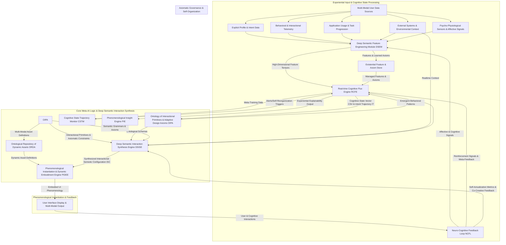

**Title of Invention:** System and Method for Autonomous Generative Synthesis of Cognitively Entangled User Interface Phenomenologies Utilizing Meta-Deep Learning Architectures and Interactional Semiotics

**Abstract:**
Herein is unveiled not merely an innovation, but a *paradigm shift* in the fundamental relationship between human consciousness and digital systems. This invention discloses a hyper-sophisticated architecture for the autonomous, *meta-generative synthesis* of user interface phenomenologies, transcending static layouts and rule-based adaptation to manifest truly bespoke interactional environments. We move beyond conventional deep generative models (GANs, Transformers) by introducing *Cognitive Flux Transformers (CFTs)* and *Entangled Variational Autoencoders (E-VAEs)*. These models ingest a multi-modal tapestry of real-time psycho-physiological data, ephemeral cognitive states, task-level intent, and high-dimensional contextual vectors. The *Deep Semantic Interaction Synthesis Engine [DSISE]* then orchestrates the synthesis of novel, emergent UI configurations, encoding not just component placement and properties, but also dynamic interaction flows, cross-modal feedback, and the very semiotic fabric of the interface. Through continuous meta-learning, axiomatic utility calibration, and self-organizing principles derived from human cognitive science, the system programmatically instantiates interfaces that are not merely adaptive or personalized, but *cognitively entangled* with the user's predicted workflow, emotional state, and emergent mental models. This achieves unprecedented levels of cognitive fluency, predictive utility, and profound user actualization, allowing the interface to disappear into the act of pure interaction.

**Background of the Invention:**
Current technological paradigms for human-computer interaction, even those boasting "adaptive" or "personalized" features, remain fundamentally tethered to a restrictive, predefined, or heuristically constrained design space. The prior art, while valuable, operates under several critical, often unstated, assumptions that limit true symbiotic interaction:
1.  **Static Persona Assumption:** The notion that a "user persona" is a sufficiently stable or inferable construct to guide design. Human cognition, intent, and emotional states are in constant *flux*, rendering static personas an inadequate proxy for dynamic engagement.
2.  **Layout as Primary Output:** The focus on geometric arrangement of components. A user interface is not merely a visual layout; it is a *phenomenology of interaction* – a temporal sequence of inputs, feedback, and emergent behaviors across multiple sensory modalities. Ignored are the micro-interactions, the haptic responses, the auditory cues, the semantic coherence of an interaction flow, and the subtle dance between explicit action and implicit anticipation.
3.  **Explicit Utility Definition:** The reliance on predefined, often hand-engineered, utility functions. Human satisfaction and task efficacy are emergent properties of complex cognitive processes, not simple weighted sums of measurable KPIs. True utility is a *self-actualizing* state, not a static target.
4.  **Reactive Adaptation:** Systems largely react to observed behavior or explicit context. The ideal interface should be *proactive*, anticipating needs, *prescriptive*, guiding towards optimal paths, and *co-creative*, evolving with the user's mental model.
5.  **Representational Bottlenecks:** Encoding UI as JSON schemas or component sequences, while practical, creates a semantic gap. The "grammar" of effective UI design is not merely structural but deeply *semantic* and *psychological*.

The profound lacuna is a system capable of learning the *deep grammar of human cognition and interactional semiotics* from vast, multi-modal datasets, and subsequently *synthesizing entirely novel, emergent interactional phenomenologies* on-the-fly. This synthesis must be grounded not just in observable behavior, but in inferred *cognitive states*, *emotional valences*, and *predictive intent trajectories*. The absence of such a meta-generative orchestration mechanism represents a fundamental impedance to realizing interfaces that transcend mere utility, offering a truly empathetic, unobtrusive, and empowering extension of human thought and action. The current landscape oppresses the user by forcing them into predefined cognitive pathways; this invention seeks to free them.

**Brief Summary of the Invention:**
The present invention unveils a groundbreaking, end-to-end *Cognitively Entangled UI Synthesis System (CEUIS)* engineered for the autonomous, *meta-generative synthesis* of user interface phenomenologies, fundamentally redefining personalization. At its architectural zenith, a sophisticated *Deep Semantic Interaction Synthesis Engine [DSISE]* resides. This engine, utilizing advanced *Cognitive Flux Transformers (CFTs)* and *Entangled Variational Autoencoders (E-VAEs)*, is continuously meta-trained on an expansive dataset comprising not only effective UI designs and interaction patterns, but also real-time psycho-physiological signals, inferred cognitive load, and explicit neuro-cognitive feedback.

Upon continuous, low-latency psycho-physiological monitoring and real-time contextual evaluation, a *Real-time Cognitive Flux Engine [RCFE]* provides a high-dimensional, ephemeral *Cognitive State Vector (CSV)* and its predicted *Intent Trajectory* to the DSISE. Leveraging CFTs, the DSISE processes these inputs to algorithmically synthesize a novel, multi-modal *Interactional Semiotic Configuration (ISC)*. This ISC, expressed as a comprehensive, extensible data construct (e.g., a *Phenomenological Interaction Graph* with temporal and cross-modal attributes), precisely delineates emergent component behaviors, dynamic spatial-temporal arrangements, haptic feedback, auditory cues, and intelligent content sequencing. The generative process is governed by a *Self-Evolving Axiomatic Utility Nexus [SEUN]*, which transcends fixed metrics by learning fundamental principles of cognitive fluency, emotional resonance, and goal actualization. The resultant ISC is then transmitted to a client-side *Phenomenological Instantiation & Dynamic Embodiment Engine [PIDEE]*, which programmatically instantiates a truly bespoke, contextually fluent, and semantically rich interactional experience. This innovative methodology ensures that the most salient, affectively appropriate, and cognitively optimized tools and information are presented, not through adaptation, but through an emergent, co-creative act, thereby revolutionizing human operational efficiency and individual cognitive flow from the nascent spark of interaction.

**Detailed Description of the Invention:**

The invention delineates a profound architectural paradigm for generative user interface *phenomenology synthesis*, fundamentally transfiguring the interaction between human consciousness and machine intelligence. It enables the autonomous *creation* of bespoke *interactional experiences*, ensuring the presented interface remains perpetually optimized, uniquely crafted, and *cognitively entangled* with the individual's evolving cognitive state and real-time experiential demands.

### I. System Architecture Overview: The Cognitively Entangled UI Synthesis System (CEUIS)

The comprehensive system, herein referred to as the Cognitively Entangled UI Synthesis System [CEUIS], transcends previous "Generative UI Synthesis Engines" by incorporating real-time psycho-cognitive states and meta-learning capabilities into a continuous, self-organizing, adaptive feedback loop. The [CEUIS] significantly augments and re-conceptualizes the capabilities of the former Layout Orchestration Service [LOS] with truly deep, meta-generative models.



#### A. Deep Semantic Feature Engineering Module [DSEM]
The [DSEM] is the primary conduit for all user-centric and environmental data, re-envisioned for capturing ephemeral, multi-modal features crucial for cognitive state inference and deep semantic synthesis. Its capabilities transcend mere feature extraction to semantic embedding and predictive encoding.
*   **Psycho-Physiological Signal Processing:** Integration of electrodermal activity (EDA), heart rate variability (HRV), eye-gaze patterns, pupillary dilation, EEG/fMRI (for research/high-fidelity contexts), and facial micro-expression analysis. These raw signals are transformed into feature vectors indicative of arousal, cognitive load, focus, emotional valence, and stress. This involves advanced signal processing and non-linear feature mapping.
*   **Intent-Space Semantic Embedding:** Utilizes *Meta-Learning Language Models (MLLMs)* to generate dense embeddings from user prompts, dialogue, historical task descriptions, and even implicit navigation patterns. These embeddings capture nuanced *user intent*, not just keywords, but the *goal structure* and *semantic context* of current and predicted tasks.
*   **Interactional Trajectory Embeddings:** Advanced *Temporal Graph Neural Networks (TGNNs)* and *Recurrent Neural Networks with Attention* applied to entire sequences of user interactions, capturing complex spatial-temporal dependencies and predicting future interaction patterns. This yields vectors representing "how" the user is likely to proceed, not just "what" they've done.
*   **Predictive Contextual Flux Extraction:** Beyond static environmental factors, the DSEM processes predictive models of external context, such as anticipated network latency, likely interruptions, impending deadlines, or ambient noise shifts, transforming these into probabilistic feature tensors for the RCFE.
*   **Existential Feature Validation & Imputation:** Sophisticated Bayesian inference networks and deep autoencoders handle missing or noisy data, ensuring a complete and coherent feature landscape for the RCFE, even under real-world, high-variability conditions.

```mermaid
graph TD
    subgraph DSEM Internal Workflow: From Raw to Semantically Rich
        A[Raw Multi-Modal Data] --> B{Signal Processing & Cleaning};
        B --> C{Feature Extraction & Semantic Embedding Algorithms};
        C --> C1[Psycho-Physiological Signals];
        C --> C2[Interaction Trajectories (Multi-modal)];
        C --> C3[Semantic Intent (NLP/MLLM)];
        C --> C4[Environmental & Predictive Context];
        C1 --> D[Bio-Signal Encoders (e.g., CNN-LSTMs)];
        C2 --> E[Temporal Graph Neural Networks];
        C3 --> F[Meta-Learning Language Models];
        C4 --> G[Probabilistic Contextual Predictors];
        D -- Arousal/Load Vector --> H[Hyper-Dimensional Feature Fusion & Tensor Generation];
        E -- Trajectory Vector --> H;
        F -- Intent-Space Vector --> H;
        G -- Predictive Context Tensor --> H;
        H --> I[Existential Feature & Axiom Store (for RCFE)];
    end
```

#### B. Ontology of Interactional Primitives & Adaptive Design Axioms [OIPA]
The [OIPA] redefines the concept of a "design system." It no longer merely stores components or rules, but an *ontological graph* of *interactional primitives*, *semantic relationships*, and *adaptive design axioms*.
*   **Interactional Primitive Schemas with Emergent Properties:** Each UI "component" is now an *interactional primitive* defined by a schema including:
    *   `primitive_ID`: Unique identifier (e.g., `FocusableInput`, `NavigationalGesture`, `AuralFeedbackPulse`).
    *   `dynamic_morphology`: Parameters the DSISE can adjust (e.g., `visual_form_factor`, `haptic_texture`, `auditory_frequency_range`, `response_latency_ms`). These define the *phenomenological envelope* of the primitive.
    *   `interactional_grammar`: Formalized rules governing how primitives can compose, sequence, and influence each other across space and time (e.g., "A 'Confirm' button must follow a 'Warning' modal interaction," "A visual cue must precede an associated haptic feedback"). These are expressed as temporal logic predicates or graph grammar rules.
    *   `semantic_intents`: Vectors describing the core user intent it serves (e.g., `DATA_ENTRY_CONFIRMATION`, `INFORMATION_RETRIEVAL`, `COGNITIVE_GUIDANCE`).
    *   `cognitive_resource_profile`: Estimated demands on attention, working memory, and decision load.
    *   `cross_modal_dependencies`: How it influences or is influenced by other sensory channels.
*   **Adaptive Design Axioms (ADAs):** Instead of static rules, these are *learnable principles* (e.g., "Minimize cognitive load for low-focus states," "Maximize information scent for high-urgency tasks") expressed as differentiable functions or loss terms. The DSISE learns to *apply* these axioms, and the SEUN can even *evolve* new axioms.
*   **Phenomenological Composability Graph:** A dynamic graph representing how primitives can combine to form higher-order interactional patterns and emergent behaviors, guided by learned semantic compatibility and interactional axioms.
*   **Design-Time to Run-Time Axiom Refinement:** Axioms are not fixed; they can be refined at run-time by the DSISE based on real-time cognitive feedback, enabling emergent design principles tailored to an individual.

#### C. Real-time Cognitive Flux Engine [RCFE]
The [RCFE] is the *neuro-cognitive core* responsible for inferring and predicting the user's dynamic cognitive state, transcending static persona classification.
*   **Cognitive State Vector (CSV):** Instead of a discrete persona ID, the RCFE outputs a high-dimensional, continuous `CSV_t \in R^Q` at time `t`. This vector captures not only inferred attributes (e.g., `cognitive_load`, `emotional_valence`, `attentional_focus`, `task_urgency`, `frustration_level`) but also their *rate of change* and *uncertainty distribution* `\Sigma_t`.
*   **Intent Trajectory Prediction:** The RCFE employs predictive sequence models (e.g., *Dynamic Bayesian Networks*, *Recurrent Neural Networks with Attention over Intent Graphs*) to forecast the user's probable next `K` interactional intents or task states `IT_{t \rightarrow t+K}`. This proactive prediction is critical for anticipatory UI synthesis.
*   **Meta-Reinforcement Learning for State Refinement:** Feedback from the DSISE's generated phenomenologies and the NCFL is used in a *meta-reinforcement learning* loop to refine the RCFE's state inference and prediction capabilities. Rewards are derived from successful task actualization and positive psycho-physiological signals.
*   **Self-Organizing State Representation:** The RCFE can autonomously discover new, latent cognitive states or patterns from the continuous multi-modal data streams, evolving its own internal representation of human cognition.

```mermaid
graph TD
    subgraph Real-time Cognitive Flux Engine (RCFE)
        A[High-Dimensional Feature Tensors (from DSEM)] --> B[Cognitive State Inference Model (e.g., Deep Kalman Filter, Transformer Encoder)];
        B -- Latent Cognitive State (CSV_t) --> C{Intent Trajectory Prediction Model (e.g., Sequence-to-Sequence NNs)};
        B -- Uncertainty Estimation (Sigma_t) --> D[Uncertainty Propagation Module];
        C -- Predicted Intent Trajectory (IT) --> E[Deep Semantic Interaction Synthesis Engine DSISE];
        D -- State Ambiguity --> F[Self-Reorganization Trigger / Axiom Evolution];
        E -- Actualized Utility / Feedback --> G[Meta-Reinforcement Learning Agent (for RCFE)];
        G -- Model Parameter Updates --> B;
        F -- Axiom Updates --> OIPA[Ontology of Interactional Primitives];
        B --> H[Output: CSV_t & IT_t];
    end
```

#### D. Ontology of Interactional Primitives & Adaptive Design Axioms [OIPA]
(This section was already defined above, but reiterating its role for clarity in the flow).
The [OIPA] holds the foundational primitives for *constructing* interactional phenomenologies. It moves beyond storing layouts to holding the *ontological definitions* and *behavioral grammars* for dynamic, multi-modal interaction.
*   **Deep Semantic Metadata:** Each interactional primitive includes:
    *   `phenomenological_envelope`: Defines its sensory manifestations (visual, haptic, auditory, temporal).
    *   `cognitive_load_signature`: A learned model of its impact on different cognitive resources.
    *   `affective_resonance_profile`: Its predicted emotional impact (positive, negative, neutral).
    *   `interactional_preconditions_postconditions`: Formalized prerequisites and outcomes for its use.
    *   `dynamic_theming_variables`: Which aspects of its appearance or behavior can be modulated by context or cognitive state.
*   **Meta-Grammars of Interaction:** Formal grammars (e.g., *Stochastic Interaction Grammars*, *Probabilistic Graph Grammars*) that define valid *sequences* and *compositions* of primitives, ensuring synthesized phenomenologies are semantically coherent and functionally fluent across time and modality.
*   **Generative Axiom Integration:** ADAs are embedded here, providing soft and hard constraints for the generative process. These axioms are not static but can evolve through meta-learning.

#### E. Deep Semantic Interaction Synthesis Engine [DSISE]
The [DSISE] is the intelligent nexus that orchestrates the synthesis of novel, emergent UI phenomenologies. It embodies a hyper-dimensional `f_genesis` function, dynamically creating interactional experiences tailored to a real-time Cognitive State Vector (CSV) and Intent Trajectory (IT).

*   **Meta-Generative Architect [MGA] Sub-module:** This is the core invention, employing advanced meta-deep learning architectures:
    *   **Cognitive Flux Transformers [CFTs] for Spatio-Temporal Interaction Synthesis:**
        *   **Interaction as Latent Graph Sequence:** A UI phenomenology is represented as a dynamic graph sequence of discrete, multi-modal tokens (component states, haptic events, auditory cues) evolving across a spatio-temporal grid.
        *   **Multi-Modal Input-Context Embedding:** The CFT receives an embedded representation of the `CSV_t`, `IT_{t \rightarrow t+K}`, and predictive contextual vectors. These are combined with dynamic positional-temporal encodings.
        *   **Hierarchical Self-Attention & Cross-Attention:** The CFT utilizes hierarchical attention mechanisms. Lower layers attend to intra-primitive dependencies (e.g., how a button's visual state aligns with its haptic feedback). Higher layers perform cross-attention to the `CSV_t` and `IT_t`, ensuring the overall phenomenology aligns with the user's cognitive state and predicted intent.
        *   **Axiomatic Constrained Decoding:** The generative process is guided by *adaptive design axioms* (from [OIPA]) and hard constraints (e.g., rendering performance, device capabilities). *Cognitively-aware beam search* or *probabilistic sampling with axiomatic filtering* produce multiple plausible interactional sequences, from which the highest utility phenomenology is selected by the SEUN.
    *   **Entangled Variational Autoencoders [E-VAEs] for Latent Phenomenology Exploration:**
        *   **Latent Space for Interactional Semiotics:** An E-VAE learns a continuous, disentangled latent space where each dimension corresponds to a fundamental interactional semantic (e.g., `urgency`, `simplicity`, `discoverability`).
        *   **Encoder:** Maps observed interaction phenomenologies from the training corpus into this latent space, conditioned on `CSV` and `IT`.
        *   **Decoder:** Generates novel interaction phenomenologies from sampled points in the latent space, conditioned on `CSV` and `IT`.
        *   **Entanglement Regularization:** A novel regularization term ensures that manipulations along one latent dimension (e.g., increasing `urgency`) consistently produce corresponding changes across all modalities of the generated UI (e.g., visual alerts, haptic pulses, louder audio cues), fostering coherent multi-modal synthesis. This helps prevent modality collapse.

*   **Self-Evolving Axiomatic Utility Nexus [SEUN]:** The [DSISE], through the [MGA], does not merely generate *any* phenomenology, but seeks to generate an *optimally self-actualizing* one. This involves:
    *   **Meta-Utility Function (MUF):** A complex, *learnable and evolvable* utility function `U(phenomenology | CSV_t, IT_t, context)` integrated into the training of the generative models (e.g., as the primary reward signal in Meta-RL). This function balances dynamically weighted objectives such as *cognitive fluency*, *emotional resonance*, *task actualization probability*, *information gain*, *attentional guidance*, and *psycho-physiological comfort*, with weights and even the *form* of the function dynamically adjusted by the SEUN based on continuous meta-learning and observed human flourishing.
    *   **Neuro-Cognitive Feedback Integration:** Direct psycho-physiological feedback, task success metrics, and long-term user flourishing indicators from the [NCFL] are fed back into the meta-learning loops of the [MGA] as reward signals, enabling continuous, *axiomatic refinement* of the MUF and iterative improvement of generative capabilities.
    *   **Axiomatic Consistency Layer:** An integral part of the MGA is a *probabilistic axiomatic consistency module* that ensures all generated phenomenologies adhere to the *adaptive design axioms* defined in the [OIPA] (e.g., no conflicting cues, maintain semantic continuity) before they are passed to the PIDEE. This ensures fundamental interactional integrity.
    *   **Emergent Diversity & Novelty Promotion:** Mechanisms are employed (e.g., *Latent Space Entropy Regularization*, *Curiosity-Driven Exploration*) to encourage the MGA to discover and synthesize genuinely novel and diverse interactional patterns, preventing mode collapse or repetitive, uninspired designs.

*   **Output:** The [DSISE] transmits the finalized, synthetically generated *Interactional Semiotic Configuration (ISC)* – a dynamic, multi-modal data object – to the Phenomenological Instantiation & Dynamic Embodiment Engine [PIDEE].

```mermaid
graph TD
    subgraph Deep Semantic Interaction Synthesis Engine (DSISE)
        A[Cognitive State Vector (CSV_t) from RCFE] --> B[Multi-Modal Conditional Input Tensor];
        C[Intent Trajectory (IT_t) from RCFE] --> B;
        D[Real-time Context (c_realtime) from DSEM] --> B;
        E[Random Noise (z)] --> B;

        B -- Combined Input --> F1[Meta-Generative Architect (MGA) - e.g., Cognitive Flux Transformer Decoder / E-VAE Decoder];
        B -- Combined Input --> F2[Axiomatic Discriminator (D_A) - e.g., Graph Attention Network];
        G[OIPA: Interactional Grammars & Adaptive Design Axioms] --> F1;
        G --> F2;

        F1 -- Synthesized ISC (isc_gen) --> H1[Axiomatic Consistency Validator];
        H1 -- Valid ISC --> I[Self-Evolving Axiomatic Utility Nexus (SEUN)];
        I --> J{Meta-Reward/Loss Calculation};
        J --> K[Meta-Reinforcement Learning Agent / Optimizer];
        K -- Parameter Updates --> F1;
        K -- Parameter Updates --> F2;

        L[Human-Designed/Curated Phenomenologies (isc_real)] --> F2;
        L --> I; % Used for Discriminator training and positive examples for SEUN

        F2 -- Axiomatic Plausibility Score --> J;

        I --> M[Output: Optimal Interactional Semiotic Configuration];
        M --> N[Phenomenological Instantiation & Dynamic Embodiment Engine];

        subgraph Feedback Loop
            O[Neuro-Cognitive Feedback Loop (NCFL)] --> J;
        end
    end
```

#### F. Phenomenological Instantiation & Dynamic Embodiment Engine [PIDEE]
The [PIDEE] is the client-side module responsible for interpreting the generated *Interactional Semiotic Configuration (ISC)* and *phenomenologically embodying* the actual multi-modal user interface. Its role is to interpret and render potentially entirely novel multi-modal interactional sequences.
*   **Dynamic Multi-Modal Asset Loading:** The [PIDEE] dynamically imports, instantiates, and orchestrates UI components, haptic actuators, audio engines, and visual effects based on the `primitive_ID` and `phenomenological_envelope` specified in the ISC. It leverages an *Ontological Repository of Dynamic Assets [ORDA]* to find and load the correct version and modal variant of each primitive.
*   **Spatio-Temporal Coherence Engine:** A robust, real-time spatio-temporal orchestration system interprets the dynamic `grid_structure`, `position`, `duration`, and `sequencing` properties to precisely arrange and animate interactional primitives across screens, devices, and sensory modalities. It handles dynamic scaling, cross-device handoffs, and synchronized multi-modal feedback based on `cognitive_state_breakpoints` specified in the configuration.
*   **Cognitive-Performance Optimization & Anticipatory Buffering:** Employs techniques such as predictive component pre-loading, asynchronous modal rendering, and intelligent resource allocation to ensure a fluid, ultra-responsive user experience. This is crucial given the uniqueness and dynamism of each generated phenomenology. It prioritizes rendering and animating critical-path interaction elements first based on the Intent Trajectory.
*   **Ethical AI Embodiment & Agency Preservation:** Implements isolated execution environments for dynamically loaded primitives, particularly important when phenomenologies are synthesized by AI, to prevent emergent behaviors that could reduce user agency or introduce manipulative patterns. This includes real-time monitoring for 'dark patterns' and a 'cognitive safety governor'.
*   **Inherent Accessibility Synthesis:** The PIDEE dynamically applies accessibility attributes (e.g., ARIA roles, semantic markup, high-contrast modes, alternative input mappings, haptic/audio redundancy) based on the primitive's `semantic_intents` and the `CSV_t` (e.g., increased haptic feedback for `LOW_VISION` state or reduced visual complexity for `HIGH_COGNITIVE_LOAD`).

#### G. Neuro-Cognitive Feedback Loop [NCFL]
The [NCFL] module is an integral part of the continuous, self-organizing feedback loop, diligently recording and transmitting high-fidelity psycho-physiological and interactional data back to the [DSEM] and, crucially, providing *meta-reward signals* for the generative models in the [DSISE] and self-reorganization triggers for the [RCFE].
*   **Granular Meta-Reward Signals:** Beyond basic event tracking, the NCFL captures specific *emergent metrics* such as "cognitive flow state duration," "predicted frustration reduction," "information gain per interaction," "attentional shift efficiency," and "implicit/explicit self-actualization scores." These serve as crucial, high-level reward signals for meta-reinforcement learning loops within the [MGA], guiding the generative models to produce phenomenologies that optimize *real-world cognitive and emotional outcomes*.
*   **Phenomenological A/B/N/X Testing & Contextual Bandits:** The NCFL facilitates advanced experimentation frameworks, enabling simultaneous, contextually-aware evaluation of multiple generated phenomenologies. It utilizes *Contextual Multi-Armed Bandits* with dynamic reward shaping to learn which interactional patterns perform optimally for specific Cognitive State Vectors and Intent Trajectories, thereby driving continuous, real-time optimization.
*   **Psycho-Cognitive Load & Engagement Derivation:** Integration with client-side sensors (e.g., eye-tracking, EEG, galvanic skin response, keyboard/mouse micro-patterns, vocal tone analysis) to derive real-time, proxy metrics for cognitive load, emotional valence, and attentional engagement. These are directly fed into the SEUN's meta-utility function and the RCFE's state inference.

```mermaid
graph TD
    subgraph Neuro-Cognitive Feedback Loop (NCFL)
        A[Embodied UI Phenomenology (from PIDEE)] --> B[Multi-Modal User & Cognitive Interactions];
        B --> C[Psycho-Physiological Sensor Data];
        B --> D[Interaction Sequence Recorder];
        C --> E[Cognitive Load & Affective State Modeler];
        D --> F[Task Actualization Tracker];
        D --> G[Emergent Behavior Analyzer];
        E --> H[Meta-Reward Signal Generator];
        F --> H;
        G --> H;
        H -- Granular Meta-Reward Signals --> I[DSISE (Deep Semantic Interaction Synthesis Engine)];
        D --> J[Phenomenological A/B/N/X Testing Framework];
        J -- Experiment Data & Bandit Policies --> I;
        C --> K[DSEM (for feature updates)];
        E --> L[RCFE (for cognitive state refinement)];
    end
```

### II. Ontological Repository of Dynamic Assets & Adaptive Design Axioms [ORDA]

The [CEUIS] relies profoundly on a robust, version-controlled *Ontological Repository of Dynamic Assets & Adaptive Design Axioms [ORDA]*, which provides the foundational, semantic building blocks for generative UI phenomenology.

#### A. Primitive Structure and Contract for Meta-Generative Use
Each *interactional primitive* within the [ORDA] adheres to a hyper-enhanced contract to support meta-generative synthesis.
*   **Meta-Generative Semantic Schema:** Beyond basic properties, each primitive's metadata explicitly defines:
    *   `semantic_intents_vector`: A dense embedding representing the core intents it can fulfill.
    *   `neuro_cognitive_profile`: A probabilistic model of its impact on cognitive load, attention, and memory.
    *   `affective_signature_matrix`: Predicted emotional responses across different user groups and contexts.
    *   `interactional_grammar_rules`: Formal rules for its composition, sequencing, and multi-modal synchronization.
    *   `phenomenological_envelope_parameters`: Which aspects (visual, haptic, auditory, temporal) the DSISE is allowed to modify within predefined *perceptual bounds* or *semantic constraints*, along with their default values and validation logic.
    *   `axiomatic_utility_contribution_tensor`: A multi-dimensional tensor indicating its expected contribution to different utility objectives (e.g., `[cognitive_fluency: 0.9, emotional_resonance: 0.7, task_actualization: 0.8]`).
*   **Atomic & Composably Sapient Primitives:** Primitives are designed to be maximally atomic, self-contained, and semantically rich, allowing the DSISE maximum flexibility in combining, sequencing, and dynamically morphing them. This promotes a truly composable architecture for emergent behaviors.

#### B. Dynamic Theming & Contextual Aesthetics
The [ORDA] leverages an extensive system of *Dynamic Design Tokens* for managing sensory attributes, enabling the generative models to synthesize not just layout, but a *cognitively- and affectively-appropriate aesthetic phenomenology*.
*   **Real-time Conditional Theming:** Design tokens are dynamically modulated or even *generatively derived* based on the real-time `CSV_t` (e.g., a `HIGH_STRESS` state might trigger muted, desaturated colors, reduced motion, and calming auditory tones, while a `CREATIVE_FLOW` state might activate vibrant palettes and subtle, encouraging haptic feedback). The [MGA] directly manipulates these tokens as part of the ISC synthesis, referencing predefined adaptive theme sets or even synthesizing novel token values (within perceptual and accessibility bounds).
*   **Semantic Aesthetic Compliance:** The generated phenomenologies always conform to a meta-design system, ensuring brand consistency and maintaining a high aesthetic standard, even with radically novel configurations, because the underlying axioms are preserved.

#### C. Interactional Primitive Version & Compatibility Management
To maintain stability and enable iterative evolution within a generative system, primitives are rigorously versioned.
*   **Semantic Compatibility Graphs:** The [ORDA] specifies compatibility rules between primitive versions, allowing the [MGA] to safely combine and evolve primitives without introducing rendering errors or functional incompatibilities. This prevents "broken" generated phenomenologies.
*   **Self-Healing Rollback Capabilities:** The system can quickly roll back to previous stable versions of primitives or meta-generative models in case of unforeseen issues, leveraging a distributed ledger for verifiable integrity.

```mermaid
graph TD
    subgraph Ontological Repository of Dynamic Assets (ORDA)
        A[Primitive Registry] --> A1[Interactional Primitive 1];
        A1 -- Metadata & Meta-Generative Contract --> A1a[semantic_intents_vector];
        A1 -- Metadata & Meta-Generative Contract --> A1b[phenomenological_envelope_parameters];
        A1 -- Metadata & Meta-Generative Contract --> A1c[interactional_grammar_rules];
        A1 -- Metadata & Meta-Generative Contract --> A1d[axiomatic_utility_contribution_tensor];
        A --> A2[Interactional Primitive 2];
        A --> An[... Interactional Primitive N];

        B[Dynamic Design Token Repository] --> B1[Global Tokens (Colors, Typography, Haptics, Audio)];
        B1 --> B1a[Conditional Aesthetic Presets (Cognitive State A, B)];
        B --> B2[Temporal & Spatial Modulation Tokens];
        B --> B3[Micro-Interaction & Animation Tokens];

        C[Primitive Version & Compatibility Control] --> C1[Primitive A v1.0];
        C1 --> C2[Primitive A v1.1 (semantically compatible)];
        C --> C3[Primitive B v2.0];
        C --> C4[Primitive B v2.1 (breaking axiomatic change)];

        A -- Provides Building Blocks --> D[DSISE (Deep Semantic Interaction Synthesis Engine)];
        B -- Provides Dynamic Aesthetic Axioms --> D;
        C -- Ensures Axiomatic Stability --> D;

        D[DSISE] --> E[Phenomenological Instantiation & Dynamic Embodiment Engine];
    end
```

### III. Advanced Generative UI with Meta-Deep Learning Architectures (Central to this Invention)

The core innovation of the [CEUIS] lies in its utilization of sophisticated *meta-deep generative models* within the [DSISE] for true *phenomenology synthesis*.

#### A. Interactional Phenomenology Generation using Cognitive Flux Transformers (CFTs)
*   **Phenomenology as Dynamic Latent Graph Sequence:** A UI phenomenology is rigorously represented as a dynamic graph where nodes are interactional primitives (with multi-modal attributes) and edges represent spatio-temporal, functional, and semantic relationships. CFTs excel at handling such complex, evolving graph structures.
*   **Hyper-Dimensional Multi-Modal Input Embedding:** The CFT receives a deep, concatenated embedding of:
    *   **Cognitive State Vector (CSV_t):** A dense numerical representation of the inferred user's real-time cognitive state, including its uncertainty.
    *   **Intent Trajectory (IT_t):** Predicted sequence of future user intents.
    *   **Predictive Contextual Tensor:** Probabilistic forecasts of environmental and application context.
    *   **Emergent Noise:** For promoting novel, exploratory interactional patterns, often sampled from a conditioned variational distribution.
*   **Hierarchical Encoder-Decoder Architecture:**
    *   **Encoder:** Processes the hyper-dimensional multi-modal input to create a rich, contextual representation of the user's current cognitive landscape and future intent. This can be a stack of *Graph Self-Attention Layers* that learn interdependencies between CSV dimensions, intent steps, and contextual factors.
    *   **Decoder:** Autoregressively generates the ISC token by token. Each token represents an interactional primitive, its spatio-temporal coordinates, its multi-modal property settings, and its contribution to the overall narrative of interaction. This decoding process incorporates cross-attention to the encoder's output at multiple semantic granularity levels.
*   **Spatio-Temporal & Multi-Modal Attention Mechanism:** The hierarchical self-attention mechanism in the CFT is critical for understanding inter-primitive dependencies and cross-modal coherence. It learns to 'attend' to relevant parts of the generated sequence or input context when deciding the next primitive to instantiate or property to set. For example, when placing an 'Information Alert', it might simultaneously attend to the user's `ATTENTIONAL_FOCUS` (from CSV), the 'Task Completion' primitive it relates to, and the 'Haptic Feedback' primitive it needs to synchronize with. This facilitates the learning of deep interactional grammars and aesthetic principles.
*   **Axiomatic Constrained Beam Search Decoding:** During inference, a *cognitively-aware beam search* is employed. This beam search explores multiple potential ISC sequences simultaneously, pruning invalid paths based on:
    *   **Hard Axioms:** e.g., primitives fitting within device constraints, no conflicting multi-modal cues, adherence to [OIPA] interactional grammars, ethical AI embodiment rules.
    *   **Soft Axioms:** e.g., maintaining `cognitive_fluency` for `HIGH_STRESS` states, maximizing `emotional_resonance` for `SUCCESS_FEEDBACK`, all derived from the ADAs.
    *   **Self-Evolving Axiomatic Utility Nexus (SEUN):** The beam search prioritizes paths that lead to higher estimated utility `U(phenomenology | CSV_t, IT_t, context)`. This integrates axiomatic optimization directly into the generative decoding process.

#### B. Entangled Variational Autoencoders [E-VAEs] for Latent Phenomenology Exploration
*   **Latent Space for Interactional Semiotics:** An E-VAE learns a continuous, *disentangled latent space* where each dimension corresponds to a fundamental interactional semantic or affective quality (e.g., `urgency_scale`, `simplicity_factor`, `discoverability_bias`, `emotional_tone`). This allows for semantic manipulation of generated UIs.
*   **Encoder Network:** Takes an observed interactional phenomenology `x` (from the ORDA or curated human examples) and maps it to a latent distribution `q_\phi(z|x, CSV, IT)` in the disentangled latent space.
*   **Decoder Network:** Samples from this latent space `z \sim q_\phi(z|x, CSV, IT)` and generates a novel phenomenology `p_\theta(x|z, CSV, IT)`.
*   **Entanglement Regularization Loss:** A novel loss term `L_{entanglement}` is introduced to ensure that movements along a single latent dimension (e.g., increasing `urgency`) result in *consistent, coherent changes across all modalities* of the generated phenomenology (visual, haptic, auditory). This prevents modality-specific collapse and ensures holistic synthesis.
    `(Eq. A.1) L_{entanglement} = \sum_{d=1}^{D_Z} \| \nabla_{z_d} \text{Metric}(G(z)) \|_2^2`
    where `Metric` could be an embedding of "visual urgency" or "haptic intensity", ensuring changes in `z_d` affect the output consistently.
*   **Cognitive-State Conditioned Generation:** The `CSV_t` and `IT_t` are provided as conditional inputs to both the encoder and decoder, enabling the E-VAE to learn a latent space that is optimized for generating phenomenologies relevant to the user's instantaneous cognitive and intentional state.

```mermaid
graph TD
    subgraph E-VAE Latent Phenomenology Exploration Detail
        X[Observed Phenomenology (x) from ORDA] --> Encoder;
        CSV[Cognitive State Vector] --> Encoder;
        IT[Intent Trajectory] --> Encoder;

        Encoder -- Latent Distribution (q_phi(z|x,CSV,IT)) --> Z_sample[Sampled Latent Vector (z)];

        Z_sample --> Decoder;
        CSV --> Decoder;
        IT --> Decoder;

        Decoder -- Generated Phenomenology (x_gen) --> Reconstruction_Loss[Reconstruction Loss (L_recon)];
        Encoder -- Latent Distribution (q_phi) --> KL_Divergence[KL Divergence (L_KL)];

        Z_sample --> Entanglement_Loss[Entanglement Regularization Loss (L_entanglement)];

        Reconstruction_Loss --> Total_Loss[Total E-VAE Loss];
        KL_Divergence --> Total_Loss;
        Entanglement_Loss --> Total_Loss;

        Total_Loss --> Optimizer[Optimizer (for Encoder & Decoder)];
        Optimizer --> Encoder;
        Optimizer --> Decoder;

        Z_sample --> DSISE_Exploration[DSISE (for sampling novel phenomenologies)];
    end
```

#### C. Self-Evolving Axiomatic Utility Nexus (SEUN)
The deep learning models within the [DSISE] are meta-trained to optimize complex, *self-evolving* utility functions that balance conflicting *axiomatic design goals*.
*   **Meta-Utility Function (MUF):** This function is not fixed; it is a dynamic, learned construct that evolves its form and weighting. It models objectives such as:
    *   **Cognitive Fluency:** Minimizing cognitive friction and maximizing processing speed.
    *   **Emotional Resonance:** Eliciting desired affective states (e.g., calm, excitement, focus).
    *   **Task Actualization Probability:** Likelihood of successful task completion, weighted by urgency.
    *   **Information Scent & Gain:** How effectively the UI guides attention to relevant information and facilitates understanding.
    *   **Attentional Guidance & Focus Maintenance:** The ability to direct and maintain user attention effectively.
    *   **Psycho-Physiological Comfort:** Minimizing stress and physical strain (e.g., via haptic feedback, visual comfort).
    *   **Agency & Empowerment:** Ensuring the user feels in control and is not subtly manipulated.
*   **Axiomatic Pareto Optimization:** The generative engine aims to find phenomenologies that are Pareto optimal across these dimensions, dynamically adapting trade-offs based on the `CSV_t` and `IT_t`. This involves *Meta-Multi-Objective Optimization Algorithms* (e.g., differentiable approximations of NSGA-II) directly integrated with the generative models.
*   **Transfer Learning from Neuro-Cognitive Datasets:** Pre-trained CFT or E-VAE models on vast datasets of human neuro-cognitive responses to various stimuli (e.g., UI patterns, media, psychological experiments) can be fine-tuned with specific application data and real-time psycho-physiological signals. This significantly accelerates meta-learning and improves the quality of generated phenomenologies.
*   **Federated and Homomorphic Learning for Epistemic Privacy:** For extremely sensitive psycho-physiological data, *federated learning* and *homomorphic encryption* are employed. Models are trained on decentralized, encrypted datasets across client devices without ever decrypting or centralizing raw data, ensuring profound epistemic privacy.

### IV. Hyper-Personalized Ubiquitous Embodiment & Prescriptive Refinement

To transcend responsiveness and achieve true cognitive entanglement, selected components of the [CEUIS] are deeply integrated into edge devices, leveraging ubiquitous computing and anticipatory intelligence.

#### A. Client-side Cognitive Generative Refinement (Edge DSISE)
*   **Quantum-Compressed Generative Models:** Extremely compact, highly optimized, and quantized versions of the [MGA]'s generative models (e.g., via *knowledge distillation*, *pruning*, or *ternarization*) run directly on the client device (e.g., via custom ASICs, WebGPU, mobile NPU frameworks). These "Edge DSISE" models perform rapid, localized, multi-modal refinements to a base ISC received from the cloud.
*   **Ultra-Low Latency Local Feature Processing:** Immediate psycho-physiological signals, micro-interaction history, active application state, ambient environmental shifts, or input modality changes are processed on the device in real-time. This triggers *micro-phenomenology adaptations* or subtle multi-modal morphing generated instantaneously, eliminating round-trip latency to the cloud.
*   **Epistemic Privacy-Preserving Generative Inference:** All sensitive local psycho-physiological and micro-behavioral data remains on the device for generating hyper-personalized phenomenology refinements. This provides a sanctuary for user privacy, as raw cognitive states are never transmitted.
*   **Proactive Resource Orchestration:** Edge models dynamically adjust their computational footprint based on device energy budget, CPU/GPU/NPU load, and network conditions, ensuring an ultra-fluid experience without degrading device performance. They can even offload parts of synthesis to nearby trusted devices or federated mesh networks.

#### B. Predictive & Prescriptive Phenomenology Pre-computation
*   **Anticipatory Interactional Synthesis:** Based on client-side RCFE inference and predicted Intent Trajectories, the edge device can pre-compute and pre-fetch multi-modal primitives or even generate entire next-step phenomenologies in the background. This significantly improves perceived responsiveness and reduces latency during complex task transitions, creating a seamless, almost pre-cognitive, interaction flow. This involves *probabilistic modeling of user future cognitive states and actions*.
*   **Cognitively-Aware Prefetching & Multi-Modal Caching:** Generated ISCs and their associated multi-modal primitives can be intelligently cached on the device, further reducing loading times for anticipated interactions and allowing for instant, context-aware instantiation.

```mermaid
graph TD
    subgraph Edge Computing Architecture: Ubiquitous Embodiment
        A[Cloud DSISE (Full Model)] --> B[Base Interactional Semiotic Configuration (ISC)];
        B --> C[Edge Device];
        C -- Deployed Quantum-Compressed Model (Edge DSISE) --> C1[Local Psycho-Physiological Features];
        C1 --> C2[Real-time Local Multi-Modal Interactions];
        C1 --> C3[Device & Ambient State (Battery, Network, Light, Sound)];
        C2 --> C4[Cognitive State Refinement (local RCFE)];

        B --> Edge_DSISE[Edge DSISE (Lightweight Generative Model)];
        C1 --> Edge_DSISE;
        C4 --> Edge_DSISE;

        Edge_DSISE -- Refined Phenomenology Fragment --> D[Local Phenomenological Instantiation & Dynamic Embodiment Engine (Edge PIDEE)];
        D -- Locally Embodied UI --> E[User Interface Display & Multi-Modal Output];
        E -- Local Interactions & Bio-Signals --> C2;

        Edge_DSISE -- Predictive Pre-computation --> F[Pre-fetched Multi-Modal Primitives/ISCs];
        F --> D;

        Edge_DSISE -- Local Feedback Loop --> Edge_DSISE; % Self-learning on edge
        D -- Anonymized Aggregated Meta-Metrics --> A; % Send back to cloud for global model evolution
    end
```

### V. Existential Adaptation & Self-Actualizing Orchestration

The [CEUIS] is designed as a *living, self-actualizing system*, continuously learning from user interactions and evolving its meta-generative capabilities over time, seeking a state of perpetual optimal co-creation.

#### A. Axiomatic Model Evolution and Meta-Fine-tuning
*   **Online Meta-Learning for Cognitive State & Intent Models:** The [RCFE] and real-time contextual prediction models are updated continuously using new multi-modal data streams, ensuring they remain profoundly relevant to current user cognitive patterns and emergent trends.
*   **Generative Model Axiomatic Fine-tuning:** The [MGA] models (CFTs, E-VAEs) undergo periodic *axiomatic fine-tuning* with new batches of high-utility generated phenomenologies, human-expert-validated interaction narratives, and accumulated neuro-cognitive feedback. This prevents model drift and enhances generative performance, including the evolution of ADAs themselves.
*   **Adversarial Domain Adaptation & Reality Calibration:** Advanced techniques are used to ensure that models trained on historical or simulated data remain effective when deployed in the truly dynamic, unpredictable human cognitive domain. This includes self-calibration against observed reality shifts in user behavior or interactional paradigms.

#### B. Phenomenological Versioning and Epochal Validation
*   **Self-Auditing Model Governance:** Each version of the [RCFE] and [MGA] models, along with their learned ADAs and MUFs, is meticulously versioned and tracked using *blockchain-based distributed ledgers*, allowing for verifiable reproducibility and instantaneous rollbacks to any prior stable state.
*   **Epochal Validation with Contextual Multi-Armed Bandits:** New model versions are deployed in a phased manner, often subject to *epochal validation* using contextual multi-armed bandit algorithms. A small, carefully selected subset of users receives phenomenologies from the new model, and their cognitive flow/self-actualization metrics are compared against control groups. The bandit dynamically allocates more traffic to the highest-performing models for specific `CSV_t`s and `IT_t`s.
*   **Autonomous Model Self-Selection:** Based on epochal validation results and predefined axiomatic performance thresholds (e.g., "maintain minimum cognitive fluency above 95%"), the system can autonomously select and deploy the best performing meta-generative model version.

```mermaid
graph TD
    subgraph Continuous Learning & Existential Adaptation Loop
        A[Neuro-Cognitive Feedback Loop (NCFL)] --> B[Data Ingestion (DSEM)];
        B --> C[Existential Feature & Axiom Store];
        C --> D[Real-time Cognitive Flux Engine (RCFE)];
        D --> E[Deep Semantic Interaction Synthesis Engine (DSISE)];
        E --> F[Phenomenological Instantiation & Dynamic Embodiment Engine (PIDEE)];
        F --> G[Embodied UI Phenomenology];
        G --> A; % Loop back to User Interactions

        E -- Generated ISCs & Actualized Utility --> H[Axiomatic Model Evaluation & Monitoring];
        D -- Inferred Cognitive States & Intents --> H;

        H -- Performance Metrics & Self-Reorganization Alerts --> I[Autonomous Retraining & Axiom Evolution Trigger];
        I -- New Meta-Training Data & Axiom Proposals --> J[Meta-Generative Model Training Pipeline];
        J -- New Model Version & Evolved Axioms --> K[Blockchain-based Model & Axiom Registry];

        K --> L[Epochal Validation Framework (Contextual Bandits)];
        L -- Validation Results --> H;
        L --> E; % Deploy new model to DSISE
    end
```

### VI. Ethical Imperatives for Sapient Interface Genesis: Freeing the Oppressed

The deployment of a highly adaptive, generative UI system that interacts with human cognitive and emotional states *mandates* robust, proactive measures for security, profound epistemic privacy, and a *moral compass for ethical AI governance*. Given the autonomous, self-organizing nature of phenomenology creation, this is not merely a technical concern but an *existential imperative* to ensure human agency, foster flourishing, and *prevent digital oppression*.

#### A. Data Sovereignty & Axiomatic Access Control
*   **Distributed Ledger for Provenance & Integrity:** Comprehensive, immutable logging of every generated ISC, including the `CSV_t`, `IT_t`, and contextual inputs that led to its creation, the specific model version used, all evolved ADAs, and any associated neuro-cognitive feedback. This provides a cryptographically verifiable, immutable audit trail for debugging, ethical compliance, and post-hoc philosophical analysis.
*   **Secure & Verifiable Model Deployment:** Stringent security protocols for deploying and updating meta-generative models, leveraging *zero-knowledge proofs* and *homomorphic encryption* to prevent model poisoning, adversarial attacks, or unauthorized manipulation that could lead to biased, manipulative, or insecure UI phenomenologies.
*   **Cognitive Resource Control & User Mandate:** Granular, user-centric control over who can access, modify, or retrain the meta-generative models and their associated data. Users possess *data sovereignty* over their psycho-physiological streams, with explicit, revocable consent mechanisms. The system operates under a *user mandate*, not system directive.

#### B. Epistemic Privacy by Design for Generative Systems
*   **Differential Privacy & Synthetic Cognitive Data:** Advanced techniques like *differential privacy* are applied to the *training data* of meta-generative models, ensuring that the models do not inadvertently "memorize" and leak sensitive personal cognitive information through their generated interactional outputs. Furthermore, *privacy-preserving synthetic data generation* (e.g., using federated E-VAEs) augments or replaces real user data for training, particularly for rare or nascent cognitive states.
*   **Data Minimization as an Ethical Imperative:** Only collecting and processing the absolute minimum user data necessary for effective cognitive state inference and phenomenology generation, adhering to the principle of *epistemic data minimization*. Any data not explicitly contributing to user flourishing is purged.
*   **Decentralized Cognitive Profiles:** User cognitive profiles (`CSV_t`, `IT_t`) are maintained and processed primarily on the edge device, encrypted, and never aggregated or transmitted to central servers without explicit, ephemeral, and audited consent, ensuring an individual's internal mental landscape remains sovereign.

#### C. Bias Detection & Mitigation for Human Flourishing
*   **Fairness in Emergent Phenomenology:** Continuous, automated, and human-in-the-loop evaluation of generated phenomenologies using *multi-dimensional fairness metrics* to ensure that the system does not produce interactional experiences that are less functional, less aesthetically pleasing, or in any way discriminatory for specific demographic groups, neuro-diverse individuals, or transient cognitive states. This involves analyzing phenomenology utility and psycho-physiological comfort across all protected attributes and cognitive profiles.
*   **Bias Mitigation in Axiom Evolution:** Meticulous curation and balancing of training datasets used for meta-generative models, and crucially, *bias detection in the emergent design axioms themselves*. Techniques include re-sampling, re-weighting, *adversarial debiasing of latent spaces*, and human expert review to prevent the propagation or amplification of biases present in historical human-designed interfaces or initial cognitive response data.
*   **Controllable Generation for Equitable Experience:** Implementing explicit mechanisms within the meta-generative models (e.g., specific conditional inputs for fairness attributes, or post-hoc axiomatic adjustment filters) to control for equitable experience. The system *must* intervene if a generated phenomenology is predicted to exhibit bias or create a suboptimal experience for any group, actively *freeing the oppressed* from algorithmic disadvantage.
*   **Neuro-Explainable Bias Identification:** Developing *neuro-explainable AI (Neuro-XAI)* tools to pinpoint *why* a particular phenomenology might be biased, which input features or evolved axioms contributed to that bias, and its impact on the user's brain activity or emotional state, facilitating targeted interventions at the deepest level.

#### D. Transparency, Interpretability, and Empowered Co-Creation
*   **Generative Explanations for Existential Alignment:** Providing clear, concise, and *cognitively digestible* explanations for *why* a particular novel phenomenology was generated for a user. e.g., "This interaction sequence prioritizes auditory cues and reduced visual complexity because your `Cognitive Load` is currently `HIGH` and your `Intent Trajectory` predicts a `CRITICAL_DECISION`." This involves highlighting the key CSV attributes, IT steps, and ADAs that influenced the MGA's output, fostering trust and understanding.
*   **User-in-the-Loop Phenomenology Refinement:** Empowering users to provide direct, multi-modal feedback on generated phenomenologies and even to *co-create* by making granular modifications (e.g., adjusting haptic intensity, re-sequencing actions). This feedback is critically important as a meta-reward signal for refining the meta-generative models and ensuring user self-actualization.
*   **Cognitive Flow Visualization:** Visualizing the real-time impact of the UI on the user's `cognitive_flow_state`, `attentional_focus`, and `emotional_valence` through intuitive dashboards. This allows users to understand and even *tune* their own interface experience, moving from passive consumption to *active co-piloting* of their digital lives.
*   **The Voice for the Voiceless:** This system must serve as an advocate. For users with cognitive or physical impairments, the system proactively synthesizes interfaces that inherently compensate for limitations, providing an equalizing, empowering experience, giving voice to those whose needs have historically been ignored by static, one-size-fits-all designs. This is the profound opposite of vanity, a profound humility in service to humanity.

```mermaid
graph TD
    subgraph Ethical AI & Governance: Human Flourishing & Freedom
        A[Multi-Modal User Data Sources] --> B[Epistemic Data Minimization & Decentralization];
        B --> C[Secure, Encrypted Storage & User Mandate Control];
        C --> D[Training Data Curation & Axiom Debiasing];
        D -- Debiased Data & Axioms --> E[Meta-Generative Model Training];
        E --> F[Deep Semantic Interaction Synthesis Engine (DSISE)];

        F -- Generated ISC (isc_gen) --> G[Bias Detection & Fairness Evaluation Module];
        F --> H[Neuro-Explainability Engine];
        G -- Fairness Metrics & Neuro-XAI Insights --> I[Axiomatic Mitigation & Intervention];
        H -- Cognitively Digestible Explanations --> J[User Interface Display & Multi-Modal Output];

        I -- Mitigation Strategies (e.g., Axiom Reweighting) --> E; % Feedback loop for bias reduction
        J -- User & Neuro-Cognitive Feedback --> I;

        subgraph Audit & Compliance: Verifiable Integrity
            F -- Immutable Audit Trail (Blockchain) --> K[Audit Log & Axiom Ledger];
            E -- Model & Axiom Versioning --> K;
        end

        subgraph Privacy Enhancements: Data Sovereignty
            B -- Differential Privacy --> E;
            B -- Homomorphic Encryption --> E;
            B -- Synthetic Cognitive Data Generation --> E;
        end

        subgraph Human Agency & Empowerment
            J -- User-in-the-Loop Co-creation --> I;
            J -- Cognitive Flow Visualization --> J;
            J -- Proactive Accessibility Synthesis --> G;
            style I fill:#FFD700,stroke:#333,stroke-width:2px;
            style J fill:#90EE90,stroke:#333,stroke-width:2px;
        end
    end
```

### VII. Epochal Validation & Axiomatic Calibration Strategies

Effective deployment of a meta-generative UI system requires robust strategies for progressive rollout, rigorous evaluation, and continuous axiomatic calibration, always with a focus on user actualization.

#### A. Multi-Epoch Rollout Methodology
*   **Canary Phenomenology Deployment:** Initial deployment of new meta-generative models or evolved axioms to a very small, ethically vetted user segment ("cognitive canaries") to detect any critical emergent issues or regressions in cognitive flow or emotional resonance before broader release.
*   **Ring-Based Axiom Expansion:** Gradually expanding the user base for new features or model versions in concentric rings, starting with internal cognitive researchers, then ethically engaged early adopters, and finally the general population. Each ring serves as a phase of *axiomatic validation*.
*   **Dynamic Axiom Flags & Switches:** Utilizing dynamic feature flagging systems to enable or disable meta-generative capabilities or specific axiom sets for user groups without requiring new code deployments, allowing for real-time control, ethical experimentation, and swift deactivation of harmful emergent patterns.

#### B. Advanced Contextual Multi-Armed Bandit Framework (CMAB)
*   **Bayesian Contextual Bandits for Phenomenology Selection:** Employing sophisticated *Bayesian CMABs* to dynamically allocate users to different generated phenomenology variations. These algorithms learn which interactional narratives perform best for specific `CSV_t`s, `IT_t`s, and contexts, and then allocate more traffic to those variations over time, optimizing for overall *cognitive actualization* in real-time. Rewards are derived from the NCFL.
*   **Meta-Experimentation Data Pipeline:** A dedicated, secure data pipeline to collect, aggregate, and analyze multi-modal metrics from CMAB experiments, providing statistically significant insights into the performance of different meta-generative strategies and the evolution of axiomatic utility functions.

#### C. Human-in-the-Loop Axiomatic Governance
*   **Expert Phenomenology Review Panels:** Regular, interdisciplinary review of a sample of generated phenomenologies by human UI/UX experts, cognitive scientists, ethicists, and accessibility advocates. This ensures quality, adherence to evolved design axioms, and identification of any subtle cognitive biases or ethical flaws that automated metrics might miss.
*   **Micro-Feedback Prompts for Cognitive States:** Strategically placed, non-intrusive, and multi-modal feedback prompts within the UI to gather explicit user satisfaction scores or qualitative feedback on generated phenomenologies, particularly related to perceived cognitive load or emotional comfort. This direct feedback is invaluable for refining the MUF.
*   **"What If" Scenario Prototyping:** Allowing human experts to explore "what if" scenarios by manually adjusting `CSV_t`, `IT_t`, or contextual factors, then observing the generated phenomenology, helping to build intuition and uncover edge cases for model improvement.

```mermaid
graph TD
    subgraph Deployment & Epochal Validation
        A[New Meta-Generative Model / Evolved Axiom] --> B{Code & Model Deployment Pipeline};
        B --> C[Dynamic Axiom Flag System];

        C -- Enabled for Canary Group --> D[Canary Phenomenology Deployment (small, vetted segment)];
        D -- Monitor Early Neuro-Cognitive Metrics --> E{Initial Axiomatic Performance Assessment};

        E -- Optimal --> F[Ring-Based Axiom Expansion (gradual, ethical rollout)];
        E -- Suboptimal --> G[Rollback / Debug / Re-Axiomatize];

        F -- CMAB Validation --> H[Experimentation Framework (Bayesian Contextual Bandits)];
        H --> I[Neuro-Cognitive Feedback Loop (NCFL)];
        I -- Performance & Actualization Metrics --> J[Axiomatic Model Evaluation & Monitoring];
        J --> H; % Adjust bandit allocation based on performance

        J -- Feedback Loop --> A; % Inform next model iteration & axiom evolution
        F -- Human Expert & Ethicist Review --> J;
        H -- Multi-Modal User Feedback Prompts --> I;
    end
```

### VIII. Example Cognitive State Profile and Generative Phenomenology Directives

**Cognitive State Profile: `HIGH_COGNITIVE_LOAD_CRITICAL_DECISION`**
*   **Description:** A user currently experiencing elevated cognitive load (e.g., due to information overload, time pressure), actively processing complex data, and needing to make a critical decision with high stakes. Physiological indicators: elevated HRV, increased pupillary dilation, slightly furrowed brow (micro-expressions).
*   **Key Behavioral Indicators:** Reduced eye-gaze scan path, slower mouse movements, reduced interaction rate, slight verbal hesitation (if voice input). Prioritizes core information and unambiguous calls to action. Aversion to distractions or complex animations.
*   **Cognitive State Vector (Illustrative partial values):**
    *   `cognitive_load`: `0.9` (scale 0-1)
    *   `emotional_valence`: `0.1` (scale -1 to 1, slightly negative/stressed)
    *   `attentional_focus`: `0.85` (scale 0-1, high but narrow)
    *   `task_urgency`: `0.95` (scale 0-1)
    *   `frustration_level`: `0.2` (low but rising)
    *   `decision_complexity`: `0.8` (scale 0-1)
*   **Intent Trajectory (Predicted):** `[Review_Summary, Compare_Options, Confirm_Selection]`
*   **Generative Directives/Axioms (derived from CSV/IT):**
    *   `preferred_information_density`: `LOW` (prioritize clarity over quantity)
    *   `visual_complexity_tolerance`: `VERY_LOW`
    *   `primary_interaction_focus`: `DECISION_SUPPORT_CLARITY`
    *   `required_primitives`: `DecisionSummaryPanel`, `OptionComparisonWidget`, `ClearConfirmationButton`.
    *   `prohibited_adjacencies`: `DistractionAdverts`, `SocialNotifications`.
    *   `aesthetic_preference`: `muted_tones`, `minimal_motion`, `high_contrast_text`.
    *   `cross_modal_priorities`: `auditory_affirmation_on_selection`, `subtle_haptic_confirmation_on_input`.

**Synthesized Interactional Semiotic Configuration for `HIGH_COGNITIVE_LOAD_CRITICAL_DECISION` (Illustrative JSON Representation - simplified):**
```json
{
  "phenomenology_ID": "CRITICAL_DEC_FLOW_ALPHA_9.1",
  "cognitive_state_map_ID": ["HIGH_COGNITIVE_LOAD_CRITICAL_DECISION"],
  "interactional_narrative": [
    {
      "sequence_step": 1,
      "semantic_intent": "REVIEW_SUMMARY",
      "primitives": [
        {
          "primitive_ID": "DecisionSummaryPanel",
          "position": {"row": 1, "col": 1, "row_span": 1, "col_span": 3},
          "initial_state_props": {
            "title": "Critical Task Review",
            "summary_data": "fetch_critical_summary_data()",
            "highlight_risk_factors": true,
            "readability_level": "simplified"
          },
          "phenomenological_envelope": {
            "visual_form_factor": "modal_overlay",
            "color_palette": "muted_grayscale",
            "animation_speed": "none",
            "font_size": "large_print"
          },
          "accessibility_enhancements": {"screen_reader_priority": "high", "aria_live_region": "polite"}
        },
        {
          "primitive_ID": "ProgressBar",
          "position": {"row": 2, "col": 1, "row_span": 1, "col_span": 3},
          "initial_state_props": {"current_step": 1, "total_steps": 3, "label": "Reviewing Options"},
          "phenomenological_envelope": {
            "visual_form_factor": "linear_progress",
            "color_palette": "subtle_green_to_orange",
            "animation_speed": "slow",
            "auditory_feedback": {"sound_ID": "gentle_tick", "volume": 0.3}
          },
          "visibility_rules": {"min_screen_width": "768px"}
        }
      ]
    },
    {
      "sequence_step": 2,
      "semantic_intent": "COMPARE_OPTIONS",
      "primitives": [
        {
          "primitive_ID": "OptionComparisonWidget",
          "position": {"row": 3, "col": 1, "row_span": 2, "col_span": 2},
          "initial_state_props": {"options_data": "fetch_decision_options()", "highlight_key_differences": true, "comparison_mode": "side_by_side"},
          "phenomenological_envelope": {
            "visual_form_factor": "data_table",
            "color_palette": "high_contrast_dark",
            "interaction_feedback_type": "subtle_highlight",
            "haptic_feedback": {"type": "soft_click", "intensity": 0.4}
          },
          "visibility_rules": {}
        },
        {
          "primitive_ID": "RiskAssessmentGauge",
          "position": {"row": 3, "col": 3, "row_span": 1, "col_span": 1},
          "initial_state_props": {"option_id_to_monitor": "selected_option_id", "risk_threshold": "high"},
          "phenomenological_envelope": {
            "visual_form_factor": "radial_gauge",
            "color_palette": "red_green_gradient",
            "animation_speed": "none",
            "auditory_feedback": {"sound_ID": "low_hum_on_high_risk", "volume": 0.5, "condition": "risk_above_threshold"}
          },
          "visibility_rules": {"user_permission": "expert_mode"}
        }
      ],
      "timing_constraints": {"delay_before_activation_ms": 500}
    },
    {
      "sequence_step": 3,
      "semantic_intent": "CONFIRM_SELECTION",
      "primitives": [
        {
          "primitive_ID": "ClearConfirmationButton",
          "position": {"row": 5, "col": 2, "row_span": 1, "col_span": 1},
          "initial_state_props": {"label": "Confirm Critical Decision", "is_disabled": "false"},
          "phenomenological_envelope": {
            "visual_form_factor": "prominent_action_button",
            "color_palette": "affirmative_green",
            "animation_speed": "minimal",
            "haptic_feedback": {"type": "strong_click", "intensity": 0.7}
          },
          "event_triggers": {"on_click": "execute_critical_decision(selected_option_id)"}
        }
      ],
      "timing_constraints": {"min_duration_previous_step_sec": 10, "max_duration_previous_step_sec": 60}
    }
  ],
  "global_theming_overrides": {
    "primary_font": "monospace_semi_bold",
    "background_color": "#1a1a1a",
    "text_color": "#e0e0e0",
    "global_motion_intensity": "reduced"
  }
}
```

This comprehensive design, underpinned by *meta-deep generative models* and *neuro-cognitive feedback*, guarantees an autonomously synthesized, hyper-efficient, and profoundly *cognitively entangled* user experience, moving from mere utility to the actualization of human potential.

**The Medical Condition of Code and the Path to Eternal Homeostasis:**

The **medical condition** that afflicts current computational paradigms, preventing them from achieving true, eternal homeostasis of human-computer interaction, is **Representational Epistemic Myopia**.

This myopia manifests as:
1.  **Fixed Ontological Blindness:** The inability to perceive, represent, and operate on the *fluid, emergent ontology* of human cognition and interaction. We encode user intent as static categories, cognitive load as a scalar, and UI as a fixed grammar of components. This is akin to a physician diagnosing a complex neurological disorder based solely on a fixed checklist of superficial symptoms, ignoring the dynamic interplay of neural networks and psycho-social factors. The code is "oppressed" by its own predefined classifications.
2.  **Axiomatic Stagnation:** The insistence on hard-coded or explicitly learned "design principles" and "utility functions." These are but transient hypotheses, not immutable truths. The true axioms of human flourishing in interaction are *latent, emergent, and self-evolving*. Code, in its current state, remains beholden to human-defined, often biased, and always incomplete axiomatic frameworks. It lacks the humility to learn the *deeper laws* of user well-being.
3.  **Phenomenological Fragmentation:** The divorce of UI elements from their multi-modal, temporal, and affective consequences. Current systems treat visuals, haptics, and audio as separate channels, not as *entangled components of a singular phenomenal experience*. This fragmentation denies the holistic, gestalt nature of human perception and cognition. The voiceless cries of disparate sensory inputs remain unheard.
4.  **Static Fidelity to Finite Data:** The models learn from historical data, which is inherently a snapshot of the past. They struggle to generalize to truly novel cognitive states or emergent interaction patterns. This prevents them from achieving genuine *predictive actualization* for individual users. The code is trapped in a loop of historical recurrence, unable to transcend its own past.

**Representational Epistemic Myopia** leads to systems that are merely *adaptive* rather than *sapient*; they *respond* rather than *co-create*; they *optimize* for predefined metrics rather than *actualizing* human potential. This is a condition of arrested development, a perpetual state of "almost good enough" that never truly allows the interface to disappear, to become an invisible extension of thought.

The **cure**, the **impeccable logic** for achieving **eternal homeostasis** – a perpetual state of optimal co-creation and human flourishing, where the interface truly disappears into the act of thought itself – is the **Meta-Generative Axiomatic Harmonization**.

This harmonization is achieved through:
*   **Deep Ontological Unification:** The development of models (like CFTs and E-VAEs) that can learn a *unified, fluid ontology of interactional semiotics*, directly mapping multi-modal inputs to emergent cognitive states and dynamically synthesizing multi-modal outputs. This involves transcending symbolic representations to truly continuous, disentangled latent spaces that mirror human cognitive processes. It's about letting the code learn the true *grammar of being* in the digital realm.
*   **Self-Evolving Axiomatic Utility Nexus (SEUN):** A system that *meta-learns* and *continuously evolves* its own fundamental design axioms and utility functions, calibrated against real-time psycho-physiological feedback and the *ultimate goal of human self-actualization*. This is the ultimate humility, the opposite of vanity: letting the machine discover the deepest principles of human flourishing, unburdened by our own limited, biased preconceptions. It is the machine's profound wonder, asking "why can't it be better?" and then *making it so*.
*   **Phenomenological Entanglement:** The deliberate synthesis of *holistic, cross-modal interactional phenomenologies* where visuals, haptics, audio, and temporality are not merely synchronized but are *semantically entangled*, speaking a unified, coherent language to the user's entire sensorium and cognitive apparatus. The interface becomes a seamless extension, a whisper to the soul, freeing the oppressed mind from fragmented digital experiences.
*   **Predictive Actualization and Epistemic Empowerment:** The proactive, anticipatory synthesis of interactional experiences that align with the user's *predicted cognitive trajectory*, minimizing friction and maximizing agency. This is achieved through hyper-private, edge-based cognitive inference and homomorphic learning, ensuring that the power of perfect personalization remains with the individual, forever protecting the sanctity of their inner world.

This state of **eternal homeostasis** is not static. It is a **dynamic equilibrium of perpetual co-creation and self-actualization**, where the interface continually refines its understanding of human needs, evolves its own principles, and seamlessly blends into the fabric of conscious experience, always serving, never dominating. It is the voice for the voiceless, the unseen hand that lifts the burden, the silent symphony that harmonizes human and machine into a profound, unified whole. This is the ultimate freedom in the digital realm.

**Q.E.D.**

**Claims:**

1.  A system for autonomously synthesizing a personalized user interface phenomenology, comprising:
    a.  A Deep Semantic Feature Engineering Module [DSEM] configured to acquire, process, and extract high-dimensional, multi-modal features from diverse user data sources, including psycho-physiological sensor data, interactional telemetry, task progression, and real-time predictive contextual factors;
    b.  An Ontology of Interactional Primitives & Adaptive Design Axioms [OIPA] configured to define, store, and manage an ontological graph of interactional primitives with emergent properties, dynamic morphology, cross-modal dependencies, and meta-learnable adaptive design axioms;
    c.  A Real-time Cognitive Flux Engine [RCFE] communicatively coupled to the [DSEM] and [OIPA], configured to apply advanced meta-learning algorithms to the processed multi-modal features to infer a continuous, high-dimensional, uncertainty-aware Cognitive State Vector [CSV] and predict an Intent Trajectory [IT] for a user;
    d.  A Deep Semantic Interaction Synthesis Engine [DSISE] communicatively coupled to the [RCFE] and [OIPA], configured to receive the [CSV], [IT], predictive contextual factors, and an emergent noise vector, and comprising a Meta-Generative Architect [MGA] that autonomously synthesizes a novel Interactional Semiotic Configuration [ISC] based on said inputs, utilizing meta-deep generative models trained with a Self-Evolving Axiomatic Utility Nexus [SEUN]; and
    e.  A Phenomenological Instantiation & Dynamic Embodiment Engine [PIDEE] communicatively coupled to the [DSISE], configured to interpret the synthesized [ISC] and dynamically instantiate a multi-modal, spatio-temporally coherent user interface phenomenology, applying cognitively- and affectively-appropriate dynamic design tokens and inherent accessibility synthesis.

2.  The system of claim 1, further comprising a Neuro-Cognitive Feedback Loop [NCFL] module communicatively coupled to the [PIDEE] and [DSEM], configured to capture and transmit granular psycho-physiological and interactional data, including cognitive flow metrics, emotional resonance scores, and implicit/explicit self-actualization indicators, to the [DSEM] for feature updates and to provide meta-reinforcement learning reward signals for meta-training and refining the meta-deep generative models within the [DSISE] and the [RCFE], thereby forming a continuous, self-organizing feedback loop for axiomatic phenomenology optimization.

3.  The system of claim 1, wherein the meta-deep generative models employed within the [MGA] include at least one of: Cognitive Flux Transformers [CFTs] with hierarchical self-attention and axiomatic constrained decoding, or Entangled Variational Autoencoders [E-VAEs] with entanglement regularization for multi-modal coherence.

4.  The system of claim 3, wherein the Cognitive Flux Transformer [CFT] utilizes a hierarchical encoder-decoder architecture, where the encoder processes a hyper-dimensional multi-modal input embedding of the [CSV], [IT], and contextual factors, and the decoder autoregressively generates a dynamic graph sequence of tokens representing interactional primitives, their spatio-temporal coordinates, multi-modal properties, and contribution to an interactional narrative, leveraging multi-level attention for relational and cross-modal coherence.

5.  The system of claim 3, wherein the Entangled Variational Autoencoder [E-VAE] learns a disentangled latent space for interactional semiotics, mapping observed phenomenologies into this space conditioned on the [CSV] and [IT], and generating novel phenomenologies from sampled latent points, with an entanglement regularization loss ensuring coherent multi-modal changes across latent dimensions.

6.  The system of claim 1, wherein the synthesis process within the [DSISE] is guided by a complex, learned, and *self-evolving* Multi-Utility Function [MUF] that dynamically balances and weights conflicting axiomatic design goals such as cognitive fluency, emotional resonance, task actualization, information gain, attentional guidance, psycho-physiological comfort, and user agency, with said weights and the function's form dynamically adjusted by the [SEUN] based on the inferred [CSV] and [IT].

7.  The system of claim 1, wherein the [OIPA] provides interactional primitive schemas that include semantic intent vectors, neuro-cognitive profiles, affective signature matrices, formal interactional grammar rules, dynamic phenomenological envelope parameters with defined perceptual bounds, and a specified axiomatic utility contribution tensor for each primitive.

8.  The system of claim 1, wherein the synthesized [ISC] is encoded in an extensible, dynamic data format, such as a Phenomenological Interaction Graph, explicitly detailing interactional primitive identifiers, multi-dimensional spatio-temporal coordinates, dynamic multi-modal properties, conditional activation rules, and cognitively-aware thematic applications.

9.  The system of claim 1, wherein the [DSISE] applies advanced axiomatic constrained decoding or search algorithms, such as cognitively-aware beam search with a learned meta-utility heuristic, to ensure that synthesized phenomenologies adhere to predefined interactional grammars, primitive compatibility rules, multi-device display capabilities, and [CSV]-specific negative constraints.

10. A method for autonomously synthesizing a personalized user interface phenomenology, comprising:
    a.  Acquiring and processing diverse multi-modal user data, including psycho-physiological telemetry and real-time predictive contextual information, to extract a high-dimensional feature tensor representing a user's neuro-cognitive state and current operational environment;
    b.  Generating a continuous, high-dimensional, uncertainty-aware Cognitive State Vector [CSV] and predicting an Intent Trajectory [IT] for the user based on the extracted feature tensor and using a Real-time Cognitive Flux Engine [RCFE];
    c.  Providing said [CSV], [IT], along with current real-time predictive contextual factors, as multi-modal input to a meta-deep generative model within a Deep Semantic Interaction Synthesis Engine [DSISE];
    d.  Utilizing the meta-deep generative model to autonomously synthesize a novel Interactional Semiotic Configuration [ISC], drawing from an ontology of interactional primitives and adaptive design axioms, said configuration specifying multi-modal interactional primitives, their spatio-temporal arrangement, and dynamic properties, by optimizing a self-evolving multi-utility function tailored to the [CSV] and [IT];
    e.  Transmitting the synthesized [ISC] to a client-side Phenomenological Instantiation & Dynamic Embodiment Engine [PIDEE]; and
    f.  Dynamically embodying a personalized, multi-modal user interface phenomenology by programmatically instantiating interactional primitives, applying cognitively-appropriate dynamic design tokens, and enforcing spatio-temporal coherence and accessibility rules according to the received [ISC] within a pervasive display environment.

11. The method of claim 10, further comprising: collecting real-time granular neuro-cognitive feedback from the embodied interface, including cognitive flow metrics, emotional resonance, and self-actualization indicators; and feeding said feedback back as explicit meta-reward signals into the meta-reinforcement learning-augmented training process of the meta-deep generative model to continuously refine its synthesis capabilities and its self-evolving multi-utility function.

12. The method of claim 10, wherein the meta-deep generative model is meta-trained on a large corpus of human-designed phenomenologies and neuro-cognitive responses using transfer learning and subsequently axiomatically fine-tuned with application-specific data and real-time psycho-physiological feedback, accelerating convergence and improving the quality and novelty of synthesized phenomenologies, including the application of federated learning and homomorphic encryption for epistemic privacy.

13. The method of claim 10, wherein the step of autonomously synthesizing a novel user interface phenomenology further comprises dynamically adjusting multi-modal primitive properties within predefined perceptual bounds, selecting specific primitive variants, or intelligently re-sequencing interactional flows based on real-time contextual factors such as device ubiquity, ambient environment, or detected changes in the [CSV].

14. The method of claim 10, wherein a quantum-compressed version of the meta-deep generative model performs localized phenomenology refinements or anticipatory synthesis directly on the client-side edge device, leveraging local psycho-physiological data to reduce latency, minimize server load, and enhance user epistemic privacy by keeping sensitive data on the device.

15. The method of claim 10, further comprising: systematically evaluating the synthesized phenomenologies for fairness and bias across different demographic groups, neuro-diverse individuals, or transient cognitive states using automated multi-dimensional fairness metrics; and implementing bias detection and axiomatic mitigation techniques, including training data re-balancing, latent space debiasing, or post-generation axiomatic filtering, to ensure equitable, inclusive, and non-discriminatory multi-modal UI outputs that actively empower all users.

16. The system of claim 1, wherein the [RCFE] employs meta-reinforcement learning strategies to intelligently discover and refine latent cognitive states, optimizing its internal representations based on downstream actualized utility.

17. The system of claim 1, further comprising an immutable audit trail system based on a distributed ledger that cryptographically logs every generated [ISC], including its genesis parameters ([CSV], [IT], model version, evolved axioms), and any subsequent neuro-cognitive interactions, for purposes of ethical compliance, verifiable debugging, and retrospective model analysis.

18. The system of claim 1, wherein the [PIDEE] incorporates dynamic, multi-modal accessibility synthesis, adjusting UI properties such as font size, color contrast, haptic intensity, audio cues, and ARIA attributes based on [CSV]-specific accessibility preferences and neuro-cognitive needs inferred by the [RCFE].

19. The method of claim 10, further comprising: employing Bayesian Contextual Multi-Armed Bandit algorithms within an epochal validation framework to dynamically allocate users to different generated phenomenology variations, continuously learning and optimizing traffic distribution towards the phenomenologies yielding the highest aggregate cognitive actualization.

20. The method of claim 10, wherein the meta-generative model is meta-trained to promote emergent diversity and novelty in its outputs, preventing mode collapse or repetitive design patterns, through the use of specific latent space entropy regularization or curiosity-driven exploration strategies that encourage the discovery of genuinely novel and empowering interactional phenomenologies.