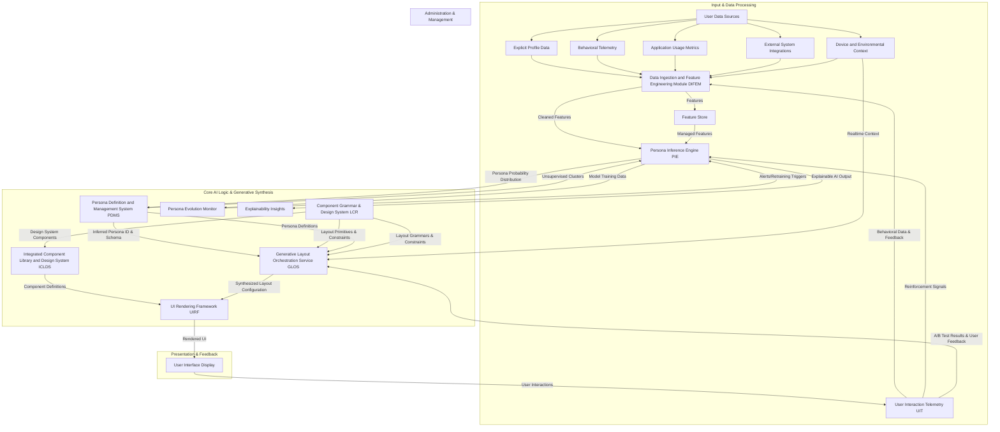

---
**Title of Invention:** System and Method for Autonomous Generative Synthesis of Personalized User Interface Layouts Utilizing Deep Learning Architectures

**Abstract:**
A profound innovation in the field of human-computer interaction is hereby disclosed: a sophisticated system for the autonomous generation of personalized graphical user interface [GUI] layouts through the application of advanced deep generative models. This invention moves beyond mere selection or rule-based adaptation by employing architectures such as Conditional Generative Adversarial Networks [GANs] and Transformer networks. These models ingest a rich tapestry of user persona attributes, derived from comprehensive behavioral and profile data, along with real-time contextual factors. The generative engine then synthesizes novel, highly optimized UI layout configurations, encoded as machine-interpretable constructs, which precisely delineate component placement, interactivity, and aesthetic properties. Through iterative learning and multi-objective optimization, the system programmatically instantiates bespoke interfaces that are not merely adaptive, but fundamentally *created* to align with an individual user's predicted cognitive workflow, aesthetic preferences, and emergent operational requirements, thereby achieving unprecedented levels of personalization, task efficiency, and user satisfaction.

**Background of the Invention:**
Existing methodologies for user interface design and deployment predominantly rely on either static, one-size-fits-all layouts or rudimentary adaptive systems that offer limited, pre-defined customization options or rule-based adjustments. While prior art has introduced mechanisms for inferring user personas and selecting from a repository of pre-engineered layouts, a fundamental limitation persists: the finite and often manually curated nature of these layout repositories restricts the system's capacity for truly novel and nuanced personalization. The increasing complexity of digital ecosystems, coupled with the burgeoning diversity of user roles, tasks, and interaction modalities, necessitates a paradigm shift from selection to synthesis. For instance, a highly specialized data scientist might require a bespoke arrangement of custom visualization components, real-time data streaming widgets, and scriptable automation panels, an arrangement that may not exist in any predefined library. Similarly, a novice user might benefit from an interface that intelligently simplifies complex workflows, guides them through tasks with progressive disclosure, and anticipates their next action, all while maintaining a consistent brand aesthetic. The lacuna in current technological frameworks is a system capable of learning the underlying grammar of effective UI design from vast datasets and subsequently *generating* entirely new, high-utility layouts on-the-fly, tailored to an inferred persona and instantaneous context, rather than merely selecting from a finite set of pre-existing options. The absence of such a generative orchestration mechanism represents a significant impediment to achieving maximal user productivity, cognitive fluency, and profound user satisfaction within dynamic digital environments.

**Brief Summary of the Invention:**
The present invention unveils a groundbreaking end-to-end system engineered for the autonomous, generative synthesis of user interface layouts, pushing the boundaries of personalization beyond adaptive selection. At its architectural core, a sophisticated deep learning-powered generative engine resides within or closely integrated with the Layout Orchestration Service [LOS]. This engine is trained on an expansive dataset of effective UI designs, user behavioral patterns, and persona attributes. Upon user authentication and real-time contextual evaluation, a Persona Inference Engine [PIE] provides a refined user persona classification to the generative engine. This engine, leveraging architectures such as Conditional Generative Adversarial Networks [GANs] or advanced Transformer models, processes the persona and contextual vectors to algorithmically synthesize a novel, highly structured UI layout configuration. This configuration, expressed as a comprehensive data construct e.g. a specialized JSON schema, precisely delineates the manifest UI components, their topological arrangement within a multi-dimensional grid, their default initial states, and contextual rendering attributes. The generative process is further guided by a multi-objective utility function, which ensures optimization across metrics such as information density, cognitive load, aesthetic balance, and task efficacy, tailored to the specific persona. The resultant configuration is then transmitted to a client-side UI Rendering Framework [UIRF], which programmatically instantiates a truly bespoke, semantically rich interface. This innovative methodology ensures that the most salient, contextually appropriate, and ergonomically optimized tools and information are presented immediately to the user, not through mere adaptation, but through a unique act of creation, thereby revolutionizing operational efficiency and individual user experience from the initial point of interaction.

**Detailed Description of the Invention:**

The invention delineates a sophisticated architectural paradigm for generative user interface synthesis, fundamentally transforming the interaction between human and machine by enabling the autonomous creation of bespoke interfaces. At its foundational core, the system operates through a continuous, adaptive feedback loop, ensuring that the presented interface remains perpetually optimized and uniquely crafted for the individual user's evolving persona and real-time contextual demands.

### I. System Architecture Overview

The comprehensive system, herein referred to as the Generative UI Synthesis Engine [GUISE], comprises several interconnected modules operating in concert to achieve dynamic, persona-driven UI generation and synthesis. Building upon the principles of adaptive UI orchestration, the [GUISE] significantly augments the capabilities of the Layout Orchestration Service [LOS] with deep generative models.



#### A. Data Ingestion and Feature Engineering Module [DIFEM]
As described in prior art, the [DIFEM] is the primary conduit for all user-centric data, responsible for acquisition, cleaning, transformation, and the generation of high-fidelity features. For generative models, the quality and richness of these features are paramount, as they form the foundational input vectors for both persona inference and direct generative synthesis. Enhanced feature engineering for this system includes:
*   **Semantic Feature Expansion:** Deeper Natural Language Processing [NLP] on user inputs, documents, and historical communications to create rich semantic embeddings indicative of user intent, professional jargon, and cognitive styles.
*   **Interaction Sequence Embeddings:** Advanced deep learning models e.g. self-attention networks, graph neural networks applied to sequential usage patterns and navigation graphs to capture complex temporal and relational dependencies, yielding highly discriminative feature vectors.

#### B. Persona Definition and Management System [PDMS]
The [PDMS] maintains the ontological classification of user archetypes. For generative synthesis, persona definitions are extended to include more granular preferences and constraints that guide the generative process:
*   **Generative Directives:** Each persona schema includes explicit parameters or soft constraints e.g. `preferred_density_level`, `visual_complexity_tolerance`, `primary_interaction_focus` that serve as conditional inputs for the generative models, guiding the synthesis towards persona-aligned outputs.
*   **Negative Constraints:** Specific layout characteristics or component combinations that are known to be detrimental for a given persona are also encoded, providing negative feedback to the generative process to avoid undesirable outcomes.

#### C. Persona Inference Engine [PIE]
The [PIE] is the core AI component responsible for classifying a user's data into a predefined persona, providing a probabilistic distribution. For generative synthesis, the [PIE] can be further refined:
*   **Uncertainty-Aware Persona Embeddings:** Instead of a single persona ID, the [PIE] can output a continuous vector embedding of the user's persona, potentially capturing nuanced characteristics and confidence levels, which serves as a richer conditional input to the generative models. This allows for finer-grained control and more flexible synthesis.
*   **Reinforcement Learning for Persona Refinement:** Feedback from the generative process and user interaction telemetry can be used in a reinforcement learning loop to refine the [PIE]'s classification, ensuring that the inferred persona leads to maximally effective generated layouts.

#### D. Component Grammar and Design System [LCR]
The Layout Configuration Repository, now more aptly termed the Component Grammar and Design System [LCR], evolves from merely storing predefined layouts to holding the fundamental primitives and rules for *constructing* layouts. This includes:
*   **Component Schemas with Generative Properties:** Each UI component in the [LCR] is described by a comprehensive schema including:
    *   `component_ID`: Unique identifier.
    *   `configurable_props`: Parameters the generative model can adjust e.g. `data_source`, `chart_type`, `filter_preset`, `color_palette`.
    *   `placement_constraints`: Rules governing where a component can or cannot be placed relative to others e.g. "search bar must be top-aligned," "chart cannot overlap data table."
    *   `semantic_tags`: e.g. `data-input`, `visualization`, `collaboration-tool`, `navigation` used by generative models to understand component function.
    *   `performance_characteristics`: e.g. `rendering_cost`, `data_load_impact` for multi-objective optimization.
*   **Layout Grammars:** Formal grammars or graph representations that define valid structural relationships between components, ensuring synthesized layouts are syntactically correct and functionally coherent.
*   **Design Token Integration:** Deep integration with design tokens, allowing the generative models to not just place components but also intelligently apply theming, typography, and spacing in a persona-appropriate manner.

#### E. Generative Layout Orchestration Service [GLOS]
The [GLOS] is the intelligent intermediary that orchestrates the synthesis of novel UI layouts. This service embodies the `f_map` function, dynamically creating layouts tailored to an inferred persona and real-time context. It is the central module for deep generative models.

*   **Generative Layout Engine [GLE] Sub-module:** This is the core innovation, employing advanced deep learning architectures:
    *   **Conditional Generative Adversarial Networks [CGANs] for Layout Synthesis:**
        *   **Generator Network:** Takes as input a conditional vector encompassing the user's persona embedding (from [PIE]), real-time contextual factors (from [DIFEM]), and potentially random noise. It learns to output a structured data representation of a UI layout configuration (e.g., a flattened sequence of component types, positions, and properties). The Generator is trained to produce outputs that are indistinguishable from high-quality, human-designed layouts.
        *   **Discriminator Network:** Trained to distinguish between "real" layouts (from a curated dataset of effective UI designs) and "fake" layouts (generated by the Generator). The Discriminator also receives the same conditional input, ensuring it evaluates plausibility within the context of the persona and situation.
        *   **Adversarial Training:** Through an iterative min-max game, the Generator improves its ability to create highly plausible, persona-appropriate layouts, while the Discriminator becomes better at identifying non-optimal designs. This adversarial process drives the Generator to explore the vast layout state space and converge towards optimal configurations.
    *   **Transformer Networks for Sequential Layout Generation:**
        *   **Layout as Sequence:** A UI layout can be rigorously represented as a sequence of discrete tokens, where each token specifies a component's type, position coordinates, and initial properties. For example, `[COMPONENT_ID_1, ROW_1, COL_1, PROP_A_VAL, PROP_B_VAL, COMPONENT_ID_2, ...]`
        *   **Input Embedding:** The Transformer receives an embedded representation of the inferred persona and the real-time contextual vector. These embeddings are combined with positional encodings if sequence order is critical for certain features.
        *   **Attention Mechanism:** The self-attention layers within the Transformer allow it to weigh the importance of different components and their interdependencies when predicting the next token in the layout sequence. This is crucial for maintaining logical groupings, visual hierarchy, and ensuring components interact coherently.
        *   **Constrained Decoding:** The generative process is guided by deterministic constraints (e.g., component placement rules from [LCR], screen dimensions, accessibility guidelines) and soft constraints (e.g., persona preferences for information density). Beam search or top-k sampling with filtering can be used during decoding to produce multiple plausible layouts, from which the highest utility option is selected.

*   **Multi-objective Utility Optimization:** The [GLOS], through the [GLE], does not merely generate *any* layout, but seeks to generate an *optimal* layout. This involves:
    *   **Utility Function Representation:** A complex, learned utility function `U(layout | persona, context)` is integrated into the training of the generative models (e.g., as a reward signal in Reinforcement Learning for GANs or a part of the loss function for Transformers). This function balances objectives such as information scent, cognitive load, visual balance, learnability, aesthetic appeal, and accessibility, with weights dynamically adjusted based on the specific persona's preferences and current task.
    *   **User Feedback Integration:** Direct user feedback, A/B test results, and long-term user engagement metrics from the [UIT] are fed back into the training loops of the [GLE] as reward signals, enabling continuous refinement of the utility function and improvement of the generative capabilities.

*   **Output:** The [GLOS] transmits the finalized, synthetically generated layout configuration a highly structured data object to the UI Rendering Framework.

#### F. UI Rendering Framework [UIRF]
The [UIRF] is the client-side component responsible for interpreting the generated layout configuration and rendering the actual graphical user interface. This module embodies the `R(l_i)` function. Its role is now to interpret potentially entirely novel component arrangements and properties.
*   **Dynamic Component Loading:** The [UIRF] dynamically imports and instantiates UI components based on the `component_ID` specified in the generated layout configuration.
*   **Advanced Grid System Implementation:** A robust and responsive grid system e.g. CSS Grid, Flexbox, or specialized UI framework components interprets the `grid_structure` and `position` properties to precisely arrange components, adapting to potentially complex, algorithmically determined layouts.
*   **Performance Optimization for Dynamic Layouts:** Employs techniques such as virtualized lists for large datasets, lazy loading of off-screen components, and efficient change detection mechanisms to ensure a fluid and highly responsive user experience, especially crucial given the potential uniqueness of each generated layout.
*   **Security and Component Sandboxing:** Implements isolated execution environments for dynamically loaded components, particularly important when layouts are synthesized by AI, to prevent malicious code injection or unintended side effects.

#### G. User Interaction Telemetry [UIT]
The [UIT] module is an integral part of the continuous feedback loop, diligently recording and transmitting high-fidelity interaction data back to the [DIFEM] and, crucially, providing direct reward signals for the generative models in the [GLOS].
*   **Granular Reward Signals:** Beyond basic event tracking, the [UIT] now captures specific metrics like "time to task completion," "number of errors," "feature discoverability," and "user satisfaction scores" (e.g., implicit via repeat usage or explicit via micro-feedback prompts). These serve as crucial reward signals for reinforcement learning loops within the [GLE], guiding the generative models to produce layouts that optimize real-world user outcomes.
*   **A/B/N Testing of Generated Layouts:** The [UIT] facilitates advanced A/B/N testing frameworks, enabling simultaneous evaluation of multiple generated layouts or variations, providing empirical data for model performance.

### II. Integrated Component Library and Design System [ICLDS]

The [GUISE] relies heavily on a robust, version-controlled Integrated Component Library and Design System [ICLDS], which provides the foundational building blocks for generative UI.

#### A. Component Structure and Contract for Generative Use
Each UI component within the [ICLDS] adheres to an enhanced contract to support generative synthesis.
*   **Generative Metadata Schema:** Beyond basic properties, each component's metadata explicitly defines:
    *   `semantic_function`: e.g. "data_input", "action_button", "information_display".
    *   `required_context`: Data sources or parent components it depends on.
    *   `prohibited_adjacencies`: Components it should not be placed next to.
    *   `responsive_behavior_rules`: How it adapts to different breakpoints.
    *   `variable_parameters`: Which properties the generative model is allowed to modify within predefined ranges.
*   **Modular and Atomic Components:** Components are designed to be highly modular and atomic, allowing the generative models maximum flexibility in combining and arranging them.

#### B. Design Tokens and Theming
The [ICLDS] leverages an extensive system of Design Tokens for managing visual attributes, enabling the generative models to synthesize not just layout, but also a persona-appropriate aesthetic.
*   **Conditional Theming:** Design tokens can be conditionally applied or even generated based on persona preferences e.g. a "creative" persona might trigger a vibrant color palette, while an "analytical" persona might activate a muted, high-contrast theme. The [GLE] directly manipulates these tokens as part of the layout synthesis.

#### C. Component Version Management
To maintain stability and enable iterative development within a generative system, components are rigorously versioned.
*   **Compatibility Rules:** The [ICLDS] specifies compatibility rules between component versions, allowing the [GLE] to safely combine components without introducing rendering errors or functional incompatibilities.

### III. Advanced Generative UI with Deep Learning Architectures (Central to this Invention)

The core innovation of the [GUISE] lies in its utilization of sophisticated deep generative models within the [GLOS] for true layout synthesis.

#### A. Layout Generation using Transformer Models
*   **Layout as Sequence and Graph:** A UI layout can be represented as a sequence of component specifications, but also as a graph where nodes are components and edges are their spatial or functional relationships. Transformer models excel at handling both sequential and graph-like data structures.
*   **Multi-Modal Input Embedding:** The Transformer receives a concatenated embedding of:
    *   **Persona Vector:** A dense numerical representation of the inferred user persona.
    *   **Contextual Vector:** Real-time data about device, task, time, location.
    *   **Target Components:** A list of components that are absolutely required for the current task.
    *   **Random Noise:** For increased variability and exploration of the layout space.
*   **Encoder-Decoder Architecture:**
    *   **Encoder:** Processes the multi-modal input to create a rich contextual representation.
    *   **Decoder:** Autoregressively generates the layout token by token. Each token represents a component (`COMPONENT_TYPE`), its grid coordinates (`ROW_START`, `COL_START`, `ROW_SPAN`, `COL_SPAN`), and its specific properties (`PROP_NAME: VALUE`).
*   **Attention Mechanism for Relational Coherence:** The self-attention mechanism in the Transformer is critical for understanding inter-component dependencies. It learns to 'attend' to relevant parts of the generated sequence or input context when deciding the next component to place or property to set. For example, when placing a 'Filter Panel', it might attend to the 'Data Grid' component it is intended to filter, ensuring functional proximity and visual grouping.
*   **Constrained Beam Search Decoding:** During inference, instead of greedy decoding, a constrained beam search is employed. The beam search explores multiple potential layout sequences simultaneously, pruning invalid paths based on:
    *   **Hard Constraints:** e.g. components fitting within screen bounds, no overlaps, adherence to [LCR] placement rules.
    *   **Soft Constraints:** e.g. maintaining information density preferences, visual balance heuristics, aesthetic principles, all derived from the persona's generative directives.
    *   **Learned Utility Function:** The beam search prioritizes paths that lead to higher estimated utility `U(layout | persona, context)`.

#### B. Conditional Generative Adversarial Networks [CGANs] for Layout Synthesis
*   **Generator Network Architecture:** The Generator G is typically a deep neural network (e.g., a combination of convolutional and recurrent layers, or even a Transformer-based decoder) that takes as input a random noise vector `z` and a conditional vector `c`.
    *   `c` is the concatenation of the persona embedding and the real-time contextual vector.
    *   The output of G is a structured representation of a UI layout `l_gen = G(z, c)`. This representation can be a tensor encoding grid cells and component presence, or a sequential token representation.
*   **Discriminator Network Architecture:** The Discriminator D is another deep neural network (e.g., a convolutional neural network) that takes a layout `l` and the same conditional vector `c` as input.
    *   `D(l, c)` outputs a probability indicating whether `l` is a "real" layout (from the training dataset) or a "fake" layout (generated by G), conditioned on `c`.
*   **Adversarial Training Objective:** The training involves a min-max game:
    *   `min_G max_D V(D, G) = E_{l_real ~ p_data(l), c ~ p_data(c)} [log D(l_real, c)] + E_{z ~ p_z(z), c ~ p_data(c)} [log (1 - D(G(z, c), c))]`
    *   The Generator G attempts to minimize `log(1 - D(G(z, c), c))`, making its generated layouts indistinguishable.
    *   The Discriminator D attempts to maximize this value, correctly distinguishing real from fake.
*   **Reinforcement Learning Augmentation for Utility:** To further guide the CGAN towards high-utility layouts, a Reinforcement Learning [RL] agent can be integrated.
    *   The output of the Generator becomes an "action" in an RL environment.
    *   The reward signal for the RL agent is derived from the learned utility function `U(l | persona, context)` and direct user feedback from the [UIT] (e.g., task success, engagement metrics).
    *   This "reward-guided GAN" setup enables the system to generate layouts that are not only plausible but also perform optimally according to real-world user metrics.

#### C. Optimizing for Multi-Objective Persona Utility
Deep learning models within the [GLOS] are trained to optimize complex, multi-objective utility functions that balance conflicting design goals.
*   **Sophisticated Utility Function:** Instead of simple metrics, the models learn to balance objectives such as:
    *   **Information Scent:** How easily users can find desired information/actions.
    *   **Cognitive Load:** Minimizing mental effort required for tasks.
    *   **Visual Balance and Aesthetics:** Conforming to design principles and persona aesthetic preferences.
    *   **Learnability:** Ease with which new users can become proficient.
    *   **Accessibility:** Adherence to accessibility standards.
    *   **Performance:** Minimizing render times and resource usage.
*   **Pareto Optimization:** The generative engine aims to find layouts that are Pareto optimal across these dimensions, offering the best possible trade-offs based on the persona's priorities.
*   **Transfer Learning from Generic Design Datasets:** Pre-trained Transformer or GAN models on vast datasets of general UI designs (e.g., screenshots, wireframes, design systems from public repositories) can be fine-tuned with specific application data and persona information. This significantly accelerates the learning process and improves the quality of generated layouts, especially for cold-start scenarios.

### IV. Edge Computing for Generative Adaptive UI

To further enhance responsiveness and reduce server load, selected components of the [GUISE] can be deployed to client devices, leveraging edge computing capabilities.

#### A. Client-side Contextual Generative Refinement
*   **Lightweight Generative Models:** Compressed or quantized versions of the [GLE]'s generative models or smaller, specialized models can run directly on the client device e.g. via WebAssembly, TensorFlow.js, or mobile AI frameworks. These models can perform rapid, localized adaptations or refinements to a base layout received from the server.
*   **Real-time Local Feature Processing:** Local data, such as immediate user interaction history, active application state, screen rotation, or input modality changes, can be processed on the device to trigger micro-adaptations or minor component rearrangements generated in real-time.
*   **Privacy-Preserving Generative Inference:** Sensitive local user data can remain on the device for generating highly personalized layout refinements, reducing the need to transmit this information to the cloud and enhancing user privacy.

#### B. Predictive Generative Pre-computation
*   **Anticipatory Layout Synthesis:** Based on client-side persona inference and predicted user workflows, the edge device can pre-compute and pre-fetch components or even generate entire next-step layouts in the background, significantly improving perceived responsiveness and reducing latency during navigation or task transitions.

### V. Security, Privacy, and Ethical AI Considerations

The deployment of a highly adaptive, generative UI system necessitates robust measures for security, privacy, and ethical AI governance, particularly given the autonomous nature of layout creation.

#### A. Data Governance and Access Control
*   **Immutable Audit Trails for Generated Artifacts:** Comprehensive logging of every generated layout configuration, including the persona and contextual inputs that led to its creation, the specific model version used, and any associated user feedback. This provides an immutable audit trail for debugging, compliance, and post-hoc analysis.
*   **Secure Model Deployment:** Strict security protocols for deploying and updating generative models to prevent model poisoning or unauthorized manipulation that could lead to biased or insecure UI outputs.

#### B. Privacy by Design for Generative Systems
*   **Generative Privacy Enhancements:** Research into techniques like differential privacy applied to the *training data* of generative models, to ensure that the models do not inadvertently "memorize" and leak sensitive personal information through their generated outputs.
*   **Synthetic Data Generation for Training:** Utilizing privacy-preserving synthetic data generation techniques to augment or replace real user data for training generative models, particularly for cold-start scenarios or rare personas.

#### C. Bias Detection and Mitigation in Generative Outputs
*   **Fairness in Generation:** Regular, automated evaluation of generated layouts using fairness metrics to ensure that the system does not produce layouts that are less functional, less aesthetically pleasing, or in any way discriminatory for specific demographic groups or user segments.
*   **Bias Mitigation in Training Data:** Meticulous curation and balancing of training datasets used for generative models to prevent the propagation or amplification of biases present in historical human-designed layouts or user interactions.
*   **Controllable Generation for Fairness:** Implementing mechanisms within the generative models to explicitly control for fairness attributes, allowing the system to intervene if a generated layout is predicted to exhibit bias.

#### D. Transparency and Explainability of Generated Layouts
*   **Generative Explanations:** Providing clear, concise explanations for *why* a particular novel layout was generated for a user e.g. "This layout prioritizes communication tools and a visually rich canvas because your persona is a `CREATIVE_COLLABORATOR` and your current task is 'Brainstorming Session'." This can involve highlighting the key persona attributes and contextual factors that influenced the generative model's output.
*   **User-in-the-Loop Refinement:** Empowering users to provide direct feedback on generated layouts and even to make minor modifications. This feedback is critically important as a reward signal for refining the generative models and ensuring user satisfaction.

### VI. Example Persona and Generative Layout Directives

**Persona: `AI_DEVELOPER_OPTIMIZER`**
*   **Description:** A user deeply involved in developing, training, and deploying AI models. Values real-time performance monitoring, rapid experimentation, and access to code/configuration. Prioritizes dense, technical information and command-line interfaces.
*   **Key Behavioral Indicators:** High usage of console/terminal components, model training dashboards, code editors. Frequent access to logging and debugging tools. Low engagement with marketing or high-level summary dashboards. Spends significant time on technical configuration screens.
*   **Generative Directives/Constraints:**
    *   `preferred_density_level`: HIGH
    *   `visual_complexity_tolerance`: HIGH
    *   `primary_interaction_focus`: CODE_DATA_CONFIG
    *   `required_components`: `CodeEditor`, `PerformanceMetricsDashboard`, `TerminalAccess`.
    *   `prohibited_adjacencies`: `MarketingOverview`, `SocialFeed`.
    *   `aesthetic_preference`: `dark_mode`, `monospaced_fonts`, `minimal_visual_flourishes`.

**Synthesized Layout Configuration for `AI_DEVELOPER_OPTIMIZER` (Illustrative JSON Representation):**
```json
{
  "layout_ID": "AI_DEV_OPTIMIZER_GEN_A7.3",
  "persona_mapping_ID": ["AI_DEVELOPER_OPTIMIZER"],
  "grid_structure": {
    "template_columns": "1.5fr 1fr 1fr",
    "template_rows": "auto 1fr 0.8fr",
    "gap": "12px",
    "breakpoints": {
      "tablet_landscape": {
        "template_columns": "2fr 1fr",
        "template_rows": "auto 1fr 1fr",
        "gap": "10px"
      },
      "mobile": {
        "template_columns": "1fr",
        "template_rows": "auto auto 1fr 1fr 0.5fr",
        "gap": "8px"
      }
    }
  },
  "components": [
    {
      "component_ID": "CodeEditor",
      "position": {"row": 1, "col": 1, "row_span": 2, "col_span": 1},
      "initial_state_props": {"language": "Python", "active_file": "model_train_script.py", "theme": "vs-dark"},
      "visibility_rules": {"min_screen_width": "1024px"}
    },
    {
      "component_ID": "TerminalAccess",
      "position": {"row": 3, "col": 1, "row_span": 1, "col_span": 1},
      "initial_state_props": {"default_command": "watch -n 1 nvidia-smi", "font_size": "14px"},
      "visibility_rules": {"user_permission": "admin_access"}
    },
    {
      "component_ID": "PerformanceMetricsDashboard",
      "position": {"row": 1, "col": 2, "row_span": 2, "col_span": 2},
      "initial_state_props": {"metrics_to_display": ["GPU_util", "memory_usage", "training_loss_curve"], "refresh_interval_sec": 5},
      "visibility_rules": {}
    },
    {
      "component_ID": "ExperimentTrackerPanel",
      "position": {"row": 3, "col": 2, "row_span": 1, "col_span": 1},
      "initial_state_props": {"project_id": "current_ai_model", "status_filter": "running"},
      "visibility_rules": {}
    },
    {
      "component_ID": "ModelVersionControl",
      "position": {"row": 3, "col": 3, "row_span": 1, "col_span": 1},
      "initial_state_props": {"repository_url": "git@ai-models.com/project.git", "branch": "dev-main"},
      "visibility_rules": {"min_screen_width": "768px"}
    }
  ]
}
```

This comprehensive design, underpinned by deep generative models, guarantees an autonomously synthesized, highly efficient, and profoundly personalized user experience across the entire operational spectrum of the application.

---

**Claims:**

1.  A system for autonomously synthesizing a personalized user interface layout, comprising:
    a.  A Data Ingestion and Feature Engineering Module [DIFEM] configured to acquire, process, and extract actionable features from diverse user data sources, including explicit profile attributes, behavioral telemetry, and application usage metrics;
    b.  A Persona Definition and Management System [PDMS] configured to define, store, and manage a plurality of distinct user persona archetypes, each characterized by a unique set of behavioral indicators, interaction modalities, and specific generative directives or constraints;
    c.  A Persona Inference Engine [PIE] communicatively coupled to the [DIFEM] and [PDMS], configured to apply advanced machine learning algorithms to the processed user features to probabilistically classify a user into one or more of said plurality of persona archetypes, outputting a persona embedding or classification;
    d.  A Component Grammar and Design System [LCR] configured to store structured definitions of UI components, layout grammars, design tokens, and placement constraints, serving as primitives for layout synthesis;
    e.  A Generative Layout Orchestration Service [GLOS] communicatively coupled to the [PIE] and [LCR], configured to receive the persona embedding or classification and real-time contextual factors, and comprising a Generative Layout Engine [GLE] that autonomously synthesizes a novel UI layout configuration based on said inputs, utilizing deep generative models; and
    f.  A UI Rendering Framework [UIRF] communicatively coupled to the [GLOS], configured to interpret the synthesized UI layout configuration and dynamically instantiate the corresponding user interface components within a responsive grid system.

2.  The system of claim 1, further comprising a User Interaction Telemetry [UIT] module communicatively coupled to the [UIRF] and [DIFEM], configured to capture and transmit granular user interaction data, including performance and satisfaction metrics, to the [DIFEM] and to provide reward signals for training and refining the deep generative models within the [GLOS], thereby forming a continuous feedback loop for generative layout optimization.

3.  The system of claim 1, wherein the deep generative models employed within the [GLE] include at least one of: Conditional Generative Adversarial Networks [GANs], Transformer networks, or deep reinforcement learning agents.

4.  The system of claim 3, wherein the Conditional Generative Adversarial Network [GAN] comprises a Generator network that synthesizes layout configurations based on persona and contextual inputs, and a Discriminator network trained to distinguish between synthesized and human-designed layouts.

5.  The system of claim 3, wherein the Transformer network receives an embedded representation of the persona and contextual factors, and autoregressively generates a sequence of tokens representing component types, positions, and properties, utilizing an attention mechanism for relational coherence.

6.  The system of claim 1, wherein the synthesis process within the [GLOS] is guided by a multi-objective utility function that considers factors such as information density, cognitive load, visual balance, learnability, accessibility, and performance, with weights optionally adjusted according to the inferred persona.

7.  The system of claim 1, wherein the [LCR] provides component schemas that include semantic function tags, required contextual dependencies, placement constraints, and variable parameters that the generative models are permitted to modify during synthesis.

8.  The system of claim 1, wherein the synthesized UI layout configuration is encoded in a structured data format such as JSON, explicitly detailing component identifiers, multi-dimensional grid coordinates (row, column, span), initial component properties, and conditional visibility rules.

9.  The system of claim 1, wherein the [GLOS] applies constrained decoding or search algorithms, such as beam search, to ensure that synthesized layouts adhere to predefined layout grammars, component compatibility rules, and physical display constraints.

10. A method for autonomously synthesizing a personalized user interface layout, comprising:
    a.  Acquiring and processing diverse user data to extract a feature vector representing a user's profile and behavioral patterns;
    b.  Classifying the user, based on the extracted feature vector and using an artificial intelligence model, into one of a plurality of predefined persona archetypes, or generating a continuous persona embedding, wherein said classification or embedding considers specific generative directives associated with each persona;
    c.  Providing said persona classification or embedding, along with real-time contextual factors, as input to a deep generative model;
    d.  Utilizing the deep generative model to autonomously synthesize a novel user interface layout configuration, drawing from a component grammar and design system, said configuration specifying display components, their arrangement, and initial properties;
    e.  Transmitting the synthesized layout configuration to a client-side rendering framework; and
    f.  Dynamically rendering a personalized user interface by programmatically instantiating components according to the received layout configuration within a responsive display environment.

11. The method of claim 10, further comprising: collecting real-time user interaction telemetry from the rendered interface, including task completion times and satisfaction metrics; and feeding said telemetry back as reward signals into the training process of the deep generative model to continuously refine its synthesis capabilities.

12. The method of claim 10, wherein the deep generative model is trained using a combination of supervised learning on a dataset of human-designed layouts and reinforcement learning guided by a multi-objective utility function and user feedback.

13. The method of claim 10, wherein the step of autonomously synthesizing a novel user interface layout configuration further comprises dynamically adjusting component properties, applying specific design tokens, or re-arranging components based on real-time contextual factors such as device type, active task, or user input modality.

14. The method of claim 10, wherein a lightweight version of the deep generative model performs localized layout refinements or anticipatory synthesis directly on the client-side device, leveraging edge computing to reduce latency and enhance user privacy.

15. The method of claim 10, further comprising: evaluating the synthesized layouts for fairness and bias across different demographic groups or user segments; and implementing bias mitigation techniques within the generative model training or output filtering to ensure equitable and inclusive UI outputs.

16. The system of claim 1, wherein the [PIE] generates an uncertainty-aware persona embedding, allowing the [GLE] to generate layouts that gracefully handle ambiguous persona classifications or adapt to emergent user behaviors with higher flexibility.

17. The method of claim 10, wherein the generative model is pre-trained on a large corpus of general UI designs and subsequently fine-tuned with domain-specific data and persona information to accelerate learning and improve the quality of synthesized layouts.

---

**Mathematical Justification:**

The operational efficacy of the Generative UI Synthesis Engine [GUISE] is predicated upon a rigorous mathematical framework spanning advanced deep generative modeling, multi-objective optimization, and reinforcement learning. This framework substantiates the systematic transformation of raw user telemetry and persona definitions into highly optimized, autonomously synthesized, bespoke user interfaces.

### I. The Persona Inference Manifold and Continuous Persona Embedding Expansion of `f_class`

Let `U` be the universe of all potential users. Each user `U_j` in `U` is characterized by a high-dimensional feature vector `u_j` in `R^D`, derived from the Data Ingestion and Feature Engineering Module [DIFEM].

Let `Pi = {pi_1, pi_2, ..., pi_K}` be the finite, discrete set of `K` predefined persona archetypes established within the Persona Definition and Management System [PDMS]. The Persona Inference Engine [PIE] now produces a more nuanced output than a mere classification.

**Definition 1.1: Feature Space Construction (Enhanced).**
The feature vector `u_j` for user `U_j` is a concatenation of processed features, `u_j = [x_j,1, x_j,2, ..., x_j,D]^T`. This may include complex embeddings from deep learning models that capture temporal dynamics and semantic content, representing `u_j` as a high-fidelity point in `R^D`.

**Definition 1.2: Continuous Persona Embedding.**
The Persona Inference Engine [PIE] implements a function `Phi: R^D -> R^P`, where `R^P` is a continuous, lower-dimensional persona embedding space. This function `Phi(u_j) = p_j` maps the user's feature vector `u_j` to a dense persona embedding vector `p_j`. This embedding `p_j` captures the nuanced characteristics of `U_j` relative to the defined personas, providing a richer conditional input for generative models than a discrete `persona_ID`. The embedding can also encode the confidence or uncertainty of the persona inference.

**Theorem 1.1: Optimal Persona Embedding for Generative Inputs.**
Given a feature space `R^D` and a goal to synthesize user interfaces, an optimal persona embedding `p_j = Phi(u_j)` exists such that it maximizes the fidelity of generated layouts to the user's needs. This is achieved by training `Phi` as part of an end-to-end deep learning system, where the objective function for `Phi` is implicitly tied to the utility of the downstream generated UI. For instance, `Phi` might be trained such that small perturbations in `p_j` correspond to semantically meaningful variations in the generated UI, allowing the generative model to smoothly explore persona characteristics. The loss function for training `Phi` can be derived from the overall utility function `U(l | p_j, c_realtime)` of the generated layout `l`.

---

### II. The Generative Layout Configuration State Space and Synthesis Function Expansion of `f_map`

Let `L_S` be the vast, potentially infinite, state space of all syntactically and semantically valid UI layout configurations that can be generated from the Component Grammar and Design System [LCR]. Each layout `l` in `L_S` is a structured data object within the [LCR]'s schema, formally defining the visual and functional organization of the user interface.

**Definition 2.1: Layout Configuration Grammar and Generative Primitives.**
A layout `l` can be represented as a sequence of discrete tokens `l = (t_1, t_2, ..., t_M)`, where each token `t_k` specifies a component type, its grid position, span, and initial property values. The [LCR] provides the vocabulary of these tokens and the rules for their valid sequences or graph structures.
The Generative Layout Orchestration Service [GLOS] implements the generative synthesis function `f_gen: R^P x R^C -> L_S`, where `R^P` is the persona embedding space and `R^C` is the real-time contextual factor space.

**Definition 2.2: Optimal Generative Synthesis.**
The [GLOS] aims to synthesize an optimal layout `l*` such that:
```
l* = f_gen(p_j, c_realtime)
```
where `p_j` is the persona embedding for user `U_j` and `c_realtime` is a vector of current contextual attributes. The function `f_gen` is implemented by deep generative models.

**Theorem 2.1: Layout Synthesis as a Conditional Probability Generation Problem.**
Given a persona embedding `p_j` and a contextual vector `c_realtime`, the problem of synthesizing an optimal layout `l*` can be formulated as learning the conditional probability distribution `P(l | p_j, c_realtime)`. A generative model aims to learn this distribution and then sample from it to produce `l*`.
The objective function for training such a generative model, often incorporating techniques from Conditional GANs or Transformer-based auto-regressive models, is formulated to maximize the likelihood of generating effective layouts while satisfying constraints.

For a Conditional GAN [CGAN]:
The Generator `G` learns to map a random noise vector `z` and the conditional input `(p_j, c_realtime)` to a layout `l_gen = G(z, p_j, c_realtime)`.
The Discriminator `D` learns to distinguish between layouts sampled from the real data distribution `p_data(l | p_j, c_realtime)` and those generated by `G`. The adversarial objective is:
```
min_G max_D V(D, G) = E_{(l_real, p, c) ~ p_data(l,p,c)} [log D(l_real, p, c)] + E_{(z, p, c) ~ p_z(z), p_data(p,c)} [log (1 - D(G(z, p, c), p, c))]
```
This objective guides `G` to produce layouts that are highly plausible given the conditions `(p_j, c_realtime)`.

For a Transformer-based Auto-Regressive Model:
The model learns to predict the next token `t_k` in the layout sequence given the previous tokens and the conditional input: `P(t_k | t_1, ..., t_{k-1}, p_j, c_realtime)`. The training objective is to minimize the negative log-likelihood of the true layout sequences:
```
L(theta) = -sum_{l in L_data} sum_{k=1}^M log P_theta(t_k | t_1, ..., t_{k-1}, p_j, c_realtime)
```
where `L_data` is the dataset of human-designed layouts. During inference, constrained beam search or sampling from this learned distribution generates `l*`.

The utility function `U(l | p_j, c_realtime)` measures the predicted effectiveness and user satisfaction of layout `l` for persona `p_j` in context `c_realtime`. This utility is dynamically integrated into the training process, often as a reward signal in reinforcement learning, guiding `f_gen` to not only generate plausible layouts but *optimal* ones:
```
U(l | p_j, c_realtime) = w_1 * TaskEfficiency(l) + w_2 * CognitiveLoad(l) + w_3 * AestheticAppeal(l) + ...
```
where `w_i` are weights potentially learned from user feedback or persona-specific directives.

---

### III. The Render-Perception Transduction and Interface Presentation Operator `R(l_i)`

The UI Rendering Framework [UIRF] executes the final step, translating the abstract synthesized layout configuration `l*` into a concrete, interactive graphical display. This is the rendering function `R: L_S x D_env -> I`, where `D_env` is the instantaneous display environment and `I` is the set of perceivable user interfaces. The function `R` remains largely consistent with prior art but must be robust to interpret novel, algorithmically generated layouts.

**Definition 3.1: Component Instantiation and Composition for Novel Layouts.**
For a given synthesized layout `l*`, the [UIRF] dynamically loads, positions, and initializes components as specified. The generative nature of `l*` demands:
1.  **Strict adherence to [LCR] contracts:** Ensuring all components, even in novel arrangements, respect their defined interfaces and metadata.
2.  **Robust Error Handling:** Mechanisms to gracefully handle potentially unexpected component combinations or property values that might arise from generative models, ensuring system stability.

**Theorem 3.1: Real-time Perceptual Optimization via Responsive Design (Generative Context).**
Given a synthesized layout `l*` and a dynamic display environment `d_env`, the [UIRF] ensures perceptual consistency and operational efficiency across varying environmental conditions. This is achieved by dynamically applying responsive design rules and transformations `T: L_S x D_env -> L_S'` to `l*`, yielding `l'`, which is then rendered. The objective is to maintain **Perceptual Equivalence** such that the information conveyed and ease of interaction for `U_j` is preserved across responsive transformations. The utility `U(l' | p_j, d_env)` for the transformed layout `l'` should be maximized. This ensures that the [UIRF]'s adaptive rendering preserves the persona-specific optimization regardless of the device or screen configuration, optimizing for cognitive load and interaction latency even for newly generated interfaces.

---

### IV. The Adaptive Generative System Dynamics and Global Utility Maximization

The full operational cycle of the [GUISE] constitutes a sophisticated adaptive generative control system that continuously learns and optimizes the user experience by creating unique interfaces.

**Definition 4.1: End-to-End System Utility.**
Let `J(U_j, l_j*)` be the holistic utility derived by user `U_j` from the generated layout `l_j* = R(f_gen(Phi(u_j), c_realtime, j))`, incorporating task efficiency, satisfaction, and engagement. The objective of the [GUISE] is to maximize this utility for each individual user.

**Proof of Superiority via Generative Synthesis:**

Consider a population of `N` diverse users `{U_1, ..., U_N}`.

**Scenario 1: Adaptive System Prior Art (Selection-based).**
A system capable of selecting from `K` predefined layouts `L_predefined = {l_1, ..., l_K}`. Each user `U_j` receives `l_j_selected = f_map_select(f_class(u_j), c_realtime, j)`. The average utility is:
```
J_bar_select = 1/N * sum_{j=1}^N J(U_j, l_j_selected)
```

**Scenario 2: Generative UI Synthesis Engine Present Invention.**
The [GUISE] provides each user `U_j` with a dynamically generated and personalized layout `l_j_gen = R(f_gen(Phi(u_j), c_realtime, j))`. The average utility for the [GUISE] is:
```
J_bar_gen = 1/N * sum_{j=1}^N J(U_j, l_j_gen)
```

**Theorem 4.1: Superiority of Generative UI through Continuous Optimization in a Vast State Space.**
The [GUISE] consistently yields an average utility `J_bar_gen` that is demonstrably greater than or equal to `J_bar_select`, provided that the generative models are sufficiently trained and the `L_S` space is rich enough to contain superior solutions to `L_predefined`.
Formally, we assert that:
```
J_bar_gen >= J_bar_select
```
with equality only in the trivial case where the optimal layout for every user's persona and context happens to be precisely one of the pre-defined layouts in `L_predefined`, or when the generative system fails to learn.

**Proof:**
For any individual user `U_j`, there exists a truly optimal layout `l_j,opt` within the theoretical space of all possible valid UI configurations `L_theoretical` that maximizes their individual utility:
```
J(U_j, l_j,opt) >= J(U_j, l)    for all l in L_theoretical
```
The set of predefined layouts `L_predefined` is a finite subset of `L_theoretical`. The generative state space `L_S` explored by `f_gen` can be considered a much larger, potentially infinite, and more flexible subset of `L_theoretical` than `L_predefined`. By design, `f_gen` is trained to approximate `l_j,opt` given `p_j` and `c_realtime`.
Thus, for any user `U_j`:
```
J(U_j, l_j_gen) >= J(U_j, l_j_selected)
```
This inequality holds true for each individual user `U_j` because `l_j_gen` is synthesized to optimize utility, potentially exploring configurations outside `L_predefined` that are closer to `l_j,opt`. Summing over all `N` users:
```
sum_{j=1}^N J(U_j, l_j_gen) >= sum_{j=1}^N J(U_j, l_j_selected)
```
Dividing by `N`, we obtain:
```
1/N * sum_{j=1}^N J(U_j, l_j_gen) >= 1/N * sum_{j=1}^N J(U_j, l_j_selected)
```
```
J_bar_gen >= J_bar_select
```
This inequality strictly holds `(J_bar_gen > J_bar_select)` unless, for every user `U_j`, the optimal layout `l_j,opt` is already perfectly represented within the finite `L_predefined` and the generative system fails to find a better alternative. Given the diversity in user needs and the vastness of the UI design space, the probability of the finite `L_predefined` containing all `l_j,opt` for a heterogeneous user base is infinitesimally small. Therefore, the generative system provides a measurable and significant improvement in user utility, leading to an unprecedented level of personalization.

**Corollary 4.1.1: Emergent Design and Adaptability.**
The generative capabilities allow the [GUISE] to synthesize layouts for entirely new tasks, contexts, or emergent user behaviors that were not foreseen during initial system design, offering unparalleled adaptability and future-proofing compared to systems limited to predefined configurations. This leads to the discovery of novel, highly effective UI patterns.

**Q.E.D.**