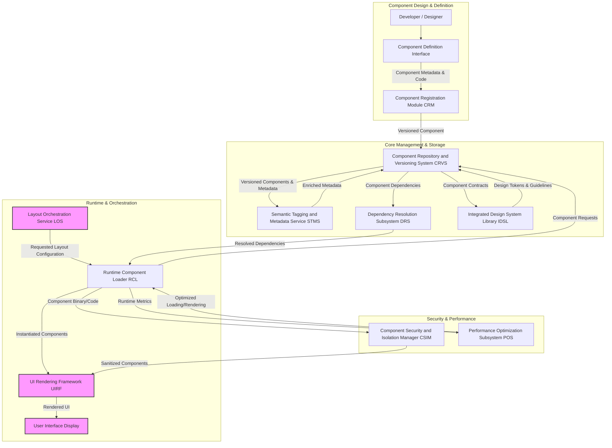

---
**Title of Invention:** Integrated Framework for Dynamic Management, Versioning, and Secure Rendering of User Interface Components in Adaptive Systems

**Abstract:**
A novel and comprehensive framework for the robust management, rigorous versioning, and highly performant dynamic rendering of user interface [UI] components is herewith disclosed. This invention establishes a foundational architecture that provides semantically rich, modular, and secure building blocks for sophisticated UI generation, particularly within adaptive and personalized user interface systems. The framework encompasses a centralized component repository, a declarative component metadata schema, a sophisticated versioning and dependency resolution system, and an intelligent runtime component loader. Components are semantically tagged to facilitate their intelligent selection and contextual instantiation by higher-level layout orchestration services. Furthermore, the invention incorporates robust mechanisms for component isolation, security validation, and performance optimization, ensuring that dynamically assembled UIs are not only highly adaptable and personalized but also secure, stable, and responsive. This framework significantly advances the state of the art in modular UI development, enabling unparalleled flexibility and efficiency in delivering bespoke user experiences.

**Background of the Invention:**
The accelerating complexity of modern software applications, coupled with an increasing demand for highly personalized and adaptive user experiences, has exposed inherent limitations in traditional, static UI development paradigms. While component-based architectures have gained traction, existing frameworks often lack the integrated capabilities required for dynamic component discovery, version-aware loading, and secure, on-the-fly instantiation, especially in systems that must adapt their entire layout based on inferred user personas or real-time context. Developers are frequently burdened with manual dependency management, inconsistent component contracts, and fragmented approaches to ensuring runtime security and performance. The challenge intensifies when attempting to integrate these components into intelligent systems that autonomously select, arrange, and configure them. Without a unified framework that provides version-controlled, semantically rich, and securely renderable UI components, the vision of truly adaptive and personalized interfaces remains hampered by infrastructural bottlenecks, increased development overhead, and significant technical debt. The absence of such an integrated, intelligent component framework represents a critical impediment to achieving highly responsive, robust, and user-centric adaptive UI systems.

**Brief Summary of the Invention:**
The present invention unveils an innovative, end-to-end framework specifically engineered for the dynamic lifecycle management of UI components, from their initial definition to their final runtime instantiation. At its core, a centralized Component Repository and Versioning System [CRVS] meticulously stores all UI components, each accompanied by a formal metadata schema delineating its properties, events, dependencies, and semantic tags. This [CRVS] implements rigorous semantic versioning, ensuring backward compatibility and enabling controlled updates. Upon request from an Adaptive UI Orchestration Engine [AUIOE] or similar intelligent layout service, a Runtime Component Loader [RCL] dynamically retrieves and instantiates the necessary components. This [RCL] is augmented by a Dependency Resolution Subsystem [DRS] that automatically resolves and loads all required component dependencies, ensuring a coherent and functional UI composition. To safeguard against vulnerabilities inherent in dynamic loading, a Component Security and Isolation Manager [CSIM] sandboxes components, validating their integrity and enforcing strict permission boundaries. Performance is meticulously optimized through techniques such as lazy loading, intelligent caching, and render-tree reconciliation. Furthermore, each component is enriched with semantic tags that describe its functional purpose e.g. "data-visualization", "input-control", "collaboration-tool", allowing adaptive layout services to intelligently select and configure components based on inferred user persona and contextual requirements. This integrated framework thereby serves as the indispensable backbone for building truly dynamic, personalized, secure, and performant user interfaces, significantly reducing development complexity and elevating the responsiveness of adaptive applications.

**Detailed Description of the Invention:**

The invention articulates a sophisticated architectural paradigm for managing the complete lifecycle of user interface components, from design to dynamic runtime assembly. This framework is purpose-built to underpin highly adaptive UI systems, ensuring that personalized layouts are constructed from robust, secure, and performant building blocks.

### I. System Architecture of the Dynamic UI Component Framework

The comprehensive system, herein referred to as the Dynamic Component Orchestration Framework [DCOF], integrates several modules to enable the intelligent management and dynamic rendering of UI components.


*Note: The `Layout Orchestration Service LOS`, `UI Rendering Framework UIRF`, and `User Interface Display` are external modules from an Adaptive UI Orchestration Engine, interacting with this framework.*

#### A. Component Definition and Registration Module [CRM]
The [CRM] serves as the primary gateway for defining, documenting, and registering new UI components or updates to existing ones within the [DCOF].

*   **Component Metadata Schema:** Each component adheres to a strict, extensible metadata schema. This schema includes:
    *   `component_ID`: A globally unique identifier for the component.
    *   `version`: Semantic version string e.g. `1.2.3`.
    *   `description`: Human-readable summary of the component's purpose and functionality.
    *   `props_schema`: JSON Schema defining configurable properties, their data types, default values, and validation rules.
    *   `events_schema`: Description of events emitted by the component and their payload structures.
    *   `dependencies`: A list of other `component_ID`s and their required `version` ranges.
    *   `semantic_tags`: Categorical labels e.g. `data-input`, `navigation`, `chart`, `form-control` for intelligent discovery.
    *   `accessibility_attributes`: WCAG compliance details, ARIA roles, etc.
    *   `author`, `license`, `documentation_link`.

*   **Registration Workflow:** Integrates with Continuous Integration/Continuous Deployment [CI/CD] pipelines to automate validation and registration of components upon successful build and testing. Ensures adherence to coding standards and contract specifications.
*   **Declarative Definition:** Supports declarative component definitions e.g. via configuration files or domain-specific languages [DSLs] that abstract away implementation details, making components easier to create, manage, and understand.

#### B. Component Repository and Versioning System [CRVS]
The [CRVS] is the central, immutable store for all UI component definitions, their compiled code, and associated metadata. It is the authoritative source for component availability and compatibility.

*   **Content-Addressable Storage:** Stores component bundles or references to external package registries using content-addressable identifiers e.g. cryptographic hashes, ensuring immutability and verifiable integrity.
*   **Semantic Versioning Enforcement:** Rigorously enforces semantic versioning principles (`MAJOR.MINOR.PATCH`) to manage component evolution.
    *   `MAJOR` increments for breaking API changes.
    *   `MINOR` increments for new features with backward compatibility.
    *   `PATCH` increments for backward-compatible bug fixes.
*   **Version History and Rollback:** Maintains a complete history of all component versions, enabling precise rollbacks to previous stable states and facilitating A/B testing of component updates.
*   **Registry Interface:** Provides a queryable API to discover components by `component_ID`, `semantic_tags`, or `version` constraints.

#### C. Dependency Resolution Subsystem [DRS]
The [DRS] is responsible for analyzing component dependencies and providing a compatible set of component versions required for a given UI layout.

*   **Dependency Graph Construction:** Dynamically builds a directed acyclic graph [DAG] of component dependencies based on the `dependencies` attribute in component metadata.
*   **Constraint Solving:** Employs algorithms to resolve version conflicts, selecting the highest compatible version of each shared dependency. This ensures that only one instance of a shared component is loaded, preventing bloat and potential runtime conflicts.
*   **Transitive Dependency Management:** Automatically identifies and resolves all transitive dependencies, ensuring that a complete and consistent set of components is available for rendering.
*   **Conflict Detection:** Identifies unresolvable dependency conflicts and provides actionable feedback, preventing broken UI compositions.

#### D. Semantic Tagging and Metadata Service [STMS]
The [STMS] enriches component metadata with structured semantic information, making components discoverable and intelligently selectable by adaptive layout systems.

*   **Tag Taxonomy:** Defines a hierarchical or flat taxonomy of semantic tags e.g. `data-visualization/chart/bar`, `input/form-field/text`.
*   **Automated Tagging:** Can leverage Natural Language Processing [NLP] on component descriptions or code analysis to suggest or automatically apply semantic tags.
*   **Query Interface:** Exposes a powerful query interface for the `Layout Orchestration Service LOS` to find components that match specific functional, thematic, or behavioral criteria e.g. "find all components tagged `data-visualization` that support `real-time-updates`".
*   **Persona-Driven Tagging:** Can dynamically augment component tags based on observed user interaction patterns within different personas, further refining component selection relevance.

#### E. Integrated Design System Library [IDSL]
The [IDSL] ensures visual consistency and brand adherence across all components by managing design tokens, styling guidelines, and a shared visual language.

*   **Design Tokens:** A single source of truth for visual attributes e.g. colors, typography, spacing, border-radii, managed as abstract variables. Components consume these tokens.
*   **Theming Engine Integration:** Enables seamless theme switching e.g. `light`, `dark`, `high-contrast` by mapping design tokens to different value sets.
*   **Component Contract Adherence:** Components within the [CRVS] are validated against the [IDSL]'s guidelines to ensure they meet aesthetic and functional standards.

#### F. Runtime Component Loader [RCL]
The [RCL] is the client-side module responsible for fetching, validating, and preparing components for rendering during application runtime.

*   **Dynamic Loading:** Asynchronously loads component bundles e.g. JavaScript, CSS, WASM modules from the [CRVS] or a Content Delivery Network [CDN] as needed, minimizing initial page load times.
*   **Integrity Verification:** Utilizes cryptographic hashes from component metadata to verify the integrity of loaded component bundles, detecting tampering or corruption.
*   **Bundle Management:** Optimizes network requests by batching component loads and leveraging HTTP/2 push where available.
*   **Hot Module Replacement HMR:** Supports replacing component modules at runtime without a full page reload, beneficial for developer experience and advanced adaptive scenarios.

#### G. Component Security and Isolation Manager [CSIM]
The [CSIM] provides critical runtime security measures to mitigate risks associated with dynamic component loading.

*   **Sandboxing:** Instantiates components within isolated environments e.g. Web Workers, iframes, or custom JavaScript sandboxes, preventing malicious or buggy components from affecting the entire application.
*   **Permission Scoping:** Enforces fine-grained permissions for each component, limiting its access to global scope, DOM manipulation, or sensitive APIs.
*   **Code Scanning and Auditing:** Integrates with static and dynamic code analysis tools during component registration to detect vulnerabilities before deployment.
*   **Supply Chain Security:** Verifies the authenticity and provenance of component bundles, guarding against supply chain attacks.

#### H. Performance Optimization Subsystem [POS]
The [POS] implements various strategies to ensure that dynamically rendered UIs are highly performant and responsive.

*   **Lazy Loading:** Components are only loaded when they are needed for display e.g. when scrolled into view, activated by a user, or specifically requested by the `Layout Orchestration Service LOS`.
*   **Component Caching:** Caches loaded components and their resolved dependencies locally on the client-side to minimize redundant network requests and improve subsequent load times.
*   **Pre-fetching and Pre-rendering:** Based on predictive analytics (potentially from the `Persona Inference Engine PIE` in an `AUIOE`), components for anticipated future layouts can be pre-fetched or even pre-rendered in the background.
*   **Render-Tree Reconciliation:** Optimizes DOM updates by only re-rendering parts of the UI that have changed, minimizing browser reflows and repaints.

### II. Component Lifecycle and Interaction

The [DCOF] defines a clear lifecycle for components, from instantiation to destruction, facilitating predictable behavior and effective management.

#### A. Instantiation and Property Binding
*   When the [RCL] instantiates a component, it passes the initial set of properties `initial_state_props` as defined in the layout configuration.
*   The component consumes these properties and initializes its internal state and visual presentation accordingly. This ensures components are immediately rendered with relevant data and settings.

#### B. Event Handling and Communication
*   Components are designed to emit events in response to user interactions or internal state changes.
*   The `UI Rendering Framework UIRF` or parent components can subscribe to these events, allowing for complex inter-component communication and integration with application logic.
*   A centralized event bus can facilitate decoupled communication between distant components.

#### C. State Management
*   Components can manage their own internal state, adhering to a reactive programming model where changes automatically trigger re-rendering.
*   For global or shared state, components can integrate with established state management patterns e.g. Redux, Zustand, Vuex, allowing for consistent data flow across the entire UI.

### III. Integration with Adaptive UI Systems

The [DCOF] is designed to be an integral part of an `Adaptive UI Orchestration Engine AUIOE`, as described in related inventions, enabling truly personalized user experiences.

#### A. Persona-Driven Component Selection
*   The `Layout Orchestration Service LOS` queries the `Semantic Tagging and Metadata Service STMS` to find components that best align with an inferred user persona's preferences and task requirements.
*   Semantic tags allow the [LOS] to filter for components that e.g. prioritize data density for an `ANALYTICAL_INTROVERT` or communication features for a `CREATIVE_EXTRAVERT`.

#### B. Contextual Component Configuration
*   The `Layout Orchestration Service LOS` provides `initial_state_props` to components based on real-time context e.g. device type, active project, time of day.
*   Components are designed to gracefully adapt their appearance or behavior based on these context-aware properties.

#### C. Continuous Feedback Loop
*   User interaction data captured by the `User Interaction Telemetry UIT` (part of an `AUIOE`) can be used to refine semantic tags, validate component effectiveness, and feed into the `Performance Optimization Subsystem POS` to further enhance component delivery and rendering.

### IV. Advanced Component Architectures

The framework is extensible to support cutting-edge component architectures and rendering strategies.

#### A. Micro-Frontend Integration
*   Individual components or small groups of related components can be deployed as independent micro-frontends, managed by the [CRVS] and loaded by the [RCL]. This allows for independent development, deployment, and scaling of UI features.

#### B. Server-Side Rendering SSR and Hydration
*   The framework can support server-side rendering of initial UI layouts using components from the [CRVS], improving perceived performance and SEO.
*   Client-side hydration then reuses the server-rendered HTML, attaching event handlers and dynamic behavior.

#### C. Web Components and Native Integration
*   Components can be implemented using standard Web Components technologies, promoting interoperability and long-term stability.
*   The framework supports packaging native mobile UI components e.g. Android Views, iOS UIViews alongside web components, enabling a unified component management strategy across platforms.

### V. Security, Privacy, and Ethical AI Considerations

The dynamic nature of the [DCOF] mandates robust security, privacy, and ethical considerations throughout its design and operation.

#### A. Secure Supply Chain
*   The [CRVS] and [CRM] enforce strict controls over component submission, ensuring only authorized and verified code enters the system.
*   Digital signatures and cryptographic hashing are used to verify component authenticity from origin to runtime.

#### B. Runtime Security Enforcement
*   The [CSIM]'s sandboxing and permission scoping prevent unauthorized data access, cross-site scripting [XSS] attacks, and other common vulnerabilities arising from dynamically loaded code.
*   Regular security audits of component code and dependencies are performed.

#### C. Data Privacy within Components
*   Components are designed following data minimization principles, only requesting and displaying data strictly necessary for their function.
*   Any sensitive data passed to or processed by components adheres to privacy policies and data protection regulations e.g. GDPR, CCPA.

#### D. Bias and Fairness in Component Selection
*   Semantic tags and component metadata are reviewed for potential biases that could lead to unfair or discriminatory component selection based on inferred persona attributes.
*   Audit trails of component selection and usage are maintained to monitor and mitigate unintended biases in adaptive UI construction.

This sophisticated framework provides the necessary infrastructure for building the next generation of highly adaptive, secure, and user-centric digital experiences.

---

**Claims:**

1.  A system for dynamic management, versioning, and secure rendering of user interface [UI] components, comprising:
    a.  A Component Definition and Registration Module [CRM] configured to receive and validate component code and a formal metadata schema for each UI component, said schema including a unique component identifier, a version, configurable properties, and associated semantic tags;
    b.  A Component Repository and Versioning System [CRVS] communicatively coupled to the [CRM], configured to store, version-control, and manage said UI components and their metadata according to semantic versioning principles, maintaining an immutable history;
    c.  A Dependency Resolution Subsystem [DRS] communicatively coupled to the [CRVS], configured to analyze component dependencies declared within the metadata schema and resolve compatible versions thereof, creating a coherent dependency graph;
    d.  A Semantic Tagging and Metadata Service [STMS] communicatively coupled to the [CRVS], configured to enrich component metadata with structured semantic tags that describe component functionality and characteristics, facilitating intelligent discovery;
    e.  A Runtime Component Loader [RCL] configured to dynamically retrieve specified UI components and their resolved dependencies from the [CRVS] based on a layout configuration request, and to prepare said components for instantiation;
    f.  A Component Security and Isolation Manager [CSIM] communicatively coupled to the [RCL], configured to sandbox dynamically loaded components within isolated runtime environments and enforce granular permission policies, thereby mitigating security risks; and
    g.  A Performance Optimization Subsystem [POS] communicatively coupled to the [RCL], configured to apply performance enhancement techniques including lazy loading, intelligent caching, and render-tree reconciliation during component retrieval and rendering.

2.  The system of claim 1, wherein the metadata schema further includes definitions for component events, accessibility attributes, and links to documentation.

3.  The system of claim 1, wherein the [CRVS] enforces content-addressable storage for component bundles and provides an API for querying components by identifier, version, or semantic tags.

4.  The system of claim 1, wherein the [DRS] is configured to detect and report unresolvable dependency conflicts.

5.  The system of claim 1, wherein the [STMS] allows for automated or semi-automated semantic tagging based on component descriptions or code analysis.

6.  The system of claim 1, wherein the [RCL] asynchronously loads component bundles and verifies their integrity using cryptographic hashes.

7.  The system of claim 1, wherein the [CSIM] utilizes at least one of Web Workers, iframes, or custom JavaScript sandboxes for component isolation.

8.  The system of claim 1, further comprising an Integrated Design System Library [IDSL] communicatively coupled to the [CRVS], configured to manage design tokens and stylistic guidelines consumed by the UI components, ensuring visual consistency.

9.  The system of claim 1, wherein the system is integrated with an Adaptive UI Orchestration Engine [AUIOE] such that the [RCL] receives layout configurations and component requests from a Layout Orchestration Service [LOS] and the [STMS] informs persona-driven component selection by said [LOS].

10. A method for dynamic management, versioning, and secure rendering of user interface [UI] components, comprising:
    a.  Defining and registering UI components, each with a unique identifier, semantic version, configurable properties, and descriptive semantic tags, into a centralized repository;
    b.  Storing and version-controlling said UI components and their associated metadata, including dependency declarations, within an immutable repository that adheres to semantic versioning;
    c.  Receiving a request for a UI layout configuration, said request specifying a set of required UI components and their desired properties;
    d.  Resolving all direct and transitive dependencies for the requested UI components, ensuring compatibility across all required versions;
    e.  Dynamically retrieving the resolved UI components and their associated code bundles;
    f.  Verifying the integrity and authenticity of the retrieved component code bundles;
    g.  Instantiating the verified UI components within isolated runtime environments, enforcing granular security permissions to prevent unauthorized access or interference; and
    h.  Applying performance optimizations, including lazy loading and intelligent caching, during the retrieval and rendering processes to ensure a responsive user experience.

11. The method of claim 10, further comprising enriching component metadata with semantic tags that describe component functionality, enabling intelligent selection by an adaptive layout orchestration service.

12. The method of claim 10, wherein the step of instantiating further comprises binding initial properties to the components as specified in the layout configuration.

13. The method of claim 10, further comprising receiving feedback from user interaction telemetry to refine component semantic tags, validate component effectiveness, and inform performance optimization strategies.

14. The method of claim 10, wherein the component code bundles are loaded asynchronously and optionally pre-fetched based on predictive analytics of user behavior or persona.

15. The method of claim 10, wherein version conflicts during dependency resolution are automatically detected and reported.

16. The method of claim 10, further comprising integrating component styling with a centralized design system using design tokens to ensure visual consistency.

17. The method of claim 10, wherein the isolated runtime environments are implemented using Web Workers or similar sandboxing technologies.

---

**Mathematical Justification:**

The efficacy of the Dynamic Component Orchestration Framework [DCOF] is substantiated by a rigorous mathematical foundation that addresses component definition, versioning logic, dependency resolution, security, and performance guarantees. This framework transforms discrete UI modules into a robust, intelligently managed ecosystem.

### I. Formal Component Definition and Metadata Structure

Let `C` be the universal set of all potential UI components. A single UI component `c` in `C` is formally defined by its structural and behavioral contract.

**Definition 1.1: Component Tuple.**
A component `c_i` is represented as a tuple:
```
c_i = (id_i, v_i, M_i, D_i, S_i, P_i, E_i)
```
where:
*   `id_i`: A unique identifier from a set `ID`.
*   `v_i`: A semantic version string `(Major.Minor.Patch)` from `V`.
*   `M_i`: Component metadata, a set of key-value pairs `{(key, value)}` including `description`, `props_schema`, `events_schema`, `accessibility_attributes`.
*   `D_i`: Direct dependencies, a set of pairs `{(id_j, version_range_j)}` for other components `c_j` required by `c_i`.
*   `S_i`: Semantic tags, a set of strings from a predefined taxonomy `TagSet`.
*   `P_i`: Configurable properties (input), a set of typed parameters conforming to `props_schema`.
*   `E_i`: Emitted events (output), a set of defined events conforming to `events_schema`.

The metadata `M_i` and particularly the `props_schema` and `events_schema` ensure a declarative, machine-interpretable contract for each component, enabling automated validation and consistent interaction.

**Theorem 1.1: Component Contract Observance and Type Safety.**
Given a `c_i`, if all `props_i` conform to `props_schema_i` and all emitted events `E_i` conform to `events_schema_i`, then `c_i` guarantees predictable behavior within the `UI Rendering Framework UIRF`. The framework enforces this contract by static analysis during registration and runtime validation upon property updates, ensuring type safety and preventing unexpected behavior. This is crucial for dynamic assembly where components are composed without prior compile-time linking.

---

### II. Versioning and Dependency Resolution Formalism

The [CRVS] and [DRS] underpin the stability and evolvability of the component ecosystem.

**Definition 2.1: Semantic Versioning Relation.**
For two versions `v_1 = (Maj_1.Min_1.Pat_1)` and `v_2 = (Maj_2.Min_2.Pat_2)`, we define compatibility:
*   `v_1` is "compatible with" `v_2` (`v_1 ~ v_2`) if `Maj_1 = Maj_2` and `Min_1 >= Min_2` (for `Minor` increments), or `Maj_1 = Maj_2`, `Min_1 = Min_2`, and `Pat_1 >= Pat_2` (for `Patch` increments).
*   A version `v_i` "satisfies" a version range `R_j` (`v_i in R_j`) if `v_i` falls within the specified bounds of `R_j` (e.g., `^1.2.3` means `>=1.2.3 <2.0.0`).

**Definition 2.2: Dependency Graph.**
Let `G = (N, L)` be a directed graph where `N` is the set of unique component IDs `id_k` requested for a layout, and `L` is the set of directed edges `(id_a, id_b)` if `c_a` depends on `c_b`. Each edge `(id_a, id_b)` is associated with a version range `R_{a,b}`.

**Theorem 2.1: Resolvability of Component Set.**
Given a set of requested components `C_req = {c_1, ..., c_m}` each with a desired version or range, the [DRS] can find a globally consistent set of component versions `V_resolved = {v_1*, ..., v_n*}` such that `n >= m` (due to transitive dependencies), and for every `c_k` in `C_req` or its transitive dependencies:
1.  `v_k*` is the latest compatible version available in the [CRVS] that satisfies all version ranges specified for `id_k`.
2.  For every `(id_a, id_b)` in `G`, the chosen version `v_b*` for `id_b` satisfies `R_{a,b}`.
This problem can be modeled as a constraint satisfaction problem or a maximum flow problem on a suitably constructed graph, ensuring that if a solution exists, the [DRS] will find the unique maximal version set that satisfies all constraints. The complexity of dependency resolution for `N` components and `E` dependencies is often `O(N + E)` for simple graph traversals but can become exponential in the worst case for complex version ranges, necessitating optimized algorithms.

**Proof of Conflict Detection:** If for any `id_k`, no `v_k*` can be found that satisfies all specified version ranges from its dependents, or if circular dependencies are detected without a compatible breaking point, the [DRS] terminates with a conflict error, proving the impossibility of a consistent resolution given the current [CRVS] state.

---

### III. Semantic Tagging and Intelligent Component Selection

The [STMS] provides the metadata crucial for adaptive UI systems.

**Definition 3.1: Semantic Profile.**
Let `Sem(c_i)` be the semantic profile of component `c_i`, a vector of boolean or weighted values indicating the presence or strength of each semantic tag from `TagSet`.
```
Sem(c_i) = [w_1, w_2, ..., w_|TagSet|]
```
where `w_j` is 1 if `c_i` has `tag_j`, 0 otherwise, or a real value indicating relevance.

**Theorem 3.1: Persona-Driven Component Utility Maximization.**
Let `P(persona_k)` be the semantic requirements profile for persona `k` (also a vector in `R^|TagSet|`). The `Layout Orchestration Service LOS` seeks to select a set of components `C_layout = {c_x, c_y, ...}` for a given persona `k` that maximizes a utility function `U`:
```
U(C_layout | persona_k) = sum_{c_i in C_layout} (Sem(c_i) dot P(persona_k)) - Penalty(C_layout)
```
where `Penalty(C_layout)` accounts for component redundancy, layout complexity, or resource consumption. The `dot product` quantifies how well a component's semantic profile aligns with the persona's needs. The [STMS] facilitates this by providing a highly structured and queryable `Sem(c_i)` for all `c_i` in the [CRVS]. This enables the [LOS] to perform efficient similarity searches or machine learning-driven recommendations to select components that are most relevant and beneficial for the inferred user persona, optimizing the resulting UI for cognitive fit and task efficacy.

---

### IV. Security and Performance Guarantees

The [CSIM] and [POS] ensure the operational integrity and efficiency of the framework.

**Definition 4.1: Component Isolation Metric.**
Let `Iso(c_i)` be a measure of the isolation effectiveness for component `c_i`, ranging from 0 (no isolation) to 1 (perfect isolation). The [CSIM] aims to achieve `Iso(c_i) -> 1` for all dynamically loaded components. This is achieved through mechanisms like JavaScript realms, Web Workers, or iframes, which provide distinct execution contexts, limiting access to global variables and the Document Object Model [DOM] of the host application.

**Theorem 4.1: Attack Surface Reduction via Sandboxing.**
Given `N` dynamically loaded components `c_1, ..., c_N`, if each `c_i` is executed within an isolated sandbox `S_i` enforced by the [CSIM], then a vulnerability or malicious code injection within `c_i` is contained to `S_i`, preventing it from directly affecting `c_j (j != i)` or the core application. This effectively reduces the attack surface from `Union(AttackSurface(c_i))` to `Max(AttackSurface(c_i))`, drastically enhancing overall system security and stability.
```
AttackSurface(System) = U_{i=1}^N AttackSurface(c_i)  (without isolation)
AttackSurface(System) = max_{i=1}^N AttackSurface(c_i)  (with isolation)
```
where `AttackSurface(c_i)` represents the vulnerabilities exposed by `c_i`.

**Definition 4.2: Component Loading Latency.**
Let `L_load(c_i)` be the time taken to load component `c_i`.
Let `R_render(c_i)` be the time taken to render component `c_i`.

**Theorem 4.2: Perceived Performance Enhancement via Optimization.**
The [POS] minimizes perceived UI loading and rendering latency through various strategies:
1.  **Lazy Loading:** `L_load(c_i)` is deferred until `c_i` is required, making initial page load `L_initial = L_load(C_initial)` where `C_initial` is the visible components, significantly less than `L_load(C_total)`.
2.  **Caching:** If `c_i` is cached, `L_load(c_i) -> 0`.
3.  **Pre-fetching:** `L_load(c_i)` can be moved off the critical path or overlapped with other operations, effectively `L_load(c_i) = 0` from the user's perspective.
4.  **Render-Tree Reconciliation:** `R_render(c_i)` is optimized by only updating changed portions of the DOM, reducing redundant computations from `O(DOM_size)` to `O(diff_size)`.
These combined optimizations ensure that the `DCOF` provides a fluid and responsive user experience, even with highly dynamic and component-rich interfaces.

**Q.E.D.**