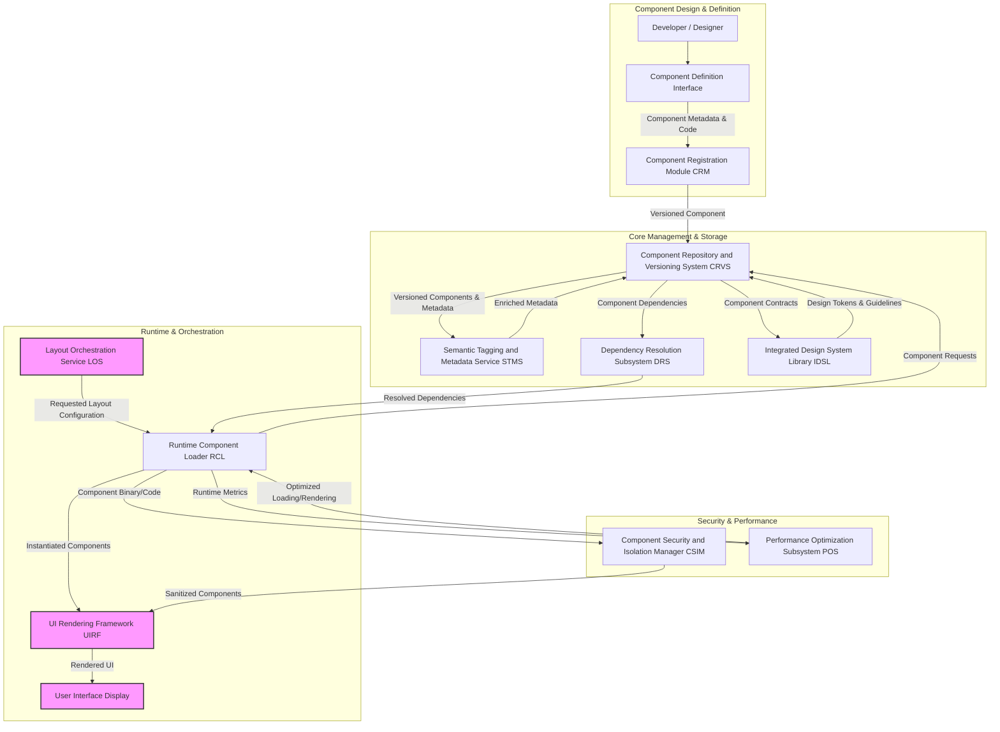
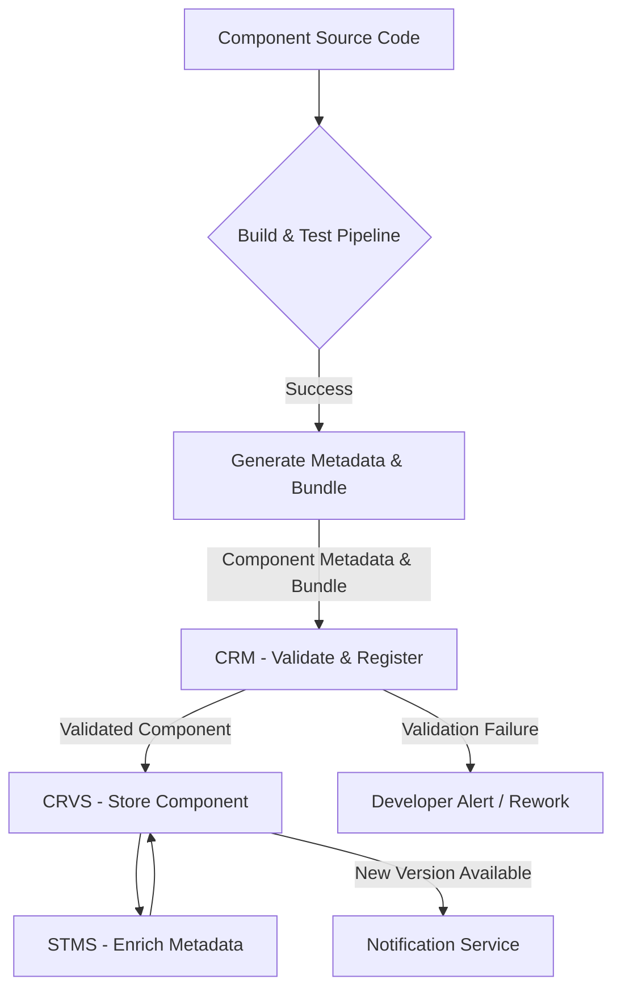
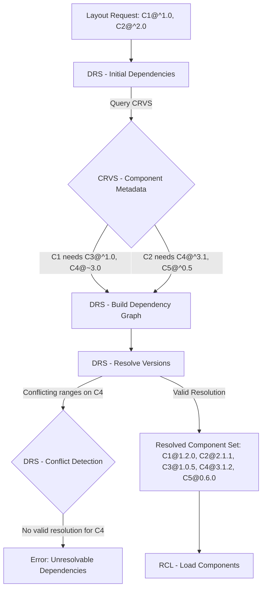
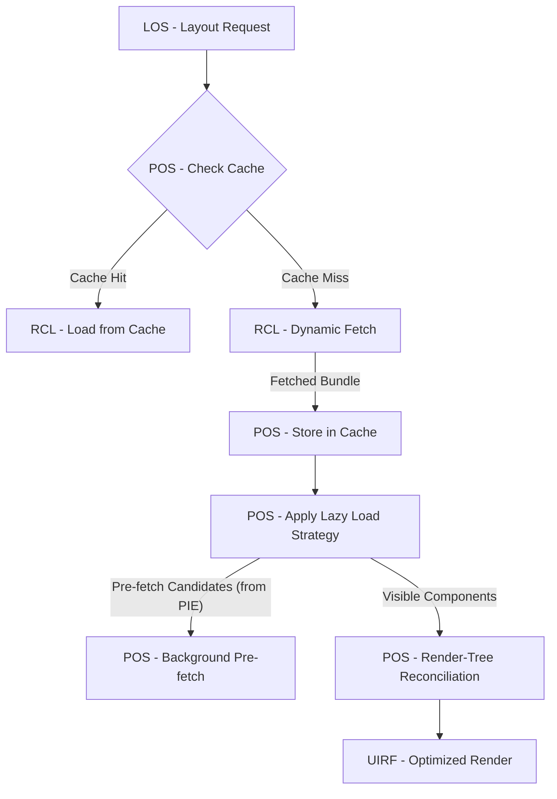
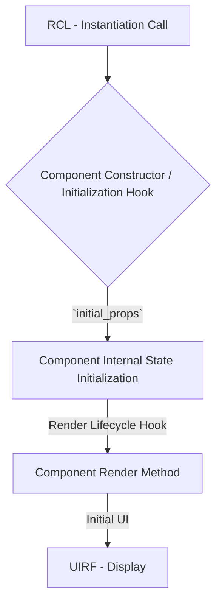
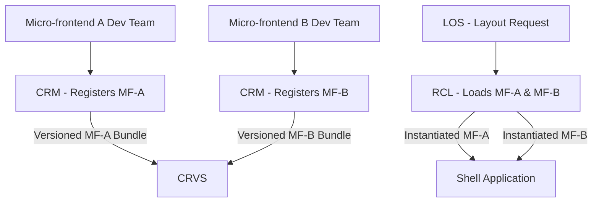

**Title of Invention:** Integrated Framework for Dynamic Management, Versioning, and Secure Rendering of User Interface Components in Adaptive Systems

**Abstract:**
A novel and comprehensive framework for the robust management, rigorous versioning, and highly performant dynamic rendering of user interface [UI] components is herewith disclosed. This invention establishes a foundational architecture that provides semantically rich, modular, and secure building blocks for sophisticated UI generation, particularly within adaptive and personalized user interface systems. The framework encompasses a centralized component repository, a declarative component metadata schema, a sophisticated versioning and dependency resolution system, and an intelligent runtime component loader. Components are semantically tagged to facilitate their intelligent selection and contextual instantiation by higher-level layout orchestration services. Furthermore, the invention incorporates robust mechanisms for component isolation, security validation, and performance optimization, ensuring that dynamically assembled UIs are not only highly adaptable and personalized but also secure, stable, and responsive. This framework significantly advances the state of the art in modular UI development, enabling unparalleled flexibility and efficiency in delivering bespoke user experiences.

**Background of the Invention:**
The accelerating complexity of modern software applications, coupled with an increasing demand for highly personalized and adaptive user experiences, has exposed inherent limitations in traditional, static UI development paradigms. While component-based architectures have gained traction, existing frameworks often lack the integrated capabilities required for dynamic component discovery, version-aware loading, and secure, on-the-fly instantiation, especially in systems that must adapt their entire layout based on inferred user personas or real-time context. Developers are frequently burdened with manual dependency management, inconsistent component contracts, and fragmented approaches to ensuring runtime security and performance. The challenge intensifies when attempting to integrate these components into intelligent systems that autonomously select, arrange, and configure them. Without a unified framework that provides version-controlled, semantically rich, and securely renderable UI components, the vision of truly adaptive and personalized interfaces remains hampered by infrastructural bottlenecks, increased development overhead, and significant technical debt. The absence of such an integrated, intelligent component framework represents a critical impediment to achieving highly responsive, robust, and user-centric adaptive UI systems.

**Brief Summary of the Invention:**
The present invention unveils an innovative, end-to-end framework specifically engineered for the dynamic lifecycle management of UI components, from their initial definition to their final runtime instantiation. At its core, a centralized Component Repository and Versioning System [CRVS] meticulously stores all UI components, each accompanied by a formal metadata schema delineating its properties, events, dependencies, and semantic tags. This [CRVS] implements rigorous semantic versioning, ensuring backward compatibility and enabling controlled updates. Upon request from an Adaptive UI Orchestration Engine [AUIOE] or similar intelligent layout service, a Runtime Component Loader [RCL] dynamically retrieves and instantiates the necessary components. This [RCL] is augmented by a Dependency Resolution Subsystem [DRS] that automatically resolves and loads all required component dependencies, ensuring a coherent and functional UI composition. To safeguard against vulnerabilities inherent in dynamic loading, a Component Security and Isolation Manager [CSIM] sandboxes components, validating their integrity and enforcing strict permission boundaries. Performance is meticulously optimized through techniques such as lazy loading, intelligent caching, and render-tree reconciliation. Furthermore, each component is enriched with semantic tags that describe its functional purpose e.g. "data-visualization", "input-control", "collaboration-tool", allowing adaptive layout services to intelligently select and configure components based on inferred user persona and contextual requirements. This integrated framework thereby serves as the indispensable backbone for building truly dynamic, personalized, secure, and performant user interfaces, significantly reducing development complexity and elevating the responsiveness of adaptive applications.

**Detailed Description of the Invention:**

The invention articulates a sophisticated architectural paradigm for managing the complete lifecycle of user interface components, from design to dynamic runtime assembly. This framework is purpose-built to underpin highly adaptive UI systems, ensuring that personalized layouts are constructed from robust, secure, and performant building blocks.

### I. System Architecture of the Dynamic UI Component Framework

The comprehensive system, herein referred to as the Dynamic Component Orchestration Framework [DCOF], integrates several modules to enable the intelligent management and dynamic rendering of UI components.


*Note: The `Layout Orchestration Service LOS`, `UI Rendering Framework UIRF`, and `User Interface Display` are external modules from an Adaptive UI Orchestration Engine, interacting with this framework.*

#### A. Component Definition and Registration Module [CRM]
The [CRM] serves as the primary gateway for defining, documenting, and registering new UI components or updates to existing ones within the [DCOF].

*   **Component Metadata Schema:** Each component adheres to a strict, extensible metadata schema. This schema includes:
    *   `component_ID`: A globally unique identifier for the component.
    *   `version`: Semantic version string e.g. `1.2.3`.
    *   `description`: Human-readable summary of the component's purpose and functionality.
    *   `props_schema`: JSON Schema defining configurable properties, their data types, default values, and validation rules.
    *   `events_schema`: Description of events emitted by the component and their payload structures.
    *   `dependencies`: A list of other `component_ID`s and their required `version` ranges.
    *   `semantic_tags`: Categorical labels e.g. `data-input`, `navigation`, `chart`, `form-control` for intelligent discovery.
    *   `accessibility_attributes`: WCAG compliance details, ARIA roles, etc.
    *   `author`, `license`, `documentation_link`.

*   **Registration Workflow:** Integrates with Continuous Integration/Continuous Deployment [CI/CD] pipelines to automate validation and registration of components upon successful build and testing. Ensures adherence to coding standards and contract specifications.
*   **Declarative Definition:** Supports declarative component definitions e.g. via configuration files or domain-specific languages [DSLs] that abstract away implementation details, making components easier to create, manage, and understand.


*Figure 2: Component Registration Workflow within the DCOF.* This workflow ensures that all components entering the [CRVS] are thoroughly vetted, meet predefined schema requirements, and are semantically tagged for future discoverability. Automated validation steps are critical for maintaining the integrity and reliability of the component ecosystem.

#### B. Component Repository and Versioning System [CRVS]
The [CRVS] is the central, immutable store for all UI component definitions, their compiled code, and associated metadata. It is the authoritative source for component availability and compatibility.

*   **Content-Addressable Storage:** Stores component bundles or references to external package registries using content-addressable identifiers e.g. cryptographic hashes, ensuring immutability and verifiable integrity.
*   **Semantic Versioning Enforcement:** Rigorously enforces semantic versioning principles (`MAJOR.MINOR.PATCH`) to manage component evolution.
    *   `MAJOR` increments for breaking API changes.
    *   `MINOR` increments for new features with backward compatibility.
    *   `PATCH` increments for backward-compatible bug fixes.
*   **Version History and Rollback:** Maintains a complete history of all component versions, enabling precise rollbacks to previous stable states and facilitating A/B testing of component updates.
*   **Registry Interface:** Provides a queryable API to discover components by `component_ID`, `semantic_tags`, or `version` constraints.

#### C. Dependency Resolution Subsystem [DRS]
The [DRS] is responsible for analyzing component dependencies and providing a compatible set of component versions required for a given UI layout.

*   **Dependency Graph Construction:** Dynamically builds a directed acyclic graph [DAG] of component dependencies based on the `dependencies` attribute in component metadata.
*   **Constraint Solving:** Employs algorithms to resolve version conflicts, selecting the highest compatible version of each shared dependency. This ensures that only one instance of a shared component is loaded, preventing bloat and potential runtime conflicts.
*   **Transitive Dependency Management:** Automatically identifies and resolves all transitive dependencies, ensuring that a complete and consistent set of components is available for rendering.
*   **Conflict Detection:** Identifies unresolvable dependency conflicts and provides actionable feedback, preventing broken UI compositions.


*Figure 3: Dependency Resolution Flow.* This chart illustrates the iterative process by which the [DRS] constructs a dependency graph, queries the [CRVS] for available versions, resolves version constraints to find a compatible set, and handles potential conflicts, ultimately ensuring a stable and consistent set of components for runtime loading.

#### D. Semantic Tagging and Metadata Service [STMS]
The [STMS] enriches component metadata with structured semantic information, making components discoverable and intelligently selectable by adaptive layout systems.

*   **Tag Taxonomy:** Defines a hierarchical or flat taxonomy of semantic tags e.g. `data-visualization/chart/bar`, `input/form-field/text`.
*   **Automated Tagging:** Can leverage Natural Language Processing [NLP] on component descriptions or code analysis to suggest or automatically apply semantic tags.
*   **Query Interface:** Exposes a powerful query interface for the `Layout Orchestration Service LOS` to find components that match specific functional, thematic, or behavioral criteria e.g. "find all components tagged `data-visualization` that support `real-time-updates`".
*   **Persona-Driven Tagging:** Can dynamically augment component tags based on observed user interaction patterns within different personas, further refining component selection relevance.

```mermaid
graph LR
    subgraph Tagging Process
        A[Component Metadata (Description)] --> B(NLP/Code Analysis);
        B -- Suggested Tags --> C{Human Review / Override};
        C --> D[STMS - Store Tags];
        D -- Enriched Metadata --> CRVS;
    end

    subgraph Component Discovery
        E[LOS - Persona Profile (Needs)] --> F[STMS - Query Interface];
        F -- Query: "data-viz" AND "real-time" --> G{STMS - Tag Index};
        G -- Matching Components --> H[STMS - Ranked Component List];
        H --> E;
    end
```
*Figure 4: Semantic Tagging and Discovery Process.* This diagram shows how components are semantically enriched, combining automated analysis with human curation, and how the [LOS] leverages this rich metadata to perform intelligent queries for component selection based on user persona requirements.

#### E. Integrated Design System Library [IDSL]
The [IDSL] ensures visual consistency and brand adherence across all components by managing design tokens, styling guidelines, and a shared visual language.

*   **Design Tokens:** A single source of truth for visual attributes e.g. colors, typography, spacing, border-radii, managed as abstract variables. Components consume these tokens.
*   **Theming Engine Integration:** Enables seamless theme switching e.g. `light`, `dark`, `high-contrast` by mapping design tokens to different value sets.
*   **Component Contract Adherence:** Components within the [CRVS] are validated against the [IDSL]'s guidelines to ensure they meet aesthetic and functional standards.

```mermaid
graph TD
    A[Design System Source (Figma, Sketch)] --> B[Design Token Extractor];
    B -- JSON / YAML Tokens --> C[IDSL - Token Registry];
    C -- Theme A Values --> C_A[Theme A Profile];
    C -- Theme B Values --> C_B[Theme B Profile];
    C_A --> D[CSS Variable Generator A];
    C_B --> D[CSS Variable Generator B];
    D --> E[Component Bundles (CSS/JS)];
    E --> CRVS;
    F[Component Code] --> G[IDSL - Linting & Validation];
    G -- Adherence Report --> CRM;
```
*Figure 5: Design Token Management and Theming Integration.* This chart details how design tokens are extracted from design tools, registered in the [IDSL], transformed into theme-specific variables (e.g., CSS custom properties), and then consumed by components, ensuring visual consistency and dynamic theming capabilities.

#### F. Runtime Component Loader [RCL]
The [RCL] is the client-side module responsible for fetching, validating, and preparing components for rendering during application runtime.

*   **Dynamic Loading:** Asynchronously loads component bundles e.g. JavaScript, CSS, WASM modules from the [CRVS] or a Content Delivery Network [CDN] as needed, minimizing initial page load times.
*   **Integrity Verification:** Utilizes cryptographic hashes from component metadata to verify the integrity of loaded component bundles, detecting tampering or corruption.
*   **Bundle Management:** Optimizes network requests by batching component loads and leveraging HTTP/2 push where available.
*   **Hot Module Replacement HMR:** Supports replacing component modules at runtime without a full page reload, beneficial for developer experience and advanced adaptive scenarios.

```mermaid
graph TD
    A[LOS Request for Layout] --> B[RCL - Receive Component List];
    B -- Resolved IDs & Versions --> C{CRVS / CDN - Fetch Bundles};
    C -- Raw Component Bundles --> D[RCL - Integrity Verification];
    D -- Hash Mismatch --> E[Error: Tampered Component];
    D -- Hash Match --> F[RCL - Sandbox Preparation (CSIM)];
    F -- Sanitized Code --> G[RCL - Instantiate Component];
    G -- Ready Components --> H[UIRF - Render];
```
*Figure 6: Runtime Component Loading and Verification Flow.* This diagram illustrates the critical steps undertaken by the [RCL] to fetch component bundles, perform cryptographic integrity checks to ensure security, prepare components within isolated environments, and ultimately instantiate them for rendering.

#### G. Component Security and Isolation Manager [CSIM]
The [CSIM] provides critical runtime security measures to mitigate risks associated with dynamic component loading.

*   **Sandboxing:** Instantiates components within isolated environments e.g. Web Workers, iframes, or custom JavaScript sandboxes, preventing malicious or buggy components from affecting the entire application.
*   **Permission Scoping:** Enforces fine-grained permissions for each component, limiting its access to global scope, DOM manipulation, or sensitive APIs.
*   **Code Scanning and Auditing:** Integrates with static and dynamic code analysis tools during component registration to detect vulnerabilities before deployment.
*   **Supply Chain Security:** Verifies the authenticity and provenance of component bundles, guarding against supply chain attacks.

```mermaid
graph TD
    A[Component Bundle from RCL] --> B{CSIM - Code Analysis / Policy Check};
    B -- Valid & Safe --> C[CSIM - Create Sandbox Environment];
    C -- Web Worker / Iframe / JS Realm --> D[Component Instance (Isolated)];
    D -- Restricted API Access --> E[Host Application (Protected)];
    B -- Policy Violation --> F[CSIM - Block Component Loading / Error];
```
*Figure 7: Component Security and Isolation Mechanism.* This chart demonstrates how the [CSIM] intercepts component bundles, performs security checks, creates a secure sandboxed environment for execution, and restricts the component's access to host resources, thereby safeguarding the integrity of the overall application.

#### H. Performance Optimization Subsystem [POS]
The [POS] implements various strategies to ensure that dynamically rendered UIs are highly performant and responsive.

*   **Lazy Loading:** Components are only loaded when they are needed for display e.g. when scrolled into view, activated by a user, or specifically requested by the `Layout Orchestration Service LOS`.
*   **Component Caching:** Caches loaded components and their resolved dependencies locally on the client-side to minimize redundant network requests and improve subsequent load times.
*   **Pre-fetching and Pre-rendering:** Based on predictive analytics (potentially from the `Persona Inference Engine PIE` in an `AUIOE`), components for anticipated future layouts can be pre-fetched or even pre-rendered in the background.
*   **Render-Tree Reconciliation:** Optimizes DOM updates by only re-rendering parts of the UI that have changed, minimizing browser reflows and repaints.


*Figure 8: Performance Optimization Pipeline.* This diagram illustrates the interplay of caching, lazy loading, pre-fetching, and render-tree reconciliation orchestrated by the [POS] to ensure optimal loading and rendering performance for dynamic UI compositions.

### II. Component Lifecycle and Interaction

The [DCOF] defines a clear lifecycle for components, from instantiation to destruction, facilitating predictable behavior and effective management.

#### A. Instantiation and Property Binding
*   When the [RCL] instantiates a component, it passes the initial set of properties `initial_state_props` as defined in the layout configuration.
*   The component consumes these properties and initializes its internal state and visual presentation accordingly. This ensures components are immediately rendered with relevant data and settings.


*Figure 9: Component Instantiation and Property Binding Lifecycle.* This chart details the sequence of operations from the [RCL]'s instantiation request to the component's internal state initialization and initial render, driven by the `initial_props`.

#### B. Event Handling and Communication
*   Components are designed to emit events in response to user interactions or internal state changes.
*   The `UI Rendering Framework UIRF` or parent components can subscribe to these events, allowing for complex inter-component communication and integration with application logic.
*   A centralized event bus can facilitate decoupled communication between distant components.

#### C. State Management
*   Components can manage their own internal state, adhering to a reactive programming model where changes automatically trigger re-rendering.
*   For global or shared state, components can integrate with established state management patterns e.g. Redux, Zustand, Vuex, allowing for consistent data flow across the entire UI.

### III. Integration with Adaptive UI Systems

The [DCOF] is designed to be an integral part of an `Adaptive UI Orchestration Engine AUIOE`, as described in related inventions, enabling truly personalized user experiences.

#### A. Persona-Driven Component Selection
*   The `Layout Orchestration Service LOS` queries the `Semantic Tagging and Metadata Service STMS` to find components that best align with an inferred user persona's preferences and task requirements.
*   Semantic tags allow the [LOS] to filter for components that e.g. prioritize data density for an `ANALYTICAL_INTROVERT` or communication features for a `CREATIVE_EXTRAVERT`.

#### B. Contextual Component Configuration
*   The `Layout Orchestration Service LOS` provides `initial_state_props` to components based on real-time context e.g. device type, active project, time of day.
*   Components are designed to gracefully adapt their appearance or behavior based on these context-aware properties.

#### C. Continuous Feedback Loop
*   User interaction data captured by the `User Interaction Telemetry UIT` (part of an `AUIOE`) can be used to refine semantic tags, validate component effectiveness, and feed into the `Performance Optimization Subsystem POS` to further enhance component delivery and rendering.

### IV. Advanced Component Architectures

The framework is extensible to support cutting-edge component architectures and rendering strategies.

#### A. Micro-Frontend Integration
*   Individual components or small groups of related components can be deployed as independent micro-frontends, managed by the [CRVS] and loaded by the [RCL]. This allows for independent development, deployment, and scaling of UI features.


*Figure 10: Micro-Frontend Integration Architecture.* This chart shows how the [DCOF] facilitates the integration of micro-frontends as specialized components, allowing independent development and deployment while leveraging the framework's core services for management and runtime loading.

#### B. Server-Side Rendering SSR and Hydration
*   The framework can support server-side rendering of initial UI layouts using components from the [CRVS], improving perceived performance and SEO.
*   Client-side hydration then reuses the server-rendered HTML, attaching event handlers and dynamic behavior.

#### C. Web Components and Native Integration
*   Components can be implemented using standard Web Components technologies, promoting interoperability and long-term stability.
*   The framework supports packaging native mobile UI components e.g. Android Views, iOS UIViews alongside web components, enabling a unified component management strategy across platforms.

### V. Security, Privacy, and Ethical AI Considerations

The dynamic nature of the [DCOF] mandates robust security, privacy, and ethical considerations throughout its design and operation.

#### A. Secure Supply Chain
*   The [CRVS] and [CRM] enforce strict controls over component submission, ensuring only authorized and verified code enters the system.
*   Digital signatures and cryptographic hashing are used to verify component authenticity from origin to runtime.

#### B. Runtime Security Enforcement
*   The [CSIM]'s sandboxing and permission scoping prevent unauthorized data access, cross-site scripting [XSS] attacks, and other common vulnerabilities arising from dynamically loaded code.
*   Regular security audits of component code and dependencies are performed.

#### C. Data Privacy within Components
*   Components are designed following data minimization principles, only requesting and displaying data strictly necessary for their function.
*   Any sensitive data passed to or processed by components adheres to privacy policies and data protection regulations e.g. GDPR, CCPA.

#### D. Bias and Fairness in Component Selection
*   Semantic tags and component metadata are reviewed for potential biases that could lead to unfair or discriminatory component selection based on inferred persona attributes.
*   Audit trails of component selection and usage are maintained to monitor and mitigate unintended biases in adaptive UI construction.

This sophisticated framework provides the necessary infrastructure for building the next generation of highly adaptive, secure, and user-centric digital experiences.

---

**Claims:**

1.  A comprehensive system for dynamic management, versioning, and secure rendering of user interface [UI] components, comprising:
    a.  A **Component Definition and Registration Module [CRM]** configured to validate and register UI components, each with a globally unique identifier, a semantic version, a formal metadata schema defining configurable properties, events, and associated semantic tags, and a list of direct dependencies;
    b.  A **Component Repository and Versioning System [CRVS]** configured to immutably store and version-control all UI components and their associated metadata, rigorously enforcing semantic versioning principles and maintaining a complete historical record;
    c.  A **Dependency Resolution Subsystem [DRS]** configured to dynamically construct a directed acyclic graph of component dependencies, resolve version conflicts to identify the highest compatible versions for a consistent component set, and detect unresolvable dependency conflicts;
    d.  A **Semantic Tagging and Metadata Service [STMS]** configured to enrich component metadata with structured semantic tags from a defined taxonomy, enabling intelligent discovery and selection based on functional, thematic, or behavioral criteria;
    e.  A **Runtime Component Loader [RCL]** configured to dynamically and asynchronously retrieve specified UI component bundles and their resolved dependencies, perform cryptographic integrity verification, and prepare said components for secure instantiation;
    f.  A **Component Security and Isolation Manager [CSIM]** configured to establish and enforce sandboxed runtime environments for dynamically loaded components, implement fine-grained permission scoping, and conduct code analysis to mitigate security risks such as unauthorized data access or malicious execution;
    g.  A **Performance Optimization Subsystem [POS]** configured to apply advanced performance enhancement techniques including lazy loading of components, intelligent client-side caching, predictive pre-fetching, and efficient render-tree reconciliation to ensure a responsive user experience; and
    h.  An **Integrated Design System Library [IDSL]** configured to centralize and manage design tokens and stylistic guidelines, ensuring visual consistency and brand adherence across all managed UI components.

2.  The system of claim 1, wherein the metadata schema further includes definitions for accessibility attributes, a human-readable description, author information, license details, and documentation links, enabling comprehensive component understanding and compliance.

3.  The system of claim 1, wherein the [CRVS] employs content-addressable storage for component bundles, utilizing cryptographic hashes to guarantee immutability and verifiable authenticity, and provides a programmatic API for querying components by unique identifier, version constraints, or semantic tags.

4.  The system of claim 1, wherein the [DRS] is equipped with algorithms to identify and report circular dependencies or situations where no globally consistent set of component versions can be found, preventing the loading of a broken UI composition.

5.  The system of claim 1, wherein the [STMS] integrates with Natural Language Processing [NLP] and code analysis tools to automate or suggest semantic tags for components, and further enables persona-driven tag augmentation based on observed user interaction patterns.

6.  The system of claim 1, wherein the [RCL] supports Hot Module Replacement [HMR] for development and advanced adaptive scenarios, allowing component modules to be replaced at runtime without a full page reload, and optimizes network requests through batching and HTTP/2 push mechanisms.

7.  The system of claim 1, wherein the [CSIM] provides multiple isolation strategies including Web Workers for computational sandboxing, iframes for DOM and network isolation, and custom JavaScript realms, each with configurable permission policies to restrict access to global scope, DOM manipulation, and sensitive browser APIs.

8.  The system of claim 1, wherein the [POS] dynamically adjusts caching strategies based on component usage frequency, implements pre-fetching heuristics informed by predictive analytics from an Adaptive UI Orchestration Engine [AUIOE], and optimizes DOM updates by employing virtual DOM techniques to minimize reflows and repaints.

9.  The system of claim 1, wherein the system is seamlessly integrated as a core module within an Adaptive UI Orchestration Engine [AUIOE], where a Layout Orchestration Service [LOS] utilizes the [STMS] for persona-driven component selection and provides context-aware initial properties to dynamically configured components, thereby enabling truly personalized user experiences.

10. A method for building and managing adaptive user interfaces, comprising:
    a.  **Component Registration:** Defining and submitting UI components with a structured metadata schema, including semantic version, properties, events, dependencies, and semantic tags, through a [CRM] that performs automated validation and integrates with CI/CD pipelines;
    b.  **Version-Controlled Storage:** Storing component definitions and their code bundles in a [CRVS] that enforces semantic versioning, ensures immutability via content-addressable storage, and maintains a full history of all component versions;
    c.  **Intelligent Component Selection:** Receiving a UI layout request from an adaptive system, which queries an [STMS] using persona-driven criteria and contextual requirements to identify a relevant set of components based on their semantic tags;
    d.  **Dependency Resolution:** Analyzing the dependencies of the selected components and, using a [DRS], computing a globally consistent set of compatible component versions, identifying and reporting any unresolvable conflicts;
    e.  **Secure Dynamic Loading:** Employing an [RCL] to asynchronously retrieve the resolved component bundles, verifying their cryptographic integrity, and passing them to a [CSIM] for instantiation within isolated runtime environments with enforced granular permissions;
    f.  **Performance Optimization:** Applying a [POS] to optimize component delivery and rendering through strategies such as lazy loading, client-side caching, predictive pre-fetching, and efficient render-tree reconciliation;
    g.  **Contextual Instantiation:** Instantiating the components with initial properties provided by the adaptive system, allowing them to adapt their appearance and behavior based on real-time context and user persona; and
    h.  **Ethical Oversight:** Continuously monitoring component selection and usage patterns for potential biases, ensuring data privacy adherence, and validating component security throughout their lifecycle to maintain an ethical, private, and secure adaptive UI ecosystem.

---

**Mathematical Justification:**

The efficacy of the Dynamic Component Orchestration Framework [DCOF] is substantiated by a rigorous mathematical foundation that addresses component definition, versioning logic, dependency resolution, security, and performance guarantees. This framework transforms discrete UI modules into a robust, intelligently managed ecosystem.

### I. Formal Component Definition and Metadata Structure

Let `C` be the universal set of all potential UI components. A single UI component `c_i` in `C` is formally defined by its structural and behavioral contract.

**Definition 1.1: Component Tuple.**
A component `c_i` is represented as a tuple:
(1) `c_i = (id_i, v_i, M_i, D_i, S_i, P_i, E_i, Ac_i, L_i, Doc_i)`
where:
*   `id_i ∈ ID`: A unique identifier from a set `ID`, such that `∀ c_j, c_k ∈ C, j ≠ k ⇒ id_j ≠ id_k`.
*   `v_i ∈ V`: A semantic version string `(Major.Minor.Patch)` from `V = { (Maj, Min, Pat) | Maj, Min, Pat ∈ N_0 }`.
*   `M_i`: Component metadata, a set of key-value pairs `{(key, value)}`. This includes `description_i ∈ L_desc`, where `L_desc` is the language of natural descriptions.
*   `D_i`: Direct dependencies, a set of pairs `{(id_j, R_j)}` for other components `c_j` required by `c_i`, where `R_j` is a version range.
*   `S_i ∈ P(TagSet)`: Semantic tags, a subset of a predefined taxonomy `TagSet = {tag_1, ..., tag_k}`.
*   `P_i`: Configurable properties (input), formally a mapping `Props_i: PropKey_i → PropType_i`.
*   `E_i`: Emitted events (output), formally a mapping `Events_i: EventName_i → EventPayloadSchema_i`.
*   `Ac_i ∈ P(ACC_ATTR)`: Accessibility attributes.
*   `L_i ∈ Licenses`: License information.
*   `Doc_i ∈ URL_Set`: Documentation link.

**Definition 1.2: Property Schema Validation.**
Let `props_schema_i` be a formal grammar `G_i = (V_i, T_i, P_i, S_i_start)` (e.g., JSON Schema) describing the valid properties for `c_i`. An input property set `p` for `c_i` is valid if:
(2) `validate(p, props_schema_i) = TRUE`
This `validate` function checks types, ranges, and required fields. The overall type safety `TS(c_i)` is 1 if all `p` conform, 0 otherwise.

**Definition 1.3: Event Schema Validation.**
Similarly, `events_schema_i` defines valid event structures. An emitted event `e` is valid if:
(3) `validate_event(e, events_schema_i) = TRUE`
The framework ensures `TS(c_i) = 1` for all `c_i` during registration and runtime, minimizing unexpected behavior.

**Definition 1.4: Component State.**
The internal state of a component `c_i` at time `t` is `State_i(t)`. This state changes based on input properties `P_i(t)`, user interactions `U_i(t)`, and internal logic `F_i`:
(4) `State_i(t+1) = F_i(State_i(t), P_i(t), U_i(t))`
A reactive model ensures `Render_i(t+1) = G_i(State_i(t+1))` where `G_i` is the rendering function.

### II. Versioning and Dependency Resolution Formalism

The [CRVS] and [DRS] underpin the stability and evolvability of the component ecosystem.

**Definition 2.1: Semantic Versioning and Ordering.**
A semantic version `v = (Maj.Min.Pat)` has an inherent order.
(5) `v_1 < v_2` if `Maj_1 < Maj_2` OR (`Maj_1 = Maj_2` AND `Min_1 < Min_2`) OR (`Maj_1 = Maj_2` AND `Min_1 = Min_2` AND `Pat_1 < Pat_2`).
Compatibility `v_1 ~ v_2` implies:
(6) `v_1 ~ v_2 ⟺ Maj_1 = Maj_2` (for `^` operator, i.e., `v_2` is compatible with `v_1` if `v_2 >= v_1` and `v_2 < (Maj_1+1).0.0`).
(7) `v_1 ≈ v_2 ⟺ Maj_1 = Maj_2` AND `Min_1 = Min_2` (for `~` operator, i.e., `v_2` is compatible with `v_1` if `v_2 >= v_1` and `v_2 < Maj_1.(Min_1+1).0`).

**Definition 2.2: Version Range Formalism.**
A version range `R` is a set of versions `v` that satisfy certain conditions. Examples:
(8) `R = [v_min, v_max)` (inclusive min, exclusive max).
(9) `R_caret(^X.Y.Z) = { v | v ≥ X.Y.Z AND v < (X+1).0.0 }`.
(10) `R_tilde(~X.Y.Z) = { v | v ≥ X.Y.Z AND v < X.(Y+1).0 }`.
The [CRVS] stores `V_avail(id_k) = {v_j | c_k@v_j exists in CRVS}`.

**Definition 2.3: Dependency Graph.**
Let `G = (N, L)` be a directed graph where `N` is the set of component IDs `id_k` (requested or transitive), and `L` is the set of directed edges `(id_a, id_b)` if `c_a` depends on `c_b`. Each edge `(id_a, id_b)` is associated with a version range `R_{a,b}`.
The full dependency graph `G_full = (N_full, L_full)` is dynamically constructed.

**Theorem 2.1: Resolvability of Component Set.**
Given a set of requested components `C_req = { (id_1, R_1), ..., (id_m, R_m) }`, the [DRS] seeks to find a globally consistent set of component versions `V_resolved = { (id_k, v_k*) | id_k ∈ N_full }` such that:
(11) `∀ (id_k, v_k*) ∈ V_resolved: v_k* ∈ V_avail(id_k)`.
(12) `∀ (id_a, R_a) ∈ C_req: v_a* ∈ R_a`.
(13) `∀ (id_a, id_b)` in `G_full` with `R_{a,b}: v_b* ∈ R_{a,b}`.
(14) `v_k*` is the maximum compatible version satisfying (11)-(13).
This is a Constraint Satisfaction Problem (CSP). Let `X_k` be the variable for component `id_k`'s version, and `D_k = V_avail(id_k)` be its domain. Constraints are `v_k ∈ R_j` for all dependencies. A solution exists if and only if there's an assignment `(v_1*, ..., v_n*)` that satisfies all constraints.

**Proof of Conflict Detection (Formalization):**
A conflict exists if the intersection of all applicable version ranges for any `id_k` is empty:
(15) `R_k_eff = R_k_req ∩ (∩_{(id_j, id_k) ∈ L_full} R_{j,k})`
(16) If `R_k_eff ∩ V_avail(id_k) = ∅` for any `id_k`, then a conflict occurs.
The resolution process involves a topological sort of `G_full` (if acyclic) or a backtracking algorithm. For `N` components and `E` dependencies, complexity can range from `O(N+E)` for simple cases to `O(prod(|V_avail(id_k)|))` in worst-case backtracking.
(17) `TimeComplexity(DRS) = O(N_full * log(V_max_range) + E_full)` for optimized algorithms using version tree pruning.

### III. Semantic Tagging and Intelligent Component Selection

The [STMS] provides metadata crucial for adaptive UI systems.

**Definition 3.1: Semantic Profile Vector.**
Let `TagSet = {tag_1, ..., tag_K}` be the set of all semantic tags. The semantic profile of component `c_i` is a vector `Sem(c_i) ∈ {0,1}^K` or `R^K`, where `Sem(c_i)_j = 1` if `c_i` has `tag_j`, else `0`, or a real value indicating relevance.
(18) `Sem(c_i) = [w_{i1}, w_{i2}, ..., w_{iK}]` where `w_{ij} ∈ [0, 1]`.

**Definition 3.2: Persona Requirements Profile.**
Similarly, a persona `persona_k` is represented by a vector `P(persona_k) ∈ R^K` indicating the importance of each tag to that persona.
(19) `P(persona_k) = [p_{k1}, p_{k2}, ..., p_{kK}]` where `p_{kj} ∈ [0, 1]`.

**Definition 3.3: Component-Persona Alignment Score.**
The alignment `A(c_i, persona_k)` between a component and a persona can be measured using cosine similarity:
(20) `A(c_i, persona_k) = (Sem(c_i) ⋅ P(persona_k)) / (||Sem(c_i)|| ⋅ ||P(persona_k)||)`
where `⋅` is the dot product and `||.||` is the Euclidean norm. Other metrics like Jaccard index for binary tags:
(21) `J(c_i, persona_k) = |S_i ∩ S_{persona_k}| / |S_i ∪ S_{persona_k}|`.

**Theorem 3.1: Persona-Driven Component Utility Maximization.**
The `Layout Orchestration Service LOS` selects a set of components `C_layout` for `persona_k` that maximizes a utility function `U`:
(22) `U(C_layout | persona_k) = Σ_{c_i ∈ C_layout} (A(c_i, persona_k) ⋅ θ_i) - λ ⋅ Σ_{c_i, c_j ∈ C_layout, i≠j} Redundancy(c_i, c_j) - μ ⋅ Complexity(C_layout)`
where:
*   `θ_i`: Intrinsic utility or weight of `c_i`.
*   `Redundancy(c_i, c_j)`: A measure of functional overlap between components.
*   `Complexity(C_layout)`: A scalar value representing layout complexity (e.g., number of components, depth of nesting).
*   `λ, μ`: Regularization coefficients.
This is a combinatorial optimization problem. For `N` components, `2^N` possible layouts exist. The `STMS` enables efficient filtering, reducing `N` to `N_filtered`, so that:
(23) `N_filtered << N`
(24) `TimeComplexity(Selection) = O(N_filtered ⋅ K + N_filtered^2)` for a greedy approach with pairwise redundancy checks.

**Definition 3.4: Automated Tagging Efficacy.**
Let `GT_i` be the ground truth tags for `c_i`, and `AT_i` be the automatically generated tags. Precision `P_auto` and Recall `R_auto` are:
(25) `P_auto = |AT_i ∩ GT_i| / |AT_i|`
(26) `R_auto = |AT_i ∩ GT_i| / |GT_i|`
(27) `F1_auto = 2 ⋅ (P_auto ⋅ R_auto) / (P_auto + R_auto)`
The [STMS] aims to maximize `F1_auto`.

### IV. Security and Performance Guarantees

The [CSIM] and [POS] ensure the operational integrity and efficiency of the framework.

**Definition 4.1: Component Isolation Metric.**
Let `ASI(c_i)` be the Attack Surface of component `c_i`. When `c_i` is executed within an isolated sandbox `S_i`, its access to system resources `SysRes` is restricted by a permission set `Perm_i`.
(28) `Access(c_i, SysRes) = SysRes ∩ Perm_i`
The effective attack surface of the system `ASI_eff(System)` with `N` isolated components `c_1, ..., c_N` is not the sum, but rather the maximum vulnerability contained:
(29) `ASI_eff(System) = max_{i=1}^N ASI(c_i | S_i)`
(30) `ASI(c_i | S_i) < ASI(c_i | no_S_i)`
This means `CSIM` dramatically reduces the blast radius of a compromised component.

**Definition 4.2: Access Control Matrix.**
Permissions can be modeled using an Access Control Matrix `ACM[subject, object] = {read, write, execute, deny, ...}`.
(31) `ACM[c_i, GlobalObject] = deny` for critical global objects.
(32) `ACM[c_i, DomNode_j] = {read}` for specific DOM nodes.

**Definition 4.3: Component Loading Latency.**
Let `L_load(c_i)` be the time to load component `c_i` (network + parse + compile).
Let `R_render(c_i)` be the time to render `c_i`.
The initial page load time `T_initial` for `C_initial` visible components:
(33) `T_initial = Σ_{c_i ∈ C_initial} (L_load(c_i) + R_render(c_i))`
The total load time `T_total` for all components `C_all`:
(34) `T_total = Σ_{c_i ∈ C_all} (L_load(c_i) + R_render(c_i))`

**Theorem 4.1: Perceived Performance Enhancement via Optimization.**
The [POS] minimizes `T_initial` and perceived `T_total`:
1.  **Lazy Loading:** For `C_initial ⊂ C_all`, `T_initial` is significantly reduced:
    (35) `T_initial_lazy = Σ_{c_i ∈ C_initial} (L_load(c_i) + R_render(c_i))`
    where `L_load(c_j)` for `c_j ∈ C_all \ C_initial` is deferred to `t_j > T_initial_lazy`.
2.  **Caching:** If `c_i` is cached, `L_load_cached(c_i) = L_cache_access << L_network_fetch`.
    (36) `L_load(c_i) = H_cache ⋅ L_cache_access + (1 - H_cache) ⋅ L_network_fetch` where `H_cache` is hit ratio.
3.  **Pre-fetching:** For anticipated components `C_pre_fetch`, `L_load(c_i)` is moved off the critical path, effectively `L_load(c_i) = 0` from user perspective.
    (37) `L_load_prefetched(c_i) = 0` if pre-fetch completes before demand.
    Let `P(c_i, t)` be the probability of `c_i` being needed at time `t`. Pre-fetching optimizes expected latency:
    (38) `E[L_load(c_i)] = P(c_i, t) ⋅ (1 - P_hit_cache) ⋅ L_network_fetch`.
    Pre-fetching reduces `P(c_i, t)` for blocking requests.
4.  **Render-Tree Reconciliation:** DOM updates are optimized. For a change `ΔDOM` of size `s_diff`, where `s_diff << s_total_DOM`:
    (39) `R_render_optimized = O(s_diff)` instead of `O(s_total_DOM)`.
    The frame rate `FPS = 1 / R_frame` is maximized.
    (40) `FPS ≥ Target_FPS` (e.g., 60 FPS) ensures smooth interaction.
    Amdahl's Law for performance speedup `S`:
    (41) `S = 1 / ( (1-P) + P/s )` where `P` is proportion of workload optimized, `s` is speedup of optimized part.

**Definition 4.4: Resource Consumption.**
Let `Res(c_i) = (CPU_i, Mem_i, Net_i)` be resource consumption. `CSIM` limits these resources to prevent resource exhaustion attacks:
(42) `CPU_i ≤ CPU_max`, `Mem_i ≤ Mem_max`, `Net_i ≤ Net_max`.
Queueing theory can model `RCL` performance: An M/M/1 queue for component requests.
(43) `E[W_q] = ρ / (μ(1-ρ))` where `ρ = λ/μ` (utilization), `λ` (arrival rate), `μ` (service rate). [POS] aims to minimize `E[W_q]`.

### V. Ethical AI and Bias Mitigation Formalism

The dynamic nature of the [DCOF] mandates robust security, privacy, and ethical considerations.

**Definition 5.1: Bias in Component Selection.**
Let `A` be a sensitive attribute (e.g., demographic group) and `Y` be the outcome (component selection). Disparate impact (DI) occurs if:
(44) `P(Y=1 | A=a_1) / P(Y=1 | A=a_2) < Threshold` (e.g., 0.8).
The `STMS` audit trails track component selection `S(c_i, persona_k)`:
(45) `S(c_i, persona_k) = 1` if selected, `0` otherwise.
Bias can be quantified by comparing selection probabilities across groups.
(46) `Bias_metric = |P(S=1 | A_1) - P(S=1 | A_2)|`.
The goal is to `min(Bias_metric)`.

**Definition 5.2: Explainability of Selection.**
Let `E(c_i, persona_k)` be the explanation for selecting `c_i` for `persona_k`. This could be a set of salient tags.
(47) `E(c_i, persona_k) = { tag_j | Sem(c_i)_j ⋅ P(persona_k)_j > Threshold_E }`.
The [DCOF] ensures transparency of `A(c_i, persona_k)`.

**Definition 5.3: Data Minimization.**
Let `DataReq(c_i)` be the set of data elements requested by `c_i`. The principle of data minimization states that:
(48) `DataReq(c_i) ⊆ DataNecessary(c_i)`
where `DataNecessary(c_i)` is the minimal set required for `c_i`'s function. The [CRM] verifies this.

**Definition 5.4: Privacy-Preserving Metrics.**
For data flowing into components, differential privacy can be employed.
(49) `P(Response(D_1) ∈ S) ≤ exp(ε) ⋅ P(Response(D_2) ∈ S) + δ`
where `D_1` and `D_2` differ by one individual's data, `ε` is the privacy budget, `δ` is failure probability.

The framework continuously monitors these metrics to adaptively refine its operations and ethical guidelines.

**Q.E.D.**