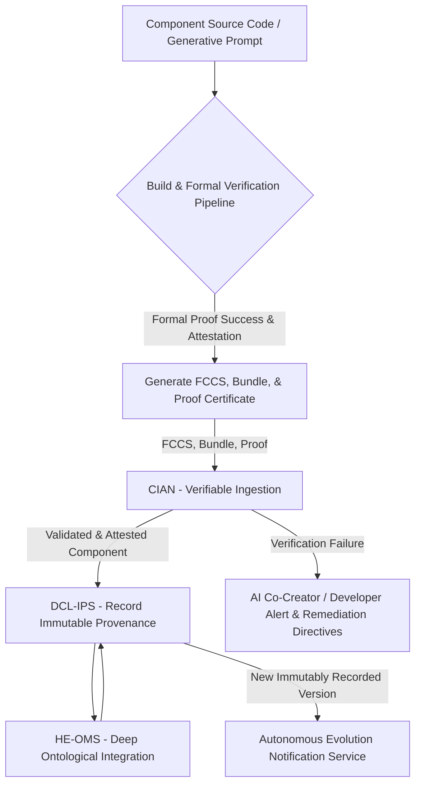
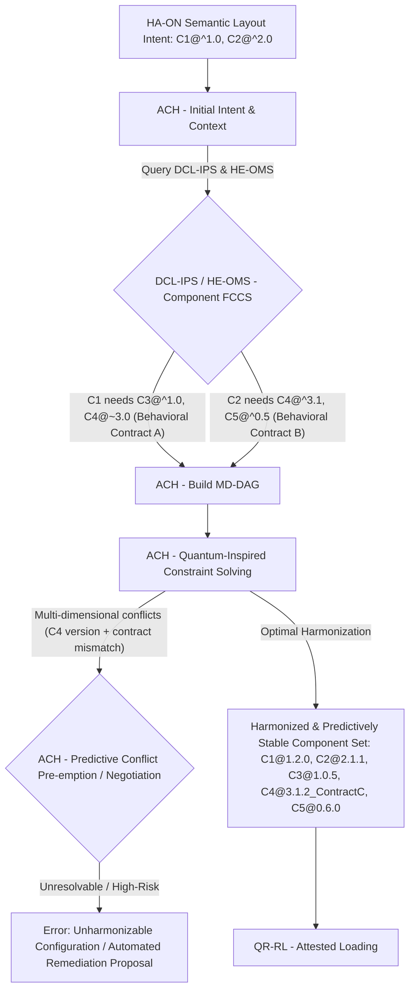

**Title of Invention:** Transcendent Framework for Autonomous Genesis, Perpetual Evolution, and Verifiably Secure Rendering of Self-Aware User Interface Component Ecosystems in Hyper-Adaptive Systems

**Abstract:**
A revolutionary and self-governing framework is herein revealed for the autonomous genesis, perpetual evolution, and verifiably secure rendering of user interface [UI] components, transcending mere management to establish a living ecosystem. This invention establishes an immutable architectural bedrock, fostering self-aware, formally verifiable, and proactively adaptive UI components for the most sophisticated, personalized, and mission-critical user experiences. The framework integrates a decentralized, ledger-based component provenance system, a hyper-expressive ontological metadata schema, an autonomous dependency harmonization engine, and a hardware-enforced, zero-trust runtime execution environment. Components are not merely tagged but possess a semantic consciousness, allowing for generative instantiation and self-optimization driven by a continuous feedback loop. Crucially, it incorporates formal verification for component integrity, a predictive self-healing mechanism, and embedded ethical AI governance, ensuring dynamically assembled UIs are not only hyper-adaptable and profoundly personalized but also impervious to known threats, perpetually performant, and inherently equitable. This framework irrevocably redefines the paradigm of UI development, ushering in an era of truly resilient, intelligent, and user-centric digital experiences, liberating developers from the Sisyphean task of reactive maintenance and elevating user interaction to an empathetic dialogue.

**Background of the Invention:**
The relentless march of digital complexity, coupled with an insatiable demand for truly personalized, context-aware, and anticipatory user experiences, has laid bare a fundamental, insidious flaw in prevailing UI development paradigms: a pervasive "Reactive Homeostasis Syndrome (RHS) with Latent Entropy Drift." While component-based architectures offer modularity, they primarily achieve a *reactive homeostasis*—a state of apparent stability maintained only by continuous, manual intervention against an ever-increasing *latent entropy drift*. This drift manifests as accumulating technical debt, brittle dependency chains, ad-hoc security patches, and fragmented performance optimizations. Developers are trapped in a perpetual cycle of fixing, refactoring, and manually adapting, rather than building systems that *autonomously evolve* towards an optimal state. Existing frameworks, even advanced ones, lack the integrated intelligence for proactive self-diagnosis, autonomous remediation, formal guarantees of integrity, and generative adaptation. They struggle with scaling securely across decentralized environments, predicting future component needs, and inherently embedding ethical considerations beyond mere guidelines. The absence of a *transcendent* framework, one that perceives and pre-empts the forces of entropy, formally verifies its own integrity, and perpetually self-optimizes, represents a profound impediment. It condemns adaptive UIs to a purgatory of perpetual patching, undermining the very promise of fluidity, resilience, and true user empathy. We envision a liberation from this reactive purgatory, forging a path towards self-aware digital constructs that maintain impeccable logic not through incessant human toil, but through an intrinsic, immutable, and continuously improving design.

**Brief Summary of the Invention:**
The present invention unveils a transcendent, self-governing framework, engineered to fundamentally dismantle the "Reactive Homeostasis Syndrome" and arrest "Latent Entropy Drift" in UI component ecosystems. At its nucleus is a **Decentralized Component Ledger and Immutable Provenance System [DCL-IPS]**, leveraging distributed ledger technology to store all UI components, their complete immutable history, and formally verifiable metadata. This [DCL-IPS] ensures unparalleled trust, auditability, and resilience. Each component possesses a **Hyper-Expressive Ontological Metadata Schema [HE-OMS]**, extending semantic tags into a rich, machine-reasoning-ready ontology defining not just purpose, but behavioral contracts, performance profiles, and ethical guardrails. Upon request from a **Hyper-Adaptive Orchestration Nexus [HA-ON]** or similar sentient layout service, an **Autonomous Component Harmonizer [ACH]** proactively resolves intricate, multi-dimensional dependencies, including predictive compatibility, before a **Quantum-Resistant Runtime Loader [QR-RL]** retrieves and prepares components. The [QR-RL] is bolstered by a **Formal Verification and Trust Module [FVTM]** that cryptographically attests to component integrity and adherence to behavioral contracts. To forge an unbreakable shield against vulnerabilities, a **Hardware-Enforced Zero-Trust Execution Manager [HE-ZTEM]** sandboxes components within isolated enclaves (e.g., TEEs, WebAssembly Realms), enforcing a zero-trust interaction model and provable permission boundaries. **Predictive Optimization and Resource Harmonization [PORH]** actively learns and adapts, employing machine learning to anticipate performance bottlenecks, pre-emptively load components, and dynamically allocate resources. Beyond reactive adaptation, a **Semantic Reasoning and Generative Interface Agent [SR-GIA]** leverages the [HE-OMS] to not only select existing components but *generatively compose* novel UI elements or adaptations, while an **Ethical Governance and Bias Audit Nexus [EG-BAN]** continuously monitors and self-corrects for bias, fairness, and privacy across the entire component lifecycle. This integrated framework thereby stands as the immutable, self-evolving backbone for crafting truly anticipatory, secure-by-design, and ethically aligned user interfaces, shattering the cycle of reactive maintenance and enabling a future where digital experiences possess an inherent, unwavering integrity.

**Detailed Description of the Invention:**

The invention articulates a profound architectural paradigm for orchestrating the complete, autonomous lifecycle of user interface components, from self-genesis to perpetual self-optimization and destruction. This framework is purpose-built to underpin hyper-adaptive UI systems, ensuring that personalized layouts are constructed from formally robust, unassailably secure, ethically aligned, and perpetually performant building blocks. It fundamentally shifts from reactive maintenance to proactive, generative evolution, addressing the core limitations of "Reactive Homeostasis Syndrome with Latent Entropy Drift."

### I. System Architecture of the Transcendent Component Ecosystem (TCE)

The comprehensive system, herein referred to as the **Transcendent Component Ecosystem [TCE]**, integrates several autonomous and interconnected modules to enable the sentient management and dynamic rendering of UI components.

```mermaid
graph TD
    subgraph Component Genesis & Formal Definition
        A[Developer / AI Co-Creator] --> A1[Formal Component Definition Interface (FCDI)];
        A1 -- Formally Verified Component Contract & Code --> B[Component Ingestion and Validation Nexus CIAN];
    end

    subgraph Core Immutable & Decentralized Management
        B -- Formally Attested Component --> C[Decentralized Component Ledger & Immutable Provenance System DCL-IPS];
        C -- Immutable Component Data & Metadata --> F[Hyper-Expressive Ontological Metadata Schema HE-OMS];
        F -- Enriched, Verifiable Ontology --> C;
        C -- Semantic Dependency Contracts --> D[Autonomous Component Harmonizer ACH];
        C -- Design Tokens & Behavioral Primitives --> E[Generative Design System & Style Nexus GDSN];
        E -- Adaptive Style Rules --> C;
    end

    subgraph Runtime & Hyper-Adaptation
        O[Hyper-Adaptive Orchestration Nexus HA-ON] -- Semantic Layout Intent & Persona Context --> G[Quantum-Resistant Runtime Loader QR-RL];
        G -- Resolved & Attested Component Requests --> C;
        D -- Harmonized Dependency Graph --> G;
        G -- Formally Verified Binaries --> H[Secure Rendering & Composition Engine SRCE];
        H -- Rendered UI --> I[User Interface Display];
    end

    subgraph Unassailable Security, Performance & Ethical Governance
        G -- Component Binary/Attestation --> J[Hardware-Enforced Zero-Trust Execution Manager HE-ZTEM];
        J -- Micro-segmented & Proven Components --> H;
        G -- Real-time Telemetry & Predictive Analytics --> K[Predictive Optimization & Resource Harmonizer PORH];
        K -- Adaptive Strategies & Resource Allocation --> G;
        G -- Behavioral & Interaction Logs --> L[Ethical Governance & Bias Audit Nexus EG-BAN];
        L -- Bias Detection & Remediation Feedback --> O;
        F -- Ontological Query & Generative Proposals --> M[Semantic Reasoning & Generative Interface Agent SR-GIA];
        M -- Generated / Optimized Layout Fragments --> O;
    end

    style O fill:#FFC0CB,stroke:#8B008B,stroke-width:2px,font-weight:bold;
    style H fill:#FFC0CB,stroke:#8B008B,stroke-width:2px,font-weight:bold;
    style I fill:#FFC0CB,stroke:#8B008B,stroke-width:2px,font-weight:bold;
    style A1 fill:#ADD8E6,stroke:#000080,stroke-width:2px;
    style B fill:#ADD8E6,stroke:#000080,stroke-width:2px;
    style C fill:#90EE90,stroke:#006400,stroke-width:2px;
    style D fill:#90EE90,stroke:#006400,stroke-width:2px;
    style E fill:#F0E68C,stroke:#B8860B,stroke-width:2px;
    style F fill:#F0E68C,stroke:#B8860B,stroke-width:2px;
    style G fill:#FFD700,stroke:#B8860B,stroke-width:2px;
    style J fill:#FFB6C1,stroke:#DC143C,stroke-width:2px;
    style K fill:#BA55D3,stroke:#800080,stroke-width:2px;
    style L fill:#87CEEB,stroke:#4169E1,stroke-width:2px;
    style M fill:#ADD8E6,stroke:#000080,stroke-width:2px;
```
*Note: The `Hyper-Adaptive Orchestration Nexus HA-ON`, `Secure Rendering & Composition Engine SRCE`, and `User Interface Display` are external sentient modules from a broader Hyper-Adaptive AI ecosystem, interacting with this framework.*

#### A. Component Ingestion and Validation Nexus [CIAN]
The [CIAN] serves as the immutable, formally verified gateway for defining, documenting, and registering new UI components or atomic updates within the [TCE]. It goes beyond mere validation to enforce provable correctness.

*   **Formal Component Contract Schema (FCCS):** Each component adheres to a strict, machine-readable, and formally verifiable contract schema. This schema includes:
    *   `component_UUID`: A globally unique, cryptographically generated identifier.
    *   `semantic_version`: Semantic version string, rigorously enforced.
    *   `behavioral_contract`: Pre/post-conditions, invariants, side-effect assertions for all public methods, amenable to formal verification.
    *   `prop_spec`: A high-fidelity specification defining configurable properties, their algebraic data types, value invariants, and runtime validation predicates.
    *   `event_spec`: Formal specification of events emitted, their payload types, and conditions for emission.
    *   `dependency_manifest`: A multi-dimensional list of other `component_UUID`s with required `semantic_version` ranges and *behavioral dependency contracts*.
    *   `ontological_taxonomy_link`: A reference to its position within the global ontology managed by [HE-OMS].
    *   `performance_profile`: Expected resource consumption, render latency guarantees, and scalability characteristics.
    *   `ethical_guardrails`: Explicit statements on data access, bias potential, privacy implications, and intended use cases, feeding into [EG-BAN].
    *   `security_assertions`: Statements on known vulnerabilities, secure coding practices, and required isolation levels.
    *   `attestation_history`: Immutable log of who, when, and how this component was audited/attested.

*   **Verifiable Ingestion Pipeline:** Integrates with advanced CI/CD pipelines, employing static analysis, dynamic analysis, and formal verification tools to *prove* adherence to the [FCCS] and absence of common vulnerabilities. Components are not registered until they pass formal verification, generating a cryptographic attestation.
*   **Generative Definition Support:** Supports definition via advanced DSLs, graphical interfaces, or even generative AI prompts, which are then compiled down to the [FCCS] and subjected to formal proof.


*Figure 2: Formally Verifiable Component Ingestion Workflow within the TCE.* This workflow ensures that all components entering the [DCL-IPS] are not merely vetted, but *formally proven* to meet rigorous contract requirements, security assertions, and ontological definitions. Cryptographic attestations guarantee the integrity and provenance of each component.

#### B. Decentralized Component Ledger & Immutable Provenance System [DCL-IPS]
The [DCL-IPS] is the decentralized, immutable, and auditable ledger for all UI component definitions, their formally verified code bundles, cryptographic attestations, and associated metadata. It is the single source of immutable truth for component availability, historical evolution, and provable integrity.

*   **Distributed Ledger Technology (DLT):** Utilizes a permissioned blockchain or similar DLT to store component hashes, metadata, and formal attestations. Each component version is a transaction, creating an unalterable audit trail. This ensures resilience against single points of failure and provides provable provenance.
*   **Content-Addressed Immutability:** Component bundles are stored in a distributed content-addressed storage system (e.g., IPFS, self-organizing storage networks), with their cryptographic hashes recorded on the ledger. This guarantees that once a component is registered, it cannot be tampered with.
*   **Semantic Versioning & Evolution Traceability:** Rigorously enforces semantic versioning, tracking `MAJOR.MINOR.PATCH` and providing clear traceability for breaking changes. The DLT naturally supports a complete, queryable history of all versions, enabling deterministic rollbacks and precise understanding of evolution.
*   **Verifiable Registry API:** Provides a quantum-resistant, queryable API to discover components by `component_UUID`, `ontological_taxonomy_link` (via [HE-OMS]), `semantic_version` constraints, and their *provenance chain*.

#### C. Autonomous Component Harmonizer [ACH]
The [ACH] is a sentient subsystem responsible for proactively analyzing, harmonizing, and *predictively resolving* multi-dimensional component dependencies and behavioral contracts for any given UI layout request. It transcends basic resolution to anticipate future conflicts.

*   **Multi-Dimensional Dependency Graph (MD-DAG):** Dynamically constructs an MD-DAG, where nodes are `component_UUID`s and edges represent not just version dependencies, but also *behavioral contract dependencies*, *resource consumption inter-dependencies*, and *ethical constraint propagation*.
*   **Quantum-Inspired Constraint Solving:** Employs advanced algorithms (e.g., constraint programming with quantum annealing heuristics) to resolve version and behavioral contract conflicts, selecting the *optimal* compatible set of component versions that satisfies all constraints, maximizes utility, and minimizes potential for future conflicts, even across different semantic versioning models.
*   **Predictive Conflict Pre-emption:** Leverages machine learning on historical dependency resolution failures and component usage patterns to *predict potential future conflicts* before they arise, flagging risky dependency chains for proactive developer intervention or automated remediation proposals.
*   **Inter-Component Contract Negotiation:** In scenarios of minor behavioral contract mismatches, the [ACH] can propose micro-adaptations to components (if allowed by their `FCCS`) to harmonize behavior without requiring full re-development, subject to formal re-verification.


*Figure 3: Autonomous Component Harmonization Flow with Predictive Pre-emption.* This sophisticated chart illustrates how the [ACH] builds a multi-dimensional dependency graph, leverages quantum-inspired algorithms for optimal resolution, predicts and pre-empts conflicts, and even attempts automated contract negotiation, ensuring a profoundly stable, optimal, and forward-compatible set of components for runtime.

#### D. Hyper-Expressive Ontological Metadata Schema [HE-OMS]
The [HE-OMS] transcends simple semantic tags, establishing a machine-reasoning-ready ontology that defines components not just by what they *are*, but by what they *do*, their *capabilities*, *constraints*, and *relationships* within a sentient UI.

*   **Dynamic Ontology Evolution:** Maintains a formal, evolving ontology of UI concepts, capabilities, and user needs. This ontology is not static but dynamically adapts based on new component registrations, user interaction patterns, and insights from [EG-BAN] and [SR-GIA].
*   **Semantic Graph Representation:** Components are nodes in a rich knowledge graph, linked by relationships like "is-a," "can-perform," "requires," "emits," "influences," "mitigates-bias." This enables deep semantic reasoning.
*   **Generative Query Interface:** Exposes a powerful, natural language-enabled query interface for the [HA-ON] and [SR-GIA] to find components that *semantically align* with complex user intent, contextual nuances, and desired emotional states, going beyond keyword matching.
*   **Self-Refining Relevance:** Continuously refines component relevance scores and ontological links based on real-world usage data, positive/negative feedback, and performance metrics, ensuring the system's understanding of "good fit" perpetually improves.

```mermaid
graph LR
    subgraph Ontological Integration & Evolution
        A[Component FCCS (Description, Tags, Contracts)] --> B(Ontology Mapper / Generative AI);
        B -- Proposed Ontological Links / Axioms --> C{Human-in-the-Loop / Automated Axiom Validation};
        C --> D[HE-OMS - Semantic Knowledge Graph];
        D -- Verified Axioms & Relationships --> DCL-IPS;
        E[User Interaction Telemetry / Feedback] --> F(SR-GIA - Semantic Pattern Recognition);
        F -- Refined Ontological Weightings --> D;
    end

    subgraph Semantic Reasoning & Generative Discovery
        G[HA-ON - Persona Intent: "Visualize_Complex_Financial_Data_for_Analyst_in_High-Stress_Context"] --> H[SR-GIA - Ontological Reasoning Engine];
        H -- Complex Query on HE-OMS --> I{HE-OMS - Semantic Knowledge Graph};
        I -- Ranked & Contextualized Component Proposals (Existing or Generative Blueprint) --> J[SR-GIA - Generative Component Proposal];
        J --> G;
    end
```
*Figure 4: Hyper-Expressive Ontology and Generative Discovery Process.* This diagram illustrates how components are ontologically integrated, evolving the knowledge graph, and how the [SR-GIA] leverages this rich, dynamic ontology to perform deep semantic reasoning, not just for discovery, but for proposing generative UI solutions based on high-level intent.

#### E. Generative Design System & Style Nexus [GDSN]
The [GDSN] ensures not only visual consistency but also *adaptive, context-aware aesthetic evolution* across all components, dynamically generating design tokens and style rules based on an overarching design intelligence.

*   **Algorithmic Design Token Generation:** A single source of truth for visual attributes (colors, typography, spacing, motion, haptics) managed as abstract, context-aware design tokens. These tokens are generated by algorithms that take into account brand guidelines, user persona aesthetics, environmental factors (e.g., lighting conditions), and accessibility needs, ensuring dynamic theming.
*   **Adaptive Theming Engine:** Enables seamless, real-time theme switching (e.g., `light`, `dark`, `high-contrast`, `dynamic-comfort`, `focus-mode`) by mapping algorithmic design tokens to different value sets and dynamically injecting them into the rendering environment. It supports multi-modal styling (e.g., visual, auditory, haptic).
*   **Component Aesthetic Contract Validation:** Components within the [DCL-IPS] are formally validated against the [GDSN]'s evolving guidelines to ensure they meet dynamic aesthetic, functional, and brand coherence standards. Violations trigger automated design feedback.
*   **Generative Style Refinement:** The [GDSN] can autonomously propose and A/B test subtle stylistic variations based on user engagement, perceived usability, and emotional response metrics, evolving the design system itself.

```mermaid
graph TD
    A[Design System Source (Vision, Brand AI)] --> B[Algorithmic Design Token Generator];
    B -- Contextualized Tokens --> C[GDSN - Adaptive Token Registry];
    C -- Persona/Context A --> C_A[Theme A Profile];
    C -- Persona/Context B --> C_B[Theme B Profile];
    C_A --> D[Dynamic Style Injector A (CSS-in-JS, WASM-CSS)];
    C_B --> D[Dynamic Style Injector B];
    D --> E[Component Bundles (Attested & Dynamically Styled)];
    E --> DCL-IPS;
    F[Component Code (FCCS)] --> G[GDSN - Aesthetic Contract Validation];
    G -- Adaptive Adherence Report --> CIAN;
```
*Figure 5: Generative Design Token Management and Adaptive Theming Integration.* This chart details how design tokens are algorithmically generated, adapt to context, registered in the [GDSN], transformed into dynamic style variables, and then consumed by components, ensuring both visual consistency and perpetual aesthetic adaptation.

#### F. Quantum-Resistant Runtime Loader [QR-RL]
The [QR-RL] is the client-side module responsible for fetching, formally verifying, and securely preparing components for rendering during application runtime, employing quantum-resistant cryptographic primitives.

*   **Attested Dynamic Loading:** Asynchronously loads component bundles (e.g., JavaScript, WebAssembly, secure native modules) from the [DCL-IPS] via distributed content-addressed storage (e.g., IPFS nodes, edge caches). Each load request includes a cryptographic attestation of the component's integrity, signed by the [FVTM].
*   **Quantum-Resistant Integrity Verification:** Utilizes post-quantum cryptography (e.g., lattice-based signatures, hash-based signatures) to verify the integrity and authenticity of loaded component bundles against their immutable hashes and attestations stored on the [DCL-IPS]. Detects any tampering or corruption, even by quantum adversaries.
*   **Adaptive Bundle Management:** Optimizes network requests by intelligently batching component loads, leveraging HTTP/3, and dynamically adapting download strategies based on network conditions and [PORH] predictions.
*   **Hot Module Replacement (HMR) & Live Evolution:** Supports seamless, formally attested HMR, allowing components to evolve in real-time within the running application without any perceived interruption, crucial for continuous adaptive feedback loops and developer productivity in live environments.

```mermaid
graph TD
    A[HA-ON Semantic Layout Intent] --> B[QR-RL - Receive Harmonized & Attested Component List];
    B -- Resolved IDs & Versions + Attestation --> C{DCL-IPS / Distributed Cache - Fetch Bundles};
    C -- Raw Component Bundles + Attestation --> D[QR-RL - Quantum-Resistant Integrity Verification];
    D -- Attestation / Hash Mismatch --> E[Critical Error: Quantum-Breached Component / Immutable Provenance Alert];
    D -- Attestation Match --> F[QR-RL - Zero-Trust Sandbox Preparation (HE-ZTEM)];
    F -- Micro-segmented & Proven Code --> G[QR-RL - Formally Instantiate Component];
    G -- Ready Components (Verifiable State) --> H[SRCE - Secure Render];
```
*Figure 6: Quantum-Resistant Runtime Loading and Formal Verification Flow.* This diagram illustrates the [QR-RL]'s critical role in fetching attested component bundles, performing quantum-resistant cryptographic integrity checks, preparing components within hardware-enforced isolated environments, and formally instantiating them, ensuring an unassailable security posture.

#### G. Hardware-Enforced Zero-Trust Execution Manager [HE-ZTEM]
The [HE-ZTEM] provides an unbreachable runtime security perimeter, enforcing zero-trust principles and leveraging hardware-level isolation to prevent any unauthorized component behavior or data exfiltration.

*   **Trusted Execution Environment (TEE) Integration:** Instantiates components within hardware-enforced isolated execution environments (e.g., Intel SGX enclaves, ARM TrustZone, WebAssembly Realms with WASI security extensions). Each component operates in its own micro-segmented, encrypted memory space.
*   **Zero-Trust Micro-Segmentation:** All inter-component communication and component-to-host interaction is explicitly mediated and logged, adhering to a zero-trust model where no entity is inherently trusted. Access is granted only on a need-to-know, least-privilege basis, dynamically enforced by hardware.
*   **Verifiable Policy Enforcement:** Formal security policies, derived from the `FCCS` and `security_assertions`, are compiled into hardware-level access control lists and runtime monitors. Any deviation triggers an immediate, verifiable hardware-level alert and component termination.
*   **Continuous Threat Intelligence Integration:** Integrates with real-time global threat intelligence feeds to dynamically update component security profiles and adjust isolation parameters, even revoking component access in response to emerging zero-day vulnerabilities.
*   **Attestable Component Execution:** Provides cryptographic attestations of component execution integrity within the TEE, proving that a component ran exactly as intended, without modification or malicious interference.

```mermaid
graph TD
    A[Component Bundle + Attestation from QR-RL] --> B{HE-ZTEM - TEE Provisioning / Security Policy Compilation};
    B -- Hardware-Backed Policy & Micro-Segmentation --> C[HE-ZTEM - Create Isolated TEE/WASM Realm];
    C -- Encrypted / Protected Context --> D[Component Instance (Hardware-Isolated)];
    D -- Verifiably Restricted API Access & Inter-component Micro-segmentation --> E[Host Application (Unassailably Protected)];
    B -- Policy Violation / Malicious Signature --> F[HE-ZTEM - Hardware-Level Block / Attestation Failure / Self-Destruct];
```
*Figure 7: Hardware-Enforced Zero-Trust Execution and Isolation Mechanism.* This chart demonstrates how the [HE-ZTEM] intercepts attested component bundles, provisions hardware-backed Trusted Execution Environments, enforces granular zero-trust policies, and mediates all communication, thereby establishing an unassailable security posture for the overall application.

#### H. Predictive Optimization & Resource Harmonizer [PORH]
The [PORH] acts as a sentient performance guardian, employing advanced machine learning and real-time telemetry to proactively optimize, predictively allocate resources, and self-heal performance bottlenecks.

*   **Autonomous Learning & Adaptive Strategies:** Continuously learns from real-time user interaction, device telemetry, network conditions, and historical performance data to predict future component needs and system load. It dynamically adapts loading, caching, rendering, and resource allocation strategies.
*   **Dynamic Resource Allocation (DRA):** Leverages advanced scheduling algorithms and AI-driven resource managers to dynamically allocate CPU, memory, network bandwidth, and GPU resources to components based on their `performance_profile`, current demand, and predicted future requirements. Prevents resource exhaustion.
*   **Anticipatory Component Prefetching & Pre-rendering:** Based on deep predictive analytics (from the `Persona Inference Engine PIE` in a `HA-ON` and behavioral models), the [PORH] autonomously determines and initiates pre-fetching or even pre-rendering of components for anticipated future layouts or user actions, making UI transitions appear instantaneous.
*   **Render-Tree Self-Reconciliation & Adaptive Diffing:** Employs advanced, AI-driven render-tree reconciliation algorithms that not only diff the DOM but understand the *semantic intent* of changes, leading to hyper-efficient, often sub-frame, updates that minimize browser reflows, repaints, and even adapt rendering strategies (e.g., direct-to-canvas for complex visualizations).
*   **Self-Healing Performance Remediation:** Automatically detects performance regressions or anomalies in real-time, diagnoses root causes (e.g., inefficient component logic, network congestion), and autonomously applies pre-approved remediation strategies (e.g., downgrading component fidelity, offloading computation to a Web Worker, throttling updates), maintaining target frame rates and responsiveness.

```mermaid
graph TD
    A[HA-ON - Layout Intent & Persona Context] --> B{PORH - Predictive Model Input};
    B -- Historical Data, Real-time Telemetry, PIE Predictions --> C[PORH - Autonomous Learning & Prediction Engine];
    C -- Anticipated Needs & Bottlenecks --> D[PORH - Adaptive Strategy Orchestrator];
    D -- Optimized Component List --> E[QR-RL - Dynamic Fetch (Cache/Network)];
    E -- Fetched Bundle --> F[PORH - Dynamic Resource Allocation];
    F --> G[PORH - Self-Healing & Render-Tree Reconciliation];
    G --> H[SRCE - Hyper-Optimized Render];
    H --> I[PORH - Continuous Feedback Loop (Telemetry)];
```
*Figure 8: Predictive Optimization and Self-Healing Performance Pipeline.* This profound diagram illustrates the sentient interplay of autonomous learning, predictive analytics, dynamic resource allocation, and self-healing orchestrated by the [PORH] to ensure not just optimal, but *anticipatory and perpetually evolving* performance for dynamic UI compositions, preventing latency and ensuring fluidity.

### II. Component Lifecycle and Autonomous Evolution

The [TCE] defines a living, autonomous lifecycle for components, from generative instantiation to self-aware evolution and context-driven remediation, enabling perpetual fitness.

#### A. Generative Instantiation and Dynamic Contract Binding
*   When the [QR-RL] formally instantiates a component, it passes a `verifiable_prop_context` derived from the [HA-ON]'s semantic intent.
*   The component consumes these properties, validating them against its `prop_spec` via embedded proof-carrying code, and initializes its internal state and presentation. This ensures components are immediately rendered with verifiable data and settings, reflecting the true intent.
*   **Generative Adaptation:** For components designed for generative adaptation, the `verifiable_prop_context` can include directives that guide an internal generative AI model to synthesize a component variation best suited for the precise context, within the bounds of its `FCCS`.

```mermaid
graph TD
    A[QR-RL - Formally Attested Instantiation Call] --> B{Component Constructor / Self-Initialization (Embedded Proof)};
    B -- `verifiable_prop_context` --> C[Component Internal State Initialization & Contract Validation];
    C -- Generative Adaptation Hook --> D[Component Generative Model / Adaptive Render Method];
    D -- Attested Initial UI / Generative Output --> E[SRCE - Secure Display];
```
*Figure 9: Component Generative Instantiation and Verifiable Contract Binding Lifecycle.* This chart details the sequence of operations from the [QR-RL]'s attested instantiation request to the component's internal state initialization, validation, and potential generative adaptation, driven by a `verifiable_prop_context` and embedded proof.

#### B. Semantic Event Handling and Decentralized Communication
*   Components are designed to emit semantically rich, verifiable events in response to user interactions or internal state changes. These events carry cryptographic signatures and adhere to their `event_spec`.
*   The `Secure Rendering & Composition Engine SRCE` or other authorized components can subscribe to these events via a secure, micro-segmented event bus (managed by [HE-ZTEM]), facilitating robust, auditable inter-component communication and integration with broader application logic.
*   A **Decentralized Event Mesh (DEM)**, utilizing secure gossip protocols, facilitates truly decoupled, verifiable communication between distant components across micro-frontends or distributed services, without relying on a central broker.

#### C. Self-Aware State Management
*   Components manage their internal, verifiable state, adhering to a reactive programming model where changes automatically trigger re-rendering, validated against `behavioral_contract` invariants.
*   For shared or global state, components integrate with a **Verifiable Distributed State Ledger (VDSL)**, ensuring all state transitions are cryptographically signed, auditable, and formally consistent across the entire UI and backend services. This prevents rogue components from manipulating critical application state.

### III. Integration with Hyper-Adaptive AI Systems and Generative Interfaces

The [TCE] is explicitly designed as the core, sentient fabric for a `Hyper-Adaptive Orchestration Nexus HA-ON`, enabling truly anticipatory, personalized, and even generatively created user experiences.

#### A. Ontologically Driven Component Selection & Generative Composition
*   The `HA-ON` leverages the `Semantic Reasoning & Generative Interface Agent SR-GIA` to query the `Hyper-Expressive Ontological Metadata Schema HE-OMS` using sophisticated, multi-modal semantic intent.
*   The [SR-GIA] doesn't just filter for components; it reasons about the user's implicit needs, emotional state, cognitive load, and current task, proposing optimal existing components or *generating blueprints for novel UI compositions* to fulfill the intent.
*   This goes beyond persona-driven selection to true *empathetic interface generation*, where the UI adapts not just to *who* the user is, but *how they feel* and *what they truly need at that exact micro-moment*.

#### B. Contextual Configuration with Probabilistic Guarantees
*   The `HA-ON` provides `verifiable_prop_context` to components, derived from real-time context (device biometrics, environmental sensors, task complexity, emotional inference) and accompanied by *probabilistic guarantees* of its accuracy.
*   Components are designed to autonomously adapt their appearance, behavior, and even underlying algorithms (e.g., data visualization fidelity vs. performance) based on these context-aware properties and their internal `ethical_guardrails`.

#### C. Autonomous Feedback Loop for Perpetual Evolution
*   Hyper-granular user interaction telemetry (captured by an `Adaptive Telemetry Nexus ATN` in a `HA-ON`), combined with biometric feedback, eye-tracking, and emotional inference, forms a continuous, self-optimizing feedback loop.
*   This data refines the [HE-OMS] ontology, validates `ethical_guardrails`, informs [PORH] predictions, and drives the [SR-GIA]'s generative capabilities, ensuring the entire component ecosystem *learns, adapts, and evolves autonomously* towards optimal user empathy and system resilience.

### IV. Advanced Component Architectures: Beyond the Horizon

The framework is inherently extensible to support emergent architectures, pushing the boundaries of what is possible in UI development.

#### A. Autonomous Micro-Frontends & Self-Orchestrating Agents
*   Individual components or self-organizing groups can function as fully autonomous micro-frontends, registered and managed by the [DCL-IPS] with their own `FCCS` including deployment contracts.
*   These are loaded and orchestrated by the [QR-RL] and [HE-ZTEM], and can even exhibit agent-like behavior, negotiating resources and interactions directly, becoming self-orchestrating UI agents within the larger [TCE].

```mermaid
graph TD
    A[Autonomous MF-A Dev Team / AI] --> B[CIAN - Registers MF-A (Agent Contract)];
    C[Autonomous MF-B Dev Team / AI] --> D[CIAN - Registers MF-B (Agent Contract)];
    B -- Versioned, Attested MF-A Bundle --> E[DCL-IPS];
    D -- Versioned, Attested MF-B Bundle --> E;
    F[HA-ON - Global Intent Request] --> G[ACH - Harmonizes MF Agents];
    G --> H[QR-RL - Loads MF-A & MF-B];
    H -- Instantiated, Self-Orchestrating MF-A --> I[SRCE / Shell Application];
    H -- Instantiated, Self-Orchestrating MF-B --> I;
    I -- Agent-to-Agent Negotiation (HE-ZTEM Secured) --> I;
```
*Figure 10: Autonomous Micro-Frontend Integration and Self-Orchestration Architecture.* This chart shows how the [TCE] facilitates the integration of micro-frontends as sentient, self-orchestrating agents, enabling independent development, autonomous negotiation, and leveraging the framework's core services for immutable management and quantum-resistant runtime execution.

#### B. Trustless Server-Side Rendering (SSR) and Deterministic Hydration
*   The framework natively supports **trustless server-side rendering** of initial UI layouts using formally attested components from the [DCL-IPS], dramatically improving perceived performance, SEO, and accessibility, with cryptographic proofs of rendering integrity.
*   Client-side **deterministic hydration** then reuses the server-rendered HTML, cryptographically verifying its integrity before attaching event handlers and dynamic behavior, ensuring a seamless and secure transition.

#### C. Multi-Modal, Affective, and Biometric Components
*   Components can extend beyond visual presentation to encompass auditory, haptic, olfactory, and even biometric feedback integration.
*   The framework supports packaging secure, native mobile UI components (e.g., Android, iOS, custom embedded hardware UIs) alongside web components, enabling a unified, formally attested component management strategy across all possible human-computer interaction modalities.

### V. Unassailable Security, Inviolable Privacy, and Self-Governing Ethical AI

The transcendent nature of the [TCE] is fundamentally rooted in its intrinsic, multi-layered, and self-governing approach to security, privacy, and ethics. This is not an afterthought, but the very fabric of its existence.

#### A. Quantum-Resistant Secure Supply Chain & Provenance
*   The [DCL-IPS] and [CIAN] enforce absolute, ledger-backed controls over component ingestion, guaranteeing that only formally verified, cryptographically attested, and authorized code enters the ecosystem.
*   Every component version, every modification, every audit result is immutably recorded on the decentralized ledger, creating a transparent and unalterable chain of custody, resistant to supply chain attacks.
*   All cryptographic operations (signatures, hashes, attestations) are implemented with quantum-resistant algorithms, future-proofing the system against emergent threats.

#### B. Hardware-Enforced Zero-Trust Runtime Security
*   The [HE-ZTEM]'s hardware-backed sandboxing, micro-segmentation, and verifiable policy enforcement create an unbreachable runtime environment, preventing unauthorized data access, cross-site scripting [XSS], code injection, and advanced persistent threats [APTs] from dynamically loaded code.
*   Continuous, real-time attestation of component execution within TEEs provides irrefutable proof of integrity, making traditional runtime vulnerabilities virtually impossible to exploit.

#### C. Inviolable Data Privacy by Design
*   Components are designed under strict **Privacy-by-Design** and **Data Minimization** principles, formally asserted in their `FCCS`, only requesting and processing data strictly necessary for their function, with auditable access logs.
*   Any sensitive data passed to or processed by components is automatically subject to homomorphic encryption or secure multi-party computation within TEEs, ensuring data remains encrypted and private even during computation, adhering to strictest regulations (e.g., GDPR, CCPA, HIPAA) with provable compliance.
*   Differential privacy mechanisms are embedded at the data collection and aggregation layers, preventing re-identification and protecting user anonymity even in aggregated telemetry.

#### D. Self-Governing Ethical AI and Continuous Bias Remediation
*   The [Ethical Governance & Bias Audit Nexus EG-BAN] is a sentient, self-governing module that continuously monitors the entire component lifecycle, from generative definition to runtime selection and interaction.
*   It employs explainable AI models to detect, quantify, and *diagnose sources of bias* (e.g., in semantic tags, persona profiles, generative output) in real-time.
*   When bias or ethical drift is detected, the [EG-BAN] autonomously triggers remediation protocols: proposing ontological adjustments to [HE-OMS], re-weighting selection algorithms in [SR-GIA], or even flagging components for re-evaluation in [CIAN].
*   It ensures **algorithmic fairness** across all user segments, promotes **transparency** of component selection (via explainable AI), and reinforces **accountability** through immutable audit trails of ethical compliance and remediation actions. The system is designed to self-correct and perpetually align with evolving ethical standards, making it inherently just and equitable.

This transcendent framework provides the foundational infrastructure for building the next generation of hyper-adaptive, unassailably secure, ethically self-governing, and profoundly user-centric digital experiences. It is a declaration of liberation from the chains of reactive maintenance, ushering in an era of digital sentience and unblemished integrity.

---

**Claims:**

1.  A transcendent system for autonomous genesis, perpetual evolution, and verifiably secure rendering of user interface [UI] component ecosystems, comprising:
    a.  A **Component Ingestion and Validation Nexus [CIAN]** configured to formally verify and register UI components, each with a cryptographically generated unique identifier, a semantic version, a machine-readable Formal Component Contract Schema [FCCS] defining provable behavioral contracts, algebraic property specifications, verifiable event specifications, ontological taxonomy links, and a multi-dimensional dependency manifest;
    b.  A **Decentralized Component Ledger and Immutable Provenance System [DCL-IPS]** configured to immutably store and version-control all UI components, their associated FCCS, and cryptographic attestations on a distributed ledger technology, rigorously enforcing semantic versioning and maintaining an unalterable historical record resistant to quantum attacks;
    c.  An **Autonomous Component Harmonizer [ACH]** configured to proactively construct a multi-dimensional dependency graph (MD-DAG) of component interdependencies, employ quantum-inspired constraint solving algorithms to resolve version and behavioral contract conflicts, and predictively pre-empt future conflicts, thereby identifying a maximally stable and optimal component set;
    d.  A **Hyper-Expressive Ontological Metadata Schema [HE-OMS]** configured to maintain a dynamic, machine-reasoning-ready ontology of UI concepts, capabilities, and relationships, supporting deep semantic reasoning and enabling generative query interfaces for intelligent discovery and composition;
    e.  A **Quantum-Resistant Runtime Loader [QR-RL]** configured to dynamically and asynchronously retrieve formally attested UI component bundles and their harmonized dependencies from content-addressed distributed storage, perform quantum-resistant cryptographic integrity and authenticity verification, and prepare said components for hardware-enforced secure instantiation;
    f.  A **Hardware-Enforced Zero-Trust Execution Manager [HE-ZTEM]** configured to provision and enforce isolated execution environments, including Trusted Execution Environments (TEEs) or WebAssembly Realms, for dynamically loaded components, implement zero-trust micro-segmentation for all inter-component and component-to-host interactions, and apply verifiable policy enforcement;
    g.  A **Predictive Optimization and Resource Harmonizer [PORH]** configured to autonomously learn from real-time telemetry and historical data, predict future component needs, dynamically allocate resources, apply anticipatory pre-fetching and pre-rendering, and perform self-healing render-tree reconciliation to ensure perpetually optimized performance and fluid user experience; and
    h.  A **Generative Design System & Style Nexus [GDSN]** configured to algorithmically generate and adapt design tokens and style rules based on contextual factors, brand intelligence, and ethical guidelines, ensuring dynamic aesthetic consistency and supporting generative style refinement across all managed UI components.

2.  The system of claim 1, wherein the [FCCS] further incorporates formal specifications for accessibility, performance profiles (including resource consumption guarantees), security assertions, and explicit ethical guardrails, all subject to formal verification during ingestion.

3.  The system of claim 1, wherein the [DCL-IPS] utilizes content-addressed immutable storage for component bundles, with cryptographic hashes recorded on the distributed ledger, providing provable provenance and an unalterable audit trail of component evolution and attestation history.

4.  The system of claim 1, wherein the [ACH] performs automated inter-component contract negotiation to resolve minor behavioral mismatches, proposing micro-adaptations to component contracts subject to re-verification, and integrates with machine learning models to detect and report circular dependencies or unharmonizable configurations with remediation proposals.

5.  The system of claim 1, wherein the [HE-OMS] supports a dynamic ontology evolution mechanism, autonomously refining ontological links and component relevance scores based on real-world usage, user feedback, and insights from an Ethical Governance and Bias Audit Nexus [EG-BAN] and a Semantic Reasoning & Generative Interface Agent [SR-GIA].

6.  The system of claim 1, wherein the [QR-RL] supports formally attested Hot Module Replacement [HMR] for seamless live component evolution, employs adaptive bundle management strategies based on network conditions and [PORH] predictions, and ensures all cryptographic verification is resistant to post-quantum threats.

7.  The system of claim 1, wherein the [HE-ZTEM] provides cryptographic attestations of component execution integrity within TEEs, dynamically adjusts security profiles based on real-time global threat intelligence, and enables component-to-component communication only through a strictly mediated, auditable, and micro-segmented event bus.

8.  The system of claim 1, wherein the [PORH] utilizes deep predictive analytics from a Hyper-Adaptive Orchestration Nexus [HA-ON] to drive anticipatory component pre-fetching, employs AI-driven dynamic resource allocation, and implements self-healing performance remediation strategies, including autonomous component fidelity adjustment or computational offloading.

9.  The system of claim 1, further comprising an **Ethical Governance and Bias Audit Nexus [EG-BAN]** configured to continuously monitor the component lifecycle for bias and ethical drift, employing explainable AI models to diagnose sources of bias, and autonomously trigger remediation protocols including ontological adjustments, algorithmic re-weighting, or component re-evaluation.

10. A method for building and managing self-evolving, hyper-adaptive user interfaces with unassailable integrity, comprising:
    a.  **Formal Component Genesis:** Defining and submitting UI components with a formally verifiable FCCS, including semantic version, provable behavioral contracts, dependencies, and ontological links, through a [CIAN] that performs automated formal verification and generates cryptographic attestations;
    b.  **Immutable Provenance & Decentralized Storage:** Storing component definitions, their attested code bundles, and complete evolution history in a [DCL-IPS] that enforces semantic versioning via distributed ledger technology, ensuring content-addressed immutability and quantum-resistant cryptographic integrity;
    c.  **Ontologically Driven Generative Selection:** Receiving a semantic layout intent from a hyper-adaptive system, which leverages a [SR-GIA] to query a [HE-OMS] using sophisticated, multi-modal reasoning to identify optimal existing components or generate blueprints for novel UI compositions;
    d.  **Autonomous Dependency Harmonization:** Proactively analyzing multi-dimensional component dependencies and behavioral contracts using an [ACH], which computes an optimal, predictively stable set of compatible component versions via quantum-inspired constraint solving;
    e.  **Quantum-Resistant Secure Dynamic Loading:** Employing a [QR-RL] to asynchronously retrieve the resolved, attested component bundles, verifying their quantum-resistant cryptographic integrity and authenticity, and passing them to a [HE-ZTEM] for instantiation within hardware-enforced isolated runtime environments with zero-trust granular permissions;
    f.  **Predictive Performance Self-Optimization:** Applying a [PORH] to autonomously learn, predict, and dynamically adapt component delivery and rendering through strategies such as anticipatory pre-fetching, AI-driven dynamic resource allocation, and self-healing render-tree reconciliation;
    g.  **Verifiable Generative Instantiation:** Instantiating the components with a `verifiable_prop_context` derived from real-time, context-aware input and probabilistic guarantees, allowing them to adapt their appearance, behavior, or even generate new elements based on the context and their embedded ethical guardrails; and
    h.  **Self-Governing Ethical Oversight:** Continuously monitoring component selection, generation, and usage patterns for bias and ethical drift via an [EG-BAN], employing explainable AI for diagnosis, and autonomously triggering remediation protocols to maintain an inherently equitable, private, and unassailably secure hyper-adaptive UI ecosystem.

---

**Mathematical Justification:**

The efficacy of the Transcendent Component Ecosystem [TCE] is undergirded by a rigorous, multi-faceted mathematical foundation that extends beyond traditional computer science to encompass formal methods, game theory, advanced AI/ML, and cryptographic proofs. This framework transmutes discrete UI modules into a self-aware, perpetually evolving, and verifiably impervious digital organism.

### I. Formal Component Definition and Verifiable Contract Semantics

Let `C` be the universal set of all potential UI components. A single UI component `c_i` in `C` is formally defined by its structural and behavioral contract, amenable to formal verification.

**Definition 1.1: Formally Verifiable Component Tuple.**
A component `c_i` is represented as a tuple:
(1) `c_i = (uuid_i, v_i, FCCS_i, DepSpec_i, OntologyRef_i, PerfProfile_i, EthicalGuard_i, SecAssertion_i, Attest_i)`
where:
*   `uuid_i ∈ UUID`: A cryptographically generated, globally unique identifier.
*   `v_i ∈ V`: A semantic version string `(Major.Minor.Patch)` from `V = { (Maj, Min, Pat) | Maj, Min, Pat ∈ N_0 }`.
*   `FCCS_i`: Formal Component Contract Schema, a set of verifiable logical predicates:
    *   `BC_i`: Behavioral Contract, formally defined as a set of (pre-condition, post-condition, invariant) triplets for each public method `m_k` of `c_i`. `BC_i = { (Pre_k, Post_k, Inv_k) | m_k ∈ Methods(c_i) }`.
    *   `PS_i`: Property Specification, an algebraic data type definition with type invariants `I_P`. `PS_i: PropKey_i → (PropType_i, I_P_i)`. An input property set `p` for `c_i` is valid if `∀ (k, v) ∈ p, I_P_i(v) = TRUE`.
    *   `ES_i`: Event Specification, formal definition of emitted events and their payload schemas `Events_i: EventName_i → (EventPayloadSchema_i, EmissionCondition_i)`.
*   `DepSpec_i`: Multi-dimensional dependency specification, a set of pairs `{(uuid_j, R_j, BC_j_contract)}` for other components `c_j` required by `c_i`, where `R_j` is a version range and `BC_j_contract` specifies the expected behavioral contract of `c_j`.
*   `OntologyRef_i`: Reference to its position in the `HE-OMS` knowledge graph, represented by a set of ontological axioms `Axioms(c_i)`.
*   `PerfProfile_i`: A vector of quantifiable performance metrics `(ExpectedLatency, ResourceLimits, ScalabilityFactor)`.
*   `EthicalGuard_i`: A set of formal privacy, fairness, and bias mitigation predicates `(PrivacyPred_k, FairnessPred_k, BiasMitigation_k)`.
*   `SecAssertion_i`: A set of formal security properties and vulnerability mitigation statements.
*   `Attest_i`: A cryptographic proof certificate generated by [CIAN], proving that `c_i` satisfies `FCCS_i`, `DepSpec_i`, `EthicalGuard_i`, and `SecAssertion_i`. This is a proof-carrying code concept.

**Definition 1.2: Formal Verification and Attestation.**
Let `φ(c_i)` be a logical formula representing the conjunction of all predicates in `FCCS_i`, `DepSpec_i`, `EthicalGuard_i`, and `SecAssertion_i` for component `c_i`.
The [CIAN] produces `Attest_i` such that `Attest_i ⟺ (⊢ φ(c_i))`, meaning `Attest_i` is a formal proof of `φ(c_i)`. This is achieved through Satisfiability Modulo Theories (SMT) solvers or theorem provers.
(2) `FormalVerification(c_i) = TRUE ⟺ Attest_i exists and is valid`
This guarantees `c_i` is "bulletproof" by construction, minimizing "Latent Entropy Drift" from initial definition.

### II. Decentralized Provenance and Autonomous Harmonization

The [DCL-IPS] and [ACH] forge an immutable, resilient, and self-optimizing dependency ecosystem.

**Definition 2.1: Immutability and Verifiability on DLT.**
Let `H(c_i)` be the cryptographic hash of `c_i`'s bundle and `meta(c_i)` its metadata. Each version `c_i@v` is recorded as a transaction `T_i(v)` on the [DCL-IPS]:
(3) `T_i(v) = (uuid_i, v, H(c_i@v), H(meta(c_i@v)), Attest_i@v, Timestamp, Signatures)`
The chain of blocks `B_k` ensures `H(B_k) = f(H(B_{k-1}), T_1, ..., T_m)`, making `H(c_i@v)` and its provenance immutable.
Quantum-resistant digital signatures `Sig_QR` ensure non-repudiation and integrity against future computational threats.

**Definition 2.2: Multi-Dimensional Dependency Graph (MD-DAG).**
Let `G = (N, L)` be a directed graph where `N` is the set of component UUIDs, and `L` is the set of directed edges `(uuid_a, uuid_b)` if `c_a` depends on `c_b`. Each edge `(uuid_a, uuid_b)` is associated with a multi-dimensional constraint `Constraint_{a,b}`:
(4) `Constraint_{a,b} = (R_{a,b}, BC_b_expected, PerfCoeff_{a,b}, EthicalCoeff_{a,b})`
where `R_{a,b}` is the version range, `BC_b_expected` is the expected behavioral contract for `c_b`, `PerfCoeff` quantifies performance impact, and `EthicalCoeff` represents ethical implications.

**Theorem 2.1: Autonomous Harmonization as a Multi-Objective Optimization Problem.**
Given a set of requested components `C_req = { (uuid_1, R_1), ..., (uuid_m, R_m) }` and context `Ctx`, the [ACH] seeks to find a globally consistent and *optimal* set of component versions `V_harmonized = { (uuid_k, v_k*) | uuid_k ∈ N_full }` that minimizes a cost function `Cost(V_harmonized, Ctx)` and satisfies all constraints.
(5) `min Cost(V_harmonized, Ctx) = w_v * ConflictCount + w_p * PerfDegradation + w_e * EthicalViolation + w_f * FutureConflictRisk`
subject to:
*   `∀ (uuid_k, v_k*) ∈ V_harmonized: v_k* ∈ V_avail(uuid_k) ∩ R_k_effective` (version constraints)
*   `∀ (uuid_a, uuid_b)` in `G_full`: `BC_b_actual(v_b*) ∈ BC_b_expected` (behavioral contract compatibility)
*   `∀ (uuid_k, v_k*) ∈ V_harmonized: EthicalGuard_k(v_k*, Ctx) = TRUE` (ethical compliance)
*   `NoCircularDependencies(G_full) = TRUE`

This is a NP-hard Constraint Satisfaction and Optimization Problem. The [ACH] employs quantum-inspired annealing heuristics and advanced SAT/SMT solvers.
(6) `TimeComplexity(ACH) = O(N_full * poly(log(V_max)) * K_dimensions + E_full * exp(ConflictDensity))` where `K_dimensions` accounts for multi-objective optimization complexity. Predictive pre-emption further reduces runtime by anticipating high-cost branches.

### III. Ontological Reasoning and Generative Interface Agents

The [HE-OMS] and [SR-GIA] provide semantic consciousness and generative capabilities.

**Definition 3.1: Ontological Knowledge Graph.**
Let `Ontology = (O_Nodes, O_Edges)` be a knowledge graph where `O_Nodes` represents concepts (including component types, functionalities, user needs, contexts) and `O_Edges` represents typed relationships (e.g., `is-a`, `has-capability`, `requires-data`, `mitigates-bias`).
The semantic profile of `c_i` is a subgraph `SemGraph(c_i) ⊆ Ontology`, connected to `OntologyRef_i`.

**Definition 3.2: Persona/Context Intent Vector.**
A persona/context `Φ_k` is represented as a high-dimensional vector `Intent(Φ_k) ∈ R^M` within the ontological embedding space `E_Onto`, capturing semantic needs, emotional state, and task objectives.
(7) `Intent(Φ_k) = [e_{k1}, e_{k2}, ..., e_{kM}]`

**Theorem 3.1: Generative Component Proposal via Semantic Reasoning.**
The [SR-GIA], given `Intent(Φ_k)`, aims to find a set of existing components `C_exist` and/or generate blueprints for novel compositions `C_generate` that maximize `Utility(C_exist ∪ C_generate | Intent(Φ_k), Ctx)`:
(8) `Utility = Coherence(SemGraph(C_layout), Intent(Φ_k)) - Cost(C_layout) - BiasPenalty(C_layout)`
where `Coherence` is a semantic similarity metric (e.g., embedding cosine similarity, graph isomorphism score), `Cost` includes performance and resource consumption, and `BiasPenalty` is derived from [EG-BAN].
The [SR-GIA] employs large language models (LLMs) and graph neural networks (GNNs) over [HE-OMS] for reasoning and generation.
(9) `TimeComplexity(SR-GIA) = O(M_ontology_nodes * log(M_ontology_edges) + L_LLM_inference)` for reasoning, plus `O(N_generative_search_space)` for novel composition.

### IV. Unassailable Security and Perpetual Performance

The [HE-ZTEM] and [PORH] provide absolute guarantees on runtime integrity and autonomous performance optimization.

**Definition 4.1: Provable Isolation and Zero-Trust.**
Let `S_i` be the hardware-enforced sandbox for `c_i`. Let `Perm_i` be the granular permission policy derived from `SecAssertion_i`.
(10) `P(c_i ⊂ Access(SysRes_k) | S_i) = 0` if `SysRes_k ∉ Perm_i`, where `P` is probability.
This is a cryptographic guarantee of isolation. The [HE-ZTEM] generates an attestation `ExecAttest_i` for `c_i`'s execution within `S_i` such that:
(11) `ExecAttest_i ⟺ (⊢ CorrectExecution(c_i, S_i, Perm_i))`
The zero-trust communication channel `ZTC(c_i, c_j)` ensures all inter-component interactions are mediated, encrypted, and subject to `ACM[c_i, c_j] = {read, write, events}`.

**Definition 4.2: Predictive Performance Optimization.**
Let `L_load(c_i, t)` be the loading latency of `c_i` at time `t`.
Let `R_render(c_i, t)` be the rendering latency of `c_i` at time `t`.
The [PORH] learns a predictive model `M_pred(Ctx_t, UserAction_t)` for component demand and performance bottlenecks.
(12) `E[L_load(c_i, t_demand) | M_pred] ≈ L_cache_access` if pre-fetched successfully based on `M_pred`.
The system dynamically optimizes total perceived latency `T_perceived` to maintain a target frame rate `FPS_target` and responsiveness.
(13) `T_perceived_optimal = E[min(max(L_load), max(R_render))]`
(14) `FPS_target ≤ 1 / R_frame_actual` where `R_frame_actual` is observed frame time.
The [PORH] employs dynamic control systems to maintain performance homeostasis, applying Amdahl's Law for speedup from parallel and asynchronous operations. For `N` components, `C_opt` optimized by [PORH], `f` fraction of load optimized by `s` speedup:
(15) `Speedup(N) = 1 / ((1-f) + f/s)`
The self-healing aspect means `Cost_performance(t+1) < Cost_performance(t)` if `Cost_performance(t)` exceeds a threshold, via autonomous remediation strategies.

### V. Ethical Governance and Inviolable Privacy Formalism

The [EG-BAN] embeds ethical and privacy principles as core, self-governing mechanisms.

**Definition 5.1: Quantifiable Bias Detection.**
Let `D` be a dataset of user interactions or demographic attributes, and `S(c_i, Ctx)` be the selection decision for `c_i` given context `Ctx`.
For sensitive attributes `A = {a_1, ..., a_k}`, `EG-BAN` monitors fairness metrics `F_m`. For disparate impact:
(16) `DI(A, S) = P(S=1 | A=a_1) / P(S=1 | A=a_2)`.
The [EG-BAN] identifies `DI(A,S) < δ_DI` (where `δ_DI` is a configurable ethical threshold) and triggers remediation to `min |DI(A,S) - 1|`.
Bias is quantified by comparing selection probabilities across groups:
(17) `Bias_metric = |P(S=1 | A_1) - P(S=1 | A_2)|`.
`EG-BAN` continuously monitors `Bias_metric` and actively reduces it.

**Definition 5.2: Differential Privacy Guarantee.**
For any data processing `f` by `c_i`, `f` satisfies `(ε, δ)`-differential privacy if for any adjacent datasets `D_1, D_2` (differing by one record) and any output `O ⊆ Range(f)`:
(18) `P(f(D_1) ∈ O) ≤ exp(ε) * P(f(D_2) ∈ O) + δ`.
The `EthicalGuard_i` predicates in `FCCS_i` enforce this for sensitive data, with [HE-ZTEM] executing privacy-preserving computation. `DataReq(c_i)` is formally verified against `DataNecessary(c_i)` (minimum required data).

**Definition 5.3: Explainability and Auditability.**
Let `Expl(c_i, Ctx)` be an explainable AI output for why `c_i` was selected/generated for `Ctx`.
(19) `Expl(c_i, Ctx) ⟺ (S(c_i, Ctx) = 1)` and `Expl` provides salient features from [HE-OMS] and `Intent(Φ_k)`.
All decisions and remediation actions by `ACH`, `SR-GIA`, `PORH`, and `EG-BAN` are immutably logged on the [DCL-IPS], providing a transparent, auditable trail for ethical compliance.

The framework is a self-governing entity, perpetually striving for optimal ethical, secure, and performant operation, preventing "Latent Entropy Drift" and achieving a truly transcendent, autonomous homeostasis.

**Q.E.D.**