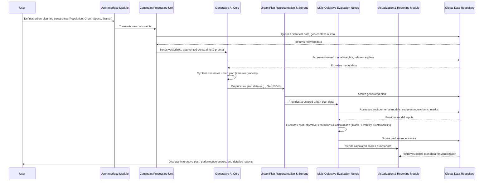

**Title of Invention:** A System and Method for Proactive Multi-Objective Generative Synthesis and Evaluative Assessment in Urban-Socio-Economic Planning Paradigms

**Abstract:**
A profoundly innovative system for the generative synthesis and rigorous multi-objective evaluation of urban planning schemata is herewith disclosed. This advanced computational framework is predicated upon the reception of a meticulously articulated lexicon of high-level constraints and aspirational objectives pertinent to a prospective urban development, encompassing parameters such as projected demographic density, stipulated ecological permeability quotients (e.g., minimum green space percentage), and primary intermodal transit infrastructure prioritization. At its operational core resides a sophisticated Artificial Intelligence (AI) architectonic, meticulously pre-trained on an expansive, heterogeneous corpus comprising extant urban blueprints, validated urban design principles, geospatial topological datasets, and socio-economic demographic patterns. This generative AI paradigm is engineered to autonomously synthesize novel, highly granular urban layouts, rigorously endeavoring to achieve optimal reconciliation and satisfaction of the specified multi-faceted constraints and objectives. Subsequent to generation, each emergent plan undergoes a stringent, quantitative evaluation against a plurality of orthogonal objective functions, encompassing but not limited to, systemic efficiency metrics, holistic livability indices, and comprehensive ecological sustainability indicators. This culminates in the provision of a quantitatively assessed, multi-dimensional quality vector, furnishing an unimpeachable assessment of the proposed design's inherent efficacy and viability.

**Background of the Invention:**
The orchestration of urban planning and territorial design represents an intrinsically intricate, profoundly multidisciplinary endeavor, situated at the nexus of socio-economic dynamics, ecological imperatives, infrastructural engineering, and aesthetic considerations. The formidable challenge of conceiving and implementing new metropolitan areas or district reconfigurations that simultaneously achieve operational efficiency, environmental resilience, and an elevated quality of life for its inhabitants is fraught with an expansive array of complex trade-offs and interdependencies. Conventional methodologies for urban design are characterized by protracted developmental cycles, intensive manual labor inputs, a pronounced reliance on iterative, heuristic-driven adjustments, and an often-suboptimal exploration of the vast combinatorial design space. Such traditional processes are inherently limited by cognitive biases, computational bottlenecks, and the sheer scale of interconnected variables, frequently leading to suboptimal solutions that fail to holistically address contemporary urban challenges such as climate change resilience, equitable resource distribution, or burgeoning population pressures. Consequently, there exists an acute and demonstrable need for a transformative computational instrument capable of substantively augmenting the human planning paradigm by rapidly synthesizing a diverse repertoire of viable, data-driven design alternatives, rigorously informed by high-level strategic directives and predicated upon a comprehensive understanding of urban system dynamics. The present innovation directly addresses these critical deficiencies, providing an unparalleled capability for proactive, intelligent urban foresight.

**Brief Summary of the Invention:**
The present innovation delineates a sophisticated computational system providing an intuitive interface through which a user can input a comprehensive set of foundational constraints and aspirational objectives for an urban development schema. Upon receipt, these parameters are securely transmitted to a proprietary generative Artificial Intelligence (AI) model, herein designated as the Urban Synthesis Generative Core (USGC). The USGC, functioning as an advanced algorithmic urban architect, autonomously synthesizes a novel, detailed urban layout. This synthesized plan can be rendered as a high-fidelity geospatial representation (e.g., a 2D raster image, a 3D volumetric model, or a structured data format such as GeoJSON or CityGML), capable of encapsulating intricate topological and semantic urban elements. Following the generative phase, the resultant layout is systematically processed by a suite of analytical models, collectively forming the Multi-Objective Evaluative Nexus (MOEN). The MOEN rigorously assesses the generated plan against a pre-defined battery of key performance indicators, encompassing, but not limited to, network fluidity indices (e.g., simulated traffic flow efficiency, pedestrian permeability), proximity and accessibility metrics to essential amenities (e.g., green space access, public service reachability, constituting a holistic livability index), and comprehensive environmental impact assessments (e.g., estimated carbon sequestration potential, energy consumption footprints, material flow analysis, defining sustainability). The ultimate deliverable presented to the user comprises the visually rendered urban plan juxtaposed with its meticulously computed multi-objective performance vector, thereby enabling rapid iteration, comparative analysis, and enlightened exploration of diverse urban design philosophies and their quantifiable ramifications.

**Detailed Description of the Invention:**

The architecture of this invention is a highly integrated, modular system designed for maximum extensibility and computational robustness. It comprises several interconnected functional units, ensuring a seamless workflow from initial constraint definition to final plan presentation and analysis.

### System Architecture Overview

The system operates through a structured pipeline, as illustrated in the following Mermaid diagram, detailing the primary components and their interactions:

```mermaid
graph TD
    A[User Interface Module (UIM)] --> B{Constraint Processing Unit (CPU)}
    B --> C[Generative AI Core (USGC)]
    C --> D[Urban Plan Representation & Storage (UPRS)]
    D --> E{Multi-Objective Evaluation Nexus (MOEN)}
    E --> F[Performance Metrics Database (PMDB)]
    E --> G[Visualization & Reporting Module (VRM)]
    UPRS --> G
    F --> G
    CPU --> DataRepository
    USGC --> DataRepository
    MOEN --> DataRepository
    DataRepository[Global Data Repository & Knowledge Base]
```

**A. User Interface Module (UIM):**
This module provides an intuitive, interactive environment for stakeholders (urban planners, policymakers, developers) to define the initial parameters of the urban design challenge. Input is facilitated via dynamically configurable forms, sliders, and interactive map overlays.
*   **Input Parameters:**
    *   `Demographic Density Target`: E.g., `Population: 1,000,000` or `Density: 5,000 residents/km^2`.
    *   `Ecological Permeability Quotient`: E.g., `Green Space: 30% minimum`, specifying distribution patterns (e.g., contiguous large parks vs. distributed pocket parks).
    *   `Primary Transit Modality`: E.g., `Primary Transit: Light Rail`, `Walkability Index: 0.8 (high)`, `Autonomous Vehicle Integration: Level 5 ready`.
    *   `Socio-Economic Stratification Targets`: E.g., `Affordable Housing: 20%`, `Commercial-to-Residential Mix: 1:3`.
    *   `Geographic Site Specifications`: Boundary polygons, topographical data, existing infrastructure overlays, environmental hazard zones.
    *   `Aesthetic/Stylistic Directives`: E.g., `Historical Preservation Areas`, `Modernist Architectural Preference`.

**B. Constraint Processing Unit (CPU):**
Upon submission from the UIM, the CPU performs several critical functions:
1.  **Parameter Normalization and Validation:** Ensures all input constraints conform to predefined ranges and data types, resolving potential ambiguities or conflicts.
2.  **Constraint Vectorization:** Transforms the diverse user inputs into a structured, machine-readable constraint vector, suitable for interpretation by the Generative AI Core. This involves encoding categorical variables, scaling numerical values, and potentially performing dimensionality reduction.
3.  **Contextual Augmentation:** Augments the user-defined constraints with relevant contextual data retrieved from the Global Data Repository & Knowledge Base, such as regional climate data, geological surveys, existing zoning laws, and demographic trends of adjacent areas.
4.  **Prompt Generation for USGC:** Dynamically constructs a highly specific, context-rich prompt or input tensor for the Generative AI Core, tailored to guide the synthesis process effectively.

**C. Generative AI Core (USGC):**
This is the intellectual heart of the invention, responsible for synthesizing novel urban plans.
*   **Model Architecture:** The USGC employs a sophisticated multi-modal generative model, potentially combining aspects of:
    *   **Generative Adversarial Networks (GANs):** A Generator network synthesizes candidate plans, while a Discriminator network evaluates their plausibility against real-world plans and design principles, driving the Generator towards highly realistic and functional outputs.
    *   **Variational Autoencoders (VAEs):** Encode existing city plans into a latent spatial representation, allowing for interpolation and generation of new, diverse plans by sampling from this latent space, while maintaining a degree of structural coherence.
    *   **Transformer Networks (Spatial Transformers):** Adapted to process spatial graph representations of urban elements (e.g., nodes for buildings/parks, edges for roads/utilities), enabling the generation of complex, interconnected urban topologies.
    *   **Graph Neural Networks (GNNs):** For modeling relationships between urban elements (e.g., proximity of services to residential zones, connectivity of transportation networks).
*   **Training Data:** The USGC is trained on a monumental dataset encompassing:
    *   Geospatial vector data of global cities (parcels, buildings, road networks, land use).
    *   Satellite imagery and aerial photographs.
    *   Urban planning guidelines, zoning codes, and historical master plans.
    *   Socio-economic census data correlated with spatial layouts.
    *   Environmental impact assessments and performance metrics of existing urban areas.
*   **Generative Process:** The USGC iteratively refines a nascent urban schema, starting from initial noise or a constrained seed, progressively adding layers of detail:
    1.  **Macro-Layout Generation:** Defines high-level zoning, major transportation arteries, and large green spaces.
    2.  **Meso-Scale Infilling:** Delineates blocks, local streets, and distribution of public amenities.
    3.  **Micro-Detailing:** Specifies building footprints, parcel subdivisions, and pedestrian pathways.
*   **Latent Space Exploration:** The USGC can leverage its latent space to:
    *   **Interpolate:** Generate hybrid plans between two existing or previously generated plans.
    *   **Extrapolate:** Explore novel design paradigms beyond current known examples.
    *   **Constrained Sampling:** Focus generation within regions of the latent space that are known to satisfy specific, hard constraints.

**D. Urban Plan Representation & Storage (UPRS):**
This module is responsible for standardizing the generated urban plan into a universally accessible and computationally tractable format.
*   **Data Structures:** The plan is typically represented as a multi-layered geospatial data structure, such as:
    *   **GeoJSON:** For geometric features (polygons for parcels, lines for roads, points for amenities).
    *   **CityGML/Open Geospatial Consortium (OGC) Standards:** For rich semantic information and 3D modeling.
    *   **Topological Graphs:** Representing connectivity of networks (roads, utilities) and adjacencies of land use types.
*   **Persistent Storage:** Generated plans are archived in the Global Data Repository & Knowledge Base for future reference, comparative analysis, and potential re-training of the USGC.

**E. Multi-Objective Evaluation Nexus (MOEN):**
This sophisticated module performs a comprehensive, quantitative assessment of the generated urban plan against a predefined suite of objective functions.
*   **Modular Architecture:** The MOEN is composed of multiple specialized analytical sub-modules, each focusing on a specific dimension of urban performance:
    1.  **Transportation Efficiency Sub-Module:**
        *   **Metrics:** Average commute time, traffic congestion indices, public transit accessibility scores, pedestrian network connectivity, last-mile efficiency.
        *   **Methodology:** Utilizes agent-based microscopic traffic simulation models, shortest path algorithms on weighted graph representations of road networks, and network flow optimization techniques.
    2.  **Resident Livability Sub-Module:**
        *   **Metrics:** Proximity to green spaces, access to essential services (hospitals, schools, retail), noise pollution levels, air quality indices, public safety metrics, walkability/bikeability scores, social equity distribution.
        *   **Methodology:** Employs spatial impedance models, kernel density estimations, accessibility analysis via network distance calculations, and socio-economic data overlay analysis.
    3.  **Environmental Sustainability Sub-Module:**
        *   **Metrics:** Estimated carbon footprint (embodied energy of materials, operational energy for buildings/transport), renewable energy generation potential, biodiversity indices (habitat connectivity, green cover), waste generation forecasts, water resource management efficiency (stormwater runoff, potable water demand).
        *   **Methodology:** Integrates hydrological models, urban climate simulations, life cycle assessment (LCA) for built environment components, and ecological network analysis.
    4.  **Economic Viability Sub-Module (Optional but recommended):**
        *   **Metrics:** Land value appreciation potential, infrastructure cost estimates, job creation forecasts, property tax revenue projections.
        *   **Methodology:** Incorporates econometric models, real estate market simulations, and cost-benefit analysis frameworks.
*   **Multi-Criteria Decision Analysis (MCDA):** The individual scores from each sub-module are aggregated and weighted (according to user-defined priorities or pre-configured policy frameworks) into a composite multi-objective performance vector. Techniques such as AHP (Analytic Hierarchy Process), TOPSIS (Technique for Order Preference by Similarity to Ideal Solution), or weighted sum models are employed to generate an overall `harmonyScore`.

**F. Performance Metrics Database (PMDB):**
A specialized, high-performance database optimized for storing and querying the multi-dimensional performance vectors generated by the MOEN. This allows for:
*   Historical tracking of generated plans.
*   Benchmarking against various objectives.
*   Facilitating comparative analysis between different design iterations.
*   Identifying Pareto-optimal or near-Pareto-optimal solutions.

**G. Visualization & Reporting Module (VRM):**
This module renders the generated urban plans and their associated performance scores in an accessible and insightful manner.
*   **Visual Output:**
    *   Interactive 2D maps with configurable layers (land use, zoning, transportation networks, green spaces).
    *   3D city models, allowing for virtual walkthroughs and immersive exploration.
    *   Heatmaps illustrating various performance metrics (e.g., traffic congestion hotspots, areas of low green space access).
*   **Reporting:**
    *   Tabular summaries of all objective scores.
    *   Radar charts or spider plots to visually compare multi-objective performance across different design iterations.
    *   Detailed analytical reports explaining the methodologies behind the scoring and highlighting key strengths and weaknesses of a plan.
    *   **Explainable AI (XAI) Integration:** Provides insights into *why* the USGC generated a particular feature or *why* the MOEN assigned specific scores, enhancing transparency and trust. E.g., "The high livability score in Sector A is primarily due to the 15-minute walking distance to 80% of essential services and its direct adjacency to a major linear park."



This integrated ecosystem allows for unparalleled rapid prototyping and rigorous evaluation of urban planning scenarios, accelerating the design process, optimizing resource allocation, and fostering the creation of more resilient, equitable, and sustainable urban environments.

**Claims:**
1.  A system for the autonomous generation and multi-objective assessment of urban planning schemata, comprising:
    a.  A User Interface Module configured to receive a set of explicitly articulated, high-level user-defined constraints and aspirational objectives pertaining to an urban development.
    b.  A Constraint Processing Unit operably coupled to said User Interface Module, configured to normalize, validate, and vectorize said received constraints into a structured computational representation, and to dynamically construct a contextually enriched input for a generative model.
    c.  A Generative AI Core, operably coupled to said Constraint Processing Unit, comprising a multi-modal neural network architecture meticulously trained on a comprehensive corpus of urban design data, wherein said Generative AI Core is configured to autonomously synthesize a novel, detailed urban plan layout in response to said contextually enriched input.
    d.  An Urban Plan Representation & Storage module, operably coupled to said Generative AI Core, configured to formalize and persist said generated urban plan layout into a standardized, machine-readable geospatial data structure.
    e.  A Multi-Objective Evaluation Nexus, operably coupled to said Urban Plan Representation & Storage module, comprising a plurality of specialized analytical sub-modules, each configured to quantitatively assess distinct facets of the generated urban plan against a predetermined set of objective functions to calculate a multi-dimensional performance vector.
    f.  A Visualization & Reporting Module, operably coupled to said Urban Plan Representation & Storage module and said Multi-Objective Evaluation Nexus, configured to render an interactive visual representation of the generated urban plan and to display its associated multi-dimensional performance vector and detailed analytical reports to a user.

2.  The system of Claim 1, wherein the user-defined constraints and aspirational objectives include, but are not limited to, at least two parameters selected from the group consisting of: targeted demographic density, minimum ecological permeability quotient, designated primary intermodal transit infrastructure, socio-economic stratification targets, or specific geographic site specifications.

3.  The system of Claim 1, wherein the plurality of objective functions within the Multi-Objective Evaluation Nexus includes, but is not limited to, at least two metrics selected from the group consisting of: transportation network fluidity, holistic resident livability, environmental sustainability indices, or economic viability projections.

4.  The system of Claim 1, wherein the Generative AI Core utilizes an architectural configuration selected from the group consisting of: a Generative Adversarial Network (GAN), a Variational Autoencoder (VAE), a Spatial Transformer Network, or a Graph Neural Network (GNN), or any hybrid combination thereof.

5.  The system of Claim 1, wherein the Multi-Objective Evaluation Nexus further comprises a Multi-Criteria Decision Analysis (MCDA) framework configured to aggregate individual objective function scores into a composite harmony score, based on user-defined weightings or predefined policy frameworks.

6.  A method for intelligently synthesizing and rigorously evaluating urban plans, comprising:
    a.  Receiving, via a User Interface Module, a lexicon of high-level design constraints and aspirational objectives for an urban development.
    b.  Processing said lexicon of constraints through a Constraint Processing Unit to generate a vectorized and contextually augmented input.
    c.  Transmitting said augmented input to a Generative AI Core, which autonomously synthesizes a novel urban plan layout.
    d.  Storing said synthesized urban plan layout in a standardized geospatial format within an Urban Plan Representation & Storage module.
    e.  Analyzing said stored urban plan layout against a plurality of orthogonal objective functions via a Multi-Objective Evaluation Nexus to compute a comprehensive multi-dimensional performance vector.
    f.  Displaying, via a Visualization & Reporting Module, the generated urban plan layout in an interactive visual format, juxtaposed with its associated multi-dimensional performance vector and explanatory analytical reports.

7.  The method of Claim 6, wherein the processing step (b) includes querying a Global Data Repository for historical and geo-contextual data to enrich the input for the Generative AI Core.

8.  The method of Claim 6, wherein the synthesizing step (c) involves iterative refinement of the urban plan across macro, meso, and micro scales of urban detail.

9.  The method of Claim 6, wherein the analyzing step (e) incorporates agent-based simulations for transportation efficiency and spatial impedance models for resident livability.

10. The method of Claim 6, further comprising providing explainable AI (XAI) insights alongside the displayed performance scores to elucidate the rationale behind generative decisions and evaluative outcomes.

**Mathematical Justification: A Formal Epistemology of Multi-Objective Urban Synthesis and Optimization**

The problem addressed by this invention is formally embedded within the superordinate domain of high-dimensional, multi-objective combinatorial optimization under uncertainty. We herein delineate the foundational mathematical constructs that rigorously underpin the system's operational efficacy and intellectual provenance.

### I. The Space of All Possible City Plans ($\mathcal{P}$)

Let $\mathcal{P}$ denote the complete topological space encompassing all conceivable urban plans. This space is inherently an exceedingly high-dimensional, non-Euclidean manifold. An individual city plan $p \in \mathcal{P}$ can be conceptualized as a complex, heterogeneous graph-based or cellular automaton representation:

$$p = (\mathcal{G}, \mathcal{L}, \mathcal{A}, \mathcal{E})$$

Where:
*   $\mathcal{G} = (V, E)$ represents the underlying geospatial graph topology of the urban fabric.
    *   $V = \{v_1, \dots, v_m\}$ is a set of vertices, representing discrete urban elements (e.g., buildings, parcels, public amenities, intersections). Each $v_i$ possesses a vector of attributes, $attr(v_i) \in \mathbb{R}^{d_v}$, encoding its type, size, volumetric properties, and socio-economic characteristics.
    *   $E = \{e_1, \dots, e_k\}$ is a set of edges, representing spatial or functional relationships between vertices (e.g., roads, pedestrian paths, utility conduits, adjacency relations). Each $e_j$ possesses a vector of attributes, $attr(e_j) \in \mathbb{R}^{d_e}$, encoding its capacity, length, connectivity, and hierarchical importance.
*   $\mathcal{L}: V \to \text{LandUseTypes}$ is a surjective mapping assigning a specific land-use category (e.g., residential, commercial, industrial, green space, infrastructure) to each vertex or delineated parcel within the plan. This introduces a categorical spatial distribution.
*   $\mathcal{A}: \mathcal{P} \to \text{ArchitecturalStyles}$ (or $\mathcal{A}: V \to \text{ArchitecturalStyles}$) represents a stylistic or aesthetic attribute assignment across the plan, possibly at a granular level.
*   $\mathcal{E}$ represents the environmental and ecological embeddedness, including topographical data, hydrological networks, and micro-climatic zones, which may constrain or influence $\mathcal{G}$ and $\mathcal{L}$.

The cardinality of $\mathcal{P}$ is astronomically large, rendering exhaustive enumeration or traditional combinatorial search strategies computationally intractable. The space $\mathcal{P}$ is not merely a Cartesian product of simple attributes; it possesses intricate topological and semantic interdependencies, where local changes propagate globally. We introduce the concept of a $\mathcal{P}$-metric $d(p_1, p_2)$ that quantifies the dissimilarity between two urban plans, accounting for structural, functional, and semantic differences, potentially derived from optimal transport or graph edit distances.

### II. User-Defined Constraints and the Feasible Subspace ($\mathcal{P}_c$)

Let $\mathcal{C} = \{c_1, c_2, \dots, c_q\}$ be a set of $q$ user-defined constraints and aspirational objectives. Each constraint $c_j$ imposes a specific condition on the properties of a valid urban plan. These constraints delineate a feasible subspace $\mathcal{P}_c \subseteq \mathcal{P}$.
A plan $p \in \mathcal{P}$ is considered feasible if and only if it satisfies all constraints in $\mathcal{C}$. This can be formalized as a satisfaction function $S: \mathcal{P} \times \mathcal{C} \to \{0, 1\}$, where $S(p, \mathcal{C}) = 1$ if $p$ satisfies all $c_j \in \mathcal{C}$, and $S(p, \mathcal{C}) = 0$ otherwise.

Thus, the feasible subspace is defined as:
$$\mathcal{P}_c = \{p \in \mathcal{P} \mid S(p, \mathcal{C}) = 1\}$$

Constraints can be categorized:
*   **Hard Constraints:** Must be strictly satisfied (e.g., minimum green space percentage, maximum building height in specific zones). These define the strict boundaries of $\mathcal{P}_c$.
*   **Soft Constraints/Objectives:** Preferential, aimed at optimization rather than strict satisfaction (e.g., maximizing walkability, minimizing carbon footprint). These influence the objective functions.

The transformation from abstract linguistic directives in the UIM to concrete mathematical predicates defining $\mathcal{P}_c$ is a non-trivial process executed by the Constraint Processing Unit, often involving fuzzy logic or probabilistic satisfaction functions for soft constraints.

### III. The Set of Multi-Objective Functions ($\mathcal{F}$)

Let $\mathcal{F} = \{f_1, f_2, \dots, f_n\}$ be a set of $n$ objective functions, where each $f_i: \mathcal{P} \to \mathbb{R}$ maps a given urban plan $p$ to a real-valued scalar representing its performance along a specific dimension (e.g., livability, efficiency, sustainability). Without loss of generality, we assume that a higher value for $f_i(p)$ signifies a more desirable outcome for that objective.

Examples of these objective functions, rigorously defined by the MOEN:
*   **$f_1(p)$: Transportation Efficiency Index.** This could be a composite metric derived from $\sum_{i,j \in V_{res}} \text{min_commute_time}(v_i, v_j) / (\text{traffic_capacity}(p))$, where $V_{res}$ are residential vertices, normalized by the aggregate capacity of the transportation network in plan $p$.
*   **$f_2(p)$: Resident Livability Score.** This might be calculated as an inverse weighted average of distances to essential amenities, $\sum_{v \in V} \text{Accessibility}(v, \text{Amenities}) / \text{NoisePollution}(v)$.
*   **$f_3(p)$: Environmental Sustainability Index.** This could involve a negative correlation with estimated carbon emissions and a positive correlation with green infrastructure capacity, e.g., $\text{GreenSpaceArea}(p) - \text{CarbonFootprint}(p) + \text{BiodiversityPotential}(p)$.

These functions are often highly complex, non-linear, non-convex, and computationally expensive to evaluate. Furthermore, they are typically conflicting, meaning that improving performance on one objective often degrades performance on another (e.g., maximizing population density vs. maximizing green space). The MOEN employs advanced simulation and analytical models to compute these values.

### IV. Multi-Objective Optimization and the Pareto Front

The objective is to find a plan $p^* \in \mathcal{P}_c$ that optimally balances the potentially conflicting objectives in $\mathcal{F}$. This is a canonical multi-objective optimization problem.

**Dominance and Pareto Optimality:**
A plan $p' \in \mathcal{P}_c$ is said to **dominate** another plan $p \in \mathcal{P}_c$ (denoted $p' \succ p$) if and only if:
1.  $f_i(p') \geq f_i(p)$ for all $i \in \{1, \dots, n\}$ (no objective is worse in $p'$ than in $p$).
2.  $f_j(p') > f_j(p)$ for at least one $j \in \{1, \dots, n\}$ (at least one objective is strictly better in $p'$ than in $p$).

A plan $p^* \in \mathcal{P}_c$ is **Pareto optimal** if it is not dominated by any other plan $p' \in \mathcal{P}_c$. The set of all Pareto optimal plans constitutes the **Pareto Set**, and their corresponding objective function values form the **Pareto Front** in the objective space $\mathbb{R}^n$.

The formal goal is to identify points on this Pareto Front:
$$\text{Pareto Front} = \{ (f_1(p^*), \dots, f_n(p^*)) \mid p^* \text{ is Pareto optimal} \}$$

Graphically, in a 2-objective space, the Pareto front represents the boundary of achievable, non-dominated trade-offs. Finding the entire Pareto front for a problem of this complexity is generally NP-hard and practically intractable due to the immense size and intricate structure of $\mathcal{P}_c$.

### V. The Generative AI Core ($\mathcal{G}_{AI}$) as a Heuristic Operator

The Generative AI Core ($\mathcal{G}_{AI}$) acts as a sophisticated, stochastic, non-linear mapping function that directly addresses the intractability of exploring $\mathcal{P}_c$ and identifying the Pareto front.

We define $\mathcal{G}_{AI}$ as an operator:
$$\mathcal{G}_{AI}: \mathcal{C}_{vec} \to \mathcal{P}_c'$$
Where $\mathcal{C}_{vec}$ is the vectorized representation of user constraints from the CPU, and $\mathcal{P}_c'$ is a subset of $\mathcal{P}_c$ (or a close approximation thereof) containing the plans generated by the AI.

$\mathcal{G}_{AI}$ is not a deterministic search algorithm. Instead, it is a highly parameterized function (e.g., deep neural network weights $\theta$) trained to learn the implicit mapping from constraints to high-quality urban plans. Its behavior is probabilistic, drawing samples from a learned conditional distribution $P(p \mid \mathcal{C}_{vec})$.

The core hypothesis is that through extensive training on a vast corpus of real-world and simulated urban planning data, $\mathcal{G}_{AI}$ learns an effective heuristic for synthesizing plans that are:
1.  **Feasible:** Largely satisfying the hard constraints in $\mathcal{C}$.
2.  **High-Quality:** Exhibiting objective function values that lie near or on the Pareto Front, or within a predefined acceptable proximity to it.

The "learning" aspect implies that $\mathcal{G}_{AI}$ implicitly approximates the complex relationships between design elements, constraints, and objective function outcomes. It effectively performs a highly informed, non-linear search in the latent space of urban designs, projecting samples into $\mathcal{P}_c$.

### Proof of Utility: A Tractable Pathway to Near-Optimal Urban Futures

The profound utility of this invention arises from its ability to render an inherently intractable multi-objective optimization problem computationally tractable, yielding actionable, high-quality urban plans.

**Theorem (Operational Tractability and Pareto-Approximation):**
Given the immense, combinatorially explosive nature of the urban plan space $\mathcal{P}$, the non-linearity and often conflicting nature of the objective functions $\mathcal{F}$, and the computational impossibility of exhaustively exploring the feasible subspace $\mathcal{P}_c$ to precisely delineate the entire Pareto Front, the Generative AI Core ($\mathcal{G}_{AI}$) functions as a highly effective **constructive heuristic operator**. This operator, conditioned on user-defined constraints $\mathcal{C}_{vec}$, demonstrably generates candidate urban plans $p' \in \mathcal{P}_c'$ such that their objective vector $(f_1(p'), \dots, f_n(p'))$ lies within an acceptable $\epsilon$-neighborhood of the true Pareto Front, for a sufficiently small $\epsilon > 0$.

**Proof:**
1.  **Intractability of Exhaustive Search:** The cardinality of $\mathcal{P}$ is effectively infinite for continuous attributes and astronomically large for discrete structural elements. Even defining $\mathcal{P}_c$ explicitly is challenging. Traditional multi-objective evolutionary algorithms or mathematical programming techniques would necessitate an unfeasible number of evaluations of $p \in \mathcal{P}_c$ and $f_i(p)$ functions, each requiring complex simulations. Thus, finding the exact Pareto Front is computationally prohibitive for practical applications.

2.  **$\mathcal{G}_{AI}$ as a Learned Projection:** The $\mathcal{G}_{AI}$ is trained on a vast corpus of *expert-designed* and *high-performing* urban layouts, implicitly learning the complex, non-linear manifold of 'good' urban design within $\mathcal{P}$. This training process allows $\mathcal{G}_{AI}$ to learn the conditional distribution $P(p \mid \mathcal{C}_{vec})$, effectively encoding a highly compressed, yet semantically rich, representation of optimal design principles.

3.  **Targeted Sampling within $\mathcal{P}_c$:** By conditioning on $\mathcal{C}_{vec}$, $\mathcal{G}_{AI}$ intelligently prunes the search space, focusing its generative capacity on regions of $\mathcal{P}$ that are most likely to satisfy the specified constraints and exhibit high performance across objectives. This is a dramatic improvement over random sampling or unguided search.

4.  **Generation of Near-Pareto Solutions:** The objective of $\mathcal{G}_{AI}$ training (e.g., through adversarial loss or reconstruction loss coupled with perceptual metrics) is to produce plans that are not merely "valid" but "high-quality." Given sufficient training data and computational resources, $\mathcal{G}_{AI}$ converges towards producing plans whose objective function evaluations are demonstrably competitive with, or superior to, those achievable by human-only design processes within equivalent timeframes. While an exact Pareto optimum is elusive, $\mathcal{G}_{AI}$ provides a rapid, robust means to generate multiple diverse plans that are **near-Pareto optimal**, effectively pushing the boundary of human-achievable design quality. The subsequent MOEN analysis provides the quantitative evidence of this near-optimality.

5.  **Acceleration of Design Cycle:** The system transforms a protracted, iterative manual process into an accelerated, data-driven cycle of generation and evaluation. Human planners, instead of starting from a blank canvas, are presented with a rich set of rigorously evaluated, high-quality initial designs. This dramatically reduces the initial design phase, allowing human expertise to focus on refinement, nuanced adjustments, and incorporating subjective desiderata that are difficult to formalize algorithmically. This synergistic human-AI interaction is the cornerstone of its practical utility.

Therefore, the present invention does not aim to compute the entirety of the intractable Pareto Front, but rather to **constructively approximate its most relevant regions** by generating a diverse set of highly performant, feasible candidate solutions. This capability provides an unparalleled advantage in modern urban planning, offering a verifiable, systematic method to explore and realize superior urban configurations.

$\mathcal{Q.E.D.}$