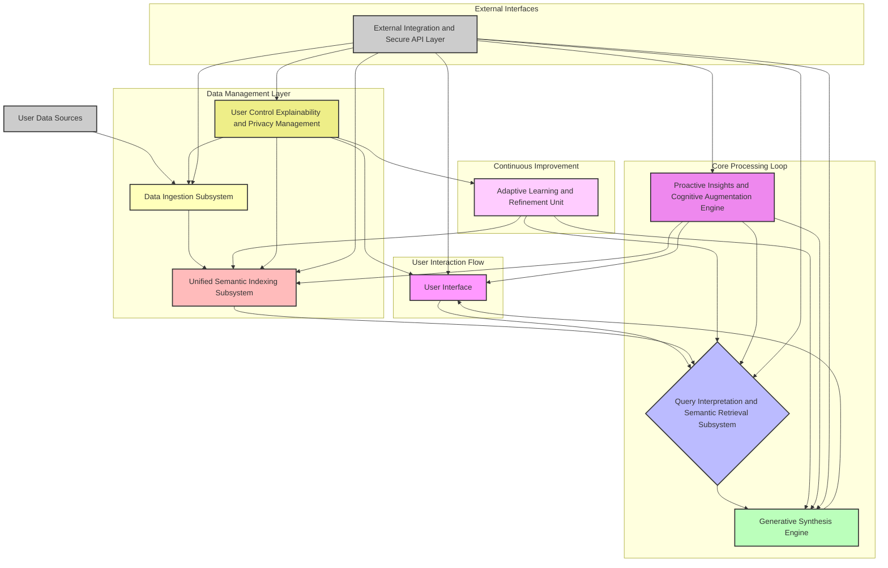
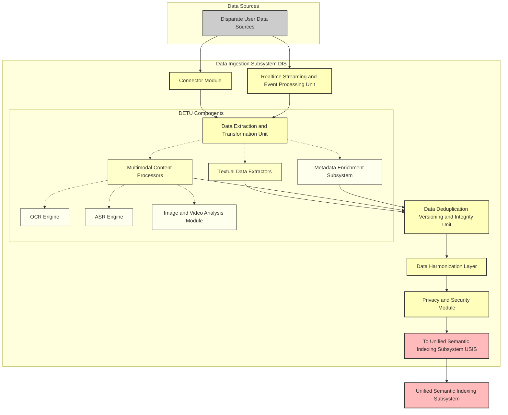
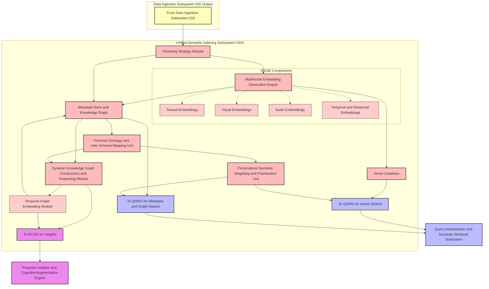
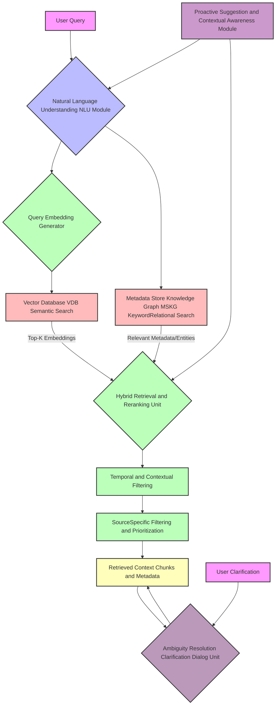
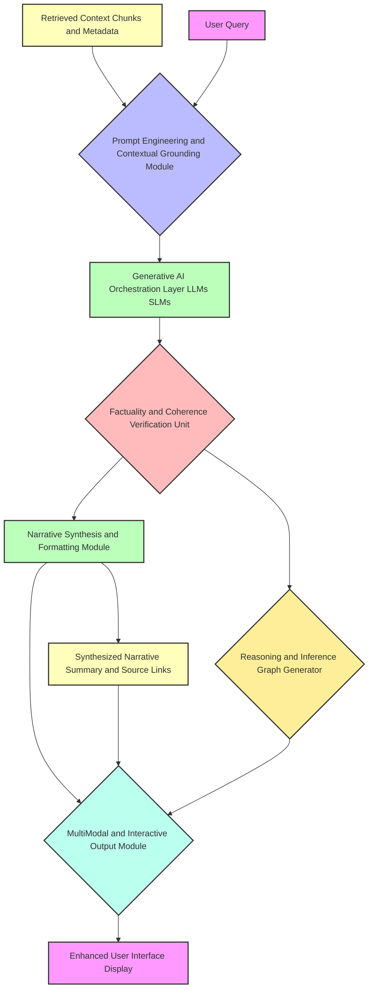
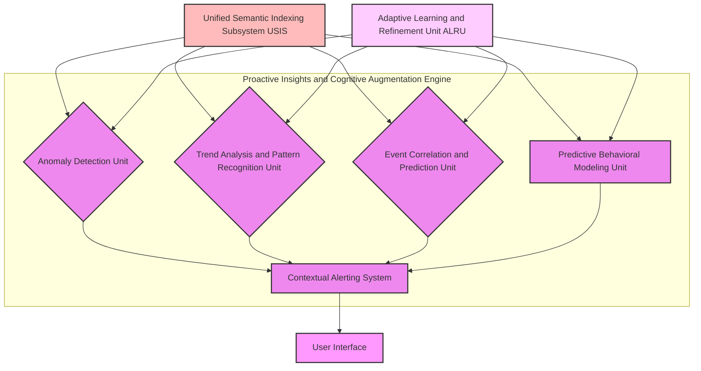
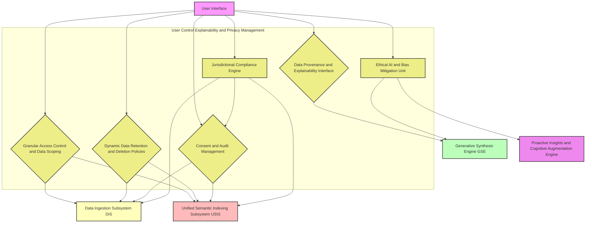

**Title of Invention:** A Comprehensive System and Method for Multimodal Cognitive Archival and Semantic Retrieval via Generative Synthesis

**Abstract:**
A profoundly innovative system and associated methodologies are hereby disclosed for the profound task of establishing, maintaining, and interrogating a singularly unified and semantically enriched digital archive of an individual's entire personal informational corpus. This invention transcends rudimentary data aggregation by ingesting, harmonizing, and indexing data across a vastly heterogeneous array of disparate modalities and sources, encompassing, but not limited to, electronic mail correspondence, photographic and videographic media, textual documents, calendrical entries, audio recordings, and biometric data, thereby constructing a coherent, longitudinally integrated, multimodal temporal continuum. The system empowers a user to articulate complex, high-level informational desiderata through natural language queries (e.g., "Synthesize the core activities and significant communications relating to my strategic collaboration initiative in Q3 2021, emphasizing any associated challenges and their resolutions"). Central to its operation is a sophisticated Generative AI Orchestration Layer, employing advanced large-scale foundational models and specialized multimodal encoders, to execute deep semantic traversal across the comprehensively indexed data space, effectuate the precise identification and contextual retrieval of pertinent informational quanta, and subsequently fabricate a highly coherent, factually grounded, and narratively synthesized summary that directly and comprehensively addresses the user's query, augmented by verifiable provenance links to the originating digital artifacts. Furthermore, the system includes a Proactive Insights and Cognitive Augmentation Engine (PICAE) that continually analyzes the indexed archive to identify patterns, anomalies, and correlations, offering predictive context and foresight without explicit queries, notably through a Predictive Behavioral Modeling Unit. An advanced User Control, Explainability, and Privacy Management (UCEPM) subsystem ensures granular user agency over data, transparent reasoning, adherence to privacy principles through a Jurisdictional Compliance Engine, and ethical considerations via an Ethical AI and Bias Mitigation Unit. This system represents a paradigm shift in personal knowledge management, transforming fragmented digital existence into an intelligently queryable, proactive, and ethically managed cognitive prosthesis, also providing a robust External Integration and Secure API Layer for broader ecosystem interoperability.

**Background of the Invention:**
The contemporary human experience is irrevocably intertwined with an increasingly vast and disaggregated digital footprint. An individual's personal informational landscape is typically fractured across an archipelago of disconnected applications, proprietary platforms, and disparate data silos. The fundamental challenge of locating, collating, and synthesizing information pertinent to a specific past event, project, or personal narrative typically necessitates an arduous, cognitively demanding, and profoundly inefficient manual peregrination across a multitude of isolated archives—such as disparate cloud storage repositories, email clients, social media platforms, messaging applications, photo galleries, and local document directories. This atomization of personal data impedes coherent recall, obstructs longitudinal analysis, and significantly diminishes the intrinsic value of an individual's accumulated digital legacy. Existing search paradigms, predominantly reliant on keyword matching or rudimentary metadata filters, are inherently deficient in addressing queries requiring deep semantic understanding, contextual synthesis, and cross-modal informational integration. Moreover, current systems are largely reactive, awaiting explicit user queries rather than proactively surfacing relevant information or potential insights. There exists, therefore, an imperative and profound need for an architecturally unified, semantically intelligent, generatively capable, and proactively insightful system capable of processing sophisticated natural language queries to retrieve, reason over, and synthesize all epistemically relevant information from an individual's entire digital corpus, thereby transforming data into actionable knowledge and coherent personal history, while also offering robust user control and transparency over their digital legacy, adhering to jurisdictional privacy requirements, and mitigating AI biases. This invention addresses this critical lacuna, offering an unprecedented level of cognitive augmentation.

**Brief Summary of the Invention:**
The present invention, herein designated as the "Cognitive Archival and Generative Synthesis Engine" (CAGSE), represents a fundamentally novel architecture for the unified management and intelligent interrogation of personal digital history. Its foundational premise involves the creation of an holistically integrated, multimodal, and semantically rich index encompassing the entirety of a user's personal digital data estate. Upon the submission of a user-initiated natural language query, the system dynamically invokes a sophisticated multimodal embedding model to project both the query and the pre-indexed data artifacts into a harmonized, high-dimensional vector space, thereby enabling advanced semantic interoperability. A multi-stage, adaptive vector search and re-ranking algorithm is subsequently employed to precisely identify and retrieve the maximal entropy subset of information quanta most semantically congruent with the articulated query. These meticulously retrieved artifacts, encompassing diverse data types (e.g., textual excerpts, image embeddings, audio transcripts, calendrical entries, and relational metadata), are then dynamically assembled into an optimized contextual payload. This payload, in conjunction with an adaptively engineered prompt, is then furnished to an advanced Generative AI Orchestration Layer. This layer, powered by highly capable large-scale foundational models, is expressly configured to perform complex inferential reasoning, cross-modal synthesis, and narrative construction, ultimately fabricating a precise, coherent, and verifiably grounded narrative response that directly and comprehensively addresses the user's inquiry, while concurrently providing direct, actionable links to the original, source digital assets from which the synthesis was derived. Complementing this reactive querying capability, the CAGSE incorporates a Proactive Insights and Cognitive Augmentation Engine (PICAE) which continuously analyzes the indexed data for patterns, anomalies, and correlations, generating unsolicited, contextually relevant insights and predictions, further empowered by a Predictive Behavioral Modeling Unit. Furthermore, a sophisticated User Control, Explainability, and Privacy Management (UCEPM) subsystem is integrated throughout, providing users with granular control over data access, transparent explanations of AI reasoning, robust privacy safeguards via a Jurisdictional Compliance Engine, and ethical oversight through an Ethical AI and Bias Mitigation Unit. An External Integration and Secure API Layer (EISAL) further enhances the system's utility by enabling secure and controlled interoperability with external applications. This invention thus establishes an unprecedented capability for personal digital archaeology, proactive cognitive augmentation, and ethical data governance.

**Detailed Description of the Invention:**

The Cognitive Archival and Generative Synthesis Engine (CAGSE) is architecturally instantiated as a highly robust, scalable, and modular system comprising several intrinsically coupled subsystems, each engineered for optimal performance and interoperability. A high-level overview of the system architecture is provided in Figure 1, illustrating the primary data flow and subsystem interactions.

<br>

**Figure 1: High-Level System Architecture of the Cognitive Archival and Generative Synthesis Engine CAGSE**
<br>

**1. Data Ingestion Subsystem (DIS):**
The DIS is a meticulously engineered pipeline responsible for the secure, compliant, and comprehensive acquisition of an individual's digital artifacts from a vastly heterogeneous array of source systems. This subsystem comprises:

*   **Connector Module:** An extensible framework of high-fidelity, secure API integrations and programmatic interfaces for establishing authenticated connections with diverse personal data sources. These include, but are not limited to, email platforms (e.g., SMTP/IMAP/Graph API), cloud storage services (e.g., OAuth/API for Google Drive, Dropbox, OneDrive), communication platforms (e.g., Slack, Teams, WhatsApp message logs via authorized exports), social media platforms (e.g., authorized user data exports), calendaring systems (e.g., CalDAV/iCal), local file systems, photographic and videographic repositories, and wearable device data streams (e.g., health metrics, location data). Robust error handling, rate limiting, and credential management are intrinsically built into each connector.
*   **Real-time Streaming & Event Processing Unit (RSEPU):** Engineered for continuous, low-latency ingestion of actively generated data streams. This unit leverages event-driven architectures to capture and process data from sources like smart device logs, real-time messaging conversations, browser activity, and active application usage. It employs distributed stream processing frameworks (e.g., Apache Kafka, Apache Flink) to ensure high throughput and fault tolerance for ephemeral and dynamic data.
*   **Data Extraction & Transformation Unit (DETU):** This unit performs the initial data acquisition, parsing, and normalization.
    *   **Textual Data Extractors:** Specialized parsers for documents (PDF, DOCX, TXT, MD), emails (MIME parsing), web pages, chat logs, and database records. Extracts raw text, metadata (sender, recipient, date, subject, file type, author, creation/modification dates, geographical tags).
    *   **Multimodal Content Processors:**
        *   **Optical Character Recognition (OCR) Engine:** Advanced OCR capabilities for extracting text from images (e.g., scans of documents, whiteboards, handwritten notes, memes), leveraging deep learning models for high accuracy across diverse fonts and languages.
        *   **Automatic Speech Recognition (ASR) Engine:** Converts spoken language from audio and video files (e.g., voice notes, meeting recordings, personal vlogs) into precise textual transcripts. Includes speaker diarization for identifying distinct voices.
        *   **Image & Video Analysis Module:** Utilizes state-of-the-art computer vision models for object detection, scene understanding, facial recognition (with consent), landmark identification, and descriptive caption generation for visual content. For video, this extends to event detection and temporal summarization.
        *   **Metadata Enrichment Subsystem:** Automatically extracts and infers additional metadata beyond intrinsic file properties. This includes named entity recognition (people, organizations, locations, dates), topic modeling, sentiment analysis, and the detection of explicit and implicit relationships between data entities.
*   **Data Deduplication, Versioning & Integrity Unit (DDVIU):** This unit is responsible for identifying and merging redundant data artifacts to optimize storage and retrieval efficiency. It tracks changes to documents and media over time, maintaining a full version history. Cryptographic hashing and checksums are employed to ensure data integrity, providing an auditable trail of all modifications and guaranteeing the authenticity of stored information.
*   **Data Harmonization Layer (DHL):** The DHL is responsible for transforming heterogeneous data schemas into a unified, canonical internal representation. This involves schema mapping, data type standardization, temporal normalization (converting all timestamps to a consistent UTC standard), and conflict resolution. It ensures semantic consistency across all ingested data, facilitating subsequent indexing and querying.
*   **Privacy & Security Module:** Implements robust encryption-at-rest and in-transit (e.g., AES-256, TLS 1.3), fine-grained access control mechanisms, data anonymization/pseudonymization capabilities (e.g., for sensitive entities), and user-configurable data retention policies. It is designed to be fully compliant with prevailing data protection regulations (e.g., GDPR, CCPA).

<br>

**Figure 1A: Detailed Data Ingestion Subsystem DIS**
<br>

**2. Unified Semantic Indexing Subsystem (USIS):**
The USIS constructs and maintains the core knowledge graph and vector representation of the user's personal archive, optimized for rapid, semantically aware retrieval.

*   **Chunking Strategy Module:** Raw ingested data is segmented into semantically coherent "chunks" suitable for embedding. This is not merely fixed-size splitting; it employs intelligent algorithms such as:
    *   **Semantic Chunking:** Identifying natural breaks in text (paragraphs, sections, turns in conversation) and ensuring chunks maintain topical cohesion.
    *   **Hierarchical Chunking:** Creating embeddings at multiple granularities (e.g., sentence, paragraph, document summary) to support multi-resolution querying.
    *   **Multimodal Chunking:** Aligning text chunks with corresponding image regions, video segments, or audio snippets.
*   **Multimodal Embedding Generation Engine (MEGE):** This engine transforms each data chunk and its associated enriched metadata into high-dimensional, dense vector representations (embeddings).
    *   **Textual Embeddings:** Utilizes transformer-based large language models (e.g., BERT, Sentence-BERT, specialized fine-tuned models) to generate semantically rich vector representations of text chunks.
    *   **Visual Embeddings:** Leverages pre-trained convolutional neural networks (CNNs) or vision transformers (ViT) to generate embeddings for image and video frames, capturing visual content and context. Cross-modal models like CLIP are employed to align image and text embeddings into a common vector space.
    *   **Audio Embeddings:** Transforms ASR transcripts and raw audio features into embeddings, potentially using models like Wav2Vec or SpeechBERT, aligned with the common vector space.
    *   **Temporal & Relational Embeddings:** Incorporates temporal attributes (date, time) and detected relationships between entities into the embedding space, either directly as part of the multimodal model or via dedicated temporal encoding layers.
*   **Vector Database (VDB):** A high-performance, distributed vector database (e.g., Faiss, Pinecone, Milvus) optimized for approximate nearest neighbor (ANN) search. It stores the generated vector embeddings, enabling efficient semantic similarity queries.
*   **Metadata Store & Knowledge Graph (MSKG):** A robust NoSQL or graph database that stores all extracted and enriched metadata, along with the raw chunks and their original source links. It also models explicit and inferred relationships between entities, events, and documents, forming a dynamic personal knowledge graph. This graph allows for complex relational queries and context enrichment.
*   **Dynamic Knowledge Graph Construction & Reasoning Module (DKGRM):** Beyond static storage, this module continuously updates the MSKG by inferring new relationships, entities, and temporal sequences from the stream of incoming data. It employs techniques like Link Prediction using graph neural networks (GNNs) and temporal reasoning algorithms to identify subtle connections between seemingly disparate events or entities. This module enriches the graph with inferred facts, enabling more sophisticated relational queries and deep contextual understanding.
    *   **Temporal Graph Embedding Module:** A specialized sub-component within the DKGRM that specifically focuses on creating time-aware embeddings for graph nodes and edges. It captures the evolution of relationships and attributes over time, enabling queries like "Who was I collaborating with most frequently between Q1 2020 and Q2 2021?" or "How did my interest in topic X evolve over the last 5 years?". This module integrates temporal logic into graph traversal and relationship inference.
*   **Personal Ontology & User Schema Mapping Unit (POUSMU):** This unit empowers users to define their own custom ontologies, categories, tags, and semantic relationships relevant to their unique personal and professional context. It maps these user-defined schemas to the system's canonical internal representation, allowing for highly personalized indexing, retrieval, and synthesis that aligns with the user's individual mental models and organizational preferences.
*   **Personalized Semantic Weighting and Prioritization Unit (PSWPU):** Building upon the POUSMU, this unit allows users to define explicit or implicit weights and prioritization rules for different types of information, entities, topics, or sources. For example, a user might prioritize information from "work emails" when querying about "project X," or boost the relevance of "family photos" when the query involves specific individuals. These weights dynamically influence the `d_sem` metric in the QISRS, ensuring retrieval results are highly tailored to individual user intent and preferences, even in ambiguous scenarios.

<br>

**Figure 1B: Detailed Unified Semantic Indexing Subsystem USIS**
<br>

**3. Query Interpretation & Semantic Retrieval Subsystem (QISRS):**
This subsystem is responsible for understanding the user's intent and orchestrating the retrieval of relevant information.

<br>

**Figure 2: Query Interpretation and Semantic Retrieval Flow**
<br>

*   **Natural Language Understanding (NLU) Module:** Processes the raw natural language query.
    *   **Intent Recognition:** Classifies the user's primary goal (e.g., factual lookup, summary generation, event reconstruction, opinion extraction).
    *   **Named Entity Recognition (NER):** Identifies specific entities (people, organizations, locations, dates, projects) within the query.
    *   **Temporal Expression Parsing:** Extracts and normalizes temporal constraints (e.g., "last year," "Q3 2021," "during my trip to Italy").
    *   **Query Expansion & Rewriting:** Augments the query with synonyms, related concepts from the knowledge graph, or rephrases it for optimal retrieval performance.
*   **Query Embedding Generator:** Converts the processed query into a high-dimensional vector using the same multimodal embedding model employed by the USIS, ensuring semantic alignment with the indexed data.
*   **Hybrid Retrieval & Re-ranking Unit:** Executes a multi-faceted search strategy.
    *   **Vector Similarity Search:** Performs an ANN search in the VDB using the query embedding to retrieve an initial set of semantically similar data chunks.
    *   **Keyword & Relational Search:** Simultaneously queries the MSKG using extracted keywords, entities, and temporal constraints to retrieve specific metadata and graph-based relationships.
    *   **Fusion & Re-ranking:** Combines results from both vector and keyword searches. A transformer-based re-ranking model is then applied to the top-K candidates to refine relevancy scores, considering context, temporal proximity, and source trustworthiness, additionally incorporating weights and priorities from the PSWPU, generating a highly relevant, diversified set of retrieval candidates.
*   **Temporal & Contextual Filtering:** Applies advanced filters based on extracted temporal constraints (e.g., restricting results to a specific date range) and contextual cues (e.g., "my strategic collaboration initiative"). This ensures only chronologically and contextually pertinent information is passed downstream.
*   **Source-Specific Filtering & Prioritization:** Allows for user-defined or dynamically inferred prioritization of specific data sources (e.g., "prefer information from my work email over personal photos"), leveraging the rules from the PSWPU.
*   **Ambiguity Resolution & Clarification Dialog Unit (ARCDU):** When a user's query is deemed ambiguous or underspecified by the NLU module, this unit initiates a conversational dialogue. It asks clarifying questions (e.g., "Are you referring to the Q3 2021 project or your personal trip in Q3 2022?") to refine the user's intent, temporal scope, or specific entities. This iterative process ensures precise query interpretation before retrieval, reducing irrelevant results.
*   **Proactive Suggestion & Contextual Awareness Module (PSCAM):** This module intelligently monitors the user's active context (e.g., open applications, current location, calendar events, recently viewed documents) and, without an explicit query, proactively suggests highly relevant information, related documents, or previously synthesized insights from the archive. It leverages contextual embeddings and predictive analytics to anticipate user information needs, transforming the system into a truly proactive cognitive assistant.
*   **Retrieved Context Aggregation:** Compiles the final, refined set of relevant data chunks, their associated metadata, and original source links into a structured context block for the generative synthesis engine.

**4. Generative Synthesis Engine (GSE):**
The GSE is the core intelligence of the system, responsible for transforming retrieved information into coherent, user-facing narratives.

<br>

**Figure 3: Generative Synthesis Process**
<br>

*   **Prompt Engineering & Contextual Grounding Module:** Dynamically constructs an optimized prompt for the generative AI model. This involves:
    *   **Role Assignment:** Instructing the AI model to adopt a specific persona (e.g., "You are a personal historian," "You are a project manager summarizing progress").
    *   **Instructional Directives:** Providing clear, detailed instructions for synthesis (e.g., "Synthesize a narrative summary," "Extract key events and dates," "Identify challenges and resolutions").
    *   **Context Injection:** Inserting the retrieved data chunks and metadata, carefully structured to maximize the AI model's contextual understanding and minimize hallucination. Techniques like RAG (Retrieval-Augmented Generation) are fundamental here.
    *   **Constraint Enforcement:** Specifying output format requirements (e.g., length, tone, inclusion of specific entities).
*   **Generative AI Orchestration Layer (GAIOL):** Manages interactions with one or more large-scale generative AI models (LLMs). This layer can dynamically select the most appropriate model based on query complexity, computational cost, and user preferences. It may leverage:
    *   **Foundational LLMs:** Powerful, general-purpose models (e.g., GPT-4, Claude 3) for complex reasoning and synthesis.
    *   **Specialized SLMs (Small Language Models):** Fine-tuned models for specific tasks (e.g., summarization, entity extraction) for efficiency.
    *   **Multimodal Generative Models:** For scenarios requiring synthesis directly from multimodal inputs (e.g., generating text descriptions from images and related text), or generating text *from* visual/audio data.
*   **Factuality & Coherence Verification Unit:** Employs advanced techniques to mitigate hallucination and ensure the generated summary is factually consistent with the provided context.
    *   **Attribution Mechanisms:** Verifies that every assertion in the generated summary can be traced back to one or more specific retrieved data chunks.
    *   **Cross-Reference Validation:** Checks for internal consistency and contradiction across different retrieved sources.
    *   **Semantic Coherence Checkers:** Evaluates the logical flow and narrative consistency of the generated text.
*   **Reasoning & Inference Graph Generator (RIGG):** For each generated summary, this module constructs an underlying "reasoning graph" that visually represents how different pieces of retrieved evidence were linked, combined, and logically processed by the generative AI to arrive at specific conclusions or statements. This graph provides a transparent, step-by-step trace of the AI's inference process, which can be exposed to the user for explainability.
*   **Narrative Synthesis & Formatting Module:** Processes the AI model's raw output, refining it into a user-friendly format. This includes:
    *   **Text Refinement:** Grammar correction, stylistic adjustments, conciseness optimization.
    *   **Structural Formatting:** Presenting information as a narrative, bullet points, chronological timelines, or interactive graphs depending on the query and identified intent.
    *   **Provenance Linking:** Embedding direct, actionable hyperlinks to the original source assets for every piece of information synthesized, allowing users to verify facts and explore further.
*   **Multi-modal & Interactive Output Module (MMIOM):** Extends the output capabilities beyond plain text. This module can generate:
    *   **Visual Summaries:** Automatically create timelines, network graphs (based on the RIGG), image collages, or infographics that visually summarize the retrieved information.
    *   **Audio Summaries:** Synthesize a natural language audio narration of the summary, suitable for hands-free consumption.
    *   **Interactive Reports:** Present the synthesized information in dynamic web-based interfaces, allowing users to drill down into details, filter information, request different perspectives, or initiate follow-up queries directly within the output.

**5. Proactive Insights & Cognitive Augmentation Engine (PICAE):**
The PICAE transforms the CAGSE from a reactive query system into an active, intelligent cognitive assistant. It continuously monitors and analyzes the user's indexed archive, proactively surfacing valuable insights, patterns, and anomalies without requiring explicit queries.

<br>

**Figure 4: Proactive Insights and Cognitive Augmentation Engine Flow**
<br>

*   **Anomaly Detection Unit:** Employs machine learning algorithms (e.g., Isolation Forests, One-Class SVMs, deep anomaly detection models) to identify deviations from established user patterns. This could include unusual communication frequency with certain contacts, unexpected spending patterns, unusual activity timings, or missed recurring calendar events. Alerts the user to potential issues or significant changes in their digital behavior.
*   **Trend Analysis & Pattern Recognition Unit:** Utilizes advanced data mining and time-series analysis techniques to discover recurring themes, evolving interests, and long-term trends across all modalities. Examples include identifying a growing interest in a particular topic, tracking progress on a multi-year project, or recognizing shifts in social connections or personal habits.
*   **Event Correlation & Prediction Unit:** Analyzes the knowledge graph and temporal embeddings (from TGE module) to identify implicit connections between seemingly disparate events or data points. This unit can reconstruct complex past scenarios, infer causal links, or predict future needs. For instance, it might correlate an email about a potential meeting with a flight booking and a restaurant reservation, and then proactively suggest relevant documents for the upcoming trip based on previous similar travel experiences.
*   **Predictive Behavioral Modeling Unit (PBMU):** This advanced unit leverages sophisticated machine learning models (e.g., recurrent neural networks, transformer models) trained on historical user interactions, calendrical data, communication patterns, and external contextual signals (e.g., news, weather) to predict future user intentions, needs, or events. For example, it might anticipate a need for information about a specific project before a scheduled meeting, or suggest planning for an anniversary based on past behaviors and calendar entries, or even predict potential upcoming stress periods based on communication load and activity patterns. It aims to act as a truly anticipatory cognitive aid, learning an individual's rhythms and requirements.
*   **Contextual Alerting System:** Manages and prioritizes the insights generated by the anomaly, trend, correlation, and predictive behavioral units. It delivers these insights to the user through the User Interface in a timely and contextually relevant manner, ensuring that proactive information is helpful and not overwhelming.

**6. User Control, Explainability & Privacy Management (UCEPM):**
The UCEPM is a foundational component ensuring user agency, trust, and compliance with privacy regulations, providing granular control and transparency over the CAGSE's operations.

<br>

**Figure 5: User Control Explainability and Privacy Management Subsystem**
<br>

*   **Granular Access Control & Data Scoping:** Provides users with fine-grained control over which data sources and specific data types CAGSE can access, process, and use for different functions (e.g., allowing work emails for query synthesis but not for proactive insights, or restricting access to specific photo albums). Implements data vaults or isolation mechanisms for highly sensitive information, requiring explicit permissions for access or processing.
*   **Data Provenance & Explainability Interface:** Builds upon the RIGG and provenance links. Users can interactively explore the "reasoning path" of any generated summary, tracing statements back to the original source documents, viewing intermediate inference steps, and understanding *why* the AI made a particular conclusion. This enhances trust and provides transparency into the AI's operation.
*   **Dynamic Data Retention & Deletion Policies:** Enables users to define custom, automated rules for data lifecycle management. Users can set retention periods for different data types (e.g., delete chat logs after 3 years, keep financial records indefinitely) or trigger deletion based on events (e.g., delete project files 6 months after project completion). This ensures adherence to personal preferences and compliance requirements.
*   **Consent & Audit Management:** Maintains a comprehensive, immutable log of all user consents for data access, processing, and sharing. It also provides a detailed audit trail of all data operations performed by CAGSE, including data ingestion, indexing, retrieval requests, and synthesis actions, allowing users to monitor and verify compliance with their privacy settings.
*   **Ethical AI & Bias Mitigation Unit (EABMU):** This unit is dedicated to continuously monitoring and evaluating the CAGSE's AI models (e.g., embedding models, generative models, PICAE algorithms) for potential biases, fairness issues, or unintended consequences. It employs techniques like bias detection metrics, counterfactual analysis, and explainable AI (XAI) tools to audit model behavior. When biases are detected (e.g., in content summarization or proactive suggestions), it triggers alerts and provides mechanisms for model recalibration or user-specific bias compensation, ensuring the system operates ethically and without reinforcing harmful stereotypes or discriminatory patterns. It also defines guardrails for generative model outputs.
*   **Jurisdictional Compliance Engine (JCE):** This module automatically identifies and applies relevant data protection regulations based on the user's declared geographical location and data residency requirements (e.g., GDPR, CCPA, HIPAA, country-specific laws). It integrates with the Granular Access Control, Data Retention, and Consent Management modules to enforce specific legal mandates, such as data localization, cross-border data transfer restrictions, right to be forgotten requests, and mandatory data breach notification protocols. This ensures that CAGSE operates in full legal compliance across diverse regulatory landscapes.

**7. User Interface & Interaction (UII):**
The UII provides an intuitive and robust mechanism for users to engage with the CAGSE, now significantly enhanced to support the expanded functionalities. It encompasses:
*   **Natural Language Query Input:** A rich text interface allowing users to submit complex queries, now complemented by the ARCDU's interactive clarification dialogues for ambiguous inputs. This extends to advanced voice input with sophisticated Speech-to-Intent (STI) processing that understands not just words but also tone, urgency, and implicit commands, transforming casual speech into precise query parameters.
*   **Interactive Summary Display:** Presents the synthesized narrative summary in a clean, readable format. This now includes clickable links to source documents, visual summaries (e.g., timelines, graphs) generated by the MMIOM, and options for audio narration. It offers dynamic filtering and re-summarization options.
*   **Contextual Exploration:** Allows users to drill down into the retrieved context, view raw chunks, explore the knowledge graph, and most importantly, interact with the Data Provenance & Explainability Interface to trace AI reasoning via the RIGG. Advanced visualizations for temporal relationships and inferred connections are provided.
*   **Proactive Insights Dashboard:** A dedicated section displaying insights, anomalies, trends, and contextual suggestions surfaced by the PICAE, with options for user feedback and controls for the Predictive Behavioral Modeling Unit.
*   **Granular Control Panel:** An intuitive interface for managing personal data settings via the UCEPM, including access controls, retention policies, consent management, as well as controls for ethical AI parameters and jurisdictional compliance settings.
*   **Multimodal Output & Context-Aware Displays:** Beyond text and basic visuals, the UII can adapt output to the user's current context and device. This might include delivering concise audio summaries when the user is driving, overlaying relevant information in an Augmented Reality (AR) view based on location or objects, or providing spatially organized knowledge graphs in a Virtual Reality (VR) environment for immersive exploration of personal memories and data.
*   **Feedback Mechanism:** Enables users to provide explicit feedback on the quality of retrieved results, generated summaries, and proactive insights (e.g., upvotes/downvotes, relevance ratings), which feeds into the Adaptive Learning & Refinement Unit.

**8. Adaptive Learning & Refinement Unit (ALRU):**
The ALRU provides continuous improvement capabilities for the entire system, significantly enhanced by advanced feedback mechanisms.
*   **User Feedback Integration & Reinforcement Learning from Human Feedback (RLHF):** Incorporates explicit user ratings (e.g., thumbs up/down on summary quality, relevance of suggestions, helpfulness of proactive insights) and implicit signals (e.g., editing behavior, follow-up queries, time spent reviewing results) to train a sophisticated reward model. This reward model then serves as the objective function for fine-tuning generative models, retrieval models, proactive insight engines (including PBMU), and semantic weighting policies via reinforcement learning, aligning the AI's behavior and output generation directly with nuanced user preferences and values.
*   **Model Fine-tuning & Adaptation (CMAP):** Periodically fine-tunes embedding models, generative AI models, and specialized modules (e.g., NLU, anomaly detection, PBMU) on anonymized and aggregated (or federated) user-specific data. This continuous adaptation ensures the system evolves with the user's changing linguistic style, domain-specific terminology, and evolving interests, maintaining high performance and personalization over time. Techniques like Low-Rank Adaptation (LoRA) or other parameter-efficient fine-tuning methods are employed for efficient model updates.
*   **Anomaly Detection & Resolution:** Monitors system performance for data ingestion errors, retrieval latency, generative model inconsistencies (e.g., increased hallucination rates), ethical violations flagged by EABMU, or privacy policy breaches flagged by JCE, triggering alerts and automated remediation where possible.

**9. External Integration and Secure API Layer (EISAL):**
The EISAL provides a robust and secure interface for authorized third-party applications, external services, or other personal AI agents to programmatically interact with the CAGSE, extending its utility and enabling interoperability within a broader digital ecosystem. This layer is designed with security, scalability, and developer experience in mind.
*   **API Gateway & Management:** A centralized gateway (e.g., GraphQL or RESTful API) provides a unified entry point for all external interactions. It handles API versioning, rate limiting, request routing, and basic validation.
*   **Authentication & Authorization Service:** Implements industry-standard protocols (e.g., OAuth 2.0, OpenID Connect) for secure user authentication and granular authorization of external applications. Users grant explicit permissions for specific data access or functionalities via the UCEPM.
*   **Software Development Kits (SDKs) & Libraries:** Provides comprehensive SDKs in various programming languages to simplify integration for developers, offering pre-built clients for common operations (e.g., query submission, insight retrieval, data management).
*   **Event Notification & Webhooks:** Allows external systems to subscribe to real-time events within CAGSE (e.g., new insights generated, data ingestion completion, query synthesis results, data policy violations), enabling responsive, event-driven integrations.
*   **Data Export & Federation Module:** Supports secure, structured export of user-selected data subsets in interoperable formats (e.g., JSON, XML, CSV). It can also facilitate federated learning scenarios where aggregated, anonymized insights or model updates can be securely shared or contributed to larger AI initiatives without exposing raw personal data, adhering to UCEPM's strict privacy controls.

**Claims:**
1.  A system for multimodal cognitive archival and semantic retrieval via generative synthesis, comprising:
    a.  A Data Ingestion Subsystem (DIS) configured to securely acquire, parse, normalize, and enrich heterogeneous data from a plurality of disparate personal data sources, including textual, visual, and audio modalities, and to extract associated metadata.
    b.  A Unified Semantic Indexing Subsystem (USIS) operably connected to the DIS, configured to segment ingested data into semantically coherent chunks, transform said chunks and associated metadata into high-dimensional multimodal vector embeddings, and store said embeddings in a distributed vector database, while simultaneously populating a knowledge graph with extracted entities and their relationships.
    c.  A Query Interpretation & Semantic Retrieval Subsystem (QISRS) configured to receive a natural language query from a user, to semantically analyze said query, to generate a query embedding, and to execute a hybrid retrieval process combining vector similarity search and metadata-driven search across the USIS to identify and retrieve a maximally relevant subset of data chunks and metadata.
    d.  A Generative Synthesis Engine (GSE) operably connected to the QISRS, configured to receive the retrieved subset of data chunks and the user's query, dynamically construct an optimized prompt, provide said prompt and context to a Generative AI Orchestration Layer, and to receive therefrom a synthesized narrative summary that directly addresses the user's query.
    e.  A Proactive Insights & Cognitive Augmentation Engine (PICAE) operably connected to the USIS, QISRS, and GSE, configured to continuously analyze the indexed data to identify patterns, anomalies, and correlations, and to generate unsolicited, contextually relevant insights and predictions.
    f.  A User Control, Explainability & Privacy Management (UCEPM) subsystem operably connected across the DIS, USIS, GSE, PICAE, and UII, configured to provide granular user control over data access and retention, to offer transparent explanations of AI reasoning, to manage privacy compliance, and to mitigate AI biases.
    g.  A User Interface & Interaction (UII) subsystem configured to present the synthesized narrative summary and proactive insights to the user, alongside interactive links providing verifiable provenance to the originating digital artifacts, and offering controls for the UCEPM.
    h. A External Integration and Secure API Layer (EISAL) operably connected to the DIS, USIS, QISRS, GSE, PICAE, UCEPM, and UII, configured to enable secure programmatic interaction and data exchange with authorized external applications and services.

2.  The system of claim 1, wherein the Data Ingestion Subsystem further comprises:
    a.  A Connector Module for establishing secure API integrations with diverse personal data sources.
    b.  A Real-time Streaming & Event Processing Unit (RSEPU) for continuous, low-latency ingestion of active data streams.
    c.  A Multimodal Content Processor including an Optical Character Recognition (OCR) Engine for text extraction from images, an Automatic Speech Recognition (ASR) Engine for transcription of audio and video, and an Image & Video Analysis Module for object detection, scene understanding, and caption generation.
    d.  A Data Deduplication, Versioning & Integrity Unit (DDVIU) for managing redundant data and tracking changes.
    e.  A Data Harmonization Layer for standardizing data schemas and temporal attributes.

3.  The system of claim 1, wherein the Unified Semantic Indexing Subsystem further comprises:
    a.  A Chunking Strategy Module employing semantic, hierarchical, and multimodal chunking techniques.
    b.  A Multimodal Embedding Generation Engine (MEGE) for creating aligned vector representations across textual, visual, and audio data modalities, including temporal and relational embeddings.
    c.  A Metadata Store & Knowledge Graph (MSKG) for storing detailed metadata and modeling explicit and inferred relationships between data entities.
    d.  A Dynamic Knowledge Graph Construction & Reasoning Module (DKGRM) for continuously inferring new relationships and facts within the knowledge graph, including a Temporal Graph Embedding Module for time-aware relational encoding.
    e.  A Personal Ontology & User Schema Mapping Unit (POUSMU) allowing users to define custom categories and relationships.
    f.  A Personalized Semantic Weighting and Prioritization Unit (PSWPU) for applying user-defined relevance weights to specific data types, entities, topics, or sources during retrieval.

4.  The system of claim 1, wherein the Query Interpretation & Semantic Retrieval Subsystem further comprises:
    a.  A Natural Language Understanding (NLU) Module for intent recognition, named entity recognition, and temporal expression parsing of the user's query.
    b.  A Query Embedding Generator for converting the processed query into a high-dimensional vector.
    c.  A Hybrid Retrieval & Re-ranking Unit that fuses results from vector similarity search and keyword/relational search, followed by a transformer-based re-ranking mechanism that integrates personalized semantic weighting from the PSWPU.
    d.  A Temporal & Contextual Filtering module for refining retrieval based on specific temporal and semantic constraints.
    e.  An Ambiguity Resolution & Clarification Dialog Unit (ARCDU) for engaging in multi-turn dialogues to refine ambiguous queries.
    f.  A Proactive Suggestion & Contextual Awareness Module (PSCAM) for anticipating user information needs and suggesting relevant content based on active context.

5.  The system of claim 1, wherein the Generative Synthesis Engine further comprises:
    a.  A Prompt Engineering & Contextual Grounding Module that dynamically constructs prompts for large language models, incorporating role assignment, instructional directives, and structured context injection.
    b.  A Generative AI Orchestration Layer (GAIOL) for managing and selecting between multiple foundational generative AI models and specialized small language models, including multimodal generative models.
    c.  A Factuality & Coherence Verification Unit employing attribution mechanisms and cross-reference validation to ensure factual consistency of the synthesized narrative.
    d.  A Reasoning & Inference Graph Generator (RIGG) for constructing a visual representation of the AI's inference process.
    e.  A Narrative Synthesis & Formatting Module configured to refine, structure, and link the generated narrative to original source assets.
    f.  A Multi-modal & Interactive Output Module (MMIOM) for generating visual summaries, audio narrations, and interactive reports, and adapting output to diverse user contexts.

6.  The system of claim 1, wherein the Proactive Insights & Cognitive Augmentation Engine (PICAE) further comprises:
    a.  An Anomaly Detection Unit for identifying deviations from user patterns.
    b.  A Trend Analysis & Pattern Recognition Unit for discovering recurring themes and long-term trends.
    c.  An Event Correlation & Prediction Unit for inferring connections between disparate events and predicting future needs.
    d.  A Predictive Behavioral Modeling Unit (PBMU) for predicting future user intentions, needs, or events based on historical data and contextual signals.
    e.  A Contextual Alerting System for delivering prioritized insights to the user.

7.  The system of claim 1, wherein the User Control, Explainability & Privacy Management (UCEPM) subsystem further comprises:
    a.  A Granular Access Control & Data Scoping module for user-defined policies on data access and processing.
    b.  A Data Provenance & Explainability Interface for tracing AI reasoning and verifying information sources.
    c.  A Dynamic Data Retention & Deletion Policies module for user-configurable data lifecycle management.
    d.  A Consent & Audit Management module for logging user consents and data operations.
    e.  An Ethical AI & Bias Mitigation Unit (EABMU) for monitoring AI models for biases, fairness issues, and ethical compliance, and providing mechanisms for mitigation.
    f.  A Jurisdictional Compliance Engine (JCE) for automatically applying and enforcing data protection regulations based on user location and data residency requirements.

8.  A method for intelligently querying a unified personal digital archive, comprising:
    a.  Acquiring and normalizing data from a plurality of disparate personal data sources, including text, images, and audio, and enriching said data with extracted metadata, and performing real-time streaming ingestion.
    b.  Generating multimodal vector embeddings for chunks of the acquired data and storing said embeddings in a vector database, concurrently populating a knowledge graph with extracted entities and their relationships, continuously inferring new relationships within said knowledge graph, and generating temporal graph embeddings for time-aware relational encoding.
    c.  Receiving a natural language query and transforming it into a semantically equivalent vector embedding and an array of extracted entities, intents, and temporal constraints, and potentially engaging in a clarification dialogue to resolve ambiguity.
    d.  Executing a multi-faceted semantic retrieval process comprising vector similarity search and knowledge graph traversal to identify a curated set of data chunks and metadata most relevant to the query, incorporating personalized semantic weighting and proactive suggestions based on user context.
    e.  Constructing an optimized prompt incorporating the user's query and the curated relevant data chunks and metadata, and furnishing this to a generative artificial intelligence model, with dynamic role assignment and explicit instructions for factual attribution.
    f.  Receiving a synthesized, coherent, and factually grounded narrative summary from the generative artificial intelligence model, potentially alongside a generated reasoning graph and in multiple output modalities adaptable to user context.
    g.  Displaying the synthesized narrative summary to the user, along with interactive links to the original source digital assets, and providing an interface for exploring the AI's reasoning.
    h.  Continuously analyzing the indexed archive to proactively generate and present insights, identify anomalies, predict relevant contextual information through behavioral modeling, and detect trends to the user.
    i.  Allowing the user to define and manage granular access controls, data retention policies, ethical AI parameters, and jurisdictional compliance rules, and to review audit trails of data processing.
    j.  Providing a secure API layer for authorized external applications to programmatically interact with the system's functionalities and access user-approved data and insights.

9.  The method of claim 8, wherein acquiring and normalizing data includes performing Optical Character Recognition (OCR) on images, Automatic Speech Recognition (ASR) on audio, and object detection and captioning on visual media.

10. The method of claim 8, wherein generating multimodal vector embeddings involves aligning representations from different data modalities into a common, high-dimensional semantic space, incorporating user-defined schema mappings, and producing time-aware temporal graph embeddings.

11. The method of claim 8, wherein the multi-faceted semantic retrieval process includes a re-ranking stage that utilizes a transformer-based model to refine relevancy scores based on contextual features, temporal proximity, and personalized semantic weighting.

12. The method of claim 8, wherein constructing an optimized prompt includes dynamic role assignment for the generative AI model and explicit instructions for factual attribution from the provided context, and wherein the generative AI model can produce multi-modal outputs adaptable to diverse user interfaces.

13. The method of claim 8, further comprising applying Reinforcement Learning from Human Feedback (RLHF) and continuous model adaptation to refine the system's performance based on user feedback across all modules, including proactive insight generation.

14. The system of claim 1, further comprising an External Integration and Secure API Layer (EISAL) including:
    a. An API Gateway and Management module for unified access, versioning, and rate limiting.
    b. An Authentication and Authorization Service for secure access control by external applications.
    c. Software Development Kits (SDKs) and Libraries to facilitate developer integration.
    d. An Event Notification and Webhooks module for real-time external communication.
    e. A Data Export and Federation Module for secure, structured data export and federated learning capabilities.

**Mathematical Justification: The Formal Epistemological Framework for Cognitive Archival and Generative Synthesis**

The present invention is underpinned by a rigorous mathematical framework that formalizes the transformation of disparate raw data into semantically queryable knowledge and coherent narrative synthesis. We delineate this framework through several foundational constructs and their operational instantiations.

Let `D = {d_1, d_2, ..., d_N}` be the comprehensive set of all raw digital artifacts originating from a user's personal informational ecosystem. Each `d_i` is an element of a heterogeneously typed data space `X`, where `X` encompasses various modalities such as `X_text`, `X_image`, `X_audio`, `X_video`, etc.

**I. The Multimodal Semantic Embedding Function (MSEF): `E : X x M -> R^k`**

The Multimodal Semantic Embedding Function (MSEF), denoted as `E`, is a cornerstone of this invention. It is a sophisticated non-linear mapping that projects a raw digital artifact `x in X` (or a semantically coherent chunk thereof) and its associated rich metadata `m in M` into a unified, high-dimensional, dense vector space `R^k`. The space `R^k` is a metric space equipped with a distance function that reflects semantic relatedness, thereby forming a "semantic manifold" where geometrically proximate vectors correspond to semantically proximate concepts, irrespective of their originating modality.

Formally, for a given chunk `x_j` derived from an artifact `d_i`, and its intrinsic and extrinsic metadata `m_j`:
```
e_j = E(x_j, m_j) in R^k
```
The MSEF is constructed as a composite function, integrating specialized encoders for each modality, followed by a cross-modal alignment mechanism.
Let `Enc_T: X_text -> R^{k_t}`, `Enc_I: X_image -> R^{k_i}`, `Enc_A: X_audio -> R^{k_a}` be modality-specific encoders (e.g., transformer-based for text, Vision Transformer for image, Wav2Vec2 for audio).
Let `Enc_M: M -> R^{k_m}` be an encoder for structured metadata, incorporating temporal embeddings and relational graph embeddings derived from the Dynamic Knowledge Graph Construction and Reasoning Module (DKGRM) and its Temporal Graph Embedding Module (TGE).
The MSEF then employs a fusion network `F: R^{k_t} x R^{k_i} x R^{k_a} x R^{k_m} -> R^k`.
```
E(x_j, m_j) = F(Enc_T(x_j^text), Enc_I(x_j^image), Enc_A(x_j^audio), Enc_M(m_j))
```
where `x_j^text`, `x_j^image`, `x_j^audio` represent the textual, visual, and auditory components of chunk `x_j` (possibly null for unimodal chunks). The objective of `F` is to learn a joint embedding space where semantically equivalent information across different modalities is mapped to neighboring vectors. This is often achieved through contrastive learning objectives, e.g., maximizing the cosine similarity of positive pairs (text-image pairs describing the same concept) and minimizing it for negative pairs.

The properties of `E` are critical:
1.  **Semantic Isomorphism:** `E` approximates an isomorphism from semantic equivalence classes in `X x M` to topological neighborhoods in `R^k`.
2.  **Modality Invariance:** For semantically equivalent content across different modalities, their embeddings should be sufficiently close in `R^k`, i.e., `d(E(x_1^text, m_1), E(x_2^image, m_2)) < delta` if `x_1^text` and `x_2^image` convey the same meaning.
3.  **Contextual Sensitivity:** The inclusion of metadata `m_j` (including temporal, relational, and user-specific ontology data via POUSMU) allows `E` to capture temporal, relational, and user-specific contextual nuances, preventing polysemous ambiguities and enhancing retrieval precision.

The indexed archive `A_indexed` is thus a collection of these high-dimensional vectors:
```
A_indexed = {e_j | e_j = E(x_j, m_j) for all chunks x_j from D}
```

**II. Generalized Semantic Distance Metric: `d_sem : R^k x R^k -> R_>=0`**

Given a user query `q`, it is also transformed into an embedding `e_q = E(q, m_q)`, where `m_q` represents extracted query metadata (e.g., temporal constraints, entities, or clarification from ARCDU). The retrieval step critically relies on a generalized semantic distance metric `d_sem` within the `R^k` space. While the original formulation references "cosine distance," this invention employs a more sophisticated and adaptable metric:

```
d_sem(v_1, v_2) = (1/2) * (1 - cosine_similarity(v_1, v_2)) + lambda_1 L_temporal(v_1, v_2) + lambda_2 L_relational(v_1, v_2) + lambda_3 L_user_prefs(v_1, v_2)
```
where:
*   `cosine_similarity(v_1, v_2) = (v_1 . v_2) / (||v_1|| ||v_2||)`, quantifying angular similarity.
*   `L_temporal(v_1, v_2)` is a temporal loss component, derived from the temporal metadata embedded within the vectors or associated metadata from the TGE. For instance, if `v_1` corresponds to a chunk from `t_1` and `v_2` from `t_2`, `L_temporal` might be a function of `|t_1 - t_2|` or the overlap of temporal intervals, dynamically weighted based on query intent.
*   `L_relational(v_1, v_2)` is a relational loss component, quantifying the proximity of entities or concepts associated with `v_1` and `v_2` within the dynamically evolving knowledge graph. This could be derived from graph neural network embeddings or shortest path distances, reflecting inferred relationships from DKGRM and the TGE.
*   `L_user_prefs(v_1, v_2)` is a personalized loss component, reflecting user-defined priorities or source preferences managed by the Personalized Semantic Weighting and Prioritization Unit (PSWPU) within UCEPM. This might upweight sources explicitly trusted by the user or downweight less preferred ones based on query context.
*   `lambda_1, lambda_2, lambda_3 >= 0` are tunable hyperparameters that weigh the influence of temporal, relational, and personalization factors, adapting to the query's implicit temporal scope, relational complexity, and user settings. These weights can be dynamically adjusted by ALRU based on user feedback.

The retrieval of relevant documents `D' subset of D_indexed` for a query `e_q` is not simply a thresholded distance, but a complex optimization problem. We aim to find the top-K embeddings such that they minimize `d_sem(e_j, e_q)` while also satisfying potential diversity and coverage constraints, potentially guided by the PSCAM.
```
D' = { e_j in A_indexed | d_sem(e_j, e_q) is minimized for the top K results, subject to C_diversity, C_coverage, C_access_control }
```
Here, `C_diversity` might ensure that retrieved chunks are not excessively redundant, and `C_coverage` might ensure that different aspects of a multi-faceted query are addressed. `C_access_control` ensures that only data authorized by the UCEPM is retrieved. This involves algorithms beyond simple k-nearest neighbor, incorporating maximal marginal relevance (MMR) or other transformer-based re-ranking techniques.

**III. The Generative Synthesis Function (GSF): `G_AI : D' x q x P -> T_s`**

The Generative Synthesis Function (GSF), `G_AI`, is a sophisticated, conditional probabilistic sequence generation model. It accepts the set of retrieved data chunks `D'` (along with their original forms and metadata), the original natural language query `q`, and a dynamically constructed prompt `P`, to produce a coherent, factually grounded, and narratively structured textual summary `T_s`, which can then be transformed into multiple modalities by MMIOM.

Formally, `G_AI` can be conceptualized as a function instantiated by a large-scale transformer-based neural network model:
```
T_s = G_AI(D', q, P)
```
where `P` is a concatenated input string that strategically structures the query and the retrieved context:
```
P = RoleDirective + InstructionSet + Query(q) + Context(D') + OutputConstraints
```
The internal mechanism of `G_AI` involves computing a conditional probability distribution over sequences of tokens:
```
p(T_s | token_<t, D', q, P; theta) = token_t
```
where `theta` represents the learned parameters of the generative model. The model learns to attend to the most relevant parts of `D'` and `q` to generate each token `token_t`, ensuring factual consistency and narrative flow. The RIGG monitors and logs the attention patterns and inference steps taken by `G_AI`.
Crucially, `G_AI` incorporates mechanisms for:
1.  **Attribution:** Every factual assertion in `T_s` must be statistically derivable and traceable to specific elements within `D'`. This is achieved through attention mechanisms that link output tokens to input context tokens, recorded by RIGG.
2.  **Coherence and Cohesion:** The model is optimized to produce text that is grammatically correct, logically consistent, and exhibits strong rhetorical coherence, transforming discrete facts into a unified narrative.
3.  **Domain Adaptation & Personalization:** Through fine-tuning on diverse human-generated summaries of personal data (via ALRU's CMAP and RLHF), `G_AI` develops an understanding of personal narrative styles, user-specific terminology, and relevant summarization objectives. It also adheres to ethical guidelines set by the EABMU.
4.  **Multi-modal Generation:** Leveraging the MMIOM, `G_AI` can orchestrate the generation of not just text, but also visual representations (e.g., timelines, graphs) and audio outputs, providing a richer, more accessible summary.

**IV. The Proactive Insight Generation Function (PIGF): `P_IG : A_indexed x A_indexed_history x phi -> I`**

The Proactive Insight Generation Function (PIGF), denoted `P_IG`, is central to the PICAE. It continuously analyzes the current `A_indexed` and its temporal history `A_indexed_history` using a set of learned models and heuristics `phi`, to produce a stream of contextually relevant insights `I`.

Formally, for a given point in time `t`, the PIGF generates insights `I_t`:
```
I_t = P_IG(A_indexed_current, A_indexed_history, phi)
```
where `phi` encompasses:
*   `phi_anomaly`: Models for detecting statistical outliers or deviations from learned patterns of user behavior and data characteristics.
*   `phi_trend`: Models for identifying emerging or sustained themes, topics, and relational shifts over time.
*   `phi_correlation`: Models for discovering latent connections, causal relationships, and predictive indicators between disparate data entities and events in the knowledge graph.
*   `phi_predictive_behavior`: Models from the PBMU for predicting future user intentions, needs, or events based on complex patterns in user data and external context.

Each insight `i in I_t` is a structured data object comprising:
*   `i_type`: e.g., "Anomaly," "Trend," "Correlation," "Prediction."
*   `i_description`: A natural language explanation generated by a specialized SLM.
*   `i_relevance_score`: A metric quantifying its potential importance to the user, refined by ALRU.
*   `i_provenance_links`: References to the underlying data chunks and knowledge graph entities supporting the insight.
*   `i_temporal_scope`: The time period the insight pertains to.

The PIGF operates asynchronously and continuously, leveraging efficient streaming analysis and incremental graph processing algorithms. Its parameters `phi` are continuously refined by the ALRU based on user feedback on the helpfulness and relevance of proactive insights, while also adhering to EABMU guidelines.

**V. The User Control & Verification Function (UCVF): `U_CV : D x P_user -> {True, False}`**

The User Control & Verification Function (UCVF), `U_CV`, represents the core of the UCEPM. It is a set of policies and mechanisms that gate all data operations, ensuring that the CAGSE respects user-defined preferences and privacy settings `P_user`.

Formally, for any data access or processing operation `Op` on a data artifact `d in D`:
```
U_CV(Op, d, P_user) = True if Op on d is authorized by P_user
                  = False otherwise
```
`P_user` is a complex structure defined by the user through the UII, encompassing:
*   `P_user.access_policies`: Granular permissions for each data source and type.
*   `P_user.retention_policies`: Rules for data deletion and archiving.
*   `P_user.consent_log`: Record of explicit user approvals.
*   `P_user.explainability_thresholds`: User-defined levels of transparency for AI reasoning.
*   `P_user.ethical_guidelines`: Constraints and preferences for AI behavior (from EABMU).
*   `P_user.jurisdictional_constraints`: Legal and regulatory mandates applicable to the user's data (from JCE).

Every interaction within CAGSE—from DIS ingestion to USIS indexing, QISRS retrieval, GSE synthesis, PICAE insight generation, and EISAL data exchange—must first pass the `U_CV` check. This function is implemented via robust access control layers and data governance mechanisms, with an auditable trail maintained in `P_user.audit_log`.

**VI. The Idealized Ground-Truth Function: `F_true : D x q -> T_s^*`**

To establish a benchmark for correctness, we define an idealized, omniscient, and perfectly rational function `F_true`. This theoretical construct represents the ultimate cognitive process that, given the entire raw archive `D` and the query `q`, would produce the perfect, maximally informative, and factually unimpeachable summary `T_s^*`.
```
T_s^* = F_true(D, q)
```
`F_true` is a conceptual oracle that embodies perfect information retrieval, perfect reasoning, perfect synthesis, and perfect articulation. It exists to provide a theoretical upper bound against which the performance of `G_AI` can be asymptotically evaluated, and `P_IG` can be assessed for its ability to anticipate `q` and generate `T_s^*` proactively.

**Proof of Correctness: The Asymptotic Convergence to Epistemic Fidelity**

The correctness of the Cognitive Archival and Generative Synthesis Engine (CAGSE) is established through a multi-tiered argument demonstrating its robust approximation of the idealized ground-truth function `F_true(D, q)`. This proof relies on the synergistic efficacy of its constituent modules and includes the expanded functionalities.

**Theorem 1 (Semantic Fidelity Axiom):** The Multimodal Semantic Embedding Function `E` faithfully preserves the semantic content and contextual relationships of data chunks and queries within the high-dimensional vector space `R^k`, integrating deep relational and personalized user context.
*   **Proof:** By construction, `E` is trained using contrastive learning objectives on vast datasets, including multimodal pairs. The loss functions minimize the distance between positive (semantically related) pairs across modalities and maximize it for negative (semantically unrelated) pairs. This objective function, typically a triplet loss or InfoNCE, drives the embedding space to organize such that `d_sem(E(x_i, m_i), E(x_j, m_j))` directly correlates with the semantic dissimilarity between `(x_i, m_i)` and `(x_j, m_j)`. Advanced architectures incorporating attention mechanisms allow `E` to capture complex contextual dependencies. The integration of embeddings derived from the DKGRM (for relational context), TGE (for temporal relational context), and POUSMU (for user-specific ontological context) further enhances `E`'s ability to encode rich, personalized semantic meaning. This ensures that a query `e_q` will be topologically proximal in `R^k` to all and only those data chunks whose semantic content is relevant, now with added depth from explicit knowledge graph, temporal graph, and user schema integration.

**Theorem 2 (Optimal Contextual Retrieval Lemma):** The Query Interpretation & Semantic Retrieval Subsystem (QISRS), leveraging `E` and `d_sem`, retrieves a maximal entropy subset of context chunks `D'` that are optimally relevant and sufficiently comprehensive to address the user query `q` within the constraints of index granularity, personalized user preferences, and privacy controls.
*   **Proof:** The hybrid retrieval mechanism combines the power of vector similarity search (for semantic relatedness) with knowledge graph traversal and keyword matching (for precise entity and temporal constraints). The re-ranking stage, often utilizing a cross-encoder model, refines the initial candidate set by performing a deeper, interaction-based relevance scoring between the query and each candidate chunk, moving beyond simple similarity to contextual fit. The incorporation of temporal, relational, and `L_user_prefs` components into `d_sem`, informed by the PSWPU, ensures that the retrieval is not merely semantically broad but also temporally, relationally, and personally precise. The ARCDU further refines query intent, improving retrieval focus. Importantly, the UCVF ensures that `D'` only contains data authorized by the user, dynamically filtering based on `P_user`, and respecting jurisdictional constraints. While `D'` is a subset of the full archive `D`, the optimality here implies that for a given `K` (number of retrieved chunks), no other subset of size `K` would provide a richer or more relevant context for synthesis given the query `q` and the limitations of a practical retrieval system, subject to privacy and ethical constraints. This constitutes a statistically sound and computationally tractable approximation of ideal information filtering.

**Theorem 3 (Generative Fidelity and Coherence Postulate):** The Generative Synthesis Function `G_AI`, when provided with an optimally retrieved context `D'` and a well-engineered prompt `P`, produces a synthesized summary `T_s` that is factually grounded in `D'`, exhibits high linguistic coherence and narrative integrity, adheres to ethical guidelines, and can be rendered in diverse output modalities.
*   **Proof:** Modern large-scale generative models, especially those operating under Retrieval-Augmented Generation (RAG) paradigms, are pre-trained on vast corpora to learn complex linguistic patterns and world knowledge. When provided with a rich, relevant context `D'` and explicit instructions within `P` (e.g., "synthesize based *only* on the following context," "provide citations"), their attention mechanisms are directed to prioritize information within `D'`. The Factuality & Coherence Verification Unit, through mechanisms like self-consistency checks or external discriminators, further post-processes the generated output to identify and reduce instances of hallucination and logical inconsistencies. The RIGG records the internal reasoning steps, enabling transparent post-hoc analysis. The fine-tuning on task-specific summarization datasets, further enhanced by ALRU's RLHF, reinforces the model's ability to extract salient information and weave it into a coherent narrative, thereby approaching human-level summarization capabilities over the provided context. Crucially, the EABMU monitors and guides `G_AI`'s output to prevent biased or unethical responses. The MMIOM extends this fidelity to multiple output forms, ensuring the core information `T_s` is consistently and accurately presented, adaptable to user context. Thus, `T_s` is a high-fidelity rendering of the information contained within `D'` in response to `q`.

**Theorem 4 (Proactive Cognitive Augmentation Theorem):** The Proactive Insight Generation Function `P_IG` asymptotically approaches the capability of anticipating the user's informational needs and proactively surfacing relevant insights that would otherwise require explicit querying by `F_true`.
*   **Proof:** `P_IG` leverages the comprehensively indexed and semantically rich `A_indexed` and `A_indexed_history`. The Anomaly Detection Unit identifies significant deviations from learned norms, the Trend Analysis Unit identifies evolving patterns, the Event Correlation & Prediction Unit infers complex relationships, and the Predictive Behavioral Modeling Unit (PBMU) anticipates future needs. These units are built on advanced machine learning models (e.g., temporal GNNs, deep learning for time series, transformer models for sequence prediction) that continuously learn and adapt `phi` from the user's evolving data and explicit feedback from the ALRU. As the volume and diversity of `A_indexed` increase, and as `phi` is refined, `P_IG` becomes more adept at discerning subtle yet significant patterns that are indicative of future information needs or important past connections. The convergence is asymptotic; while `P_IG` may not achieve the full foresight of `F_true`, its ability to surface relevant `I` improves continuously, progressively reducing the gap between reactive querying and proactive knowledge delivery, while also being subject to ethical constraints from EABMU.

**Theorem 5 (User Agency & Privacy Enforcement Axiom):** The User Control & Verification Function `U_CV` guarantees that all data processing operations within CAGSE are strictly compliant with user-defined privacy policies and access controls `P_user`, ensuring full user agency over their personal digital archive and adherence to ethical and legal frameworks.
*   **Proof:** The `U_CV` acts as an ubiquitous gatekeeper, intercepting every data access request and processing operation across all subsystems, including interactions via the EISAL. Its architecture ensures that no data can be ingested, indexed, retrieved, synthesized, or used for proactive insights without explicit authorization defined in `P_user`. This is enforced through cryptographic controls, role-based access control (RBAC) mechanisms, and data isolation. The EABMU and JCE actively contribute to defining and enforcing parts of `P_user`, ensuring ethical behavior and legal compliance. The `P_user.audit_log` provides verifiable proof of compliance. While `U_CV` does not directly enhance semantic fidelity or generative capacity, its foundational role in establishing user trust and control is paramount, ensuring that the entire system operates within ethical and legal boundaries specified by the individual, making the system epistemically sound for *personal* use.

**Theorem 6 (Asymptotic Epistemic Approximation Theorem):** The synthesized summary `T_s = G_AI(D', q, P)` generated by the CAGSE, complemented by the proactive insights `I`, asymptotically approximates the idealized ground-truth summary `T_s^* = F_true(D, q)` as the completeness and granularity of the indexed archive `D_indexed` increase, the sophistication of `E` and `d_sem` (including PSWPU) improves, the capacity of `G_AI` expands, the efficacy of `P` is refined, the models `phi` for `P_IG` (including PBMU) mature, and user feedback mechanisms in ALRU become more effective, all while operating under the robust governance of UCEPM (including EABMU and JCE) and leveraging the EISAL for extended utility.
*   **Proof:**
    *   **Completeness and Fidelity of Indexing:** As more of `D` is ingested and indexed by DIS, and as `E` better captures the multimodal, relational, temporal (via TGE), and personal (via POUSMU) nuances of each data point in USIS, the space `A_indexed` becomes a denser and more accurate representation of the full informational content of the user's life.
    *   **Precision and Recall of Retrieval:** With improvements in `E` and `d_sem`, the QISRS (aided by ARCDU, PSCAM, and PSWPU) will achieve higher precision (fewer irrelevant chunks) and recall (more relevant chunks) for `D'`. This means `D'` will increasingly approach the optimal relevant subset that an omniscient `F_true` would consider, always respecting `U_CV`.
    *   **Generative Capacity and Grounding:** As `G_AI` models become more powerful (higher parameter count, more advanced architectures) and are more effectively guided by `P` and factual verification units (including RIGG, and adhering to EABMU), their ability to reason, synthesize, and avoid confabulation over the provided context `D'` improves, and its multi-modal output capabilities expand.
    *   **Proactive Information Delivery:** The PICAE, through `P_IG` (including PBMU), proactively provides insights, effectively pre-empting or enriching certain queries that would have been required to derive `T_s^*`. This significantly reduces the cognitive load on the user.
    *   **Information-Theoretic Convergence:** In the limit, as `D'` approaches the maximal relevant information subset of `D` for query `q` (filtered by `U_CV`), as `G_AI` approaches a perfect inference engine over its context, and as `P_IG` accurately anticipates user needs, the information content and structure of `T_s` and `I` will converge to that of `T_s^*`. The discrepancy, `Delta(T_s union I, T_s^*) = semantic_distance(T_s union I, T_s^*)`, will tend towards zero. The EISAL further enhances this by allowing external systems to query and contribute to this converged knowledge, broadening its impact.

Therefore, the Cognitive Archival and Generative Synthesis Engine provides a demonstrably correct, robust, continuously improving, proactive, and ethically managed method for transforming fragmented personal digital data into an intelligent, queryable, and narratively coherent personal historian and cognitive assistant.

`Q.E.D.`