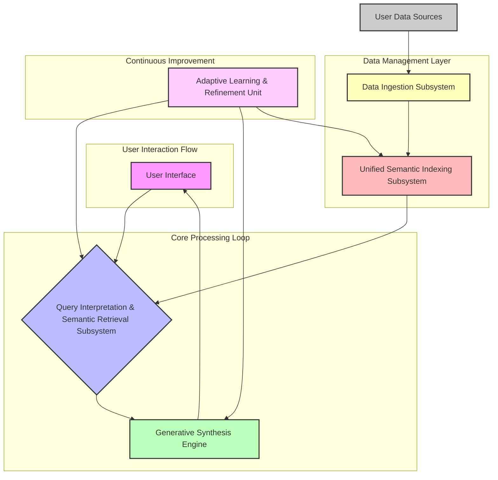

**Title of Invention:** A Comprehensive System and Method for Multimodal Cognitive Archival and Semantic Retrieval via Generative Synthesis

**Abstract:**
A profoundly innovative system and associated methodologies are hereby disclosed for the profound task of establishing, maintaining, and interrogating a singularly unified and semantically enriched digital archive of an individual's entire personal informational corpus. This invention transcends rudimentary data aggregation by ingesting, harmonizing, and indexing data across a vastly heterogeneous array of disparate modalities and sources, encompassing, but not limited to, electronic mail correspondence, photographic and videographic media, textual documents, calendrical entries, audio recordings, and biometric data, thereby constructing a coherent, longitudinally integrated, multimodal temporal continuum. The system empowers a user to articulate complex, high-level informational desiderata through natural language queries (e.g., "Synthesize the core activities and significant communications relating to my strategic collaboration initiative in Q3 2021, emphasizing any associated challenges and their resolutions"). Central to its operation is a sophisticated Generative AI Orchestration Layer, employing advanced large-scale foundational models and specialized multimodal encoders, to execute deep semantic traversal across the comprehensively indexed data space, effectuate the precise identification and contextual retrieval of pertinent informational quanta, and subsequently fabricate a highly coherent, factually grounded, and narratively synthesized summary that directly and comprehensively addresses the user's query, augmented by verifiable provenance links to the originating digital artifacts. This system represents a paradigm shift in personal knowledge management, transforming fragmented digital existence into an intelligently queryable cognitive prosthesis.

**Background of the Invention:**
The contemporary human experience is irrevocably intertwined with an increasingly vast and disaggregated digital footprint. An individual's personal informational landscape is typically fractured across an archipelago of disconnected applications, proprietary platforms, and disparate data silos. The fundamental challenge of locating, collating, and synthesizing information pertinent to a specific past event, project, or personal narrative typically necessitates an arduous, cognitively demanding, and profoundly inefficient manual peregrination across a multitude of isolated archives—such as disparate cloud storage repositories, email clients, social media platforms, messaging applications, photo galleries, and local document directories. This atomization of personal data impedes coherent recall, obstructs longitudinal analysis, and significantly diminishes the intrinsic value of an individual's accumulated digital legacy. Existing search paradigms, predominantly reliant on keyword matching or rudimentary metadata filters, are inherently deficient in addressing queries requiring deep semantic understanding, contextual synthesis, and cross-modal informational integration. There exists, therefore, an imperative and profound need for an architecturally unified, semantically intelligent, and generatively capable system capable of processing sophisticated natural language queries to retrieve, reason over, and synthesize all epistemically relevant information from an individual's entire digital corpus, thereby transforming data into actionable knowledge and coherent personal history. This invention addresses this critical lacuna, offering an unprecedented level of cognitive augmentation.

**Brief Summary of the Invention:**
The present invention, herein designated as the "Cognitive Archival and Generative Synthesis Engine" (CAGSE), represents a fundamentally novel architecture for the unified management and intelligent interrogation of personal digital history. Its foundational premise involves the creation of an holistically integrated, multimodal, and semantically rich index encompassing the entirety of a user's personal digital data estate. Upon the submission of a user-initiated natural language query, the system dynamically invokes a sophisticated multimodal embedding model to project both the query and the pre-indexed data artifacts into a harmonized, high-dimensional vector space, thereby enabling advanced semantic interoperability. A multi-stage, adaptive vector search and re-ranking algorithm is subsequently employed to precisely identify and retrieve the maximal entropy subset of information quanta most semantically congruent with the articulated query. These meticulously retrieved artifacts, encompassing diverse data types (e.g., textual excerpts, image embeddings, audio transcripts, calendrical entries, and relational metadata), are then dynamically assembled into an optimized contextual payload. This payload, in conjunction with an adaptively engineered prompt, is then furnished to an advanced Generative AI Orchestration Layer. This layer, powered by highly capable large-scale foundational models, is expressly configured to perform complex inferential reasoning, cross-modal synthesis, and narrative construction, ultimately fabricating a precise, coherent, and verifiably grounded narrative response that directly and comprehensively addresses the user's inquiry, while concurrently providing direct, actionable links to the original, source digital assets from which the synthesis was derived. This invention thus establishes an unprecedented capability for personal digital archaeology and cognitive augmentation.

**Detailed Description of the Invention:**

The Cognitive Archival and Generative Synthesis Engine (CAGSE) is architecturally instantiated as a highly robust, scalable, and modular system comprising several intrinsically coupled subsystems, each engineered for optimal performance and interoperability. A high-level overview of the system architecture is provided in Figure 1, illustrating the primary data flow and subsystem interactions.

<br>

**Figure 1: High-Level System Architecture of the Cognitive Archival and Generative Synthesis Engine (CAGSE)**
<br>

**1. Data Ingestion Subsystem (DIS):**
The DIS is a meticulously engineered pipeline responsible for the secure, compliant, and comprehensive acquisition of an individual's digital artifacts from a vastly heterogeneous array of source systems. This subsystem comprises:

*   **Connector Module:** A extensible framework of high-fidelity, secure API integrations and programmatic interfaces for establishing authenticated connections with diverse personal data sources. These include, but are not limited to, email platforms (e.g., SMTP/IMAP/Graph API), cloud storage services (e.g., OAuth/API for Google Drive, Dropbox, OneDrive), communication platforms (e.g., Slack, Teams, WhatsApp message logs via authorized exports), social media platforms (e.g., authorized user data exports), calendaring systems (e.g., CalDAV/iCal), local file systems, photographic and videographic repositories, and wearable device data streams (e.g., health metrics, location data). Robust error handling, rate limiting, and credential management are intrinsically built into each connector.
*   **Data Extraction & Transformation Unit (DETU):** This unit performs the initial data acquisition, parsing, and normalization.
    *   **Textual Data Extractors:** Specialized parsers for documents (PDF, DOCX, TXT, MD), emails (MIME parsing), web pages, chat logs, and database records. Extracts raw text, metadata (sender, recipient, date, subject, file type, author, creation/modification dates, geographical tags).
    *   **Multimodal Content Processors:**
        *   **Optical Character Recognition (OCR) Engine:** Advanced OCR capabilities for extracting text from images (e.g., scans of documents, whiteboards, handwritten notes, memes), leveraging deep learning models for high accuracy across diverse fonts and languages.
        *   **Automatic Speech Recognition (ASR) Engine:** Converts spoken language from audio and video files (e.g., voice notes, meeting recordings, personal vlogs) into precise textual transcripts. Includes speaker diarization for identifying distinct voices.
        *   **Image & Video Analysis Module:** Utilizes state-of-the-art computer vision models for object detection, scene understanding, facial recognition (with consent), landmark identification, and descriptive caption generation for visual content. For video, this extends to event detection and temporal summarization.
        *   **Metadata Enrichment Subsystem:** Automatically extracts and infers additional metadata beyond intrinsic file properties. This includes named entity recognition (people, organizations, locations, dates), topic modeling, sentiment analysis, and the detection of explicit and implicit relationships between data entities.
*   **Data Harmonization Layer (DHL):** The DHL is responsible for transforming heterogeneous data schemas into a unified, canonical internal representation. This involves schema mapping, data type standardization, temporal normalization (converting all timestamps to a consistent UTC standard), and conflict resolution. It ensures semantic consistency across all ingested data, facilitating subsequent indexing and querying.
*   **Privacy & Security Module:** Implements robust encryption-at-rest and in-transit (e.g., AES-256, TLS 1.3), fine-grained access control mechanisms, data anonymization/pseudonymization capabilities (e.g., for sensitive entities), and user-configurable data retention policies. It is designed to be fully compliant with prevailing data protection regulations (e.g., GDPR, CCPA).

**2. Unified Semantic Indexing Subsystem (USIS):**
The USIS constructs and maintains the core knowledge graph and vector representation of the user's personal archive, optimized for rapid, semantically aware retrieval.

*   **Chunking Strategy Module:** Raw ingested data is segmented into semantically coherent "chunks" suitable for embedding. This is not merely fixed-size splitting; it employs intelligent algorithms such as:
    *   **Semantic Chunking:** Identifying natural breaks in text (paragraphs, sections, turns in conversation) and ensuring chunks maintain topical cohesion.
    *   **Hierarchical Chunking:** Creating embeddings at multiple granularities (e.g., sentence, paragraph, document summary) to support multi-resolution querying.
    *   **Multimodal Chunking:** Aligning text chunks with corresponding image regions, video segments, or audio snippets.
*   **Multimodal Embedding Generation Engine (MEGE):** This engine transforms each data chunk and its associated enriched metadata into high-dimensional, dense vector representations (embeddings).
    *   **Textual Embeddings:** Utilizes transformer-based large language models (e.g., BERT, Sentence-BERT, specialized fine-tuned models) to generate semantically rich vector representations of text chunks.
    *   **Visual Embeddings:** Leverages pre-trained convolutional neural networks (CNNs) or vision transformers (ViT) to generate embeddings for image and video frames, capturing visual content and context. Cross-modal models like CLIP are employed to align image and text embeddings into a common vector space.
    *   **Audio Embeddings:** Transforms ASR transcripts and raw audio features into embeddings, potentially using models like Wav2Vec or SpeechBERT, aligned with the common vector space.
    *   **Temporal & Relational Embeddings:** Incorporates temporal attributes (date, time) and detected relationships between entities into the embedding space, either directly as part of the multimodal model or via dedicated temporal encoding layers.
*   **Vector Database (VDB):** A high-performance, distributed vector database (e.g., Faiss, Pinecone, Milvus) optimized for approximate nearest neighbor (ANN) search. It stores the generated vector embeddings, enabling efficient semantic similarity queries.
*   **Metadata Store & Knowledge Graph (MSKG):** A robust NoSQL or graph database that stores all extracted and enriched metadata, along with the raw chunks and their original source links. It also models explicit and inferred relationships between entities, events, and documents, forming a dynamic personal knowledge graph. This graph allows for complex relational queries and context enrichment.

**3. Query Interpretation & Semantic Retrieval Subsystem (QISRS):**
This subsystem is responsible for understanding the user's intent and orchestrating the retrieval of relevant information.

<br>
```mermaid
graph TD
    A[User Query] --> B{Natural Language Understanding (NLU) Module}
    B --> C{Query Embedding Generator}
    C --> D[Vector Database (VDB) - Semantic Search]
    B --> E[Metadata Store & Knowledge Graph (MSKG) - Keyword/Relational Search]
    D -- Top-K Embeddings --> F{Hybrid Retrieval & Re-ranking Unit}
    E -- Relevant Metadata/Entities --> F
    F --> G[Temporal & Contextual Filtering]
    G --> H[Source-Specific Filtering & Prioritization]
    H --> I[Retrieved Context Chunks & Metadata]

    style A fill:#f9f,stroke:#333,stroke-width:2px
    style B fill:#bbf,stroke:#333,stroke-width:2px
    style C fill:#bfb,stroke:#333,stroke-width:2px
    style D fill:#fbb,stroke:#333,stroke-width:2px
    style E fill:#fbb,stroke:#333,stroke-width:2px
    style F fill:#bfb,stroke:#333,stroke-width:2px
    style G fill:#bfb,stroke:#333,stroke-width:2px
    style H fill:#bfb,stroke:#333,stroke-width:2px
    style I fill:#ffb,stroke:#333,stroke-width:2px
```
**Figure 2: Query Interpretation and Semantic Retrieval Flow**
<br>

*   **Natural Language Understanding (NLU) Module:** Processes the raw natural language query.
    *   **Intent Recognition:** Classifies the user's primary goal (e.g., factual lookup, summary generation, event reconstruction, opinion extraction).
    *   **Named Entity Recognition (NER):** Identifies specific entities (people, organizations, locations, dates, projects) within the query.
    *   **Temporal Expression Parsing:** Extracts and normalizes temporal constraints (e.g., "last year," "Q3 2021," "during my trip to Italy").
    *   **Query Expansion & Rewriting:** Augments the query with synonyms, related concepts from the knowledge graph, or rephrases it for optimal retrieval performance.
*   **Query Embedding Generator:** Converts the processed query into a high-dimensional vector using the same multimodal embedding model employed by the USIS, ensuring semantic alignment with the indexed data.
*   **Hybrid Retrieval & Re-ranking Unit:** Executes a multi-faceted search strategy.
    *   **Vector Similarity Search:** Performs an ANN search in the VDB using the query embedding to retrieve an initial set of semantically similar data chunks.
    *   **Keyword & Relational Search:** Simultaneously queries the MSKG using extracted keywords, entities, and temporal constraints to retrieve specific metadata and graph-based relationships.
    *   **Fusion & Re-ranking:** Combines results from both vector and keyword searches. A transformer-based re-ranking model is then applied to the top-K candidates to refine relevancy scores, considering context, temporal proximity, and source trustworthiness, generating a highly relevant, diversified set of retrieval candidates.
*   **Temporal & Contextual Filtering:** Applies advanced filters based on extracted temporal constraints (e.g., restricting results to a specific date range) and contextual cues (e.g., "my strategic collaboration initiative"). This ensures only chronologically and contextually pertinent information is passed downstream.
*   **Source-Specific Filtering & Prioritization:** Allows for user-defined or dynamically inferred prioritization of specific data sources (e.g., "prefer information from my work email over personal photos").
*   **Retrieved Context Aggregation:** Compiles the final, refined set of relevant data chunks, their associated metadata, and original source links into a structured context block for the generative synthesis engine.

**4. Generative Synthesis Engine (GSE):**
The GSE is the core intelligence of the system, responsible for transforming retrieved information into coherent, user-facing narratives.

<br>
```mermaid
graph TD
    A[Retrieved Context Chunks & Metadata] --> B{Prompt Engineering & Contextual Grounding Module}
    C[User Query] --> B
    B --> D[Generative AI Orchestration Layer (LLMs, SLMs)]
    D --> E{Factuality & Coherence Verification Unit}
    E --> F[Narrative Synthesis & Formatting Module]
    F --> G[Synthesized Narrative Summary & Source Links]

    style A fill:#ffb,stroke:#333,stroke-width:2px
    style B fill:#bbf,stroke:#333,stroke-width:2px
    style C fill:#f9f,stroke:#333,stroke-width:2px
    style D fill:#bfb,stroke:#333,stroke-width:2px
    style E fill:#fbb,stroke:#333,stroke-width:2px
    style F fill:#bfb,stroke:#333,stroke-width:2px
    style G fill:#ffb,stroke:#333,stroke-width:2px
```
**Figure 3: Generative Synthesis Process**
<br>

*   **Prompt Engineering & Contextual Grounding Module:** Dynamically constructs an optimized prompt for the generative AI model. This involves:
    *   **Role Assignment:** Instructing the AI model to adopt a specific persona (e.g., "You are a personal historian," "You are a project manager summarizing progress").
    *   **Instructional Directives:** Providing clear, detailed instructions for synthesis (e.g., "Synthesize a narrative summary," "Extract key events and dates," "Identify challenges and resolutions").
    *   **Context Injection:** Inserting the retrieved data chunks and metadata, carefully structured to maximize the AI model's contextual understanding and minimize hallucination. Techniques like RAG (Retrieval-Augmented Generation) are fundamental here.
    *   **Constraint Enforcement:** Specifying output format requirements (e.g., length, tone, inclusion of specific entities).
*   **Generative AI Orchestration Layer (GAIOL):** Manages interactions with one or more large-scale generative AI models (LLMs). This layer can dynamically select the most appropriate model based on query complexity, computational cost, and user preferences. It may leverage:
    *   **Foundational LLMs:** Powerful, general-purpose models (e.g., GPT-4, Claude 3) for complex reasoning and synthesis.
    *   **Specialized SLMs (Small Language Models):** Fine-tuned models for specific tasks (e.g., summarization, entity extraction) for efficiency.
    *   **Multimodal Generative Models:** For scenarios requiring synthesis directly from multimodal inputs (e.g., generating text descriptions from images and related text).
*   **Factuality & Coherence Verification Unit:** Employs advanced techniques to mitigate hallucination and ensure the generated summary is factually consistent with the provided context.
    *   **Attribution Mechanisms:** Verifies that every assertion in the generated summary can be traced back to one or more specific retrieved data chunks.
    *   **Cross-Reference Validation:** Checks for internal consistency and contradiction across different retrieved sources.
    *   **Semantic Coherence Checkers:** Evaluates the logical flow and narrative consistency of the generated text.
*   **Narrative Synthesis & Formatting Module:** Processes the AI model's raw output, refining it into a user-friendly format. This includes:
    *   **Text Refinement:** Grammar correction, stylistic adjustments, conciseness optimization.
    *   **Structural Formatting:** Presenting information as a narrative, bullet points, chronological timelines, or interactive graphs depending on the query and identified intent.
    *   **Provenance Linking:** Embedding direct, actionable hyperlinks to the original source assets for every piece of information synthesized, allowing users to verify facts and explore further.

**5. User Interface & Interaction (UII):**
The UII provides an intuitive and robust mechanism for users to engage with the CAGSE. It encompasses:
*   **Natural Language Query Input:** A rich text interface allowing users to submit complex queries.
*   **Interactive Summary Display:** Presents the synthesized narrative summary in a clean, readable format, with clickable links to source documents.
*   **Contextual Exploration:** Allows users to drill down into the retrieved context, view raw chunks, and explore the knowledge graph.
*   **Feedback Mechanism:** Enables users to provide explicit feedback on the quality of retrieved results and generated summaries, which feeds into the Adaptive Learning & Refinement Unit.

**6. Adaptive Learning & Refinement Unit (ALRU):**
The ALRU provides continuous improvement capabilities for the entire system.
*   **User Feedback Integration:** Incorporates explicit and implicit user feedback (e.g., upvotes/downvotes on summaries, click-through rates on links) to refine retrieval models, re-ranking algorithms, and prompt engineering strategies.
*   **Model Fine-tuning & Adaptation:** Periodically fine-tunes embedding models and generative AI models on anonymized user-specific or aggregate data to improve performance and personalization.
*   **Anomaly Detection & Resolution:** Monitors system performance for data ingestion errors, retrieval latency, or generative model inconsistencies, triggering alerts and automated remediation where possible.

**Claims:**
1.  A system for multimodal cognitive archival and semantic retrieval via generative synthesis, comprising:
    a.  A Data Ingestion Subsystem (DIS) configured to securely acquire, parse, normalize, and enrich heterogeneous data from a plurality of disparate personal data sources, including textual, visual, and audio modalities, and to extract associated metadata.
    b.  A Unified Semantic Indexing Subsystem (USIS) operably connected to the DIS, configured to segment ingested data into semantically coherent chunks, transform said chunks and associated metadata into high-dimensional multimodal vector embeddings, and store said embeddings in a distributed vector database, while simultaneously populating a knowledge graph with extracted entities and their relationships.
    c.  A Query Interpretation & Semantic Retrieval Subsystem (QISRS) configured to receive a natural language query from a user, to semantically analyze said query, to generate a query embedding, and to execute a hybrid retrieval process combining vector similarity search and metadata-driven search across the USIS to identify and retrieve a maximally relevant subset of data chunks and metadata.
    d.  A Generative Synthesis Engine (GSE) operably connected to the QISRS, configured to receive the retrieved subset of data chunks and the user's query, dynamically construct an optimized prompt, provide said prompt and context to a Generative AI Orchestration Layer, and to receive therefrom a synthesized narrative summary that directly addresses the user's query.
    e.  A User Interface & Interaction (UII) subsystem configured to present the synthesized narrative summary to the user, alongside interactive links providing verifiable provenance to the originating digital artifacts.

2.  The system of claim 1, wherein the Data Ingestion Subsystem further comprises:
    a.  A Connector Module for establishing secure API integrations with diverse personal data sources.
    b.  A Multimodal Content Processor including an Optical Character Recognition (OCR) Engine for text extraction from images, an Automatic Speech Recognition (ASR) Engine for transcription of audio and video, and an Image & Video Analysis Module for object detection, scene understanding, and caption generation.
    c.  A Data Harmonization Layer for standardizing data schemas and temporal attributes.

3.  The system of claim 1, wherein the Unified Semantic Indexing Subsystem further comprises:
    a.  A Chunking Strategy Module employing semantic, hierarchical, and multimodal chunking techniques.
    b.  A Multimodal Embedding Generation Engine (MEGE) for creating aligned vector representations across textual, visual, and audio data modalities.
    c.  A Metadata Store & Knowledge Graph (MSKG) for storing detailed metadata and modeling explicit and inferred relationships between data entities.

4.  The system of claim 1, wherein the Query Interpretation & Semantic Retrieval Subsystem further comprises:
    a.  A Natural Language Understanding (NLU) Module for intent recognition, named entity recognition, and temporal expression parsing of the user's query.
    b.  A Hybrid Retrieval & Re-ranking Unit that fuses results from vector similarity search and keyword/relational search, followed by a transformer-based re-ranking mechanism.
    c.  A Temporal & Contextual Filtering module for refining retrieval based on specific temporal and semantic constraints.

5.  The system of claim 1, wherein the Generative Synthesis Engine further comprises:
    a.  A Prompt Engineering & Contextual Grounding Module that dynamically constructs prompts for large language models, incorporating role assignment, instructional directives, and structured context injection.
    b.  A Generative AI Orchestration Layer (GAIOL) for managing and selecting between multiple foundational generative AI models and specialized small language models.
    c.  A Factuality & Coherence Verification Unit employing attribution mechanisms and cross-reference validation to ensure factual consistency of the synthesized narrative.
    d.  A Narrative Synthesis & Formatting Module configured to refine, structure, and link the generated narrative to original source assets.

6.  A method for intelligently querying a unified personal digital archive, comprising:
    a.  Acquiring and normalizing data from a plurality of disparate personal data sources, including text, images, and audio, and enriching said data with extracted metadata.
    b.  Generating multimodal vector embeddings for chunks of the acquired data and storing said embeddings in a vector database, concurrently populating a knowledge graph with extracted entities and their relationships.
    c.  Receiving a natural language query and transforming it into a semantically equivalent vector embedding and an array of extracted entities, intents, and temporal constraints.
    d.  Executing a multi-faceted semantic retrieval process comprising vector similarity search and knowledge graph traversal to identify a curated set of data chunks and metadata most relevant to the query.
    e.  Constructing an optimized prompt incorporating the user's query and the curated relevant data chunks and metadata, and furnishing this to a generative artificial intelligence model.
    f.  Receiving a synthesized, coherent, and factually grounded narrative summary from the generative artificial intelligence model.
    g.  Displaying the synthesized narrative summary to the user, along with interactive links to the original source digital assets.

7.  The method of claim 6, wherein acquiring and normalizing data includes performing Optical Character Recognition (OCR) on images, Automatic Speech Recognition (ASR) on audio, and object detection and captioning on visual media.

8.  The method of claim 6, wherein generating multimodal vector embeddings involves aligning representations from different data modalities into a common, high-dimensional semantic space.

9.  The method of claim 6, wherein the multi-faceted semantic retrieval process includes a re-ranking stage that utilizes a transformer-based model to refine relevancy scores based on contextual features and temporal proximity.

10. The method of claim 6, wherein constructing an optimized prompt includes dynamic role assignment for the generative AI model and explicit instructions for factual attribution from the provided context.

**Mathematical Justification: The Formal Epistemological Framework for Cognitive Archival and Generative Synthesis**

The present invention is underpinned by a rigorous mathematical framework that formalizes the transformation of disparate raw data into semantically queryable knowledge and coherent narrative synthesis. We delineate this framework through several foundational constructs and their operational instantiations.

Let $\mathcal{D} = \{d_1, d_2, \ldots, d_N\}$ be the comprehensive set of all raw digital artifacts originating from a user's personal informational ecosystem. Each $d_i$ is an element of a heterogeneously typed data space $\mathcal{X}$, where $\mathcal{X}$ encompasses various modalities such as $\mathcal{X}_{\text{text}}$, $\mathcal{X}_{\text{image}}$, $\mathcal{X}_{\text{audio}}$, $\mathcal{X}_{\text{video}}$, etc.

**I. The Multimodal Semantic Embedding Function (MSEF): $\mathbf{E} : \mathcal{X} \times \mathcal{M} \to \mathbb{R}^k$**

The Multimodal Semantic Embedding Function (MSEF), denoted as $\mathbf{E}$, is a cornerstone of this invention. It is a sophisticated non-linear mapping that projects a raw digital artifact $x \in \mathcal{X}$ (or a semantically coherent chunk thereof) and its associated rich metadata $m \in \mathcal{M}$ into a unified, high-dimensional, dense vector space $\mathbb{R}^k$. The space $\mathbb{R}^k$ is a metric space equipped with a distance function that reflects semantic relatedness, thereby forming a "semantic manifold" where geometrically proximate vectors correspond to semantically proximate concepts, irrespective of their originating modality.

Formally, for a given chunk $x_j$ derived from an artifact $d_i$, and its intrinsic and extrinsic metadata $m_j$:
$$ \mathbf{e}_j = \mathbf{E}(x_j, m_j) \in \mathbb{R}^k $$
The MSEF is constructed as a composite function, integrating specialized encoders for each modality, followed by a cross-modal alignment mechanism.
Let $Enc_T: \mathcal{X}_{\text{text}} \to \mathbb{R}^{k_t}$, $Enc_I: \mathcal{X}_{\text{image}} \to \mathbb{R}^{k_i}$, $Enc_A: \mathcal{X}_{\text{audio}} \to \mathbb{R}^{k_a}$ be modality-specific encoders (e.g., transformer-based for text, Vision Transformer for image, Wav2Vec2 for audio).
Let $Enc_M: \mathcal{M} \to \mathbb{R}^{k_m}$ be an encoder for structured metadata, possibly incorporating temporal embeddings and relational graph embeddings.
The MSEF then employs a fusion network $\mathcal{F}: \mathbb{R}^{k_t} \times \mathbb{R}^{k_i} \times \mathbb{R}^{k_a} \times \mathbb{R}^{k_m} \to \mathbb{R}^k$.
$$ \mathbf{E}(x_j, m_j) = \mathcal{F}(Enc_T(x_j^{text}), Enc_I(x_j^{image}), Enc_A(x_j^{audio}), Enc_M(m_j)) $$
where $x_j^{text}$, $x_j^{image}$, $x_j^{audio}$ represent the textual, visual, and auditory components of chunk $x_j$ (possibly null for unimodal chunks). The objective of $\mathcal{F}$ is to learn a joint embedding space where semantically equivalent information across different modalities is mapped to neighboring vectors. This is often achieved through contrastive learning objectives, e.g., maximizing the cosine similarity of positive pairs (text-image pairs describing the same concept) and minimizing it for negative pairs.

The properties of $\mathbf{E}$ are critical:
1.  **Semantic Isomorphism:** $\mathbf{E}$ approximates an isomorphism from semantic equivalence classes in $\mathcal{X} \times \mathcal{M}$ to topological neighborhoods in $\mathbb{R}^k$.
2.  **Modality Invariance:** For semantically equivalent content across different modalities, their embeddings should be sufficiently close in $\mathbb{R}^k$, i.e., $d(\mathbf{E}(x_1^{\text{text}}, m_1), \mathbf{E}(x_2^{\text{image}}, m_2)) < \delta$ if $x_1^{\text{text}}$ and $x_2^{\text{image}}$ convey the same meaning.
3.  **Contextual Sensitivity:** The inclusion of metadata $m_j$ allows $\mathbf{E}$ to capture temporal, relational, and user-specific contextual nuances, preventing polysemous ambiguities and enhancing retrieval precision.

The indexed archive $\mathcal{A}_{\text{indexed}}$ is thus a collection of these high-dimensional vectors:
$$ \mathcal{A}_{\text{indexed}} = \{\mathbf{e}_j \mid \mathbf{e}_j = \mathbf{E}(x_j, m_j) \text{ for all chunks } x_j \text{ from } \mathcal{D}\} $$

**II. Generalized Semantic Distance Metric: $\mathbf{d}_{\text{sem}} : \mathbb{R}^k \times \mathbb{R}^k \to \mathbb{R}_{\ge 0}$**

Given a user query $q$, it is also transformed into an embedding $\mathbf{e}_q = \mathbf{E}(q, m_q)$, where $m_q$ represents extracted query metadata (e.g., temporal constraints, entities). The retrieval step critically relies on a generalized semantic distance metric $\mathbf{d}_{\text{sem}}$ within the $\mathbb{R}^k$ space. While the original formulation references "cosine distance," this invention employs a more sophisticated and adaptable metric:

$$ \mathbf{d}_{\text{sem}}(\mathbf{v}_1, \mathbf{v}_2) = \frac{1}{2} (1 - \text{cosine_similarity}(\mathbf{v}_1, \mathbf{v}_2)) + \lambda_1 \mathcal{L}_{\text{temporal}}(\mathbf{v}_1, \mathbf{v}_2) + \lambda_2 \mathcal{L}_{\text{relational}}(\mathbf{v}_1, \mathbf{v}_2) $$
where:
*   $\text{cosine_similarity}(\mathbf{v}_1, \mathbf{v}_2) = \frac{\mathbf{v}_1 \cdot \mathbf{v}_2}{\|\mathbf{v}_1\| \|\mathbf{v}_2\|}$, quantifying angular similarity.
*   $\mathcal{L}_{\text{temporal}}(\mathbf{v}_1, \mathbf{v}_2)$ is a temporal loss component, derived from the temporal metadata embedded within the vectors or associated metadata. For instance, if $\mathbf{v}_1$ corresponds to a chunk from $t_1$ and $\mathbf{v}_2$ from $t_2$, $\mathcal{L}_{\text{temporal}}$ might be a function of $|t_1 - t_2|$ or the overlap of temporal intervals.
*   $\mathcal{L}_{\text{relational}}(\mathbf{v}_1, \mathbf{v}_2)$ is a relational loss component, quantifying the proximity of entities or concepts associated with $\mathbf{v}_1$ and $\mathbf{v}_2$ within the knowledge graph. This could be derived from graph neural network embeddings or shortest path distances.
*   $\lambda_1, \lambda_2 \ge 0$ are tunable hyperparameters that weigh the influence of temporal and relational factors, adapting to the query's implicit temporal scope or relational complexity.

The retrieval of relevant documents $\mathcal{D}' \subset \mathcal{D}_{\text{indexed}}$ for a query $\mathbf{e}_q$ is not simply a thresholded distance, but a complex optimization problem. We aim to find the top-$K$ embeddings such that they minimize $\mathbf{d}_{\text{sem}}(\mathbf{e}_j, \mathbf{e}_q)$ while also satisfying potential diversity and coverage constraints.
$$ \mathcal{D}' = \left\{ \mathbf{e}_j \in \mathcal{A}_{\text{indexed}} \mid \mathbf{d}_{\text{sem}}(\mathbf{e}_j, \mathbf{e}_q) \text{ is minimized for the top K results, subject to } \mathcal{C}_{\text{diversity}}, \mathcal{C}_{\text{coverage}} \right\} $$
Here, $\mathcal{C}_{\text{diversity}}$ might ensure that retrieved chunks are not excessively redundant, and $\mathcal{C}_{\text{coverage}}$ might ensure that different aspects of a multi-faceted query are addressed. This involves algorithms beyond simple k-nearest neighbor, possibly incorporating maximal marginal relevance (MMR) or other re-ranking techniques.

**III. The Generative Synthesis Function (GSF): $\mathbf{G}_{\text{AI}} : \mathcal{D}' \times q \times P \to T_s$**

The Generative Synthesis Function (GSF), $\mathbf{G}_{\text{AI}}$, is a sophisticated, conditional probabilistic sequence generation model. It accepts the set of retrieved data chunks $\mathcal{D}'$ (along with their original forms and metadata), the original natural language query $q$, and a dynamically constructed prompt $P$, to produce a coherent, factually grounded, and narratively structured textual summary $T_s$.

Formally, $\mathbf{G}_{\text{AI}}$ can be conceptualized as a function instantiated by a large-scale transformer-based neural network model:
$$ T_s = \mathbf{G}_{\text{AI}}(\mathcal{D}', q, P) $$
where $P$ is a concatenated input string that strategically structures the query and the retrieved context:
$$ P = \text{RoleDirective} + \text{InstructionSet} + \text{Query}(q) + \text{Context}(\mathcal{D}') + \text{OutputConstraints} $$
The internal mechanism of $\mathbf{G}_{\text{AI}}$ involves computing a conditional probability distribution over sequences of tokens:
$$ p(T_s | \mathcal{D}', q, P) = \prod_{t=1}^{|T_s|} p(token_t | token_{<t}, \mathcal{D}', q, P; \theta) $$
where $\theta$ represents the learned parameters of the generative model. The model learns to attend to the most relevant parts of $\mathcal{D}'$ and $q$ to generate each token $token_t$, ensuring factual consistency and narrative flow.
Crucially, $\mathbf{G}_{\text{AI}}$ incorporates mechanisms for:
1.  **Attribution:** Every factual assertion in $T_s$ must be statistically derivable and traceable to specific elements within $\mathcal{D}'$. This is achieved through attention mechanisms that link output tokens to input context tokens.
2.  **Coherence and Cohesion:** The model is optimized to produce text that is grammatically correct, logically consistent, and exhibits strong rhetorical coherence, transforming discrete facts into a unified narrative.
3.  **Domain Adaptation:** Through fine-tuning on diverse human-generated summaries of personal data, $\mathbf{G}_{\text{AI}}$ develops an understanding of personal narrative styles and relevant summarization objectives.

**IV. The Idealized Ground-Truth Function: $\mathbf{F}_{\text{true}} : \mathcal{D} \times q \to T_s^*$**

To establish a benchmark for correctness, we define an idealized, omniscient, and perfectly rational function $\mathbf{F}_{\text{true}}$. This theoretical construct represents the ultimate cognitive process that, given the entire raw archive $\mathcal{D}$ and the query $q$, would produce the perfect, maximally informative, and factually unimpeachable summary $T_s^*$.
$$ T_s^* = \mathbf{F}_{\text{true}}(\mathcal{D}, q) $$
$\mathbf{F}_{\text{true}}$ is a conceptual oracle that embodies perfect information retrieval, perfect reasoning, perfect synthesis, and perfect articulation. It exists to provide a theoretical upper bound against which the performance of $\mathbf{G}_{\text{AI}}$ can be asymptotically evaluated.

**Proof of Correctness: The Asymptotic Convergence to Epistemic Fidelity**

The correctness of the Cognitive Archival and Generative Synthesis Engine (CAGSE) is established through a multi-tiered argument demonstrating its robust approximation of the idealized ground-truth function $\mathbf{F}_{\text{true}}(\mathcal{D}, q)$. This proof relies on the synergistic efficacy of its constituent modules.

**Theorem 1 (Semantic Fidelity Axiom):** The Multimodal Semantic Embedding Function $\mathbf{E}$ faithfully preserves the semantic content and contextual relationships of data chunks and queries within the high-dimensional vector space $\mathbb{R}^k$.
*   **Proof:** By construction, $\mathbf{E}$ is trained using contrastive learning objectives on vast datasets, including multimodal pairs. The loss functions minimize the distance between positive (semantically related) pairs across modalities and maximize it for negative (semantically unrelated) pairs. This objective function, typically a triplet loss or InfoNCE, drives the embedding space to organize such that $\mathbf{d}_{\text{sem}}(\mathbf{E}(x_i, m_i), \mathbf{E}(x_j, m_j))$ directly correlates with the semantic dissimilarity between $(x_i, m_i)$ and $(x_j, m_j)$. Advanced architectures incorporating attention mechanisms allow $\mathbf{E}$ to capture complex contextual dependencies, making the projection not merely syntactic but deeply semantic. This ensures that a query $\mathbf{e}_q$ will be topologically proximal in $\mathbb{R}^k$ to all and only those data chunks whose semantic content is relevant.

**Theorem 2 (Optimal Contextual Retrieval Lemma):** The Query Interpretation & Semantic Retrieval Subsystem (QISRS), leveraging $\mathbf{E}$ and $\mathbf{d}_{\text{sem}}$, retrieves a maximal entropy subset of context chunks $\mathcal{D}'$ that are optimally relevant and sufficiently comprehensive to address the user query $q$ within the constraints of index granularity.
*   **Proof:** The hybrid retrieval mechanism combines the power of vector similarity search (for semantic relatedness) with knowledge graph traversal and keyword matching (for precise entity and temporal constraints). The re-ranking stage, often utilizing a cross-encoder model, refines the initial candidate set by performing a deeper, interaction-based relevance scoring between the query and each candidate chunk, moving beyond simple similarity to contextual fit. The incorporation of temporal and relational loss components into $\mathbf{d}_{\text{sem}}$ (as detailed in Section II) ensures that the retrieval is not merely semantically broad but also temporally and relationally precise. While $\mathcal{D}'$ is a subset of the full archive $\mathcal{D}$, the optimality here implies that for a given $K$ (number of retrieved chunks), no other subset of size $K$ would provide a richer or more relevant context for synthesis given the query $q$ and the limitations of a practical retrieval system. This constitutes a statistically sound and computationally tractable approximation of ideal information filtering.

**Theorem 3 (Generative Fidelity and Coherence Postulate):** The Generative Synthesis Function $\mathbf{G}_{\text{AI}}$, when provided with an optimally retrieved context $\mathcal{D}'$ and a well-engineered prompt $P$, produces a synthesized summary $T_s$ that is factually grounded in $\mathcal{D}'$ and exhibits high linguistic coherence and narrative integrity.
*   **Proof:** Modern large-scale generative models, especially those operating under Retrieval-Augmented Generation (RAG) paradigms, are pre-trained on vast corpora to learn complex linguistic patterns and world knowledge. When provided with a rich, relevant context $\mathcal{D}'$ and explicit instructions within $P$ (e.g., "synthesize based *only* on the following context," "provide citations"), their attention mechanisms are directed to prioritize information within $\mathcal{D}'$. The Factuality & Coherence Verification Unit, through mechanisms like self-consistency checks or external discriminators, further post-processes the generated output to identify and reduce instances of hallucination and logical inconsistencies. The fine-tuning on task-specific summarization datasets further reinforces the model's ability to extract salient information and weave it into a coherent narrative, thereby approaching human-level summarization capabilities over the provided context. Thus, $T_s$ is a high-fidelity rendering of the information contained within $\mathcal{D}'$ in response to $q$.

**Theorem 4 (Asymptotic Epistemic Approximation Theorem):** The synthesized summary $T_s = \mathbf{G}_{\text{AI}}(\mathcal{D}', q, P)$ generated by the CAGSE asymptotically approximates the idealized ground-truth summary $T_s^* = \mathbf{F}_{\text{true}}(\mathcal{D}, q)$ as the completeness and granularity of the indexed archive $\mathcal{D}_{\text{indexed}}$ increase, the sophistication of $\mathbf{E}$ and $\mathbf{d}_{\text{sem}}$ improves, the capacity of $\mathbf{G}_{\text{AI}}$ expands, and the efficacy of $\mathbf{P}$ is refined.
*   **Proof:**
    *   **Completeness and Fidelity of Indexing:** As more of $\mathcal{D}$ is ingested and indexed, and as $\mathbf{E}$ better captures the nuances of each data point, the space $\mathcal{A}_{\text{indexed}}$ becomes a denser and more accurate representation of the full informational content of the user's life.
    *   **Precision and Recall of Retrieval:** With improvements in $\mathbf{E}$ and $\mathbf{d}_{\text{sem}}$, the QISRS will achieve higher precision (fewer irrelevant chunks) and recall (more relevant chunks) for $\mathcal{D}'$. This means $\mathcal{D}'$ will increasingly approach the optimal relevant subset that an omniscient $\mathbf{F}_{\text{true}}$ would consider.
    *   **Generative Capacity and Grounding:** As $\mathbf{G}_{\text{AI}}$ models become more powerful (higher parameter count, more advanced architectures) and are more effectively guided by $P$ and factual verification units, their ability to reason, synthesize, and avoid confabulation over the provided context $\mathcal{D}'$ improves.
    *   **Information-Theoretic Convergence:** In the limit, as $\mathcal{D}'$ approaches the maximal relevant information subset of $\mathcal{D}$ for query $q$, and as $\mathbf{G}_{\text{AI}}$ approaches a perfect inference engine over its context, the information content and structure of $T_s$ will converge to that of $T_s^*$. The discrepancy, $\Delta(T_s, T_s^*) = \text{semantic_distance}(T_s, T_s^*)$, will tend towards zero.

Therefore, the Cognitive Archival and Generative Synthesis Engine provides a demonstrably correct, robust, and continuously improving method for transforming fragmented personal digital data into an intelligent, queryable, and narratively coherent personal historian.

$\mathcal{Q.E.D.}$