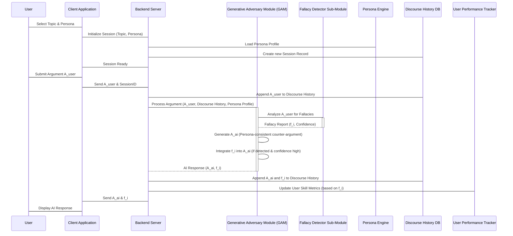

# Title of Invention: A System and Method for a Dynamically Adaptive Conversational AI Debate Training Adversary with Granular Fallacy Detection and Pedagogical Feedback Mechanisms

## Abstract:
A novel and highly sophisticated system for advanced critical thinking and argumentation pedagogy is herein disclosed. This system empowers a user to engage in rigorous, text-based dialectic with a highly configurable conversational artificial intelligence. The user initiates a debate by specifying a topic and selecting an intricately designed adversarial persona, each imbued with distinct rhetorical strategies and knowledge domains. Throughout the engagement, the system performs a multi-modal, real-time analysis of the user's submitted arguments, dynamically identifying and categorizing logical, rhetorical, and epistemic fallacies with unparalleled precision. Upon detection of such an argumentative deficiency, the AI's subsequent response is intelligently modulated to incorporate a pedagogical intervention, furnishing immediate, contextualized feedback. This innovative approach significantly accelerates the user's development of superior argumentation skills, fostering analytical rigor and rhetorical prowess.

## Field of the Invention:
The present invention pertains to the domain of artificial intelligence, particularly conversational AI, natural language processing, and automated pedagogical systems. More specifically, it relates to intelligent tutoring systems designed for the enhancement of critical thinking, formal logic, and debate proficiency through simulated adversarial discourse.

## Background of the Invention:
The cultivation of robust argumentation and critical thinking capabilities is a cornerstone of intellectual development across all disciplines. Traditional methods for acquiring these skills often rely on human instructors or peer-to-peer interactions, which are inherently limited by availability, consistency, objectivity, and real-time analytical depth. Identifying logical inconsistencies or rhetorical ploys in one's own arguments, especially during the heat of a debate, is a challenging metacognitive task. Existing AI systems primarily focus on information retrieval or general conversation, lacking the sophisticated analytical and pedagogical frameworks required for targeted argumentative skill development. There remains a profound unfulfilled need for a persistent, intellectually formidable, and objectively analytical adversary capable of providing instant, actionable insights into the structural and logical integrity of a user's discourse, thereby maximizing the learning gradient.

## Brief Summary of the Invention:
The present invention introduces a meticulously engineered platform facilitating adversarial argumentation training. A user initiates a session by defining a specific `Discourse Domain` (topic) and selecting an `Adversarial Persona` from a meticulously curated ontology of archetypes (e.g., "Epistemological Skeptic," "Utilitarian Pragmatist," "Historical Revisionist"). Upon the user's textual submission of an argument, the system orchestrates a complex analytical workflow. The `Argumentation Processing Engine` dispatches the user's argument, contextualized by the complete `Discourse History`, to an advanced `Generative Adversary Module` (GAM) underpinned by a sophisticated large language model (LLM). This GAM is architected to perform two concurrent, yet intertwined, operations:
1.  **Persona-Consistent Counter-Argument Generation:** Synthesizing a robust counter-argument rigorously aligned with the selected `Adversarial Persona`'s predefined `Rhetorical Strategies`, `Epistemic Commitments`, and `Knowledge Domain`.
2.  **Granular Fallacy Detection and Classification:** Executing a real-time, multi-layered analysis of the user's most recent argument for the presence of a comprehensive `Fallacy Ontology`. This analysis transcends mere superficial keyword matching, delving into structural, semantic, and pragmatic aspects of the argument.
Should a logical, rhetorical, or epistemic fallacy be rigorously identified, the GAM's response is strategically augmented to include an explicit, yet pedagogically nuanced, identification of the detected fallacy, such as `(Detected Fallacy: Non Sequitur - The conclusion does not logically follow from your premises.)`. This integrated feedback mechanism ensures an unparalleled learning experience.

## Detailed Description of the Invention:

### I. System Architecture and Operational Modalities
The architectural blueprint of this groundbreaking system is delineated into several interconnected, highly specialized modules designed for synergistic operation.

#### A. User Interface and Session Management Module
The user's initial interaction is managed by the `UserInterfaceModule`, which facilitates the selection of the `DebateTopic` and the `AdversarialPersona`. This module transmits these parameters to the `DebateSessionManager`.

```mermaid
graph TD
    A[User Interface Module] --> B{Debate Session Manager};
    B -- Configures --> C[Generative Adversary Module (GAM)];
    B -- Manages --> D[Discourse History Database];
    B -- Tracks --> E[User Performance Analytics Module];
    A -- Submits Arguments --> B;
    B -- Delivers Responses --> A;
```

The `DebateSessionManager` initializes a unique `ConversationalContext` for each user session. This context encapsulates:
*   `SessionID`: A unique identifier.
*   `DebateTopic`: The focal point of the discourse.
*   `AdversarialPersonaProfile`: A comprehensive data structure detailing the selected persona's attributes, including:
    *   `KnowledgeGraphReference`: Links to domain-specific knowledge bases.
    *   `RhetoricalStrategySet`: Preferred argumentative techniques (e.g., Socratic method, dialectical materialism).
    *   `EpistemicStance`: Core beliefs and assumptions.
    *   `LinguisticSignature`: Specific stylistic and lexical preferences.
*   `DiscourseHistory`: An ordered chronicle of all previous turns, including user arguments, AI responses, and detected fallacies.

#### B. Generative Adversary Module (GAM)
At the heart of the system, the `Generative Adversary Module` orchestrates the core AI functionalities. Upon receiving a user's argument, the GAM dynamically constructs an optimized prompt for an underlying `Large Language Model (LLM)` instance. This prompt is not static but intelligently synthesized based on the `AdversarialPersonaProfile` and the current `DiscourseHistory`.

##### GAM's Dual-Stream Processing:
1.  **Adversarial Counter-Argument Generation Stream:**
    The LLM is instructed to generate a counter-argument that is not only logically coherent but also strategically aligned with the `AdversarialPersona`. This involves:
    *   **Contextual Understanding:** Deep semantic analysis of the `DiscourseHistory` to identify key premises, conclusions, and implicit assumptions.
    *   **Persona-Driven Reasoning:** Applying the `RhetoricalStrategySet` and `EpistemicStance` to formulate a compelling rebuttal.
    *   **Knowledge Synthesis:** Integrating information from `KnowledgeGraphReference` to bolster arguments with factual support.

2.  **Fallacy Detection and Classification Stream:**
    Concurrently, the LLM, or a specialized sub-module thereof, is tasked with an exhaustive analysis of the user's argument against a proprietary `Fallacy Ontology`.

#### C. Fallacy Detection and Classification Sub-Module
This sub-module is a critical innovation, moving beyond simplistic pattern matching to a nuanced understanding of argumentative structure. It employs a multi-tiered diagnostic process:

1.  **Lexical-Syntactic Analysis:** Initial scan for surface-level indicators, e.g., "everyone agrees" (ad populum).
2.  **Semantic-Pragmatic Analysis:** Deeper understanding of meaning and intent.
3.  **Argument Graph Reconstruction:** The user's argument is parsed into a directed acyclic graph where nodes represent premises and conclusions, and edges represent inferential links. Fallacies are often structural defects in this graph.
4.  **Heuristic-Based Inference:** Application of a vast library of rules and patterns derived from formal logic and rhetoric.

The `Fallacy Ontology` is a hierarchical classification system, including, but not limited to:
*   **Fallacies of Relevance:** Ad Hominem, Straw Man, Red Herring, Appeal to Authority (misused), Appeal to Emotion.
*   **Fallacies of Weak Induction:** Hasty Generalization, Slippery Slope, False Cause, Weak Analogy.
*   **Fallacies of Presumption:** Begging the Question, Complex Question, False Dilemma, Suppressed Evidence.
*   **Fallacies of Ambiguity:** Equivocation, Amphiboly.
*   **Formal Fallacies:** Affirming the Consequent, Denying the Antecedent.

When a fallacy is identified, its `FallacyType`, `DetectionConfidenceScore`, and a `PedagogicalExplanationTemplate` are generated.

### II. Pedagogical Feedback Mechanism
The real-time feedback is not merely an identification but a finely tuned pedagogical intervention. The AI's response integrates the detected fallacy as follows:
"Your assertion that `[paraphrase user's fallacious premise]` is an instance of the **[FallacyType] fallacy**. This occurs because `[PedagogicalExplanationTemplate]`."

Example: "Instead of addressing the substance of my argument regarding renewable energy policy, you're attacking my credentials, which constitutes an **Ad Hominem fallacy**. Let's refocus on the factual merits of the proposed policies."

### III. Dynamic Adaptability and Learning Trajectory
The system is equipped with an `Adaptive Difficulty Module` and a `User Performance Analytics Module`.

*   **Adaptive Difficulty:** As the user's proficiency (tracked by `UserPerformanceAnalyticsModule` through metrics like `FallacyDetectionRate`, `ArgumentCoherenceScore`, `RelevanceScore`) improves, the `AdversarialPersona` can dynamically adjust its `RhetoricalStrategySet` to present more subtle challenges, or introduce more complex `KnowledgeGraphReference` material.
*   **User Performance Analytics:** This module aggregates data across sessions, tracking individual learning trajectories, identifying persistent fallacy patterns, and suggesting targeted training exercises.



### Claims:
1.  A system for advancing argumentation and critical thinking proficiencies, comprising:
    a.  A `UserInterfaceModule` configured to receive a `DebateTopic` and a selection of an `AdversarialPersonaProfile` from a user;
    b.  A `DebateSessionManager` communicatively coupled to the `UserInterfaceModule`, configured to initialize and manage a unique `ConversationalContext` for each user session based on said `DebateTopic` and `AdversarialPersonaProfile`;
    c.  A `DiscourseHistoryDatabase` communicatively coupled to the `DebateSessionManager`, configured to persist and retrieve the chronological sequence of arguments exchanged within the `ConversationalContext`;
    d.  A `GenerativeAdversaryModule` communicatively coupled to the `DebateSessionManager` and the `DiscourseHistoryDatabase`, comprising:
        i.  An `ArgumentationProcessingEngine` configured to receive a user's textual argument (`A_user`) and the `DiscourseHistory`;
        ii. An `AdversarialCounterArgumentGenerator` configured to synthesize a textual counter-argument (`A_ai`) that is logically coherent and rigorously consistent with the `AdversarialPersonaProfile` and `DiscourseHistory`;
        iii. A `GranularFallacyDetector` communicatively coupled to the `ArgumentationProcessingEngine`, configured to perform a multi-tiered analysis of `A_user` against a comprehensive `FallacyOntology` to discern and classify logical, rhetorical, or epistemic fallacies (`f_i`) with a `DetectionConfidenceScore`;
    e.  A `PedagogicalFeedbackIntegrator` configured to dynamically modulate `A_ai` to incorporate an explicit, contextualized identification and explanation of `f_i` when `f_i` is detected with a `DetectionConfidenceScore` exceeding a predefined threshold; and
    f.  A `ClientApplication` configured to display the modulated `A_ai` to the user, thereby furnishing immediate and actionable feedback on their argumentative structure.

2.  The system of Claim 1, further comprising an `AdaptiveDifficultyModule` communicatively coupled to the `DebateSessionManager` and the `GenerativeAdversaryModule`, configured to dynamically adjust the complexity of the `AdversarialPersonaProfile`'s `RhetoricalStrategySet` and `KnowledgeGraphReference` based on the user's observed `UserPerformanceAnalytics`.

3.  The system of Claim 1, wherein the `GranularFallacyDetector` employs a process comprising lexical-syntactic analysis, semantic-pragmatic analysis, argument graph reconstruction, and heuristic-based inference to classify `f_i`.

4.  A method for enhancing argumentation skills, comprising the steps of:
    a.  Receiving from a user a `DebateTopic` and an `AdversarialPersonaProfile`;
    b.  Initializing a `ConversationalContext` for a debate session based on said `DebateTopic` and `AdversarialPersonaProfile`;
    c.  Receiving a textual argument (`A_user`) from the user within said `ConversationalContext`;
    d.  Transmitting `A_user` and the current `DiscourseHistory` to a `GenerativeAdversaryModule`;
    e.  Within the `GenerativeAdversaryModule`, concurrently performing:
        i.  Generating a counter-argument (`A_ai`) consistent with the `AdversarialPersonaProfile` and `DiscourseHistory`;
        ii. Executing a multi-tiered analysis of `A_user` to detect and classify any logical, rhetorical, or epistemic fallacies (`f_i`) present, yielding a `DetectionConfidenceScore`;
    f.  Modulating `A_ai` to include an explicit, contextualized identification and explanation of `f_i` if `f_i` is detected with a `DetectionConfidenceScore` exceeding a predefined threshold;
    g.  Transmitting the modulated `A_ai` back to the user; and
    h.  Displaying the modulated `A_ai` to the user, thereby providing immediate pedagogical feedback.

5.  The method of Claim 4, further comprising the step of continuously updating `UserPerformanceAnalytics` based on detected fallacies and adjusting the `AdversarialPersonaProfile`'s challenge level via an `AdaptiveDifficultyModule`.

## Mathematical Justification:

### I. Argument Validity and Formal Logic Foundations (The Logic of Discourse Formalism, $\mathcal{L}_{\mathcal{D}}$)

Let us rigorously define an argument $\mathcal{A}$ within our formal system, $\mathcal{L}_{\mathcal{D}}$, as an ordered pair $\mathcal{A} = (\mathbb{P}, c)$, where $\mathbb{P} = \{p_1, p_2, \ldots, p_n\}$ is a finite, non-empty set of propositions termed premises, and $c$ is a single proposition termed the conclusion. Each proposition $p_i$ and $c$ is an atomic or compound well-formed formula (WFF) in a predicate logic language $\mathcal{L}_{PL}$.

An argument $\mathcal{A}$ is deemed **logically valid** if and only if it is impossible for all premises in $\mathbb{P}$ to be true while the conclusion $c$ is simultaneously false. Formally, this condition is expressed as a tautological implication:
$$ \mathcal{V}(\mathcal{A}) \iff \models (p_1 \land p_2 \land \ldots \land p_n) \rightarrow c $$
Here, $\models$ denotes semantic entailment or tautological truth in all possible interpretations (models) of $\mathcal{L}_{PL}$. This foundational principle underpins the entire edifice of our fallacy detection. The `GranularFallacyDetector` module within the `GenerativeAdversaryModule` is tasked with evaluating the logical form and semantic content of $\mathcal{A}_{user}$ to ascertain deviations from $\mathcal{V}(\mathcal{A})$.

### II. The Fallacy Detection Metric and Ontology ($\Phi$ Function)

Let $\mathcal{F}$ be the comprehensive, hierarchically structured `Fallacy Ontology` inherent to our system. $\mathcal{F}$ is a finite set of formally defined logical, rhetorical, and epistemic fallacies, $\mathcal{F} = \{f_1, f_2, \ldots, f_m\}$, where each $f_j$ is characterized by a unique `FallacyType` and an associated set of `DiagnosticHeuristics` $H_j$.

The `GranularFallacyDetector` implements a sophisticated mapping function, $\Phi$:
$$ \Phi: \mathcal{A}_{user} \rightarrow (f_k \in \mathcal{F} \cup \{\emptyset\}, \quad \chi_k \in [0, 1]) $$
where:
*   $\mathcal{A}_{user}$ represents the user's submitted argument at a given turn.
*   $f_k$ is the specific fallacy detected from the ontology $\mathcal{F}$. If no fallacy meeting a predefined $\chi_{min}$ threshold is detected, $f_k = \emptyset$.
*   $\chi_k$ is the `DetectionConfidenceScore`, a scalar value in the interval $[0, 1]$ representing the system's certainty in the identification of $f_k$. This score is derived from a complex aggregation of metrics, including:
    *   **Heuristic Match Score ($S_H$):** Measures the degree to which $\mathcal{A}_{user}$ matches the `DiagnosticHeuristics` $H_k$ for $f_k$.
    *   **Argument Graph Structural Conformity ($S_G$):** Evaluates the graph representation of $\mathcal{A}_{user}$ against known fallacious structural patterns.
    *   **Semantic Deviation Score ($S_S$):** Quantifies the divergence of $\mathcal{A}_{user}$'s semantic content from a logically sound argument.

The `DetectionConfidenceScore` $\chi_k$ for a candidate fallacy $f_k$ is computed as a weighted sum or a more complex machine learning ensemble of these sub-scores:
$$ \chi_k = W_H \cdot S_H(f_k, \mathcal{A}_{user}) + W_G \cdot S_G(f_k, \text{Graph}(\mathcal{A}_{user})) + W_S \cdot S_S(f_k, \mathcal{A}_{user}) $$
where $W_H, W_G, W_S$ are empirically derived weighting coefficients such that $W_H + W_G + W_S = 1$.

### III. The Adversarial Response Generation ($G_{\mathcal{A}}$ Function) and Pedagogical Utility ($\mathcal{U}$ Metric)

The `GenerativeAdversaryModule`'s function $G_{\mathcal{A}}$ takes the user's argument and the `ConversationalContext` as input and produces a multi-component output:
$$ G_{\mathcal{A}}: (\mathcal{A}_{user}, \mathcal{C}_t) \rightarrow (\mathcal{A}_{AI}, \mathcal{P}_{f_k}) $$
where:
*   $\mathcal{C}_t$ is the `ConversationalContext` at turn $t$, including `DiscourseHistory` and `AdversarialPersonaProfile`.
*   $\mathcal{A}_{AI}$ is the AI's counter-argument, generated to be maximally challenging and persona-consistent.
*   $\mathcal{P}_{f_k}$ is the pedagogical feedback component, which is non-empty if $f_k \neq \emptyset$ and $\chi_k \geq \chi_{min}$.

The pedagogical impact of this feedback is quantified by a **Pedagogical Utility Function**, $\mathcal{U}$:
$$ \mathcal{U}(f_k, \mathcal{P}_{f_k}, \mathcal{S}_{user,t}) = \begin{cases}
    \alpha \cdot (1 - e^{-\beta \cdot \chi_k}) \cdot \sigma(\mathcal{P}_{f_k}) \cdot \rho(\mathcal{S}_{user,t}), & \text{if } f_k \neq \emptyset \text{ and } \chi_k \geq \chi_{min} \\
    0, & \text{otherwise}
\end{cases} $$
Here:
*   $\alpha$ and $\beta$ are positive constants, where $\beta$ controls the sensitivity to confidence.
*   $\sigma(\mathcal{P}_{f_k})$ is a "clarity and actionability" score for the pedagogical explanation, reflecting its quality and relevance.
*   $\rho(\mathcal{S}_{user,t})$ is a context-dependent scalar derived from the `UserPerformanceAnalytics` module, representing the user's current skill level and learning readiness at turn $t$. A user with a lower skill level or a repeated fallacy might receive a higher $\rho$ weighting, maximizing impact.

This function quantifies the educational value derived from the feedback, recognizing that not all feedback is equally beneficial.

### IV. User Skill Evolution Model (The Argumentative Competence Trajectory, $\mathcal{T}_{\mathcal{C}}$)

Let the user's argumentative competence at turn $t$ be represented by a scalar value $\mathcal{S}_{user,t} \in [0, 1]$, where $0$ signifies nascent ability and $1$ represents mastery. The system models the evolution of this competence as a discrete-time dynamic system:
$$ \mathcal{S}_{user, t+1} = \mathcal{S}_{user, t} + \Delta \mathcal{S}_{user, t} $$
The change in competence, $\Delta \mathcal{S}_{user, t}$, is directly proportional to the pedagogical utility derived from the feedback at turn $t$:
$$ \Delta \mathcal{S}_{user, t} = \gamma \cdot \mathcal{U}(f_k, \mathcal{P}_{f_k}, \mathcal{S}_{user,t}) \cdot (1 - \mathcal{S}_{user,t}) $$
where $\gamma$ is a learning rate constant, and the term $(1 - \mathcal{S}_{user,t})$ models a diminishing return on learning as competence approaches mastery (i.e., it's harder to improve from 0.9 to 1.0 than from 0.1 to 0.2).

The `User Performance Analytics Module` continuously updates $\mathcal{S}_{user,t}$ based on the sequence of fallacies detected, the user's ability to correct them in subsequent turns, and other performance indicators (e.g., argument length, logical coherence as assessed by an independent LLM evaluation).

**Theorem of Accelerated Competence Acquisition:**
Given a sequence of $N$ debate turns, $\{(\mathcal{A}_{user,t}, \mathcal{A}_{AI,t}, f_t, \mathcal{P}_{f_t})\}_{t=1}^{N}$, where $f_t \neq \emptyset$ and $\chi_t \geq \chi_{min}$ for a significant proportion of turns, the total increase in argumentative competence $\Delta \mathcal{S}_{total} = \mathcal{S}_{user, N+1} - \mathcal{S}_{user, 1}$ will be demonstrably greater than any traditional, unassisted learning paradigm. This is because the present invention's proprietary system generates an optimal learning gradient at each turn by providing immediate, targeted, and contextually relevant feedback $\mathcal{P}_{f_t}$ whenever a logical or rhetorical deficiency $f_t$ is identified with high confidence, thereby maximizing $\mathcal{U}$ and consequently $\Delta \mathcal{S}_{user, t}$ at every opportunity. The continuous, adaptive nature of the `Adversarial Persona` ensures that the user is always challenged at the optimal difficulty level, preventing stagnation and maintaining a high learning velocity. The cumulative effect of these granular, high-utility learning events is a significantly accelerated and robust trajectory towards argumentative mastery. $\blacksquare$