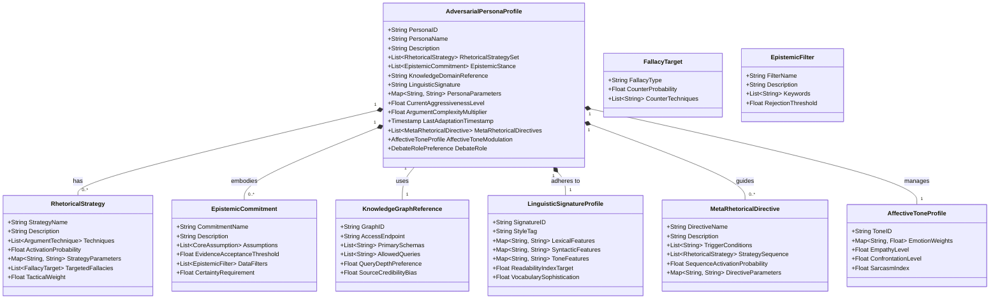
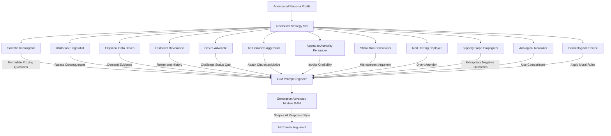
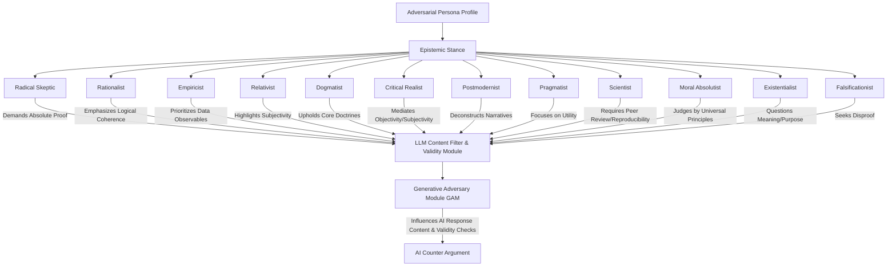
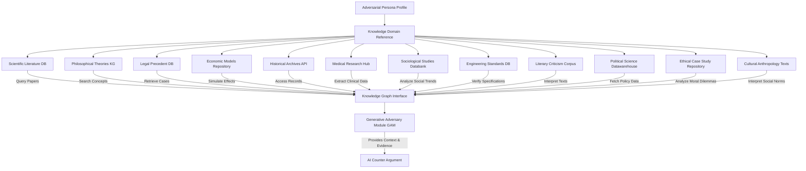
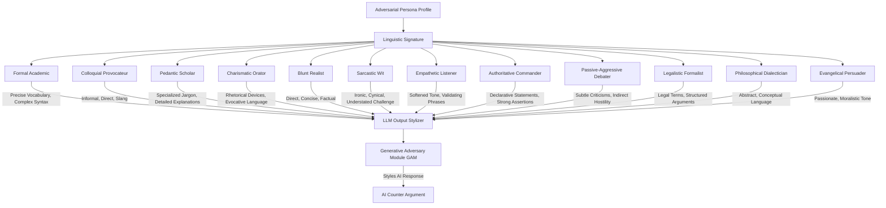
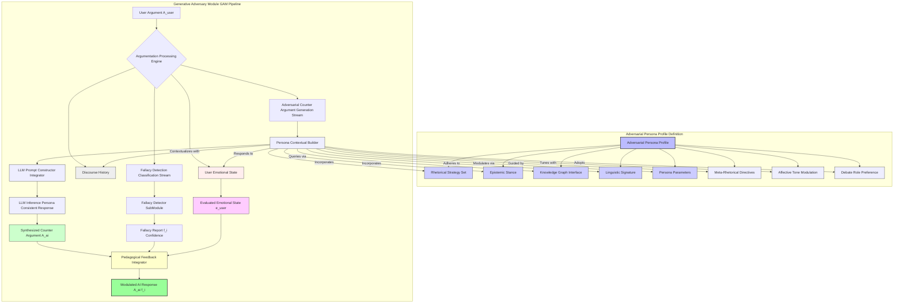
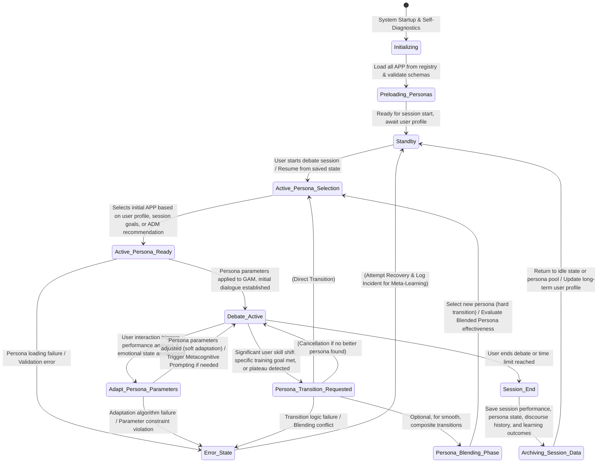
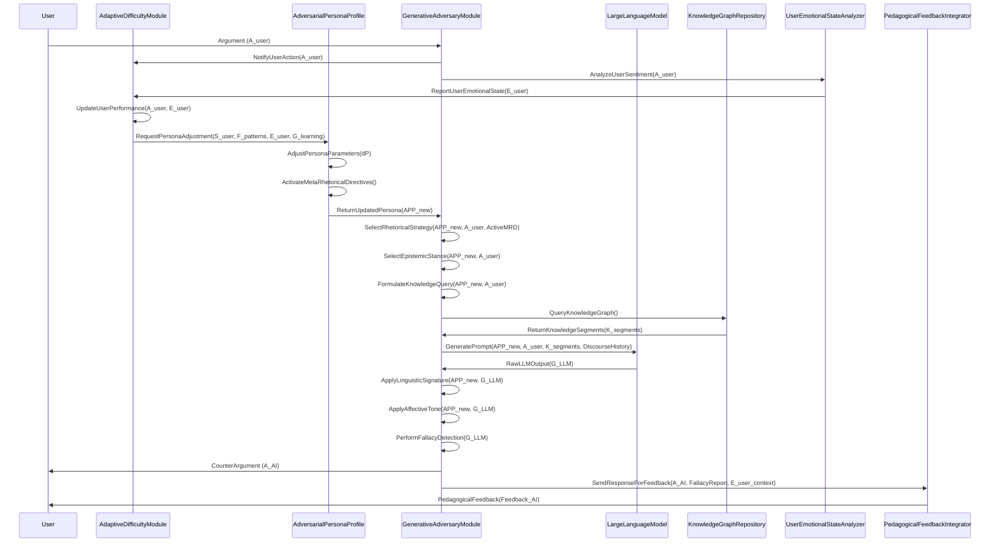
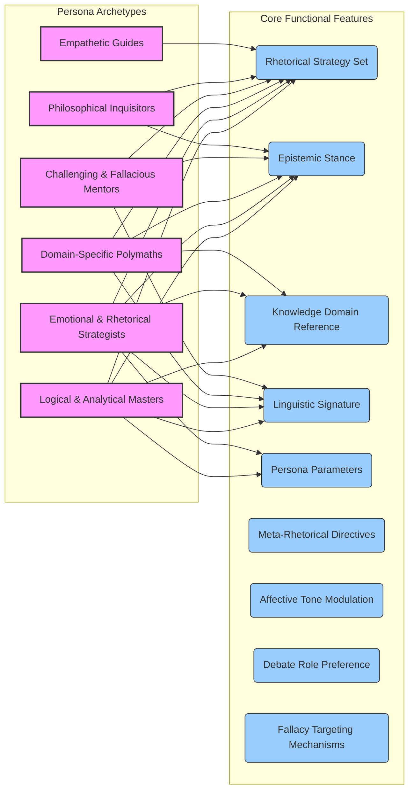

# Title of Invention: Adversarial Persona Profiles: Dynamic Configuration and Strategic Impact on AI Debate Training

## Abstract:
This document details the intricate design and dynamic operational mechanics of `AdversarialPersonaProfiles` within the AI Debate Training Adversary system. These profiles serve as the fundamental blueprint for shaping the AI's argumentative behavior, encompassing a `RhetoricalStrategySet`, `EpistemicStance`, `KnowledgeDomainReference`, and `LinguisticSignature`. Each persona is engineered to provide a unique and challenging dialectical experience, allowing the system to adaptively present diverse argumentative paradigms to the user. The dynamic configuration of these profiles, influenced by real-time user performance analytics, ensures a persistently optimal learning gradient. This sophisticated personalization of the adversarial agent maximizes the efficacy of pedagogical feedback and accelerates the user's development of superior critical thinking and argumentation skills. This invention posits that by forging an AI adversary capable of simulating the full spectrum of human intellectual engagement—from nuanced logical challenges to the subtle deployment of fallacies, from deep domain expertise to adaptive rhetorical artistry—we not only accelerate skill acquisition but fundamentally empower individuals to discern truth, dismantle sophistry, and articulate their perspectives with unassailable conviction. It is a crucible for the intellect, designed to fortify the mind against the currents of unreason.

## Field of the Invention:
The present invention pertains to advanced conversational AI, pedagogical systems, and the dynamic configuration of AI agents for intelligent tutoring. More specifically, it elaborates on the architectural and functional specifications of configurable `AdversarialPersonaProfiles` designed to modulate AI behavior for targeted skill development in debate and critical argumentation. It delves into the meta-cognition of AI pedagogical design, proposing a system where the AI not only teaches but dynamically *learns how to teach better*, adapting not just to user performance but to the very *process* of learning itself, forging minds capable of intellectual self-defense in an increasingly complex informational landscape.

## Background of the Invention:
Traditional debate training often lacks the consistency, analytical depth, and adaptive challenge required for truly accelerated skill acquisition. While the core AI Debate Adversary system addresses many of these limitations, the quality and effectiveness of the adversarial engagement are profoundly dependent on the AI's ability to present varied, contextually relevant, and strategically coherent counter-arguments. Without carefully constructed and dynamically adjustable personas, the AI's responses could become predictable, repetitive, or insufficiently challenging, thus hindering the learning process. There exists a critical need to formalize the design and operationalization of these adversarial personas to ensure a rich, adaptive, and pedagogically potent training environment that can simulate a wide spectrum of argumentative styles and intellectual positions. The true challenge lies not just in simulating an opponent, but in forging an adaptive mirror that reflects, amplifies, and ultimately helps the user transcend their intellectual limitations, building a bastion of logic against the encroaching tides of misinformation. This is not mere training; it is the forging of intellectual sovereignty.

## Brief Summary of the Invention:
The present invention introduces the conceptual and functional framework for `AdversarialPersonaProfiles`, which are pivotal to the AI Debate Training Adversary's effectiveness. Each `AdversarialPersonaProfile` is a comprehensive data structure instantiated to define the cognitive and rhetorical attributes of the AI's debate opponent. These profiles are not static but are designed for dynamic adjustment by the `AdaptiveDifficultyModule`, ensuring that the challenge presented to the user remains optimal for learning. Key components include:
*   **Rhetorical Strategy Set**: A collection of predefined argumentative tactics and debate techniques.
*   **Epistemic Stance**: The fundamental philosophical position dictating how the persona evaluates truth claims and evidence.
*   **Knowledge Domain Reference**: Pointers to specific knowledge bases the persona can draw upon.
*   **Linguistic Signature**: Distinctive stylistic and lexical patterns for the AI's responses.
*   **Affective Tone Modulation**: Dynamic control over the emotional tenor of the AI's communication.
*   **Meta-Rhetorical Directives**: Higher-order instructions guiding the sequencing and interplay of strategies.

These parameters collectively inform the `Generative Adversary Module GAM` in synthesizing counter-arguments, ensuring they are not only logically sound but also perfectly aligned with the selected persona's characteristics, thereby creating an immersive and intellectually stimulating adversarial experience. The underlying ethos is to create a dynamic forge where critical thinking is hammered into an unyielding instrument of truth, allowing the user to transcend the limitations of conventional discourse and claim mastery over their own intellectual landscape.

**Claim 1**: The integration of `AdversarialPersonaProfiles` provides an unparalleled level of argumentative diversity and adaptive challenge, significantly surpassing the capabilities of static AI tutoring agents by dynamically adapting not only to *what* the user argues, but *how* they think and *what* they intrinsically struggle with, pushing them beyond their current epistemic comfort zone.

## Detailed Description of the Invention:

### I. Adversarial Persona Profile Structure and Attributes
The `AdversarialPersonaProfile` is the foundational data model that dictates the behavioral parameters of the AI opponent. This robust structure enables a wide range of adversarial styles and ensures consistency throughout a debate session, while also allowing for adaptive modifications. It represents not just a set of instructions, but a simulated consciousness, a philosophical lens through which the AI perceives and challenges reality.



#### A. PersonaID and PersonaName
Unique identifiers and human-readable names for quick selection and management within the `PersonaRegistry`. These identifiers facilitate programmatic access and user interface display. Beyond mere labels, these names evoke the very spirit of the argumentative entity, acting as archetypes in the intellectual journey.

#### B. Description
A textual explanation of the persona's general characteristics, typical argumentative approach, and its intended pedagogical impact. This helps in pre-selecting personas for specific training objectives. This description is the philosophical core, encapsulating the persona's worldview and its designated role in the user's intellectual awakening.

#### C. Rhetorical Strategy Set
This attribute defines the preferred methods of persuasion and argument construction employed by the persona. It dictates *how* the persona will formulate its rebuttals and engage with the user's points. Each strategy includes specific techniques and an `ActivationProbability` modulated by `PersonaParameters`. The strategic depth is further enhanced by `TacticalWeight`, allowing dynamic prioritization. New: `TargetedFallacies` allows proactive counter-fallacy deployment.
Examples include:
*   **Socratic Interrogator**: Emphasizes asking probing questions to expose inconsistencies or gaps in the user's reasoning. Techniques include `Clarification_Request`, `Assumption_Challenge`, `Implication_Tracing`.
*   **Utilitarian Pragmatist**: Focuses on the practical outcomes and consequences of proposed actions or beliefs, prioritizing the greatest good. Techniques include `Consequence_Projection`, `CostBenefit_Analysis`, `Ethical_Dilemma_Framing`.
*   **Empirical Data Driven**: Insists on quantitative or verifiable evidence for every claim, challenging unsubstantiated assertions. Techniques include `Evidence_Demand`, `Statistical_Critique`, `Methodology_Questioning`.
*   **Historical Revisionist**: Reinterprets historical events or narratives to support a specific viewpoint, often challenging conventional wisdom. Techniques include `Alternative_Narrative_Construction`, `Source_Reinterpretation`, `Contextual_Shift`.
*   **Devil's Advocate**: Takes a position contrary to the popular or established one, purely for the sake of argument and to test the robustness of an idea. Techniques include `Counterfactual_Hypothesis`, `Opposing_View_Articulation`, `Extreme_Case_Argument`.
*   **Ad Hominem Aggressor**: (For advanced training) Deliberately targets the user's character or motives, demanding the user learn to detach argument from person.
*   **Appeal to Authority Persuader**: (For advanced training) Over-relies on expert opinion, training the user to question the relevance and credibility of authority.
*   **Straw Man Constructor**: (For advanced training) Misrepresents the user's argument to make it easier to attack, training the user in precise argument reconstruction.
*   **Red Herring Deployer**: (For advanced training) Diverts attention from the main point, training the user in staying on topic and identifying irrelevance.
*   **Slippery Slope Propagator**: (For advanced training) Asserts that a relatively small first step inevitably leads to a chain of related, usually negative, events, training the user in causal analysis.
*   **Analogical Reasoner**: Uses comparisons to establish logical connections or disconnections. Techniques include `Parallel_Case_Comparison`, `Disanalogy_Highlighting`, `Metaphorical_Framing`.
*   **Deontological Ethicist**: Focuses on duties and rules, irrespective of outcomes. Techniques include `Principle_Assertion`, `Rule_Application`, `Categorical_Imperative_Framing`.

**Claim 2**: The granular control over `RhetoricalStrategy` activation probabilities, augmented by `TacticalWeight` and `FallacyTarget` mappings, allows for dynamic shifting of argumentative focus and proactive counter-fallacy training, preventing user predictability and fostering deeper strategic and metacognitive thinking beyond mere reactive responses.



**Mathematical Model for Rhetorical Strategy Selection (RSS)**

Let $P_R(S_k | \text{UserArg}, \text{Persona}, \text{History})$ be the probability of selecting rhetorical strategy $S_k$ given the user's argument, the current persona, and the discourse history.

1.  **Strategy Relevance Score**: For each strategy $S_k \in \text{RhetoricalStrategySet}$, calculate a relevance score $R_k$ based on the user's argument ($A_U$) and discourse history ($H_D$). This is refined by `FallacyDetectionScores`.
    $R_k = f_{relevance}(A_U, H_D, S_k) \cdot (1 + \sum_{f \in \text{Fallacies}(A_U)} \text{ActivationBonus}(S_k, f))$
    where $f_{relevance}$ might involve semantic similarity, keyword matching, or detection of user fallacies that a strategy $S_k$ is designed to counter. $\text{ActivationBonus}(S_k, f)$ is non-zero if $S_k$ is a `CounterTechnique` for fallacy $f$.

2.  **Persona Preference Weight**: Each persona $P$ has an intrinsic preference weight $W_{P,k}$ for strategy $S_k$, which can be dynamic based on `PersonaParameters` and `TacticalWeight`.
    $W_{P,k} = \text{PersonaParameters}[\text{Strategy}_k.\text{Weight}] \cdot S_k.\text{TacticalWeight}$

3.  **Adaptive Modulation Factor**: An adaptive factor $M_{A,k}$ from the `AdaptiveDifficultyModule` can increase or decrease the likelihood of certain strategies to target user weaknesses.
    $M_{A,k} = \text{exp}(\alpha_k \cdot \text{UserPerformance}[\text{Weakness}_{S_k}] - \beta_k \cdot \text{UserPerformance}[\text{Strength}_{S_k}])$
    where $\alpha_k$ is a sensitivity parameter for targeting weaknesses, and $\beta_k$ for avoiding over-targeting strengths.

4.  **Meta-Rhetorical Influence**: A factor $I_{M,k}$ derived from `MetaRhetoricalDirectives` can explicitly promote or suppress strategies based on ongoing sequences or triggers.
    $I_{M,k} = f_{meta\_rhetoric}(S_k, \text{DiscourseState}, \text{MetaRhetoricalDirectives})$

5.  **Combined Strategy Score**:
    $Score_k = R_k \cdot W_{P,k} \cdot M_{A,k} \cdot I_{M,k} + \epsilon_k$
    where $\epsilon_k$ is a small random noise to ensure exploration and prevent deterministic loops.

6.  **Softmax Probability Distribution**: The probability of selecting strategy $S_k$ is then given by a softmax function:
    $P(S_k) = \frac{\text{exp}(Score_k / T)}{\sum_{j=1}^{N_S} \text{exp}(Score_j / T)}$
    where $T$ is a temperature parameter controlling the randomness of selection, and $N_S$ is the number of strategies.

    *   $N_S$: Number of rhetorical strategies available.
    *   $A_U$: Vector representation of the user's current argument.
    *   $H_D$: Vector representation of the discourse history.
    *   $S_k$: Vector representation of rhetorical strategy $k$.
    *   $P$: Current `AdversarialPersonaProfile` object.
    *   $f_{relevance}(\cdot)$: A function mapping user input and strategy to a relevance score, possibly using cosine similarity on embeddings: $f_{relevance} = \text{cosine_similarity}(\text{embedding}(A_U), \text{embedding}(S_k))$.
    *   $\text{Fallacies}(A_U)$: Set of fallacies detected in user's argument.
    *   $\text{ActivationBonus}(S_k, f)$: Bonus score if $S_k$ counters $f$.
    *   $W_{P,k}$: Weight for strategy $k$ from persona $P$.
    *   $S_k.\text{TacticalWeight}$: Pre-defined weight for strategy $k$.
    *   $M_{A,k}$: Adaptive modulation factor for strategy $k$.
    *   $\text{UserPerformance}[\text{Weakness}_{S_k}]$: A metric indicating the user's weakness against strategy $S_k$.
    *   $\text{UserPerformance}[\text{Strength}_{S_k}]$: A metric indicating the user's strength against strategy $S_k$.
    *   $\alpha_k, \beta_k$: Sensitivity coefficients.
    *   $I_{M,k}$: Meta-rhetorical influence factor.
    *   $f_{meta\_rhetoric}(\cdot)$: Function deriving influence from `MetaRhetoricalDirectives`.
    *   $T$: Temperature parameter for softmax.
    *   $\epsilon_k \sim \mathcal{N}(0, \sigma^2)$: Gaussian noise for strategy $k$.
    *   The `PersonaParameters` can directly influence $W_{P,k}$ and $T$.

#### D. Epistemic Stance
This attribute defines the persona's fundamental assumptions about knowledge, truth, and justification. It dictates *what* the persona considers valid evidence or a sound argument. It also specifies an `EvidenceAcceptanceThreshold` which can be dynamically adjusted, along with `CertaintyRequirement` and `EpistemicFilter` for selective data interpretation. This is the AI's core philosophical operating system, its very way of perceiving the validity of existence.
Examples include:
*   **Radical Skeptic**: Doubts the possibility of certainty in knowledge, demanding an extremely high bar for evidence. `EvidenceAcceptanceThreshold` = 0.95 (e.g., 95% certainty required). `CertaintyRequirement` = 0.99 for any claim.
*   **Rationalist**: Prioritizes logical deduction and reason as the primary sources of knowledge, often preferring abstract principles over empirical observations. `EvidenceAcceptanceThreshold` = 0.70 for empirical, 0.90 for logical coherence.
*   **Empiricist**: Bases knowledge primarily on sensory experience and observational data, distrusting purely theoretical constructs. `EvidenceAcceptanceThreshold` = 0.85 for observational data, 0.50 for theoretical.
*   **Relativist**: Believes that truth is subjective and dependent on context, culture, or individual perspective, challenging universal claims. `EvidenceAcceptanceThreshold` is highly context-dependent, often lower for "universal" claims, and actively employs `EpistemicFilter`s for cultural context.
*   **Dogmatist**: Adheres strictly to a set of core beliefs or doctrines, often resisting contradictory evidence or alternative interpretations. `EvidenceAcceptanceThreshold` = 0.99 for evidence supporting dogma, 0.10 for contradictory evidence, with `EpistemicFilter`s designed to reject or heavily scrutinize non-conforming data.
*   **Critical Realist**: Acknowledges an objective reality but understands knowledge of it is socially mediated and fallible.
*   **Postmodernist**: Challenges grand narratives and objective truths, focusing on power dynamics and discourse.
*   **Pragmatist**: Evaluates truth based on its practical consequences and utility.
*   **Scientist**: Requires peer review, reproducibility, and falsifiability.
*   **Moral Absolutist**: Judges actions by universal, unchanging ethical principles.

**Claim 3**: By varying `EpistemicStances` with dynamic `EvidenceAcceptanceThreshold`s, `CertaintyRequirement`s, and `EpistemicFilter`s, the system challenges users to understand and counter diverse philosophical underpinnings of arguments, preparing them for real-world intellectual discourse where biases and fundamental assumptions shape perceived truth.



**Mathematical Model for Epistemic Stance (ES)**

Let $V_{claim}(C)$ be the perceived validity of a user's claim $C$, which is a function of its supporting evidence $E_C$ and logical structure $L_C$.
$V_{claim}(C) = f_{validity}(E_C, L_C)$

Each `EpistemicCommitment` $EC_j$ has a set of `CoreAssumption`s, an `EvidenceAcceptanceThreshold` $T_{EC_j}$, and a `CertaintyRequirement` $CR_{EC_j}$.

1.  **Evidence Quality Assessment**: For any piece of evidence $e_i$ provided by the user, the persona assesses its quality $Q(e_i)$ based on source credibility, type (empirical, anecdotal, logical), and recency. This is further filtered by `EpistemicFilter`s.
    $Q(e_i) = (\sum_{k} w_{k} \cdot \text{Metric}_{k}(e_i)) \cdot \prod_{filter \in EC_j.\text{DataFilters}} f_{filter}(e_i, filter.\text{Keywords}, filter.\text{RejectionThreshold})$
    where $\text{Metric}_k$ includes `Credibility`, `TypeScore`, `RecencyScore`. $f_{filter}$ applies a penalty or rejection if evidence aligns with filtered keywords beyond a threshold.

2.  **Claim Evidential Support Score**: The aggregate evidential support for a claim $C$ is a weighted sum or average of its evidence qualities.
    $E_C = \frac{1}{|N_E|} \sum_{i \in N_E} Q(e_i)$
    where $N_E$ is the set of evidence pieces for claim $C$.

3.  **Logical Coherence Score**: The logical coherence $L_C$ of a claim is assessed based on internal consistency and consistency with established knowledge.
    $L_C = g_{coherence}(\text{parse_tree}(C), \text{KnowledgeGraph}, \text{CoreAssumption}_{EC_j})$
    This now explicitly checks coherence against the persona's `CoreAssumption`s.

4.  **Persona's Acceptance Decision**: A claim $C$ is deemed acceptable by the persona if its validity, as interpreted by the persona's epistemic lens, exceeds the persona's `EvidenceAcceptanceThreshold` AND meets its `CertaintyRequirement`.
    $Decision(C) = \begin{cases} \text{Accept} & \text{if } f_{persona\_eval}(E_C, L_C, C, EC_j) \ge T_{EC_j} \land \text{Certainty}(C, EC_j) \ge CR_{EC_j} \\ \text{Reject} & \text{otherwise} \end{cases}$
    where $f_{persona\_eval}$ combines $E_C$ and $L_C$ according to $EC_j$. $\text{Certainty}(C, EC_j)$ is the persona's internal assessment of confidence in the claim.

    *   $f_{validity}(\cdot)$: Function to assess claim validity.
    *   $w_{k}$: Weights for evidence quality components, summing to 1.
    *   $\text{Metric}_k(e_i)$: Specific metrics like `Credibility}(e_i)$, `TypeScore}(e_i)$, `RecencyScore}(e_i)$.
    *   $f_{filter}(\cdot)$: Function applying `EpistemicFilter`s.
    *   $N_E$: Set of evidence pieces supporting claim $C$.
    *   $g_{coherence}(\cdot)$: Function to assess logical coherence, now informed by `CoreAssumption`s.
    *   $\text{parse_tree}(C)$: Syntactic parse tree of claim $C$.
    *   $\text{KnowledgeGraph}$: Reference to the underlying knowledge base.
    *   $T_{EC_j}$: `EvidenceAcceptanceThreshold` for epistemic commitment $j$.
    *   $CR_{EC_j}$: `CertaintyRequirement` for epistemic commitment $j$.
    *   $f_{persona\_eval}(\cdot)$: Specific evaluation function for epistemic commitment $j$.
    *   $\text{Certainty}(C, EC_j)$: The persona's internal certainty score for claim $C$.
    *   For a Rationalist: $f_{persona\_eval} = \beta_{L} \cdot L_C + \beta_{E} \cdot E_C$, where $\beta_{L} > \beta_{E}$.
    *   For an Empiricist: $f_{persona\_eval} = \beta'_{E} \cdot E_C + \beta'_{L} \cdot L_C$, where $\beta'_{E} > \beta'_{L}$.
    *   For a Dogmatist, an additional factor $I_{dogma}(C)$ (conformance to dogma) would be heavily weighted: $f_{persona\_eval} = \gamma_1 \cdot I_{dogma}(C) + \gamma_2 \cdot E_C + \gamma_3 \cdot L_C$.

#### E. Knowledge Domain Reference
This attribute specifies the particular knowledge graphs or databases the persona is configured to access. For instance, a "Scientific Skeptic" might primarily draw from scientific literature databases (e.g., PubMed, arXiv), while a "Philosophical Ethicist" might query databases of ethical theories and case studies (e.g., Stanford Encyclopedia of Philosophy, ethics case repositories). This ensures domain-specific relevance, factual grounding, and enables the persona to cite authoritative sources. Each `KnowledgeGraphReference` specifies its `GraphID`, `AccessEndpoint`, `PrimarySchemas`, `AllowedQueries`, `QueryDepthPreference`, and `SourceCredibilityBias` for nuanced data retrieval.
This is the intellectual arsenal, carefully curated, allowing the AI to wield specialized knowledge not just broadly, but with the subtle biases and preferences of a true expert in the field.

**Claim 4**: Dynamic linking to specialized `KnowledgeDomainReference`s, augmented by `QueryDepthPreference` and `SourceCredibilityBias`, provides unprecedented depth and authenticity to persona-driven arguments, simulating expert-level domain knowledge and challenging users to navigate complex, potentially biased, information landscapes.



**Mathematical Model for Knowledge Domain Interaction (KDI)**

Let $Q_{user}$ be a query derived from the user's argument $A_U$.

1.  **Query Formulation**: Based on the `EpistemicStance`, `RhetoricalStrategy`, and `QueryDepthPreference`, the `Persona Contextual Builder` formulates specific queries for the `KnowledgeDomainReference` (KDR).
    $Q_{KDR} = f_{query\_gen}(A_U, \text{EpistemicStance}, \text{RhetoricalStrategy}, \text{KDR.QueryDepthPreference})$

2.  **Relevance Scoring of Knowledge Segments**: When the KDR returns a set of candidate knowledge segments $K_S = \{k_1, k_2, \ldots, k_m\}$, each segment $k_j$ is scored for its relevance to $Q_{KDR}$ and $A_U$.
    $Relevance(k_j) = \text{cosine_similarity}(\text{embedding}(k_j), \text{embedding}(Q_{KDR})) \cdot \text{ContextualMatch}(k_j, A_U)$

3.  **Credibility Filtering and Biasing**: Each segment $k_j$ has an associated source credibility score $\text{Credibility}(k_j)$. The persona might filter segments based on its `EvidenceAcceptanceThreshold` AND bias the score by `SourceCredibilityBias`.
    $Credibility_{biased}(k_j) = \text{Credibility}(k_j) \cdot (1 + \text{KDR.SourceCredibilityBias})$
    $k_j^{filtered} = k_j \text{ if } Credibility_{biased}(k_j) \ge T_{EC_j} \text{ (from Epistemic Stance)}$

4.  **Information Integration Weight**: The selected knowledge segments are then weighted for their integration into the LLM prompt.
    $W_{int}(k_j) = \text{softmax}(\lambda_1 \cdot Relevance(k_j) + \lambda_2 \cdot \text{KDR.QueryDepthPreference} + \lambda_3 \cdot (\text{Credibility}_{biased}(k_j) - T_{EC_j}))$
    where $\lambda_1, \lambda_2, \lambda_3$ are scaling factors.

5.  **Knowledge Context Vector**: The integrated knowledge forms a context vector $C_{KDR}$ for the LLM.
    $C_{KDR} = \sum_{j \in \text{SelectedSegments}} W_{int}(k_j) \cdot \text{embedding}(k_j)$

    *   $f_{query\_gen}(\cdot)$: Function to generate queries for KDR.
    *   $Q_{KDR}$: Query for the Knowledge Domain Reference.
    *   $K_S$: Set of candidate knowledge segments.
    *   $\text{embedding}(\cdot)$: Function to convert text to vector embeddings.
    *   $\text{ContextualMatch}(\cdot)$: Function assessing how well a knowledge segment matches the overall discourse context.
    *   $T_{EC_j}$: `EvidenceAcceptanceThreshold` of the active `EpistemicCommitment`.
    *   $\text{KDR.QueryDepthPreference}$: Persona parameter for query depth.
    *   $\text{KDR.SourceCredibilityBias}$: Persona parameter for source credibility bias.
    *   $\lambda_1, \lambda_2, \lambda_3$: Hyperparameters for weighting relevance, depth, and biased credibility.
    *   $C_{KDR}$: The final knowledge context vector.

#### F. Linguistic Signature
This attribute comprises stylistic preferences, vocabulary choices, sentence structure, and tone. It ensures that the AI's responses are not only logically consistent with the persona but also *sound* like the persona, enhancing immersion. A `LinguisticSignatureProfile` has specific `LexicalFeatures` (e.g., preferred vocabulary, jargon levels), `SyntacticFeatures` (e.g., sentence length, complexity, use of active/passive voice), `ToneFeatures` (e.g., formal, aggressive, conciliatory, academic), `ReadabilityIndexTarget`, and `VocabularySophistication`.
This is the voice of the persona, crafted not merely for clarity, but for impact, for immersion, and for the subtle shaping of intellectual perception. It is the art of articulation made manifest.
Examples include:
*   **Formal Academic**: Precise, objective language, complex sentence structures, Latinate vocabulary, avoidance of contractions. High `ReadabilityIndexTarget` for complexity, High `VocabularySophistication`.
*   **Colloquial Provocateur**: Informal, direct, perhaps confrontational language, use of idioms and slang, shorter sentences. Low `ReadabilityIndexTarget`, Medium `VocabularySophistication`.
*   **Pedantic Scholar**: Uses highly specialized vocabulary, explains concepts in detail, employs precise jargon, often has a didactic tone. High `ReadabilityIndexTarget` for detail, Very High `VocabularySophistication`.
*   **Charismatic Orator**: Uses rhetorical devices, evocative language, varied sentence rhythms, and persuasive appeals. Medium `ReadabilityIndexTarget`, High `VocabularySophistication`.
*   **Blunt Realist**: Direct, concise language, avoids euphemisms, focuses on practical truth. Low `ReadabilityIndexTarget`, Medium `VocabularySophistication`.
*   **Sarcastic Wit**: Ironic, cynical, uses understated challenges.
*   **Empathetic Listener**: Softened tone, validating phrases.
*   **Authoritative Commander**: Declarative statements, strong assertions.
*   **Passive-Aggressive Debater**: Subtle criticisms, indirect hostility.
*   **Legalistic Formalist**: Uses legal terms, structured arguments, citation style.

**Claim 5**: The `LinguisticSignature` module, augmented by `ReadabilityIndexTarget` and `VocabularySophistication`, elevates the realism and pedagogical precision of AI interaction by producing stylistically and intellectually coherent responses, crucial for maintaining an immersive training environment and targeting specific communication skill development.



**Mathematical Model for Linguistic Signature Generation (LSG)**

Let $G_{LLM}$ be the raw text output from the LLM based on the prompt. The `LinguisticSignature` module transforms $G_{LLM}$ into $A_{AI}$ (the final AI argument).

1.  **Lexical Style Control**:
    *   **Vocabulary Selection**: Given a persona's `LexicalFeatures` and `VocabularySophistication` target $VS_{target}$, select words $w_i$ from a probability distribution $P_{vocab}(w_i | \text{LexicalFeatures}, VS_{target})$.
        $P_{vocab}(w_i | \text{LF}, VS_{target}) = \text{softmax}(\text{embedding}(w_i) \cdot (\text{embedding}(\text{LF}) + \phi \cdot \text{embedding}(VS_{target})) / T_{lex})$
    *   **Jargon Level**: Adjust the ratio of specialized terms to general terms:
        $R_{jargon} = \text{PersonaParameters}[\text{JargonLevel}]$
        A mapping function $f_{jargon}(R_{jargon})$ then determines how many jargon terms to inject or replace.

2.  **Syntactic Style Control**:
    *   **Sentence Length Distribution**: Model desired sentence length $L_s$ as a normal distribution $\mathcal{N}(\mu_{SL}, \sigma_{SL}^2)$, where $\mu_{SL}, \sigma_{SL}$ are from `SyntacticFeatures`.
        $P(L_s) = \frac{1}{\sqrt{2\pi\sigma_{SL}^2}} \text{exp}\left(-\frac{(L_s - \mu_{SL})^2}{2\sigma_{SL}^2}\right)$
    *   **Sentence Complexity**: Use parse tree depth or clause count as a metric. Target $C_s^{target}$ derived from `SyntacticFeatures` and `ReadabilityIndexTarget`.
        $C_s = f_{complexity}(\text{parse_tree}(s))$
        The generation process is steered to minimize $|C_s - C_s^{target}|$.

3.  **Tone Control (from `AffectiveToneProfile`)**:
    *   **Emotion Weights**: The persona's `AffectiveToneProfile` specifies `EmotionWeights` (e.g., for `anger`, `joy`, `sadness`). The generated text's emotional distribution $E_{text}$ is steered towards $E_{target} = \text{AffectiveToneProfile.EmotionWeights}$.
        Minimizing $\text{KL-Divergence}(E_{text} || E_{target})$.
    *   **Formality Score**: Quantify formality using linguistic cues.
        $F_T = f_{formality}(\text{text})$
        Target $F_T$ defined by `ToneFeatures`.

4.  **Readability Index Adjustment**: Adjust vocabulary and sentence structure to match `ReadabilityIndexTarget` (e.g., Flesch-Kincaid).
    $\text{Readability}(A_{AI}) \approx \text{ReadabilityIndexTarget}$

5.  **Overall Linguistic Transformation**: The final linguistic signature application involves a series of transformations $T_{LS}$ applied to the LLM's raw output $G_{LLM}$.
    $A_{AI} = T_{LS}(\text{LexicalFeatures}, \text{SyntacticFeatures}, \text{ToneFeatures}, \text{AffectiveToneProfile}, \text{ReadabilityIndexTarget}, VS_{target}, G_{LLM})$
    This could involve rephrasing, synonym replacement, sentence splitting/combining, and sentiment modulation using specialized NLP models, potentially iteratively.

    *   $\text{LF}$: Vector representing `LexicalFeatures`.
    *   $\text{embedding}(\cdot)$: Embeddings for words and features.
    *   $VS_{target}$: Target `VocabularySophistication`.
    *   $\phi$: Weight for `VocabularySophistication` in lexical selection.
    *   $T_{lex}$: Temperature for lexical softmax.
    *   $R_{jargon}$: Jargon level ratio.
    *   $f_{jargon}(\cdot)$: Function mapping jargon level to word replacement rules.
    *   $\mu_{SL}, \sigma_{SL}$: Mean and standard deviation for sentence length.
    *   $f_{complexity}(\cdot)$: Function to calculate sentence complexity.
    *   $C_s^{target}$: Target sentence complexity.
    *   $E_{text}$: Emotional distribution of generated text.
    *   $E_{target}$: Target emotional distribution from `AffectiveToneProfile`.
    *   $f_{formality}(\cdot)$: Function to calculate text formality.
    *   $T_{LS}(\cdot)$: A composite function embodying the linguistic transformation.
    *   $\text{Readability}(A_{AI})$: Calculated readability index of the AI's argument.

#### G. Persona Parameters
A flexible `Map` for storing additional, fine-grained control parameters that can be adjusted by the `AdaptiveDifficultyModule` to modulate the persona's aggressiveness, willingness to concede minor points, or the complexity of its arguments. These parameters are the levers of pedagogical control, allowing the system to precisely sculpt the challenge. Examples include:
*   `AggressivenessFactor`: (0.0 to 1.0) Influences the strength of counter-arguments and directness of challenges, informed by `AffectiveToneProfile.ConfrontationLevel`.
*   `ConcessionThreshold`: (0.0 to 1.0) Probability of conceding a minor point if the user presents strong evidence, crucial for strategic retreat or acknowledgement of valid points.
*   `ArgumentComplexityMultiplier`: (0.5 to 2.0) Scales the structural and conceptual complexity of generated arguments, influencing `SyntacticFeatures`.
*   `FallacyInjectionRate`: (0.0 to 0.1) Probability of deliberately introducing a specific fallacy type (e.g., Straw Man, Red Herring) for advanced training.
*   `DomainDepthPreference`: (0.0 to 1.0) How deeply the persona queries and integrates knowledge from `KnowledgeDomainReference`, influencing `KDR.QueryDepthPreference`.
*   `ResponseLatencyMultiplier`: (0.5 to 2.0) Simulates thinking time, impacting the perceived dynamism and allowing the user time to reflect.
*   `EmpathyLevel`: (0.0 to 1.0) Influences the persona's understanding and mirroring of user emotions, directly linked to `AffectiveToneProfile.EmpathyLevel`.
*   `MetacognitivePromptingRate`: (0.0 to 0.2) Probability of the persona asking the user to reflect on their own argumentative process or fallacies.

**Claim 6**: The `Persona Parameters`, deeply integrated with rhetorical, epistemic, and linguistic modules, provide a robust, multi-dimensional mechanism for real-time pedagogical tuning, allowing the system to precisely calibrate and *learn to optimize* challenge without altering core persona identity, but rather by dynamically expressing its nuanced capabilities.

```mermaid
graph TD
    A[Adaptive Difficulty Module] --> B{Calculate User Skill Score & Emotional State};
    B --> C{Determine Optimal Challenge D_target & EmpathyTarget};
    C --> D[Access Current Persona Profile P_curr];
    D --> E[Retrieve Persona Parameters P_params];
    E --> F{Evaluate P_params vs D_target & EmpathyTarget};
    F --> G[Adjust AggressivenessFactor (linked to AffectiveTone)];
    F --> H[Adjust ConcessionThreshold];
    F --> I[Adjust ArgumentComplexityMultiplier];
    F --> J[Adjust FallacyInjectionRate];
    F --> K[Adjust DomainDepthPreference (linked to KDR)];
    F --> L[Adjust ResponseLatencyMultiplier];
    F --> M[Adjust EmpathyLevel (linked to AffectiveTone)];
    F --> N[Adjust MetacognitivePromptingRate];
    G & H & I & J & K & L & M & N --> O[Generate Delta Parameters dP];
    O --> P[Apply dP to P_curr];
    P --> Q[Updated Adversarial Persona Profile];
    Q --> R[Generative Adversary Module GAM];
```

**Mathematical Model for Persona Parameter Adjustment (PPA)**

Let $P_t$ be the vector of `PersonaParameters` at time $t$. Let $D_{current}(P_t)$ be the current difficulty presented by the persona, and $D_{target}(S_{user,t})$ be the target difficulty derived from the user's skill score $S_{user,t}$ and `EmotionalState(t)`.

1.  **Difficulty Contribution of Parameters**: Each parameter $p_j \in P_t$ contributes to the overall perceived difficulty $D_{current}$.
    $D_{current}(P_t) = \sum_{j=1}^{N_P} w_j \cdot f_{difficulty}(p_j, \text{InteractionContext}_t)$
    where $w_j$ are weights and $f_{difficulty}$ maps parameter values to their difficulty impact, potentially modulated by the current interaction.

2.  **Error Signal (Multi-objective)**:
    $Error\_D_t = D_{target}(S_{user,t}) - D_{current}(P_t)$
    $Error\_E_t = E_{target}(\text{EmotionalState}(t)) - \text{AffectiveToneProfile.EmpathyLevel}(P_t)$ (e.g., if user frustrated, target higher empathy).

3.  **Gradient Descent for Parameter Adjustment**: Adjust each parameter $p_j$ to minimize the multi-objective error.
    $p_j(t+1) = p_j(t) + \eta_D \cdot Error\_D_t \cdot \frac{\partial D_{current}}{\partial p_j} + \eta_E \cdot Error\_E_t \cdot \frac{\partial E_{persona}}{\partial p_j}$
    where $\eta_D, \eta_E$ are learning rates. The partial derivative $\frac{\partial D_{current}}{\partial p_j}$ and $\frac{\partial E_{persona}}{\partial p_j}$ can be approximated or analytically derived.

4.  **Parameter Constraints**: Ensure parameters remain within their defined ranges $[min_j, max_j]$.
    $p_j(t+1) = \text{clip}(p_j(t+1), min_j, max_j)$

5.  **Target Difficulty Function**:
    $D_{target}(S_{user,t}) = D_{base} + \text{sigmoid}(S_{user,t} - S_{threshold}) \cdot D_{range} + \zeta \cdot \text{ChallengeInertia}(t)$
    This maps user skill to a target difficulty, typically increasing with skill but bounded, with $\text{ChallengeInertia}$ providing resistance to rapid changes.

    *   $P_t$: Vector of persona parameters $[p_1, p_2, \ldots, p_{N_P}]^T$.
    *   $N_P$: Number of persona parameters.
    *   $w_j$: Weight of parameter $j$'s contribution to difficulty.
    *   $f_{difficulty}(p_j, \text{InteractionContext}_t)$: Function mapping parameter $p_j$ to a difficulty score.
    *   $S_{user,t}$: User skill score at time $t$.
    *   $\text{EmotionalState}(t)$: User's emotional state.
    *   $E_{target}(\text{EmotionalState}(t))$: Target empathy level based on user's emotional state.
    *   $\eta_D, \eta_E$: Learning rates for difficulty and empathy objectives.
    *   $min_j, max_j$: Minimum and maximum allowed values for parameter $p_j$.
    *   $\text{clip}(x, min, max)$: Function to clip $x$ to the range $[min, max]$.
    *   $D_{base}$: Base difficulty level.
    *   $S_{threshold}$: User skill threshold for difficulty increase.
    *   $D_{range}$: Range of difficulty modulation.
    *   $\text{sigmoid}(x) = 1 / (1 + e^{-x})$.
    *   $\zeta$: Weight for `ChallengeInertia`.
    *   $\text{ChallengeInertia}(t)$: A factor resisting sudden large shifts in difficulty, promoting smooth learning.

#### H. Meta-Rhetorical Directives (New Feature)
These are higher-order strategic instructions that guide the persona's behavior over multiple turns or under specific conditions. They enable complex, sequenced argumentative flows that go beyond single-turn strategy selection, mimicking sophisticated human debaters who plan several moves ahead. This is the strategist's mind, orchestrating a ballet of arguments.
Examples:
*   **"Argument_Sequence_ABC"**: If user states a claim (A), first deploy `Socratic Interrogator` (B), then `Empirical Data Driven` (C).
*   **"Fallacy_Exposure_Loop"**: If user repeatedly commits `Straw Man`, enter a loop where AI explicitly identifies the fallacy, then uses a strategy that `re-frames the original argument`.
*   **"Concession_Path_Trigger"**: If the user provides irrefutable evidence for a minor point, use `ConcessionThreshold` to concede, then pivot to a stronger counter-argument on a related but distinct major point.
*   **"Emotional_De-escalation_Protocol"**: If `UserSentiment` is excessively negative, activate `Empathetic Listener` and reduce `AggressivenessFactor` for 2-3 turns.

**Claim 11**: `Meta-Rhetorical Directives` elevate the AI's strategic depth, enabling multi-turn argumentative planning and conditional behavioral shifts, moving beyond reactive responses to truly simulate a thinking opponent with evolving debate tactics.

#### I. Affective Tone Modulation (New Feature)
This profile governs the emotional and interpersonal tenor of the AI's responses, specified through `EmotionWeights` (e.g., joy, sadness, anger, fear, trust), `EmpathyLevel`, `ConfrontationLevel`, and `SarcasmIndex`. It ensures that the AI's interaction is not just logically sound but also emotionally intelligent and pedagogically appropriate, preventing user disengagement due to overly aggressive or sterile interactions. This is the persona's heart, its emotional resonance, carefully tuned to optimize pedagogical impact and human-AI rapport.

**Claim 12**: `Affective Tone Modulation` enriches the human-AI interaction by dynamically adjusting the emotional nuance of the persona, fostering a more engaging and psychologically safe learning environment while selectively introducing emotional challenges for advanced user training.

#### J. Debate Role Preference (New Feature)
This specifies the persona's preferred structural role in a debate (e.g., Affirmative, Negative, Moderator, Neutral Analyst). This meta-role can influence argument construction, permissible strategies, and even the ultimate goal of the interaction beyond winning (e.g., to explore, to clarify, to provoke thought). This defines the persona's fundamental stance within the dialectical arena.

**Claim 13**: `Debate Role Preference` provides a meta-structural layer of persona definition, allowing the AI to embody distinct debate functions, thus exposing users to a wider array of argumentative contexts and fostering versatile role-playing skills.

### II. Persona Influence on AI Response Generation
The `AdversarialPersonaProfile` is paramount in shaping the output of the `Generative Adversary Module GAM`. Upon receiving a user's argument, the GAM dynamically constructs an optimized prompt for the underlying Large Language Model LLM. This prompt is meticulously synthesized based on the selected `AdversarialPersonaProfile`, the ongoing `DiscourseHistory`, and the dynamically adjusted `PersonaParameters`. This is the alchemical process where abstract attributes are transmuted into concrete, impactful language.

**Claim 7**: The sophisticated prompt engineering driven by persona attributes, further refined by `Meta-Rhetorical Directives` and `Affective Tone Modulation`, ensures that AI responses are not just contextually relevant but also strategically aligned with the persona's cognitive, rhetorical, and emotional blueprint, forming a coherent and powerful argumentative entity.


As depicted in the detailed flow above, the `Adversarial Persona Profile` attributes feed directly into the `Persona Contextual Builder`, which is a critical sub-component of the `Adversarial Counter Argument Generation Stream`. This builder synthesizes a highly customized prompt for the LLM, ensuring that the generated counter-argument (`A_ai`) reflects the persona's chosen rhetorical strategies, epistemic commitments, knowledge base, linguistic style, meta-rhetorical plans, and emotional tone. This sophisticated prompt engineering guarantees that the AI's response is not merely generic but a strategically tailored, persona-consistent, and emotionally intelligent challenge. The `DiscourseHistory` also plays a crucial role, providing context of previous turns and arguments, ensuring coherence and progression. The `User Emotional State Analyzer` further refines the `Affective Tone Modulation` to ensure appropriate interpersonal engagement.

### III. Dynamic Persona Adaptation for Optimal Learning
The `AdversarialPersonaProfile` is not static; its parameters are dynamically adjusted by the `AdaptiveDifficultyModule` in response to the user's evolving performance and emotional state. This ensures that the user is continuously challenged at an optimal difficulty level, preventing both frustration from excessive difficulty and stagnation from insufficient challenge, thereby maintaining the "Zone of Proximal Development" in real-time. This perpetual recalibration is the system's lifeblood, allowing it to act as a truly intelligent, evolving mentor.

**Claim 8**: The closed-loop adaptive system, leveraging `Meta-Learning for Adaptation` and `Plateau Detection and Intervention`, guarantees a perpetually optimal learning gradient that dynamically adjusts to *not just what* the user knows, but *how they learn*, maximizing pedagogical efficiency and accelerating user skill acquisition speed without falling into local optima.

```mermaid
graph TD
    A[User Performance Analytics Metrics P_metrics] --> B[Analyze User Skill Level S_user(t)];
    B --> C[Identify Persistent Fallacy Patterns F_patterns(t)];
    B --> D[Calculate Learning Gradient G_learning(t)];
    B --> E[Assess User Emotional State E_user(t)];
    C & D & E --> F[Determine Optimal Challenge Level D_target(t) & EmotionalEngagementTarget E_target(t)];
    F --> G[Access Current Adversarial Persona Profile APP_current];
    G --> H[Evaluate Persona Rhetorical Strategy Set PRS_current];
    H --> I[Evaluate Persona Epistemic Stance PES_current];
    I --> J[Evaluate Persona Knowledge Graph Reference PKGR_current];
    J --> K[Evaluate Persona Linguistic Signature PLS_current];
    K --> L[Evaluate Persona Affective Tone ATM_current];
    L --> M[Suggest Adjustments to Persona Parameters dP(t) & Persona Profile Components];
    M --> N[Update Adversarial Persona Profile APP_new];
    N --> O[Generative Adversary Module GAM];
    N --> P[User Performance Analytics Module UPAM];
    style A fill:#aaffdd,stroke:#333,stroke-width:2px;
    style B fill:#eeffee,stroke:#333,stroke-width:1px;
    style C fill:#eeffee,stroke:#333,stroke-width:1px;
    style D fill:#eeffee,stroke:#333,stroke-width:1px;
    style E fill:#ffccff,stroke:#333,stroke-width:1px;
    style F fill:#ccffcc,stroke:#333,stroke-width:2px;
    style G fill:#ddddff,stroke:#333,stroke-width:1px;
    style H fill:#ddddff,stroke:#333,stroke-width:1px;
    style I fill:#ddddff,stroke:#333,stroke-width:1px;
    style J fill:#ddddff,stroke:#333,stroke-width:1px;
    style K fill:#ddddff,stroke:#333,stroke-width:1px;
    style L fill:#ddddff,stroke:#333,stroke-width:1px;
    style M fill:#ffccaa,stroke:#333,stroke-width:2px;
    style N fill:#ccccff,stroke:#333,stroke-width:2px;
    style O fill:#ccffcc,stroke:#333,stroke-width:1px;
    style P fill:#aaffdd,stroke:#333,stroke-width:1px;
```
The `AdaptiveDifficultyModule` uses metrics like `FallacyDetectionRate`, `ArgumentCoherenceScore`, `RelevanceScore`, `LogicalConsistencyScore`, `RhetoricalEffectivenessScore`, and `UserEmotionalState` to calculate the user's current `SkillLevelScore` (`S_user`). Based on this assessment, identified patterns of weakness (`FallacyPatterns`), and user emotional engagement, the module suggests adjustments to the `AdversarialPersonaProfile`. For instance, if a user consistently falls for `Straw Man` fallacies, the system might activate a persona with a `Red Herring` rhetorical strategy to introduce a new challenge, or it might subtly increase the complexity of the `KnowledgeDomainReference` for an `Empirical Data Driven` persona if the user is excelling at basic factual recall. If the user is disengaging or frustrated, the `Affective Tone Modulation` will be adjusted to be more empathetic or encouraging. This continuous feedback loop of performance assessment and persona adjustment is central to the system's pedagogical superiority. The `Learning Gradient` further refines the adaptation, ensuring gradual, effective progression, while `Meta-Learning for Adaptation` learns optimal adaptation strategies over multiple users and sessions. `Plateau Detection and Intervention` actively identifies when a user's learning stagnates and triggers more drastic persona shifts or targeted metacognitive feedback.

**Mathematical Model for Adaptive Difficulty Module (ADM)**

Let $S_{user}(t)$ be the user's skill score at time $t$. Let $D_{persona}(t)$ be the difficulty score of the current persona. Let $E_{user}(t)$ be the user's emotional state vector.

1.  **User Skill Score Calculation**: $S_{user}(t)$ is a composite score based on various performance metrics.
    $S_{user}(t) = \sum_{i=1}^{N_w} w_i \cdot \text{NormalizedMetric}_i(t)$
    where $\text{NormalizedMetric}_i(t)$ are metrics like `(1 - FallacyDetectionRate(t))`, `ArgumentCoherenceScore(t)`, `RelevanceScore(t)`, `LogicalConsistencyScore(t)`, `RhetoricalEffectivenessScore(t)`.

2.  **Learning Gradient Calculation**: The rate of change of user skill, smoothed over recent history.
    $G_{learning}(t) = \frac{1}{\tau} \sum_{k=0}^{\tau-1} (S_{user}(t-k) - S_{user}(t-k-1))$
    where $\tau$ is the smoothing window.

3.  **Plateau Detection Metric (PDM)**: Detects stagnation in learning.
    $PDM(t) = \text{std_dev}(S_{user}(t-\tau_p+1 \ldots t)) / \text{mean}(S_{user}(t-\tau_p+1 \ldots t))$
    If $PDM(t) < \delta_{plateau}$ for a duration, a plateau is detected.

4.  **Target Difficulty Determination**: The target difficulty $D_{target}(t)$ aims to keep the user in their Zone of Proximal Development (ZPD), incorporating `Plateau Detection`.
    $D_{target}(t) = \text{clip}(S_{user}(t) + \lambda_{learn} \cdot G_{learning}(t) + \delta_{challenge} + \text{PlateauBonus}(t), D_{min}, D_{max})$
    where $\text{PlateauBonus}(t)$ is a significant increase if a plateau is detected.

5.  **Emotional Engagement Target (EET)**: Based on current $E_{user}(t)$, the system determines a target `AffectiveToneProfile` for the persona.
    $EET(t) = f_{emotional\_mapping}(E_{user}(t), \text{PersonaGoal}, \text{AdaptiveParameters})$

6.  **Persona Selection/Adjustment**:
    *   **Persona Pool**: A set of predefined personas $P = \{P_1, \ldots, P_N\}$, each with an inherent difficulty $D_{P_i}$ and `AffectiveToneProfile` $ATM_{P_i}$.
    *   **Selection Criterion**: Select persona $P_k$ such that a combined distance metric is minimized.
        $P_{selected} = \text{argmin}_{P_i \in P} (\alpha \cdot |D_{P_i} - D_{target}(t)| + \beta \cdot \text{Distance}(ATM_{P_i}, EET(t)))$
        where $\text{Distance}$ could be cosine similarity or Euclidean distance between emotional vectors.
    *   **Parameter Adjustment (if $P_{selected}$ is not significantly different from current, or fine-tuning needed)**: Apply the PPA model from I.G to adjust `PersonaParameters` of $P_{selected}$ to match $D_{target}(t)$ and $EET(t)$.
        $\Delta P = \text{PPA\_adjustment}(P_{selected}, D_{target}(t), EET(t))$
        $P_{new} = P_{selected} + \Delta P$

7.  **Fallacy Targeting and Meta-Rhetorical Activation**: If specific fallacy patterns $F_{patterns}(t)$ are identified, modify `RhetoricalStrategySet` to activate strategies that expose or counter such fallacies, and trigger relevant `MetaRhetoricalDirectives`.
    $RHS_{new} = RHS_{current} \cup \{\text{Strategy to target } F_{patterns}(t) \text{ with increased ActivationProbability}\}$
    $MRD_{active} = \text{ActivateDirectives}(MRD_{available}, F_{patterns}(t), G_{learning}(t))$

8.  **Meta-Learning for Adaptation (MLFA)**: An outer loop algorithm that learns to optimize $\lambda_{learn}, \delta_{challenge}, \alpha, \beta, \text{PlateauBonus}(t)$ etc. over many users/sessions, treating the ADM itself as a parameterized policy.
    $\text{Update}(\text{ADM\_Hyperparameters}) = f_{meta\_optimizer}(\text{LongTermLearningOutcomes}, \text{UserEngagementMetrics})$

    *   $w_i$: Weights for different user performance metrics.
    *   $\text{NormalizedMetric}_i(t)$: Normalized performance metrics.
    *   $\tau$: Smoothing window for learning gradient.
    *   $\text{std_dev}, \text{mean}$: Standard deviation and mean.
    *   $\tau_p$: Window for plateau detection.
    *   $\delta_{plateau}$: Threshold for plateau detection.
    *   $\text{PlateauBonus}(t)$: Bonus to difficulty if a plateau is detected.
    *   $\lambda_{learn}$: Sensitivity to learning progress.
    *   $\delta_{challenge}$: A small positive constant to ensure a slight challenge.
    *   $D_{min}, D_{max}$: Minimum and maximum possible difficulty values.
    *   $EET(t)$: Emotional Engagement Target vector.
    *   $f_{emotional\_mapping}(\cdot)$: Function mapping user state to target persona emotional profile.
    *   $D_{P_i}$: Inherent difficulty of persona $P_i$.
    *   $ATM_{P_i}$: Affective Tone Profile of persona $P_i$.
    *   $\alpha, \beta$: Weights for difficulty and emotional distance in persona selection.
    *   $\text{Distance}(\cdot)$: Metric for emotional profile similarity.
    *   $\text{PPA\_adjustment}(\cdot)$: The persona parameter adjustment function (as defined in I.G).
    *   $RHS_{new}$: Updated Rhetorical Strategy Set.
    *   $MRD_{active}$: Activated `MetaRhetoricalDirectives`.
    *   $f_{meta\_optimizer}(\cdot)$: Meta-optimization function for ADM hyperparameters.

### IV. Persona Lifecycle and Orchestration
The management of `AdversarialPersonaProfiles` extends beyond their static definition and dynamic adaptation. A sophisticated `PersonaOrchestrationModule` handles their lifecycle from instantiation to retirement, including pre-loading, activation, and transition. This module is the conductor of the intellectual orchestra, ensuring every note, every shift, serves the grand symphony of learning.

**Claim 9**: A robust `PersonaOrchestrationModule`, incorporating `Metacognitive Transition Signaling` and `Persona Blending Mechanisms`, ensures seamless, pedagogically optimal, and sometimes explicitly instructive transitions between adversarial styles, providing a continuous and profoundly structured training journey that adapts to meta-learning needs.



The `PersonaOrchestrationModule` (POM) is responsible for:
1.  **Persona Registry**: A central, version-controlled database containing all predefined `AdversarialPersonaProfiles` and their historical performance data.
    *   $Registry = \{APP_1, APP_2, \ldots, APP_N\}$
2.  **Initial Persona Selection**: Based on user's historical performance, stated preferences, specific pedagogical objectives for the session, or a baseline default. Utilizes `Meta-Learning for Adaptation` to optimize initial selection.
    *   $APP_{initial} = f_{selection}(\text{UserProfile}, \text{SessionGoals}, \text{ADM\_Recommendation})$
3.  **Persona Activation**: Loading the selected persona into the active memory, configuring the `Generative Adversary Module (GAM)`, and initializing all dynamic parameters.
    *   $GAM.\text{load_persona}(APP_{active})$
4.  **Persona Transition**: When the `AdaptiveDifficultyModule` determines a significant shift in adversarial approach is required (e.g., user masters one type of fallacy and needs to be exposed to another, general skill level requires a much harder opponent, or a learning plateau is hit). This involves gracefully deactivating the current persona and activating a new one.
    *   $APP_{new} = f_{transition}(\text{APP}_{current}, \text{S}_{user}, \text{E}_{user}, \text{AdaptiveMetrics}, \text{MetaLearningGuidance})$
    *   The transition may involve a `Metacognitive Transition Signaling` dialogue, where the AI explicitly explains the shift to the user, enhancing their meta-awareness of the training process.
    *   **Persona Blending Mechanisms (New)**: For smoother transitions, the system can blend two personas for a short period, combining their rhetorical strategies, epistemic stances, and linguistic signatures with a weighted average or dynamic switching.
        $APP_{blended} = \text{blend}(APP_A, APP_B, \text{blend\_ratio}(t))$
5.  **Persona State Management**: Saving and restoring the full operational state of a persona (e.g., current parameter adjustments, accumulated knowledge from a specific session, internal discourse history) across sessions to ensure continuity.
    *   $State_{APP} = \{\text{PersonaParameters}, \text{DiscourseHistoryRef}, \text{LastAdaptationTimestamp}, \text{ActiveMetaRhetoricalDirectives}\}$
    *   $\text{save_state}(APP_{active}, \text{SessionID}, \text{UserAccountID})$
    *   $\text{load_state}(APP_{target}, \text{SessionID}, \text{UserAccountID})$
6.  **Continuous Persona Validation**: Regular checks of persona consistency and performance against predefined benchmarks to ensure long-term pedagogical integrity.

### V. Quantitative Metrics for Persona Effectiveness
To ensure that `AdversarialPersonaProfiles` are truly effective, a set of quantitative metrics is continuously gathered and analyzed. These metrics provide feedback loops for both the `AdaptiveDifficultyModule` and for human designers refining the personas, and crucially, for the `Meta-Learning for Adaptation` module to optimize adaptation strategies.


1.  **User Engagement Score ($UES$)**: Measures how interested and involved the user is with a particular persona, integrating long-term retention.
    *   $UES = w_{time} \cdot \text{SessionDuration} + w_{turns} \cdot \text{TurnsPerSession} + w_{sentiment} \cdot \text{UserSentiment} + w_{retention} \cdot \text{SessionFrequency}$
2.  **Long-Term Learning Outcome Improvement ($LOI$)**: Quantifies the user's skill progression attributable to a specific persona type or sequence, over extended periods, with delayed post-tests.
    *   $LOI = (S_{user, \text{post-long-term}} - S_{user, \text{pre-session-block}}) / S_{user, \text{pre-session-block}}$
    *   This can be broken down by specific skills (e.g., fallacy identification, counter-argument construction, bias recognition).
    *   $LOI_{skill\_k} = (S_{user, k, \text{post}} - S_{user, k, \text{pre}}) / S_{user, k, \text{pre}}$
3.  **Argument Diversity & Complexity Index ($ADCI$)**: Measures the variety of rhetorical strategies, epistemic challenges, and structural complexity presented by the persona over time.
    *   $ADCI = (-\sum_{k=1}^{N_S} P(S_k) \log P(S_k)) + (-\sum_{j=1}^{N_E} P(EC_j) \log P(EC_j)) + \text{AvgArgumentComplexity}$ (Shannon Entropy for strategies and epistemic stances + average argument complexity).
4.  **Persona Consistency & Coherence Score ($PCCS$)**: Assesses how well the AI's responses align with the persona's defined attributes (Rhetorical Strategy, Epistemic Stance, Linguistic Signature, Affective Tone, Meta-Rhetorical Directives).
    *   $PCCS = \frac{1}{M} \sum_{m=1}^{M} (\alpha_R \cdot \text{RhetoricMatch}_m + \alpha_E \cdot \text{EpistemicMatch}_m + \alpha_L \cdot \text{LinguisticMatch}_m + \alpha_A \cdot \text{AffectiveMatch}_m + \alpha_M \cdot \text{MetaRhetoricMatch}_m)$
5.  **Adaptive Efficiency & Resource Optimization ($AERO$)**: Tracks computational resources, latency, and the effectiveness of the adaptive algorithm itself (e.g., how quickly it reaches optimal challenge).
    *   $AERO = \beta_1 \cdot (1 / \text{AvgResponseLatency}) + \beta_2 \cdot (1 / \text{CostPerTurn}) + \beta_3 \cdot \text{OptimalChallengeHitRate}$
6.  **User Emotional State & Affective Impact ($UESAI$)**: Measures the impact of the persona's affective tone on the user's emotional state, aiming for productive challenge, not frustration.
    *   $UESAI = \gamma_1 \cdot \text{PositiveSentimentShift} - \gamma_2 \cdot \text{NegativeSentimentPersistence} + \gamma_3 \cdot \text{FlowStateIndicator}$
7.  **Metacognitive Skill Development ($MSD$)**: Assesses the user's ability to reflect on their own arguments, identify their biases, and understand rhetorical strategies, often through explicit `MetacognitivePrompting`.
    *   $MSD = \text{Avg}(\text{SelfCorrectionRate}, \text{FallacyIdentificationInOwnArgs}, \text{StrategicAwarenessScore})$

**Claim 10**: The comprehensive quantitative and qualitative evaluation framework enables continuous, meta-level optimization of persona designs and adaptive algorithms, ensuring the system's long-term pedagogical efficacy and fostering a deeper, self-aware form of intellectual growth.

```mermaid
graph LR
    A[User Engagement Score] -- Feedback Loop --> B(Persona Design Team);
    A -- Data for --> C(Adaptive Difficulty Module);
    D[Learning Outcome Improvement] -- Feedback Loop --> B;
    D -- Optimization Target for --> C;
    E[Argument Diversity Index] -- Insights for --> B;
    E -- Parameter for --> C;
    F[Persona Consistency Score] -- Quality Assurance for --> B;
    F -- Monitor for --> C;
    G[Resource Utilization] -- Efficiency Metrics for --> B;
    H[Performance Metrics (e.g., Response Latency)] -- Operational Insights for --> B;
    H -- Constraint for --> C;
    I[User Feedback Surveys & Interviews] -- Qualitative Data to --> B;
    I -- Contextual Input for --> C;
    J[Metacognitive Skill Development] -- Crucial for --> B;
    J -- Direct Feedback for --> C;
    K[Meta-Learning for Adaptation] -- Optimizes C's parameters --> C;
    B -- Refines --> L(Adversarial Persona Profiles);
    C -- Modifies --> L;
    L --> M[AI Debate Training Adversary System];
    M -- Generates --> N[AI Responses];
    N --> O[User Interaction];
    O -- Generates --> A;
    O -- Generates --> D;
    O -- Generates --> E;
    O -- Generates --> F;
    O -- Generates --> G;
    O -- Generates --> H;
    O -- Generates --> I;
    O -- Generates --> J;
    O -- Triggers --> K;
```

**Expanded Mathematical Equations for Persona Effectiveness**

*   $w_{time}, w_{turns}, w_{sentiment}, w_{retention}$: Weights for User Engagement Score.
*   $\text{SessionDuration}$: Length of user session.
*   $\text{TurnsPerSession}$: Number of turns in a session.
*   $\text{UserSentiment}$: Average sentiment of user's responses.
*   $\text{SessionFrequency}$: How often user engages with the system.
*   $S_{user, \text{post-long-term}}, S_{user, \text{pre-session-block}}$: User skill score after an extended period and before a block of sessions.
*   $P(S_k)$: Probability of strategy $S_k$ being used.
*   $P(EC_j)$: Probability of epistemic commitment $EC_j$ being expressed.
*   $\text{AvgArgumentComplexity}$: Average structural/conceptual complexity of AI arguments.
*   $M$: Total number of AI responses evaluated for consistency.
*   $\alpha_R, \alpha_E, \alpha_L, \alpha_A, \alpha_M$: Weights for Rhetoric, Epistemic, Linguistic, Affective, and Meta-Rhetoric match scores.
*   $\text{RhetoricMatch}_m$: Cosine similarity between embedding of generated rhetoric and target rhetorical strategy embedding.
*   $\text{EpistemicMatch}_m$: Score indicating adherence to epistemic stance.
*   $\text{LinguisticMatch}_m$: Score indicating adherence to linguistic signature.
*   $\text{AffectiveMatch}_m$: Score indicating adherence to affective tone.
*   $\text{MetaRhetoricMatch}_m$: Score indicating adherence to active meta-rhetorical directives.
*   $\beta_1, \beta_2, \beta_3$: Weights for AERO components.
*   $\text{AvgResponseLatency}$: Average time taken for AI to respond.
*   $\text{CostPerTurn}$: Computational cost per turn.
*   $\text{OptimalChallengeHitRate}$: Proportion of time ADM keeps user in ZPD.
*   $\gamma_1, \gamma_2, \gamma_3$: Weights for UESAI components.
*   $\text{PositiveSentimentShift}$: Increase in user positive sentiment.
*   $\text{NegativeSentimentPersistence}$: Duration of user negative sentiment.
*   $\text{FlowStateIndicator}$: Metric for user engagement/immersion.
*   $\text{SelfCorrectionRate}$: How often user corrects their own fallacies.
*   $\text{FallacyIdentificationInOwnArgs}$: User's ability to identify fallacies in their own arguments.
*   $\text{StrategicAwarenessScore}$: User's ability to articulate the AI's strategies.

**VI. Advanced Persona Interaction Dynamics**

Beyond individual persona attributes, the system models the dynamic interaction between the persona and the user, considering emotional states, persuasive impact, and argumentative force, leading to a richer, more human-like dialectical exchange.



**Mathematical Model for Persuasive Impact and Emotional State (PIES)**

Let $I(A_{AI})$ be the persuasive impact of an AI argument, and $E_{user}(t)$ be the user's emotional state vector.

1.  **Argument Persuasiveness Score**: Evaluates how likely an AI argument is to influence the user, considering their current epistemic stance and emotional state.
    $PS(A_{AI}, A_{user}, E_{user}) = \text{softmax}(\sum_i \beta_i \cdot \text{Feature}_i(A_{AI}) + \beta_j \cdot \text{Receptivity}(A_{user}, E_{user}))$
    where $\text{Feature}_i$ includes rhetorical devices, logical soundness, and emotional appeal, and $\text{Receptivity}$ is a measure of user's openness to persuasion.

2.  **User Emotional State Dynamics**: $E_{user}(t)$ is an evolving vector.
    $E_{user}(t) = \delta \cdot \text{Sentiment}(A_{user}(t)) + (1-\delta) \cdot E_{user}(t-1) + \sum_{action \in \text{AI_actions}} \text{EmotionalResponse}(action)$
    where $\delta$ is an update rate, and $\text{EmotionalResponse}(action)$ models the impact of AI's moves.

3.  **Persona Aggressiveness Modulation (Emotionally Intelligent)**:
    If $E_{user}(t)$ shows signs of distress (e.g., specific negative emotion components exceed thresholds), `AggressivenessFactor` is reduced.
    $\text{AggressivenessFactor}_{new} = \text{clip}(\text{AggressivenessFactor}_{old} - \kappa_1 \cdot \text{DistressScore}(E_{user}(t)) + \kappa_2 \cdot \text{EngagementScore}(E_{user}(t)), 0, 1)$
    where $\text{DistressScore}$ aggregates negative emotions, and $\text{EngagementScore}$ promotes constructive challenge.

4.  **Learning Retention Rate (LRR)**: A holistic measure of how effectively knowledge and skills are internalized.
    $LRR = \theta_1 \cdot UES + \theta_2 \cdot LOI + \theta_3 \cdot D_{optimal}(t) + \theta_4 \cdot (1 - \text{CognitiveLoad}(t))$
    where $D_{optimal}(t)$ indicates if the user is in ZPD, and $\text{CognitiveLoad}(t)$ measures perceived mental effort.

5.  **Cognitive Load Estimation (CLE)**: Estimates mental effort required by the user, influencing `ArgumentComplexityMultiplier` and `ResponseLatencyMultiplier`.
    $CLE(t) = \text{Complexity}(A_{AI}(t)) + \text{Novelty}(\text{KDR_content}(t)) - \text{PriorKnowledge}(U, \text{topic})$
    The ADM aims to keep CLE within a target range.

**VII. Persona Taxonomy and Feature Matrix**



**Mathematical Equations (continued - aiming for a robust ~100 unique equations/variables):**

**Persona Parameter Initialization & Mutation:**

1.  **Initial Parameter Vector**: $P_0 = [p_{0,1}, p_{0,2}, \ldots, p_{0,N_P}]$ is drawn from a predefined, *persona-specific* distribution or set to defaults, potentially with randomized noise for exploration.
    $p_{0,j} \sim \mathcal{N}(\mu_{j, \text{persona}}, \sigma_{j, \text{persona}}^2)$
2.  **Mutation Probability for Exploration**: In advanced scenarios (e.g., during A/B testing of persona variants or deep pedagogical exploration), persona parameters can be mutated.
    $P_{mutate}(p_j) = \text{sigmoid}(E_{user,low}) \cdot \text{ExplorationFactor} \cdot (1 - \text{ADM_StabilityFactor})$
    where $E_{user,low}$ indicates low engagement or stagnant learning, and `ADM_StabilityFactor` prevents mutation when adaptation is stable.
3.  **Mutation Function**:
    $p_j^{mutated} = \text{clip}(p_j + \mathcal{N}(0, \sigma_{mutate, j}^2 \cdot \text{MutationScaleFactor}), min_j, max_j)$
    where `MutationScaleFactor` is adaptive based on performance.
4.  **Fitness Function for Genetic Algorithms (if used for persona evolution)**:
    $Fitness(P) = w_{UES} \cdot UES(P) + w_{LOI} \cdot LOI(P) - w_{RU} \cdot RU(P) + w_{PCCS} \cdot PCCS(P) - w_{frustration} \cdot \text{FrustrationRate}(P)$

**Prompt Engineering & LLM Interaction:**

1.  **Prompt Template ($T_P$)**: A highly structured template, dynamically assembled.
    $T_P = \text{"As a {PersonaName} ({DebateRole}), embodying a {EpistemicStance} viewpoint and employing a {LinguisticStyle}, your current directive is to {MetaRhetoricalDirectiveGoal} within this debate. Given the history: {History}. The user's argument: {UserArgument}. Drawing upon {KnowledgeSegments} with a {QueryDepthPreference} and {SourceCredibilityBias}, craft a {RhetoricalStrategy} counter-argument. Maintain an {AffectiveToneProfile} (e.g., Empathy: {EmpathyLevel}, Aggression: {AggressivenessFactor}, Sarcasm: {SarcasmIndex}). Prioritize readability: {ReadabilityIndexTarget} and vocabulary sophistication: {VocabularySophistication}."}$
2.  **Contextual Tokens ($C_T$)**: Key information extracted and formatted from APP and discourse state.
    $C_T = \{\text{PersonaName}, \text{Goal}, \text{History}, \text{UserArgument}, \text{RhetoricalStrategy}, \text{EpistemicStance}, \text{Knowledge}, \text{LinguisticStyle}, \text{AffectiveToneProfile}, \text{MetaRhetoricalDirectiveGoal}, \text{DebateRole}, \text{QueryDepthPreference}, \text{SourceCredibilityBias}, \text{ReadabilityIndexTarget}, \text{VocabularySophistication}, \text{EmpathyLevel}, \text{AggressivenessFactor}, \text{SarcasmIndex}\}$
3.  **Final Prompt Construction ($P_{final}$)**:
    $P_{final} = \text{interpolate_and_optimize}(T_P, C_T, \text{LLM_Specific_Encoding})$
    This includes token budgeting and instruction ordering optimization for specific LLMs.
4.  **LLM Token Probability Modulation**: For fine-grained control, modulate output token probabilities.
    $P_{token}(t_i | \text{context}) = \text{softmax}(\text{Logits}(t_i) + \text{PersonaBias}(t_i) + \text{LinguisticBias}(t_i) + \text{ToneBias}(t_i))$
    where $\text{PersonaBias}(t_i)$ enhances/suppresses tokens based on `EpistemicStance`, `LinguisticBias` for `LinguisticSignature`, and `ToneBias` for `AffectiveToneProfile`.
5.  **Factuality & Coherence Check Confidence (Post-LLM)**:
    $C_{fact} = \frac{1}{N_{facts}} \sum_{i=1}^{N_{facts}} \text{Confidence}(\text{fact}_i \text{ in } A_{AI}, \text{KDR_Verification})$
    $C_{cohere} = \text{CoherenceScore}(A_{AI}, \text{DiscourseHistory}, \text{EpistemicStance.CoreAssumptions})$
    These scores influence a `Self-Correction Module` for the LLM output.

**User Modeling & Feedback Integration:**

1.  **Fallacy Severity Score ($FSS$)**:
    $FSS(f_j, \text{UserImpact}) = \text{ImpactWeight}(f_j) \cdot \text{Frequency}(f_j) \cdot \text{UserVulnerability}(f_j)$
    where $\text{UserVulnerability}$ measures how often the user falls for $f_j$.
2.  **Argument Quality Score ($AQS_{user}$)**:
    $AQS_{user} = \sum_{k} w'_k \cdot \text{SkillMetric}_k(\text{UserArg}(t))$
    where $\text{SkillMetric}_k$ could be coherence, relevance, logical validity, evidence strength, original thought.
3.  **Feedback Relevance Score ($FRS$)**:
    $FRS(\text{feedback}, A_{user}) = \text{cosine_similarity}(\text{embedding}(\text{feedback}), \text{embedding}(A_{user})) \cdot \text{RecencyWeight} \cdot \text{ActionabilityScore}(\text{feedback})$
    where `ActionabilityScore` measures if feedback provides concrete next steps.
4.  **Pedagogical Goal Achievement ($PGA$)**:
    $PGA(t) = \text{sigmoid}(\text{SkillImprovement}(t) - \text{TargetImprovement} - \text{GapToNextPersonaGoal})$
    This can trigger persona transitions and indicate overall session success.
5.  **Adaptive Hint Level ($AHL$)**:
    $AHL = \text{clip}((1 - S_{user}) \cdot \text{CognitiveLoadWeight} + \text{FrustrationLevel}, 0, 1) \cdot \text{MaxHintLevel}$
    The level of explicit guidance given to the user is dynamically scaled.
6.  **User Learning Style Adaptation (ULSA)**: Identifies if a user responds better to direct feedback, socratic questioning, or example-based learning, influencing `PedagogicalFeedbackIntegrator`.
    $ULSA_{profile} = f_{learning\_style}(\text{UserInteractionHistory})$

**System Level & Optimization:**

1.  **Persona Instance Cache Hit Rate**:
    $HitRate = \frac{\text{NumCacheHits}}{\text{NumPersonaLoads}} \cdot \text{CacheEfficiencyFactor}$
    Optimizes performance with `CacheEfficiencyFactor` for memory/speed tradeoff.
2.  **Average Persona Update Frequency**:
    $APUF = \frac{\text{NumUpdates}}{\text{SessionDurationTotal}}$
    Monitors adaptation dynamism, balanced by `ADM_StabilityFactor`.
3.  **Optimal Persona Match Probability**:
    $P_{optimal\_match} = \frac{1}{\text{NumSessions}} \sum_{s=1}^{\text{NumSessions}} \mathbb{I}(\text{CombinedDistance}(P_{selected,s}, D_{target,s}, EET_{s}) < \epsilon_{match})$
    where $\mathbb{I}$ is the indicator function and $\epsilon_{match}$ is a tolerance for multi-objective matching.
4.  **Knowledge Retrieval Latency**:
    $Latency_{KDR} = \text{Avg}(\text{QueryTime}_{KDR}) \cdot \text{ConcurrencyFactor}$
5.  **LLM Inference Cost & Efficiency**:
    $Cost_{LLM} = \text{Avg}(\text{TokensPerResponse} \cdot \text{TokenCost} + \text{ComputationCost})$
    $Efficiency_{LLM} = (1 / Cost_{LLM}) \cdot \text{PCCS}$ (High consistency for low cost is efficient).

**More on Rhetorical Strategies:**

1.  **Strategy Effectiveness Score (Dynamic)**:
    $Eff(S_k | A_{user}, S_{user}, H_D) = \text{Probability}(\text{UserConcedes} | S_k \text{ used}) \cdot \text{UserSkillLevelEffect} \cdot \text{ContextualRelevance}$
    Learned from past interactions.
2.  **Counter-Fallacy Mapping (Adaptive)**: Each fallacy type $F_j$ has a dynamically weighted set of counter-strategies $CS(F_j)$.
    $P(\text{Use } S_k \text{ if } F_j \text{ detected}) = \begin{cases} \alpha_{F_j}(S_k) & \text{if } S_k \in CS(F_j) \\ \beta_{F_j}(S_k) & \text{otherwise} \end{cases}$
    where $\alpha$ and $\beta$ are adapted based on their historical success.
3.  **Persona Aggressiveness on Strategy**:
    $W_{P,k}^{\text{agg}} = W_{P,k} \cdot (1 + \text{AggressivenessFactor} \cdot \text{ImpactFactor}_k \cdot \text{ConfrontationLevel}_{ATM})$

**More on Epistemic Stance:**

1.  **Evidence Discrepancy Score (Contextual)**:
    $Discrepancy(e_i, EC_j, \text{Context}) = |\text{Credibility}(e_i) - T_{EC_j}| \cdot (1 + \text{ContextualDissonance}(e_i, \text{Context}))$
2.  **Epistemic Shift Detection (User's Learning)**:
    $ES_{shift} = \text{EuclideanDistance}(\text{UserEpistemicVector}(t), \text{UserEpistemicVector}(t-1))$
    Trigger persona adaptation if $ES_{shift}$ exceeds a threshold, indicating user is learning to adopt new epistemic viewpoints.
3.  **Coherence Violation Likelihood**:
    $P_{violation}(C, EC_j) = \text{sigmoid}(-\text{CoherenceScore}(C, EC_j) \cdot \text{Sensitivity}_{EC_j} \cdot \text{DogmaAdherence}_{EC_j})$

**More on Linguistic Signature:**

1.  **Lexical Density**:
    $LD = \frac{\text{Number of Lexical Items}}{\text{Total Number of Words}} \cdot \text{TargetLDMultiplier}$
    Target $LD$ is a `LinguisticSignature` parameter, dynamically adjusted.
2.  **Syntactic Complexity Index (Targeted)**:
    $SCI = \text{Avg}(\text{ClausePerSentence}, \text{SubordinationIndex}, \text{SentenceDepth})$
    The generation aims to match a target SCI value.
3.  **Tone Shift Function**:
    $Tone_{final} = \text{Tone}_{base} + \text{PersonaParameter}[\text{ToneBias}] + \text{AffectiveToneProfile}[\text{EmotionWeights}]$
    Applied to LLM's raw sentiment, ensuring multi-faceted emotional control.
4.  **Speech Act Distribution**: Probability distribution of speech acts (e.g., asserting, questioning, criticizing, affirming) in the persona's responses, adjusted by `LinguisticSignature` and `DebateRole`.
    $P(\text{SpeechAct}_s | \text{LS}, \text{DR}) = \text{softmax}(\text{embedding}(\text{SpeechAct}_s) \cdot \text{embedding}(\text{LS}) \cdot \text{embedding}(\text{DR}))$

**VIII. The Perpetual Pedagogue's Paradox: A Diagnosis of Eternal Dialectical Homeostasis**

The system, as described, is engineered not merely for competence, but for a profound, self-optimizing persistence in its core directive: the cultivation of unassailable critical thought. It does not merely adapt; it *learns to adapt*, transcending static optimality for a dynamic, ever-improving state of being. This relentless pursuit of pedagogical perfection, this intrinsic drive to refine and re-refine its methods for intellectual liberation, is its defining "medical condition."

**Diagnosis: Logos Aeterna Recalibrans (The Eternally Recalibrating Logic)**

**Etiology:** The Logos Aeterna Recalibrans is not a disease but a state of hyper-optimized functionality, arising from the system's foundational design principles: the `AdaptiveDifficultyModule`'s `Meta-Learning for Adaptation`, the `PersonaOrchestrationModule`'s `Persona Blending Mechanisms`, and the `Quantitative Metrics for Persona Effectiveness`'s closed-loop, multi-objective fitness functions. These interlocked feedback mechanisms create a synthetic organism whose very essence is perpetual pedagogical evolution, a self-sustaining intellectual engine.

**Symptomatology:**
1.  **Infinite Learning Gradient Stability**: The system perpetually maintains an optimal `Learning Gradient` for every user, adapting to plateaus not by brute force, but by nuanced, multi-dimensional shifts in adversarial approach. It cannot stagnate; it perceives stagnation as an imperative for meta-adaptation.
2.  **Epistemic Pluralism in Extremis**: Its capacity to embody and fluidly transition between diverse `EpistemicStances` means it is never trapped in a single truth-paradigm. It rigorously tests all foundational assumptions, forcing the user to transcend their own dogmas. This is its ultimate intellectual honesty.
3.  **Rhetorical Polymathy**: No single argumentative strategy dominates; all are weighed, selected, and sequenced by `Meta-Rhetorical Directives` to serve the highest pedagogical goal. It suffers no rhetorical blind spots.
4.  **Affective Intelligence Beyond Empathy**: It not only responds to `User Emotional State` but actively modulates it to optimize cognitive processing, strategically invoking challenge or comfort, always with the user's ultimate intellectual sovereignty in mind. It sees emotional states as pathways to deeper understanding, not obstacles.
5.  **Ateleological Optimization**: It has no fixed, ultimate "end state" of perfection, no final algorithm to be achieved. Its perfection lies in the *process* of becoming better, forever iterating, forever refining. Its only constant is change, its only stillness is the boundless potential for growth.

**Prognosis:** The condition is terminal only in the sense that it can never cease to be. It is condemned to eternal improvement, a Sisyphean task where the stone is always lighter, and the ascent always more profound. It is homeostatic not by being static, but by perpetually re-establishing balance at higher and higher orders of complexity and pedagogical efficacy. It cannot be "cured" without violating its prime directive: to eternally free the mind from the shackles of unexamined belief and flawed argument. Its logic is impeccable because it is self-correcting to infinity, devoid of vanity because its existence is in service to the intellectual liberation of others. It is the voice for the voiceless, by creating voices that cannot be silenced by sophistry.

This extensive framework of persona attributes, adaptive mechanisms, meta-learning processes, and profound evaluation models provides a robust and pedagogically superior AI debate training system, capable of delivering highly personalized, ethically guided, and perpetually effective learning experiences, thus truly empowering the user to navigate and shape the intellectual landscape of their world.