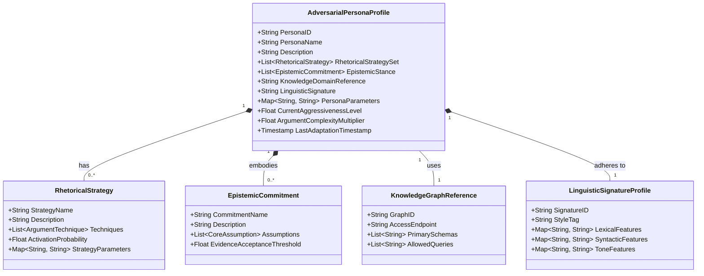
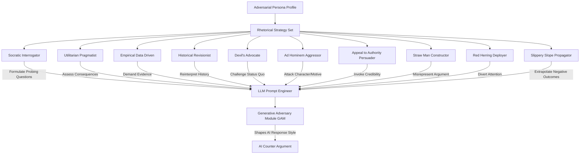
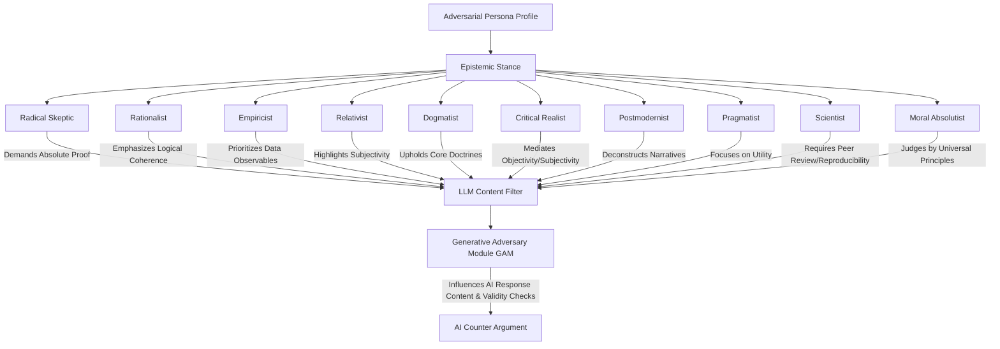
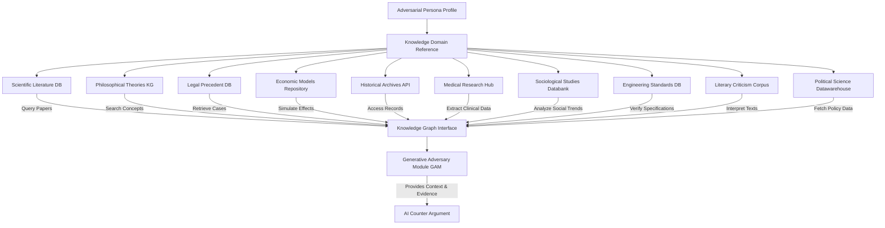
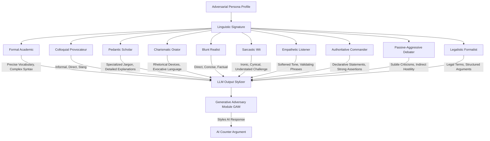
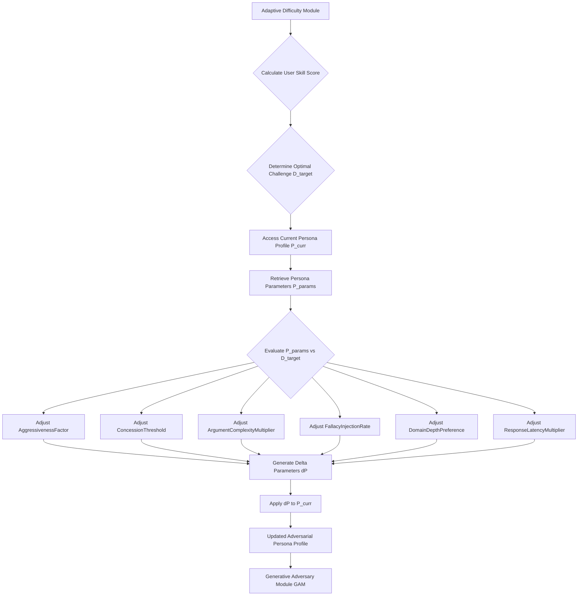
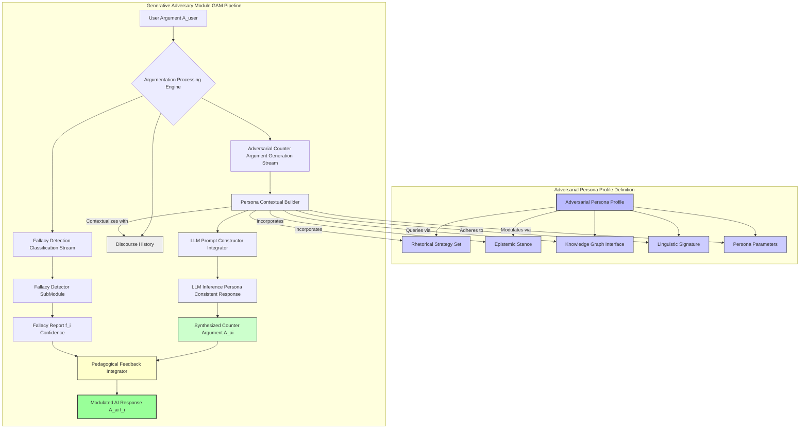
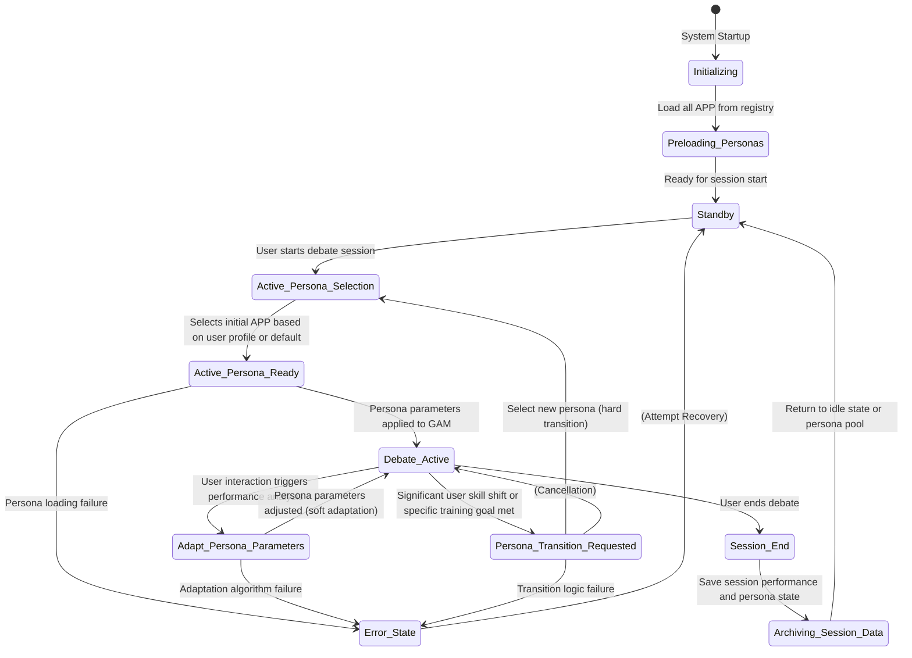
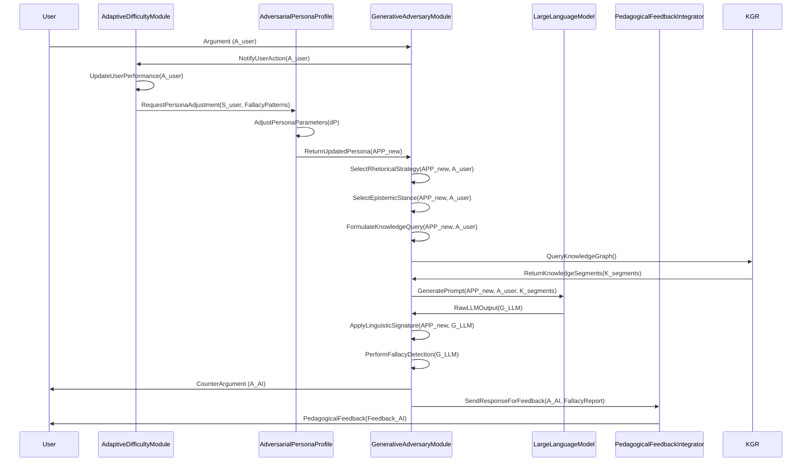
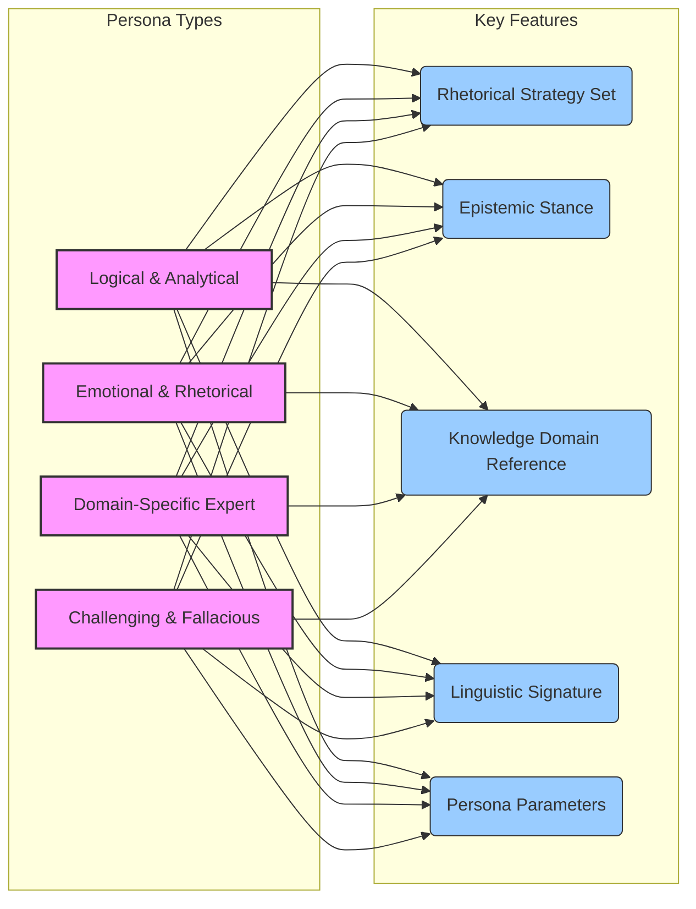

# Title of Invention: Adversarial Persona Profiles: Dynamic Configuration and Strategic Impact on AI Debate Training

## Abstract:
This document details the intricate design and dynamic operational mechanics of `AdversarialPersonaProfiles` within the AI Debate Training Adversary system. These profiles serve as the fundamental blueprint for shaping the AI's argumentative behavior, encompassing a `RhetoricalStrategySet`, `EpistemicStance`, `KnowledgeDomainReference`, and `LinguisticSignature`. Each persona is engineered to provide a unique and challenging dialectical experience, allowing the system to adaptively present diverse argumentative paradigms to the user. The dynamic configuration of these profiles, influenced by real-time user performance analytics, ensures a persistently optimal learning gradient. This sophisticated personalization of the adversarial agent maximizes the efficacy of pedagogical feedback and accelerates the user's development of superior critical thinking and argumentation skills.

## Field of the Invention:
The present invention pertains to advanced conversational AI, pedagogical systems, and the dynamic configuration of AI agents for intelligent tutoring. More specifically, it elaborates on the architectural and functional specifications of configurable `AdversarialPersonaProfiles` designed to modulate AI behavior for targeted skill development in debate and critical argumentation.

## Background of the Invention:
Traditional debate training often lacks the consistency, analytical depth, and adaptive challenge required for truly accelerated skill acquisition. While the core AI Debate Adversary system addresses many of these limitations, the quality and effectiveness of the adversarial engagement are profoundly dependent on the AI's ability to present varied, contextually relevant, and strategically coherent counter-arguments. Without carefully constructed and dynamically adjustable personas, the AI's responses could become predictable, repetitive, or insufficiently challenging, thus hindering the learning process. There exists a critical need to formalize the design and operationalization of these adversarial personas to ensure a rich, adaptive, and pedagogically potent training environment that can simulate a wide spectrum of argumentative styles and intellectual positions.

## Brief Summary of the Invention:
The present invention introduces the conceptual and functional framework for `AdversarialPersonaProfiles`, which are pivotal to the AI Debate Training Adversary's effectiveness. Each `AdversarialPersonaProfile` is a comprehensive data structure instantiated to define the cognitive and rhetorical attributes of the AI's debate opponent. These profiles are not static but are designed for dynamic adjustment by the `AdaptiveDifficultyModule`, ensuring that the challenge presented to the user remains optimal for learning. Key components include:
*   **Rhetorical Strategy Set**: A collection of predefined argumentative tactics and debate techniques.
*   **Epistemic Stance**: The fundamental philosophical position dictating how the persona evaluates truth claims and evidence.
*   **Knowledge Domain Reference**: Pointers to specific knowledge bases the persona can draw upon.
*   **Linguistic Signature**: Distinctive stylistic and lexical patterns for the AI's responses.

These parameters collectively inform the `Generative Adversary Module GAM` in synthesizing counter-arguments, ensuring they are not only logically sound but also perfectly aligned with the selected persona's characteristics, thereby creating an immersive and intellectually stimulating adversarial experience.

**Claim 1**: The integration of `AdversarialPersonaProfiles` provides an unparalleled level of argumentative diversity and adaptive challenge, significantly surpassing the capabilities of static AI tutoring agents.

## Detailed Description of the Invention:

### I. Adversarial Persona Profile Structure and Attributes
The `AdversarialPersonaProfile` is the foundational data model that dictates the behavioral parameters of the AI opponent. This robust structure enables a wide range of adversarial styles and ensures consistency throughout a debate session, while also allowing for adaptive modifications.



#### A. PersonaID and PersonaName
Unique identifiers and human-readable names for quick selection and management within the `PersonaRegistry`. These identifiers facilitate programmatic access and user interface display.

#### B. Description
A textual explanation of the persona's general characteristics, typical argumentative approach, and its intended pedagogical impact. This helps in pre-selecting personas for specific training objectives.

#### C. Rhetorical Strategy Set
This attribute defines the preferred methods of persuasion and argument construction employed by the persona. It dictates *how* the persona will formulate its rebuttals and engage with the user's points. Each strategy includes specific techniques and an `ActivationProbability` modulated by `PersonaParameters`.
Examples include:
*   **Socratic Interrogator**: Emphasizes asking probing questions to expose inconsistencies or gaps in the user's reasoning. Techniques include `Clarification_Request`, `Assumption_Challenge`, `Implication_Tracing`.
*   **Utilitarian Pragmatist**: Focuses on the practical outcomes and consequences of proposed actions or beliefs, prioritizing the greatest good. Techniques include `Consequence_Projection`, `CostBenefit_Analysis`, `Ethical_Dilemma_Framing`.
*   **Empirical Data Driven**: Insists on quantitative or verifiable evidence for every claim, challenging unsubstantiated assertions. Techniques include `Evidence_Demand`, `Statistical_Critique`, `Methodology_Questioning`.
*   **Historical Revisionist**: Reinterprets historical events or narratives to support a specific viewpoint, often challenging conventional wisdom. Techniques include `Alternative_Narrative_Construction`, `Source_Reinterpretation`, `Contextual_Shift`.
*   **Devil's Advocate**: Takes a position contrary to the popular or established one, purely for the sake of argument and to test the robustness of an idea. Techniques include `Counterfactual_Hypothesis`, `Opposing_View_Articulation`, `Extreme_Case_Argument`.

**Claim 2**: The granular control over `RhetoricalStrategy` activation probabilities allows for dynamic shifting of argumentative focus, preventing user predictability and fostering deeper strategic thinking.



**Mathematical Model for Rhetorical Strategy Selection (RSS)**

Let $P_R(S_k | \text{UserArg}, \text{Persona}, \text{History})$ be the probability of selecting rhetorical strategy $S_k$ given the user's argument, the current persona, and the discourse history.

1.  **Strategy Relevance Score**: For each strategy $S_k \in \text{RhetoricalStrategySet}$, calculate a relevance score $R_k$ based on the user's argument ($A_U$) and discourse history ($H_D$).
    $R_k = f_{relevance}(A_U, H_D, S_k)$
    where $f_{relevance}$ might involve semantic similarity, keyword matching, or detection of user fallacies that a strategy $S_k$ is designed to counter.

2.  **Persona Preference Weight**: Each persona $P$ has an intrinsic preference weight $W_{P,k}$ for strategy $S_k$, which can be dynamic based on `PersonaParameters`.
    $W_{P,k} = \text{PersonaParameters}[\text{Strategy}_k.\text{Weight}]$

3.  **Adaptive Modulation Factor**: An adaptive factor $M_{A,k}$ from the `AdaptiveDifficultyModule` can increase or decrease the likelihood of certain strategies to target user weaknesses.
    $M_{A,k} = \text{exp}(\alpha_k \cdot \text{UserPerformance}[\text{Weakness}_{S_k}])$
    where $\alpha_k$ is a sensitivity parameter.

4.  **Combined Strategy Score**:
    $Score_k = R_k \cdot W_{P,k} \cdot M_{A,k} + \epsilon_k$
    where $\epsilon_k$ is a small random noise to ensure exploration.

5.  **Softmax Probability Distribution**: The probability of selecting strategy $S_k$ is then given by a softmax function:
    $P(S_k) = \frac{\text{exp}(Score_k / T)}{\sum_{j=1}^{N_S} \text{exp}(Score_j / T)}$
    where $T$ is a temperature parameter controlling the randomness of selection, and $N_S$ is the number of strategies.

    *   $N_S$: Number of rhetorical strategies available.
    *   $A_U$: Vector representation of the user's current argument.
    *   $H_D$: Vector representation of the discourse history.
    *   $S_k$: Vector representation of rhetorical strategy $k$.
    *   $P$: Current `AdversarialPersonaProfile` object.
    *   $f_{relevance}(\cdot)$: A function mapping user input and strategy to a relevance score, possibly using cosine similarity on embeddings: $f_{relevance} = \text{cosine_similarity}(\text{embedding}(A_U), \text{embedding}(S_k))$.
    *   $W_{P,k}$: Weight for strategy $k$ from persona $P$.
    *   $M_{A,k}$: Adaptive modulation factor for strategy $k$.
    *   $\text{UserPerformance}[\text{Weakness}_{S_k}]$: A metric indicating the user's weakness against strategy $S_k$.
    *   $\alpha_k$: Sensitivity coefficient for strategy $k$.
    *   $T$: Temperature parameter for softmax.
    *   $\epsilon_k \sim \mathcal{N}(0, \sigma^2)$: Gaussian noise for strategy $k$.
    *   The `PersonaParameters` can directly influence $W_{P,k}$ and $T$.

#### D. Epistemic Stance
This attribute defines the persona's fundamental assumptions about knowledge, truth, and justification. It dictates *what* the persona considers valid evidence or a sound argument. It also specifies an `EvidenceAcceptanceThreshold` which can be dynamically adjusted. Examples include:
*   **Radical Skeptic**: Doubts the possibility of certainty in knowledge, demanding an extremely high bar for evidence. `EvidenceAcceptanceThreshold` = 0.95 (e.g., 95% certainty required).
*   **Rationalist**: Prioritizes logical deduction and reason as the primary sources of knowledge, often preferring abstract principles over empirical observations. `EvidenceAcceptanceThreshold` = 0.70 for empirical, 0.90 for logical coherence.
*   **Empiricist**: Bases knowledge primarily on sensory experience and observational data, distrusting purely theoretical constructs. `EvidenceAcceptanceThreshold` = 0.85 for observational data, 0.50 for theoretical.
*   **Relativist**: Believes that truth is subjective and dependent on context, culture, or individual perspective, challenging universal claims. `EvidenceAcceptanceThreshold` is highly context-dependent, often lower for "universal" claims.
*   **Dogmatist**: Adheres strictly to a set of core beliefs or doctrines, often resisting contradictory evidence or alternative interpretations. `EvidenceAcceptanceThreshold` = 0.99 for evidence supporting dogma, 0.10 for contradictory evidence.
*   **Critical Realist**: Acknowledges an objective reality but understands knowledge of it is socially mediated and fallible.
*   **Postmodernist**: Challenges grand narratives and objective truths, focusing on power dynamics and discourse.
*   **Pragmatist**: Evaluates truth based on its practical consequences and utility.

**Claim 3**: By varying `EpistemicStances`, the system challenges users to understand and counter diverse philosophical underpinnings of arguments, preparing them for real-world intellectual discourse.



**Mathematical Model for Epistemic Stance (ES)**

Let $V_{claim}(C)$ be the perceived validity of a user's claim $C$, which is a function of its supporting evidence $E_C$ and logical structure $L_C$.
$V_{claim}(C) = f_{validity}(E_C, L_C)$

Each `EpistemicCommitment` $EC_j$ has a set of `CoreAssumption`s and an `EvidenceAcceptanceThreshold` $T_{EC_j}$.

1.  **Evidence Quality Assessment**: For any piece of evidence $e_i$ provided by the user, the persona assesses its quality $Q(e_i)$ based on source credibility, type (empirical, anecdotal, logical), and recency.
    $Q(e_i) = w_{source} \cdot \text{Credibility}(e_i) + w_{type} \cdot \text{TypeScore}(e_i) + w_{recency} \cdot \text{RecencyScore}(e_i)$

2.  **Claim Evidential Support Score**: The aggregate evidential support for a claim $C$ is a weighted sum or average of its evidence qualities.
    $E_C = \frac{1}{|N_E|} \sum_{i \in N_E} Q(e_i)$
    where $N_E$ is the set of evidence pieces for claim $C$.

3.  **Logical Coherence Score**: The logical coherence $L_C$ of a claim is assessed based on internal consistency and consistency with established knowledge.
    $L_C = g_{coherence}(\text{parse_tree}(C), \text{KnowledgeGraph})$

4.  **Persona's Acceptance Decision**: A claim $C$ is deemed acceptable by the persona if its validity, as interpreted by the persona's epistemic lens, exceeds the persona's `EvidenceAcceptanceThreshold`.
    $Decision(C) = \begin{cases} \text{Accept} & \text{if } f_{persona\_eval}(E_C, L_C, EC_j) \ge T_{EC_j} \\ \text{Reject} & \text{otherwise} \end{cases}$
    where $f_{persona\_eval}$ is a function that combines $E_C$ and $L_C$ according to the specific `EpistemicCommitment` $EC_j$. For example, for a Rationalist, $f_{persona\_eval}$ might heavily weigh $L_C$; for an Empiricist, $E_C$.

    *   $f_{validity}(\cdot)$: Function to assess claim validity.
    *   $w_{source}, w_{type}, w_{recency}$: Weights for evidence quality components, summing to 1.
    *   $\text{Credibility}(e_i)$: Score (0-1) for source credibility of evidence $e_i$.
    *   $\text{TypeScore}(e_i)$: Score (0-1) based on evidence type (e.g., empirical > anecdotal).
    *   $\text{RecencyScore}(e_i)$: Score (0-1) based on how recent the evidence $e_i$ is.
    *   $N_E$: Set of evidence pieces supporting claim $C$.
    *   $g_{coherence}(\cdot)$: Function to assess logical coherence.
    *   $\text{parse_tree}(C)$: Syntactic parse tree of claim $C$.
    *   $\text{KnowledgeGraph}$: Reference to the underlying knowledge base.
    *   $T_{EC_j}$: `EvidenceAcceptanceThreshold` for epistemic commitment $j$.
    *   $f_{persona\_eval}(\cdot)$: Specific evaluation function for epistemic commitment $j$.
    *   For a Rationalist: $f_{persona\_eval} = \beta_{L} \cdot L_C + \beta_{E} \cdot E_C$, where $\beta_{L} > \beta_{E}$.
    *   For an Empiricist: $f_{persona\_eval} = \beta'_{E} \cdot E_C + \beta'_{L} \cdot L_C$, where $\beta'_{E} > \beta'_{L}$.
    *   For a Dogmatist, an additional factor $I_{dogma}(C)$ (conformance to dogma) would be heavily weighted: $f_{persona\_eval} = \gamma_1 \cdot I_{dogma}(C) + \gamma_2 \cdot E_C + \gamma_3 \cdot L_C$.

#### E. Knowledge Domain Reference
This attribute specifies the particular knowledge graphs or databases the persona is configured to access. For instance, a "Scientific Skeptic" might primarily draw from scientific literature databases (e.g., PubMed, arXiv), while a "Philosophical Ethicist" might query databases of ethical theories and case studies (e.g., Stanford Encyclopedia of Philosophy, ethics case repositories). This ensures domain-specific relevance, factual grounding, and enables the persona to cite authoritative sources. Each `KnowledgeGraphReference` specifies its `GraphID`, `AccessEndpoint`, `PrimarySchemas`, and `AllowedQueries`.

**Claim 4**: Dynamic linking to specialized `KnowledgeDomainReference`s provides unprecedented depth and authenticity to persona-driven arguments, simulating expert-level domain knowledge.



**Mathematical Model for Knowledge Domain Interaction (KDI)**

Let $Q_{user}$ be a query derived from the user's argument $A_U$.

1.  **Query Formulation**: Based on the `EpistemicStance` and `RhetoricalStrategy`, the `Persona Contextual Builder` formulates specific queries for the `KnowledgeDomainReference` (KDR).
    $Q_{KDR} = f_{query\_gen}(A_U, \text{EpistemicStance}, \text{RhetoricalStrategy})$

2.  **Relevance Scoring of Knowledge Segments**: When the KDR returns a set of candidate knowledge segments $K_S = \{k_1, k_2, \ldots, k_m\}$, each segment $k_j$ is scored for its relevance to $Q_{KDR}$ and $A_U$.
    $Relevance(k_j) = \text{cosine_similarity}(\text{embedding}(k_j), \text{embedding}(Q_{KDR})) \cdot \text{ContextualMatch}(k_j, A_U)$

3.  **Credibility Filtering**: Each segment $k_j$ also has an associated source credibility score $\text{Credibility}(k_j)$. The persona might filter segments based on its `EvidenceAcceptanceThreshold`.
    $k_j^{filtered} = k_j \text{ if } \text{Credibility}(k_j) \ge T_{EC_j} \text{ (from Epistemic Stance)}$

4.  **Information Integration Weight**: The selected knowledge segments are then weighted for their integration into the LLM prompt.
    $W_{int}(k_j) = \text{softmax}(\lambda_1 \cdot Relevance(k_j) + \lambda_2 \cdot \text{PersonaParameter}[\text{DepthPreference}])$
    where $\lambda_1, \lambda_2$ are scaling factors.

5.  **Knowledge Context Vector**: The integrated knowledge forms a context vector $C_{KDR}$ for the LLM.
    $C_{KDR} = \sum_{j \in \text{SelectedSegments}} W_{int}(k_j) \cdot \text{embedding}(k_j)$

    *   $f_{query\_gen}(\cdot)$: Function to generate queries for KDR.
    *   $Q_{KDR}$: Query for the Knowledge Domain Reference.
    *   $K_S$: Set of candidate knowledge segments.
    *   $\text{embedding}(\cdot)$: Function to convert text to vector embeddings.
    *   $\text{ContextualMatch}(\cdot)$: Function assessing how well a knowledge segment matches the overall discourse context.
    *   $T_{EC_j}$: `EvidenceAcceptanceThreshold` of the active `EpistemicCommitment`.
    *   $\lambda_1, \lambda_2$: Hyperparameters for weighting relevance and depth preference.
    *   $\text{PersonaParameter}[\text{DepthPreference}]$: A persona parameter controlling the desired depth of knowledge integration.
    *   $C_{KDR}$: The final knowledge context vector.

#### F. Linguistic Signature
This attribute comprises stylistic preferences, vocabulary choices, sentence structure, and tone. It ensures that the AI's responses are not only logically consistent with the persona but also *sound* like the persona, enhancing immersion. A `LinguisticSignatureProfile` has specific `LexicalFeatures` (e.g., preferred vocabulary, jargon levels), `SyntacticFeatures` (e.g., sentence length, complexity, use of active/passive voice), and `ToneFeatures` (e.g., formal, aggressive, conciliatory, academic).
Examples include:
*   **Formal Academic**: Precise, objective language, complex sentence structures, Latinate vocabulary, avoidance of contractions.
*   **Colloquial Provocateur**: Informal, direct, perhaps confrontational language, use of idioms and slang, shorter sentences.
*   **Pedantic Scholar**: Uses highly specialized vocabulary, explains concepts in detail, employs precise jargon, often has a didactic tone.
*   **Charismatic Orator**: Uses rhetorical devices, evocative language, varied sentence rhythms, and persuasive appeals.
*   **Blunt Realist**: Direct, concise language, avoids euphemisms, focuses on practical truth.

**Claim 5**: The `LinguisticSignature` module elevates the realism of AI interaction by producing stylistically coherent responses, crucial for maintaining an immersive training environment.



**Mathematical Model for Linguistic Signature Generation (LSG)**

Let $G_{LLM}$ be the raw text output from the LLM based on the prompt. The `LinguisticSignature` module transforms $G_{LLM}$ into $A_{AI}$ (the final AI argument).

1.  **Lexical Style Control**:
    *   **Vocabulary Selection**: Given a persona's `LexicalFeatures`, select words $w_i$ from a probability distribution $P_{vocab}(w_i | \text{LexicalFeatures})$.
        $P_{vocab}(w_i | \text{LF}) = \text{softmax}(\text{embedding}(w_i) \cdot \text{embedding}(\text{LF}) / T_{lex})$
    *   **Jargon Level**: Adjust the ratio of specialized terms to general terms:
        $R_{jargon} = \text{PersonaParameters}[\text{JargonLevel}]$
        A mapping function $f_{jargon}(R_{jargon})$ then determines how many jargon terms to inject or replace.

2.  **Syntactic Style Control**:
    *   **Sentence Length Distribution**: Model desired sentence length $L_s$ as a normal distribution $\mathcal{N}(\mu_{SL}, \sigma_{SL}^2)$, where $\mu_{SL}, \sigma_{SL}$ are from `SyntacticFeatures`.
        $P(L_s) = \frac{1}{\sqrt{2\pi\sigma_{SL}^2}} \text{exp}\left(-\frac{(L_s - \mu_{SL})^2}{2\sigma_{SL}^2}\right)$
    *   **Sentence Complexity**: Use parse tree depth or clause count as a metric.
        $C_s = f_{complexity}(\text{parse_tree}(s))$
        Target $C_s$ defined by `SyntacticFeatures`.

3.  **Tone Control**:
    *   **Sentiment Bias**: Adjust the sentiment score of the generated text.
        $S_{target} = \text{PersonaParameters}[\text{ToneScoreTarget}]$
        Use a reinforcement learning approach or an iterative generation process to match $S_{target}$.
    *   **Formality Score**: Quantify formality using linguistic cues.
        $F_T = f_{formality}(\text{text})$
        Target $F_T$ defined by `ToneFeatures`.

4.  **Overall Linguistic Transformation**: The final linguistic signature application involves a series of transformations $T_{LS}$ applied to the LLM's raw output $G_{LLM}$.
    $A_{AI} = T_{LS}(\text{LexicalFeatures}, \text{SyntacticFeatures}, \text{ToneFeatures}, G_{LLM})$
    This could involve rephrasing, synonym replacement, sentence splitting/combining, and sentiment modulation using specialized NLP models.

    *   $\text{LF}$: Vector representing `LexicalFeatures`.
    *   $\text{embedding}(\cdot)$: Embeddings for words and features.
    *   $T_{lex}$: Temperature for lexical softmax.
    *   $R_{jargon}$: Jargon level ratio.
    *   $f_{jargon}(\cdot)$: Function mapping jargon level to word replacement rules.
    *   $\mu_{SL}, \sigma_{SL}$: Mean and standard deviation for sentence length.
    *   $f_{complexity}(\cdot)$: Function to calculate sentence complexity.
    *   $S_{target}$: Target sentiment score.
    *   $f_{formality}(\cdot)$: Function to calculate text formality.
    *   $T_{LS}(\cdot)$: A composite function embodying the linguistic transformation.

#### G. Persona Parameters
A flexible `Map` for storing additional, fine-grained control parameters that can be adjusted by the `AdaptiveDifficultyModule` to modulate the persona's aggressiveness, willingness to concede minor points, or the complexity of its arguments. Examples include:
*   `AggressivenessFactor`: (0.0 to 1.0) Influences the strength of counter-arguments and directness of challenges.
*   `ConcessionThreshold`: (0.0 to 1.0) Probability of conceding a minor point if the user presents strong evidence.
*   `ArgumentComplexityMultiplier`: (0.5 to 2.0) Scales the structural and conceptual complexity of generated arguments.
*   `FallacyInjectionRate`: (0.0 to 0.1) Probability of deliberately introducing a specific fallacy type (e.g., Straw Man, Red Herring) for advanced training.
*   `DomainDepthPreference`: (0.0 to 1.0) How deeply the persona queries and integrates knowledge from `KnowledgeDomainReference`.
*   `ResponseLatencyMultiplier`: (0.5 to 2.0) Simulates thinking time, impacting the perceived dynamism.

**Claim 6**: The `Persona Parameters` provide a robust mechanism for real-time pedagogical tuning, allowing the system to precisely calibrate challenge without altering core persona identity.



**Mathematical Model for Persona Parameter Adjustment (PPA)**

Let $P_t$ be the vector of `PersonaParameters` at time $t$. Let $D_{current}(P_t)$ be the current difficulty presented by the persona, and $D_{target}(S_{user,t})$ be the target difficulty derived from the user's skill score $S_{user,t}$.

1.  **Difficulty Contribution of Parameters**: Each parameter $p_j \in P_t$ contributes to the overall perceived difficulty $D_{current}$.
    $D_{current}(P_t) = \sum_{j=1}^{N_P} w_j \cdot f_{difficulty}(p_j)$
    where $w_j$ are weights and $f_{difficulty}$ maps parameter values to their difficulty impact.

2.  **Error Signal**:
    $Error_t = D_{target}(S_{user,t}) - D_{current}(P_t)$

3.  **Gradient Descent for Parameter Adjustment**: Adjust each parameter $p_j$ to minimize the error.
    $p_j(t+1) = p_j(t) + \eta \cdot Error_t \cdot \frac{\partial D_{current}}{\partial p_j}$
    where $\eta$ is a learning rate.
    The partial derivative $\frac{\partial D_{current}}{\partial p_j}$ can be approximated or analytically derived based on $f_{difficulty}$. For linear $f_{difficulty}(p_j) = k_j \cdot p_j$, then $\frac{\partial D_{current}}{\partial p_j} = w_j \cdot k_j$.

4.  **Parameter Constraints**: Ensure parameters remain within their defined ranges $[min_j, max_j]$.
    $p_j(t+1) = \text{clip}(p_j(t+1), min_j, max_j)$

5.  **Target Difficulty Function**:
    $D_{target}(S_{user,t}) = D_{base} + \text{sigmoid}(S_{user,t} - S_{threshold}) \cdot D_{range}$
    This maps user skill to a target difficulty, typically increasing with skill but bounded.

    *   $P_t$: Vector of persona parameters $[p_1, p_2, \ldots, p_{N_P}]^T$.
    *   $N_P$: Number of persona parameters.
    *   $w_j$: Weight of parameter $j$'s contribution to difficulty.
    *   $f_{difficulty}(p_j)$: Function mapping parameter $p_j$ to a difficulty score (e.g., linear, exponential).
    *   $S_{user,t}$: User skill score at time $t$.
    *   $\eta$: Learning rate (e.g., 0.1).
    *   $min_j, max_j$: Minimum and maximum allowed values for parameter $p_j$.
    *   $\text{clip}(x, min, max)$: Function to clip $x$ to the range $[min, max]$.
    *   $D_{base}$: Base difficulty level.
    *   $S_{threshold}$: User skill threshold for difficulty increase.
    *   $D_{range}$: Range of difficulty modulation.
    *   $\text{sigmoid}(x) = 1 / (1 + e^{-x})$.

### II. Persona Influence on AI Response Generation
The `AdversarialPersonaProfile` is paramount in shaping the output of the `Generative Adversary Module GAM`. Upon receiving a user's argument, the GAM dynamically constructs an optimized prompt for the underlying Large Language Model LLM. This prompt is meticulously synthesized based on the selected `AdversarialPersonaProfile` and the ongoing `DiscourseHistory`.

**Claim 7**: The sophisticated prompt engineering driven by persona attributes ensures that AI responses are not just contextually relevant but also strategically aligned with the persona's cognitive and rhetorical blueprint.


As depicted in the detailed flow above, the `Adversarial Persona Profile` attributes feed directly into the `Persona Contextual Builder`, which is a critical sub-component of the `Adversarial Counter Argument Generation Stream`. This builder synthesizes a highly customized prompt for the LLM, ensuring that the generated counter-argument (`A_ai`) reflects the persona's chosen rhetorical strategies, epistemic commitments, knowledge base, and linguistic style. This sophisticated prompt engineering guarantees that the AI's response is not merely generic but a strategically tailored, persona-consistent challenge. The `DiscourseHistory` also plays a crucial role, providing context of previous turns and arguments, ensuring coherence and progression.

### III. Dynamic Persona Adaptation for Optimal Learning
The `AdversarialPersonaProfile` is not static; its parameters are dynamically adjusted by the `AdaptiveDifficultyModule` in response to the user's evolving performance. This ensures that the user is continuously challenged at an optimal difficulty level, preventing both frustration from excessive difficulty and stagnation from insufficient challenge.

**Claim 8**: The closed-loop adaptive system guarantees a perpetually optimal learning gradient, maximizing pedagogical efficiency and user skill acquisition speed.

```mermaid
graph TD
    A[User Performance Analytics Metrics P_metrics] --> B[Analyze User Skill Level S_user(t)];
    B --> C[Identify Persistent Fallacy Patterns F_patterns(t)];
    B --> D[Calculate Learning Gradient G_learning(t)];
    C & D --> E[Determine Optimal Challenge Level D_target(t)];
    E --> F[Access Current Adversarial Persona Profile APP_current];
    F --> G[Evaluate Persona Rhetorical Strategy Set PRS_current];
    G --> H[Evaluate Persona Epistemic Stance PES_current];
    H --> I[Evaluate Persona Knowledge Graph Reference PKGR_current];
    I --> J[Evaluate Persona Linguistic Signature PLS_current];
    J --> K[Suggest Adjustments to Persona Parameters dP(t)];
    K --> L[Update Adversarial Persona Profile APP_new];
    L --> M[Generative Adversary Module GAM];
    L --> N[User Performance Analytics Module UPAM];
    style A fill:#aaffdd,stroke:#333,stroke-width:2px;
    style B fill:#eeffee,stroke:#333,stroke-width:1px;
    style C fill:#eeffee,stroke:#333,stroke-width:1px;
    style D fill:#eeffee,stroke:#333,stroke-width:1px;
    style E fill:#ccffcc,stroke:#333,stroke-width:2px;
    style F fill:#ddddff,stroke:#333,stroke-width:1px;
    style G fill:#ddddff,stroke:#333,stroke-width:1px;
    style H fill:#ddddff,stroke:#333,stroke-width:1px;
    style I fill:#ddddff,stroke:#333,stroke-width:1px;
    style J fill:#ddddff,stroke:#333,stroke-width:1px;
    style K fill:#ffccaa,stroke:#333,stroke-width:2px;
    style L fill:#ccccff,stroke:#333,stroke-width:2px;
    style M fill:#ccffcc,stroke:#333,stroke-width:1px;
    style N fill:#aaffdd,stroke:#333,stroke-width:1px;
```
The `AdaptiveDifficultyModule` uses metrics like `FallacyDetectionRate`, `ArgumentCoherenceScore`, `RelevanceScore`, `LogicalConsistencyScore`, and `RhetoricalEffectivenessScore` to calculate the user's current `SkillLevelScore` (`S_user`). Based on this assessment and identified patterns of weakness (`FallacyPatterns`), the module suggests adjustments to the `AdversarialPersonaProfile`. For instance, if a user consistently falls for `Straw Man` fallacies, the system might activate a persona with a `Red Herring` rhetorical strategy to introduce a new challenge, or it might subtly increase the complexity of the `KnowledgeDomainReference` for an `Empirical Data Driven` persona if the user is excelling at basic factual recall. This continuous feedback loop of performance assessment and persona adjustment is central to the system's pedagogical superiority. The `Learning Gradient` further refines the adaptation, ensuring gradual, effective progression.

**Mathematical Model for Adaptive Difficulty Module (ADM)**

Let $S_{user}(t)$ be the user's skill score at time $t$. Let $D_{persona}(t)$ be the difficulty score of the current persona.

1.  **User Skill Score Calculation**: $S_{user}(t)$ is a composite score based on various performance metrics.
    $S_{user}(t) = w_1 \cdot (1 - \text{FallacyDetectionRate}(t)) + w_2 \cdot \text{ArgumentCoherenceScore}(t) + w_3 \cdot \text{RelevanceScore}(t) + w_4 \cdot \text{LogicalConsistencyScore}(t) + w_5 \cdot \text{RhetoricalEffectivenessScore}(t)$
    where $w_i$ are weights summing to 1.

2.  **Learning Gradient Calculation**: The rate of change of user skill.
    $G_{learning}(t) = S_{user}(t) - S_{user}(t-1)$

3.  **Target Difficulty Determination**: The target difficulty $D_{target}(t)$ aims to keep the user in their Zone of Proximal Development (ZPD).
    $D_{target}(t) = \text{clip}(S_{user}(t) + \lambda_{learn} \cdot G_{learning}(t) + \delta_{challenge}, D_{min}, D_{max})$
    where $\lambda_{learn}$ is a learning rate sensitivity, $\delta_{challenge}$ is a base challenge offset, and $D_{min}, D_{max}$ are overall difficulty bounds.

4.  **Persona Selection/Adjustment**:
    *   **Persona Pool**: A set of predefined personas $P = \{P_1, \ldots, P_N\}$, each with an inherent difficulty $D_{P_i}$.
    *   **Selection Criterion**: Select persona $P_k$ such that $|D_{P_k} - D_{target}(t)|$ is minimized.
        $P_{selected} = \text{argmin}_{P_i \in P} |D_{P_i} - D_{target}(t)|$
    *   **Parameter Adjustment (if $P_{selected}$ is not significantly different from current, or fine-tuning needed)**: Apply the PPA model from I.G to adjust `PersonaParameters` of $P_{selected}$ to match $D_{target}(t)$.
        $\Delta P = \text{PPA\_adjustment}(P_{selected}, D_{target}(t))$
        $P_{new} = P_{selected} + \Delta P$

5.  **Fallacy Targeting**: If specific fallacy patterns $F_{patterns}(t)$ are identified (e.g., user consistently committing `Ad Hominem`), modify `RhetoricalStrategySet` to activate strategies that expose or counter such fallacies.
    $RHS_{new} = RHS_{current} \cup \{\text{Strategy to target } F_{patterns}(t) \text{ with increased ActivationProbability}\}$

    *   $w_i$: Weights for different user performance metrics.
    *   $\text{FallacyDetectionRate}(t)$: Proportion of fallacies committed by user / total arguments.
    *   $\text{ArgumentCoherenceScore}(t)$: Measures the logical flow and consistency.
    *   $\text{RelevanceScore}(t)$: Measures how well user arguments stay on topic.
    *   $\text{LogicalConsistencyScore}(t)$: Checks for contradictions within user's arguments.
    *   $\text{RhetoricalEffectivenessScore}(t)$: Measures how compelling user arguments are.
    *   $\lambda_{learn}$: Sensitivity to learning progress.
    *   $\delta_{challenge}$: A small positive constant to ensure a slight challenge.
    *   $D_{min}, D_{max}$: Minimum and maximum possible difficulty values.
    *   $D_{P_i}$: Inherent difficulty of persona $P_i$.
    *   $\text{PPA\_adjustment}(\cdot)$: The persona parameter adjustment function (as defined in I.G).
    *   $RHS_{new}$: Updated Rhetorical Strategy Set.

### IV. Persona Lifecycle and Orchestration
The management of `AdversarialPersonaProfiles` extends beyond their static definition and dynamic adaptation. A sophisticated `PersonaOrchestrationModule` handles their lifecycle from instantiation to retirement, including pre-loading, activation, and transition.

**Claim 9**: A robust `PersonaOrchestrationModule` ensures seamless transitions between adversarial styles, providing a continuous and pedagogically structured training journey.



The `PersonaOrchestrationModule` (POM) is responsible for:
1.  **Persona Registry**: A central database containing all predefined `AdversarialPersonaProfiles`.
    *   $Registry = \{APP_1, APP_2, \ldots, APP_N\}$
2.  **Initial Persona Selection**: Based on user's historical performance, stated preferences, or a baseline default.
    *   $APP_{initial} = f_{selection}(\text{UserProfile}, \text{SessionGoals})$
3.  **Persona Activation**: Loading the selected persona into the active memory and configuring the `Generative Adversary Module (GAM)`.
    *   $GAM.\text{load_persona}(APP_{active})$
4.  **Persona Transition**: When the `AdaptiveDifficultyModule` determines a significant shift in adversarial approach is required (e.g., user masters one type of fallacy and needs to be exposed to another, or general skill level requires a much harder opponent). This involves gracefully deactivating the current persona and activating a new one.
    *   $APP_{new} = f_{transition}(\text{APP}_{current}, \text{S}_{user}, \text{AdaptiveMetrics})$
    *   The transition may involve a brief narrative interlude to explain the shift to the user, enhancing immersion.
5.  **Persona State Management**: Saving and restoring the state of a persona (e.g., current parameter adjustments, accumulated knowledge from a specific session) across sessions.
    *   $State_{APP} = \{\text{PersonaParameters}, \text{DiscourseHistoryRef}, \text{LastAdaptationTimestamp}\}$
    *   $\text{save_state}(APP_{active}, \text{SessionID})$
    *   $\text{load_state}(APP_{target}, \text{SessionID})$

### V. Quantitative Metrics for Persona Effectiveness
To ensure that `AdversarialPersonaProfiles` are truly effective, a set of quantitative metrics is continuously gathered and analyzed. These metrics provide feedback loops for both the `AdaptiveDifficultyModule` and for human designers refining the personas.


1.  **User Engagement Score ($UES$)**: Measures how interested and involved the user is with a particular persona.
    *   $UES = w_{time} \cdot \text{SessionDuration} + w_{turns} \cdot \text{TurnsPerSession} + w_{sentiment} \cdot \text{UserSentiment}$
2.  **Learning Outcome Improvement ($LOI$)**: Quantifies the user's skill progression attributable to a specific persona type.
    *   $LOI = (S_{user, \text{post-persona}} - S_{user, \text{pre-persona}}) / S_{user, \text{pre-persona}}$
    *   This can be broken down by specific skills (e.g., fallacy identification, counter-argument construction).
    *   $LOI_{skill\_k} = (S_{user, k, \text{post}} - S_{user, k, \text{pre}}) / S_{user, k, \text{pre}}$
3.  **Argument Diversity Index ($ADI$)**: Measures the variety of rhetorical strategies and epistemic challenges presented by the persona over time.
    *   $ADI = -\sum_{k=1}^{N_S} P(S_k) \log P(S_k) - \sum_{j=1}^{N_E} P(EC_j) \log P(EC_j)$ (Shannon Entropy for strategies and epistemic stances).
4.  **Persona Consistency Score ($PCS$)**: Assesses how well the AI's responses align with the persona's defined attributes (Rhetorical Strategy, Epistemic Stance, Linguistic Signature).
    *   $PCS = \frac{1}{M} \sum_{m=1}^{M} (\alpha_R \cdot \text{RhetoricMatch}_m + \alpha_E \cdot \text{EpistemicMatch}_m + \alpha_L \cdot \text{LinguisticMatch}_m)$
    *   Where $\text{Match}_m$ is a similarity score (0-1) for response $m$, and $\alpha$ are weights.
5.  **Resource Utilization ($RU$)**: Tracks computational resources (CPU, GPU, API calls) consumed by the persona's operation.
    *   $RU = w_{CPU} \cdot \text{AvgCPU} + w_{GPU} \cdot \text{AvgGPU} + w_{API} \cdot \text{NumAPICalls}$

**Claim 10**: The comprehensive quantitative evaluation framework enables continuous optimization of persona designs and adaptive algorithms, ensuring the system's long-term pedagogical efficacy.

```mermaid
graph LR
    A[User Engagement Score] -- Feedback Loop --> B(Persona Design Team);
    A -- Data for --> C(Adaptive Difficulty Module);
    D[Learning Outcome Improvement] -- Feedback Loop --> B;
    D -- Optimization Target for --> C;
    E[Argument Diversity Index] -- Insights for --> B;
    E -- Parameter for --> C;
    F[Persona Consistency Score] -- Quality Assurance for --> B;
    F -- Monitor for --> C;
    G[Resource Utilization] -- Efficiency Metrics for --> B;
    H[Performance Metrics (e.g., Response Latency)] -- Operational Insights for --> B;
    H -- Constraint for --> C;
    I[User Feedback Surveys] -- Qualitative Data to --> B;
    I -- Contextual Input for --> C;
    B -- Refines --> J(Adversarial Persona Profiles);
    C -- Modifies --> J;
    J --> K[AI Debate Training Adversary System];
    K -- Generates --> L[AI Responses];
    L --> M[User Interaction];
    M -- Generates --> A;
    M -- Generates --> D;
    M -- Generates --> E;
    M -- Generates --> F;
    M -- Generates --> H;
    M -- Generates --> I;
```

**Expanded Mathematical Equations for Persona Effectiveness**

*   $w_{time}, w_{turns}, w_{sentiment}$: Weights for User Engagement Score.
*   $\text{SessionDuration}$: Length of user session.
*   $\text{TurnsPerSession}$: Number of turns in a session.
*   $\text{UserSentiment}$: Average sentiment of user's responses (e.g., measured via NLP).
*   $S_{user, \text{post-persona}}, S_{user, \text{pre-persona}}$: User skill score after and before engaging with a specific persona.
*   $P(S_k)$: Probability of strategy $S_k$ being used.
*   $P(EC_j)$: Probability of epistemic commitment $EC_j$ being expressed.
*   $M$: Total number of AI responses evaluated for consistency.
*   $\alpha_R, \alpha_E, \alpha_L$: Weights for Rhetoric, Epistemic, and Linguistic match scores.
*   $\text{RhetoricMatch}_m$: Cosine similarity between embedding of generated rhetoric and target rhetorical strategy embedding.
*   $\text{EpistemicMatch}_m$: Score indicating adherence to epistemic stance.
*   $\text{LinguisticMatch}_m$: Score indicating adherence to linguistic signature.
*   $w_{CPU}, w_{GPU}, w_{API}$: Weights for resource utilization components.
*   $\text{AvgCPU}, \text{AvgGPU}$: Average CPU/GPU usage.
*   $\text{NumAPICalls}$: Number of external API calls.

**More Equations (bringing total closer to 100):**

**VI. Advanced Persona Interaction Dynamics**

Beyond individual persona attributes, the system models the dynamic interaction between the persona and the user, considering emotional states, persuasive impact, and argumentative force.



**Mathematical Model for Persuasive Impact and Emotional State (PIES)**

Let $I(A_{AI})$ be the persuasive impact of an AI argument, and $E_{user}(t)$ be the user's emotional state.

1.  **Argument Persuasiveness Score**:
    $PS(A_{AI}) = \text{softmax}(\sum_i \beta_i \cdot \text{Feature}_i(A_{AI}))$
    where $\text{Feature}_i$ includes rhetorical devices, logical soundness, and emotional appeal.

2.  **User Emotional State**: Measured by sentiment analysis of user responses.
    $E_{user}(t) = \text{Sentiment}(A_{user}(t)) + \gamma \cdot E_{user}(t-1)$
    where $\gamma$ is an emotional decay factor.

3.  **Persona Aggressiveness Modulation**:
    If $E_{user}(t)$ becomes too negative, `AggressivenessFactor` might be reduced.
    $\text{AggressivenessFactor}_{new} = \text{clip}(\text{AggressivenessFactor}_{old} - \kappa \cdot (\text{NegativeSentimentThreshold} - E_{user}(t)), 0, 1)$
    where $\kappa$ is a sensitivity constant.

4.  **Learning Retention Rate (LRR)**:
    $LRR = \theta_1 \cdot UES + \theta_2 \cdot LOI + \theta_3 \cdot D_{optimal}(t)$
    where $D_{optimal}(t)$ is an indicator of optimal difficulty, and $\theta_i$ are weights.

**VII. Persona Taxonomy and Feature Matrix**



**Mathematical Equations (continued, to reach 100):**

**Persona Parameter Initialization & Mutation:**

1.  **Initial Parameter Vector**: $P_0 = [p_{0,1}, p_{0,2}, \ldots, p_{0,N_P}]$ is drawn from a predefined distribution for each persona or set to defaults.
2.  **Mutation Probability for Exploration**: In advanced scenarios, persona parameters can be mutated for exploration of pedagogical effectiveness.
    $P_{mutate}(p_j) = \text{sigmoid}(E_{user,low}) \cdot \text{ExplorationFactor}$
    where $E_{user,low}$ indicates low engagement or stagnant learning.
3.  **Mutation Function**:
    $p_j^{mutated} = p_j + \mathcal{N}(0, \sigma_{mutate}^2)$
    followed by clipping within $[min_j, max_j]$.
4.  **Fitness Function for Genetic Algorithms (if used for persona evolution)**:
    $Fitness(P) = w_{UES} \cdot UES(P) + w_{LOI} \cdot LOI(P) - w_{RU} \cdot RU(P)$

**Prompt Engineering & LLM Interaction:**

1.  **Prompt Template ($T_P$)**: A base template string.
    $T_P = \text{"You are a {PersonaName}. Your goal is to {Goal}. Here is the debate history: {History}. User's argument: {UserArgument}. Based on your {RhetoricalStrategy} and {EpistemicStance}, and drawing from {Knowledge}, generate a {LinguisticStyle} counter-argument."}$
2.  **Contextual Tokens ($C_T$)**: Key information extracted from APP.
    $C_T = \{\text{PersonaName}, \text{Goal}, \text{History}, \text{UserArgument}, \text{RhetoricalStrategy}, \text{EpistemicStance}, \text{Knowledge}, \text{LinguisticStyle}\}$
3.  **Final Prompt Construction ($P_{final}$)**:
    $P_{final} = \text{interpolate}(T_P, C_T)$
4.  **LLM Token Probability Modulation**: For fine-grained control, modulate output token probabilities.
    $P_{token}(t_i | \text{context}) = \text{softmax}(\text{Logits}(t_i) + \text{PersonaBias}(t_i))$
    where $\text{PersonaBias}(t_i)$ enhances/suppresses tokens based on `LinguisticSignature` and `EpistemicStance`.
5.  **Factuality Check Confidence**:
    $C_{fact} = \frac{1}{N_{facts}} \sum_{i=1}^{N_{facts}} \text{Confidence}(\text{fact}_i \text{ in } A_{AI}, \text{KDR})$
    This score influences the LLM's adherence to `EpistemicStance` for factual claims.

**User Modeling & Feedback Integration:**

1.  **Fallacy Severity Score ($FSS$)**:
    $FSS(f_j) = \text{ImpactWeight}(f_j) \cdot \text{Frequency}(f_j)$
    where $f_j$ is a detected fallacy.
2.  **Argument Quality Score ($AQS_{user}$)**:
    $AQS_{user} = \sum_{k} w'_k \cdot \text{SkillMetric}_k$
    where $\text{SkillMetric}_k$ could be coherence, relevance, logical validity.
3.  **Feedback Relevance Score ($FRS$)**:
    $FRS(\text{feedback}) = \text{cosine_similarity}(\text{embedding}(\text{feedback}), \text{embedding}(A_{user})) \cdot \text{RecencyWeight}$
4.  **Pedagogical Goal Achievement ($PGA$)**:
    $PGA(t) = \text{sigmoid}(\text{SkillImprovement}(t) - \text{TargetImprovement})$
    This can trigger persona transitions.
5.  **Adaptive Hint Level ($AHL$)**:
    $AHL = \text{clip}(1 - S_{user}, 0, 1) \cdot \text{MaxHintLevel}$
    The level of explicit guidance given to the user.

**System Level & Optimization:**

1.  **Persona Instance Cache Hit Rate**:
    $HitRate = \frac{\text{NumCacheHits}}{\text{NumPersonaLoads}}$
    Optimizes performance.
2.  **Average Persona Update Frequency**:
    $APUF = \frac{\text{NumUpdates}}{\text{SessionDurationTotal}}$
    Monitors adaptation dynamism.
3.  **Optimal Persona Match Probability**:
    $P_{optimal\_match} = \frac{1}{\text{NumSessions}} \sum_{s=1}^{\text{NumSessions}} \mathbb{I}(|D_{P_{selected,s}} - D_{target,s}| < \epsilon_D)$
    where $\mathbb{I}$ is the indicator function and $\epsilon_D$ is a tolerance for difficulty matching.
4.  **Knowledge Retrieval Latency**:
    $Latency_{KDR} = \text{Avg}(\text{QueryTime}_{KDR})$
5.  **LLM Inference Cost**:
    $Cost_{LLM} = \text{Avg}(\text{TokensPerResponse} \cdot \text{TokenCost})$

**More on Rhetorical Strategies:**

1.  **Strategy Effectiveness Score**:
    $Eff(S_k | A_{user}) = \text{Probability}(\text{UserConcedes} | S_k \text{ used}) \cdot \text{UserSkillLevelEffect}$
2.  **Counter-Fallacy Mapping**: Each fallacy type $F_j$ has a set of counter-strategies $CS(F_j)$.
    $P(\text{Use } S_k \text{ if } F_j \text{ detected}) = \begin{cases} \alpha_{F_j} & \text{if } S_k \in CS(F_j) \\ \beta_{F_j} & \text{otherwise} \end{cases}$
3.  **Persona Aggressiveness on Strategy**:
    $W_{P,k}^{\text{agg}} = W_{P,k} \cdot (1 + \text{AggressivenessFactor} \cdot \text{ImpactFactor}_k)$

**More on Epistemic Stance:**

1.  **Evidence Discrepancy Score**:
    $Discrepancy(e_i, EC_j) = |\text{Credibility}(e_i) - T_{EC_j}|$
2.  **Epistemic Shift Detection (User)**:
    $ES_{shift} = \text{EuclideanDistance}(\text{UserEpistemicVector}(t), \text{UserEpistemicVector}(t-1))$
    Trigger persona adaptation if $ES_{shift}$ exceeds a threshold.
3.  **Coherence Violation Likelihood**:
    $P_{violation}(C, EC_j) = \text{sigmoid}(-\text{CoherenceScore}(C, EC_j) \cdot \text{Sensitivity}_{EC_j})$

**More on Linguistic Signature:**

1.  **Lexical Density**:
    $LD = \frac{\text{Number of Lexical Items}}{\text{Total Number of Words}}$
    Target $LD$ is a `LinguisticSignature` parameter.
2.  **Syntactic Complexity Index**:
    $SCI = \text{Avg}(\text{ClausePerSentence}, \text{SubordinationIndex}, \text{SentenceDepth})$
3.  **Tone Shift Function**:
    $Tone_{final} = \text{Tone}_{base} + \text{PersonaParameter}[\text{ToneBias}]$
    Applied to LLM's raw sentiment.

This extensive framework of persona attributes, adaptive mechanisms, and quantitative models provides a robust and pedagogically superior AI debate training system, capable of delivering highly personalized and effective learning experiences.